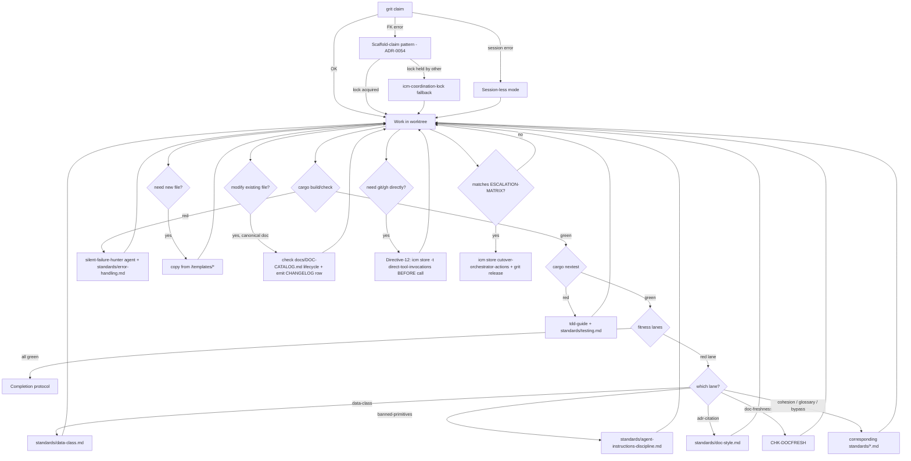

# Agent Decision Tree

Use this page when you are mid-work and an outcome forks. Resolve in-place where you can; halt only when [`ESCALATION-MATRIX.md`](ESCALATION-MATRIX.md) matches.

## Master flowchart



## D1 — `grit claim` fails

| Failure | Resolution |
|---|---|
| Foreign-key error (referenced symbol not yet in symbol-graph) | **Scaffold-claim pattern (ADR-0054).** `icm recall -t scaffold-locks-oyatie -k "<crate path>"`. If no lock, claim a real symbol on the parent crate (e.g. `lib.rs::__scaffold`), write the file skeleton, push it through `grit symbols --refresh`, then claim the real symbol. Emit `icm store -t scaffold-locks-oyatie -c "<crate>: scaffold by <agent>" -i high -k "scaffold,<crate>"`. |
| Lock already held by another agent | **`icm-coordination-lock` fallback.** Run `grit watch --symbol <file::Id>` until release-event arrives OR after 30 min: `icm store -t context-oyatie -c "waiting on <other-agent> for <symbol>; picking next IP" -i medium`, then choose a sibling IP whose symbols are unclaimed. Never force-steal. |
| `grit session` start error (known 0.3.0 bug, RM-05) | **Session-less mode.** Drop `--session` flag; rely on per-agent worktree isolation. Emit `icm store -t errors-resolved -c "grit session start bug; session-less worktree mode" -i high -k "grit,session"`. |

## D2 — `cargo build` / `cargo check` fails

1. Run `oya-tooling-agent-read log` on the build output (no raw `cargo` capture).
2. Invoke the `silent-failure-hunter` reviewer agent against the failing crate.
3. Apply [`docs/standards/error-handling.md`](../../docs/standards/error-handling.md) (`thiserror` in libs; `anyhow`/`eyre` at binary edge; no `unwrap` outside tests).
4. Lane that will block on the same defect: `oya-governance-error-boundary` and `-no-unwrap-prod`.
5. Re-run; if green, store `errors-resolved`; if still red after two iterations and the cause is outside your claim scope, see D8.

## D3 — `cargo nextest` fails

| Failure shape | Resolution |
|---|---|
| New assertion failure in code you wrote | Invoke `tdd-guide`. Fix in worktree per [`docs/standards/testing.md`](../../docs/standards/testing.md). |
| Pre-existing flaky test surfaced | Quarantine to `flaky/` lane with a 14-day fix SLA (per `docs/AGENTS.md` §During-change). Open `MFL-NNNN` row. Do NOT mask. |
| Coverage budget regression | Add tests or extend proptest cases until `-test-evidence` lane green. |

## D4 — A fitness lane is red

Map lane → standard → resolution:

| Lane | Standard | Action |
|---|---|---|
| `oya-governance-data-class` | [`standards/data-class.md`](../standards/data-class.md) | Add `oyatie.data_class = "..."` to every new kernel field. |
| `oya-governance-banned-primitives` | [`standards/agent-instructions-discipline.md`](../standards/agent-instructions-discipline.md) | Move raw `git`/`gh` outside agent-instructions fence OR justify via Directive 12. |
| `oya-governance-adr-citation` | [`standards/doc-style.md`](../standards/doc-style.md) | Cite the governing ADR by ID in PR body `## Traceability`. |
| `oya-governance-doc-freshness` | CHK-DOCFRESH | Update stale doc in this same PR. |
| `oya-governance-cohesion` / `-glossary` / `-bypass` | [`standards/doc-style.md`](../standards/doc-style.md), [`standards/agent-instructions-discipline.md`](../standards/agent-instructions-discipline.md) | Apply the named correction. |
| `oya-governance-lts-dependency` | [`standards/dependency-policy.md`](../standards/dependency-policy.md) | Pin to current LTS or add ADR-tracked exception. |
| `oya-governance-image-discipline` | [`standards/image-discipline.md`](../standards/image-discipline.md) | Switch to distroless; trim layers; rerun. |
| `oya-governance-autonomy-ceiling` | [`standards/autonomy-ceiling.md`](../standards/autonomy-ceiling.md) | Declare T1/T2/T3/T4 + Cedar policy. |
| `oya-governance-audit-emission` | [`standards/observability.md`](../standards/observability.md) | Emit the `EVT-*` row. |

## D5 — Need to invoke `git` or `gh` directly (Directive 12)

```
icm store -t direct-tool-invocations \
  -c "<one-line genuine need: e.g. 'git log --since=2026-05-10 because grit lacks date-range query'>" \
  -i high -k "git,<context>"
# then invoke the raw command
```

Direct invocation is permitted ONLY when no grit/icm primitive exists AND inventing one would be over-engineering (Directive 12). If you repeat the same shape ≥5 times in 30 days, also emit a `MISTAKES-LEDGER` migration-candidate row.

## D6 — Need to create a new file

Pick the matching template under [`/templates/`](../templates/):

| File class | Template ID | Source |
|---|---|---|
| Implementation plan | TPL-IP | `/templates/implementation-plan-template.md` |
| Phase INDEX | TPL-PHASE | `/templates/phase-index-template.md` |
| Milestone INDEX | TPL-MILE | `/templates/milestone-index-template.md` |
| ADR | TPL-ADR | `/templates/adr-template.md` |
| Runbook | TPL-RUNBOOK | `/templates/runbook-template.md` |
| Capability record | TPL-CAP | `/templates/capability-record-template.yaml` |
| Design doc | TPL-DD | `/templates/design-doc-template.md` |
| PRFAQ | TPL-PRFAQ | `/templates/prfaq-template.md` |
| Evidence bundle | TPL-EVB | `/templates/evidence-bundle-template.json` |
| Postmortem | TPL-PM | `/templates/postmortem-template.md` |
| MISTAKES-LEDGER row | TPL-MFL | `/templates/mistakes-ledger-row-template.md` |

Copy the template; fill every required frontmatter field; do not delete `status: pending approval` until lift.

## D7 — Need to modify an existing file

1. Check its lifecycle in [`docs/DOC-CATALOG.md`](../../docs/DOC-CATALOG.md) (per `DOC-UPDATE-PROTOCOL.md`).
2. If canonical (Tier 0/1), emit a `CHANGELOG.md` row in the same PR.
3. If the file is under retired-legacy roots (`modules/`, `services/`, `platform/`, `tools/`) — REFUSE and pick the canonical replacement.

## D8 — Cannot resolve in current claim scope

Release claim cleanly (no halt yet). Pick a sibling IP. Emit:

```
icm store -t context-oyatie -c "<IP> deferred: blocker is <area> outside claim scope; picking <next-IP>" -i medium
grit release --agent <agent-id> --reason "out-of-claim-scope; deferred"
```

This is NOT a halt — autonomy preserved. Halt only when [`ESCALATION-MATRIX.md`](ESCALATION-MATRIX.md) matches.

## D9 — Halt (last resort)

Exact format:

```
icm store -t cutover-orchestrator-actions \
  -c "BLOCKED_ON_HUMAN_ORCHESTRATOR: <case-id from ESCALATION-MATRIX>: <one-line>" \
  -i critical -k "halt,<area>"
grit release --agent <agent-id> --reason "BLOCKED_ON_HUMAN_ORCHESTRATOR: <case-id>"
```

Then exit. The orchestrator's poll of `cutover-orchestrator-actions` will surface the row.
