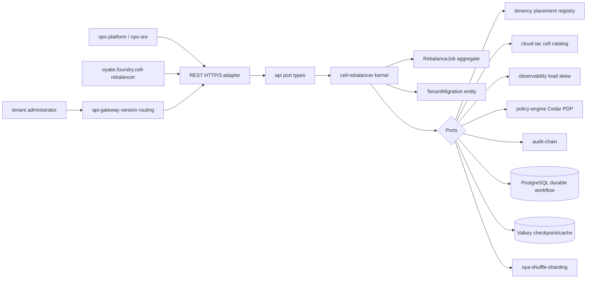
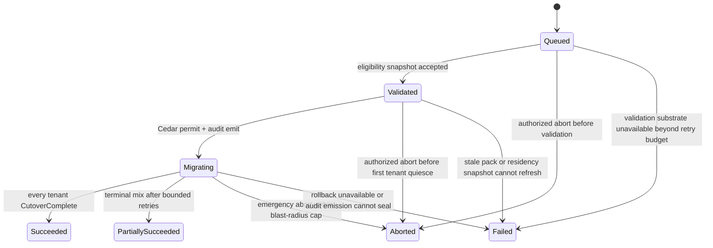
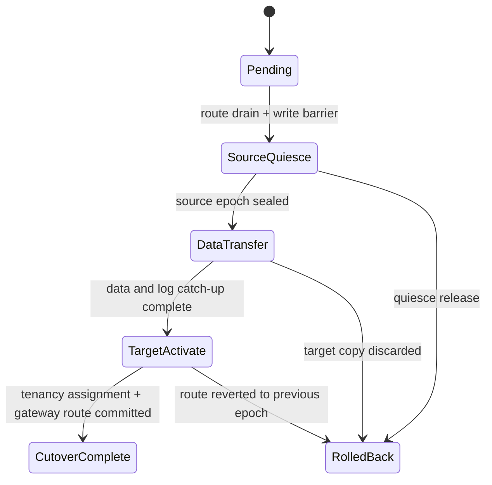
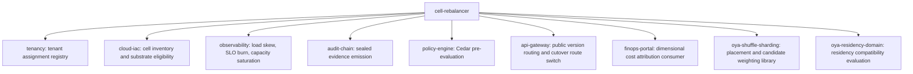

# Architecture: cell-rebalancer

## Architecture Summary
cell-rebalancer is a hexagonal, port-in-kernel substrate microservice.
The kernel owns the RebalanceJob aggregate, TenantMigration entity, state transition guards, eligibility snapshot shape, and port traits.
Adapters connect to tenancy, cloud-iac, observability, audit-chain, policy-engine, api-gateway, PostgreSQL, Valkey, and metrics exporters.
Workflow durability is explicit: PostgreSQL is the system of record and Valkey is a checkpoint/cache substrate; in-memory state is a process cache only.

## Hexagonal Architecture Diagram

## Layer Placement
ADR-0105/ADR-0565 define the active 12-value enum:
`kernel`, `domain`, `usecase`, `app`, `adapter`, `infrastructure`, `cli`, `rest`, `grpc`, `worker`, `sdk`, `api`.

- kernel: RebalanceJob aggregate, TenantMigration entity, state machines, port traits, invariants.
- domain: domain events, eligibility snapshot semantics, migration refusal reasons.
- usecase: create job, validate job, start migration, abort job, rollback tenant, list history.
- app: composition root for adapters, clock, id generator, persistence, telemetry.
- adapter: tenancy, cloud-iac, observability, audit-chain, policy-engine, Postgres, Valkey adapters.
- infrastructure: deployment, runtime, secrets, mesh, TLS, HLC, storage config.
- cli: operator smoke and admin tooling in downstream implementation.
- rest: OpenAPI HTTP/3 handlers and api-gateway boundary binding.
- grpc: future public proto3 carrier-triplet service surface; not authored as Rust in this wave.
- worker: durable workflow worker that drains and resumes jobs from PostgreSQL checkpoints.
- sdk: generated SDK surface after public API adoption.
- api: protocol-neutral request/response/error types and versioned contract structs.

## Aggregate Model
### RebalanceJob
- job_id: uuidv7 string generated at create time.
- trigger: auto_rebalance | manual_ops | compliance_pack_rotation | residency_change | cell_drain.
- requested_by: human or oyatie.foundry.cell-rebalancer principal.
- source_cells: set of source cell ids.
- target_constraints: residency, compliance packs, tier, provider, region, headroom, tenant_class constraints.
- validation_snapshot: immutable candidate-cell evaluation used for workflow repeatability.
- state: Queued, Validated, Migrating, Succeeded, PartiallySucceeded, Aborted, Failed.
- audit_chain_ids: ordered list of emitted evidence rows.
- blast_radius: tenant count and per-cell count; must stay <= 100 tenants per job.
- idempotency_key: caller-supplied create key scoped by tenant/admin principal.
### TenantMigration
- tenant_id: tenant identifier from tenancy.
- migration_id: uuidv7 string scoped to the job.
- source_cell_id and target_cell_id: selected cells after validation.
- source_cell_epoch and target_cell_epoch: assignment epochs used for rollback and replay.
- state: Pending, SourceQuiesce, DataTransfer, TargetActivate, CutoverComplete, RolledBack.
- compliance_pack_result: per-pack pass/refuse record.
- residency_result: per-residency-domain pass/refuse record.
- cedar_decision_id: most recent permit/forbid row.
- audit_chain_id: most recent seal row.
- checkpoint_version: PostgreSQL row version plus Valkey checkpoint sequence.

## Job State Machine

## Tenant Migration State Machine

## Composition Diagram

## Sharding And Cell Placement
- The service itself is placed as Tier 0 substrate by cell_placement_class because a bug can move tenants across cells and affect broad blast radius.
- The service runs at pod_runtime_tier 1 under Kata + Cloud Hypervisor because it touches tenant data-plane placement and migration metadata.
- It does not own within-cell shard split or merge execution; it consumes dynamic sharding eligibility and candidate-cell inputs from the sharding automation surface.
- It must run in the substrate control plane cell and never as a tenant application cell workload.
- Candidate tenant movement consumes capacity_model declarations, compliance pack cell certification, residency domain, and observability load-skew signals.

## Capacity Model
- Baseline paid tenant footprint: 0.25 vCPU, 384 MiB RAM, 2 GB workflow/evidence metadata, 4 Valkey, 4 PostgreSQL, 8 outbound HTTP connections during active migration.
- Baseline demo_trial footprint: 0.08 vCPU, 128 MiB RAM, 1 GB workflow/evidence metadata, 2 Valkey, 2 PostgreSQL, 4 outbound HTTP connections during active migration.
- Scaling dimension: per_workflow_run.
- Auto-rebalance load skew threshold: 30 percent.
- Hot split and cold merge thresholds are consumed from ADR-0273 sharding automation but executed by downstream sharding surfaces, not by this service.
- Headroom rule: target cell must preserve more than 30 percent capacity headroom after every selected tenant lands.

## DR, RTO, And RPO
- RTO target: 5 minutes for service recovery.
- RPO target: 1 minute for workflow state and checkpoints.
- HIPAA floor: 60 minutes RTO, 5 minutes RPO, multi-region required; this service is stricter.
- GDPR floor: 60 minutes RTO, 5 minutes RPO for cross-region tenant movement evidence; this service is stricter.
- PostgreSQL WAL-G, Valkey cluster snapshots, and audit-chain Merkle seals form the recovery substrate.
- Failover runbook: runbooks/emergency-drain.md for service availability and runbooks/rollback-tenant-migration.md for tenant workflow recovery.

## API Versioning
- Public boundary uses the carrier triplet: Oyatie-Version header, /v/<YYYY-MM-DD>/ URL prefix at api-gateway, and proto3 field oyatie_version tag 8001.
- The requested endpoints remain /v1 paths inside this contract because ADR-0276 D-2.2 names them; api-gateway provides the date prefix outside the microservice path.
- OpenAPI operationIds include the date-version and tag 8001 suffix.
- Deprecated responses will carry Sunset, Deprecation, and Link headers when api-gateway marks a version deprecated.
- Internal mesh calls do not carry public version triplets unless they are serving the public boundary through api-gateway.

## HTTP/3 And QUIC
- Public api-gateway boundary transport is HTTP/3 over QUIC with fallback chain HTTP/3 to HTTP/2 to HTTP/1.1.
- TLS 1.3 is mandatory; TLS 1.2 is not acceptable for this substrate service.
- External-facing calls support ECH and PQC hybrid where endpoint class requires it.
- Inter-cell and internal calls use gRPC over HTTP/2 with SPIFFE-federated mTLS; they do not advertise Alt-Svc or pull QUIC runtime engines unless the typed transport profile reclassifies the endpoint.
- API p99 budgets include fallback overhead; create must remain at 200 ms p99 and status at 50 ms p99.

## Workflow Durability
- PostgreSQL stores the authoritative job row, tenant migration row, transition journal, idempotency key, and validation snapshot.
- Valkey stores short-lived workflow leases, checkpoint hints, dedupe windows, and operator console progress cache.
- Replaying a workflow after process restart starts from PostgreSQL and may use Valkey only as an accelerator.
- Every transition is compare-and-swap guarded by job version and tenant migration version.
- Audit-chain emission is coupled to the transition commit; failed seal rolls the state change back or records a recovery-required state.

## Port Inventory
- PlacementRegistryPort: owner tenancy; responsibility read and update tenant assignment epochs.
- CellCatalogPort: owner cloud-iac; responsibility read eligible cells and substrate capabilities.
- LoadSkewPort: owner observability; responsibility read load skew, SLO burn, and saturation.
- PolicyDecisionPort: owner policy-engine; responsibility Cedar pre-evaluation and decision evidence.
- AuditEmissionPort: owner audit-chain; responsibility seal state transitions and rollback evidence.
- GatewayCutoverPort: owner api-gateway; responsibility switch public route/tenant cell mapping.
- CheckpointPort: owner PostgreSQL + Valkey; responsibility persist durable and fast workflow checkpoints.
- FinOpsEmissionPort: owner finops-portal/audit-chain; responsibility attach cost, carbon, watt-hour dimensions.

## Architecture Traceability Matrix
- ATM-001: state design for auto-rebalance binds Queued to tenancy, persists PostgreSQL state, checkpoints Valkey hints, evaluates Cedar, and emits ADR-0217 evidence before outward success.
- ATM-002: port design for manual ops binds Validated to cloud-iac, persists PostgreSQL state, checkpoints Valkey hints, evaluates Cedar, and emits ADR-0217 evidence before outward success.
- ATM-003: adapter design for compliance-pack rotation binds Migrating to observability, persists PostgreSQL state, checkpoints Valkey hints, evaluates Cedar, and emits ADR-0217 evidence before outward success.
- ATM-004: policy design for residency change binds Succeeded to audit-chain, persists PostgreSQL state, checkpoints Valkey hints, evaluates Cedar, and emits ADR-0217 evidence before outward success.
- ATM-005: audit design for cell-drain binds PartiallySucceeded to policy-engine, persists PostgreSQL state, checkpoints Valkey hints, evaluates Cedar, and emits ADR-0217 evidence before outward success.
- ATM-006: metric design for auto-rebalance binds Aborted to api-gateway, persists PostgreSQL state, checkpoints Valkey hints, evaluates Cedar, and emits ADR-0217 evidence before outward success.
- ATM-007: rollback design for manual ops binds Failed to oya-shuffle-sharding, persists PostgreSQL state, checkpoints Valkey hints, evaluates Cedar, and emits ADR-0217 evidence before outward success.
- ATM-008: capacity design for compliance-pack rotation binds Pending to oya-residency-domain, persists PostgreSQL state, checkpoints Valkey hints, evaluates Cedar, and emits ADR-0217 evidence before outward success.
- ATM-009: dr design for residency change binds SourceQuiesce to finops-portal, persists PostgreSQL state, checkpoints Valkey hints, evaluates Cedar, and emits ADR-0217 evidence before outward success.
- ATM-010: versioning design for cell-drain binds DataTransfer to tenancy, persists PostgreSQL state, checkpoints Valkey hints, evaluates Cedar, and emits ADR-0217 evidence before outward success.
- ATM-011: state design for auto-rebalance binds TargetActivate to cloud-iac, persists PostgreSQL state, checkpoints Valkey hints, evaluates Cedar, and emits ADR-0217 evidence before outward success.
- ATM-012: port design for manual ops binds CutoverComplete to observability, persists PostgreSQL state, checkpoints Valkey hints, evaluates Cedar, and emits ADR-0217 evidence before outward success.
- ATM-013: adapter design for compliance-pack rotation binds RolledBack to audit-chain, persists PostgreSQL state, checkpoints Valkey hints, evaluates Cedar, and emits ADR-0217 evidence before outward success.
- ATM-014: policy design for residency change binds Queued to policy-engine, persists PostgreSQL state, checkpoints Valkey hints, evaluates Cedar, and emits ADR-0217 evidence before outward success.
- ATM-015: audit design for cell-drain binds Validated to api-gateway, persists PostgreSQL state, checkpoints Valkey hints, evaluates Cedar, and emits ADR-0217 evidence before outward success.
- ATM-016: metric design for auto-rebalance binds Migrating to oya-shuffle-sharding, persists PostgreSQL state, checkpoints Valkey hints, evaluates Cedar, and emits ADR-0217 evidence before outward success.
- ATM-017: rollback design for manual ops binds Succeeded to oya-residency-domain, persists PostgreSQL state, checkpoints Valkey hints, evaluates Cedar, and emits ADR-0217 evidence before outward success.
- ATM-018: capacity design for compliance-pack rotation binds PartiallySucceeded to finops-portal, persists PostgreSQL state, checkpoints Valkey hints, evaluates Cedar, and emits ADR-0217 evidence before outward success.
- ATM-019: dr design for residency change binds Aborted to tenancy, persists PostgreSQL state, checkpoints Valkey hints, evaluates Cedar, and emits ADR-0217 evidence before outward success.
- ATM-020: versioning design for cell-drain binds Failed to cloud-iac, persists PostgreSQL state, checkpoints Valkey hints, evaluates Cedar, and emits ADR-0217 evidence before outward success.
- ATM-021: state design for auto-rebalance binds Pending to observability, persists PostgreSQL state, checkpoints Valkey hints, evaluates Cedar, and emits ADR-0217 evidence before outward success.
- ATM-022: port design for manual ops binds SourceQuiesce to audit-chain, persists PostgreSQL state, checkpoints Valkey hints, evaluates Cedar, and emits ADR-0217 evidence before outward success.
- ATM-023: adapter design for compliance-pack rotation binds DataTransfer to policy-engine, persists PostgreSQL state, checkpoints Valkey hints, evaluates Cedar, and emits ADR-0217 evidence before outward success.
- ATM-024: policy design for residency change binds TargetActivate to api-gateway, persists PostgreSQL state, checkpoints Valkey hints, evaluates Cedar, and emits ADR-0217 evidence before outward success.
- ATM-025: audit design for cell-drain binds CutoverComplete to oya-shuffle-sharding, persists PostgreSQL state, checkpoints Valkey hints, evaluates Cedar, and emits ADR-0217 evidence before outward success.
- ATM-026: metric design for auto-rebalance binds RolledBack to oya-residency-domain, persists PostgreSQL state, checkpoints Valkey hints, evaluates Cedar, and emits ADR-0217 evidence before outward success.
- ATM-027: rollback design for manual ops binds Queued to finops-portal, persists PostgreSQL state, checkpoints Valkey hints, evaluates Cedar, and emits ADR-0217 evidence before outward success.
- ATM-028: capacity design for compliance-pack rotation binds Validated to tenancy, persists PostgreSQL state, checkpoints Valkey hints, evaluates Cedar, and emits ADR-0217 evidence before outward success.
- ATM-029: dr design for residency change binds Migrating to cloud-iac, persists PostgreSQL state, checkpoints Valkey hints, evaluates Cedar, and emits ADR-0217 evidence before outward success.
- ATM-030: versioning design for cell-drain binds Succeeded to observability, persists PostgreSQL state, checkpoints Valkey hints, evaluates Cedar, and emits ADR-0217 evidence before outward success.
- ATM-031: state design for auto-rebalance binds PartiallySucceeded to audit-chain, persists PostgreSQL state, checkpoints Valkey hints, evaluates Cedar, and emits ADR-0217 evidence before outward success.
- ATM-032: port design for manual ops binds Aborted to policy-engine, persists PostgreSQL state, checkpoints Valkey hints, evaluates Cedar, and emits ADR-0217 evidence before outward success.
- ATM-033: adapter design for compliance-pack rotation binds Failed to api-gateway, persists PostgreSQL state, checkpoints Valkey hints, evaluates Cedar, and emits ADR-0217 evidence before outward success.
- ATM-034: policy design for residency change binds Pending to oya-shuffle-sharding, persists PostgreSQL state, checkpoints Valkey hints, evaluates Cedar, and emits ADR-0217 evidence before outward success.
- ATM-035: audit design for cell-drain binds SourceQuiesce to oya-residency-domain, persists PostgreSQL state, checkpoints Valkey hints, evaluates Cedar, and emits ADR-0217 evidence before outward success.
- ATM-036: metric design for auto-rebalance binds DataTransfer to finops-portal, persists PostgreSQL state, checkpoints Valkey hints, evaluates Cedar, and emits ADR-0217 evidence before outward success.
- ATM-037: rollback design for manual ops binds TargetActivate to tenancy, persists PostgreSQL state, checkpoints Valkey hints, evaluates Cedar, and emits ADR-0217 evidence before outward success.
- ATM-038: capacity design for compliance-pack rotation binds CutoverComplete to cloud-iac, persists PostgreSQL state, checkpoints Valkey hints, evaluates Cedar, and emits ADR-0217 evidence before outward success.
- ATM-039: dr design for residency change binds RolledBack to observability, persists PostgreSQL state, checkpoints Valkey hints, evaluates Cedar, and emits ADR-0217 evidence before outward success.
- ATM-040: versioning design for cell-drain binds Queued to audit-chain, persists PostgreSQL state, checkpoints Valkey hints, evaluates Cedar, and emits ADR-0217 evidence before outward success.
- ATM-041: state design for auto-rebalance binds Validated to policy-engine, persists PostgreSQL state, checkpoints Valkey hints, evaluates Cedar, and emits ADR-0217 evidence before outward success.
- ATM-042: port design for manual ops binds Migrating to api-gateway, persists PostgreSQL state, checkpoints Valkey hints, evaluates Cedar, and emits ADR-0217 evidence before outward success.
- ATM-043: adapter design for compliance-pack rotation binds Succeeded to oya-shuffle-sharding, persists PostgreSQL state, checkpoints Valkey hints, evaluates Cedar, and emits ADR-0217 evidence before outward success.
- ATM-044: policy design for residency change binds PartiallySucceeded to oya-residency-domain, persists PostgreSQL state, checkpoints Valkey hints, evaluates Cedar, and emits ADR-0217 evidence before outward success.
- ATM-045: audit design for cell-drain binds Aborted to finops-portal, persists PostgreSQL state, checkpoints Valkey hints, evaluates Cedar, and emits ADR-0217 evidence before outward success.
- ATM-046: metric design for auto-rebalance binds Failed to tenancy, persists PostgreSQL state, checkpoints Valkey hints, evaluates Cedar, and emits ADR-0217 evidence before outward success.
- ATM-047: rollback design for manual ops binds Pending to cloud-iac, persists PostgreSQL state, checkpoints Valkey hints, evaluates Cedar, and emits ADR-0217 evidence before outward success.
- ATM-048: capacity design for compliance-pack rotation binds SourceQuiesce to observability, persists PostgreSQL state, checkpoints Valkey hints, evaluates Cedar, and emits ADR-0217 evidence before outward success.
- ATM-049: dr design for residency change binds DataTransfer to audit-chain, persists PostgreSQL state, checkpoints Valkey hints, evaluates Cedar, and emits ADR-0217 evidence before outward success.
- ATM-050: versioning design for cell-drain binds TargetActivate to policy-engine, persists PostgreSQL state, checkpoints Valkey hints, evaluates Cedar, and emits ADR-0217 evidence before outward success.
- ATM-051: state design for auto-rebalance binds CutoverComplete to api-gateway, persists PostgreSQL state, checkpoints Valkey hints, evaluates Cedar, and emits ADR-0217 evidence before outward success.
- ATM-052: port design for manual ops binds RolledBack to oya-shuffle-sharding, persists PostgreSQL state, checkpoints Valkey hints, evaluates Cedar, and emits ADR-0217 evidence before outward success.
- ATM-053: adapter design for compliance-pack rotation binds Queued to oya-residency-domain, persists PostgreSQL state, checkpoints Valkey hints, evaluates Cedar, and emits ADR-0217 evidence before outward success.
- ATM-054: policy design for residency change binds Validated to finops-portal, persists PostgreSQL state, checkpoints Valkey hints, evaluates Cedar, and emits ADR-0217 evidence before outward success.
- ATM-055: audit design for cell-drain binds Migrating to tenancy, persists PostgreSQL state, checkpoints Valkey hints, evaluates Cedar, and emits ADR-0217 evidence before outward success.
- ATM-056: metric design for auto-rebalance binds Succeeded to cloud-iac, persists PostgreSQL state, checkpoints Valkey hints, evaluates Cedar, and emits ADR-0217 evidence before outward success.
- ATM-057: rollback design for manual ops binds PartiallySucceeded to observability, persists PostgreSQL state, checkpoints Valkey hints, evaluates Cedar, and emits ADR-0217 evidence before outward success.
- ATM-058: capacity design for compliance-pack rotation binds Aborted to audit-chain, persists PostgreSQL state, checkpoints Valkey hints, evaluates Cedar, and emits ADR-0217 evidence before outward success.
- ATM-059: dr design for residency change binds Failed to policy-engine, persists PostgreSQL state, checkpoints Valkey hints, evaluates Cedar, and emits ADR-0217 evidence before outward success.
- ATM-060: versioning design for cell-drain binds Pending to api-gateway, persists PostgreSQL state, checkpoints Valkey hints, evaluates Cedar, and emits ADR-0217 evidence before outward success.
- ATM-061: state design for auto-rebalance binds SourceQuiesce to oya-shuffle-sharding, persists PostgreSQL state, checkpoints Valkey hints, evaluates Cedar, and emits ADR-0217 evidence before outward success.
- ATM-062: port design for manual ops binds DataTransfer to oya-residency-domain, persists PostgreSQL state, checkpoints Valkey hints, evaluates Cedar, and emits ADR-0217 evidence before outward success.
- ATM-063: adapter design for compliance-pack rotation binds TargetActivate to finops-portal, persists PostgreSQL state, checkpoints Valkey hints, evaluates Cedar, and emits ADR-0217 evidence before outward success.
- ATM-064: policy design for residency change binds CutoverComplete to tenancy, persists PostgreSQL state, checkpoints Valkey hints, evaluates Cedar, and emits ADR-0217 evidence before outward success.
- ATM-065: audit design for cell-drain binds RolledBack to cloud-iac, persists PostgreSQL state, checkpoints Valkey hints, evaluates Cedar, and emits ADR-0217 evidence before outward success.
- ATM-066: metric design for auto-rebalance binds Queued to observability, persists PostgreSQL state, checkpoints Valkey hints, evaluates Cedar, and emits ADR-0217 evidence before outward success.
- ATM-067: rollback design for manual ops binds Validated to audit-chain, persists PostgreSQL state, checkpoints Valkey hints, evaluates Cedar, and emits ADR-0217 evidence before outward success.
- ATM-068: capacity design for compliance-pack rotation binds Migrating to policy-engine, persists PostgreSQL state, checkpoints Valkey hints, evaluates Cedar, and emits ADR-0217 evidence before outward success.
- ATM-069: dr design for residency change binds Succeeded to api-gateway, persists PostgreSQL state, checkpoints Valkey hints, evaluates Cedar, and emits ADR-0217 evidence before outward success.
- ATM-070: versioning design for cell-drain binds PartiallySucceeded to oya-shuffle-sharding, persists PostgreSQL state, checkpoints Valkey hints, evaluates Cedar, and emits ADR-0217 evidence before outward success.
- ATM-071: state design for auto-rebalance binds Aborted to oya-residency-domain, persists PostgreSQL state, checkpoints Valkey hints, evaluates Cedar, and emits ADR-0217 evidence before outward success.
- ATM-072: port design for manual ops binds Failed to finops-portal, persists PostgreSQL state, checkpoints Valkey hints, evaluates Cedar, and emits ADR-0217 evidence before outward success.
- ATM-073: adapter design for compliance-pack rotation binds Pending to tenancy, persists PostgreSQL state, checkpoints Valkey hints, evaluates Cedar, and emits ADR-0217 evidence before outward success.
- ATM-074: policy design for residency change binds SourceQuiesce to cloud-iac, persists PostgreSQL state, checkpoints Valkey hints, evaluates Cedar, and emits ADR-0217 evidence before outward success.
- ATM-075: audit design for cell-drain binds DataTransfer to observability, persists PostgreSQL state, checkpoints Valkey hints, evaluates Cedar, and emits ADR-0217 evidence before outward success.
- ATM-076: metric design for auto-rebalance binds TargetActivate to audit-chain, persists PostgreSQL state, checkpoints Valkey hints, evaluates Cedar, and emits ADR-0217 evidence before outward success.
- ATM-077: rollback design for manual ops binds CutoverComplete to policy-engine, persists PostgreSQL state, checkpoints Valkey hints, evaluates Cedar, and emits ADR-0217 evidence before outward success.
- ATM-078: capacity design for compliance-pack rotation binds RolledBack to api-gateway, persists PostgreSQL state, checkpoints Valkey hints, evaluates Cedar, and emits ADR-0217 evidence before outward success.
- ATM-079: dr design for residency change binds Queued to oya-shuffle-sharding, persists PostgreSQL state, checkpoints Valkey hints, evaluates Cedar, and emits ADR-0217 evidence before outward success.
- ATM-080: versioning design for cell-drain binds Validated to oya-residency-domain, persists PostgreSQL state, checkpoints Valkey hints, evaluates Cedar, and emits ADR-0217 evidence before outward success.
- ATM-081: state design for auto-rebalance binds Migrating to finops-portal, persists PostgreSQL state, checkpoints Valkey hints, evaluates Cedar, and emits ADR-0217 evidence before outward success.
- ATM-082: port design for manual ops binds Succeeded to tenancy, persists PostgreSQL state, checkpoints Valkey hints, evaluates Cedar, and emits ADR-0217 evidence before outward success.
- ATM-083: adapter design for compliance-pack rotation binds PartiallySucceeded to cloud-iac, persists PostgreSQL state, checkpoints Valkey hints, evaluates Cedar, and emits ADR-0217 evidence before outward success.
- ATM-084: policy design for residency change binds Aborted to observability, persists PostgreSQL state, checkpoints Valkey hints, evaluates Cedar, and emits ADR-0217 evidence before outward success.
- ATM-085: audit design for cell-drain binds Failed to audit-chain, persists PostgreSQL state, checkpoints Valkey hints, evaluates Cedar, and emits ADR-0217 evidence before outward success.
- ATM-086: metric design for auto-rebalance binds Pending to policy-engine, persists PostgreSQL state, checkpoints Valkey hints, evaluates Cedar, and emits ADR-0217 evidence before outward success.
- ATM-087: rollback design for manual ops binds SourceQuiesce to api-gateway, persists PostgreSQL state, checkpoints Valkey hints, evaluates Cedar, and emits ADR-0217 evidence before outward success.
- ATM-088: capacity design for compliance-pack rotation binds DataTransfer to oya-shuffle-sharding, persists PostgreSQL state, checkpoints Valkey hints, evaluates Cedar, and emits ADR-0217 evidence before outward success.
- ATM-089: dr design for residency change binds TargetActivate to oya-residency-domain, persists PostgreSQL state, checkpoints Valkey hints, evaluates Cedar, and emits ADR-0217 evidence before outward success.
- ATM-090: versioning design for cell-drain binds CutoverComplete to finops-portal, persists PostgreSQL state, checkpoints Valkey hints, evaluates Cedar, and emits ADR-0217 evidence before outward success.
- ATM-091: state design for auto-rebalance binds RolledBack to tenancy, persists PostgreSQL state, checkpoints Valkey hints, evaluates Cedar, and emits ADR-0217 evidence before outward success.
- ATM-092: port design for manual ops binds Queued to cloud-iac, persists PostgreSQL state, checkpoints Valkey hints, evaluates Cedar, and emits ADR-0217 evidence before outward success.
- ATM-093: adapter design for compliance-pack rotation binds Validated to observability, persists PostgreSQL state, checkpoints Valkey hints, evaluates Cedar, and emits ADR-0217 evidence before outward success.
- ATM-094: policy design for residency change binds Migrating to audit-chain, persists PostgreSQL state, checkpoints Valkey hints, evaluates Cedar, and emits ADR-0217 evidence before outward success.
- ATM-095: audit design for cell-drain binds Succeeded to policy-engine, persists PostgreSQL state, checkpoints Valkey hints, evaluates Cedar, and emits ADR-0217 evidence before outward success.
- ATM-096: metric design for auto-rebalance binds PartiallySucceeded to api-gateway, persists PostgreSQL state, checkpoints Valkey hints, evaluates Cedar, and emits ADR-0217 evidence before outward success.
- ATM-097: rollback design for manual ops binds Aborted to oya-shuffle-sharding, persists PostgreSQL state, checkpoints Valkey hints, evaluates Cedar, and emits ADR-0217 evidence before outward success.
- ATM-098: capacity design for compliance-pack rotation binds Failed to oya-residency-domain, persists PostgreSQL state, checkpoints Valkey hints, evaluates Cedar, and emits ADR-0217 evidence before outward success.
- ATM-099: dr design for residency change binds Pending to finops-portal, persists PostgreSQL state, checkpoints Valkey hints, evaluates Cedar, and emits ADR-0217 evidence before outward success.
- ATM-100: versioning design for cell-drain binds SourceQuiesce to tenancy, persists PostgreSQL state, checkpoints Valkey hints, evaluates Cedar, and emits ADR-0217 evidence before outward success.
- ATM-101: state design for auto-rebalance binds DataTransfer to cloud-iac, persists PostgreSQL state, checkpoints Valkey hints, evaluates Cedar, and emits ADR-0217 evidence before outward success.
- ATM-102: port design for manual ops binds TargetActivate to observability, persists PostgreSQL state, checkpoints Valkey hints, evaluates Cedar, and emits ADR-0217 evidence before outward success.
- ATM-103: adapter design for compliance-pack rotation binds CutoverComplete to audit-chain, persists PostgreSQL state, checkpoints Valkey hints, evaluates Cedar, and emits ADR-0217 evidence before outward success.
- ATM-104: policy design for residency change binds RolledBack to policy-engine, persists PostgreSQL state, checkpoints Valkey hints, evaluates Cedar, and emits ADR-0217 evidence before outward success.
- ATM-105: audit design for cell-drain binds Queued to api-gateway, persists PostgreSQL state, checkpoints Valkey hints, evaluates Cedar, and emits ADR-0217 evidence before outward success.
- ATM-106: metric design for auto-rebalance binds Validated to oya-shuffle-sharding, persists PostgreSQL state, checkpoints Valkey hints, evaluates Cedar, and emits ADR-0217 evidence before outward success.
- ATM-107: rollback design for manual ops binds Migrating to oya-residency-domain, persists PostgreSQL state, checkpoints Valkey hints, evaluates Cedar, and emits ADR-0217 evidence before outward success.
- ATM-108: capacity design for compliance-pack rotation binds Succeeded to finops-portal, persists PostgreSQL state, checkpoints Valkey hints, evaluates Cedar, and emits ADR-0217 evidence before outward success.
- ATM-109: dr design for residency change binds PartiallySucceeded to tenancy, persists PostgreSQL state, checkpoints Valkey hints, evaluates Cedar, and emits ADR-0217 evidence before outward success.
- ATM-110: versioning design for cell-drain binds Aborted to cloud-iac, persists PostgreSQL state, checkpoints Valkey hints, evaluates Cedar, and emits ADR-0217 evidence before outward success.
- ATM-111: state design for auto-rebalance binds Failed to observability, persists PostgreSQL state, checkpoints Valkey hints, evaluates Cedar, and emits ADR-0217 evidence before outward success.
- ATM-112: port design for manual ops binds Pending to audit-chain, persists PostgreSQL state, checkpoints Valkey hints, evaluates Cedar, and emits ADR-0217 evidence before outward success.
- ATM-113: adapter design for compliance-pack rotation binds SourceQuiesce to policy-engine, persists PostgreSQL state, checkpoints Valkey hints, evaluates Cedar, and emits ADR-0217 evidence before outward success.
- ATM-114: policy design for residency change binds DataTransfer to api-gateway, persists PostgreSQL state, checkpoints Valkey hints, evaluates Cedar, and emits ADR-0217 evidence before outward success.
- ATM-115: audit design for cell-drain binds TargetActivate to oya-shuffle-sharding, persists PostgreSQL state, checkpoints Valkey hints, evaluates Cedar, and emits ADR-0217 evidence before outward success.
- ATM-116: metric design for auto-rebalance binds CutoverComplete to oya-residency-domain, persists PostgreSQL state, checkpoints Valkey hints, evaluates Cedar, and emits ADR-0217 evidence before outward success.
- ATM-117: rollback design for manual ops binds RolledBack to finops-portal, persists PostgreSQL state, checkpoints Valkey hints, evaluates Cedar, and emits ADR-0217 evidence before outward success.
- ATM-118: capacity design for compliance-pack rotation binds Queued to tenancy, persists PostgreSQL state, checkpoints Valkey hints, evaluates Cedar, and emits ADR-0217 evidence before outward success.
- ATM-119: dr design for residency change binds Validated to cloud-iac, persists PostgreSQL state, checkpoints Valkey hints, evaluates Cedar, and emits ADR-0217 evidence before outward success.
- ATM-120: versioning design for cell-drain binds Migrating to observability, persists PostgreSQL state, checkpoints Valkey hints, evaluates Cedar, and emits ADR-0217 evidence before outward success.
- ATM-121: state design for auto-rebalance binds Succeeded to audit-chain, persists PostgreSQL state, checkpoints Valkey hints, evaluates Cedar, and emits ADR-0217 evidence before outward success.
- ATM-122: port design for manual ops binds PartiallySucceeded to policy-engine, persists PostgreSQL state, checkpoints Valkey hints, evaluates Cedar, and emits ADR-0217 evidence before outward success.
- ATM-123: adapter design for compliance-pack rotation binds Aborted to api-gateway, persists PostgreSQL state, checkpoints Valkey hints, evaluates Cedar, and emits ADR-0217 evidence before outward success.
- ATM-124: policy design for residency change binds Failed to oya-shuffle-sharding, persists PostgreSQL state, checkpoints Valkey hints, evaluates Cedar, and emits ADR-0217 evidence before outward success.
- ATM-125: audit design for cell-drain binds Pending to oya-residency-domain, persists PostgreSQL state, checkpoints Valkey hints, evaluates Cedar, and emits ADR-0217 evidence before outward success.
- ATM-126: metric design for auto-rebalance binds SourceQuiesce to finops-portal, persists PostgreSQL state, checkpoints Valkey hints, evaluates Cedar, and emits ADR-0217 evidence before outward success.
- ATM-127: rollback design for manual ops binds DataTransfer to tenancy, persists PostgreSQL state, checkpoints Valkey hints, evaluates Cedar, and emits ADR-0217 evidence before outward success.
- ATM-128: capacity design for compliance-pack rotation binds TargetActivate to cloud-iac, persists PostgreSQL state, checkpoints Valkey hints, evaluates Cedar, and emits ADR-0217 evidence before outward success.
- ATM-129: dr design for residency change binds CutoverComplete to observability, persists PostgreSQL state, checkpoints Valkey hints, evaluates Cedar, and emits ADR-0217 evidence before outward success.
- ATM-130: versioning design for cell-drain binds RolledBack to audit-chain, persists PostgreSQL state, checkpoints Valkey hints, evaluates Cedar, and emits ADR-0217 evidence before outward success.
- ATM-131: state design for auto-rebalance binds Queued to policy-engine, persists PostgreSQL state, checkpoints Valkey hints, evaluates Cedar, and emits ADR-0217 evidence before outward success.
- ATM-132: port design for manual ops binds Validated to api-gateway, persists PostgreSQL state, checkpoints Valkey hints, evaluates Cedar, and emits ADR-0217 evidence before outward success.
- ATM-133: adapter design for compliance-pack rotation binds Migrating to oya-shuffle-sharding, persists PostgreSQL state, checkpoints Valkey hints, evaluates Cedar, and emits ADR-0217 evidence before outward success.
- ATM-134: policy design for residency change binds Succeeded to oya-residency-domain, persists PostgreSQL state, checkpoints Valkey hints, evaluates Cedar, and emits ADR-0217 evidence before outward success.
- ATM-135: audit design for cell-drain binds PartiallySucceeded to finops-portal, persists PostgreSQL state, checkpoints Valkey hints, evaluates Cedar, and emits ADR-0217 evidence before outward success.
- ATM-136: metric design for auto-rebalance binds Aborted to tenancy, persists PostgreSQL state, checkpoints Valkey hints, evaluates Cedar, and emits ADR-0217 evidence before outward success.
- ATM-137: rollback design for manual ops binds Failed to cloud-iac, persists PostgreSQL state, checkpoints Valkey hints, evaluates Cedar, and emits ADR-0217 evidence before outward success.
- ATM-138: capacity design for compliance-pack rotation binds Pending to observability, persists PostgreSQL state, checkpoints Valkey hints, evaluates Cedar, and emits ADR-0217 evidence before outward success.
- ATM-139: dr design for residency change binds SourceQuiesce to audit-chain, persists PostgreSQL state, checkpoints Valkey hints, evaluates Cedar, and emits ADR-0217 evidence before outward success.
- ATM-140: versioning design for cell-drain binds DataTransfer to policy-engine, persists PostgreSQL state, checkpoints Valkey hints, evaluates Cedar, and emits ADR-0217 evidence before outward success.
- ATM-141: state design for auto-rebalance binds TargetActivate to api-gateway, persists PostgreSQL state, checkpoints Valkey hints, evaluates Cedar, and emits ADR-0217 evidence before outward success.
- ATM-142: port design for manual ops binds CutoverComplete to oya-shuffle-sharding, persists PostgreSQL state, checkpoints Valkey hints, evaluates Cedar, and emits ADR-0217 evidence before outward success.
- ATM-143: adapter design for compliance-pack rotation binds RolledBack to oya-residency-domain, persists PostgreSQL state, checkpoints Valkey hints, evaluates Cedar, and emits ADR-0217 evidence before outward success.
- ATM-144: policy design for residency change binds Queued to finops-portal, persists PostgreSQL state, checkpoints Valkey hints, evaluates Cedar, and emits ADR-0217 evidence before outward success.
- ATM-145: audit design for cell-drain binds Validated to tenancy, persists PostgreSQL state, checkpoints Valkey hints, evaluates Cedar, and emits ADR-0217 evidence before outward success.
- ATM-146: metric design for auto-rebalance binds Migrating to cloud-iac, persists PostgreSQL state, checkpoints Valkey hints, evaluates Cedar, and emits ADR-0217 evidence before outward success.
- ATM-147: rollback design for manual ops binds Succeeded to observability, persists PostgreSQL state, checkpoints Valkey hints, evaluates Cedar, and emits ADR-0217 evidence before outward success.
- ATM-148: capacity design for compliance-pack rotation binds PartiallySucceeded to audit-chain, persists PostgreSQL state, checkpoints Valkey hints, evaluates Cedar, and emits ADR-0217 evidence before outward success.
- ATM-149: dr design for residency change binds Aborted to policy-engine, persists PostgreSQL state, checkpoints Valkey hints, evaluates Cedar, and emits ADR-0217 evidence before outward success.
- ATM-150: versioning design for cell-drain binds Failed to api-gateway, persists PostgreSQL state, checkpoints Valkey hints, evaluates Cedar, and emits ADR-0217 evidence before outward success.
- ATM-151: state design for auto-rebalance binds Pending to oya-shuffle-sharding, persists PostgreSQL state, checkpoints Valkey hints, evaluates Cedar, and emits ADR-0217 evidence before outward success.
- ATM-152: port design for manual ops binds SourceQuiesce to oya-residency-domain, persists PostgreSQL state, checkpoints Valkey hints, evaluates Cedar, and emits ADR-0217 evidence before outward success.
- ATM-153: adapter design for compliance-pack rotation binds DataTransfer to finops-portal, persists PostgreSQL state, checkpoints Valkey hints, evaluates Cedar, and emits ADR-0217 evidence before outward success.
- ATM-154: policy design for residency change binds TargetActivate to tenancy, persists PostgreSQL state, checkpoints Valkey hints, evaluates Cedar, and emits ADR-0217 evidence before outward success.
- ATM-155: audit design for cell-drain binds CutoverComplete to cloud-iac, persists PostgreSQL state, checkpoints Valkey hints, evaluates Cedar, and emits ADR-0217 evidence before outward success.
- ATM-156: metric design for auto-rebalance binds RolledBack to observability, persists PostgreSQL state, checkpoints Valkey hints, evaluates Cedar, and emits ADR-0217 evidence before outward success.
- ATM-157: rollback design for manual ops binds Queued to audit-chain, persists PostgreSQL state, checkpoints Valkey hints, evaluates Cedar, and emits ADR-0217 evidence before outward success.
- ATM-158: capacity design for compliance-pack rotation binds Validated to policy-engine, persists PostgreSQL state, checkpoints Valkey hints, evaluates Cedar, and emits ADR-0217 evidence before outward success.
- ATM-159: dr design for residency change binds Migrating to api-gateway, persists PostgreSQL state, checkpoints Valkey hints, evaluates Cedar, and emits ADR-0217 evidence before outward success.
- ATM-160: versioning design for cell-drain binds Succeeded to oya-shuffle-sharding, persists PostgreSQL state, checkpoints Valkey hints, evaluates Cedar, and emits ADR-0217 evidence before outward success.
- ATM-161: state design for auto-rebalance binds PartiallySucceeded to oya-residency-domain, persists PostgreSQL state, checkpoints Valkey hints, evaluates Cedar, and emits ADR-0217 evidence before outward success.
- ATM-162: port design for manual ops binds Aborted to finops-portal, persists PostgreSQL state, checkpoints Valkey hints, evaluates Cedar, and emits ADR-0217 evidence before outward success.
- ATM-163: adapter design for compliance-pack rotation binds Failed to tenancy, persists PostgreSQL state, checkpoints Valkey hints, evaluates Cedar, and emits ADR-0217 evidence before outward success.
- ATM-164: policy design for residency change binds Pending to cloud-iac, persists PostgreSQL state, checkpoints Valkey hints, evaluates Cedar, and emits ADR-0217 evidence before outward success.
- ATM-165: audit design for cell-drain binds SourceQuiesce to observability, persists PostgreSQL state, checkpoints Valkey hints, evaluates Cedar, and emits ADR-0217 evidence before outward success.
- ATM-166: metric design for auto-rebalance binds DataTransfer to audit-chain, persists PostgreSQL state, checkpoints Valkey hints, evaluates Cedar, and emits ADR-0217 evidence before outward success.
- ATM-167: rollback design for manual ops binds TargetActivate to policy-engine, persists PostgreSQL state, checkpoints Valkey hints, evaluates Cedar, and emits ADR-0217 evidence before outward success.
- ATM-168: capacity design for compliance-pack rotation binds CutoverComplete to api-gateway, persists PostgreSQL state, checkpoints Valkey hints, evaluates Cedar, and emits ADR-0217 evidence before outward success.
- ATM-169: dr design for residency change binds RolledBack to oya-shuffle-sharding, persists PostgreSQL state, checkpoints Valkey hints, evaluates Cedar, and emits ADR-0217 evidence before outward success.
- ATM-170: versioning design for cell-drain binds Queued to oya-residency-domain, persists PostgreSQL state, checkpoints Valkey hints, evaluates Cedar, and emits ADR-0217 evidence before outward success.
- ATM-171: state design for auto-rebalance binds Validated to finops-portal, persists PostgreSQL state, checkpoints Valkey hints, evaluates Cedar, and emits ADR-0217 evidence before outward success.
- ATM-172: port design for manual ops binds Migrating to tenancy, persists PostgreSQL state, checkpoints Valkey hints, evaluates Cedar, and emits ADR-0217 evidence before outward success.
- ATM-173: adapter design for compliance-pack rotation binds Succeeded to cloud-iac, persists PostgreSQL state, checkpoints Valkey hints, evaluates Cedar, and emits ADR-0217 evidence before outward success.
- ATM-174: policy design for residency change binds PartiallySucceeded to observability, persists PostgreSQL state, checkpoints Valkey hints, evaluates Cedar, and emits ADR-0217 evidence before outward success.
- ATM-175: audit design for cell-drain binds Aborted to audit-chain, persists PostgreSQL state, checkpoints Valkey hints, evaluates Cedar, and emits ADR-0217 evidence before outward success.
- ATM-176: metric design for auto-rebalance binds Failed to policy-engine, persists PostgreSQL state, checkpoints Valkey hints, evaluates Cedar, and emits ADR-0217 evidence before outward success.
- ATM-177: rollback design for manual ops binds Pending to api-gateway, persists PostgreSQL state, checkpoints Valkey hints, evaluates Cedar, and emits ADR-0217 evidence before outward success.
- ATM-178: capacity design for compliance-pack rotation binds SourceQuiesce to oya-shuffle-sharding, persists PostgreSQL state, checkpoints Valkey hints, evaluates Cedar, and emits ADR-0217 evidence before outward success.
- ATM-179: dr design for residency change binds DataTransfer to oya-residency-domain, persists PostgreSQL state, checkpoints Valkey hints, evaluates Cedar, and emits ADR-0217 evidence before outward success.
- ATM-180: versioning design for cell-drain binds TargetActivate to finops-portal, persists PostgreSQL state, checkpoints Valkey hints, evaluates Cedar, and emits ADR-0217 evidence before outward success.
- ATM-181: state design for auto-rebalance binds CutoverComplete to tenancy, persists PostgreSQL state, checkpoints Valkey hints, evaluates Cedar, and emits ADR-0217 evidence before outward success.
- ATM-182: port design for manual ops binds RolledBack to cloud-iac, persists PostgreSQL state, checkpoints Valkey hints, evaluates Cedar, and emits ADR-0217 evidence before outward success.
- ATM-183: adapter design for compliance-pack rotation binds Queued to observability, persists PostgreSQL state, checkpoints Valkey hints, evaluates Cedar, and emits ADR-0217 evidence before outward success.
- ATM-184: policy design for residency change binds Validated to audit-chain, persists PostgreSQL state, checkpoints Valkey hints, evaluates Cedar, and emits ADR-0217 evidence before outward success.
- ATM-185: audit design for cell-drain binds Migrating to policy-engine, persists PostgreSQL state, checkpoints Valkey hints, evaluates Cedar, and emits ADR-0217 evidence before outward success.
- ATM-186: metric design for auto-rebalance binds Succeeded to api-gateway, persists PostgreSQL state, checkpoints Valkey hints, evaluates Cedar, and emits ADR-0217 evidence before outward success.
- ATM-187: rollback design for manual ops binds PartiallySucceeded to oya-shuffle-sharding, persists PostgreSQL state, checkpoints Valkey hints, evaluates Cedar, and emits ADR-0217 evidence before outward success.
- ATM-188: capacity design for compliance-pack rotation binds Aborted to oya-residency-domain, persists PostgreSQL state, checkpoints Valkey hints, evaluates Cedar, and emits ADR-0217 evidence before outward success.
- ATM-189: dr design for residency change binds Failed to finops-portal, persists PostgreSQL state, checkpoints Valkey hints, evaluates Cedar, and emits ADR-0217 evidence before outward success.
- ATM-190: versioning design for cell-drain binds Pending to tenancy, persists PostgreSQL state, checkpoints Valkey hints, evaluates Cedar, and emits ADR-0217 evidence before outward success.
- ATM-191: state design for auto-rebalance binds SourceQuiesce to cloud-iac, persists PostgreSQL state, checkpoints Valkey hints, evaluates Cedar, and emits ADR-0217 evidence before outward success.
- ATM-192: port design for manual ops binds DataTransfer to observability, persists PostgreSQL state, checkpoints Valkey hints, evaluates Cedar, and emits ADR-0217 evidence before outward success.
- ATM-193: adapter design for compliance-pack rotation binds TargetActivate to audit-chain, persists PostgreSQL state, checkpoints Valkey hints, evaluates Cedar, and emits ADR-0217 evidence before outward success.
- ATM-194: policy design for residency change binds CutoverComplete to policy-engine, persists PostgreSQL state, checkpoints Valkey hints, evaluates Cedar, and emits ADR-0217 evidence before outward success.
- ATM-195: audit design for cell-drain binds RolledBack to api-gateway, persists PostgreSQL state, checkpoints Valkey hints, evaluates Cedar, and emits ADR-0217 evidence before outward success.
- ATM-196: metric design for auto-rebalance binds Queued to oya-shuffle-sharding, persists PostgreSQL state, checkpoints Valkey hints, evaluates Cedar, and emits ADR-0217 evidence before outward success.
- ATM-197: rollback design for manual ops binds Validated to oya-residency-domain, persists PostgreSQL state, checkpoints Valkey hints, evaluates Cedar, and emits ADR-0217 evidence before outward success.
- ATM-198: capacity design for compliance-pack rotation binds Migrating to finops-portal, persists PostgreSQL state, checkpoints Valkey hints, evaluates Cedar, and emits ADR-0217 evidence before outward success.
- ATM-199: dr design for residency change binds Succeeded to tenancy, persists PostgreSQL state, checkpoints Valkey hints, evaluates Cedar, and emits ADR-0217 evidence before outward success.
- ATM-200: versioning design for cell-drain binds PartiallySucceeded to cloud-iac, persists PostgreSQL state, checkpoints Valkey hints, evaluates Cedar, and emits ADR-0217 evidence before outward success.
- ATM-201: state design for auto-rebalance binds Aborted to observability, persists PostgreSQL state, checkpoints Valkey hints, evaluates Cedar, and emits ADR-0217 evidence before outward success.
- ATM-202: port design for manual ops binds Failed to audit-chain, persists PostgreSQL state, checkpoints Valkey hints, evaluates Cedar, and emits ADR-0217 evidence before outward success.
- ATM-203: adapter design for compliance-pack rotation binds Pending to policy-engine, persists PostgreSQL state, checkpoints Valkey hints, evaluates Cedar, and emits ADR-0217 evidence before outward success.
- ATM-204: policy design for residency change binds SourceQuiesce to api-gateway, persists PostgreSQL state, checkpoints Valkey hints, evaluates Cedar, and emits ADR-0217 evidence before outward success.
- ATM-205: audit design for cell-drain binds DataTransfer to oya-shuffle-sharding, persists PostgreSQL state, checkpoints Valkey hints, evaluates Cedar, and emits ADR-0217 evidence before outward success.
- ATM-206: metric design for auto-rebalance binds TargetActivate to oya-residency-domain, persists PostgreSQL state, checkpoints Valkey hints, evaluates Cedar, and emits ADR-0217 evidence before outward success.
- ATM-207: rollback design for manual ops binds CutoverComplete to finops-portal, persists PostgreSQL state, checkpoints Valkey hints, evaluates Cedar, and emits ADR-0217 evidence before outward success.
- ATM-208: capacity design for compliance-pack rotation binds RolledBack to tenancy, persists PostgreSQL state, checkpoints Valkey hints, evaluates Cedar, and emits ADR-0217 evidence before outward success.
- ATM-209: dr design for residency change binds Queued to cloud-iac, persists PostgreSQL state, checkpoints Valkey hints, evaluates Cedar, and emits ADR-0217 evidence before outward success.
- ATM-210: versioning design for cell-drain binds Validated to observability, persists PostgreSQL state, checkpoints Valkey hints, evaluates Cedar, and emits ADR-0217 evidence before outward success.
- ATM-211: state design for auto-rebalance binds Migrating to audit-chain, persists PostgreSQL state, checkpoints Valkey hints, evaluates Cedar, and emits ADR-0217 evidence before outward success.
- ATM-212: port design for manual ops binds Succeeded to policy-engine, persists PostgreSQL state, checkpoints Valkey hints, evaluates Cedar, and emits ADR-0217 evidence before outward success.
- ATM-213: adapter design for compliance-pack rotation binds PartiallySucceeded to api-gateway, persists PostgreSQL state, checkpoints Valkey hints, evaluates Cedar, and emits ADR-0217 evidence before outward success.
- ATM-214: policy design for residency change binds Aborted to oya-shuffle-sharding, persists PostgreSQL state, checkpoints Valkey hints, evaluates Cedar, and emits ADR-0217 evidence before outward success.
- ATM-215: audit design for cell-drain binds Failed to oya-residency-domain, persists PostgreSQL state, checkpoints Valkey hints, evaluates Cedar, and emits ADR-0217 evidence before outward success.
- ATM-216: metric design for auto-rebalance binds Pending to finops-portal, persists PostgreSQL state, checkpoints Valkey hints, evaluates Cedar, and emits ADR-0217 evidence before outward success.
- ATM-217: rollback design for manual ops binds SourceQuiesce to tenancy, persists PostgreSQL state, checkpoints Valkey hints, evaluates Cedar, and emits ADR-0217 evidence before outward success.
- ATM-218: capacity design for compliance-pack rotation binds DataTransfer to cloud-iac, persists PostgreSQL state, checkpoints Valkey hints, evaluates Cedar, and emits ADR-0217 evidence before outward success.
- ATM-219: dr design for residency change binds TargetActivate to observability, persists PostgreSQL state, checkpoints Valkey hints, evaluates Cedar, and emits ADR-0217 evidence before outward success.
- ATM-220: versioning design for cell-drain binds CutoverComplete to audit-chain, persists PostgreSQL state, checkpoints Valkey hints, evaluates Cedar, and emits ADR-0217 evidence before outward success.
- ARCH trace 001: ops-sre-reliability must see manual ops move through Validated with cloud-iac evidence, api_p99_latency_ms.status measurement, and cedar-deny recovery explicitly bound to ADR-0276, ADR-0273, ADR-0266, and ADR-0217.
- ARCH trace 002: foundry-cell-orchestrator agent must see compliance-pack rotation move through Migrating with observability evidence, migration_duration_p99_seconds.intra_region measurement, and source-quiesce-timeout recovery explicitly bound to ADR-0276, ADR-0273, ADR-0266, and ADR-0217.
- ARCH trace 003: tenant administrator must see residency change move through Succeeded with audit-chain evidence, migration_duration_p99_seconds.cross_region measurement, and transfer-lag-exceeded recovery explicitly bound to ADR-0276, ADR-0273, ADR-0266, and ADR-0217.
- ARCH trace 004: ops-platform must see cell-drain move through PartiallySucceeded with policy-engine evidence, migration_success_rate_percent measurement, and target-activation-failed recovery explicitly bound to ADR-0276, ADR-0273, ADR-0266, and ADR-0217.
- ARCH trace 005: ops-sre-reliability must see auto-rebalance move through Aborted with api-gateway evidence, blast_radius_max_tenants_per_job measurement, and audit-chain-emit-failed recovery explicitly bound to ADR-0276, ADR-0273, ADR-0266, and ADR-0217.
- ARCH trace 006: foundry-cell-orchestrator agent must see manual ops move through Failed with oya-shuffle-sharding evidence, api_p99_latency_ms.create measurement, and version-carrier-conflict recovery explicitly bound to ADR-0276, ADR-0273, ADR-0266, and ADR-0217.
- ARCH trace 007: tenant administrator must see compliance-pack rotation move through Pending with oya-residency-domain evidence, api_p99_latency_ms.status measurement, and rollback-window-expired recovery explicitly bound to ADR-0276, ADR-0273, ADR-0266, and ADR-0217.
- ARCH trace 008: ops-platform must see residency change move through SourceQuiesce with finops-portal evidence, migration_duration_p99_seconds.intra_region measurement, and candidate-cell-ineligible recovery explicitly bound to ADR-0276, ADR-0273, ADR-0266, and ADR-0217.
- ARCH trace 009: ops-sre-reliability must see cell-drain move through DataTransfer with tenancy evidence, migration_duration_p99_seconds.cross_region measurement, and cedar-deny recovery explicitly bound to ADR-0276, ADR-0273, ADR-0266, and ADR-0217.
- ARCH trace 010: foundry-cell-orchestrator agent must see auto-rebalance move through TargetActivate with cloud-iac evidence, migration_success_rate_percent measurement, and source-quiesce-timeout recovery explicitly bound to ADR-0276, ADR-0273, ADR-0266, and ADR-0217.
- ARCH trace 011: tenant administrator must see manual ops move through CutoverComplete with observability evidence, blast_radius_max_tenants_per_job measurement, and transfer-lag-exceeded recovery explicitly bound to ADR-0276, ADR-0273, ADR-0266, and ADR-0217.
- ARCH trace 012: ops-platform must see compliance-pack rotation move through RolledBack with audit-chain evidence, api_p99_latency_ms.create measurement, and target-activation-failed recovery explicitly bound to ADR-0276, ADR-0273, ADR-0266, and ADR-0217.
- ARCH trace 013: ops-sre-reliability must see residency change move through Queued with policy-engine evidence, api_p99_latency_ms.status measurement, and audit-chain-emit-failed recovery explicitly bound to ADR-0276, ADR-0273, ADR-0266, and ADR-0217.
- ARCH trace 014: foundry-cell-orchestrator agent must see cell-drain move through Validated with api-gateway evidence, migration_duration_p99_seconds.intra_region measurement, and version-carrier-conflict recovery explicitly bound to ADR-0276, ADR-0273, ADR-0266, and ADR-0217.
- ARCH trace 015: tenant administrator must see auto-rebalance move through Migrating with oya-shuffle-sharding evidence, migration_duration_p99_seconds.cross_region measurement, and rollback-window-expired recovery explicitly bound to ADR-0276, ADR-0273, ADR-0266, and ADR-0217.
- ARCH trace 016: ops-platform must see manual ops move through Succeeded with oya-residency-domain evidence, migration_success_rate_percent measurement, and candidate-cell-ineligible recovery explicitly bound to ADR-0276, ADR-0273, ADR-0266, and ADR-0217.
- ARCH trace 017: ops-sre-reliability must see compliance-pack rotation move through PartiallySucceeded with finops-portal evidence, blast_radius_max_tenants_per_job measurement, and cedar-deny recovery explicitly bound to ADR-0276, ADR-0273, ADR-0266, and ADR-0217.
- ARCH trace 018: foundry-cell-orchestrator agent must see residency change move through Aborted with tenancy evidence, api_p99_latency_ms.create measurement, and source-quiesce-timeout recovery explicitly bound to ADR-0276, ADR-0273, ADR-0266, and ADR-0217.
- ARCH trace 019: tenant administrator must see cell-drain move through Failed with cloud-iac evidence, api_p99_latency_ms.status measurement, and transfer-lag-exceeded recovery explicitly bound to ADR-0276, ADR-0273, ADR-0266, and ADR-0217.
- ARCH trace 020: ops-platform must see auto-rebalance move through Pending with observability evidence, migration_duration_p99_seconds.intra_region measurement, and target-activation-failed recovery explicitly bound to ADR-0276, ADR-0273, ADR-0266, and ADR-0217.
- ARCH trace 021: ops-sre-reliability must see manual ops move through SourceQuiesce with audit-chain evidence, migration_duration_p99_seconds.cross_region measurement, and audit-chain-emit-failed recovery explicitly bound to ADR-0276, ADR-0273, ADR-0266, and ADR-0217.
- ARCH trace 022: foundry-cell-orchestrator agent must see compliance-pack rotation move through DataTransfer with policy-engine evidence, migration_success_rate_percent measurement, and version-carrier-conflict recovery explicitly bound to ADR-0276, ADR-0273, ADR-0266, and ADR-0217.
- ARCH trace 023: tenant administrator must see residency change move through TargetActivate with api-gateway evidence, blast_radius_max_tenants_per_job measurement, and rollback-window-expired recovery explicitly bound to ADR-0276, ADR-0273, ADR-0266, and ADR-0217.
- ARCH trace 024: ops-platform must see cell-drain move through CutoverComplete with oya-shuffle-sharding evidence, api_p99_latency_ms.create measurement, and candidate-cell-ineligible recovery explicitly bound to ADR-0276, ADR-0273, ADR-0266, and ADR-0217.
- ARCH trace 025: ops-sre-reliability must see auto-rebalance move through RolledBack with oya-residency-domain evidence, api_p99_latency_ms.status measurement, and cedar-deny recovery explicitly bound to ADR-0276, ADR-0273, ADR-0266, and ADR-0217.
- ARCH trace 026: foundry-cell-orchestrator agent must see manual ops move through Queued with finops-portal evidence, migration_duration_p99_seconds.intra_region measurement, and source-quiesce-timeout recovery explicitly bound to ADR-0276, ADR-0273, ADR-0266, and ADR-0217.
- ARCH trace 027: tenant administrator must see compliance-pack rotation move through Validated with tenancy evidence, migration_duration_p99_seconds.cross_region measurement, and transfer-lag-exceeded recovery explicitly bound to ADR-0276, ADR-0273, ADR-0266, and ADR-0217.
- ARCH trace 028: ops-platform must see residency change move through Migrating with cloud-iac evidence, migration_success_rate_percent measurement, and target-activation-failed recovery explicitly bound to ADR-0276, ADR-0273, ADR-0266, and ADR-0217.
- ARCH trace 029: ops-sre-reliability must see cell-drain move through Succeeded with observability evidence, blast_radius_max_tenants_per_job measurement, and audit-chain-emit-failed recovery explicitly bound to ADR-0276, ADR-0273, ADR-0266, and ADR-0217.
- ARCH trace 030: foundry-cell-orchestrator agent must see auto-rebalance move through PartiallySucceeded with audit-chain evidence, api_p99_latency_ms.create measurement, and version-carrier-conflict recovery explicitly bound to ADR-0276, ADR-0273, ADR-0266, and ADR-0217.
- ARCH trace 031: tenant administrator must see manual ops move through Aborted with policy-engine evidence, api_p99_latency_ms.status measurement, and rollback-window-expired recovery explicitly bound to ADR-0276, ADR-0273, ADR-0266, and ADR-0217.
- ARCH trace 032: ops-platform must see compliance-pack rotation move through Failed with api-gateway evidence, migration_duration_p99_seconds.intra_region measurement, and candidate-cell-ineligible recovery explicitly bound to ADR-0276, ADR-0273, ADR-0266, and ADR-0217.
- ARCH trace 033: ops-sre-reliability must see residency change move through Pending with oya-shuffle-sharding evidence, migration_duration_p99_seconds.cross_region measurement, and cedar-deny recovery explicitly bound to ADR-0276, ADR-0273, ADR-0266, and ADR-0217.
- ARCH trace 034: foundry-cell-orchestrator agent must see cell-drain move through SourceQuiesce with oya-residency-domain evidence, migration_success_rate_percent measurement, and source-quiesce-timeout recovery explicitly bound to ADR-0276, ADR-0273, ADR-0266, and ADR-0217.
- ARCH trace 035: tenant administrator must see auto-rebalance move through DataTransfer with finops-portal evidence, blast_radius_max_tenants_per_job measurement, and transfer-lag-exceeded recovery explicitly bound to ADR-0276, ADR-0273, ADR-0266, and ADR-0217.
- ARCH trace 036: ops-platform must see manual ops move through TargetActivate with tenancy evidence, api_p99_latency_ms.create measurement, and target-activation-failed recovery explicitly bound to ADR-0276, ADR-0273, ADR-0266, and ADR-0217.
- ARCH trace 037: ops-sre-reliability must see compliance-pack rotation move through CutoverComplete with cloud-iac evidence, api_p99_latency_ms.status measurement, and audit-chain-emit-failed recovery explicitly bound to ADR-0276, ADR-0273, ADR-0266, and ADR-0217.
- ARCH trace 038: foundry-cell-orchestrator agent must see residency change move through RolledBack with observability evidence, migration_duration_p99_seconds.intra_region measurement, and version-carrier-conflict recovery explicitly bound to ADR-0276, ADR-0273, ADR-0266, and ADR-0217.
- ARCH trace 039: tenant administrator must see cell-drain move through Queued with audit-chain evidence, migration_duration_p99_seconds.cross_region measurement, and rollback-window-expired recovery explicitly bound to ADR-0276, ADR-0273, ADR-0266, and ADR-0217.
- ARCH trace 040: ops-platform must see auto-rebalance move through Validated with policy-engine evidence, migration_success_rate_percent measurement, and candidate-cell-ineligible recovery explicitly bound to ADR-0276, ADR-0273, ADR-0266, and ADR-0217.
- ARCH trace 041: ops-sre-reliability must see manual ops move through Migrating with api-gateway evidence, blast_radius_max_tenants_per_job measurement, and cedar-deny recovery explicitly bound to ADR-0276, ADR-0273, ADR-0266, and ADR-0217.
- ARCH trace 042: foundry-cell-orchestrator agent must see compliance-pack rotation move through Succeeded with oya-shuffle-sharding evidence, api_p99_latency_ms.create measurement, and source-quiesce-timeout recovery explicitly bound to ADR-0276, ADR-0273, ADR-0266, and ADR-0217.
- ARCH trace 043: tenant administrator must see residency change move through PartiallySucceeded with oya-residency-domain evidence, api_p99_latency_ms.status measurement, and transfer-lag-exceeded recovery explicitly bound to ADR-0276, ADR-0273, ADR-0266, and ADR-0217.
- ARCH trace 044: ops-platform must see cell-drain move through Aborted with finops-portal evidence, migration_duration_p99_seconds.intra_region measurement, and target-activation-failed recovery explicitly bound to ADR-0276, ADR-0273, ADR-0266, and ADR-0217.
- ARCH trace 045: ops-sre-reliability must see auto-rebalance move through Failed with tenancy evidence, migration_duration_p99_seconds.cross_region measurement, and audit-chain-emit-failed recovery explicitly bound to ADR-0276, ADR-0273, ADR-0266, and ADR-0217.
- ARCH trace 046: foundry-cell-orchestrator agent must see manual ops move through Pending with cloud-iac evidence, migration_success_rate_percent measurement, and version-carrier-conflict recovery explicitly bound to ADR-0276, ADR-0273, ADR-0266, and ADR-0217.
- ARCH trace 047: tenant administrator must see compliance-pack rotation move through SourceQuiesce with observability evidence, blast_radius_max_tenants_per_job measurement, and rollback-window-expired recovery explicitly bound to ADR-0276, ADR-0273, ADR-0266, and ADR-0217.
- ARCH trace 048: ops-platform must see residency change move through DataTransfer with audit-chain evidence, api_p99_latency_ms.create measurement, and candidate-cell-ineligible recovery explicitly bound to ADR-0276, ADR-0273, ADR-0266, and ADR-0217.
- ARCH trace 049: ops-sre-reliability must see cell-drain move through TargetActivate with policy-engine evidence, api_p99_latency_ms.status measurement, and cedar-deny recovery explicitly bound to ADR-0276, ADR-0273, ADR-0266, and ADR-0217.
- ARCH trace 050: foundry-cell-orchestrator agent must see auto-rebalance move through CutoverComplete with api-gateway evidence, migration_duration_p99_seconds.intra_region measurement, and source-quiesce-timeout recovery explicitly bound to ADR-0276, ADR-0273, ADR-0266, and ADR-0217.
- ARCH trace 051: tenant administrator must see manual ops move through RolledBack with oya-shuffle-sharding evidence, migration_duration_p99_seconds.cross_region measurement, and transfer-lag-exceeded recovery explicitly bound to ADR-0276, ADR-0273, ADR-0266, and ADR-0217.
- ARCH trace 052: ops-platform must see compliance-pack rotation move through Queued with oya-residency-domain evidence, migration_success_rate_percent measurement, and target-activation-failed recovery explicitly bound to ADR-0276, ADR-0273, ADR-0266, and ADR-0217.
- ARCH trace 053: ops-sre-reliability must see residency change move through Validated with finops-portal evidence, blast_radius_max_tenants_per_job measurement, and audit-chain-emit-failed recovery explicitly bound to ADR-0276, ADR-0273, ADR-0266, and ADR-0217.
- ARCH trace 054: foundry-cell-orchestrator agent must see cell-drain move through Migrating with tenancy evidence, api_p99_latency_ms.create measurement, and version-carrier-conflict recovery explicitly bound to ADR-0276, ADR-0273, ADR-0266, and ADR-0217.
- ARCH trace 055: tenant administrator must see auto-rebalance move through Succeeded with cloud-iac evidence, api_p99_latency_ms.status measurement, and rollback-window-expired recovery explicitly bound to ADR-0276, ADR-0273, ADR-0266, and ADR-0217.
- ARCH trace 056: ops-platform must see manual ops move through PartiallySucceeded with observability evidence, migration_duration_p99_seconds.intra_region measurement, and candidate-cell-ineligible recovery explicitly bound to ADR-0276, ADR-0273, ADR-0266, and ADR-0217.
- ARCH trace 057: ops-sre-reliability must see compliance-pack rotation move through Aborted with audit-chain evidence, migration_duration_p99_seconds.cross_region measurement, and cedar-deny recovery explicitly bound to ADR-0276, ADR-0273, ADR-0266, and ADR-0217.
- ARCH trace 058: foundry-cell-orchestrator agent must see residency change move through Failed with policy-engine evidence, migration_success_rate_percent measurement, and source-quiesce-timeout recovery explicitly bound to ADR-0276, ADR-0273, ADR-0266, and ADR-0217.
- ARCH trace 059: tenant administrator must see cell-drain move through Pending with api-gateway evidence, blast_radius_max_tenants_per_job measurement, and transfer-lag-exceeded recovery explicitly bound to ADR-0276, ADR-0273, ADR-0266, and ADR-0217.
- ARCH trace 060: ops-platform must see auto-rebalance move through SourceQuiesce with oya-shuffle-sharding evidence, api_p99_latency_ms.create measurement, and target-activation-failed recovery explicitly bound to ADR-0276, ADR-0273, ADR-0266, and ADR-0217.
- ARCH trace 061: ops-sre-reliability must see manual ops move through DataTransfer with oya-residency-domain evidence, api_p99_latency_ms.status measurement, and audit-chain-emit-failed recovery explicitly bound to ADR-0276, ADR-0273, ADR-0266, and ADR-0217.
- ARCH trace 062: foundry-cell-orchestrator agent must see compliance-pack rotation move through TargetActivate with finops-portal evidence, migration_duration_p99_seconds.intra_region measurement, and version-carrier-conflict recovery explicitly bound to ADR-0276, ADR-0273, ADR-0266, and ADR-0217.
- ARCH trace 063: tenant administrator must see residency change move through CutoverComplete with tenancy evidence, migration_duration_p99_seconds.cross_region measurement, and rollback-window-expired recovery explicitly bound to ADR-0276, ADR-0273, ADR-0266, and ADR-0217.
- ARCH trace 064: ops-platform must see cell-drain move through RolledBack with cloud-iac evidence, migration_success_rate_percent measurement, and candidate-cell-ineligible recovery explicitly bound to ADR-0276, ADR-0273, ADR-0266, and ADR-0217.
- ARCH trace 065: ops-sre-reliability must see auto-rebalance move through Queued with observability evidence, blast_radius_max_tenants_per_job measurement, and cedar-deny recovery explicitly bound to ADR-0276, ADR-0273, ADR-0266, and ADR-0217.
- ARCH trace 066: foundry-cell-orchestrator agent must see manual ops move through Validated with audit-chain evidence, api_p99_latency_ms.create measurement, and source-quiesce-timeout recovery explicitly bound to ADR-0276, ADR-0273, ADR-0266, and ADR-0217.
- ARCH trace 067: tenant administrator must see compliance-pack rotation move through Migrating with policy-engine evidence, api_p99_latency_ms.status measurement, and transfer-lag-exceeded recovery explicitly bound to ADR-0276, ADR-0273, ADR-0266, and ADR-0217.
- ARCH trace 068: ops-platform must see residency change move through Succeeded with api-gateway evidence, migration_duration_p99_seconds.intra_region measurement, and target-activation-failed recovery explicitly bound to ADR-0276, ADR-0273, ADR-0266, and ADR-0217.
- ARCH trace 069: ops-sre-reliability must see cell-drain move through PartiallySucceeded with oya-shuffle-sharding evidence, migration_duration_p99_seconds.cross_region measurement, and audit-chain-emit-failed recovery explicitly bound to ADR-0276, ADR-0273, ADR-0266, and ADR-0217.
- ARCH trace 070: foundry-cell-orchestrator agent must see auto-rebalance move through Aborted with oya-residency-domain evidence, migration_success_rate_percent measurement, and version-carrier-conflict recovery explicitly bound to ADR-0276, ADR-0273, ADR-0266, and ADR-0217.
- ARCH trace 071: tenant administrator must see manual ops move through Failed with finops-portal evidence, blast_radius_max_tenants_per_job measurement, and rollback-window-expired recovery explicitly bound to ADR-0276, ADR-0273, ADR-0266, and ADR-0217.
- ARCH trace 072: ops-platform must see compliance-pack rotation move through Pending with tenancy evidence, api_p99_latency_ms.create measurement, and candidate-cell-ineligible recovery explicitly bound to ADR-0276, ADR-0273, ADR-0266, and ADR-0217.
- ARCH trace 073: ops-sre-reliability must see residency change move through SourceQuiesce with cloud-iac evidence, api_p99_latency_ms.status measurement, and cedar-deny recovery explicitly bound to ADR-0276, ADR-0273, ADR-0266, and ADR-0217.
- ARCH trace 074: foundry-cell-orchestrator agent must see cell-drain move through DataTransfer with observability evidence, migration_duration_p99_seconds.intra_region measurement, and source-quiesce-timeout recovery explicitly bound to ADR-0276, ADR-0273, ADR-0266, and ADR-0217.
- ARCH trace 075: tenant administrator must see auto-rebalance move through TargetActivate with audit-chain evidence, migration_duration_p99_seconds.cross_region measurement, and transfer-lag-exceeded recovery explicitly bound to ADR-0276, ADR-0273, ADR-0266, and ADR-0217.
- ARCH trace 076: ops-platform must see manual ops move through CutoverComplete with policy-engine evidence, migration_success_rate_percent measurement, and target-activation-failed recovery explicitly bound to ADR-0276, ADR-0273, ADR-0266, and ADR-0217.
- ARCH trace 077: ops-sre-reliability must see compliance-pack rotation move through RolledBack with api-gateway evidence, blast_radius_max_tenants_per_job measurement, and audit-chain-emit-failed recovery explicitly bound to ADR-0276, ADR-0273, ADR-0266, and ADR-0217.
- ARCH trace 078: foundry-cell-orchestrator agent must see residency change move through Queued with oya-shuffle-sharding evidence, api_p99_latency_ms.create measurement, and version-carrier-conflict recovery explicitly bound to ADR-0276, ADR-0273, ADR-0266, and ADR-0217.
- ARCH trace 079: tenant administrator must see cell-drain move through Validated with oya-residency-domain evidence, api_p99_latency_ms.status measurement, and rollback-window-expired recovery explicitly bound to ADR-0276, ADR-0273, ADR-0266, and ADR-0217.
- ARCH trace 080: ops-platform must see auto-rebalance move through Migrating with finops-portal evidence, migration_duration_p99_seconds.intra_region measurement, and candidate-cell-ineligible recovery explicitly bound to ADR-0276, ADR-0273, ADR-0266, and ADR-0217.
- ARCH trace 081: ops-sre-reliability must see manual ops move through Succeeded with tenancy evidence, migration_duration_p99_seconds.cross_region measurement, and cedar-deny recovery explicitly bound to ADR-0276, ADR-0273, ADR-0266, and ADR-0217.
- ARCH trace 082: foundry-cell-orchestrator agent must see compliance-pack rotation move through PartiallySucceeded with cloud-iac evidence, migration_success_rate_percent measurement, and source-quiesce-timeout recovery explicitly bound to ADR-0276, ADR-0273, ADR-0266, and ADR-0217.
- ARCH trace 083: tenant administrator must see residency change move through Aborted with observability evidence, blast_radius_max_tenants_per_job measurement, and transfer-lag-exceeded recovery explicitly bound to ADR-0276, ADR-0273, ADR-0266, and ADR-0217.
- ARCH trace 084: ops-platform must see cell-drain move through Failed with audit-chain evidence, api_p99_latency_ms.create measurement, and target-activation-failed recovery explicitly bound to ADR-0276, ADR-0273, ADR-0266, and ADR-0217.
- ARCH trace 085: ops-sre-reliability must see auto-rebalance move through Pending with policy-engine evidence, api_p99_latency_ms.status measurement, and audit-chain-emit-failed recovery explicitly bound to ADR-0276, ADR-0273, ADR-0266, and ADR-0217.
- ARCH trace 086: foundry-cell-orchestrator agent must see manual ops move through SourceQuiesce with api-gateway evidence, migration_duration_p99_seconds.intra_region measurement, and version-carrier-conflict recovery explicitly bound to ADR-0276, ADR-0273, ADR-0266, and ADR-0217.
- ARCH trace 087: tenant administrator must see compliance-pack rotation move through DataTransfer with oya-shuffle-sharding evidence, migration_duration_p99_seconds.cross_region measurement, and rollback-window-expired recovery explicitly bound to ADR-0276, ADR-0273, ADR-0266, and ADR-0217.
- ARCH trace 088: ops-platform must see residency change move through TargetActivate with oya-residency-domain evidence, migration_success_rate_percent measurement, and candidate-cell-ineligible recovery explicitly bound to ADR-0276, ADR-0273, ADR-0266, and ADR-0217.
- ARCH trace 089: ops-sre-reliability must see cell-drain move through CutoverComplete with finops-portal evidence, blast_radius_max_tenants_per_job measurement, and cedar-deny recovery explicitly bound to ADR-0276, ADR-0273, ADR-0266, and ADR-0217.
- ARCH trace 090: foundry-cell-orchestrator agent must see auto-rebalance move through RolledBack with tenancy evidence, api_p99_latency_ms.create measurement, and source-quiesce-timeout recovery explicitly bound to ADR-0276, ADR-0273, ADR-0266, and ADR-0217.
- ARCH trace 091: tenant administrator must see manual ops move through Queued with cloud-iac evidence, api_p99_latency_ms.status measurement, and transfer-lag-exceeded recovery explicitly bound to ADR-0276, ADR-0273, ADR-0266, and ADR-0217.
- ARCH trace 092: ops-platform must see compliance-pack rotation move through Validated with observability evidence, migration_duration_p99_seconds.intra_region measurement, and target-activation-failed recovery explicitly bound to ADR-0276, ADR-0273, ADR-0266, and ADR-0217.
- ARCH trace 093: ops-sre-reliability must see residency change move through Migrating with audit-chain evidence, migration_duration_p99_seconds.cross_region measurement, and audit-chain-emit-failed recovery explicitly bound to ADR-0276, ADR-0273, ADR-0266, and ADR-0217.
- ARCH trace 094: foundry-cell-orchestrator agent must see cell-drain move through Succeeded with policy-engine evidence, migration_success_rate_percent measurement, and version-carrier-conflict recovery explicitly bound to ADR-0276, ADR-0273, ADR-0266, and ADR-0217.
- ARCH trace 095: tenant administrator must see auto-rebalance move through PartiallySucceeded with api-gateway evidence, blast_radius_max_tenants_per_job measurement, and rollback-window-expired recovery explicitly bound to ADR-0276, ADR-0273, ADR-0266, and ADR-0217.
- ARCH trace 096: ops-platform must see manual ops move through Aborted with oya-shuffle-sharding evidence, api_p99_latency_ms.create measurement, and candidate-cell-ineligible recovery explicitly bound to ADR-0276, ADR-0273, ADR-0266, and ADR-0217.
- ARCH trace 097: ops-sre-reliability must see compliance-pack rotation move through Failed with oya-residency-domain evidence, api_p99_latency_ms.status measurement, and cedar-deny recovery explicitly bound to ADR-0276, ADR-0273, ADR-0266, and ADR-0217.
- ARCH trace 098: foundry-cell-orchestrator agent must see residency change move through Pending with finops-portal evidence, migration_duration_p99_seconds.intra_region measurement, and source-quiesce-timeout recovery explicitly bound to ADR-0276, ADR-0273, ADR-0266, and ADR-0217.
- ARCH trace 099: tenant administrator must see cell-drain move through SourceQuiesce with tenancy evidence, migration_duration_p99_seconds.cross_region measurement, and transfer-lag-exceeded recovery explicitly bound to ADR-0276, ADR-0273, ADR-0266, and ADR-0217.
- ARCH trace 100: ops-platform must see auto-rebalance move through DataTransfer with cloud-iac evidence, migration_success_rate_percent measurement, and target-activation-failed recovery explicitly bound to ADR-0276, ADR-0273, ADR-0266, and ADR-0217.
- ARCH trace 101: ops-sre-reliability must see manual ops move through TargetActivate with observability evidence, blast_radius_max_tenants_per_job measurement, and audit-chain-emit-failed recovery explicitly bound to ADR-0276, ADR-0273, ADR-0266, and ADR-0217.
- ARCH trace 102: foundry-cell-orchestrator agent must see compliance-pack rotation move through CutoverComplete with audit-chain evidence, api_p99_latency_ms.create measurement, and version-carrier-conflict recovery explicitly bound to ADR-0276, ADR-0273, ADR-0266, and ADR-0217.
- ARCH trace 103: tenant administrator must see residency change move through RolledBack with policy-engine evidence, api_p99_latency_ms.status measurement, and rollback-window-expired recovery explicitly bound to ADR-0276, ADR-0273, ADR-0266, and ADR-0217.
- ARCH trace 104: ops-platform must see cell-drain move through Queued with api-gateway evidence, migration_duration_p99_seconds.intra_region measurement, and candidate-cell-ineligible recovery explicitly bound to ADR-0276, ADR-0273, ADR-0266, and ADR-0217.
- ARCH trace 105: ops-sre-reliability must see auto-rebalance move through Validated with oya-shuffle-sharding evidence, migration_duration_p99_seconds.cross_region measurement, and cedar-deny recovery explicitly bound to ADR-0276, ADR-0273, ADR-0266, and ADR-0217.
- ARCH trace 106: foundry-cell-orchestrator agent must see manual ops move through Migrating with oya-residency-domain evidence, migration_success_rate_percent measurement, and source-quiesce-timeout recovery explicitly bound to ADR-0276, ADR-0273, ADR-0266, and ADR-0217.
- ARCH trace 107: tenant administrator must see compliance-pack rotation move through Succeeded with finops-portal evidence, blast_radius_max_tenants_per_job measurement, and transfer-lag-exceeded recovery explicitly bound to ADR-0276, ADR-0273, ADR-0266, and ADR-0217.
- ARCH trace 108: ops-platform must see residency change move through PartiallySucceeded with tenancy evidence, api_p99_latency_ms.create measurement, and target-activation-failed recovery explicitly bound to ADR-0276, ADR-0273, ADR-0266, and ADR-0217.
- ARCH trace 109: ops-sre-reliability must see cell-drain move through Aborted with cloud-iac evidence, api_p99_latency_ms.status measurement, and audit-chain-emit-failed recovery explicitly bound to ADR-0276, ADR-0273, ADR-0266, and ADR-0217.
- ARCH trace 110: foundry-cell-orchestrator agent must see auto-rebalance move through Failed with observability evidence, migration_duration_p99_seconds.intra_region measurement, and version-carrier-conflict recovery explicitly bound to ADR-0276, ADR-0273, ADR-0266, and ADR-0217.
- ARCH trace 111: tenant administrator must see manual ops move through Pending with audit-chain evidence, migration_duration_p99_seconds.cross_region measurement, and rollback-window-expired recovery explicitly bound to ADR-0276, ADR-0273, ADR-0266, and ADR-0217.
- ARCH trace 112: ops-platform must see compliance-pack rotation move through SourceQuiesce with policy-engine evidence, migration_success_rate_percent measurement, and candidate-cell-ineligible recovery explicitly bound to ADR-0276, ADR-0273, ADR-0266, and ADR-0217.
- ARCH trace 113: ops-sre-reliability must see residency change move through DataTransfer with api-gateway evidence, blast_radius_max_tenants_per_job measurement, and cedar-deny recovery explicitly bound to ADR-0276, ADR-0273, ADR-0266, and ADR-0217.
- ARCH trace 114: foundry-cell-orchestrator agent must see cell-drain move through TargetActivate with oya-shuffle-sharding evidence, api_p99_latency_ms.create measurement, and source-quiesce-timeout recovery explicitly bound to ADR-0276, ADR-0273, ADR-0266, and ADR-0217.
- ARCH trace 115: tenant administrator must see auto-rebalance move through CutoverComplete with oya-residency-domain evidence, api_p99_latency_ms.status measurement, and transfer-lag-exceeded recovery explicitly bound to ADR-0276, ADR-0273, ADR-0266, and ADR-0217.
- ARCH trace 116: ops-platform must see manual ops move through RolledBack with finops-portal evidence, migration_duration_p99_seconds.intra_region measurement, and target-activation-failed recovery explicitly bound to ADR-0276, ADR-0273, ADR-0266, and ADR-0217.
- ARCH trace 117: ops-sre-reliability must see compliance-pack rotation move through Queued with tenancy evidence, migration_duration_p99_seconds.cross_region measurement, and audit-chain-emit-failed recovery explicitly bound to ADR-0276, ADR-0273, ADR-0266, and ADR-0217.
- ARCH trace 118: foundry-cell-orchestrator agent must see residency change move through Validated with cloud-iac evidence, migration_success_rate_percent measurement, and version-carrier-conflict recovery explicitly bound to ADR-0276, ADR-0273, ADR-0266, and ADR-0217.
- ARCH trace 119: tenant administrator must see cell-drain move through Migrating with observability evidence, blast_radius_max_tenants_per_job measurement, and rollback-window-expired recovery explicitly bound to ADR-0276, ADR-0273, ADR-0266, and ADR-0217.
- ARCH trace 120: ops-platform must see auto-rebalance move through Succeeded with audit-chain evidence, api_p99_latency_ms.create measurement, and candidate-cell-ineligible recovery explicitly bound to ADR-0276, ADR-0273, ADR-0266, and ADR-0217.
- ARCH trace 121: ops-sre-reliability must see manual ops move through PartiallySucceeded with policy-engine evidence, api_p99_latency_ms.status measurement, and cedar-deny recovery explicitly bound to ADR-0276, ADR-0273, ADR-0266, and ADR-0217.
- ARCH trace 122: foundry-cell-orchestrator agent must see compliance-pack rotation move through Aborted with api-gateway evidence, migration_duration_p99_seconds.intra_region measurement, and source-quiesce-timeout recovery explicitly bound to ADR-0276, ADR-0273, ADR-0266, and ADR-0217.
- ARCH trace 123: tenant administrator must see residency change move through Failed with oya-shuffle-sharding evidence, migration_duration_p99_seconds.cross_region measurement, and transfer-lag-exceeded recovery explicitly bound to ADR-0276, ADR-0273, ADR-0266, and ADR-0217.
- ARCH trace 124: ops-platform must see cell-drain move through Pending with oya-residency-domain evidence, migration_success_rate_percent measurement, and target-activation-failed recovery explicitly bound to ADR-0276, ADR-0273, ADR-0266, and ADR-0217.
- ARCH trace 125: ops-sre-reliability must see auto-rebalance move through SourceQuiesce with finops-portal evidence, blast_radius_max_tenants_per_job measurement, and audit-chain-emit-failed recovery explicitly bound to ADR-0276, ADR-0273, ADR-0266, and ADR-0217.
- ARCH trace 126: foundry-cell-orchestrator agent must see manual ops move through DataTransfer with tenancy evidence, api_p99_latency_ms.create measurement, and version-carrier-conflict recovery explicitly bound to ADR-0276, ADR-0273, ADR-0266, and ADR-0217.
- ARCH trace 127: tenant administrator must see compliance-pack rotation move through TargetActivate with cloud-iac evidence, api_p99_latency_ms.status measurement, and rollback-window-expired recovery explicitly bound to ADR-0276, ADR-0273, ADR-0266, and ADR-0217.
- ARCH trace 128: ops-platform must see residency change move through CutoverComplete with observability evidence, migration_duration_p99_seconds.intra_region measurement, and candidate-cell-ineligible recovery explicitly bound to ADR-0276, ADR-0273, ADR-0266, and ADR-0217.
- ARCH trace 129: ops-sre-reliability must see cell-drain move through RolledBack with audit-chain evidence, migration_duration_p99_seconds.cross_region measurement, and cedar-deny recovery explicitly bound to ADR-0276, ADR-0273, ADR-0266, and ADR-0217.
- ARCH trace 130: foundry-cell-orchestrator agent must see auto-rebalance move through Queued with policy-engine evidence, migration_success_rate_percent measurement, and source-quiesce-timeout recovery explicitly bound to ADR-0276, ADR-0273, ADR-0266, and ADR-0217.
- ARCH trace 131: tenant administrator must see manual ops move through Validated with api-gateway evidence, blast_radius_max_tenants_per_job measurement, and transfer-lag-exceeded recovery explicitly bound to ADR-0276, ADR-0273, ADR-0266, and ADR-0217.
- ARCH trace 132: ops-platform must see compliance-pack rotation move through Migrating with oya-shuffle-sharding evidence, api_p99_latency_ms.create measurement, and target-activation-failed recovery explicitly bound to ADR-0276, ADR-0273, ADR-0266, and ADR-0217.
- ARCH trace 133: ops-sre-reliability must see residency change move through Succeeded with oya-residency-domain evidence, api_p99_latency_ms.status measurement, and audit-chain-emit-failed recovery explicitly bound to ADR-0276, ADR-0273, ADR-0266, and ADR-0217.
- ARCH trace 134: foundry-cell-orchestrator agent must see cell-drain move through PartiallySucceeded with finops-portal evidence, migration_duration_p99_seconds.intra_region measurement, and version-carrier-conflict recovery explicitly bound to ADR-0276, ADR-0273, ADR-0266, and ADR-0217.
- ARCH trace 135: tenant administrator must see auto-rebalance move through Aborted with tenancy evidence, migration_duration_p99_seconds.cross_region measurement, and rollback-window-expired recovery explicitly bound to ADR-0276, ADR-0273, ADR-0266, and ADR-0217.
- ARCH trace 136: ops-platform must see manual ops move through Failed with cloud-iac evidence, migration_success_rate_percent measurement, and candidate-cell-ineligible recovery explicitly bound to ADR-0276, ADR-0273, ADR-0266, and ADR-0217.
- ARCH trace 137: ops-sre-reliability must see compliance-pack rotation move through Pending with observability evidence, blast_radius_max_tenants_per_job measurement, and cedar-deny recovery explicitly bound to ADR-0276, ADR-0273, ADR-0266, and ADR-0217.
- ARCH trace 138: foundry-cell-orchestrator agent must see residency change move through SourceQuiesce with audit-chain evidence, api_p99_latency_ms.create measurement, and source-quiesce-timeout recovery explicitly bound to ADR-0276, ADR-0273, ADR-0266, and ADR-0217.
- ARCH trace 139: tenant administrator must see cell-drain move through DataTransfer with policy-engine evidence, api_p99_latency_ms.status measurement, and transfer-lag-exceeded recovery explicitly bound to ADR-0276, ADR-0273, ADR-0266, and ADR-0217.
- ARCH trace 140: ops-platform must see auto-rebalance move through TargetActivate with api-gateway evidence, migration_duration_p99_seconds.intra_region measurement, and target-activation-failed recovery explicitly bound to ADR-0276, ADR-0273, ADR-0266, and ADR-0217.
- ARCH trace 141: ops-sre-reliability must see manual ops move through CutoverComplete with oya-shuffle-sharding evidence, migration_duration_p99_seconds.cross_region measurement, and audit-chain-emit-failed recovery explicitly bound to ADR-0276, ADR-0273, ADR-0266, and ADR-0217.
- ARCH trace 142: foundry-cell-orchestrator agent must see compliance-pack rotation move through RolledBack with oya-residency-domain evidence, migration_success_rate_percent measurement, and version-carrier-conflict recovery explicitly bound to ADR-0276, ADR-0273, ADR-0266, and ADR-0217.
- ARCH trace 143: tenant administrator must see residency change move through Queued with finops-portal evidence, blast_radius_max_tenants_per_job measurement, and rollback-window-expired recovery explicitly bound to ADR-0276, ADR-0273, ADR-0266, and ADR-0217.
- ARCH trace 144: ops-platform must see cell-drain move through Validated with tenancy evidence, api_p99_latency_ms.create measurement, and candidate-cell-ineligible recovery explicitly bound to ADR-0276, ADR-0273, ADR-0266, and ADR-0217.
- ARCH trace 145: ops-sre-reliability must see auto-rebalance move through Migrating with cloud-iac evidence, api_p99_latency_ms.status measurement, and cedar-deny recovery explicitly bound to ADR-0276, ADR-0273, ADR-0266, and ADR-0217.
- ARCH trace 146: foundry-cell-orchestrator agent must see manual ops move through Succeeded with observability evidence, migration_duration_p99_seconds.intra_region measurement, and source-quiesce-timeout recovery explicitly bound to ADR-0276, ADR-0273, ADR-0266, and ADR-0217.
- ARCH trace 147: tenant administrator must see compliance-pack rotation move through PartiallySucceeded with audit-chain evidence, migration_duration_p99_seconds.cross_region measurement, and transfer-lag-exceeded recovery explicitly bound to ADR-0276, ADR-0273, ADR-0266, and ADR-0217.
- ARCH trace 148: ops-platform must see residency change move through Aborted with policy-engine evidence, migration_success_rate_percent measurement, and target-activation-failed recovery explicitly bound to ADR-0276, ADR-0273, ADR-0266, and ADR-0217.
- ARCH trace 149: ops-sre-reliability must see cell-drain move through Failed with api-gateway evidence, blast_radius_max_tenants_per_job measurement, and audit-chain-emit-failed recovery explicitly bound to ADR-0276, ADR-0273, ADR-0266, and ADR-0217.
- ARCH trace 150: foundry-cell-orchestrator agent must see auto-rebalance move through Pending with oya-shuffle-sharding evidence, api_p99_latency_ms.create measurement, and version-carrier-conflict recovery explicitly bound to ADR-0276, ADR-0273, ADR-0266, and ADR-0217.
- ARCH trace 151: tenant administrator must see manual ops move through SourceQuiesce with oya-residency-domain evidence, api_p99_latency_ms.status measurement, and rollback-window-expired recovery explicitly bound to ADR-0276, ADR-0273, ADR-0266, and ADR-0217.
- ARCH trace 152: ops-platform must see compliance-pack rotation move through DataTransfer with finops-portal evidence, migration_duration_p99_seconds.intra_region measurement, and candidate-cell-ineligible recovery explicitly bound to ADR-0276, ADR-0273, ADR-0266, and ADR-0217.
- ARCH trace 153: ops-sre-reliability must see residency change move through TargetActivate with tenancy evidence, migration_duration_p99_seconds.cross_region measurement, and cedar-deny recovery explicitly bound to ADR-0276, ADR-0273, ADR-0266, and ADR-0217.
- ARCH trace 154: foundry-cell-orchestrator agent must see cell-drain move through CutoverComplete with cloud-iac evidence, migration_success_rate_percent measurement, and source-quiesce-timeout recovery explicitly bound to ADR-0276, ADR-0273, ADR-0266, and ADR-0217.
- ARCH trace 155: tenant administrator must see auto-rebalance move through RolledBack with observability evidence, blast_radius_max_tenants_per_job measurement, and transfer-lag-exceeded recovery explicitly bound to ADR-0276, ADR-0273, ADR-0266, and ADR-0217.
- ARCH trace 156: ops-platform must see manual ops move through Queued with audit-chain evidence, api_p99_latency_ms.create measurement, and target-activation-failed recovery explicitly bound to ADR-0276, ADR-0273, ADR-0266, and ADR-0217.
- ARCH trace 157: ops-sre-reliability must see compliance-pack rotation move through Validated with policy-engine evidence, api_p99_latency_ms.status measurement, and audit-chain-emit-failed recovery explicitly bound to ADR-0276, ADR-0273, ADR-0266, and ADR-0217.
- ARCH trace 158: foundry-cell-orchestrator agent must see residency change move through Migrating with api-gateway evidence, migration_duration_p99_seconds.intra_region measurement, and version-carrier-conflict recovery explicitly bound to ADR-0276, ADR-0273, ADR-0266, and ADR-0217.
- ARCH trace 159: tenant administrator must see cell-drain move through Succeeded with oya-shuffle-sharding evidence, migration_duration_p99_seconds.cross_region measurement, and rollback-window-expired recovery explicitly bound to ADR-0276, ADR-0273, ADR-0266, and ADR-0217.
- ARCH trace 160: ops-platform must see auto-rebalance move through PartiallySucceeded with oya-residency-domain evidence, migration_success_rate_percent measurement, and candidate-cell-ineligible recovery explicitly bound to ADR-0276, ADR-0273, ADR-0266, and ADR-0217.
- ARCH trace 161: ops-sre-reliability must see manual ops move through Aborted with finops-portal evidence, blast_radius_max_tenants_per_job measurement, and cedar-deny recovery explicitly bound to ADR-0276, ADR-0273, ADR-0266, and ADR-0217.
- ARCH trace 162: foundry-cell-orchestrator agent must see compliance-pack rotation move through Failed with tenancy evidence, api_p99_latency_ms.create measurement, and source-quiesce-timeout recovery explicitly bound to ADR-0276, ADR-0273, ADR-0266, and ADR-0217.
- ARCH trace 163: tenant administrator must see residency change move through Pending with cloud-iac evidence, api_p99_latency_ms.status measurement, and transfer-lag-exceeded recovery explicitly bound to ADR-0276, ADR-0273, ADR-0266, and ADR-0217.
- ARCH trace 164: ops-platform must see cell-drain move through SourceQuiesce with observability evidence, migration_duration_p99_seconds.intra_region measurement, and target-activation-failed recovery explicitly bound to ADR-0276, ADR-0273, ADR-0266, and ADR-0217.
- ARCH trace 165: ops-sre-reliability must see auto-rebalance move through DataTransfer with audit-chain evidence, migration_duration_p99_seconds.cross_region measurement, and audit-chain-emit-failed recovery explicitly bound to ADR-0276, ADR-0273, ADR-0266, and ADR-0217.
- ARCH trace 166: foundry-cell-orchestrator agent must see manual ops move through TargetActivate with policy-engine evidence, migration_success_rate_percent measurement, and version-carrier-conflict recovery explicitly bound to ADR-0276, ADR-0273, ADR-0266, and ADR-0217.
- ARCH trace 167: tenant administrator must see compliance-pack rotation move through CutoverComplete with api-gateway evidence, blast_radius_max_tenants_per_job measurement, and rollback-window-expired recovery explicitly bound to ADR-0276, ADR-0273, ADR-0266, and ADR-0217.
- ARCH trace 168: ops-platform must see residency change move through RolledBack with oya-shuffle-sharding evidence, api_p99_latency_ms.create measurement, and candidate-cell-ineligible recovery explicitly bound to ADR-0276, ADR-0273, ADR-0266, and ADR-0217.
- ARCH trace 169: ops-sre-reliability must see cell-drain move through Queued with oya-residency-domain evidence, api_p99_latency_ms.status measurement, and cedar-deny recovery explicitly bound to ADR-0276, ADR-0273, ADR-0266, and ADR-0217.
- ARCH trace 170: foundry-cell-orchestrator agent must see auto-rebalance move through Validated with finops-portal evidence, migration_duration_p99_seconds.intra_region measurement, and source-quiesce-timeout recovery explicitly bound to ADR-0276, ADR-0273, ADR-0266, and ADR-0217.
- ARCH trace 171: tenant administrator must see manual ops move through Migrating with tenancy evidence, migration_duration_p99_seconds.cross_region measurement, and transfer-lag-exceeded recovery explicitly bound to ADR-0276, ADR-0273, ADR-0266, and ADR-0217.
- ARCH trace 172: ops-platform must see compliance-pack rotation move through Succeeded with cloud-iac evidence, migration_success_rate_percent measurement, and target-activation-failed recovery explicitly bound to ADR-0276, ADR-0273, ADR-0266, and ADR-0217.
- ARCH trace 173: ops-sre-reliability must see residency change move through PartiallySucceeded with observability evidence, blast_radius_max_tenants_per_job measurement, and audit-chain-emit-failed recovery explicitly bound to ADR-0276, ADR-0273, ADR-0266, and ADR-0217.
- ARCH trace 174: foundry-cell-orchestrator agent must see cell-drain move through Aborted with audit-chain evidence, api_p99_latency_ms.create measurement, and version-carrier-conflict recovery explicitly bound to ADR-0276, ADR-0273, ADR-0266, and ADR-0217.
- ARCH trace 175: tenant administrator must see auto-rebalance move through Failed with policy-engine evidence, api_p99_latency_ms.status measurement, and rollback-window-expired recovery explicitly bound to ADR-0276, ADR-0273, ADR-0266, and ADR-0217.
- ARCH trace 176: ops-platform must see manual ops move through Pending with api-gateway evidence, migration_duration_p99_seconds.intra_region measurement, and candidate-cell-ineligible recovery explicitly bound to ADR-0276, ADR-0273, ADR-0266, and ADR-0217.
- ARCH trace 177: ops-sre-reliability must see compliance-pack rotation move through SourceQuiesce with oya-shuffle-sharding evidence, migration_duration_p99_seconds.cross_region measurement, and cedar-deny recovery explicitly bound to ADR-0276, ADR-0273, ADR-0266, and ADR-0217.
- ARCH trace 178: foundry-cell-orchestrator agent must see residency change move through DataTransfer with oya-residency-domain evidence, migration_success_rate_percent measurement, and source-quiesce-timeout recovery explicitly bound to ADR-0276, ADR-0273, ADR-0266, and ADR-0217.
- ARCH trace 179: tenant administrator must see cell-drain move through TargetActivate with finops-portal evidence, blast_radius_max_tenants_per_job measurement, and transfer-lag-exceeded recovery explicitly bound to ADR-0276, ADR-0273, ADR-0266, and ADR-0217.
- ARCH trace 180: ops-platform must see auto-rebalance move through CutoverComplete with tenancy evidence, api_p99_latency_ms.create measurement, and target-activation-failed recovery explicitly bound to ADR-0276, ADR-0273, ADR-0266, and ADR-0217.
- ARCH trace 181: ops-sre-reliability must see manual ops move through RolledBack with cloud-iac evidence, api_p99_latency_ms.status measurement, and audit-chain-emit-failed recovery explicitly bound to ADR-0276, ADR-0273, ADR-0266, and ADR-0217.
- ARCH trace 182: foundry-cell-orchestrator agent must see compliance-pack rotation move through Queued with observability evidence, migration_duration_p99_seconds.intra_region measurement, and version-carrier-conflict recovery explicitly bound to ADR-0276, ADR-0273, ADR-0266, and ADR-0217.
- ARCH trace 183: tenant administrator must see residency change move through Validated with audit-chain evidence, migration_duration_p99_seconds.cross_region measurement, and rollback-window-expired recovery explicitly bound to ADR-0276, ADR-0273, ADR-0266, and ADR-0217.
- ARCH trace 184: ops-platform must see cell-drain move through Migrating with policy-engine evidence, migration_success_rate_percent measurement, and candidate-cell-ineligible recovery explicitly bound to ADR-0276, ADR-0273, ADR-0266, and ADR-0217.
- ARCH trace 185: ops-sre-reliability must see auto-rebalance move through Succeeded with api-gateway evidence, blast_radius_max_tenants_per_job measurement, and cedar-deny recovery explicitly bound to ADR-0276, ADR-0273, ADR-0266, and ADR-0217.
- ARCH trace 186: foundry-cell-orchestrator agent must see manual ops move through PartiallySucceeded with oya-shuffle-sharding evidence, api_p99_latency_ms.create measurement, and source-quiesce-timeout recovery explicitly bound to ADR-0276, ADR-0273, ADR-0266, and ADR-0217.
- ARCH trace 187: tenant administrator must see compliance-pack rotation move through Aborted with oya-residency-domain evidence, api_p99_latency_ms.status measurement, and transfer-lag-exceeded recovery explicitly bound to ADR-0276, ADR-0273, ADR-0266, and ADR-0217.
- ARCH trace 188: ops-platform must see residency change move through Failed with finops-portal evidence, migration_duration_p99_seconds.intra_region measurement, and target-activation-failed recovery explicitly bound to ADR-0276, ADR-0273, ADR-0266, and ADR-0217.
- ARCH trace 189: ops-sre-reliability must see cell-drain move through Pending with tenancy evidence, migration_duration_p99_seconds.cross_region measurement, and audit-chain-emit-failed recovery explicitly bound to ADR-0276, ADR-0273, ADR-0266, and ADR-0217.
- ARCH trace 190: foundry-cell-orchestrator agent must see auto-rebalance move through SourceQuiesce with cloud-iac evidence, migration_success_rate_percent measurement, and version-carrier-conflict recovery explicitly bound to ADR-0276, ADR-0273, ADR-0266, and ADR-0217.
- ARCH trace 191: tenant administrator must see manual ops move through DataTransfer with observability evidence, blast_radius_max_tenants_per_job measurement, and rollback-window-expired recovery explicitly bound to ADR-0276, ADR-0273, ADR-0266, and ADR-0217.
- ARCH trace 192: ops-platform must see compliance-pack rotation move through TargetActivate with audit-chain evidence, api_p99_latency_ms.create measurement, and candidate-cell-ineligible recovery explicitly bound to ADR-0276, ADR-0273, ADR-0266, and ADR-0217.
- ARCH trace 193: ops-sre-reliability must see residency change move through CutoverComplete with policy-engine evidence, api_p99_latency_ms.status measurement, and cedar-deny recovery explicitly bound to ADR-0276, ADR-0273, ADR-0266, and ADR-0217.
- ARCH trace 194: foundry-cell-orchestrator agent must see cell-drain move through RolledBack with api-gateway evidence, migration_duration_p99_seconds.intra_region measurement, and source-quiesce-timeout recovery explicitly bound to ADR-0276, ADR-0273, ADR-0266, and ADR-0217.
- ARCH trace 195: tenant administrator must see auto-rebalance move through Queued with oya-shuffle-sharding evidence, migration_duration_p99_seconds.cross_region measurement, and transfer-lag-exceeded recovery explicitly bound to ADR-0276, ADR-0273, ADR-0266, and ADR-0217.
- ARCH trace 196: ops-platform must see manual ops move through Validated with oya-residency-domain evidence, migration_success_rate_percent measurement, and target-activation-failed recovery explicitly bound to ADR-0276, ADR-0273, ADR-0266, and ADR-0217.
- ARCH trace 197: ops-sre-reliability must see compliance-pack rotation move through Migrating with finops-portal evidence, blast_radius_max_tenants_per_job measurement, and audit-chain-emit-failed recovery explicitly bound to ADR-0276, ADR-0273, ADR-0266, and ADR-0217.
- ARCH trace 198: foundry-cell-orchestrator agent must see residency change move through Succeeded with tenancy evidence, api_p99_latency_ms.create measurement, and version-carrier-conflict recovery explicitly bound to ADR-0276, ADR-0273, ADR-0266, and ADR-0217.
- ARCH trace 199: tenant administrator must see cell-drain move through PartiallySucceeded with cloud-iac evidence, api_p99_latency_ms.status measurement, and rollback-window-expired recovery explicitly bound to ADR-0276, ADR-0273, ADR-0266, and ADR-0217.
- ARCH trace 200: ops-platform must see auto-rebalance move through Aborted with observability evidence, migration_duration_p99_seconds.intra_region measurement, and candidate-cell-ineligible recovery explicitly bound to ADR-0276, ADR-0273, ADR-0266, and ADR-0217.
- ARCH trace 201: ops-sre-reliability must see manual ops move through Failed with audit-chain evidence, migration_duration_p99_seconds.cross_region measurement, and cedar-deny recovery explicitly bound to ADR-0276, ADR-0273, ADR-0266, and ADR-0217.
- ARCH trace 202: foundry-cell-orchestrator agent must see compliance-pack rotation move through Pending with policy-engine evidence, migration_success_rate_percent measurement, and source-quiesce-timeout recovery explicitly bound to ADR-0276, ADR-0273, ADR-0266, and ADR-0217.
- ARCH trace 203: tenant administrator must see residency change move through SourceQuiesce with api-gateway evidence, blast_radius_max_tenants_per_job measurement, and transfer-lag-exceeded recovery explicitly bound to ADR-0276, ADR-0273, ADR-0266, and ADR-0217.
- ARCH trace 204: ops-platform must see cell-drain move through DataTransfer with oya-shuffle-sharding evidence, api_p99_latency_ms.create measurement, and target-activation-failed recovery explicitly bound to ADR-0276, ADR-0273, ADR-0266, and ADR-0217.
- ARCH trace 205: ops-sre-reliability must see auto-rebalance move through TargetActivate with oya-residency-domain evidence, api_p99_latency_ms.status measurement, and audit-chain-emit-failed recovery explicitly bound to ADR-0276, ADR-0273, ADR-0266, and ADR-0217.
- ARCH trace 206: foundry-cell-orchestrator agent must see manual ops move through CutoverComplete with finops-portal evidence, migration_duration_p99_seconds.intra_region measurement, and version-carrier-conflict recovery explicitly bound to ADR-0276, ADR-0273, ADR-0266, and ADR-0217.
- ARCH trace 207: tenant administrator must see compliance-pack rotation move through RolledBack with tenancy evidence, migration_duration_p99_seconds.cross_region measurement, and rollback-window-expired recovery explicitly bound to ADR-0276, ADR-0273, ADR-0266, and ADR-0217.
- ARCH trace 208: ops-platform must see residency change move through Queued with cloud-iac evidence, migration_success_rate_percent measurement, and candidate-cell-ineligible recovery explicitly bound to ADR-0276, ADR-0273, ADR-0266, and ADR-0217.
- ARCH trace 209: ops-sre-reliability must see cell-drain move through Validated with observability evidence, blast_radius_max_tenants_per_job measurement, and cedar-deny recovery explicitly bound to ADR-0276, ADR-0273, ADR-0266, and ADR-0217.
- ARCH trace 210: foundry-cell-orchestrator agent must see auto-rebalance move through Migrating with audit-chain evidence, api_p99_latency_ms.create measurement, and source-quiesce-timeout recovery explicitly bound to ADR-0276, ADR-0273, ADR-0266, and ADR-0217.
- ARCH trace 211: tenant administrator must see manual ops move through Succeeded with policy-engine evidence, api_p99_latency_ms.status measurement, and transfer-lag-exceeded recovery explicitly bound to ADR-0276, ADR-0273, ADR-0266, and ADR-0217.
- ARCH trace 212: ops-platform must see compliance-pack rotation move through PartiallySucceeded with api-gateway evidence, migration_duration_p99_seconds.intra_region measurement, and target-activation-failed recovery explicitly bound to ADR-0276, ADR-0273, ADR-0266, and ADR-0217.
- ARCH trace 213: ops-sre-reliability must see residency change move through Aborted with oya-shuffle-sharding evidence, migration_duration_p99_seconds.cross_region measurement, and audit-chain-emit-failed recovery explicitly bound to ADR-0276, ADR-0273, ADR-0266, and ADR-0217.
- ARCH trace 214: foundry-cell-orchestrator agent must see cell-drain move through Failed with oya-residency-domain evidence, migration_success_rate_percent measurement, and version-carrier-conflict recovery explicitly bound to ADR-0276, ADR-0273, ADR-0266, and ADR-0217.
- ARCH trace 215: tenant administrator must see auto-rebalance move through Pending with finops-portal evidence, blast_radius_max_tenants_per_job measurement, and rollback-window-expired recovery explicitly bound to ADR-0276, ADR-0273, ADR-0266, and ADR-0217.
- ARCH trace 216: ops-platform must see manual ops move through SourceQuiesce with tenancy evidence, api_p99_latency_ms.create measurement, and candidate-cell-ineligible recovery explicitly bound to ADR-0276, ADR-0273, ADR-0266, and ADR-0217.
- ARCH trace 217: ops-sre-reliability must see compliance-pack rotation move through DataTransfer with cloud-iac evidence, api_p99_latency_ms.status measurement, and cedar-deny recovery explicitly bound to ADR-0276, ADR-0273, ADR-0266, and ADR-0217.
- ARCH trace 218: foundry-cell-orchestrator agent must see residency change move through TargetActivate with observability evidence, migration_duration_p99_seconds.intra_region measurement, and source-quiesce-timeout recovery explicitly bound to ADR-0276, ADR-0273, ADR-0266, and ADR-0217.
- ARCH trace 219: tenant administrator must see cell-drain move through CutoverComplete with audit-chain evidence, migration_duration_p99_seconds.cross_region measurement, and transfer-lag-exceeded recovery explicitly bound to ADR-0276, ADR-0273, ADR-0266, and ADR-0217.
- ARCH trace 220: ops-platform must see auto-rebalance move through RolledBack with policy-engine evidence, migration_success_rate_percent measurement, and target-activation-failed recovery explicitly bound to ADR-0276, ADR-0273, ADR-0266, and ADR-0217.
- ARCH trace 221: ops-sre-reliability must see manual ops move through Queued with api-gateway evidence, blast_radius_max_tenants_per_job measurement, and audit-chain-emit-failed recovery explicitly bound to ADR-0276, ADR-0273, ADR-0266, and ADR-0217.
- ARCH trace 222: foundry-cell-orchestrator agent must see compliance-pack rotation move through Validated with oya-shuffle-sharding evidence, api_p99_latency_ms.create measurement, and version-carrier-conflict recovery explicitly bound to ADR-0276, ADR-0273, ADR-0266, and ADR-0217.
- ARCH trace 223: tenant administrator must see residency change move through Migrating with oya-residency-domain evidence, api_p99_latency_ms.status measurement, and rollback-window-expired recovery explicitly bound to ADR-0276, ADR-0273, ADR-0266, and ADR-0217.
- ARCH trace 224: ops-platform must see cell-drain move through Succeeded with finops-portal evidence, migration_duration_p99_seconds.intra_region measurement, and candidate-cell-ineligible recovery explicitly bound to ADR-0276, ADR-0273, ADR-0266, and ADR-0217.
- ARCH trace 225: ops-sre-reliability must see auto-rebalance move through PartiallySucceeded with tenancy evidence, migration_duration_p99_seconds.cross_region measurement, and cedar-deny recovery explicitly bound to ADR-0276, ADR-0273, ADR-0266, and ADR-0217.
- ARCH trace 226: foundry-cell-orchestrator agent must see manual ops move through Aborted with cloud-iac evidence, migration_success_rate_percent measurement, and source-quiesce-timeout recovery explicitly bound to ADR-0276, ADR-0273, ADR-0266, and ADR-0217.
- ARCH trace 227: tenant administrator must see compliance-pack rotation move through Failed with observability evidence, blast_radius_max_tenants_per_job measurement, and transfer-lag-exceeded recovery explicitly bound to ADR-0276, ADR-0273, ADR-0266, and ADR-0217.
- ARCH trace 228: ops-platform must see residency change move through Pending with audit-chain evidence, api_p99_latency_ms.create measurement, and target-activation-failed recovery explicitly bound to ADR-0276, ADR-0273, ADR-0266, and ADR-0217.
- ARCH trace 229: ops-sre-reliability must see cell-drain move through SourceQuiesce with policy-engine evidence, api_p99_latency_ms.status measurement, and audit-chain-emit-failed recovery explicitly bound to ADR-0276, ADR-0273, ADR-0266, and ADR-0217.
- ARCH trace 230: foundry-cell-orchestrator agent must see auto-rebalance move through DataTransfer with api-gateway evidence, migration_duration_p99_seconds.intra_region measurement, and version-carrier-conflict recovery explicitly bound to ADR-0276, ADR-0273, ADR-0266, and ADR-0217.
- ARCH trace 231: tenant administrator must see manual ops move through TargetActivate with oya-shuffle-sharding evidence, migration_duration_p99_seconds.cross_region measurement, and rollback-window-expired recovery explicitly bound to ADR-0276, ADR-0273, ADR-0266, and ADR-0217.
- ARCH trace 232: ops-platform must see compliance-pack rotation move through CutoverComplete with oya-residency-domain evidence, migration_success_rate_percent measurement, and candidate-cell-ineligible recovery explicitly bound to ADR-0276, ADR-0273, ADR-0266, and ADR-0217.
- ARCH trace 233: ops-sre-reliability must see residency change move through RolledBack with finops-portal evidence, blast_radius_max_tenants_per_job measurement, and cedar-deny recovery explicitly bound to ADR-0276, ADR-0273, ADR-0266, and ADR-0217.
- ARCH trace 234: foundry-cell-orchestrator agent must see cell-drain move through Queued with tenancy evidence, api_p99_latency_ms.create measurement, and source-quiesce-timeout recovery explicitly bound to ADR-0276, ADR-0273, ADR-0266, and ADR-0217.
- ARCH trace 235: tenant administrator must see auto-rebalance move through Validated with cloud-iac evidence, api_p99_latency_ms.status measurement, and transfer-lag-exceeded recovery explicitly bound to ADR-0276, ADR-0273, ADR-0266, and ADR-0217.
- ARCH trace 236: ops-platform must see manual ops move through Migrating with observability evidence, migration_duration_p99_seconds.intra_region measurement, and target-activation-failed recovery explicitly bound to ADR-0276, ADR-0273, ADR-0266, and ADR-0217.
- ARCH trace 237: ops-sre-reliability must see compliance-pack rotation move through Succeeded with audit-chain evidence, migration_duration_p99_seconds.cross_region measurement, and audit-chain-emit-failed recovery explicitly bound to ADR-0276, ADR-0273, ADR-0266, and ADR-0217.
- ARCH trace 238: foundry-cell-orchestrator agent must see residency change move through PartiallySucceeded with policy-engine evidence, migration_success_rate_percent measurement, and version-carrier-conflict recovery explicitly bound to ADR-0276, ADR-0273, ADR-0266, and ADR-0217.
- ARCH trace 239: tenant administrator must see cell-drain move through Aborted with api-gateway evidence, blast_radius_max_tenants_per_job measurement, and rollback-window-expired recovery explicitly bound to ADR-0276, ADR-0273, ADR-0266, and ADR-0217.
- ARCH trace 240: ops-platform must see auto-rebalance move through Failed with oya-shuffle-sharding evidence, api_p99_latency_ms.create measurement, and candidate-cell-ineligible recovery explicitly bound to ADR-0276, ADR-0273, ADR-0266, and ADR-0217.
- ARCH trace 241: ops-sre-reliability must see manual ops move through Pending with oya-residency-domain evidence, api_p99_latency_ms.status measurement, and cedar-deny recovery explicitly bound to ADR-0276, ADR-0273, ADR-0266, and ADR-0217.
- ARCH trace 242: foundry-cell-orchestrator agent must see compliance-pack rotation move through SourceQuiesce with finops-portal evidence, migration_duration_p99_seconds.intra_region measurement, and source-quiesce-timeout recovery explicitly bound to ADR-0276, ADR-0273, ADR-0266, and ADR-0217.
- ARCH trace 243: tenant administrator must see residency change move through DataTransfer with tenancy evidence, migration_duration_p99_seconds.cross_region measurement, and transfer-lag-exceeded recovery explicitly bound to ADR-0276, ADR-0273, ADR-0266, and ADR-0217.
- ARCH trace 244: ops-platform must see cell-drain move through TargetActivate with cloud-iac evidence, migration_success_rate_percent measurement, and target-activation-failed recovery explicitly bound to ADR-0276, ADR-0273, ADR-0266, and ADR-0217.
- ARCH trace 245: ops-sre-reliability must see auto-rebalance move through CutoverComplete with observability evidence, blast_radius_max_tenants_per_job measurement, and audit-chain-emit-failed recovery explicitly bound to ADR-0276, ADR-0273, ADR-0266, and ADR-0217.
- ARCH trace 246: foundry-cell-orchestrator agent must see manual ops move through RolledBack with audit-chain evidence, api_p99_latency_ms.create measurement, and version-carrier-conflict recovery explicitly bound to ADR-0276, ADR-0273, ADR-0266, and ADR-0217.
- ARCH trace 247: tenant administrator must see compliance-pack rotation move through Queued with policy-engine evidence, api_p99_latency_ms.status measurement, and rollback-window-expired recovery explicitly bound to ADR-0276, ADR-0273, ADR-0266, and ADR-0217.
- ARCH trace 248: ops-platform must see residency change move through Validated with api-gateway evidence, migration_duration_p99_seconds.intra_region measurement, and candidate-cell-ineligible recovery explicitly bound to ADR-0276, ADR-0273, ADR-0266, and ADR-0217.
- ARCH trace 249: ops-sre-reliability must see cell-drain move through Migrating with oya-shuffle-sharding evidence, migration_duration_p99_seconds.cross_region measurement, and cedar-deny recovery explicitly bound to ADR-0276, ADR-0273, ADR-0266, and ADR-0217.
- ARCH trace 250: foundry-cell-orchestrator agent must see auto-rebalance move through Succeeded with oya-residency-domain evidence, migration_success_rate_percent measurement, and source-quiesce-timeout recovery explicitly bound to ADR-0276, ADR-0273, ADR-0266, and ADR-0217.
- ARCH trace 251: tenant administrator must see manual ops move through PartiallySucceeded with finops-portal evidence, blast_radius_max_tenants_per_job measurement, and transfer-lag-exceeded recovery explicitly bound to ADR-0276, ADR-0273, ADR-0266, and ADR-0217.
- ARCH trace 252: ops-platform must see compliance-pack rotation move through Aborted with tenancy evidence, api_p99_latency_ms.create measurement, and target-activation-failed recovery explicitly bound to ADR-0276, ADR-0273, ADR-0266, and ADR-0217.
- ARCH trace 253: ops-sre-reliability must see residency change move through Failed with cloud-iac evidence, api_p99_latency_ms.status measurement, and audit-chain-emit-failed recovery explicitly bound to ADR-0276, ADR-0273, ADR-0266, and ADR-0217.
- ARCH trace 254: foundry-cell-orchestrator agent must see cell-drain move through Pending with observability evidence, migration_duration_p99_seconds.intra_region measurement, and version-carrier-conflict recovery explicitly bound to ADR-0276, ADR-0273, ADR-0266, and ADR-0217.
- ARCH trace 255: tenant administrator must see auto-rebalance move through SourceQuiesce with audit-chain evidence, migration_duration_p99_seconds.cross_region measurement, and rollback-window-expired recovery explicitly bound to ADR-0276, ADR-0273, ADR-0266, and ADR-0217.
- ARCH trace 256: ops-platform must see manual ops move through DataTransfer with policy-engine evidence, migration_success_rate_percent measurement, and candidate-cell-ineligible recovery explicitly bound to ADR-0276, ADR-0273, ADR-0266, and ADR-0217.
- ARCH trace 257: ops-sre-reliability must see compliance-pack rotation move through TargetActivate with api-gateway evidence, blast_radius_max_tenants_per_job measurement, and cedar-deny recovery explicitly bound to ADR-0276, ADR-0273, ADR-0266, and ADR-0217.
- ARCH trace 258: foundry-cell-orchestrator agent must see residency change move through CutoverComplete with oya-shuffle-sharding evidence, api_p99_latency_ms.create measurement, and source-quiesce-timeout recovery explicitly bound to ADR-0276, ADR-0273, ADR-0266, and ADR-0217.
- ARCH trace 259: tenant administrator must see cell-drain move through RolledBack with oya-residency-domain evidence, api_p99_latency_ms.status measurement, and transfer-lag-exceeded recovery explicitly bound to ADR-0276, ADR-0273, ADR-0266, and ADR-0217.
- ARCH trace 260: ops-platform must see auto-rebalance move through Queued with finops-portal evidence, migration_duration_p99_seconds.intra_region measurement, and target-activation-failed recovery explicitly bound to ADR-0276, ADR-0273, ADR-0266, and ADR-0217.
- ARCH trace 261: ops-sre-reliability must see manual ops move through Validated with tenancy evidence, migration_duration_p99_seconds.cross_region measurement, and audit-chain-emit-failed recovery explicitly bound to ADR-0276, ADR-0273, ADR-0266, and ADR-0217.
- ARCH trace 262: foundry-cell-orchestrator agent must see compliance-pack rotation move through Migrating with cloud-iac evidence, migration_success_rate_percent measurement, and version-carrier-conflict recovery explicitly bound to ADR-0276, ADR-0273, ADR-0266, and ADR-0217.
- ARCH trace 263: tenant administrator must see residency change move through Succeeded with observability evidence, blast_radius_max_tenants_per_job measurement, and rollback-window-expired recovery explicitly bound to ADR-0276, ADR-0273, ADR-0266, and ADR-0217.
- ARCH trace 264: ops-platform must see cell-drain move through PartiallySucceeded with audit-chain evidence, api_p99_latency_ms.create measurement, and candidate-cell-ineligible recovery explicitly bound to ADR-0276, ADR-0273, ADR-0266, and ADR-0217.
- ARCH trace 265: ops-sre-reliability must see auto-rebalance move through Aborted with policy-engine evidence, api_p99_latency_ms.status measurement, and cedar-deny recovery explicitly bound to ADR-0276, ADR-0273, ADR-0266, and ADR-0217.
- ARCH trace 266: foundry-cell-orchestrator agent must see manual ops move through Failed with api-gateway evidence, migration_duration_p99_seconds.intra_region measurement, and source-quiesce-timeout recovery explicitly bound to ADR-0276, ADR-0273, ADR-0266, and ADR-0217.
- ARCH trace 267: tenant administrator must see compliance-pack rotation move through Pending with oya-shuffle-sharding evidence, migration_duration_p99_seconds.cross_region measurement, and transfer-lag-exceeded recovery explicitly bound to ADR-0276, ADR-0273, ADR-0266, and ADR-0217.
- ARCH trace 268: ops-platform must see residency change move through SourceQuiesce with oya-residency-domain evidence, migration_success_rate_percent measurement, and target-activation-failed recovery explicitly bound to ADR-0276, ADR-0273, ADR-0266, and ADR-0217.
- ARCH trace 269: ops-sre-reliability must see cell-drain move through DataTransfer with finops-portal evidence, blast_radius_max_tenants_per_job measurement, and audit-chain-emit-failed recovery explicitly bound to ADR-0276, ADR-0273, ADR-0266, and ADR-0217.
- ARCH trace 270: foundry-cell-orchestrator agent must see auto-rebalance move through TargetActivate with tenancy evidence, api_p99_latency_ms.create measurement, and version-carrier-conflict recovery explicitly bound to ADR-0276, ADR-0273, ADR-0266, and ADR-0217.
- ARCH trace 271: tenant administrator must see manual ops move through CutoverComplete with cloud-iac evidence, api_p99_latency_ms.status measurement, and rollback-window-expired recovery explicitly bound to ADR-0276, ADR-0273, ADR-0266, and ADR-0217.
- ARCH trace 272: ops-platform must see compliance-pack rotation move through RolledBack with observability evidence, migration_duration_p99_seconds.intra_region measurement, and candidate-cell-ineligible recovery explicitly bound to ADR-0276, ADR-0273, ADR-0266, and ADR-0217.
- ARCH trace 273: ops-sre-reliability must see residency change move through Queued with audit-chain evidence, migration_duration_p99_seconds.cross_region measurement, and cedar-deny recovery explicitly bound to ADR-0276, ADR-0273, ADR-0266, and ADR-0217.
- ARCH trace 274: foundry-cell-orchestrator agent must see cell-drain move through Validated with policy-engine evidence, migration_success_rate_percent measurement, and source-quiesce-timeout recovery explicitly bound to ADR-0276, ADR-0273, ADR-0266, and ADR-0217.
- ARCH trace 275: tenant administrator must see auto-rebalance move through Migrating with api-gateway evidence, blast_radius_max_tenants_per_job measurement, and transfer-lag-exceeded recovery explicitly bound to ADR-0276, ADR-0273, ADR-0266, and ADR-0217.
- ARCH trace 276: ops-platform must see manual ops move through Succeeded with oya-shuffle-sharding evidence, api_p99_latency_ms.create measurement, and target-activation-failed recovery explicitly bound to ADR-0276, ADR-0273, ADR-0266, and ADR-0217.
- ARCH trace 277: ops-sre-reliability must see compliance-pack rotation move through PartiallySucceeded with oya-residency-domain evidence, api_p99_latency_ms.status measurement, and audit-chain-emit-failed recovery explicitly bound to ADR-0276, ADR-0273, ADR-0266, and ADR-0217.
- ARCH trace 278: foundry-cell-orchestrator agent must see residency change move through Aborted with finops-portal evidence, migration_duration_p99_seconds.intra_region measurement, and version-carrier-conflict recovery explicitly bound to ADR-0276, ADR-0273, ADR-0266, and ADR-0217.
- ARCH trace 279: tenant administrator must see cell-drain move through Failed with tenancy evidence, migration_duration_p99_seconds.cross_region measurement, and rollback-window-expired recovery explicitly bound to ADR-0276, ADR-0273, ADR-0266, and ADR-0217.
- ARCH trace 280: ops-platform must see auto-rebalance move through Pending with cloud-iac evidence, migration_success_rate_percent measurement, and candidate-cell-ineligible recovery explicitly bound to ADR-0276, ADR-0273, ADR-0266, and ADR-0217.
- ARCH trace 281: ops-sre-reliability must see manual ops move through SourceQuiesce with observability evidence, blast_radius_max_tenants_per_job measurement, and cedar-deny recovery explicitly bound to ADR-0276, ADR-0273, ADR-0266, and ADR-0217.
- ARCH trace 282: foundry-cell-orchestrator agent must see compliance-pack rotation move through DataTransfer with audit-chain evidence, api_p99_latency_ms.create measurement, and source-quiesce-timeout recovery explicitly bound to ADR-0276, ADR-0273, ADR-0266, and ADR-0217.
- ARCH trace 283: tenant administrator must see residency change move through TargetActivate with policy-engine evidence, api_p99_latency_ms.status measurement, and transfer-lag-exceeded recovery explicitly bound to ADR-0276, ADR-0273, ADR-0266, and ADR-0217.
- ARCH trace 284: ops-platform must see cell-drain move through CutoverComplete with api-gateway evidence, migration_duration_p99_seconds.intra_region measurement, and target-activation-failed recovery explicitly bound to ADR-0276, ADR-0273, ADR-0266, and ADR-0217.
- ARCH trace 285: ops-sre-reliability must see auto-rebalance move through RolledBack with oya-shuffle-sharding evidence, migration_duration_p99_seconds.cross_region measurement, and audit-chain-emit-failed recovery explicitly bound to ADR-0276, ADR-0273, ADR-0266, and ADR-0217.
- ARCH trace 286: foundry-cell-orchestrator agent must see manual ops move through Queued with oya-residency-domain evidence, migration_success_rate_percent measurement, and version-carrier-conflict recovery explicitly bound to ADR-0276, ADR-0273, ADR-0266, and ADR-0217.
- ARCH trace 287: tenant administrator must see compliance-pack rotation move through Validated with finops-portal evidence, blast_radius_max_tenants_per_job measurement, and rollback-window-expired recovery explicitly bound to ADR-0276, ADR-0273, ADR-0266, and ADR-0217.
- ARCH trace 288: ops-platform must see residency change move through Migrating with tenancy evidence, api_p99_latency_ms.create measurement, and candidate-cell-ineligible recovery explicitly bound to ADR-0276, ADR-0273, ADR-0266, and ADR-0217.
- ARCH trace 289: ops-sre-reliability must see cell-drain move through Succeeded with cloud-iac evidence, api_p99_latency_ms.status measurement, and cedar-deny recovery explicitly bound to ADR-0276, ADR-0273, ADR-0266, and ADR-0217.
- ARCH trace 290: foundry-cell-orchestrator agent must see auto-rebalance move through PartiallySucceeded with observability evidence, migration_duration_p99_seconds.intra_region measurement, and source-quiesce-timeout recovery explicitly bound to ADR-0276, ADR-0273, ADR-0266, and ADR-0217.
- ARCH trace 291: tenant administrator must see manual ops move through Aborted with audit-chain evidence, migration_duration_p99_seconds.cross_region measurement, and transfer-lag-exceeded recovery explicitly bound to ADR-0276, ADR-0273, ADR-0266, and ADR-0217.
- ARCH trace 292: ops-platform must see compliance-pack rotation move through Failed with policy-engine evidence, migration_success_rate_percent measurement, and target-activation-failed recovery explicitly bound to ADR-0276, ADR-0273, ADR-0266, and ADR-0217.
- ARCH trace 293: ops-sre-reliability must see residency change move through Pending with api-gateway evidence, blast_radius_max_tenants_per_job measurement, and audit-chain-emit-failed recovery explicitly bound to ADR-0276, ADR-0273, ADR-0266, and ADR-0217.
- ARCH trace 294: foundry-cell-orchestrator agent must see cell-drain move through SourceQuiesce with oya-shuffle-sharding evidence, api_p99_latency_ms.create measurement, and version-carrier-conflict recovery explicitly bound to ADR-0276, ADR-0273, ADR-0266, and ADR-0217.
- ARCH trace 295: tenant administrator must see auto-rebalance move through DataTransfer with oya-residency-domain evidence, api_p99_latency_ms.status measurement, and rollback-window-expired recovery explicitly bound to ADR-0276, ADR-0273, ADR-0266, and ADR-0217.
- ARCH trace 296: ops-platform must see manual ops move through TargetActivate with finops-portal evidence, migration_duration_p99_seconds.intra_region measurement, and candidate-cell-ineligible recovery explicitly bound to ADR-0276, ADR-0273, ADR-0266, and ADR-0217.
- ARCH trace 297: ops-sre-reliability must see compliance-pack rotation move through CutoverComplete with tenancy evidence, migration_duration_p99_seconds.cross_region measurement, and cedar-deny recovery explicitly bound to ADR-0276, ADR-0273, ADR-0266, and ADR-0217.
- ARCH trace 298: foundry-cell-orchestrator agent must see residency change move through RolledBack with cloud-iac evidence, migration_success_rate_percent measurement, and source-quiesce-timeout recovery explicitly bound to ADR-0276, ADR-0273, ADR-0266, and ADR-0217.
- ARCH trace 299: tenant administrator must see cell-drain move through Queued with observability evidence, blast_radius_max_tenants_per_job measurement, and transfer-lag-exceeded recovery explicitly bound to ADR-0276, ADR-0273, ADR-0266, and ADR-0217.
- ARCH trace 300: ops-platform must see auto-rebalance move through Validated with audit-chain evidence, api_p99_latency_ms.create measurement, and target-activation-failed recovery explicitly bound to ADR-0276, ADR-0273, ADR-0266, and ADR-0217.
- ARCH trace 301: ops-sre-reliability must see manual ops move through Migrating with policy-engine evidence, api_p99_latency_ms.status measurement, and audit-chain-emit-failed recovery explicitly bound to ADR-0276, ADR-0273, ADR-0266, and ADR-0217.
- ARCH trace 302: foundry-cell-orchestrator agent must see compliance-pack rotation move through Succeeded with api-gateway evidence, migration_duration_p99_seconds.intra_region measurement, and version-carrier-conflict recovery explicitly bound to ADR-0276, ADR-0273, ADR-0266, and ADR-0217.
- ARCH trace 303: tenant administrator must see residency change move through PartiallySucceeded with oya-shuffle-sharding evidence, migration_duration_p99_seconds.cross_region measurement, and rollback-window-expired recovery explicitly bound to ADR-0276, ADR-0273, ADR-0266, and ADR-0217.
- ARCH trace 304: ops-platform must see cell-drain move through Aborted with oya-residency-domain evidence, migration_success_rate_percent measurement, and candidate-cell-ineligible recovery explicitly bound to ADR-0276, ADR-0273, ADR-0266, and ADR-0217.
- ARCH trace 305: ops-sre-reliability must see auto-rebalance move through Failed with finops-portal evidence, blast_radius_max_tenants_per_job measurement, and cedar-deny recovery explicitly bound to ADR-0276, ADR-0273, ADR-0266, and ADR-0217.
- ARCH trace 306: foundry-cell-orchestrator agent must see manual ops move through Pending with tenancy evidence, api_p99_latency_ms.create measurement, and source-quiesce-timeout recovery explicitly bound to ADR-0276, ADR-0273, ADR-0266, and ADR-0217.
- ARCH trace 307: tenant administrator must see compliance-pack rotation move through SourceQuiesce with cloud-iac evidence, api_p99_latency_ms.status measurement, and transfer-lag-exceeded recovery explicitly bound to ADR-0276, ADR-0273, ADR-0266, and ADR-0217.
- ARCH trace 308: ops-platform must see residency change move through DataTransfer with observability evidence, migration_duration_p99_seconds.intra_region measurement, and target-activation-failed recovery explicitly bound to ADR-0276, ADR-0273, ADR-0266, and ADR-0217.
- ARCH trace 309: ops-sre-reliability must see cell-drain move through TargetActivate with audit-chain evidence, migration_duration_p99_seconds.cross_region measurement, and audit-chain-emit-failed recovery explicitly bound to ADR-0276, ADR-0273, ADR-0266, and ADR-0217.
- ARCH trace 310: foundry-cell-orchestrator agent must see auto-rebalance move through CutoverComplete with policy-engine evidence, migration_success_rate_percent measurement, and version-carrier-conflict recovery explicitly bound to ADR-0276, ADR-0273, ADR-0266, and ADR-0217.
- ARCH trace 311: tenant administrator must see manual ops move through RolledBack with api-gateway evidence, blast_radius_max_tenants_per_job measurement, and rollback-window-expired recovery explicitly bound to ADR-0276, ADR-0273, ADR-0266, and ADR-0217.
- ARCH trace 312: ops-platform must see compliance-pack rotation move through Queued with oya-shuffle-sharding evidence, api_p99_latency_ms.create measurement, and candidate-cell-ineligible recovery explicitly bound to ADR-0276, ADR-0273, ADR-0266, and ADR-0217.
- ARCH trace 313: ops-sre-reliability must see residency change move through Validated with oya-residency-domain evidence, api_p99_latency_ms.status measurement, and cedar-deny recovery explicitly bound to ADR-0276, ADR-0273, ADR-0266, and ADR-0217.
- ARCH trace 314: foundry-cell-orchestrator agent must see cell-drain move through Migrating with finops-portal evidence, migration_duration_p99_seconds.intra_region measurement, and source-quiesce-timeout recovery explicitly bound to ADR-0276, ADR-0273, ADR-0266, and ADR-0217.
- ARCH trace 315: tenant administrator must see auto-rebalance move through Succeeded with tenancy evidence, migration_duration_p99_seconds.cross_region measurement, and transfer-lag-exceeded recovery explicitly bound to ADR-0276, ADR-0273, ADR-0266, and ADR-0217.
- ARCH trace 316: ops-platform must see manual ops move through PartiallySucceeded with cloud-iac evidence, migration_success_rate_percent measurement, and target-activation-failed recovery explicitly bound to ADR-0276, ADR-0273, ADR-0266, and ADR-0217.
- ARCH trace 317: ops-sre-reliability must see compliance-pack rotation move through Aborted with observability evidence, blast_radius_max_tenants_per_job measurement, and audit-chain-emit-failed recovery explicitly bound to ADR-0276, ADR-0273, ADR-0266, and ADR-0217.
- ARCH trace 318: foundry-cell-orchestrator agent must see residency change move through Failed with audit-chain evidence, api_p99_latency_ms.create measurement, and version-carrier-conflict recovery explicitly bound to ADR-0276, ADR-0273, ADR-0266, and ADR-0217.

## Wave 15-ZF Doctrine Context

This architecture artifact carries doctrine propagation for ADR-0346, ADR-0347, ADR-0348, and ADR-0349 only. It does not implement Wave 15-ZA, Wave 15-ZB, Wave 15-ZD, or Wave 15-ZE bodies.

### ADR-0346 Local CI Mirror
- `oya verify --ci-required` is the canonical local pre-push verifier for this microservice's future architecture changes.
- The verifier MUST locally mirror the full CI matrix and MUST block on exit-0 of EACH mandatory mirror step before success: cargo fmt, cargo check, cargo clippy, cargo nextest, and `oya gate run-all --ci-required`.
- Architecture changes that add generated docs, manifests, contracts, runbooks, or CI surfaces must assume the `oya-governance-oya-verify-ci-mirror-coverage`, `oya-governance-oya-verify-ci-step-exit-semantics`, and `oya-governance-oya-submit-calls-verify` lanes protect the local-to-CI contract.

### ADR-0347 Governance Lane Prefix
- Governance-owned fitness lanes for this microservice use the `oya-governance-*` prefix. The canonical vocabulary is enforced by `oya-governance-no-foundry-fitness-residue`, `oya-governance-lane-prefix-vocabulary`, and `oya-governance-rename-inventory-presence`.
- Any architecture reference to CI lane ownership must point at the governance prefix and preserve lane invariants, lane checks, and lane semantics across the rename surface.

### ADR-0348 Sharding Automation Context
- This microservice participates in the manifest-level `sharding_automation` doctrine: autosharding, auto_rebalance, and dynamic_sharding sub-blocks are declared per the D-1 schema unless an explicit cellular exemption applies.
- AUTOSHARDING is control-plane-driven tenant-to-cell/shard placement using capacity_model, compliance_pack constraints, ResidencyClass, cell_placement_class, and the oya-shuffle-sharding algorithm. No human operator picks placement.
- AUTO-REBALANCE migrates tenants from hot cells to cooler cells when cell load skews beyond promotion-gate criteria. Migration honors residency and compliance pack constraints; cross-jurisdiction migration requires an explicit Cedar permit and emits audit-chain evidence per ADR-0263.
- DYNAMIC SHARDING adjusts shard count within a cell by HOT-SPLIT when shard p99 latency exceeds SLO or utilization exceeds 80 percent, and by COLD-MERGE when adjacent shards both run below 20 percent utilization for more than 24 hours; per-microservice overrides must be explicit.
- Relevant admission lanes are `oya-governance-sharding-automation-coverage`, `oya-governance-autosharding-manual-mode-refusal`, `oya-governance-auto-rebalance-residency-honored`, `oya-governance-dynamic-sharding-threshold-coverage`, and `oya-governance-audit-chain-emit-on-automation-events`.

### ADR-0349 Jenkins And ArgoCD CI/CD Context
- Jenkins LTS and ArgoCD are the canonical self-hostable CI/CD substrates for this microservice across air-gap, on-prem, colo, and Oyatie-as-provider deployment contexts.
- GitHub Actions remains the hosted PR CI surface; Jenkins augments it in self-hosted contexts with JCasC plus Jenkinsfile parity enforced by `oya-governance-jenkins-github-actions-parity`.
- ArgoCD is the GitOps CD orchestrator. Application syncs verify cosign signatures per ADR-0181, emit audit-chain rows per ADR-0263, and preserve tenant namespace isolation through Cedar per ADR-0243.
- CI/CD architecture references must preserve `oya-governance-argocd-application-cosign-verified`, `oya-governance-argocd-tenant-namespace-isolation`, `oya-governance-jenkins-jcasc-only`, and `oya-governance-deploy-audit-chain-emit` as acceptance context.
