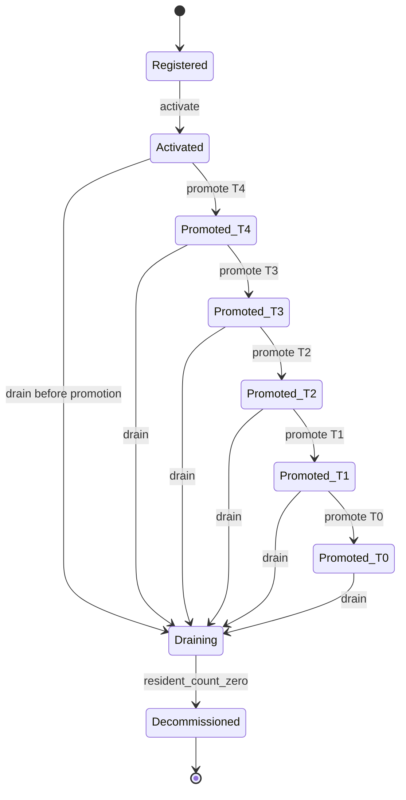
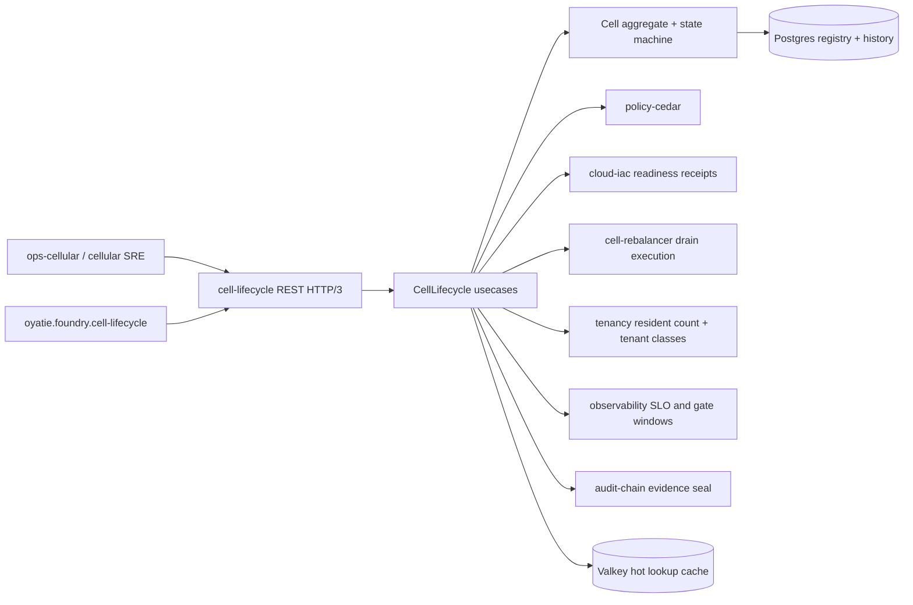

# Architecture: cell-lifecycle microservice

Status: Wave 15-ZD scaffold; no Rust code in this slice.
Architecture style: hexagonal architecture with explicit ports for cloud-iac, cell-rebalancer, tenancy, observability, audit-chain, policy-cedar, Postgres, and Valkey.
Data authority: logical Cell aggregate, LifecycleHistory append log, and EvidencePack value object references.

## 1. Architectural Invariants
INV-001: cell-lifecycle is a Tier 0 substrate service because lifecycle mistakes affect blast-radius boundaries for other services.
INV-002: The domain model never provisions infrastructure; cloud-iac remains the only provisioning authority.
INV-003: The domain model never migrates tenants; cell-rebalancer remains the only drain migration authority.
INV-004: The domain model never routes tenant traffic; api-gateway remains the only routing authority.
INV-005: The state machine is append-history-first: every accepted transition has a durable LifecycleHistory row.
INV-006: Postgres is the source of truth for registry and history; Valkey is a bounded hot-lookup cache.
INV-007: Cross-region replication uses HLC ordering per ADR-0208 so concurrent region updates replay deterministically.
INV-008: Public REST uses OpenAPI 3.2.0, HTTP/3 + QUIC, and ADR-0267 carrier-triplet versioning.
INV-009: Cedar is an adapter and policy authority, not embedded domain if-statements.
INV-010: Audit-chain sealing is mandatory before success is reported for privileged transitions.

## 2. Hexagonal Architecture
### 2.1 Port: InboundRestPort
- Responsibility: OpenAPI REST commands for register, activate, promote, drain, decommission, list, and lifecycle read.
- Direction: domain defines the interface; adapters implement transport, persistence, or substrate mechanics.
- Failure mode: adapter failure is converted to a typed dependency error; domain state remains unchanged.
- Evidence: every successful adapter call contributes a receipt id or digest to LifecycleHistory when it influences a transition.
- Test seam: Wave 15-ZD-impl can unit-test the usecase with fake adapters and integration-test adapters separately.
### 2.2 Port: InboundGrpcPort
- Responsibility: future gRPC/HTTP3 surface for internal automation and SDK generation without bypassing domain logic.
- Direction: domain defines the interface; adapters implement transport, persistence, or substrate mechanics.
- Failure mode: adapter failure is converted to a typed dependency error; domain state remains unchanged.
- Evidence: every successful adapter call contributes a receipt id or digest to LifecycleHistory when it influences a transition.
- Test seam: Wave 15-ZD-impl can unit-test the usecase with fake adapters and integration-test adapters separately.
### 2.3 Port: CellLifecycleCommandPort
- Responsibility: usecase boundary accepting validated commands and returning transition decisions.
- Direction: domain defines the interface; adapters implement transport, persistence, or substrate mechanics.
- Failure mode: adapter failure is converted to a typed dependency error; domain state remains unchanged.
- Evidence: every successful adapter call contributes a receipt id or digest to LifecycleHistory when it influences a transition.
- Test seam: Wave 15-ZD-impl can unit-test the usecase with fake adapters and integration-test adapters separately.
### 2.4 Port: CellRegistryRepository
- Responsibility: Postgres-backed aggregate repository with optimistic lifecycle_version writes.
- Direction: domain defines the interface; adapters implement transport, persistence, or substrate mechanics.
- Failure mode: adapter failure is converted to a typed dependency error; domain state remains unchanged.
- Evidence: every successful adapter call contributes a receipt id or digest to LifecycleHistory when it influences a transition.
- Test seam: Wave 15-ZD-impl can unit-test the usecase with fake adapters and integration-test adapters separately.
### 2.5 Port: LifecycleHistoryRepository
- Responsibility: append-only Postgres repository for accepted and policy-rejected transition events.
- Direction: domain defines the interface; adapters implement transport, persistence, or substrate mechanics.
- Failure mode: adapter failure is converted to a typed dependency error; domain state remains unchanged.
- Evidence: every successful adapter call contributes a receipt id or digest to LifecycleHistory when it influences a transition.
- Test seam: Wave 15-ZD-impl can unit-test the usecase with fake adapters and integration-test adapters separately.
### 2.6 Port: HotLookupCache
- Responsibility: Valkey cache for list and GET lifecycle summary projections.
- Direction: domain defines the interface; adapters implement transport, persistence, or substrate mechanics.
- Failure mode: adapter failure is converted to a typed dependency error; domain state remains unchanged.
- Evidence: every successful adapter call contributes a receipt id or digest to LifecycleHistory when it influences a transition.
- Test seam: Wave 15-ZD-impl can unit-test the usecase with fake adapters and integration-test adapters separately.
### 2.7 Port: CloudIacReadinessPort
- Responsibility: cloud-iac receipt validation for registration and activation.
- Direction: domain defines the interface; adapters implement transport, persistence, or substrate mechanics.
- Failure mode: adapter failure is converted to a typed dependency error; domain state remains unchanged.
- Evidence: every successful adapter call contributes a receipt id or digest to LifecycleHistory when it influences a transition.
- Test seam: Wave 15-ZD-impl can unit-test the usecase with fake adapters and integration-test adapters separately.
### 2.8 Port: CellRebalancerDrainPort
- Responsibility: cell-rebalancer drain intent and completion receipt integration.
- Direction: domain defines the interface; adapters implement transport, persistence, or substrate mechanics.
- Failure mode: adapter failure is converted to a typed dependency error; domain state remains unchanged.
- Evidence: every successful adapter call contributes a receipt id or digest to LifecycleHistory when it influences a transition.
- Test seam: Wave 15-ZD-impl can unit-test the usecase with fake adapters and integration-test adapters separately.
### 2.9 Port: TenancyResidentCountPort
- Responsibility: resident count and tenant-class coverage evidence from tenancy.
- Direction: domain defines the interface; adapters implement transport, persistence, or substrate mechanics.
- Failure mode: adapter failure is converted to a typed dependency error; domain state remains unchanged.
- Evidence: every successful adapter call contributes a receipt id or digest to LifecycleHistory when it influences a transition.
- Test seam: Wave 15-ZD-impl can unit-test the usecase with fake adapters and integration-test adapters separately.
### 2.10 Port: ObservabilityGatePort
- Responsibility: SLO, canary, mesh, latency, and evidence-window reads.
- Direction: domain defines the interface; adapters implement transport, persistence, or substrate mechanics.
- Failure mode: adapter failure is converted to a typed dependency error; domain state remains unchanged.
- Evidence: every successful adapter call contributes a receipt id or digest to LifecycleHistory when it influences a transition.
- Test seam: Wave 15-ZD-impl can unit-test the usecase with fake adapters and integration-test adapters separately.
### 2.11 Port: AuditChainEmitterPort
- Responsibility: audit-chain event emission and seal confirmation.
- Direction: domain defines the interface; adapters implement transport, persistence, or substrate mechanics.
- Failure mode: adapter failure is converted to a typed dependency error; domain state remains unchanged.
- Evidence: every successful adapter call contributes a receipt id or digest to LifecycleHistory when it influences a transition.
- Test seam: Wave 15-ZD-impl can unit-test the usecase with fake adapters and integration-test adapters separately.
### 2.12 Port: CedarAuthorizationPort
- Responsibility: policy-cedar decision evaluation and permit id retrieval.
- Direction: domain defines the interface; adapters implement transport, persistence, or substrate mechanics.
- Failure mode: adapter failure is converted to a typed dependency error; domain state remains unchanged.
- Evidence: every successful adapter call contributes a receipt id or digest to LifecycleHistory when it influences a transition.
- Test seam: Wave 15-ZD-impl can unit-test the usecase with fake adapters and integration-test adapters separately.

## 3. Twelve Active Layer Placement under ADR-0079
Layer-01: kernel
- Placement: primitive types: CellId, LifecycleVersion, HlcTimestamp, Tier, TenantClassScope, EvidenceDigest.
- Constraint: GraphQL is deliberately absent in this service; public lifecycle commands are REST/OpenAPI and internal automation may use gRPC.
- Dependency rule: inner layers do not import adapters, transport, Postgres, Valkey, or OpenTelemetry clients.
- Verification: downstream code must keep imports directional and layer names aligned with ADR-0079 enum spelling.
Layer-02: domain
- Placement: Cell aggregate, LifecycleHistory entity, EvidencePack value object, state-machine transition rules.
- Constraint: GraphQL is deliberately absent in this service; public lifecycle commands are REST/OpenAPI and internal automation may use gRPC.
- Dependency rule: inner layers do not import adapters, transport, Postgres, Valkey, or OpenTelemetry clients.
- Verification: downstream code must keep imports directional and layer names aligned with ADR-0079 enum spelling.
Layer-03: usecase
- Placement: RegisterCell, ActivateCell, PromoteCell, DrainCell, DecommissionCell, ListCells, GetLifecycle orchestration.
- Constraint: GraphQL is deliberately absent in this service; public lifecycle commands are REST/OpenAPI and internal automation may use gRPC.
- Dependency rule: inner layers do not import adapters, transport, Postgres, Valkey, or OpenTelemetry clients.
- Verification: downstream code must keep imports directional and layer names aligned with ADR-0079 enum spelling.
Layer-04: api
- Placement: DTOs and versioned carrier envelope shared by REST, gRPC, and SDK.
- Constraint: GraphQL is deliberately absent in this service; public lifecycle commands are REST/OpenAPI and internal automation may use gRPC.
- Dependency rule: inner layers do not import adapters, transport, Postgres, Valkey, or OpenTelemetry clients.
- Verification: downstream code must keep imports directional and layer names aligned with ADR-0079 enum spelling.
Layer-05: rest
- Placement: HTTP/3 REST handlers generated from OpenAPI 3.2.0 in downstream implementation.
- Constraint: GraphQL is deliberately absent in this service; public lifecycle commands are REST/OpenAPI and internal automation may use gRPC.
- Dependency rule: inner layers do not import adapters, transport, Postgres, Valkey, or OpenTelemetry clients.
- Verification: downstream code must keep imports directional and layer names aligned with ADR-0079 enum spelling.
Layer-06: grpc
- Placement: internal automation RPC surface over HTTP/3 without bypassing Cedar or evidence checks.
- Constraint: GraphQL is deliberately absent in this service; public lifecycle commands are REST/OpenAPI and internal automation may use gRPC.
- Dependency rule: inner layers do not import adapters, transport, Postgres, Valkey, or OpenTelemetry clients.
- Verification: downstream code must keep imports directional and layer names aligned with ADR-0079 enum spelling.
Layer-07: adapter
- Placement: shared adapter trait implementations and error mapping.
- Constraint: GraphQL is deliberately absent in this service; public lifecycle commands are REST/OpenAPI and internal automation may use gRPC.
- Dependency rule: inner layers do not import adapters, transport, Postgres, Valkey, or OpenTelemetry clients.
- Verification: downstream code must keep imports directional and layer names aligned with ADR-0079 enum spelling.
Layer-08: infrastructure
- Placement: composition of Postgres, Valkey, OpenTelemetry, and mesh clients at app boundary.
- Constraint: GraphQL is deliberately absent in this service; public lifecycle commands are REST/OpenAPI and internal automation may use gRPC.
- Dependency rule: inner layers do not import adapters, transport, Postgres, Valkey, or OpenTelemetry clients.
- Verification: downstream code must keep imports directional and layer names aligned with ADR-0079 enum spelling.
Layer-09: worker
- Placement: future background evidence revalidation, cache refresh, and stale transition detector.
- Constraint: GraphQL is deliberately absent in this service; public lifecycle commands are REST/OpenAPI and internal automation may use gRPC.
- Dependency rule: inner layers do not import adapters, transport, Postgres, Valkey, or OpenTelemetry clients.
- Verification: downstream code must keep imports directional and layer names aligned with ADR-0079 enum spelling.
Layer-10: sdk
- Placement: developer-sdk generated clients pinning ADR-0267 date versions under semver releases.
- Constraint: GraphQL is deliberately absent in this service; public lifecycle commands are REST/OpenAPI and internal automation may use gRPC.
- Dependency rule: inner layers do not import adapters, transport, Postgres, Valkey, or OpenTelemetry clients.
- Verification: downstream code must keep imports directional and layer names aligned with ADR-0079 enum spelling.
Layer-11: app
- Placement: composition root wiring ports, adapters, telemetry, and shutdown lifecycle.
- Constraint: GraphQL is deliberately absent in this service; public lifecycle commands are REST/OpenAPI and internal automation may use gRPC.
- Dependency rule: inner layers do not import adapters, transport, Postgres, Valkey, or OpenTelemetry clients.
- Verification: downstream code must keep imports directional and layer names aligned with ADR-0079 enum spelling.
Layer-12: cli
- Placement: diagnostic-only operator wrapper for local runbook support; no privileged bypass.
- Constraint: GraphQL is deliberately absent in this service; public lifecycle commands are REST/OpenAPI and internal automation may use gRPC.
- Dependency rule: inner layers do not import adapters, transport, Postgres, Valkey, or OpenTelemetry clients.
- Verification: downstream code must keep imports directional and layer names aligned with ADR-0079 enum spelling.

## 4. Data Model
### 4.1 Cell aggregate
- Purpose: Cell aggregate captures the durable state needed by ADR-0276 D-3.
- Field 01: cell_id uuidv7; persisted or derived according to repository contract and returned only when safe for operators.
- Field 02: region_id; persisted or derived according to repository contract and returned only when safe for operators.
- Field 03: availability_zone_set; persisted or derived according to repository contract and returned only when safe for operators.
- Field 04: state; persisted or derived according to repository contract and returned only when safe for operators.
- Field 05: tier; persisted or derived according to repository contract and returned only when safe for operators.
- Field 06: tenant_class_scope; persisted or derived according to repository contract and returned only when safe for operators.
- Field 07: placement_class; persisted or derived according to repository contract and returned only when safe for operators.
- Field 08: lifecycle_version; persisted or derived according to repository contract and returned only when safe for operators.
- Field 09: created_hlc; persisted or derived according to repository contract and returned only when safe for operators.
- Field 10: updated_hlc; persisted or derived according to repository contract and returned only when safe for operators.
- Field 11: latest_audit_chain_event_id; persisted or derived according to repository contract and returned only when safe for operators.
- Field 12: latest_evidence_pack_id; persisted or derived according to repository contract and returned only when safe for operators.
- Consistency: writes use optimistic lifecycle_version compare-and-swap and HLC timestamp ordering.
- Audit: every mutation has a corresponding LifecycleHistory record and audit-chain seal.
- Privacy: evidence values are references and hashes, not raw tenant data or secrets.
### 4.2 LifecycleHistory entity
- Purpose: LifecycleHistory entity captures the durable state needed by ADR-0276 D-3.
- Field 01: history_id uuidv7; persisted or derived according to repository contract and returned only when safe for operators.
- Field 02: cell_id; persisted or derived according to repository contract and returned only when safe for operators.
- Field 03: from_state; persisted or derived according to repository contract and returned only when safe for operators.
- Field 04: to_state; persisted or derived according to repository contract and returned only when safe for operators.
- Field 05: action; persisted or derived according to repository contract and returned only when safe for operators.
- Field 06: principal; persisted or derived according to repository contract and returned only when safe for operators.
- Field 07: cedar_decision_id; persisted or derived according to repository contract and returned only when safe for operators.
- Field 08: evidence_pack_id; persisted or derived according to repository contract and returned only when safe for operators.
- Field 09: gate_snapshot_sha256; persisted or derived according to repository contract and returned only when safe for operators.
- Field 10: request_id; persisted or derived according to repository contract and returned only when safe for operators.
- Field 11: idempotency_key; persisted or derived according to repository contract and returned only when safe for operators.
- Field 12: hlc_timestamp; persisted or derived according to repository contract and returned only when safe for operators.
- Field 13: audit_chain_event_id; persisted or derived according to repository contract and returned only when safe for operators.
- Field 14: result; persisted or derived according to repository contract and returned only when safe for operators.
- Consistency: writes use optimistic lifecycle_version compare-and-swap and HLC timestamp ordering.
- Audit: every mutation has a corresponding LifecycleHistory record and audit-chain seal.
- Privacy: evidence values are references and hashes, not raw tenant data or secrets.
### 4.3 EvidencePack value object
- Purpose: EvidencePack value object captures the durable state needed by ADR-0276 D-3.
- Field 01: evidence_pack_id; persisted or derived according to repository contract and returned only when safe for operators.
- Field 02: evidence_pack_sha256; persisted or derived according to repository contract and returned only when safe for operators.
- Field 03: source_service; persisted or derived according to repository contract and returned only when safe for operators.
- Field 04: observability_window_id; persisted or derived according to repository contract and returned only when safe for operators.
- Field 05: compliance_pack_receipts; persisted or derived according to repository contract and returned only when safe for operators.
- Field 06: tenant_class_receipts; persisted or derived according to repository contract and returned only when safe for operators.
- Field 07: blast_radius_check_id; persisted or derived according to repository contract and returned only when safe for operators.
- Field 08: created_hlc; persisted or derived according to repository contract and returned only when safe for operators.
- Field 09: expires_hlc; persisted or derived according to repository contract and returned only when safe for operators.
- Consistency: writes use optimistic lifecycle_version compare-and-swap and HLC timestamp ordering.
- Audit: every mutation has a corresponding LifecycleHistory record and audit-chain seal.
- Privacy: evidence values are references and hashes, not raw tenant data or secrets.

## 5. State Machine Diagram

Diagram edge 01: Registered to Activated.
- Guard: activate command with cloud-iac readiness receipt and telemetry bootstrap evidence.
- Failure path: transition refusal returns a typed domain error and records no accepted state mutation.
- Concurrency path: stale lifecycle_version produces 409 and caller must refetch current state.
Diagram edge 02: Activated to Promoted-T4.
- Guard: promote command with Tier 4 gate evidence pack.
- Failure path: transition refusal returns a typed domain error and records no accepted state mutation.
- Concurrency path: stale lifecycle_version produces 409 and caller must refetch current state.
Diagram edge 03: Promoted-T4 to Promoted-T3.
- Guard: promote command with Tier 3 warm-soak, canary, mesh, tenant-class, and pack evidence.
- Failure path: transition refusal returns a typed domain error and records no accepted state mutation.
- Concurrency path: stale lifecycle_version produces 409 and caller must refetch current state.
Diagram edge 04: Promoted-T3 to Promoted-T2.
- Guard: promote command with Tier 2 evidence and no alert burst during quiet window.
- Failure path: transition refusal returns a typed domain error and records no accepted state mutation.
- Concurrency path: stale lifecycle_version produces 409 and caller must refetch current state.
Diagram edge 05: Promoted-T2 to Promoted-T1.
- Guard: promote command with substrate isolation, pack coverage, and Cedar promotion permit.
- Failure path: transition refusal returns a typed domain error and records no accepted state mutation.
- Concurrency path: stale lifecycle_version produces 409 and caller must refetch current state.
Diagram edge 06: Promoted-T1 to Promoted-T0.
- Guard: promote command with foundation-cell evidence and council-grade authorization.
- Failure path: transition refusal returns a typed domain error and records no accepted state mutation.
- Concurrency path: stale lifecycle_version produces 409 and caller must refetch current state.
Diagram edge 07: Promoted-T0 to Draining.
- Guard: drain command on planned retirement, critical hardware failure, or blast-radius containment.
- Failure path: transition refusal returns a typed domain error and records no accepted state mutation.
- Concurrency path: stale lifecycle_version produces 409 and caller must refetch current state.
Diagram edge 08: Promoted-T1 to Draining.
- Guard: drain command on failure, compliance withdrawal, or manual SRE action.
- Failure path: transition refusal returns a typed domain error and records no accepted state mutation.
- Concurrency path: stale lifecycle_version produces 409 and caller must refetch current state.
Diagram edge 09: Promoted-T2 to Draining.
- Guard: drain command on load-skew, failure, or tenant-safety decision.
- Failure path: transition refusal returns a typed domain error and records no accepted state mutation.
- Concurrency path: stale lifecycle_version produces 409 and caller must refetch current state.
Diagram edge 10: Promoted-T3 to Draining.
- Guard: drain command on load-skew, failure, or promotion rollback.
- Failure path: transition refusal returns a typed domain error and records no accepted state mutation.
- Concurrency path: stale lifecycle_version produces 409 and caller must refetch current state.
Diagram edge 11: Promoted-T4 to Draining.
- Guard: drain command on hardware failure or placement withdrawal.
- Failure path: transition refusal returns a typed domain error and records no accepted state mutation.
- Concurrency path: stale lifecycle_version produces 409 and caller must refetch current state.
Diagram edge 12: Activated to Draining.
- Guard: drain command before production promotion if readiness evidence is invalidated.
- Failure path: transition refusal returns a typed domain error and records no accepted state mutation.
- Concurrency path: stale lifecycle_version produces 409 and caller must refetch current state.
Diagram edge 13: Draining to Decommissioned.
- Guard: decommission command after tenancy reports zero residents and audit-chain seals final history.
- Failure path: transition refusal returns a typed domain error and records no accepted state mutation.
- Concurrency path: stale lifecycle_version produces 409 and caller must refetch current state.

## 6. Composition Diagram

Composition dependency 01: cloud-iac.
- Role: owns infrastructure provisioning and returns readiness receipts; cell-lifecycle never provisions infrastructure.
- Coupling rule: cell-lifecycle stores receipt ids and digests, not dependency-owned mutable objects.
- Retry rule: command retry is idempotent; dependency retry never causes duplicate state transition.
- Observability rule: dependency latency and error class are span attributes with bounded cardinality.
Composition dependency 02: cell-rebalancer.
- Role: owns tenant migration and drain execution; cell-lifecycle issues drain intent and waits for resident-count convergence.
- Coupling rule: cell-lifecycle stores receipt ids and digests, not dependency-owned mutable objects.
- Retry rule: command retry is idempotent; dependency retry never causes duplicate state transition.
- Observability rule: dependency latency and error class are span attributes with bounded cardinality.
Composition dependency 03: tenancy.
- Role: owns resident count, tenant-class coverage, placement registry, and resident zero proof.
- Coupling rule: cell-lifecycle stores receipt ids and digests, not dependency-owned mutable objects.
- Retry rule: command retry is idempotent; dependency retry never causes duplicate state transition.
- Observability rule: dependency latency and error class are span attributes with bounded cardinality.
Composition dependency 04: observability.
- Role: owns SLO, canary, mesh, latency, and transition metrics used by promotion gates.
- Coupling rule: cell-lifecycle stores receipt ids and digests, not dependency-owned mutable objects.
- Retry rule: command retry is idempotent; dependency retry never causes duplicate state transition.
- Observability rule: dependency latency and error class are span attributes with bounded cardinality.
Composition dependency 05: audit-chain.
- Role: owns tamper-evident event emission and evidence pack seals.
- Coupling rule: cell-lifecycle stores receipt ids and digests, not dependency-owned mutable objects.
- Retry rule: command retry is idempotent; dependency retry never causes duplicate state transition.
- Observability rule: dependency latency and error class are span attributes with bounded cardinality.
Composition dependency 06: policy-cedar.
- Role: owns Cedar evaluation and permit validation for privileged transitions.
- Coupling rule: cell-lifecycle stores receipt ids and digests, not dependency-owned mutable objects.
- Retry rule: command retry is idempotent; dependency retry never causes duplicate state transition.
- Observability rule: dependency latency and error class are span attributes with bounded cardinality.
Composition dependency 07: api-gateway.
- Role: owns public routing and carrier-triplet enforcement at the edge.
- Coupling rule: cell-lifecycle stores receipt ids and digests, not dependency-owned mutable objects.
- Retry rule: command retry is idempotent; dependency retry never causes duplicate state transition.
- Observability rule: dependency latency and error class are span attributes with bounded cardinality.

## 7. Persistence Design
### 7.1 Postgres cells table
- Design: authoritative current-state table keyed by cell_id with lifecycle_version CAS and HLC columns.
- Data classification: internal operational metadata; no tenant payload or secret evidence blob is stored.
- Backup: included in ADR-0268 Postgres WAL-G and Valkey cluster backup plan; audit-chain seal allows tamper detection.
- RPO: registry history targets 30 seconds p99; RTO targets 300 seconds p99 because cell registry is critical.
- Migration: downstream implementation adds migrations before handlers and tests replay from history into summary projection.
### 7.2 Postgres lifecycle_history table
- Design: append-only history keyed by history_id and indexed by cell_id, hlc_timestamp, action, result.
- Data classification: internal operational metadata; no tenant payload or secret evidence blob is stored.
- Backup: included in ADR-0268 Postgres WAL-G and Valkey cluster backup plan; audit-chain seal allows tamper detection.
- RPO: registry history targets 30 seconds p99; RTO targets 300 seconds p99 because cell registry is critical.
- Migration: downstream implementation adds migrations before handlers and tests replay from history into summary projection.
### 7.3 Postgres idempotency table
- Design: request idempotency store keyed by principal plus idempotency_key and response digest.
- Data classification: internal operational metadata; no tenant payload or secret evidence blob is stored.
- Backup: included in ADR-0268 Postgres WAL-G and Valkey cluster backup plan; audit-chain seal allows tamper detection.
- RPO: registry history targets 30 seconds p99; RTO targets 300 seconds p99 because cell registry is critical.
- Migration: downstream implementation adds migrations before handlers and tests replay from history into summary projection.
### 7.4 Valkey lifecycle summary
- Design: hot lookup cache for list/read responses with short TTL and explicit invalidation on state write.
- Data classification: internal operational metadata; no tenant payload or secret evidence blob is stored.
- Backup: included in ADR-0268 Postgres WAL-G and Valkey cluster backup plan; audit-chain seal allows tamper detection.
- RPO: registry history targets 30 seconds p99; RTO targets 300 seconds p99 because cell registry is critical.
- Migration: downstream implementation adds migrations before handlers and tests replay from history into summary projection.
### 7.5 Valkey transition lock
- Design: short-lived lock to reduce duplicate dependency calls while Postgres CAS remains the real guard.
- Data classification: internal operational metadata; no tenant payload or secret evidence blob is stored.
- Backup: included in ADR-0268 Postgres WAL-G and Valkey cluster backup plan; audit-chain seal allows tamper detection.
- RPO: registry history targets 30 seconds p99; RTO targets 300 seconds p99 because cell registry is critical.
- Migration: downstream implementation adds migrations before handlers and tests replay from history into summary projection.

## 8. Sharding and Replication
SHARD-001: cell-lifecycle itself runs as a Tier 0 substrate registry with one logical global instance per region.
SHARD-002: A region owns local write admission for cells physically or logically anchored to that region.
SHARD-003: Cross-region replication uses HLC timestamps so lifecycle_version ordering is deterministic during replay.
SHARD-004: Conflicting writes are resolved by lifecycle_version compare-and-swap before HLC merge; HLC does not hide illegal concurrent state transitions.
SHARD-005: Valkey caches are regional and disposable; Postgres plus audit-chain are the recovery substrates.
SHARD-006: Shard count grows slowly because Cell aggregates grow with platform topology, not end-user request volume.
SHARD-007: The service does not auto-rebalance itself; it triggers cell-rebalancer during drain and records receipt state.
SHARD-008: Tenant placement sharding remains in tenancy and oya-shuffle-sharding; cell-lifecycle stores lifecycle state only.

## 9. Capacity Model
CAP-001: Baseline CPU is small because lifecycle commands are control-plane writes, not hot-path tenant requests.
CAP-002: Baseline RAM is sized for connection pools, cached lifecycle summaries, and evidence validation windows.
CAP-003: Storage grows with number of cells and history rows; cell count grows slowly compared with tenants or messages.
CAP-004: Postgres connections are bounded and pooled; Valkey connections are bounded by API replicas and worker replicas.
CAP-005: Scaling dimension is per_request because transition commands and lifecycle reads drive load.
CAP-006: Tier-0 cell placement class is declared because registry correctness affects all downstream cell placement decisions.
CAP-007: Kata runtime tier 1 is declared because the service is substrate and touches tenant data-plane control metadata.
CAP-008: Capacity review compares observed request rate, evidence validation latency, history growth, and cache hit ratio every quarter.

## 10. DR, RTO, and RPO per ADR-0268
DR-001: RTO target is 5 minutes because operators must recover registry authority quickly during cell incidents.
DR-002: RPO target is 30 seconds for registry/history writes; audit-chain seal gives tamper evidence if replay diverges.
DR-003: Postgres WAL-G, Valkey cluster persistence, and audit-chain Merkle seal are the backup substrates.
DR-004: Failover runbook is runbooks/on-call.md for detection and runbooks/rollback-promotion.md for transition correction.
DR-005: Multi-region active-active is required for read availability; writes stay region-authoritative with HLC ordering.
DR-006: Quarterly DR drills must replay LifecycleHistory into an empty registry and verify latest state equivalence.

## 11. API Versioning and Transport
API-001: OpenAPI file uses openapi 3.2.0.
API-002: Every public REST operation carries Oyatie-Version header.
API-003: The public server URL declares /v/{oyatie_version} as the date-version URL prefix carrier while service paths retain ADR-0276 /v1/cells shape.
API-004: Request and response schemas include oyatie_version to align with ADR-0267 carrier triplet and SDK generation.
API-005: HTTP/3 + QUIC is preferred, with strict TLS fallback per ADR-0209 when needed.
API-006: gRPC is internal automation shape only and must preserve the same domain usecases and Cedar gates.
API-007: api-gateway owns unsupported-version and carrier-conflict behavior; cell-lifecycle exposes contract metadata and validates received headers.

## 12. Failure Modes and Recovery
FAIL-001: cedar unavailable.
- Recovery: return dependency_unavailable, no state mutation, emit rejected metric.
- Runbook link: on-call.md plus the operation-specific runbook named by the transition.
- Test hook: downstream implementation creates unit and integration tests for this failure mode.
FAIL-002: audit-chain unavailable.
- Recovery: refuse accepted transition because success without a seal is forbidden.
- Runbook link: on-call.md plus the operation-specific runbook named by the transition.
- Test hook: downstream implementation creates unit and integration tests for this failure mode.
FAIL-003: tenancy resident-count stale.
- Recovery: block decommission and return resident_count_stale with retry_after_seconds.
- Runbook link: on-call.md plus the operation-specific runbook named by the transition.
- Test hook: downstream implementation creates unit and integration tests for this failure mode.
FAIL-004: cell-rebalancer drain rejected.
- Recovery: keep state unchanged unless drain was already accepted; expose receipt status.
- Runbook link: on-call.md plus the operation-specific runbook named by the transition.
- Test hook: downstream implementation creates unit and integration tests for this failure mode.
FAIL-005: observability gate window missing.
- Recovery: block promotion and list missing evidence keys.
- Runbook link: on-call.md plus the operation-specific runbook named by the transition.
- Test hook: downstream implementation creates unit and integration tests for this failure mode.
FAIL-006: Postgres CAS conflict.
- Recovery: return 409 with latest lifecycle_version and do not retry inside domain.
- Runbook link: on-call.md plus the operation-specific runbook named by the transition.
- Test hook: downstream implementation creates unit and integration tests for this failure mode.
FAIL-007: Valkey cache stale.
- Recovery: read through to Postgres and refresh cache with new lifecycle_version.
- Runbook link: on-call.md plus the operation-specific runbook named by the transition.
- Test hook: downstream implementation creates unit and integration tests for this failure mode.
FAIL-008: cross-region lag.
- Recovery: serve local latest state and include replication_lag_hlc in diagnostics.
- Runbook link: on-call.md plus the operation-specific runbook named by the transition.
- Test hook: downstream implementation creates unit and integration tests for this failure mode.

## 13. Downstream Implementation Handoff
HANDOFF-001: Wave 15-ZD-impl must implement Postgres repository without changing the documented boundary: no provisioning, no tenant migration, no routing, and no history rewrites.
HANDOFF-002: Wave 15-ZD-impl must implement Valkey cache without changing the documented boundary: no provisioning, no tenant migration, no routing, and no history rewrites.
HANDOFF-003: Wave 15-ZD-impl must implement Cedar adapter without changing the documented boundary: no provisioning, no tenant migration, no routing, and no history rewrites.
HANDOFF-004: Wave 15-ZD-impl must implement audit-chain adapter without changing the documented boundary: no provisioning, no tenant migration, no routing, and no history rewrites.
HANDOFF-005: Wave 15-ZD-impl must implement OpenAPI handler without changing the documented boundary: no provisioning, no tenant migration, no routing, and no history rewrites.
HANDOFF-006: Wave 15-ZD-impl must implement gRPC adapter without changing the documented boundary: no provisioning, no tenant migration, no routing, and no history rewrites.
HANDOFF-007: Wave 15-ZD-impl must implement observability metrics without changing the documented boundary: no provisioning, no tenant migration, no routing, and no history rewrites.
HANDOFF-008: Wave 15-ZD-impl must implement HLC replication without changing the documented boundary: no provisioning, no tenant migration, no routing, and no history rewrites.
HANDOFF-009: Wave 15-ZD-impl must implement runbook validation without changing the documented boundary: no provisioning, no tenant migration, no routing, and no history rewrites.
HANDOFF-010: Wave 15-ZD-impl must implement domain state machine without changing the documented boundary: no provisioning, no tenant migration, no routing, and no history rewrites.
HANDOFF-011: Wave 15-ZD-impl must implement Postgres repository without changing the documented boundary: no provisioning, no tenant migration, no routing, and no history rewrites.
HANDOFF-012: Wave 15-ZD-impl must implement Valkey cache without changing the documented boundary: no provisioning, no tenant migration, no routing, and no history rewrites.
HANDOFF-013: Wave 15-ZD-impl must implement Cedar adapter without changing the documented boundary: no provisioning, no tenant migration, no routing, and no history rewrites.
HANDOFF-014: Wave 15-ZD-impl must implement audit-chain adapter without changing the documented boundary: no provisioning, no tenant migration, no routing, and no history rewrites.
HANDOFF-015: Wave 15-ZD-impl must implement OpenAPI handler without changing the documented boundary: no provisioning, no tenant migration, no routing, and no history rewrites.
HANDOFF-016: Wave 15-ZD-impl must implement gRPC adapter without changing the documented boundary: no provisioning, no tenant migration, no routing, and no history rewrites.
HANDOFF-017: Wave 15-ZD-impl must implement observability metrics without changing the documented boundary: no provisioning, no tenant migration, no routing, and no history rewrites.
HANDOFF-018: Wave 15-ZD-impl must implement HLC replication without changing the documented boundary: no provisioning, no tenant migration, no routing, and no history rewrites.
HANDOFF-019: Wave 15-ZD-impl must implement runbook validation without changing the documented boundary: no provisioning, no tenant migration, no routing, and no history rewrites.
HANDOFF-020: Wave 15-ZD-impl must implement domain state machine without changing the documented boundary: no provisioning, no tenant migration, no routing, and no history rewrites.
HANDOFF-021: Wave 15-ZD-impl must implement Postgres repository without changing the documented boundary: no provisioning, no tenant migration, no routing, and no history rewrites.
HANDOFF-022: Wave 15-ZD-impl must implement Valkey cache without changing the documented boundary: no provisioning, no tenant migration, no routing, and no history rewrites.
HANDOFF-023: Wave 15-ZD-impl must implement Cedar adapter without changing the documented boundary: no provisioning, no tenant migration, no routing, and no history rewrites.
HANDOFF-024: Wave 15-ZD-impl must implement audit-chain adapter without changing the documented boundary: no provisioning, no tenant migration, no routing, and no history rewrites.
HANDOFF-025: Wave 15-ZD-impl must implement OpenAPI handler without changing the documented boundary: no provisioning, no tenant migration, no routing, and no history rewrites.
HANDOFF-026: Wave 15-ZD-impl must implement gRPC adapter without changing the documented boundary: no provisioning, no tenant migration, no routing, and no history rewrites.
HANDOFF-027: Wave 15-ZD-impl must implement observability metrics without changing the documented boundary: no provisioning, no tenant migration, no routing, and no history rewrites.
HANDOFF-028: Wave 15-ZD-impl must implement HLC replication without changing the documented boundary: no provisioning, no tenant migration, no routing, and no history rewrites.
HANDOFF-029: Wave 15-ZD-impl must implement runbook validation without changing the documented boundary: no provisioning, no tenant migration, no routing, and no history rewrites.
HANDOFF-030: Wave 15-ZD-impl must implement domain state machine without changing the documented boundary: no provisioning, no tenant migration, no routing, and no history rewrites.
HANDOFF-031: Wave 15-ZD-impl must implement Postgres repository without changing the documented boundary: no provisioning, no tenant migration, no routing, and no history rewrites.
HANDOFF-032: Wave 15-ZD-impl must implement Valkey cache without changing the documented boundary: no provisioning, no tenant migration, no routing, and no history rewrites.
HANDOFF-033: Wave 15-ZD-impl must implement Cedar adapter without changing the documented boundary: no provisioning, no tenant migration, no routing, and no history rewrites.
HANDOFF-034: Wave 15-ZD-impl must implement audit-chain adapter without changing the documented boundary: no provisioning, no tenant migration, no routing, and no history rewrites.
HANDOFF-035: Wave 15-ZD-impl must implement OpenAPI handler without changing the documented boundary: no provisioning, no tenant migration, no routing, and no history rewrites.
HANDOFF-036: Wave 15-ZD-impl must implement gRPC adapter without changing the documented boundary: no provisioning, no tenant migration, no routing, and no history rewrites.
HANDOFF-037: Wave 15-ZD-impl must implement observability metrics without changing the documented boundary: no provisioning, no tenant migration, no routing, and no history rewrites.
HANDOFF-038: Wave 15-ZD-impl must implement HLC replication without changing the documented boundary: no provisioning, no tenant migration, no routing, and no history rewrites.
HANDOFF-039: Wave 15-ZD-impl must implement runbook validation without changing the documented boundary: no provisioning, no tenant migration, no routing, and no history rewrites.
HANDOFF-040: Wave 15-ZD-impl must implement domain state machine without changing the documented boundary: no provisioning, no tenant migration, no routing, and no history rewrites.
HANDOFF-041: Wave 15-ZD-impl must implement Postgres repository without changing the documented boundary: no provisioning, no tenant migration, no routing, and no history rewrites.
HANDOFF-042: Wave 15-ZD-impl must implement Valkey cache without changing the documented boundary: no provisioning, no tenant migration, no routing, and no history rewrites.
HANDOFF-043: Wave 15-ZD-impl must implement Cedar adapter without changing the documented boundary: no provisioning, no tenant migration, no routing, and no history rewrites.
HANDOFF-044: Wave 15-ZD-impl must implement audit-chain adapter without changing the documented boundary: no provisioning, no tenant migration, no routing, and no history rewrites.
HANDOFF-045: Wave 15-ZD-impl must implement OpenAPI handler without changing the documented boundary: no provisioning, no tenant migration, no routing, and no history rewrites.
HANDOFF-046: Wave 15-ZD-impl must implement gRPC adapter without changing the documented boundary: no provisioning, no tenant migration, no routing, and no history rewrites.
HANDOFF-047: Wave 15-ZD-impl must implement observability metrics without changing the documented boundary: no provisioning, no tenant migration, no routing, and no history rewrites.
HANDOFF-048: Wave 15-ZD-impl must implement HLC replication without changing the documented boundary: no provisioning, no tenant migration, no routing, and no history rewrites.
HANDOFF-049: Wave 15-ZD-impl must implement runbook validation without changing the documented boundary: no provisioning, no tenant migration, no routing, and no history rewrites.
HANDOFF-050: Wave 15-ZD-impl must implement domain state machine without changing the documented boundary: no provisioning, no tenant migration, no routing, and no history rewrites.
HANDOFF-051: Wave 15-ZD-impl must implement Postgres repository without changing the documented boundary: no provisioning, no tenant migration, no routing, and no history rewrites.
HANDOFF-052: Wave 15-ZD-impl must implement Valkey cache without changing the documented boundary: no provisioning, no tenant migration, no routing, and no history rewrites.
HANDOFF-053: Wave 15-ZD-impl must implement Cedar adapter without changing the documented boundary: no provisioning, no tenant migration, no routing, and no history rewrites.
HANDOFF-054: Wave 15-ZD-impl must implement audit-chain adapter without changing the documented boundary: no provisioning, no tenant migration, no routing, and no history rewrites.
HANDOFF-055: Wave 15-ZD-impl must implement OpenAPI handler without changing the documented boundary: no provisioning, no tenant migration, no routing, and no history rewrites.
HANDOFF-056: Wave 15-ZD-impl must implement gRPC adapter without changing the documented boundary: no provisioning, no tenant migration, no routing, and no history rewrites.
HANDOFF-057: Wave 15-ZD-impl must implement observability metrics without changing the documented boundary: no provisioning, no tenant migration, no routing, and no history rewrites.
HANDOFF-058: Wave 15-ZD-impl must implement HLC replication without changing the documented boundary: no provisioning, no tenant migration, no routing, and no history rewrites.
HANDOFF-059: Wave 15-ZD-impl must implement runbook validation without changing the documented boundary: no provisioning, no tenant migration, no routing, and no history rewrites.
HANDOFF-060: Wave 15-ZD-impl must implement domain state machine without changing the documented boundary: no provisioning, no tenant migration, no routing, and no history rewrites.
HANDOFF-061: Wave 15-ZD-impl must implement Postgres repository without changing the documented boundary: no provisioning, no tenant migration, no routing, and no history rewrites.
HANDOFF-062: Wave 15-ZD-impl must implement Valkey cache without changing the documented boundary: no provisioning, no tenant migration, no routing, and no history rewrites.
HANDOFF-063: Wave 15-ZD-impl must implement Cedar adapter without changing the documented boundary: no provisioning, no tenant migration, no routing, and no history rewrites.
HANDOFF-064: Wave 15-ZD-impl must implement audit-chain adapter without changing the documented boundary: no provisioning, no tenant migration, no routing, and no history rewrites.
HANDOFF-065: Wave 15-ZD-impl must implement OpenAPI handler without changing the documented boundary: no provisioning, no tenant migration, no routing, and no history rewrites.
HANDOFF-066: Wave 15-ZD-impl must implement gRPC adapter without changing the documented boundary: no provisioning, no tenant migration, no routing, and no history rewrites.
HANDOFF-067: Wave 15-ZD-impl must implement observability metrics without changing the documented boundary: no provisioning, no tenant migration, no routing, and no history rewrites.
HANDOFF-068: Wave 15-ZD-impl must implement HLC replication without changing the documented boundary: no provisioning, no tenant migration, no routing, and no history rewrites.
HANDOFF-069: Wave 15-ZD-impl must implement runbook validation without changing the documented boundary: no provisioning, no tenant migration, no routing, and no history rewrites.
HANDOFF-070: Wave 15-ZD-impl must implement domain state machine without changing the documented boundary: no provisioning, no tenant migration, no routing, and no history rewrites.
HANDOFF-071: Wave 15-ZD-impl must implement Postgres repository without changing the documented boundary: no provisioning, no tenant migration, no routing, and no history rewrites.
HANDOFF-072: Wave 15-ZD-impl must implement Valkey cache without changing the documented boundary: no provisioning, no tenant migration, no routing, and no history rewrites.
HANDOFF-073: Wave 15-ZD-impl must implement Cedar adapter without changing the documented boundary: no provisioning, no tenant migration, no routing, and no history rewrites.
HANDOFF-074: Wave 15-ZD-impl must implement audit-chain adapter without changing the documented boundary: no provisioning, no tenant migration, no routing, and no history rewrites.
HANDOFF-075: Wave 15-ZD-impl must implement OpenAPI handler without changing the documented boundary: no provisioning, no tenant migration, no routing, and no history rewrites.
HANDOFF-076: Wave 15-ZD-impl must implement gRPC adapter without changing the documented boundary: no provisioning, no tenant migration, no routing, and no history rewrites.
HANDOFF-077: Wave 15-ZD-impl must implement observability metrics without changing the documented boundary: no provisioning, no tenant migration, no routing, and no history rewrites.
HANDOFF-078: Wave 15-ZD-impl must implement HLC replication without changing the documented boundary: no provisioning, no tenant migration, no routing, and no history rewrites.
HANDOFF-079: Wave 15-ZD-impl must implement runbook validation without changing the documented boundary: no provisioning, no tenant migration, no routing, and no history rewrites.
HANDOFF-080: Wave 15-ZD-impl must implement domain state machine without changing the documented boundary: no provisioning, no tenant migration, no routing, and no history rewrites.
HANDOFF-081: Wave 15-ZD-impl must implement Postgres repository without changing the documented boundary: no provisioning, no tenant migration, no routing, and no history rewrites.
HANDOFF-082: Wave 15-ZD-impl must implement Valkey cache without changing the documented boundary: no provisioning, no tenant migration, no routing, and no history rewrites.
HANDOFF-083: Wave 15-ZD-impl must implement Cedar adapter without changing the documented boundary: no provisioning, no tenant migration, no routing, and no history rewrites.
HANDOFF-084: Wave 15-ZD-impl must implement audit-chain adapter without changing the documented boundary: no provisioning, no tenant migration, no routing, and no history rewrites.
HANDOFF-085: Wave 15-ZD-impl must implement OpenAPI handler without changing the documented boundary: no provisioning, no tenant migration, no routing, and no history rewrites.
HANDOFF-086: Wave 15-ZD-impl must implement gRPC adapter without changing the documented boundary: no provisioning, no tenant migration, no routing, and no history rewrites.
HANDOFF-087: Wave 15-ZD-impl must implement observability metrics without changing the documented boundary: no provisioning, no tenant migration, no routing, and no history rewrites.
HANDOFF-088: Wave 15-ZD-impl must implement HLC replication without changing the documented boundary: no provisioning, no tenant migration, no routing, and no history rewrites.
HANDOFF-089: Wave 15-ZD-impl must implement runbook validation without changing the documented boundary: no provisioning, no tenant migration, no routing, and no history rewrites.
HANDOFF-090: Wave 15-ZD-impl must implement domain state machine without changing the documented boundary: no provisioning, no tenant migration, no routing, and no history rewrites.
HANDOFF-091: Wave 15-ZD-impl must implement Postgres repository without changing the documented boundary: no provisioning, no tenant migration, no routing, and no history rewrites.
HANDOFF-092: Wave 15-ZD-impl must implement Valkey cache without changing the documented boundary: no provisioning, no tenant migration, no routing, and no history rewrites.
HANDOFF-093: Wave 15-ZD-impl must implement Cedar adapter without changing the documented boundary: no provisioning, no tenant migration, no routing, and no history rewrites.
HANDOFF-094: Wave 15-ZD-impl must implement audit-chain adapter without changing the documented boundary: no provisioning, no tenant migration, no routing, and no history rewrites.
HANDOFF-095: Wave 15-ZD-impl must implement OpenAPI handler without changing the documented boundary: no provisioning, no tenant migration, no routing, and no history rewrites.
HANDOFF-096: Wave 15-ZD-impl must implement gRPC adapter without changing the documented boundary: no provisioning, no tenant migration, no routing, and no history rewrites.
HANDOFF-097: Wave 15-ZD-impl must implement observability metrics without changing the documented boundary: no provisioning, no tenant migration, no routing, and no history rewrites.
HANDOFF-098: Wave 15-ZD-impl must implement HLC replication without changing the documented boundary: no provisioning, no tenant migration, no routing, and no history rewrites.
HANDOFF-099: Wave 15-ZD-impl must implement runbook validation without changing the documented boundary: no provisioning, no tenant migration, no routing, and no history rewrites.
HANDOFF-100: Wave 15-ZD-impl must implement domain state machine without changing the documented boundary: no provisioning, no tenant migration, no routing, and no history rewrites.
HANDOFF-101: Wave 15-ZD-impl must implement Postgres repository without changing the documented boundary: no provisioning, no tenant migration, no routing, and no history rewrites.
HANDOFF-102: Wave 15-ZD-impl must implement Valkey cache without changing the documented boundary: no provisioning, no tenant migration, no routing, and no history rewrites.
HANDOFF-103: Wave 15-ZD-impl must implement Cedar adapter without changing the documented boundary: no provisioning, no tenant migration, no routing, and no history rewrites.
HANDOFF-104: Wave 15-ZD-impl must implement audit-chain adapter without changing the documented boundary: no provisioning, no tenant migration, no routing, and no history rewrites.
HANDOFF-105: Wave 15-ZD-impl must implement OpenAPI handler without changing the documented boundary: no provisioning, no tenant migration, no routing, and no history rewrites.
HANDOFF-106: Wave 15-ZD-impl must implement gRPC adapter without changing the documented boundary: no provisioning, no tenant migration, no routing, and no history rewrites.
HANDOFF-107: Wave 15-ZD-impl must implement observability metrics without changing the documented boundary: no provisioning, no tenant migration, no routing, and no history rewrites.
HANDOFF-108: Wave 15-ZD-impl must implement HLC replication without changing the documented boundary: no provisioning, no tenant migration, no routing, and no history rewrites.
HANDOFF-109: Wave 15-ZD-impl must implement runbook validation without changing the documented boundary: no provisioning, no tenant migration, no routing, and no history rewrites.
HANDOFF-110: Wave 15-ZD-impl must implement domain state machine without changing the documented boundary: no provisioning, no tenant migration, no routing, and no history rewrites.
HANDOFF-111: Wave 15-ZD-impl must implement Postgres repository without changing the documented boundary: no provisioning, no tenant migration, no routing, and no history rewrites.
HANDOFF-112: Wave 15-ZD-impl must implement Valkey cache without changing the documented boundary: no provisioning, no tenant migration, no routing, and no history rewrites.
HANDOFF-113: Wave 15-ZD-impl must implement Cedar adapter without changing the documented boundary: no provisioning, no tenant migration, no routing, and no history rewrites.
HANDOFF-114: Wave 15-ZD-impl must implement audit-chain adapter without changing the documented boundary: no provisioning, no tenant migration, no routing, and no history rewrites.
HANDOFF-115: Wave 15-ZD-impl must implement OpenAPI handler without changing the documented boundary: no provisioning, no tenant migration, no routing, and no history rewrites.
HANDOFF-116: Wave 15-ZD-impl must implement gRPC adapter without changing the documented boundary: no provisioning, no tenant migration, no routing, and no history rewrites.
HANDOFF-117: Wave 15-ZD-impl must implement observability metrics without changing the documented boundary: no provisioning, no tenant migration, no routing, and no history rewrites.
HANDOFF-118: Wave 15-ZD-impl must implement HLC replication without changing the documented boundary: no provisioning, no tenant migration, no routing, and no history rewrites.
HANDOFF-119: Wave 15-ZD-impl must implement runbook validation without changing the documented boundary: no provisioning, no tenant migration, no routing, and no history rewrites.
HANDOFF-120: Wave 15-ZD-impl must implement domain state machine without changing the documented boundary: no provisioning, no tenant migration, no routing, and no history rewrites.
HANDOFF-121: Wave 15-ZD-impl must implement Postgres repository without changing the documented boundary: no provisioning, no tenant migration, no routing, and no history rewrites.
HANDOFF-122: Wave 15-ZD-impl must implement Valkey cache without changing the documented boundary: no provisioning, no tenant migration, no routing, and no history rewrites.
HANDOFF-123: Wave 15-ZD-impl must implement Cedar adapter without changing the documented boundary: no provisioning, no tenant migration, no routing, and no history rewrites.
HANDOFF-124: Wave 15-ZD-impl must implement audit-chain adapter without changing the documented boundary: no provisioning, no tenant migration, no routing, and no history rewrites.
HANDOFF-125: Wave 15-ZD-impl must implement OpenAPI handler without changing the documented boundary: no provisioning, no tenant migration, no routing, and no history rewrites.
HANDOFF-126: Wave 15-ZD-impl must implement gRPC adapter without changing the documented boundary: no provisioning, no tenant migration, no routing, and no history rewrites.
HANDOFF-127: Wave 15-ZD-impl must implement observability metrics without changing the documented boundary: no provisioning, no tenant migration, no routing, and no history rewrites.
HANDOFF-128: Wave 15-ZD-impl must implement HLC replication without changing the documented boundary: no provisioning, no tenant migration, no routing, and no history rewrites.
HANDOFF-129: Wave 15-ZD-impl must implement runbook validation without changing the documented boundary: no provisioning, no tenant migration, no routing, and no history rewrites.
HANDOFF-130: Wave 15-ZD-impl must implement domain state machine without changing the documented boundary: no provisioning, no tenant migration, no routing, and no history rewrites.
ARCH detail 565: all adapters are outside the Cell aggregate; the aggregate accepts typed receipts and produces transition decisions that can be replayed from LifecycleHistory.
ARCH detail 566: all adapters are outside the Cell aggregate; the aggregate accepts typed receipts and produces transition decisions that can be replayed from LifecycleHistory.
ARCH detail 567: all adapters are outside the Cell aggregate; the aggregate accepts typed receipts and produces transition decisions that can be replayed from LifecycleHistory.
ARCH detail 568: all adapters are outside the Cell aggregate; the aggregate accepts typed receipts and produces transition decisions that can be replayed from LifecycleHistory.
ARCH detail 569: all adapters are outside the Cell aggregate; the aggregate accepts typed receipts and produces transition decisions that can be replayed from LifecycleHistory.
ARCH detail 570: all adapters are outside the Cell aggregate; the aggregate accepts typed receipts and produces transition decisions that can be replayed from LifecycleHistory.
ARCH detail 571: all adapters are outside the Cell aggregate; the aggregate accepts typed receipts and produces transition decisions that can be replayed from LifecycleHistory.
ARCH detail 572: all adapters are outside the Cell aggregate; the aggregate accepts typed receipts and produces transition decisions that can be replayed from LifecycleHistory.
ARCH detail 573: all adapters are outside the Cell aggregate; the aggregate accepts typed receipts and produces transition decisions that can be replayed from LifecycleHistory.
ARCH detail 574: all adapters are outside the Cell aggregate; the aggregate accepts typed receipts and produces transition decisions that can be replayed from LifecycleHistory.
ARCH detail 575: all adapters are outside the Cell aggregate; the aggregate accepts typed receipts and produces transition decisions that can be replayed from LifecycleHistory.
ARCH detail 576: all adapters are outside the Cell aggregate; the aggregate accepts typed receipts and produces transition decisions that can be replayed from LifecycleHistory.
ARCH detail 577: all adapters are outside the Cell aggregate; the aggregate accepts typed receipts and produces transition decisions that can be replayed from LifecycleHistory.
ARCH detail 578: all adapters are outside the Cell aggregate; the aggregate accepts typed receipts and produces transition decisions that can be replayed from LifecycleHistory.
ARCH detail 579: all adapters are outside the Cell aggregate; the aggregate accepts typed receipts and produces transition decisions that can be replayed from LifecycleHistory.
ARCH detail 580: all adapters are outside the Cell aggregate; the aggregate accepts typed receipts and produces transition decisions that can be replayed from LifecycleHistory.
ARCH detail 581: all adapters are outside the Cell aggregate; the aggregate accepts typed receipts and produces transition decisions that can be replayed from LifecycleHistory.
ARCH detail 582: all adapters are outside the Cell aggregate; the aggregate accepts typed receipts and produces transition decisions that can be replayed from LifecycleHistory.
ARCH detail 583: all adapters are outside the Cell aggregate; the aggregate accepts typed receipts and produces transition decisions that can be replayed from LifecycleHistory.
ARCH detail 584: all adapters are outside the Cell aggregate; the aggregate accepts typed receipts and produces transition decisions that can be replayed from LifecycleHistory.
ARCH detail 585: all adapters are outside the Cell aggregate; the aggregate accepts typed receipts and produces transition decisions that can be replayed from LifecycleHistory.
ARCH detail 586: all adapters are outside the Cell aggregate; the aggregate accepts typed receipts and produces transition decisions that can be replayed from LifecycleHistory.
ARCH detail 587: all adapters are outside the Cell aggregate; the aggregate accepts typed receipts and produces transition decisions that can be replayed from LifecycleHistory.
ARCH detail 588: all adapters are outside the Cell aggregate; the aggregate accepts typed receipts and produces transition decisions that can be replayed from LifecycleHistory.
ARCH detail 589: all adapters are outside the Cell aggregate; the aggregate accepts typed receipts and produces transition decisions that can be replayed from LifecycleHistory.
ARCH detail 590: all adapters are outside the Cell aggregate; the aggregate accepts typed receipts and produces transition decisions that can be replayed from LifecycleHistory.
ARCH detail 591: all adapters are outside the Cell aggregate; the aggregate accepts typed receipts and produces transition decisions that can be replayed from LifecycleHistory.
ARCH detail 592: all adapters are outside the Cell aggregate; the aggregate accepts typed receipts and produces transition decisions that can be replayed from LifecycleHistory.
ARCH detail 593: all adapters are outside the Cell aggregate; the aggregate accepts typed receipts and produces transition decisions that can be replayed from LifecycleHistory.
ARCH detail 594: all adapters are outside the Cell aggregate; the aggregate accepts typed receipts and produces transition decisions that can be replayed from LifecycleHistory.
ARCH detail 595: all adapters are outside the Cell aggregate; the aggregate accepts typed receipts and produces transition decisions that can be replayed from LifecycleHistory.
ARCH detail 596: all adapters are outside the Cell aggregate; the aggregate accepts typed receipts and produces transition decisions that can be replayed from LifecycleHistory.
ARCH detail 597: all adapters are outside the Cell aggregate; the aggregate accepts typed receipts and produces transition decisions that can be replayed from LifecycleHistory.
ARCH detail 598: all adapters are outside the Cell aggregate; the aggregate accepts typed receipts and produces transition decisions that can be replayed from LifecycleHistory.
ARCH detail 599: all adapters are outside the Cell aggregate; the aggregate accepts typed receipts and produces transition decisions that can be replayed from LifecycleHistory.
ARCH detail 600: all adapters are outside the Cell aggregate; the aggregate accepts typed receipts and produces transition decisions that can be replayed from LifecycleHistory.
ARCH detail 601: all adapters are outside the Cell aggregate; the aggregate accepts typed receipts and produces transition decisions that can be replayed from LifecycleHistory.
ARCH detail 602: all adapters are outside the Cell aggregate; the aggregate accepts typed receipts and produces transition decisions that can be replayed from LifecycleHistory.
ARCH detail 603: all adapters are outside the Cell aggregate; the aggregate accepts typed receipts and produces transition decisions that can be replayed from LifecycleHistory.
ARCH detail 604: all adapters are outside the Cell aggregate; the aggregate accepts typed receipts and produces transition decisions that can be replayed from LifecycleHistory.
ARCH detail 605: all adapters are outside the Cell aggregate; the aggregate accepts typed receipts and produces transition decisions that can be replayed from LifecycleHistory.
ARCH detail 606: all adapters are outside the Cell aggregate; the aggregate accepts typed receipts and produces transition decisions that can be replayed from LifecycleHistory.
ARCH detail 607: all adapters are outside the Cell aggregate; the aggregate accepts typed receipts and produces transition decisions that can be replayed from LifecycleHistory.
ARCH detail 608: all adapters are outside the Cell aggregate; the aggregate accepts typed receipts and produces transition decisions that can be replayed from LifecycleHistory.
ARCH detail 609: all adapters are outside the Cell aggregate; the aggregate accepts typed receipts and produces transition decisions that can be replayed from LifecycleHistory.
ARCH detail 610: all adapters are outside the Cell aggregate; the aggregate accepts typed receipts and produces transition decisions that can be replayed from LifecycleHistory.
ARCH detail 611: all adapters are outside the Cell aggregate; the aggregate accepts typed receipts and produces transition decisions that can be replayed from LifecycleHistory.
ARCH detail 612: all adapters are outside the Cell aggregate; the aggregate accepts typed receipts and produces transition decisions that can be replayed from LifecycleHistory.
ARCH detail 613: all adapters are outside the Cell aggregate; the aggregate accepts typed receipts and produces transition decisions that can be replayed from LifecycleHistory.
ARCH detail 614: all adapters are outside the Cell aggregate; the aggregate accepts typed receipts and produces transition decisions that can be replayed from LifecycleHistory.
ARCH detail 615: all adapters are outside the Cell aggregate; the aggregate accepts typed receipts and produces transition decisions that can be replayed from LifecycleHistory.
ARCH detail 616: all adapters are outside the Cell aggregate; the aggregate accepts typed receipts and produces transition decisions that can be replayed from LifecycleHistory.
ARCH detail 617: all adapters are outside the Cell aggregate; the aggregate accepts typed receipts and produces transition decisions that can be replayed from LifecycleHistory.
ARCH detail 618: all adapters are outside the Cell aggregate; the aggregate accepts typed receipts and produces transition decisions that can be replayed from LifecycleHistory.
ARCH detail 619: all adapters are outside the Cell aggregate; the aggregate accepts typed receipts and produces transition decisions that can be replayed from LifecycleHistory.
ARCH detail 620: all adapters are outside the Cell aggregate; the aggregate accepts typed receipts and produces transition decisions that can be replayed from LifecycleHistory.
ARCH detail 621: all adapters are outside the Cell aggregate; the aggregate accepts typed receipts and produces transition decisions that can be replayed from LifecycleHistory.
ARCH detail 622: all adapters are outside the Cell aggregate; the aggregate accepts typed receipts and produces transition decisions that can be replayed from LifecycleHistory.
ARCH detail 623: all adapters are outside the Cell aggregate; the aggregate accepts typed receipts and produces transition decisions that can be replayed from LifecycleHistory.
ARCH detail 624: all adapters are outside the Cell aggregate; the aggregate accepts typed receipts and produces transition decisions that can be replayed from LifecycleHistory.
ARCH detail 625: all adapters are outside the Cell aggregate; the aggregate accepts typed receipts and produces transition decisions that can be replayed from LifecycleHistory.
ARCH detail 626: all adapters are outside the Cell aggregate; the aggregate accepts typed receipts and produces transition decisions that can be replayed from LifecycleHistory.
ARCH detail 627: all adapters are outside the Cell aggregate; the aggregate accepts typed receipts and produces transition decisions that can be replayed from LifecycleHistory.
ARCH detail 628: all adapters are outside the Cell aggregate; the aggregate accepts typed receipts and produces transition decisions that can be replayed from LifecycleHistory.
ARCH detail 629: all adapters are outside the Cell aggregate; the aggregate accepts typed receipts and produces transition decisions that can be replayed from LifecycleHistory.
ARCH detail 630: all adapters are outside the Cell aggregate; the aggregate accepts typed receipts and produces transition decisions that can be replayed from LifecycleHistory.
ARCH detail 631: all adapters are outside the Cell aggregate; the aggregate accepts typed receipts and produces transition decisions that can be replayed from LifecycleHistory.
ARCH detail 632: all adapters are outside the Cell aggregate; the aggregate accepts typed receipts and produces transition decisions that can be replayed from LifecycleHistory.
ARCH detail 633: all adapters are outside the Cell aggregate; the aggregate accepts typed receipts and produces transition decisions that can be replayed from LifecycleHistory.
ARCH detail 634: all adapters are outside the Cell aggregate; the aggregate accepts typed receipts and produces transition decisions that can be replayed from LifecycleHistory.
ARCH detail 635: all adapters are outside the Cell aggregate; the aggregate accepts typed receipts and produces transition decisions that can be replayed from LifecycleHistory.
ARCH detail 636: all adapters are outside the Cell aggregate; the aggregate accepts typed receipts and produces transition decisions that can be replayed from LifecycleHistory.
ARCH detail 637: all adapters are outside the Cell aggregate; the aggregate accepts typed receipts and produces transition decisions that can be replayed from LifecycleHistory.
ARCH detail 638: all adapters are outside the Cell aggregate; the aggregate accepts typed receipts and produces transition decisions that can be replayed from LifecycleHistory.
ARCH detail 639: all adapters are outside the Cell aggregate; the aggregate accepts typed receipts and produces transition decisions that can be replayed from LifecycleHistory.
ARCH detail 640: all adapters are outside the Cell aggregate; the aggregate accepts typed receipts and produces transition decisions that can be replayed from LifecycleHistory.

## Wave 15-ZF Doctrine Context

This architecture artifact carries doctrine propagation for ADR-0346, ADR-0347, ADR-0348, and ADR-0349 only. It does not implement Wave 15-ZA, Wave 15-ZB, Wave 15-ZD, or Wave 15-ZE bodies.

### ADR-0346 legacy local feedback (amended by ADR-0515)
- Legacy `oya verify --ci-required` is optional local-feedback/provenance only; it is not the protected-branch merge authority for this microservice.
- Live CI acceptance is GitHub Actions + branch protection producing `oya-ci-required` from cloud-ci Rust gate packets; do not extend `oya gate` / `oya verify` as canonical authority.
- Architecture changes that add generated docs, manifests, contracts, runbooks, or CI surfaces must assume the `oya-governance-oya-verify-ci-mirror-coverage`, `oya-governance-oya-verify-ci-step-exit-semantics`, and `oya-governance-oya-submit-calls-verify` lane names are historical provenance unless reintroduced by current cloud-ci gates; `oya-ci-required` protects live acceptance.

### ADR-0347 Governance Lane Prefix
- Governance-owned fitness lanes for this microservice use the `oya-governance-*` prefix. The canonical vocabulary is enforced by `oya-governance-no-foundry-fitness-residue`, `oya-governance-lane-prefix-vocabulary`, and `oya-governance-rename-inventory-presence`.
- Any architecture reference to CI lane ownership must point at the governance prefix and preserve lane invariants, lane checks, and lane semantics across the rename surface.

### ADR-0348 Sharding Automation Context
- This microservice participates in the manifest-level `sharding_automation` doctrine: autosharding, auto_rebalance, and dynamic_sharding sub-blocks are declared per the D-1 schema unless an explicit cellular exemption applies.
- AUTOSHARDING is control-plane-driven tenant-to-cell/shard placement using capacity_model, compliance_pack constraints, ResidencyClass, cell_placement_class, and the oya-shuffle-sharding algorithm. No human operator picks placement.
- AUTO-REBALANCE migrates tenants from hot cells to cooler cells when cell load skews beyond promotion-gate criteria. Migration honors residency and compliance pack constraints; cross-jurisdiction migration requires an explicit Cedar permit and emits audit-chain evidence per ADR-0263.
- DYNAMIC SHARDING adjusts shard count within a cell by HOT-SPLIT when shard p99 latency exceeds SLO or utilization exceeds 80 percent, and by COLD-MERGE when adjacent shards both run below 20 percent utilization for more than 24 hours; per-microservice overrides must be explicit.
- Relevant admission lanes are `oya-governance-sharding-automation-coverage`, `oya-governance-autosharding-manual-mode-refusal`, `oya-governance-auto-rebalance-residency-honored`, `oya-governance-dynamic-sharding-threshold-coverage`, and `oya-governance-audit-chain-emit-on-automation-events`.

### ADR-0349 Jenkins And ArgoCD CI/CD Context
- ADR-0349 Jenkins CI wording is historical/provenance after ADR-0515 for this microservice; GitHub Actions produces `oya-ci-required` until explicit owned-runner cutover, and ArgoCD remains separately authorized CD evidence where applicable.
- GitHub Actions + branch protection remain the live CI authority; any owned-runner cutover must preserve the same `oya-ci-required` context and cite current cloud-ci gate evidence rather than Jenkins parity.
- ArgoCD is the GitOps CD orchestrator. Application syncs verify cosign signatures per ADR-0181, emit audit-chain rows per ADR-0263, and preserve tenant namespace isolation through Cedar per ADR-0243.
- CI/CD architecture references must preserve `oya-governance-argocd-application-cosign-verified`, `oya-governance-argocd-tenant-namespace-isolation`, `oya-governance-jenkins-jcasc-only`, and `oya-governance-deploy-audit-chain-emit` as acceptance context.

## ADR-0341 integration
ADR0341-ARCH-001: ADR-0341 binds the existing `cell-lifecycle` hexagonal ports to explicit Tier 0..4 promotion and demotion evidence rather than adding a new ownership domain.
ADR0341-ARCH-002: `CellLifecycleCommandPort` accepts promotion intent only after request validation supplies cell id, current tier, target tier, evidence pack id, gate snapshot digest, idempotency key, and caller context.
ADR0341-ARCH-003: `ObservabilityGatePort` supplies Gate 1 error-budget, Gate 3 canary SLO, Gate 4 cell-mesh health, alert-burst, and quiet-window receipts.
ADR0341-ARCH-004: `TenancyResidentCountPort` supplies Gate 5 tenant-class coverage receipts for demo_trial and paid coverage on the current tier.
ADR0341-ARCH-005: Compliance-pack coverage is consumed as a signed receipt set bound to ADR-0251 pack ids; downstream implementation may place the adapter behind tenancy, compliance, or policy integration, but the domain accepts only receipt ids and digests.
ADR0341-ARCH-006: `LifecycleHistoryRepository` persists from_state, to_state, from_tier, to_tier, lifecycle_version, HLC timestamp, gate_snapshot_sha256, evidence_pack_id, idempotency key, result, and audit-chain event id.
ADR0341-ARCH-007: `AuditChainEmitterPort` emits or verifies `cell.promotion.executed`, `cell.promotion.demoted`, and `cell.promotion.override` before a privileged transition reports success.
ADR0341-ARCH-008: `CedarAuthorizationPort` proves the principal may request or automate the transition; Cedar allow never substitutes for evidence sufficiency.
ADR0341-ARCH-009: `CellRegistryRepository` remains the source of truth for current Cell state and tier; Valkey remains a hot lookup projection and cannot satisfy a gate.
ADR0341-ARCH-010: The architecture fails closed when any gate receipt is missing, stale, wrong-direction, mismatched to cell id, mismatched to tier edge, or inconsistent with the evidence-pack digest.
ADR0341-ARCH-011: OpenAPI 3.2.0 remains the REST contract surface for lifecycle commands; future schema work must expose bounded evidence and refusal fields without embedding raw telemetry or compliance material.
ADR0341-ARCH-012: AsyncAPI 3.1.0 is the appropriate event-contract format if transition events are published to internal consumers; event messages must carry audit references and digests.
ADR0341-ARCH-013: Demotion uses the same append-history and audit-chain path as promotion, but with ADR-0341 safety thresholds and no routine-promotion quiet-window delay.
ADR0341-ARCH-014: Emergency override uses a separate event class and multiparty authorization but still stores the gate snapshot visible at override time.
ADR0341-ARCH-015: Cross-region replay uses HLC ordering and lifecycle_version compare-and-swap to avoid divergent regional views of the same Cell state.
ADR0341-ARCH-016: The manifest `cell_promotion_gates` declaration is read as architecture input for applicable tiers, windows, evidence sources, and enforcement lanes.
ADR0341-ARCH-017: The manifest `cell_promotion_history` array is architecture output from real promotion events, not a hand-authored status ledger.
ADR0341-ARCH-018: The service scales by cell and transition volume, not by tenant request volume; dependency fan-in is bounded through receipt snapshots.
ADR0341-ARCH-019: Tier 0 and Tier 1 transitions receive the strongest audit and isolation review because lifecycle mistakes there affect foundation and substrate blast radius.
ADR0341-ARCH-020: Tier 4 and Tier 3 transitions still require evidence because low-criticality placement can become a correlated failure source if it bypasses mesh or tenant-class gates.
ADR0341-ARCH-021: The implementation handoff must add tests for tier direction, stale evidence, missing gate, idempotency retry, audit-chain ordering, HLC replay, and fail-closed dependency behavior.
ADR0341-ARCH-022: This integration block is documentation-stage only and preserves the current no-provisioning, no-tenant-migration, no-routing boundaries.
