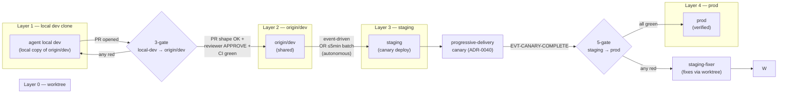

# Branch Pipeline Architecture — Four-Layer Auto-Promotion

> **Status:** pending approval. **Owner:** `axis-foundry`. **Date:** 2026-05-12.

## 1. Thesis

The repository operates **four layers** for code-in-flight — a per-agent worktree, an agent-local clone of `dev`, the shared `origin/dev`, and the long-lived deployment branches `staging` and `prod`. Two human-free gates run between these layers: a **3-gate verification** (PR shape + reviewer-agent `APPROVE` + CI green) at the **local-dev → origin/dev** boundary (the first shared-world entry), and a **5-gate verification** (comments-resolved + CI-green ≥ N runs + canary-100% + zero-SLO-fast + optional reviewer-re-affirm) at the **staging → prod** boundary. `origin/dev → staging` is fully autonomous. No human presses a button at any transition.

The model deliberately deviates from the hyperscaler-default trunk-based posture (per `.omc/scratch/hyperscaler-best-practices-2026-05-12.md` §branch-merge-strategy). Trade-off documented in [`velocity-without-stability-loss.md`](velocity-without-stability-loss.md).

## 2. The four layers

| Layer | Name | Mutator | Gate inbound | Consumer |
|---|---|---|---|---|
| 2 | `origin/dev` (shared remote dev branch) | only `dev-promoter` agent via PR auto-merge | **3-gate** (§4): PR shape + reviewer-`APPROVE` + CI green | downstream agents pulling new dev for sync; `staging-promoter` for promotion |
| 3 | `staging` (canary-deployment branch) | only `staging-promoter` agent | **none** (autonomous) — CI was already green at dev entry | canary cohort + internal eval; SLO observations accumulate |
| 4 | `prod` (verified production branch) | only `prod-promoter` agent | **5-gate** (§5): comments-resolved + CI-green ≥ N + canary-100% ≥ M + zero-SLO-fast + optional reviewer-re-affirm | GA tenants honouring autonomy ceiling |

## 3. Promotion graph

## 4. local-dev → origin/dev promotion gate (the 3 checks)

Target design: `dev-promoter` agent (per [`agent-roles-spec.md`](agent-roles-spec.md) §2) orchestrates. **All three must be green** for auto-merge after the planned lanes below are wired as active required contexts; until then, promotion is limited to current branch-protection checks plus recorded review evidence:

1. **PR shape conforms.** Five H2 sections per the project PR template; planned advisory lane: `oya-governance-pr-shape` (planned blocker).
3. **CI cleared.** Every fitness lane on PR HEAD is GREEN. Planned advisory lane: `oya-governance-promotion-gate-local-dev-to-origin-dev` (planned blocker, gate-class).

Promotion mechanic: squash-merge into `origin/dev` (PR's merge commit). Linear history preserved; no merge commits.

No human button is the target automation contract. The PR opens automatically when the agent declares done; reviewer agents render on `pr.opened` / `pr.commit-pushed`; CI runs on push. Until the planned blocker lanes are active required contexts, `dev-promoter` may merge only when current required checks are green and review/fix evidence is recorded.

## 5. staging → prod promotion gate (the 5 checks)

Target promotion fires automatically when **all five** are green on `staging` HEAD after the planned lanes are active; until then, this section is a design contract, not a claim that the missing lanes block production:

1. **All reviewer-agent comments resolved.** Every comment from the local-dev → origin/dev review thread carries `resolved: true` annotation OR a follow-up commit referencing the comment id (the follow-up went through the standard local-dev → origin/dev → staging path). Planned advisory lane: `oya-governance-pr-comment-resolution`.
2. **All CI fixed and green.** Every fitness lane GREEN on `staging` HEAD for ≥ **N consecutive runs** (default N=3; configurable per change class). Planned advisory lane: `oya-governance-promotion-gate-staging-to-prod`.
3. **Progressive-delivery canary at 100% on staging deployment for ≥ M hours.** Default M=24h non-regulated, 7d regulated (per [ADR-0040](../../../docs/decisions/ADR-0700-ci-admission-live-apex.md) + `.omc/advanced-cicd/progressive-delivery/canary-rail-spec.md`).
4. **Zero open `slo-burn-rate-fast` alerts.** SLO catalog freshness ≤ 5 min; planned verification lane: `oya-governance-slo-burn-rate-fast`.
5. **(Optional, per change class) Reviewer-agent re-affirms verdict after canary observations.** Triggered for: `database-reviewer`, `security-reviewer`, `privacy-reviewer`, `capability-reviewer`, `perf-reviewer` classes. Re-affirmation uses post-canary SLO + audit-chain evidence as input.

Promotion mechanic: `prod-promoter` agent fast-forwards `prod` to `staging` HEAD. Linear history preserved; Cosign-signed commit per [ADR-0039](../../../docs/decisions/ADR-0709-general-live-apex.md); SLSA L2+ provenance bundle attached.

**Exception path (Directive 12 carve-out).** Compliance-pack updates ([ADR-0034](../../../docs/decisions/ADR-0034-per-vertical-data-class-overrides.md)) and KMS root rotation ([ADR-0043](../../../docs/decisions/ADR-0702-identity-authz-live-apex.md)) add `requires_human_signoff: true`. Those classes only: `prod-promoter` requires a Cosign-signed approval commit from a `@council-architecture` member. No other class requires a human button.

## 6. Why this model, in one paragraph

The **review-and-CI gate lives at the first shared-world boundary** (local-dev → origin/dev), where the cost of catching mistakes is lowest and the reviewer-agent's signal is freshest against an agent-specific change set. The **canary + SLO gate lives at the runtime boundary** (staging → prod), where the data needed (real traffic, burn-rate samples) is only available post-deploy. `origin/dev → staging` is autonomous because the review and CI work were already done at dev entry; staging adds runtime observation, not re-verification. Reviewer **agents** are in the loop at the right gate; humans are not in the loop at any gate.

## 7. Anti-scope

This file does not own:

- Progressive-delivery mechanics inside `staging`/`prod` — owned by [ADR-0040](../../../docs/decisions/ADR-0700-ci-admission-live-apex.md) + `.omc/advanced-cicd/progressive-delivery/`.
- Per-axis fitness-lane definitions beyond the promotion-related lanes — owned by per-axis ADRs.
- Reviewer-agent implementations — owned by `docs/AGENTS.md`.
- Branch-server / CI-server choice — encoded provider-agnostically in [`branch-protection-rules.md`](branch-protection-rules.md).

## 8. Lift target

`oyatie/docs/release/branch-pipeline/branch-pipeline-architecture.md` on approval.
