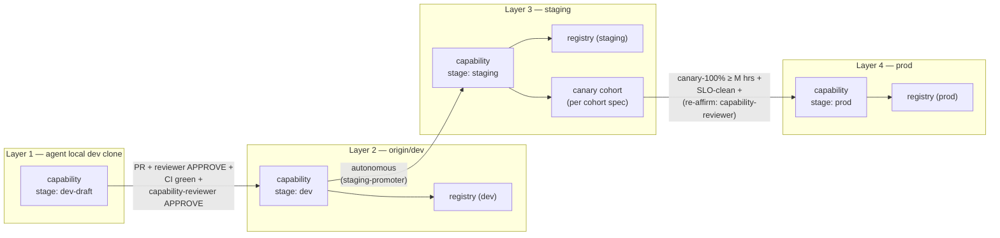

# Foundry Pipeline Mirror — Capability Stages in Lockstep with Branch Layers

> **Status:** pending approval. **Owner:** `axis-foundry`. **Date:** 2026-05-12.

## 1. Thesis

Foundry capabilities (per [ADR-0021](../../../docs/decisions/ADR-0700-ci-admission-live-apex.md)) move through the **same four-layer lifecycle** as code, in **lockstep with the branch pipeline**. A capability defined on the agent's local-dev clone is `stage: dev-draft`; a capability published to the registry from `origin/dev` is `stage: dev`; promoted autonomously to `staging`, it is `stage: staging`; promoted via the 5-gate verification to `prod`, it is `stage: prod`. This makes the capability lifecycle a deployment-pipeline artifact, not a separate registry-only concept.

## 2. The four capability stages

| Stage | Source layer | Consumer cohort | Evidence requirement | Mutator |
|---|---|---|---|---|
| `dev-draft` | agent local dev clone (Layer 1) | only the originating agent | `evidence: not-required` (private) | the working agent |
| `dev` | `origin/dev` (Layer 2) | dev-tier consumers + internal eval | `evidence: partial-acceptable` (smoke + replay sample) | `dev-promoter` agent (via PR merge that includes capability record) |
| `staging` | `staging` (Layer 3) | dev-tier + staging-tier consumers + canary cohort | `evidence: pass` (full replay; eval-harness green per [ADR-0024](../../../docs/decisions/ADR-0709-general-live-apex.md)) | `staging-promoter` agent (autonomous) |
| `prod` | `prod` (Layer 4) | all consumers honouring autonomy ceiling ([ADR-0022](../../../docs/decisions/ADR-0709-general-live-apex.md)) | `evidence: pass` + canary-100% + SLO-clean + comments-resolved + (per change class) reviewer re-affirm | `prod-promoter` agent |

## 3. Capability-record schema extension

The existing `templates/capability-record-template.yaml` is extended with three NEW fields:

```yaml
# (existing fields per ADR-0021)
capability_id: <canonical id>
version: <semver>
provider: <provider id per ADR-0020>
# ...

# NEW fields (this composer)
stage: dev-draft | dev | staging | prod    # current lifecycle stage
stage_history:                              # append-only audit log
  - stage: dev-draft
    promoted_at: <rfc3339>
    promoter: <agent id>
  - stage: dev
    promoted_at: <rfc3339>
    promoter: dev-promoter
    pr_id: <int>
  # ... staging, prod
```

Fitness lane `oya-governance-capability-stage-binding` (BLOCKER) verifies the capability's `stage:` field matches the branch on which the record exists:

- `stage: dev-draft` ⇔ exists only in agent worktree / local-dev clone.
- `stage: dev` ⇔ exists in `origin/dev` capability registry.
- `stage: staging` ⇔ exists in `staging` registry.
- `stage: prod` ⇔ exists in `prod` registry.

Mismatch = BLOCKER. A capability with `stage: prod` defined on the `origin/dev` branch fails the lane; same for any other mismatch.

## 4. Foundry capability flow diagram



## 5. Gate parity with branch pipeline

| Branch transition | Capability transition | Gate alignment |
|---|---|---|
| worktree → local-dev (autonomous) | (capability defined in worktree; `stage: dev-draft` on merge to local-dev) | autonomous |
| local-dev → origin/dev (3-gate) | `dev-draft` → `dev` (3-gate **plus** `capability-reviewer` mandatory in the dispatch table for capability change class) | quality |
| origin/dev → staging (autonomous) | `dev` → `staging` (autonomous; eval-harness replay must be `pass`; canary cohort begins consuming) | autonomous |
| staging → prod (5-gate) | `staging` → `prod` (5-gate; `capability-reviewer` re-affirms post-canary per the dispatch table re-affirm column) | quality |

## 6. Eval-harness binding (extends ADR-0024)

Per [ADR-0024](../../../docs/decisions/ADR-0709-general-live-apex.md), every capability has an eval-set. The eval-harness runs:

- At local-dev → origin/dev gate: eval-set must be `evidence: partial-acceptable` (smoke + ≥ 10 replay samples).
- At origin/dev → staging boundary: eval-set runs in autonomous post-merge sweep; if `pass`, the capability is admitted to staging registry. If not, the capability is **demoted** (record removed from registry; capability rolls back to `stage: dev`).
- At staging → prod gate: eval-set must be `evidence: pass` on the full replay corpus.

Demotion semantics. A capability that fails its staging eval-harness sweep is **demoted** by writing a new capability record with `stage: dev` and a `demoted_at: <rfc3339>` field. The previous `stage: staging` record is marked `superseded_by: <demoted-record-id>` and removed from the staging registry's live view. Demotion does not propagate backward through the branch — the underlying code remains on staging — but the capability is no longer consumable at the staging tier. `staging-fixer` then picks up via `EVT-CAPABILITY-DEMOTED` to author the fix.

## 7. Cross-axis lockstep

When a capability change crosses an axis boundary (per [ADR-0011](../../../docs/decisions/ADR-0011-cross-axis-contract-registry.md)), all affected axes must promote in lockstep:

- Local-dev → origin/dev gate runs the cross-axis contract diff (`oya-contract-diff`) as part of the CI lane; any consumer axis with a broken contract fails the lane.
- Origin/dev → staging is autonomous; lockstep is preserved because origin/dev → staging is one mechanical fast-forward per axis.
- Staging → prod gate runs the cross-axis canary check: all consumer axes must observe canary-clean SLO on the new capability shape for ≥ M hours.

## 8. Autonomy ceiling honor (extends ADR-0022)

A capability's effective autonomy ceiling depends on its stage:

- `dev-draft`: ceiling = `manual-only` (no autonomous invocation).
- `dev`: ceiling = `internal-eval-only` (no consumer-tier invocation).
- `staging`: ceiling = `canary-cohort-only` (autonomy ceiling per the canary cohort definition).
- `prod`: ceiling = full per-capability ceiling per ADR-0022.

The runtime enforcer (per ADR-0022) consults `capability.stage` at invocation time and refuses any invocation whose context exceeds the stage-bounded ceiling.

## 9. Anti-scope

This file does not own:

- Capability registry implementation — owned by [ADR-0021](../../../docs/decisions/ADR-0700-ci-admission-live-apex.md).
- Eval-harness — owned by [ADR-0024](../../../docs/decisions/ADR-0709-general-live-apex.md).
- Autonomy-ceiling runtime — owned by [ADR-0022](../../../docs/decisions/ADR-0709-general-live-apex.md).

## 10. Lift target

`oyatie/docs/release/branch-pipeline/governance-pipeline-mirror.md` on approval.
