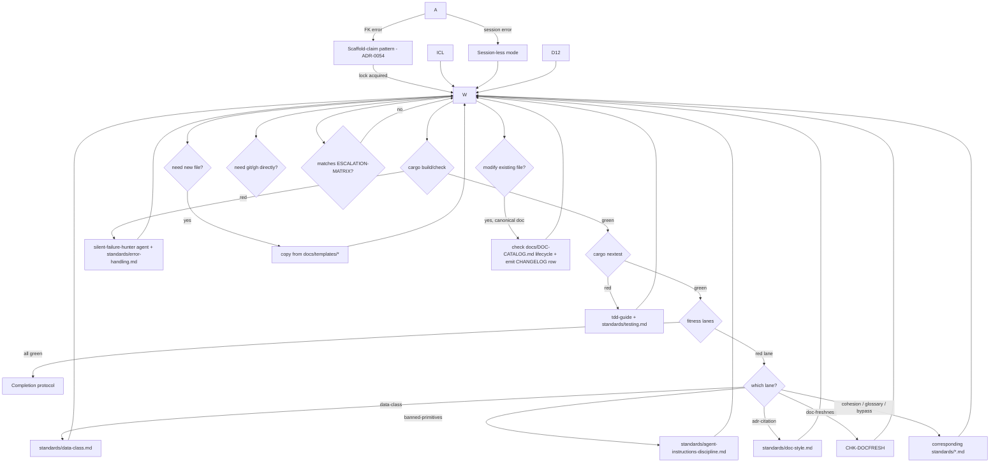

# Agent Decision Tree

Use this page when you are mid-work and an outcome forks. Resolve in-place where you can; halt only when [`ESCALATION-MATRIX.md`](ESCALATION-MATRIX.md) matches.

## Master flowchart




| Failure | Resolution |
|---|---|

## D2 — `cargo build` / `cargo check` fails

1. Run `tooling-agent-read log` on the build output (no raw `cargo` capture).
2. Invoke the `silent-failure-hunter` reviewer agent against the failing crate.
3. Apply [`docs/standards/error-handling.md`](../standards/error-handling.md) (`thiserror` in libs; `anyhow`/`eyre` at binary edge; no `unwrap` outside tests).
4. Lane that will block on the same defect: `governance-error-boundary` and `-no-unwrap-prod`.
5. Re-run; if green, store `errors-resolved`; if still red after two iterations and the cause is outside your claim scope, see D8.

## D3 — `cargo nextest` fails

| Failure shape | Resolution |
|---|---|
| New assertion failure in code you wrote | Invoke `tdd-guide`. Fix in worktree per [`docs/standards/testing.md`](../standards/testing.md). |
| Pre-existing flaky test surfaced | Quarantine to `flaky/` lane with a 14-day fix SLA (per `docs/AGENTS.md` §During-change). Open `MFL-NNNN` row. Do NOT mask. |
| Coverage budget regression | Add tests or extend proptest cases until `-test-evidence` lane green. |

## D4 — A fitness lane is red

Map lane → standard → resolution:

| Lane | Standard | Action |
|---|---|---|
| `governance-data-class` | [`standards/data-class.md`](../standards/data-class.md) | Add `oyatie.data_class = "..."` to every new kernel field. |
| `governance-banned-primitives` | [`standards/agent-instructions-discipline.md`](../standards/agent-instructions-discipline.md) | Move raw `git`/`gh` outside agent-instructions fence OR justify via Directive 12. |
| `governance-adr-citation` | [`standards/doc-style.md`](../standards/doc-style.md) | Cite the governing ADR by ID in PR body `## Summary`. |
| `governance-doc-freshness` | CHK-DOCFRESH | Update stale doc in this same PR. |
| `governance-cohesion` / `-glossary` / `-bypass` | [`standards/doc-style.md`](../standards/doc-style.md), [`standards/agent-instructions-discipline.md`](../standards/agent-instructions-discipline.md) | Apply the named correction. |
| `governance-lts-dependency` | [`standards/dependency-policy.md`](../standards/dependency-policy.md) | Pin to current LTS or add ADR-tracked exception. |
| `governance-image-discipline` | [`standards/image-discipline.md`](../standards/image-discipline.md) | Switch to distroless; trim layers; rerun. |
| `governance-autonomy-ceiling` | [`standards/autonomy-ceiling.md`](../standards/autonomy-ceiling.md) | Declare T1/T2/T3/T4 + Cedar policy. |
| `governance-audit-emission` | [`standards/observability.md`](../standards/observability.md) | Emit the `EVT-*` row. |

## D5 — Need to invoke `git` or `gh` directly (Directive 12)

```
  -i high -k "git,<context>"
# then invoke the raw command
```


## D6 — Need to create a new file

Pick the matching template under [`docs/templates/`](../templates/):

| File class | Template ID | Source |
|---|---|---|
| Implementation plan | TPL-IP | `docs/templates/implementation-plan-template.md` |
| Phase INDEX | TPL-PHASE | `docs/templates/phase-index-template.md` |
| Milestone INDEX | TPL-MILE | `docs/templates/milestone-index-template.md` |
| ADR | TPL-ADR | `docs/templates/adr-template.md` |
| Runbook | TPL-RUNBOOK | `docs/templates/runbook-template.md` |
| Capability record | TPL-CAP | `docs/templates/capability-record-template.yaml` |
| Design doc | TPL-DD | `docs/templates/design-doc-template.md` |
| PRFAQ | TPL-PRFAQ | `docs/templates/prfaq-template.md` |
| Evidence bundle | TPL-EVB | `docs/templates/evidence-bundle-template.json` |
| Postmortem | TPL-PM | `docs/templates/postmortem-template.md` |
| MISTAKES-LEDGER row | TPL-MFL | `docs/templates/mistakes-ledger-row-template.md` |

Copy the template; fill every required frontmatter field; do not delete `status: pending approval` until lift.

## D7 — Need to modify an existing file

1. Check its lifecycle in [`docs/DOC-CATALOG.md`](../DOC-CATALOG.md) (per `DOC-UPDATE-PROTOCOL.md`).
2. If canonical (Tier 0/1), emit a `CHANGELOG.md` row in the same PR.
3. If the file is under retired-legacy roots (`modules/`, `services/`, `platform/`, `tools/`) — REFUSE and pick the canonical replacement.

## D8 — Cannot resolve in current claim scope

Release claim cleanly (no halt yet). Pick a sibling IP. Emit:

```
```

This is NOT a halt — autonomy preserved. Halt only when [`ESCALATION-MATRIX.md`](ESCALATION-MATRIX.md) matches.

## D9 — Halt (last resort)

Exact format:

```
  -c "BLOCKED_ON_HUMAN_ORCHESTRATOR: <case-id from ESCALATION-MATRIX>: <one-line>" \
  -i critical -k "halt,<area>"
```

Then exit. The orchestrator's poll of `cutover-orchestrator-actions` will surface the row.
