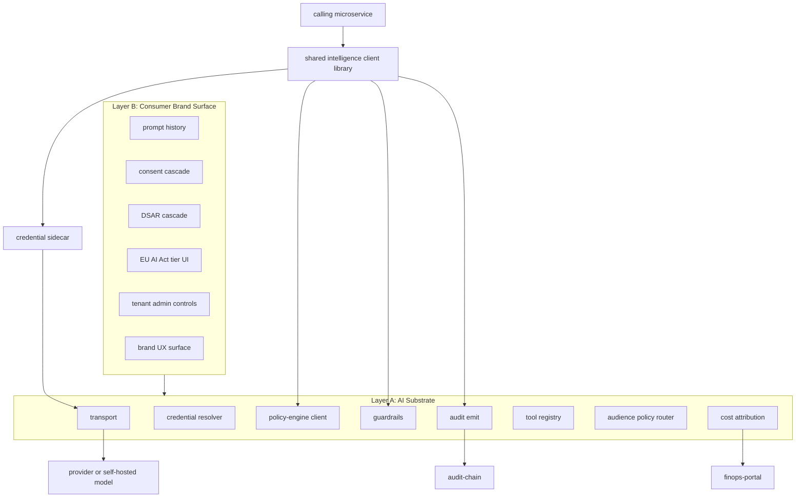
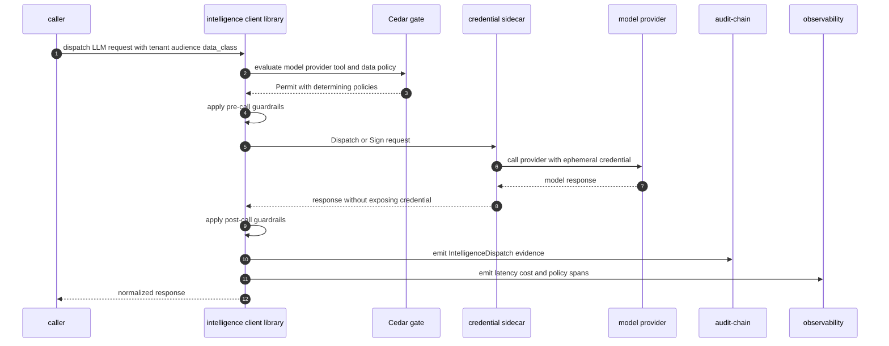
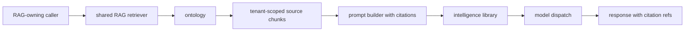

# AI Substrate Two-Layer Architecture

## Diagram Purpose

This diagram shows ADR-0255's two-layer intelligence architecture: an
audience-neutral AI substrate plus a consumer brand surface. It also reflects
the library-first amendment and ADR-0296 credential-sidecar correction so model
dispatch does not become a universal network mediator and caller processes do
not hold long-lived provider credentials or audit-signing keys.

Reference it when adding AI features, dispatching LLM or multimodal calls,
building consumer AI UX, adding provider adapters, reviewing RAG ownership, or
deciding whether an AI call should be library-first, network-opt-in, or routed
through a low-trust coordinator.

## Diagram

## Walkthrough

1. A caller owns the product context for the AI request.
2. The caller sets tenant, principal, audience tag, data class, and modality.
3. The caller uses the shared intelligence client library.
4. The default dispatch path is library-first.
5. The library constructs a Cedar evaluation.
6. Cedar evaluates provider, model, modality, tool, data, and audience policy.
7. A denied evaluation refuses before provider dispatch.
8. A permitted evaluation proceeds to pre-call guardrails.
9. Pre-call guardrails check prompt injection and data policy.
10. Credential material is resolved through the credential sidecar.
11. The caller process does not receive provider credentials.
12. The caller process does not hold audit-signing keys.
13. The sidecar uses ephemeral provider credentials.
14. The sidecar signs audit payloads where required.
15. Transport normalizes provider-specific request and response shapes.
16. Provider adapters include external and self-hosted families.
17. Post-call guardrails check response leakage and safety.
18. Audit emission records dispatch, credential, guardrail, and cost facts.
19. Observability records latency, error, model, provider, and policy signals.
20. FinOps receives per-call cost attribution.
21. Audience router carries audience as a call tag.
22. Audience is not a microservice property.
23. Internal platform operations are one audience tag.
24. B2B tenant product traffic is one audience tag.
25. B2C consumer traffic is one audience tag.
26. Developer platform traffic is one audience tag.
27. Oyatie self-modification traffic is one audience tag.
28. Layer A is audience-neutral substrate.
29. Layer B is consumer brand surface.
30. Prompt history belongs to Layer B.
31. Consent cascade belongs to Layer B.
32. DSAR cascade belongs to Layer B.
33. EU AI Act tier UI belongs to Layer B.
34. Tenant admin controls belong to Layer B.
35. Brand UX primitives belong to Layer B.
36. Embeddings may be a separate substrate service where lifecycle differs.
37. Fine-tuning may be a separate substrate service where lifecycle differs.
38. RAG retrieval belongs to the caller domain.
39. Ontology owns source graph and object context.
40. Shared RAG helpers can standardize retrieval patterns.
41. Citation construction remains caller-owned.
42. Tool discovery can be shared.
43. Tool invocation authority remains Cedar-gated.
44. Low-trust plugin code should not link the sidecar client directly.
45. Low-trust callers can route through a coordinator.
46. Network-side intelligence is opt-in, not default mediation.
47. Budget checkout is a network-opt-in use case.
48. Adapter registry refresh is not on the per-call hot path.
49. Tool registry snapshot refresh is not on the per-call hot path.
50. Rate-card refresh is not on the per-call hot path.
51. Consumer brand APIs remain server-side product surfaces.
52. Provider BYOK is tenant-scoped.
53. Default pool credentials are per-cell and provider-scoped.
54. Credential handles should have bounded lifetime.
55. Credential leak suspicion is a security signal.

## Key Decisions Cited

- [ADR-0243 Cedar as Universal Gate](../../decisions/ADR-0243-cedar-as-universal-gate.md)
- [ADR-0244 Tenant as Universal Scoping Primitive](../../decisions/ADR-0244-tenant-as-universal-scoping-primitive.md)
- [ADR-0255 Intelligence as Two-Layer AI Substrate](../../decisions/ADR-0255-intelligence-as-two-layer-ai-substrate.md)
- [ADR-0255 Library-First Network Opt-In Clarification](../../decisions/ADR-0355-amendment-library-first-network-opt-in-clarification.md)
- [ADR-0263 Observability Emission Contract](../../decisions/ADR-0263-observability-emission-contract.md)
- [ADR-0296 Library-First Credential Sidecar](../../decisions/ADR-0296-library-first-credential-sidecar.md)

## Implementation References

- Service: [microservices/intelligence/](../../../microservices/intelligence/)
- Service: [microservices/ontology/](../../../microservices/ontology/)
- Service: [microservices/cloud-secrets/](../../../microservices/cloud-secrets/)
- Service: [microservices/audit-chain/](../../../microservices/audit-chain/)
- Service: [microservices/observability/](../../../microservices/observability/)
- Service: [microservices/finops-portal/](../../../microservices/finops-portal/)
- Service: [microservices/workflow-engine/](../../../microservices/workflow-engine/)
- Service: [microservices/plugin-app-store/](../../../microservices/plugin-app-store/)
- Service: [microservices/developer-sdk/](../../../microservices/developer-sdk/)
- Crate family: [crates/intelligence-policy-domain/](../../../crates/intelligence-policy-domain/)
- Crate family: [crates/intelligence-route-policy-kernel/](../../../crates/intelligence-route-policy-kernel/)
- Standard: [Autonomy Ceiling](../../standards/autonomy-ceiling.md)
- Standard: [Data Class](../../standards/data-class.md)
- Standard: [Observability](../../standards/observability.md)
- Standard: [Cedar Policy Discipline](../../standards/cedar-policy-discipline.md)
- Standard: [WASM Runtime Canonical](../../standards/wasm-runtime-canonical.md)
- Standard: [Security Review](../../standards/security-review.md)
- Spec: [Platform architecture](../../../specs/platform-architecture.json)

## Failure Modes + Edge Cases

- The diagram does not show every provider adapter.
- The diagram does not show full prompt history schema.
- The diagram does not show all EU AI Act classifications.
- The diagram does not show every tool registry field.
- It does not permit direct credential caching in caller processes.
- It does not permit prompt payloads in audit rows.
- It does not move caller-owned RAG into the substrate.
- It does not make intelligence a universal mediator.
- It does not make consumer brand UX available to internal-only calls by default.
- A Cedar denial must stop dispatch.
- A guardrail denial must stop dispatch or response release.
- A sidecar outage should fail closed for credential-required calls.
- Low-trust WASM callers need a mediator.
- Network opt-in must be policy-controlled.
- Provider BYOK must resolve under tenant secret reference.
- Default provider pool must stay cell-scoped.
- Audit-signing keys must remain sidecar-only.
- Credential handle lifetime must be observable.
- Model response leakage should emit guardrail evidence.
- Tool invocation must be Cedar-gated.
- Tool registry refresh must not block hot-path calls.
- Rate-card refresh must not block hot-path calls.
- Fine-tuning data requires separate consent and provenance.
- Embedding collections must be tenant and cell scoped.
- Consumer prompt history must respect DSAR and retention.
- Internal self-modification calls should use audit-chain evidence, not consumer history.
- Cost attribution must include modality and provider rate card.
- Provider outage should use explicit fallback policy.
- Brownout behavior must be visible to caller and ops.
- Multimodal inputs require data-class-aware policy checks.

## Cross-References to Related Diagrams

- [Cedar Policy Evaluation Flow](cedar-policy-evaluation-flow.md)
- [Audit Chain Emission Pipeline](audit-chain-emission-pipeline.md)
- [Capability Tier Projection Flow](capability-tier-projection-flow.md)
- [Dual Tenant Identity Boundary](dual-tenant-identity-boundary.md)
- [Cell Routing Shuffle Sharding](cell-routing-shuffle-sharding.md)
- [Compliance Pack Overlay Precedence](compliance-pack-overlay-precedence.md)
- [Marketplace Deal Settlement Flow](marketplace-deal-settlement-flow.md)
- [Tenant Lifecycle State Machine](tenant-lifecycle-state-machine.md)
- [Inter-Microservice Call Graph](inter-microservice-call-graph.md)

## Dispatch Evidence Checklist

- `tenant_id`
- `principal_id`
- `audience_tag`
- `data_class`
- `modality`
- `provider_family`
- `model_id`
- `tool_id`
- `cedar_evaluation_id`
- `guardrail_policy_id`
- `secret_reference_slug`
- `credential_handle_id`
- `audit_id`
- `cost_center`
- `trace_id`
- `response_guardrail_result`
- `network_opt_in_policy_id`
- `provider_latency_ms`
