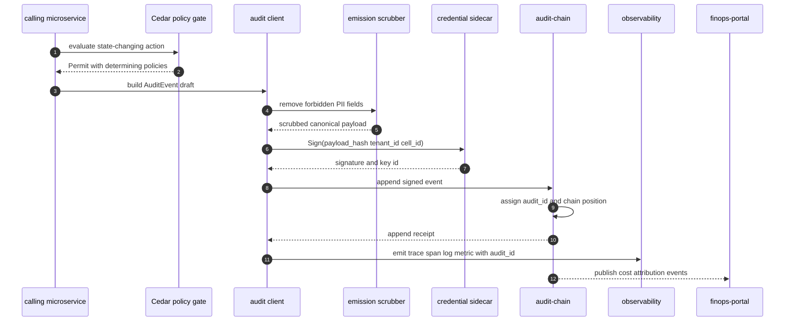
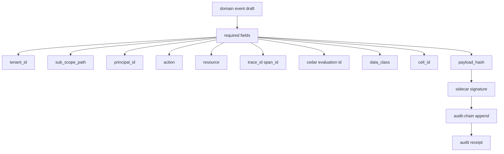
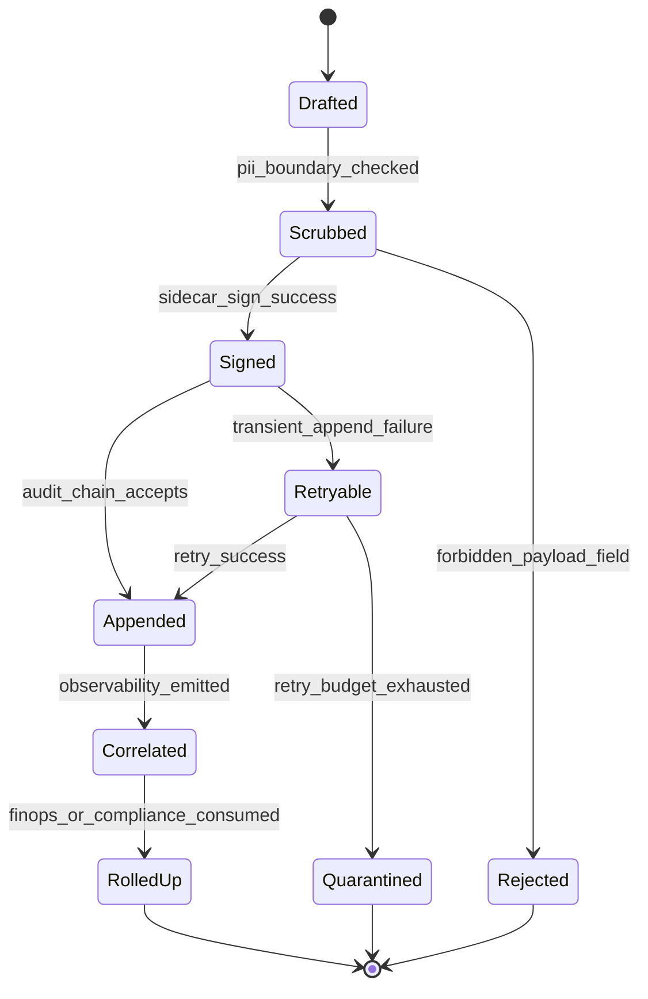

# Audit Chain Emission Pipeline

## Diagram Purpose

This diagram shows the audit emission contract that connects ADR-0263
observability emissions with ADR-0296 credential-sidecar signing. It focuses on
how a state-changing event becomes a scrubbed, tenant-scoped, trace-linked,
signed audit row before storage and downstream rollup.

Reference it when adding an event class, modifying audit-client libraries,
moving credential handling, or validating that observability and audit evidence
can be correlated. The diagram deliberately separates caller process,
credential sidecar, audit chain storage, observability, and FinOps consumers so
credential residency and evidence paths are reviewable.

## Diagram

## Walkthrough

1. A caller starts with a state-changing operation.
2. The caller must evaluate the action through Cedar before mutating state.
3. The Cedar response includes the evaluation identifier.
4. The caller builds an audit event draft after the policy result is known.
5. The draft includes tenant, sub-scope, principal, action, resource, and cell.
6. The draft includes trace context so observability can pivot to audit.
7. The draft includes data class so scrubbing can be deterministic.
8. The audit client is the local library boundary for event construction.
9. The scrubber removes payload fields that violate the emission contract.
10. The scrubber rejects events that cannot be made compliant.
11. A rejected event must not be silently dropped.
12. A rejected event should trigger a local error and observability signal.
13. The scrubbed payload is canonicalized before hashing.
14. The caller process never holds the audit-signing key.
15. The audit client sends the payload hash to the credential sidecar.
16. The sidecar verifies caller identity through its local protocol.
17. The sidecar chooses the per-cell, per-tenant signing key.
18. The sidecar signs the payload hash.
19. The sidecar returns a signature and key identifier.
20. The audit client appends the signed event to `audit-chain`.
21. `audit-chain` verifies signature and schema.
22. `audit-chain` assigns `audit_id`.
23. `audit-chain` assigns chain position or equivalent ordering evidence.
24. `audit-chain` returns an append receipt.
25. The audit client emits observability with the received `audit_id`.
26. Observability records metrics, traces, and structured logs.
27. FinOps consumes cost-attribution classes from audit stream or projection.
28. Compliance consumes evidence classes from audit stream or projection.
29. Ops dashboards read audit and observability correlation.
30. A transient append failure moves the event to retryable handling.
31. Retryable handling must preserve idempotency key and payload hash.
32. Retry exhaustion quarantines the event for operator review.
33. Quarantined events are not treated as successfully emitted.
34. PII scrubbing happens at emission boundary, not later in storage.
35. Trace context propagation follows ADR-0263.
36. The sidecar shape follows ADR-0296.
37. Intelligence dispatch uses the same sidecar principle for credentials.
38. Cedar evaluations always emit audit rows.
39. Tenant lifecycle transitions emit audit rows.
40. Marketplace settlements emit audit rows.
41. Role projection changes emit audit rows.
42. Compliance pack precedence decisions emit audit rows.
43. Cross-cell route decisions emit audit rows where policy-relevant.
44. Cross-tenant grants emit to all required tenant streams.
45. Personal/work boundary violations emit denial evidence.
46. Audit rows should carry schema version.
47. Event schema changes must be additive or follow migration handshake.
48. Audit storage is the evidence tier, not a business projection cache.
49. Read models may denormalize audit facts but cannot replace the chain.
50. Signing-key rotation must preserve verification for old events.
51. Sidecar memory isolation protects keys from compromised callers.
52. OpenBao response-wrapping bounds provider credential exposure.
53. Audit-signing keys are not issued as long-lived caller secrets.
54. Observability metrics should expose append latency and failure rate.
55. Audit append success is a necessary condition for many compliance claims.

## Key Decisions Cited

- [ADR-0003 Audit Chain and Evidence Emission](../../decisions/ADR-0003-audit-chain-and-evidence-emission.md)
- [ADR-0243 Cedar as Universal Gate](../../decisions/ADR-0243-cedar-as-universal-gate.md)
- [ADR-0244 Tenant as Universal Scoping Primitive](../../decisions/ADR-0244-tenant-as-universal-scoping-primitive.md)
- [ADR-0255 Intelligence as Two-Layer AI Substrate](../../decisions/ADR-0255-intelligence-as-two-layer-ai-substrate.md)
- [ADR-0263 Observability Emission Contract](../../decisions/ADR-0263-observability-emission-contract.md)
- [ADR-0296 Library-First Credential Sidecar](../../decisions/ADR-0296-library-first-credential-sidecar.md)
- [ADR-0311 Dual-Tenant Identity Boundary](../../decisions/ADR-0311-dual-tenant-identity-personal-vs-work-boundary.md)
- [ADR-0313 Conglomerate Tenant Hierarchy](../../decisions/ADR-0313-conglomerate-tenant-hierarchy-sovereign-children.md)
- [ADR-0314 Marketplace as Universal Deal Settlement](../../decisions/ADR-0314-marketplace-as-universal-deal-settlement.md)

## Implementation References

- Service: [microservices/audit-chain/](../../../microservices/audit-chain/)
- Service: [microservices/observability/](../../../microservices/observability/)
- Service: [microservices/cloud-secrets/](../../../microservices/cloud-secrets/)
- Service: [microservices/intelligence/](../../../microservices/intelligence/)
- Service: [microservices/identity/](../../../microservices/identity/)
- Service: [microservices/tenancy/](../../../microservices/tenancy/)
- Service: [microservices/compliance/](../../../microservices/compliance/)
- Service: [microservices/finops-portal/](../../../microservices/finops-portal/)
- Crate family: [crates/eventing-domain/](../../../crates/eventing-domain/)
- Crate family: [crates/observability-domain/](../../../crates/observability-domain/)
- Crate family: [crates/intelligence-evidence-domain/](../../../crates/intelligence-evidence-domain/)
- Standard: [Logging and Tracing](../../standards/logging-tracing.md)
- Standard: [Observability](../../standards/observability.md)
- Standard: [Request ID Canonical](../../standards/request-id-canonical.md)
- Standard: [Event Schema Versioning](../../standards/event-schema-versioning-canonical.md)
- Standard: [Data Class](../../standards/data-class.md)
- Standard: [FinOps Cost Attribution](../../standards/finops-cost-attribution-canonical.md)
- Standard: [Outbox Pattern](../../standards/outbox-pattern-canonical.md)
- Standard: [Image Signing Canonical](../../standards/image-signing-canonical.md)
- Spec: [Platform architecture](../../../specs/platform-architecture.json)
- Registry: [Check empirical evidence](../../../registry/check-empirical-evidence/)

## Failure Modes + Edge Cases

- The diagram does not show the full Merkle or chain-storage implementation.
- The diagram does not show every event class.
- The diagram does not show all retry backoff timings.
- The diagram does not show dead-letter queue storage.
- The diagram does not show key ceremony or Shamir recovery.
- The diagram does not show full OpenBao token issuance.
- The diagram does not show all sidecar UDS operations.
- It does not permit callers to hold audit-signing keys.
- It does not permit storage-layer-only PII scrubbing.
- It does not permit audit rows without tenant context.
- It does not permit audit rows without trace context where request scoped.
- It does not permit state-changing operations without audit evidence.
- A failed audit append may require compensating the domain mutation.
- A synchronous mutation may need outbox-backed audit retry.
- A high-risk operation may need append receipt before success response.
- A low-risk event may allow async append but still requires delivery evidence.
- Quarantined events must be visible to ops and compliance.
- Sidecar outage should fail closed for signing-required event classes.
- Duplicate retries must preserve idempotency key.
- Payload hash mismatch must reject append.
- Signature key id must support historical verification.
- Per-tenant signing keys must not bleed across tenants.
- Per-cell signing keys must support cell evacuation and rotation.
- Cross-tenant audit events may need dual-stream append.
- Conglomerate parent reads may need parent and child stream sealing.
- Personal/work boundary events may require special privacy redaction.
- AI dispatch events may need provider and model identifiers but no prompt payload.
- Cost attribution events should expose units and cost center.
- Compliance events should cite active pack and overlay version.
- Observability emissions should avoid PII content payloads.
- The diagram does not replace event schema authoring standards.
- The diagram does not replace service runbooks for audit backlog incidents.

## Cross-References to Related Diagrams

- [Inter-Microservice Call Graph](inter-microservice-call-graph.md)
- [Cedar Policy Evaluation Flow](cedar-policy-evaluation-flow.md)
- [Tenant Lifecycle State Machine](tenant-lifecycle-state-machine.md)
- [Dual Tenant Identity Boundary](dual-tenant-identity-boundary.md)
- [Marketplace Deal Settlement Flow](marketplace-deal-settlement-flow.md)
- [Capability Tier Projection Flow](capability-tier-projection-flow.md)
- [Compliance Pack Overlay Precedence](compliance-pack-overlay-precedence.md)
- [AI Substrate Two-Layer Architecture](ai-substrate-two-layer-architecture.md)
- [Cell Routing Shuffle Sharding](cell-routing-shuffle-sharding.md)

## Audit Event Classes Highlighted

- `CedarEvaluation`
- `TenantLifecycle`
- `TenantLifecycleAck`
- `TenantLifecycleCompensate`
- `TenantBoundaryWorkPersonalRead`
- `TenantBoundaryOnboardingConsent`
- `TenantBoundaryOffboardingExport`
- `TenantBoundaryPersonalSurvived`
- `DealSetAccepted`
- `DealSetSettled`
- `RoleProjectionResolved`
- `RoleProjectionSwitched`
- `RoleProjectionDenied`
- `CompliancePackOverlayResolved`
- `CellRouteSelected`
