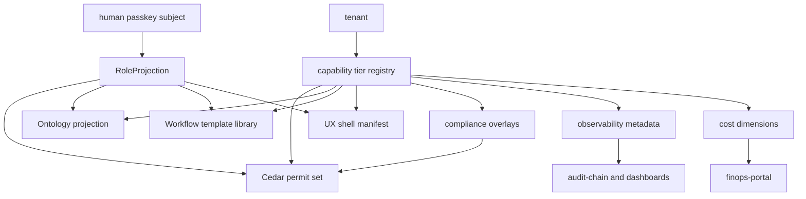
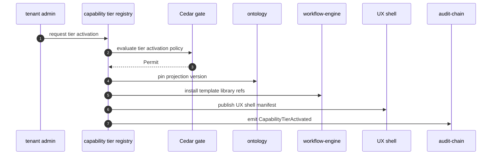
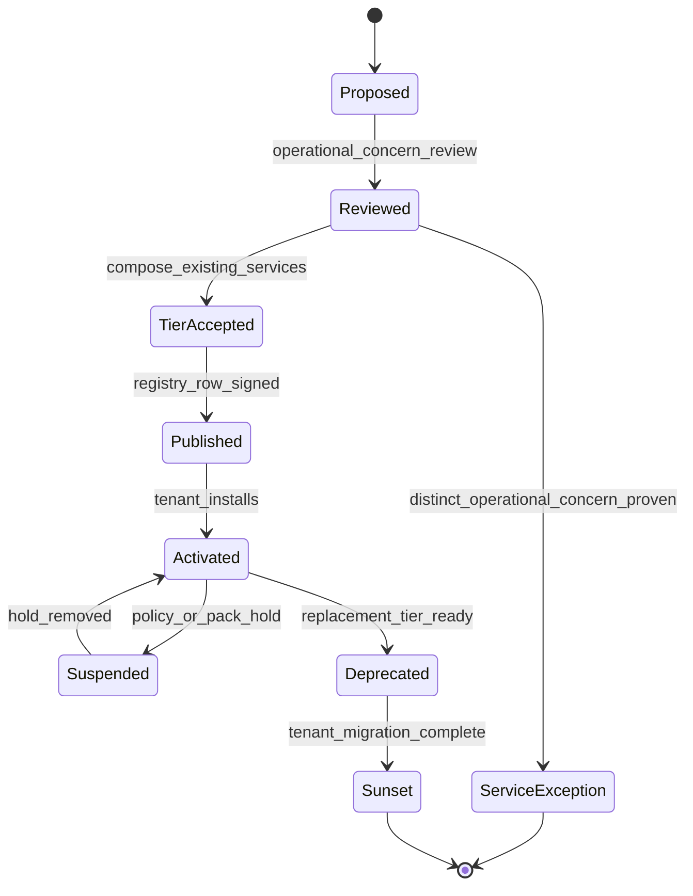

# Capability Tier Projection Flow

## Diagram Purpose

This diagram shows how ADR-0316 capability tiers and ADR-0317 role projections
compose. A tenant-visible product surface is not a new product-fragment
microservice; it is a signed activation bundle of Cedar permits, ontology
projections, workflow templates, UX shell manifests, compliance overlays,
observability metadata, and cost dimensions.

Reference it when a product category is proposed as a new microservice, when a
role-specific UI is added, or when an ERP or SaaS parity surface needs to be
activated for a tenant. The diagram helps reviewers distinguish a true
operational concern from a capability tier that should project over existing
flat services.

## Diagram

## Walkthrough

1. A product category proposal starts as a capability question.
2. Review first asks whether the category introduces a distinct operational concern.
3. If no distinct concern exists, the category becomes a capability tier.
4. If a distinct concern exists, a new flat microservice exception may be justified.
5. The tier registry records the tier identity and owner.
6. The tier registry records tenant activation requirements.
7. The tier registry references Cedar permit sets.
8. The tier registry references ontology projection versions.
9. The tier registry references workflow template libraries.
10. The tier registry references UX shell manifests.
11. The tier registry references compliance overlays.
12. The tier registry references observability metadata.
13. The tier registry references cost dimensions.
14. Tenant admin activation starts through the registry.
15. Cedar evaluates activation authority.
16. Cedar checks tenant tier, pack, jurisdiction, and entitlement context.
17. A permitted activation pins ontology projections.
18. A permitted activation installs workflow templates.
19. A permitted activation publishes UX shell manifests.
20. A permitted activation registers metrics and dashboards.
21. A permitted activation registers cost attribution dimensions.
22. Audit-chain records activation.
23. Human runtime access is mediated by RoleProjection.
24. RoleProjection binds principal, tenant, sub-scope, and role code.
25. RoleProjection selects the role-specific permit set.
26. RoleProjection selects the allowed ontology view.
27. RoleProjection selects the workflow template subset.
28. RoleProjection selects the UX shell variant.
29. RoleProjection selects device profile.
30. RoleProjection selects locale profile.
31. RoleProjection selects accessibility profile.
32. Role switching is not a new identity.
33. Role switching is not a tenant switch.
34. Role switching updates active projection and audit context.
35. A CRM tier can project over CRM, contact-center, community, mail, analytics, and workflow.
36. An HR tier can project over workplace-integration, payroll-adjacent flows, performance, learning, and workflow.
37. An ITSM tier can project over incident-management, tasks, workflow, observability, and community.
38. A procurement tier can project over marketplace, warehouse, global-trade, treasury, and workflow.
39. A financial planning tier can project over data-warehouse, finops, treasury, and analytics.
40. A support role should see cases and redacted diagnostics, not raw personal data.
41. A nurse role should see PHI only under healthcare pack and purpose constraints.
42. A parent role should see minor PII under minor-protection obligations.
43. A manager role should see team objects without personal inspection.
44. An auditor role should see sealed evidence and sampling workflows.
45. A developer role should see SDK artifacts and sandbox data.
46. The UX vocabulary stays unified across roles.
47. The workflow engine stays singular across roles.
48. The ontology stays canonical across roles.
49. Cedar remains the authority across roles.
50. Client-side navigation hiding is never authorization.
51. Tier deprecation requires replacement and tenant migration evidence.
52. Tier sunset requires audit evidence and support notices.
53. Suspended tiers retain evidence and controlled read paths.
54. Service exceptions must cite operational bottleneck evidence.
55. New product-fragment services are rejected without exception evidence.

## Key Decisions Cited

- [ADR-0243 Cedar as Universal Gate](../../decisions/ADR-0243-cedar-as-universal-gate.md)
- [ADR-0244 Tenant as Universal Scoping Primitive](../../decisions/ADR-0244-tenant-as-universal-scoping-primitive.md)
- [ADR-0251 Compliance Pack Cell Certification Levels](../../decisions/ADR-0251-compliance-pack-cell-certification-levels.md)
- [ADR-0314 Marketplace as Universal Deal Settlement](../../decisions/ADR-0314-marketplace-as-universal-deal-settlement.md)
- [ADR-0316 Capability Tier Over Product Fragmentation](../../decisions/ADR-0316-capability-tier-over-product-fragmentation.md)
- [ADR-0317 Role-Based Projection Unified UX Shell](../../decisions/ADR-0317-role-based-projection-unified-ux-shell.md)

## Implementation References

- Service: [microservices/tenancy/](../../../microservices/tenancy/)
- Service: [microservices/identity/](../../../microservices/identity/)
- Service: [microservices/ontology/](../../../microservices/ontology/)
- Service: [microservices/workflow-engine/](../../../microservices/workflow-engine/)
- Service: [microservices/workflow-studio/](../../../microservices/workflow-studio/)
- Service: [microservices/compliance/](../../../microservices/compliance/)
- Service: [microservices/audit-chain/](../../../microservices/audit-chain/)
- Service: [microservices/finops-portal/](../../../microservices/finops-portal/)
- Service: [microservices/crm/](../../../microservices/crm/)
- Service: [microservices/marketing-automation/](../../../microservices/marketing-automation/)
- Service: [microservices/workplace-integration/](../../../microservices/workplace-integration/)
- Service: [microservices/incident-management/](../../../microservices/incident-management/)
- Service: [microservices/tasks/](../../../microservices/tasks/)
- Standard: [Capability Tier Matrix](../../standards/capability-tier-matrix.md)
- Standard: [Capability Authoring](../../standards/capability-authoring.md)
- Standard: [Ontology Projection Substrate](../../standards/ontology-projection-substrate.md)
- Standard: [UX Best Practices](../../standards/ux-best-practices.md)
- Standard: [WCAG 2.2 AA Checklist](../../standards/wcag-2-2-aa-checklist.md)
- Spec: [Tenant model](../../../specs/tenant-model.json)
- Spec: [Ontology product spec](../../../specs/products/ontology.json)

## Failure Modes + Edge Cases

- The diagram does not show every Appendix role checklist from ADR-0317.
- The diagram does not show every capability tier candidate.
- The diagram does not show UX layout details.
- The diagram does not show every ontology object type.
- It does not allow a role shell to fork the identity model.
- It does not allow a role shell to fork the workflow engine.
- It does not allow a tier to bypass Cedar.
- It does not allow product labels to become hidden service boundaries.
- A stale role registry should invalidate cached projections.
- An ambiguous role should refuse mutation and show selector.
- A missing role-context indicator should block destructive actions.
- Cross-role data bleed should clear caches and emit high-severity audit.
- Accessibility gaps should block shell publication.
- Tier activation without pack compatibility should be denied.
- Tier activation without ontology projection pin should be denied.
- Tier activation without workflow templates should be denied.
- Tier activation without audit evidence should be denied.
- Tier deprecation without tenant migration should be blocked.
- Service exception requests need performance, isolation, or contract evidence.
- Naming convenience is not a service exception.
- Department ownership is not a service exception.
- ERP module names are not service boundaries by default.
- Client-side feature flags cannot replace tenant activation.
- Cost attribution must follow tier and sub-scope.
- Compliance overlays must be consumed by Cedar, UX, workflow, and audit.
- Locale and accessibility profiles cannot weaken authorization.
- Device profiles cannot alter Cedar authority.
- Role switch latency should be measured and visible.
- Role switch audit rows should not carry protected payloads.
- Tier manifests must be signed and versioned.

## Cross-References to Related Diagrams

- [Inter-Microservice Call Graph](inter-microservice-call-graph.md)
- [Dual Tenant Identity Boundary](dual-tenant-identity-boundary.md)
- [Cedar Policy Evaluation Flow](cedar-policy-evaluation-flow.md)
- [Audit Chain Emission Pipeline](audit-chain-emission-pipeline.md)
- [Marketplace Deal Settlement Flow](marketplace-deal-settlement-flow.md)
- [Compliance Pack Overlay Precedence](compliance-pack-overlay-precedence.md)
- [Tenant Lifecycle State Machine](tenant-lifecycle-state-machine.md)
- [AI Substrate Two-Layer Architecture](ai-substrate-two-layer-architecture.md)
- [Cell Routing Shuffle Sharding](cell-routing-shuffle-sharding.md)

## Tier Manifest Minimum Fields

- `capability_tier_id`
- `tenant_activation_policy_ref`
- `cedar_permit_set_refs`
- `ontology_projection_refs`
- `workflow_template_library_refs`
- `ux_shell_manifest_ref`
- `device_profile_refs`
- `locale_profile_refs`
- `accessibility_profile_refs`
- `compliance_overlay_refs`
- `observability_dashboard_refs`
- `cost_dimension_refs`
- `migration_policy_ref`
- `sunset_policy_ref`
- `owner_team`
- `tier_status`
- `tenant_scope_rules`
- `sub_scope_rules`
- `role_projection_refs`
- `audit_event_catalog_refs`
- `support_runbook_refs`
- `rollback_policy_ref`
- `service_exception_evidence_ref`
- `accessibility_evidence_ref`
- `localization_profile_refs`
- `signed_manifest_digest`
- `activation_audit_id`
