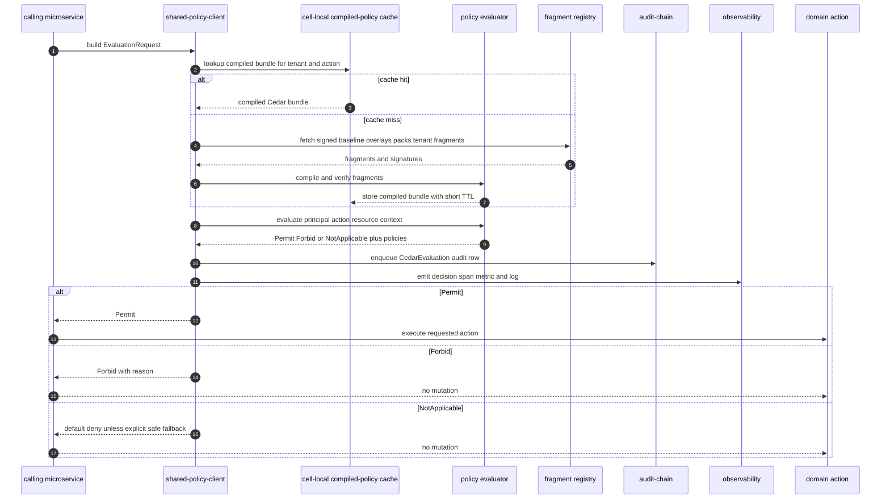
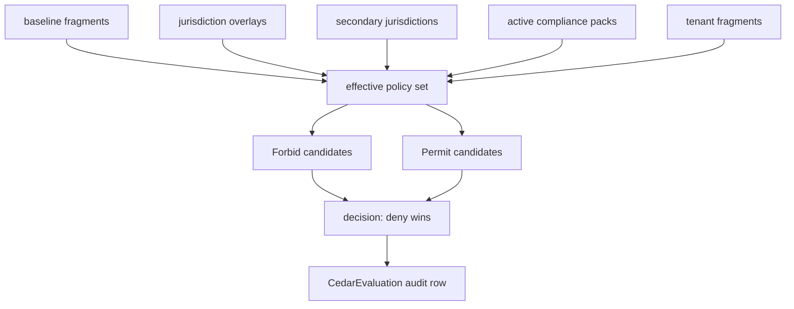
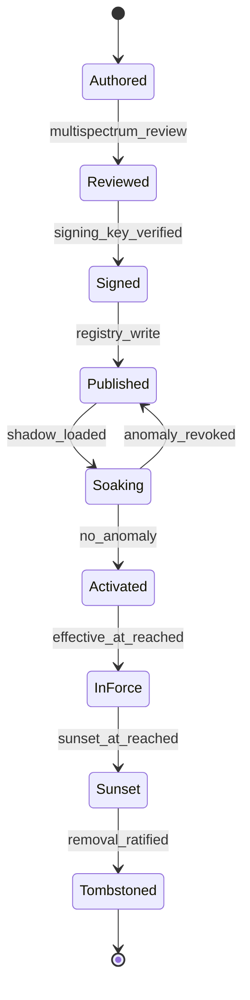

# Cedar Policy Evaluation Flow

## Diagram Purpose

This diagram shows the ADR-0243 policy evaluation contract: code never decides
policy directly; code constructs a Cedar evaluation request, receives a bounded
decision, emits audit and observability evidence, and then acts or refuses. It
is the reference for authorization, activation, routing, retention, compliance,
cost-attribution, feature, quota, and cross-cell gates.

Reference this diagram when reviewing a new gate, adding a compliance pack
overlay, authoring a Cedar fragment, or challenging a policy-in-code shortcut.
The diagram is intentionally sequence-oriented because the most dangerous
failure mode is not a missing class diagram; it is a service taking a branch
before the policy evaluation result is known and audited.

## Diagram

## Walkthrough

1. A microservice receives a request with principal, action, resource, and context.
2. The service must identify the active `tenant_id`.
3. The service must include sub-scope context when the resource is scoped below tenant.
4. The service builds an `EvaluationRequest`.
5. The SDK owns transport, retry, timeout, and circuit-breaker behavior.
6. The SDK first looks for a compiled policy bundle in the cell-local cache.
7. A cache hit keeps the hot path under the ADR-0243 p99 target.
8. A cache miss fetches signed fragments from the fragment registry.
9. Baseline fragments always participate in evaluation.
10. Jurisdiction overlays participate according to tenant residency and operations.
11. Secondary jurisdictions participate for multi-jurisdiction tenants.
12. Compliance pack fragments participate when the tenant has active packs.
13. Tenant fragments participate only inside the restrictions ADR-0243 allows.
14. The SDK verifies fragment signatures before compilation.
15. The evaluator compiles fragments into a bounded Cedar bundle.
16. The compiled bundle is cached with a short TTL.
17. The evaluator runs Cedar against principal, action, resource, and context.
18. The result is `Permit`, `Forbid`, or `NotApplicable`.
19. Determining policies and applied fragments are part of the response.
20. `Forbid` wins over any permit in the effective policy set.
21. `NotApplicable` means no policy matched and normally becomes deny.
22. A default-deny fragment should catch NotApplicable for covered actions.
23. The SDK enqueues a `CedarEvaluation` audit event for every evaluation.
24. The SDK emits decision latency and outcome metrics.
25. The SDK emits a span containing gate identity and decision status.
26. The caller acts only after receiving `Permit`.
27. The caller must not perform mutation after `Forbid`.
28. The caller must not perform mutation after `NotApplicable`.
29. A denied call may return a typed refusal to the API layer.
30. A denied call may also trigger a security or compliance signal.
31. Fragment authoring starts outside the hot path.
32. Fragments are reviewed before signing.
33. Signed fragments are published to the registry.
34. Published fragments enter a shadow soak window before enforcement.
35. Shadow evaluation records anomalies without changing enforcement decisions.
36. An anomaly returns the fragment to the published but non-enforcing state.
37. A clean soak promotes the fragment to activated.
38. Activation is per-cell and bounded by hot-reload semantics.
39. In-force fragments apply until sunset.
40. Sunset fragments must remain retrievable for evidence.
41. Tombstoned fragments require a separate removal decision where regulatory commitments exist.
42. Cedar handles policy decisions, not algorithmic computation.
43. Kyverno remains the Kubernetes admission policy lane.
44. Business logic runs after policy allows the action.
45. Configuration values remain configuration unless they decide eligibility.
46. Cross-cell traffic permits are Cedar gates.
47. Audit-stream selection is a Cedar gate.
48. Cost-center selection is a Cedar gate.
49. Feature activation is a Cedar gate.
50. Compliance pack activation is a Cedar gate.
51. DSAR cascade scope is a Cedar gate.
52. Retention sunset override is a Cedar gate.
53. New policy-class branches should start as Cedar fragments.
54. Static analysis should reject policy-in-code branches.
55. Coverage checks should require permit and default-deny fragments.

## Key Decisions Cited

- [ADR-0150 Cedar Policy Engine](../../decisions/ADR-0150-cedar-policy-engine.md)
- [ADR-0183 Cedar App Authz and Kyverno Admission](../../decisions/ADR-0183-policy-engine-separation-cedar-app-authz-kyverno-admission.md)
- [ADR-0243 Cedar as Universal Gate](../../decisions/ADR-0243-cedar-as-universal-gate.md)
- [ADR-0244 Tenant as Universal Scoping Primitive](../../decisions/ADR-0244-tenant-as-universal-scoping-primitive.md)
- [ADR-0248 Amazon Shape Cellular Architecture](../../decisions/ADR-0248-amazon-shape-cellular-architecture.md)
- [ADR-0251 Compliance Pack Cell Certification Levels](../../decisions/ADR-0251-compliance-pack-cell-certification-levels.md)
- [ADR-0263 Observability Emission Contract](../../decisions/ADR-0263-observability-emission-contract.md)
- [ADR-0311 Dual-Tenant Identity Boundary](../../decisions/ADR-0311-dual-tenant-identity-personal-vs-work-boundary.md)
- [ADR-0313 Conglomerate Tenant Hierarchy](../../decisions/ADR-0313-conglomerate-tenant-hierarchy-sovereign-children.md)

## Implementation References

- Service: [microservices/identity/](../../../microservices/identity/)
- Service: [microservices/tenancy/](../../../microservices/tenancy/)
- Service: [microservices/compliance/](../../../microservices/compliance/)
- Service: [microservices/audit-chain/](../../../microservices/audit-chain/)
- Service: [microservices/observability/](../../../microservices/observability/)
- Cell ownership: [tenancy §cell-assignment](../../../microservices/tenancy/ARCHITECTURE.md#cell-assignment), [cloud-iac §cell-provisioning](../../../microservices/cloud-iac/ARCHITECTURE.md#cell-provisioning), [observability §cell-health](../../../microservices/observability/ARCHITECTURE.md#cell-health), [api-gateway §cell-aware-routing](../../../microservices/api-gateway/ARCHITECTURE.md#cell-aware-routing), [audit-chain §cell-scoped-audit](../../../microservices/audit-chain/ARCHITECTURE.md#cell-scoped-audit), and [shuffle-sharding](../../../crates/shuffle-sharding/README.md).
- Service: [microservices/feature-flags/](../../../microservices/feature-flags/)
- Service: [microservices/cloud-secrets/](../../../microservices/cloud-secrets/)
- Service: [microservices/governance/](../../../microservices/governance/)
- Crate family: [crates/policy-cedar-domain/](../../../crates/policy-cedar-domain/)
- Crate family: [crates/policy-cedar-api/](../../../crates/policy-cedar-api/)
- Standard: [Cedar Policy Authoring](../../standards/cedar-policy-authoring.md)
- Standard: [Cedar Policy Discipline](../../standards/cedar-policy-discipline.md)
- Standard: [Regulatory Pack AuthzPolicy Overlays](../../standards/regulatory-pack-authzpolicy-overlays.md)
- Standard: [Authz Tier Boundaries](../../standards/authz-tier-boundaries.md)
- Standard: [Request ID Canonical](../../standards/request-id-canonical.md)
- Standard: [Event Schema Versioning](../../standards/event-schema-versioning-canonical.md)
- Spec: [Cedar fragment schema](../../../specs/cedar-fragment-schema.json)
- Spec: [Compliance pack schema](../../../specs/compliance-pack-schema.json)
- Spec: [Platform architecture](../../../specs/platform-architecture.json)

## Failure Modes + Edge Cases

- The diagram does not show Cedar entity schema authoring.
- The diagram does not show the complete contents of a Cedar fragment.
- The diagram does not show Kyverno admission evaluation.
- The diagram does not show every retry and timeout branch in the SDK.
- The diagram does not authorize services to cache permit results indefinitely.
- A stale cache must fail closed when no valid fallback exists.
- A policy registry outage must not permit unknown actions.
- A missing default-deny fragment is a coverage failure.
- A NotApplicable result is not a permit.
- A tenant fragment cannot override a baseline forbid.
- A compliance pack forbid wins over a baseline permit.
- A jurisdiction overlay can narrow allowed actions.
- A service cannot skip audit emission because the decision was denied.
- A service cannot skip observability because the decision was cached.
- Shadow soak decisions must not enforce before activation.
- Fragment signing keys are outside this diagram.
- Root key ceremony is outside this diagram.
- Emergency fragment hot-reload still needs audit evidence.
- Policy evaluation should not perform domain mutations.
- Domain algorithms should not be moved into Cedar.
- Static configuration should not be relabeled as policy unless it controls eligibility.
- Policy evaluation latency must be measured at the SDK boundary.
- Cross-cell decisions need cell context in the request.
- Cross-tenant decisions need both source and target tenant context.
- Personal-to-work and work-to-personal boundaries require explicit grants.
- Parent-child conglomerate grants require dual audit streams.
- Marketplace settlement gates need counterparty context.
- Capability-tier projection gates need role and tenant tier context.
- AI dispatch gates need audience tag, data class, provider, and model context.
- DSAR gates need legal-hold and retention context.
- Audit-stream selection must be determined before event dispatch.
- Cost-center selection must be reproducible from audit evidence.

## Cross-References to Related Diagrams

- [Inter-Microservice Call Graph](inter-microservice-call-graph.md)
- [Tenant Lifecycle State Machine](tenant-lifecycle-state-machine.md)
- [Audit Chain Emission Pipeline](audit-chain-emission-pipeline.md)
- [Dual Tenant Identity Boundary](dual-tenant-identity-boundary.md)
- [Compliance Pack Overlay Precedence](compliance-pack-overlay-precedence.md)
- [Marketplace Deal Settlement Flow](marketplace-deal-settlement-flow.md)
- [Capability Tier Projection Flow](capability-tier-projection-flow.md)
- [AI Substrate Two-Layer Architecture](ai-substrate-two-layer-architecture.md)
- [Cell Routing Shuffle Sharding](cell-routing-shuffle-sharding.md)

## Policy Gate Catalog Notes

- Authorization gates decide who can perform an action.
- Tenant-scope gates decide whether cross-tenant access is permitted.
- Data-class gates decide whether the caller may touch the data class.
- Jurisdiction gates add residency and statutory constraints.
- Compliance pack gates add tenant-adopted obligations.
- Reserved namespace gates protect platform-owned identifiers.
- Audit-emission gates decide event stream placement.
- Cost-attribution gates decide chargeback scope.
- Feature activation gates decide product eligibility.
- Quota gates decide rate-limit tier.
- Cross-cell gates decide cell-pair traffic.
- Encryption gates decide BYOK eligibility.
- DSAR gates decide erasure scope.
