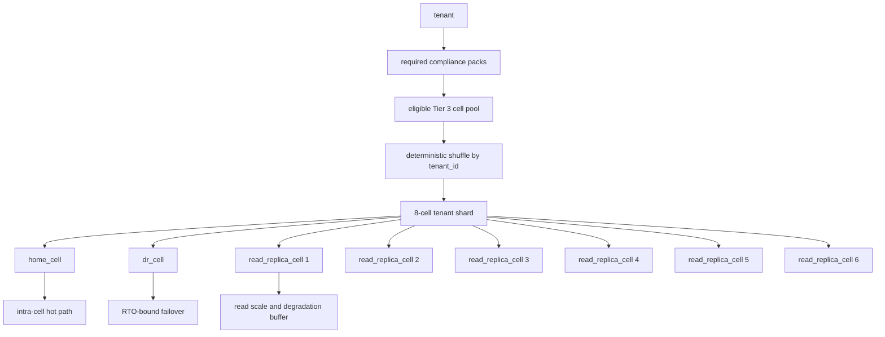
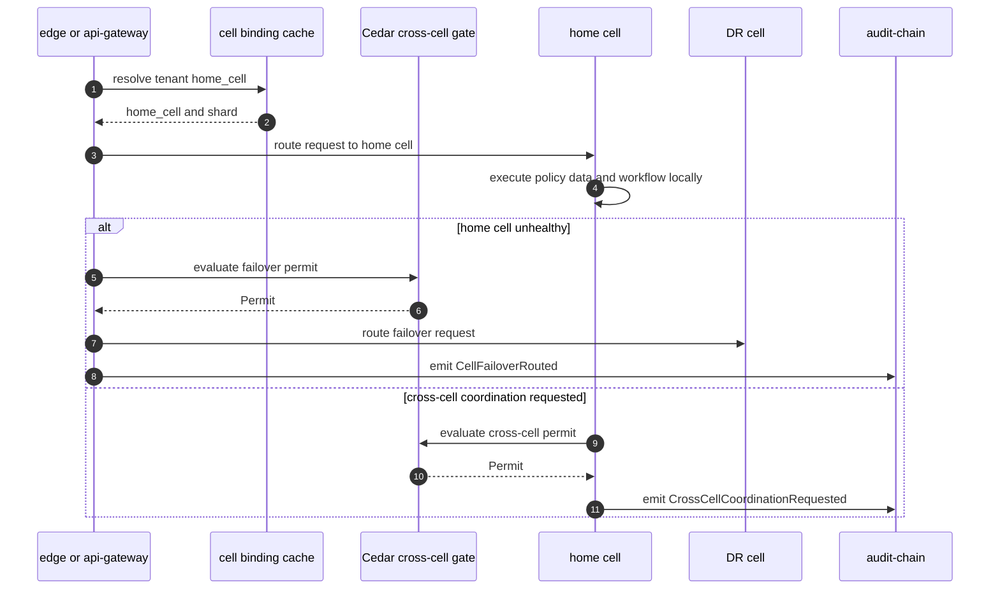
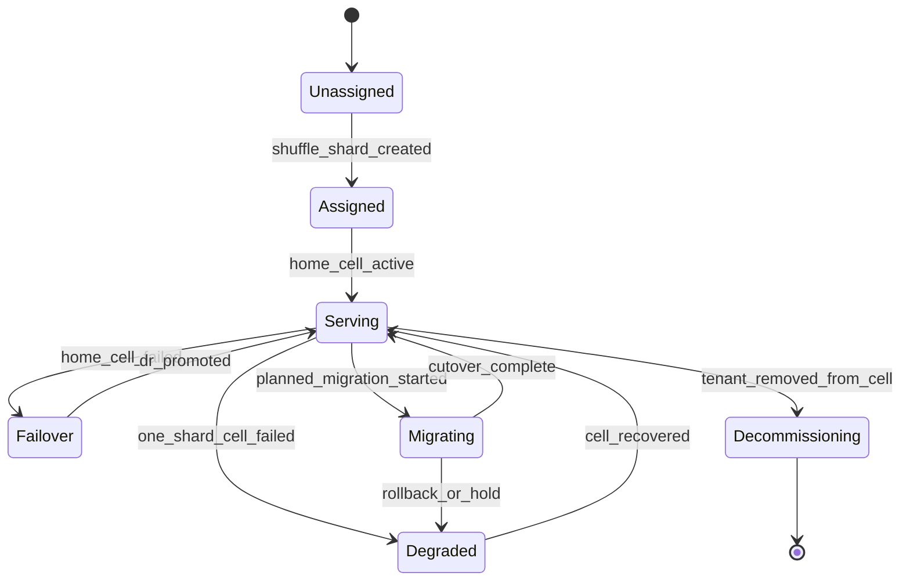

# Cell Routing Shuffle Sharding

## Diagram Purpose

This diagram shows the ADR-0248 cellular topology and shuffle-sharding route
selection flow. Cells are the blast-radius primitive: tenant hot paths resolve
inside the home cell, DR is preselected, read replicas are part of the shard,
and cross-cell calls are exceptional, asynchronous, Cedar-gated, and audited.

Reference it when implementing tenant-to-cell binding, selecting an eligible
cell pool, adding cross-cell calls, planning cell migration, reviewing static
stability, or deciding whether a workload belongs in Tier 2, Tier 3, or a
service cell.

## Diagram

## Walkthrough

1. A tenant declares required compliance packs.
2. Compliance packs constrain the eligible cell pool.
3. Cell certification levels determine which cells can host the tenant.
4. The shuffle service uses tenant identity as deterministic seed.
5. The shuffle picks a shard of eight cells.
6. One shard member becomes `home_cell`.
7. One shard member becomes `dr_cell`.
8. Six shard members become read replica cells.
9. The tenant's hot writes go to home cell.
10. The tenant's hot reads resolve inside the home cell unless replica policy allows otherwise.
11. DR cell is preselected before failure.
12. Read replicas provide degradation buffer.
13. A single cell failure should not fully offline the tenant.
14. Home cell failure routes to DR under failover policy.
15. DR failure reduces recovery posture but does not affect home serving.
16. Read replica failure reduces read capacity only.
17. The gateway resolves tenant-to-cell binding from cache.
18. The cache supports static stability during Tier 2 outage.
19. Tier 3 data plane must tolerate control-plane isolation.
20. Cached Cedar fragments are part of static stability.
21. Cached tenant bindings are part of static stability.
22. Cached feature flags are part of static stability.
23. Cached identity validation data is part of static stability.
24. Hot path policy evaluation is cell-local.
25. Hot path database writes are cell-local.
26. Hot path workflow execution is cell-local.
27. Hot path observability emission is cell-local.
28. Hot path vector search is cell-local.
29. Hot path inference should be cell-local.
30. Cross-cell tenant data reads are forbidden on hot path.
31. Cross-cell coordination is explicit.
32. Cross-cell coordination is asynchronous where possible.
33. Cross-cell coordination is Cedar-gated.
34. Cross-cell coordination is audit-logged.
35. Marketplace cells are service cells.
36. Dev-tools cells are service cells.
37. Audit-aggregator cells are service cells.
38. Analytics cells are service cells.
39. Ops-console cells are service cells.
40. Service cells consume substrate but do not host tenant product data.
41. Tier 1 bootstrap cell self-retires.
42. Tier 2 control plane cells hold authoritative state.
43. Tier 3 data plane cells host tenant workloads.
44. Tier 4 is reserved for post-certification workloads.
45. Cell auto-spawn triggers at capacity threshold.
46. Planned migration changes home and DR binding with audit evidence.
47. Decommission keeps rollback evidence for configured retention.
48. New cell pool changes require entropy and overlap review.
49. Deployment waves use cells as blast-radius boundaries.
50. Constant-work snapshots avoid per-change push storms.
51. Cell health signals should be visible in observability.
52. Cross-cell permits should be visible in dashboards.
53. Per-cell PUE and cost should feed FinOps.
54. Per-cell HSM partitions keep key fate bounded.
55. Every workload runs in a cell except edge POP layer.

## Key Decisions Cited

- [ADR-0009 Cell Architecture Per Tenant Per Region](../../decisions/ADR-0009-cell-architecture-per-tenant-per-region.md)
- [ADR-0243 Cedar as Universal Gate](../../decisions/ADR-0243-cedar-as-universal-gate.md)
- [ADR-0244 Tenant as Universal Scoping Primitive](../../decisions/ADR-0244-tenant-as-universal-scoping-primitive.md)
- [ADR-0248 Amazon Shape Cellular Architecture](../../decisions/ADR-0248-amazon-shape-cellular-architecture.md)
- [ADR-0251 Compliance Pack Cell Certification Levels](../../decisions/ADR-0251-compliance-pack-cell-certification-levels.md)
- [ADR-0263 Observability Emission Contract](../../decisions/ADR-0263-observability-emission-contract.md)

## Implementation References

- Cell ownership: [tenancy §cell-assignment](../../../microservices/tenancy/ARCHITECTURE.md#cell-assignment), [cloud-iac §cell-provisioning](../../../microservices/cloud-iac/ARCHITECTURE.md#cell-provisioning), [observability §cell-health](../../../microservices/observability/ARCHITECTURE.md#cell-health), [api-gateway §cell-aware-routing](../../../microservices/api-gateway/ARCHITECTURE.md#cell-aware-routing), [audit-chain §cell-scoped-audit](../../../microservices/audit-chain/ARCHITECTURE.md#cell-scoped-audit), and [shuffle-sharding](../../../crates/shuffle-sharding/README.md).
- Service: [microservices/cloud-iac/](../../../microservices/cloud-iac/)
- Service: [microservices/cloud-k8s/](../../../microservices/cloud-k8s/)
- Service: [microservices/cloud-network/](../../../microservices/cloud-network/)
- Service: [microservices/observability/](../../../microservices/observability/)
- Service: [microservices/tenancy/](../../../microservices/tenancy/)
- Service: [microservices/identity/](../../../microservices/identity/)
- Service: [microservices/audit-chain/](../../../microservices/audit-chain/)
- Service: [microservices/compliance/](../../../microservices/compliance/)
- Service: [microservices/marketplace/](../../../microservices/marketplace/)
- Service: [microservices/analytics/](../../../microservices/analytics/)
- Service: [microservices/ops-dashboard-control-center/](../../../microservices/ops-dashboard-control-center/)
- Standard: [GitOps IaC Cluster Tier Boundaries](../../standards/gitops-iac-cluster-tier-boundaries.md)
- Standard: [Sovereign Cloud Overlay](../../standards/sovereign-cloud-overlay.md)
- Standard: [DR Business Continuity](../../standards/dr-business-continuity.md)
- Standard: [Brownout Degradation Signal](../../standards/brownout-degradation-signal.md)
- Standard: [Cross-Microservice Latency Budget](../../standards/cross-microservice-latency-budget.md)
- Spec: [Platform architecture](../../../specs/platform-architecture.json)

## Failure Modes + Edge Cases

- The diagram does not show every cell tier field.
- The diagram does not show all K8s Helm chart details.
- The diagram does not show exact shard math for every pool size.
- The diagram does not show all migration rollback steps.
- It does not allow synchronous cross-cell hot-path reads.
- It does not allow Tier 3 hot path dependency on Tier 2 availability.
- It does not allow cells without certification checks for regulated tenants.
- It does not allow service cells to become product data stores.
- A no eligible cell result must block tenant activation.
- A home cell failure should route through DR policy.
- A stale binding cache must have bounded TTL.
- A missing cross-cell permit must block coordination.
- A cell health false positive can cause unnecessary failover.
- A cell health false negative can route traffic into an unhealthy cell.
- Read replica lag must be considered before promotion.
- Compliance pack changes can require cell migration.
- Cell certification expiry can require tenant migration.
- Capacity skew can require auto-spawn or rebalancing.
- Bad deploy waves must stop at first unhealthy cell wave.
- Bootstrap cell must not become permanent production substrate.
- Tier 2 control plane outage should not stop Tier 3 serving.
- Tier 0 dependency outage should be tolerated where static stability permits.
- HSM partition failure may block signing or KMS operations.
- Edge POP routing is adjacent but outside this main cell graph.
- Cross-region failover must preserve audit evidence.
- Cross-cell workflow should be durable and explicit.
- Cross-tenant collaboration must be both tenant and cell aware.
- Marketplace catalog cache should have visible staleness.
- Analytics service cells should not read hot tenant data directly.
- Audit aggregator cells should expose regulator query surfaces only by policy.

## Cross-References to Related Diagrams

- [Inter-Microservice Call Graph](inter-microservice-call-graph.md)
- [Tenant Lifecycle State Machine](tenant-lifecycle-state-machine.md)
- [Compliance Pack Overlay Precedence](compliance-pack-overlay-precedence.md)
- [Cedar Policy Evaluation Flow](cedar-policy-evaluation-flow.md)
- [Audit Chain Emission Pipeline](audit-chain-emission-pipeline.md)
- [AI Substrate Two-Layer Architecture](ai-substrate-two-layer-architecture.md)
- [Marketplace Deal Settlement Flow](marketplace-deal-settlement-flow.md)
- [Capability Tier Projection Flow](capability-tier-projection-flow.md)
- [Dual Tenant Identity Boundary](dual-tenant-identity-boundary.md)

## Cell Routing Evidence Checklist

- `tenant_id`
- `required_pack_ids`
- `eligible_cell_pool_id`
- `shuffle_seed`
- `shard_width`
- `home_cell`
- `dr_cell`
- `read_replica_cells`
- `binding_version`
- `cell_health_version`
- `cedar_cross_cell_permit_id`
- `route_reason`
- `failover_reason`
- `audit_id`
- `static_stability_cache_expiry`
- `cell_certification_level`
- `cell_capacity_utilization`
- `cell_health_status`
- `control_plane_snapshot_version`
- `cross_cell_coordination_kind`
- `migration_plan_id`
- `rollback_cell`
- `decommission_after`
- `operator_runbook_ref`
- `observability_dashboard_ref`
