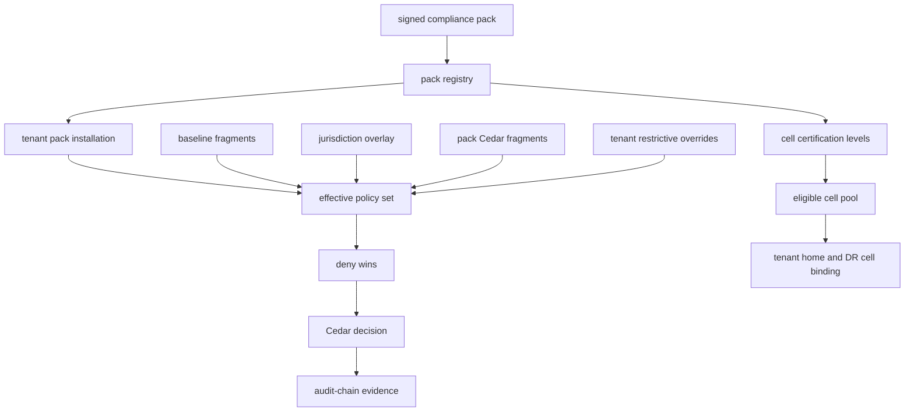
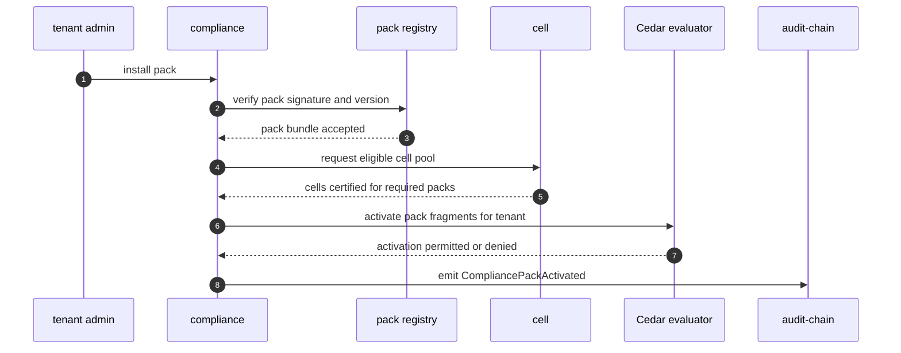
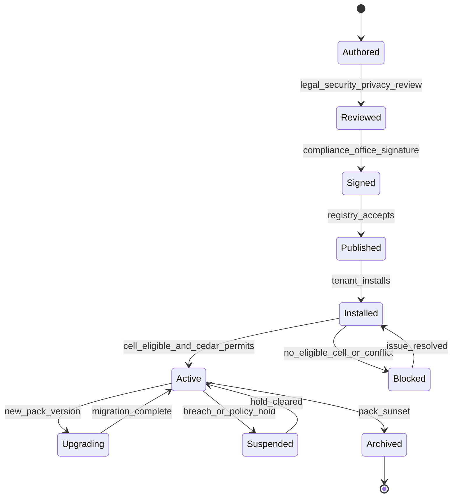

# Compliance Pack Overlay Precedence

## Diagram Purpose

This diagram shows how ADR-0251 Compliance Packs compose with Cedar policy,
cell certification levels, tenant installation, and audit evidence. The central
rule is simple: packs are versioned signed bundles, tenants install packs, cells
declare which packs they can host, Cedar evaluates active overlays, and forbid
rules win over permit rules.

Reference it when adding a regulation, activating a tenant pack, routing a
tenant to a certified cell, resolving cross-pack conflicts, or reviewing whether
a product-specific compliance check should instead live in a pack overlay.

## Diagram

## Walkthrough

1. A compliance pack starts as a regulation-specific bundle.
2. The bundle contains Cedar fragments.
3. The bundle contains audit-chain requirements.
4. The bundle contains data-class extensions.
5. The bundle contains cell eligibility rules.
6. The bundle contains retention rules.
7. The bundle contains consent requirements.
8. The bundle contains cross-tenant rules.
9. The bundle contains jurisdiction overlays.
10. The bundle contains DPIA templates.
11. The bundle contains breach-notification workflow references.
12. The bundle contains regulator evidence cadence.
13. The bundle contains agreement template references.
14. Legal, privacy, security, compliance, and SRE review the pack.
15. The compliance office signs the canonical pack content.
16. The registry verifies signature and version.
17. Tenants explicitly install packs.
18. Pack installation is a workflow, not an ad hoc flag.
19. The cell service resolves eligible cell pools.
20. Cells declare certification levels.
21. A tenant requiring HIPAA routes only to eligible cells.
22. A tenant requiring KR-PIPA routes only to eligible cells.
23. A tenant requiring multiple packs intersects eligibility.
24. If the cell pool is empty, activation blocks.
25. Cedar composes baseline fragments.
26. Cedar composes jurisdiction overlays.
27. Cedar composes active pack fragments.
28. Cedar composes restricted tenant overrides.
29. A forbid in any layer wins.
30. A tenant override cannot permit a baseline forbid.
31. A pack can narrow baseline behavior.
32. A jurisdiction overlay can narrow pack behavior.
33. Cross-pack conflicts resolve by the stricter rule.
34. Higher restriction wins when legal bases conflict.
35. Denial emits evidence.
36. Permit emits evidence.
37. Pack activation emits evidence.
38. Pack upgrade emits evidence.
39. Pack suspension emits evidence.
40. Pack sunset emits evidence.
41. Breach notification workflows are pack-specific.
42. DSAR requirements are pack-specific.
43. Retention requirements are pack-specific.
44. Consent copy is pack-specific.
45. DPA and BAA templates are pack-specific.
46. Regulator response is pack-scoped.
47. Drift is managed by pack version.
48. Cell certification calendars track audit cadence.
49. Tenant onboarding for regulated industries installs pack prerequisites.
50. Product services consume pack decisions through Cedar.
51. Product services do not duplicate legal interpretation.
52. Observability emits pack-aware metrics without protected payloads.
53. Audit-chain records active pack set at decision time.
54. FinOps can attribute compliance overhead by pack.
55. Pack content is not a marketing certificate by itself.

## Key Decisions Cited

- [ADR-0243 Cedar as Universal Gate](../../decisions/ADR-0243-cedar-as-universal-gate.md)
- [ADR-0244 Tenant as Universal Scoping Primitive](../../decisions/ADR-0244-tenant-as-universal-scoping-primitive.md)
- [ADR-0248 Amazon Shape Cellular Architecture](../../decisions/ADR-0248-amazon-shape-cellular-architecture.md)
- [ADR-0251 Compliance Pack Cell Certification Levels](../../decisions/ADR-0251-compliance-pack-cell-certification-levels.md)
- [ADR-0263 Observability Emission Contract](../../decisions/ADR-0263-observability-emission-contract.md)
- [ADR-0311 Dual-Tenant Identity Boundary](../../decisions/ADR-0311-dual-tenant-identity-personal-vs-work-boundary.md)
- [ADR-0316 Capability Tier Over Product Fragmentation](../../decisions/ADR-0316-capability-tier-over-product-fragmentation.md)

## Implementation References

- Service: [microservices/compliance/](../../../microservices/compliance/)
- Service: [microservices/governance/](../../../microservices/governance/)
- Service: [microservices/audit-chain/](../../../microservices/audit-chain/)
- Service: [microservices/tenancy/](../../../microservices/tenancy/)
- Cell ownership: [tenancy §cell-assignment](../../../microservices/tenancy/ARCHITECTURE.md#cell-assignment), [cloud-iac §cell-provisioning](../../../microservices/cloud-iac/ARCHITECTURE.md#cell-provisioning), [observability §cell-health](../../../microservices/observability/ARCHITECTURE.md#cell-health), [api-gateway §cell-aware-routing](../../../microservices/api-gateway/ARCHITECTURE.md#cell-aware-routing), [audit-chain §cell-scoped-audit](../../../microservices/audit-chain/ARCHITECTURE.md#cell-scoped-audit), and [shuffle-sharding](../../../crates/shuffle-sharding/README.md).
- Service: [microservices/identity/](../../../microservices/identity/)
- Service: [microservices/observability/](../../../microservices/observability/)
- Service: [microservices/finops-portal/](../../../microservices/finops-portal/)
- Standard: [Regulatory Pack AuthzPolicy Overlays](../../standards/regulatory-pack-authzpolicy-overlays.md)
- Standard: [Compliance Evidence Automation](../../standards/compliance-evidence-automation.md)
- Standard: [Data Class](../../standards/data-class.md)
- Standard: [Sovereign Cloud Overlay](../../standards/sovereign-cloud-overlay.md)
- Standard: [DR Business Continuity](../../standards/dr-business-continuity.md)
- Standard: [Privacy Review](../../standards/privacy-review.md)
- Standard: [Security Review](../../standards/security-review.md)
- Spec: [Compliance pack schema](../../../specs/compliance-pack-schema.json)
- Spec: [Cedar fragment schema](../../../specs/cedar-fragment-schema.json)
- Spec: [Platform architecture](../../../specs/platform-architecture.json)

## Failure Modes + Edge Cases

- The diagram does not define the legal content of any pack.
- The diagram does not claim certification is already achieved.
- The diagram does not show every regulation listed in ADR-0251.
- The diagram does not show all breach-notification timelines.
- The diagram does not show DPO or legal signoff ceremony details.
- A pack without signature must not activate.
- A pack without cell eligibility must not route tenant data.
- A tenant requiring incompatible packs may need separate sub-scopes.
- A pack conflict should deny until explicitly resolved.
- A permissive tenant override cannot weaken pack obligations.
- A product-specific shortcut cannot replace pack evaluation.
- Cross-pack traffic must be Cedar gated.
- Cross-pack data movement must record source and target obligations.
- Pack upgrade should preserve evidence for old versions.
- Pack sunset should archive old evidence.
- Breach notification timers may differ by jurisdiction.
- Retention timers may conflict and should choose the stricter obligation.
- DSAR erasure may be blocked by legal hold.
- Legal hold must be explicit and auditable.
- Regulator evidence cadence may differ by pack.
- Cell certification expiry should block new placements.
- Existing tenants may need migration if cell certification lapses.
- Pack activation can fail because no eligible cell exists.
- Pack activation can fail because agreement templates are missing.
- Pack activation can fail because DPIA is missing.
- Pack activation can fail because Cedar fragments are incomplete.
- Observability labels should include pack ids without payload content.
- Audit stream routing should include active pack context.
- Compliance pack is substrate, not certificate.
- Marketing claims must be separately gated.

## Cross-References to Related Diagrams

- [Cedar Policy Evaluation Flow](cedar-policy-evaluation-flow.md)
- [Audit Chain Emission Pipeline](audit-chain-emission-pipeline.md)
- [Cell Routing Shuffle Sharding](cell-routing-shuffle-sharding.md)
- [Tenant Lifecycle State Machine](tenant-lifecycle-state-machine.md)
- [Dual Tenant Identity Boundary](dual-tenant-identity-boundary.md)
- [Capability Tier Projection Flow](capability-tier-projection-flow.md)
- [Marketplace Deal Settlement Flow](marketplace-deal-settlement-flow.md)
- [AI Substrate Two-Layer Architecture](ai-substrate-two-layer-architecture.md)
- [Inter-Microservice Call Graph](inter-microservice-call-graph.md)

## Overlay Precedence Checklist

- Baseline fragments load first.
- Jurisdiction overlays load after baseline.
- Secondary jurisdiction overlays load when tenant operations require them.
- Pack fragments load for every active tenant pack.
- Tenant restrictive overrides load last.
- Forbids override permits.
- NotApplicable falls through to default deny.
- Tenant overrides cannot permit baseline forbids.
- Pack version is recorded.
- Overlay version is recorded.
- Cell certification level is recorded.
- Active pack set is recorded in audit evidence.
- Cross-pack traffic permit is recorded.
- Retention precedence is recorded.
- Breach workflow reference is recorded.
- DPIA template reference is recorded.
- Consent requirement reference is recorded.
- Agreement template reference is recorded.
- Regulator evidence cadence is recorded.
- Data-class extension version is recorded.
- Pack signer key id is recorded.
- Pack signature digest is recorded.
- Cell eligibility decision is recorded.
- Tenant installation workflow id is recorded.
- Pack activation audit id is recorded.
- Pack conflict decision is recorded.
- Pack upgrade source version is recorded.
- Pack upgrade target version is recorded.
- Pack suspension reason is recorded.
- Pack archive location is recorded.
