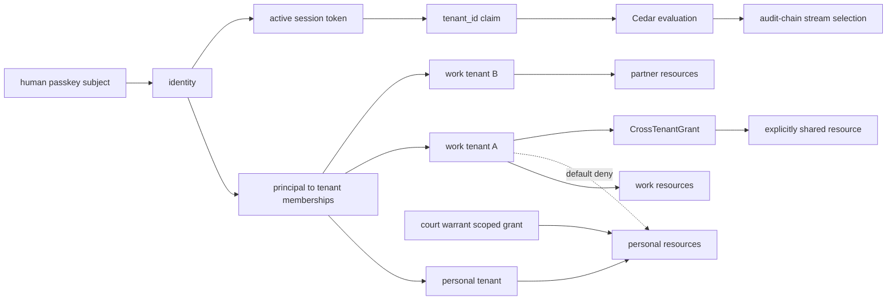
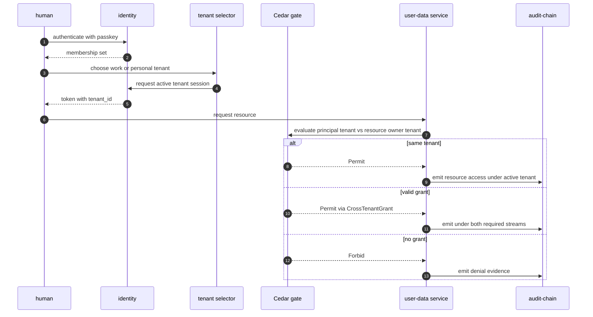
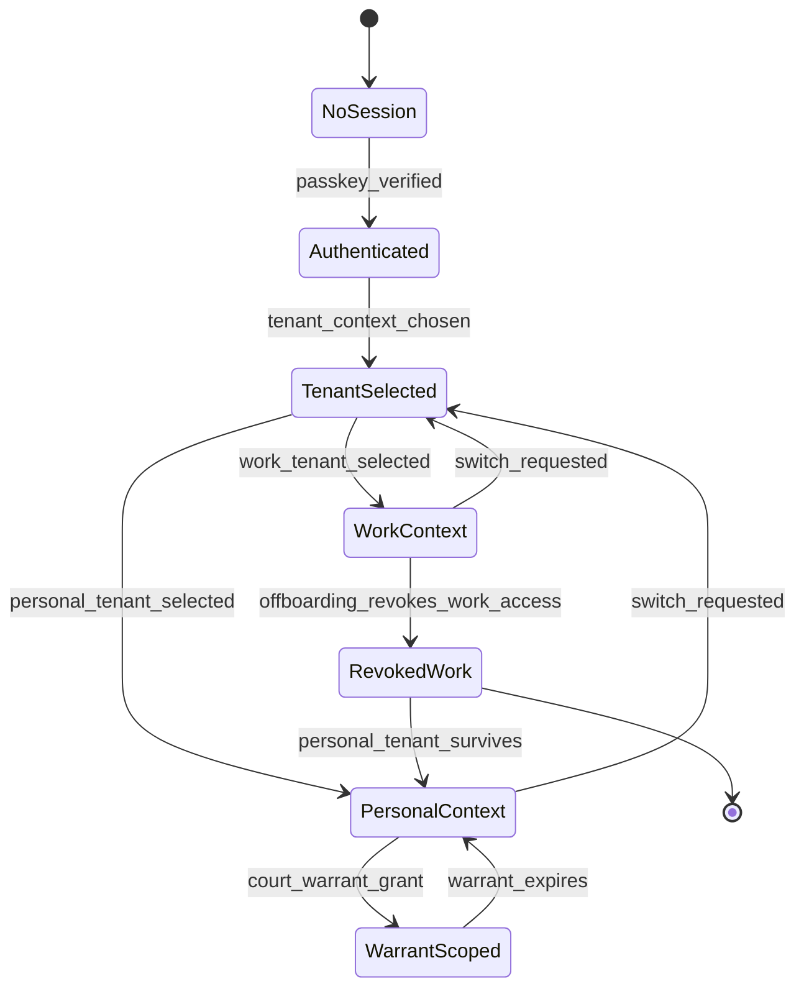

# Dual Tenant Identity Boundary

## Diagram Purpose

This diagram shows the personal-vs-work tenant boundary from ADR-0311. One
human can authenticate with one passkey and hold memberships in multiple
tenants, but every session token is bound to exactly one active tenant context;
work-tenant authority does not leak into personal-tenant resources without a
valid grant or warrant path.

Reference this diagram when building identity switching, work-profile surfaces,
offboarding flows, employee monitoring, support tooling, or any feature that
could confuse a human identity with the tenant context under which that human is
acting. It is also the bridge between tenant lifecycle, role projection, Cedar
policy evaluation, and audit-chain dual sealing.

## Diagram

## Walkthrough

1. Authentication starts with the human passkey subject.
2. The passkey proves the human identity, not the active tenant authority.
3. Identity resolves all tenant memberships for that human.
4. The membership set can contain one personal tenant.
5. The membership set can contain zero or more work tenants.
6. The membership set can contain partner or agency tenants.
7. The tenant selector chooses one active tenant context.
8. Identity issues a session token with a single `tenant_id` claim.
9. The selected tenant drives policy, audit, UX, and data projection.
10. A personal tenant resource is owned by the personal tenant.
11. A work tenant resource is owned by the employer or organization tenant.
12. A work principal cannot read a personal resource by suspicion.
13. Cedar default-deny blocks work-to-personal reads without grant.
14. Self-access is allowed only when the same human owns the personal context.
15. A court-warrant grant is a separate scoped legal path.
16. A CrossTenantGrant can authorize a specific shared resource.
17. CrossTenantGrant is explicit and auditable.
18. CrossTenantGrant does not create broad tenant equivalence.
19. Every user-data row declares `tenant_ownership_class`.
20. Work-owned rows declare `WORK_TENANT`.
21. Personal-owned rows declare `PERSONAL_TENANT`.
22. Platform-owned rows declare `PLATFORM_OWNED`.
23. Grant-mediated rows declare `CROSS_TENANT_VIA_GRANT`.
24. OpenAPI and AsyncAPI payloads carry tenant ownership metadata.
25. Cedar entity types carry tenant ownership metadata.
26. Postgres DDL carries a corresponding ownership constraint.
27. The UX shell must show the current tenant context.
28. The UX shell must distinguish personal and work contexts.
29. CLI and IDE surfaces must also expose active tenant context.
30. Work offboarding revokes work-tenant principal access.
31. Work offboarding does not delete the personal tenant.
32. Personal tenant data remains under personal jurisdiction rules.
33. Work data remains under employer compliance pack retention.
34. Onboarding captures labor-law consent for work-surface audit.
35. Offboarding exports portable data where required.
36. Cross-tenant audit events may emit to both tenant streams.
37. Personal/work denial events are themselves audit evidence.
38. Role projection builds on the active tenant context.
39. A role switch is not the same as a tenant switch.
40. A tenant switch can change the valid role projection set.
41. Employee monitoring is bounded by compliance pack and labor overlay.
42. Internal auditors read work-surface evidence, not personal data.
43. HR admins read work-surface HR records, not personal tenant notes.
44. Device management can manage work devices without owning personal devices.
45. Legal hold must cite the holding tenant.
46. Cross-tenant legal hold requires proper legal authority.
47. Support tooling should view redacted diagnostics by default.
48. Support escalation requires Cedar grant and audit reason.
49. The same passkey can continue after layoff for personal access.
50. The same passkey cannot preserve revoked work authority.
51. Resource ownership must be immutable after creation unless migration is audited.
52. Ambiguous ownership should refuse mutation.
53. Tenant-context indicator absence should block destructive actions.
54. Cache keys must include tenant and role projection identifiers.
55. Search indexes must be partitioned by tenant ownership class.

## Key Decisions Cited

- [ADR-0243 Cedar as Universal Gate](../../decisions/ADR-0243-cedar-as-universal-gate.md)
- [ADR-0244 Tenant as Universal Scoping Primitive](../../decisions/ADR-0244-tenant-as-universal-scoping-primitive.md)
- [ADR-0263 Observability Emission Contract](../../decisions/ADR-0263-observability-emission-contract.md)
- [ADR-0311 Dual-Tenant Identity Boundary](../../decisions/ADR-0311-dual-tenant-identity-personal-vs-work-boundary.md)
- [ADR-0312 Court-Warrant Scoped Piercing](../../decisions/ADR-0312-court-warrant-scoped-piercing.md)
- [ADR-0313 Conglomerate Tenant Hierarchy](../../decisions/ADR-0313-conglomerate-tenant-hierarchy-sovereign-children.md)
- [ADR-0317 Role-Based Projection Unified UX Shell](../../decisions/ADR-0317-role-based-projection-unified-ux-shell.md)

## Implementation References

- Service: [microservices/identity/](../../../microservices/identity/)
- Service: [microservices/tenancy/](../../../microservices/tenancy/)
- Service: [microservices/audit-chain/](../../../microservices/audit-chain/)
- Service: [microservices/workplace-integration/](../../../microservices/workplace-integration/)
- Service: [microservices/mail/](../../../microservices/mail/)
- Service: [microservices/messenger/](../../../microservices/messenger/)
- Service: [microservices/drive/](../../../microservices/drive/)
- Service: [microservices/calendar/](../../../microservices/calendar/)
- Service: [microservices/workflow-engine/](../../../microservices/workflow-engine/)
- Service: [microservices/workflow-studio/](../../../microservices/workflow-studio/)
- Service: [microservices/marketplace/](../../../microservices/marketplace/)
- Service: [microservices/community/](../../../microservices/community/)
- Service: [microservices/payments/](../../../microservices/payments/)
- Service: [microservices/observability/](../../../microservices/observability/)
- Standard: [Identity Vendor Isolation](../../standards/identity-vendor-isolation.md)
- Standard: [Step-Up Auth Classes](../../standards/step-up-auth-classes.md)
- Standard: [Privacy Review](../../standards/privacy-review.md)
- Standard: [Cedar Policy Discipline](../../standards/cedar-policy-discipline.md)
- Standard: [WCAG 2.2 AA Checklist](../../standards/wcag-2-2-aa-checklist.md)
- Spec: [Tenant model](../../../specs/tenant-model.json)
- Spec: [Platform architecture](../../../specs/platform-architecture.json)

## Failure Modes + Edge Cases

- The diagram does not show all labor-law overlays.
- The diagram does not show every surface ownership table from ADR-0311.
- The diagram does not show court warrant validation details.
- The diagram does not show passkey recovery.
- The diagram does not show device enrollment.
- The diagram does not show all role projections.
- It does not permit work tenants to inspect personal resources by default.
- It does not permit personal tenant erasure to delete employer records.
- It does not permit employer retention to capture personal tenant records.
- It does not imply a human can have two personal tenants.
- It does not imply one session can act under two tenants at once.
- A missing tenant context indicator should block critical mutations.
- A stale session token should be reissued before switching tenant.
- A revoked work membership should invalidate work sessions immediately.
- A grant must specify action, resource, scope, expiry, and audit stream.
- A warrant grant must be narrower than broad tenant access.
- Support access must be redacted and reason-coded.
- Search, cache, and notification systems must partition by tenant context.
- Cross-tenant notifications need explicit disclosure rules.
- Calendar free-busy sharing needs a grant and minimized payload.
- Mailbox ownership is immutable after provision unless migration is audited.
- Chat thread ownership is immutable after creation unless migration is audited.
- Drive folder ownership inherits from tenant unless a grant says otherwise.
- Marketplace seller identity can be personal or work depending on active tenant.
- Workplace investigations cannot browse personal tenant social content.
- Offboarding must prove personal tenant survival.
- A parent company grant cannot control an employee personal tenant.
- A child tenant in a conglomerate remains sovereign.
- Metrics should count boundary denials without exposing personal payloads.
- Audit rows must be sufficient for forensic reconstruction.

## Cross-References to Related Diagrams

- [Inter-Microservice Call Graph](inter-microservice-call-graph.md)
- [Tenant Lifecycle State Machine](tenant-lifecycle-state-machine.md)
- [Cedar Policy Evaluation Flow](cedar-policy-evaluation-flow.md)
- [Audit Chain Emission Pipeline](audit-chain-emission-pipeline.md)
- [Capability Tier Projection Flow](capability-tier-projection-flow.md)
- [Compliance Pack Overlay Precedence](compliance-pack-overlay-precedence.md)
- [Marketplace Deal Settlement Flow](marketplace-deal-settlement-flow.md)
- [AI Substrate Two-Layer Architecture](ai-substrate-two-layer-architecture.md)
- [Cell Routing Shuffle Sharding](cell-routing-shuffle-sharding.md)

## Boundary Evidence Checklist

- `principal_id` is present.
- `passkey_subject_id` is present where authentication evidence is needed.
- `session_tenant_id` is present.
- `resource_owner_tenant_id` is present.
- `tenant_ownership_class` is present.
- `cross_tenant_grant_id` is present when grant-mediated.
- `warrant_grant_id` is present when court-scoped.
- `labor_law_overlay_id` is present for work-audit actions.
- `consent_receipt_id` is present for onboarding audit.
- `offboarding_export_ref` is present for portable export.
- `audit_streams` names all streams receiving the event.
- `role_projection_id` is present when a UX shell is involved.
- `cache_partition_key` includes tenant and role projection.
- `denial_reason` uses a structured Cedar reason.
- `redaction_policy_id` is present for support or audit views.
