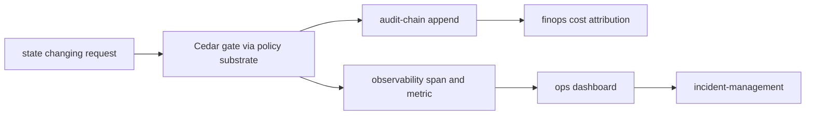

# Inter-Microservice Call Graph

## Diagram Purpose

This diagram shows the current full portfolio call graph for the 70 live
`microservices/*` directories in this checkout. It is a portfolio map, not a
per-endpoint contract: use it when deciding whether a proposed service call
belongs on the synchronous request path, the workflow-orchestrated path, or the
event/audit path.

Reference this diagram before adding a cross-microservice dependency, updating
`calls.yaml` surfaces, reviewing ADR-0145 compliance, or deciding whether a new
service belongs in an existing layer. The graph keeps substrate services on the
left, product and ERP domains in the middle, and customer surfaces on the right
so dependency direction is visible at review time.

## Diagram

```mermaid
graph LR
  subgraph L1["Edge, Identity, and Tenant Control"]
    api_gateway["api-gateway"]
    identity["identity"]
    tenancy["tenancy"]
    feature_flags["feature-flags"]
    consent_graph["consent-graph"]
    governance["governance"]
    compliance["compliance"]
    cell["cell"]
  end
  subgraph L2["Observability, Audit, and Platform Operations"]
    audit_chain["audit-chain"]
    observability["observability"]
    ops_dashboard_control_center["ops-dashboard-control-center"]
    incident_management["incident-management"]
    cloud_iac["cloud-iac"]
    cloud_k8s["cloud-k8s"]
    cloud_secrets["cloud-secrets"]
    network["network"]
  end
  subgraph L3["Knowledge, AI, Workflow, and Developer Substrate"]
    ontology["ontology"]
    intelligence["intelligence"]
    workflow_engine["workflow-engine"]
    workflow_studio["workflow-studio"]
    foundry["foundry"]
    developer_sdk["developer-sdk"]
    plugin_app_store["plugin-app-store"]
  end
  subgraph L4["Workspace Collaboration"]
    mail["mail"]
    comms_email["comms-email"]
    messenger["messenger"]
    calendar["calendar"]
    meet["meet"]
    recordings["recordings"]
    drive["drive"]
    docs["docs"]
    sheets["sheets"]
    slides["slides"]
    forms["forms"]
    sites["sites"]
    notes["notes"]
    whiteboard["whiteboard"]
    tasks["tasks"]
    translate["translate"]
    design_collaboration["design-collaboration"]
  end
  subgraph L5["Community, Commerce, and External Engagement"]
    marketplace["marketplace"]
    payments["payments"]
    community["community"]
    social["social"]
    shorts["shorts"]
    contact_center["contact-center"]
    connect["connect"]
    workplace_integration["workplace-integration"]
  end
  subgraph L6["Enterprise and ERP Domains"]
    crm["crm"]
    marketing_automation["marketing-automation"]
    financial_planning["financial-planning"]
    treasury["treasury"]
    supply_chain_planning["supply-chain-planning"]
    warehouse["warehouse"]
    production_planning["production-planning"]
    plant_maintenance["plant-maintenance"]
    quality_management["quality-management"]
    global_trade["global-trade"]
    contract_lifecycle_management["contract-lifecycle-management"]
    real_estate["real-estate"]
    healthcare_integration["healthcare-integration"]
    itsm["itsm"]
    learning_management["learning-management"]
    performance_management["performance-management"]
    application["application"]
  end
  subgraph L7["Data, Analytics, and Business Intelligence"]
    analytics["analytics"]
    data_pipeline["data-pipeline"]
    data_warehouse["data-warehouse"]
    detection["detection"]
    finops_portal["finops-portal"]
  end
  api_gateway --> identity
  api_gateway --> tenancy
  api_gateway --> feature_flags
  api_gateway --> consent_graph
  api_gateway --> cell
  api_gateway --> mail
  api_gateway --> messenger
  api_gateway --> calendar
  api_gateway --> marketplace
  api_gateway --> crm
  api_gateway --> analytics
  identity --> tenancy
  identity --> audit_chain
  identity --> compliance
  tenancy --> cell
  tenancy --> audit_chain
  tenancy --> compliance
  tenancy --> finops_portal
  tenancy --> governance
  feature_flags --> tenancy
  feature_flags --> audit_chain
  consent_graph --> identity
  consent_graph --> audit_chain
  governance --> audit_chain
  governance --> observability
  compliance --> tenancy
  compliance --> governance
  compliance --> audit_chain
  cell --> network
  cell --> cloud_k8s
  cell --> observability
  cloud_iac --> cloud_k8s
  cloud_iac --> cloud_secrets
  cloud_iac --> network
  cloud_k8s --> observability
  cloud_secrets --> identity
  cloud_secrets --> audit_chain
  network --> observability
  ops_dashboard_control_center --> observability
  ops_dashboard_control_center --> audit_chain
  ops_dashboard_control_center --> incident_management
  incident_management --> workflow_engine
  incident_management --> audit_chain
  foundry --> developer_sdk
  foundry --> workflow_engine
  foundry --> audit_chain
  foundry --> observability
  developer_sdk --> api_gateway
  developer_sdk --> docs
  plugin_app_store --> marketplace
  plugin_app_store --> developer_sdk
  plugin_app_store --> compliance
  ontology --> audit_chain
  ontology --> data_warehouse
  intelligence --> ontology
  intelligence --> cloud_secrets
  intelligence --> audit_chain
  intelligence --> observability
  workflow_engine --> tenancy
  workflow_engine --> audit_chain
  workflow_engine --> observability
  workflow_engine --> tasks
  workflow_studio --> workflow_engine
  workflow_studio --> ontology
  workflow_studio --> marketplace
  mail --> comms_email
  mail --> identity
  mail --> audit_chain
  comms_email --> observability
  messenger --> identity
  messenger --> audit_chain
  messenger --> observability
  calendar --> identity
  calendar --> meet
  calendar --> audit_chain
  meet --> recordings
  meet --> audit_chain
  recordings --> drive
  recordings --> audit_chain
  drive --> identity
  drive --> audit_chain
  docs --> drive
  docs --> design_collaboration
  docs --> audit_chain
  sheets --> drive
  sheets --> analytics
  slides --> drive
  forms --> workflow_engine
  forms --> data_pipeline
  sites --> drive
  sites --> analytics
  notes --> identity
  notes --> audit_chain
  whiteboard --> design_collaboration
  whiteboard --> audit_chain
  tasks --> workflow_engine
  tasks --> audit_chain
  translate --> intelligence
  translate --> audit_chain
  design_collaboration --> drive
  design_collaboration --> audit_chain
  marketplace --> payments
  marketplace --> compliance
  marketplace --> audit_chain
  marketplace --> workflow_engine
  payments --> treasury
  payments --> audit_chain
  community --> identity
  community --> messenger
  community --> audit_chain
  social --> identity
  social --> detection
  social --> audit_chain
  shorts --> social
  shorts --> intelligence
  shorts --> audit_chain
  contact_center --> crm
  contact_center --> messenger
  contact_center --> audit_chain
  connect --> identity
  connect --> workflow_engine
  connect --> audit_chain
  workplace_integration --> identity
  workplace_integration --> workflow_engine
  workplace_integration --> audit_chain
  crm --> marketing_automation
  crm --> contact_center
  crm --> audit_chain
  marketing_automation --> analytics
  marketing_automation --> compliance
  financial_planning --> data_warehouse
  financial_planning --> finops_portal
  treasury --> payments
  treasury --> global_trade
  treasury --> audit_chain
  supply_chain_planning --> warehouse
  supply_chain_planning --> production_planning
  warehouse --> global_trade
  warehouse --> quality_management
  production_planning --> plant_maintenance
  production_planning --> quality_management
  plant_maintenance --> warehouse
  quality_management --> compliance
  global_trade --> compliance
  global_trade --> treasury
  contract_lifecycle_management --> workflow_engine
  contract_lifecycle_management --> audit_chain
  real_estate --> financial_planning
  real_estate --> compliance
  healthcare_integration --> compliance
  healthcare_integration --> audit_chain
  itsm --> incident_management
  itsm --> workflow_engine
  learning_management --> performance_management
  learning_management --> audit_chain
  performance_management --> workplace_integration
  application --> api_gateway
  application --> identity
  analytics --> data_warehouse
  analytics --> observability
  data_pipeline --> data_warehouse
  data_pipeline --> audit_chain
  data_warehouse --> analytics
  data_warehouse --> finops_portal
  detection --> audit_chain
  detection --> incident_management
  finops_portal --> tenancy
  finops_portal --> audit_chain
```

## Walkthrough

1. The graph begins at `api-gateway` because north-south traffic enters there.
2. `api-gateway` calls `identity` for principal resolution.
3. `api-gateway` calls `tenancy` for active tenant context.
4. `api-gateway` calls `feature-flags` for product activation decisions.
5. `api-gateway` calls `consent-graph` for consent-visible surfaces.
6. `api-gateway` fans into collaboration, commerce, ERP, and analytics domains.
7. `identity` depends on `tenancy` because every principal acts under a tenant.
8. `identity` emits state-changing identity events to `audit-chain`.
9. `tenancy` owns tenant-to-cell binding and therefore calls `cell`.
10. `tenancy` emits lifecycle and hierarchy transitions to `audit-chain`.
11. `compliance` consumes tenant state and contributes pack obligations.
12. `governance` records portfolio control decisions and references audit evidence.
13. `cell` controls placement and delegates infrastructure realization to cloud layers.
14. `cloud-iac` realizes declarative infrastructure through `cloud-k8s`.
15. `cloud-secrets` holds secret paths and emits credential access evidence.
16. `network` owns cell and service-mesh reachability constraints.
17. `observability` receives metrics, logs, and traces from every layer.
18. `ops-dashboard-control-center` is read-oriented and should not own domain state.
19. `incident-management` orchestrates response through `workflow-engine`.
20. `foundry` uses `developer-sdk` and `workflow-engine` rather than bypassing them.
21. `developer-sdk` exposes supported external developer paths.
22. `plugin-app-store` sits between marketplace distribution and developer tooling.
23. `ontology` is the semantic substrate for graph-shaped product state.
24. `intelligence` calls `ontology` for caller-side retrieval context.
25. `intelligence` calls `cloud-secrets` only through the credential boundary.
26. `workflow-engine` is the durable orchestration substrate.
27. `workflow-studio` authors workflows; it does not execute durable state itself.
28. Collaboration services share `identity`, `drive`, and `audit-chain`.
29. `mail` and `comms-email` split product mailbox state from deliverability adapters.
30. `meet` records through `recordings`; recordings persist through `drive`.
31. `forms` initiates workflows and streams structured responses into `data-pipeline`.
32. `translate` depends on `intelligence` but must still emit tenant-scoped audit rows.
33. Commerce services settle through `marketplace`, `payments`, and `treasury`.
34. `community`, `social`, and `shorts` share identity and detection boundaries.
35. `workplace-integration` is the work-tenant bridge for HR and audit flows.
36. ERP services sit behind workflow, compliance, warehouse, treasury, and data layers.
37. `global-trade` bridges warehouse, compliance, and treasury.
38. `quality-management` feeds compliance evidence for regulated operations.
39. Data services consume events and audit references rather than owning source writes.
40. `detection` raises incidents and appends evidence for abuse or fraud decisions.
41. `finops-portal` reads usage and tenant hierarchy for chargeback and showback.
42. Every state-changing path should produce audit and observability emissions.
43. Every policy-class branch should route through Cedar before domain action.
44. Cross-cell traffic should be visible through `cell`, `network`, and observability.
45. New dependencies should preserve left-to-right layering unless an ADR authorizes it.

## Key Decisions Cited

- [ADR-0028 Cloud Microservice Architecture](../../decisions/ADR-0028-cloud-microservice-architecture.md)
- [ADR-0145 Inter-Microservice Communication Reform](../../decisions/ADR-0145-inter-microservice-communication-reform.md)
- [ADR-0243 Cedar as Universal Gate](../../decisions/ADR-0243-cedar-as-universal-gate.md)
- [ADR-0244 Tenant as Universal Scoping Primitive](../../decisions/ADR-0244-tenant-as-universal-scoping-primitive.md)
- [ADR-0248 Amazon Shape Cellular Architecture](../../decisions/ADR-0248-amazon-shape-cellular-architecture.md)
- [ADR-0263 Observability Emission Contract](../../decisions/ADR-0263-observability-emission-contract.md)
- [ADR-0311 Dual-Tenant Identity Boundary](../../decisions/ADR-0311-dual-tenant-identity-personal-vs-work-boundary.md)
- [ADR-0314 Marketplace as Universal Deal Settlement](../../decisions/ADR-0314-marketplace-as-universal-deal-settlement.md)
- [ADR-0316 Capability Tier Over Product Fragmentation](../../decisions/ADR-0316-capability-tier-over-product-fragmentation.md)
- [ADR-0317 Role-Based Projection Unified UX Shell](../../decisions/ADR-0317-role-based-projection-unified-ux-shell.md)

## Implementation References

- Service: [microservices/analytics/](../../../microservices/analytics/)
- Service: [microservices/api-gateway/](../../../microservices/api-gateway/)
- Service: [microservices/application/](../../../microservices/application/)
- Service: [microservices/audit-chain/](../../../microservices/audit-chain/)
- Service: [microservices/calendar/](../../../microservices/calendar/)
- Cell ownership: [tenancy §cell-assignment](../../../microservices/tenancy/ARCHITECTURE.md#cell-assignment), [cloud-iac §cell-provisioning](../../../microservices/cloud-iac/ARCHITECTURE.md#cell-provisioning), [observability §cell-health](../../../microservices/observability/ARCHITECTURE.md#cell-health), [api-gateway §cell-aware-routing](../../../microservices/api-gateway/ARCHITECTURE.md#cell-aware-routing), [audit-chain §cell-scoped-audit](../../../microservices/audit-chain/ARCHITECTURE.md#cell-scoped-audit), and [shuffle-sharding](../../../crates/shuffle-sharding/README.md).
- Service: [microservices/cloud-iac/](../../../microservices/cloud-iac/)
- Service: [microservices/cloud-k8s/](../../../microservices/cloud-k8s/)
- Service: [microservices/cloud-secrets/](../../../microservices/cloud-secrets/)
- Service: [microservices/comms-email/](../../../microservices/comms-email/)
- Service: [microservices/community/](../../../microservices/community/)
- Service: [microservices/compliance/](../../../microservices/compliance/)
- Service: [microservices/connector/](../../../microservices/connector/)
- Service: [microservices/consent-graph/](../../../microservices/consent-graph/)
- Service: [microservices/contact-center/](../../../microservices/contact-center/)
- Service: [microservices/contract-lifecycle-management/](../../../microservices/contract-lifecycle-management/)
- Service: [microservices/crm/](../../../microservices/crm/)
- Service: [microservices/data-pipeline/](../../../microservices/data-pipeline/)
- Service: [microservices/data-warehouse/](../../../microservices/data-warehouse/)
- Service: [microservices/design-collaboration/](../../../microservices/design-collaboration/)
- Service: [microservices/detection/](../../../microservices/detection/)
- Service: [microservices/developer-sdk/](../../../microservices/developer-sdk/)
- Service: [microservices/docs/](../../../microservices/docs/)
- Service: [microservices/drive/](../../../microservices/drive/)
- Service: [microservices/feature-flags/](../../../microservices/feature-flags/)
- Service: [microservices/financial-planning/](../../../microservices/financial-planning/)
- Service: [microservices/finops-portal/](../../../microservices/finops-portal/)
- Service: [microservices/forms/](../../../microservices/forms/)
- Service: [microservices/intelligence/](../../../microservices/intelligence/)
- Service: [microservices/global-trade/](../../../microservices/global-trade/)
- Service: [microservices/governance/](../../../microservices/governance/)
- Service: [microservices/healthcare-integration/](../../../microservices/healthcare-integration/)
- Service: [microservices/identity/](../../../microservices/identity/)
- Service: [microservices/incident-management/](../../../microservices/incident-management/)
- Service: [microservices/intelligence/](../../../microservices/intelligence/)
- Service: [microservices/itsm/](../../../microservices/itsm/)
- Service: [microservices/learning-management/](../../../microservices/learning-management/)
- Service: [microservices/mail/](../../../microservices/mail/)
- Service: [microservices/marketing-automation/](../../../microservices/marketing-automation/)
- Service: [microservices/marketplace/](../../../microservices/marketplace/)
- Service: [microservices/meet/](../../../microservices/meet/)
- Service: [microservices/messenger/](../../../microservices/messenger/)
- Service: [microservices/cloud-network/](../../../microservices/cloud-network/)
- Service: [microservices/notes/](../../../microservices/notes/)
- Service: [microservices/observability/](../../../microservices/observability/)
- Service: [microservices/ontology/](../../../microservices/ontology/)
- Service: [microservices/ops-dashboard-control-center/](../../../microservices/ops-dashboard-control-center/)
- Service: [microservices/payments/](../../../microservices/payments/)
- Service: [microservices/performance-management/](../../../microservices/performance-management/)
- Service: [microservices/plant-maintenance/](../../../microservices/plant-maintenance/)
- Service: [microservices/plugin-app-store/](../../../microservices/plugin-app-store/)
- Service: [microservices/production-planning/](../../../microservices/production-planning/)
- Service: [microservices/quality-management/](../../../microservices/quality-management/)
- Service: [microservices/real-estate/](../../../microservices/real-estate/)
- Service: [microservices/recordings/](../../../microservices/recordings/)
- Service: [microservices/sheets/](../../../microservices/sheets/)
- Service: [microservices/shorts/](../../../microservices/shorts/)
- Service: [microservices/sites/](../../../microservices/sites/)
- Service: [microservices/slides/](../../../microservices/slides/)
- Service: [microservices/social/](../../../microservices/social/)
- Service: [microservices/supply-chain-planning/](../../../microservices/supply-chain-planning/)
- Service: [microservices/tasks/](../../../microservices/tasks/)
- Service: [microservices/tenancy/](../../../microservices/tenancy/)
- Service: [microservices/translate/](../../../microservices/translate/)
- Service: [microservices/treasury/](../../../microservices/treasury/)
- Service: [microservices/warehouse/](../../../microservices/warehouse/)
- Service: [microservices/whiteboard/](../../../microservices/whiteboard/)
- Service: [microservices/workflow-engine/](../../../microservices/workflow-engine/)
- Service: [microservices/workflow-studio/](../../../microservices/workflow-studio/)
- Service: [microservices/workplace-integration/](../../../microservices/workplace-integration/)
- Standard: [Clean Architecture](../../standards/clean-architecture.md)
- Standard: [Cross-Microservice Latency Budget](../../standards/cross-microservice-latency-budget.md)
- Standard: [Workflow vs Direct gRPC Rubric](../../standards/workflow-vs-direct-grpc-rubric.md)
- Standard: [Observability](../../standards/observability.md)
- Standard: [Cedar Policy Discipline](../../standards/cedar-policy-discipline.md)
- Registry: [Microservice manifests index](../../../specs/microservices/manifests-index.json)
- Registry: [Runtime microservices registry](../../../registry/microservices.json)

## Failure Modes + Edge Cases

- The graph is a portfolio dependency view, not a generated endpoint list.
- It does not prove each service already has a complete `calls.yaml`.
- It does not show per-method latency, retries, or timeout budgets.
- It does not show asynchronous event topics for every domain event.
- It does not show all internal bounded contexts inside a microservice.
- It intentionally keeps `audit-chain` and `observability` visible for evidence paths.
- It does not imply every read path must synchronously call `audit-chain`.
- It does not authorize direct `app -> app` shortcuts forbidden by clean architecture.
- It does not model service-mesh proxy hops.
- It does not model per-cell placement of every service replica.
- It does not model canary, blue-green, or dark-launch rollout rings.
- It does not show all Cedar fragments required by ADR-0243.
- It does not show per-tenant compliance overlays from ADR-0251.
- It does not show all dead-letter queues or compensation routes.
- It does not collapse ERP services into a suite boundary.
- It does not treat `docs` service and collaborative docs content as the same concern.
- It does not encode owner teams or CODEOWNERS.
- It does not replace OpenAPI, AsyncAPI, or proto contracts.
- It does not prove all listed services are production-ready.
- It should be updated when a new `microservices/*` directory is added.
- The live directory inventory has 70 entries; spec manifests may lag it.
- The ADR-level `policy-engine` substrate is referenced by standards but not a live directory in this inventory.
- The graph uses logical calls; implementation may route through SDKs or local clients.
- Stateful flows should still be reviewed against saga compensation policy.
- Cross-tenant calls require explicit Cedar grants even when the graph draws an edge.
- Cross-cell calls require cell routing and shuffle-sharding checks.
- Billing and cost events should remain reconstructable from audit and observability emissions.
- Direct fan-out from gateway should stay thin; domain orchestration belongs downstream.
- Product surfaces may read from projections but should not write projection caches as source of truth.
- Enterprise domain calls should not bypass tenant, audit, or policy boundaries.

## Cross-References to Related Diagrams

- [Tenant Lifecycle State Machine](tenant-lifecycle-state-machine.md)
- [Cedar Policy Evaluation Flow](cedar-policy-evaluation-flow.md)
- [Audit Chain Emission Pipeline](audit-chain-emission-pipeline.md)
- [Dual Tenant Identity Boundary](dual-tenant-identity-boundary.md)
- [Marketplace Deal Settlement Flow](marketplace-deal-settlement-flow.md)
- [Capability Tier Projection Flow](capability-tier-projection-flow.md)
- [Compliance Pack Overlay Precedence](compliance-pack-overlay-precedence.md)
- [AI Substrate Two-Layer Architecture](ai-substrate-two-layer-architecture.md)
- [Cell Routing Shuffle Sharding](cell-routing-shuffle-sharding.md)
