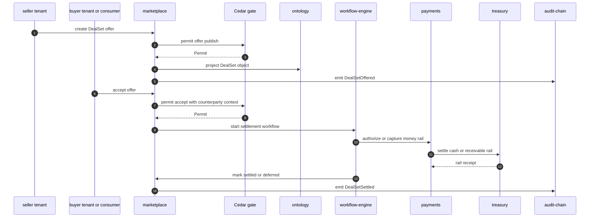
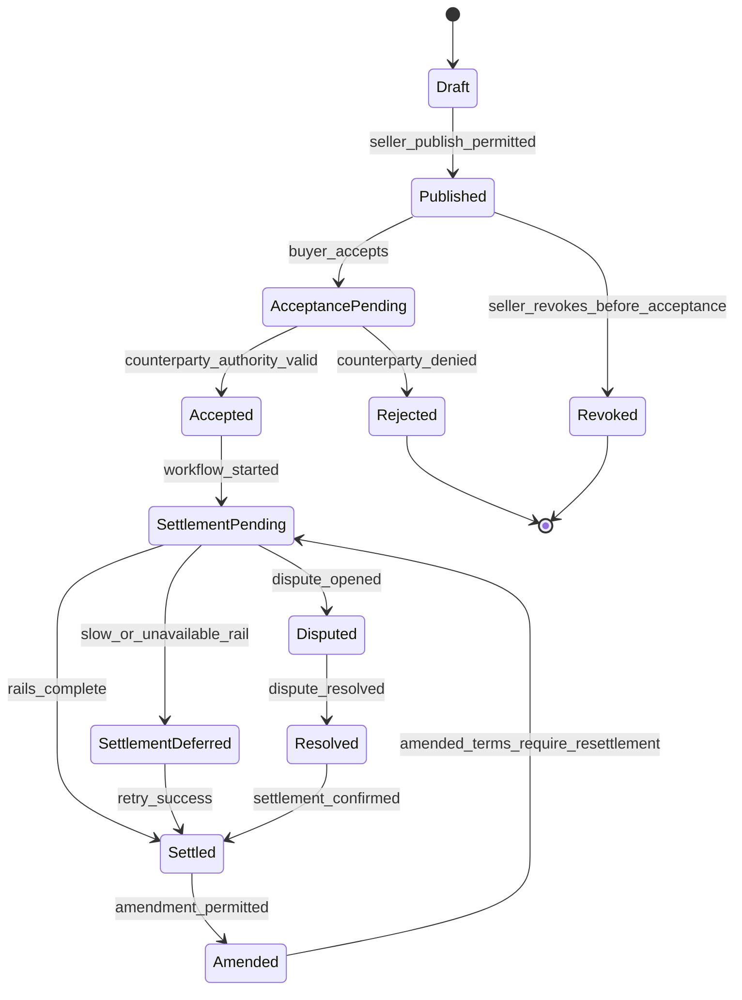
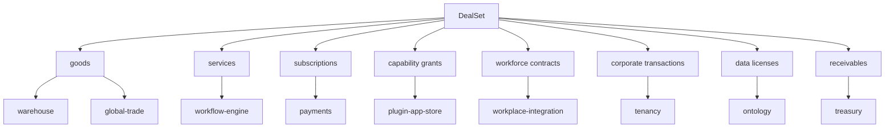

# Marketplace Deal Settlement Flow

## Diagram Purpose

This diagram shows ADR-0314's universal DealSet settlement path. Marketplace is
not just a catalog surface: it is the common settlement substrate for tenant to
tenant, tenant to consumer, workforce, procurement, subscription, plugin,
receivable, data-license, and corporate transaction flows.

Reference it when implementing commercial exchanges, ERP parity overlays,
plugin entitlements, procurement flows, receivables assignment, or marketplace
disputes. The key review question is whether a new flow can be represented as a
DealSet overlay instead of creating a bespoke settlement table or suite service.

## Diagram

## Walkthrough

1. The seller creates a DealSet draft inside seller tenant scope.
2. The draft includes category, terms, counterparty roles, and settlement rails.
3. Marketplace asks Cedar whether the seller can publish the offer.
4. Cedar evaluates tenant, action, category, compliance pack, and counterparty rules.
5. A permitted publication projects the DealSet into ontology.
6. Marketplace emits `DealSetOffered` to audit-chain.
7. The buyer or consumer accepts the offer.
8. Marketplace asks Cedar whether acceptance is allowed.
9. Acceptance context includes counterparty role and delegated authority.
10. Acceptance context includes jurisdiction and active compliance packs.
11. Acceptance context includes data class and cell region.
12. A denied acceptance leaves the DealSet unaccepted.
13. A permitted acceptance starts the settlement workflow.
14. Workflow-engine owns durable settlement orchestration.
15. Payments owns card, ACH, wallet, escrow, refund, and payout rails.
16. Treasury owns cash, FX, receivable, hedge, and liquidity rails.
17. Global-trade can place sanctions or customs holds on goods flows.
18. Warehouse participates when physical goods or inventory are involved.
19. Workplace-integration participates when a workforce contract is involved.
20. Plugin-app-store participates when entitlements are involved.
21. Developer-sdk participates when API capability grants are involved.
22. Ontology stores the DealSet object projection and relations.
23. FinOps records cost, invoice, chargeback, and credit consequences.
24. Audit-chain receives every state transition.
25. Observability records latency, rail state, and transition counters.
26. Settlement can complete synchronously for simple low-risk flows.
27. Settlement can defer when rails are slow or external processors are down.
28. Deferred settlement remains an explicit state, not an invisible retry.
29. Disputes are state transitions on the DealSet.
30. Amendments create versioned term changes.
31. Revocation is allowed only before irreversible acceptance or by policy.
32. Receivable assignment is a DealSet overlay, not a separate universe.
33. Data license grants use DealSet plus ontology and intelligence references.
34. Corporate transitions use sovereign child tenants and parent grants.
35. Procurement requisitions are DealSet overlays.
36. Retail orders are DealSet overlays.
37. Subscriptions are DealSet overlays with recurring settlement.
38. Plugin purchases are DealSet overlays with entitlement ledger updates.
39. Workforce engagements are DealSet overlays with payroll or payables rails.
40. Goods receipts are DealSet transitions when they affect settlement.
41. Tax invoices are DealSet artifacts.
42. Credit memos are DealSet amendments or settlement corrections.
43. Loyalty awards are DealSet entitlements.
44. Warranty claims are DealSet disputes or obligation claims.
45. Bank guarantees are treasury-backed DealSet terms.
46. Every DealSet row has tenant scope.
47. Every counterparty read is Cedar mediated.
48. No external marketplace account floats outside tenant scope.
49. No ERP suite service owns the whole settlement flow.
50. Flat services own domain-specific overlays.
51. DealSet versioning preserves auditability.
52. Idempotency keys protect duplicate offer acceptance.
53. Rail outage handling is explicit.
54. Sanctions hits stop settlement and open investigation.
55. Audit evidence is produced for both success and refusal.

## Key Decisions Cited

- [ADR-0243 Cedar as Universal Gate](../../decisions/ADR-0243-cedar-as-universal-gate.md)
- [ADR-0244 Tenant as Universal Scoping Primitive](../../decisions/ADR-0244-tenant-as-universal-scoping-primitive.md)
- [ADR-0249 Multi-Category Marketplace Doctrine](../../decisions/ADR-0249-multi-category-marketplace-doctrine.md)
- [ADR-0313 Conglomerate Tenant Hierarchy](../../decisions/ADR-0313-conglomerate-tenant-hierarchy-sovereign-children.md)
- [ADR-0314 Marketplace as Universal Deal Settlement](../../decisions/ADR-0314-marketplace-as-universal-deal-settlement.md)
- [ADR-0316 Capability Tier Over Product Fragmentation](../../decisions/ADR-0316-capability-tier-over-product-fragmentation.md)

## Implementation References

- Service: [microservices/marketplace/](../../../microservices/marketplace/)
- Service: [microservices/payments/](../../../microservices/payments/)
- Service: [microservices/treasury/](../../../microservices/treasury/)
- Service: [microservices/finops-portal/](../../../microservices/finops-portal/)
- Service: [microservices/ontology/](../../../microservices/ontology/)
- Service: [microservices/workflow-engine/](../../../microservices/workflow-engine/)
- Service: [microservices/connect/](../../../microservices/connect/)
- Service: [microservices/global-trade/](../../../microservices/global-trade/)
- Service: [microservices/warehouse/](../../../microservices/warehouse/)
- Service: [microservices/plugin-app-store/](../../../microservices/plugin-app-store/)
- Service: [microservices/developer-sdk/](../../../microservices/developer-sdk/)
- Service: [microservices/workplace-integration/](../../../microservices/workplace-integration/)
- Service: [microservices/audit-chain/](../../../microservices/audit-chain/)
- Standard: [API Design](../../standards/api-design.md)
- Standard: [Idempotency Keys](../../standards/idempotency-keys-canonical.md)
- Standard: [Saga Compensation Policy](../../standards/saga-compensation-policy.md)
- Standard: [FinOps Cost Attribution](../../standards/finops-cost-attribution-canonical.md)
- Standard: [OpenAPI 3.2 Authoring](../../standards/openapi-3-2-authoring.md)
- Standard: [AsyncAPI 3.1 Authoring](../../standards/asyncapi-3-1-authoring.md)
- Spec: [Platform architecture](../../../specs/platform-architecture.json)

## Failure Modes + Edge Cases

- The diagram does not show every DealSet category from ADR-0314.
- The diagram does not show all rail-specific processor callbacks.
- The diagram does not show tax calculation algorithms.
- The diagram does not show customs document schemas.
- The diagram does not show ERP adapter field mapping.
- The diagram does not show all dispute sub-states.
- A PSP outage moves to deferred settlement, not silent failure.
- Counterparty authority revocation should halt acceptance.
- Duplicate acceptance should collapse through idempotency.
- Sanctions screening after acceptance can place a trade hold.
- Region outage may require cell-local queueing.
- Key compromise requires secret rotation and step-up authorization.
- A DealSet can include non-money obligations.
- A DealSet can include entitlements without immediate cash movement.
- A DealSet can include multiple counterparties.
- Multi-party deals use roles, not copied DealSets.
- Receivable assignment requires treasury and audit evidence.
- Data licensing requires ontology provenance and use restrictions.
- Workforce contracts require labor-law overlays.
- Corporate transactions require tenant hierarchy grants.
- Goods settlements require warehouse and global-trade conditions.
- Subscription renewals require recurring workflow templates.
- Plugin entitlements require developer and marketplace consistency.
- Refunds are settlement transitions with audit evidence.
- Credit memos are amendments or correction transitions.
- Settlement rollback must be compensating, not destructive.
- Marketplace cannot bypass Cedar for internal admin actions.
- External adapter imports must preserve source-system provenance.
- DealSet schema changes must be versioned and replay-tested.
- Audit-chain failure may require blocking high-risk settlement completion.

## Cross-References to Related Diagrams

- [Inter-Microservice Call Graph](inter-microservice-call-graph.md)
- [Cedar Policy Evaluation Flow](cedar-policy-evaluation-flow.md)
- [Audit Chain Emission Pipeline](audit-chain-emission-pipeline.md)
- [Tenant Lifecycle State Machine](tenant-lifecycle-state-machine.md)
- [Dual Tenant Identity Boundary](dual-tenant-identity-boundary.md)
- [Capability Tier Projection Flow](capability-tier-projection-flow.md)
- [Compliance Pack Overlay Precedence](compliance-pack-overlay-precedence.md)
- [AI Substrate Two-Layer Architecture](ai-substrate-two-layer-architecture.md)
- [Cell Routing Shuffle Sharding](cell-routing-shuffle-sharding.md)

## DealSet Evidence Checklist

- `deal_set_id` is stable.
- `tenant_scope` is present.
- `counterparty_roles` are explicit.
- `deal_category` is declared.
- `commercial_terms` are versioned.
- `obligation_terms` are versioned.
- `entitlement_terms` are versioned.
- `settlement_terms` are versioned.
- `tax_terms` are declared where relevant.
- `trade_terms` are declared where relevant.
- `audit_chain_ref` exists for every transition.
- `ontology_object_ref` links projection.
- `workflow_run_ref` links durable orchestration.
- `cedar_policy_ref` links active gate.
- `effective_window` bounds terms.
