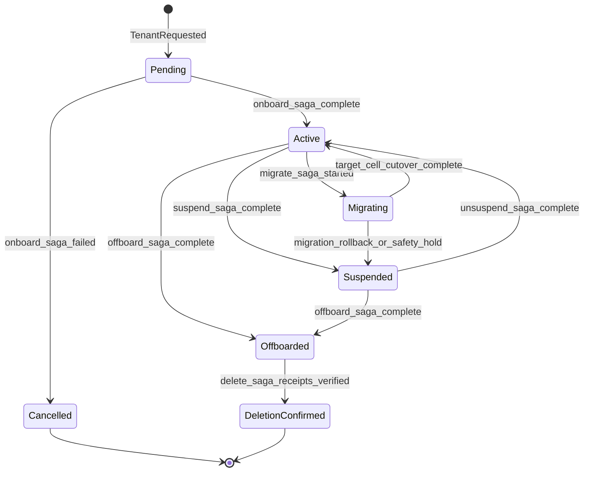
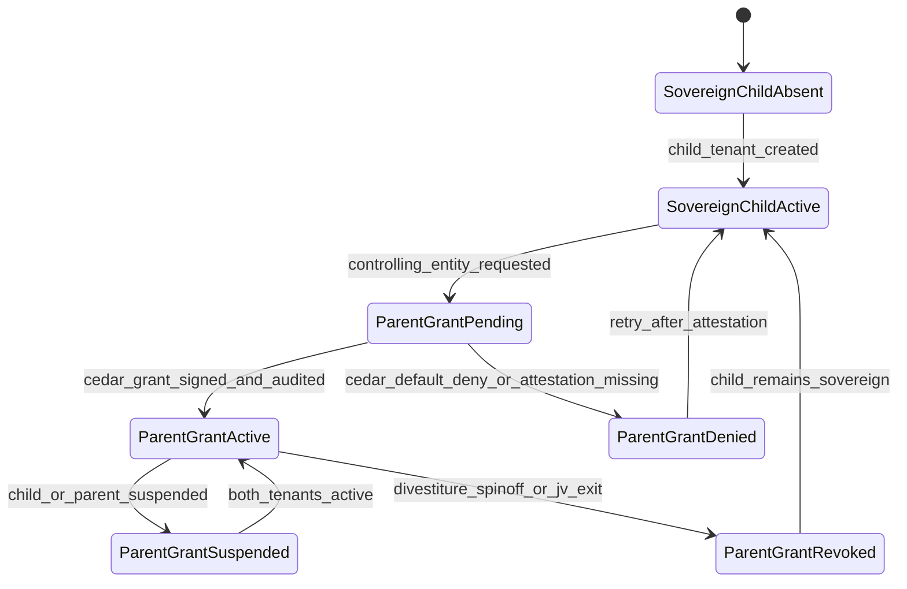
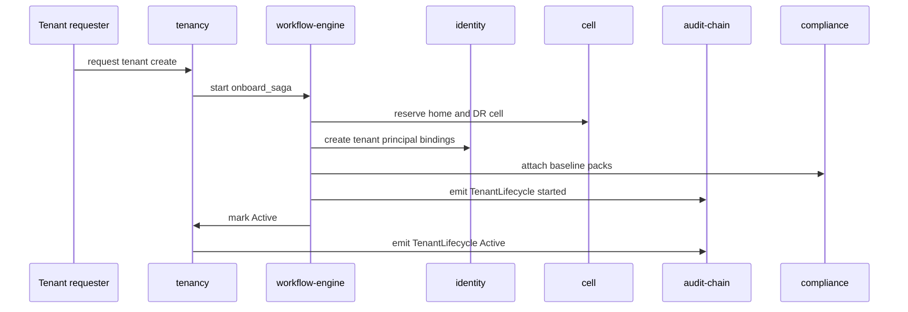

# Tenant Lifecycle State Machine

## Diagram Purpose

This diagram shows the tenant lifecycle as a state machine grounded in the
tenant-as-universal-scope doctrine from ADR-0244 and the sovereign-child
conglomerate hierarchy from ADR-0313. It joins the canonical six-state tenant
lifecycle standard with the newer parent-control grant rules so onboarding,
migration, suspension, offboarding, and deletion stay tenant-scoped.

Reference it when implementing `tenancy` lifecycle code, writing onboarding or
offboarding workflows, adding conglomerate parent-child grants, or reviewing
whether a service can treat tenant creation as a local side effect. Every state
transition is a workflow saga plus an audit-chain event; no product service gets
to invent a private tenant lifecycle.

## Diagram

## Walkthrough

1. A tenant starts in `Pending` only after `tenancy` accepts the request.
2. `Pending` is non-billable and cannot receive product writes.
3. The `onboard_saga` reserves cell placement before product provisioning.
4. Identity entities are created under the new tenant scope.
5. Baseline compliance packs attach before the tenant becomes active.
6. Every downstream service that touches tenant data must acknowledge onboarding.
7. A failed onboarding path moves to `Cancelled`, not to `Suspended`.
8. `Cancelled` is terminal and retained only as an audit tombstone.
9. `Active` is the normal billable state.
10. Active tenants may receive product traffic through `api-gateway`.
11. Active tenants may be suspended for security, billing, legal, or abuse reasons.
12. `Suspended` remains billable in the canonical standard.
13. `Suspended` freezes writes while retaining read and export paths as policy allows.
14. `Suspended` can return to `Active` only through `unsuspend_saga`.
15. `Migrating` represents a source-cell to target-cell transition.
16. `Migrating` allows dual-write or replay according to cell policy.
17. `Migrating` returns to `Active` after target-cell cutover is verified.
18. `Migrating` may roll back to `Suspended` when cutover safety fails.
19. `Offboarded` is not billable and blocks new product writes.
20. Offboarding starts with write suspension.
21. Offboarding exports portable data where the tenant is entitled to it.
22. Offboarding marks each required service as offboarded.
23. `DeletionConfirmed` requires erasure receipts from every required service.
24. `DeletionConfirmed` is terminal and must be audit-proven.
25. ADR-0244 makes `tenant_id` and `sub_scope_path` universal on all events.
26. ADR-0313 does not merge child tenants into parent tenants.
27. A conglomerate child tenant remains sovereign after parent grant creation.
28. A parent relationship starts as `ParentGrantPending`.
29. Pending parent grants require corporate-governance attestation.
30. Pending parent grants require Cedar policy evaluation.
31. The controlling-entity grant becomes active only after audit sealing.
32. Parent grant denial leaves the child tenant active and sovereign.
33. Parent grant suspension follows either tenant suspension.
34. Parent grant revocation is the normal spinoff and divestiture path.
35. Parent grant revocation does not migrate child data.
36. Parent grant revocation does not reissue child identity roots.
37. Parent grant revocation removes parent visibility and control.
38. Every lifecycle state transition emits a `TenantLifecycle` event.
39. Every downstream acknowledgment emits a `TenantLifecycleAck` event.
40. Compensation emits `TenantLifecycleCompensate` when a saga reverses.
41. Compliance pack activation may add jurisdiction overlays before Active.
42. A tenant can be Active while one parent grant is revoked.
43. A tenant can have multiple controlled-by entries only when Cedar permits it.
44. Personal tenants from ADR-0311 cannot be controlled by a work parent grant.
45. Court-warrant piercing is a separate scoped grant and not a lifecycle state.
46. State changes belong to `tenancy` and `workflow-engine`, not product services.
47. Product services only acknowledge lifecycle fan-out.
48. Lifecycle dashboards read from audit and observability emissions.
49. Billing reads lifecycle state but does not own it.
50. Deletion confirmation is blocked until required acknowledgments are complete.

## Key Decisions Cited

- [ADR-0175 Tenant Lifecycle](../../decisions/ADR-0175-tenant-lifecycle.md)
- [ADR-0222 Workflow-Backed Tenant Sagas](../../decisions/ADR-0222-workflow-backed-tenant-sagas.md)
- [ADR-0244 Tenant as Universal Scoping Primitive](../../decisions/ADR-0244-tenant-as-universal-scoping-primitive.md)
- [ADR-0251 Compliance Pack Cell Certification Levels](../../decisions/ADR-0251-compliance-pack-cell-certification-levels.md)
- [ADR-0263 Observability Emission Contract](../../decisions/ADR-0263-observability-emission-contract.md)
- [ADR-0311 Dual-Tenant Identity Boundary](../../decisions/ADR-0311-dual-tenant-identity-personal-vs-work-boundary.md)
- [ADR-0313 Conglomerate Tenant Hierarchy](../../decisions/ADR-0313-conglomerate-tenant-hierarchy-sovereign-children.md)
- [ADR-0317 Role-Based Projection Unified UX Shell](../../decisions/ADR-0317-role-based-projection-unified-ux-shell.md)

## Implementation References

- Service: [microservices/tenancy/](../../../microservices/tenancy/)
- Service: [microservices/identity/](../../../microservices/identity/)
- Service: [microservices/workflow-engine/](../../../microservices/workflow-engine/)
- Service: [microservices/audit-chain/](../../../microservices/audit-chain/)
- Cell ownership: [tenancy §cell-assignment](../../../microservices/tenancy/ARCHITECTURE.md#cell-assignment), [cloud-iac §cell-provisioning](../../../microservices/cloud-iac/ARCHITECTURE.md#cell-provisioning), [observability §cell-health](../../../microservices/observability/ARCHITECTURE.md#cell-health), [api-gateway §cell-aware-routing](../../../microservices/api-gateway/ARCHITECTURE.md#cell-aware-routing), [audit-chain §cell-scoped-audit](../../../microservices/audit-chain/ARCHITECTURE.md#cell-scoped-audit), and [shuffle-sharding](../../../crates/shuffle-sharding/README.md).
- Service: [microservices/compliance/](../../../microservices/compliance/)
- Service: [microservices/finops-portal/](../../../microservices/finops-portal/)
- Service: [microservices/ops-dashboard-control-center/](../../../microservices/ops-dashboard-control-center/)
- Service: [microservices/workplace-integration/](../../../microservices/workplace-integration/)
- Standard: [Tenant Lifecycle](../../standards/tenant-lifecycle.md)
- Standard: [Saga Compensation Policy](../../standards/saga-compensation-policy.md)
- Standard: [Per-Tenant Resource Quotas](../../standards/per-tenant-resource-quotas-canonical.md)
- Standard: [Outbox Pattern](../../standards/outbox-pattern-canonical.md)
- Standard: [Compliance Evidence Automation](../../standards/compliance-evidence-automation.md)
- Spec: [Tenant model](../../../specs/tenant-model.json)
- Spec: [Platform architecture](../../../specs/platform-architecture.json)
- Spec: [Tenancy microservice](../../../specs/microservices/tenancy.json)

## Failure Modes + Edge Cases

- The diagram does not show every service-specific acknowledgment timeout.
- The diagram does not show the full rollback chain for each saga.
- The diagram does not show tenant billing proration rules.
- The diagram does not show every compliance pack activation rule.
- The diagram does not show per-jurisdiction deletion retention holds.
- The diagram does not show parent-grant action namespaces from ADR-0313.
- The diagram does not model merger of tenants because ADR-0313 rejects data merging.
- The diagram does not show cross-region data residency conflict arbitration.
- The diagram does not show court-warrant scoped piercing.
- The diagram does not show personal-vs-work tenant surface ownership.
- The diagram does not show per-sub-scope child paths inside a tenant.
- The diagram does not show reserved namespace refusal.
- The diagram does not show tenant slug rename flows.
- The diagram does not show trial-to-paid conversion as a separate state.
- Trial-to-paid is a billing entitlement change while lifecycle stays Active.
- The diagram does not show service degradation while Suspended.
- Suspended read access is policy-defined and may vary by jurisdiction.
- Active parent grant does not imply write access to every child service.
- Parent read visibility can be restricted by compliance packs.
- Child audit streams remain independent in parent grant flows.
- Parent actions must dual-seal audit rows where ADR-0313 requires it.
- A failed `delete_saga` must not promote to `DeletionConfirmed`.
- A failed acknowledgment should trigger compensation or manual operations review.
- Repeated compensation failures should open an incident.
- Cross-cell migration is not a tenant hierarchy change.
- Cross-cell migration should preserve `tenant_id`.
- Conglomerate restructuring should be grant revocation and regrant.
- Offboarded tenants may retain legal-hold data until policy permits erasure.
- Cancelled tenants retain tombstone records for audit purposes.
- This diagram should not be used as a database schema.
- This diagram should not be used as a UI wizard sequence by itself.
- This diagram assumes Cedar is the policy gate for lifecycle branches.

## Cross-References to Related Diagrams

- [Inter-Microservice Call Graph](inter-microservice-call-graph.md)
- [Cedar Policy Evaluation Flow](cedar-policy-evaluation-flow.md)
- [Audit Chain Emission Pipeline](audit-chain-emission-pipeline.md)
- [Dual Tenant Identity Boundary](dual-tenant-identity-boundary.md)
- [Compliance Pack Overlay Precedence](compliance-pack-overlay-precedence.md)
- [Cell Routing Shuffle Sharding](cell-routing-shuffle-sharding.md)
- [Capability Tier Projection Flow](capability-tier-projection-flow.md)
- [Marketplace Deal Settlement Flow](marketplace-deal-settlement-flow.md)
- [AI Substrate Two-Layer Architecture](ai-substrate-two-layer-architecture.md)

## Review Checklist

- Confirm every lifecycle transition has an audit event class.
- Confirm every downstream service has acknowledgment semantics.
- Confirm deletion requires erasure receipts, not just an API success.
- Confirm migration preserves tenant identity and sub-scope paths.
- Confirm conglomerate parent grants do not collapse child sovereignty.
- Confirm personal tenants cannot be controlled by employer grants.
- Confirm Active state is entered only after baseline packs attach.
- Confirm Suspended state blocks writes consistently across services.
- Confirm Cancelled and DeletionConfirmed are terminal.
- Confirm dashboards read lifecycle evidence rather than recreating state.

## Lifecycle Evidence Fields

- `tenant_id` identifies the tenant whose lifecycle changed.
- `sub_scope_path` identifies the affected sub-scope when the transition is scoped.
- `previous_state` records the state before transition.
- `next_state` records the state after transition.
- `transition_reason` records operator, workflow, billing, security, or legal reason.
- `workflow_run_id` links the transition to workflow-engine evidence.
- `cell_binding_before` records prior home and DR cell values.
- `cell_binding_after` records post-migration home and DR cell values.
- `required_ack_count` records the fan-out acknowledgment set size.
- `received_ack_count` records completed acknowledgments.
- `missing_ack_services` records blockers when receipts are incomplete.
- `compliance_packs_active` records pack set at transition time.
- `cedar_evaluation_id` links the lifecycle permit or refusal.
- `audit_stream_id` records the tenant stream that received the row.
- `parent_grant_id` records controlling-entity grant context when applicable.
- `dual_seal_streams` records parent and child audit streams when applicable.
- `portable_export_ref` records export evidence on offboarding.
- `erasure_receipt_bundle_ref` records deletion proof on final confirmation.
- `operator_override_ref` records any manual intervention.
- `incident_ref` records escalation when lifecycle compensation fails.
- `state_machine_version` records the lifecycle contract version used.
