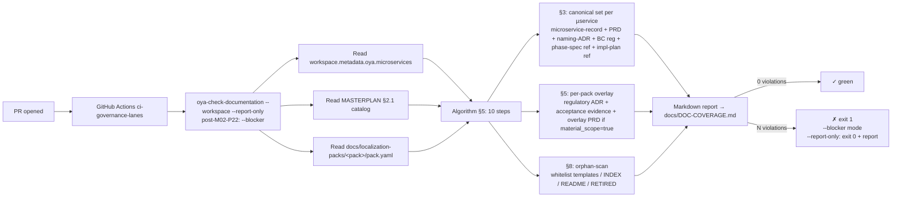

# Oyatie Product Graph + Tech Stack + Schema Patterns

This is the single-pane architecture map. It complements MASTERPLAN's prose with: (1) the ecosystem topology (Mermaid graphs), (2) the per-layer tech stack, (3) per-cluster µservice detail, (4) canonical schema patterns every µservice composes.

---

## 1. Top-level ecosystem map

```mermaid
flowchart TB
    subgraph Tenants["B2B Tenants (paying organizations)"]
      direction LR
      T1[KR group tenants]:::tenant
      T2[US tenants (M09+)]:::tenant
      T3[EU tenants (M10+)]:::tenant
    end

    subgraph Personal["B2C Tenants (individuals; M05+)"]
      direction LR
      P1[Personal users]:::tenant
    end

    Tenants -->|OIDC/SAML SSO| App
    Personal -->|Direct B2C path; PKCE| ConnectPersonal

    subgraph App["Application B2B Shell (oya-application-*)"]
      direction TB
      A1["Product enablement console (à-la-carte)"]
      A2["Tenant onboarding ≤5min"]
      A3["Billing + capability gating"]
    end

    subgraph AdapterLayer["Workflow + Ontology — sole inter-µservice adapter layer (ADR-0059)"]
      direction LR
      W["Workflow µservice<br/>(action / orchestration)<br/>oya-workflow-*"]:::adapter
      O["Ontology µservice<br/>(information / data)<br/>oya-ontology-*"]:::adapter
    end

    subgraph Healthcare["Healthcare cluster"]
      direction TB
      MEDICAL[medical]
      PHARMACY[pharmacy]
      PATIENT[patient]
      EMERGENCY[emergency]
      CLINICAL[clinical]
      HEALTHCARE_PORTAL[healthcare-portal]
    end

    subgraph Workforce["Workforce cluster"]
      direction TB
      HR[hr]
      PAYROLL[payroll]
      ACCOUNTING[accounting]
      ATS[ats]
      GRC[grc]
      PERFORMANCE[performance]
      WORKFORCE_ANALYTICS[workforce-analytics]
    end

    subgraph FinTech["FinTech cluster"]
      direction TB
      PAYMENTS[payments]
      INSURANCE[insurance]
      FINANCE_QUANT[finance-quant]
      SETTLEMENT[settlement]
    end

    subgraph Industrial["Industrial cluster"]
      direction TB
      MANUFACTURING[manufacturing]
      LOGISTICS[logistics]
      FACILITY_OPS[facility-ops]
      PROCUREMENT[procurement]
      SECURITY[security]
    end

    subgraph Connect["cluster (Pro B2B + Personal B2C)"]
      direction TB
      CONNECT[connect — dual-context]
      COMMUNITY[community]
      SOCIAL_GRAPH[social-graph]
      PROFILE_PERSONAL[profile-personal]
    end

    subgraph ConnectPersonal["Personal (B2C path)"]
      CP[connect-personal context — user-owned keys]:::personal
    end

    subgraph Hospitality["Hospitality cluster"]
      HOSPITALITY[hospitality]
      DINING[dining]
      CELLAR[cellar]
    end

    subgraph Substrate["Substrate µservices (always-on; ADR-0056 §2.1)"]
      direction LR
      TENANCY[tenancy]
      IDENTITY[identity]
      AUDIT_CHAIN[audit-chain<br/>Merkle/Ed25519]
      EVENTING[eventing<br/>outbox → Kafka KRaft]
      SECRETS[secrets<br/>OpenBao + HSM/cell]
      OBSERVABILITY[observability<br/>OTel + VictoriaMetrics]
      KMS[kms]
      POLICY[policy<br/>Cedar]
      SEARCH[search<br/>pgroonga + Tantivy]
      VECTOR[vector<br/>pgvector HNSW]
      DATA_BOUNDARY[data-boundary]
      FINANCE_LIB[finance-library]
      CAPABILITY[capability-registry]
      RECORDS[records<br/>FHIR R5-canonical]
      ADS[ads]
      ANALYTICS[analytics]
    end

    subgraph Cloud["Cloud substrate (runtime)"]
      direction LR
      C_TENANCY[cloud-tenancy]
      C_IAM[cloud-iam]
      C_KMS[cloud-kms]
      C_COMPUTE[cloud-compute<br/>VM/K8s/Functions]
      C_STORAGE[cloud-storage<br/>Object/Block/File]
      C_NETWORK[cloud-network<br/>VCN/LB/DNS]
      C_BILLING[cloud-billing]
      C_CELL[cloud-cell<br/>per-cell isolation]
      C_REGION[cloud-region]
      C_OBS[cloud-observability]
    end

    subgraph Foundry["Foundry (internal-only engine)"]
      direction LR
      F2["LEAN check binaries:<br/>oya-check-architecture (9 sub-cmds)<br/>oya-check-statelessness<br/>oya-check-shardability<br/>oya-check-perf-budget<br/>oya-check-benchmark<br/>oya-check-documentation (LEAN-A5)<br/>+ Proof Ladder + 9 planes + Wave integration"]
    end

    App -.->|enables product subset| AdapterLayer
    AdapterLayer -->|orchestrates| Healthcare
    AdapterLayer -->|orchestrates| Workforce
    AdapterLayer -->|orchestrates| FinTech
    AdapterLayer -->|orchestrates| Industrial
    AdapterLayer -->|orchestrates| Connect
    AdapterLayer -->|orchestrates| Hospitality
    AdapterLayer -.->|reads / writes| Substrate
    Healthcare -.->|substrate calls| Substrate
    Workforce -.->|substrate calls| Substrate
    FinTech -.->|substrate calls| Substrate
    Industrial -.->|substrate calls| Substrate
    -.->|substrate calls| Substrate
    Hospitality -.->|substrate calls| Substrate
    Substrate -.->|runtime| Cloud
    Foundry -.->|build/verify| Tenants

    ConnectPersonal -.->|isolated; per-user keys| Substrate

    classDef tenant fill:#e8f4fd,stroke:#0066cc,stroke-width:2px
    classDef adapter fill:#fff3cd,stroke:#ff8800,stroke-width:3px
    classDef personal fill:#f3e8fd,stroke:#9933cc,stroke-width:2px
```

**The load-bearing rule** (ADR-0059): customer-facing µservices NEVER call each other directly. All cross-product orchestration flows through Workflow (action / event-driven sequencing) and Ontology (typed entity / link / action / function data plane). LEAN-A2 (`cross-product-refusal`) CI-enforced.

---

## 2. Localization pack overlay

```mermaid
flowchart LR
    subgraph CanonicalBase["Canonical Global Base (pack-neutral)"]
      direction TB
      CB1["payroll-run-domain<br/>(jurisdiction-agnostic)<br/>calls StatutoryRateProvider seam"]
      CB2["medical-encounter-domain<br/>(no HIRA-specific fields)"]
      CB3["accounting-journal-domain<br/>(K-GAAP not baked in)"]
    end

    subgraph KRPack["KR Pack (#1 — foundational)"]
      direction TB
      K1["oya-payroll-kr-*<br/>4대보험 EDI + 연말정산 + 간이세액표"]
      K2["oya-medical-kr-*<br/>HIRA DUR + KFDA + NHIS"]
      K3["oya-accounting-kr-*<br/>K-GAAP COA + 재무상태표 Typst"]
      K4["oya-pack-kr-*<br/>Cedar PIPA policies + Workflow templates"]
      K5["docs/localization-packs/kr/<br/>pack.yaml + corpus.lock + evidence/"]
    end

    subgraph USPack["US Pack (planned, M09+)"]
      direction TB
      U1["HIPAA-BAA + PCI DSS L1 + SOC2"]
      U2["Federal+50-state payroll<br/>W-2/W-4/1099/I-9/ACA"]
      U3["USCDI v3 + Epic/Cerner FHIR R5"]
    end

    subgraph EUPack["EU Pack (planned, M10+)"]
      direction TB
      E1["GDPR + eIDAS + SEPA + IFRS"]
      E2["NIS2 + DORA + MDR"]
      E3["Multi-language (DE/FR/ES/NL/IT)"]
    end

    CanonicalBase -->|seam (port + DI)| KRPack
    CanonicalBase -->|seam| USPack
    CanonicalBase -->|seam| EUPack

    classDef base fill:#e8fdef,stroke:#00aa66,stroke-width:2px
    classDef kr fill:#fef3e0,stroke:#cc6600,stroke-width:2px
    classDef us fill:#e8edfd,stroke:#0066cc,stroke-width:2px
    classDef eu fill:#fde8f4,stroke:#cc0066,stroke-width:2px
```

**Trichotomy** (ADR-0064 §1):

| Form | When to use | Example |
|---|---|---|
| **Seam** | Variation is a value / small trait impl | `StatutoryRateProvider` port + KR rate impl |
| **Adapter** | Discrete I/O surface | `oya-payroll-kr-edi-adapter` ↔ NPS EDI v5.0 |
| **Pack** | Coherent deployable bundle | `kr` pack composes all seams+adapters+policies+templates |

CI lanes: `canonical-base-neutrality` + `cross-pack-refusal` (M02-P20).

---

## 3. Per-layer tech stack (BNF v4.1 12-layer enum)

Crate naming: `oya-<microservice>(-<bc-tokens>)?-<layer>` (ADR-0056).

| Layer | Crate suffix | Tech stack | Owns | Forbidden in this layer |
|---|---|---|---|---|
| `kernel` | `-kernel` | Pure Rust 1.96+ (`std`); `serde`, `thiserror`, `chrono`, `uuid`, `rust_decimal` only | Value objects + sealed port-trait declarations | Async; I/O; framework deps |
| `domain` | `-domain` | Pure Rust; same constraints as kernel + business-logic helpers | Business logic (aggregates, invariants, value objects); calls through kernel ports | I/O; framework deps |
| `usecase` | `-usecase` | Rust + `async-trait`, `tokio` (consumer of port traits only) | Use-case orchestrators; port-trait-bounded transactions | Direct DB / Kafka / Cedar / HTTP |
| `adapter` | `-adapter` | Rust + `sqlx`/`tokio-postgres`, `kafka` (or `rdkafka`/`apache_kafka`), `cedar-policy`, `aws-sdk-s3`, etc. | Trait impls of kernel ports + DTO mappers | Cross-adapter imports (impl A → impl B) |
| `infrastructure` | `-infrastructure` | Rust + framework glue (`axum`, `tonic`, runtime init) | Driver-side wiring (HTTP server boot, gRPC server boot, etc.) | Same as adapter |
| `cli` | `-cli` | Rust + `clap` 4 derive | Command-line presentation; calls usecase layer | Direct DB / Kafka |
| `rest` | `-rest` | Rust + `axum` 0.7+, `tower`, `OpenAPI` (`utoipa`/`apistos`), `validator` | HTTP/REST handlers; calls usecase layer | Same as cli |
| `grpc` | `-grpc` | Rust + `tonic` 0.10+, `prost`, protobuf `.proto` | gRPC service impls; calls usecase layer | Same as cli |
| `worker` | `-worker` | Rust + `tokio`, `rdkafka` consumer, outbox poller | Long-running background worker; calls usecase layer | Same as cli |
| `app` | `-app` | Rust + DI/wiring (`tokio::main`, full app composition) | Composition-root binary; assembles all layers | Business logic |
| `sdk` | `-sdk` | Rust client library + thin transport (`reqwest`/`tonic-client`) | External-consumer client; depends ONLY on `kernel` | Anything except kernel |
| `api` | `-api` | Rust contract types + semver-bound schemas | Protocol-neutral API contract surface | Direct I/O |

**Cross-layer dependency rule** (ADR-0056 §2.2): inward-only flow. `cli/rest/grpc/worker/api` → `usecase` → `domain` → `kernel`. `adapter/infrastructure` plug into ports defined in `kernel`. `app` is the only layer with unrestricted inward deps. LEAN-A1 (`dependency-direction`) CI-enforced.

---

## 4. Workspace-wide tech stack

| Concern | Choice | Source |
|---|---|---|
| **Language** | Rust 1.96+ (workspace.rust-version) | Cargo.toml |
| **Async runtime** | tokio 1.42+ multi-threaded; `JoinSet`/`select!` structured concurrency | feedback_clean_architecture_requirements §13 |
| **Database** | Postgres 16 + Citus (sharded by tenant_id) + RLS | Bominal ADR-0117 |
| **Analytics DB** | ClickHouse + replicas | Bominal stack |
| **Time-series** | TimescaleDB | Bominal stack |
| **Cache** | Valkey 8+ (Redis-fork) cluster | Bominal stack |
| **Eventing** | Apache Kafka KRaft (no ZK); outbox → Kafka pattern | Bominal ADR-0116 |
| **Schema registry** | Apache Schema Registry (Confluent-compatible) | Bominal stack |
| **Search** | pgroonga (KR morphology) + Tantivy (English) | Bominal stack |
| **Vector** | pgvector HNSW (per-tenant per-object-type tables) | Bominal ADR-0108 |
| **Secrets** | OpenBao (day-1) + per-cell HSM | Bominal ADR-0111 / user instruction |
| **Service mesh** | Istio Ambient (sidecarless mTLS) | Bominal stack |
| **Observability** | OpenTelemetry + VictoriaMetrics + Grafana | Bominal ADR-0020 |
| **Compute** | OCI A1 ARM64 (always-free Stage 0) → OKE | Bominal ADR-0117 |
| **Wasm sandboxing** | Wasmtime (agent marketplace, plugins) | Bominal stack |
| **MicroVMs** | Firecracker | Bominal stack |
| **Cryptography** | Ed25519 + ML-DSA-87 (PQC) + AES-256-GCM | Bominal ADR-0028 + ADR-0111 |
| **Policy engine** | Cedar (AWS) | Bominal ADR-0132 |
| **Document gen** | Typst (no LaTeX) | Bominal stack |
| **Supply chain** | cargo-deny + cargo-semver-checks + Trivy + Cosign + SBOM + SLSA | Bominal ADR-0039 |
| **Containers** | Distroless + smallest-image policy | Bominal master-plan |
| **Web client** | Leptos (SSR pre-auth + SPA post-auth) | Bominal ADR-0209 |
| **Native clients** | Win + Mac + Linux + iOS + Android (5-platform parity) | Bominal master-plan |
| **Auth** | OIDC + passkey + SAML + PQXDH (Connect) | Bominal ADR-0123 |
| **Workflow runtime** | Custom durable-execution (Temporal-parity); per Bominal ADR-0035 + ADR-0148 | Workflow Studio scope |
| **Test runner** | cargo-nextest | Bominal stack |
| **Build** | cargo + xtask (no monorepo tool beyond cargo workspace) | Workspace decision |
| **CI** | GitHub Actions (per-PR fan-out to ARM64 runners) | ADR-0063 §5 e2e tier |
| **Doc generator** | rustdoc + mdbook + OpenAPI (utoipa) + ADR-index emitter | docs/DOCUMENTATION.md |

---

## 5. Per-cluster µservice detail

### 5.1 Workforce cluster

| µservice | Canonical scope | KR pack overlay | Lead milestone |
|---|---|---|---|
| **hr** | Employee / Employment / Organization domain; ADR-0125 naming canon; ADR-0126 8-class enum (Regular/FixedTerm/PartTime/Dispatched/Subcontracted/Freelance/Intern/Officer) | 4대보험 취득/상실 신고; 근로계약서 | M03 |
| **payroll** | Gross-to-net engine; statutory-rate seam; disbursement port | NPS/NHIS/고용/산재 EDI v5.0; 연말정산 21-cat; 간이세액표; bank CMS/NEMS | M03 |
| **accounting** | Double-entry journal kernel; period close; chart of accounts seam | K-GAAP COA seed; 재무상태표/손익계산서/현금흐름표/자본변동표 Typst | M03 |
| **ats** | Applicant funnel: candidate → interview → offer → onboarding handoff | 채용공고법; 채용절차의공정화에관한법률 | M08 |
| **grc** | Controls library; audit cycle (SOC2/ISO27001 templates) | 정보보호관리체계 (ISMS-P) | M08 |
| **performance** | OKR / 360 / calibration cycle | (pack-neutral default) | M08 |
| **workforce-analytics** | Attrition / engagement / comp-spend; ClickHouse-backed | (pack-neutral) | M08 |

### 5.2 Healthcare cluster

| µservice | Canonical scope | KR pack overlay | Lead milestone |
|---|---|---|---|
| **medical** | Encounter / Practitioner / Organization (FHIR R5 entities in `records` substrate) | HIRA DUR realtime; NHIS 청구; KHIRA outcomes; 의료법 retention; EMR cross-walk (더존/유비케어/비트컴퓨터) | M04 |
| **pharmacy** | Prescription / Dispense / MedicationRequest | HIRA DUR check (≤200ms p99); KFDA recall/dispatch | M04 |
| **patient** | Patient B2C portal (separate from clinician surface) | 의료법 환자 권리; appointment booking; Personal link | M04 |
| **emergency** | Routing / Handoff / Dispatch | 119 응급의료; 응급의료법 | M04 |
| **clinical** | Workflow handoffs across encounter lifecycle | KR clinical pathway templates | M04 |
| **healthcare-portal** | Provider-facing portal (cross-clinic ops) | KR multi-clinic dispatch | M04 |

### 5.3 FinTech cluster

| µservice | Canonical scope | KR pack overlay | Lead milestone |
|---|---|---|---|
| **payments** | Charge / Refund / Chargeback / Idempotency-key | 간편결제 (토스/카카오/네이버/페이코); 카드사 매입 (KB/신한/현대/삼성/롯데/BC/하나) | M06 |
| **insurance** | Policy / Claim / Underwriting | 보험업법 손해/생명 분리 | M06 |
| **finance-quant** | Pluggable quant lib (consumes `finance-library` substrate) | (pack-neutral kernel) | M06 |
| **settlement** | T+1 settlement / reconciliation / payout | KR PG settlement | M06 |

### 5.4 Industrial cluster

| µservice | Canonical scope | KR pack overlay | Lead milestone |
|---|---|---|---|
| **manufacturing** | MES integration; SOP execution; defect-routing | 산업안전보건법; 중대재해처벌법; 화학물질관리법 | M07 |
| **logistics** | TMS / WMS / last-mile / carrier integration | CJ대한통운/한진/롯데/우체국; 화물자동차운수사업법; 항만운송사업법 | M07 |
| **facility-ops** | Shift handover / incident-IR | (pack-neutral default) | M07 |
| **procurement** | Vendor onboarding / PO / Receipt | 전자세금계산서 (홈택스) | M07 |
| **security** | Physical security + audit + access logs | 개인정보보호법 records | M07 |

### 5.5 cluster (Pro B2B + Personal B2C)

| µservice | Canonical scope | KR pack overlay | Lead milestone |
|---|---|---|---|
| **connect** | Mail + Messenger + Calendar + Drive + Docs + Meet + Tasks + Notes (dual-context Pro/Personal per ADR-0208) | Pro: 메신저/메일 보관 의무 (ADR-0215 KR-mode); legal-hold + eDiscovery | M03 (Pro) / M05 (Personal) |
| **community** | Public channels / forums | (pack-neutral) | M05 |
| **social-graph** | Person↔Person relationships (Personal context) | (pack-neutral) | M05 |
| **profile-personal** | B2C profile + privacy controls | PIPA B2C posture | M05 |

### 5.6 Hospitality cluster (H4 backlog)

| µservice | Canonical scope | KR pack overlay | Lead milestone |
|---|---|---|---|
| **hospitality** | Restaurant/hotel/leisure ops | (pack-neutral default) | M12+ |
| **dining** | Reservation / table / menu / order | (pack-neutral) | M12+ |
| **cellar** | Beverage inventory + pairings | (pack-neutral) | M12+ |

---

## 6. Canonical schema patterns

Every µservice composes these patterns. They are reproduced verbatim from canonical M02b-substrate phase docs.

### 6.1 Tenancy + RLS (every tenant-bound table)

```sql
CREATE TABLE example_table (
    id           uuid PRIMARY KEY DEFAULT gen_random_uuid(),
    tenant_id    uuid NOT NULL,                 -- distribution column (Citus)
    -- ... payload columns ...
    created_at   timestamptz NOT NULL DEFAULT now(),
    updated_at   timestamptz NOT NULL DEFAULT now()
);

-- RLS (every tenant-bound table; FORCE)
ALTER TABLE example_table ENABLE ROW LEVEL SECURITY;
ALTER TABLE example_table FORCE  ROW LEVEL SECURITY;
CREATE POLICY tenant_isolation ON example_table
    USING (tenant_id = current_setting('oyatie.tenant_id')::uuid);

-- Citus distribution
COMMENT ON TABLE example_table IS 'distribution_column:tenant_id';
SELECT create_distributed_table('example_table', 'tenant_id');

CREATE INDEX idx_example_tenant ON example_table (tenant_id, created_at DESC);
```

CI lane `oya-check-shardability` verifies every tenant-bound table has the distribution-column COMMENT + RLS policy + index.

### 6.2 Outbox event pattern (every state-changing µservice)

```sql
-- Per-µservice outbox table
CREATE TABLE <microservice>_outbox (
    outbox_id      uuid PRIMARY KEY DEFAULT gen_random_uuid(),
    tenant_id      uuid NOT NULL,
    aggregate_id   uuid NOT NULL,
    aggregate_type text NOT NULL,
    event_type     text NOT NULL,
    event_version  smallint NOT NULL DEFAULT 1,
    payload        jsonb NOT NULL,
    occurred_at    timestamptz NOT NULL DEFAULT now(),
    published_at   timestamptz NULL,             -- NULL until Kafka publisher confirms
    -- inherits RLS + Citus distribution per §6.1
);
CREATE INDEX idx_outbox_pending ON <microservice>_outbox (occurred_at)
    WHERE published_at IS NULL;
```

Outbox worker polls + publishes to Kafka KRaft topic `oya.<microservice>.<event-type>.v<n>`. LISTEN/NOTIFY trigger on insert wakes the worker for sub-second latency.

### 6.3 Ontology Object Type schema (information-plane adapter; ADR-0059)

```rust
// oya-ontology-entity-kernel/src/types.rs
pub struct ObjectType {
    pub object_type: String,           // e.g. "hr.Employee"
    pub tenant_id: TenantId,
    pub schema_version: u32,
    pub properties: BTreeMap<String, PropertyTier>,
    pub ownership_pillar: OwnershipPillar,  // Org | Person (Bominal ADR-0132 inheritance)
}

pub enum PropertyTier { Public, Restricted, Confidential, Audited }

pub struct Object {
    pub object_id: ObjectId,
    pub object_type: String,
    pub tenant_id: TenantId,
    pub properties: serde_json::Value,
    pub provenance: ProvenanceRecord,   // who/when/why/source-event-id
    pub created_at: chrono::DateTime<chrono::Utc>,
    pub effective_at: Option<chrono::DateTime<chrono::Utc>>,
}

pub struct LinkType {
    pub link_type: String,              // e.g. "hr.employed_at"
    pub from_object_type: String,
    pub to_object_type: String,
    pub cardinality: Cardinality,       // One | Many
}

pub struct ActionType {
    pub action_type: String,            // e.g. "hr.HireEmployee"
    pub inputs: BTreeMap<String, FunctionParameter>,
    pub effects: Vec<EffectDeclaration>,
    pub cedar_policy_slot: String,      // resolved from pack
    pub audit_chain_required: bool,     // ADR-0028 audit-chain seal
}

pub struct FunctionType {
    pub function_type: String,          // e.g. "payroll.GrossToNet"
    pub inputs: BTreeMap<String, FunctionParameter>,
    pub output: FunctionParameter,
    pub deterministic: bool,            // pure → cacheable
}
```

### 6.4 Audit chain (every state-changing event; Bominal ADR-0028 inheritance)

```rust
// oya-audit-chain-kernel/src/types.rs
pub struct AuditSegment {
    pub segment_id: AuditSegmentId,
    pub tenant_id: TenantId,
    pub period: ChronoPeriod,           // (year, month) typically
    pub merkle_root: [u8; 32],
    pub ed25519_signature: [u8; 64],
    pub mldsa87_signature: Option<[u8; 4595]>,  // PQC option
    pub event_count: u64,
    pub sealed_at: DateTime<Utc>,
    pub prior_segment_hash: [u8; 32],   // chain link
}

pub struct AuditEvent {
    pub event_id: AuditEventId,
    pub tenant_id: TenantId,
    pub event_type: String,
    pub payload_hash: [u8; 32],         // sha256 of canonical-json event payload
    pub actor: ActorRef,
    pub occurred_at: DateTime<Utc>,
    pub merkle_path: Vec<[u8; 32]>,
}
```

Segment-seal latency target: <1s per (tenant, period). CI lane verifies every state-changing endpoint emits ≥1 AuditEvent.

### 6.5 Cedar policy slot pattern (every authz check)

```cedar
// Canonical base declares slot name; pack fills in policy
permit (
    principal in Group::"<slot:principal_group>",
    action in [Action::"<slot:action>"],
    resource in <slot:resource_type>::"<slot:resource_id>"
)
when {
    resource.tenant_id == principal.tenant_id &&
    <slot:additional_predicate>
};
```

KR pack supplies `pipa-data-subject-consent.cedar`, `pipa-legitimate-interest.cedar`, etc. (per ADR-0064 §1.5 row 4).

### 6.6 Workflow durable-execution state machine

```rust
// oya-workflow-engine-kernel/src/state_machine.rs
pub struct WorkflowDefinition {
    pub definition_id: WorkflowDefinitionId,
    pub tenant_id: TenantId,
    pub nodes: Vec<WorkflowNode>,
    pub edges: Vec<WorkflowEdge>,
    pub triggers: Vec<WorkflowTrigger>,    // cron / webhook / event / manual
    pub version: u32,
}

pub enum WorkflowNode {
    OntologyAction { action_type: String, inputs_map: serde_json::Value },
    AgenticDecision { llm_provider: String, prompt: String, capability: CapabilityRef },
    ExternalHttp { url: String, method: HttpMethod, body_template: String },
    SubWorkflow { definition_id: WorkflowDefinitionId },
    Branch { conditions: Vec<BranchCondition> },
    Loop { collection_path: String, item_var: String },
    Retry { max_attempts: u32, backoff_ms: u64 },
    ErrorHandler { catch_node: NodeId },
    DeadLetter { topic: String },
}

pub struct WorkflowRun {
    pub run_id: WorkflowRunId,
    pub definition_id: WorkflowDefinitionId,
    pub tenant_id: TenantId,
    pub step_journal: Vec<StepRecord>,     // deterministic-replay journal (Temporal-parity)
    pub state: RunState,                    // Running | Completed | Failed | Cancelled | Paused
    pub started_at: DateTime<Utc>,
    pub finished_at: Option<DateTime<Utc>>,
}
```

Deterministic replay: every step recorded to `step_journal` BEFORE side effect. On crash, replay from journal head; replay-then-act for un-recorded steps.

### 6.7 dual-context schema (Bominal ADR-0208 inheritance)

```sql
CREATE TYPE connect_pro.context_kind AS ENUM ('professional', 'personal');
CREATE TYPE connect_pro.ownership_pillar AS ENUM ('org', 'person');

CREATE TABLE connect_pro.messages (
    msg_id              uuid PRIMARY KEY DEFAULT gen_random_uuid(),
    tenant_id           uuid NOT NULL,
    context_kind        connect_pro.context_kind NOT NULL DEFAULT 'professional',
    ownership_pillar    connect_pro.ownership_pillar NOT NULL DEFAULT 'org',  -- IMMUTABLE
    body_object_key     text NOT NULL,        -- OCI Object Storage; AES-256-GCM under tenant DEK
    ratchet_session_id  uuid NULL,            -- Signal double-ratchet PQXDH (Bominal ADR-0111)
    -- inherits RLS + Citus per §6.1
);
```

Cross-context safety: `org` ownership_pillar data NEVER reachable by a `person` query path; CI lane `connect-pillar-isolation-check` enforces.

---

## 7. Cross-cutting architecture diagrams

### 7.1 Cell architecture (per Bominal ADR-0009 inheritance)

```mermaid
flowchart TB
    subgraph Region_apac_seoul["Region: apac-seoul-1"]
      direction TB
      subgraph C1["Cell 1 (≤10k tenants)"]
        direction LR
        C1A[App + Workflow + Ontology]
        C1B[Substrate µservices]
        C1C[Postgres + Citus shard 1]
        C1D[Per-cell HSM]
      end
      subgraph C2["Cell 2 (≤10k tenants)"]
        direction LR
        C2A[App + Workflow + Ontology]
        C2B[Substrate µservices]
        C2C[Postgres + Citus shard 2]
        C2D[Per-cell HSM]
      end
    end
    subgraph Region_us_east["Region: us-east-1 (M09+)"]
      direction TB
      C3[Cell 1 ... N]
    end
    subgraph Region_eu_frankfurt["Region: eu-frankfurt-1 (M10+)"]
      direction TB
      C4[Cell 1 ... N]
    end

    LB[Cell router<br/>cell-id → cell mapping<br/>(per tenant)] -->|tenant_id| Region_apac_seoul
    LB -->|tenant_id| Region_us_east
    LB -->|tenant_id| Region_eu_frankfurt
```

Cell-bounded blast radius: a Cell-1 outage affects only its tenants. RTO ≤30s per-cell. Cross-region replication for high-consequence µservices (medical, payments, connect-pro mail) per ADR-0049.

### 7.2 Pack-pluggability runtime resolution

```mermaid
sequenceDiagram
    participant Tenant
    participant Application
    participant Workflow
    participant Payroll as oya-payroll-application
    participant PayrollKR as oya-payroll-kr-statutory-adapter
    participant CorpusLock as kr/corpus.lock

    Tenant->>Application: Start payroll run (KR tenant)
    Application->>Workflow: Dispatch action "payroll.RunMonth"
    Workflow->>Payroll: orchestrate(tenant_id, period)
    Payroll->>PayrollKR: get_rates(period, tenant.jurisdiction)
    PayrollKR->>CorpusLock: lookup(NPS_RATE, period)
    CorpusLock-->>PayrollKR: 0.09 (signed; quarterly refresh)
    PayrollKR-->>Payroll: { NPS: 0.09, NHIS: 0.0709, 고용: 0.018, 산재: ... }
    Payroll->>Payroll: gross-to-net (canonical algorithm, jurisdiction-injected)
    Payroll->>Workflow: PayrollFinalized event
    Workflow->>Application: notify tenant; auto-journal to accounting
```

The canonical algorithm in `oya-payroll-run-domain` is jurisdiction-agnostic. The pack supplies the rates. Adding US/EU = author US/EU pack; canonical base unchanged.

### 7.3 Doc-coverage enforcement (LEAN-A5)



---

## 8. Re-verification (deterministic re-entry)

To re-verify this map's accuracy at any future commit:

```bash
git rev-parse HEAD                                                     # confirm commit
cargo run -p oya-check-documentation -- --workspace --report-only      # exit 0; markdown report
cargo test -p oya-check-documentation                                  # 2/2 pass
grep -c "^name = \"oya-" Cargo.toml                                    # workspace member count
rg -nP '^- \{ microservice:' docs/localization-packs/kr/pack.yaml | wc -l  # 27 KR pack µservices
rg -nP '## .{1,80}\b(seam|adapter|pack)\b' docs/decisions/ADR-0709-general-live-apex.md | head -5
```

---

## 9. References

- `docs/MASTERPLAN.md` (iteration 5+; canonical narrative scope)
- `docs/DOC-COVERAGE.md` (per-µservice doc status snapshot)
- `docs/decisions/ADR-0700-ci-admission-live-apex.md` (BNF v4.1 + 12-layer enum)
- `docs/decisions/ADR-0701-monorepo-capability-live-apex.md` (catalog flatness)
- `docs/decisions/ADR-0709-general-live-apex.md` (Workflow + Ontology load-bearing rule)
- `docs/decisions/ADR-0709-general-live-apex.md` (LEAN-A5 lane spec)
- `docs/decisions/ADR-0709-general-live-apex.md` (seam / adapter / pack trichotomy)
- `docs/localization-packs/INDEX.md` + `docs/localization-packs/kr/pack.yaml`
- `.omc/plans/M01-M03-parallelization-manifest.md` (dispatch DAG)
- `.omc/plans/consensus-masterplan-2026-05-13.md` (accepted consensus)
- Bominal cross-reference: `/Users/jasonlee/bominal/decisions/` for inherited ADRs (0009/0011/0019/0028/0107/0111/0116/0117/0120/0123/0125/0126/0132/0140/0190/0208/0210/0215/0223–0232)
