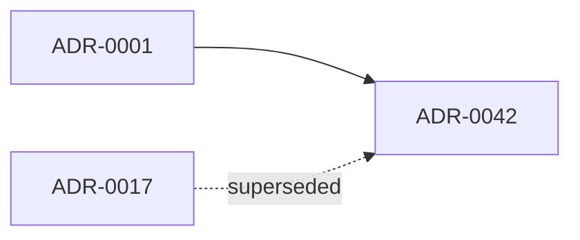

# Pipeline: ADR-INDEX auto-generation

> **ADRs:** ADR-0052, ADR-0053, ADR-0054.

## 1. Purpose

The ADR pack at `docs/decisions/ADR-*.md` is the source of truth for every architectural decision. `docs/ADR-INDEX.md` and `docs/machine-readable/decisions.json` are derived views. The Rust/Buck2 regenerator closes the loop: generated artifacts are emitted from the corpus and Buck2 rejects drift.

## 2. Inputs

Every new or touched `docs/decisions/ADR-*.md` file should declare YAML frontmatter:

```yaml
id: ADR-0042
title: Short title in title case
status: Proposed | Accepted | Superseded | Deprecated | Rejected
date: 2026-05-12
owners:
  - team-id-a
  - team-id-b
supersedes:
  - ADR-0017
superseded_by: []
axes:
  - foundry
  - cloud
tags:
  - tenancy
  - audit
```

## 3. Outputs

- `docs/ADR-INDEX.md` — single rendered table sorted by ADR number, plus summary counts, gaps, and source list.
- `docs/machine-readable/decisions.json` — JSON sidecar for downstream consumption (`oya-foundry-pr-traceability-kernel`, `cross-reference-index-spec.md`).

## 4. Trigger matrix

| Event | Action |
|---|---|
| Local regeneration lane | Run the Rust/Buck2 regenerator app in `--write` mode inside a dedicated ADR-index PR. |
| Per-PR | `buck2 build //:adr-index-regeneration-check` re-runs generation and fails if committed output differs. |
| Nightly | Sweep for orphan ADRs (file under `decisions/` not in index) and missing supersession targets. |

## 5. Validation gates (`//:adr-index-regeneration-check`)

1. **No hand edits.** Generated output character-identical to committed file (BLOCKER).
2. **Legacy-shape tolerant parsing.** Historical blockquote, bullet, table, and YAML metadata are parsed; new/touched ADRs should normalize to YAML frontmatter.
3. **Status-transition validity.** Allowed transitions: `Proposed → Accepted`, `Proposed → Rejected`, `Accepted → Superseded`, `Accepted → Deprecated`. Any other transition → HIGH (requires ADR-amendment).
4. **Supersession graph closure.** Every `supersedes:` target exists; every `superseded_by:` target exists and references this id back; cycles forbidden.
5. **Owner-team existence.** Every owner id resolves to a `docs/teams/<id>/CHARTER.md` (cross-validated via `oya-foundry-raci-team-coverage-kernel`).
6. **ID density.** Gaps are recorded in the generated summary; unexpected future gaps require ADR-number reservation rationale.

## 6. Manual-edit lockout

The generated header says the file comes from the Rust/Buck2 ADR index generator. Any commit that modifies generated artifacts without a matching generator/corpus rationale is rejected by review and `//:adr-index-regeneration-check`.

## 7. Supersession-graph rendering

Within the index, emit a Mermaid graph:



Solid edges = `supersedes`; dashed edges = `superseded_by` (informational). The `architecture-map-kernel` ingests the same graph for the system-wide architecture map.

## 8. Out-of-scope

- ADR body content validation (handled by `oya-foundry-adr-citation-kernel`).
- ADR-to-code-citation enforcement (handled by `oya-foundry-pr-traceability-kernel`).
- Cross-ADR consistency review (human council; tracked in `docs/CONTRADICTION-LEDGER.md`).
