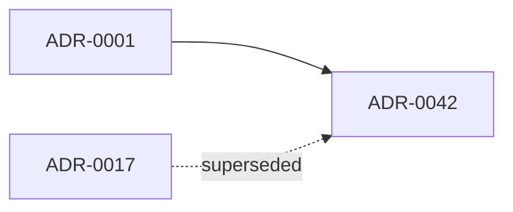

# Pipeline: ADR-INDEX auto-generation

> **ADRs:** ADR-0052, ADR-0053, ADR-0054.

## 1. Purpose

The ADR pack at `docs/decisions/**/*.md` is the source of truth for every architectural decision. The single-file `docs/ADR-INDEX.md` is a derived view. Today the index is hand-maintained; the lane already runs `governance-adr-index-kernel` validation, but generation is the next step. This pipeline closes the loop: the ADR-INDEX is emitted from frontmatter; manual edits are rejected.

## 2. Inputs

Every `docs/decisions/**/*.md` file is required to declare in YAML frontmatter:

```yaml
id: ADR-0042
title: Short title in title case
status: Proposed | Accepted | Superseded | Deprecated | Rejected
date: 2026-05-12
owners:
  - team-id-a
  - team-id-b
supersedes:
  - ADR-0017
superseded_by: []
axes:
  - foundry
  - cloud
tags:
  - tenancy
  - audit
```

## 3. Outputs

- `docs/ADR-INDEX.md` — single rendered table grouped by status, then by id descending; supersession graph in Mermaid; per-axis ADR list.
- `docs/machine-readable/decisions.json` — JSON sidecar for downstream consumption (`cross-reference-index-spec.md`).

## 4. Trigger matrix

| Event | Action |
|---|---|
| Pre-commit hook | Re-generate `docs/ADR-INDEX.md`; if `git diff --quiet docs/ADR-INDEX.md` ≠ exit 0, refuse commit with clear "ADR-INDEX is generated, do not edit by hand". |
| Per-PR | CI re-runs generation; PR fails if generated output differs from committed. |
| Nightly | Sweep for orphan ADRs (file under `decisions/` not in index) and missing supersession targets. |

## 5. Validation gates (`governance-adr-index`)

1. **No hand edits.** Generated output character-identical to committed file (BLOCKER).
2. **Frontmatter completeness.** Every ADR has all required fields; missing field → BLOCKER with file path.
3. **Status-transition validity.** Allowed transitions: `Proposed → Accepted`, `Proposed → Rejected`, `Accepted → Superseded`, `Accepted → Deprecated`. Any other transition → HIGH (requires ADR-amendment).
4. **Supersession graph closure.** Every `supersedes:` target exists; every `superseded_by:` target exists and references this id back; cycles forbidden.
5. **Owner-team existence.** Every owner id resolves to a `docs/teams/<id>/CHARTER.md` (cross-validated via `governance-raci-team-coverage-kernel`).
6. **ID density.** No gaps > 5 in the id sequence (signals a lost ADR or shadow-numbering).

## 6. Manual-edit lockout

The first line of the generated file is `<!-- generated-by: adr-index-pipeline; do not edit -->`. Any commit that modifies `docs/ADR-INDEX.md` without modifying any `docs/decisions/**/*.md` in the same PR is auto-rejected by the lane (HIGH; can be overridden by ADR-tracked exception).

## 7. Supersession-graph rendering

Within the index, emit a Mermaid graph:



Solid edges = `supersedes`; dashed edges = `superseded_by` (informational). The `architecture-map-kernel` ingests the same graph for the system-wide architecture map.

## 8. Out-of-scope

- ADR body content validation (handled by `governance-adr-citation-kernel`).
- ADR-to-code-citation enforcement (handled by a separate governance lane).
- Cross-ADR consistency review (human council; tracked in `docs/CONTRADICTION-LEDGER.md`).
