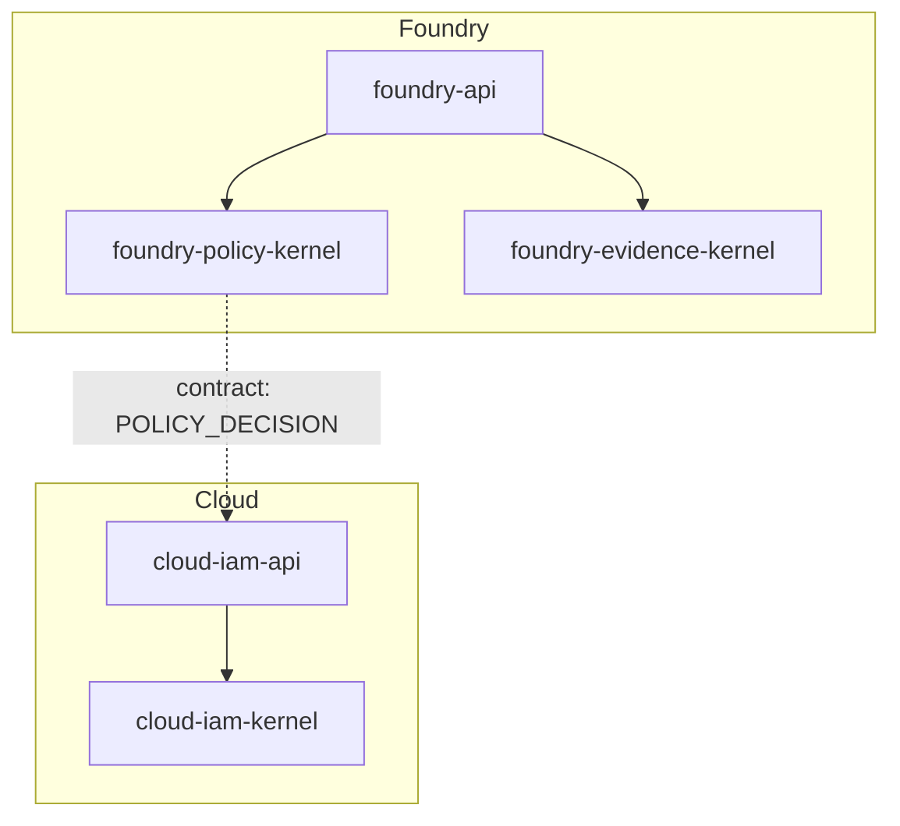
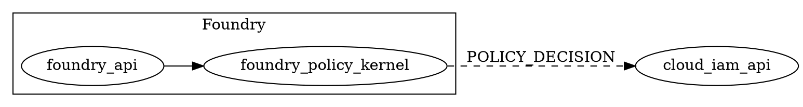

# Visualization spec: `intelligence-architecture-map-kernel`

> **ADRs:** ADR-0052, ADR-0053, ADR-0054.

## 1. Purpose

Directive 11 (visualization-as-code, Foundry-owned, auto-updated) is the architectural principle; this kernel is the executor. Same shape as `governance-cohesion-fitness-kernel`: pure value-object kernel, no I/O, deterministic transformation from inputs to outputs.

## 2. Crate shape (mirroring `governance-cohesion-fitness-kernel`)

```rust
#[derive(Clone, Debug, Eq, PartialEq)]
pub struct ArchitectureSource {
    pub workspace_crates: Vec<CrateRecord>,
    pub contracts: Vec<ContractRecord>,
    pub product_axes: Vec<ProductAxisRecord>,
    pub adr_supersession_graph: Vec<AdrEdge>,
}

#[derive(Clone, Debug, Eq, PartialEq)]
pub struct ArchitectureMap {
    pub mermaid: String,
    pub d2: String,
    pub graphviz_dot: String,
    pub mdbook_chapter_markdown: String,
}

pub fn render_architecture_map(
    source: &ArchitectureSource,
) -> Result<ArchitectureMap, ArchitectureMapError>;
```

Error variants mirror `CohesionFitnessError`: `NoCrates`, `OrphanContract { id }`, `UnknownAxis { axis }`, `BrokenAdrEdge { from, to }`, `CycleDetected { cycle }`.

## 3. Inputs (sources)

- Workspace `Cargo.toml` `[workspace.members]` + each crate's `Cargo.toml` `[package.metadata.oyatie]` block (axis, layer, role).
- `contracts/openapi/*.yaml` metadata + `contracts/eventschema/*.yaml` + `contracts/proto/*.proto`.
- `docs/products/<axis>/PRD.md` frontmatter (status, owner, wave).
- `docs/machine-readable/decisions.json` (supersession graph from `adr-index-pipeline.md`).
- Cross-crate link graph from `rustdoc-pipeline.md` outputs.

## 4. Outputs (three renderings)

### 4.1 Mermaid (inline in mdbook)



Layer hint via `subgraph`; cross-axis contracts as dashed edges.

### 4.2 D2 (richer, via `terrastruct/d2`)

```d2
foundry: {
  api: {shape: rectangle}
  policy-kernel: {shape: cylinder}
}
cloud: {
  iam-api: {shape: rectangle}
}
foundry.policy-kernel -> cloud.iam-api: "POLICY_DECISION" {style: {stroke-dash: 3}}
```

D2 is used for the canonical service map (richer shapes, layouts).

### 4.3 Graphviz dot (SVG fidelity fallback)



Graphviz is the fidelity-critical render (regulator submissions, print artifacts).

## 5. mdbook chapter assembly

The kernel emits `mdbook_chapter_markdown` containing all three renders side-by-side under headings `## Mermaid view`, `## D2 view`, `## Graphviz dot`. The mdbook-kernel validates the resulting source; the rendered SVGs are produced by CI tooling (`mmdc`, `d2`, `dot`) and committed to `docs/site/src/visualization/<map>/svg/`.

## 6. Determinism + idempotence

Same `ArchitectureSource` → same output bytes. Ordering is canonicalized (BTreeMap/BTreeSet, as in the existing kernels). Cycles in cross-axis contracts return `CycleDetected` to force explicit ADR-tracked resolution.

## 7. Validation lane (`governance-architecture-map-freshness`)

1. **Source-up-to-date.** Every workspace crate is represented; orphan crate (in workspace but not in source) → BLOCKER.
2. **Render-up-to-date.** Committed `docs/site/src/visualization/architecture/*.md` matches re-rendered output (BLOCKER).
3. **SVG presence.** Every rendered diagram has its CI-produced SVG sibling (HIGH).
4. **Contract referential integrity.** Every cross-axis contract edge resolves to a contract in `contracts/` and a record in the catalog (BLOCKER; reuses `governance-cohesion-fitness-kernel`'s ImplementedSourceMissingCatalog rule).
5. **Cycle ban.** Any cycle in cross-axis contract graph → BLOCKER absent ADR-tracked exception.

## 8. Trigger matrix

| Event | Action |
|---|---|
| Per-PR (any `crates/**`, `contracts/**`, `docs/products/**`) | Re-render touched subgraph; lane runs. |
| Nightly | Full re-render; full SVG regeneration; archive snapshot for trend. |
| On ADR status change | Re-fetch supersession graph; re-render. |

## 9. Out-of-scope

- Run-time topology (covered by `audit-chain-map-spec.md` for events; future `runtime-topology-spec.md` for live RPC graph).
- Per-region cell topology (covered by future `cell-topology-spec.md`).
- Human-edited diagrams (the kernel refuses them by virtue of the freshness lane).
