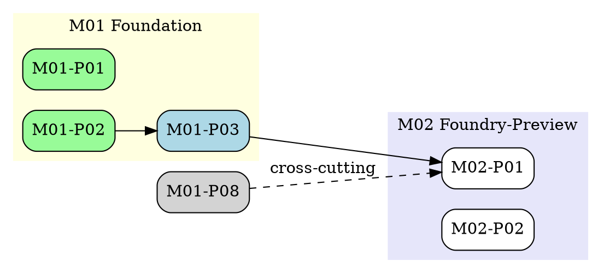

# Visualization spec: dependency graph (plan-DAG)

> **ADRs:** ADR-0052, ADR-0053, ADR-0054.

## 1. Purpose

Where `roadmap-visualization-spec.md` answers "when," this spec answers "what depends on what." The plan-DAG covers every milestone, every phase, every implementation plan, and every cross-cutting dependency declared in frontmatter. Graphviz is the chosen renderer for SVG fidelity at scale (84+ IPs).

## 2. Inputs

- `docs/MASTERPLAN.md` (root; canonical post-Stage-1-Wave-1 lift).
- Every `.omc/plans/milestones/<MNN>/INDEX.md` (milestone tier).
- Every `.omc/plans/milestones/<MNN>/phases/<PNN>/INDEX.md` (phase tier).
- Every `.omc/plans/milestones/<MNN>/phases/<PNN>/IP-NNN-*.md` (implementation plan tier).
- Each file's `parent:` and `depends_on:` frontmatter.

## 3. Frontmatter contract

Already required by MASTERPLAN §6 (per-tier artifact contract). This spec consumes the existing contract; no new fields beyond the existing `parent:` and `depends_on:`.

```yaml
doc_class: ImplementationPlan
parent: .omc/plans/milestones/M02-foundry-preview/phases/P03-policy-cedar/INDEX.md
depends_on:
  - .omc/plans/milestones/M01-foundation/phases/P02-identity/IP-005-cedar-bootstrap.md
status: open
```

## 4. Output rendering

### 4.1 Primary: Graphviz dot (high-fidelity SVG)



Color = status (`done=palegreen`, `active=lightblue`, `gated=lightcoral`, `open=white`).

### 4.2 Secondary: per-milestone subviews

`docs/visualization/dependency-graph-<MNN>.svg` per milestone for focused review. Same generation pipeline emits all subviews from the master graph.

### 4.3 Per-IP node detail (on-hover via SVG `<title>`)

Each IP node embeds an SVG `<title>` element with:
- IP id + slug
- Status
- Estimated parallelism
- Linked ADRs

## 5. Validation gates (`governance-dep-graph`)

1. **Parent referential integrity.** Every `parent:` resolves to an existing file (BLOCKER).
2. **depends_on referential integrity.** Every `depends_on:` entry resolves to an existing IP/phase/milestone file (BLOCKER).
3. **Cycle ban.** No cycles across the entire plan-DAG (BLOCKER absent ADR-tracked exception).
4. **Cross-tier consistency.** An IP's `depends_on:` MUST reference IPs (not milestones); a phase's `depends_on:` MUST reference phases or milestones; a milestone's `depends_on:` MUST reference milestones (HIGH).
5. **Critical-path coverage.** The chain M01 → M02 → M03 → M04 → M05 → M06 renders as a continuous path (BLOCKER on break).
6. **Generated drift.** Committed dep-graph differs from re-rendered (BLOCKER).

## 6. Cross-cutting M-CC edges

Edges from M-CC phases to main-spine phases render as dashed lines with a `cross-cutting` label, to keep the main-spine readable while still surfacing the cross-cutting dependencies.

## 7. Trigger matrix

| Event | Action |
|---|---|
| Per-PR touching `.omc/plans/**` | Re-render; lane runs. |
| Nightly | Full re-render; archive weekly snapshot. |
| On `status:` transition | Re-render with updated node coloring. |

## 8. Render escape-hatch for very-large DAGs

When the IP count exceeds 200, Graphviz dot is sharded by milestone (default behavior at 84 IPs is single-file). The master graph stays renderable by collapsing per-milestone clusters into a single supernode that links to the subview.

## 9. Cross-references

- `roadmap-visualization-spec.md` consumes the same DAG to compute the Gantt critical path.
- `service-map-spec.md` (code-tier) and this spec (plan-tier) together form the full "what's wired to what" picture.

## 10. Out-of-scope

- Per-PR DAG (live PR dependency view; future).
- Per-engineer DAG (load planning; covered by team-internal tooling).
- Risk-overlay on the DAG (future enhancement).
