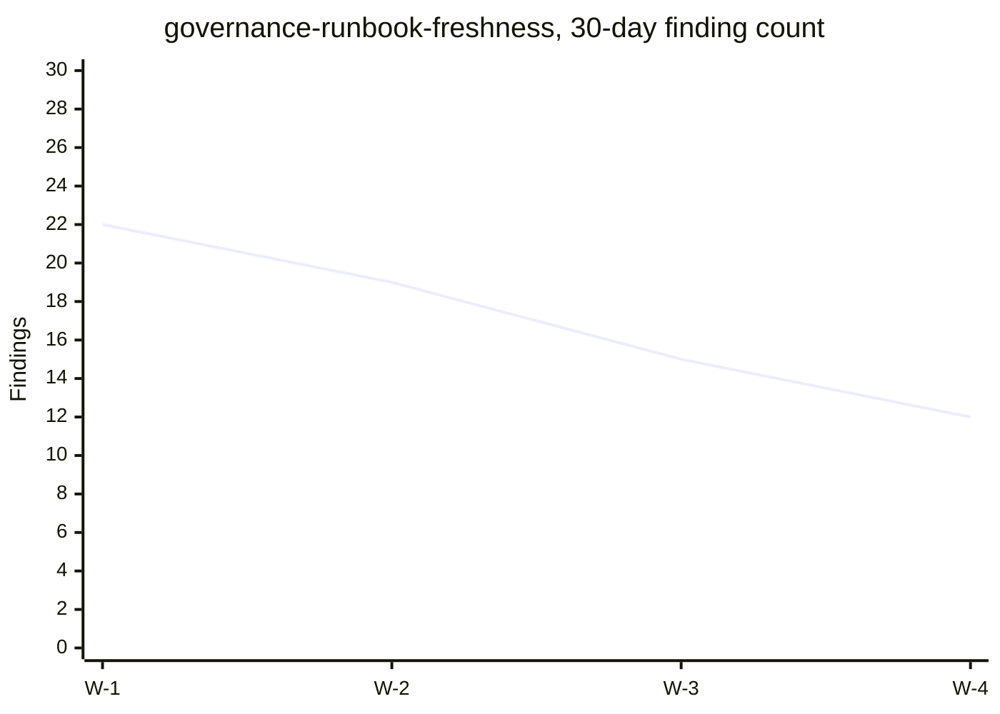

# Pipeline: fitness-lane report rollup

> **ADRs:** ADR-0052, ADR-0053, ADR-0054.

## 1. Purpose

Today each `governance-*` lane emits a pass/fail and a stderr summary into the CI log. That is enough for one lane but not for cross-lane visibility, trend analysis, or owner-team accountability. This pipeline standardizes a JSON report shape every lane MUST emit, then rolls reports into a per-axis mdbook chapter with trend lines.

## 2. Standard lane report shape

Every fitness lane writes `target/fitness-reports/<lane-id>.json` on every run:

```json
{
  "lane_id": "governance-runbook-freshness",
  "schema_version": "1.0.0",
  "run_at": "2026-05-12T08:30:00Z",
  "commit_sha": "abc1234",
  "axis": "foundry",
  "severity_distribution": { "blocker": 0, "high": 2, "advisory": 17 },
  "items_checked": 84,
  "items_failed": 19,
  "findings": [
    { "severity": "high", "item": "docs/runbooks/cloud/region-failover.md", "message": "stale: 191 days" }
  ],
  "duration_ms": 4321
}
```

The shape is validated by `intelligence-eval-kernel`-shaped value-object checks before rollup.

## 3. Inputs

- `target/fitness-reports/*.json` from every CI lane run (collected as workflow artifact).
- `docs/RACI-OWNERSHIP.md` for per-axis owner attribution.
- Prior rollup JSON `docs/machine-readable/fitness-history.json` for trend deltas.

## 4. Outputs

- `docs/machine-readable/fitness-history.json` — append-only history (last N=180 days per lane).
- `docs/site/src/fitness/<axis>.md` — one chapter per axis listing every lane in that axis with current status, 30-day trend, top-3 outstanding findings.
- `docs/site/src/fitness/_overview.md` — cross-axis dashboard: severity totals, top movers, lane-coverage % per axis.

## 5. Trigger matrix

| Event | Action |
|---|---|
| On-merge to main | Collect all per-lane reports, append to history, regenerate mdbook chapters. |
| Per-PR | Surface PR-level diff: "this PR moves N findings (severity X)". |
| Weekly | Snapshot of history archived to `docs/site/archive/fitness/<YYYY-Www>.json`. |

## 6. Validation gates (`governance-lane-rollup`)

1. **Schema conformance.** Every collected report parses against schema v1.0.0 (BLOCKER).
2. **Axis attribution.** Every lane declares an axis; unattributed lane → HIGH.
3. **Report completeness.** A lane that ran in CI but did not emit a report → HIGH.
4. **History retention.** History truncated at 180 days; pre-truncation snapshot must exist in archive (advisory).
5. **mdbook render.** Generated chapters pass `intelligence-mdbook-kernel::validate_mdbook_source`.

## 7. Trend rendering

Per chapter, embed a Mermaid xychart-beta:



The trend chart is auto-generated from the history JSON.

## 8. Lane self-registration

Every fitness-lane crate adds a `register_lane()` const function returning `LaneRegistration { id, axis, schema_version, owner_team }`. The rollup pipeline reads `[package.metadata.oyatie.fitness-lane]` from each crate manifest and refuses to rollup a lane absent from the registry.

## 9. Out-of-scope

- Per-lane authoring guidance (covered by `governance-quality-lane-kernel`).
- CI execution policy (lives in `docs/RELEASE-MANAGEMENT.md`).
- Lane-failure notification routing (separate `notification-pipeline.md`, not in this batch).
