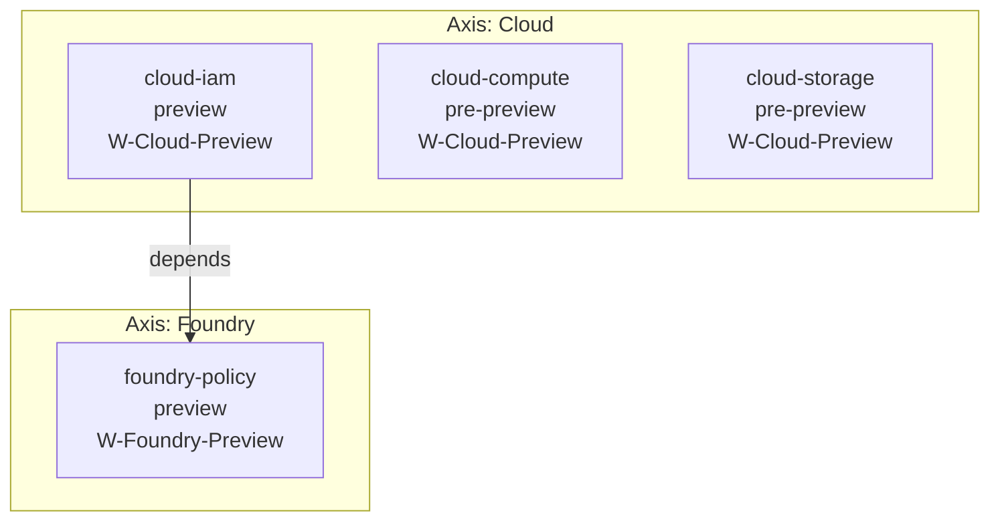

# Visualization spec: product map

> **ADRs:** ADR-0052, ADR-0053, ADR-0054.

## 1. Purpose

The 7 axes of Oyatie (SaaS, Workspace, Vertical, Foundry, Cloud, Search, Ads + Analytics) host N products each (21+ products today, growing). Stakeholders need a single view of "what products exist, where are they in their lifecycle, who owns them, when do they ship." Hand-curated kills the view; this spec auto-generates it.

## 2. Inputs

- Every `docs/products/<axis>/<product>/PRD.md` frontmatter:

```yaml
product_id: cloud-iam
axis: cloud
status: pre-preview | preview | stable | sunset
owner_team: platform-tenancy-identity
wave: W-Cloud-Preview
depends_on:
  - foundry-policy
  - platform-tenancy
companion_docs:
  - DESIGN.md
  - SPEC.md
```

- `/specs/masterplan.json#masterplan_v2.work_items` for canonical work-item identity and status.
- **BLOCKED:** masterplan v2 has no product-frontmatter-to-derived-wave mapping; do not infer one from legacy wave labels.
- `docs/RACI-OWNERSHIP.md` for owner-team resolution.

## 3. Output renderings

### 3.1 Primary: Mermaid (mdbook-inline)



Status is rendered via node-style color (Mermaid `classDef`): `pre-preview = grey`, `preview = blue`, `stable = green`, `sunset = red`.

### 3.2 Secondary: D2 (for richer per-axis posters)

D2 view groups by axis as containers; renders owner-team labels; emits a per-axis SVG suitable for poster printing.

### 3.3 Tabular companion

A sortable table appears below the diagrams: `product_id | axis | status | owner_team | wave | depends_on count | last_updated`.

## 4. Aggregation rules

- Per-axis subgraph orders products alphabetically by `product_id`.
- Cross-axis dependencies render as solid edges; intra-axis dependencies as thin grey edges (lower visual weight).
- Sunset products render last in each axis and use dashed borders.
- Pre-preview products without a `wave:` field assert HIGH on the lane.

## 5. Trigger matrix

| Event | Action |
|---|---|
| Per-PR touching `docs/products/**` | Re-render; lane runs. |
| Per-PR touching `/specs/masterplan.json` | Re-render when work-item data changes. |
| Nightly | Full sweep; orphan product detection (PRD without a matching catalog record). |

## 6. Validation gates (`oya-governance-product-map`)

1. **Frontmatter coverage.** Every `docs/products/<axis>/<product>/PRD.md` has all required fields (BLOCKER on omission).
2. **Status validity.** `status:` ∈ {`pre-preview`, `preview`, `stable`, `sunset`} (BLOCKER).
3. **Planning reference validity.** A product may reference only a resolvable `masterplan_work_item_id:` in `/specs/masterplan.json#masterplan_v2.work_items` (BLOCKER). **BLOCKED:** no successor field exists for legacy `wave:` labels.
4. **Owner-team validity.** `owner_team:` resolves to `docs/teams/<id>/CHARTER.md` (HIGH).
5. **depends_on referential integrity.** Every dependency resolves to another product PRD (BLOCKER).
6. **Cycle ban.** Dependency cycle across products → BLOCKER absent ADR-tracked exception.
7. **Generated drift.** Committed `docs/visualization/product-map.md` differs from re-rendered (BLOCKER).

## 7. Per-axis posters

For each axis, the pipeline emits an additional standalone SVG to `docs/visualization/posters/product-map-<axis>.svg` suitable for printing at A2/A3. The poster includes axis logo, status legend, and a "last refreshed" timestamp footer.

## 8. Cross-link with roadmap visualization

`masterplan_work_item_id:` anchors `roadmap-visualization-spec.md`'s rendering where present. **BLOCKED:** no product-to-derived-wave field exists in masterplan v2, so the two views must not claim a single wave-truth.

## 9. Out-of-scope

- Per-product feature breakdown (lives in each product's `SPEC.md`).
- Customer-facing product marketing site (separate generation pipeline, not this one).
- Pricing / packaging visualization (covered under `docs/GTM-PLAN.md`).
