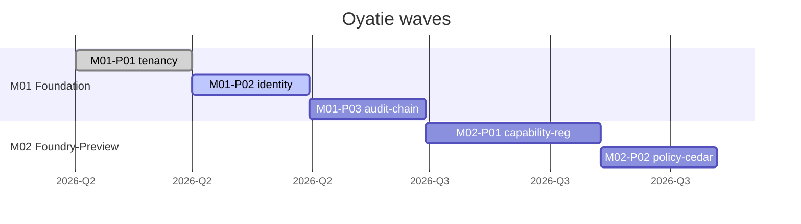

# Visualization spec: roadmap (Mermaid Gantt)

> **ADRs:** ADR-0052, ADR-0053, ADR-0054.

## 1. Purpose

The roadmap is the single answer to "when does what ship." The canonical source is `/specs/masterplan.json#masterplan_v2`; this pipeline lifts its dependency graph to a single visual artifact, auto-derived and refreshed on every plan edit.

## 2. Inputs

- `docs/MASTERPLAN.md` §3 Milestone index table (canonical post-Stage-1-Wave-1 lift).
- Each milestone INDEX `.omc/plans/milestones/<MNN>/INDEX.md` frontmatter (status, wave, start_date_target, end_date_target).
- Each phase INDEX `.omc/plans/milestones/<MNN>/phases/<PNN>/INDEX.md` frontmatter (start_after, est_duration_days, status).
- `/specs/masterplan.json#masterplan_v2.dependency_edges` and `.sequencing` for derived ordering.
- **BLOCKED:** no masterplan-v2 field succeeds legacy wave-gate acceptance criteria; the visualization must not render or validate them as current data.

## 3. Frontmatter conventions (additions)

Milestone INDEX adds:

```yaml
start_date_target: 2026-06-01
end_date_target: 2026-09-30
status: open | active | gated | done
```

Phase INDEX adds:

```yaml
start_after: M01-P03   # phase id this phase waits on
est_duration_days: 21
status: open | active | done
```

## 4. Output rendering

### 4.1 Primary: Mermaid Gantt



Sections grouped by milestone; M-CC threaded as its own section with `:crit` tag where dependencies are critical-path.

### 4.2 Secondary: D2 wave-gate diagram

A separate D2 view showing dependency edges from `/specs/masterplan.json#masterplan_v2.dependency_edges`. **BLOCKED:** no field-level successor exists for legacy gate-criteria labels, so they are omitted rather than invented.

### 4.3 Cumulative-progress chart

A Mermaid `xychart-beta` showing cumulative phase completion over time, broken by milestone.

## 5. Wave-gate annotation

Each derived dependency wave is rendered as a diamond node containing:
- Derived `wave_index` from `/specs/masterplan.json#masterplan_v2.sequencing`.
- Current pass/fail state (from `oya-governance-lane-rollup` aggregate).
- **BLOCKED:** no masterplan-v2 field exists for legacy gate-criteria labels.

## 6. Validation gates (`oya-governance-roadmap-viz`)

1. **Frontmatter completeness.** Every milestone/phase INDEX has the required date/duration fields (BLOCKER).
2. **DAG validity.** `start_after:` references resolve; no cycles (BLOCKER).
3. **Status validity.** `status:` ∈ {`open`, `active`, `gated`, `done`} (BLOCKER).
4. **Derived-wave coverage.** Every `wave_index` in `/specs/masterplan.json#masterplan_v2.sequencing` has at least one work item assigned (HIGH).
5. **Generated drift.** Committed roadmap viz differs from re-rendered (BLOCKER).
6. **Critical-path integrity.** The critical path (M01 → M02 → ... → M06) renders as a continuous chain; gap → HIGH.

## 7. Trigger matrix

| Event | Action |
|---|---|
| Per-PR touching `docs/MASTERPLAN.md` or any milestone/phase INDEX | Re-render; lane runs. |
| Per-PR touching `/specs/masterplan.json` | Re-render (dependency order may change). |
| Nightly | Full re-render; archive weekly snapshot for trend. |
| On phase `status:` transition to `done` | Re-render with green styling; auto-notify stakeholders. |

## 8. Snapshot history

Each Friday 17:00 KST, the pipeline archives the current Gantt SVG to `docs/visualization/archive/roadmap-<YYYY-Www>.svg`. The history powers retrospective "how did we trend" reviews at fortnightly stakeholder syncs.

## 9. Out-of-scope

- Per-engineer assignment (covered by team-internal tooling, not surfaced here).
- Risk-overlay on the Gantt (future enhancement; will cross from `docs/RISK-REGISTER.md`).
- Customer-facing roadmap (separate hand-curated `docs/CUSTOMER-ROADMAP.md`).
