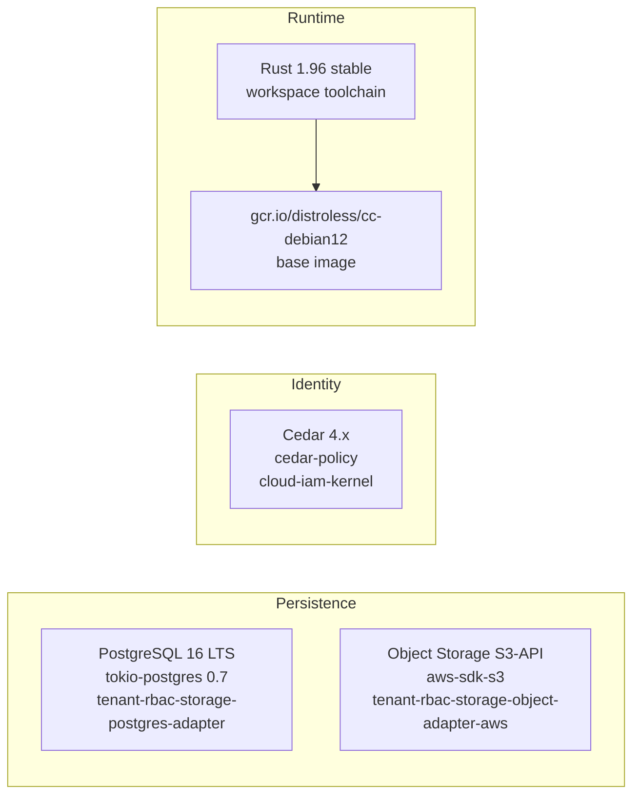

# Visualization spec: tech-stack map

> **ADRs:** ADR-0052, ADR-0053, ADR-0054.

## 1. Purpose

Directive 8 (current LTS dependencies, CI-enforced) requires a single visible roster of what we depend on, what version, what role, and where the abstraction boundary lives. The tech-stack map is that roster, rendered.

## 2. Inputs

- Every `crates/**/Cargo.toml` direct `[dependencies]`.
- Every `clients/typescript/**/package.json` `dependencies` block.
- Every base image referenced in `Dockerfile`s under `crates/**/Dockerfile` and `infra/**/Dockerfile`.
- The verified LTS roster `.omc/plans/specs/lts-versions-verified-2026-05-12.md`.
- The provider-adapter registry (every `oyatie-*-adapter-<provider>-*` crate declares which external in its `Cargo.toml` `[package.metadata.oyatie.adapts]`).

## 3. Per-dep record shape

```yaml
dep_id: postgres
ecosystem: rust
crate: tokio-postgres
version_pinned: "0.7.x"
lts_track: "PostgreSQL 16 LTS"
role: "primary OLTP store"
adapter_crate: tenant-rbac-storage-postgres-adapter
distroless_base: "gcr.io/distroless/cc-debian12"
license: "MIT OR Apache-2.0"
last_audit: 2026-04-30
```

## 4. Output rendering

### 4.1 Primary: Mermaid (grouped by role)



Subgraphs by role (`Persistence`, `Identity`, `Observability`, `Eventing`, `AI providers`, `Runtime`, `Build/CI tooling`).

### 4.2 Secondary: tabular

A sortable companion table with `dep_id | ecosystem | version | lts_track | role | adapter_crate | distroless_base | license | last_audit`.

### 4.3 Per-axis subviews

For each axis, an axis-scoped Mermaid view showing only the deps that axis consumes. Helps the axis lead see "what am I responsible for keeping current."

## 5. Validation gates (`governance-tech-stack-map`)

1. **LTS conformance.** Every dep's `version_pinned` resolves to the current LTS major.minor per `lts-versions-verified-*.md` (BLOCKER absent ADR-tracked exception).
2. **Adapter-boundary discipline.** Provider-specific deps (AWS, GCP, Azure, OCI, OpenAI, Anthropic, etc.) appear ONLY in `oyatie-*-adapter-<provider>-*` crates (BLOCKER per Directive 4).
3. **Distroless conformance.** Every binary crate's Dockerfile inherits `gcr.io/distroless/static-debian12` or `gcr.io/distroless/cc-debian12` (BLOCKER per Directive 5).
4. **License-policy compliance.** Every dep's license passes `governance-license-policy-kernel` (BLOCKER on prohibited license).
5. **Vendor-contract recency.** For commercial vendors, `last_audit` ≤ 365 days (HIGH; via `governance-vendor-contract-recency-kernel`).
6. **Generated drift.** Committed tech-stack map differs from re-rendered (BLOCKER).

## 6. Per-dep doc cross-link

Each dep node links to:
- The vendor's official LTS lifecycle page (preserved in `docs/standards/lts-vendor-lifecycle-links.md`).
- The adapter crate's rustdoc page (`/api/rust/<adapter-crate>/`).
- The ADR (if any) authorizing the dep's adoption.

## 7. Trigger matrix

| Event | Action |
|---|---|
| Per-PR touching any `Cargo.toml`, `package.json`, or `Dockerfile` | Re-render; lane runs. |
| Nightly | Full sweep; LTS-drift detection (vendor pushed new LTS). |
| Quarterly | Vendor-contract recency sweep; audit-date check. |

## 8. EOL countdown

For each dep, the pipeline computes `days_until_eol` from the vendor's published EOL date and surfaces a countdown badge on the map. Deps with `< 90` days emit advisory; `< 30` days emit HIGH; past EOL emits BLOCKER absent ADR-tracked extension.

## 9. Out-of-scope

- Transitive dep visualization (covered by `cargo tree` artifacts under per-crate API ref).
- Internal-only deps (those live in `service-map-spec.md`).
- Per-region pack vendor inventory (covered by regional packs).
