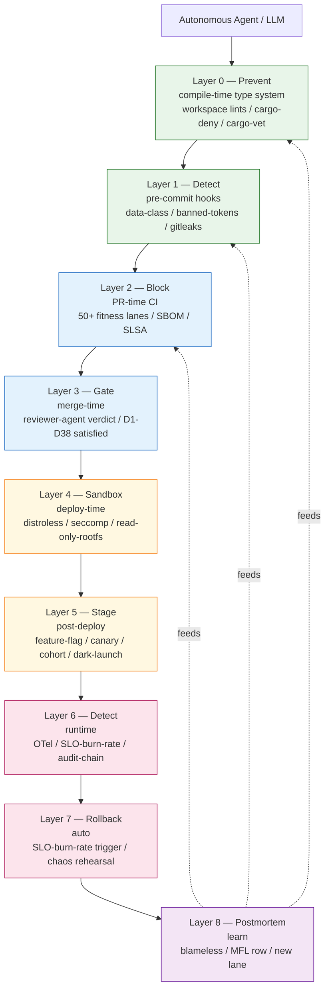

# Defense-in-Depth Architecture — 9 Layers

> Accepted per ADR-0053 (fitness-lane governance) and ADR-0055
> (impossible-to-fail environment contract). This document is the
> normative reference for the 9-layer model; the measurement contract
> in ADR-0055 §6 binds to invariants I-01..I-10 defined here.

## Layered model (diagram)

## Layer 0 — Prevent (compile time)

**Purpose**: stop slop at the compiler. The Rust type system + workspace
lints make many AI failure modes uncompilable.

| Mechanism | Mode(s) stopped | Lane |
|---|---|---|
| `#![forbid(unsafe_code)]` per non-FFI crate | AIS-074 + unsafe-class CVEs ([CVE-2025-68260](https://www.penligent.ai/hackinglabs/rusts-first-breach-cve-2025-68260-marks-the-first-rust-vulnerability-in-the-linux-kernel/)) | `governance-unsafe-policy` (new) |
| `clippy::pedantic` + workspace `[lints]` | AIS-010..013, AIS-050, AIS-072, AIS-080 | `governance-no-unwrap` (new) |
| `cargo-deny` (licenses + sources + bans) | AIS-073, AIS-001 (partial), AIS-122 | existing `governance-license` |
| `cargo-vet` audit chain | AIS-001, AIS-074 | `governance-dep-allowlist` (new) |
| `cargo-audit` (RustSec) | AIS-122 | existing |
| `cargo-semver-checks` | D01, D04 | `governance-semver` (new) |
| `cargo-hakari` (workspace-hack dedup) | AIS-120, AIS-121 | `governance-version-cohesion` (new) |
| `cargo-machete` + `cargo-udeps` | AIS-021 | `governance-unused-deps` (new) |
| Kani (model-check FFI / unsafe) | AIS-074 + memory-safety CVEs | `governance-kani` (new, nightly) |
| MIRI on unsafe-tagged tests | same | same lane |

## Layer 1 — Detect (pre-commit)

**Purpose**: sub-second feedback at commit time. Pre-commit hooks run
locally and in `pre-commit.ci`.

| Hook | Mode(s) stopped | Lane |
|---|---|---|
| `trailing-whitespace` / `end-of-file-fixer` | hygiene | existing |
| `pre-commit-data-class.sh` (struct `data_class:` annotation) | AIS-150 | existing `governance-data-class` |
| `banned-tokens` (`TODO`, `FIXME`, `unimplemented!`) | AIS-021 (final-shape) | existing |
| `banned-primitives` (no `git`/`gh` undocumented) | per MASTERPLAN D12 | existing |
| `glossary-vocabulary` + `brand-residue` | MFL-0002/0003/0004 | existing |
| `forward-reference` (no link to unmerged file) | doc-orphan | existing |
| `mistakes-ledger-cite` (every Sev-1/2 fix cites MFL row) | postmortem chain | existing |
| `gitleaks` (secret scan) | AIS-071 | `governance-secret-scan` (new) |
| `unicode-discipline` (no BiDi controls) | AIS-074 | `governance-unicode-discipline` (new) |

## Layer 2 — Block (PR-time CI)

**Purpose**: authoritative gate. 50+ fitness lanes per
[`.omc/governance-lanes/INDEX.md`](../../governance-lanes/) (current 22 + 20
new from this work + ~10 already-planned).

Mandatory blocking checks (any red = no merge):

- `cargo clippy --workspace --all-targets -- -D warnings`
- `cargo nextest run --workspace --no-fail-fast`
- `cargo doc --no-deps -- -D rustdoc::broken_intra_doc_links`
- `cargo test --doc`
- `cargo deny check`
- `cargo vet check`
- `cargo audit`
- `cargo semver-checks`
- `cargo machete` + `cargo udeps` (nightly job)
- `cargo mutants --in-diff` (≥70% caught on changed lines)
- `cargo fuzz run <target> -- -max_total_time=60` (smoke pass on every
  fuzz target; corpus growth tracked)
- `semgrep --config=p/security-audit --config=p/owasp-top-ten` (AIS-070,
  AIS-072 patterns)
- `trufflehog filesystem --only-verified` (AIS-071 verified-secret
  catch)
- `syft packages -o cyclonedx-json` (SBOM emit per artifact)
- `cosign sign --keyless` (Fulcio OIDC) + `cosign attest --type slsaprovenance`
- `kube-linter` + `kubescape scan` (AIS-051)
- `osv-scanner --recursive .` (cross-ecosystem CVE)
- All 50+ `governance-*` lanes (existing + new)

Sources: [Sigstore Cosign](https://docs.sigstore.dev/cosign/verifying/attestation/),
[OpenSSF — Sigstore at scale](https://openssf.org/blog/2024/02/16/scaling-up-supply-chain-security-implementing-sigstore-for-seamless-container-image-signing/),
[OneUptime SLSA L3](https://oneuptime.com/blog/post/2026-02-09-slsa-level3-build-provenance/view),
[Semgrep AI-powered detection](https://semgrep.dev/blog/2025/ai-powered-detection-with-semgrep/),
[TruffleHog](https://github.com/trufflesecurity/trufflehog).

## Layer 3 — Gate (merge-time)

**Purpose**: human-in-the-loop only where mechanical defense is
insufficient. Reviewer-agent verdict required per change class.

- **PR shape** (existing): four H2 sections (Issue / Summary / Verification /
  Code Review).
- **D1..D38 satisfied** (this doc): PR template enumerates each
  dimension, agent verifies via lane evidence.
- **Done-Definition D1..D18** (existing IP contract): per
  MASTERPLAN §6.
- **CHANGELOG row** (existing): `governance-changelog`.
- **Audit-chain emit** (existing): `EVT-PR-MERGE` row.
- **Reviewer agent** (new under Directive 9): a separate Claude/Codex/Gemini
  Disagreement between primary author agent and reviewer agent
  auto-escalates to council-architecture.

## Layer 4 — Sandbox (deploy time)

**Purpose**: contain blast radius even if Layer 0-3 leak.

- Distroless `gcr.io/distroless/cc-debian12` or `chainguard/static`
  (existing `governance-image-discipline`).
- Per-process `seccomp` profile (denylist + allowlist).
- `CAP_DROP=ALL` + selective `CAP_ADD`.
- Read-only rootfs; `tmpfs` for `/tmp`.
- Non-root user (uid 65532 distroless default).
- Provenance-pinned image hash (Cosign-verify at admission via Kyverno
  or `cosigned`).
- `Pod Security Standards: restricted` admission policy.

Source: [Falco runtime security](https://falco.org/docs/),
[Chainguard distroless getting-started](https://edu.chainguard.dev/chainguard/chainguard-images/about/getting-started-distroless/).

## Layer 5 — Stage (post-deploy)

**Purpose**: control blast radius across time. Per
[`.omc/advanced-cicd/progressive-delivery/`](../progressive-delivery/).

- Feature flag (LaunchDarkly / Flagsmith / Unleash) — every behavior
  change gated.
- Canary 1% → 5% → 25% → 50% → 100% via Argo Rollouts.
- Cohort segmentation (per-tenant, per-region, per-plan).
- Dark launch (shadow traffic to new code path, response discarded).
- Traffic mirror (production-replay test).

Sources: [Flagsmith Progressive Delivery](https://www.flagsmith.com/blog/progressive-delivery),
[Argo Rollouts analysis](https://argo-rollouts.readthedocs.io/en/stable/features/analysis/).

## Layer 6 — Detect (runtime)

**Purpose**: observe what survives the gates.

- OpenTelemetry traces (every kernel/adapter `pub async fn`
  instrumented).
- OpenTelemetry metrics (RED + USE + per-capability counters).
- Structured JSON logs (no PII per data-class).
- Audit-chain emit (every regulated invocation — existing).
- SLO + burn-rate alerting (1× / 3× / 14.4× per Google SRE workbook).
- Falco / eBPF runtime threat detection (Falco rules trigger on
  unexpected syscalls).

Source: [Google SRE workbook — error budget policy](https://sre.google/workbook/error-budget-policy/),
[Honeycomb OpenTelemetry](https://www.honeycomb.io/platform/opentelemetry).

## Layer 7 — Rollback (auto)

**Purpose**: revert before humans page.

- SLO-burn-rate auto-rollback (Argo Rollouts AnalysisRun rules).
- Feature-flag instant kill-switch (per-flag).
- Per-cell rollback procedure (runbook resolved by
  `governance-runbook-index-resolves`).
- Per-tenant rollback (data-plane carve-out).
- Chaos engineering rehearsal (Chaos Mesh, scheduled drills) —
  rollback evidence per quarter.

Source: [Chaos Mesh](https://chaos-mesh.org/),
[Argo Rollouts analysis-driven rollback](https://argo-rollouts.readthedocs.io/en/stable/features/analysis/).

## Layer 8 — Postmortem (learn)

**Purpose**: convert every escape into a mechanical prevention.

Process (per [Google SRE postmortem culture](https://sre.google/sre-book/postmortem-culture/)):

1. Blameless postmortem authored within 5 business days of resolution.
2. Root-cause categorized against the 16 classes in
   [`ai-slop-failure-mode-catalogue.md`](ai-slop-failure-mode-catalogue.md).
3. New row added to `docs/MISTAKES-LEDGER.md` (MFL-NNNN) per
   [MISTAKES-LEDGER §2 entry format](../../../docs/MISTAKES-LEDGER.md).
4. Mechanical prevention authored: either a new fitness lane, a new
   clippy `disallowed_methods` config, a new pre-commit hook, or a new
   admission policy.
5. Prevention validated by replay-as-eval per ADR-0024
   foundry-eval-harness; existing `oyatie.prevention.verify-coverage`
   capability run.

## Composability + redundancy + failure isolation

Every catalogued mode is caught at **≥2 layers**. Trace AIS-010
(`.unwrap()`): L0 clippy `unwrap_used=deny` (compile-fail) → L1
pre-commit grep → L2 CI lane `governance-no-unwrap` → L3 PR
template `// SAFETY-EXPECT:` reviewer-agent check → L6 runtime
`panic_handler` emits `EVT-PANIC` + SLO burn-rate alarm → L7 Argo
Rollouts auto-rollback when panic-rate > 0.01%/min → L8 MFL row.
Redundancy is **not** ceremony — each layer lives at an independent
failure boundary (type system / filesystem / CI daemon / reviewer /
OS / traffic router / telemetry / controller / governance) so a
single-component outage (e.g., CI infra down) does not bypass the
gate — local pre-commit + reviewer-agent + admission policy still
hold. Linus-discipline check: every redundant defense must reshape
data or block a class, not merely "double-check" the previous layer.

## Sources

- [Google SRE — Postmortem Culture](https://sre.google/sre-book/postmortem-culture/)
- [Google SRE workbook — Error Budget Policy](https://sre.google/workbook/error-budget-policy/)
- [Sigstore — In-toto attestations](https://docs.sigstore.dev/cosign/verifying/attestation/)
- [OpenSSF — Sigstore at scale](https://openssf.org/blog/2024/02/16/scaling-up-supply-chain-security-implementing-sigstore-for-seamless-container-image-signing/)
- [SLSA L3 build provenance — OneUptime 2026](https://oneuptime.com/blog/post/2026-02-09-slsa-level3-build-provenance/view)
- [Semgrep AI-powered detection](https://semgrep.dev/blog/2025/ai-powered-detection-with-semgrep/)
- [TruffleHog](https://github.com/trufflesecurity/trufflehog)
- [Argo Rollouts Analysis](https://argo-rollouts.readthedocs.io/en/stable/features/analysis/)
- [Flagsmith Progressive Delivery](https://www.flagsmith.com/blog/progressive-delivery)
- [Falco docs](https://falco.org/docs/)
- [Chaos Mesh](https://chaos-mesh.org/)
- [Chainguard distroless](https://edu.chainguard.dev/chainguard/chainguard-images/about/getting-started-distroless/)
- [Honeycomb OpenTelemetry](https://www.honeycomb.io/platform/opentelemetry)
