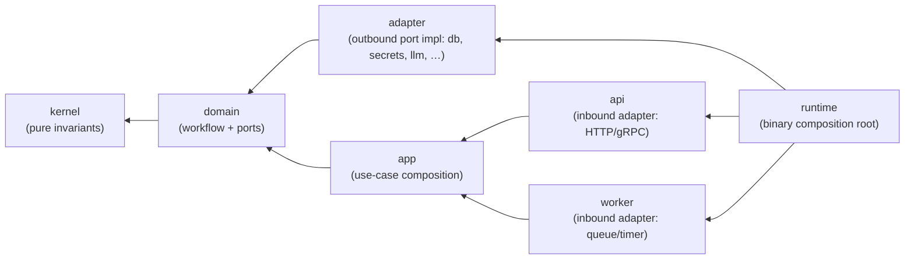

---
doc_class: Standard
shape: ~
length_cap: 500
authority_tier: 2
status: Accepted
date: 2026-05-12
purpose: |
  Canonical layered-architecture standard for every `oya-*` crate. Defines the
  `kernel ◀── domain ◀── app ◀── { api, worker, adapter } ◀── runtime`
  dependency direction, the cross-layer contract rules (traits, error
  boundaries), the testing posture per layer, and the cross-reference to
  `crate-naming-convention.md` (a crate's `[package.metadata.oya].role`
  MUST match its actual layer behavior).
canonical_authority: /specs/decision-principles.json + /specs/forbidden-operations.json
planned_enforcement_ref: oya-governance-architecture-conventions
companion_docs:
  - docs/standards/crate-naming-convention.md
  - docs/standards/code-style-rust.md
  - docs/standards/error-handling.md
  - docs/standards/testing.md
  - docs/standards/dependency-policy.md
  - docs/audits/convention-audit-2026-05-12.md
  - docs/plans/rename-plan-2026-05-12.md
  - docs/research/hyperscaler-best-practices-2026-05-12.md
related_adrs:
  - ADR-0015
  - ADR-0017
  - ADR-0053
  - ADR-0054
  - ADR-0056
authority_chain_declaration: |
  /specs/decision-principles.json + /specs/forbidden-operations.json > docs/AGENTS.md > docs/standards/code-style-rust.md
  > docs/standards/crate-naming-convention.md ≡ THIS DOC
  > planned_enforcement_ref=oya-governance-architecture-conventions
---

# Clean Architecture

## Doctrinal authority — [decision-principles.json](../../specs/decision-principles.json) + [forbidden-operations.json](../../specs/forbidden-operations.json)

This standard operates within the [`decision-principles.json`](../../specs/decision-principles.json) + [`forbidden-operations.json`](../../specs/forbidden-operations.json)
frame (architecture decision principles; ADR-0015 flat crates) and is the **peer** of
[`crate-naming-convention.md`](crate-naming-convention.md): the naming
standard binds the **role token** of every crate name; this standard binds
the **layer semantics** the role represents. The pair is enforced as a
single lane, `oya-governance-architecture-conventions`, severity
**BLOCKER**.

## 1. Vocabulary

The keywords MUST, MUST NOT, REQUIRED, SHALL, SHALL NOT, SHOULD, SHOULD NOT,
RECOMMENDED, NOT RECOMMENDED, MAY, and OPTIONAL in this document are to be
interpreted as described in [RFC 2119](https://www.rfc-editor.org/rfc/rfc2119)
and [RFC 8174](https://www.rfc-editor.org/rfc/rfc8174) when, and only when,
they appear in all capitals.

The model is the Clean Architecture / Hexagonal / Ports-and-Adapters
synthesis as practised by the major Rust hyperscalers (AWS smithy-rs,
Azure SDK for Rust, Google Cloud Rust). See §8 for citations.

## 2. Layer definitions

The **canonical 12-layer enum** lives in [ADR-0056](../decisions/ADR-0056-rust-clean-architecture-bnf.md)§Decision (BNF v4.1). This standard discusses **7 of the 12 layers** in semantic + testing + contract detail; the remaining 5 (`bindings`, `infrastructure`, `service`, `rest`, `cli`) are enumerated only in ADR-0056 and inherit the same inward-flow rule. **Do not redeclare the enum here — cite ADR-0056§Decision.**



Arrows point **inward** — readers MUST interpret `A --> B` as "A depends
on B." The diagram is the canonical reference; every per-crate compile
graph MUST topologically match it.

### 2.1 Per-layer charter

- **`kernel`** — Pure business invariants. Value types, identity types,
  invariants encoded as constructors that return `Result<Self, DomainError>`.
  Zero I/O, zero async, zero `tokio`, zero provider deps. The only
  dependency tolerated outside `core::*` / `std::*` is **`thiserror`** for
  the local error enum, plus `serde` for serialization derives. No
  network, no clock, no filesystem; if the function needs time, the caller
  passes a timestamp parameter. Crate-naming role: `kernel`. Crate-naming
  capability tail: **forbidden**.

- **`kernel`** (ports addendum) — **Port trait declarations live in `kernel`,
  not `domain`.** Per [ADR-0056](../decisions/ADR-0056-rust-clean-architecture-bnf.md)
  §"Port location" (v4.1 BNF), a port is a pure trait contract
  (`trait FooStore: Send + Sync { … }`); it belongs in the innermost layer
  alongside the types it operates on, not in the layer that uses it. The domain
  layer holds business logic that *calls through* ports; it does not define them.
  Crate name: `oya-<microservice>[-<bc>]-kernel` per BNF v4.1.

- **`domain`** — Business logic on kernel types: entities, domain services,
  invariant enforcement. Uses (calls through) port traits defined in `kernel`.
  I/O happens only through those ports; the domain itself is pure (no I/O,
  no async, no framework deps). Depends on `kernel` only. Crate-naming layer:
  `domain`. See [ADR-0056](../decisions/ADR-0056-rust-clean-architecture-bnf.md)
  for the canonical 12-value layer enum that replaces the v3 role token.

- **`app`** — Use-case composition. Each public function realises one
  user-facing or system-facing operation by combining domain workflows
  with the right port set. The app holds **port trait bounds**, not
  concrete adapters. Depends on `kernel` and `domain` only. Crate-naming
  role: `app`.

- **`api`** — **Inbound** adapter that exposes the app's use-cases over
  a transport (HTTP, gRPC, GraphQL). Owns request/response types,
  serialization, validation, auth-extraction. Depends on `kernel`,
  `domain`, `app`. MUST NOT contain business logic; if a handler grows
  branching that does not collapse to "extract → call app → format", that
  branch belongs in `app`. Crate-naming role: `api`.

- **`worker`** — **Inbound** adapter that exposes the app's use-cases to
  a queue, scheduler, cron, or stream consumer. Same dependency rules as
  `api`. Crate-naming role: `worker` (not yet used; reserved).

- **`adapter`** — **Outbound** port implementation. One adapter binds one
  port trait to one provider/backend (sqlx ↔ Postgres, reqwest ↔
  llm-provider, opentelemetry ↔ tracing sink, file ↔ filesystem). Depends
  on `kernel` and `domain` only (specifically: the port traits exported
  by `domain`). MUST NOT depend on `app`, on `api`/`worker`, on other
  adapters, or on `runtime`. Crate-naming role: `adapter`. Crate-naming
  capability tail: **REQUIRED** (the capability is the provider/backend
  name: `-adapter-file`, `-adapter-tracing`, `-adapter-postgres`).

- **`runtime`** — Binary composition root. The only layer that knows
  about every other layer simultaneously. Wires concrete adapters into
  app port bounds via dependency injection (typically a tower-style
  `ServiceBuilder` or a hand-rolled DI container) and starts the api /
  worker processes. Depends on every lower layer. Crate-naming role:
  `runtime` (also `cli`, `sdk` for terminal binaries / consumer-facing
  client surfaces — see naming-convention §4).

## 3. Dependency-direction enforcement

The lane `oya-governance-architecture-conventions` parses every
workspace member's `[dependencies]` table and refuses the following edges:

| From → To | Status |
|---|---|
| `kernel → domain` | **forbidden** |
| `kernel → app` | **forbidden** |
| `kernel → adapter` | **forbidden** |
| `kernel → api` / `worker` / `runtime` | **forbidden** |
| `domain → app` | **forbidden** |
| `domain → adapter` | **forbidden** |
| `domain → api` / `worker` / `runtime` | **forbidden** |
| `app → adapter` | **forbidden** |
| `app → api` / `worker` / `runtime` | **forbidden** |
| `adapter → adapter` (peer) | **forbidden** |
| `adapter → app` | **forbidden** |
| `adapter → api` / `worker` / `runtime` | **forbidden** |
| `api → worker`, `worker → api` (peer in-bound) | **forbidden**; share via `app` |
| `runtime → *` (any lower) | **allowed** |
| `api → app → domain → kernel` (and `worker → app → domain → kernel`) | **allowed** |
| `adapter → domain → kernel` | **allowed** |

The lane uses two mechanisms, layered:

1. **`cargo-deny` per-crate `[bans]` blocks**, generated from each
   crate's `[package.metadata.oya].role`. The generator lives in
   `oya-governance-naming-convention` (Sub-plan from
   [`docs/plans/rename-plan-2026-05-12.md`](../plans/rename-plan-2026-05-12.md)).
2. **A workspace-level lane** (`oya-governance-architecture-conventions`)
   walks every member manifest, classifies each crate by its
   `[package.metadata.oya].role`, and refuses any cross-layer edge
   forbidden by the table above. The lane is implemented in Rust as a
   small workspace binary that reads `cargo metadata --no-deps`. The
   historical `.omc/governance-lanes/architecture-conventions.md` lane
   draft is not tracked; this standard's `planned_enforcement_ref` names
   the live lane reference.

A single failing edge is a CI blocker. Severity = **BLOCKER**, lane
position Top-5.

### 3.1 Why `cargo-deny [bans]` is insufficient alone

`cargo-deny [bans]` rejects a *named* crate, not a *role-classified
group of crates*. The role enum is not visible to `cargo-deny`; therefore
the lane needs the workspace binary to translate role-based rules into
the per-name bans `cargo-deny` understands. The two run together: the
workspace binary regenerates `deny.toml` on every commit; `cargo-deny`
then enforces the resulting deny list. The lane fails if either step
fails (generator detects a violation, OR `cargo-deny` rejects the build).

## 4. Cross-layer contracts

### 4.1 Traits as ports

All inter-layer communication MUST cross a Rust trait. Two trait shapes
are admitted:

- **`dyn Send + Sync` trait objects** for runtime composition. Use when
  the adapter is chosen at startup time from configuration; the cost is
  one virtual call per port hop. Example:

  ```rust
  // in domain layer
  pub trait EvidenceStore: Send + Sync {
      async fn put(&self, evidence: Evidence) -> Result<EvidenceId, DomainError>;
      async fn get(&self, id: &EvidenceId) -> Result<Evidence, DomainError>;
  }

  // in app layer
  pub struct EvidenceUseCases<S: EvidenceStore> {
      store: Arc<S>,
  }
  // or, with dyn:
  pub struct EvidenceUseCasesDyn {
      store: Arc<dyn EvidenceStore>,
  }
  ```

- **Generic bounds** (monomorphization) for hot paths or when the
  adapter is fixed at compile time. Use when virtual-call overhead is
  measurable; document the choice in a per-crate `ARCH.md` snippet.

### 4.2 Error-boundary rule

Errors crossing a layer boundary MUST be `thiserror`-defined enums.
Adapter-internal errors (`sqlx::Error`, `reqwest::Error`,
`tokio::io::Error`) MUST NOT escape the adapter layer; the adapter
**translates** them into the domain's error enum at the boundary. The
`anyhow` and `eyre` types are admitted ONLY in `runtime` crates and at
the outermost `api` handler edge (for response-rendering).

The boundary translation is the adapter's responsibility. Example:

```rust
// adapter layer (forbidden upward propagation of sqlx::Error)
impl EvidenceStore for SqlxEvidenceStore {
    async fn put(&self, evidence: Evidence) -> Result<EvidenceId, DomainError> {
        sqlx::query!(...)
            .execute(&self.pool)
            .await
            .map_err(|e| DomainError::Storage {
                source: format!("{e}"),
                retryable: matches!(e, sqlx::Error::PoolTimedOut),
            })?;
        Ok(EvidenceId::new())
    }
}
```

Domain ports define request/response types **via kernel** types only.
Adapters depend on the external library's types (`sqlx::Row`,
`reqwest::Response`) and translate at the boundary. The lane validates
this in two passes: (a) static — `adapter` crates MUST NOT re-export
their backend's error type; (b) dynamic — clippy's `must_use` /
`disallowed_methods` for `?`-propagation of adapter-internal errors out
of the trait impl.

### 4.3 Async at the boundary

Per [`code-style-rust.md`](code-style-rust.md) §7, **Tokio is the
workspace monoculture**. Domain ports declare `async fn` in trait
(edition 2024) and MUST be `Send + Sync` for the dyn case. Kernel code
remains synchronous — async is forbidden in kernel.

## 5. Testing posture per layer

| Layer | Test kind | Toolchain | What is verified |
|---|---|---|---|
| `kernel` | Pure unit | `cargo nextest run -p <kernel-crate>`; no `tokio` | Invariants on value types; property tests via `proptest` / `quickcheck` |
| `domain` | Trait-mock + property | `cargo nextest run -p <domain-crate>`; `mockall` or hand-rolled in-mem adapter | Port-contract assertions; property tests on workflow invariants |
| `app` | Integration with in-mem adapters | `cargo nextest run -p <app-crate>`; in-memory adapter implementations live in the app's `tests/` dir | Use-case happy-path + failure-path coverage |
| `api` | Contract test against OpenAPI/AsyncAPI | `cargo nextest run -p <api-crate>` + `oya-intelligence-openapi-kernel` validation | Request/response schema; auth-extraction; error-rendering |
| `worker` | Contract test against queue schema | Same as api | Message schema + idempotency proofs |
| `adapter` | Integration against real backing service | `cargo nextest run -p <adapter-crate> --features integration`; `testcontainers` for dockerable services; local OpenBao for secrets adapter | Backend semantics + boundary error translation |
| `runtime` | Smoke test | `cargo run --bin <name> -- --help`; `cargo nextest run -p <runtime-crate>` for startup-config tests | Binary builds, DI wiring resolves, `--help` exits 0 |

These rules are advisory inside crates but are checked at lane time as
a per-crate **test-presence** signal: a kernel crate with `tokio` in
dev-dependencies is flagged AMBER; a runtime crate without a
`--help`-style smoke test is flagged AMBER.

## 6. Naming alignment with crate-naming-convention

This standard is the **semantic counterpart** to
[`crate-naming-convention.md`](crate-naming-convention.md). Every crate's
`[package.metadata.oya].role` token MUST match its actual layer behavior
as observed by the lane:

| Observed dependency pattern | Required role token |
|---|---|
| Depends only on data-boundary kernel + kernel peers; library-only | `kernel` |
| Depends on kernel(s) + domain ports; library-only | `domain` |
| Depends on kernel + domain; library-only | `app` |
| Depends on kernel + domain + app; exposes inbound transport (axum/tonic/etc.) | `api` |
| Depends on kernel + domain + app; exposes queue/scheduler consumer | `worker` |
| Depends on kernel + domain (port traits); imports a backend SDK (sqlx/reqwest/opentelemetry) | `adapter` |
| Depends on every layer; produces a bin | `runtime` |
| Bin-only dev/agent tool | `cli` |
| Library exposed to external consumers (`publish = true` candidate) | `sdk` |

A crate whose role token is `kernel` but whose `[dependencies]` includes
`tokio`, `reqwest`, or an adapter crate is **role-mismatched** and the
lane fails with class `ROLE-LAYER-MISMATCH`. The fix is either rename
(per the rename plan) or restructure (extract the offending I/O behind a
port).

## 7. Hyperscaler practice mapping

Citations are scoped from [`docs/research/hyperscaler-best-practices-2026-05-12.md`](../research/hyperscaler-best-practices-2026-05-12.md)
unless an external link is given.

- **AWS — smithy-rs.** AWS's Rust runtime for service clients
  ([smithy-lang/smithy-rs](https://github.com/smithy-lang/smithy-rs))
  splits its crates into [`aws-smithy-runtime`](https://crates.io/crates/aws-smithy-runtime)
  (runtime composition root), `aws-smithy-runtime-api` (ports), and
  per-protocol adapters (`aws-smithy-http`, `aws-smithy-eventstream`).
  The split mirrors `runtime → api/adapter → domain` exactly.
- **AWS — Firecracker.** [Firecracker](https://firecracker-microvm.github.io/)
  is the canonical AWS Rust workspace exhibit (cited in
  [hyperscaler-best-practices §Domain 3 — Workspace structure](../research/hyperscaler-best-practices-2026-05-12.md#workspace-structure)).
  Kernel crates are pure (`firecracker_vmm`'s value types); device
  adapters live behind a `VirtioDevice` trait; the `firecracker` binary
  composes them. Same hexagonal shape.
- **Google — `cloud-foundation-toolkit`.** The
  [Cloud Foundation Toolkit](https://github.com/GoogleCloudPlatform/cloud-foundation-toolkit)
  is a Go/Terraform repo, not Rust, but the layering is the same: a
  blueprint (kernel-equivalent: pure HCL value types) is composed by a
  module (app-equivalent) and exposed via a CLI runtime
  (`cft`). Oyatie's Rust layering imports the same boundary discipline.
- **Microsoft — Azure SDK for Rust.**
  [Azure SDK for Rust](https://github.com/Azure/azure-sdk-for-rust)
  splits crates into [`azure_core`](https://crates.io/crates/azure_core)
  (kernel + domain port traits — `HttpClient`, `Policy`),
  [`azure_identity`](https://crates.io/crates/azure_identity) (adapter
  for the auth credential surface), and per-service crates like
  [`azure_storage_blob`](https://crates.io/crates/azure_storage_blob)
  (adapter + api). The split is canonical hexagonal; oyatie adopts the
  same shape via `kernel / domain / adapter / api`.
- **Rust hyperscaler shared practice.** All three publish per-service
  adapter crates that depend ONLY on a shared `*_core` (port + kernel)
  crate, never on each other. The `adapter → adapter` ban in §3 is the
  exact rule those orgs enforce by repository convention; oyatie
  enforces it by lane.

## 8. Anti-patterns

1. **Adapter-to-adapter dependency.** Two outbound adapters that share
   a helper SHOULD lift the helper into `domain` (as a port + helper
   type) or into a shared kernel utility crate. The lane refuses any
   adapter `[dependencies]` row whose target is another adapter.
2. **`anyhow` / `eyre` in a library crate.** Libraries return
   `thiserror`-defined enums so callers can pattern-match. `anyhow` is
   reserved for the `runtime` composition layer; `eyre` for the
   outermost `api` rendering layer.
3. **`tokio` in a kernel crate.** Kernel is async-free. If the kernel
   needs to "wait", the caller passes the awaited result.
4. **Bin-only crate with `role = kernel`.** Kernel is library-only. A
   bin-only crate is `cli`, `runtime`, or — extremely rarely — `worker`.
5. **`api` crate importing a sqlx pool.** The api MUST NOT speak to a
   backend directly; it goes through a port. The fix is to inject the
   adapter at runtime and depend only on the port trait.
6. **Domain importing the OpenAPI spec types directly.** OpenAPI types
   live in the api crate; the domain holds the canonical types.
   Adapters / handlers translate at the boundary.

## 9. Sources scanned

- [`docs/research/hyperscaler-best-practices-2026-05-12.md`](../research/hyperscaler-best-practices-2026-05-12.md)
  Domain 3 (Rust practices and quirks).
- [`docs/standards/crate-naming-convention.md`](crate-naming-convention.md).
- [`docs/standards/code-style-rust.md`](code-style-rust.md).
- [`docs/standards/error-handling.md`](error-handling.md) (boundary rule).
- [`docs/standards/testing.md`](testing.md).
- [Smithy-rs — Architecture overview](https://github.com/smithy-lang/smithy-rs).
- [AWS — Firecracker](https://firecracker-microvm.github.io/).
- [Azure SDK for Rust — Architecture](https://azure.github.io/azure-sdk/rust_introduction.html).
- [Google Cloud Rust](https://github.com/googleapis/google-cloud-rust).
- [Robert C. Martin — Clean Architecture](https://blog.cleancoder.com/uncle-bob/2012/08/13/the-clean-architecture.html)
  (original layered/hexagonal synthesis).
- [Alistair Cockburn — Hexagonal Architecture](https://alistair.cockburn.us/hexagonal-architecture/).
- ADR-0015 (flat crates), ADR-0017 (`oya-` prefix), ADR-0053, ADR-0054.
