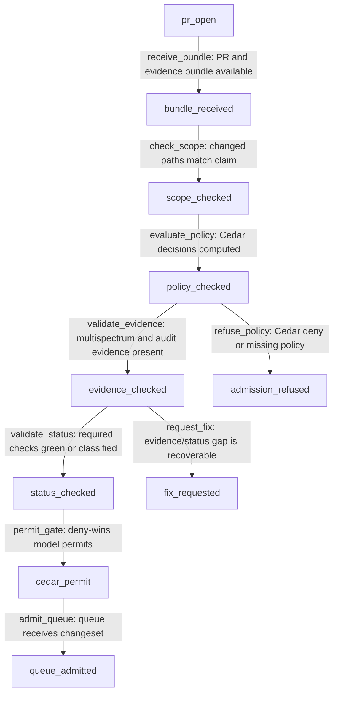

# Foundry Admission Gate Policy and Evidence

## Purpose

This spec defines the Foundry admission gate: policy evaluation, evidence bundle shape, status-check requirements, path-scope reconciliation, and refusal semantics before a changeset enters the merge queue.

Admission evaluates internal repository changesets and build evidence; it does not grant tenant product actions or consumer intelligence permissions.

Foundry was the internal agentic-development pipeline (RETIRED per ADR-0335 Wave 15I; absorbed into intelligence): it coordinates source changes, CI evidence, reviewer decisions, merge-queue state, and promotion state for the oyatie repository.
Foundry is not a consumer-facing AI product, not a tenant assistant, and not the place where B2B or B2C prompt history is stored.
This spec turns the ADR-level decision into an operator-readable and agent-executable substrate contract.
The contract is intentionally written with RFC 2119 and RFC 8174 keywords so policy, CI, and agent prompts can parse the same text.
The control plane treats tenant_id=oyatie as the internal tenant for internal agentic-development pipeline emissions, consistent with ADR-0263.
Every state-changing step emits an audit event and a correlated observability record before a downstream state may rely on it.
The implementation boundary is the single Foundry microservice with internal bounded contexts from ADR-0136.
The repository boundary is microservices/foundry plus repo-level governance registries and docs referenced in cross-references.
The user-facing Intelligence substrate remains separate and MUST NOT be conflated with this pipeline.
The stop condition for this spec is a changeset whose evidence, policy, CI, review, queue, and promotion state can be replayed deterministically.

## Normative Requirements

The key words MUST, MUST NOT, REQUIRED, SHALL, SHALL NOT, SHOULD, SHOULD NOT, RECOMMENDED, MAY, and OPTIONAL in this section are to be interpreted as described in RFC 2119 and RFC 8174.

1. Foundry Admission Gate Policy and Evidence MUST ensure the state transition be written before downstream consumers act.
2. Foundry Admission Gate Policy and Evidence MUST ensure the state transition carry a deterministic identifier.
3. Foundry Admission Gate Policy and Evidence MUST ensure the state transition declare its actor, action, resource, and reason.
4. Foundry Admission Gate Policy and Evidence MUST ensure the state transition fail closed when required evidence is absent.
5. Foundry Admission Gate Policy and Evidence MUST ensure the Cedar decision be written before downstream consumers act.
6. Foundry Admission Gate Policy and Evidence MUST ensure the Cedar decision carry a deterministic identifier.
7. Foundry Admission Gate Policy and Evidence MUST ensure the Cedar decision declare its actor, action, resource, and reason.
8. Foundry Admission Gate Policy and Evidence MUST ensure the Cedar decision fail closed when required evidence is absent.
9. Foundry Admission Gate Policy and Evidence MUST ensure the audit event be written before downstream consumers act.
10. Foundry Admission Gate Policy and Evidence MUST ensure the audit event carry a deterministic identifier.
11. Foundry Admission Gate Policy and Evidence MUST ensure the audit event declare its actor, action, resource, and reason.
12. Foundry Admission Gate Policy and Evidence MUST ensure the audit event fail closed when required evidence is absent.
13. Foundry Admission Gate Policy and Evidence MUST ensure the observability emission be written before downstream consumers act.
14. Foundry Admission Gate Policy and Evidence MUST ensure the observability emission carry a deterministic identifier.
15. Foundry Admission Gate Policy and Evidence MUST ensure the observability emission declare its actor, action, resource, and reason.
16. Foundry Admission Gate Policy and Evidence MUST ensure the observability emission fail closed when required evidence is absent.
17. Foundry Admission Gate Policy and Evidence MUST ensure the evidence bundle be written before downstream consumers act.
18. Foundry Admission Gate Policy and Evidence MUST ensure the evidence bundle carry a deterministic identifier.
19. Foundry Admission Gate Policy and Evidence MUST ensure the evidence bundle declare its actor, action, resource, and reason.
20. Foundry Admission Gate Policy and Evidence MUST ensure the evidence bundle fail closed when required evidence is absent.
21. Foundry Admission Gate Policy and Evidence MUST ensure the cost budget be written before downstream consumers act.
22. Foundry Admission Gate Policy and Evidence MUST ensure the cost budget carry a deterministic identifier.
23. Foundry Admission Gate Policy and Evidence MUST ensure the cost budget declare its actor, action, resource, and reason.
24. Foundry Admission Gate Policy and Evidence MUST ensure the cost budget fail closed when required evidence is absent.
25. Foundry Admission Gate Policy and Evidence MUST ensure the idempotency key be written before downstream consumers act.
26. Foundry Admission Gate Policy and Evidence MUST ensure the idempotency key carry a deterministic identifier.
27. Foundry Admission Gate Policy and Evidence MUST ensure the idempotency key declare its actor, action, resource, and reason.
28. Foundry Admission Gate Policy and Evidence MUST ensure the idempotency key fail closed when required evidence is absent.
29. Foundry Admission Gate Policy and Evidence MUST ensure the retry branch be written before downstream consumers act.
30. Foundry Admission Gate Policy and Evidence MUST ensure the retry branch carry a deterministic identifier.
31. Foundry Admission Gate Policy and Evidence MUST ensure the retry branch declare its actor, action, resource, and reason.
32. Foundry Admission Gate Policy and Evidence MUST ensure the retry branch fail closed when required evidence is absent.
33. Foundry Admission Gate Policy and Evidence MUST ensure the reviewer verdict be written before downstream consumers act.
34. Foundry Admission Gate Policy and Evidence MUST ensure the reviewer verdict carry a deterministic identifier.
35. Foundry Admission Gate Policy and Evidence MUST ensure the reviewer verdict declare its actor, action, resource, and reason.
36. Foundry Admission Gate Policy and Evidence MUST ensure the reviewer verdict fail closed when required evidence is absent.
37. Foundry Admission Gate Policy and Evidence MUST ensure the CI status be written before downstream consumers act.
38. Foundry Admission Gate Policy and Evidence MUST ensure the CI status carry a deterministic identifier.
39. Foundry Admission Gate Policy and Evidence MUST ensure the CI status declare its actor, action, resource, and reason.
40. Foundry Admission Gate Policy and Evidence MUST ensure the CI status fail closed when required evidence is absent.
41. Foundry Admission Gate Policy and Evidence MUST ensure the worktree lane be written before downstream consumers act.
42. Foundry Admission Gate Policy and Evidence MUST ensure the worktree lane carry a deterministic identifier.
43. Foundry Admission Gate Policy and Evidence MUST ensure the worktree lane declare its actor, action, resource, and reason.
44. Foundry Admission Gate Policy and Evidence MUST ensure the worktree lane fail closed when required evidence is absent.
45. Foundry Admission Gate Policy and Evidence MUST ensure the branch reference be written before downstream consumers act.
46. Foundry Admission Gate Policy and Evidence MUST ensure the branch reference carry a deterministic identifier.
47. Foundry Admission Gate Policy and Evidence MUST ensure the branch reference declare its actor, action, resource, and reason.
48. Foundry Admission Gate Policy and Evidence MUST ensure the branch reference fail closed when required evidence is absent.
49. Foundry Admission Gate Policy and Evidence MUST ensure the merge-queue position be written before downstream consumers act.
50. Foundry Admission Gate Policy and Evidence MUST ensure the merge-queue position carry a deterministic identifier.
51. Foundry Admission Gate Policy and Evidence MUST ensure the merge-queue position declare its actor, action, resource, and reason.
52. Foundry Admission Gate Policy and Evidence MUST ensure the merge-queue position fail closed when required evidence is absent.
53. Foundry Admission Gate Policy and Evidence MUST ensure the promotion target be written before downstream consumers act.
54. Foundry Admission Gate Policy and Evidence MUST ensure the promotion target carry a deterministic identifier.
55. Foundry Admission Gate Policy and Evidence MUST ensure the promotion target declare its actor, action, resource, and reason.
56. Foundry Admission Gate Policy and Evidence MUST ensure the promotion target fail closed when required evidence is absent.
57. Foundry Admission Gate Policy and Evidence MUST ensure the human override be written before downstream consumers act.
58. Foundry Admission Gate Policy and Evidence MUST ensure the human override carry a deterministic identifier.
59. Foundry Admission Gate Policy and Evidence MUST ensure the human override declare its actor, action, resource, and reason.
60. Foundry Admission Gate Policy and Evidence MUST ensure the human override fail closed when required evidence is absent.
61. Foundry Admission Gate Policy and Evidence MUST ensure the safe-path predicate be written before downstream consumers act.
62. Foundry Admission Gate Policy and Evidence MUST ensure the safe-path predicate carry a deterministic identifier.
63. Foundry Admission Gate Policy and Evidence MUST ensure the safe-path predicate declare its actor, action, resource, and reason.
64. Foundry Admission Gate Policy and Evidence MUST ensure the safe-path predicate fail closed when required evidence is absent.
65. Foundry Admission Gate Policy and Evidence MUST ensure the OpenBao secret reference be written before downstream consumers act.
66. Foundry Admission Gate Policy and Evidence MUST ensure the OpenBao secret reference carry a deterministic identifier.
67. Foundry Admission Gate Policy and Evidence MUST ensure the OpenBao secret reference declare its actor, action, resource, and reason.
68. Foundry Admission Gate Policy and Evidence MUST ensure the OpenBao secret reference fail closed when required evidence is absent.
69. Foundry Admission Gate Policy and Evidence MUST ensure the GitHub post-back be written before downstream consumers act.
70. Foundry Admission Gate Policy and Evidence MUST ensure the GitHub post-back carry a deterministic identifier.
71. Foundry Admission Gate Policy and Evidence MUST ensure the GitHub post-back declare its actor, action, resource, and reason.
72. Foundry Admission Gate Policy and Evidence MUST ensure the GitHub post-back fail closed when required evidence is absent.
73. Foundry Admission Gate Policy and Evidence MUST ensure the multispectrum evidence be written before downstream consumers act.
74. Foundry Admission Gate Policy and Evidence MUST ensure the multispectrum evidence carry a deterministic identifier.
75. Foundry Admission Gate Policy and Evidence MUST ensure the multispectrum evidence declare its actor, action, resource, and reason.
76. Foundry Admission Gate Policy and Evidence MUST ensure the multispectrum evidence fail closed when required evidence is absent.
77. Foundry Admission Gate Policy and Evidence MUST ensure the trace context be written before downstream consumers act.
78. Foundry Admission Gate Policy and Evidence MUST ensure the trace context carry a deterministic identifier.
79. Foundry Admission Gate Policy and Evidence MUST ensure the trace context declare its actor, action, resource, and reason.
80. Foundry Admission Gate Policy and Evidence MUST ensure the trace context fail closed when required evidence is absent.
81. The `bundle_received` phase SHOULD expose a machine-readable status row with actor, at, evidence_uri, trace_id, and audit_id.
82. The `scope_checked` phase SHOULD expose a machine-readable status row with actor, at, evidence_uri, trace_id, and audit_id.
83. The `policy_checked` phase SHOULD expose a machine-readable status row with actor, at, evidence_uri, trace_id, and audit_id.
84. The `evidence_checked` phase SHOULD expose a machine-readable status row with actor, at, evidence_uri, trace_id, and audit_id.
85. The `status_checked` phase SHOULD expose a machine-readable status row with actor, at, evidence_uri, trace_id, and audit_id.
86. The `cedar_permit` phase SHOULD expose a machine-readable status row with actor, at, evidence_uri, trace_id, and audit_id.
87. The `queue_admitted` phase SHOULD expose a machine-readable status row with actor, at, evidence_uri, trace_id, and audit_id.
88. The `admission_refused` phase SHOULD expose a machine-readable status row with actor, at, evidence_uri, trace_id, and audit_id.
89. The `fix_requested` phase SHOULD expose a machine-readable status row with actor, at, evidence_uri, trace_id, and audit_id.
90. Action `foundry.admission.receive_bundle` MUST be denied unless a matching Cedar permit binds the principal, resource, and changeset intent.
91. Action `foundry.admission.check_scope` MUST be denied unless a matching Cedar permit binds the principal, resource, and changeset intent.
92. Action `foundry.admission.evaluate_policy` MUST be denied unless a matching Cedar permit binds the principal, resource, and changeset intent.
93. Action `foundry.admission.validate_evidence` MUST be denied unless a matching Cedar permit binds the principal, resource, and changeset intent.
94. Action `foundry.admission.validate_status` MUST be denied unless a matching Cedar permit binds the principal, resource, and changeset intent.
95. Action `foundry.admission.admit` MUST be denied unless a matching Cedar permit binds the principal, resource, and changeset intent.
96. Action `foundry.admission.refuse` MUST be denied unless a matching Cedar permit binds the principal, resource, and changeset intent.
97. Implementations MAY add stricter product-local gates when they do not weaken any requirement in ADR-0111.

## State Machine / Sequence Diagram



### Named Transitions

| Transition | From | To | Guard summary | Audit event | Recovery if denied |
|---|---|---|---|---|---|
| receive_bundle | pr_open | bundle_received | PR and evidence bundle available; Cedar permit required; evidence hash present | EVT-FOUNDRY-ADMISSION-REFUSED | Hold at pr_open; append refusal reason; request fix or human override |
| check_scope | bundle_received | scope_checked | changed paths match claim; Cedar permit required; evidence hash present | EVT-FOUNDRY-ADMISSION-EVIDENCE-VALIDATED | Hold at bundle_received; append refusal reason; request fix or human override |
| evaluate_policy | scope_checked | policy_checked | Cedar decisions computed; Cedar permit required; evidence hash present | EVT-FOUNDRY-ADMISSION-BUNDLE-RECEIVED | Hold at scope_checked; append refusal reason; request fix or human override |
| validate_evidence | policy_checked | evidence_checked | multispectrum and audit evidence present; Cedar permit required; evidence hash present | EVT-FOUNDRY-ADMISSION-EVIDENCE-VALIDATED | Hold at policy_checked; append refusal reason; request fix or human override |
| validate_status | evidence_checked | status_checked | required checks green or classified; Cedar permit required; evidence hash present | EVT-FOUNDRY-ADMISSION-EVIDENCE-VALIDATED | Hold at evidence_checked; append refusal reason; request fix or human override |
| permit_gate | status_checked | cedar_permit | deny-wins model permits; Cedar permit required; evidence hash present | EVT-FOUNDRY-ADMISSION-POLICY-EVALUATED | Hold at status_checked; append refusal reason; request fix or human override |
| admit_queue | cedar_permit | queue_admitted | queue receives changeset; Cedar permit required; evidence hash present | EVT-FOUNDRY-ADMISSION-ACCEPTED | Hold at cedar_permit; append refusal reason; request fix or human override |
| refuse_policy | policy_checked | admission_refused | Cedar deny or missing policy; Cedar permit required; evidence hash present | EVT-FOUNDRY-ADMISSION-ACCEPTED | Hold at policy_checked; append refusal reason; request fix or human override |
| request_fix | evidence_checked | fix_requested | evidence/status gap is recoverable; Cedar permit required; evidence hash present | EVT-FOUNDRY-ADMISSION-BUNDLE-RECEIVED | Hold at evidence_checked; append refusal reason; request fix or human override |
| replay-check-01 | pr_open | bundle_received | Replay validates bundle_received ordering, signature, budget, and trace context | EVT-FOUNDRY-ADMISSION-BUNDLE-RECEIVED | Recompute from append-only log and refuse non-monotonic row |
| replay-check-02 | bundle_received | scope_checked | Replay validates scope_checked ordering, signature, budget, and trace context | EVT-FOUNDRY-ADMISSION-POLICY-EVALUATED | Recompute from append-only log and refuse non-monotonic row |
| replay-check-03 | scope_checked | policy_checked | Replay validates policy_checked ordering, signature, budget, and trace context | EVT-FOUNDRY-ADMISSION-EVIDENCE-VALIDATED | Recompute from append-only log and refuse non-monotonic row |
| replay-check-04 | policy_checked | evidence_checked | Replay validates evidence_checked ordering, signature, budget, and trace context | EVT-FOUNDRY-ADMISSION-REFUSED | Recompute from append-only log and refuse non-monotonic row |
| replay-check-05 | evidence_checked | status_checked | Replay validates status_checked ordering, signature, budget, and trace context | EVT-FOUNDRY-ADMISSION-ACCEPTED | Recompute from append-only log and refuse non-monotonic row |
| replay-check-06 | status_checked | cedar_permit | Replay validates cedar_permit ordering, signature, budget, and trace context | EVT-FOUNDRY-ADMISSION-BUNDLE-RECEIVED | Recompute from append-only log and refuse non-monotonic row |
| replay-check-07 | cedar_permit | queue_admitted | Replay validates queue_admitted ordering, signature, budget, and trace context | EVT-FOUNDRY-ADMISSION-POLICY-EVALUATED | Recompute from append-only log and refuse non-monotonic row |
| replay-check-08 | policy_checked | admission_refused | Replay validates admission_refused ordering, signature, budget, and trace context | EVT-FOUNDRY-ADMISSION-EVIDENCE-VALIDATED | Recompute from append-only log and refuse non-monotonic row |
| replay-check-09 | evidence_checked | fix_requested | Replay validates fix_requested ordering, signature, budget, and trace context | EVT-FOUNDRY-ADMISSION-REFUSED | Recompute from append-only log and refuse non-monotonic row |
| replay-check-10 | pr_open | bundle_received | Replay validates bundle_received ordering, signature, budget, and trace context | EVT-FOUNDRY-ADMISSION-ACCEPTED | Recompute from append-only log and refuse non-monotonic row |
| replay-check-11 | bundle_received | scope_checked | Replay validates scope_checked ordering, signature, budget, and trace context | EVT-FOUNDRY-ADMISSION-BUNDLE-RECEIVED | Recompute from append-only log and refuse non-monotonic row |
| replay-check-12 | scope_checked | policy_checked | Replay validates policy_checked ordering, signature, budget, and trace context | EVT-FOUNDRY-ADMISSION-POLICY-EVALUATED | Recompute from append-only log and refuse non-monotonic row |
| replay-check-13 | policy_checked | evidence_checked | Replay validates evidence_checked ordering, signature, budget, and trace context | EVT-FOUNDRY-ADMISSION-EVIDENCE-VALIDATED | Recompute from append-only log and refuse non-monotonic row |
| replay-check-14 | evidence_checked | status_checked | Replay validates status_checked ordering, signature, budget, and trace context | EVT-FOUNDRY-ADMISSION-REFUSED | Recompute from append-only log and refuse non-monotonic row |
| replay-check-15 | status_checked | cedar_permit | Replay validates cedar_permit ordering, signature, budget, and trace context | EVT-FOUNDRY-ADMISSION-ACCEPTED | Recompute from append-only log and refuse non-monotonic row |
| replay-check-16 | cedar_permit | queue_admitted | Replay validates queue_admitted ordering, signature, budget, and trace context | EVT-FOUNDRY-ADMISSION-BUNDLE-RECEIVED | Recompute from append-only log and refuse non-monotonic row |
| replay-check-17 | policy_checked | admission_refused | Replay validates admission_refused ordering, signature, budget, and trace context | EVT-FOUNDRY-ADMISSION-POLICY-EVALUATED | Recompute from append-only log and refuse non-monotonic row |
| replay-check-18 | evidence_checked | fix_requested | Replay validates fix_requested ordering, signature, budget, and trace context | EVT-FOUNDRY-ADMISSION-EVIDENCE-VALIDATED | Recompute from append-only log and refuse non-monotonic row |
| replay-check-19 | pr_open | bundle_received | Replay validates bundle_received ordering, signature, budget, and trace context | EVT-FOUNDRY-ADMISSION-REFUSED | Recompute from append-only log and refuse non-monotonic row |
| replay-check-20 | bundle_received | scope_checked | Replay validates scope_checked ordering, signature, budget, and trace context | EVT-FOUNDRY-ADMISSION-ACCEPTED | Recompute from append-only log and refuse non-monotonic row |
| replay-check-21 | scope_checked | policy_checked | Replay validates policy_checked ordering, signature, budget, and trace context | EVT-FOUNDRY-ADMISSION-BUNDLE-RECEIVED | Recompute from append-only log and refuse non-monotonic row |
| replay-check-22 | policy_checked | evidence_checked | Replay validates evidence_checked ordering, signature, budget, and trace context | EVT-FOUNDRY-ADMISSION-POLICY-EVALUATED | Recompute from append-only log and refuse non-monotonic row |
| replay-check-23 | evidence_checked | status_checked | Replay validates status_checked ordering, signature, budget, and trace context | EVT-FOUNDRY-ADMISSION-EVIDENCE-VALIDATED | Recompute from append-only log and refuse non-monotonic row |
| replay-check-24 | status_checked | cedar_permit | Replay validates cedar_permit ordering, signature, budget, and trace context | EVT-FOUNDRY-ADMISSION-REFUSED | Recompute from append-only log and refuse non-monotonic row |
| replay-check-25 | cedar_permit | queue_admitted | Replay validates queue_admitted ordering, signature, budget, and trace context | EVT-FOUNDRY-ADMISSION-ACCEPTED | Recompute from append-only log and refuse non-monotonic row |
| replay-check-26 | policy_checked | admission_refused | Replay validates admission_refused ordering, signature, budget, and trace context | EVT-FOUNDRY-ADMISSION-BUNDLE-RECEIVED | Recompute from append-only log and refuse non-monotonic row |
| replay-check-27 | evidence_checked | fix_requested | Replay validates fix_requested ordering, signature, budget, and trace context | EVT-FOUNDRY-ADMISSION-POLICY-EVALUATED | Recompute from append-only log and refuse non-monotonic row |
| replay-check-28 | pr_open | bundle_received | Replay validates bundle_received ordering, signature, budget, and trace context | EVT-FOUNDRY-ADMISSION-EVIDENCE-VALIDATED | Recompute from append-only log and refuse non-monotonic row |
| replay-check-29 | bundle_received | scope_checked | Replay validates scope_checked ordering, signature, budget, and trace context | EVT-FOUNDRY-ADMISSION-REFUSED | Recompute from append-only log and refuse non-monotonic row |
| replay-check-30 | scope_checked | policy_checked | Replay validates policy_checked ordering, signature, budget, and trace context | EVT-FOUNDRY-ADMISSION-ACCEPTED | Recompute from append-only log and refuse non-monotonic row |
| replay-check-31 | policy_checked | evidence_checked | Replay validates evidence_checked ordering, signature, budget, and trace context | EVT-FOUNDRY-ADMISSION-BUNDLE-RECEIVED | Recompute from append-only log and refuse non-monotonic row |
| replay-check-32 | evidence_checked | status_checked | Replay validates status_checked ordering, signature, budget, and trace context | EVT-FOUNDRY-ADMISSION-POLICY-EVALUATED | Recompute from append-only log and refuse non-monotonic row |
| replay-check-33 | status_checked | cedar_permit | Replay validates cedar_permit ordering, signature, budget, and trace context | EVT-FOUNDRY-ADMISSION-EVIDENCE-VALIDATED | Recompute from append-only log and refuse non-monotonic row |
| replay-check-34 | cedar_permit | queue_admitted | Replay validates queue_admitted ordering, signature, budget, and trace context | EVT-FOUNDRY-ADMISSION-REFUSED | Recompute from append-only log and refuse non-monotonic row |
| replay-check-35 | policy_checked | admission_refused | Replay validates admission_refused ordering, signature, budget, and trace context | EVT-FOUNDRY-ADMISSION-ACCEPTED | Recompute from append-only log and refuse non-monotonic row |
| replay-check-36 | evidence_checked | fix_requested | Replay validates fix_requested ordering, signature, budget, and trace context | EVT-FOUNDRY-ADMISSION-BUNDLE-RECEIVED | Recompute from append-only log and refuse non-monotonic row |
| replay-check-37 | pr_open | bundle_received | Replay validates bundle_received ordering, signature, budget, and trace context | EVT-FOUNDRY-ADMISSION-POLICY-EVALUATED | Recompute from append-only log and refuse non-monotonic row |
| replay-check-38 | bundle_received | scope_checked | Replay validates scope_checked ordering, signature, budget, and trace context | EVT-FOUNDRY-ADMISSION-EVIDENCE-VALIDATED | Recompute from append-only log and refuse non-monotonic row |
| replay-check-39 | scope_checked | policy_checked | Replay validates policy_checked ordering, signature, budget, and trace context | EVT-FOUNDRY-ADMISSION-REFUSED | Recompute from append-only log and refuse non-monotonic row |
| replay-check-40 | policy_checked | evidence_checked | Replay validates evidence_checked ordering, signature, budget, and trace context | EVT-FOUNDRY-ADMISSION-ACCEPTED | Recompute from append-only log and refuse non-monotonic row |
| replay-check-41 | evidence_checked | status_checked | Replay validates status_checked ordering, signature, budget, and trace context | EVT-FOUNDRY-ADMISSION-BUNDLE-RECEIVED | Recompute from append-only log and refuse non-monotonic row |
| replay-check-42 | status_checked | cedar_permit | Replay validates cedar_permit ordering, signature, budget, and trace context | EVT-FOUNDRY-ADMISSION-POLICY-EVALUATED | Recompute from append-only log and refuse non-monotonic row |
| replay-check-43 | cedar_permit | queue_admitted | Replay validates queue_admitted ordering, signature, budget, and trace context | EVT-FOUNDRY-ADMISSION-EVIDENCE-VALIDATED | Recompute from append-only log and refuse non-monotonic row |
| replay-check-44 | policy_checked | admission_refused | Replay validates admission_refused ordering, signature, budget, and trace context | EVT-FOUNDRY-ADMISSION-REFUSED | Recompute from append-only log and refuse non-monotonic row |
| replay-check-45 | evidence_checked | fix_requested | Replay validates fix_requested ordering, signature, budget, and trace context | EVT-FOUNDRY-ADMISSION-ACCEPTED | Recompute from append-only log and refuse non-monotonic row |
| replay-check-46 | pr_open | bundle_received | Replay validates bundle_received ordering, signature, budget, and trace context | EVT-FOUNDRY-ADMISSION-BUNDLE-RECEIVED | Recompute from append-only log and refuse non-monotonic row |
| replay-check-47 | bundle_received | scope_checked | Replay validates scope_checked ordering, signature, budget, and trace context | EVT-FOUNDRY-ADMISSION-POLICY-EVALUATED | Recompute from append-only log and refuse non-monotonic row |
| replay-check-48 | scope_checked | policy_checked | Replay validates policy_checked ordering, signature, budget, and trace context | EVT-FOUNDRY-ADMISSION-EVIDENCE-VALIDATED | Recompute from append-only log and refuse non-monotonic row |
| replay-check-49 | policy_checked | evidence_checked | Replay validates evidence_checked ordering, signature, budget, and trace context | EVT-FOUNDRY-ADMISSION-REFUSED | Recompute from append-only log and refuse non-monotonic row |
| replay-check-50 | evidence_checked | status_checked | Replay validates status_checked ordering, signature, budget, and trace context | EVT-FOUNDRY-ADMISSION-ACCEPTED | Recompute from append-only log and refuse non-monotonic row |
| replay-check-51 | status_checked | cedar_permit | Replay validates cedar_permit ordering, signature, budget, and trace context | EVT-FOUNDRY-ADMISSION-BUNDLE-RECEIVED | Recompute from append-only log and refuse non-monotonic row |
| replay-check-52 | cedar_permit | queue_admitted | Replay validates queue_admitted ordering, signature, budget, and trace context | EVT-FOUNDRY-ADMISSION-POLICY-EVALUATED | Recompute from append-only log and refuse non-monotonic row |
| replay-check-53 | policy_checked | admission_refused | Replay validates admission_refused ordering, signature, budget, and trace context | EVT-FOUNDRY-ADMISSION-EVIDENCE-VALIDATED | Recompute from append-only log and refuse non-monotonic row |
| replay-check-54 | evidence_checked | fix_requested | Replay validates fix_requested ordering, signature, budget, and trace context | EVT-FOUNDRY-ADMISSION-REFUSED | Recompute from append-only log and refuse non-monotonic row |

## Cedar Policy Bindings

The bindings below use specific internal principals, actions, and resources. A deny from any narrower policy wins over these permits.

| Binding | Principal | Action | Resource | Required context | Decision |
|---|---|---|---|---|---|
| B-001 | Principal::"oyatie.agent.codex" | Action::"foundry.admission.receive_bundle" | Resource::"evidence:evidence/multispectrum/*" | workflow=foundry_pipeline; tenant_id=oyatie; intent=admission-gate-policy-and-evidence | permit when evidence_hash and changeset_id are present |
| B-002 | Principal::"oyatie.agent.codex" | Action::"foundry.admission.check_scope" | Resource::"status-check:required/*" | workflow=foundry_pipeline; tenant_id=oyatie; intent=admission-gate-policy-and-evidence | permit when evidence_hash and changeset_id are present |
| B-003 | Principal::"oyatie.agent.codex" | Action::"foundry.admission.evaluate_policy" | Resource::"policy:microservices/foundry/policy/*.cedar" | workflow=foundry_pipeline; tenant_id=oyatie; intent=admission-gate-policy-and-evidence | permit when evidence_hash and changeset_id are present |
| B-004 | Principal::"oyatie.agent.codex" | Action::"foundry.admission.validate_evidence" | Resource::"repo:oyatie/microservices/foundry" | workflow=foundry_pipeline; tenant_id=oyatie; intent=admission-gate-policy-and-evidence | permit when evidence_hash and changeset_id are present |
| B-005 | Principal::"oyatie.agent.codex" | Action::"foundry.admission.validate_status" | Resource::"branch:dev" | workflow=foundry_pipeline; tenant_id=oyatie; intent=admission-gate-policy-and-evidence | permit when evidence_hash and changeset_id are present |
| B-006 | Principal::"oyatie.agent.claude-opus" | Action::"foundry.admission.receive_bundle" | Resource::"queue:foundry-dev" | workflow=foundry_pipeline; tenant_id=oyatie; intent=admission-gate-policy-and-evidence | permit when evidence_hash and changeset_id are present |
| B-007 | Principal::"oyatie.agent.claude-opus" | Action::"foundry.admission.check_scope" | Resource::"event-log:registry/vcs/changeset-event-log.json" | workflow=foundry_pipeline; tenant_id=oyatie; intent=admission-gate-policy-and-evidence | permit when evidence_hash and changeset_id are present |
| B-008 | Principal::"oyatie.agent.claude-opus" | Action::"foundry.admission.evaluate_policy" | Resource::"event-router:registry/vcs/event-router.yaml" | workflow=foundry_pipeline; tenant_id=oyatie; intent=admission-gate-policy-and-evidence | permit when evidence_hash and changeset_id are present |
| B-009 | Principal::"oyatie.agent.claude-opus" | Action::"foundry.admission.validate_evidence" | Resource::"safe-paths:registry/vcs/concurrent-safe-paths.yaml" | workflow=foundry_pipeline; tenant_id=oyatie; intent=admission-gate-policy-and-evidence | permit when evidence_hash and changeset_id are present |
| B-010 | Principal::"oyatie.agent.claude-opus" | Action::"foundry.admission.validate_status" | Resource::"evidence:evidence/multispectrum" | workflow=foundry_pipeline; tenant_id=oyatie; intent=admission-gate-policy-and-evidence | permit when evidence_hash and changeset_id are present |
| B-011 | Principal::"oyatie.agent.planner" | Action::"foundry.admission.receive_bundle" | Resource::"audit:event-class/foundry" | workflow=foundry_pipeline; tenant_id=oyatie; intent=admission-gate-policy-and-evidence | permit when evidence_hash and changeset_id are present |
| B-012 | Principal::"oyatie.agent.planner" | Action::"foundry.admission.check_scope" | Resource::"admission:foundry-dev" | workflow=foundry_pipeline; tenant_id=oyatie; intent=admission-gate-policy-and-evidence | permit when evidence_hash and changeset_id are present |
| B-013 | Principal::"oyatie.agent.planner" | Action::"foundry.admission.evaluate_policy" | Resource::"evidence:evidence/multispectrum/*" | workflow=foundry_pipeline; tenant_id=oyatie; intent=admission-gate-policy-and-evidence | permit when evidence_hash and changeset_id are present |
| B-014 | Principal::"oyatie.agent.planner" | Action::"foundry.admission.validate_evidence" | Resource::"status-check:required/*" | workflow=foundry_pipeline; tenant_id=oyatie; intent=admission-gate-policy-and-evidence | permit when evidence_hash and changeset_id are present |
| B-015 | Principal::"oyatie.agent.planner" | Action::"foundry.admission.validate_status" | Resource::"policy:microservices/foundry/policy/*.cedar" | workflow=foundry_pipeline; tenant_id=oyatie; intent=admission-gate-policy-and-evidence | permit when evidence_hash and changeset_id are present |
| B-016 | Principal::"oyatie.agent.executor" | Action::"foundry.admission.receive_bundle" | Resource::"repo:oyatie/microservices/foundry" | workflow=foundry_pipeline; tenant_id=oyatie; intent=admission-gate-policy-and-evidence | permit when evidence_hash and changeset_id are present |
| B-017 | Principal::"oyatie.agent.executor" | Action::"foundry.admission.check_scope" | Resource::"branch:dev" | workflow=foundry_pipeline; tenant_id=oyatie; intent=admission-gate-policy-and-evidence | permit when evidence_hash and changeset_id are present |
| B-018 | Principal::"oyatie.agent.executor" | Action::"foundry.admission.evaluate_policy" | Resource::"queue:foundry-dev" | workflow=foundry_pipeline; tenant_id=oyatie; intent=admission-gate-policy-and-evidence | permit when evidence_hash and changeset_id are present |
| B-019 | Principal::"oyatie.agent.executor" | Action::"foundry.admission.validate_evidence" | Resource::"event-log:registry/vcs/changeset-event-log.json" | workflow=foundry_pipeline; tenant_id=oyatie; intent=admission-gate-policy-and-evidence | permit when evidence_hash and changeset_id are present |
| B-020 | Principal::"oyatie.agent.executor" | Action::"foundry.admission.validate_status" | Resource::"event-router:registry/vcs/event-router.yaml" | workflow=foundry_pipeline; tenant_id=oyatie; intent=admission-gate-policy-and-evidence | permit when evidence_hash and changeset_id are present |
| B-021 | Principal::"oyatie.service.vcs-orchestrator" | Action::"foundry.admission.receive_bundle" | Resource::"safe-paths:registry/vcs/concurrent-safe-paths.yaml" | workflow=foundry_pipeline; tenant_id=oyatie; intent=admission-gate-policy-and-evidence | permit when evidence_hash and changeset_id are present |
| B-022 | Principal::"oyatie.service.vcs-orchestrator" | Action::"foundry.admission.check_scope" | Resource::"evidence:evidence/multispectrum" | workflow=foundry_pipeline; tenant_id=oyatie; intent=admission-gate-policy-and-evidence | permit when evidence_hash and changeset_id are present |
| B-023 | Principal::"oyatie.service.vcs-orchestrator" | Action::"foundry.admission.evaluate_policy" | Resource::"audit:event-class/foundry" | workflow=foundry_pipeline; tenant_id=oyatie; intent=admission-gate-policy-and-evidence | permit when evidence_hash and changeset_id are present |
| B-024 | Principal::"oyatie.service.vcs-orchestrator" | Action::"foundry.admission.validate_evidence" | Resource::"admission:foundry-dev" | workflow=foundry_pipeline; tenant_id=oyatie; intent=admission-gate-policy-and-evidence | permit when evidence_hash and changeset_id are present |
| B-025 | Principal::"oyatie.service.vcs-orchestrator" | Action::"foundry.admission.validate_status" | Resource::"evidence:evidence/multispectrum/*" | workflow=foundry_pipeline; tenant_id=oyatie; intent=admission-gate-policy-and-evidence | permit when evidence_hash and changeset_id are present |
| B-026 | Principal::"oyatie.service.webhook-receiver" | Action::"foundry.admission.receive_bundle" | Resource::"status-check:required/*" | workflow=foundry_pipeline; tenant_id=oyatie; intent=admission-gate-policy-and-evidence | permit when evidence_hash and changeset_id are present |
| B-027 | Principal::"oyatie.service.webhook-receiver" | Action::"foundry.admission.check_scope" | Resource::"policy:microservices/foundry/policy/*.cedar" | workflow=foundry_pipeline; tenant_id=oyatie; intent=admission-gate-policy-and-evidence | permit when evidence_hash and changeset_id are present |
| B-028 | Principal::"oyatie.service.webhook-receiver" | Action::"foundry.admission.evaluate_policy" | Resource::"repo:oyatie/microservices/foundry" | workflow=foundry_pipeline; tenant_id=oyatie; intent=admission-gate-policy-and-evidence | permit when evidence_hash and changeset_id are present |
| B-029 | Principal::"oyatie.service.webhook-receiver" | Action::"foundry.admission.validate_evidence" | Resource::"branch:dev" | workflow=foundry_pipeline; tenant_id=oyatie; intent=admission-gate-policy-and-evidence | permit when evidence_hash and changeset_id are present |
| B-030 | Principal::"oyatie.service.webhook-receiver" | Action::"foundry.admission.validate_status" | Resource::"queue:foundry-dev" | workflow=foundry_pipeline; tenant_id=oyatie; intent=admission-gate-policy-and-evidence | permit when evidence_hash and changeset_id are present |
| B-031 | Principal::"oyatie.service.merge-queue" | Action::"foundry.admission.receive_bundle" | Resource::"event-log:registry/vcs/changeset-event-log.json" | workflow=foundry_pipeline; tenant_id=oyatie; intent=admission-gate-policy-and-evidence | permit when evidence_hash and changeset_id are present |
| B-032 | Principal::"oyatie.service.merge-queue" | Action::"foundry.admission.check_scope" | Resource::"event-router:registry/vcs/event-router.yaml" | workflow=foundry_pipeline; tenant_id=oyatie; intent=admission-gate-policy-and-evidence | permit when evidence_hash and changeset_id are present |
| B-033 | Principal::"oyatie.service.merge-queue" | Action::"foundry.admission.evaluate_policy" | Resource::"safe-paths:registry/vcs/concurrent-safe-paths.yaml" | workflow=foundry_pipeline; tenant_id=oyatie; intent=admission-gate-policy-and-evidence | permit when evidence_hash and changeset_id are present |
| B-034 | Principal::"oyatie.service.merge-queue" | Action::"foundry.admission.validate_evidence" | Resource::"evidence:evidence/multispectrum" | workflow=foundry_pipeline; tenant_id=oyatie; intent=admission-gate-policy-and-evidence | permit when evidence_hash and changeset_id are present |
| B-035 | Principal::"oyatie.service.merge-queue" | Action::"foundry.admission.validate_status" | Resource::"audit:event-class/foundry" | workflow=foundry_pipeline; tenant_id=oyatie; intent=admission-gate-policy-and-evidence | permit when evidence_hash and changeset_id are present |
| B-036 | Principal::"oyatie.service.admission-gate" | Action::"foundry.admission.receive_bundle" | Resource::"admission:foundry-dev" | workflow=foundry_pipeline; tenant_id=oyatie; intent=admission-gate-policy-and-evidence | permit when evidence_hash and changeset_id are present |
| B-037 | Principal::"oyatie.service.admission-gate" | Action::"foundry.admission.check_scope" | Resource::"evidence:evidence/multispectrum/*" | workflow=foundry_pipeline; tenant_id=oyatie; intent=admission-gate-policy-and-evidence | permit when evidence_hash and changeset_id are present |
| B-038 | Principal::"oyatie.service.admission-gate" | Action::"foundry.admission.evaluate_policy" | Resource::"status-check:required/*" | workflow=foundry_pipeline; tenant_id=oyatie; intent=admission-gate-policy-and-evidence | permit when evidence_hash and changeset_id are present |
| B-039 | Principal::"oyatie.service.admission-gate" | Action::"foundry.admission.validate_evidence" | Resource::"policy:microservices/foundry/policy/*.cedar" | workflow=foundry_pipeline; tenant_id=oyatie; intent=admission-gate-policy-and-evidence | permit when evidence_hash and changeset_id are present |
| B-040 | Principal::"oyatie.service.admission-gate" | Action::"foundry.admission.validate_status" | Resource::"repo:oyatie/microservices/foundry" | workflow=foundry_pipeline; tenant_id=oyatie; intent=admission-gate-policy-and-evidence | permit when evidence_hash and changeset_id are present |
| B-041 | Principal::"oyatie.service.completion-gate" | Action::"foundry.admission.receive_bundle" | Resource::"branch:dev" | workflow=foundry_pipeline; tenant_id=oyatie; intent=admission-gate-policy-and-evidence | permit when evidence_hash and changeset_id are present |
| B-042 | Principal::"oyatie.service.completion-gate" | Action::"foundry.admission.check_scope" | Resource::"queue:foundry-dev" | workflow=foundry_pipeline; tenant_id=oyatie; intent=admission-gate-policy-and-evidence | permit when evidence_hash and changeset_id are present |
| B-043 | Principal::"oyatie.service.completion-gate" | Action::"foundry.admission.evaluate_policy" | Resource::"event-log:registry/vcs/changeset-event-log.json" | workflow=foundry_pipeline; tenant_id=oyatie; intent=admission-gate-policy-and-evidence | permit when evidence_hash and changeset_id are present |
| B-044 | Principal::"oyatie.service.completion-gate" | Action::"foundry.admission.validate_evidence" | Resource::"event-router:registry/vcs/event-router.yaml" | workflow=foundry_pipeline; tenant_id=oyatie; intent=admission-gate-policy-and-evidence | permit when evidence_hash and changeset_id are present |
| B-045 | Principal::"oyatie.service.completion-gate" | Action::"foundry.admission.validate_status" | Resource::"safe-paths:registry/vcs/concurrent-safe-paths.yaml" | workflow=foundry_pipeline; tenant_id=oyatie; intent=admission-gate-policy-and-evidence | permit when evidence_hash and changeset_id are present |
| B-046 | Principal::"oyatie.human.reviewer" | Action::"foundry.admission.receive_bundle" | Resource::"evidence:evidence/multispectrum" | workflow=foundry_pipeline; tenant_id=oyatie; intent=admission-gate-policy-and-evidence | permit when evidence_hash and changeset_id are present |
| B-047 | Principal::"oyatie.human.reviewer" | Action::"foundry.admission.check_scope" | Resource::"audit:event-class/foundry" | workflow=foundry_pipeline; tenant_id=oyatie; intent=admission-gate-policy-and-evidence | permit when evidence_hash and changeset_id are present |
| B-048 | Principal::"oyatie.human.reviewer" | Action::"foundry.admission.evaluate_policy" | Resource::"admission:foundry-dev" | workflow=foundry_pipeline; tenant_id=oyatie; intent=admission-gate-policy-and-evidence | permit when evidence_hash and changeset_id are present |
| B-049 | Principal::"oyatie.human.reviewer" | Action::"foundry.admission.validate_evidence" | Resource::"evidence:evidence/multispectrum/*" | workflow=foundry_pipeline; tenant_id=oyatie; intent=admission-gate-policy-and-evidence | permit when evidence_hash and changeset_id are present |
| B-050 | Principal::"oyatie.human.reviewer" | Action::"foundry.admission.validate_status" | Resource::"status-check:required/*" | workflow=foundry_pipeline; tenant_id=oyatie; intent=admission-gate-policy-and-evidence | permit when evidence_hash and changeset_id are present |

```cedar
permit(
  principal in Principal::"oyatie.agent.codex",
  action == Action::"foundry.admission.receive_bundle",
  resource in Resource::"repo:oyatie/microservices/foundry"
) when {
  context.tenant_id == "oyatie" &&
  context.workflow == "foundry_pipeline" &&
  context.related_adr == "ADR-0111" &&
  context.evidence_hash != "" &&
  context.trace_id != ""
};

permit(
  principal in Principal::"oyatie.agent.codex",
  action == Action::"foundry.admission.check_scope",
  resource in Resource::"repo:oyatie/microservices/foundry"
) when {
  context.tenant_id == "oyatie" &&
  context.workflow == "foundry_pipeline" &&
  context.related_adr == "ADR-0111" &&
  context.evidence_hash != "" &&
  context.trace_id != ""
};

permit(
  principal in Principal::"oyatie.agent.codex",
  action == Action::"foundry.admission.evaluate_policy",
  resource in Resource::"repo:oyatie/microservices/foundry"
) when {
  context.tenant_id == "oyatie" &&
  context.workflow == "foundry_pipeline" &&
  context.related_adr == "ADR-0111" &&
  context.evidence_hash != "" &&
  context.trace_id != ""
};

permit(
  principal in Principal::"oyatie.agent.codex",
  action == Action::"foundry.admission.validate_evidence",
  resource in Resource::"repo:oyatie/microservices/foundry"
) when {
  context.tenant_id == "oyatie" &&
  context.workflow == "foundry_pipeline" &&
  context.related_adr == "ADR-0111" &&
  context.evidence_hash != "" &&
  context.trace_id != ""
};

forbid(
  principal,
  action,
  resource in Resource::"repo:oyatie/microservices/foundry/decisions"
) when {
  context.intent == "admission-gate-policy-and-evidence" &&
  context.owner != "per-msvc-adrs-batch-d"
};
```

### Cedar Guard Catalog

- Guard 01: Principal::"oyatie.agent.codex" may invoke foundry.admission.receive_bundle on Resource::"admission:foundry-dev" only while `bundle_received` is current, the changeset id is stable, the event is signed, and the ADR-0111 invariant is cited.
- Guard 02: Principal::"oyatie.agent.claude-opus" may invoke foundry.admission.check_scope on Resource::"evidence:evidence/multispectrum/*" only while `scope_checked` is current, the changeset id is stable, the event is signed, and the ADR-0111 invariant is cited.
- Guard 03: Principal::"oyatie.agent.planner" may invoke foundry.admission.evaluate_policy on Resource::"status-check:required/*" only while `policy_checked` is current, the changeset id is stable, the event is signed, and the ADR-0111 invariant is cited.
- Guard 04: Principal::"oyatie.agent.executor" may invoke foundry.admission.validate_evidence on Resource::"policy:microservices/foundry/policy/*.cedar" only while `evidence_checked` is current, the changeset id is stable, the event is signed, and the ADR-0111 invariant is cited.
- Guard 05: Principal::"oyatie.service.vcs-orchestrator" may invoke foundry.admission.validate_status on Resource::"repo:oyatie/microservices/foundry" only while `status_checked` is current, the changeset id is stable, the event is signed, and the ADR-0111 invariant is cited.
- Guard 06: Principal::"oyatie.service.webhook-receiver" may invoke foundry.admission.admit on Resource::"branch:dev" only while `cedar_permit` is current, the changeset id is stable, the event is signed, and the ADR-0111 invariant is cited.
- Guard 07: Principal::"oyatie.service.merge-queue" may invoke foundry.admission.refuse on Resource::"queue:foundry-dev" only while `queue_admitted` is current, the changeset id is stable, the event is signed, and the ADR-0111 invariant is cited.
- Guard 08: Principal::"oyatie.service.admission-gate" may invoke foundry.admission.receive_bundle on Resource::"event-log:registry/vcs/changeset-event-log.json" only while `admission_refused` is current, the changeset id is stable, the event is signed, and the ADR-0111 invariant is cited.
- Guard 09: Principal::"oyatie.service.completion-gate" may invoke foundry.admission.check_scope on Resource::"event-router:registry/vcs/event-router.yaml" only while `fix_requested` is current, the changeset id is stable, the event is signed, and the ADR-0111 invariant is cited.
- Guard 10: Principal::"oyatie.human.reviewer" may invoke foundry.admission.evaluate_policy on Resource::"safe-paths:registry/vcs/concurrent-safe-paths.yaml" only while `bundle_received` is current, the changeset id is stable, the event is signed, and the ADR-0111 invariant is cited.
- Guard 11: Principal::"oyatie.agent.codex" may invoke foundry.admission.validate_evidence on Resource::"evidence:evidence/multispectrum" only while `scope_checked` is current, the changeset id is stable, the event is signed, and the ADR-0111 invariant is cited.
- Guard 12: Principal::"oyatie.agent.claude-opus" may invoke foundry.admission.validate_status on Resource::"audit:event-class/foundry" only while `policy_checked` is current, the changeset id is stable, the event is signed, and the ADR-0111 invariant is cited.
- Guard 13: Principal::"oyatie.agent.planner" may invoke foundry.admission.admit on Resource::"admission:foundry-dev" only while `evidence_checked` is current, the changeset id is stable, the event is signed, and the ADR-0111 invariant is cited.
- Guard 14: Principal::"oyatie.agent.executor" may invoke foundry.admission.refuse on Resource::"evidence:evidence/multispectrum/*" only while `status_checked` is current, the changeset id is stable, the event is signed, and the ADR-0111 invariant is cited.
- Guard 15: Principal::"oyatie.service.vcs-orchestrator" may invoke foundry.admission.receive_bundle on Resource::"status-check:required/*" only while `cedar_permit` is current, the changeset id is stable, the event is signed, and the ADR-0111 invariant is cited.
- Guard 16: Principal::"oyatie.service.webhook-receiver" may invoke foundry.admission.check_scope on Resource::"policy:microservices/foundry/policy/*.cedar" only while `queue_admitted` is current, the changeset id is stable, the event is signed, and the ADR-0111 invariant is cited.
- Guard 17: Principal::"oyatie.service.merge-queue" may invoke foundry.admission.evaluate_policy on Resource::"repo:oyatie/microservices/foundry" only while `admission_refused` is current, the changeset id is stable, the event is signed, and the ADR-0111 invariant is cited.
- Guard 18: Principal::"oyatie.service.admission-gate" may invoke foundry.admission.validate_evidence on Resource::"branch:dev" only while `fix_requested` is current, the changeset id is stable, the event is signed, and the ADR-0111 invariant is cited.
- Guard 19: Principal::"oyatie.service.completion-gate" may invoke foundry.admission.validate_status on Resource::"queue:foundry-dev" only while `bundle_received` is current, the changeset id is stable, the event is signed, and the ADR-0111 invariant is cited.
- Guard 20: Principal::"oyatie.human.reviewer" may invoke foundry.admission.admit on Resource::"event-log:registry/vcs/changeset-event-log.json" only while `scope_checked` is current, the changeset id is stable, the event is signed, and the ADR-0111 invariant is cited.
- Guard 21: Principal::"oyatie.agent.codex" may invoke foundry.admission.refuse on Resource::"event-router:registry/vcs/event-router.yaml" only while `policy_checked` is current, the changeset id is stable, the event is signed, and the ADR-0111 invariant is cited.
- Guard 22: Principal::"oyatie.agent.claude-opus" may invoke foundry.admission.receive_bundle on Resource::"safe-paths:registry/vcs/concurrent-safe-paths.yaml" only while `evidence_checked` is current, the changeset id is stable, the event is signed, and the ADR-0111 invariant is cited.
- Guard 23: Principal::"oyatie.agent.planner" may invoke foundry.admission.check_scope on Resource::"evidence:evidence/multispectrum" only while `status_checked` is current, the changeset id is stable, the event is signed, and the ADR-0111 invariant is cited.
- Guard 24: Principal::"oyatie.agent.executor" may invoke foundry.admission.evaluate_policy on Resource::"audit:event-class/foundry" only while `cedar_permit` is current, the changeset id is stable, the event is signed, and the ADR-0111 invariant is cited.
- Guard 25: Principal::"oyatie.service.vcs-orchestrator" may invoke foundry.admission.validate_evidence on Resource::"admission:foundry-dev" only while `queue_admitted` is current, the changeset id is stable, the event is signed, and the ADR-0111 invariant is cited.
- Guard 26: Principal::"oyatie.service.webhook-receiver" may invoke foundry.admission.validate_status on Resource::"evidence:evidence/multispectrum/*" only while `admission_refused` is current, the changeset id is stable, the event is signed, and the ADR-0111 invariant is cited.
- Guard 27: Principal::"oyatie.service.merge-queue" may invoke foundry.admission.admit on Resource::"status-check:required/*" only while `fix_requested` is current, the changeset id is stable, the event is signed, and the ADR-0111 invariant is cited.
- Guard 28: Principal::"oyatie.service.admission-gate" may invoke foundry.admission.refuse on Resource::"policy:microservices/foundry/policy/*.cedar" only while `bundle_received` is current, the changeset id is stable, the event is signed, and the ADR-0111 invariant is cited.
- Guard 29: Principal::"oyatie.service.completion-gate" may invoke foundry.admission.receive_bundle on Resource::"repo:oyatie/microservices/foundry" only while `scope_checked` is current, the changeset id is stable, the event is signed, and the ADR-0111 invariant is cited.
- Guard 30: Principal::"oyatie.human.reviewer" may invoke foundry.admission.check_scope on Resource::"branch:dev" only while `policy_checked` is current, the changeset id is stable, the event is signed, and the ADR-0111 invariant is cited.
- Guard 31: Principal::"oyatie.agent.codex" may invoke foundry.admission.evaluate_policy on Resource::"queue:foundry-dev" only while `evidence_checked` is current, the changeset id is stable, the event is signed, and the ADR-0111 invariant is cited.
- Guard 32: Principal::"oyatie.agent.claude-opus" may invoke foundry.admission.validate_evidence on Resource::"event-log:registry/vcs/changeset-event-log.json" only while `status_checked` is current, the changeset id is stable, the event is signed, and the ADR-0111 invariant is cited.
- Guard 33: Principal::"oyatie.agent.planner" may invoke foundry.admission.validate_status on Resource::"event-router:registry/vcs/event-router.yaml" only while `cedar_permit` is current, the changeset id is stable, the event is signed, and the ADR-0111 invariant is cited.
- Guard 34: Principal::"oyatie.agent.executor" may invoke foundry.admission.admit on Resource::"safe-paths:registry/vcs/concurrent-safe-paths.yaml" only while `queue_admitted` is current, the changeset id is stable, the event is signed, and the ADR-0111 invariant is cited.
- Guard 35: Principal::"oyatie.service.vcs-orchestrator" may invoke foundry.admission.refuse on Resource::"evidence:evidence/multispectrum" only while `admission_refused` is current, the changeset id is stable, the event is signed, and the ADR-0111 invariant is cited.
- Guard 36: Principal::"oyatie.service.webhook-receiver" may invoke foundry.admission.receive_bundle on Resource::"audit:event-class/foundry" only while `fix_requested` is current, the changeset id is stable, the event is signed, and the ADR-0111 invariant is cited.
- Guard 37: Principal::"oyatie.service.merge-queue" may invoke foundry.admission.check_scope on Resource::"admission:foundry-dev" only while `bundle_received` is current, the changeset id is stable, the event is signed, and the ADR-0111 invariant is cited.
- Guard 38: Principal::"oyatie.service.admission-gate" may invoke foundry.admission.evaluate_policy on Resource::"evidence:evidence/multispectrum/*" only while `scope_checked` is current, the changeset id is stable, the event is signed, and the ADR-0111 invariant is cited.
- Guard 39: Principal::"oyatie.service.completion-gate" may invoke foundry.admission.validate_evidence on Resource::"status-check:required/*" only while `policy_checked` is current, the changeset id is stable, the event is signed, and the ADR-0111 invariant is cited.
- Guard 40: Principal::"oyatie.human.reviewer" may invoke foundry.admission.validate_status on Resource::"policy:microservices/foundry/policy/*.cedar" only while `evidence_checked` is current, the changeset id is stable, the event is signed, and the ADR-0111 invariant is cited.
- Guard 41: Principal::"oyatie.agent.codex" may invoke foundry.admission.admit on Resource::"repo:oyatie/microservices/foundry" only while `status_checked` is current, the changeset id is stable, the event is signed, and the ADR-0111 invariant is cited.
- Guard 42: Principal::"oyatie.agent.claude-opus" may invoke foundry.admission.refuse on Resource::"branch:dev" only while `cedar_permit` is current, the changeset id is stable, the event is signed, and the ADR-0111 invariant is cited.
- Guard 43: Principal::"oyatie.agent.planner" may invoke foundry.admission.receive_bundle on Resource::"queue:foundry-dev" only while `queue_admitted` is current, the changeset id is stable, the event is signed, and the ADR-0111 invariant is cited.
- Guard 44: Principal::"oyatie.agent.executor" may invoke foundry.admission.check_scope on Resource::"event-log:registry/vcs/changeset-event-log.json" only while `admission_refused` is current, the changeset id is stable, the event is signed, and the ADR-0111 invariant is cited.
- Guard 45: Principal::"oyatie.service.vcs-orchestrator" may invoke foundry.admission.evaluate_policy on Resource::"event-router:registry/vcs/event-router.yaml" only while `fix_requested` is current, the changeset id is stable, the event is signed, and the ADR-0111 invariant is cited.
- Guard 46: Principal::"oyatie.service.webhook-receiver" may invoke foundry.admission.validate_evidence on Resource::"safe-paths:registry/vcs/concurrent-safe-paths.yaml" only while `bundle_received` is current, the changeset id is stable, the event is signed, and the ADR-0111 invariant is cited.
- Guard 47: Principal::"oyatie.service.merge-queue" may invoke foundry.admission.validate_status on Resource::"evidence:evidence/multispectrum" only while `scope_checked` is current, the changeset id is stable, the event is signed, and the ADR-0111 invariant is cited.
- Guard 48: Principal::"oyatie.service.admission-gate" may invoke foundry.admission.admit on Resource::"audit:event-class/foundry" only while `policy_checked` is current, the changeset id is stable, the event is signed, and the ADR-0111 invariant is cited.
- Guard 49: Principal::"oyatie.service.completion-gate" may invoke foundry.admission.refuse on Resource::"admission:foundry-dev" only while `evidence_checked` is current, the changeset id is stable, the event is signed, and the ADR-0111 invariant is cited.
- Guard 50: Principal::"oyatie.human.reviewer" may invoke foundry.admission.receive_bundle on Resource::"evidence:evidence/multispectrum/*" only while `status_checked` is current, the changeset id is stable, the event is signed, and the ADR-0111 invariant is cited.
- Guard 51: Principal::"oyatie.agent.codex" may invoke foundry.admission.check_scope on Resource::"status-check:required/*" only while `cedar_permit` is current, the changeset id is stable, the event is signed, and the ADR-0111 invariant is cited.
- Guard 52: Principal::"oyatie.agent.claude-opus" may invoke foundry.admission.evaluate_policy on Resource::"policy:microservices/foundry/policy/*.cedar" only while `queue_admitted` is current, the changeset id is stable, the event is signed, and the ADR-0111 invariant is cited.
- Guard 53: Principal::"oyatie.agent.planner" may invoke foundry.admission.validate_evidence on Resource::"repo:oyatie/microservices/foundry" only while `admission_refused` is current, the changeset id is stable, the event is signed, and the ADR-0111 invariant is cited.
- Guard 54: Principal::"oyatie.agent.executor" may invoke foundry.admission.validate_status on Resource::"branch:dev" only while `fix_requested` is current, the changeset id is stable, the event is signed, and the ADR-0111 invariant is cited.
- Guard 55: Principal::"oyatie.service.vcs-orchestrator" may invoke foundry.admission.admit on Resource::"queue:foundry-dev" only while `bundle_received` is current, the changeset id is stable, the event is signed, and the ADR-0111 invariant is cited.
- Guard 56: Principal::"oyatie.service.webhook-receiver" may invoke foundry.admission.refuse on Resource::"event-log:registry/vcs/changeset-event-log.json" only while `scope_checked` is current, the changeset id is stable, the event is signed, and the ADR-0111 invariant is cited.
- Guard 57: Principal::"oyatie.service.merge-queue" may invoke foundry.admission.receive_bundle on Resource::"event-router:registry/vcs/event-router.yaml" only while `policy_checked` is current, the changeset id is stable, the event is signed, and the ADR-0111 invariant is cited.
- Guard 58: Principal::"oyatie.service.admission-gate" may invoke foundry.admission.check_scope on Resource::"safe-paths:registry/vcs/concurrent-safe-paths.yaml" only while `evidence_checked` is current, the changeset id is stable, the event is signed, and the ADR-0111 invariant is cited.
- Guard 59: Principal::"oyatie.service.completion-gate" may invoke foundry.admission.evaluate_policy on Resource::"evidence:evidence/multispectrum" only while `status_checked` is current, the changeset id is stable, the event is signed, and the ADR-0111 invariant is cited.
- Guard 60: Principal::"oyatie.human.reviewer" may invoke foundry.admission.validate_evidence on Resource::"audit:event-class/foundry" only while `cedar_permit` is current, the changeset id is stable, the event is signed, and the ADR-0111 invariant is cited.
- Guard 61: Principal::"oyatie.agent.codex" may invoke foundry.admission.validate_status on Resource::"admission:foundry-dev" only while `queue_admitted` is current, the changeset id is stable, the event is signed, and the ADR-0111 invariant is cited.
- Guard 62: Principal::"oyatie.agent.claude-opus" may invoke foundry.admission.admit on Resource::"evidence:evidence/multispectrum/*" only while `admission_refused` is current, the changeset id is stable, the event is signed, and the ADR-0111 invariant is cited.
- Guard 63: Principal::"oyatie.agent.planner" may invoke foundry.admission.refuse on Resource::"status-check:required/*" only while `fix_requested` is current, the changeset id is stable, the event is signed, and the ADR-0111 invariant is cited.
- Guard 64: Principal::"oyatie.agent.executor" may invoke foundry.admission.receive_bundle on Resource::"policy:microservices/foundry/policy/*.cedar" only while `bundle_received` is current, the changeset id is stable, the event is signed, and the ADR-0111 invariant is cited.
- Guard 65: Principal::"oyatie.service.vcs-orchestrator" may invoke foundry.admission.check_scope on Resource::"repo:oyatie/microservices/foundry" only while `scope_checked` is current, the changeset id is stable, the event is signed, and the ADR-0111 invariant is cited.
- Guard 66: Principal::"oyatie.service.webhook-receiver" may invoke foundry.admission.evaluate_policy on Resource::"branch:dev" only while `policy_checked` is current, the changeset id is stable, the event is signed, and the ADR-0111 invariant is cited.
- Guard 67: Principal::"oyatie.service.merge-queue" may invoke foundry.admission.validate_evidence on Resource::"queue:foundry-dev" only while `evidence_checked` is current, the changeset id is stable, the event is signed, and the ADR-0111 invariant is cited.
- Guard 68: Principal::"oyatie.service.admission-gate" may invoke foundry.admission.validate_status on Resource::"event-log:registry/vcs/changeset-event-log.json" only while `status_checked` is current, the changeset id is stable, the event is signed, and the ADR-0111 invariant is cited.
- Guard 69: Principal::"oyatie.service.completion-gate" may invoke foundry.admission.admit on Resource::"event-router:registry/vcs/event-router.yaml" only while `cedar_permit` is current, the changeset id is stable, the event is signed, and the ADR-0111 invariant is cited.
- Guard 70: Principal::"oyatie.human.reviewer" may invoke foundry.admission.refuse on Resource::"safe-paths:registry/vcs/concurrent-safe-paths.yaml" only while `queue_admitted` is current, the changeset id is stable, the event is signed, and the ADR-0111 invariant is cited.

## Audit Event Classes Emitted (per ADR-0263)

Every event class below emits structured JSON logs with schema=oyatie/log/v1, tenant_id=oyatie, microservice=foundry, trace_id, span_id, and audit_id when the operation changes state.

| Event class | Emitted when | Required fields | Retention | Cardinality guard |
|---|---|---|---|---|
| EVT-FOUNDRY-ADMISSION-BUNDLE-RECEIVED | Foundry Admission Gate Policy and Evidence changes a durable pipeline fact | changeset_id, actor, action, resource, from_state, to_state, trace_id, span_id, audit_id, evidence_hash | 7 years for audit chain; 90 days hot observability | event_class + changeset_id only; no raw prompt or secret values |
| EVT-FOUNDRY-ADMISSION-POLICY-EVALUATED | Foundry Admission Gate Policy and Evidence changes a durable pipeline fact | changeset_id, actor, action, resource, from_state, to_state, trace_id, span_id, audit_id, evidence_hash | 7 years for audit chain; 90 days hot observability | event_class + changeset_id only; no raw prompt or secret values |
| EVT-FOUNDRY-ADMISSION-EVIDENCE-VALIDATED | Foundry Admission Gate Policy and Evidence changes a durable pipeline fact | changeset_id, actor, action, resource, from_state, to_state, trace_id, span_id, audit_id, evidence_hash | 7 years for audit chain; 90 days hot observability | event_class + changeset_id only; no raw prompt or secret values |
| EVT-FOUNDRY-ADMISSION-REFUSED | Foundry Admission Gate Policy and Evidence changes a durable pipeline fact | changeset_id, actor, action, resource, from_state, to_state, trace_id, span_id, audit_id, evidence_hash | 7 years for audit chain; 90 days hot observability | event_class + changeset_id only; no raw prompt or secret values |
| EVT-FOUNDRY-ADMISSION-ACCEPTED | Foundry Admission Gate Policy and Evidence changes a durable pipeline fact | changeset_id, actor, action, resource, from_state, to_state, trace_id, span_id, audit_id, evidence_hash | 7 years for audit chain; 90 days hot observability | event_class + changeset_id only; no raw prompt or secret values |
| EVT-FOUNDRY-ADMISSION-BUNDLE-RECEIVED-001 | claim path observes bundle_received | tenant_id=oyatie, sub_scope=oyatie.foundry.claim, policy_id=ADR-0111.bundle_received, correlation_id, audit_id | hot 90d + sealed audit chain | bounded by changeset_id and delivery_id; free text is scrubbed |
| EVT-FOUNDRY-ADMISSION-POLICY-EVALUATED-002 | verify path observes scope_checked | tenant_id=oyatie, sub_scope=oyatie.foundry.verify, policy_id=ADR-0111.scope_checked, correlation_id, audit_id | hot 90d + sealed audit chain | bounded by changeset_id and delivery_id; free text is scrubbed |
| EVT-FOUNDRY-ADMISSION-EVIDENCE-VALIDATED-003 | done path observes policy_checked | tenant_id=oyatie, sub_scope=oyatie.foundry.done, policy_id=ADR-0111.policy_checked, correlation_id, audit_id | hot 90d + sealed audit chain | bounded by changeset_id and delivery_id; free text is scrubbed |
| EVT-FOUNDRY-ADMISSION-REFUSED-004 | admission path observes evidence_checked | tenant_id=oyatie, sub_scope=oyatie.foundry.admission, policy_id=ADR-0111.evidence_checked, correlation_id, audit_id | hot 90d + sealed audit chain | bounded by changeset_id and delivery_id; free text is scrubbed |
| EVT-FOUNDRY-ADMISSION-ACCEPTED-005 | completion path observes status_checked | tenant_id=oyatie, sub_scope=oyatie.foundry.completion, policy_id=ADR-0111.status_checked, correlation_id, audit_id | hot 90d + sealed audit chain | bounded by changeset_id and delivery_id; free text is scrubbed |
| EVT-FOUNDRY-ADMISSION-BUNDLE-RECEIVED-006 | merge_queue path observes cedar_permit | tenant_id=oyatie, sub_scope=oyatie.foundry.merge_queue, policy_id=ADR-0111.cedar_permit, correlation_id, audit_id | hot 90d + sealed audit chain | bounded by changeset_id and delivery_id; free text is scrubbed |
| EVT-FOUNDRY-ADMISSION-POLICY-EVALUATED-007 | webhook path observes queue_admitted | tenant_id=oyatie, sub_scope=oyatie.foundry.webhook, policy_id=ADR-0111.queue_admitted, correlation_id, audit_id | hot 90d + sealed audit chain | bounded by changeset_id and delivery_id; free text is scrubbed |
| EVT-FOUNDRY-ADMISSION-EVIDENCE-VALIDATED-008 | review path observes admission_refused | tenant_id=oyatie, sub_scope=oyatie.foundry.review, policy_id=ADR-0111.admission_refused, correlation_id, audit_id | hot 90d + sealed audit chain | bounded by changeset_id and delivery_id; free text is scrubbed |
| EVT-FOUNDRY-ADMISSION-REFUSED-009 | promotion path observes fix_requested | tenant_id=oyatie, sub_scope=oyatie.foundry.promotion, policy_id=ADR-0111.fix_requested, correlation_id, audit_id | hot 90d + sealed audit chain | bounded by changeset_id and delivery_id; free text is scrubbed |
| EVT-FOUNDRY-ADMISSION-ACCEPTED-010 | override path observes bundle_received | tenant_id=oyatie, sub_scope=oyatie.foundry.override, policy_id=ADR-0111.bundle_received, correlation_id, audit_id | hot 90d + sealed audit chain | bounded by changeset_id and delivery_id; free text is scrubbed |
| EVT-FOUNDRY-ADMISSION-BUNDLE-RECEIVED-011 | claim path observes scope_checked | tenant_id=oyatie, sub_scope=oyatie.foundry.claim, policy_id=ADR-0111.scope_checked, correlation_id, audit_id | hot 90d + sealed audit chain | bounded by changeset_id and delivery_id; free text is scrubbed |
| EVT-FOUNDRY-ADMISSION-POLICY-EVALUATED-012 | verify path observes policy_checked | tenant_id=oyatie, sub_scope=oyatie.foundry.verify, policy_id=ADR-0111.policy_checked, correlation_id, audit_id | hot 90d + sealed audit chain | bounded by changeset_id and delivery_id; free text is scrubbed |
| EVT-FOUNDRY-ADMISSION-EVIDENCE-VALIDATED-013 | done path observes evidence_checked | tenant_id=oyatie, sub_scope=oyatie.foundry.done, policy_id=ADR-0111.evidence_checked, correlation_id, audit_id | hot 90d + sealed audit chain | bounded by changeset_id and delivery_id; free text is scrubbed |
| EVT-FOUNDRY-ADMISSION-REFUSED-014 | admission path observes status_checked | tenant_id=oyatie, sub_scope=oyatie.foundry.admission, policy_id=ADR-0111.status_checked, correlation_id, audit_id | hot 90d + sealed audit chain | bounded by changeset_id and delivery_id; free text is scrubbed |
| EVT-FOUNDRY-ADMISSION-ACCEPTED-015 | completion path observes cedar_permit | tenant_id=oyatie, sub_scope=oyatie.foundry.completion, policy_id=ADR-0111.cedar_permit, correlation_id, audit_id | hot 90d + sealed audit chain | bounded by changeset_id and delivery_id; free text is scrubbed |
| EVT-FOUNDRY-ADMISSION-BUNDLE-RECEIVED-016 | merge_queue path observes queue_admitted | tenant_id=oyatie, sub_scope=oyatie.foundry.merge_queue, policy_id=ADR-0111.queue_admitted, correlation_id, audit_id | hot 90d + sealed audit chain | bounded by changeset_id and delivery_id; free text is scrubbed |
| EVT-FOUNDRY-ADMISSION-POLICY-EVALUATED-017 | webhook path observes admission_refused | tenant_id=oyatie, sub_scope=oyatie.foundry.webhook, policy_id=ADR-0111.admission_refused, correlation_id, audit_id | hot 90d + sealed audit chain | bounded by changeset_id and delivery_id; free text is scrubbed |
| EVT-FOUNDRY-ADMISSION-EVIDENCE-VALIDATED-018 | review path observes fix_requested | tenant_id=oyatie, sub_scope=oyatie.foundry.review, policy_id=ADR-0111.fix_requested, correlation_id, audit_id | hot 90d + sealed audit chain | bounded by changeset_id and delivery_id; free text is scrubbed |
| EVT-FOUNDRY-ADMISSION-REFUSED-019 | promotion path observes bundle_received | tenant_id=oyatie, sub_scope=oyatie.foundry.promotion, policy_id=ADR-0111.bundle_received, correlation_id, audit_id | hot 90d + sealed audit chain | bounded by changeset_id and delivery_id; free text is scrubbed |
| EVT-FOUNDRY-ADMISSION-ACCEPTED-020 | override path observes scope_checked | tenant_id=oyatie, sub_scope=oyatie.foundry.override, policy_id=ADR-0111.scope_checked, correlation_id, audit_id | hot 90d + sealed audit chain | bounded by changeset_id and delivery_id; free text is scrubbed |
| EVT-FOUNDRY-ADMISSION-BUNDLE-RECEIVED-021 | claim path observes policy_checked | tenant_id=oyatie, sub_scope=oyatie.foundry.claim, policy_id=ADR-0111.policy_checked, correlation_id, audit_id | hot 90d + sealed audit chain | bounded by changeset_id and delivery_id; free text is scrubbed |
| EVT-FOUNDRY-ADMISSION-POLICY-EVALUATED-022 | verify path observes evidence_checked | tenant_id=oyatie, sub_scope=oyatie.foundry.verify, policy_id=ADR-0111.evidence_checked, correlation_id, audit_id | hot 90d + sealed audit chain | bounded by changeset_id and delivery_id; free text is scrubbed |
| EVT-FOUNDRY-ADMISSION-EVIDENCE-VALIDATED-023 | done path observes status_checked | tenant_id=oyatie, sub_scope=oyatie.foundry.done, policy_id=ADR-0111.status_checked, correlation_id, audit_id | hot 90d + sealed audit chain | bounded by changeset_id and delivery_id; free text is scrubbed |
| EVT-FOUNDRY-ADMISSION-REFUSED-024 | admission path observes cedar_permit | tenant_id=oyatie, sub_scope=oyatie.foundry.admission, policy_id=ADR-0111.cedar_permit, correlation_id, audit_id | hot 90d + sealed audit chain | bounded by changeset_id and delivery_id; free text is scrubbed |
| EVT-FOUNDRY-ADMISSION-ACCEPTED-025 | completion path observes queue_admitted | tenant_id=oyatie, sub_scope=oyatie.foundry.completion, policy_id=ADR-0111.queue_admitted, correlation_id, audit_id | hot 90d + sealed audit chain | bounded by changeset_id and delivery_id; free text is scrubbed |
| EVT-FOUNDRY-ADMISSION-BUNDLE-RECEIVED-026 | merge_queue path observes admission_refused | tenant_id=oyatie, sub_scope=oyatie.foundry.merge_queue, policy_id=ADR-0111.admission_refused, correlation_id, audit_id | hot 90d + sealed audit chain | bounded by changeset_id and delivery_id; free text is scrubbed |
| EVT-FOUNDRY-ADMISSION-POLICY-EVALUATED-027 | webhook path observes fix_requested | tenant_id=oyatie, sub_scope=oyatie.foundry.webhook, policy_id=ADR-0111.fix_requested, correlation_id, audit_id | hot 90d + sealed audit chain | bounded by changeset_id and delivery_id; free text is scrubbed |
| EVT-FOUNDRY-ADMISSION-EVIDENCE-VALIDATED-028 | review path observes bundle_received | tenant_id=oyatie, sub_scope=oyatie.foundry.review, policy_id=ADR-0111.bundle_received, correlation_id, audit_id | hot 90d + sealed audit chain | bounded by changeset_id and delivery_id; free text is scrubbed |
| EVT-FOUNDRY-ADMISSION-REFUSED-029 | promotion path observes scope_checked | tenant_id=oyatie, sub_scope=oyatie.foundry.promotion, policy_id=ADR-0111.scope_checked, correlation_id, audit_id | hot 90d + sealed audit chain | bounded by changeset_id and delivery_id; free text is scrubbed |
| EVT-FOUNDRY-ADMISSION-ACCEPTED-030 | override path observes policy_checked | tenant_id=oyatie, sub_scope=oyatie.foundry.override, policy_id=ADR-0111.policy_checked, correlation_id, audit_id | hot 90d + sealed audit chain | bounded by changeset_id and delivery_id; free text is scrubbed |
| EVT-FOUNDRY-ADMISSION-BUNDLE-RECEIVED-031 | claim path observes evidence_checked | tenant_id=oyatie, sub_scope=oyatie.foundry.claim, policy_id=ADR-0111.evidence_checked, correlation_id, audit_id | hot 90d + sealed audit chain | bounded by changeset_id and delivery_id; free text is scrubbed |
| EVT-FOUNDRY-ADMISSION-POLICY-EVALUATED-032 | verify path observes status_checked | tenant_id=oyatie, sub_scope=oyatie.foundry.verify, policy_id=ADR-0111.status_checked, correlation_id, audit_id | hot 90d + sealed audit chain | bounded by changeset_id and delivery_id; free text is scrubbed |
| EVT-FOUNDRY-ADMISSION-EVIDENCE-VALIDATED-033 | done path observes cedar_permit | tenant_id=oyatie, sub_scope=oyatie.foundry.done, policy_id=ADR-0111.cedar_permit, correlation_id, audit_id | hot 90d + sealed audit chain | bounded by changeset_id and delivery_id; free text is scrubbed |
| EVT-FOUNDRY-ADMISSION-REFUSED-034 | admission path observes queue_admitted | tenant_id=oyatie, sub_scope=oyatie.foundry.admission, policy_id=ADR-0111.queue_admitted, correlation_id, audit_id | hot 90d + sealed audit chain | bounded by changeset_id and delivery_id; free text is scrubbed |
| EVT-FOUNDRY-ADMISSION-ACCEPTED-035 | completion path observes admission_refused | tenant_id=oyatie, sub_scope=oyatie.foundry.completion, policy_id=ADR-0111.admission_refused, correlation_id, audit_id | hot 90d + sealed audit chain | bounded by changeset_id and delivery_id; free text is scrubbed |
| EVT-FOUNDRY-ADMISSION-BUNDLE-RECEIVED-036 | merge_queue path observes fix_requested | tenant_id=oyatie, sub_scope=oyatie.foundry.merge_queue, policy_id=ADR-0111.fix_requested, correlation_id, audit_id | hot 90d + sealed audit chain | bounded by changeset_id and delivery_id; free text is scrubbed |
| EVT-FOUNDRY-ADMISSION-POLICY-EVALUATED-037 | webhook path observes bundle_received | tenant_id=oyatie, sub_scope=oyatie.foundry.webhook, policy_id=ADR-0111.bundle_received, correlation_id, audit_id | hot 90d + sealed audit chain | bounded by changeset_id and delivery_id; free text is scrubbed |
| EVT-FOUNDRY-ADMISSION-EVIDENCE-VALIDATED-038 | review path observes scope_checked | tenant_id=oyatie, sub_scope=oyatie.foundry.review, policy_id=ADR-0111.scope_checked, correlation_id, audit_id | hot 90d + sealed audit chain | bounded by changeset_id and delivery_id; free text is scrubbed |
| EVT-FOUNDRY-ADMISSION-REFUSED-039 | promotion path observes policy_checked | tenant_id=oyatie, sub_scope=oyatie.foundry.promotion, policy_id=ADR-0111.policy_checked, correlation_id, audit_id | hot 90d + sealed audit chain | bounded by changeset_id and delivery_id; free text is scrubbed |
| EVT-FOUNDRY-ADMISSION-ACCEPTED-040 | override path observes evidence_checked | tenant_id=oyatie, sub_scope=oyatie.foundry.override, policy_id=ADR-0111.evidence_checked, correlation_id, audit_id | hot 90d + sealed audit chain | bounded by changeset_id and delivery_id; free text is scrubbed |
| EVT-FOUNDRY-ADMISSION-BUNDLE-RECEIVED-041 | claim path observes status_checked | tenant_id=oyatie, sub_scope=oyatie.foundry.claim, policy_id=ADR-0111.status_checked, correlation_id, audit_id | hot 90d + sealed audit chain | bounded by changeset_id and delivery_id; free text is scrubbed |
| EVT-FOUNDRY-ADMISSION-POLICY-EVALUATED-042 | verify path observes cedar_permit | tenant_id=oyatie, sub_scope=oyatie.foundry.verify, policy_id=ADR-0111.cedar_permit, correlation_id, audit_id | hot 90d + sealed audit chain | bounded by changeset_id and delivery_id; free text is scrubbed |
| EVT-FOUNDRY-ADMISSION-EVIDENCE-VALIDATED-043 | done path observes queue_admitted | tenant_id=oyatie, sub_scope=oyatie.foundry.done, policy_id=ADR-0111.queue_admitted, correlation_id, audit_id | hot 90d + sealed audit chain | bounded by changeset_id and delivery_id; free text is scrubbed |
| EVT-FOUNDRY-ADMISSION-REFUSED-044 | admission path observes admission_refused | tenant_id=oyatie, sub_scope=oyatie.foundry.admission, policy_id=ADR-0111.admission_refused, correlation_id, audit_id | hot 90d + sealed audit chain | bounded by changeset_id and delivery_id; free text is scrubbed |
| EVT-FOUNDRY-ADMISSION-ACCEPTED-045 | completion path observes fix_requested | tenant_id=oyatie, sub_scope=oyatie.foundry.completion, policy_id=ADR-0111.fix_requested, correlation_id, audit_id | hot 90d + sealed audit chain | bounded by changeset_id and delivery_id; free text is scrubbed |
| EVT-FOUNDRY-ADMISSION-BUNDLE-RECEIVED-046 | merge_queue path observes bundle_received | tenant_id=oyatie, sub_scope=oyatie.foundry.merge_queue, policy_id=ADR-0111.bundle_received, correlation_id, audit_id | hot 90d + sealed audit chain | bounded by changeset_id and delivery_id; free text is scrubbed |
| EVT-FOUNDRY-ADMISSION-POLICY-EVALUATED-047 | webhook path observes scope_checked | tenant_id=oyatie, sub_scope=oyatie.foundry.webhook, policy_id=ADR-0111.scope_checked, correlation_id, audit_id | hot 90d + sealed audit chain | bounded by changeset_id and delivery_id; free text is scrubbed |
| EVT-FOUNDRY-ADMISSION-EVIDENCE-VALIDATED-048 | review path observes policy_checked | tenant_id=oyatie, sub_scope=oyatie.foundry.review, policy_id=ADR-0111.policy_checked, correlation_id, audit_id | hot 90d + sealed audit chain | bounded by changeset_id and delivery_id; free text is scrubbed |
| EVT-FOUNDRY-ADMISSION-REFUSED-049 | promotion path observes evidence_checked | tenant_id=oyatie, sub_scope=oyatie.foundry.promotion, policy_id=ADR-0111.evidence_checked, correlation_id, audit_id | hot 90d + sealed audit chain | bounded by changeset_id and delivery_id; free text is scrubbed |
| EVT-FOUNDRY-ADMISSION-ACCEPTED-050 | override path observes status_checked | tenant_id=oyatie, sub_scope=oyatie.foundry.override, policy_id=ADR-0111.status_checked, correlation_id, audit_id | hot 90d + sealed audit chain | bounded by changeset_id and delivery_id; free text is scrubbed |
| EVT-FOUNDRY-ADMISSION-BUNDLE-RECEIVED-051 | claim path observes cedar_permit | tenant_id=oyatie, sub_scope=oyatie.foundry.claim, policy_id=ADR-0111.cedar_permit, correlation_id, audit_id | hot 90d + sealed audit chain | bounded by changeset_id and delivery_id; free text is scrubbed |
| EVT-FOUNDRY-ADMISSION-POLICY-EVALUATED-052 | verify path observes queue_admitted | tenant_id=oyatie, sub_scope=oyatie.foundry.verify, policy_id=ADR-0111.queue_admitted, correlation_id, audit_id | hot 90d + sealed audit chain | bounded by changeset_id and delivery_id; free text is scrubbed |
| EVT-FOUNDRY-ADMISSION-EVIDENCE-VALIDATED-053 | done path observes admission_refused | tenant_id=oyatie, sub_scope=oyatie.foundry.done, policy_id=ADR-0111.admission_refused, correlation_id, audit_id | hot 90d + sealed audit chain | bounded by changeset_id and delivery_id; free text is scrubbed |
| EVT-FOUNDRY-ADMISSION-REFUSED-054 | admission path observes fix_requested | tenant_id=oyatie, sub_scope=oyatie.foundry.admission, policy_id=ADR-0111.fix_requested, correlation_id, audit_id | hot 90d + sealed audit chain | bounded by changeset_id and delivery_id; free text is scrubbed |
| EVT-FOUNDRY-ADMISSION-ACCEPTED-055 | completion path observes bundle_received | tenant_id=oyatie, sub_scope=oyatie.foundry.completion, policy_id=ADR-0111.bundle_received, correlation_id, audit_id | hot 90d + sealed audit chain | bounded by changeset_id and delivery_id; free text is scrubbed |
| EVT-FOUNDRY-ADMISSION-BUNDLE-RECEIVED-056 | merge_queue path observes scope_checked | tenant_id=oyatie, sub_scope=oyatie.foundry.merge_queue, policy_id=ADR-0111.scope_checked, correlation_id, audit_id | hot 90d + sealed audit chain | bounded by changeset_id and delivery_id; free text is scrubbed |
| EVT-FOUNDRY-ADMISSION-POLICY-EVALUATED-057 | webhook path observes policy_checked | tenant_id=oyatie, sub_scope=oyatie.foundry.webhook, policy_id=ADR-0111.policy_checked, correlation_id, audit_id | hot 90d + sealed audit chain | bounded by changeset_id and delivery_id; free text is scrubbed |
| EVT-FOUNDRY-ADMISSION-EVIDENCE-VALIDATED-058 | review path observes evidence_checked | tenant_id=oyatie, sub_scope=oyatie.foundry.review, policy_id=ADR-0111.evidence_checked, correlation_id, audit_id | hot 90d + sealed audit chain | bounded by changeset_id and delivery_id; free text is scrubbed |
| EVT-FOUNDRY-ADMISSION-REFUSED-059 | promotion path observes status_checked | tenant_id=oyatie, sub_scope=oyatie.foundry.promotion, policy_id=ADR-0111.status_checked, correlation_id, audit_id | hot 90d + sealed audit chain | bounded by changeset_id and delivery_id; free text is scrubbed |
| EVT-FOUNDRY-ADMISSION-ACCEPTED-060 | override path observes cedar_permit | tenant_id=oyatie, sub_scope=oyatie.foundry.override, policy_id=ADR-0111.cedar_permit, correlation_id, audit_id | hot 90d + sealed audit chain | bounded by changeset_id and delivery_id; free text is scrubbed |
| EVT-FOUNDRY-ADMISSION-BUNDLE-RECEIVED-061 | claim path observes queue_admitted | tenant_id=oyatie, sub_scope=oyatie.foundry.claim, policy_id=ADR-0111.queue_admitted, correlation_id, audit_id | hot 90d + sealed audit chain | bounded by changeset_id and delivery_id; free text is scrubbed |
| EVT-FOUNDRY-ADMISSION-POLICY-EVALUATED-062 | verify path observes admission_refused | tenant_id=oyatie, sub_scope=oyatie.foundry.verify, policy_id=ADR-0111.admission_refused, correlation_id, audit_id | hot 90d + sealed audit chain | bounded by changeset_id and delivery_id; free text is scrubbed |
| EVT-FOUNDRY-ADMISSION-EVIDENCE-VALIDATED-063 | done path observes fix_requested | tenant_id=oyatie, sub_scope=oyatie.foundry.done, policy_id=ADR-0111.fix_requested, correlation_id, audit_id | hot 90d + sealed audit chain | bounded by changeset_id and delivery_id; free text is scrubbed |
| EVT-FOUNDRY-ADMISSION-REFUSED-064 | admission path observes bundle_received | tenant_id=oyatie, sub_scope=oyatie.foundry.admission, policy_id=ADR-0111.bundle_received, correlation_id, audit_id | hot 90d + sealed audit chain | bounded by changeset_id and delivery_id; free text is scrubbed |
| EVT-FOUNDRY-ADMISSION-ACCEPTED-065 | completion path observes scope_checked | tenant_id=oyatie, sub_scope=oyatie.foundry.completion, policy_id=ADR-0111.scope_checked, correlation_id, audit_id | hot 90d + sealed audit chain | bounded by changeset_id and delivery_id; free text is scrubbed |
| EVT-FOUNDRY-ADMISSION-BUNDLE-RECEIVED-066 | merge_queue path observes policy_checked | tenant_id=oyatie, sub_scope=oyatie.foundry.merge_queue, policy_id=ADR-0111.policy_checked, correlation_id, audit_id | hot 90d + sealed audit chain | bounded by changeset_id and delivery_id; free text is scrubbed |
| EVT-FOUNDRY-ADMISSION-POLICY-EVALUATED-067 | webhook path observes evidence_checked | tenant_id=oyatie, sub_scope=oyatie.foundry.webhook, policy_id=ADR-0111.evidence_checked, correlation_id, audit_id | hot 90d + sealed audit chain | bounded by changeset_id and delivery_id; free text is scrubbed |
| EVT-FOUNDRY-ADMISSION-EVIDENCE-VALIDATED-068 | review path observes status_checked | tenant_id=oyatie, sub_scope=oyatie.foundry.review, policy_id=ADR-0111.status_checked, correlation_id, audit_id | hot 90d + sealed audit chain | bounded by changeset_id and delivery_id; free text is scrubbed |
| EVT-FOUNDRY-ADMISSION-REFUSED-069 | promotion path observes cedar_permit | tenant_id=oyatie, sub_scope=oyatie.foundry.promotion, policy_id=ADR-0111.cedar_permit, correlation_id, audit_id | hot 90d + sealed audit chain | bounded by changeset_id and delivery_id; free text is scrubbed |
| EVT-FOUNDRY-ADMISSION-ACCEPTED-070 | override path observes queue_admitted | tenant_id=oyatie, sub_scope=oyatie.foundry.override, policy_id=ADR-0111.queue_admitted, correlation_id, audit_id | hot 90d + sealed audit chain | bounded by changeset_id and delivery_id; free text is scrubbed |
| EVT-FOUNDRY-ADMISSION-BUNDLE-RECEIVED-071 | claim path observes admission_refused | tenant_id=oyatie, sub_scope=oyatie.foundry.claim, policy_id=ADR-0111.admission_refused, correlation_id, audit_id | hot 90d + sealed audit chain | bounded by changeset_id and delivery_id; free text is scrubbed |
| EVT-FOUNDRY-ADMISSION-POLICY-EVALUATED-072 | verify path observes fix_requested | tenant_id=oyatie, sub_scope=oyatie.foundry.verify, policy_id=ADR-0111.fix_requested, correlation_id, audit_id | hot 90d + sealed audit chain | bounded by changeset_id and delivery_id; free text is scrubbed |
| EVT-FOUNDRY-ADMISSION-EVIDENCE-VALIDATED-073 | done path observes bundle_received | tenant_id=oyatie, sub_scope=oyatie.foundry.done, policy_id=ADR-0111.bundle_received, correlation_id, audit_id | hot 90d + sealed audit chain | bounded by changeset_id and delivery_id; free text is scrubbed |
| EVT-FOUNDRY-ADMISSION-REFUSED-074 | admission path observes scope_checked | tenant_id=oyatie, sub_scope=oyatie.foundry.admission, policy_id=ADR-0111.scope_checked, correlation_id, audit_id | hot 90d + sealed audit chain | bounded by changeset_id and delivery_id; free text is scrubbed |
| EVT-FOUNDRY-ADMISSION-ACCEPTED-075 | completion path observes policy_checked | tenant_id=oyatie, sub_scope=oyatie.foundry.completion, policy_id=ADR-0111.policy_checked, correlation_id, audit_id | hot 90d + sealed audit chain | bounded by changeset_id and delivery_id; free text is scrubbed |

## Failure Modes + Recovery

| Failure mode | Detection | Immediate recovery | Durable prevention | Audit event |
|---|---|---|---|---|
| missing_evidence-1 | evidence bundle or multispectrum file absent during bundle_received | hold current state and request fix | admission refuses until evidence hash exists; oya-governance-changeset-state-monotonicity records the check | EVT-FOUNDRY-ADMISSION-BUNDLE-RECEIVED |
| cedar_deny-1 | policy evaluation denies actor/action/resource during scope_checked | refuse transition and expose denial reason | add regression fixture for the denied scenario; oya-governance-changeset-state-enum-closed records the check | EVT-FOUNDRY-ADMISSION-POLICY-EVALUATED |
| signature_invalid-1 | Ed25519/HMAC signature mismatch during policy_checked | drop event before state mutation | rotate secret/key and run signature replay tests; oya-governance-merge-queue-ref-hygiene records the check | EVT-FOUNDRY-ADMISSION-EVIDENCE-VALIDATED |
| idempotency_collision-1 | same dedup key maps to different payload during evidence_checked | quarantine event and require human review | dedup log monotonic lane fails; oya-governance-event-router-completeness records the check | EVT-FOUNDRY-ADMISSION-REFUSED |
| budget_exhausted-1 | cost budget counter reaches zero during status_checked | transition to cost_exhausted | monthly budget lane alerts owning team; oya-governance-webhook-stuck records the check | EVT-FOUNDRY-ADMISSION-ACCEPTED |
| trace_missing-1 | ADR-0263 trace_id/span_id missing during cedar_permit | reject observability emission and fail check | shared observability client fixture; oya-governance-webhook-delivery-log-monotonic records the check | EVT-FOUNDRY-ADMISSION-BUNDLE-RECEIVED |
| unsafe_path_overlap-1 | concurrent-safe-paths predicate denies during queue_admitted | park or refuse later changeset | safe path registry requires explicit annotation; oya-governance-changeset-cost-budget-monthly records the check | EVT-FOUNDRY-ADMISSION-POLICY-EVALUATED |
| ci_red-1 | required status check fails during admission_refused | route to fix-loop if budget remains | completion gate blocks auto-merge; oya-governance-override-justification records the check | EVT-FOUNDRY-ADMISSION-EVIDENCE-VALIDATED |
| review_reject-1 | reviewer-agent REQUEST CHANGES during fix_requested | return to work state | review evidence must list resolved items; oya-governance-override-frequency-alarming records the check | EVT-FOUNDRY-ADMISSION-REFUSED |
| stale_projection-1 | projected base differs from tested base during bundle_received | rerun projected-state CI | merge queue invalidates positions >= i; oya-governance-audit-event-emission records the check | EVT-FOUNDRY-ADMISSION-ACCEPTED |
| missing_evidence-2 | evidence bundle or multispectrum file absent during scope_checked | hold current state and request fix | admission refuses until evidence hash exists; oya-governance-doc-catalog records the check | EVT-FOUNDRY-ADMISSION-BUNDLE-RECEIVED |
| cedar_deny-2 | policy evaluation denies actor/action/resource during policy_checked | refuse transition and expose denial reason | add regression fixture for the denied scenario; oya-governance-glossary records the check | EVT-FOUNDRY-ADMISSION-POLICY-EVALUATED |
| signature_invalid-2 | Ed25519/HMAC signature mismatch during evidence_checked | drop event before state mutation | rotate secret/key and run signature replay tests; oya-governance-changeset-state-monotonicity records the check | EVT-FOUNDRY-ADMISSION-EVIDENCE-VALIDATED |
| idempotency_collision-2 | same dedup key maps to different payload during status_checked | quarantine event and require human review | dedup log monotonic lane fails; oya-governance-changeset-state-enum-closed records the check | EVT-FOUNDRY-ADMISSION-REFUSED |
| budget_exhausted-2 | cost budget counter reaches zero during cedar_permit | transition to cost_exhausted | monthly budget lane alerts owning team; oya-governance-merge-queue-ref-hygiene records the check | EVT-FOUNDRY-ADMISSION-ACCEPTED |
| trace_missing-2 | ADR-0263 trace_id/span_id missing during queue_admitted | reject observability emission and fail check | shared observability client fixture; oya-governance-event-router-completeness records the check | EVT-FOUNDRY-ADMISSION-BUNDLE-RECEIVED |
| unsafe_path_overlap-2 | concurrent-safe-paths predicate denies during admission_refused | park or refuse later changeset | safe path registry requires explicit annotation; oya-governance-webhook-stuck records the check | EVT-FOUNDRY-ADMISSION-POLICY-EVALUATED |
| ci_red-2 | required status check fails during fix_requested | route to fix-loop if budget remains | completion gate blocks auto-merge; oya-governance-webhook-delivery-log-monotonic records the check | EVT-FOUNDRY-ADMISSION-EVIDENCE-VALIDATED |
| review_reject-2 | reviewer-agent REQUEST CHANGES during bundle_received | return to work state | review evidence must list resolved items; oya-governance-changeset-cost-budget-monthly records the check | EVT-FOUNDRY-ADMISSION-REFUSED |
| stale_projection-2 | projected base differs from tested base during scope_checked | rerun projected-state CI | merge queue invalidates positions >= i; oya-governance-override-justification records the check | EVT-FOUNDRY-ADMISSION-ACCEPTED |
| missing_evidence-3 | evidence bundle or multispectrum file absent during policy_checked | hold current state and request fix | admission refuses until evidence hash exists; oya-governance-override-frequency-alarming records the check | EVT-FOUNDRY-ADMISSION-BUNDLE-RECEIVED |
| cedar_deny-3 | policy evaluation denies actor/action/resource during evidence_checked | refuse transition and expose denial reason | add regression fixture for the denied scenario; oya-governance-audit-event-emission records the check | EVT-FOUNDRY-ADMISSION-POLICY-EVALUATED |
| signature_invalid-3 | Ed25519/HMAC signature mismatch during status_checked | drop event before state mutation | rotate secret/key and run signature replay tests; oya-governance-doc-catalog records the check | EVT-FOUNDRY-ADMISSION-EVIDENCE-VALIDATED |
| idempotency_collision-3 | same dedup key maps to different payload during cedar_permit | quarantine event and require human review | dedup log monotonic lane fails; oya-governance-glossary records the check | EVT-FOUNDRY-ADMISSION-REFUSED |
| budget_exhausted-3 | cost budget counter reaches zero during queue_admitted | transition to cost_exhausted | monthly budget lane alerts owning team; oya-governance-changeset-state-monotonicity records the check | EVT-FOUNDRY-ADMISSION-ACCEPTED |
| trace_missing-3 | ADR-0263 trace_id/span_id missing during admission_refused | reject observability emission and fail check | shared observability client fixture; oya-governance-changeset-state-enum-closed records the check | EVT-FOUNDRY-ADMISSION-BUNDLE-RECEIVED |
| unsafe_path_overlap-3 | concurrent-safe-paths predicate denies during fix_requested | park or refuse later changeset | safe path registry requires explicit annotation; oya-governance-merge-queue-ref-hygiene records the check | EVT-FOUNDRY-ADMISSION-POLICY-EVALUATED |
| ci_red-3 | required status check fails during bundle_received | route to fix-loop if budget remains | completion gate blocks auto-merge; oya-governance-event-router-completeness records the check | EVT-FOUNDRY-ADMISSION-EVIDENCE-VALIDATED |
| review_reject-3 | reviewer-agent REQUEST CHANGES during scope_checked | return to work state | review evidence must list resolved items; oya-governance-webhook-stuck records the check | EVT-FOUNDRY-ADMISSION-REFUSED |
| stale_projection-3 | projected base differs from tested base during policy_checked | rerun projected-state CI | merge queue invalidates positions >= i; oya-governance-webhook-delivery-log-monotonic records the check | EVT-FOUNDRY-ADMISSION-ACCEPTED |
| missing_evidence-4 | evidence bundle or multispectrum file absent during evidence_checked | hold current state and request fix | admission refuses until evidence hash exists; oya-governance-changeset-cost-budget-monthly records the check | EVT-FOUNDRY-ADMISSION-BUNDLE-RECEIVED |
| cedar_deny-4 | policy evaluation denies actor/action/resource during status_checked | refuse transition and expose denial reason | add regression fixture for the denied scenario; oya-governance-override-justification records the check | EVT-FOUNDRY-ADMISSION-POLICY-EVALUATED |
| signature_invalid-4 | Ed25519/HMAC signature mismatch during cedar_permit | drop event before state mutation | rotate secret/key and run signature replay tests; oya-governance-override-frequency-alarming records the check | EVT-FOUNDRY-ADMISSION-EVIDENCE-VALIDATED |
| idempotency_collision-4 | same dedup key maps to different payload during queue_admitted | quarantine event and require human review | dedup log monotonic lane fails; oya-governance-audit-event-emission records the check | EVT-FOUNDRY-ADMISSION-REFUSED |
| budget_exhausted-4 | cost budget counter reaches zero during admission_refused | transition to cost_exhausted | monthly budget lane alerts owning team; oya-governance-doc-catalog records the check | EVT-FOUNDRY-ADMISSION-ACCEPTED |
| trace_missing-4 | ADR-0263 trace_id/span_id missing during fix_requested | reject observability emission and fail check | shared observability client fixture; oya-governance-glossary records the check | EVT-FOUNDRY-ADMISSION-BUNDLE-RECEIVED |
| unsafe_path_overlap-4 | concurrent-safe-paths predicate denies during bundle_received | park or refuse later changeset | safe path registry requires explicit annotation; oya-governance-changeset-state-monotonicity records the check | EVT-FOUNDRY-ADMISSION-POLICY-EVALUATED |
| ci_red-4 | required status check fails during scope_checked | route to fix-loop if budget remains | completion gate blocks auto-merge; oya-governance-changeset-state-enum-closed records the check | EVT-FOUNDRY-ADMISSION-EVIDENCE-VALIDATED |
| review_reject-4 | reviewer-agent REQUEST CHANGES during policy_checked | return to work state | review evidence must list resolved items; oya-governance-merge-queue-ref-hygiene records the check | EVT-FOUNDRY-ADMISSION-REFUSED |
| stale_projection-4 | projected base differs from tested base during evidence_checked | rerun projected-state CI | merge queue invalidates positions >= i; oya-governance-event-router-completeness records the check | EVT-FOUNDRY-ADMISSION-ACCEPTED |
| missing_evidence-5 | evidence bundle or multispectrum file absent during status_checked | hold current state and request fix | admission refuses until evidence hash exists; oya-governance-webhook-stuck records the check | EVT-FOUNDRY-ADMISSION-BUNDLE-RECEIVED |
| cedar_deny-5 | policy evaluation denies actor/action/resource during cedar_permit | refuse transition and expose denial reason | add regression fixture for the denied scenario; oya-governance-webhook-delivery-log-monotonic records the check | EVT-FOUNDRY-ADMISSION-POLICY-EVALUATED |
| signature_invalid-5 | Ed25519/HMAC signature mismatch during queue_admitted | drop event before state mutation | rotate secret/key and run signature replay tests; oya-governance-changeset-cost-budget-monthly records the check | EVT-FOUNDRY-ADMISSION-EVIDENCE-VALIDATED |
| idempotency_collision-5 | same dedup key maps to different payload during admission_refused | quarantine event and require human review | dedup log monotonic lane fails; oya-governance-override-justification records the check | EVT-FOUNDRY-ADMISSION-REFUSED |
| budget_exhausted-5 | cost budget counter reaches zero during fix_requested | transition to cost_exhausted | monthly budget lane alerts owning team; oya-governance-override-frequency-alarming records the check | EVT-FOUNDRY-ADMISSION-ACCEPTED |
| trace_missing-5 | ADR-0263 trace_id/span_id missing during bundle_received | reject observability emission and fail check | shared observability client fixture; oya-governance-audit-event-emission records the check | EVT-FOUNDRY-ADMISSION-BUNDLE-RECEIVED |
| unsafe_path_overlap-5 | concurrent-safe-paths predicate denies during scope_checked | park or refuse later changeset | safe path registry requires explicit annotation; oya-governance-doc-catalog records the check | EVT-FOUNDRY-ADMISSION-POLICY-EVALUATED |
| ci_red-5 | required status check fails during policy_checked | route to fix-loop if budget remains | completion gate blocks auto-merge; oya-governance-glossary records the check | EVT-FOUNDRY-ADMISSION-EVIDENCE-VALIDATED |
| review_reject-5 | reviewer-agent REQUEST CHANGES during evidence_checked | return to work state | review evidence must list resolved items; oya-governance-changeset-state-monotonicity records the check | EVT-FOUNDRY-ADMISSION-REFUSED |
| stale_projection-5 | projected base differs from tested base during status_checked | rerun projected-state CI | merge queue invalidates positions >= i; oya-governance-changeset-state-enum-closed records the check | EVT-FOUNDRY-ADMISSION-ACCEPTED |
| missing_evidence-6 | evidence bundle or multispectrum file absent during cedar_permit | hold current state and request fix | admission refuses until evidence hash exists; oya-governance-merge-queue-ref-hygiene records the check | EVT-FOUNDRY-ADMISSION-BUNDLE-RECEIVED |
| cedar_deny-6 | policy evaluation denies actor/action/resource during queue_admitted | refuse transition and expose denial reason | add regression fixture for the denied scenario; oya-governance-event-router-completeness records the check | EVT-FOUNDRY-ADMISSION-POLICY-EVALUATED |
| signature_invalid-6 | Ed25519/HMAC signature mismatch during admission_refused | drop event before state mutation | rotate secret/key and run signature replay tests; oya-governance-webhook-stuck records the check | EVT-FOUNDRY-ADMISSION-EVIDENCE-VALIDATED |
| idempotency_collision-6 | same dedup key maps to different payload during fix_requested | quarantine event and require human review | dedup log monotonic lane fails; oya-governance-webhook-delivery-log-monotonic records the check | EVT-FOUNDRY-ADMISSION-REFUSED |
| budget_exhausted-6 | cost budget counter reaches zero during bundle_received | transition to cost_exhausted | monthly budget lane alerts owning team; oya-governance-changeset-cost-budget-monthly records the check | EVT-FOUNDRY-ADMISSION-ACCEPTED |
| trace_missing-6 | ADR-0263 trace_id/span_id missing during scope_checked | reject observability emission and fail check | shared observability client fixture; oya-governance-override-justification records the check | EVT-FOUNDRY-ADMISSION-BUNDLE-RECEIVED |
| unsafe_path_overlap-6 | concurrent-safe-paths predicate denies during policy_checked | park or refuse later changeset | safe path registry requires explicit annotation; oya-governance-override-frequency-alarming records the check | EVT-FOUNDRY-ADMISSION-POLICY-EVALUATED |
| ci_red-6 | required status check fails during evidence_checked | route to fix-loop if budget remains | completion gate blocks auto-merge; oya-governance-audit-event-emission records the check | EVT-FOUNDRY-ADMISSION-EVIDENCE-VALIDATED |
| review_reject-6 | reviewer-agent REQUEST CHANGES during status_checked | return to work state | review evidence must list resolved items; oya-governance-doc-catalog records the check | EVT-FOUNDRY-ADMISSION-REFUSED |
| stale_projection-6 | projected base differs from tested base during cedar_permit | rerun projected-state CI | merge queue invalidates positions >= i; oya-governance-glossary records the check | EVT-FOUNDRY-ADMISSION-ACCEPTED |
| missing_evidence-7 | evidence bundle or multispectrum file absent during queue_admitted | hold current state and request fix | admission refuses until evidence hash exists; oya-governance-changeset-state-monotonicity records the check | EVT-FOUNDRY-ADMISSION-BUNDLE-RECEIVED |
| cedar_deny-7 | policy evaluation denies actor/action/resource during admission_refused | refuse transition and expose denial reason | add regression fixture for the denied scenario; oya-governance-changeset-state-enum-closed records the check | EVT-FOUNDRY-ADMISSION-POLICY-EVALUATED |
| signature_invalid-7 | Ed25519/HMAC signature mismatch during fix_requested | drop event before state mutation | rotate secret/key and run signature replay tests; oya-governance-merge-queue-ref-hygiene records the check | EVT-FOUNDRY-ADMISSION-EVIDENCE-VALIDATED |
| idempotency_collision-7 | same dedup key maps to different payload during bundle_received | quarantine event and require human review | dedup log monotonic lane fails; oya-governance-event-router-completeness records the check | EVT-FOUNDRY-ADMISSION-REFUSED |
| budget_exhausted-7 | cost budget counter reaches zero during scope_checked | transition to cost_exhausted | monthly budget lane alerts owning team; oya-governance-webhook-stuck records the check | EVT-FOUNDRY-ADMISSION-ACCEPTED |
| trace_missing-7 | ADR-0263 trace_id/span_id missing during policy_checked | reject observability emission and fail check | shared observability client fixture; oya-governance-webhook-delivery-log-monotonic records the check | EVT-FOUNDRY-ADMISSION-BUNDLE-RECEIVED |
| unsafe_path_overlap-7 | concurrent-safe-paths predicate denies during evidence_checked | park or refuse later changeset | safe path registry requires explicit annotation; oya-governance-changeset-cost-budget-monthly records the check | EVT-FOUNDRY-ADMISSION-POLICY-EVALUATED |
| ci_red-7 | required status check fails during status_checked | route to fix-loop if budget remains | completion gate blocks auto-merge; oya-governance-override-justification records the check | EVT-FOUNDRY-ADMISSION-EVIDENCE-VALIDATED |
| review_reject-7 | reviewer-agent REQUEST CHANGES during cedar_permit | return to work state | review evidence must list resolved items; oya-governance-override-frequency-alarming records the check | EVT-FOUNDRY-ADMISSION-REFUSED |
| stale_projection-7 | projected base differs from tested base during queue_admitted | rerun projected-state CI | merge queue invalidates positions >= i; oya-governance-audit-event-emission records the check | EVT-FOUNDRY-ADMISSION-ACCEPTED |
| missing_evidence-8 | evidence bundle or multispectrum file absent during admission_refused | hold current state and request fix | admission refuses until evidence hash exists; oya-governance-doc-catalog records the check | EVT-FOUNDRY-ADMISSION-BUNDLE-RECEIVED |
| cedar_deny-8 | policy evaluation denies actor/action/resource during fix_requested | refuse transition and expose denial reason | add regression fixture for the denied scenario; oya-governance-glossary records the check | EVT-FOUNDRY-ADMISSION-POLICY-EVALUATED |
| signature_invalid-8 | Ed25519/HMAC signature mismatch during bundle_received | drop event before state mutation | rotate secret/key and run signature replay tests; oya-governance-changeset-state-monotonicity records the check | EVT-FOUNDRY-ADMISSION-EVIDENCE-VALIDATED |
| idempotency_collision-8 | same dedup key maps to different payload during scope_checked | quarantine event and require human review | dedup log monotonic lane fails; oya-governance-changeset-state-enum-closed records the check | EVT-FOUNDRY-ADMISSION-REFUSED |
| budget_exhausted-8 | cost budget counter reaches zero during policy_checked | transition to cost_exhausted | monthly budget lane alerts owning team; oya-governance-merge-queue-ref-hygiene records the check | EVT-FOUNDRY-ADMISSION-ACCEPTED |
| trace_missing-8 | ADR-0263 trace_id/span_id missing during evidence_checked | reject observability emission and fail check | shared observability client fixture; oya-governance-event-router-completeness records the check | EVT-FOUNDRY-ADMISSION-BUNDLE-RECEIVED |
| unsafe_path_overlap-8 | concurrent-safe-paths predicate denies during status_checked | park or refuse later changeset | safe path registry requires explicit annotation; oya-governance-webhook-stuck records the check | EVT-FOUNDRY-ADMISSION-POLICY-EVALUATED |
| ci_red-8 | required status check fails during cedar_permit | route to fix-loop if budget remains | completion gate blocks auto-merge; oya-governance-webhook-delivery-log-monotonic records the check | EVT-FOUNDRY-ADMISSION-EVIDENCE-VALIDATED |
| review_reject-8 | reviewer-agent REQUEST CHANGES during queue_admitted | return to work state | review evidence must list resolved items; oya-governance-changeset-cost-budget-monthly records the check | EVT-FOUNDRY-ADMISSION-REFUSED |
| stale_projection-8 | projected base differs from tested base during admission_refused | rerun projected-state CI | merge queue invalidates positions >= i; oya-governance-override-justification records the check | EVT-FOUNDRY-ADMISSION-ACCEPTED |
| missing_evidence-9 | evidence bundle or multispectrum file absent during fix_requested | hold current state and request fix | admission refuses until evidence hash exists; oya-governance-override-frequency-alarming records the check | EVT-FOUNDRY-ADMISSION-BUNDLE-RECEIVED |
| cedar_deny-9 | policy evaluation denies actor/action/resource during bundle_received | refuse transition and expose denial reason | add regression fixture for the denied scenario; oya-governance-audit-event-emission records the check | EVT-FOUNDRY-ADMISSION-POLICY-EVALUATED |
| signature_invalid-9 | Ed25519/HMAC signature mismatch during scope_checked | drop event before state mutation | rotate secret/key and run signature replay tests; oya-governance-doc-catalog records the check | EVT-FOUNDRY-ADMISSION-EVIDENCE-VALIDATED |
| idempotency_collision-9 | same dedup key maps to different payload during policy_checked | quarantine event and require human review | dedup log monotonic lane fails; oya-governance-glossary records the check | EVT-FOUNDRY-ADMISSION-REFUSED |
| budget_exhausted-9 | cost budget counter reaches zero during evidence_checked | transition to cost_exhausted | monthly budget lane alerts owning team; oya-governance-changeset-state-monotonicity records the check | EVT-FOUNDRY-ADMISSION-ACCEPTED |
| trace_missing-9 | ADR-0263 trace_id/span_id missing during status_checked | reject observability emission and fail check | shared observability client fixture; oya-governance-changeset-state-enum-closed records the check | EVT-FOUNDRY-ADMISSION-BUNDLE-RECEIVED |
| unsafe_path_overlap-9 | concurrent-safe-paths predicate denies during cedar_permit | park or refuse later changeset | safe path registry requires explicit annotation; oya-governance-merge-queue-ref-hygiene records the check | EVT-FOUNDRY-ADMISSION-POLICY-EVALUATED |
| ci_red-9 | required status check fails during queue_admitted | route to fix-loop if budget remains | completion gate blocks auto-merge; oya-governance-event-router-completeness records the check | EVT-FOUNDRY-ADMISSION-EVIDENCE-VALIDATED |
| review_reject-9 | reviewer-agent REQUEST CHANGES during admission_refused | return to work state | review evidence must list resolved items; oya-governance-webhook-stuck records the check | EVT-FOUNDRY-ADMISSION-REFUSED |
| stale_projection-9 | projected base differs from tested base during fix_requested | rerun projected-state CI | merge queue invalidates positions >= i; oya-governance-webhook-delivery-log-monotonic records the check | EVT-FOUNDRY-ADMISSION-ACCEPTED |

## Worked Examples

### Example 1: A doc-only changeset with correct evidence is admitted.

1. Intake: A doc-only changeset with correct evidence is admitted. starts with a bounded Foundry changeset and a stable changeset_id.
2. Actor: Principal::"oyatie.agent.codex" invokes foundry.admission.receive_bundle.
3. Resource: Resource::"admission:foundry-dev" is the primary target.
4. Policy: Cedar evaluates tenant_id=oyatie, workflow=foundry_pipeline, related_adr=ADR-0111, and evidence_hash presence.
5. State: The active phase is bundle_received; no downstream phase observes partial state.
6. Evidence: The evidence bundle stores the command, stdout summary, exit code, trace_id, and audit_id.
7. Audit: EVT-FOUNDRY-ADMISSION-BUNDLE-RECEIVED seals the state-changing fact before observability emission finalizes.
8. Recovery: If the action fails, the changeset remains at bundle_received and the denial reason is appended.
9. Verification: oya-foundry-vcs-changeset-state-kernel and oya-governance-changeset-state-monotonicity cover this branch.
10. Stop condition: the example is complete only when replay from append-only logs reproduces the same decision.

- Example 1.01: receive_bundle moves pr_open to bundle_received only after PR and evidence bundle available, with EVT-FOUNDRY-ADMISSION-BUNDLE-RECEIVED emitted and Cedar denial staying terminal for that attempt.
- Example 1.02: check_scope moves bundle_received to scope_checked only after changed paths match claim, with EVT-FOUNDRY-ADMISSION-POLICY-EVALUATED emitted and Cedar denial staying terminal for that attempt.
- Example 1.03: evaluate_policy moves scope_checked to policy_checked only after Cedar decisions computed, with EVT-FOUNDRY-ADMISSION-EVIDENCE-VALIDATED emitted and Cedar denial staying terminal for that attempt.
- Example 1.04: validate_evidence moves policy_checked to evidence_checked only after multispectrum and audit evidence present, with EVT-FOUNDRY-ADMISSION-REFUSED emitted and Cedar denial staying terminal for that attempt.
- Example 1.05: validate_status moves evidence_checked to status_checked only after required checks green or classified, with EVT-FOUNDRY-ADMISSION-ACCEPTED emitted and Cedar denial staying terminal for that attempt.
- Example 1.06: permit_gate moves status_checked to cedar_permit only after deny-wins model permits, with EVT-FOUNDRY-ADMISSION-BUNDLE-RECEIVED emitted and Cedar denial staying terminal for that attempt.
- Example 1.07: admit_queue moves cedar_permit to queue_admitted only after queue receives changeset, with EVT-FOUNDRY-ADMISSION-POLICY-EVALUATED emitted and Cedar denial staying terminal for that attempt.
- Example 1.08: refuse_policy moves policy_checked to admission_refused only after Cedar deny or missing policy, with EVT-FOUNDRY-ADMISSION-EVIDENCE-VALIDATED emitted and Cedar denial staying terminal for that attempt.
- Example 1.09: request_fix moves evidence_checked to fix_requested only after evidence/status gap is recoverable, with EVT-FOUNDRY-ADMISSION-REFUSED emitted and Cedar denial staying terminal for that attempt.
- Example 1.10: receive_bundle moves pr_open to bundle_received only after PR and evidence bundle available, with EVT-FOUNDRY-ADMISSION-ACCEPTED emitted and Cedar denial staying terminal for that attempt.
- Example 1.11: check_scope moves bundle_received to scope_checked only after changed paths match claim, with EVT-FOUNDRY-ADMISSION-BUNDLE-RECEIVED emitted and Cedar denial staying terminal for that attempt.
- Example 1.12: evaluate_policy moves scope_checked to policy_checked only after Cedar decisions computed, with EVT-FOUNDRY-ADMISSION-POLICY-EVALUATED emitted and Cedar denial staying terminal for that attempt.
- Example 1.13: validate_evidence moves policy_checked to evidence_checked only after multispectrum and audit evidence present, with EVT-FOUNDRY-ADMISSION-EVIDENCE-VALIDATED emitted and Cedar denial staying terminal for that attempt.
- Example 1.14: validate_status moves evidence_checked to status_checked only after required checks green or classified, with EVT-FOUNDRY-ADMISSION-REFUSED emitted and Cedar denial staying terminal for that attempt.
- Example 1.15: permit_gate moves status_checked to cedar_permit only after deny-wins model permits, with EVT-FOUNDRY-ADMISSION-ACCEPTED emitted and Cedar denial staying terminal for that attempt.
- Example 1.16: admit_queue moves cedar_permit to queue_admitted only after queue receives changeset, with EVT-FOUNDRY-ADMISSION-BUNDLE-RECEIVED emitted and Cedar denial staying terminal for that attempt.
- Example 1.17: refuse_policy moves policy_checked to admission_refused only after Cedar deny or missing policy, with EVT-FOUNDRY-ADMISSION-POLICY-EVALUATED emitted and Cedar denial staying terminal for that attempt.
- Example 1.18: request_fix moves evidence_checked to fix_requested only after evidence/status gap is recoverable, with EVT-FOUNDRY-ADMISSION-EVIDENCE-VALIDATED emitted and Cedar denial staying terminal for that attempt.

### Example 2: A branch touches Foundry decisions and is refused for owner mismatch.

1. Intake: A branch touches Foundry decisions and is refused for owner mismatch. starts with a bounded Foundry changeset and a stable changeset_id.
2. Actor: Principal::"oyatie.agent.claude-opus" invokes foundry.admission.check_scope.
3. Resource: Resource::"evidence:evidence/multispectrum/*" is the primary target.
4. Policy: Cedar evaluates tenant_id=oyatie, workflow=foundry_pipeline, related_adr=ADR-0111, and evidence_hash presence.
5. State: The active phase is scope_checked; no downstream phase observes partial state.
6. Evidence: The evidence bundle stores the command, stdout summary, exit code, trace_id, and audit_id.
7. Audit: EVT-FOUNDRY-ADMISSION-POLICY-EVALUATED seals the state-changing fact before observability emission finalizes.
8. Recovery: If the action fails, the changeset remains at scope_checked and the denial reason is appended.
9. Verification: oya-foundry-vcs-changeset-state-app and oya-governance-changeset-state-enum-closed cover this branch.
10. Stop condition: the example is complete only when replay from append-only logs reproduces the same decision.

- Example 2.01: check_scope moves bundle_received to scope_checked only after changed paths match claim, with EVT-FOUNDRY-ADMISSION-POLICY-EVALUATED emitted and Cedar denial staying terminal for that attempt.
- Example 2.02: evaluate_policy moves scope_checked to policy_checked only after Cedar decisions computed, with EVT-FOUNDRY-ADMISSION-EVIDENCE-VALIDATED emitted and Cedar denial staying terminal for that attempt.
- Example 2.03: validate_evidence moves policy_checked to evidence_checked only after multispectrum and audit evidence present, with EVT-FOUNDRY-ADMISSION-REFUSED emitted and Cedar denial staying terminal for that attempt.
- Example 2.04: validate_status moves evidence_checked to status_checked only after required checks green or classified, with EVT-FOUNDRY-ADMISSION-ACCEPTED emitted and Cedar denial staying terminal for that attempt.
- Example 2.05: permit_gate moves status_checked to cedar_permit only after deny-wins model permits, with EVT-FOUNDRY-ADMISSION-BUNDLE-RECEIVED emitted and Cedar denial staying terminal for that attempt.
- Example 2.06: admit_queue moves cedar_permit to queue_admitted only after queue receives changeset, with EVT-FOUNDRY-ADMISSION-POLICY-EVALUATED emitted and Cedar denial staying terminal for that attempt.
- Example 2.07: refuse_policy moves policy_checked to admission_refused only after Cedar deny or missing policy, with EVT-FOUNDRY-ADMISSION-EVIDENCE-VALIDATED emitted and Cedar denial staying terminal for that attempt.
- Example 2.08: request_fix moves evidence_checked to fix_requested only after evidence/status gap is recoverable, with EVT-FOUNDRY-ADMISSION-REFUSED emitted and Cedar denial staying terminal for that attempt.
- Example 2.09: receive_bundle moves pr_open to bundle_received only after PR and evidence bundle available, with EVT-FOUNDRY-ADMISSION-ACCEPTED emitted and Cedar denial staying terminal for that attempt.
- Example 2.10: check_scope moves bundle_received to scope_checked only after changed paths match claim, with EVT-FOUNDRY-ADMISSION-BUNDLE-RECEIVED emitted and Cedar denial staying terminal for that attempt.
- Example 2.11: evaluate_policy moves scope_checked to policy_checked only after Cedar decisions computed, with EVT-FOUNDRY-ADMISSION-POLICY-EVALUATED emitted and Cedar denial staying terminal for that attempt.
- Example 2.12: validate_evidence moves policy_checked to evidence_checked only after multispectrum and audit evidence present, with EVT-FOUNDRY-ADMISSION-EVIDENCE-VALIDATED emitted and Cedar denial staying terminal for that attempt.
- Example 2.13: validate_status moves evidence_checked to status_checked only after required checks green or classified, with EVT-FOUNDRY-ADMISSION-REFUSED emitted and Cedar denial staying terminal for that attempt.
- Example 2.14: permit_gate moves status_checked to cedar_permit only after deny-wins model permits, with EVT-FOUNDRY-ADMISSION-ACCEPTED emitted and Cedar denial staying terminal for that attempt.
- Example 2.15: admit_queue moves cedar_permit to queue_admitted only after queue receives changeset, with EVT-FOUNDRY-ADMISSION-BUNDLE-RECEIVED emitted and Cedar denial staying terminal for that attempt.
- Example 2.16: refuse_policy moves policy_checked to admission_refused only after Cedar deny or missing policy, with EVT-FOUNDRY-ADMISSION-POLICY-EVALUATED emitted and Cedar denial staying terminal for that attempt.
- Example 2.17: request_fix moves evidence_checked to fix_requested only after evidence/status gap is recoverable, with EVT-FOUNDRY-ADMISSION-EVIDENCE-VALIDATED emitted and Cedar denial staying terminal for that attempt.
- Example 2.18: receive_bundle moves pr_open to bundle_received only after PR and evidence bundle available, with EVT-FOUNDRY-ADMISSION-REFUSED emitted and Cedar denial staying terminal for that attempt.

### Example 3: A missing multispectrum file triggers fix_requested.

1. Intake: A missing multispectrum file triggers fix_requested. starts with a bounded Foundry changeset and a stable changeset_id.
2. Actor: Principal::"oyatie.agent.planner" invokes foundry.admission.evaluate_policy.
3. Resource: Resource::"status-check:required/*" is the primary target.
4. Policy: Cedar evaluates tenant_id=oyatie, workflow=foundry_pipeline, related_adr=ADR-0111, and evidence_hash presence.
5. State: The active phase is policy_checked; no downstream phase observes partial state.
6. Evidence: The evidence bundle stores the command, stdout summary, exit code, trace_id, and audit_id.
7. Audit: EVT-FOUNDRY-ADMISSION-EVIDENCE-VALIDATED seals the state-changing fact before observability emission finalizes.
8. Recovery: If the action fails, the changeset remains at policy_checked and the denial reason is appended.
9. Verification: oya-foundry-vcs-merge-queue-conflict-kernel and oya-governance-merge-queue-ref-hygiene cover this branch.
10. Stop condition: the example is complete only when replay from append-only logs reproduces the same decision.

- Example 3.01: evaluate_policy moves scope_checked to policy_checked only after Cedar decisions computed, with EVT-FOUNDRY-ADMISSION-EVIDENCE-VALIDATED emitted and Cedar denial staying terminal for that attempt.
- Example 3.02: validate_evidence moves policy_checked to evidence_checked only after multispectrum and audit evidence present, with EVT-FOUNDRY-ADMISSION-REFUSED emitted and Cedar denial staying terminal for that attempt.
- Example 3.03: validate_status moves evidence_checked to status_checked only after required checks green or classified, with EVT-FOUNDRY-ADMISSION-ACCEPTED emitted and Cedar denial staying terminal for that attempt.
- Example 3.04: permit_gate moves status_checked to cedar_permit only after deny-wins model permits, with EVT-FOUNDRY-ADMISSION-BUNDLE-RECEIVED emitted and Cedar denial staying terminal for that attempt.
- Example 3.05: admit_queue moves cedar_permit to queue_admitted only after queue receives changeset, with EVT-FOUNDRY-ADMISSION-POLICY-EVALUATED emitted and Cedar denial staying terminal for that attempt.
- Example 3.06: refuse_policy moves policy_checked to admission_refused only after Cedar deny or missing policy, with EVT-FOUNDRY-ADMISSION-EVIDENCE-VALIDATED emitted and Cedar denial staying terminal for that attempt.
- Example 3.07: request_fix moves evidence_checked to fix_requested only after evidence/status gap is recoverable, with EVT-FOUNDRY-ADMISSION-REFUSED emitted and Cedar denial staying terminal for that attempt.
- Example 3.08: receive_bundle moves pr_open to bundle_received only after PR and evidence bundle available, with EVT-FOUNDRY-ADMISSION-ACCEPTED emitted and Cedar denial staying terminal for that attempt.
- Example 3.09: check_scope moves bundle_received to scope_checked only after changed paths match claim, with EVT-FOUNDRY-ADMISSION-BUNDLE-RECEIVED emitted and Cedar denial staying terminal for that attempt.
- Example 3.10: evaluate_policy moves scope_checked to policy_checked only after Cedar decisions computed, with EVT-FOUNDRY-ADMISSION-POLICY-EVALUATED emitted and Cedar denial staying terminal for that attempt.
- Example 3.11: validate_evidence moves policy_checked to evidence_checked only after multispectrum and audit evidence present, with EVT-FOUNDRY-ADMISSION-EVIDENCE-VALIDATED emitted and Cedar denial staying terminal for that attempt.
- Example 3.12: validate_status moves evidence_checked to status_checked only after required checks green or classified, with EVT-FOUNDRY-ADMISSION-REFUSED emitted and Cedar denial staying terminal for that attempt.
- Example 3.13: permit_gate moves status_checked to cedar_permit only after deny-wins model permits, with EVT-FOUNDRY-ADMISSION-ACCEPTED emitted and Cedar denial staying terminal for that attempt.
- Example 3.14: admit_queue moves cedar_permit to queue_admitted only after queue receives changeset, with EVT-FOUNDRY-ADMISSION-BUNDLE-RECEIVED emitted and Cedar denial staying terminal for that attempt.
- Example 3.15: refuse_policy moves policy_checked to admission_refused only after Cedar deny or missing policy, with EVT-FOUNDRY-ADMISSION-POLICY-EVALUATED emitted and Cedar denial staying terminal for that attempt.
- Example 3.16: request_fix moves evidence_checked to fix_requested only after evidence/status gap is recoverable, with EVT-FOUNDRY-ADMISSION-EVIDENCE-VALIDATED emitted and Cedar denial staying terminal for that attempt.
- Example 3.17: receive_bundle moves pr_open to bundle_received only after PR and evidence bundle available, with EVT-FOUNDRY-ADMISSION-REFUSED emitted and Cedar denial staying terminal for that attempt.
- Example 3.18: check_scope moves bundle_received to scope_checked only after changed paths match claim, with EVT-FOUNDRY-ADMISSION-ACCEPTED emitted and Cedar denial staying terminal for that attempt.

### Example 4: A required CI check is absent and admission holds.

1. Intake: A required CI check is absent and admission holds. starts with a bounded Foundry changeset and a stable changeset_id.
2. Actor: Principal::"oyatie.agent.executor" invokes foundry.admission.validate_evidence.
3. Resource: Resource::"policy:microservices/foundry/policy/*.cedar" is the primary target.
4. Policy: Cedar evaluates tenant_id=oyatie, workflow=foundry_pipeline, related_adr=ADR-0111, and evidence_hash presence.
5. State: The active phase is evidence_checked; no downstream phase observes partial state.
6. Evidence: The evidence bundle stores the command, stdout summary, exit code, trace_id, and audit_id.
7. Audit: EVT-FOUNDRY-ADMISSION-REFUSED seals the state-changing fact before observability emission finalizes.
8. Recovery: If the action fails, the changeset remains at evidence_checked and the denial reason is appended.
9. Verification: oya-foundry-vcs-review-mergequeue-kernel and oya-governance-event-router-completeness cover this branch.
10. Stop condition: the example is complete only when replay from append-only logs reproduces the same decision.

- Example 4.01: validate_evidence moves policy_checked to evidence_checked only after multispectrum and audit evidence present, with EVT-FOUNDRY-ADMISSION-REFUSED emitted and Cedar denial staying terminal for that attempt.
- Example 4.02: validate_status moves evidence_checked to status_checked only after required checks green or classified, with EVT-FOUNDRY-ADMISSION-ACCEPTED emitted and Cedar denial staying terminal for that attempt.
- Example 4.03: permit_gate moves status_checked to cedar_permit only after deny-wins model permits, with EVT-FOUNDRY-ADMISSION-BUNDLE-RECEIVED emitted and Cedar denial staying terminal for that attempt.
- Example 4.04: admit_queue moves cedar_permit to queue_admitted only after queue receives changeset, with EVT-FOUNDRY-ADMISSION-POLICY-EVALUATED emitted and Cedar denial staying terminal for that attempt.
- Example 4.05: refuse_policy moves policy_checked to admission_refused only after Cedar deny or missing policy, with EVT-FOUNDRY-ADMISSION-EVIDENCE-VALIDATED emitted and Cedar denial staying terminal for that attempt.
- Example 4.06: request_fix moves evidence_checked to fix_requested only after evidence/status gap is recoverable, with EVT-FOUNDRY-ADMISSION-REFUSED emitted and Cedar denial staying terminal for that attempt.
- Example 4.07: receive_bundle moves pr_open to bundle_received only after PR and evidence bundle available, with EVT-FOUNDRY-ADMISSION-ACCEPTED emitted and Cedar denial staying terminal for that attempt.
- Example 4.08: check_scope moves bundle_received to scope_checked only after changed paths match claim, with EVT-FOUNDRY-ADMISSION-BUNDLE-RECEIVED emitted and Cedar denial staying terminal for that attempt.
- Example 4.09: evaluate_policy moves scope_checked to policy_checked only after Cedar decisions computed, with EVT-FOUNDRY-ADMISSION-POLICY-EVALUATED emitted and Cedar denial staying terminal for that attempt.
- Example 4.10: validate_evidence moves policy_checked to evidence_checked only after multispectrum and audit evidence present, with EVT-FOUNDRY-ADMISSION-EVIDENCE-VALIDATED emitted and Cedar denial staying terminal for that attempt.
- Example 4.11: validate_status moves evidence_checked to status_checked only after required checks green or classified, with EVT-FOUNDRY-ADMISSION-REFUSED emitted and Cedar denial staying terminal for that attempt.
- Example 4.12: permit_gate moves status_checked to cedar_permit only after deny-wins model permits, with EVT-FOUNDRY-ADMISSION-ACCEPTED emitted and Cedar denial staying terminal for that attempt.
- Example 4.13: admit_queue moves cedar_permit to queue_admitted only after queue receives changeset, with EVT-FOUNDRY-ADMISSION-BUNDLE-RECEIVED emitted and Cedar denial staying terminal for that attempt.
- Example 4.14: refuse_policy moves policy_checked to admission_refused only after Cedar deny or missing policy, with EVT-FOUNDRY-ADMISSION-POLICY-EVALUATED emitted and Cedar denial staying terminal for that attempt.
- Example 4.15: request_fix moves evidence_checked to fix_requested only after evidence/status gap is recoverable, with EVT-FOUNDRY-ADMISSION-EVIDENCE-VALIDATED emitted and Cedar denial staying terminal for that attempt.
- Example 4.16: receive_bundle moves pr_open to bundle_received only after PR and evidence bundle available, with EVT-FOUNDRY-ADMISSION-REFUSED emitted and Cedar denial staying terminal for that attempt.
- Example 4.17: check_scope moves bundle_received to scope_checked only after changed paths match claim, with EVT-FOUNDRY-ADMISSION-ACCEPTED emitted and Cedar denial staying terminal for that attempt.
- Example 4.18: evaluate_policy moves scope_checked to policy_checked only after Cedar decisions computed, with EVT-FOUNDRY-ADMISSION-BUNDLE-RECEIVED emitted and Cedar denial staying terminal for that attempt.

### Example 5: A Cedar deny from safe-paths beats a permissive role grant.

1. Intake: A Cedar deny from safe-paths beats a permissive role grant. starts with a bounded Foundry changeset and a stable changeset_id.
2. Actor: Principal::"oyatie.service.vcs-orchestrator" invokes foundry.admission.validate_status.
3. Resource: Resource::"repo:oyatie/microservices/foundry" is the primary target.
4. Policy: Cedar evaluates tenant_id=oyatie, workflow=foundry_pipeline, related_adr=ADR-0111, and evidence_hash presence.
5. State: The active phase is status_checked; no downstream phase observes partial state.
6. Evidence: The evidence bundle stores the command, stdout summary, exit code, trace_id, and audit_id.
7. Audit: EVT-FOUNDRY-ADMISSION-ACCEPTED seals the state-changing fact before observability emission finalizes.
8. Recovery: If the action fails, the changeset remains at status_checked and the denial reason is appended.
9. Verification: oya-foundry-webhook-receiver-kernel and oya-governance-webhook-stuck cover this branch.
10. Stop condition: the example is complete only when replay from append-only logs reproduces the same decision.

- Example 5.01: validate_status moves evidence_checked to status_checked only after required checks green or classified, with EVT-FOUNDRY-ADMISSION-ACCEPTED emitted and Cedar denial staying terminal for that attempt.
- Example 5.02: permit_gate moves status_checked to cedar_permit only after deny-wins model permits, with EVT-FOUNDRY-ADMISSION-BUNDLE-RECEIVED emitted and Cedar denial staying terminal for that attempt.
- Example 5.03: admit_queue moves cedar_permit to queue_admitted only after queue receives changeset, with EVT-FOUNDRY-ADMISSION-POLICY-EVALUATED emitted and Cedar denial staying terminal for that attempt.
- Example 5.04: refuse_policy moves policy_checked to admission_refused only after Cedar deny or missing policy, with EVT-FOUNDRY-ADMISSION-EVIDENCE-VALIDATED emitted and Cedar denial staying terminal for that attempt.
- Example 5.05: request_fix moves evidence_checked to fix_requested only after evidence/status gap is recoverable, with EVT-FOUNDRY-ADMISSION-REFUSED emitted and Cedar denial staying terminal for that attempt.
- Example 5.06: receive_bundle moves pr_open to bundle_received only after PR and evidence bundle available, with EVT-FOUNDRY-ADMISSION-ACCEPTED emitted and Cedar denial staying terminal for that attempt.
- Example 5.07: check_scope moves bundle_received to scope_checked only after changed paths match claim, with EVT-FOUNDRY-ADMISSION-BUNDLE-RECEIVED emitted and Cedar denial staying terminal for that attempt.
- Example 5.08: evaluate_policy moves scope_checked to policy_checked only after Cedar decisions computed, with EVT-FOUNDRY-ADMISSION-POLICY-EVALUATED emitted and Cedar denial staying terminal for that attempt.
- Example 5.09: validate_evidence moves policy_checked to evidence_checked only after multispectrum and audit evidence present, with EVT-FOUNDRY-ADMISSION-EVIDENCE-VALIDATED emitted and Cedar denial staying terminal for that attempt.
- Example 5.10: validate_status moves evidence_checked to status_checked only after required checks green or classified, with EVT-FOUNDRY-ADMISSION-REFUSED emitted and Cedar denial staying terminal for that attempt.
- Example 5.11: permit_gate moves status_checked to cedar_permit only after deny-wins model permits, with EVT-FOUNDRY-ADMISSION-ACCEPTED emitted and Cedar denial staying terminal for that attempt.
- Example 5.12: admit_queue moves cedar_permit to queue_admitted only after queue receives changeset, with EVT-FOUNDRY-ADMISSION-BUNDLE-RECEIVED emitted and Cedar denial staying terminal for that attempt.
- Example 5.13: refuse_policy moves policy_checked to admission_refused only after Cedar deny or missing policy, with EVT-FOUNDRY-ADMISSION-POLICY-EVALUATED emitted and Cedar denial staying terminal for that attempt.
- Example 5.14: request_fix moves evidence_checked to fix_requested only after evidence/status gap is recoverable, with EVT-FOUNDRY-ADMISSION-EVIDENCE-VALIDATED emitted and Cedar denial staying terminal for that attempt.
- Example 5.15: receive_bundle moves pr_open to bundle_received only after PR and evidence bundle available, with EVT-FOUNDRY-ADMISSION-REFUSED emitted and Cedar denial staying terminal for that attempt.
- Example 5.16: check_scope moves bundle_received to scope_checked only after changed paths match claim, with EVT-FOUNDRY-ADMISSION-ACCEPTED emitted and Cedar denial staying terminal for that attempt.
- Example 5.17: evaluate_policy moves scope_checked to policy_checked only after Cedar decisions computed, with EVT-FOUNDRY-ADMISSION-BUNDLE-RECEIVED emitted and Cedar denial staying terminal for that attempt.
- Example 5.18: validate_evidence moves policy_checked to evidence_checked only after multispectrum and audit evidence present, with EVT-FOUNDRY-ADMISSION-POLICY-EVALUATED emitted and Cedar denial staying terminal for that attempt.

## Verification

Named checks below are the required evidence vocabulary for CI, local agent verification, and future Oya governance ports.

| Check | Command or lane | Required crate | Claim proved |
|---|---|---|---|
| state monotonicity | oya gate validate changeset-state-monotonicity | oya-governance-changeset-state-monotonicity | event log replay never regresses |
| closed enum | oya gate validate changeset-state-enum-closed | oya-governance-changeset-state-enum-closed | only accepted states appear |
| merge projection | cargo test -p oya-foundry-vcs-merge-queue-conflict-kernel | oya-foundry-vcs-merge-queue-conflict-kernel | projected merge state is deterministic |
| review merge queue | cargo test -p oya-foundry-vcs-review-mergequeue-kernel | oya-foundry-vcs-review-mergequeue-kernel | fairness and parked state work |
| webhook receiver | cargo test -p oya-foundry-webhook-receiver-kernel | oya-foundry-webhook-receiver-kernel | HMAC and dedup paths are valid |
| admission gate | cargo test -p oya-foundry-vcs-admission-gate-kernel | oya-foundry-vcs-admission-gate-kernel | policy and evidence gate refuses bad bundles |
| changebundle | cargo test -p oya-foundry-vcs-changebundle-kernel | oya-foundry-vcs-changebundle-kernel | bundle shape is stable |
| promotion controller | cargo test -p oya-foundry-vcs-promotion-controller-kernel | oya-foundry-vcs-promotion-controller-kernel | environment promotion respects state |
| cli ratchet | cargo test -p oya-foundry-vcs-cli-ratchet-kernel | oya-foundry-vcs-cli-ratchet-kernel | claim/verify/done/promote CLI grammar holds |
| audit emission | cargo test -p oya-governance-audit-event-emission | oya-governance-audit-event-emission | ADR-0263 audit linkage exists |
| doc catalog | oya gate validate doc-catalog | oya-governance-doc-catalog | spec is discoverable and owned |
| glossary | oya gate validate glossary | oya-governance-glossary | Foundry internal vs Intelligence consumer vocabulary is preserved |
| admission-gate-policy-and-evidence-matrix-01 | oya gate validate changeset-state-monotonicity --scope bundle_received --adr ADR-0111 | oya-governance-changeset-state-monotonicity | proves bundle_received cannot advance without policy, evidence, trace, and audit correlation |
| admission-gate-policy-and-evidence-matrix-02 | oya gate validate changeset-state-enum-closed --scope scope_checked --adr ADR-0111 | oya-governance-changeset-state-enum-closed | proves scope_checked cannot advance without policy, evidence, trace, and audit correlation |
| admission-gate-policy-and-evidence-matrix-03 | cargo test -p oya-foundry-vcs-merge-queue-conflict-kernel --scope policy_checked --adr ADR-0111 | oya-foundry-vcs-merge-queue-conflict-kernel | proves policy_checked cannot advance without policy, evidence, trace, and audit correlation |
| admission-gate-policy-and-evidence-matrix-04 | cargo test -p oya-foundry-vcs-review-mergequeue-kernel --scope evidence_checked --adr ADR-0111 | oya-foundry-vcs-review-mergequeue-kernel | proves evidence_checked cannot advance without policy, evidence, trace, and audit correlation |
| admission-gate-policy-and-evidence-matrix-05 | cargo test -p oya-foundry-webhook-receiver-kernel --scope status_checked --adr ADR-0111 | oya-foundry-webhook-receiver-kernel | proves status_checked cannot advance without policy, evidence, trace, and audit correlation |
| admission-gate-policy-and-evidence-matrix-06 | cargo test -p oya-foundry-vcs-admission-gate-kernel --scope cedar_permit --adr ADR-0111 | oya-foundry-vcs-admission-gate-kernel | proves cedar_permit cannot advance without policy, evidence, trace, and audit correlation |
| admission-gate-policy-and-evidence-matrix-07 | cargo test -p oya-foundry-vcs-changebundle-kernel --scope queue_admitted --adr ADR-0111 | oya-foundry-vcs-changebundle-kernel | proves queue_admitted cannot advance without policy, evidence, trace, and audit correlation |
| admission-gate-policy-and-evidence-matrix-08 | cargo test -p oya-foundry-vcs-promotion-controller-kernel --scope admission_refused --adr ADR-0111 | oya-foundry-vcs-promotion-controller-kernel | proves admission_refused cannot advance without policy, evidence, trace, and audit correlation |
| admission-gate-policy-and-evidence-matrix-09 | cargo test -p oya-foundry-vcs-cli-ratchet-kernel --scope fix_requested --adr ADR-0111 | oya-foundry-vcs-cli-ratchet-kernel | proves fix_requested cannot advance without policy, evidence, trace, and audit correlation |
| admission-gate-policy-and-evidence-matrix-10 | cargo test -p oya-governance-audit-event-emission --scope bundle_received --adr ADR-0111 | oya-governance-audit-event-emission | proves bundle_received cannot advance without policy, evidence, trace, and audit correlation |
| admission-gate-policy-and-evidence-matrix-11 | oya gate validate doc-catalog --scope scope_checked --adr ADR-0111 | oya-governance-doc-catalog | proves scope_checked cannot advance without policy, evidence, trace, and audit correlation |
| admission-gate-policy-and-evidence-matrix-12 | oya gate validate glossary --scope policy_checked --adr ADR-0111 | oya-governance-glossary | proves policy_checked cannot advance without policy, evidence, trace, and audit correlation |
| admission-gate-policy-and-evidence-matrix-13 | oya gate validate changeset-state-monotonicity --scope evidence_checked --adr ADR-0111 | oya-governance-changeset-state-monotonicity | proves evidence_checked cannot advance without policy, evidence, trace, and audit correlation |
| admission-gate-policy-and-evidence-matrix-14 | oya gate validate changeset-state-enum-closed --scope status_checked --adr ADR-0111 | oya-governance-changeset-state-enum-closed | proves status_checked cannot advance without policy, evidence, trace, and audit correlation |
| admission-gate-policy-and-evidence-matrix-15 | cargo test -p oya-foundry-vcs-merge-queue-conflict-kernel --scope cedar_permit --adr ADR-0111 | oya-foundry-vcs-merge-queue-conflict-kernel | proves cedar_permit cannot advance without policy, evidence, trace, and audit correlation |
| admission-gate-policy-and-evidence-matrix-16 | cargo test -p oya-foundry-vcs-review-mergequeue-kernel --scope queue_admitted --adr ADR-0111 | oya-foundry-vcs-review-mergequeue-kernel | proves queue_admitted cannot advance without policy, evidence, trace, and audit correlation |
| admission-gate-policy-and-evidence-matrix-17 | cargo test -p oya-foundry-webhook-receiver-kernel --scope admission_refused --adr ADR-0111 | oya-foundry-webhook-receiver-kernel | proves admission_refused cannot advance without policy, evidence, trace, and audit correlation |
| admission-gate-policy-and-evidence-matrix-18 | cargo test -p oya-foundry-vcs-admission-gate-kernel --scope fix_requested --adr ADR-0111 | oya-foundry-vcs-admission-gate-kernel | proves fix_requested cannot advance without policy, evidence, trace, and audit correlation |
| admission-gate-policy-and-evidence-matrix-19 | cargo test -p oya-foundry-vcs-changebundle-kernel --scope bundle_received --adr ADR-0111 | oya-foundry-vcs-changebundle-kernel | proves bundle_received cannot advance without policy, evidence, trace, and audit correlation |
| admission-gate-policy-and-evidence-matrix-20 | cargo test -p oya-foundry-vcs-promotion-controller-kernel --scope scope_checked --adr ADR-0111 | oya-foundry-vcs-promotion-controller-kernel | proves scope_checked cannot advance without policy, evidence, trace, and audit correlation |
| admission-gate-policy-and-evidence-matrix-21 | cargo test -p oya-foundry-vcs-cli-ratchet-kernel --scope policy_checked --adr ADR-0111 | oya-foundry-vcs-cli-ratchet-kernel | proves policy_checked cannot advance without policy, evidence, trace, and audit correlation |
| admission-gate-policy-and-evidence-matrix-22 | cargo test -p oya-governance-audit-event-emission --scope evidence_checked --adr ADR-0111 | oya-governance-audit-event-emission | proves evidence_checked cannot advance without policy, evidence, trace, and audit correlation |
| admission-gate-policy-and-evidence-matrix-23 | oya gate validate doc-catalog --scope status_checked --adr ADR-0111 | oya-governance-doc-catalog | proves status_checked cannot advance without policy, evidence, trace, and audit correlation |
| admission-gate-policy-and-evidence-matrix-24 | oya gate validate glossary --scope cedar_permit --adr ADR-0111 | oya-governance-glossary | proves cedar_permit cannot advance without policy, evidence, trace, and audit correlation |
| admission-gate-policy-and-evidence-matrix-25 | oya gate validate changeset-state-monotonicity --scope queue_admitted --adr ADR-0111 | oya-governance-changeset-state-monotonicity | proves queue_admitted cannot advance without policy, evidence, trace, and audit correlation |
| admission-gate-policy-and-evidence-matrix-26 | oya gate validate changeset-state-enum-closed --scope admission_refused --adr ADR-0111 | oya-governance-changeset-state-enum-closed | proves admission_refused cannot advance without policy, evidence, trace, and audit correlation |
| admission-gate-policy-and-evidence-matrix-27 | cargo test -p oya-foundry-vcs-merge-queue-conflict-kernel --scope fix_requested --adr ADR-0111 | oya-foundry-vcs-merge-queue-conflict-kernel | proves fix_requested cannot advance without policy, evidence, trace, and audit correlation |
| admission-gate-policy-and-evidence-matrix-28 | cargo test -p oya-foundry-vcs-review-mergequeue-kernel --scope bundle_received --adr ADR-0111 | oya-foundry-vcs-review-mergequeue-kernel | proves bundle_received cannot advance without policy, evidence, trace, and audit correlation |
| admission-gate-policy-and-evidence-matrix-29 | cargo test -p oya-foundry-webhook-receiver-kernel --scope scope_checked --adr ADR-0111 | oya-foundry-webhook-receiver-kernel | proves scope_checked cannot advance without policy, evidence, trace, and audit correlation |
| admission-gate-policy-and-evidence-matrix-30 | cargo test -p oya-foundry-vcs-admission-gate-kernel --scope policy_checked --adr ADR-0111 | oya-foundry-vcs-admission-gate-kernel | proves policy_checked cannot advance without policy, evidence, trace, and audit correlation |
| admission-gate-policy-and-evidence-matrix-31 | cargo test -p oya-foundry-vcs-changebundle-kernel --scope evidence_checked --adr ADR-0111 | oya-foundry-vcs-changebundle-kernel | proves evidence_checked cannot advance without policy, evidence, trace, and audit correlation |
| admission-gate-policy-and-evidence-matrix-32 | cargo test -p oya-foundry-vcs-promotion-controller-kernel --scope status_checked --adr ADR-0111 | oya-foundry-vcs-promotion-controller-kernel | proves status_checked cannot advance without policy, evidence, trace, and audit correlation |
| admission-gate-policy-and-evidence-matrix-33 | cargo test -p oya-foundry-vcs-cli-ratchet-kernel --scope cedar_permit --adr ADR-0111 | oya-foundry-vcs-cli-ratchet-kernel | proves cedar_permit cannot advance without policy, evidence, trace, and audit correlation |
| admission-gate-policy-and-evidence-matrix-34 | cargo test -p oya-governance-audit-event-emission --scope queue_admitted --adr ADR-0111 | oya-governance-audit-event-emission | proves queue_admitted cannot advance without policy, evidence, trace, and audit correlation |
| admission-gate-policy-and-evidence-matrix-35 | oya gate validate doc-catalog --scope admission_refused --adr ADR-0111 | oya-governance-doc-catalog | proves admission_refused cannot advance without policy, evidence, trace, and audit correlation |
| admission-gate-policy-and-evidence-matrix-36 | oya gate validate glossary --scope fix_requested --adr ADR-0111 | oya-governance-glossary | proves fix_requested cannot advance without policy, evidence, trace, and audit correlation |
| admission-gate-policy-and-evidence-matrix-37 | oya gate validate changeset-state-monotonicity --scope bundle_received --adr ADR-0111 | oya-governance-changeset-state-monotonicity | proves bundle_received cannot advance without policy, evidence, trace, and audit correlation |
| admission-gate-policy-and-evidence-matrix-38 | oya gate validate changeset-state-enum-closed --scope scope_checked --adr ADR-0111 | oya-governance-changeset-state-enum-closed | proves scope_checked cannot advance without policy, evidence, trace, and audit correlation |
| admission-gate-policy-and-evidence-matrix-39 | cargo test -p oya-foundry-vcs-merge-queue-conflict-kernel --scope policy_checked --adr ADR-0111 | oya-foundry-vcs-merge-queue-conflict-kernel | proves policy_checked cannot advance without policy, evidence, trace, and audit correlation |
| admission-gate-policy-and-evidence-matrix-40 | cargo test -p oya-foundry-vcs-review-mergequeue-kernel --scope evidence_checked --adr ADR-0111 | oya-foundry-vcs-review-mergequeue-kernel | proves evidence_checked cannot advance without policy, evidence, trace, and audit correlation |
| admission-gate-policy-and-evidence-matrix-41 | cargo test -p oya-foundry-webhook-receiver-kernel --scope status_checked --adr ADR-0111 | oya-foundry-webhook-receiver-kernel | proves status_checked cannot advance without policy, evidence, trace, and audit correlation |
| admission-gate-policy-and-evidence-matrix-42 | cargo test -p oya-foundry-vcs-admission-gate-kernel --scope cedar_permit --adr ADR-0111 | oya-foundry-vcs-admission-gate-kernel | proves cedar_permit cannot advance without policy, evidence, trace, and audit correlation |
| admission-gate-policy-and-evidence-matrix-43 | cargo test -p oya-foundry-vcs-changebundle-kernel --scope queue_admitted --adr ADR-0111 | oya-foundry-vcs-changebundle-kernel | proves queue_admitted cannot advance without policy, evidence, trace, and audit correlation |
| admission-gate-policy-and-evidence-matrix-44 | cargo test -p oya-foundry-vcs-promotion-controller-kernel --scope admission_refused --adr ADR-0111 | oya-foundry-vcs-promotion-controller-kernel | proves admission_refused cannot advance without policy, evidence, trace, and audit correlation |
| admission-gate-policy-and-evidence-matrix-45 | cargo test -p oya-foundry-vcs-cli-ratchet-kernel --scope fix_requested --adr ADR-0111 | oya-foundry-vcs-cli-ratchet-kernel | proves fix_requested cannot advance without policy, evidence, trace, and audit correlation |
| admission-gate-policy-and-evidence-matrix-46 | cargo test -p oya-governance-audit-event-emission --scope bundle_received --adr ADR-0111 | oya-governance-audit-event-emission | proves bundle_received cannot advance without policy, evidence, trace, and audit correlation |
| admission-gate-policy-and-evidence-matrix-47 | oya gate validate doc-catalog --scope scope_checked --adr ADR-0111 | oya-governance-doc-catalog | proves scope_checked cannot advance without policy, evidence, trace, and audit correlation |
| admission-gate-policy-and-evidence-matrix-48 | oya gate validate glossary --scope policy_checked --adr ADR-0111 | oya-governance-glossary | proves policy_checked cannot advance without policy, evidence, trace, and audit correlation |
| admission-gate-policy-and-evidence-matrix-49 | oya gate validate changeset-state-monotonicity --scope evidence_checked --adr ADR-0111 | oya-governance-changeset-state-monotonicity | proves evidence_checked cannot advance without policy, evidence, trace, and audit correlation |
| admission-gate-policy-and-evidence-matrix-50 | oya gate validate changeset-state-enum-closed --scope status_checked --adr ADR-0111 | oya-governance-changeset-state-enum-closed | proves status_checked cannot advance without policy, evidence, trace, and audit correlation |
| admission-gate-policy-and-evidence-matrix-51 | cargo test -p oya-foundry-vcs-merge-queue-conflict-kernel --scope cedar_permit --adr ADR-0111 | oya-foundry-vcs-merge-queue-conflict-kernel | proves cedar_permit cannot advance without policy, evidence, trace, and audit correlation |
| admission-gate-policy-and-evidence-matrix-52 | cargo test -p oya-foundry-vcs-review-mergequeue-kernel --scope queue_admitted --adr ADR-0111 | oya-foundry-vcs-review-mergequeue-kernel | proves queue_admitted cannot advance without policy, evidence, trace, and audit correlation |
| admission-gate-policy-and-evidence-matrix-53 | cargo test -p oya-foundry-webhook-receiver-kernel --scope admission_refused --adr ADR-0111 | oya-foundry-webhook-receiver-kernel | proves admission_refused cannot advance without policy, evidence, trace, and audit correlation |
| admission-gate-policy-and-evidence-matrix-54 | cargo test -p oya-foundry-vcs-admission-gate-kernel --scope fix_requested --adr ADR-0111 | oya-foundry-vcs-admission-gate-kernel | proves fix_requested cannot advance without policy, evidence, trace, and audit correlation |
| admission-gate-policy-and-evidence-matrix-55 | cargo test -p oya-foundry-vcs-changebundle-kernel --scope bundle_received --adr ADR-0111 | oya-foundry-vcs-changebundle-kernel | proves bundle_received cannot advance without policy, evidence, trace, and audit correlation |
| admission-gate-policy-and-evidence-matrix-56 | cargo test -p oya-foundry-vcs-promotion-controller-kernel --scope scope_checked --adr ADR-0111 | oya-foundry-vcs-promotion-controller-kernel | proves scope_checked cannot advance without policy, evidence, trace, and audit correlation |
| admission-gate-policy-and-evidence-matrix-57 | cargo test -p oya-foundry-vcs-cli-ratchet-kernel --scope policy_checked --adr ADR-0111 | oya-foundry-vcs-cli-ratchet-kernel | proves policy_checked cannot advance without policy, evidence, trace, and audit correlation |
| admission-gate-policy-and-evidence-matrix-58 | cargo test -p oya-governance-audit-event-emission --scope evidence_checked --adr ADR-0111 | oya-governance-audit-event-emission | proves evidence_checked cannot advance without policy, evidence, trace, and audit correlation |
| admission-gate-policy-and-evidence-matrix-59 | oya gate validate doc-catalog --scope status_checked --adr ADR-0111 | oya-governance-doc-catalog | proves status_checked cannot advance without policy, evidence, trace, and audit correlation |
| admission-gate-policy-and-evidence-matrix-60 | oya gate validate glossary --scope cedar_permit --adr ADR-0111 | oya-governance-glossary | proves cedar_permit cannot advance without policy, evidence, trace, and audit correlation |
| admission-gate-policy-and-evidence-matrix-61 | oya gate validate changeset-state-monotonicity --scope queue_admitted --adr ADR-0111 | oya-governance-changeset-state-monotonicity | proves queue_admitted cannot advance without policy, evidence, trace, and audit correlation |
| admission-gate-policy-and-evidence-matrix-62 | oya gate validate changeset-state-enum-closed --scope admission_refused --adr ADR-0111 | oya-governance-changeset-state-enum-closed | proves admission_refused cannot advance without policy, evidence, trace, and audit correlation |
| admission-gate-policy-and-evidence-matrix-63 | cargo test -p oya-foundry-vcs-merge-queue-conflict-kernel --scope fix_requested --adr ADR-0111 | oya-foundry-vcs-merge-queue-conflict-kernel | proves fix_requested cannot advance without policy, evidence, trace, and audit correlation |
| admission-gate-policy-and-evidence-matrix-64 | cargo test -p oya-foundry-vcs-review-mergequeue-kernel --scope bundle_received --adr ADR-0111 | oya-foundry-vcs-review-mergequeue-kernel | proves bundle_received cannot advance without policy, evidence, trace, and audit correlation |
| admission-gate-policy-and-evidence-matrix-65 | cargo test -p oya-foundry-webhook-receiver-kernel --scope scope_checked --adr ADR-0111 | oya-foundry-webhook-receiver-kernel | proves scope_checked cannot advance without policy, evidence, trace, and audit correlation |
| admission-gate-policy-and-evidence-matrix-66 | cargo test -p oya-foundry-vcs-admission-gate-kernel --scope policy_checked --adr ADR-0111 | oya-foundry-vcs-admission-gate-kernel | proves policy_checked cannot advance without policy, evidence, trace, and audit correlation |
| admission-gate-policy-and-evidence-matrix-67 | cargo test -p oya-foundry-vcs-changebundle-kernel --scope evidence_checked --adr ADR-0111 | oya-foundry-vcs-changebundle-kernel | proves evidence_checked cannot advance without policy, evidence, trace, and audit correlation |
| admission-gate-policy-and-evidence-matrix-68 | cargo test -p oya-foundry-vcs-promotion-controller-kernel --scope status_checked --adr ADR-0111 | oya-foundry-vcs-promotion-controller-kernel | proves status_checked cannot advance without policy, evidence, trace, and audit correlation |
| admission-gate-policy-and-evidence-matrix-69 | cargo test -p oya-foundry-vcs-cli-ratchet-kernel --scope cedar_permit --adr ADR-0111 | oya-foundry-vcs-cli-ratchet-kernel | proves cedar_permit cannot advance without policy, evidence, trace, and audit correlation |
| admission-gate-policy-and-evidence-matrix-70 | cargo test -p oya-governance-audit-event-emission --scope queue_admitted --adr ADR-0111 | oya-governance-audit-event-emission | proves queue_admitted cannot advance without policy, evidence, trace, and audit correlation |
| admission-gate-policy-and-evidence-matrix-71 | oya gate validate doc-catalog --scope admission_refused --adr ADR-0111 | oya-governance-doc-catalog | proves admission_refused cannot advance without policy, evidence, trace, and audit correlation |
| admission-gate-policy-and-evidence-matrix-72 | oya gate validate glossary --scope fix_requested --adr ADR-0111 | oya-governance-glossary | proves fix_requested cannot advance without policy, evidence, trace, and audit correlation |
| admission-gate-policy-and-evidence-matrix-73 | oya gate validate changeset-state-monotonicity --scope bundle_received --adr ADR-0111 | oya-governance-changeset-state-monotonicity | proves bundle_received cannot advance without policy, evidence, trace, and audit correlation |
| admission-gate-policy-and-evidence-matrix-74 | oya gate validate changeset-state-enum-closed --scope scope_checked --adr ADR-0111 | oya-governance-changeset-state-enum-closed | proves scope_checked cannot advance without policy, evidence, trace, and audit correlation |
| admission-gate-policy-and-evidence-matrix-75 | cargo test -p oya-foundry-vcs-merge-queue-conflict-kernel --scope policy_checked --adr ADR-0111 | oya-foundry-vcs-merge-queue-conflict-kernel | proves policy_checked cannot advance without policy, evidence, trace, and audit correlation |
| admission-gate-policy-and-evidence-matrix-76 | cargo test -p oya-foundry-vcs-review-mergequeue-kernel --scope evidence_checked --adr ADR-0111 | oya-foundry-vcs-review-mergequeue-kernel | proves evidence_checked cannot advance without policy, evidence, trace, and audit correlation |
| admission-gate-policy-and-evidence-matrix-77 | cargo test -p oya-foundry-webhook-receiver-kernel --scope status_checked --adr ADR-0111 | oya-foundry-webhook-receiver-kernel | proves status_checked cannot advance without policy, evidence, trace, and audit correlation |
| admission-gate-policy-and-evidence-matrix-78 | cargo test -p oya-foundry-vcs-admission-gate-kernel --scope cedar_permit --adr ADR-0111 | oya-foundry-vcs-admission-gate-kernel | proves cedar_permit cannot advance without policy, evidence, trace, and audit correlation |
| admission-gate-policy-and-evidence-matrix-79 | cargo test -p oya-foundry-vcs-changebundle-kernel --scope queue_admitted --adr ADR-0111 | oya-foundry-vcs-changebundle-kernel | proves queue_admitted cannot advance without policy, evidence, trace, and audit correlation |
| admission-gate-policy-and-evidence-matrix-80 | cargo test -p oya-foundry-vcs-promotion-controller-kernel --scope admission_refused --adr ADR-0111 | oya-foundry-vcs-promotion-controller-kernel | proves admission_refused cannot advance without policy, evidence, trace, and audit correlation |

## Cross-References

| Reference | Path | Use in this spec |
|---|---|---|
| Foundry single microservice | docs/decisions/ADR-0136-foundry-as-single-microservice.md | Foundry is one microservice with internal bounded contexts. |
| Consumer split | docs/decisions/ADR-0220-consumer-intelligence-substrate.md | Consumer AI belongs to Intelligence, not Foundry. |
| Pipeline hardening | docs/decisions/ADR-0221-agentic-development-pipeline-hardening.md | Pre-dispatch templates, scope locks, and CI gates harden agentic work. |
| Changeset state | docs/decisions/ADR-0110-changeset-state-machine.md | Closed state enum and event-sourced log. |
| Merge queue | docs/decisions/ADR-0111-merge-queue-projected-state-fix-at-any-stage.md | Projected merge state and fix-at-any-stage algorithm. |
| Webhook receiver | docs/decisions/ADR-0112-webhook-driven-foundry-agent-invocation.md | HMAC, dedup, event router, and agent invocation. |
| VCS orchestrator | docs/decisions/ADR-0113-vcs-orchestrator-end-to-end.md | claim to promote lifecycle. |
| Retired tooling | docs/decisions/ADR-0116-retire-external-agent-coordination-tooling.md | grit, rtk, icm, and vox are retired. |
| Observability contract | docs/decisions/ADR-0263-observability-emission-contract.md | trace, log, metric, audit_id, and tenant_id requirements. |
| Foundry PRD | microservices/foundry/PRD.md | Product-of-record Foundry surface. |
| Foundry architecture | microservices/foundry/ARCHITECTURE.md | Top-level architecture for the single Foundry microservice. |
| Foundry policy | microservices/foundry/policy/ | Cedar policy and markdown policy corpus. |
| Peer spec | microservices/foundry/spec/changeset-state-machine.md | Cross-checks Foundry Changeset State Machine against Foundry Admission Gate Policy and Evidence. |
| Peer spec | microservices/foundry/spec/merge-queue-projected-state.md | Cross-checks Foundry Merge Queue Projected State against Foundry Admission Gate Policy and Evidence. |
| Peer spec | microservices/foundry/spec/webhook-driven-agent-invocation.md | Cross-checks Foundry Webhook Driven Agent Invocation against Foundry Admission Gate Policy and Evidence. |
| Peer spec | microservices/foundry/spec/vcs-orchestrator-end-to-end.md | Cross-checks Foundry VCS Orchestrator End to End against Foundry Admission Gate Policy and Evidence. |
| Peer spec | microservices/foundry/spec/agent-pipeline-isolation-worktree.md | Cross-checks Foundry Agent Pipeline Isolation Worktree against Foundry Admission Gate Policy and Evidence. |
| Peer spec | microservices/foundry/spec/admission-gate-policy-and-evidence.md | Cross-checks Foundry Admission Gate Policy and Evidence against Foundry Admission Gate Policy and Evidence. |
| Peer spec | microservices/foundry/spec/completion-gate-reviewer-and-ci.md | Cross-checks Foundry Completion Gate Reviewer and CI against Foundry Admission Gate Policy and Evidence. |
| Peer spec | microservices/foundry/spec/agent-types-and-roles.md | Cross-checks Foundry Agent Types and Roles against Foundry Admission Gate Policy and Evidence. |

## Implementation Control Ledger

The rows below are intentionally concrete so agents can convert this spec into tests, gates, fixtures, and runbooks without inventing missing control names.

| Row | Phase | Control | Owner | Evidence | Stop condition |
|---|---|---|---|---|---|

