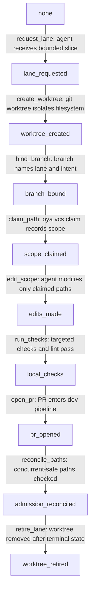

# Foundry Agent Pipeline Isolation Worktree

## Purpose

This spec defines Layer 0 isolation for Foundry agent lanes: one isolated worktree per lane, branch ownership, path claim hygiene, cleanup, and admission-time concurrent-safe-path reconciliation.

The isolation described here protects internal source-code and CI changesets; it is not a runtime sandbox for tenant AI prompts or user data.

Foundry was the internal agentic-development pipeline (RETIRED per ADR-0335 Wave 15I; absorbed into intelligence): it coordinates source changes, CI evidence, reviewer decisions, merge-queue state, and promotion state for the oyatie repository.
Foundry is not a consumer-facing AI product, not a tenant assistant, and not the place where B2B or B2C prompt history is stored.
This spec turns the ADR-level decision into an operator-readable and agent-executable substrate contract.
The contract is intentionally written with RFC 2119 and RFC 8174 keywords so policy, CI, and agent prompts can parse the same text.
The control plane treats tenant_id=oyatie as the internal tenant for internal agentic-development pipeline emissions, consistent with ADR-0263.
Every state-changing step emits an audit event and a correlated observability record before a downstream state may rely on it.
The implementation boundary is the single Foundry microservice with internal bounded contexts from ADR-0136.
The repository boundary is microservices/foundry plus repo-level governance registries and docs referenced in cross-references.
The user-facing Intelligence substrate remains separate and MUST NOT be conflated with this pipeline.
The stop condition for this spec is a changeset whose evidence, policy, CI, review, queue, and promotion state can be replayed deterministically.

## Normative Requirements

The key words MUST, MUST NOT, REQUIRED, SHALL, SHALL NOT, SHOULD, SHOULD NOT, RECOMMENDED, MAY, and OPTIONAL in this section are to be interpreted as described in RFC 2119 and RFC 8174.

1. Foundry Agent Pipeline Isolation Worktree MUST ensure the state transition be written before downstream consumers act.
2. Foundry Agent Pipeline Isolation Worktree MUST ensure the state transition carry a deterministic identifier.
3. Foundry Agent Pipeline Isolation Worktree MUST ensure the state transition declare its actor, action, resource, and reason.
4. Foundry Agent Pipeline Isolation Worktree MUST ensure the state transition fail closed when required evidence is absent.
5. Foundry Agent Pipeline Isolation Worktree MUST ensure the Cedar decision be written before downstream consumers act.
6. Foundry Agent Pipeline Isolation Worktree MUST ensure the Cedar decision carry a deterministic identifier.
7. Foundry Agent Pipeline Isolation Worktree MUST ensure the Cedar decision declare its actor, action, resource, and reason.
8. Foundry Agent Pipeline Isolation Worktree MUST ensure the Cedar decision fail closed when required evidence is absent.
9. Foundry Agent Pipeline Isolation Worktree MUST ensure the audit event be written before downstream consumers act.
10. Foundry Agent Pipeline Isolation Worktree MUST ensure the audit event carry a deterministic identifier.
11. Foundry Agent Pipeline Isolation Worktree MUST ensure the audit event declare its actor, action, resource, and reason.
12. Foundry Agent Pipeline Isolation Worktree MUST ensure the audit event fail closed when required evidence is absent.
13. Foundry Agent Pipeline Isolation Worktree MUST ensure the observability emission be written before downstream consumers act.
14. Foundry Agent Pipeline Isolation Worktree MUST ensure the observability emission carry a deterministic identifier.
15. Foundry Agent Pipeline Isolation Worktree MUST ensure the observability emission declare its actor, action, resource, and reason.
16. Foundry Agent Pipeline Isolation Worktree MUST ensure the observability emission fail closed when required evidence is absent.
17. Foundry Agent Pipeline Isolation Worktree MUST ensure the evidence bundle be written before downstream consumers act.
18. Foundry Agent Pipeline Isolation Worktree MUST ensure the evidence bundle carry a deterministic identifier.
19. Foundry Agent Pipeline Isolation Worktree MUST ensure the evidence bundle declare its actor, action, resource, and reason.
20. Foundry Agent Pipeline Isolation Worktree MUST ensure the evidence bundle fail closed when required evidence is absent.
21. Foundry Agent Pipeline Isolation Worktree MUST ensure the cost budget be written before downstream consumers act.
22. Foundry Agent Pipeline Isolation Worktree MUST ensure the cost budget carry a deterministic identifier.
23. Foundry Agent Pipeline Isolation Worktree MUST ensure the cost budget declare its actor, action, resource, and reason.
24. Foundry Agent Pipeline Isolation Worktree MUST ensure the cost budget fail closed when required evidence is absent.
25. Foundry Agent Pipeline Isolation Worktree MUST ensure the idempotency key be written before downstream consumers act.
26. Foundry Agent Pipeline Isolation Worktree MUST ensure the idempotency key carry a deterministic identifier.
27. Foundry Agent Pipeline Isolation Worktree MUST ensure the idempotency key declare its actor, action, resource, and reason.
28. Foundry Agent Pipeline Isolation Worktree MUST ensure the idempotency key fail closed when required evidence is absent.
29. Foundry Agent Pipeline Isolation Worktree MUST ensure the retry branch be written before downstream consumers act.
30. Foundry Agent Pipeline Isolation Worktree MUST ensure the retry branch carry a deterministic identifier.
31. Foundry Agent Pipeline Isolation Worktree MUST ensure the retry branch declare its actor, action, resource, and reason.
32. Foundry Agent Pipeline Isolation Worktree MUST ensure the retry branch fail closed when required evidence is absent.
33. Foundry Agent Pipeline Isolation Worktree MUST ensure the reviewer verdict be written before downstream consumers act.
34. Foundry Agent Pipeline Isolation Worktree MUST ensure the reviewer verdict carry a deterministic identifier.
35. Foundry Agent Pipeline Isolation Worktree MUST ensure the reviewer verdict declare its actor, action, resource, and reason.
36. Foundry Agent Pipeline Isolation Worktree MUST ensure the reviewer verdict fail closed when required evidence is absent.
37. Foundry Agent Pipeline Isolation Worktree MUST ensure the CI status be written before downstream consumers act.
38. Foundry Agent Pipeline Isolation Worktree MUST ensure the CI status carry a deterministic identifier.
39. Foundry Agent Pipeline Isolation Worktree MUST ensure the CI status declare its actor, action, resource, and reason.
40. Foundry Agent Pipeline Isolation Worktree MUST ensure the CI status fail closed when required evidence is absent.
41. Foundry Agent Pipeline Isolation Worktree MUST ensure the worktree lane be written before downstream consumers act.
42. Foundry Agent Pipeline Isolation Worktree MUST ensure the worktree lane carry a deterministic identifier.
43. Foundry Agent Pipeline Isolation Worktree MUST ensure the worktree lane declare its actor, action, resource, and reason.
44. Foundry Agent Pipeline Isolation Worktree MUST ensure the worktree lane fail closed when required evidence is absent.
45. Foundry Agent Pipeline Isolation Worktree MUST ensure the branch reference be written before downstream consumers act.
46. Foundry Agent Pipeline Isolation Worktree MUST ensure the branch reference carry a deterministic identifier.
47. Foundry Agent Pipeline Isolation Worktree MUST ensure the branch reference declare its actor, action, resource, and reason.
48. Foundry Agent Pipeline Isolation Worktree MUST ensure the branch reference fail closed when required evidence is absent.
49. Foundry Agent Pipeline Isolation Worktree MUST ensure the merge-queue position be written before downstream consumers act.
50. Foundry Agent Pipeline Isolation Worktree MUST ensure the merge-queue position carry a deterministic identifier.
51. Foundry Agent Pipeline Isolation Worktree MUST ensure the merge-queue position declare its actor, action, resource, and reason.
52. Foundry Agent Pipeline Isolation Worktree MUST ensure the merge-queue position fail closed when required evidence is absent.
53. Foundry Agent Pipeline Isolation Worktree MUST ensure the promotion target be written before downstream consumers act.
54. Foundry Agent Pipeline Isolation Worktree MUST ensure the promotion target carry a deterministic identifier.
55. Foundry Agent Pipeline Isolation Worktree MUST ensure the promotion target declare its actor, action, resource, and reason.
56. Foundry Agent Pipeline Isolation Worktree MUST ensure the promotion target fail closed when required evidence is absent.
57. Foundry Agent Pipeline Isolation Worktree MUST ensure the human override be written before downstream consumers act.
58. Foundry Agent Pipeline Isolation Worktree MUST ensure the human override carry a deterministic identifier.
59. Foundry Agent Pipeline Isolation Worktree MUST ensure the human override declare its actor, action, resource, and reason.
60. Foundry Agent Pipeline Isolation Worktree MUST ensure the human override fail closed when required evidence is absent.
61. Foundry Agent Pipeline Isolation Worktree MUST ensure the safe-path predicate be written before downstream consumers act.
62. Foundry Agent Pipeline Isolation Worktree MUST ensure the safe-path predicate carry a deterministic identifier.
63. Foundry Agent Pipeline Isolation Worktree MUST ensure the safe-path predicate declare its actor, action, resource, and reason.
64. Foundry Agent Pipeline Isolation Worktree MUST ensure the safe-path predicate fail closed when required evidence is absent.
65. Foundry Agent Pipeline Isolation Worktree MUST ensure the OpenBao secret reference be written before downstream consumers act.
66. Foundry Agent Pipeline Isolation Worktree MUST ensure the OpenBao secret reference carry a deterministic identifier.
67. Foundry Agent Pipeline Isolation Worktree MUST ensure the OpenBao secret reference declare its actor, action, resource, and reason.
68. Foundry Agent Pipeline Isolation Worktree MUST ensure the OpenBao secret reference fail closed when required evidence is absent.
69. Foundry Agent Pipeline Isolation Worktree MUST ensure the GitHub post-back be written before downstream consumers act.
70. Foundry Agent Pipeline Isolation Worktree MUST ensure the GitHub post-back carry a deterministic identifier.
71. Foundry Agent Pipeline Isolation Worktree MUST ensure the GitHub post-back declare its actor, action, resource, and reason.
72. Foundry Agent Pipeline Isolation Worktree MUST ensure the GitHub post-back fail closed when required evidence is absent.
73. Foundry Agent Pipeline Isolation Worktree MUST ensure the multispectrum evidence be written before downstream consumers act.
74. Foundry Agent Pipeline Isolation Worktree MUST ensure the multispectrum evidence carry a deterministic identifier.
75. Foundry Agent Pipeline Isolation Worktree MUST ensure the multispectrum evidence declare its actor, action, resource, and reason.
76. Foundry Agent Pipeline Isolation Worktree MUST ensure the multispectrum evidence fail closed when required evidence is absent.
77. Foundry Agent Pipeline Isolation Worktree MUST ensure the trace context be written before downstream consumers act.
78. Foundry Agent Pipeline Isolation Worktree MUST ensure the trace context carry a deterministic identifier.
79. Foundry Agent Pipeline Isolation Worktree MUST ensure the trace context declare its actor, action, resource, and reason.
80. Foundry Agent Pipeline Isolation Worktree MUST ensure the trace context fail closed when required evidence is absent.
81. The `lane_requested` phase SHOULD expose a machine-readable status row with actor, at, evidence_uri, trace_id, and audit_id.
82. The `worktree_created` phase SHOULD expose a machine-readable status row with actor, at, evidence_uri, trace_id, and audit_id.
83. The `branch_bound` phase SHOULD expose a machine-readable status row with actor, at, evidence_uri, trace_id, and audit_id.
84. The `scope_claimed` phase SHOULD expose a machine-readable status row with actor, at, evidence_uri, trace_id, and audit_id.
85. The `edits_made` phase SHOULD expose a machine-readable status row with actor, at, evidence_uri, trace_id, and audit_id.
86. The `local_checks` phase SHOULD expose a machine-readable status row with actor, at, evidence_uri, trace_id, and audit_id.
87. The `pr_opened` phase SHOULD expose a machine-readable status row with actor, at, evidence_uri, trace_id, and audit_id.
88. The `admission_reconciled` phase SHOULD expose a machine-readable status row with actor, at, evidence_uri, trace_id, and audit_id.
89. The `worktree_retired` phase SHOULD expose a machine-readable status row with actor, at, evidence_uri, trace_id, and audit_id.
90. Action `foundry.worktree.create` MUST be denied unless a matching Cedar permit binds the principal, resource, and changeset intent.
91. Action `foundry.worktree.bind_branch` MUST be denied unless a matching Cedar permit binds the principal, resource, and changeset intent.
92. Action `foundry.worktree.claim_scope` MUST be denied unless a matching Cedar permit binds the principal, resource, and changeset intent.
93. Action `foundry.worktree.edit` MUST be denied unless a matching Cedar permit binds the principal, resource, and changeset intent.
94. Action `foundry.worktree.sync_dev` MUST be denied unless a matching Cedar permit binds the principal, resource, and changeset intent.
95. Action `foundry.worktree.retire` MUST be denied unless a matching Cedar permit binds the principal, resource, and changeset intent.
96. Action `foundry.safe_paths.evaluate` MUST be denied unless a matching Cedar permit binds the principal, resource, and changeset intent.
97. Implementations MAY add stricter product-local gates when they do not weaken any requirement in ADR-0116.

## State Machine / Sequence Diagram



### Named Transitions

| Transition | From | To | Guard summary | Audit event | Recovery if denied |
|---|---|---|---|---|---|
| request_lane | none | lane_requested | agent receives bounded slice; Cedar permit required; evidence hash present | EVT-FOUNDRY-BRANCH-BOUND | Hold at none; append refusal reason; request fix or human override |
| create_worktree | lane_requested | worktree_created | git worktree isolates filesystem; Cedar permit required; evidence hash present | EVT-FOUNDRY-BRANCH-BOUND | Hold at lane_requested; append refusal reason; request fix or human override |
| bind_branch | worktree_created | branch_bound | branch names lane and intent; Cedar permit required; evidence hash present | EVT-FOUNDRY-WORKTREE-RETIRED | Hold at worktree_created; append refusal reason; request fix or human override |
| claim_path | branch_bound | scope_claimed | oya vcs claim records scope; Cedar permit required; evidence hash present | EVT-FOUNDRY-SAFE-PATHS-EVALUATED | Hold at branch_bound; append refusal reason; request fix or human override |
| edit_scope | scope_claimed | edits_made | agent modifies only claimed paths; Cedar permit required; evidence hash present | EVT-FOUNDRY-SCOPE-CLAIMED | Hold at scope_claimed; append refusal reason; request fix or human override |
| run_checks | edits_made | local_checks | targeted checks and lint pass; Cedar permit required; evidence hash present | EVT-FOUNDRY-WORKTREE-RETIRED | Hold at edits_made; append refusal reason; request fix or human override |
| open_pr | local_checks | pr_opened | PR enters dev pipeline; Cedar permit required; evidence hash present | EVT-FOUNDRY-WORKTREE-RETIRED | Hold at local_checks; append refusal reason; request fix or human override |
| reconcile_paths | pr_opened | admission_reconciled | concurrent-safe paths checked; Cedar permit required; evidence hash present | EVT-FOUNDRY-SCOPE-CLAIMED | Hold at pr_opened; append refusal reason; request fix or human override |
| retire_lane | admission_reconciled | worktree_retired | worktree removed after terminal state; Cedar permit required; evidence hash present | EVT-FOUNDRY-WORKTREE-RETIRED | Hold at admission_reconciled; append refusal reason; request fix or human override |
| replay-check-01 | none | lane_requested | Replay validates lane_requested ordering, signature, budget, and trace context | EVT-FOUNDRY-WORKTREE-CREATED | Recompute from append-only log and refuse non-monotonic row |
| replay-check-02 | lane_requested | worktree_created | Replay validates worktree_created ordering, signature, budget, and trace context | EVT-FOUNDRY-BRANCH-BOUND | Recompute from append-only log and refuse non-monotonic row |
| replay-check-03 | worktree_created | branch_bound | Replay validates branch_bound ordering, signature, budget, and trace context | EVT-FOUNDRY-SCOPE-CLAIMED | Recompute from append-only log and refuse non-monotonic row |
| replay-check-04 | branch_bound | scope_claimed | Replay validates scope_claimed ordering, signature, budget, and trace context | EVT-FOUNDRY-SAFE-PATHS-EVALUATED | Recompute from append-only log and refuse non-monotonic row |
| replay-check-05 | scope_claimed | edits_made | Replay validates edits_made ordering, signature, budget, and trace context | EVT-FOUNDRY-WORKTREE-RETIRED | Recompute from append-only log and refuse non-monotonic row |
| replay-check-06 | edits_made | local_checks | Replay validates local_checks ordering, signature, budget, and trace context | EVT-FOUNDRY-WORKTREE-CREATED | Recompute from append-only log and refuse non-monotonic row |
| replay-check-07 | local_checks | pr_opened | Replay validates pr_opened ordering, signature, budget, and trace context | EVT-FOUNDRY-BRANCH-BOUND | Recompute from append-only log and refuse non-monotonic row |
| replay-check-08 | pr_opened | admission_reconciled | Replay validates admission_reconciled ordering, signature, budget, and trace context | EVT-FOUNDRY-SCOPE-CLAIMED | Recompute from append-only log and refuse non-monotonic row |
| replay-check-09 | admission_reconciled | worktree_retired | Replay validates worktree_retired ordering, signature, budget, and trace context | EVT-FOUNDRY-SAFE-PATHS-EVALUATED | Recompute from append-only log and refuse non-monotonic row |
| replay-check-10 | none | lane_requested | Replay validates lane_requested ordering, signature, budget, and trace context | EVT-FOUNDRY-WORKTREE-RETIRED | Recompute from append-only log and refuse non-monotonic row |
| replay-check-11 | lane_requested | worktree_created | Replay validates worktree_created ordering, signature, budget, and trace context | EVT-FOUNDRY-WORKTREE-CREATED | Recompute from append-only log and refuse non-monotonic row |
| replay-check-12 | worktree_created | branch_bound | Replay validates branch_bound ordering, signature, budget, and trace context | EVT-FOUNDRY-BRANCH-BOUND | Recompute from append-only log and refuse non-monotonic row |
| replay-check-13 | branch_bound | scope_claimed | Replay validates scope_claimed ordering, signature, budget, and trace context | EVT-FOUNDRY-SCOPE-CLAIMED | Recompute from append-only log and refuse non-monotonic row |
| replay-check-14 | scope_claimed | edits_made | Replay validates edits_made ordering, signature, budget, and trace context | EVT-FOUNDRY-SAFE-PATHS-EVALUATED | Recompute from append-only log and refuse non-monotonic row |
| replay-check-15 | edits_made | local_checks | Replay validates local_checks ordering, signature, budget, and trace context | EVT-FOUNDRY-WORKTREE-RETIRED | Recompute from append-only log and refuse non-monotonic row |
| replay-check-16 | local_checks | pr_opened | Replay validates pr_opened ordering, signature, budget, and trace context | EVT-FOUNDRY-WORKTREE-CREATED | Recompute from append-only log and refuse non-monotonic row |
| replay-check-17 | pr_opened | admission_reconciled | Replay validates admission_reconciled ordering, signature, budget, and trace context | EVT-FOUNDRY-BRANCH-BOUND | Recompute from append-only log and refuse non-monotonic row |
| replay-check-18 | admission_reconciled | worktree_retired | Replay validates worktree_retired ordering, signature, budget, and trace context | EVT-FOUNDRY-SCOPE-CLAIMED | Recompute from append-only log and refuse non-monotonic row |
| replay-check-19 | none | lane_requested | Replay validates lane_requested ordering, signature, budget, and trace context | EVT-FOUNDRY-SAFE-PATHS-EVALUATED | Recompute from append-only log and refuse non-monotonic row |
| replay-check-20 | lane_requested | worktree_created | Replay validates worktree_created ordering, signature, budget, and trace context | EVT-FOUNDRY-WORKTREE-RETIRED | Recompute from append-only log and refuse non-monotonic row |
| replay-check-21 | worktree_created | branch_bound | Replay validates branch_bound ordering, signature, budget, and trace context | EVT-FOUNDRY-WORKTREE-CREATED | Recompute from append-only log and refuse non-monotonic row |
| replay-check-22 | branch_bound | scope_claimed | Replay validates scope_claimed ordering, signature, budget, and trace context | EVT-FOUNDRY-BRANCH-BOUND | Recompute from append-only log and refuse non-monotonic row |
| replay-check-23 | scope_claimed | edits_made | Replay validates edits_made ordering, signature, budget, and trace context | EVT-FOUNDRY-SCOPE-CLAIMED | Recompute from append-only log and refuse non-monotonic row |
| replay-check-24 | edits_made | local_checks | Replay validates local_checks ordering, signature, budget, and trace context | EVT-FOUNDRY-SAFE-PATHS-EVALUATED | Recompute from append-only log and refuse non-monotonic row |
| replay-check-25 | local_checks | pr_opened | Replay validates pr_opened ordering, signature, budget, and trace context | EVT-FOUNDRY-WORKTREE-RETIRED | Recompute from append-only log and refuse non-monotonic row |
| replay-check-26 | pr_opened | admission_reconciled | Replay validates admission_reconciled ordering, signature, budget, and trace context | EVT-FOUNDRY-WORKTREE-CREATED | Recompute from append-only log and refuse non-monotonic row |
| replay-check-27 | admission_reconciled | worktree_retired | Replay validates worktree_retired ordering, signature, budget, and trace context | EVT-FOUNDRY-BRANCH-BOUND | Recompute from append-only log and refuse non-monotonic row |
| replay-check-28 | none | lane_requested | Replay validates lane_requested ordering, signature, budget, and trace context | EVT-FOUNDRY-SCOPE-CLAIMED | Recompute from append-only log and refuse non-monotonic row |
| replay-check-29 | lane_requested | worktree_created | Replay validates worktree_created ordering, signature, budget, and trace context | EVT-FOUNDRY-SAFE-PATHS-EVALUATED | Recompute from append-only log and refuse non-monotonic row |
| replay-check-30 | worktree_created | branch_bound | Replay validates branch_bound ordering, signature, budget, and trace context | EVT-FOUNDRY-WORKTREE-RETIRED | Recompute from append-only log and refuse non-monotonic row |
| replay-check-31 | branch_bound | scope_claimed | Replay validates scope_claimed ordering, signature, budget, and trace context | EVT-FOUNDRY-WORKTREE-CREATED | Recompute from append-only log and refuse non-monotonic row |
| replay-check-32 | scope_claimed | edits_made | Replay validates edits_made ordering, signature, budget, and trace context | EVT-FOUNDRY-BRANCH-BOUND | Recompute from append-only log and refuse non-monotonic row |
| replay-check-33 | edits_made | local_checks | Replay validates local_checks ordering, signature, budget, and trace context | EVT-FOUNDRY-SCOPE-CLAIMED | Recompute from append-only log and refuse non-monotonic row |
| replay-check-34 | local_checks | pr_opened | Replay validates pr_opened ordering, signature, budget, and trace context | EVT-FOUNDRY-SAFE-PATHS-EVALUATED | Recompute from append-only log and refuse non-monotonic row |
| replay-check-35 | pr_opened | admission_reconciled | Replay validates admission_reconciled ordering, signature, budget, and trace context | EVT-FOUNDRY-WORKTREE-RETIRED | Recompute from append-only log and refuse non-monotonic row |
| replay-check-36 | admission_reconciled | worktree_retired | Replay validates worktree_retired ordering, signature, budget, and trace context | EVT-FOUNDRY-WORKTREE-CREATED | Recompute from append-only log and refuse non-monotonic row |
| replay-check-37 | none | lane_requested | Replay validates lane_requested ordering, signature, budget, and trace context | EVT-FOUNDRY-BRANCH-BOUND | Recompute from append-only log and refuse non-monotonic row |
| replay-check-38 | lane_requested | worktree_created | Replay validates worktree_created ordering, signature, budget, and trace context | EVT-FOUNDRY-SCOPE-CLAIMED | Recompute from append-only log and refuse non-monotonic row |
| replay-check-39 | worktree_created | branch_bound | Replay validates branch_bound ordering, signature, budget, and trace context | EVT-FOUNDRY-SAFE-PATHS-EVALUATED | Recompute from append-only log and refuse non-monotonic row |
| replay-check-40 | branch_bound | scope_claimed | Replay validates scope_claimed ordering, signature, budget, and trace context | EVT-FOUNDRY-WORKTREE-RETIRED | Recompute from append-only log and refuse non-monotonic row |
| replay-check-41 | scope_claimed | edits_made | Replay validates edits_made ordering, signature, budget, and trace context | EVT-FOUNDRY-WORKTREE-CREATED | Recompute from append-only log and refuse non-monotonic row |
| replay-check-42 | edits_made | local_checks | Replay validates local_checks ordering, signature, budget, and trace context | EVT-FOUNDRY-BRANCH-BOUND | Recompute from append-only log and refuse non-monotonic row |
| replay-check-43 | local_checks | pr_opened | Replay validates pr_opened ordering, signature, budget, and trace context | EVT-FOUNDRY-SCOPE-CLAIMED | Recompute from append-only log and refuse non-monotonic row |
| replay-check-44 | pr_opened | admission_reconciled | Replay validates admission_reconciled ordering, signature, budget, and trace context | EVT-FOUNDRY-SAFE-PATHS-EVALUATED | Recompute from append-only log and refuse non-monotonic row |
| replay-check-45 | admission_reconciled | worktree_retired | Replay validates worktree_retired ordering, signature, budget, and trace context | EVT-FOUNDRY-WORKTREE-RETIRED | Recompute from append-only log and refuse non-monotonic row |
| replay-check-46 | none | lane_requested | Replay validates lane_requested ordering, signature, budget, and trace context | EVT-FOUNDRY-WORKTREE-CREATED | Recompute from append-only log and refuse non-monotonic row |
| replay-check-47 | lane_requested | worktree_created | Replay validates worktree_created ordering, signature, budget, and trace context | EVT-FOUNDRY-BRANCH-BOUND | Recompute from append-only log and refuse non-monotonic row |
| replay-check-48 | worktree_created | branch_bound | Replay validates branch_bound ordering, signature, budget, and trace context | EVT-FOUNDRY-SCOPE-CLAIMED | Recompute from append-only log and refuse non-monotonic row |
| replay-check-49 | branch_bound | scope_claimed | Replay validates scope_claimed ordering, signature, budget, and trace context | EVT-FOUNDRY-SAFE-PATHS-EVALUATED | Recompute from append-only log and refuse non-monotonic row |
| replay-check-50 | scope_claimed | edits_made | Replay validates edits_made ordering, signature, budget, and trace context | EVT-FOUNDRY-WORKTREE-RETIRED | Recompute from append-only log and refuse non-monotonic row |
| replay-check-51 | edits_made | local_checks | Replay validates local_checks ordering, signature, budget, and trace context | EVT-FOUNDRY-WORKTREE-CREATED | Recompute from append-only log and refuse non-monotonic row |
| replay-check-52 | local_checks | pr_opened | Replay validates pr_opened ordering, signature, budget, and trace context | EVT-FOUNDRY-BRANCH-BOUND | Recompute from append-only log and refuse non-monotonic row |
| replay-check-53 | pr_opened | admission_reconciled | Replay validates admission_reconciled ordering, signature, budget, and trace context | EVT-FOUNDRY-SCOPE-CLAIMED | Recompute from append-only log and refuse non-monotonic row |
| replay-check-54 | admission_reconciled | worktree_retired | Replay validates worktree_retired ordering, signature, budget, and trace context | EVT-FOUNDRY-SAFE-PATHS-EVALUATED | Recompute from append-only log and refuse non-monotonic row |

## Cedar Policy Bindings

The bindings below use specific internal principals, actions, and resources. A deny from any narrower policy wins over these permits.

| Binding | Principal | Action | Resource | Required context | Decision |
|---|---|---|---|---|---|
| B-001 | Principal::"oyatie.agent.codex" | Action::"foundry.worktree.create" | Resource::"branch:agent/foundry-*" | workflow=foundry_pipeline; tenant_id=oyatie; intent=agent-pipeline-isolation-worktree | permit when evidence_hash and changeset_id are present |
| B-002 | Principal::"oyatie.agent.codex" | Action::"foundry.worktree.bind_branch" | Resource::"scope:microservices/foundry/**" | workflow=foundry_pipeline; tenant_id=oyatie; intent=agent-pipeline-isolation-worktree | permit when evidence_hash and changeset_id are present |
| B-003 | Principal::"oyatie.agent.codex" | Action::"foundry.worktree.claim_scope" | Resource::"safe-paths:registry/vcs/concurrent-safe-paths.yaml" | workflow=foundry_pipeline; tenant_id=oyatie; intent=agent-pipeline-isolation-worktree | permit when evidence_hash and changeset_id are present |
| B-004 | Principal::"oyatie.agent.codex" | Action::"foundry.worktree.edit" | Resource::"repo:oyatie/microservices/foundry" | workflow=foundry_pipeline; tenant_id=oyatie; intent=agent-pipeline-isolation-worktree | permit when evidence_hash and changeset_id are present |
| B-005 | Principal::"oyatie.agent.codex" | Action::"foundry.worktree.sync_dev" | Resource::"branch:dev" | workflow=foundry_pipeline; tenant_id=oyatie; intent=agent-pipeline-isolation-worktree | permit when evidence_hash and changeset_id are present |
| B-006 | Principal::"oyatie.agent.claude-opus" | Action::"foundry.worktree.create" | Resource::"queue:foundry-dev" | workflow=foundry_pipeline; tenant_id=oyatie; intent=agent-pipeline-isolation-worktree | permit when evidence_hash and changeset_id are present |
| B-007 | Principal::"oyatie.agent.claude-opus" | Action::"foundry.worktree.bind_branch" | Resource::"event-log:registry/vcs/changeset-event-log.json" | workflow=foundry_pipeline; tenant_id=oyatie; intent=agent-pipeline-isolation-worktree | permit when evidence_hash and changeset_id are present |
| B-008 | Principal::"oyatie.agent.claude-opus" | Action::"foundry.worktree.claim_scope" | Resource::"event-router:registry/vcs/event-router.yaml" | workflow=foundry_pipeline; tenant_id=oyatie; intent=agent-pipeline-isolation-worktree | permit when evidence_hash and changeset_id are present |
| B-009 | Principal::"oyatie.agent.claude-opus" | Action::"foundry.worktree.edit" | Resource::"safe-paths:registry/vcs/concurrent-safe-paths.yaml" | workflow=foundry_pipeline; tenant_id=oyatie; intent=agent-pipeline-isolation-worktree | permit when evidence_hash and changeset_id are present |
| B-010 | Principal::"oyatie.agent.claude-opus" | Action::"foundry.worktree.sync_dev" | Resource::"evidence:evidence/multispectrum" | workflow=foundry_pipeline; tenant_id=oyatie; intent=agent-pipeline-isolation-worktree | permit when evidence_hash and changeset_id are present |
| B-011 | Principal::"oyatie.agent.planner" | Action::"foundry.worktree.create" | Resource::"audit:event-class/foundry" | workflow=foundry_pipeline; tenant_id=oyatie; intent=agent-pipeline-isolation-worktree | permit when evidence_hash and changeset_id are present |
| B-012 | Principal::"oyatie.agent.planner" | Action::"foundry.worktree.bind_branch" | Resource::"worktree:../oyatie-*" | workflow=foundry_pipeline; tenant_id=oyatie; intent=agent-pipeline-isolation-worktree | permit when evidence_hash and changeset_id are present |
| B-013 | Principal::"oyatie.agent.planner" | Action::"foundry.worktree.claim_scope" | Resource::"branch:agent/foundry-*" | workflow=foundry_pipeline; tenant_id=oyatie; intent=agent-pipeline-isolation-worktree | permit when evidence_hash and changeset_id are present |
| B-014 | Principal::"oyatie.agent.planner" | Action::"foundry.worktree.edit" | Resource::"scope:microservices/foundry/**" | workflow=foundry_pipeline; tenant_id=oyatie; intent=agent-pipeline-isolation-worktree | permit when evidence_hash and changeset_id are present |
| B-015 | Principal::"oyatie.agent.planner" | Action::"foundry.worktree.sync_dev" | Resource::"safe-paths:registry/vcs/concurrent-safe-paths.yaml" | workflow=foundry_pipeline; tenant_id=oyatie; intent=agent-pipeline-isolation-worktree | permit when evidence_hash and changeset_id are present |
| B-016 | Principal::"oyatie.agent.executor" | Action::"foundry.worktree.create" | Resource::"repo:oyatie/microservices/foundry" | workflow=foundry_pipeline; tenant_id=oyatie; intent=agent-pipeline-isolation-worktree | permit when evidence_hash and changeset_id are present |
| B-017 | Principal::"oyatie.agent.executor" | Action::"foundry.worktree.bind_branch" | Resource::"branch:dev" | workflow=foundry_pipeline; tenant_id=oyatie; intent=agent-pipeline-isolation-worktree | permit when evidence_hash and changeset_id are present |
| B-018 | Principal::"oyatie.agent.executor" | Action::"foundry.worktree.claim_scope" | Resource::"queue:foundry-dev" | workflow=foundry_pipeline; tenant_id=oyatie; intent=agent-pipeline-isolation-worktree | permit when evidence_hash and changeset_id are present |
| B-019 | Principal::"oyatie.agent.executor" | Action::"foundry.worktree.edit" | Resource::"event-log:registry/vcs/changeset-event-log.json" | workflow=foundry_pipeline; tenant_id=oyatie; intent=agent-pipeline-isolation-worktree | permit when evidence_hash and changeset_id are present |
| B-020 | Principal::"oyatie.agent.executor" | Action::"foundry.worktree.sync_dev" | Resource::"event-router:registry/vcs/event-router.yaml" | workflow=foundry_pipeline; tenant_id=oyatie; intent=agent-pipeline-isolation-worktree | permit when evidence_hash and changeset_id are present |
| B-021 | Principal::"oyatie.service.vcs-orchestrator" | Action::"foundry.worktree.create" | Resource::"safe-paths:registry/vcs/concurrent-safe-paths.yaml" | workflow=foundry_pipeline; tenant_id=oyatie; intent=agent-pipeline-isolation-worktree | permit when evidence_hash and changeset_id are present |
| B-022 | Principal::"oyatie.service.vcs-orchestrator" | Action::"foundry.worktree.bind_branch" | Resource::"evidence:evidence/multispectrum" | workflow=foundry_pipeline; tenant_id=oyatie; intent=agent-pipeline-isolation-worktree | permit when evidence_hash and changeset_id are present |
| B-023 | Principal::"oyatie.service.vcs-orchestrator" | Action::"foundry.worktree.claim_scope" | Resource::"audit:event-class/foundry" | workflow=foundry_pipeline; tenant_id=oyatie; intent=agent-pipeline-isolation-worktree | permit when evidence_hash and changeset_id are present |
| B-024 | Principal::"oyatie.service.vcs-orchestrator" | Action::"foundry.worktree.edit" | Resource::"worktree:../oyatie-*" | workflow=foundry_pipeline; tenant_id=oyatie; intent=agent-pipeline-isolation-worktree | permit when evidence_hash and changeset_id are present |
| B-025 | Principal::"oyatie.service.vcs-orchestrator" | Action::"foundry.worktree.sync_dev" | Resource::"branch:agent/foundry-*" | workflow=foundry_pipeline; tenant_id=oyatie; intent=agent-pipeline-isolation-worktree | permit when evidence_hash and changeset_id are present |
| B-026 | Principal::"oyatie.service.webhook-receiver" | Action::"foundry.worktree.create" | Resource::"scope:microservices/foundry/**" | workflow=foundry_pipeline; tenant_id=oyatie; intent=agent-pipeline-isolation-worktree | permit when evidence_hash and changeset_id are present |
| B-027 | Principal::"oyatie.service.webhook-receiver" | Action::"foundry.worktree.bind_branch" | Resource::"safe-paths:registry/vcs/concurrent-safe-paths.yaml" | workflow=foundry_pipeline; tenant_id=oyatie; intent=agent-pipeline-isolation-worktree | permit when evidence_hash and changeset_id are present |
| B-028 | Principal::"oyatie.service.webhook-receiver" | Action::"foundry.worktree.claim_scope" | Resource::"repo:oyatie/microservices/foundry" | workflow=foundry_pipeline; tenant_id=oyatie; intent=agent-pipeline-isolation-worktree | permit when evidence_hash and changeset_id are present |
| B-029 | Principal::"oyatie.service.webhook-receiver" | Action::"foundry.worktree.edit" | Resource::"branch:dev" | workflow=foundry_pipeline; tenant_id=oyatie; intent=agent-pipeline-isolation-worktree | permit when evidence_hash and changeset_id are present |
| B-030 | Principal::"oyatie.service.webhook-receiver" | Action::"foundry.worktree.sync_dev" | Resource::"queue:foundry-dev" | workflow=foundry_pipeline; tenant_id=oyatie; intent=agent-pipeline-isolation-worktree | permit when evidence_hash and changeset_id are present |
| B-031 | Principal::"oyatie.service.merge-queue" | Action::"foundry.worktree.create" | Resource::"event-log:registry/vcs/changeset-event-log.json" | workflow=foundry_pipeline; tenant_id=oyatie; intent=agent-pipeline-isolation-worktree | permit when evidence_hash and changeset_id are present |
| B-032 | Principal::"oyatie.service.merge-queue" | Action::"foundry.worktree.bind_branch" | Resource::"event-router:registry/vcs/event-router.yaml" | workflow=foundry_pipeline; tenant_id=oyatie; intent=agent-pipeline-isolation-worktree | permit when evidence_hash and changeset_id are present |
| B-033 | Principal::"oyatie.service.merge-queue" | Action::"foundry.worktree.claim_scope" | Resource::"safe-paths:registry/vcs/concurrent-safe-paths.yaml" | workflow=foundry_pipeline; tenant_id=oyatie; intent=agent-pipeline-isolation-worktree | permit when evidence_hash and changeset_id are present |
| B-034 | Principal::"oyatie.service.merge-queue" | Action::"foundry.worktree.edit" | Resource::"evidence:evidence/multispectrum" | workflow=foundry_pipeline; tenant_id=oyatie; intent=agent-pipeline-isolation-worktree | permit when evidence_hash and changeset_id are present |
| B-035 | Principal::"oyatie.service.merge-queue" | Action::"foundry.worktree.sync_dev" | Resource::"audit:event-class/foundry" | workflow=foundry_pipeline; tenant_id=oyatie; intent=agent-pipeline-isolation-worktree | permit when evidence_hash and changeset_id are present |
| B-036 | Principal::"oyatie.service.admission-gate" | Action::"foundry.worktree.create" | Resource::"worktree:../oyatie-*" | workflow=foundry_pipeline; tenant_id=oyatie; intent=agent-pipeline-isolation-worktree | permit when evidence_hash and changeset_id are present |
| B-037 | Principal::"oyatie.service.admission-gate" | Action::"foundry.worktree.bind_branch" | Resource::"branch:agent/foundry-*" | workflow=foundry_pipeline; tenant_id=oyatie; intent=agent-pipeline-isolation-worktree | permit when evidence_hash and changeset_id are present |
| B-038 | Principal::"oyatie.service.admission-gate" | Action::"foundry.worktree.claim_scope" | Resource::"scope:microservices/foundry/**" | workflow=foundry_pipeline; tenant_id=oyatie; intent=agent-pipeline-isolation-worktree | permit when evidence_hash and changeset_id are present |
| B-039 | Principal::"oyatie.service.admission-gate" | Action::"foundry.worktree.edit" | Resource::"safe-paths:registry/vcs/concurrent-safe-paths.yaml" | workflow=foundry_pipeline; tenant_id=oyatie; intent=agent-pipeline-isolation-worktree | permit when evidence_hash and changeset_id are present |
| B-040 | Principal::"oyatie.service.admission-gate" | Action::"foundry.worktree.sync_dev" | Resource::"repo:oyatie/microservices/foundry" | workflow=foundry_pipeline; tenant_id=oyatie; intent=agent-pipeline-isolation-worktree | permit when evidence_hash and changeset_id are present |
| B-041 | Principal::"oyatie.service.completion-gate" | Action::"foundry.worktree.create" | Resource::"branch:dev" | workflow=foundry_pipeline; tenant_id=oyatie; intent=agent-pipeline-isolation-worktree | permit when evidence_hash and changeset_id are present |
| B-042 | Principal::"oyatie.service.completion-gate" | Action::"foundry.worktree.bind_branch" | Resource::"queue:foundry-dev" | workflow=foundry_pipeline; tenant_id=oyatie; intent=agent-pipeline-isolation-worktree | permit when evidence_hash and changeset_id are present |
| B-043 | Principal::"oyatie.service.completion-gate" | Action::"foundry.worktree.claim_scope" | Resource::"event-log:registry/vcs/changeset-event-log.json" | workflow=foundry_pipeline; tenant_id=oyatie; intent=agent-pipeline-isolation-worktree | permit when evidence_hash and changeset_id are present |
| B-044 | Principal::"oyatie.service.completion-gate" | Action::"foundry.worktree.edit" | Resource::"event-router:registry/vcs/event-router.yaml" | workflow=foundry_pipeline; tenant_id=oyatie; intent=agent-pipeline-isolation-worktree | permit when evidence_hash and changeset_id are present |
| B-045 | Principal::"oyatie.service.completion-gate" | Action::"foundry.worktree.sync_dev" | Resource::"safe-paths:registry/vcs/concurrent-safe-paths.yaml" | workflow=foundry_pipeline; tenant_id=oyatie; intent=agent-pipeline-isolation-worktree | permit when evidence_hash and changeset_id are present |
| B-046 | Principal::"oyatie.human.reviewer" | Action::"foundry.worktree.create" | Resource::"evidence:evidence/multispectrum" | workflow=foundry_pipeline; tenant_id=oyatie; intent=agent-pipeline-isolation-worktree | permit when evidence_hash and changeset_id are present |
| B-047 | Principal::"oyatie.human.reviewer" | Action::"foundry.worktree.bind_branch" | Resource::"audit:event-class/foundry" | workflow=foundry_pipeline; tenant_id=oyatie; intent=agent-pipeline-isolation-worktree | permit when evidence_hash and changeset_id are present |
| B-048 | Principal::"oyatie.human.reviewer" | Action::"foundry.worktree.claim_scope" | Resource::"worktree:../oyatie-*" | workflow=foundry_pipeline; tenant_id=oyatie; intent=agent-pipeline-isolation-worktree | permit when evidence_hash and changeset_id are present |
| B-049 | Principal::"oyatie.human.reviewer" | Action::"foundry.worktree.edit" | Resource::"branch:agent/foundry-*" | workflow=foundry_pipeline; tenant_id=oyatie; intent=agent-pipeline-isolation-worktree | permit when evidence_hash and changeset_id are present |
| B-050 | Principal::"oyatie.human.reviewer" | Action::"foundry.worktree.sync_dev" | Resource::"scope:microservices/foundry/**" | workflow=foundry_pipeline; tenant_id=oyatie; intent=agent-pipeline-isolation-worktree | permit when evidence_hash and changeset_id are present |

```cedar
permit(
  principal in Principal::"oyatie.agent.codex",
  action == Action::"foundry.worktree.create",
  resource in Resource::"repo:oyatie/microservices/foundry"
) when {
  context.tenant_id == "oyatie" &&
  context.workflow == "foundry_pipeline" &&
  context.related_adr == "ADR-0116" &&
  context.evidence_hash != "" &&
  context.trace_id != ""
};

permit(
  principal in Principal::"oyatie.agent.codex",
  action == Action::"foundry.worktree.bind_branch",
  resource in Resource::"repo:oyatie/microservices/foundry"
) when {
  context.tenant_id == "oyatie" &&
  context.workflow == "foundry_pipeline" &&
  context.related_adr == "ADR-0116" &&
  context.evidence_hash != "" &&
  context.trace_id != ""
};

permit(
  principal in Principal::"oyatie.agent.codex",
  action == Action::"foundry.worktree.claim_scope",
  resource in Resource::"repo:oyatie/microservices/foundry"
) when {
  context.tenant_id == "oyatie" &&
  context.workflow == "foundry_pipeline" &&
  context.related_adr == "ADR-0116" &&
  context.evidence_hash != "" &&
  context.trace_id != ""
};

permit(
  principal in Principal::"oyatie.agent.codex",
  action == Action::"foundry.worktree.edit",
  resource in Resource::"repo:oyatie/microservices/foundry"
) when {
  context.tenant_id == "oyatie" &&
  context.workflow == "foundry_pipeline" &&
  context.related_adr == "ADR-0116" &&
  context.evidence_hash != "" &&
  context.trace_id != ""
};

forbid(
  principal,
  action,
  resource in Resource::"repo:oyatie/microservices/foundry/decisions"
) when {
  context.intent == "agent-pipeline-isolation-worktree" &&
  context.owner != "per-msvc-adrs-batch-d"
};
```

### Cedar Guard Catalog

- Guard 01: Principal::"oyatie.agent.codex" may invoke foundry.worktree.create on Resource::"worktree:../oyatie-*" only while `lane_requested` is current, the changeset id is stable, the event is signed, and the ADR-0116 invariant is cited.
- Guard 02: Principal::"oyatie.agent.claude-opus" may invoke foundry.worktree.bind_branch on Resource::"branch:agent/foundry-*" only while `worktree_created` is current, the changeset id is stable, the event is signed, and the ADR-0116 invariant is cited.
- Guard 03: Principal::"oyatie.agent.planner" may invoke foundry.worktree.claim_scope on Resource::"scope:microservices/foundry/**" only while `branch_bound` is current, the changeset id is stable, the event is signed, and the ADR-0116 invariant is cited.
- Guard 04: Principal::"oyatie.agent.executor" may invoke foundry.worktree.edit on Resource::"safe-paths:registry/vcs/concurrent-safe-paths.yaml" only while `scope_claimed` is current, the changeset id is stable, the event is signed, and the ADR-0116 invariant is cited.
- Guard 05: Principal::"oyatie.service.vcs-orchestrator" may invoke foundry.worktree.sync_dev on Resource::"repo:oyatie/microservices/foundry" only while `edits_made` is current, the changeset id is stable, the event is signed, and the ADR-0116 invariant is cited.
- Guard 06: Principal::"oyatie.service.webhook-receiver" may invoke foundry.worktree.retire on Resource::"branch:dev" only while `local_checks` is current, the changeset id is stable, the event is signed, and the ADR-0116 invariant is cited.
- Guard 07: Principal::"oyatie.service.merge-queue" may invoke foundry.safe_paths.evaluate on Resource::"queue:foundry-dev" only while `pr_opened` is current, the changeset id is stable, the event is signed, and the ADR-0116 invariant is cited.
- Guard 08: Principal::"oyatie.service.admission-gate" may invoke foundry.worktree.create on Resource::"event-log:registry/vcs/changeset-event-log.json" only while `admission_reconciled` is current, the changeset id is stable, the event is signed, and the ADR-0116 invariant is cited.
- Guard 09: Principal::"oyatie.service.completion-gate" may invoke foundry.worktree.bind_branch on Resource::"event-router:registry/vcs/event-router.yaml" only while `worktree_retired` is current, the changeset id is stable, the event is signed, and the ADR-0116 invariant is cited.
- Guard 10: Principal::"oyatie.human.reviewer" may invoke foundry.worktree.claim_scope on Resource::"safe-paths:registry/vcs/concurrent-safe-paths.yaml" only while `lane_requested` is current, the changeset id is stable, the event is signed, and the ADR-0116 invariant is cited.
- Guard 11: Principal::"oyatie.agent.codex" may invoke foundry.worktree.edit on Resource::"evidence:evidence/multispectrum" only while `worktree_created` is current, the changeset id is stable, the event is signed, and the ADR-0116 invariant is cited.
- Guard 12: Principal::"oyatie.agent.claude-opus" may invoke foundry.worktree.sync_dev on Resource::"audit:event-class/foundry" only while `branch_bound` is current, the changeset id is stable, the event is signed, and the ADR-0116 invariant is cited.
- Guard 13: Principal::"oyatie.agent.planner" may invoke foundry.worktree.retire on Resource::"worktree:../oyatie-*" only while `scope_claimed` is current, the changeset id is stable, the event is signed, and the ADR-0116 invariant is cited.
- Guard 14: Principal::"oyatie.agent.executor" may invoke foundry.safe_paths.evaluate on Resource::"branch:agent/foundry-*" only while `edits_made` is current, the changeset id is stable, the event is signed, and the ADR-0116 invariant is cited.
- Guard 15: Principal::"oyatie.service.vcs-orchestrator" may invoke foundry.worktree.create on Resource::"scope:microservices/foundry/**" only while `local_checks` is current, the changeset id is stable, the event is signed, and the ADR-0116 invariant is cited.
- Guard 16: Principal::"oyatie.service.webhook-receiver" may invoke foundry.worktree.bind_branch on Resource::"safe-paths:registry/vcs/concurrent-safe-paths.yaml" only while `pr_opened` is current, the changeset id is stable, the event is signed, and the ADR-0116 invariant is cited.
- Guard 17: Principal::"oyatie.service.merge-queue" may invoke foundry.worktree.claim_scope on Resource::"repo:oyatie/microservices/foundry" only while `admission_reconciled` is current, the changeset id is stable, the event is signed, and the ADR-0116 invariant is cited.
- Guard 18: Principal::"oyatie.service.admission-gate" may invoke foundry.worktree.edit on Resource::"branch:dev" only while `worktree_retired` is current, the changeset id is stable, the event is signed, and the ADR-0116 invariant is cited.
- Guard 19: Principal::"oyatie.service.completion-gate" may invoke foundry.worktree.sync_dev on Resource::"queue:foundry-dev" only while `lane_requested` is current, the changeset id is stable, the event is signed, and the ADR-0116 invariant is cited.
- Guard 20: Principal::"oyatie.human.reviewer" may invoke foundry.worktree.retire on Resource::"event-log:registry/vcs/changeset-event-log.json" only while `worktree_created` is current, the changeset id is stable, the event is signed, and the ADR-0116 invariant is cited.
- Guard 21: Principal::"oyatie.agent.codex" may invoke foundry.safe_paths.evaluate on Resource::"event-router:registry/vcs/event-router.yaml" only while `branch_bound` is current, the changeset id is stable, the event is signed, and the ADR-0116 invariant is cited.
- Guard 22: Principal::"oyatie.agent.claude-opus" may invoke foundry.worktree.create on Resource::"safe-paths:registry/vcs/concurrent-safe-paths.yaml" only while `scope_claimed` is current, the changeset id is stable, the event is signed, and the ADR-0116 invariant is cited.
- Guard 23: Principal::"oyatie.agent.planner" may invoke foundry.worktree.bind_branch on Resource::"evidence:evidence/multispectrum" only while `edits_made` is current, the changeset id is stable, the event is signed, and the ADR-0116 invariant is cited.
- Guard 24: Principal::"oyatie.agent.executor" may invoke foundry.worktree.claim_scope on Resource::"audit:event-class/foundry" only while `local_checks` is current, the changeset id is stable, the event is signed, and the ADR-0116 invariant is cited.
- Guard 25: Principal::"oyatie.service.vcs-orchestrator" may invoke foundry.worktree.edit on Resource::"worktree:../oyatie-*" only while `pr_opened` is current, the changeset id is stable, the event is signed, and the ADR-0116 invariant is cited.
- Guard 26: Principal::"oyatie.service.webhook-receiver" may invoke foundry.worktree.sync_dev on Resource::"branch:agent/foundry-*" only while `admission_reconciled` is current, the changeset id is stable, the event is signed, and the ADR-0116 invariant is cited.
- Guard 27: Principal::"oyatie.service.merge-queue" may invoke foundry.worktree.retire on Resource::"scope:microservices/foundry/**" only while `worktree_retired` is current, the changeset id is stable, the event is signed, and the ADR-0116 invariant is cited.
- Guard 28: Principal::"oyatie.service.admission-gate" may invoke foundry.safe_paths.evaluate on Resource::"safe-paths:registry/vcs/concurrent-safe-paths.yaml" only while `lane_requested` is current, the changeset id is stable, the event is signed, and the ADR-0116 invariant is cited.
- Guard 29: Principal::"oyatie.service.completion-gate" may invoke foundry.worktree.create on Resource::"repo:oyatie/microservices/foundry" only while `worktree_created` is current, the changeset id is stable, the event is signed, and the ADR-0116 invariant is cited.
- Guard 30: Principal::"oyatie.human.reviewer" may invoke foundry.worktree.bind_branch on Resource::"branch:dev" only while `branch_bound` is current, the changeset id is stable, the event is signed, and the ADR-0116 invariant is cited.
- Guard 31: Principal::"oyatie.agent.codex" may invoke foundry.worktree.claim_scope on Resource::"queue:foundry-dev" only while `scope_claimed` is current, the changeset id is stable, the event is signed, and the ADR-0116 invariant is cited.
- Guard 32: Principal::"oyatie.agent.claude-opus" may invoke foundry.worktree.edit on Resource::"event-log:registry/vcs/changeset-event-log.json" only while `edits_made` is current, the changeset id is stable, the event is signed, and the ADR-0116 invariant is cited.
- Guard 33: Principal::"oyatie.agent.planner" may invoke foundry.worktree.sync_dev on Resource::"event-router:registry/vcs/event-router.yaml" only while `local_checks` is current, the changeset id is stable, the event is signed, and the ADR-0116 invariant is cited.
- Guard 34: Principal::"oyatie.agent.executor" may invoke foundry.worktree.retire on Resource::"safe-paths:registry/vcs/concurrent-safe-paths.yaml" only while `pr_opened` is current, the changeset id is stable, the event is signed, and the ADR-0116 invariant is cited.
- Guard 35: Principal::"oyatie.service.vcs-orchestrator" may invoke foundry.safe_paths.evaluate on Resource::"evidence:evidence/multispectrum" only while `admission_reconciled` is current, the changeset id is stable, the event is signed, and the ADR-0116 invariant is cited.
- Guard 36: Principal::"oyatie.service.webhook-receiver" may invoke foundry.worktree.create on Resource::"audit:event-class/foundry" only while `worktree_retired` is current, the changeset id is stable, the event is signed, and the ADR-0116 invariant is cited.
- Guard 37: Principal::"oyatie.service.merge-queue" may invoke foundry.worktree.bind_branch on Resource::"worktree:../oyatie-*" only while `lane_requested` is current, the changeset id is stable, the event is signed, and the ADR-0116 invariant is cited.
- Guard 38: Principal::"oyatie.service.admission-gate" may invoke foundry.worktree.claim_scope on Resource::"branch:agent/foundry-*" only while `worktree_created` is current, the changeset id is stable, the event is signed, and the ADR-0116 invariant is cited.
- Guard 39: Principal::"oyatie.service.completion-gate" may invoke foundry.worktree.edit on Resource::"scope:microservices/foundry/**" only while `branch_bound` is current, the changeset id is stable, the event is signed, and the ADR-0116 invariant is cited.
- Guard 40: Principal::"oyatie.human.reviewer" may invoke foundry.worktree.sync_dev on Resource::"safe-paths:registry/vcs/concurrent-safe-paths.yaml" only while `scope_claimed` is current, the changeset id is stable, the event is signed, and the ADR-0116 invariant is cited.
- Guard 41: Principal::"oyatie.agent.codex" may invoke foundry.worktree.retire on Resource::"repo:oyatie/microservices/foundry" only while `edits_made` is current, the changeset id is stable, the event is signed, and the ADR-0116 invariant is cited.
- Guard 42: Principal::"oyatie.agent.claude-opus" may invoke foundry.safe_paths.evaluate on Resource::"branch:dev" only while `local_checks` is current, the changeset id is stable, the event is signed, and the ADR-0116 invariant is cited.
- Guard 43: Principal::"oyatie.agent.planner" may invoke foundry.worktree.create on Resource::"queue:foundry-dev" only while `pr_opened` is current, the changeset id is stable, the event is signed, and the ADR-0116 invariant is cited.
- Guard 44: Principal::"oyatie.agent.executor" may invoke foundry.worktree.bind_branch on Resource::"event-log:registry/vcs/changeset-event-log.json" only while `admission_reconciled` is current, the changeset id is stable, the event is signed, and the ADR-0116 invariant is cited.
- Guard 45: Principal::"oyatie.service.vcs-orchestrator" may invoke foundry.worktree.claim_scope on Resource::"event-router:registry/vcs/event-router.yaml" only while `worktree_retired` is current, the changeset id is stable, the event is signed, and the ADR-0116 invariant is cited.
- Guard 46: Principal::"oyatie.service.webhook-receiver" may invoke foundry.worktree.edit on Resource::"safe-paths:registry/vcs/concurrent-safe-paths.yaml" only while `lane_requested` is current, the changeset id is stable, the event is signed, and the ADR-0116 invariant is cited.
- Guard 47: Principal::"oyatie.service.merge-queue" may invoke foundry.worktree.sync_dev on Resource::"evidence:evidence/multispectrum" only while `worktree_created` is current, the changeset id is stable, the event is signed, and the ADR-0116 invariant is cited.
- Guard 48: Principal::"oyatie.service.admission-gate" may invoke foundry.worktree.retire on Resource::"audit:event-class/foundry" only while `branch_bound` is current, the changeset id is stable, the event is signed, and the ADR-0116 invariant is cited.
- Guard 49: Principal::"oyatie.service.completion-gate" may invoke foundry.safe_paths.evaluate on Resource::"worktree:../oyatie-*" only while `scope_claimed` is current, the changeset id is stable, the event is signed, and the ADR-0116 invariant is cited.
- Guard 50: Principal::"oyatie.human.reviewer" may invoke foundry.worktree.create on Resource::"branch:agent/foundry-*" only while `edits_made` is current, the changeset id is stable, the event is signed, and the ADR-0116 invariant is cited.
- Guard 51: Principal::"oyatie.agent.codex" may invoke foundry.worktree.bind_branch on Resource::"scope:microservices/foundry/**" only while `local_checks` is current, the changeset id is stable, the event is signed, and the ADR-0116 invariant is cited.
- Guard 52: Principal::"oyatie.agent.claude-opus" may invoke foundry.worktree.claim_scope on Resource::"safe-paths:registry/vcs/concurrent-safe-paths.yaml" only while `pr_opened` is current, the changeset id is stable, the event is signed, and the ADR-0116 invariant is cited.
- Guard 53: Principal::"oyatie.agent.planner" may invoke foundry.worktree.edit on Resource::"repo:oyatie/microservices/foundry" only while `admission_reconciled` is current, the changeset id is stable, the event is signed, and the ADR-0116 invariant is cited.
- Guard 54: Principal::"oyatie.agent.executor" may invoke foundry.worktree.sync_dev on Resource::"branch:dev" only while `worktree_retired` is current, the changeset id is stable, the event is signed, and the ADR-0116 invariant is cited.
- Guard 55: Principal::"oyatie.service.vcs-orchestrator" may invoke foundry.worktree.retire on Resource::"queue:foundry-dev" only while `lane_requested` is current, the changeset id is stable, the event is signed, and the ADR-0116 invariant is cited.
- Guard 56: Principal::"oyatie.service.webhook-receiver" may invoke foundry.safe_paths.evaluate on Resource::"event-log:registry/vcs/changeset-event-log.json" only while `worktree_created` is current, the changeset id is stable, the event is signed, and the ADR-0116 invariant is cited.
- Guard 57: Principal::"oyatie.service.merge-queue" may invoke foundry.worktree.create on Resource::"event-router:registry/vcs/event-router.yaml" only while `branch_bound` is current, the changeset id is stable, the event is signed, and the ADR-0116 invariant is cited.
- Guard 58: Principal::"oyatie.service.admission-gate" may invoke foundry.worktree.bind_branch on Resource::"safe-paths:registry/vcs/concurrent-safe-paths.yaml" only while `scope_claimed` is current, the changeset id is stable, the event is signed, and the ADR-0116 invariant is cited.
- Guard 59: Principal::"oyatie.service.completion-gate" may invoke foundry.worktree.claim_scope on Resource::"evidence:evidence/multispectrum" only while `edits_made` is current, the changeset id is stable, the event is signed, and the ADR-0116 invariant is cited.
- Guard 60: Principal::"oyatie.human.reviewer" may invoke foundry.worktree.edit on Resource::"audit:event-class/foundry" only while `local_checks` is current, the changeset id is stable, the event is signed, and the ADR-0116 invariant is cited.
- Guard 61: Principal::"oyatie.agent.codex" may invoke foundry.worktree.sync_dev on Resource::"worktree:../oyatie-*" only while `pr_opened` is current, the changeset id is stable, the event is signed, and the ADR-0116 invariant is cited.
- Guard 62: Principal::"oyatie.agent.claude-opus" may invoke foundry.worktree.retire on Resource::"branch:agent/foundry-*" only while `admission_reconciled` is current, the changeset id is stable, the event is signed, and the ADR-0116 invariant is cited.
- Guard 63: Principal::"oyatie.agent.planner" may invoke foundry.safe_paths.evaluate on Resource::"scope:microservices/foundry/**" only while `worktree_retired` is current, the changeset id is stable, the event is signed, and the ADR-0116 invariant is cited.
- Guard 64: Principal::"oyatie.agent.executor" may invoke foundry.worktree.create on Resource::"safe-paths:registry/vcs/concurrent-safe-paths.yaml" only while `lane_requested` is current, the changeset id is stable, the event is signed, and the ADR-0116 invariant is cited.
- Guard 65: Principal::"oyatie.service.vcs-orchestrator" may invoke foundry.worktree.bind_branch on Resource::"repo:oyatie/microservices/foundry" only while `worktree_created` is current, the changeset id is stable, the event is signed, and the ADR-0116 invariant is cited.
- Guard 66: Principal::"oyatie.service.webhook-receiver" may invoke foundry.worktree.claim_scope on Resource::"branch:dev" only while `branch_bound` is current, the changeset id is stable, the event is signed, and the ADR-0116 invariant is cited.
- Guard 67: Principal::"oyatie.service.merge-queue" may invoke foundry.worktree.edit on Resource::"queue:foundry-dev" only while `scope_claimed` is current, the changeset id is stable, the event is signed, and the ADR-0116 invariant is cited.
- Guard 68: Principal::"oyatie.service.admission-gate" may invoke foundry.worktree.sync_dev on Resource::"event-log:registry/vcs/changeset-event-log.json" only while `edits_made` is current, the changeset id is stable, the event is signed, and the ADR-0116 invariant is cited.
- Guard 69: Principal::"oyatie.service.completion-gate" may invoke foundry.worktree.retire on Resource::"event-router:registry/vcs/event-router.yaml" only while `local_checks` is current, the changeset id is stable, the event is signed, and the ADR-0116 invariant is cited.
- Guard 70: Principal::"oyatie.human.reviewer" may invoke foundry.safe_paths.evaluate on Resource::"safe-paths:registry/vcs/concurrent-safe-paths.yaml" only while `pr_opened` is current, the changeset id is stable, the event is signed, and the ADR-0116 invariant is cited.

## Audit Event Classes Emitted (per ADR-0263)

Every event class below emits structured JSON logs with schema=oyatie/log/v1, tenant_id=oyatie, microservice=foundry, trace_id, span_id, and audit_id when the operation changes state.

| Event class | Emitted when | Required fields | Retention | Cardinality guard |
|---|---|---|---|---|
| EVT-FOUNDRY-WORKTREE-CREATED | Foundry Agent Pipeline Isolation Worktree changes a durable pipeline fact | changeset_id, actor, action, resource, from_state, to_state, trace_id, span_id, audit_id, evidence_hash | 7 years for audit chain; 90 days hot observability | event_class + changeset_id only; no raw prompt or secret values |
| EVT-FOUNDRY-BRANCH-BOUND | Foundry Agent Pipeline Isolation Worktree changes a durable pipeline fact | changeset_id, actor, action, resource, from_state, to_state, trace_id, span_id, audit_id, evidence_hash | 7 years for audit chain; 90 days hot observability | event_class + changeset_id only; no raw prompt or secret values |
| EVT-FOUNDRY-SCOPE-CLAIMED | Foundry Agent Pipeline Isolation Worktree changes a durable pipeline fact | changeset_id, actor, action, resource, from_state, to_state, trace_id, span_id, audit_id, evidence_hash | 7 years for audit chain; 90 days hot observability | event_class + changeset_id only; no raw prompt or secret values |
| EVT-FOUNDRY-SAFE-PATHS-EVALUATED | Foundry Agent Pipeline Isolation Worktree changes a durable pipeline fact | changeset_id, actor, action, resource, from_state, to_state, trace_id, span_id, audit_id, evidence_hash | 7 years for audit chain; 90 days hot observability | event_class + changeset_id only; no raw prompt or secret values |
| EVT-FOUNDRY-WORKTREE-RETIRED | Foundry Agent Pipeline Isolation Worktree changes a durable pipeline fact | changeset_id, actor, action, resource, from_state, to_state, trace_id, span_id, audit_id, evidence_hash | 7 years for audit chain; 90 days hot observability | event_class + changeset_id only; no raw prompt or secret values |
| EVT-FOUNDRY-WORKTREE-CREATED-001 | claim path observes lane_requested | tenant_id=oyatie, sub_scope=oyatie.foundry.claim, policy_id=ADR-0116.lane_requested, correlation_id, audit_id | hot 90d + sealed audit chain | bounded by changeset_id and delivery_id; free text is scrubbed |
| EVT-FOUNDRY-BRANCH-BOUND-002 | verify path observes worktree_created | tenant_id=oyatie, sub_scope=oyatie.foundry.verify, policy_id=ADR-0116.worktree_created, correlation_id, audit_id | hot 90d + sealed audit chain | bounded by changeset_id and delivery_id; free text is scrubbed |
| EVT-FOUNDRY-SCOPE-CLAIMED-003 | done path observes branch_bound | tenant_id=oyatie, sub_scope=oyatie.foundry.done, policy_id=ADR-0116.branch_bound, correlation_id, audit_id | hot 90d + sealed audit chain | bounded by changeset_id and delivery_id; free text is scrubbed |
| EVT-FOUNDRY-SAFE-PATHS-EVALUATED-004 | admission path observes scope_claimed | tenant_id=oyatie, sub_scope=oyatie.foundry.admission, policy_id=ADR-0116.scope_claimed, correlation_id, audit_id | hot 90d + sealed audit chain | bounded by changeset_id and delivery_id; free text is scrubbed |
| EVT-FOUNDRY-WORKTREE-RETIRED-005 | completion path observes edits_made | tenant_id=oyatie, sub_scope=oyatie.foundry.completion, policy_id=ADR-0116.edits_made, correlation_id, audit_id | hot 90d + sealed audit chain | bounded by changeset_id and delivery_id; free text is scrubbed |
| EVT-FOUNDRY-WORKTREE-CREATED-006 | merge_queue path observes local_checks | tenant_id=oyatie, sub_scope=oyatie.foundry.merge_queue, policy_id=ADR-0116.local_checks, correlation_id, audit_id | hot 90d + sealed audit chain | bounded by changeset_id and delivery_id; free text is scrubbed |
| EVT-FOUNDRY-BRANCH-BOUND-007 | webhook path observes pr_opened | tenant_id=oyatie, sub_scope=oyatie.foundry.webhook, policy_id=ADR-0116.pr_opened, correlation_id, audit_id | hot 90d + sealed audit chain | bounded by changeset_id and delivery_id; free text is scrubbed |
| EVT-FOUNDRY-SCOPE-CLAIMED-008 | review path observes admission_reconciled | tenant_id=oyatie, sub_scope=oyatie.foundry.review, policy_id=ADR-0116.admission_reconciled, correlation_id, audit_id | hot 90d + sealed audit chain | bounded by changeset_id and delivery_id; free text is scrubbed |
| EVT-FOUNDRY-SAFE-PATHS-EVALUATED-009 | promotion path observes worktree_retired | tenant_id=oyatie, sub_scope=oyatie.foundry.promotion, policy_id=ADR-0116.worktree_retired, correlation_id, audit_id | hot 90d + sealed audit chain | bounded by changeset_id and delivery_id; free text is scrubbed |
| EVT-FOUNDRY-WORKTREE-RETIRED-010 | override path observes lane_requested | tenant_id=oyatie, sub_scope=oyatie.foundry.override, policy_id=ADR-0116.lane_requested, correlation_id, audit_id | hot 90d + sealed audit chain | bounded by changeset_id and delivery_id; free text is scrubbed |
| EVT-FOUNDRY-WORKTREE-CREATED-011 | claim path observes worktree_created | tenant_id=oyatie, sub_scope=oyatie.foundry.claim, policy_id=ADR-0116.worktree_created, correlation_id, audit_id | hot 90d + sealed audit chain | bounded by changeset_id and delivery_id; free text is scrubbed |
| EVT-FOUNDRY-BRANCH-BOUND-012 | verify path observes branch_bound | tenant_id=oyatie, sub_scope=oyatie.foundry.verify, policy_id=ADR-0116.branch_bound, correlation_id, audit_id | hot 90d + sealed audit chain | bounded by changeset_id and delivery_id; free text is scrubbed |
| EVT-FOUNDRY-SCOPE-CLAIMED-013 | done path observes scope_claimed | tenant_id=oyatie, sub_scope=oyatie.foundry.done, policy_id=ADR-0116.scope_claimed, correlation_id, audit_id | hot 90d + sealed audit chain | bounded by changeset_id and delivery_id; free text is scrubbed |
| EVT-FOUNDRY-SAFE-PATHS-EVALUATED-014 | admission path observes edits_made | tenant_id=oyatie, sub_scope=oyatie.foundry.admission, policy_id=ADR-0116.edits_made, correlation_id, audit_id | hot 90d + sealed audit chain | bounded by changeset_id and delivery_id; free text is scrubbed |
| EVT-FOUNDRY-WORKTREE-RETIRED-015 | completion path observes local_checks | tenant_id=oyatie, sub_scope=oyatie.foundry.completion, policy_id=ADR-0116.local_checks, correlation_id, audit_id | hot 90d + sealed audit chain | bounded by changeset_id and delivery_id; free text is scrubbed |
| EVT-FOUNDRY-WORKTREE-CREATED-016 | merge_queue path observes pr_opened | tenant_id=oyatie, sub_scope=oyatie.foundry.merge_queue, policy_id=ADR-0116.pr_opened, correlation_id, audit_id | hot 90d + sealed audit chain | bounded by changeset_id and delivery_id; free text is scrubbed |
| EVT-FOUNDRY-BRANCH-BOUND-017 | webhook path observes admission_reconciled | tenant_id=oyatie, sub_scope=oyatie.foundry.webhook, policy_id=ADR-0116.admission_reconciled, correlation_id, audit_id | hot 90d + sealed audit chain | bounded by changeset_id and delivery_id; free text is scrubbed |
| EVT-FOUNDRY-SCOPE-CLAIMED-018 | review path observes worktree_retired | tenant_id=oyatie, sub_scope=oyatie.foundry.review, policy_id=ADR-0116.worktree_retired, correlation_id, audit_id | hot 90d + sealed audit chain | bounded by changeset_id and delivery_id; free text is scrubbed |
| EVT-FOUNDRY-SAFE-PATHS-EVALUATED-019 | promotion path observes lane_requested | tenant_id=oyatie, sub_scope=oyatie.foundry.promotion, policy_id=ADR-0116.lane_requested, correlation_id, audit_id | hot 90d + sealed audit chain | bounded by changeset_id and delivery_id; free text is scrubbed |
| EVT-FOUNDRY-WORKTREE-RETIRED-020 | override path observes worktree_created | tenant_id=oyatie, sub_scope=oyatie.foundry.override, policy_id=ADR-0116.worktree_created, correlation_id, audit_id | hot 90d + sealed audit chain | bounded by changeset_id and delivery_id; free text is scrubbed |
| EVT-FOUNDRY-WORKTREE-CREATED-021 | claim path observes branch_bound | tenant_id=oyatie, sub_scope=oyatie.foundry.claim, policy_id=ADR-0116.branch_bound, correlation_id, audit_id | hot 90d + sealed audit chain | bounded by changeset_id and delivery_id; free text is scrubbed |
| EVT-FOUNDRY-BRANCH-BOUND-022 | verify path observes scope_claimed | tenant_id=oyatie, sub_scope=oyatie.foundry.verify, policy_id=ADR-0116.scope_claimed, correlation_id, audit_id | hot 90d + sealed audit chain | bounded by changeset_id and delivery_id; free text is scrubbed |
| EVT-FOUNDRY-SCOPE-CLAIMED-023 | done path observes edits_made | tenant_id=oyatie, sub_scope=oyatie.foundry.done, policy_id=ADR-0116.edits_made, correlation_id, audit_id | hot 90d + sealed audit chain | bounded by changeset_id and delivery_id; free text is scrubbed |
| EVT-FOUNDRY-SAFE-PATHS-EVALUATED-024 | admission path observes local_checks | tenant_id=oyatie, sub_scope=oyatie.foundry.admission, policy_id=ADR-0116.local_checks, correlation_id, audit_id | hot 90d + sealed audit chain | bounded by changeset_id and delivery_id; free text is scrubbed |
| EVT-FOUNDRY-WORKTREE-RETIRED-025 | completion path observes pr_opened | tenant_id=oyatie, sub_scope=oyatie.foundry.completion, policy_id=ADR-0116.pr_opened, correlation_id, audit_id | hot 90d + sealed audit chain | bounded by changeset_id and delivery_id; free text is scrubbed |
| EVT-FOUNDRY-WORKTREE-CREATED-026 | merge_queue path observes admission_reconciled | tenant_id=oyatie, sub_scope=oyatie.foundry.merge_queue, policy_id=ADR-0116.admission_reconciled, correlation_id, audit_id | hot 90d + sealed audit chain | bounded by changeset_id and delivery_id; free text is scrubbed |
| EVT-FOUNDRY-BRANCH-BOUND-027 | webhook path observes worktree_retired | tenant_id=oyatie, sub_scope=oyatie.foundry.webhook, policy_id=ADR-0116.worktree_retired, correlation_id, audit_id | hot 90d + sealed audit chain | bounded by changeset_id and delivery_id; free text is scrubbed |
| EVT-FOUNDRY-SCOPE-CLAIMED-028 | review path observes lane_requested | tenant_id=oyatie, sub_scope=oyatie.foundry.review, policy_id=ADR-0116.lane_requested, correlation_id, audit_id | hot 90d + sealed audit chain | bounded by changeset_id and delivery_id; free text is scrubbed |
| EVT-FOUNDRY-SAFE-PATHS-EVALUATED-029 | promotion path observes worktree_created | tenant_id=oyatie, sub_scope=oyatie.foundry.promotion, policy_id=ADR-0116.worktree_created, correlation_id, audit_id | hot 90d + sealed audit chain | bounded by changeset_id and delivery_id; free text is scrubbed |
| EVT-FOUNDRY-WORKTREE-RETIRED-030 | override path observes branch_bound | tenant_id=oyatie, sub_scope=oyatie.foundry.override, policy_id=ADR-0116.branch_bound, correlation_id, audit_id | hot 90d + sealed audit chain | bounded by changeset_id and delivery_id; free text is scrubbed |
| EVT-FOUNDRY-WORKTREE-CREATED-031 | claim path observes scope_claimed | tenant_id=oyatie, sub_scope=oyatie.foundry.claim, policy_id=ADR-0116.scope_claimed, correlation_id, audit_id | hot 90d + sealed audit chain | bounded by changeset_id and delivery_id; free text is scrubbed |
| EVT-FOUNDRY-BRANCH-BOUND-032 | verify path observes edits_made | tenant_id=oyatie, sub_scope=oyatie.foundry.verify, policy_id=ADR-0116.edits_made, correlation_id, audit_id | hot 90d + sealed audit chain | bounded by changeset_id and delivery_id; free text is scrubbed |
| EVT-FOUNDRY-SCOPE-CLAIMED-033 | done path observes local_checks | tenant_id=oyatie, sub_scope=oyatie.foundry.done, policy_id=ADR-0116.local_checks, correlation_id, audit_id | hot 90d + sealed audit chain | bounded by changeset_id and delivery_id; free text is scrubbed |
| EVT-FOUNDRY-SAFE-PATHS-EVALUATED-034 | admission path observes pr_opened | tenant_id=oyatie, sub_scope=oyatie.foundry.admission, policy_id=ADR-0116.pr_opened, correlation_id, audit_id | hot 90d + sealed audit chain | bounded by changeset_id and delivery_id; free text is scrubbed |
| EVT-FOUNDRY-WORKTREE-RETIRED-035 | completion path observes admission_reconciled | tenant_id=oyatie, sub_scope=oyatie.foundry.completion, policy_id=ADR-0116.admission_reconciled, correlation_id, audit_id | hot 90d + sealed audit chain | bounded by changeset_id and delivery_id; free text is scrubbed |
| EVT-FOUNDRY-WORKTREE-CREATED-036 | merge_queue path observes worktree_retired | tenant_id=oyatie, sub_scope=oyatie.foundry.merge_queue, policy_id=ADR-0116.worktree_retired, correlation_id, audit_id | hot 90d + sealed audit chain | bounded by changeset_id and delivery_id; free text is scrubbed |
| EVT-FOUNDRY-BRANCH-BOUND-037 | webhook path observes lane_requested | tenant_id=oyatie, sub_scope=oyatie.foundry.webhook, policy_id=ADR-0116.lane_requested, correlation_id, audit_id | hot 90d + sealed audit chain | bounded by changeset_id and delivery_id; free text is scrubbed |
| EVT-FOUNDRY-SCOPE-CLAIMED-038 | review path observes worktree_created | tenant_id=oyatie, sub_scope=oyatie.foundry.review, policy_id=ADR-0116.worktree_created, correlation_id, audit_id | hot 90d + sealed audit chain | bounded by changeset_id and delivery_id; free text is scrubbed |
| EVT-FOUNDRY-SAFE-PATHS-EVALUATED-039 | promotion path observes branch_bound | tenant_id=oyatie, sub_scope=oyatie.foundry.promotion, policy_id=ADR-0116.branch_bound, correlation_id, audit_id | hot 90d + sealed audit chain | bounded by changeset_id and delivery_id; free text is scrubbed |
| EVT-FOUNDRY-WORKTREE-RETIRED-040 | override path observes scope_claimed | tenant_id=oyatie, sub_scope=oyatie.foundry.override, policy_id=ADR-0116.scope_claimed, correlation_id, audit_id | hot 90d + sealed audit chain | bounded by changeset_id and delivery_id; free text is scrubbed |
| EVT-FOUNDRY-WORKTREE-CREATED-041 | claim path observes edits_made | tenant_id=oyatie, sub_scope=oyatie.foundry.claim, policy_id=ADR-0116.edits_made, correlation_id, audit_id | hot 90d + sealed audit chain | bounded by changeset_id and delivery_id; free text is scrubbed |
| EVT-FOUNDRY-BRANCH-BOUND-042 | verify path observes local_checks | tenant_id=oyatie, sub_scope=oyatie.foundry.verify, policy_id=ADR-0116.local_checks, correlation_id, audit_id | hot 90d + sealed audit chain | bounded by changeset_id and delivery_id; free text is scrubbed |
| EVT-FOUNDRY-SCOPE-CLAIMED-043 | done path observes pr_opened | tenant_id=oyatie, sub_scope=oyatie.foundry.done, policy_id=ADR-0116.pr_opened, correlation_id, audit_id | hot 90d + sealed audit chain | bounded by changeset_id and delivery_id; free text is scrubbed |
| EVT-FOUNDRY-SAFE-PATHS-EVALUATED-044 | admission path observes admission_reconciled | tenant_id=oyatie, sub_scope=oyatie.foundry.admission, policy_id=ADR-0116.admission_reconciled, correlation_id, audit_id | hot 90d + sealed audit chain | bounded by changeset_id and delivery_id; free text is scrubbed |
| EVT-FOUNDRY-WORKTREE-RETIRED-045 | completion path observes worktree_retired | tenant_id=oyatie, sub_scope=oyatie.foundry.completion, policy_id=ADR-0116.worktree_retired, correlation_id, audit_id | hot 90d + sealed audit chain | bounded by changeset_id and delivery_id; free text is scrubbed |
| EVT-FOUNDRY-WORKTREE-CREATED-046 | merge_queue path observes lane_requested | tenant_id=oyatie, sub_scope=oyatie.foundry.merge_queue, policy_id=ADR-0116.lane_requested, correlation_id, audit_id | hot 90d + sealed audit chain | bounded by changeset_id and delivery_id; free text is scrubbed |
| EVT-FOUNDRY-BRANCH-BOUND-047 | webhook path observes worktree_created | tenant_id=oyatie, sub_scope=oyatie.foundry.webhook, policy_id=ADR-0116.worktree_created, correlation_id, audit_id | hot 90d + sealed audit chain | bounded by changeset_id and delivery_id; free text is scrubbed |
| EVT-FOUNDRY-SCOPE-CLAIMED-048 | review path observes branch_bound | tenant_id=oyatie, sub_scope=oyatie.foundry.review, policy_id=ADR-0116.branch_bound, correlation_id, audit_id | hot 90d + sealed audit chain | bounded by changeset_id and delivery_id; free text is scrubbed |
| EVT-FOUNDRY-SAFE-PATHS-EVALUATED-049 | promotion path observes scope_claimed | tenant_id=oyatie, sub_scope=oyatie.foundry.promotion, policy_id=ADR-0116.scope_claimed, correlation_id, audit_id | hot 90d + sealed audit chain | bounded by changeset_id and delivery_id; free text is scrubbed |
| EVT-FOUNDRY-WORKTREE-RETIRED-050 | override path observes edits_made | tenant_id=oyatie, sub_scope=oyatie.foundry.override, policy_id=ADR-0116.edits_made, correlation_id, audit_id | hot 90d + sealed audit chain | bounded by changeset_id and delivery_id; free text is scrubbed |
| EVT-FOUNDRY-WORKTREE-CREATED-051 | claim path observes local_checks | tenant_id=oyatie, sub_scope=oyatie.foundry.claim, policy_id=ADR-0116.local_checks, correlation_id, audit_id | hot 90d + sealed audit chain | bounded by changeset_id and delivery_id; free text is scrubbed |
| EVT-FOUNDRY-BRANCH-BOUND-052 | verify path observes pr_opened | tenant_id=oyatie, sub_scope=oyatie.foundry.verify, policy_id=ADR-0116.pr_opened, correlation_id, audit_id | hot 90d + sealed audit chain | bounded by changeset_id and delivery_id; free text is scrubbed |
| EVT-FOUNDRY-SCOPE-CLAIMED-053 | done path observes admission_reconciled | tenant_id=oyatie, sub_scope=oyatie.foundry.done, policy_id=ADR-0116.admission_reconciled, correlation_id, audit_id | hot 90d + sealed audit chain | bounded by changeset_id and delivery_id; free text is scrubbed |
| EVT-FOUNDRY-SAFE-PATHS-EVALUATED-054 | admission path observes worktree_retired | tenant_id=oyatie, sub_scope=oyatie.foundry.admission, policy_id=ADR-0116.worktree_retired, correlation_id, audit_id | hot 90d + sealed audit chain | bounded by changeset_id and delivery_id; free text is scrubbed |
| EVT-FOUNDRY-WORKTREE-RETIRED-055 | completion path observes lane_requested | tenant_id=oyatie, sub_scope=oyatie.foundry.completion, policy_id=ADR-0116.lane_requested, correlation_id, audit_id | hot 90d + sealed audit chain | bounded by changeset_id and delivery_id; free text is scrubbed |
| EVT-FOUNDRY-WORKTREE-CREATED-056 | merge_queue path observes worktree_created | tenant_id=oyatie, sub_scope=oyatie.foundry.merge_queue, policy_id=ADR-0116.worktree_created, correlation_id, audit_id | hot 90d + sealed audit chain | bounded by changeset_id and delivery_id; free text is scrubbed |
| EVT-FOUNDRY-BRANCH-BOUND-057 | webhook path observes branch_bound | tenant_id=oyatie, sub_scope=oyatie.foundry.webhook, policy_id=ADR-0116.branch_bound, correlation_id, audit_id | hot 90d + sealed audit chain | bounded by changeset_id and delivery_id; free text is scrubbed |
| EVT-FOUNDRY-SCOPE-CLAIMED-058 | review path observes scope_claimed | tenant_id=oyatie, sub_scope=oyatie.foundry.review, policy_id=ADR-0116.scope_claimed, correlation_id, audit_id | hot 90d + sealed audit chain | bounded by changeset_id and delivery_id; free text is scrubbed |
| EVT-FOUNDRY-SAFE-PATHS-EVALUATED-059 | promotion path observes edits_made | tenant_id=oyatie, sub_scope=oyatie.foundry.promotion, policy_id=ADR-0116.edits_made, correlation_id, audit_id | hot 90d + sealed audit chain | bounded by changeset_id and delivery_id; free text is scrubbed |
| EVT-FOUNDRY-WORKTREE-RETIRED-060 | override path observes local_checks | tenant_id=oyatie, sub_scope=oyatie.foundry.override, policy_id=ADR-0116.local_checks, correlation_id, audit_id | hot 90d + sealed audit chain | bounded by changeset_id and delivery_id; free text is scrubbed |
| EVT-FOUNDRY-WORKTREE-CREATED-061 | claim path observes pr_opened | tenant_id=oyatie, sub_scope=oyatie.foundry.claim, policy_id=ADR-0116.pr_opened, correlation_id, audit_id | hot 90d + sealed audit chain | bounded by changeset_id and delivery_id; free text is scrubbed |
| EVT-FOUNDRY-BRANCH-BOUND-062 | verify path observes admission_reconciled | tenant_id=oyatie, sub_scope=oyatie.foundry.verify, policy_id=ADR-0116.admission_reconciled, correlation_id, audit_id | hot 90d + sealed audit chain | bounded by changeset_id and delivery_id; free text is scrubbed |
| EVT-FOUNDRY-SCOPE-CLAIMED-063 | done path observes worktree_retired | tenant_id=oyatie, sub_scope=oyatie.foundry.done, policy_id=ADR-0116.worktree_retired, correlation_id, audit_id | hot 90d + sealed audit chain | bounded by changeset_id and delivery_id; free text is scrubbed |
| EVT-FOUNDRY-SAFE-PATHS-EVALUATED-064 | admission path observes lane_requested | tenant_id=oyatie, sub_scope=oyatie.foundry.admission, policy_id=ADR-0116.lane_requested, correlation_id, audit_id | hot 90d + sealed audit chain | bounded by changeset_id and delivery_id; free text is scrubbed |
| EVT-FOUNDRY-WORKTREE-RETIRED-065 | completion path observes worktree_created | tenant_id=oyatie, sub_scope=oyatie.foundry.completion, policy_id=ADR-0116.worktree_created, correlation_id, audit_id | hot 90d + sealed audit chain | bounded by changeset_id and delivery_id; free text is scrubbed |
| EVT-FOUNDRY-WORKTREE-CREATED-066 | merge_queue path observes branch_bound | tenant_id=oyatie, sub_scope=oyatie.foundry.merge_queue, policy_id=ADR-0116.branch_bound, correlation_id, audit_id | hot 90d + sealed audit chain | bounded by changeset_id and delivery_id; free text is scrubbed |
| EVT-FOUNDRY-BRANCH-BOUND-067 | webhook path observes scope_claimed | tenant_id=oyatie, sub_scope=oyatie.foundry.webhook, policy_id=ADR-0116.scope_claimed, correlation_id, audit_id | hot 90d + sealed audit chain | bounded by changeset_id and delivery_id; free text is scrubbed |
| EVT-FOUNDRY-SCOPE-CLAIMED-068 | review path observes edits_made | tenant_id=oyatie, sub_scope=oyatie.foundry.review, policy_id=ADR-0116.edits_made, correlation_id, audit_id | hot 90d + sealed audit chain | bounded by changeset_id and delivery_id; free text is scrubbed |
| EVT-FOUNDRY-SAFE-PATHS-EVALUATED-069 | promotion path observes local_checks | tenant_id=oyatie, sub_scope=oyatie.foundry.promotion, policy_id=ADR-0116.local_checks, correlation_id, audit_id | hot 90d + sealed audit chain | bounded by changeset_id and delivery_id; free text is scrubbed |
| EVT-FOUNDRY-WORKTREE-RETIRED-070 | override path observes pr_opened | tenant_id=oyatie, sub_scope=oyatie.foundry.override, policy_id=ADR-0116.pr_opened, correlation_id, audit_id | hot 90d + sealed audit chain | bounded by changeset_id and delivery_id; free text is scrubbed |
| EVT-FOUNDRY-WORKTREE-CREATED-071 | claim path observes admission_reconciled | tenant_id=oyatie, sub_scope=oyatie.foundry.claim, policy_id=ADR-0116.admission_reconciled, correlation_id, audit_id | hot 90d + sealed audit chain | bounded by changeset_id and delivery_id; free text is scrubbed |
| EVT-FOUNDRY-BRANCH-BOUND-072 | verify path observes worktree_retired | tenant_id=oyatie, sub_scope=oyatie.foundry.verify, policy_id=ADR-0116.worktree_retired, correlation_id, audit_id | hot 90d + sealed audit chain | bounded by changeset_id and delivery_id; free text is scrubbed |
| EVT-FOUNDRY-SCOPE-CLAIMED-073 | done path observes lane_requested | tenant_id=oyatie, sub_scope=oyatie.foundry.done, policy_id=ADR-0116.lane_requested, correlation_id, audit_id | hot 90d + sealed audit chain | bounded by changeset_id and delivery_id; free text is scrubbed |
| EVT-FOUNDRY-SAFE-PATHS-EVALUATED-074 | admission path observes worktree_created | tenant_id=oyatie, sub_scope=oyatie.foundry.admission, policy_id=ADR-0116.worktree_created, correlation_id, audit_id | hot 90d + sealed audit chain | bounded by changeset_id and delivery_id; free text is scrubbed |
| EVT-FOUNDRY-WORKTREE-RETIRED-075 | completion path observes branch_bound | tenant_id=oyatie, sub_scope=oyatie.foundry.completion, policy_id=ADR-0116.branch_bound, correlation_id, audit_id | hot 90d + sealed audit chain | bounded by changeset_id and delivery_id; free text is scrubbed |

## Failure Modes + Recovery

| Failure mode | Detection | Immediate recovery | Durable prevention | Audit event |
|---|---|---|---|---|
| missing_evidence-1 | evidence bundle or multispectrum file absent during lane_requested | hold current state and request fix | admission refuses until evidence hash exists; oya-governance-changeset-state-monotonicity records the check | EVT-FOUNDRY-WORKTREE-CREATED |
| cedar_deny-1 | policy evaluation denies actor/action/resource during worktree_created | refuse transition and expose denial reason | add regression fixture for the denied scenario; oya-governance-changeset-state-enum-closed records the check | EVT-FOUNDRY-BRANCH-BOUND |
| signature_invalid-1 | Ed25519/HMAC signature mismatch during branch_bound | drop event before state mutation | rotate secret/key and run signature replay tests; oya-governance-merge-queue-ref-hygiene records the check | EVT-FOUNDRY-SCOPE-CLAIMED |
| idempotency_collision-1 | same dedup key maps to different payload during scope_claimed | quarantine event and require human review | dedup log monotonic lane fails; oya-governance-event-router-completeness records the check | EVT-FOUNDRY-SAFE-PATHS-EVALUATED |
| budget_exhausted-1 | cost budget counter reaches zero during edits_made | transition to cost_exhausted | monthly budget lane alerts owning team; oya-governance-webhook-stuck records the check | EVT-FOUNDRY-WORKTREE-RETIRED |
| trace_missing-1 | ADR-0263 trace_id/span_id missing during local_checks | reject observability emission and fail check | shared observability client fixture; oya-governance-webhook-delivery-log-monotonic records the check | EVT-FOUNDRY-WORKTREE-CREATED |
| unsafe_path_overlap-1 | concurrent-safe-paths predicate denies during pr_opened | park or refuse later changeset | safe path registry requires explicit annotation; oya-governance-changeset-cost-budget-monthly records the check | EVT-FOUNDRY-BRANCH-BOUND |
| ci_red-1 | required status check fails during admission_reconciled | route to fix-loop if budget remains | completion gate blocks auto-merge; oya-governance-override-justification records the check | EVT-FOUNDRY-SCOPE-CLAIMED |
| review_reject-1 | reviewer-agent REQUEST CHANGES during worktree_retired | return to work state | review evidence must list resolved items; oya-governance-override-frequency-alarming records the check | EVT-FOUNDRY-SAFE-PATHS-EVALUATED |
| stale_projection-1 | projected base differs from tested base during lane_requested | rerun projected-state CI | merge queue invalidates positions >= i; oya-governance-audit-event-emission records the check | EVT-FOUNDRY-WORKTREE-RETIRED |
| missing_evidence-2 | evidence bundle or multispectrum file absent during worktree_created | hold current state and request fix | admission refuses until evidence hash exists; oya-governance-doc-catalog records the check | EVT-FOUNDRY-WORKTREE-CREATED |
| cedar_deny-2 | policy evaluation denies actor/action/resource during branch_bound | refuse transition and expose denial reason | add regression fixture for the denied scenario; oya-governance-glossary records the check | EVT-FOUNDRY-BRANCH-BOUND |
| signature_invalid-2 | Ed25519/HMAC signature mismatch during scope_claimed | drop event before state mutation | rotate secret/key and run signature replay tests; oya-governance-changeset-state-monotonicity records the check | EVT-FOUNDRY-SCOPE-CLAIMED |
| idempotency_collision-2 | same dedup key maps to different payload during edits_made | quarantine event and require human review | dedup log monotonic lane fails; oya-governance-changeset-state-enum-closed records the check | EVT-FOUNDRY-SAFE-PATHS-EVALUATED |
| budget_exhausted-2 | cost budget counter reaches zero during local_checks | transition to cost_exhausted | monthly budget lane alerts owning team; oya-governance-merge-queue-ref-hygiene records the check | EVT-FOUNDRY-WORKTREE-RETIRED |
| trace_missing-2 | ADR-0263 trace_id/span_id missing during pr_opened | reject observability emission and fail check | shared observability client fixture; oya-governance-event-router-completeness records the check | EVT-FOUNDRY-WORKTREE-CREATED |
| unsafe_path_overlap-2 | concurrent-safe-paths predicate denies during admission_reconciled | park or refuse later changeset | safe path registry requires explicit annotation; oya-governance-webhook-stuck records the check | EVT-FOUNDRY-BRANCH-BOUND |
| ci_red-2 | required status check fails during worktree_retired | route to fix-loop if budget remains | completion gate blocks auto-merge; oya-governance-webhook-delivery-log-monotonic records the check | EVT-FOUNDRY-SCOPE-CLAIMED |
| review_reject-2 | reviewer-agent REQUEST CHANGES during lane_requested | return to work state | review evidence must list resolved items; oya-governance-changeset-cost-budget-monthly records the check | EVT-FOUNDRY-SAFE-PATHS-EVALUATED |
| stale_projection-2 | projected base differs from tested base during worktree_created | rerun projected-state CI | merge queue invalidates positions >= i; oya-governance-override-justification records the check | EVT-FOUNDRY-WORKTREE-RETIRED |
| missing_evidence-3 | evidence bundle or multispectrum file absent during branch_bound | hold current state and request fix | admission refuses until evidence hash exists; oya-governance-override-frequency-alarming records the check | EVT-FOUNDRY-WORKTREE-CREATED |
| cedar_deny-3 | policy evaluation denies actor/action/resource during scope_claimed | refuse transition and expose denial reason | add regression fixture for the denied scenario; oya-governance-audit-event-emission records the check | EVT-FOUNDRY-BRANCH-BOUND |
| signature_invalid-3 | Ed25519/HMAC signature mismatch during edits_made | drop event before state mutation | rotate secret/key and run signature replay tests; oya-governance-doc-catalog records the check | EVT-FOUNDRY-SCOPE-CLAIMED |
| idempotency_collision-3 | same dedup key maps to different payload during local_checks | quarantine event and require human review | dedup log monotonic lane fails; oya-governance-glossary records the check | EVT-FOUNDRY-SAFE-PATHS-EVALUATED |
| budget_exhausted-3 | cost budget counter reaches zero during pr_opened | transition to cost_exhausted | monthly budget lane alerts owning team; oya-governance-changeset-state-monotonicity records the check | EVT-FOUNDRY-WORKTREE-RETIRED |
| trace_missing-3 | ADR-0263 trace_id/span_id missing during admission_reconciled | reject observability emission and fail check | shared observability client fixture; oya-governance-changeset-state-enum-closed records the check | EVT-FOUNDRY-WORKTREE-CREATED |
| unsafe_path_overlap-3 | concurrent-safe-paths predicate denies during worktree_retired | park or refuse later changeset | safe path registry requires explicit annotation; oya-governance-merge-queue-ref-hygiene records the check | EVT-FOUNDRY-BRANCH-BOUND |
| ci_red-3 | required status check fails during lane_requested | route to fix-loop if budget remains | completion gate blocks auto-merge; oya-governance-event-router-completeness records the check | EVT-FOUNDRY-SCOPE-CLAIMED |
| review_reject-3 | reviewer-agent REQUEST CHANGES during worktree_created | return to work state | review evidence must list resolved items; oya-governance-webhook-stuck records the check | EVT-FOUNDRY-SAFE-PATHS-EVALUATED |
| stale_projection-3 | projected base differs from tested base during branch_bound | rerun projected-state CI | merge queue invalidates positions >= i; oya-governance-webhook-delivery-log-monotonic records the check | EVT-FOUNDRY-WORKTREE-RETIRED |
| missing_evidence-4 | evidence bundle or multispectrum file absent during scope_claimed | hold current state and request fix | admission refuses until evidence hash exists; oya-governance-changeset-cost-budget-monthly records the check | EVT-FOUNDRY-WORKTREE-CREATED |
| cedar_deny-4 | policy evaluation denies actor/action/resource during edits_made | refuse transition and expose denial reason | add regression fixture for the denied scenario; oya-governance-override-justification records the check | EVT-FOUNDRY-BRANCH-BOUND |
| signature_invalid-4 | Ed25519/HMAC signature mismatch during local_checks | drop event before state mutation | rotate secret/key and run signature replay tests; oya-governance-override-frequency-alarming records the check | EVT-FOUNDRY-SCOPE-CLAIMED |
| idempotency_collision-4 | same dedup key maps to different payload during pr_opened | quarantine event and require human review | dedup log monotonic lane fails; oya-governance-audit-event-emission records the check | EVT-FOUNDRY-SAFE-PATHS-EVALUATED |
| budget_exhausted-4 | cost budget counter reaches zero during admission_reconciled | transition to cost_exhausted | monthly budget lane alerts owning team; oya-governance-doc-catalog records the check | EVT-FOUNDRY-WORKTREE-RETIRED |
| trace_missing-4 | ADR-0263 trace_id/span_id missing during worktree_retired | reject observability emission and fail check | shared observability client fixture; oya-governance-glossary records the check | EVT-FOUNDRY-WORKTREE-CREATED |
| unsafe_path_overlap-4 | concurrent-safe-paths predicate denies during lane_requested | park or refuse later changeset | safe path registry requires explicit annotation; oya-governance-changeset-state-monotonicity records the check | EVT-FOUNDRY-BRANCH-BOUND |
| ci_red-4 | required status check fails during worktree_created | route to fix-loop if budget remains | completion gate blocks auto-merge; oya-governance-changeset-state-enum-closed records the check | EVT-FOUNDRY-SCOPE-CLAIMED |
| review_reject-4 | reviewer-agent REQUEST CHANGES during branch_bound | return to work state | review evidence must list resolved items; oya-governance-merge-queue-ref-hygiene records the check | EVT-FOUNDRY-SAFE-PATHS-EVALUATED |
| stale_projection-4 | projected base differs from tested base during scope_claimed | rerun projected-state CI | merge queue invalidates positions >= i; oya-governance-event-router-completeness records the check | EVT-FOUNDRY-WORKTREE-RETIRED |
| missing_evidence-5 | evidence bundle or multispectrum file absent during edits_made | hold current state and request fix | admission refuses until evidence hash exists; oya-governance-webhook-stuck records the check | EVT-FOUNDRY-WORKTREE-CREATED |
| cedar_deny-5 | policy evaluation denies actor/action/resource during local_checks | refuse transition and expose denial reason | add regression fixture for the denied scenario; oya-governance-webhook-delivery-log-monotonic records the check | EVT-FOUNDRY-BRANCH-BOUND |
| signature_invalid-5 | Ed25519/HMAC signature mismatch during pr_opened | drop event before state mutation | rotate secret/key and run signature replay tests; oya-governance-changeset-cost-budget-monthly records the check | EVT-FOUNDRY-SCOPE-CLAIMED |
| idempotency_collision-5 | same dedup key maps to different payload during admission_reconciled | quarantine event and require human review | dedup log monotonic lane fails; oya-governance-override-justification records the check | EVT-FOUNDRY-SAFE-PATHS-EVALUATED |
| budget_exhausted-5 | cost budget counter reaches zero during worktree_retired | transition to cost_exhausted | monthly budget lane alerts owning team; oya-governance-override-frequency-alarming records the check | EVT-FOUNDRY-WORKTREE-RETIRED |
| trace_missing-5 | ADR-0263 trace_id/span_id missing during lane_requested | reject observability emission and fail check | shared observability client fixture; oya-governance-audit-event-emission records the check | EVT-FOUNDRY-WORKTREE-CREATED |
| unsafe_path_overlap-5 | concurrent-safe-paths predicate denies during worktree_created | park or refuse later changeset | safe path registry requires explicit annotation; oya-governance-doc-catalog records the check | EVT-FOUNDRY-BRANCH-BOUND |
| ci_red-5 | required status check fails during branch_bound | route to fix-loop if budget remains | completion gate blocks auto-merge; oya-governance-glossary records the check | EVT-FOUNDRY-SCOPE-CLAIMED |
| review_reject-5 | reviewer-agent REQUEST CHANGES during scope_claimed | return to work state | review evidence must list resolved items; oya-governance-changeset-state-monotonicity records the check | EVT-FOUNDRY-SAFE-PATHS-EVALUATED |
| stale_projection-5 | projected base differs from tested base during edits_made | rerun projected-state CI | merge queue invalidates positions >= i; oya-governance-changeset-state-enum-closed records the check | EVT-FOUNDRY-WORKTREE-RETIRED |
| missing_evidence-6 | evidence bundle or multispectrum file absent during local_checks | hold current state and request fix | admission refuses until evidence hash exists; oya-governance-merge-queue-ref-hygiene records the check | EVT-FOUNDRY-WORKTREE-CREATED |
| cedar_deny-6 | policy evaluation denies actor/action/resource during pr_opened | refuse transition and expose denial reason | add regression fixture for the denied scenario; oya-governance-event-router-completeness records the check | EVT-FOUNDRY-BRANCH-BOUND |
| signature_invalid-6 | Ed25519/HMAC signature mismatch during admission_reconciled | drop event before state mutation | rotate secret/key and run signature replay tests; oya-governance-webhook-stuck records the check | EVT-FOUNDRY-SCOPE-CLAIMED |
| idempotency_collision-6 | same dedup key maps to different payload during worktree_retired | quarantine event and require human review | dedup log monotonic lane fails; oya-governance-webhook-delivery-log-monotonic records the check | EVT-FOUNDRY-SAFE-PATHS-EVALUATED |
| budget_exhausted-6 | cost budget counter reaches zero during lane_requested | transition to cost_exhausted | monthly budget lane alerts owning team; oya-governance-changeset-cost-budget-monthly records the check | EVT-FOUNDRY-WORKTREE-RETIRED |
| trace_missing-6 | ADR-0263 trace_id/span_id missing during worktree_created | reject observability emission and fail check | shared observability client fixture; oya-governance-override-justification records the check | EVT-FOUNDRY-WORKTREE-CREATED |
| unsafe_path_overlap-6 | concurrent-safe-paths predicate denies during branch_bound | park or refuse later changeset | safe path registry requires explicit annotation; oya-governance-override-frequency-alarming records the check | EVT-FOUNDRY-BRANCH-BOUND |
| ci_red-6 | required status check fails during scope_claimed | route to fix-loop if budget remains | completion gate blocks auto-merge; oya-governance-audit-event-emission records the check | EVT-FOUNDRY-SCOPE-CLAIMED |
| review_reject-6 | reviewer-agent REQUEST CHANGES during edits_made | return to work state | review evidence must list resolved items; oya-governance-doc-catalog records the check | EVT-FOUNDRY-SAFE-PATHS-EVALUATED |
| stale_projection-6 | projected base differs from tested base during local_checks | rerun projected-state CI | merge queue invalidates positions >= i; oya-governance-glossary records the check | EVT-FOUNDRY-WORKTREE-RETIRED |
| missing_evidence-7 | evidence bundle or multispectrum file absent during pr_opened | hold current state and request fix | admission refuses until evidence hash exists; oya-governance-changeset-state-monotonicity records the check | EVT-FOUNDRY-WORKTREE-CREATED |
| cedar_deny-7 | policy evaluation denies actor/action/resource during admission_reconciled | refuse transition and expose denial reason | add regression fixture for the denied scenario; oya-governance-changeset-state-enum-closed records the check | EVT-FOUNDRY-BRANCH-BOUND |
| signature_invalid-7 | Ed25519/HMAC signature mismatch during worktree_retired | drop event before state mutation | rotate secret/key and run signature replay tests; oya-governance-merge-queue-ref-hygiene records the check | EVT-FOUNDRY-SCOPE-CLAIMED |
| idempotency_collision-7 | same dedup key maps to different payload during lane_requested | quarantine event and require human review | dedup log monotonic lane fails; oya-governance-event-router-completeness records the check | EVT-FOUNDRY-SAFE-PATHS-EVALUATED |
| budget_exhausted-7 | cost budget counter reaches zero during worktree_created | transition to cost_exhausted | monthly budget lane alerts owning team; oya-governance-webhook-stuck records the check | EVT-FOUNDRY-WORKTREE-RETIRED |
| trace_missing-7 | ADR-0263 trace_id/span_id missing during branch_bound | reject observability emission and fail check | shared observability client fixture; oya-governance-webhook-delivery-log-monotonic records the check | EVT-FOUNDRY-WORKTREE-CREATED |
| unsafe_path_overlap-7 | concurrent-safe-paths predicate denies during scope_claimed | park or refuse later changeset | safe path registry requires explicit annotation; oya-governance-changeset-cost-budget-monthly records the check | EVT-FOUNDRY-BRANCH-BOUND |
| ci_red-7 | required status check fails during edits_made | route to fix-loop if budget remains | completion gate blocks auto-merge; oya-governance-override-justification records the check | EVT-FOUNDRY-SCOPE-CLAIMED |
| review_reject-7 | reviewer-agent REQUEST CHANGES during local_checks | return to work state | review evidence must list resolved items; oya-governance-override-frequency-alarming records the check | EVT-FOUNDRY-SAFE-PATHS-EVALUATED |
| stale_projection-7 | projected base differs from tested base during pr_opened | rerun projected-state CI | merge queue invalidates positions >= i; oya-governance-audit-event-emission records the check | EVT-FOUNDRY-WORKTREE-RETIRED |
| missing_evidence-8 | evidence bundle or multispectrum file absent during admission_reconciled | hold current state and request fix | admission refuses until evidence hash exists; oya-governance-doc-catalog records the check | EVT-FOUNDRY-WORKTREE-CREATED |
| cedar_deny-8 | policy evaluation denies actor/action/resource during worktree_retired | refuse transition and expose denial reason | add regression fixture for the denied scenario; oya-governance-glossary records the check | EVT-FOUNDRY-BRANCH-BOUND |
| signature_invalid-8 | Ed25519/HMAC signature mismatch during lane_requested | drop event before state mutation | rotate secret/key and run signature replay tests; oya-governance-changeset-state-monotonicity records the check | EVT-FOUNDRY-SCOPE-CLAIMED |
| idempotency_collision-8 | same dedup key maps to different payload during worktree_created | quarantine event and require human review | dedup log monotonic lane fails; oya-governance-changeset-state-enum-closed records the check | EVT-FOUNDRY-SAFE-PATHS-EVALUATED |
| budget_exhausted-8 | cost budget counter reaches zero during branch_bound | transition to cost_exhausted | monthly budget lane alerts owning team; oya-governance-merge-queue-ref-hygiene records the check | EVT-FOUNDRY-WORKTREE-RETIRED |
| trace_missing-8 | ADR-0263 trace_id/span_id missing during scope_claimed | reject observability emission and fail check | shared observability client fixture; oya-governance-event-router-completeness records the check | EVT-FOUNDRY-WORKTREE-CREATED |
| unsafe_path_overlap-8 | concurrent-safe-paths predicate denies during edits_made | park or refuse later changeset | safe path registry requires explicit annotation; oya-governance-webhook-stuck records the check | EVT-FOUNDRY-BRANCH-BOUND |
| ci_red-8 | required status check fails during local_checks | route to fix-loop if budget remains | completion gate blocks auto-merge; oya-governance-webhook-delivery-log-monotonic records the check | EVT-FOUNDRY-SCOPE-CLAIMED |
| review_reject-8 | reviewer-agent REQUEST CHANGES during pr_opened | return to work state | review evidence must list resolved items; oya-governance-changeset-cost-budget-monthly records the check | EVT-FOUNDRY-SAFE-PATHS-EVALUATED |
| stale_projection-8 | projected base differs from tested base during admission_reconciled | rerun projected-state CI | merge queue invalidates positions >= i; oya-governance-override-justification records the check | EVT-FOUNDRY-WORKTREE-RETIRED |
| missing_evidence-9 | evidence bundle or multispectrum file absent during worktree_retired | hold current state and request fix | admission refuses until evidence hash exists; oya-governance-override-frequency-alarming records the check | EVT-FOUNDRY-WORKTREE-CREATED |
| cedar_deny-9 | policy evaluation denies actor/action/resource during lane_requested | refuse transition and expose denial reason | add regression fixture for the denied scenario; oya-governance-audit-event-emission records the check | EVT-FOUNDRY-BRANCH-BOUND |
| signature_invalid-9 | Ed25519/HMAC signature mismatch during worktree_created | drop event before state mutation | rotate secret/key and run signature replay tests; oya-governance-doc-catalog records the check | EVT-FOUNDRY-SCOPE-CLAIMED |
| idempotency_collision-9 | same dedup key maps to different payload during branch_bound | quarantine event and require human review | dedup log monotonic lane fails; oya-governance-glossary records the check | EVT-FOUNDRY-SAFE-PATHS-EVALUATED |
| budget_exhausted-9 | cost budget counter reaches zero during scope_claimed | transition to cost_exhausted | monthly budget lane alerts owning team; oya-governance-changeset-state-monotonicity records the check | EVT-FOUNDRY-WORKTREE-RETIRED |
| trace_missing-9 | ADR-0263 trace_id/span_id missing during edits_made | reject observability emission and fail check | shared observability client fixture; oya-governance-changeset-state-enum-closed records the check | EVT-FOUNDRY-WORKTREE-CREATED |
| unsafe_path_overlap-9 | concurrent-safe-paths predicate denies during local_checks | park or refuse later changeset | safe path registry requires explicit annotation; oya-governance-merge-queue-ref-hygiene records the check | EVT-FOUNDRY-BRANCH-BOUND |
| ci_red-9 | required status check fails during pr_opened | route to fix-loop if budget remains | completion gate blocks auto-merge; oya-governance-event-router-completeness records the check | EVT-FOUNDRY-SCOPE-CLAIMED |
| review_reject-9 | reviewer-agent REQUEST CHANGES during admission_reconciled | return to work state | review evidence must list resolved items; oya-governance-webhook-stuck records the check | EVT-FOUNDRY-SAFE-PATHS-EVALUATED |
| stale_projection-9 | projected base differs from tested base during worktree_retired | rerun projected-state CI | merge queue invalidates positions >= i; oya-governance-webhook-delivery-log-monotonic records the check | EVT-FOUNDRY-WORKTREE-RETIRED |

## Worked Examples

### Example 1: Two docs lanes edit independent microservice specs.

1. Intake: Two docs lanes edit independent microservice specs. starts with a bounded Foundry changeset and a stable changeset_id.
2. Actor: Principal::"oyatie.agent.codex" invokes foundry.worktree.create.
3. Resource: Resource::"worktree:../oyatie-*" is the primary target.
4. Policy: Cedar evaluates tenant_id=oyatie, workflow=foundry_pipeline, related_adr=ADR-0116, and evidence_hash presence.
5. State: The active phase is lane_requested; no downstream phase observes partial state.
6. Evidence: The evidence bundle stores the command, stdout summary, exit code, trace_id, and audit_id.
7. Audit: EVT-FOUNDRY-WORKTREE-CREATED seals the state-changing fact before observability emission finalizes.
8. Recovery: If the action fails, the changeset remains at lane_requested and the denial reason is appended.
9. Verification: oya-vcs-changeset-state-kernel and oya-governance-changeset-state-monotonicity cover this branch.
10. Stop condition: the example is complete only when replay from append-only logs reproduces the same decision.

- Example 1.01: request_lane moves none to lane_requested only after agent receives bounded slice, with EVT-FOUNDRY-WORKTREE-CREATED emitted and Cedar denial staying terminal for that attempt.
- Example 1.02: create_worktree moves lane_requested to worktree_created only after git worktree isolates filesystem, with EVT-FOUNDRY-BRANCH-BOUND emitted and Cedar denial staying terminal for that attempt.
- Example 1.03: bind_branch moves worktree_created to branch_bound only after branch names lane and intent, with EVT-FOUNDRY-SCOPE-CLAIMED emitted and Cedar denial staying terminal for that attempt.
- Example 1.04: claim_path moves branch_bound to scope_claimed only after oya vcs claim records scope, with EVT-FOUNDRY-SAFE-PATHS-EVALUATED emitted and Cedar denial staying terminal for that attempt.
- Example 1.05: edit_scope moves scope_claimed to edits_made only after agent modifies only claimed paths, with EVT-FOUNDRY-WORKTREE-RETIRED emitted and Cedar denial staying terminal for that attempt.
- Example 1.06: run_checks moves edits_made to local_checks only after targeted checks and lint pass, with EVT-FOUNDRY-WORKTREE-CREATED emitted and Cedar denial staying terminal for that attempt.
- Example 1.07: open_pr moves local_checks to pr_opened only after PR enters dev pipeline, with EVT-FOUNDRY-BRANCH-BOUND emitted and Cedar denial staying terminal for that attempt.
- Example 1.08: reconcile_paths moves pr_opened to admission_reconciled only after concurrent-safe paths checked, with EVT-FOUNDRY-SCOPE-CLAIMED emitted and Cedar denial staying terminal for that attempt.
- Example 1.09: retire_lane moves admission_reconciled to worktree_retired only after worktree removed after terminal state, with EVT-FOUNDRY-SAFE-PATHS-EVALUATED emitted and Cedar denial staying terminal for that attempt.
- Example 1.10: request_lane moves none to lane_requested only after agent receives bounded slice, with EVT-FOUNDRY-WORKTREE-RETIRED emitted and Cedar denial staying terminal for that attempt.
- Example 1.11: create_worktree moves lane_requested to worktree_created only after git worktree isolates filesystem, with EVT-FOUNDRY-WORKTREE-CREATED emitted and Cedar denial staying terminal for that attempt.
- Example 1.12: bind_branch moves worktree_created to branch_bound only after branch names lane and intent, with EVT-FOUNDRY-BRANCH-BOUND emitted and Cedar denial staying terminal for that attempt.
- Example 1.13: claim_path moves branch_bound to scope_claimed only after oya vcs claim records scope, with EVT-FOUNDRY-SCOPE-CLAIMED emitted and Cedar denial staying terminal for that attempt.
- Example 1.14: edit_scope moves scope_claimed to edits_made only after agent modifies only claimed paths, with EVT-FOUNDRY-SAFE-PATHS-EVALUATED emitted and Cedar denial staying terminal for that attempt.
- Example 1.15: run_checks moves edits_made to local_checks only after targeted checks and lint pass, with EVT-FOUNDRY-WORKTREE-RETIRED emitted and Cedar denial staying terminal for that attempt.
- Example 1.16: open_pr moves local_checks to pr_opened only after PR enters dev pipeline, with EVT-FOUNDRY-WORKTREE-CREATED emitted and Cedar denial staying terminal for that attempt.
- Example 1.17: reconcile_paths moves pr_opened to admission_reconciled only after concurrent-safe paths checked, with EVT-FOUNDRY-BRANCH-BOUND emitted and Cedar denial staying terminal for that attempt.
- Example 1.18: retire_lane moves admission_reconciled to worktree_retired only after worktree removed after terminal state, with EVT-FOUNDRY-SCOPE-CLAIMED emitted and Cedar denial staying terminal for that attempt.

### Example 2: A lane attempts to edit an unclaimed policy file and admission refuses.

1. Intake: A lane attempts to edit an unclaimed policy file and admission refuses. starts with a bounded Foundry changeset and a stable changeset_id.
2. Actor: Principal::"oyatie.agent.claude-opus" invokes foundry.worktree.bind_branch.
3. Resource: Resource::"branch:agent/foundry-*" is the primary target.
4. Policy: Cedar evaluates tenant_id=oyatie, workflow=foundry_pipeline, related_adr=ADR-0116, and evidence_hash presence.
5. State: The active phase is worktree_created; no downstream phase observes partial state.
6. Evidence: The evidence bundle stores the command, stdout summary, exit code, trace_id, and audit_id.
7. Audit: EVT-FOUNDRY-BRANCH-BOUND seals the state-changing fact before observability emission finalizes.
8. Recovery: If the action fails, the changeset remains at worktree_created and the denial reason is appended.
9. Verification: oya-vcs-changeset-state-app and oya-governance-changeset-state-enum-closed cover this branch.
10. Stop condition: the example is complete only when replay from append-only logs reproduces the same decision.

- Example 2.01: create_worktree moves lane_requested to worktree_created only after git worktree isolates filesystem, with EVT-FOUNDRY-BRANCH-BOUND emitted and Cedar denial staying terminal for that attempt.
- Example 2.02: bind_branch moves worktree_created to branch_bound only after branch names lane and intent, with EVT-FOUNDRY-SCOPE-CLAIMED emitted and Cedar denial staying terminal for that attempt.
- Example 2.03: claim_path moves branch_bound to scope_claimed only after oya vcs claim records scope, with EVT-FOUNDRY-SAFE-PATHS-EVALUATED emitted and Cedar denial staying terminal for that attempt.
- Example 2.04: edit_scope moves scope_claimed to edits_made only after agent modifies only claimed paths, with EVT-FOUNDRY-WORKTREE-RETIRED emitted and Cedar denial staying terminal for that attempt.
- Example 2.05: run_checks moves edits_made to local_checks only after targeted checks and lint pass, with EVT-FOUNDRY-WORKTREE-CREATED emitted and Cedar denial staying terminal for that attempt.
- Example 2.06: open_pr moves local_checks to pr_opened only after PR enters dev pipeline, with EVT-FOUNDRY-BRANCH-BOUND emitted and Cedar denial staying terminal for that attempt.
- Example 2.07: reconcile_paths moves pr_opened to admission_reconciled only after concurrent-safe paths checked, with EVT-FOUNDRY-SCOPE-CLAIMED emitted and Cedar denial staying terminal for that attempt.
- Example 2.08: retire_lane moves admission_reconciled to worktree_retired only after worktree removed after terminal state, with EVT-FOUNDRY-SAFE-PATHS-EVALUATED emitted and Cedar denial staying terminal for that attempt.
- Example 2.09: request_lane moves none to lane_requested only after agent receives bounded slice, with EVT-FOUNDRY-WORKTREE-RETIRED emitted and Cedar denial staying terminal for that attempt.
- Example 2.10: create_worktree moves lane_requested to worktree_created only after git worktree isolates filesystem, with EVT-FOUNDRY-WORKTREE-CREATED emitted and Cedar denial staying terminal for that attempt.
- Example 2.11: bind_branch moves worktree_created to branch_bound only after branch names lane and intent, with EVT-FOUNDRY-BRANCH-BOUND emitted and Cedar denial staying terminal for that attempt.
- Example 2.12: claim_path moves branch_bound to scope_claimed only after oya vcs claim records scope, with EVT-FOUNDRY-SCOPE-CLAIMED emitted and Cedar denial staying terminal for that attempt.
- Example 2.13: edit_scope moves scope_claimed to edits_made only after agent modifies only claimed paths, with EVT-FOUNDRY-SAFE-PATHS-EVALUATED emitted and Cedar denial staying terminal for that attempt.
- Example 2.14: run_checks moves edits_made to local_checks only after targeted checks and lint pass, with EVT-FOUNDRY-WORKTREE-RETIRED emitted and Cedar denial staying terminal for that attempt.
- Example 2.15: open_pr moves local_checks to pr_opened only after PR enters dev pipeline, with EVT-FOUNDRY-WORKTREE-CREATED emitted and Cedar denial staying terminal for that attempt.
- Example 2.16: reconcile_paths moves pr_opened to admission_reconciled only after concurrent-safe paths checked, with EVT-FOUNDRY-BRANCH-BOUND emitted and Cedar denial staying terminal for that attempt.
- Example 2.17: retire_lane moves admission_reconciled to worktree_retired only after worktree removed after terminal state, with EVT-FOUNDRY-SCOPE-CLAIMED emitted and Cedar denial staying terminal for that attempt.
- Example 2.18: request_lane moves none to lane_requested only after agent receives bounded slice, with EVT-FOUNDRY-SAFE-PATHS-EVALUATED emitted and Cedar denial staying terminal for that attempt.

### Example 3: A stale worktree is retained until its terminal event is known.

1. Intake: A stale worktree is retained until its terminal event is known. starts with a bounded Foundry changeset and a stable changeset_id.
2. Actor: Principal::"oyatie.agent.planner" invokes foundry.worktree.claim_scope.
3. Resource: Resource::"scope:microservices/foundry/**" is the primary target.
4. Policy: Cedar evaluates tenant_id=oyatie, workflow=foundry_pipeline, related_adr=ADR-0116, and evidence_hash presence.
5. State: The active phase is branch_bound; no downstream phase observes partial state.
6. Evidence: The evidence bundle stores the command, stdout summary, exit code, trace_id, and audit_id.
7. Audit: EVT-FOUNDRY-SCOPE-CLAIMED seals the state-changing fact before observability emission finalizes.
8. Recovery: If the action fails, the changeset remains at branch_bound and the denial reason is appended.
9. Verification: oya-vcs-merge-queue-conflict-kernel and oya-governance-merge-queue-ref-hygiene cover this branch.
10. Stop condition: the example is complete only when replay from append-only logs reproduces the same decision.

- Example 3.01: bind_branch moves worktree_created to branch_bound only after branch names lane and intent, with EVT-FOUNDRY-SCOPE-CLAIMED emitted and Cedar denial staying terminal for that attempt.
- Example 3.02: claim_path moves branch_bound to scope_claimed only after oya vcs claim records scope, with EVT-FOUNDRY-SAFE-PATHS-EVALUATED emitted and Cedar denial staying terminal for that attempt.
- Example 3.03: edit_scope moves scope_claimed to edits_made only after agent modifies only claimed paths, with EVT-FOUNDRY-WORKTREE-RETIRED emitted and Cedar denial staying terminal for that attempt.
- Example 3.04: run_checks moves edits_made to local_checks only after targeted checks and lint pass, with EVT-FOUNDRY-WORKTREE-CREATED emitted and Cedar denial staying terminal for that attempt.
- Example 3.05: open_pr moves local_checks to pr_opened only after PR enters dev pipeline, with EVT-FOUNDRY-BRANCH-BOUND emitted and Cedar denial staying terminal for that attempt.
- Example 3.06: reconcile_paths moves pr_opened to admission_reconciled only after concurrent-safe paths checked, with EVT-FOUNDRY-SCOPE-CLAIMED emitted and Cedar denial staying terminal for that attempt.
- Example 3.07: retire_lane moves admission_reconciled to worktree_retired only after worktree removed after terminal state, with EVT-FOUNDRY-SAFE-PATHS-EVALUATED emitted and Cedar denial staying terminal for that attempt.
- Example 3.08: request_lane moves none to lane_requested only after agent receives bounded slice, with EVT-FOUNDRY-WORKTREE-RETIRED emitted and Cedar denial staying terminal for that attempt.
- Example 3.09: create_worktree moves lane_requested to worktree_created only after git worktree isolates filesystem, with EVT-FOUNDRY-WORKTREE-CREATED emitted and Cedar denial staying terminal for that attempt.
- Example 3.10: bind_branch moves worktree_created to branch_bound only after branch names lane and intent, with EVT-FOUNDRY-BRANCH-BOUND emitted and Cedar denial staying terminal for that attempt.
- Example 3.11: claim_path moves branch_bound to scope_claimed only after oya vcs claim records scope, with EVT-FOUNDRY-SCOPE-CLAIMED emitted and Cedar denial staying terminal for that attempt.
- Example 3.12: edit_scope moves scope_claimed to edits_made only after agent modifies only claimed paths, with EVT-FOUNDRY-SAFE-PATHS-EVALUATED emitted and Cedar denial staying terminal for that attempt.
- Example 3.13: run_checks moves edits_made to local_checks only after targeted checks and lint pass, with EVT-FOUNDRY-WORKTREE-RETIRED emitted and Cedar denial staying terminal for that attempt.
- Example 3.14: open_pr moves local_checks to pr_opened only after PR enters dev pipeline, with EVT-FOUNDRY-WORKTREE-CREATED emitted and Cedar denial staying terminal for that attempt.
- Example 3.15: reconcile_paths moves pr_opened to admission_reconciled only after concurrent-safe paths checked, with EVT-FOUNDRY-BRANCH-BOUND emitted and Cedar denial staying terminal for that attempt.
- Example 3.16: retire_lane moves admission_reconciled to worktree_retired only after worktree removed after terminal state, with EVT-FOUNDRY-SCOPE-CLAIMED emitted and Cedar denial staying terminal for that attempt.
- Example 3.17: request_lane moves none to lane_requested only after agent receives bounded slice, with EVT-FOUNDRY-SAFE-PATHS-EVALUATED emitted and Cedar denial staying terminal for that attempt.
- Example 3.18: create_worktree moves lane_requested to worktree_created only after git worktree isolates filesystem, with EVT-FOUNDRY-WORKTREE-RETIRED emitted and Cedar denial staying terminal for that attempt.

### Example 4: A branch is rebound after dev fast-forward with no data loss.

1. Intake: A branch is rebound after dev fast-forward with no data loss. starts with a bounded Foundry changeset and a stable changeset_id.
2. Actor: Principal::"oyatie.agent.executor" invokes foundry.worktree.edit.
3. Resource: Resource::"safe-paths:registry/vcs/concurrent-safe-paths.yaml" is the primary target.
4. Policy: Cedar evaluates tenant_id=oyatie, workflow=foundry_pipeline, related_adr=ADR-0116, and evidence_hash presence.
5. State: The active phase is scope_claimed; no downstream phase observes partial state.
6. Evidence: The evidence bundle stores the command, stdout summary, exit code, trace_id, and audit_id.
7. Audit: EVT-FOUNDRY-SAFE-PATHS-EVALUATED seals the state-changing fact before observability emission finalizes.
8. Recovery: If the action fails, the changeset remains at scope_claimed and the denial reason is appended.
9. Verification: oya-vcs-review-mergequeue-kernel and oya-governance-event-router-completeness cover this branch.
10. Stop condition: the example is complete only when replay from append-only logs reproduces the same decision.

- Example 4.01: claim_path moves branch_bound to scope_claimed only after oya vcs claim records scope, with EVT-FOUNDRY-SAFE-PATHS-EVALUATED emitted and Cedar denial staying terminal for that attempt.
- Example 4.02: edit_scope moves scope_claimed to edits_made only after agent modifies only claimed paths, with EVT-FOUNDRY-WORKTREE-RETIRED emitted and Cedar denial staying terminal for that attempt.
- Example 4.03: run_checks moves edits_made to local_checks only after targeted checks and lint pass, with EVT-FOUNDRY-WORKTREE-CREATED emitted and Cedar denial staying terminal for that attempt.
- Example 4.04: open_pr moves local_checks to pr_opened only after PR enters dev pipeline, with EVT-FOUNDRY-BRANCH-BOUND emitted and Cedar denial staying terminal for that attempt.
- Example 4.05: reconcile_paths moves pr_opened to admission_reconciled only after concurrent-safe paths checked, with EVT-FOUNDRY-SCOPE-CLAIMED emitted and Cedar denial staying terminal for that attempt.
- Example 4.06: retire_lane moves admission_reconciled to worktree_retired only after worktree removed after terminal state, with EVT-FOUNDRY-SAFE-PATHS-EVALUATED emitted and Cedar denial staying terminal for that attempt.
- Example 4.07: request_lane moves none to lane_requested only after agent receives bounded slice, with EVT-FOUNDRY-WORKTREE-RETIRED emitted and Cedar denial staying terminal for that attempt.
- Example 4.08: create_worktree moves lane_requested to worktree_created only after git worktree isolates filesystem, with EVT-FOUNDRY-WORKTREE-CREATED emitted and Cedar denial staying terminal for that attempt.
- Example 4.09: bind_branch moves worktree_created to branch_bound only after branch names lane and intent, with EVT-FOUNDRY-BRANCH-BOUND emitted and Cedar denial staying terminal for that attempt.
- Example 4.10: claim_path moves branch_bound to scope_claimed only after oya vcs claim records scope, with EVT-FOUNDRY-SCOPE-CLAIMED emitted and Cedar denial staying terminal for that attempt.
- Example 4.11: edit_scope moves scope_claimed to edits_made only after agent modifies only claimed paths, with EVT-FOUNDRY-SAFE-PATHS-EVALUATED emitted and Cedar denial staying terminal for that attempt.
- Example 4.12: run_checks moves edits_made to local_checks only after targeted checks and lint pass, with EVT-FOUNDRY-WORKTREE-RETIRED emitted and Cedar denial staying terminal for that attempt.
- Example 4.13: open_pr moves local_checks to pr_opened only after PR enters dev pipeline, with EVT-FOUNDRY-WORKTREE-CREATED emitted and Cedar denial staying terminal for that attempt.
- Example 4.14: reconcile_paths moves pr_opened to admission_reconciled only after concurrent-safe paths checked, with EVT-FOUNDRY-BRANCH-BOUND emitted and Cedar denial staying terminal for that attempt.
- Example 4.15: retire_lane moves admission_reconciled to worktree_retired only after worktree removed after terminal state, with EVT-FOUNDRY-SCOPE-CLAIMED emitted and Cedar denial staying terminal for that attempt.
- Example 4.16: request_lane moves none to lane_requested only after agent receives bounded slice, with EVT-FOUNDRY-SAFE-PATHS-EVALUATED emitted and Cedar denial staying terminal for that attempt.
- Example 4.17: create_worktree moves lane_requested to worktree_created only after git worktree isolates filesystem, with EVT-FOUNDRY-WORKTREE-RETIRED emitted and Cedar denial staying terminal for that attempt.
- Example 4.18: bind_branch moves worktree_created to branch_bound only after branch names lane and intent, with EVT-FOUNDRY-WORKTREE-CREATED emitted and Cedar denial staying terminal for that attempt.

### Example 5: Concurrent-safe path annotation permits generated catalog churn.

1. Intake: Concurrent-safe path annotation permits generated catalog churn. starts with a bounded Foundry changeset and a stable changeset_id.
2. Actor: Principal::"oyatie.service.vcs-orchestrator" invokes foundry.worktree.sync_dev.
3. Resource: Resource::"repo:oyatie/microservices/foundry" is the primary target.
4. Policy: Cedar evaluates tenant_id=oyatie, workflow=foundry_pipeline, related_adr=ADR-0116, and evidence_hash presence.
5. State: The active phase is edits_made; no downstream phase observes partial state.
6. Evidence: The evidence bundle stores the command, stdout summary, exit code, trace_id, and audit_id.
7. Audit: EVT-FOUNDRY-WORKTREE-RETIRED seals the state-changing fact before observability emission finalizes.
8. Recovery: If the action fails, the changeset remains at edits_made and the denial reason is appended.
9. Verification: oya-vcs-webhook-receiver-kernel and oya-governance-webhook-stuck cover this branch.
10. Stop condition: the example is complete only when replay from append-only logs reproduces the same decision.

- Example 5.01: edit_scope moves scope_claimed to edits_made only after agent modifies only claimed paths, with EVT-FOUNDRY-WORKTREE-RETIRED emitted and Cedar denial staying terminal for that attempt.
- Example 5.02: run_checks moves edits_made to local_checks only after targeted checks and lint pass, with EVT-FOUNDRY-WORKTREE-CREATED emitted and Cedar denial staying terminal for that attempt.
- Example 5.03: open_pr moves local_checks to pr_opened only after PR enters dev pipeline, with EVT-FOUNDRY-BRANCH-BOUND emitted and Cedar denial staying terminal for that attempt.
- Example 5.04: reconcile_paths moves pr_opened to admission_reconciled only after concurrent-safe paths checked, with EVT-FOUNDRY-SCOPE-CLAIMED emitted and Cedar denial staying terminal for that attempt.
- Example 5.05: retire_lane moves admission_reconciled to worktree_retired only after worktree removed after terminal state, with EVT-FOUNDRY-SAFE-PATHS-EVALUATED emitted and Cedar denial staying terminal for that attempt.
- Example 5.06: request_lane moves none to lane_requested only after agent receives bounded slice, with EVT-FOUNDRY-WORKTREE-RETIRED emitted and Cedar denial staying terminal for that attempt.
- Example 5.07: create_worktree moves lane_requested to worktree_created only after git worktree isolates filesystem, with EVT-FOUNDRY-WORKTREE-CREATED emitted and Cedar denial staying terminal for that attempt.
- Example 5.08: bind_branch moves worktree_created to branch_bound only after branch names lane and intent, with EVT-FOUNDRY-BRANCH-BOUND emitted and Cedar denial staying terminal for that attempt.
- Example 5.09: claim_path moves branch_bound to scope_claimed only after oya vcs claim records scope, with EVT-FOUNDRY-SCOPE-CLAIMED emitted and Cedar denial staying terminal for that attempt.
- Example 5.10: edit_scope moves scope_claimed to edits_made only after agent modifies only claimed paths, with EVT-FOUNDRY-SAFE-PATHS-EVALUATED emitted and Cedar denial staying terminal for that attempt.
- Example 5.11: run_checks moves edits_made to local_checks only after targeted checks and lint pass, with EVT-FOUNDRY-WORKTREE-RETIRED emitted and Cedar denial staying terminal for that attempt.
- Example 5.12: open_pr moves local_checks to pr_opened only after PR enters dev pipeline, with EVT-FOUNDRY-WORKTREE-CREATED emitted and Cedar denial staying terminal for that attempt.
- Example 5.13: reconcile_paths moves pr_opened to admission_reconciled only after concurrent-safe paths checked, with EVT-FOUNDRY-BRANCH-BOUND emitted and Cedar denial staying terminal for that attempt.
- Example 5.14: retire_lane moves admission_reconciled to worktree_retired only after worktree removed after terminal state, with EVT-FOUNDRY-SCOPE-CLAIMED emitted and Cedar denial staying terminal for that attempt.
- Example 5.15: request_lane moves none to lane_requested only after agent receives bounded slice, with EVT-FOUNDRY-SAFE-PATHS-EVALUATED emitted and Cedar denial staying terminal for that attempt.
- Example 5.16: create_worktree moves lane_requested to worktree_created only after git worktree isolates filesystem, with EVT-FOUNDRY-WORKTREE-RETIRED emitted and Cedar denial staying terminal for that attempt.
- Example 5.17: bind_branch moves worktree_created to branch_bound only after branch names lane and intent, with EVT-FOUNDRY-WORKTREE-CREATED emitted and Cedar denial staying terminal for that attempt.
- Example 5.18: claim_path moves branch_bound to scope_claimed only after oya vcs claim records scope, with EVT-FOUNDRY-BRANCH-BOUND emitted and Cedar denial staying terminal for that attempt.

## Verification

Named checks below are the required evidence vocabulary for CI, local agent verification, and future Oya governance ports.

| Check | Command or lane | Required crate | Claim proved |
|---|---|---|---|
| state monotonicity | oya gate validate changeset-state-monotonicity | oya-governance-changeset-state-monotonicity | event log replay never regresses |
| closed enum | oya gate validate changeset-state-enum-closed | oya-governance-changeset-state-enum-closed | only accepted states appear |
| merge projection | cargo test -p oya-vcs-merge-queue-conflict-kernel | oya-vcs-merge-queue-conflict-kernel | projected merge state is deterministic |
| review merge queue | cargo test -p oya-vcs-review-mergequeue-kernel | oya-vcs-review-mergequeue-kernel | fairness and parked state work |
| webhook receiver | cargo test -p oya-vcs-webhook-receiver-kernel | oya-vcs-webhook-receiver-kernel | HMAC and dedup paths are valid |
| admission gate | cargo test -p oya-vcs-admission-gate-kernel | oya-vcs-admission-gate-kernel | policy and evidence gate refuses bad bundles |
| changebundle | cargo test -p oya-vcs-changebundle-kernel | oya-vcs-changebundle-kernel | bundle shape is stable |
| promotion controller | cargo test -p oya-vcs-promotion-controller-kernel | oya-vcs-promotion-controller-kernel | environment promotion respects state |
| cli ratchet | cargo test -p oya-vcs-cli-ratchet-kernel | oya-vcs-cli-ratchet-kernel | claim/verify/done/promote CLI grammar holds |
| audit emission | cargo test -p oya-governance-audit-event-emission | oya-governance-audit-event-emission | ADR-0263 audit linkage exists |
| doc catalog | oya gate validate doc-catalog | oya-governance-doc-catalog | spec is discoverable and owned |
| glossary | oya gate validate glossary | oya-governance-glossary | Foundry internal vs Intelligence consumer vocabulary is preserved |
| agent-pipeline-isolation-worktree-matrix-01 | oya gate validate changeset-state-monotonicity --scope lane_requested --adr ADR-0116 | oya-governance-changeset-state-monotonicity | proves lane_requested cannot advance without policy, evidence, trace, and audit correlation |
| agent-pipeline-isolation-worktree-matrix-02 | oya gate validate changeset-state-enum-closed --scope worktree_created --adr ADR-0116 | oya-governance-changeset-state-enum-closed | proves worktree_created cannot advance without policy, evidence, trace, and audit correlation |
| agent-pipeline-isolation-worktree-matrix-03 | cargo test -p oya-vcs-merge-queue-conflict-kernel --scope branch_bound --adr ADR-0116 | oya-vcs-merge-queue-conflict-kernel | proves branch_bound cannot advance without policy, evidence, trace, and audit correlation |
| agent-pipeline-isolation-worktree-matrix-04 | cargo test -p oya-vcs-review-mergequeue-kernel --scope scope_claimed --adr ADR-0116 | oya-vcs-review-mergequeue-kernel | proves scope_claimed cannot advance without policy, evidence, trace, and audit correlation |
| agent-pipeline-isolation-worktree-matrix-05 | cargo test -p oya-vcs-webhook-receiver-kernel --scope edits_made --adr ADR-0116 | oya-vcs-webhook-receiver-kernel | proves edits_made cannot advance without policy, evidence, trace, and audit correlation |
| agent-pipeline-isolation-worktree-matrix-06 | cargo test -p oya-vcs-admission-gate-kernel --scope local_checks --adr ADR-0116 | oya-vcs-admission-gate-kernel | proves local_checks cannot advance without policy, evidence, trace, and audit correlation |
| agent-pipeline-isolation-worktree-matrix-07 | cargo test -p oya-vcs-changebundle-kernel --scope pr_opened --adr ADR-0116 | oya-vcs-changebundle-kernel | proves pr_opened cannot advance without policy, evidence, trace, and audit correlation |
| agent-pipeline-isolation-worktree-matrix-08 | cargo test -p oya-vcs-promotion-controller-kernel --scope admission_reconciled --adr ADR-0116 | oya-vcs-promotion-controller-kernel | proves admission_reconciled cannot advance without policy, evidence, trace, and audit correlation |
| agent-pipeline-isolation-worktree-matrix-09 | cargo test -p oya-vcs-cli-ratchet-kernel --scope worktree_retired --adr ADR-0116 | oya-vcs-cli-ratchet-kernel | proves worktree_retired cannot advance without policy, evidence, trace, and audit correlation |
| agent-pipeline-isolation-worktree-matrix-10 | cargo test -p oya-governance-audit-event-emission --scope lane_requested --adr ADR-0116 | oya-governance-audit-event-emission | proves lane_requested cannot advance without policy, evidence, trace, and audit correlation |
| agent-pipeline-isolation-worktree-matrix-11 | oya gate validate doc-catalog --scope worktree_created --adr ADR-0116 | oya-governance-doc-catalog | proves worktree_created cannot advance without policy, evidence, trace, and audit correlation |
| agent-pipeline-isolation-worktree-matrix-12 | oya gate validate glossary --scope branch_bound --adr ADR-0116 | oya-governance-glossary | proves branch_bound cannot advance without policy, evidence, trace, and audit correlation |
| agent-pipeline-isolation-worktree-matrix-13 | oya gate validate changeset-state-monotonicity --scope scope_claimed --adr ADR-0116 | oya-governance-changeset-state-monotonicity | proves scope_claimed cannot advance without policy, evidence, trace, and audit correlation |
| agent-pipeline-isolation-worktree-matrix-14 | oya gate validate changeset-state-enum-closed --scope edits_made --adr ADR-0116 | oya-governance-changeset-state-enum-closed | proves edits_made cannot advance without policy, evidence, trace, and audit correlation |
| agent-pipeline-isolation-worktree-matrix-15 | cargo test -p oya-vcs-merge-queue-conflict-kernel --scope local_checks --adr ADR-0116 | oya-vcs-merge-queue-conflict-kernel | proves local_checks cannot advance without policy, evidence, trace, and audit correlation |
| agent-pipeline-isolation-worktree-matrix-16 | cargo test -p oya-vcs-review-mergequeue-kernel --scope pr_opened --adr ADR-0116 | oya-vcs-review-mergequeue-kernel | proves pr_opened cannot advance without policy, evidence, trace, and audit correlation |
| agent-pipeline-isolation-worktree-matrix-17 | cargo test -p oya-vcs-webhook-receiver-kernel --scope admission_reconciled --adr ADR-0116 | oya-vcs-webhook-receiver-kernel | proves admission_reconciled cannot advance without policy, evidence, trace, and audit correlation |
| agent-pipeline-isolation-worktree-matrix-18 | cargo test -p oya-vcs-admission-gate-kernel --scope worktree_retired --adr ADR-0116 | oya-vcs-admission-gate-kernel | proves worktree_retired cannot advance without policy, evidence, trace, and audit correlation |
| agent-pipeline-isolation-worktree-matrix-19 | cargo test -p oya-vcs-changebundle-kernel --scope lane_requested --adr ADR-0116 | oya-vcs-changebundle-kernel | proves lane_requested cannot advance without policy, evidence, trace, and audit correlation |
| agent-pipeline-isolation-worktree-matrix-20 | cargo test -p oya-vcs-promotion-controller-kernel --scope worktree_created --adr ADR-0116 | oya-vcs-promotion-controller-kernel | proves worktree_created cannot advance without policy, evidence, trace, and audit correlation |
| agent-pipeline-isolation-worktree-matrix-21 | cargo test -p oya-vcs-cli-ratchet-kernel --scope branch_bound --adr ADR-0116 | oya-vcs-cli-ratchet-kernel | proves branch_bound cannot advance without policy, evidence, trace, and audit correlation |
| agent-pipeline-isolation-worktree-matrix-22 | cargo test -p oya-governance-audit-event-emission --scope scope_claimed --adr ADR-0116 | oya-governance-audit-event-emission | proves scope_claimed cannot advance without policy, evidence, trace, and audit correlation |
| agent-pipeline-isolation-worktree-matrix-23 | oya gate validate doc-catalog --scope edits_made --adr ADR-0116 | oya-governance-doc-catalog | proves edits_made cannot advance without policy, evidence, trace, and audit correlation |
| agent-pipeline-isolation-worktree-matrix-24 | oya gate validate glossary --scope local_checks --adr ADR-0116 | oya-governance-glossary | proves local_checks cannot advance without policy, evidence, trace, and audit correlation |
| agent-pipeline-isolation-worktree-matrix-25 | oya gate validate changeset-state-monotonicity --scope pr_opened --adr ADR-0116 | oya-governance-changeset-state-monotonicity | proves pr_opened cannot advance without policy, evidence, trace, and audit correlation |
| agent-pipeline-isolation-worktree-matrix-26 | oya gate validate changeset-state-enum-closed --scope admission_reconciled --adr ADR-0116 | oya-governance-changeset-state-enum-closed | proves admission_reconciled cannot advance without policy, evidence, trace, and audit correlation |
| agent-pipeline-isolation-worktree-matrix-27 | cargo test -p oya-vcs-merge-queue-conflict-kernel --scope worktree_retired --adr ADR-0116 | oya-vcs-merge-queue-conflict-kernel | proves worktree_retired cannot advance without policy, evidence, trace, and audit correlation |
| agent-pipeline-isolation-worktree-matrix-28 | cargo test -p oya-vcs-review-mergequeue-kernel --scope lane_requested --adr ADR-0116 | oya-vcs-review-mergequeue-kernel | proves lane_requested cannot advance without policy, evidence, trace, and audit correlation |
| agent-pipeline-isolation-worktree-matrix-29 | cargo test -p oya-vcs-webhook-receiver-kernel --scope worktree_created --adr ADR-0116 | oya-vcs-webhook-receiver-kernel | proves worktree_created cannot advance without policy, evidence, trace, and audit correlation |
| agent-pipeline-isolation-worktree-matrix-30 | cargo test -p oya-vcs-admission-gate-kernel --scope branch_bound --adr ADR-0116 | oya-vcs-admission-gate-kernel | proves branch_bound cannot advance without policy, evidence, trace, and audit correlation |
| agent-pipeline-isolation-worktree-matrix-31 | cargo test -p oya-vcs-changebundle-kernel --scope scope_claimed --adr ADR-0116 | oya-vcs-changebundle-kernel | proves scope_claimed cannot advance without policy, evidence, trace, and audit correlation |
| agent-pipeline-isolation-worktree-matrix-32 | cargo test -p oya-vcs-promotion-controller-kernel --scope edits_made --adr ADR-0116 | oya-vcs-promotion-controller-kernel | proves edits_made cannot advance without policy, evidence, trace, and audit correlation |
| agent-pipeline-isolation-worktree-matrix-33 | cargo test -p oya-vcs-cli-ratchet-kernel --scope local_checks --adr ADR-0116 | oya-vcs-cli-ratchet-kernel | proves local_checks cannot advance without policy, evidence, trace, and audit correlation |
| agent-pipeline-isolation-worktree-matrix-34 | cargo test -p oya-governance-audit-event-emission --scope pr_opened --adr ADR-0116 | oya-governance-audit-event-emission | proves pr_opened cannot advance without policy, evidence, trace, and audit correlation |
| agent-pipeline-isolation-worktree-matrix-35 | oya gate validate doc-catalog --scope admission_reconciled --adr ADR-0116 | oya-governance-doc-catalog | proves admission_reconciled cannot advance without policy, evidence, trace, and audit correlation |
| agent-pipeline-isolation-worktree-matrix-36 | oya gate validate glossary --scope worktree_retired --adr ADR-0116 | oya-governance-glossary | proves worktree_retired cannot advance without policy, evidence, trace, and audit correlation |
| agent-pipeline-isolation-worktree-matrix-37 | oya gate validate changeset-state-monotonicity --scope lane_requested --adr ADR-0116 | oya-governance-changeset-state-monotonicity | proves lane_requested cannot advance without policy, evidence, trace, and audit correlation |
| agent-pipeline-isolation-worktree-matrix-38 | oya gate validate changeset-state-enum-closed --scope worktree_created --adr ADR-0116 | oya-governance-changeset-state-enum-closed | proves worktree_created cannot advance without policy, evidence, trace, and audit correlation |
| agent-pipeline-isolation-worktree-matrix-39 | cargo test -p oya-vcs-merge-queue-conflict-kernel --scope branch_bound --adr ADR-0116 | oya-vcs-merge-queue-conflict-kernel | proves branch_bound cannot advance without policy, evidence, trace, and audit correlation |
| agent-pipeline-isolation-worktree-matrix-40 | cargo test -p oya-vcs-review-mergequeue-kernel --scope scope_claimed --adr ADR-0116 | oya-vcs-review-mergequeue-kernel | proves scope_claimed cannot advance without policy, evidence, trace, and audit correlation |
| agent-pipeline-isolation-worktree-matrix-41 | cargo test -p oya-vcs-webhook-receiver-kernel --scope edits_made --adr ADR-0116 | oya-vcs-webhook-receiver-kernel | proves edits_made cannot advance without policy, evidence, trace, and audit correlation |
| agent-pipeline-isolation-worktree-matrix-42 | cargo test -p oya-vcs-admission-gate-kernel --scope local_checks --adr ADR-0116 | oya-vcs-admission-gate-kernel | proves local_checks cannot advance without policy, evidence, trace, and audit correlation |
| agent-pipeline-isolation-worktree-matrix-43 | cargo test -p oya-vcs-changebundle-kernel --scope pr_opened --adr ADR-0116 | oya-vcs-changebundle-kernel | proves pr_opened cannot advance without policy, evidence, trace, and audit correlation |
| agent-pipeline-isolation-worktree-matrix-44 | cargo test -p oya-vcs-promotion-controller-kernel --scope admission_reconciled --adr ADR-0116 | oya-vcs-promotion-controller-kernel | proves admission_reconciled cannot advance without policy, evidence, trace, and audit correlation |
| agent-pipeline-isolation-worktree-matrix-45 | cargo test -p oya-vcs-cli-ratchet-kernel --scope worktree_retired --adr ADR-0116 | oya-vcs-cli-ratchet-kernel | proves worktree_retired cannot advance without policy, evidence, trace, and audit correlation |
| agent-pipeline-isolation-worktree-matrix-46 | cargo test -p oya-governance-audit-event-emission --scope lane_requested --adr ADR-0116 | oya-governance-audit-event-emission | proves lane_requested cannot advance without policy, evidence, trace, and audit correlation |
| agent-pipeline-isolation-worktree-matrix-47 | oya gate validate doc-catalog --scope worktree_created --adr ADR-0116 | oya-governance-doc-catalog | proves worktree_created cannot advance without policy, evidence, trace, and audit correlation |
| agent-pipeline-isolation-worktree-matrix-48 | oya gate validate glossary --scope branch_bound --adr ADR-0116 | oya-governance-glossary | proves branch_bound cannot advance without policy, evidence, trace, and audit correlation |
| agent-pipeline-isolation-worktree-matrix-49 | oya gate validate changeset-state-monotonicity --scope scope_claimed --adr ADR-0116 | oya-governance-changeset-state-monotonicity | proves scope_claimed cannot advance without policy, evidence, trace, and audit correlation |
| agent-pipeline-isolation-worktree-matrix-50 | oya gate validate changeset-state-enum-closed --scope edits_made --adr ADR-0116 | oya-governance-changeset-state-enum-closed | proves edits_made cannot advance without policy, evidence, trace, and audit correlation |
| agent-pipeline-isolation-worktree-matrix-51 | cargo test -p oya-vcs-merge-queue-conflict-kernel --scope local_checks --adr ADR-0116 | oya-vcs-merge-queue-conflict-kernel | proves local_checks cannot advance without policy, evidence, trace, and audit correlation |
| agent-pipeline-isolation-worktree-matrix-52 | cargo test -p oya-vcs-review-mergequeue-kernel --scope pr_opened --adr ADR-0116 | oya-vcs-review-mergequeue-kernel | proves pr_opened cannot advance without policy, evidence, trace, and audit correlation |
| agent-pipeline-isolation-worktree-matrix-53 | cargo test -p oya-vcs-webhook-receiver-kernel --scope admission_reconciled --adr ADR-0116 | oya-vcs-webhook-receiver-kernel | proves admission_reconciled cannot advance without policy, evidence, trace, and audit correlation |
| agent-pipeline-isolation-worktree-matrix-54 | cargo test -p oya-vcs-admission-gate-kernel --scope worktree_retired --adr ADR-0116 | oya-vcs-admission-gate-kernel | proves worktree_retired cannot advance without policy, evidence, trace, and audit correlation |
| agent-pipeline-isolation-worktree-matrix-55 | cargo test -p oya-vcs-changebundle-kernel --scope lane_requested --adr ADR-0116 | oya-vcs-changebundle-kernel | proves lane_requested cannot advance without policy, evidence, trace, and audit correlation |
| agent-pipeline-isolation-worktree-matrix-56 | cargo test -p oya-vcs-promotion-controller-kernel --scope worktree_created --adr ADR-0116 | oya-vcs-promotion-controller-kernel | proves worktree_created cannot advance without policy, evidence, trace, and audit correlation |
| agent-pipeline-isolation-worktree-matrix-57 | cargo test -p oya-vcs-cli-ratchet-kernel --scope branch_bound --adr ADR-0116 | oya-vcs-cli-ratchet-kernel | proves branch_bound cannot advance without policy, evidence, trace, and audit correlation |
| agent-pipeline-isolation-worktree-matrix-58 | cargo test -p oya-governance-audit-event-emission --scope scope_claimed --adr ADR-0116 | oya-governance-audit-event-emission | proves scope_claimed cannot advance without policy, evidence, trace, and audit correlation |
| agent-pipeline-isolation-worktree-matrix-59 | oya gate validate doc-catalog --scope edits_made --adr ADR-0116 | oya-governance-doc-catalog | proves edits_made cannot advance without policy, evidence, trace, and audit correlation |
| agent-pipeline-isolation-worktree-matrix-60 | oya gate validate glossary --scope local_checks --adr ADR-0116 | oya-governance-glossary | proves local_checks cannot advance without policy, evidence, trace, and audit correlation |
| agent-pipeline-isolation-worktree-matrix-61 | oya gate validate changeset-state-monotonicity --scope pr_opened --adr ADR-0116 | oya-governance-changeset-state-monotonicity | proves pr_opened cannot advance without policy, evidence, trace, and audit correlation |
| agent-pipeline-isolation-worktree-matrix-62 | oya gate validate changeset-state-enum-closed --scope admission_reconciled --adr ADR-0116 | oya-governance-changeset-state-enum-closed | proves admission_reconciled cannot advance without policy, evidence, trace, and audit correlation |
| agent-pipeline-isolation-worktree-matrix-63 | cargo test -p oya-vcs-merge-queue-conflict-kernel --scope worktree_retired --adr ADR-0116 | oya-vcs-merge-queue-conflict-kernel | proves worktree_retired cannot advance without policy, evidence, trace, and audit correlation |
| agent-pipeline-isolation-worktree-matrix-64 | cargo test -p oya-vcs-review-mergequeue-kernel --scope lane_requested --adr ADR-0116 | oya-vcs-review-mergequeue-kernel | proves lane_requested cannot advance without policy, evidence, trace, and audit correlation |
| agent-pipeline-isolation-worktree-matrix-65 | cargo test -p oya-vcs-webhook-receiver-kernel --scope worktree_created --adr ADR-0116 | oya-vcs-webhook-receiver-kernel | proves worktree_created cannot advance without policy, evidence, trace, and audit correlation |
| agent-pipeline-isolation-worktree-matrix-66 | cargo test -p oya-vcs-admission-gate-kernel --scope branch_bound --adr ADR-0116 | oya-vcs-admission-gate-kernel | proves branch_bound cannot advance without policy, evidence, trace, and audit correlation |
| agent-pipeline-isolation-worktree-matrix-67 | cargo test -p oya-vcs-changebundle-kernel --scope scope_claimed --adr ADR-0116 | oya-vcs-changebundle-kernel | proves scope_claimed cannot advance without policy, evidence, trace, and audit correlation |
| agent-pipeline-isolation-worktree-matrix-68 | cargo test -p oya-vcs-promotion-controller-kernel --scope edits_made --adr ADR-0116 | oya-vcs-promotion-controller-kernel | proves edits_made cannot advance without policy, evidence, trace, and audit correlation |
| agent-pipeline-isolation-worktree-matrix-69 | cargo test -p oya-vcs-cli-ratchet-kernel --scope local_checks --adr ADR-0116 | oya-vcs-cli-ratchet-kernel | proves local_checks cannot advance without policy, evidence, trace, and audit correlation |
| agent-pipeline-isolation-worktree-matrix-70 | cargo test -p oya-governance-audit-event-emission --scope pr_opened --adr ADR-0116 | oya-governance-audit-event-emission | proves pr_opened cannot advance without policy, evidence, trace, and audit correlation |
| agent-pipeline-isolation-worktree-matrix-71 | oya gate validate doc-catalog --scope admission_reconciled --adr ADR-0116 | oya-governance-doc-catalog | proves admission_reconciled cannot advance without policy, evidence, trace, and audit correlation |
| agent-pipeline-isolation-worktree-matrix-72 | oya gate validate glossary --scope worktree_retired --adr ADR-0116 | oya-governance-glossary | proves worktree_retired cannot advance without policy, evidence, trace, and audit correlation |
| agent-pipeline-isolation-worktree-matrix-73 | oya gate validate changeset-state-monotonicity --scope lane_requested --adr ADR-0116 | oya-governance-changeset-state-monotonicity | proves lane_requested cannot advance without policy, evidence, trace, and audit correlation |
| agent-pipeline-isolation-worktree-matrix-74 | oya gate validate changeset-state-enum-closed --scope worktree_created --adr ADR-0116 | oya-governance-changeset-state-enum-closed | proves worktree_created cannot advance without policy, evidence, trace, and audit correlation |
| agent-pipeline-isolation-worktree-matrix-75 | cargo test -p oya-vcs-merge-queue-conflict-kernel --scope branch_bound --adr ADR-0116 | oya-vcs-merge-queue-conflict-kernel | proves branch_bound cannot advance without policy, evidence, trace, and audit correlation |
| agent-pipeline-isolation-worktree-matrix-76 | cargo test -p oya-vcs-review-mergequeue-kernel --scope scope_claimed --adr ADR-0116 | oya-vcs-review-mergequeue-kernel | proves scope_claimed cannot advance without policy, evidence, trace, and audit correlation |
| agent-pipeline-isolation-worktree-matrix-77 | cargo test -p oya-vcs-webhook-receiver-kernel --scope edits_made --adr ADR-0116 | oya-vcs-webhook-receiver-kernel | proves edits_made cannot advance without policy, evidence, trace, and audit correlation |
| agent-pipeline-isolation-worktree-matrix-78 | cargo test -p oya-vcs-admission-gate-kernel --scope local_checks --adr ADR-0116 | oya-vcs-admission-gate-kernel | proves local_checks cannot advance without policy, evidence, trace, and audit correlation |
| agent-pipeline-isolation-worktree-matrix-79 | cargo test -p oya-vcs-changebundle-kernel --scope pr_opened --adr ADR-0116 | oya-vcs-changebundle-kernel | proves pr_opened cannot advance without policy, evidence, trace, and audit correlation |
| agent-pipeline-isolation-worktree-matrix-80 | cargo test -p oya-vcs-promotion-controller-kernel --scope admission_reconciled --adr ADR-0116 | oya-vcs-promotion-controller-kernel | proves admission_reconciled cannot advance without policy, evidence, trace, and audit correlation |

## Cross-References

| Reference | Path | Use in this spec |
|---|---|---|
| Foundry single microservice | docs/decisions/ADR-0136-foundry-as-single-microservice.md | Foundry is one microservice with internal bounded contexts. |
| Consumer split | docs/decisions/ADR-0220-consumer-intelligence-substrate.md | Consumer AI belongs to Intelligence, not Foundry. |
| Pipeline hardening | docs/decisions/ADR-0221-agentic-development-pipeline-hardening.md | Pre-dispatch templates, scope locks, and CI gates harden agentic work. |
| Changeset state | docs/decisions/ADR-0110-changeset-state-machine.md | Closed state enum and event-sourced log. |
| Merge queue | docs/decisions/ADR-0111-merge-queue-projected-state-fix-at-any-stage.md | Projected merge state and fix-at-any-stage algorithm. |
| Webhook receiver | docs/decisions/ADR-0112-webhook-driven-foundry-agent-invocation.md | HMAC, dedup, event router, and agent invocation. |
| VCS orchestrator | docs/decisions/ADR-0113-vcs-orchestrator-end-to-end.md | claim to promote lifecycle. |
| Retired tooling | docs/decisions/ADR-0116-retire-external-agent-coordination-tooling.md | grit, rtk, icm, and vox are retired. |
| Observability contract | docs/decisions/ADR-0263-observability-emission-contract.md | trace, log, metric, audit_id, and tenant_id requirements. |
| Foundry PRD | microservices/foundry/PRD.md | Product-of-record Foundry surface. |
| Foundry architecture | microservices/foundry/ARCHITECTURE.md | Top-level architecture for the single Foundry microservice. |
| Foundry policy | microservices/foundry/policy/ | Cedar policy and markdown policy corpus. |
| Peer spec | microservices/foundry/spec/changeset-state-machine.md | Cross-checks Foundry Changeset State Machine against Foundry Agent Pipeline Isolation Worktree. |
| Peer spec | microservices/foundry/spec/merge-queue-projected-state.md | Cross-checks Foundry Merge Queue Projected State against Foundry Agent Pipeline Isolation Worktree. |
| Peer spec | microservices/foundry/spec/webhook-driven-agent-invocation.md | Cross-checks Foundry Webhook Driven Agent Invocation against Foundry Agent Pipeline Isolation Worktree. |
| Peer spec | microservices/foundry/spec/vcs-orchestrator-end-to-end.md | Cross-checks Foundry VCS Orchestrator End to End against Foundry Agent Pipeline Isolation Worktree. |
| Peer spec | microservices/foundry/spec/agent-pipeline-isolation-worktree.md | Cross-checks Foundry Agent Pipeline Isolation Worktree against Foundry Agent Pipeline Isolation Worktree. |
| Peer spec | microservices/foundry/spec/admission-gate-policy-and-evidence.md | Cross-checks Foundry Admission Gate Policy and Evidence against Foundry Agent Pipeline Isolation Worktree. |
| Peer spec | microservices/foundry/spec/completion-gate-reviewer-and-ci.md | Cross-checks Foundry Completion Gate Reviewer and CI against Foundry Agent Pipeline Isolation Worktree. |
| Peer spec | microservices/foundry/spec/agent-types-and-roles.md | Cross-checks Foundry Agent Types and Roles against Foundry Agent Pipeline Isolation Worktree. |

## Implementation Control Ledger

The rows below are intentionally concrete so agents can convert this spec into tests, gates, fixtures, and runbooks without inventing missing control names.

| Row | Phase | Control | Owner | Evidence | Stop condition |
|---|---|---|---|---|---|

