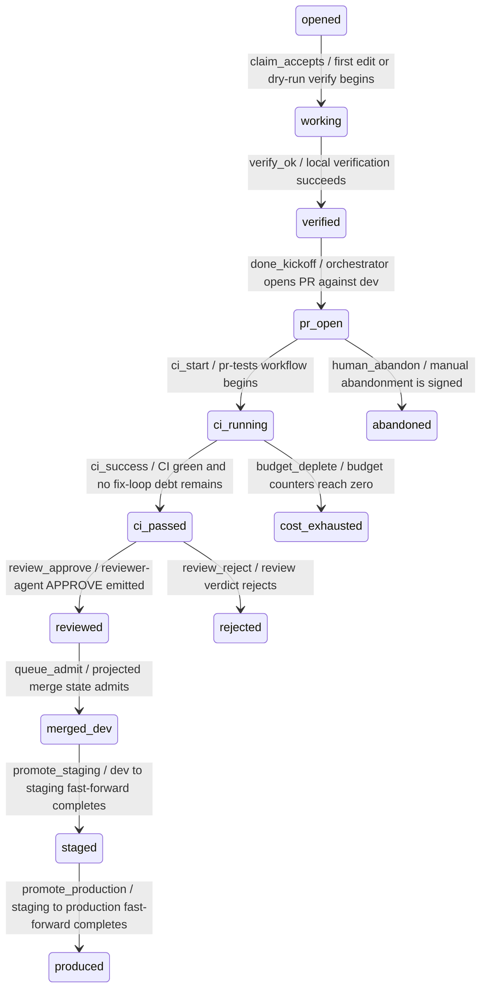

# Foundry Changeset State Machine

## Purpose

This spec defines the canonical Foundry changeset state machine, its monotonic event log, named transitions, Cedar guards, and verification gates for the internal agentic-development pipeline.

It does not define consumer AI behavior; ADR-0220 assigns tenant-facing AI to Intelligence, while this document remains internal to the foundry VCS substrate (Hermes name RETIRED per ADR-0247 D-10 + ADR-0335 D-26..D-36).

Foundry was the internal agentic-development pipeline (RETIRED per ADR-0335 Wave 15I; absorbed into intelligence): it coordinates source changes, CI evidence, reviewer decisions, merge-queue state, and promotion state for the oyatie repository.
Foundry is not a consumer-facing AI product, not a tenant assistant, and not the place where B2B or B2C prompt history is stored.
This spec turns the ADR-level decision into an operator-readable and agent-executable substrate contract.
The contract is intentionally written with RFC 2119 and RFC 8174 keywords so policy, CI, and agent prompts can parse the same text.
The control plane treats tenant_id=oyatie as the internal tenant for internal agentic-development pipeline emissions, consistent with ADR-0263.
Every state-changing step emits an audit event and a correlated observability record before a downstream state may rely on it.
The implementation boundary is the single Foundry microservice with internal bounded contexts from ADR-0136.
The repository boundary is microservices/foundry plus repo-level governance registries and docs referenced in cross-references.
The user-facing Intelligence substrate remains separate and MUST NOT be conflated with this pipeline.
The stop condition for this spec is a changeset whose evidence, policy, CI, review, queue, and promotion state can be replayed deterministically.

## Normative Requirements

The key words MUST, MUST NOT, REQUIRED, SHALL, SHALL NOT, SHOULD, SHOULD NOT, RECOMMENDED, MAY, and OPTIONAL in this section are to be interpreted as described in RFC 2119 and RFC 8174.

1. Foundry Changeset State Machine MUST ensure the state transition be written before downstream consumers act.
2. Foundry Changeset State Machine MUST ensure the state transition carry a deterministic identifier.
3. Foundry Changeset State Machine MUST ensure the state transition declare its actor, action, resource, and reason.
4. Foundry Changeset State Machine MUST ensure the state transition fail closed when required evidence is absent.
5. Foundry Changeset State Machine MUST ensure the Cedar decision be written before downstream consumers act.
6. Foundry Changeset State Machine MUST ensure the Cedar decision carry a deterministic identifier.
7. Foundry Changeset State Machine MUST ensure the Cedar decision declare its actor, action, resource, and reason.
8. Foundry Changeset State Machine MUST ensure the Cedar decision fail closed when required evidence is absent.
9. Foundry Changeset State Machine MUST ensure the audit event be written before downstream consumers act.
10. Foundry Changeset State Machine MUST ensure the audit event carry a deterministic identifier.
11. Foundry Changeset State Machine MUST ensure the audit event declare its actor, action, resource, and reason.
12. Foundry Changeset State Machine MUST ensure the audit event fail closed when required evidence is absent.
13. Foundry Changeset State Machine MUST ensure the observability emission be written before downstream consumers act.
14. Foundry Changeset State Machine MUST ensure the observability emission carry a deterministic identifier.
15. Foundry Changeset State Machine MUST ensure the observability emission declare its actor, action, resource, and reason.
16. Foundry Changeset State Machine MUST ensure the observability emission fail closed when required evidence is absent.
17. Foundry Changeset State Machine MUST ensure the evidence bundle be written before downstream consumers act.
18. Foundry Changeset State Machine MUST ensure the evidence bundle carry a deterministic identifier.
19. Foundry Changeset State Machine MUST ensure the evidence bundle declare its actor, action, resource, and reason.
20. Foundry Changeset State Machine MUST ensure the evidence bundle fail closed when required evidence is absent.
21. Foundry Changeset State Machine MUST ensure the cost budget be written before downstream consumers act.
22. Foundry Changeset State Machine MUST ensure the cost budget carry a deterministic identifier.
23. Foundry Changeset State Machine MUST ensure the cost budget declare its actor, action, resource, and reason.
24. Foundry Changeset State Machine MUST ensure the cost budget fail closed when required evidence is absent.
25. Foundry Changeset State Machine MUST ensure the idempotency key be written before downstream consumers act.
26. Foundry Changeset State Machine MUST ensure the idempotency key carry a deterministic identifier.
27. Foundry Changeset State Machine MUST ensure the idempotency key declare its actor, action, resource, and reason.
28. Foundry Changeset State Machine MUST ensure the idempotency key fail closed when required evidence is absent.
29. Foundry Changeset State Machine MUST ensure the retry branch be written before downstream consumers act.
30. Foundry Changeset State Machine MUST ensure the retry branch carry a deterministic identifier.
31. Foundry Changeset State Machine MUST ensure the retry branch declare its actor, action, resource, and reason.
32. Foundry Changeset State Machine MUST ensure the retry branch fail closed when required evidence is absent.
33. Foundry Changeset State Machine MUST ensure the reviewer verdict be written before downstream consumers act.
34. Foundry Changeset State Machine MUST ensure the reviewer verdict carry a deterministic identifier.
35. Foundry Changeset State Machine MUST ensure the reviewer verdict declare its actor, action, resource, and reason.
36. Foundry Changeset State Machine MUST ensure the reviewer verdict fail closed when required evidence is absent.
37. Foundry Changeset State Machine MUST ensure the CI status be written before downstream consumers act.
38. Foundry Changeset State Machine MUST ensure the CI status carry a deterministic identifier.
39. Foundry Changeset State Machine MUST ensure the CI status declare its actor, action, resource, and reason.
40. Foundry Changeset State Machine MUST ensure the CI status fail closed when required evidence is absent.
41. Foundry Changeset State Machine MUST ensure the worktree lane be written before downstream consumers act.
42. Foundry Changeset State Machine MUST ensure the worktree lane carry a deterministic identifier.
43. Foundry Changeset State Machine MUST ensure the worktree lane declare its actor, action, resource, and reason.
44. Foundry Changeset State Machine MUST ensure the worktree lane fail closed when required evidence is absent.
45. Foundry Changeset State Machine MUST ensure the branch reference be written before downstream consumers act.
46. Foundry Changeset State Machine MUST ensure the branch reference carry a deterministic identifier.
47. Foundry Changeset State Machine MUST ensure the branch reference declare its actor, action, resource, and reason.
48. Foundry Changeset State Machine MUST ensure the branch reference fail closed when required evidence is absent.
49. Foundry Changeset State Machine MUST ensure the merge-queue position be written before downstream consumers act.
50. Foundry Changeset State Machine MUST ensure the merge-queue position carry a deterministic identifier.
51. Foundry Changeset State Machine MUST ensure the merge-queue position declare its actor, action, resource, and reason.
52. Foundry Changeset State Machine MUST ensure the merge-queue position fail closed when required evidence is absent.
53. Foundry Changeset State Machine MUST ensure the promotion target be written before downstream consumers act.
54. Foundry Changeset State Machine MUST ensure the promotion target carry a deterministic identifier.
55. Foundry Changeset State Machine MUST ensure the promotion target declare its actor, action, resource, and reason.
56. Foundry Changeset State Machine MUST ensure the promotion target fail closed when required evidence is absent.
57. Foundry Changeset State Machine MUST ensure the human override be written before downstream consumers act.
58. Foundry Changeset State Machine MUST ensure the human override carry a deterministic identifier.
59. Foundry Changeset State Machine MUST ensure the human override declare its actor, action, resource, and reason.
60. Foundry Changeset State Machine MUST ensure the human override fail closed when required evidence is absent.
61. Foundry Changeset State Machine MUST ensure the safe-path predicate be written before downstream consumers act.
62. Foundry Changeset State Machine MUST ensure the safe-path predicate carry a deterministic identifier.
63. Foundry Changeset State Machine MUST ensure the safe-path predicate declare its actor, action, resource, and reason.
64. Foundry Changeset State Machine MUST ensure the safe-path predicate fail closed when required evidence is absent.
65. Foundry Changeset State Machine MUST ensure the OpenBao secret reference be written before downstream consumers act.
66. Foundry Changeset State Machine MUST ensure the OpenBao secret reference carry a deterministic identifier.
67. Foundry Changeset State Machine MUST ensure the OpenBao secret reference declare its actor, action, resource, and reason.
68. Foundry Changeset State Machine MUST ensure the OpenBao secret reference fail closed when required evidence is absent.
69. Foundry Changeset State Machine MUST ensure the GitHub post-back be written before downstream consumers act.
70. Foundry Changeset State Machine MUST ensure the GitHub post-back carry a deterministic identifier.
71. Foundry Changeset State Machine MUST ensure the GitHub post-back declare its actor, action, resource, and reason.
72. Foundry Changeset State Machine MUST ensure the GitHub post-back fail closed when required evidence is absent.
73. Foundry Changeset State Machine MUST ensure the multispectrum evidence be written before downstream consumers act.
74. Foundry Changeset State Machine MUST ensure the multispectrum evidence carry a deterministic identifier.
75. Foundry Changeset State Machine MUST ensure the multispectrum evidence declare its actor, action, resource, and reason.
76. Foundry Changeset State Machine MUST ensure the multispectrum evidence fail closed when required evidence is absent.
77. Foundry Changeset State Machine MUST ensure the trace context be written before downstream consumers act.
78. Foundry Changeset State Machine MUST ensure the trace context carry a deterministic identifier.
79. Foundry Changeset State Machine MUST ensure the trace context declare its actor, action, resource, and reason.
80. Foundry Changeset State Machine MUST ensure the trace context fail closed when required evidence is absent.
81. The `opened` phase SHOULD expose a machine-readable status row with actor, at, evidence_uri, trace_id, and audit_id.
82. The `working` phase SHOULD expose a machine-readable status row with actor, at, evidence_uri, trace_id, and audit_id.
83. The `verified` phase SHOULD expose a machine-readable status row with actor, at, evidence_uri, trace_id, and audit_id.
84. The `pr_open` phase SHOULD expose a machine-readable status row with actor, at, evidence_uri, trace_id, and audit_id.
85. The `ci_running` phase SHOULD expose a machine-readable status row with actor, at, evidence_uri, trace_id, and audit_id.
86. The `ci_passed` phase SHOULD expose a machine-readable status row with actor, at, evidence_uri, trace_id, and audit_id.
87. The `reviewed` phase SHOULD expose a machine-readable status row with actor, at, evidence_uri, trace_id, and audit_id.
88. The `merged_dev` phase SHOULD expose a machine-readable status row with actor, at, evidence_uri, trace_id, and audit_id.
89. The `staged` phase SHOULD expose a machine-readable status row with actor, at, evidence_uri, trace_id, and audit_id.
90. The `produced` phase SHOULD expose a machine-readable status row with actor, at, evidence_uri, trace_id, and audit_id.
91. The `abandoned` phase SHOULD expose a machine-readable status row with actor, at, evidence_uri, trace_id, and audit_id.
92. The `rejected` phase SHOULD expose a machine-readable status row with actor, at, evidence_uri, trace_id, and audit_id.
93. The `cost_exhausted` phase SHOULD expose a machine-readable status row with actor, at, evidence_uri, trace_id, and audit_id.
94. Action `foundry.changeset.claim` MUST be denied unless a matching Cedar permit binds the principal, resource, and changeset intent.
95. Action `foundry.changeset.verify` MUST be denied unless a matching Cedar permit binds the principal, resource, and changeset intent.
96. Action `foundry.changeset.done` MUST be denied unless a matching Cedar permit binds the principal, resource, and changeset intent.
97. Action `foundry.changeset.transition` MUST be denied unless a matching Cedar permit binds the principal, resource, and changeset intent.
98. Action `foundry.changeset.override` MUST be denied unless a matching Cedar permit binds the principal, resource, and changeset intent.
99. Action `foundry.evidence.append` MUST be denied unless a matching Cedar permit binds the principal, resource, and changeset intent.
100. Action `foundry.audit.seal` MUST be denied unless a matching Cedar permit binds the principal, resource, and changeset intent.
101. Implementations MAY add stricter product-local gates when they do not weaken any requirement in ADR-0110.

## State Machine / Sequence Diagram



### Named Transitions

| Transition | From | To | Guard summary | Audit event | Recovery if denied |
|---|---|---|---|---|---|
| claim_accepts | opened | working | first edit or dry-run verify begins; Cedar permit required; evidence hash present | EVT-FOUNDRY-CHANGESET-BUDGET-DEBITED | Hold at opened; append refusal reason; request fix or human override |
| verify_ok | working | verified | local verification succeeds; Cedar permit required; evidence hash present | EVT-FOUNDRY-CHANGESET-OPENED | Hold at working; append refusal reason; request fix or human override |
| done_kickoff | verified | pr_open | orchestrator opens PR against dev; Cedar permit required; evidence hash present | EVT-FOUNDRY-CHANGESET-STATE-TRANSITIONED | Hold at verified; append refusal reason; request fix or human override |
| ci_start | pr_open | ci_running | pr-tests workflow begins; Cedar permit required; evidence hash present | EVT-FOUNDRY-CHANGESET-OPENED | Hold at pr_open; append refusal reason; request fix or human override |
| ci_success | ci_running | ci_passed | CI green and no fix-loop debt remains; Cedar permit required; evidence hash present | EVT-FOUNDRY-CHANGESET-SKIP-STATE-RECORDED | Hold at ci_running; append refusal reason; request fix or human override |
| review_approve | ci_passed | reviewed | reviewer-agent APPROVE emitted; Cedar permit required; evidence hash present | EVT-FOUNDRY-CHANGESET-STATE-TRANSITIONED | Hold at ci_passed; append refusal reason; request fix or human override |
| queue_admit | reviewed | merged_dev | projected merge state admits; Cedar permit required; evidence hash present | EVT-FOUNDRY-CHANGESET-STATE-TRANSITIONED | Hold at reviewed; append refusal reason; request fix or human override |
| promote_staging | merged_dev | staged | dev to staging fast-forward completes; Cedar permit required; evidence hash present | EVT-FOUNDRY-CHANGESET-BUDGET-DEBITED | Hold at merged_dev; append refusal reason; request fix or human override |
| promote_production | staged | produced | staging to production fast-forward completes; Cedar permit required; evidence hash present | EVT-FOUNDRY-CHANGESET-SKIP-STATE-RECORDED | Hold at staged; append refusal reason; request fix or human override |
| human_abandon | pr_open | abandoned | manual abandonment is signed; Cedar permit required; evidence hash present | EVT-FOUNDRY-CHANGESET-TERMINAL-FAILED | Hold at pr_open; append refusal reason; request fix or human override |
| review_reject | ci_passed | rejected | review verdict rejects; Cedar permit required; evidence hash present | EVT-FOUNDRY-CHANGESET-STATE-TRANSITIONED | Hold at ci_passed; append refusal reason; request fix or human override |
| budget_deplete | ci_running | cost_exhausted | budget counters reach zero; Cedar permit required; evidence hash present | EVT-FOUNDRY-CHANGESET-SKIP-STATE-RECORDED | Hold at ci_running; append refusal reason; request fix or human override |
| replay-check-01 | opened | working | Replay validates opened ordering, signature, budget, and trace context | EVT-FOUNDRY-CHANGESET-OPENED | Recompute from append-only log and refuse non-monotonic row |
| replay-check-02 | working | verified | Replay validates working ordering, signature, budget, and trace context | EVT-FOUNDRY-CHANGESET-STATE-TRANSITIONED | Recompute from append-only log and refuse non-monotonic row |
| replay-check-03 | verified | pr_open | Replay validates verified ordering, signature, budget, and trace context | EVT-FOUNDRY-CHANGESET-SKIP-STATE-RECORDED | Recompute from append-only log and refuse non-monotonic row |
| replay-check-04 | pr_open | ci_running | Replay validates pr_open ordering, signature, budget, and trace context | EVT-FOUNDRY-CHANGESET-TERMINAL-FAILED | Recompute from append-only log and refuse non-monotonic row |
| replay-check-05 | ci_running | ci_passed | Replay validates ci_running ordering, signature, budget, and trace context | EVT-FOUNDRY-CHANGESET-BUDGET-DEBITED | Recompute from append-only log and refuse non-monotonic row |
| replay-check-06 | ci_passed | reviewed | Replay validates ci_passed ordering, signature, budget, and trace context | EVT-FOUNDRY-CHANGESET-OPENED | Recompute from append-only log and refuse non-monotonic row |
| replay-check-07 | reviewed | merged_dev | Replay validates reviewed ordering, signature, budget, and trace context | EVT-FOUNDRY-CHANGESET-STATE-TRANSITIONED | Recompute from append-only log and refuse non-monotonic row |
| replay-check-08 | merged_dev | staged | Replay validates merged_dev ordering, signature, budget, and trace context | EVT-FOUNDRY-CHANGESET-SKIP-STATE-RECORDED | Recompute from append-only log and refuse non-monotonic row |
| replay-check-09 | staged | produced | Replay validates staged ordering, signature, budget, and trace context | EVT-FOUNDRY-CHANGESET-TERMINAL-FAILED | Recompute from append-only log and refuse non-monotonic row |
| replay-check-10 | pr_open | abandoned | Replay validates produced ordering, signature, budget, and trace context | EVT-FOUNDRY-CHANGESET-BUDGET-DEBITED | Recompute from append-only log and refuse non-monotonic row |
| replay-check-11 | ci_passed | rejected | Replay validates abandoned ordering, signature, budget, and trace context | EVT-FOUNDRY-CHANGESET-OPENED | Recompute from append-only log and refuse non-monotonic row |
| replay-check-12 | ci_running | cost_exhausted | Replay validates rejected ordering, signature, budget, and trace context | EVT-FOUNDRY-CHANGESET-STATE-TRANSITIONED | Recompute from append-only log and refuse non-monotonic row |
| replay-check-13 | opened | working | Replay validates cost_exhausted ordering, signature, budget, and trace context | EVT-FOUNDRY-CHANGESET-SKIP-STATE-RECORDED | Recompute from append-only log and refuse non-monotonic row |
| replay-check-14 | working | verified | Replay validates opened ordering, signature, budget, and trace context | EVT-FOUNDRY-CHANGESET-TERMINAL-FAILED | Recompute from append-only log and refuse non-monotonic row |
| replay-check-15 | verified | pr_open | Replay validates working ordering, signature, budget, and trace context | EVT-FOUNDRY-CHANGESET-BUDGET-DEBITED | Recompute from append-only log and refuse non-monotonic row |
| replay-check-16 | pr_open | ci_running | Replay validates verified ordering, signature, budget, and trace context | EVT-FOUNDRY-CHANGESET-OPENED | Recompute from append-only log and refuse non-monotonic row |
| replay-check-17 | ci_running | ci_passed | Replay validates pr_open ordering, signature, budget, and trace context | EVT-FOUNDRY-CHANGESET-STATE-TRANSITIONED | Recompute from append-only log and refuse non-monotonic row |
| replay-check-18 | ci_passed | reviewed | Replay validates ci_running ordering, signature, budget, and trace context | EVT-FOUNDRY-CHANGESET-SKIP-STATE-RECORDED | Recompute from append-only log and refuse non-monotonic row |
| replay-check-19 | reviewed | merged_dev | Replay validates ci_passed ordering, signature, budget, and trace context | EVT-FOUNDRY-CHANGESET-TERMINAL-FAILED | Recompute from append-only log and refuse non-monotonic row |
| replay-check-20 | merged_dev | staged | Replay validates reviewed ordering, signature, budget, and trace context | EVT-FOUNDRY-CHANGESET-BUDGET-DEBITED | Recompute from append-only log and refuse non-monotonic row |
| replay-check-21 | staged | produced | Replay validates merged_dev ordering, signature, budget, and trace context | EVT-FOUNDRY-CHANGESET-OPENED | Recompute from append-only log and refuse non-monotonic row |
| replay-check-22 | pr_open | abandoned | Replay validates staged ordering, signature, budget, and trace context | EVT-FOUNDRY-CHANGESET-STATE-TRANSITIONED | Recompute from append-only log and refuse non-monotonic row |
| replay-check-23 | ci_passed | rejected | Replay validates produced ordering, signature, budget, and trace context | EVT-FOUNDRY-CHANGESET-SKIP-STATE-RECORDED | Recompute from append-only log and refuse non-monotonic row |
| replay-check-24 | ci_running | cost_exhausted | Replay validates abandoned ordering, signature, budget, and trace context | EVT-FOUNDRY-CHANGESET-TERMINAL-FAILED | Recompute from append-only log and refuse non-monotonic row |
| replay-check-25 | opened | working | Replay validates rejected ordering, signature, budget, and trace context | EVT-FOUNDRY-CHANGESET-BUDGET-DEBITED | Recompute from append-only log and refuse non-monotonic row |
| replay-check-26 | working | verified | Replay validates cost_exhausted ordering, signature, budget, and trace context | EVT-FOUNDRY-CHANGESET-OPENED | Recompute from append-only log and refuse non-monotonic row |
| replay-check-27 | verified | pr_open | Replay validates opened ordering, signature, budget, and trace context | EVT-FOUNDRY-CHANGESET-STATE-TRANSITIONED | Recompute from append-only log and refuse non-monotonic row |
| replay-check-28 | pr_open | ci_running | Replay validates working ordering, signature, budget, and trace context | EVT-FOUNDRY-CHANGESET-SKIP-STATE-RECORDED | Recompute from append-only log and refuse non-monotonic row |
| replay-check-29 | ci_running | ci_passed | Replay validates verified ordering, signature, budget, and trace context | EVT-FOUNDRY-CHANGESET-TERMINAL-FAILED | Recompute from append-only log and refuse non-monotonic row |
| replay-check-30 | ci_passed | reviewed | Replay validates pr_open ordering, signature, budget, and trace context | EVT-FOUNDRY-CHANGESET-BUDGET-DEBITED | Recompute from append-only log and refuse non-monotonic row |
| replay-check-31 | reviewed | merged_dev | Replay validates ci_running ordering, signature, budget, and trace context | EVT-FOUNDRY-CHANGESET-OPENED | Recompute from append-only log and refuse non-monotonic row |
| replay-check-32 | merged_dev | staged | Replay validates ci_passed ordering, signature, budget, and trace context | EVT-FOUNDRY-CHANGESET-STATE-TRANSITIONED | Recompute from append-only log and refuse non-monotonic row |
| replay-check-33 | staged | produced | Replay validates reviewed ordering, signature, budget, and trace context | EVT-FOUNDRY-CHANGESET-SKIP-STATE-RECORDED | Recompute from append-only log and refuse non-monotonic row |
| replay-check-34 | pr_open | abandoned | Replay validates merged_dev ordering, signature, budget, and trace context | EVT-FOUNDRY-CHANGESET-TERMINAL-FAILED | Recompute from append-only log and refuse non-monotonic row |
| replay-check-35 | ci_passed | rejected | Replay validates staged ordering, signature, budget, and trace context | EVT-FOUNDRY-CHANGESET-BUDGET-DEBITED | Recompute from append-only log and refuse non-monotonic row |
| replay-check-36 | ci_running | cost_exhausted | Replay validates produced ordering, signature, budget, and trace context | EVT-FOUNDRY-CHANGESET-OPENED | Recompute from append-only log and refuse non-monotonic row |
| replay-check-37 | opened | working | Replay validates abandoned ordering, signature, budget, and trace context | EVT-FOUNDRY-CHANGESET-STATE-TRANSITIONED | Recompute from append-only log and refuse non-monotonic row |
| replay-check-38 | working | verified | Replay validates rejected ordering, signature, budget, and trace context | EVT-FOUNDRY-CHANGESET-SKIP-STATE-RECORDED | Recompute from append-only log and refuse non-monotonic row |
| replay-check-39 | verified | pr_open | Replay validates cost_exhausted ordering, signature, budget, and trace context | EVT-FOUNDRY-CHANGESET-TERMINAL-FAILED | Recompute from append-only log and refuse non-monotonic row |
| replay-check-40 | pr_open | ci_running | Replay validates opened ordering, signature, budget, and trace context | EVT-FOUNDRY-CHANGESET-BUDGET-DEBITED | Recompute from append-only log and refuse non-monotonic row |
| replay-check-41 | ci_running | ci_passed | Replay validates working ordering, signature, budget, and trace context | EVT-FOUNDRY-CHANGESET-OPENED | Recompute from append-only log and refuse non-monotonic row |
| replay-check-42 | ci_passed | reviewed | Replay validates verified ordering, signature, budget, and trace context | EVT-FOUNDRY-CHANGESET-STATE-TRANSITIONED | Recompute from append-only log and refuse non-monotonic row |
| replay-check-43 | reviewed | merged_dev | Replay validates pr_open ordering, signature, budget, and trace context | EVT-FOUNDRY-CHANGESET-SKIP-STATE-RECORDED | Recompute from append-only log and refuse non-monotonic row |
| replay-check-44 | merged_dev | staged | Replay validates ci_running ordering, signature, budget, and trace context | EVT-FOUNDRY-CHANGESET-TERMINAL-FAILED | Recompute from append-only log and refuse non-monotonic row |
| replay-check-45 | staged | produced | Replay validates ci_passed ordering, signature, budget, and trace context | EVT-FOUNDRY-CHANGESET-BUDGET-DEBITED | Recompute from append-only log and refuse non-monotonic row |
| replay-check-46 | pr_open | abandoned | Replay validates reviewed ordering, signature, budget, and trace context | EVT-FOUNDRY-CHANGESET-OPENED | Recompute from append-only log and refuse non-monotonic row |
| replay-check-47 | ci_passed | rejected | Replay validates merged_dev ordering, signature, budget, and trace context | EVT-FOUNDRY-CHANGESET-STATE-TRANSITIONED | Recompute from append-only log and refuse non-monotonic row |
| replay-check-48 | ci_running | cost_exhausted | Replay validates staged ordering, signature, budget, and trace context | EVT-FOUNDRY-CHANGESET-SKIP-STATE-RECORDED | Recompute from append-only log and refuse non-monotonic row |
| replay-check-49 | opened | working | Replay validates produced ordering, signature, budget, and trace context | EVT-FOUNDRY-CHANGESET-TERMINAL-FAILED | Recompute from append-only log and refuse non-monotonic row |
| replay-check-50 | working | verified | Replay validates abandoned ordering, signature, budget, and trace context | EVT-FOUNDRY-CHANGESET-BUDGET-DEBITED | Recompute from append-only log and refuse non-monotonic row |
| replay-check-51 | verified | pr_open | Replay validates rejected ordering, signature, budget, and trace context | EVT-FOUNDRY-CHANGESET-OPENED | Recompute from append-only log and refuse non-monotonic row |
| replay-check-52 | pr_open | ci_running | Replay validates cost_exhausted ordering, signature, budget, and trace context | EVT-FOUNDRY-CHANGESET-STATE-TRANSITIONED | Recompute from append-only log and refuse non-monotonic row |
| replay-check-53 | ci_running | ci_passed | Replay validates opened ordering, signature, budget, and trace context | EVT-FOUNDRY-CHANGESET-SKIP-STATE-RECORDED | Recompute from append-only log and refuse non-monotonic row |
| replay-check-54 | ci_passed | reviewed | Replay validates working ordering, signature, budget, and trace context | EVT-FOUNDRY-CHANGESET-TERMINAL-FAILED | Recompute from append-only log and refuse non-monotonic row |

## Cedar Policy Bindings

The bindings below use specific internal principals, actions, and resources. A deny from any narrower policy wins over these permits.

| Binding | Principal | Action | Resource | Required context | Decision |
|---|---|---|---|---|---|
| B-001 | Principal::"oyatie.agent.codex" | Action::"foundry.changeset.claim" | Resource::"state-log:registry/vcs/changeset-event-log.json" | workflow=governance_pipeline; tenant_id=oyatie; intent=changeset-state-machine | permit when evidence_hash and changeset_id are present |
| B-002 | Principal::"oyatie.agent.codex" | Action::"foundry.changeset.verify" | Resource::"budget:changeset-cost-budget" | workflow=governance_pipeline; tenant_id=oyatie; intent=changeset-state-machine | permit when evidence_hash and changeset_id are present |
| B-003 | Principal::"oyatie.agent.codex" | Action::"foundry.changeset.done" | Resource::"repo:oyatie/microservices/foundry" | workflow=governance_pipeline; tenant_id=oyatie; intent=changeset-state-machine | permit when evidence_hash and changeset_id are present |
| B-004 | Principal::"oyatie.agent.codex" | Action::"foundry.changeset.transition" | Resource::"branch:dev" | workflow=governance_pipeline; tenant_id=oyatie; intent=changeset-state-machine | permit when evidence_hash and changeset_id are present |
| B-005 | Principal::"oyatie.agent.codex" | Action::"foundry.changeset.override" | Resource::"queue:foundry-dev" | workflow=governance_pipeline; tenant_id=oyatie; intent=changeset-state-machine | permit when evidence_hash and changeset_id are present |
| B-006 | Principal::"oyatie.agent.claude-opus" | Action::"foundry.changeset.claim" | Resource::"event-log:registry/vcs/changeset-event-log.json" | workflow=governance_pipeline; tenant_id=oyatie; intent=changeset-state-machine | permit when evidence_hash and changeset_id are present |
| B-007 | Principal::"oyatie.agent.claude-opus" | Action::"foundry.changeset.verify" | Resource::"event-router:registry/vcs/event-router.yaml" | workflow=governance_pipeline; tenant_id=oyatie; intent=changeset-state-machine | permit when evidence_hash and changeset_id are present |
| B-008 | Principal::"oyatie.agent.claude-opus" | Action::"foundry.changeset.done" | Resource::"safe-paths:registry/vcs/concurrent-safe-paths.yaml" | workflow=governance_pipeline; tenant_id=oyatie; intent=changeset-state-machine | permit when evidence_hash and changeset_id are present |
| B-009 | Principal::"oyatie.agent.claude-opus" | Action::"foundry.changeset.transition" | Resource::"evidence:evidence/multispectrum" | workflow=governance_pipeline; tenant_id=oyatie; intent=changeset-state-machine | permit when evidence_hash and changeset_id are present |
| B-010 | Principal::"oyatie.agent.claude-opus" | Action::"foundry.changeset.override" | Resource::"audit:event-class/foundry" | workflow=governance_pipeline; tenant_id=oyatie; intent=changeset-state-machine | permit when evidence_hash and changeset_id are present |
| B-011 | Principal::"oyatie.agent.planner" | Action::"foundry.changeset.claim" | Resource::"changeset:cs_*" | workflow=governance_pipeline; tenant_id=oyatie; intent=changeset-state-machine | permit when evidence_hash and changeset_id are present |
| B-012 | Principal::"oyatie.agent.planner" | Action::"foundry.changeset.verify" | Resource::"state-log:registry/vcs/changeset-event-log.json" | workflow=governance_pipeline; tenant_id=oyatie; intent=changeset-state-machine | permit when evidence_hash and changeset_id are present |
| B-013 | Principal::"oyatie.agent.planner" | Action::"foundry.changeset.done" | Resource::"budget:changeset-cost-budget" | workflow=governance_pipeline; tenant_id=oyatie; intent=changeset-state-machine | permit when evidence_hash and changeset_id are present |
| B-014 | Principal::"oyatie.agent.planner" | Action::"foundry.changeset.transition" | Resource::"repo:oyatie/microservices/foundry" | workflow=governance_pipeline; tenant_id=oyatie; intent=changeset-state-machine | permit when evidence_hash and changeset_id are present |
| B-015 | Principal::"oyatie.agent.planner" | Action::"foundry.changeset.override" | Resource::"branch:dev" | workflow=governance_pipeline; tenant_id=oyatie; intent=changeset-state-machine | permit when evidence_hash and changeset_id are present |
| B-016 | Principal::"oyatie.agent.executor" | Action::"foundry.changeset.claim" | Resource::"queue:foundry-dev" | workflow=governance_pipeline; tenant_id=oyatie; intent=changeset-state-machine | permit when evidence_hash and changeset_id are present |
| B-017 | Principal::"oyatie.agent.executor" | Action::"foundry.changeset.verify" | Resource::"event-log:registry/vcs/changeset-event-log.json" | workflow=governance_pipeline; tenant_id=oyatie; intent=changeset-state-machine | permit when evidence_hash and changeset_id are present |
| B-018 | Principal::"oyatie.agent.executor" | Action::"foundry.changeset.done" | Resource::"event-router:registry/vcs/event-router.yaml" | workflow=governance_pipeline; tenant_id=oyatie; intent=changeset-state-machine | permit when evidence_hash and changeset_id are present |
| B-019 | Principal::"oyatie.agent.executor" | Action::"foundry.changeset.transition" | Resource::"safe-paths:registry/vcs/concurrent-safe-paths.yaml" | workflow=governance_pipeline; tenant_id=oyatie; intent=changeset-state-machine | permit when evidence_hash and changeset_id are present |
| B-020 | Principal::"oyatie.agent.executor" | Action::"foundry.changeset.override" | Resource::"evidence:evidence/multispectrum" | workflow=governance_pipeline; tenant_id=oyatie; intent=changeset-state-machine | permit when evidence_hash and changeset_id are present |
| B-021 | Principal::"oyatie.service.vcs-orchestrator" | Action::"foundry.changeset.claim" | Resource::"audit:event-class/foundry" | workflow=governance_pipeline; tenant_id=oyatie; intent=changeset-state-machine | permit when evidence_hash and changeset_id are present |
| B-022 | Principal::"oyatie.service.vcs-orchestrator" | Action::"foundry.changeset.verify" | Resource::"changeset:cs_*" | workflow=governance_pipeline; tenant_id=oyatie; intent=changeset-state-machine | permit when evidence_hash and changeset_id are present |
| B-023 | Principal::"oyatie.service.vcs-orchestrator" | Action::"foundry.changeset.done" | Resource::"state-log:registry/vcs/changeset-event-log.json" | workflow=governance_pipeline; tenant_id=oyatie; intent=changeset-state-machine | permit when evidence_hash and changeset_id are present |
| B-024 | Principal::"oyatie.service.vcs-orchestrator" | Action::"foundry.changeset.transition" | Resource::"budget:changeset-cost-budget" | workflow=governance_pipeline; tenant_id=oyatie; intent=changeset-state-machine | permit when evidence_hash and changeset_id are present |
| B-025 | Principal::"oyatie.service.vcs-orchestrator" | Action::"foundry.changeset.override" | Resource::"repo:oyatie/microservices/foundry" | workflow=governance_pipeline; tenant_id=oyatie; intent=changeset-state-machine | permit when evidence_hash and changeset_id are present |
| B-026 | Principal::"oyatie.service.webhook-receiver" | Action::"foundry.changeset.claim" | Resource::"branch:dev" | workflow=governance_pipeline; tenant_id=oyatie; intent=changeset-state-machine | permit when evidence_hash and changeset_id are present |
| B-027 | Principal::"oyatie.service.webhook-receiver" | Action::"foundry.changeset.verify" | Resource::"queue:foundry-dev" | workflow=governance_pipeline; tenant_id=oyatie; intent=changeset-state-machine | permit when evidence_hash and changeset_id are present |
| B-028 | Principal::"oyatie.service.webhook-receiver" | Action::"foundry.changeset.done" | Resource::"event-log:registry/vcs/changeset-event-log.json" | workflow=governance_pipeline; tenant_id=oyatie; intent=changeset-state-machine | permit when evidence_hash and changeset_id are present |
| B-029 | Principal::"oyatie.service.webhook-receiver" | Action::"foundry.changeset.transition" | Resource::"event-router:registry/vcs/event-router.yaml" | workflow=governance_pipeline; tenant_id=oyatie; intent=changeset-state-machine | permit when evidence_hash and changeset_id are present |
| B-030 | Principal::"oyatie.service.webhook-receiver" | Action::"foundry.changeset.override" | Resource::"safe-paths:registry/vcs/concurrent-safe-paths.yaml" | workflow=governance_pipeline; tenant_id=oyatie; intent=changeset-state-machine | permit when evidence_hash and changeset_id are present |
| B-031 | Principal::"oyatie.service.merge-queue" | Action::"foundry.changeset.claim" | Resource::"evidence:evidence/multispectrum" | workflow=governance_pipeline; tenant_id=oyatie; intent=changeset-state-machine | permit when evidence_hash and changeset_id are present |
| B-032 | Principal::"oyatie.service.merge-queue" | Action::"foundry.changeset.verify" | Resource::"audit:event-class/foundry" | workflow=governance_pipeline; tenant_id=oyatie; intent=changeset-state-machine | permit when evidence_hash and changeset_id are present |
| B-033 | Principal::"oyatie.service.merge-queue" | Action::"foundry.changeset.done" | Resource::"changeset:cs_*" | workflow=governance_pipeline; tenant_id=oyatie; intent=changeset-state-machine | permit when evidence_hash and changeset_id are present |
| B-034 | Principal::"oyatie.service.merge-queue" | Action::"foundry.changeset.transition" | Resource::"state-log:registry/vcs/changeset-event-log.json" | workflow=governance_pipeline; tenant_id=oyatie; intent=changeset-state-machine | permit when evidence_hash and changeset_id are present |
| B-035 | Principal::"oyatie.service.merge-queue" | Action::"foundry.changeset.override" | Resource::"budget:changeset-cost-budget" | workflow=governance_pipeline; tenant_id=oyatie; intent=changeset-state-machine | permit when evidence_hash and changeset_id are present |
| B-036 | Principal::"oyatie.service.admission-gate" | Action::"foundry.changeset.claim" | Resource::"repo:oyatie/microservices/foundry" | workflow=governance_pipeline; tenant_id=oyatie; intent=changeset-state-machine | permit when evidence_hash and changeset_id are present |
| B-037 | Principal::"oyatie.service.admission-gate" | Action::"foundry.changeset.verify" | Resource::"branch:dev" | workflow=governance_pipeline; tenant_id=oyatie; intent=changeset-state-machine | permit when evidence_hash and changeset_id are present |
| B-038 | Principal::"oyatie.service.admission-gate" | Action::"foundry.changeset.done" | Resource::"queue:foundry-dev" | workflow=governance_pipeline; tenant_id=oyatie; intent=changeset-state-machine | permit when evidence_hash and changeset_id are present |
| B-039 | Principal::"oyatie.service.admission-gate" | Action::"foundry.changeset.transition" | Resource::"event-log:registry/vcs/changeset-event-log.json" | workflow=governance_pipeline; tenant_id=oyatie; intent=changeset-state-machine | permit when evidence_hash and changeset_id are present |
| B-040 | Principal::"oyatie.service.admission-gate" | Action::"foundry.changeset.override" | Resource::"event-router:registry/vcs/event-router.yaml" | workflow=governance_pipeline; tenant_id=oyatie; intent=changeset-state-machine | permit when evidence_hash and changeset_id are present |
| B-041 | Principal::"oyatie.service.completion-gate" | Action::"foundry.changeset.claim" | Resource::"safe-paths:registry/vcs/concurrent-safe-paths.yaml" | workflow=governance_pipeline; tenant_id=oyatie; intent=changeset-state-machine | permit when evidence_hash and changeset_id are present |
| B-042 | Principal::"oyatie.service.completion-gate" | Action::"foundry.changeset.verify" | Resource::"evidence:evidence/multispectrum" | workflow=governance_pipeline; tenant_id=oyatie; intent=changeset-state-machine | permit when evidence_hash and changeset_id are present |
| B-043 | Principal::"oyatie.service.completion-gate" | Action::"foundry.changeset.done" | Resource::"audit:event-class/foundry" | workflow=governance_pipeline; tenant_id=oyatie; intent=changeset-state-machine | permit when evidence_hash and changeset_id are present |
| B-044 | Principal::"oyatie.service.completion-gate" | Action::"foundry.changeset.transition" | Resource::"changeset:cs_*" | workflow=governance_pipeline; tenant_id=oyatie; intent=changeset-state-machine | permit when evidence_hash and changeset_id are present |
| B-045 | Principal::"oyatie.service.completion-gate" | Action::"foundry.changeset.override" | Resource::"state-log:registry/vcs/changeset-event-log.json" | workflow=governance_pipeline; tenant_id=oyatie; intent=changeset-state-machine | permit when evidence_hash and changeset_id are present |
| B-046 | Principal::"oyatie.human.reviewer" | Action::"foundry.changeset.claim" | Resource::"budget:changeset-cost-budget" | workflow=governance_pipeline; tenant_id=oyatie; intent=changeset-state-machine | permit when evidence_hash and changeset_id are present |
| B-047 | Principal::"oyatie.human.reviewer" | Action::"foundry.changeset.verify" | Resource::"repo:oyatie/microservices/foundry" | workflow=governance_pipeline; tenant_id=oyatie; intent=changeset-state-machine | permit when evidence_hash and changeset_id are present |
| B-048 | Principal::"oyatie.human.reviewer" | Action::"foundry.changeset.done" | Resource::"branch:dev" | workflow=governance_pipeline; tenant_id=oyatie; intent=changeset-state-machine | permit when evidence_hash and changeset_id are present |
| B-049 | Principal::"oyatie.human.reviewer" | Action::"foundry.changeset.transition" | Resource::"queue:foundry-dev" | workflow=governance_pipeline; tenant_id=oyatie; intent=changeset-state-machine | permit when evidence_hash and changeset_id are present |
| B-050 | Principal::"oyatie.human.reviewer" | Action::"foundry.changeset.override" | Resource::"event-log:registry/vcs/changeset-event-log.json" | workflow=governance_pipeline; tenant_id=oyatie; intent=changeset-state-machine | permit when evidence_hash and changeset_id are present |

```cedar
permit(
  principal in Principal::"oyatie.agent.codex",
  action == Action::"foundry.changeset.claim",
  resource in Resource::"repo:oyatie/microservices/foundry"
) when {
  context.tenant_id == "oyatie" &&
  context.workflow == "governance_pipeline" &&
  context.related_adr == "ADR-0110" &&
  context.evidence_hash != "" &&
  context.trace_id != ""
};

permit(
  principal in Principal::"oyatie.agent.codex",
  action == Action::"foundry.changeset.verify",
  resource in Resource::"repo:oyatie/microservices/foundry"
) when {
  context.tenant_id == "oyatie" &&
  context.workflow == "governance_pipeline" &&
  context.related_adr == "ADR-0110" &&
  context.evidence_hash != "" &&
  context.trace_id != ""
};

permit(
  principal in Principal::"oyatie.agent.codex",
  action == Action::"foundry.changeset.done",
  resource in Resource::"repo:oyatie/microservices/foundry"
) when {
  context.tenant_id == "oyatie" &&
  context.workflow == "governance_pipeline" &&
  context.related_adr == "ADR-0110" &&
  context.evidence_hash != "" &&
  context.trace_id != ""
};

permit(
  principal in Principal::"oyatie.agent.codex",
  action == Action::"foundry.changeset.transition",
  resource in Resource::"repo:oyatie/microservices/foundry"
) when {
  context.tenant_id == "oyatie" &&
  context.workflow == "governance_pipeline" &&
  context.related_adr == "ADR-0110" &&
  context.evidence_hash != "" &&
  context.trace_id != ""
};

forbid(
  principal,
  action,
  resource in Resource::"repo:oyatie/microservices/foundry/decisions"
) when {
  context.intent == "changeset-state-machine" &&
  context.owner != "per-msvc-adrs-batch-d"
};
```

### Cedar Guard Catalog

- Guard 01: Principal::"oyatie.agent.codex" may invoke foundry.changeset.claim on Resource::"changeset:cs_*" only while `opened` is current, the changeset id is stable, the event is signed, and the ADR-0110 invariant is cited.
- Guard 02: Principal::"oyatie.agent.claude-opus" may invoke foundry.changeset.verify on Resource::"state-log:registry/vcs/changeset-event-log.json" only while `working` is current, the changeset id is stable, the event is signed, and the ADR-0110 invariant is cited.
- Guard 03: Principal::"oyatie.agent.planner" may invoke foundry.changeset.done on Resource::"budget:changeset-cost-budget" only while `verified` is current, the changeset id is stable, the event is signed, and the ADR-0110 invariant is cited.
- Guard 04: Principal::"oyatie.agent.executor" may invoke foundry.changeset.transition on Resource::"repo:oyatie/microservices/foundry" only while `pr_open` is current, the changeset id is stable, the event is signed, and the ADR-0110 invariant is cited.
- Guard 05: Principal::"oyatie.service.vcs-orchestrator" may invoke foundry.changeset.override on Resource::"branch:dev" only while `ci_running` is current, the changeset id is stable, the event is signed, and the ADR-0110 invariant is cited.
- Guard 06: Principal::"oyatie.service.webhook-receiver" may invoke foundry.evidence.append on Resource::"queue:foundry-dev" only while `ci_passed` is current, the changeset id is stable, the event is signed, and the ADR-0110 invariant is cited.
- Guard 07: Principal::"oyatie.service.merge-queue" may invoke foundry.audit.seal on Resource::"event-log:registry/vcs/changeset-event-log.json" only while `reviewed` is current, the changeset id is stable, the event is signed, and the ADR-0110 invariant is cited.
- Guard 08: Principal::"oyatie.service.admission-gate" may invoke foundry.changeset.claim on Resource::"event-router:registry/vcs/event-router.yaml" only while `merged_dev` is current, the changeset id is stable, the event is signed, and the ADR-0110 invariant is cited.
- Guard 09: Principal::"oyatie.service.completion-gate" may invoke foundry.changeset.verify on Resource::"safe-paths:registry/vcs/concurrent-safe-paths.yaml" only while `staged` is current, the changeset id is stable, the event is signed, and the ADR-0110 invariant is cited.
- Guard 10: Principal::"oyatie.human.reviewer" may invoke foundry.changeset.done on Resource::"evidence:evidence/multispectrum" only while `produced` is current, the changeset id is stable, the event is signed, and the ADR-0110 invariant is cited.
- Guard 11: Principal::"oyatie.agent.codex" may invoke foundry.changeset.transition on Resource::"audit:event-class/foundry" only while `abandoned` is current, the changeset id is stable, the event is signed, and the ADR-0110 invariant is cited.
- Guard 12: Principal::"oyatie.agent.claude-opus" may invoke foundry.changeset.override on Resource::"changeset:cs_*" only while `rejected` is current, the changeset id is stable, the event is signed, and the ADR-0110 invariant is cited.
- Guard 13: Principal::"oyatie.agent.planner" may invoke foundry.evidence.append on Resource::"state-log:registry/vcs/changeset-event-log.json" only while `cost_exhausted` is current, the changeset id is stable, the event is signed, and the ADR-0110 invariant is cited.
- Guard 14: Principal::"oyatie.agent.executor" may invoke foundry.audit.seal on Resource::"budget:changeset-cost-budget" only while `opened` is current, the changeset id is stable, the event is signed, and the ADR-0110 invariant is cited.
- Guard 15: Principal::"oyatie.service.vcs-orchestrator" may invoke foundry.changeset.claim on Resource::"repo:oyatie/microservices/foundry" only while `working` is current, the changeset id is stable, the event is signed, and the ADR-0110 invariant is cited.
- Guard 16: Principal::"oyatie.service.webhook-receiver" may invoke foundry.changeset.verify on Resource::"branch:dev" only while `verified` is current, the changeset id is stable, the event is signed, and the ADR-0110 invariant is cited.
- Guard 17: Principal::"oyatie.service.merge-queue" may invoke foundry.changeset.done on Resource::"queue:foundry-dev" only while `pr_open` is current, the changeset id is stable, the event is signed, and the ADR-0110 invariant is cited.
- Guard 18: Principal::"oyatie.service.admission-gate" may invoke foundry.changeset.transition on Resource::"event-log:registry/vcs/changeset-event-log.json" only while `ci_running` is current, the changeset id is stable, the event is signed, and the ADR-0110 invariant is cited.
- Guard 19: Principal::"oyatie.service.completion-gate" may invoke foundry.changeset.override on Resource::"event-router:registry/vcs/event-router.yaml" only while `ci_passed` is current, the changeset id is stable, the event is signed, and the ADR-0110 invariant is cited.
- Guard 20: Principal::"oyatie.human.reviewer" may invoke foundry.evidence.append on Resource::"safe-paths:registry/vcs/concurrent-safe-paths.yaml" only while `reviewed` is current, the changeset id is stable, the event is signed, and the ADR-0110 invariant is cited.
- Guard 21: Principal::"oyatie.agent.codex" may invoke foundry.audit.seal on Resource::"evidence:evidence/multispectrum" only while `merged_dev` is current, the changeset id is stable, the event is signed, and the ADR-0110 invariant is cited.
- Guard 22: Principal::"oyatie.agent.claude-opus" may invoke foundry.changeset.claim on Resource::"audit:event-class/foundry" only while `staged` is current, the changeset id is stable, the event is signed, and the ADR-0110 invariant is cited.
- Guard 23: Principal::"oyatie.agent.planner" may invoke foundry.changeset.verify on Resource::"changeset:cs_*" only while `produced` is current, the changeset id is stable, the event is signed, and the ADR-0110 invariant is cited.
- Guard 24: Principal::"oyatie.agent.executor" may invoke foundry.changeset.done on Resource::"state-log:registry/vcs/changeset-event-log.json" only while `abandoned` is current, the changeset id is stable, the event is signed, and the ADR-0110 invariant is cited.
- Guard 25: Principal::"oyatie.service.vcs-orchestrator" may invoke foundry.changeset.transition on Resource::"budget:changeset-cost-budget" only while `rejected` is current, the changeset id is stable, the event is signed, and the ADR-0110 invariant is cited.
- Guard 26: Principal::"oyatie.service.webhook-receiver" may invoke foundry.changeset.override on Resource::"repo:oyatie/microservices/foundry" only while `cost_exhausted` is current, the changeset id is stable, the event is signed, and the ADR-0110 invariant is cited.
- Guard 27: Principal::"oyatie.service.merge-queue" may invoke foundry.evidence.append on Resource::"branch:dev" only while `opened` is current, the changeset id is stable, the event is signed, and the ADR-0110 invariant is cited.
- Guard 28: Principal::"oyatie.service.admission-gate" may invoke foundry.audit.seal on Resource::"queue:foundry-dev" only while `working` is current, the changeset id is stable, the event is signed, and the ADR-0110 invariant is cited.
- Guard 29: Principal::"oyatie.service.completion-gate" may invoke foundry.changeset.claim on Resource::"event-log:registry/vcs/changeset-event-log.json" only while `verified` is current, the changeset id is stable, the event is signed, and the ADR-0110 invariant is cited.
- Guard 30: Principal::"oyatie.human.reviewer" may invoke foundry.changeset.verify on Resource::"event-router:registry/vcs/event-router.yaml" only while `pr_open` is current, the changeset id is stable, the event is signed, and the ADR-0110 invariant is cited.
- Guard 31: Principal::"oyatie.agent.codex" may invoke foundry.changeset.done on Resource::"safe-paths:registry/vcs/concurrent-safe-paths.yaml" only while `ci_running` is current, the changeset id is stable, the event is signed, and the ADR-0110 invariant is cited.
- Guard 32: Principal::"oyatie.agent.claude-opus" may invoke foundry.changeset.transition on Resource::"evidence:evidence/multispectrum" only while `ci_passed` is current, the changeset id is stable, the event is signed, and the ADR-0110 invariant is cited.
- Guard 33: Principal::"oyatie.agent.planner" may invoke foundry.changeset.override on Resource::"audit:event-class/foundry" only while `reviewed` is current, the changeset id is stable, the event is signed, and the ADR-0110 invariant is cited.
- Guard 34: Principal::"oyatie.agent.executor" may invoke foundry.evidence.append on Resource::"changeset:cs_*" only while `merged_dev` is current, the changeset id is stable, the event is signed, and the ADR-0110 invariant is cited.
- Guard 35: Principal::"oyatie.service.vcs-orchestrator" may invoke foundry.audit.seal on Resource::"state-log:registry/vcs/changeset-event-log.json" only while `staged` is current, the changeset id is stable, the event is signed, and the ADR-0110 invariant is cited.
- Guard 36: Principal::"oyatie.service.webhook-receiver" may invoke foundry.changeset.claim on Resource::"budget:changeset-cost-budget" only while `produced` is current, the changeset id is stable, the event is signed, and the ADR-0110 invariant is cited.
- Guard 37: Principal::"oyatie.service.merge-queue" may invoke foundry.changeset.verify on Resource::"repo:oyatie/microservices/foundry" only while `abandoned` is current, the changeset id is stable, the event is signed, and the ADR-0110 invariant is cited.
- Guard 38: Principal::"oyatie.service.admission-gate" may invoke foundry.changeset.done on Resource::"branch:dev" only while `rejected` is current, the changeset id is stable, the event is signed, and the ADR-0110 invariant is cited.
- Guard 39: Principal::"oyatie.service.completion-gate" may invoke foundry.changeset.transition on Resource::"queue:foundry-dev" only while `cost_exhausted` is current, the changeset id is stable, the event is signed, and the ADR-0110 invariant is cited.
- Guard 40: Principal::"oyatie.human.reviewer" may invoke foundry.changeset.override on Resource::"event-log:registry/vcs/changeset-event-log.json" only while `opened` is current, the changeset id is stable, the event is signed, and the ADR-0110 invariant is cited.
- Guard 41: Principal::"oyatie.agent.codex" may invoke foundry.evidence.append on Resource::"event-router:registry/vcs/event-router.yaml" only while `working` is current, the changeset id is stable, the event is signed, and the ADR-0110 invariant is cited.
- Guard 42: Principal::"oyatie.agent.claude-opus" may invoke foundry.audit.seal on Resource::"safe-paths:registry/vcs/concurrent-safe-paths.yaml" only while `verified` is current, the changeset id is stable, the event is signed, and the ADR-0110 invariant is cited.
- Guard 43: Principal::"oyatie.agent.planner" may invoke foundry.changeset.claim on Resource::"evidence:evidence/multispectrum" only while `pr_open` is current, the changeset id is stable, the event is signed, and the ADR-0110 invariant is cited.
- Guard 44: Principal::"oyatie.agent.executor" may invoke foundry.changeset.verify on Resource::"audit:event-class/foundry" only while `ci_running` is current, the changeset id is stable, the event is signed, and the ADR-0110 invariant is cited.
- Guard 45: Principal::"oyatie.service.vcs-orchestrator" may invoke foundry.changeset.done on Resource::"changeset:cs_*" only while `ci_passed` is current, the changeset id is stable, the event is signed, and the ADR-0110 invariant is cited.
- Guard 46: Principal::"oyatie.service.webhook-receiver" may invoke foundry.changeset.transition on Resource::"state-log:registry/vcs/changeset-event-log.json" only while `reviewed` is current, the changeset id is stable, the event is signed, and the ADR-0110 invariant is cited.
- Guard 47: Principal::"oyatie.service.merge-queue" may invoke foundry.changeset.override on Resource::"budget:changeset-cost-budget" only while `merged_dev` is current, the changeset id is stable, the event is signed, and the ADR-0110 invariant is cited.
- Guard 48: Principal::"oyatie.service.admission-gate" may invoke foundry.evidence.append on Resource::"repo:oyatie/microservices/foundry" only while `staged` is current, the changeset id is stable, the event is signed, and the ADR-0110 invariant is cited.
- Guard 49: Principal::"oyatie.service.completion-gate" may invoke foundry.audit.seal on Resource::"branch:dev" only while `produced` is current, the changeset id is stable, the event is signed, and the ADR-0110 invariant is cited.
- Guard 50: Principal::"oyatie.human.reviewer" may invoke foundry.changeset.claim on Resource::"queue:foundry-dev" only while `abandoned` is current, the changeset id is stable, the event is signed, and the ADR-0110 invariant is cited.
- Guard 51: Principal::"oyatie.agent.codex" may invoke foundry.changeset.verify on Resource::"event-log:registry/vcs/changeset-event-log.json" only while `rejected` is current, the changeset id is stable, the event is signed, and the ADR-0110 invariant is cited.
- Guard 52: Principal::"oyatie.agent.claude-opus" may invoke foundry.changeset.done on Resource::"event-router:registry/vcs/event-router.yaml" only while `cost_exhausted` is current, the changeset id is stable, the event is signed, and the ADR-0110 invariant is cited.
- Guard 53: Principal::"oyatie.agent.planner" may invoke foundry.changeset.transition on Resource::"safe-paths:registry/vcs/concurrent-safe-paths.yaml" only while `opened` is current, the changeset id is stable, the event is signed, and the ADR-0110 invariant is cited.
- Guard 54: Principal::"oyatie.agent.executor" may invoke foundry.changeset.override on Resource::"evidence:evidence/multispectrum" only while `working` is current, the changeset id is stable, the event is signed, and the ADR-0110 invariant is cited.
- Guard 55: Principal::"oyatie.service.vcs-orchestrator" may invoke foundry.evidence.append on Resource::"audit:event-class/foundry" only while `verified` is current, the changeset id is stable, the event is signed, and the ADR-0110 invariant is cited.
- Guard 56: Principal::"oyatie.service.webhook-receiver" may invoke foundry.audit.seal on Resource::"changeset:cs_*" only while `pr_open` is current, the changeset id is stable, the event is signed, and the ADR-0110 invariant is cited.
- Guard 57: Principal::"oyatie.service.merge-queue" may invoke foundry.changeset.claim on Resource::"state-log:registry/vcs/changeset-event-log.json" only while `ci_running` is current, the changeset id is stable, the event is signed, and the ADR-0110 invariant is cited.
- Guard 58: Principal::"oyatie.service.admission-gate" may invoke foundry.changeset.verify on Resource::"budget:changeset-cost-budget" only while `ci_passed` is current, the changeset id is stable, the event is signed, and the ADR-0110 invariant is cited.
- Guard 59: Principal::"oyatie.service.completion-gate" may invoke foundry.changeset.done on Resource::"repo:oyatie/microservices/foundry" only while `reviewed` is current, the changeset id is stable, the event is signed, and the ADR-0110 invariant is cited.
- Guard 60: Principal::"oyatie.human.reviewer" may invoke foundry.changeset.transition on Resource::"branch:dev" only while `merged_dev` is current, the changeset id is stable, the event is signed, and the ADR-0110 invariant is cited.
- Guard 61: Principal::"oyatie.agent.codex" may invoke foundry.changeset.override on Resource::"queue:foundry-dev" only while `staged` is current, the changeset id is stable, the event is signed, and the ADR-0110 invariant is cited.
- Guard 62: Principal::"oyatie.agent.claude-opus" may invoke foundry.evidence.append on Resource::"event-log:registry/vcs/changeset-event-log.json" only while `produced` is current, the changeset id is stable, the event is signed, and the ADR-0110 invariant is cited.
- Guard 63: Principal::"oyatie.agent.planner" may invoke foundry.audit.seal on Resource::"event-router:registry/vcs/event-router.yaml" only while `abandoned` is current, the changeset id is stable, the event is signed, and the ADR-0110 invariant is cited.
- Guard 64: Principal::"oyatie.agent.executor" may invoke foundry.changeset.claim on Resource::"safe-paths:registry/vcs/concurrent-safe-paths.yaml" only while `rejected` is current, the changeset id is stable, the event is signed, and the ADR-0110 invariant is cited.
- Guard 65: Principal::"oyatie.service.vcs-orchestrator" may invoke foundry.changeset.verify on Resource::"evidence:evidence/multispectrum" only while `cost_exhausted` is current, the changeset id is stable, the event is signed, and the ADR-0110 invariant is cited.
- Guard 66: Principal::"oyatie.service.webhook-receiver" may invoke foundry.changeset.done on Resource::"audit:event-class/foundry" only while `opened` is current, the changeset id is stable, the event is signed, and the ADR-0110 invariant is cited.
- Guard 67: Principal::"oyatie.service.merge-queue" may invoke foundry.changeset.transition on Resource::"changeset:cs_*" only while `working` is current, the changeset id is stable, the event is signed, and the ADR-0110 invariant is cited.
- Guard 68: Principal::"oyatie.service.admission-gate" may invoke foundry.changeset.override on Resource::"state-log:registry/vcs/changeset-event-log.json" only while `verified` is current, the changeset id is stable, the event is signed, and the ADR-0110 invariant is cited.
- Guard 69: Principal::"oyatie.service.completion-gate" may invoke foundry.evidence.append on Resource::"budget:changeset-cost-budget" only while `pr_open` is current, the changeset id is stable, the event is signed, and the ADR-0110 invariant is cited.
- Guard 70: Principal::"oyatie.human.reviewer" may invoke foundry.audit.seal on Resource::"repo:oyatie/microservices/foundry" only while `ci_running` is current, the changeset id is stable, the event is signed, and the ADR-0110 invariant is cited.

## Audit Event Classes Emitted (per ADR-0263)

Every event class below emits structured JSON logs with schema=oyatie/log/v1, tenant_id=oyatie, microservice=foundry, trace_id, span_id, and audit_id when the operation changes state.

| Event class | Emitted when | Required fields | Retention | Cardinality guard |
|---|---|---|---|---|
| EVT-FOUNDRY-CHANGESET-OPENED | Foundry Changeset State Machine changes a durable pipeline fact | changeset_id, actor, action, resource, from_state, to_state, trace_id, span_id, audit_id, evidence_hash | 7 years for audit chain; 90 days hot observability | event_class + changeset_id only; no raw prompt or secret values |
| EVT-FOUNDRY-CHANGESET-STATE-TRANSITIONED | Foundry Changeset State Machine changes a durable pipeline fact | changeset_id, actor, action, resource, from_state, to_state, trace_id, span_id, audit_id, evidence_hash | 7 years for audit chain; 90 days hot observability | event_class + changeset_id only; no raw prompt or secret values |
| EVT-FOUNDRY-CHANGESET-SKIP-STATE-RECORDED | Foundry Changeset State Machine changes a durable pipeline fact | changeset_id, actor, action, resource, from_state, to_state, trace_id, span_id, audit_id, evidence_hash | 7 years for audit chain; 90 days hot observability | event_class + changeset_id only; no raw prompt or secret values |
| EVT-FOUNDRY-CHANGESET-TERMINAL-FAILED | Foundry Changeset State Machine changes a durable pipeline fact | changeset_id, actor, action, resource, from_state, to_state, trace_id, span_id, audit_id, evidence_hash | 7 years for audit chain; 90 days hot observability | event_class + changeset_id only; no raw prompt or secret values |
| EVT-FOUNDRY-CHANGESET-BUDGET-DEBITED | Foundry Changeset State Machine changes a durable pipeline fact | changeset_id, actor, action, resource, from_state, to_state, trace_id, span_id, audit_id, evidence_hash | 7 years for audit chain; 90 days hot observability | event_class + changeset_id only; no raw prompt or secret values |
| EVT-FOUNDRY-CHANGESET-OPENED-001 | claim path observes opened | tenant_id=oyatie, sub_scope=oyatie.foundry.claim, policy_id=ADR-0110.opened, correlation_id, audit_id | hot 90d + sealed audit chain | bounded by changeset_id and delivery_id; free text is scrubbed |
| EVT-FOUNDRY-CHANGESET-STATE-TRANSITIONED-002 | verify path observes working | tenant_id=oyatie, sub_scope=oyatie.foundry.verify, policy_id=ADR-0110.working, correlation_id, audit_id | hot 90d + sealed audit chain | bounded by changeset_id and delivery_id; free text is scrubbed |
| EVT-FOUNDRY-CHANGESET-SKIP-STATE-RECORDED-003 | done path observes verified | tenant_id=oyatie, sub_scope=oyatie.foundry.done, policy_id=ADR-0110.verified, correlation_id, audit_id | hot 90d + sealed audit chain | bounded by changeset_id and delivery_id; free text is scrubbed |
| EVT-FOUNDRY-CHANGESET-TERMINAL-FAILED-004 | admission path observes pr_open | tenant_id=oyatie, sub_scope=oyatie.foundry.admission, policy_id=ADR-0110.pr_open, correlation_id, audit_id | hot 90d + sealed audit chain | bounded by changeset_id and delivery_id; free text is scrubbed |
| EVT-FOUNDRY-CHANGESET-BUDGET-DEBITED-005 | completion path observes ci_running | tenant_id=oyatie, sub_scope=oyatie.foundry.completion, policy_id=ADR-0110.ci_running, correlation_id, audit_id | hot 90d + sealed audit chain | bounded by changeset_id and delivery_id; free text is scrubbed |
| EVT-FOUNDRY-CHANGESET-OPENED-006 | merge_queue path observes ci_passed | tenant_id=oyatie, sub_scope=oyatie.foundry.merge_queue, policy_id=ADR-0110.ci_passed, correlation_id, audit_id | hot 90d + sealed audit chain | bounded by changeset_id and delivery_id; free text is scrubbed |
| EVT-FOUNDRY-CHANGESET-STATE-TRANSITIONED-007 | webhook path observes reviewed | tenant_id=oyatie, sub_scope=oyatie.foundry.webhook, policy_id=ADR-0110.reviewed, correlation_id, audit_id | hot 90d + sealed audit chain | bounded by changeset_id and delivery_id; free text is scrubbed |
| EVT-FOUNDRY-CHANGESET-SKIP-STATE-RECORDED-008 | review path observes merged_dev | tenant_id=oyatie, sub_scope=oyatie.foundry.review, policy_id=ADR-0110.merged_dev, correlation_id, audit_id | hot 90d + sealed audit chain | bounded by changeset_id and delivery_id; free text is scrubbed |
| EVT-FOUNDRY-CHANGESET-TERMINAL-FAILED-009 | promotion path observes staged | tenant_id=oyatie, sub_scope=oyatie.foundry.promotion, policy_id=ADR-0110.staged, correlation_id, audit_id | hot 90d + sealed audit chain | bounded by changeset_id and delivery_id; free text is scrubbed |
| EVT-FOUNDRY-CHANGESET-BUDGET-DEBITED-010 | override path observes produced | tenant_id=oyatie, sub_scope=oyatie.foundry.override, policy_id=ADR-0110.produced, correlation_id, audit_id | hot 90d + sealed audit chain | bounded by changeset_id and delivery_id; free text is scrubbed |
| EVT-FOUNDRY-CHANGESET-OPENED-011 | claim path observes abandoned | tenant_id=oyatie, sub_scope=oyatie.foundry.claim, policy_id=ADR-0110.abandoned, correlation_id, audit_id | hot 90d + sealed audit chain | bounded by changeset_id and delivery_id; free text is scrubbed |
| EVT-FOUNDRY-CHANGESET-STATE-TRANSITIONED-012 | verify path observes rejected | tenant_id=oyatie, sub_scope=oyatie.foundry.verify, policy_id=ADR-0110.rejected, correlation_id, audit_id | hot 90d + sealed audit chain | bounded by changeset_id and delivery_id; free text is scrubbed |
| EVT-FOUNDRY-CHANGESET-SKIP-STATE-RECORDED-013 | done path observes cost_exhausted | tenant_id=oyatie, sub_scope=oyatie.foundry.done, policy_id=ADR-0110.cost_exhausted, correlation_id, audit_id | hot 90d + sealed audit chain | bounded by changeset_id and delivery_id; free text is scrubbed |
| EVT-FOUNDRY-CHANGESET-TERMINAL-FAILED-014 | admission path observes opened | tenant_id=oyatie, sub_scope=oyatie.foundry.admission, policy_id=ADR-0110.opened, correlation_id, audit_id | hot 90d + sealed audit chain | bounded by changeset_id and delivery_id; free text is scrubbed |
| EVT-FOUNDRY-CHANGESET-BUDGET-DEBITED-015 | completion path observes working | tenant_id=oyatie, sub_scope=oyatie.foundry.completion, policy_id=ADR-0110.working, correlation_id, audit_id | hot 90d + sealed audit chain | bounded by changeset_id and delivery_id; free text is scrubbed |
| EVT-FOUNDRY-CHANGESET-OPENED-016 | merge_queue path observes verified | tenant_id=oyatie, sub_scope=oyatie.foundry.merge_queue, policy_id=ADR-0110.verified, correlation_id, audit_id | hot 90d + sealed audit chain | bounded by changeset_id and delivery_id; free text is scrubbed |
| EVT-FOUNDRY-CHANGESET-STATE-TRANSITIONED-017 | webhook path observes pr_open | tenant_id=oyatie, sub_scope=oyatie.foundry.webhook, policy_id=ADR-0110.pr_open, correlation_id, audit_id | hot 90d + sealed audit chain | bounded by changeset_id and delivery_id; free text is scrubbed |
| EVT-FOUNDRY-CHANGESET-SKIP-STATE-RECORDED-018 | review path observes ci_running | tenant_id=oyatie, sub_scope=oyatie.foundry.review, policy_id=ADR-0110.ci_running, correlation_id, audit_id | hot 90d + sealed audit chain | bounded by changeset_id and delivery_id; free text is scrubbed |
| EVT-FOUNDRY-CHANGESET-TERMINAL-FAILED-019 | promotion path observes ci_passed | tenant_id=oyatie, sub_scope=oyatie.foundry.promotion, policy_id=ADR-0110.ci_passed, correlation_id, audit_id | hot 90d + sealed audit chain | bounded by changeset_id and delivery_id; free text is scrubbed |
| EVT-FOUNDRY-CHANGESET-BUDGET-DEBITED-020 | override path observes reviewed | tenant_id=oyatie, sub_scope=oyatie.foundry.override, policy_id=ADR-0110.reviewed, correlation_id, audit_id | hot 90d + sealed audit chain | bounded by changeset_id and delivery_id; free text is scrubbed |
| EVT-FOUNDRY-CHANGESET-OPENED-021 | claim path observes merged_dev | tenant_id=oyatie, sub_scope=oyatie.foundry.claim, policy_id=ADR-0110.merged_dev, correlation_id, audit_id | hot 90d + sealed audit chain | bounded by changeset_id and delivery_id; free text is scrubbed |
| EVT-FOUNDRY-CHANGESET-STATE-TRANSITIONED-022 | verify path observes staged | tenant_id=oyatie, sub_scope=oyatie.foundry.verify, policy_id=ADR-0110.staged, correlation_id, audit_id | hot 90d + sealed audit chain | bounded by changeset_id and delivery_id; free text is scrubbed |
| EVT-FOUNDRY-CHANGESET-SKIP-STATE-RECORDED-023 | done path observes produced | tenant_id=oyatie, sub_scope=oyatie.foundry.done, policy_id=ADR-0110.produced, correlation_id, audit_id | hot 90d + sealed audit chain | bounded by changeset_id and delivery_id; free text is scrubbed |
| EVT-FOUNDRY-CHANGESET-TERMINAL-FAILED-024 | admission path observes abandoned | tenant_id=oyatie, sub_scope=oyatie.foundry.admission, policy_id=ADR-0110.abandoned, correlation_id, audit_id | hot 90d + sealed audit chain | bounded by changeset_id and delivery_id; free text is scrubbed |
| EVT-FOUNDRY-CHANGESET-BUDGET-DEBITED-025 | completion path observes rejected | tenant_id=oyatie, sub_scope=oyatie.foundry.completion, policy_id=ADR-0110.rejected, correlation_id, audit_id | hot 90d + sealed audit chain | bounded by changeset_id and delivery_id; free text is scrubbed |
| EVT-FOUNDRY-CHANGESET-OPENED-026 | merge_queue path observes cost_exhausted | tenant_id=oyatie, sub_scope=oyatie.foundry.merge_queue, policy_id=ADR-0110.cost_exhausted, correlation_id, audit_id | hot 90d + sealed audit chain | bounded by changeset_id and delivery_id; free text is scrubbed |
| EVT-FOUNDRY-CHANGESET-STATE-TRANSITIONED-027 | webhook path observes opened | tenant_id=oyatie, sub_scope=oyatie.foundry.webhook, policy_id=ADR-0110.opened, correlation_id, audit_id | hot 90d + sealed audit chain | bounded by changeset_id and delivery_id; free text is scrubbed |
| EVT-FOUNDRY-CHANGESET-SKIP-STATE-RECORDED-028 | review path observes working | tenant_id=oyatie, sub_scope=oyatie.foundry.review, policy_id=ADR-0110.working, correlation_id, audit_id | hot 90d + sealed audit chain | bounded by changeset_id and delivery_id; free text is scrubbed |
| EVT-FOUNDRY-CHANGESET-TERMINAL-FAILED-029 | promotion path observes verified | tenant_id=oyatie, sub_scope=oyatie.foundry.promotion, policy_id=ADR-0110.verified, correlation_id, audit_id | hot 90d + sealed audit chain | bounded by changeset_id and delivery_id; free text is scrubbed |
| EVT-FOUNDRY-CHANGESET-BUDGET-DEBITED-030 | override path observes pr_open | tenant_id=oyatie, sub_scope=oyatie.foundry.override, policy_id=ADR-0110.pr_open, correlation_id, audit_id | hot 90d + sealed audit chain | bounded by changeset_id and delivery_id; free text is scrubbed |
| EVT-FOUNDRY-CHANGESET-OPENED-031 | claim path observes ci_running | tenant_id=oyatie, sub_scope=oyatie.foundry.claim, policy_id=ADR-0110.ci_running, correlation_id, audit_id | hot 90d + sealed audit chain | bounded by changeset_id and delivery_id; free text is scrubbed |
| EVT-FOUNDRY-CHANGESET-STATE-TRANSITIONED-032 | verify path observes ci_passed | tenant_id=oyatie, sub_scope=oyatie.foundry.verify, policy_id=ADR-0110.ci_passed, correlation_id, audit_id | hot 90d + sealed audit chain | bounded by changeset_id and delivery_id; free text is scrubbed |
| EVT-FOUNDRY-CHANGESET-SKIP-STATE-RECORDED-033 | done path observes reviewed | tenant_id=oyatie, sub_scope=oyatie.foundry.done, policy_id=ADR-0110.reviewed, correlation_id, audit_id | hot 90d + sealed audit chain | bounded by changeset_id and delivery_id; free text is scrubbed |
| EVT-FOUNDRY-CHANGESET-TERMINAL-FAILED-034 | admission path observes merged_dev | tenant_id=oyatie, sub_scope=oyatie.foundry.admission, policy_id=ADR-0110.merged_dev, correlation_id, audit_id | hot 90d + sealed audit chain | bounded by changeset_id and delivery_id; free text is scrubbed |
| EVT-FOUNDRY-CHANGESET-BUDGET-DEBITED-035 | completion path observes staged | tenant_id=oyatie, sub_scope=oyatie.foundry.completion, policy_id=ADR-0110.staged, correlation_id, audit_id | hot 90d + sealed audit chain | bounded by changeset_id and delivery_id; free text is scrubbed |
| EVT-FOUNDRY-CHANGESET-OPENED-036 | merge_queue path observes produced | tenant_id=oyatie, sub_scope=oyatie.foundry.merge_queue, policy_id=ADR-0110.produced, correlation_id, audit_id | hot 90d + sealed audit chain | bounded by changeset_id and delivery_id; free text is scrubbed |
| EVT-FOUNDRY-CHANGESET-STATE-TRANSITIONED-037 | webhook path observes abandoned | tenant_id=oyatie, sub_scope=oyatie.foundry.webhook, policy_id=ADR-0110.abandoned, correlation_id, audit_id | hot 90d + sealed audit chain | bounded by changeset_id and delivery_id; free text is scrubbed |
| EVT-FOUNDRY-CHANGESET-SKIP-STATE-RECORDED-038 | review path observes rejected | tenant_id=oyatie, sub_scope=oyatie.foundry.review, policy_id=ADR-0110.rejected, correlation_id, audit_id | hot 90d + sealed audit chain | bounded by changeset_id and delivery_id; free text is scrubbed |
| EVT-FOUNDRY-CHANGESET-TERMINAL-FAILED-039 | promotion path observes cost_exhausted | tenant_id=oyatie, sub_scope=oyatie.foundry.promotion, policy_id=ADR-0110.cost_exhausted, correlation_id, audit_id | hot 90d + sealed audit chain | bounded by changeset_id and delivery_id; free text is scrubbed |
| EVT-FOUNDRY-CHANGESET-BUDGET-DEBITED-040 | override path observes opened | tenant_id=oyatie, sub_scope=oyatie.foundry.override, policy_id=ADR-0110.opened, correlation_id, audit_id | hot 90d + sealed audit chain | bounded by changeset_id and delivery_id; free text is scrubbed |
| EVT-FOUNDRY-CHANGESET-OPENED-041 | claim path observes working | tenant_id=oyatie, sub_scope=oyatie.foundry.claim, policy_id=ADR-0110.working, correlation_id, audit_id | hot 90d + sealed audit chain | bounded by changeset_id and delivery_id; free text is scrubbed |
| EVT-FOUNDRY-CHANGESET-STATE-TRANSITIONED-042 | verify path observes verified | tenant_id=oyatie, sub_scope=oyatie.foundry.verify, policy_id=ADR-0110.verified, correlation_id, audit_id | hot 90d + sealed audit chain | bounded by changeset_id and delivery_id; free text is scrubbed |
| EVT-FOUNDRY-CHANGESET-SKIP-STATE-RECORDED-043 | done path observes pr_open | tenant_id=oyatie, sub_scope=oyatie.foundry.done, policy_id=ADR-0110.pr_open, correlation_id, audit_id | hot 90d + sealed audit chain | bounded by changeset_id and delivery_id; free text is scrubbed |
| EVT-FOUNDRY-CHANGESET-TERMINAL-FAILED-044 | admission path observes ci_running | tenant_id=oyatie, sub_scope=oyatie.foundry.admission, policy_id=ADR-0110.ci_running, correlation_id, audit_id | hot 90d + sealed audit chain | bounded by changeset_id and delivery_id; free text is scrubbed |
| EVT-FOUNDRY-CHANGESET-BUDGET-DEBITED-045 | completion path observes ci_passed | tenant_id=oyatie, sub_scope=oyatie.foundry.completion, policy_id=ADR-0110.ci_passed, correlation_id, audit_id | hot 90d + sealed audit chain | bounded by changeset_id and delivery_id; free text is scrubbed |
| EVT-FOUNDRY-CHANGESET-OPENED-046 | merge_queue path observes reviewed | tenant_id=oyatie, sub_scope=oyatie.foundry.merge_queue, policy_id=ADR-0110.reviewed, correlation_id, audit_id | hot 90d + sealed audit chain | bounded by changeset_id and delivery_id; free text is scrubbed |
| EVT-FOUNDRY-CHANGESET-STATE-TRANSITIONED-047 | webhook path observes merged_dev | tenant_id=oyatie, sub_scope=oyatie.foundry.webhook, policy_id=ADR-0110.merged_dev, correlation_id, audit_id | hot 90d + sealed audit chain | bounded by changeset_id and delivery_id; free text is scrubbed |
| EVT-FOUNDRY-CHANGESET-SKIP-STATE-RECORDED-048 | review path observes staged | tenant_id=oyatie, sub_scope=oyatie.foundry.review, policy_id=ADR-0110.staged, correlation_id, audit_id | hot 90d + sealed audit chain | bounded by changeset_id and delivery_id; free text is scrubbed |
| EVT-FOUNDRY-CHANGESET-TERMINAL-FAILED-049 | promotion path observes produced | tenant_id=oyatie, sub_scope=oyatie.foundry.promotion, policy_id=ADR-0110.produced, correlation_id, audit_id | hot 90d + sealed audit chain | bounded by changeset_id and delivery_id; free text is scrubbed |
| EVT-FOUNDRY-CHANGESET-BUDGET-DEBITED-050 | override path observes abandoned | tenant_id=oyatie, sub_scope=oyatie.foundry.override, policy_id=ADR-0110.abandoned, correlation_id, audit_id | hot 90d + sealed audit chain | bounded by changeset_id and delivery_id; free text is scrubbed |
| EVT-FOUNDRY-CHANGESET-OPENED-051 | claim path observes rejected | tenant_id=oyatie, sub_scope=oyatie.foundry.claim, policy_id=ADR-0110.rejected, correlation_id, audit_id | hot 90d + sealed audit chain | bounded by changeset_id and delivery_id; free text is scrubbed |
| EVT-FOUNDRY-CHANGESET-STATE-TRANSITIONED-052 | verify path observes cost_exhausted | tenant_id=oyatie, sub_scope=oyatie.foundry.verify, policy_id=ADR-0110.cost_exhausted, correlation_id, audit_id | hot 90d + sealed audit chain | bounded by changeset_id and delivery_id; free text is scrubbed |
| EVT-FOUNDRY-CHANGESET-SKIP-STATE-RECORDED-053 | done path observes opened | tenant_id=oyatie, sub_scope=oyatie.foundry.done, policy_id=ADR-0110.opened, correlation_id, audit_id | hot 90d + sealed audit chain | bounded by changeset_id and delivery_id; free text is scrubbed |
| EVT-FOUNDRY-CHANGESET-TERMINAL-FAILED-054 | admission path observes working | tenant_id=oyatie, sub_scope=oyatie.foundry.admission, policy_id=ADR-0110.working, correlation_id, audit_id | hot 90d + sealed audit chain | bounded by changeset_id and delivery_id; free text is scrubbed |
| EVT-FOUNDRY-CHANGESET-BUDGET-DEBITED-055 | completion path observes verified | tenant_id=oyatie, sub_scope=oyatie.foundry.completion, policy_id=ADR-0110.verified, correlation_id, audit_id | hot 90d + sealed audit chain | bounded by changeset_id and delivery_id; free text is scrubbed |
| EVT-FOUNDRY-CHANGESET-OPENED-056 | merge_queue path observes pr_open | tenant_id=oyatie, sub_scope=oyatie.foundry.merge_queue, policy_id=ADR-0110.pr_open, correlation_id, audit_id | hot 90d + sealed audit chain | bounded by changeset_id and delivery_id; free text is scrubbed |
| EVT-FOUNDRY-CHANGESET-STATE-TRANSITIONED-057 | webhook path observes ci_running | tenant_id=oyatie, sub_scope=oyatie.foundry.webhook, policy_id=ADR-0110.ci_running, correlation_id, audit_id | hot 90d + sealed audit chain | bounded by changeset_id and delivery_id; free text is scrubbed |
| EVT-FOUNDRY-CHANGESET-SKIP-STATE-RECORDED-058 | review path observes ci_passed | tenant_id=oyatie, sub_scope=oyatie.foundry.review, policy_id=ADR-0110.ci_passed, correlation_id, audit_id | hot 90d + sealed audit chain | bounded by changeset_id and delivery_id; free text is scrubbed |
| EVT-FOUNDRY-CHANGESET-TERMINAL-FAILED-059 | promotion path observes reviewed | tenant_id=oyatie, sub_scope=oyatie.foundry.promotion, policy_id=ADR-0110.reviewed, correlation_id, audit_id | hot 90d + sealed audit chain | bounded by changeset_id and delivery_id; free text is scrubbed |
| EVT-FOUNDRY-CHANGESET-BUDGET-DEBITED-060 | override path observes merged_dev | tenant_id=oyatie, sub_scope=oyatie.foundry.override, policy_id=ADR-0110.merged_dev, correlation_id, audit_id | hot 90d + sealed audit chain | bounded by changeset_id and delivery_id; free text is scrubbed |
| EVT-FOUNDRY-CHANGESET-OPENED-061 | claim path observes staged | tenant_id=oyatie, sub_scope=oyatie.foundry.claim, policy_id=ADR-0110.staged, correlation_id, audit_id | hot 90d + sealed audit chain | bounded by changeset_id and delivery_id; free text is scrubbed |
| EVT-FOUNDRY-CHANGESET-STATE-TRANSITIONED-062 | verify path observes produced | tenant_id=oyatie, sub_scope=oyatie.foundry.verify, policy_id=ADR-0110.produced, correlation_id, audit_id | hot 90d + sealed audit chain | bounded by changeset_id and delivery_id; free text is scrubbed |
| EVT-FOUNDRY-CHANGESET-SKIP-STATE-RECORDED-063 | done path observes abandoned | tenant_id=oyatie, sub_scope=oyatie.foundry.done, policy_id=ADR-0110.abandoned, correlation_id, audit_id | hot 90d + sealed audit chain | bounded by changeset_id and delivery_id; free text is scrubbed |
| EVT-FOUNDRY-CHANGESET-TERMINAL-FAILED-064 | admission path observes rejected | tenant_id=oyatie, sub_scope=oyatie.foundry.admission, policy_id=ADR-0110.rejected, correlation_id, audit_id | hot 90d + sealed audit chain | bounded by changeset_id and delivery_id; free text is scrubbed |
| EVT-FOUNDRY-CHANGESET-BUDGET-DEBITED-065 | completion path observes cost_exhausted | tenant_id=oyatie, sub_scope=oyatie.foundry.completion, policy_id=ADR-0110.cost_exhausted, correlation_id, audit_id | hot 90d + sealed audit chain | bounded by changeset_id and delivery_id; free text is scrubbed |
| EVT-FOUNDRY-CHANGESET-OPENED-066 | merge_queue path observes opened | tenant_id=oyatie, sub_scope=oyatie.foundry.merge_queue, policy_id=ADR-0110.opened, correlation_id, audit_id | hot 90d + sealed audit chain | bounded by changeset_id and delivery_id; free text is scrubbed |
| EVT-FOUNDRY-CHANGESET-STATE-TRANSITIONED-067 | webhook path observes working | tenant_id=oyatie, sub_scope=oyatie.foundry.webhook, policy_id=ADR-0110.working, correlation_id, audit_id | hot 90d + sealed audit chain | bounded by changeset_id and delivery_id; free text is scrubbed |
| EVT-FOUNDRY-CHANGESET-SKIP-STATE-RECORDED-068 | review path observes verified | tenant_id=oyatie, sub_scope=oyatie.foundry.review, policy_id=ADR-0110.verified, correlation_id, audit_id | hot 90d + sealed audit chain | bounded by changeset_id and delivery_id; free text is scrubbed |
| EVT-FOUNDRY-CHANGESET-TERMINAL-FAILED-069 | promotion path observes pr_open | tenant_id=oyatie, sub_scope=oyatie.foundry.promotion, policy_id=ADR-0110.pr_open, correlation_id, audit_id | hot 90d + sealed audit chain | bounded by changeset_id and delivery_id; free text is scrubbed |
| EVT-FOUNDRY-CHANGESET-BUDGET-DEBITED-070 | override path observes ci_running | tenant_id=oyatie, sub_scope=oyatie.foundry.override, policy_id=ADR-0110.ci_running, correlation_id, audit_id | hot 90d + sealed audit chain | bounded by changeset_id and delivery_id; free text is scrubbed |
| EVT-FOUNDRY-CHANGESET-OPENED-071 | claim path observes ci_passed | tenant_id=oyatie, sub_scope=oyatie.foundry.claim, policy_id=ADR-0110.ci_passed, correlation_id, audit_id | hot 90d + sealed audit chain | bounded by changeset_id and delivery_id; free text is scrubbed |
| EVT-FOUNDRY-CHANGESET-STATE-TRANSITIONED-072 | verify path observes reviewed | tenant_id=oyatie, sub_scope=oyatie.foundry.verify, policy_id=ADR-0110.reviewed, correlation_id, audit_id | hot 90d + sealed audit chain | bounded by changeset_id and delivery_id; free text is scrubbed |
| EVT-FOUNDRY-CHANGESET-SKIP-STATE-RECORDED-073 | done path observes merged_dev | tenant_id=oyatie, sub_scope=oyatie.foundry.done, policy_id=ADR-0110.merged_dev, correlation_id, audit_id | hot 90d + sealed audit chain | bounded by changeset_id and delivery_id; free text is scrubbed |
| EVT-FOUNDRY-CHANGESET-TERMINAL-FAILED-074 | admission path observes staged | tenant_id=oyatie, sub_scope=oyatie.foundry.admission, policy_id=ADR-0110.staged, correlation_id, audit_id | hot 90d + sealed audit chain | bounded by changeset_id and delivery_id; free text is scrubbed |
| EVT-FOUNDRY-CHANGESET-BUDGET-DEBITED-075 | completion path observes produced | tenant_id=oyatie, sub_scope=oyatie.foundry.completion, policy_id=ADR-0110.produced, correlation_id, audit_id | hot 90d + sealed audit chain | bounded by changeset_id and delivery_id; free text is scrubbed |

## Failure Modes + Recovery

| Failure mode | Detection | Immediate recovery | Durable prevention | Audit event |
|---|---|---|---|---|
| missing_evidence-1 | evidence bundle or multispectrum file absent during opened | hold current state and request fix | admission refuses until evidence hash exists; oya-governance-changeset-state-monotonicity records the check | EVT-FOUNDRY-CHANGESET-OPENED |
| cedar_deny-1 | policy evaluation denies actor/action/resource during working | refuse transition and expose denial reason | add regression fixture for the denied scenario; oya-governance-changeset-state-enum-closed records the check | EVT-FOUNDRY-CHANGESET-STATE-TRANSITIONED |
| signature_invalid-1 | Ed25519/HMAC signature mismatch during verified | drop event before state mutation | rotate secret/key and run signature replay tests; oya-governance-merge-queue-ref-hygiene records the check | EVT-FOUNDRY-CHANGESET-SKIP-STATE-RECORDED |
| idempotency_collision-1 | same dedup key maps to different payload during pr_open | quarantine event and require human review | dedup log monotonic lane fails; oya-governance-event-router-completeness records the check | EVT-FOUNDRY-CHANGESET-TERMINAL-FAILED |
| budget_exhausted-1 | cost budget counter reaches zero during ci_running | transition to cost_exhausted | monthly budget lane alerts owning team; oya-governance-webhook-stuck records the check | EVT-FOUNDRY-CHANGESET-BUDGET-DEBITED |
| trace_missing-1 | ADR-0263 trace_id/span_id missing during ci_passed | reject observability emission and fail check | shared observability client fixture; oya-governance-webhook-delivery-log-monotonic records the check | EVT-FOUNDRY-CHANGESET-OPENED |
| unsafe_path_overlap-1 | concurrent-safe-paths predicate denies during reviewed | park or refuse later changeset | safe path registry requires explicit annotation; oya-governance-changeset-cost-budget-monthly records the check | EVT-FOUNDRY-CHANGESET-STATE-TRANSITIONED |
| ci_red-1 | required status check fails during merged_dev | route to fix-loop if budget remains | completion gate blocks auto-merge; oya-governance-override-justification records the check | EVT-FOUNDRY-CHANGESET-SKIP-STATE-RECORDED |
| review_reject-1 | reviewer-agent REQUEST CHANGES during staged | return to work state | review evidence must list resolved items; oya-governance-override-frequency-alarming records the check | EVT-FOUNDRY-CHANGESET-TERMINAL-FAILED |
| stale_projection-1 | projected base differs from tested base during produced | rerun projected-state CI | merge queue invalidates positions >= i; oya-governance-audit-event-emission records the check | EVT-FOUNDRY-CHANGESET-BUDGET-DEBITED |
| missing_evidence-2 | evidence bundle or multispectrum file absent during abandoned | hold current state and request fix | admission refuses until evidence hash exists; oya-governance-doc-catalog records the check | EVT-FOUNDRY-CHANGESET-OPENED |
| cedar_deny-2 | policy evaluation denies actor/action/resource during rejected | refuse transition and expose denial reason | add regression fixture for the denied scenario; oya-governance-glossary records the check | EVT-FOUNDRY-CHANGESET-STATE-TRANSITIONED |
| signature_invalid-2 | Ed25519/HMAC signature mismatch during cost_exhausted | drop event before state mutation | rotate secret/key and run signature replay tests; oya-governance-changeset-state-monotonicity records the check | EVT-FOUNDRY-CHANGESET-SKIP-STATE-RECORDED |
| idempotency_collision-2 | same dedup key maps to different payload during opened | quarantine event and require human review | dedup log monotonic lane fails; oya-governance-changeset-state-enum-closed records the check | EVT-FOUNDRY-CHANGESET-TERMINAL-FAILED |
| budget_exhausted-2 | cost budget counter reaches zero during working | transition to cost_exhausted | monthly budget lane alerts owning team; oya-governance-merge-queue-ref-hygiene records the check | EVT-FOUNDRY-CHANGESET-BUDGET-DEBITED |
| trace_missing-2 | ADR-0263 trace_id/span_id missing during verified | reject observability emission and fail check | shared observability client fixture; oya-governance-event-router-completeness records the check | EVT-FOUNDRY-CHANGESET-OPENED |
| unsafe_path_overlap-2 | concurrent-safe-paths predicate denies during pr_open | park or refuse later changeset | safe path registry requires explicit annotation; oya-governance-webhook-stuck records the check | EVT-FOUNDRY-CHANGESET-STATE-TRANSITIONED |
| ci_red-2 | required status check fails during ci_running | route to fix-loop if budget remains | completion gate blocks auto-merge; oya-governance-webhook-delivery-log-monotonic records the check | EVT-FOUNDRY-CHANGESET-SKIP-STATE-RECORDED |
| review_reject-2 | reviewer-agent REQUEST CHANGES during ci_passed | return to work state | review evidence must list resolved items; oya-governance-changeset-cost-budget-monthly records the check | EVT-FOUNDRY-CHANGESET-TERMINAL-FAILED |
| stale_projection-2 | projected base differs from tested base during reviewed | rerun projected-state CI | merge queue invalidates positions >= i; oya-governance-override-justification records the check | EVT-FOUNDRY-CHANGESET-BUDGET-DEBITED |
| missing_evidence-3 | evidence bundle or multispectrum file absent during merged_dev | hold current state and request fix | admission refuses until evidence hash exists; oya-governance-override-frequency-alarming records the check | EVT-FOUNDRY-CHANGESET-OPENED |
| cedar_deny-3 | policy evaluation denies actor/action/resource during staged | refuse transition and expose denial reason | add regression fixture for the denied scenario; oya-governance-audit-event-emission records the check | EVT-FOUNDRY-CHANGESET-STATE-TRANSITIONED |
| signature_invalid-3 | Ed25519/HMAC signature mismatch during produced | drop event before state mutation | rotate secret/key and run signature replay tests; oya-governance-doc-catalog records the check | EVT-FOUNDRY-CHANGESET-SKIP-STATE-RECORDED |
| idempotency_collision-3 | same dedup key maps to different payload during abandoned | quarantine event and require human review | dedup log monotonic lane fails; oya-governance-glossary records the check | EVT-FOUNDRY-CHANGESET-TERMINAL-FAILED |
| budget_exhausted-3 | cost budget counter reaches zero during rejected | transition to cost_exhausted | monthly budget lane alerts owning team; oya-governance-changeset-state-monotonicity records the check | EVT-FOUNDRY-CHANGESET-BUDGET-DEBITED |
| trace_missing-3 | ADR-0263 trace_id/span_id missing during cost_exhausted | reject observability emission and fail check | shared observability client fixture; oya-governance-changeset-state-enum-closed records the check | EVT-FOUNDRY-CHANGESET-OPENED |
| unsafe_path_overlap-3 | concurrent-safe-paths predicate denies during opened | park or refuse later changeset | safe path registry requires explicit annotation; oya-governance-merge-queue-ref-hygiene records the check | EVT-FOUNDRY-CHANGESET-STATE-TRANSITIONED |
| ci_red-3 | required status check fails during working | route to fix-loop if budget remains | completion gate blocks auto-merge; oya-governance-event-router-completeness records the check | EVT-FOUNDRY-CHANGESET-SKIP-STATE-RECORDED |
| review_reject-3 | reviewer-agent REQUEST CHANGES during verified | return to work state | review evidence must list resolved items; oya-governance-webhook-stuck records the check | EVT-FOUNDRY-CHANGESET-TERMINAL-FAILED |
| stale_projection-3 | projected base differs from tested base during pr_open | rerun projected-state CI | merge queue invalidates positions >= i; oya-governance-webhook-delivery-log-monotonic records the check | EVT-FOUNDRY-CHANGESET-BUDGET-DEBITED |
| missing_evidence-4 | evidence bundle or multispectrum file absent during ci_running | hold current state and request fix | admission refuses until evidence hash exists; oya-governance-changeset-cost-budget-monthly records the check | EVT-FOUNDRY-CHANGESET-OPENED |
| cedar_deny-4 | policy evaluation denies actor/action/resource during ci_passed | refuse transition and expose denial reason | add regression fixture for the denied scenario; oya-governance-override-justification records the check | EVT-FOUNDRY-CHANGESET-STATE-TRANSITIONED |
| signature_invalid-4 | Ed25519/HMAC signature mismatch during reviewed | drop event before state mutation | rotate secret/key and run signature replay tests; oya-governance-override-frequency-alarming records the check | EVT-FOUNDRY-CHANGESET-SKIP-STATE-RECORDED |
| idempotency_collision-4 | same dedup key maps to different payload during merged_dev | quarantine event and require human review | dedup log monotonic lane fails; oya-governance-audit-event-emission records the check | EVT-FOUNDRY-CHANGESET-TERMINAL-FAILED |
| budget_exhausted-4 | cost budget counter reaches zero during staged | transition to cost_exhausted | monthly budget lane alerts owning team; oya-governance-doc-catalog records the check | EVT-FOUNDRY-CHANGESET-BUDGET-DEBITED |
| trace_missing-4 | ADR-0263 trace_id/span_id missing during produced | reject observability emission and fail check | shared observability client fixture; oya-governance-glossary records the check | EVT-FOUNDRY-CHANGESET-OPENED |
| unsafe_path_overlap-4 | concurrent-safe-paths predicate denies during abandoned | park or refuse later changeset | safe path registry requires explicit annotation; oya-governance-changeset-state-monotonicity records the check | EVT-FOUNDRY-CHANGESET-STATE-TRANSITIONED |
| ci_red-4 | required status check fails during rejected | route to fix-loop if budget remains | completion gate blocks auto-merge; oya-governance-changeset-state-enum-closed records the check | EVT-FOUNDRY-CHANGESET-SKIP-STATE-RECORDED |
| review_reject-4 | reviewer-agent REQUEST CHANGES during cost_exhausted | return to work state | review evidence must list resolved items; oya-governance-merge-queue-ref-hygiene records the check | EVT-FOUNDRY-CHANGESET-TERMINAL-FAILED |
| stale_projection-4 | projected base differs from tested base during opened | rerun projected-state CI | merge queue invalidates positions >= i; oya-governance-event-router-completeness records the check | EVT-FOUNDRY-CHANGESET-BUDGET-DEBITED |
| missing_evidence-5 | evidence bundle or multispectrum file absent during working | hold current state and request fix | admission refuses until evidence hash exists; oya-governance-webhook-stuck records the check | EVT-FOUNDRY-CHANGESET-OPENED |
| cedar_deny-5 | policy evaluation denies actor/action/resource during verified | refuse transition and expose denial reason | add regression fixture for the denied scenario; oya-governance-webhook-delivery-log-monotonic records the check | EVT-FOUNDRY-CHANGESET-STATE-TRANSITIONED |
| signature_invalid-5 | Ed25519/HMAC signature mismatch during pr_open | drop event before state mutation | rotate secret/key and run signature replay tests; oya-governance-changeset-cost-budget-monthly records the check | EVT-FOUNDRY-CHANGESET-SKIP-STATE-RECORDED |
| idempotency_collision-5 | same dedup key maps to different payload during ci_running | quarantine event and require human review | dedup log monotonic lane fails; oya-governance-override-justification records the check | EVT-FOUNDRY-CHANGESET-TERMINAL-FAILED |
| budget_exhausted-5 | cost budget counter reaches zero during ci_passed | transition to cost_exhausted | monthly budget lane alerts owning team; oya-governance-override-frequency-alarming records the check | EVT-FOUNDRY-CHANGESET-BUDGET-DEBITED |
| trace_missing-5 | ADR-0263 trace_id/span_id missing during reviewed | reject observability emission and fail check | shared observability client fixture; oya-governance-audit-event-emission records the check | EVT-FOUNDRY-CHANGESET-OPENED |
| unsafe_path_overlap-5 | concurrent-safe-paths predicate denies during merged_dev | park or refuse later changeset | safe path registry requires explicit annotation; oya-governance-doc-catalog records the check | EVT-FOUNDRY-CHANGESET-STATE-TRANSITIONED |
| ci_red-5 | required status check fails during staged | route to fix-loop if budget remains | completion gate blocks auto-merge; oya-governance-glossary records the check | EVT-FOUNDRY-CHANGESET-SKIP-STATE-RECORDED |
| review_reject-5 | reviewer-agent REQUEST CHANGES during produced | return to work state | review evidence must list resolved items; oya-governance-changeset-state-monotonicity records the check | EVT-FOUNDRY-CHANGESET-TERMINAL-FAILED |
| stale_projection-5 | projected base differs from tested base during abandoned | rerun projected-state CI | merge queue invalidates positions >= i; oya-governance-changeset-state-enum-closed records the check | EVT-FOUNDRY-CHANGESET-BUDGET-DEBITED |
| missing_evidence-6 | evidence bundle or multispectrum file absent during rejected | hold current state and request fix | admission refuses until evidence hash exists; oya-governance-merge-queue-ref-hygiene records the check | EVT-FOUNDRY-CHANGESET-OPENED |
| cedar_deny-6 | policy evaluation denies actor/action/resource during cost_exhausted | refuse transition and expose denial reason | add regression fixture for the denied scenario; oya-governance-event-router-completeness records the check | EVT-FOUNDRY-CHANGESET-STATE-TRANSITIONED |
| signature_invalid-6 | Ed25519/HMAC signature mismatch during opened | drop event before state mutation | rotate secret/key and run signature replay tests; oya-governance-webhook-stuck records the check | EVT-FOUNDRY-CHANGESET-SKIP-STATE-RECORDED |
| idempotency_collision-6 | same dedup key maps to different payload during working | quarantine event and require human review | dedup log monotonic lane fails; oya-governance-webhook-delivery-log-monotonic records the check | EVT-FOUNDRY-CHANGESET-TERMINAL-FAILED |
| budget_exhausted-6 | cost budget counter reaches zero during verified | transition to cost_exhausted | monthly budget lane alerts owning team; oya-governance-changeset-cost-budget-monthly records the check | EVT-FOUNDRY-CHANGESET-BUDGET-DEBITED |
| trace_missing-6 | ADR-0263 trace_id/span_id missing during pr_open | reject observability emission and fail check | shared observability client fixture; oya-governance-override-justification records the check | EVT-FOUNDRY-CHANGESET-OPENED |
| unsafe_path_overlap-6 | concurrent-safe-paths predicate denies during ci_running | park or refuse later changeset | safe path registry requires explicit annotation; oya-governance-override-frequency-alarming records the check | EVT-FOUNDRY-CHANGESET-STATE-TRANSITIONED |
| ci_red-6 | required status check fails during ci_passed | route to fix-loop if budget remains | completion gate blocks auto-merge; oya-governance-audit-event-emission records the check | EVT-FOUNDRY-CHANGESET-SKIP-STATE-RECORDED |
| review_reject-6 | reviewer-agent REQUEST CHANGES during reviewed | return to work state | review evidence must list resolved items; oya-governance-doc-catalog records the check | EVT-FOUNDRY-CHANGESET-TERMINAL-FAILED |
| stale_projection-6 | projected base differs from tested base during merged_dev | rerun projected-state CI | merge queue invalidates positions >= i; oya-governance-glossary records the check | EVT-FOUNDRY-CHANGESET-BUDGET-DEBITED |
| missing_evidence-7 | evidence bundle or multispectrum file absent during staged | hold current state and request fix | admission refuses until evidence hash exists; oya-governance-changeset-state-monotonicity records the check | EVT-FOUNDRY-CHANGESET-OPENED |
| cedar_deny-7 | policy evaluation denies actor/action/resource during produced | refuse transition and expose denial reason | add regression fixture for the denied scenario; oya-governance-changeset-state-enum-closed records the check | EVT-FOUNDRY-CHANGESET-STATE-TRANSITIONED |
| signature_invalid-7 | Ed25519/HMAC signature mismatch during abandoned | drop event before state mutation | rotate secret/key and run signature replay tests; oya-governance-merge-queue-ref-hygiene records the check | EVT-FOUNDRY-CHANGESET-SKIP-STATE-RECORDED |
| idempotency_collision-7 | same dedup key maps to different payload during rejected | quarantine event and require human review | dedup log monotonic lane fails; oya-governance-event-router-completeness records the check | EVT-FOUNDRY-CHANGESET-TERMINAL-FAILED |
| budget_exhausted-7 | cost budget counter reaches zero during cost_exhausted | transition to cost_exhausted | monthly budget lane alerts owning team; oya-governance-webhook-stuck records the check | EVT-FOUNDRY-CHANGESET-BUDGET-DEBITED |
| trace_missing-7 | ADR-0263 trace_id/span_id missing during opened | reject observability emission and fail check | shared observability client fixture; oya-governance-webhook-delivery-log-monotonic records the check | EVT-FOUNDRY-CHANGESET-OPENED |
| unsafe_path_overlap-7 | concurrent-safe-paths predicate denies during working | park or refuse later changeset | safe path registry requires explicit annotation; oya-governance-changeset-cost-budget-monthly records the check | EVT-FOUNDRY-CHANGESET-STATE-TRANSITIONED |
| ci_red-7 | required status check fails during verified | route to fix-loop if budget remains | completion gate blocks auto-merge; oya-governance-override-justification records the check | EVT-FOUNDRY-CHANGESET-SKIP-STATE-RECORDED |
| review_reject-7 | reviewer-agent REQUEST CHANGES during pr_open | return to work state | review evidence must list resolved items; oya-governance-override-frequency-alarming records the check | EVT-FOUNDRY-CHANGESET-TERMINAL-FAILED |
| stale_projection-7 | projected base differs from tested base during ci_running | rerun projected-state CI | merge queue invalidates positions >= i; oya-governance-audit-event-emission records the check | EVT-FOUNDRY-CHANGESET-BUDGET-DEBITED |
| missing_evidence-8 | evidence bundle or multispectrum file absent during ci_passed | hold current state and request fix | admission refuses until evidence hash exists; oya-governance-doc-catalog records the check | EVT-FOUNDRY-CHANGESET-OPENED |
| cedar_deny-8 | policy evaluation denies actor/action/resource during reviewed | refuse transition and expose denial reason | add regression fixture for the denied scenario; oya-governance-glossary records the check | EVT-FOUNDRY-CHANGESET-STATE-TRANSITIONED |
| signature_invalid-8 | Ed25519/HMAC signature mismatch during merged_dev | drop event before state mutation | rotate secret/key and run signature replay tests; oya-governance-changeset-state-monotonicity records the check | EVT-FOUNDRY-CHANGESET-SKIP-STATE-RECORDED |
| idempotency_collision-8 | same dedup key maps to different payload during staged | quarantine event and require human review | dedup log monotonic lane fails; oya-governance-changeset-state-enum-closed records the check | EVT-FOUNDRY-CHANGESET-TERMINAL-FAILED |
| budget_exhausted-8 | cost budget counter reaches zero during produced | transition to cost_exhausted | monthly budget lane alerts owning team; oya-governance-merge-queue-ref-hygiene records the check | EVT-FOUNDRY-CHANGESET-BUDGET-DEBITED |
| trace_missing-8 | ADR-0263 trace_id/span_id missing during abandoned | reject observability emission and fail check | shared observability client fixture; oya-governance-event-router-completeness records the check | EVT-FOUNDRY-CHANGESET-OPENED |
| unsafe_path_overlap-8 | concurrent-safe-paths predicate denies during rejected | park or refuse later changeset | safe path registry requires explicit annotation; oya-governance-webhook-stuck records the check | EVT-FOUNDRY-CHANGESET-STATE-TRANSITIONED |
| ci_red-8 | required status check fails during cost_exhausted | route to fix-loop if budget remains | completion gate blocks auto-merge; oya-governance-webhook-delivery-log-monotonic records the check | EVT-FOUNDRY-CHANGESET-SKIP-STATE-RECORDED |
| review_reject-8 | reviewer-agent REQUEST CHANGES during opened | return to work state | review evidence must list resolved items; oya-governance-changeset-cost-budget-monthly records the check | EVT-FOUNDRY-CHANGESET-TERMINAL-FAILED |
| stale_projection-8 | projected base differs from tested base during working | rerun projected-state CI | merge queue invalidates positions >= i; oya-governance-override-justification records the check | EVT-FOUNDRY-CHANGESET-BUDGET-DEBITED |
| missing_evidence-9 | evidence bundle or multispectrum file absent during verified | hold current state and request fix | admission refuses until evidence hash exists; oya-governance-override-frequency-alarming records the check | EVT-FOUNDRY-CHANGESET-OPENED |
| cedar_deny-9 | policy evaluation denies actor/action/resource during pr_open | refuse transition and expose denial reason | add regression fixture for the denied scenario; oya-governance-audit-event-emission records the check | EVT-FOUNDRY-CHANGESET-STATE-TRANSITIONED |
| signature_invalid-9 | Ed25519/HMAC signature mismatch during ci_running | drop event before state mutation | rotate secret/key and run signature replay tests; oya-governance-doc-catalog records the check | EVT-FOUNDRY-CHANGESET-SKIP-STATE-RECORDED |
| idempotency_collision-9 | same dedup key maps to different payload during ci_passed | quarantine event and require human review | dedup log monotonic lane fails; oya-governance-glossary records the check | EVT-FOUNDRY-CHANGESET-TERMINAL-FAILED |
| budget_exhausted-9 | cost budget counter reaches zero during reviewed | transition to cost_exhausted | monthly budget lane alerts owning team; oya-governance-changeset-state-monotonicity records the check | EVT-FOUNDRY-CHANGESET-BUDGET-DEBITED |
| trace_missing-9 | ADR-0263 trace_id/span_id missing during merged_dev | reject observability emission and fail check | shared observability client fixture; oya-governance-changeset-state-enum-closed records the check | EVT-FOUNDRY-CHANGESET-OPENED |
| unsafe_path_overlap-9 | concurrent-safe-paths predicate denies during staged | park or refuse later changeset | safe path registry requires explicit annotation; oya-governance-merge-queue-ref-hygiene records the check | EVT-FOUNDRY-CHANGESET-STATE-TRANSITIONED |
| ci_red-9 | required status check fails during produced | route to fix-loop if budget remains | completion gate blocks auto-merge; oya-governance-event-router-completeness records the check | EVT-FOUNDRY-CHANGESET-SKIP-STATE-RECORDED |
| review_reject-9 | reviewer-agent REQUEST CHANGES during abandoned | return to work state | review evidence must list resolved items; oya-governance-webhook-stuck records the check | EVT-FOUNDRY-CHANGESET-TERMINAL-FAILED |
| stale_projection-9 | projected base differs from tested base during rejected | rerun projected-state CI | merge queue invalidates positions >= i; oya-governance-webhook-delivery-log-monotonic records the check | EVT-FOUNDRY-CHANGESET-BUDGET-DEBITED |

## Worked Examples

### Example 1: Dry-run verification records opened to verified with skipped working.

1. Intake: Dry-run verification records opened to verified with skipped working. starts with a bounded Foundry changeset and a stable changeset_id.
2. Actor: Principal::"oyatie.agent.codex" invokes foundry.changeset.claim.
3. Resource: Resource::"changeset:cs_*" is the primary target.
4. Policy: Cedar evaluates tenant_id=oyatie, workflow=governance_pipeline, related_adr=ADR-0110, and evidence_hash presence.
5. State: The active phase is opened; no downstream phase observes partial state.
6. Evidence: The evidence bundle stores the command, stdout summary, exit code, trace_id, and audit_id.
7. Audit: EVT-FOUNDRY-CHANGESET-OPENED seals the state-changing fact before observability emission finalizes.
8. Recovery: If the action fails, the changeset remains at opened and the denial reason is appended.
9. Verification: oya-vcs-changeset-state-kernel and oya-governance-changeset-state-monotonicity cover this branch.
10. Stop condition: the example is complete only when replay from append-only logs reproduces the same decision.

- Example 1.01: claim_accepts moves opened to working only after first edit or dry-run verify begins, with EVT-FOUNDRY-CHANGESET-OPENED emitted and Cedar denial staying terminal for that attempt.
- Example 1.02: verify_ok moves working to verified only after local verification succeeds, with EVT-FOUNDRY-CHANGESET-STATE-TRANSITIONED emitted and Cedar denial staying terminal for that attempt.
- Example 1.03: done_kickoff moves verified to pr_open only after orchestrator opens PR against dev, with EVT-FOUNDRY-CHANGESET-SKIP-STATE-RECORDED emitted and Cedar denial staying terminal for that attempt.
- Example 1.04: ci_start moves pr_open to ci_running only after pr-tests workflow begins, with EVT-FOUNDRY-CHANGESET-TERMINAL-FAILED emitted and Cedar denial staying terminal for that attempt.
- Example 1.05: ci_success moves ci_running to ci_passed only after CI green and no fix-loop debt remains, with EVT-FOUNDRY-CHANGESET-BUDGET-DEBITED emitted and Cedar denial staying terminal for that attempt.
- Example 1.06: review_approve moves ci_passed to reviewed only after reviewer-agent APPROVE emitted, with EVT-FOUNDRY-CHANGESET-OPENED emitted and Cedar denial staying terminal for that attempt.
- Example 1.07: queue_admit moves reviewed to merged_dev only after projected merge state admits, with EVT-FOUNDRY-CHANGESET-STATE-TRANSITIONED emitted and Cedar denial staying terminal for that attempt.
- Example 1.08: promote_staging moves merged_dev to staged only after dev to staging fast-forward completes, with EVT-FOUNDRY-CHANGESET-SKIP-STATE-RECORDED emitted and Cedar denial staying terminal for that attempt.
- Example 1.09: promote_production moves staged to produced only after staging to production fast-forward completes, with EVT-FOUNDRY-CHANGESET-TERMINAL-FAILED emitted and Cedar denial staying terminal for that attempt.
- Example 1.10: human_abandon moves pr_open to abandoned only after manual abandonment is signed, with EVT-FOUNDRY-CHANGESET-BUDGET-DEBITED emitted and Cedar denial staying terminal for that attempt.
- Example 1.11: review_reject moves ci_passed to rejected only after review verdict rejects, with EVT-FOUNDRY-CHANGESET-OPENED emitted and Cedar denial staying terminal for that attempt.
- Example 1.12: budget_deplete moves ci_running to cost_exhausted only after budget counters reach zero, with EVT-FOUNDRY-CHANGESET-STATE-TRANSITIONED emitted and Cedar denial staying terminal for that attempt.
- Example 1.13: claim_accepts moves opened to working only after first edit or dry-run verify begins, with EVT-FOUNDRY-CHANGESET-SKIP-STATE-RECORDED emitted and Cedar denial staying terminal for that attempt.
- Example 1.14: verify_ok moves working to verified only after local verification succeeds, with EVT-FOUNDRY-CHANGESET-TERMINAL-FAILED emitted and Cedar denial staying terminal for that attempt.
- Example 1.15: done_kickoff moves verified to pr_open only after orchestrator opens PR against dev, with EVT-FOUNDRY-CHANGESET-BUDGET-DEBITED emitted and Cedar denial staying terminal for that attempt.
- Example 1.16: ci_start moves pr_open to ci_running only after pr-tests workflow begins, with EVT-FOUNDRY-CHANGESET-OPENED emitted and Cedar denial staying terminal for that attempt.
- Example 1.17: ci_success moves ci_running to ci_passed only after CI green and no fix-loop debt remains, with EVT-FOUNDRY-CHANGESET-STATE-TRANSITIONED emitted and Cedar denial staying terminal for that attempt.
- Example 1.18: review_approve moves ci_passed to reviewed only after reviewer-agent APPROVE emitted, with EVT-FOUNDRY-CHANGESET-SKIP-STATE-RECORDED emitted and Cedar denial staying terminal for that attempt.

### Example 2: CI succeeds first pass and advances ci_running to ci_passed.

1. Intake: CI succeeds first pass and advances ci_running to ci_passed. starts with a bounded Foundry changeset and a stable changeset_id.
2. Actor: Principal::"oyatie.agent.claude-opus" invokes foundry.changeset.verify.
3. Resource: Resource::"state-log:registry/vcs/changeset-event-log.json" is the primary target.
4. Policy: Cedar evaluates tenant_id=oyatie, workflow=governance_pipeline, related_adr=ADR-0110, and evidence_hash presence.
5. State: The active phase is working; no downstream phase observes partial state.
6. Evidence: The evidence bundle stores the command, stdout summary, exit code, trace_id, and audit_id.
7. Audit: EVT-FOUNDRY-CHANGESET-STATE-TRANSITIONED seals the state-changing fact before observability emission finalizes.
8. Recovery: If the action fails, the changeset remains at working and the denial reason is appended.
9. Verification: oya-vcs-changeset-state-app and oya-governance-changeset-state-enum-closed cover this branch.
10. Stop condition: the example is complete only when replay from append-only logs reproduces the same decision.

- Example 2.01: verify_ok moves working to verified only after local verification succeeds, with EVT-FOUNDRY-CHANGESET-STATE-TRANSITIONED emitted and Cedar denial staying terminal for that attempt.
- Example 2.02: done_kickoff moves verified to pr_open only after orchestrator opens PR against dev, with EVT-FOUNDRY-CHANGESET-SKIP-STATE-RECORDED emitted and Cedar denial staying terminal for that attempt.
- Example 2.03: ci_start moves pr_open to ci_running only after pr-tests workflow begins, with EVT-FOUNDRY-CHANGESET-TERMINAL-FAILED emitted and Cedar denial staying terminal for that attempt.
- Example 2.04: ci_success moves ci_running to ci_passed only after CI green and no fix-loop debt remains, with EVT-FOUNDRY-CHANGESET-BUDGET-DEBITED emitted and Cedar denial staying terminal for that attempt.
- Example 2.05: review_approve moves ci_passed to reviewed only after reviewer-agent APPROVE emitted, with EVT-FOUNDRY-CHANGESET-OPENED emitted and Cedar denial staying terminal for that attempt.
- Example 2.06: queue_admit moves reviewed to merged_dev only after projected merge state admits, with EVT-FOUNDRY-CHANGESET-STATE-TRANSITIONED emitted and Cedar denial staying terminal for that attempt.
- Example 2.07: promote_staging moves merged_dev to staged only after dev to staging fast-forward completes, with EVT-FOUNDRY-CHANGESET-SKIP-STATE-RECORDED emitted and Cedar denial staying terminal for that attempt.
- Example 2.08: promote_production moves staged to produced only after staging to production fast-forward completes, with EVT-FOUNDRY-CHANGESET-TERMINAL-FAILED emitted and Cedar denial staying terminal for that attempt.
- Example 2.09: human_abandon moves pr_open to abandoned only after manual abandonment is signed, with EVT-FOUNDRY-CHANGESET-BUDGET-DEBITED emitted and Cedar denial staying terminal for that attempt.
- Example 2.10: review_reject moves ci_passed to rejected only after review verdict rejects, with EVT-FOUNDRY-CHANGESET-OPENED emitted and Cedar denial staying terminal for that attempt.
- Example 2.11: budget_deplete moves ci_running to cost_exhausted only after budget counters reach zero, with EVT-FOUNDRY-CHANGESET-STATE-TRANSITIONED emitted and Cedar denial staying terminal for that attempt.
- Example 2.12: claim_accepts moves opened to working only after first edit or dry-run verify begins, with EVT-FOUNDRY-CHANGESET-SKIP-STATE-RECORDED emitted and Cedar denial staying terminal for that attempt.
- Example 2.13: verify_ok moves working to verified only after local verification succeeds, with EVT-FOUNDRY-CHANGESET-TERMINAL-FAILED emitted and Cedar denial staying terminal for that attempt.
- Example 2.14: done_kickoff moves verified to pr_open only after orchestrator opens PR against dev, with EVT-FOUNDRY-CHANGESET-BUDGET-DEBITED emitted and Cedar denial staying terminal for that attempt.
- Example 2.15: ci_start moves pr_open to ci_running only after pr-tests workflow begins, with EVT-FOUNDRY-CHANGESET-OPENED emitted and Cedar denial staying terminal for that attempt.
- Example 2.16: ci_success moves ci_running to ci_passed only after CI green and no fix-loop debt remains, with EVT-FOUNDRY-CHANGESET-STATE-TRANSITIONED emitted and Cedar denial staying terminal for that attempt.
- Example 2.17: review_approve moves ci_passed to reviewed only after reviewer-agent APPROVE emitted, with EVT-FOUNDRY-CHANGESET-SKIP-STATE-RECORDED emitted and Cedar denial staying terminal for that attempt.
- Example 2.18: queue_admit moves reviewed to merged_dev only after projected merge state admits, with EVT-FOUNDRY-CHANGESET-TERMINAL-FAILED emitted and Cedar denial staying terminal for that attempt.

### Example 3: Reviewer rejects a doc-only change and terminal state becomes rejected.

1. Intake: Reviewer rejects a doc-only change and terminal state becomes rejected. starts with a bounded Foundry changeset and a stable changeset_id.
2. Actor: Principal::"oyatie.agent.planner" invokes foundry.changeset.done.
3. Resource: Resource::"budget:changeset-cost-budget" is the primary target.
4. Policy: Cedar evaluates tenant_id=oyatie, workflow=governance_pipeline, related_adr=ADR-0110, and evidence_hash presence.
5. State: The active phase is verified; no downstream phase observes partial state.
6. Evidence: The evidence bundle stores the command, stdout summary, exit code, trace_id, and audit_id.
7. Audit: EVT-FOUNDRY-CHANGESET-SKIP-STATE-RECORDED seals the state-changing fact before observability emission finalizes.
8. Recovery: If the action fails, the changeset remains at verified and the denial reason is appended.
9. Verification: oya-vcs-merge-queue-conflict-kernel and oya-governance-merge-queue-ref-hygiene cover this branch.
10. Stop condition: the example is complete only when replay from append-only logs reproduces the same decision.

- Example 3.01: done_kickoff moves verified to pr_open only after orchestrator opens PR against dev, with EVT-FOUNDRY-CHANGESET-SKIP-STATE-RECORDED emitted and Cedar denial staying terminal for that attempt.
- Example 3.02: ci_start moves pr_open to ci_running only after pr-tests workflow begins, with EVT-FOUNDRY-CHANGESET-TERMINAL-FAILED emitted and Cedar denial staying terminal for that attempt.
- Example 3.03: ci_success moves ci_running to ci_passed only after CI green and no fix-loop debt remains, with EVT-FOUNDRY-CHANGESET-BUDGET-DEBITED emitted and Cedar denial staying terminal for that attempt.
- Example 3.04: review_approve moves ci_passed to reviewed only after reviewer-agent APPROVE emitted, with EVT-FOUNDRY-CHANGESET-OPENED emitted and Cedar denial staying terminal for that attempt.
- Example 3.05: queue_admit moves reviewed to merged_dev only after projected merge state admits, with EVT-FOUNDRY-CHANGESET-STATE-TRANSITIONED emitted and Cedar denial staying terminal for that attempt.
- Example 3.06: promote_staging moves merged_dev to staged only after dev to staging fast-forward completes, with EVT-FOUNDRY-CHANGESET-SKIP-STATE-RECORDED emitted and Cedar denial staying terminal for that attempt.
- Example 3.07: promote_production moves staged to produced only after staging to production fast-forward completes, with EVT-FOUNDRY-CHANGESET-TERMINAL-FAILED emitted and Cedar denial staying terminal for that attempt.
- Example 3.08: human_abandon moves pr_open to abandoned only after manual abandonment is signed, with EVT-FOUNDRY-CHANGESET-BUDGET-DEBITED emitted and Cedar denial staying terminal for that attempt.
- Example 3.09: review_reject moves ci_passed to rejected only after review verdict rejects, with EVT-FOUNDRY-CHANGESET-OPENED emitted and Cedar denial staying terminal for that attempt.
- Example 3.10: budget_deplete moves ci_running to cost_exhausted only after budget counters reach zero, with EVT-FOUNDRY-CHANGESET-STATE-TRANSITIONED emitted and Cedar denial staying terminal for that attempt.
- Example 3.11: claim_accepts moves opened to working only after first edit or dry-run verify begins, with EVT-FOUNDRY-CHANGESET-SKIP-STATE-RECORDED emitted and Cedar denial staying terminal for that attempt.
- Example 3.12: verify_ok moves working to verified only after local verification succeeds, with EVT-FOUNDRY-CHANGESET-TERMINAL-FAILED emitted and Cedar denial staying terminal for that attempt.
- Example 3.13: done_kickoff moves verified to pr_open only after orchestrator opens PR against dev, with EVT-FOUNDRY-CHANGESET-BUDGET-DEBITED emitted and Cedar denial staying terminal for that attempt.
- Example 3.14: ci_start moves pr_open to ci_running only after pr-tests workflow begins, with EVT-FOUNDRY-CHANGESET-OPENED emitted and Cedar denial staying terminal for that attempt.
- Example 3.15: ci_success moves ci_running to ci_passed only after CI green and no fix-loop debt remains, with EVT-FOUNDRY-CHANGESET-STATE-TRANSITIONED emitted and Cedar denial staying terminal for that attempt.
- Example 3.16: review_approve moves ci_passed to reviewed only after reviewer-agent APPROVE emitted, with EVT-FOUNDRY-CHANGESET-SKIP-STATE-RECORDED emitted and Cedar denial staying terminal for that attempt.
- Example 3.17: queue_admit moves reviewed to merged_dev only after projected merge state admits, with EVT-FOUNDRY-CHANGESET-TERMINAL-FAILED emitted and Cedar denial staying terminal for that attempt.
- Example 3.18: promote_staging moves merged_dev to staged only after dev to staging fast-forward completes, with EVT-FOUNDRY-CHANGESET-BUDGET-DEBITED emitted and Cedar denial staying terminal for that attempt.

### Example 4: Cost budget depletes during repeated fix-loop attempts.

1. Intake: Cost budget depletes during repeated fix-loop attempts. starts with a bounded Foundry changeset and a stable changeset_id.
2. Actor: Principal::"oyatie.agent.executor" invokes foundry.changeset.transition.
3. Resource: Resource::"repo:oyatie/microservices/foundry" is the primary target.
4. Policy: Cedar evaluates tenant_id=oyatie, workflow=governance_pipeline, related_adr=ADR-0110, and evidence_hash presence.
5. State: The active phase is pr_open; no downstream phase observes partial state.
6. Evidence: The evidence bundle stores the command, stdout summary, exit code, trace_id, and audit_id.
7. Audit: EVT-FOUNDRY-CHANGESET-TERMINAL-FAILED seals the state-changing fact before observability emission finalizes.
8. Recovery: If the action fails, the changeset remains at pr_open and the denial reason is appended.
9. Verification: oya-vcs-review-mergequeue-kernel and oya-governance-event-router-completeness cover this branch.
10. Stop condition: the example is complete only when replay from append-only logs reproduces the same decision.

- Example 4.01: ci_start moves pr_open to ci_running only after pr-tests workflow begins, with EVT-FOUNDRY-CHANGESET-TERMINAL-FAILED emitted and Cedar denial staying terminal for that attempt.
- Example 4.02: ci_success moves ci_running to ci_passed only after CI green and no fix-loop debt remains, with EVT-FOUNDRY-CHANGESET-BUDGET-DEBITED emitted and Cedar denial staying terminal for that attempt.
- Example 4.03: review_approve moves ci_passed to reviewed only after reviewer-agent APPROVE emitted, with EVT-FOUNDRY-CHANGESET-OPENED emitted and Cedar denial staying terminal for that attempt.
- Example 4.04: queue_admit moves reviewed to merged_dev only after projected merge state admits, with EVT-FOUNDRY-CHANGESET-STATE-TRANSITIONED emitted and Cedar denial staying terminal for that attempt.
- Example 4.05: promote_staging moves merged_dev to staged only after dev to staging fast-forward completes, with EVT-FOUNDRY-CHANGESET-SKIP-STATE-RECORDED emitted and Cedar denial staying terminal for that attempt.
- Example 4.06: promote_production moves staged to produced only after staging to production fast-forward completes, with EVT-FOUNDRY-CHANGESET-TERMINAL-FAILED emitted and Cedar denial staying terminal for that attempt.
- Example 4.07: human_abandon moves pr_open to abandoned only after manual abandonment is signed, with EVT-FOUNDRY-CHANGESET-BUDGET-DEBITED emitted and Cedar denial staying terminal for that attempt.
- Example 4.08: review_reject moves ci_passed to rejected only after review verdict rejects, with EVT-FOUNDRY-CHANGESET-OPENED emitted and Cedar denial staying terminal for that attempt.
- Example 4.09: budget_deplete moves ci_running to cost_exhausted only after budget counters reach zero, with EVT-FOUNDRY-CHANGESET-STATE-TRANSITIONED emitted and Cedar denial staying terminal for that attempt.
- Example 4.10: claim_accepts moves opened to working only after first edit or dry-run verify begins, with EVT-FOUNDRY-CHANGESET-SKIP-STATE-RECORDED emitted and Cedar denial staying terminal for that attempt.
- Example 4.11: verify_ok moves working to verified only after local verification succeeds, with EVT-FOUNDRY-CHANGESET-TERMINAL-FAILED emitted and Cedar denial staying terminal for that attempt.
- Example 4.12: done_kickoff moves verified to pr_open only after orchestrator opens PR against dev, with EVT-FOUNDRY-CHANGESET-BUDGET-DEBITED emitted and Cedar denial staying terminal for that attempt.
- Example 4.13: ci_start moves pr_open to ci_running only after pr-tests workflow begins, with EVT-FOUNDRY-CHANGESET-OPENED emitted and Cedar denial staying terminal for that attempt.
- Example 4.14: ci_success moves ci_running to ci_passed only after CI green and no fix-loop debt remains, with EVT-FOUNDRY-CHANGESET-STATE-TRANSITIONED emitted and Cedar denial staying terminal for that attempt.
- Example 4.15: review_approve moves ci_passed to reviewed only after reviewer-agent APPROVE emitted, with EVT-FOUNDRY-CHANGESET-SKIP-STATE-RECORDED emitted and Cedar denial staying terminal for that attempt.
- Example 4.16: queue_admit moves reviewed to merged_dev only after projected merge state admits, with EVT-FOUNDRY-CHANGESET-TERMINAL-FAILED emitted and Cedar denial staying terminal for that attempt.
- Example 4.17: promote_staging moves merged_dev to staged only after dev to staging fast-forward completes, with EVT-FOUNDRY-CHANGESET-BUDGET-DEBITED emitted and Cedar denial staying terminal for that attempt.
- Example 4.18: promote_production moves staged to produced only after staging to production fast-forward completes, with EVT-FOUNDRY-CHANGESET-OPENED emitted and Cedar denial staying terminal for that attempt.

### Example 5: Promotion reaches produced and later revert is a new changeset.

1. Intake: Promotion reaches produced and later revert is a new changeset. starts with a bounded Foundry changeset and a stable changeset_id.
2. Actor: Principal::"oyatie.service.vcs-orchestrator" invokes foundry.changeset.override.
3. Resource: Resource::"branch:dev" is the primary target.
4. Policy: Cedar evaluates tenant_id=oyatie, workflow=governance_pipeline, related_adr=ADR-0110, and evidence_hash presence.
5. State: The active phase is ci_running; no downstream phase observes partial state.
6. Evidence: The evidence bundle stores the command, stdout summary, exit code, trace_id, and audit_id.
7. Audit: EVT-FOUNDRY-CHANGESET-BUDGET-DEBITED seals the state-changing fact before observability emission finalizes.
8. Recovery: If the action fails, the changeset remains at ci_running and the denial reason is appended.
9. Verification: oya-vcs-webhook-receiver-kernel and oya-governance-webhook-stuck cover this branch.
10. Stop condition: the example is complete only when replay from append-only logs reproduces the same decision.

- Example 5.01: ci_success moves ci_running to ci_passed only after CI green and no fix-loop debt remains, with EVT-FOUNDRY-CHANGESET-BUDGET-DEBITED emitted and Cedar denial staying terminal for that attempt.
- Example 5.02: review_approve moves ci_passed to reviewed only after reviewer-agent APPROVE emitted, with EVT-FOUNDRY-CHANGESET-OPENED emitted and Cedar denial staying terminal for that attempt.
- Example 5.03: queue_admit moves reviewed to merged_dev only after projected merge state admits, with EVT-FOUNDRY-CHANGESET-STATE-TRANSITIONED emitted and Cedar denial staying terminal for that attempt.
- Example 5.04: promote_staging moves merged_dev to staged only after dev to staging fast-forward completes, with EVT-FOUNDRY-CHANGESET-SKIP-STATE-RECORDED emitted and Cedar denial staying terminal for that attempt.
- Example 5.05: promote_production moves staged to produced only after staging to production fast-forward completes, with EVT-FOUNDRY-CHANGESET-TERMINAL-FAILED emitted and Cedar denial staying terminal for that attempt.
- Example 5.06: human_abandon moves pr_open to abandoned only after manual abandonment is signed, with EVT-FOUNDRY-CHANGESET-BUDGET-DEBITED emitted and Cedar denial staying terminal for that attempt.
- Example 5.07: review_reject moves ci_passed to rejected only after review verdict rejects, with EVT-FOUNDRY-CHANGESET-OPENED emitted and Cedar denial staying terminal for that attempt.
- Example 5.08: budget_deplete moves ci_running to cost_exhausted only after budget counters reach zero, with EVT-FOUNDRY-CHANGESET-STATE-TRANSITIONED emitted and Cedar denial staying terminal for that attempt.
- Example 5.09: claim_accepts moves opened to working only after first edit or dry-run verify begins, with EVT-FOUNDRY-CHANGESET-SKIP-STATE-RECORDED emitted and Cedar denial staying terminal for that attempt.
- Example 5.10: verify_ok moves working to verified only after local verification succeeds, with EVT-FOUNDRY-CHANGESET-TERMINAL-FAILED emitted and Cedar denial staying terminal for that attempt.
- Example 5.11: done_kickoff moves verified to pr_open only after orchestrator opens PR against dev, with EVT-FOUNDRY-CHANGESET-BUDGET-DEBITED emitted and Cedar denial staying terminal for that attempt.
- Example 5.12: ci_start moves pr_open to ci_running only after pr-tests workflow begins, with EVT-FOUNDRY-CHANGESET-OPENED emitted and Cedar denial staying terminal for that attempt.
- Example 5.13: ci_success moves ci_running to ci_passed only after CI green and no fix-loop debt remains, with EVT-FOUNDRY-CHANGESET-STATE-TRANSITIONED emitted and Cedar denial staying terminal for that attempt.
- Example 5.14: review_approve moves ci_passed to reviewed only after reviewer-agent APPROVE emitted, with EVT-FOUNDRY-CHANGESET-SKIP-STATE-RECORDED emitted and Cedar denial staying terminal for that attempt.
- Example 5.15: queue_admit moves reviewed to merged_dev only after projected merge state admits, with EVT-FOUNDRY-CHANGESET-TERMINAL-FAILED emitted and Cedar denial staying terminal for that attempt.
- Example 5.16: promote_staging moves merged_dev to staged only after dev to staging fast-forward completes, with EVT-FOUNDRY-CHANGESET-BUDGET-DEBITED emitted and Cedar denial staying terminal for that attempt.
- Example 5.17: promote_production moves staged to produced only after staging to production fast-forward completes, with EVT-FOUNDRY-CHANGESET-OPENED emitted and Cedar denial staying terminal for that attempt.
- Example 5.18: human_abandon moves pr_open to abandoned only after manual abandonment is signed, with EVT-FOUNDRY-CHANGESET-STATE-TRANSITIONED emitted and Cedar denial staying terminal for that attempt.

## Verification

Named checks below are the required evidence vocabulary for CI, local agent verification, and future Oya governance ports.

| Check | Command or lane | Required crate | Claim proved |
|---|---|---|---|
| state monotonicity | oya gate validate changeset-state-monotonicity | oya-governance-changeset-state-monotonicity | event log replay never regresses |
| closed enum | oya gate validate changeset-state-enum-closed | oya-governance-changeset-state-enum-closed | only accepted states appear |
| merge projection | cargo test -p oya-vcs-merge-queue-conflict-kernel | oya-vcs-merge-queue-conflict-kernel | projected merge state is deterministic |
| review merge queue | cargo test -p oya-vcs-review-mergequeue-kernel | oya-vcs-review-mergequeue-kernel | fairness and parked state work |
| webhook receiver | cargo test -p oya-vcs-webhook-receiver-kernel | oya-vcs-webhook-receiver-kernel | HMAC and dedup paths are valid |
| admission gate | cargo test -p oya-vcs-admission-gate-kernel | oya-vcs-admission-gate-kernel | policy and evidence gate refuses bad bundles |
| changebundle | cargo test -p oya-vcs-changebundle-kernel | oya-vcs-changebundle-kernel | bundle shape is stable |
| promotion controller | cargo test -p oya-vcs-promotion-controller-kernel | oya-vcs-promotion-controller-kernel | environment promotion respects state |
| cli ratchet | cargo test -p oya-vcs-cli-ratchet-kernel | oya-vcs-cli-ratchet-kernel | claim/verify/done/promote CLI grammar holds |
| audit emission | cargo test -p oya-governance-audit-event-emission | oya-governance-audit-event-emission | ADR-0263 audit linkage exists |
| doc catalog | oya gate validate doc-catalog | oya-governance-doc-catalog | spec is discoverable and owned |
| glossary | oya gate validate glossary | oya-governance-glossary | Foundry internal vs Intelligence consumer vocabulary is preserved |
| changeset-state-machine-matrix-01 | oya gate validate changeset-state-monotonicity --scope opened --adr ADR-0110 | oya-governance-changeset-state-monotonicity | proves opened cannot advance without policy, evidence, trace, and audit correlation |
| changeset-state-machine-matrix-02 | oya gate validate changeset-state-enum-closed --scope working --adr ADR-0110 | oya-governance-changeset-state-enum-closed | proves working cannot advance without policy, evidence, trace, and audit correlation |
| changeset-state-machine-matrix-03 | cargo test -p oya-vcs-merge-queue-conflict-kernel --scope verified --adr ADR-0110 | oya-vcs-merge-queue-conflict-kernel | proves verified cannot advance without policy, evidence, trace, and audit correlation |
| changeset-state-machine-matrix-04 | cargo test -p oya-vcs-review-mergequeue-kernel --scope pr_open --adr ADR-0110 | oya-vcs-review-mergequeue-kernel | proves pr_open cannot advance without policy, evidence, trace, and audit correlation |
| changeset-state-machine-matrix-05 | cargo test -p oya-vcs-webhook-receiver-kernel --scope ci_running --adr ADR-0110 | oya-vcs-webhook-receiver-kernel | proves ci_running cannot advance without policy, evidence, trace, and audit correlation |
| changeset-state-machine-matrix-06 | cargo test -p oya-vcs-admission-gate-kernel --scope ci_passed --adr ADR-0110 | oya-vcs-admission-gate-kernel | proves ci_passed cannot advance without policy, evidence, trace, and audit correlation |
| changeset-state-machine-matrix-07 | cargo test -p oya-vcs-changebundle-kernel --scope reviewed --adr ADR-0110 | oya-vcs-changebundle-kernel | proves reviewed cannot advance without policy, evidence, trace, and audit correlation |
| changeset-state-machine-matrix-08 | cargo test -p oya-vcs-promotion-controller-kernel --scope merged_dev --adr ADR-0110 | oya-vcs-promotion-controller-kernel | proves merged_dev cannot advance without policy, evidence, trace, and audit correlation |
| changeset-state-machine-matrix-09 | cargo test -p oya-vcs-cli-ratchet-kernel --scope staged --adr ADR-0110 | oya-vcs-cli-ratchet-kernel | proves staged cannot advance without policy, evidence, trace, and audit correlation |
| changeset-state-machine-matrix-10 | cargo test -p oya-governance-audit-event-emission --scope produced --adr ADR-0110 | oya-governance-audit-event-emission | proves produced cannot advance without policy, evidence, trace, and audit correlation |
| changeset-state-machine-matrix-11 | oya gate validate doc-catalog --scope abandoned --adr ADR-0110 | oya-governance-doc-catalog | proves abandoned cannot advance without policy, evidence, trace, and audit correlation |
| changeset-state-machine-matrix-12 | oya gate validate glossary --scope rejected --adr ADR-0110 | oya-governance-glossary | proves rejected cannot advance without policy, evidence, trace, and audit correlation |
| changeset-state-machine-matrix-13 | oya gate validate changeset-state-monotonicity --scope cost_exhausted --adr ADR-0110 | oya-governance-changeset-state-monotonicity | proves cost_exhausted cannot advance without policy, evidence, trace, and audit correlation |
| changeset-state-machine-matrix-14 | oya gate validate changeset-state-enum-closed --scope opened --adr ADR-0110 | oya-governance-changeset-state-enum-closed | proves opened cannot advance without policy, evidence, trace, and audit correlation |
| changeset-state-machine-matrix-15 | cargo test -p oya-vcs-merge-queue-conflict-kernel --scope working --adr ADR-0110 | oya-vcs-merge-queue-conflict-kernel | proves working cannot advance without policy, evidence, trace, and audit correlation |
| changeset-state-machine-matrix-16 | cargo test -p oya-vcs-review-mergequeue-kernel --scope verified --adr ADR-0110 | oya-vcs-review-mergequeue-kernel | proves verified cannot advance without policy, evidence, trace, and audit correlation |
| changeset-state-machine-matrix-17 | cargo test -p oya-vcs-webhook-receiver-kernel --scope pr_open --adr ADR-0110 | oya-vcs-webhook-receiver-kernel | proves pr_open cannot advance without policy, evidence, trace, and audit correlation |
| changeset-state-machine-matrix-18 | cargo test -p oya-vcs-admission-gate-kernel --scope ci_running --adr ADR-0110 | oya-vcs-admission-gate-kernel | proves ci_running cannot advance without policy, evidence, trace, and audit correlation |
| changeset-state-machine-matrix-19 | cargo test -p oya-vcs-changebundle-kernel --scope ci_passed --adr ADR-0110 | oya-vcs-changebundle-kernel | proves ci_passed cannot advance without policy, evidence, trace, and audit correlation |
| changeset-state-machine-matrix-20 | cargo test -p oya-vcs-promotion-controller-kernel --scope reviewed --adr ADR-0110 | oya-vcs-promotion-controller-kernel | proves reviewed cannot advance without policy, evidence, trace, and audit correlation |
| changeset-state-machine-matrix-21 | cargo test -p oya-vcs-cli-ratchet-kernel --scope merged_dev --adr ADR-0110 | oya-vcs-cli-ratchet-kernel | proves merged_dev cannot advance without policy, evidence, trace, and audit correlation |
| changeset-state-machine-matrix-22 | cargo test -p oya-governance-audit-event-emission --scope staged --adr ADR-0110 | oya-governance-audit-event-emission | proves staged cannot advance without policy, evidence, trace, and audit correlation |
| changeset-state-machine-matrix-23 | oya gate validate doc-catalog --scope produced --adr ADR-0110 | oya-governance-doc-catalog | proves produced cannot advance without policy, evidence, trace, and audit correlation |
| changeset-state-machine-matrix-24 | oya gate validate glossary --scope abandoned --adr ADR-0110 | oya-governance-glossary | proves abandoned cannot advance without policy, evidence, trace, and audit correlation |
| changeset-state-machine-matrix-25 | oya gate validate changeset-state-monotonicity --scope rejected --adr ADR-0110 | oya-governance-changeset-state-monotonicity | proves rejected cannot advance without policy, evidence, trace, and audit correlation |
| changeset-state-machine-matrix-26 | oya gate validate changeset-state-enum-closed --scope cost_exhausted --adr ADR-0110 | oya-governance-changeset-state-enum-closed | proves cost_exhausted cannot advance without policy, evidence, trace, and audit correlation |
| changeset-state-machine-matrix-27 | cargo test -p oya-vcs-merge-queue-conflict-kernel --scope opened --adr ADR-0110 | oya-vcs-merge-queue-conflict-kernel | proves opened cannot advance without policy, evidence, trace, and audit correlation |
| changeset-state-machine-matrix-28 | cargo test -p oya-vcs-review-mergequeue-kernel --scope working --adr ADR-0110 | oya-vcs-review-mergequeue-kernel | proves working cannot advance without policy, evidence, trace, and audit correlation |
| changeset-state-machine-matrix-29 | cargo test -p oya-vcs-webhook-receiver-kernel --scope verified --adr ADR-0110 | oya-vcs-webhook-receiver-kernel | proves verified cannot advance without policy, evidence, trace, and audit correlation |
| changeset-state-machine-matrix-30 | cargo test -p oya-vcs-admission-gate-kernel --scope pr_open --adr ADR-0110 | oya-vcs-admission-gate-kernel | proves pr_open cannot advance without policy, evidence, trace, and audit correlation |
| changeset-state-machine-matrix-31 | cargo test -p oya-vcs-changebundle-kernel --scope ci_running --adr ADR-0110 | oya-vcs-changebundle-kernel | proves ci_running cannot advance without policy, evidence, trace, and audit correlation |
| changeset-state-machine-matrix-32 | cargo test -p oya-vcs-promotion-controller-kernel --scope ci_passed --adr ADR-0110 | oya-vcs-promotion-controller-kernel | proves ci_passed cannot advance without policy, evidence, trace, and audit correlation |
| changeset-state-machine-matrix-33 | cargo test -p oya-vcs-cli-ratchet-kernel --scope reviewed --adr ADR-0110 | oya-vcs-cli-ratchet-kernel | proves reviewed cannot advance without policy, evidence, trace, and audit correlation |
| changeset-state-machine-matrix-34 | cargo test -p oya-governance-audit-event-emission --scope merged_dev --adr ADR-0110 | oya-governance-audit-event-emission | proves merged_dev cannot advance without policy, evidence, trace, and audit correlation |
| changeset-state-machine-matrix-35 | oya gate validate doc-catalog --scope staged --adr ADR-0110 | oya-governance-doc-catalog | proves staged cannot advance without policy, evidence, trace, and audit correlation |
| changeset-state-machine-matrix-36 | oya gate validate glossary --scope produced --adr ADR-0110 | oya-governance-glossary | proves produced cannot advance without policy, evidence, trace, and audit correlation |
| changeset-state-machine-matrix-37 | oya gate validate changeset-state-monotonicity --scope abandoned --adr ADR-0110 | oya-governance-changeset-state-monotonicity | proves abandoned cannot advance without policy, evidence, trace, and audit correlation |
| changeset-state-machine-matrix-38 | oya gate validate changeset-state-enum-closed --scope rejected --adr ADR-0110 | oya-governance-changeset-state-enum-closed | proves rejected cannot advance without policy, evidence, trace, and audit correlation |
| changeset-state-machine-matrix-39 | cargo test -p oya-vcs-merge-queue-conflict-kernel --scope cost_exhausted --adr ADR-0110 | oya-vcs-merge-queue-conflict-kernel | proves cost_exhausted cannot advance without policy, evidence, trace, and audit correlation |
| changeset-state-machine-matrix-40 | cargo test -p oya-vcs-review-mergequeue-kernel --scope opened --adr ADR-0110 | oya-vcs-review-mergequeue-kernel | proves opened cannot advance without policy, evidence, trace, and audit correlation |
| changeset-state-machine-matrix-41 | cargo test -p oya-vcs-webhook-receiver-kernel --scope working --adr ADR-0110 | oya-vcs-webhook-receiver-kernel | proves working cannot advance without policy, evidence, trace, and audit correlation |
| changeset-state-machine-matrix-42 | cargo test -p oya-vcs-admission-gate-kernel --scope verified --adr ADR-0110 | oya-vcs-admission-gate-kernel | proves verified cannot advance without policy, evidence, trace, and audit correlation |
| changeset-state-machine-matrix-43 | cargo test -p oya-vcs-changebundle-kernel --scope pr_open --adr ADR-0110 | oya-vcs-changebundle-kernel | proves pr_open cannot advance without policy, evidence, trace, and audit correlation |
| changeset-state-machine-matrix-44 | cargo test -p oya-vcs-promotion-controller-kernel --scope ci_running --adr ADR-0110 | oya-vcs-promotion-controller-kernel | proves ci_running cannot advance without policy, evidence, trace, and audit correlation |
| changeset-state-machine-matrix-45 | cargo test -p oya-vcs-cli-ratchet-kernel --scope ci_passed --adr ADR-0110 | oya-vcs-cli-ratchet-kernel | proves ci_passed cannot advance without policy, evidence, trace, and audit correlation |
| changeset-state-machine-matrix-46 | cargo test -p oya-governance-audit-event-emission --scope reviewed --adr ADR-0110 | oya-governance-audit-event-emission | proves reviewed cannot advance without policy, evidence, trace, and audit correlation |
| changeset-state-machine-matrix-47 | oya gate validate doc-catalog --scope merged_dev --adr ADR-0110 | oya-governance-doc-catalog | proves merged_dev cannot advance without policy, evidence, trace, and audit correlation |
| changeset-state-machine-matrix-48 | oya gate validate glossary --scope staged --adr ADR-0110 | oya-governance-glossary | proves staged cannot advance without policy, evidence, trace, and audit correlation |
| changeset-state-machine-matrix-49 | oya gate validate changeset-state-monotonicity --scope produced --adr ADR-0110 | oya-governance-changeset-state-monotonicity | proves produced cannot advance without policy, evidence, trace, and audit correlation |
| changeset-state-machine-matrix-50 | oya gate validate changeset-state-enum-closed --scope abandoned --adr ADR-0110 | oya-governance-changeset-state-enum-closed | proves abandoned cannot advance without policy, evidence, trace, and audit correlation |
| changeset-state-machine-matrix-51 | cargo test -p oya-vcs-merge-queue-conflict-kernel --scope rejected --adr ADR-0110 | oya-vcs-merge-queue-conflict-kernel | proves rejected cannot advance without policy, evidence, trace, and audit correlation |
| changeset-state-machine-matrix-52 | cargo test -p oya-vcs-review-mergequeue-kernel --scope cost_exhausted --adr ADR-0110 | oya-vcs-review-mergequeue-kernel | proves cost_exhausted cannot advance without policy, evidence, trace, and audit correlation |
| changeset-state-machine-matrix-53 | cargo test -p oya-vcs-webhook-receiver-kernel --scope opened --adr ADR-0110 | oya-vcs-webhook-receiver-kernel | proves opened cannot advance without policy, evidence, trace, and audit correlation |
| changeset-state-machine-matrix-54 | cargo test -p oya-vcs-admission-gate-kernel --scope working --adr ADR-0110 | oya-vcs-admission-gate-kernel | proves working cannot advance without policy, evidence, trace, and audit correlation |
| changeset-state-machine-matrix-55 | cargo test -p oya-vcs-changebundle-kernel --scope verified --adr ADR-0110 | oya-vcs-changebundle-kernel | proves verified cannot advance without policy, evidence, trace, and audit correlation |
| changeset-state-machine-matrix-56 | cargo test -p oya-vcs-promotion-controller-kernel --scope pr_open --adr ADR-0110 | oya-vcs-promotion-controller-kernel | proves pr_open cannot advance without policy, evidence, trace, and audit correlation |
| changeset-state-machine-matrix-57 | cargo test -p oya-vcs-cli-ratchet-kernel --scope ci_running --adr ADR-0110 | oya-vcs-cli-ratchet-kernel | proves ci_running cannot advance without policy, evidence, trace, and audit correlation |
| changeset-state-machine-matrix-58 | cargo test -p oya-governance-audit-event-emission --scope ci_passed --adr ADR-0110 | oya-governance-audit-event-emission | proves ci_passed cannot advance without policy, evidence, trace, and audit correlation |
| changeset-state-machine-matrix-59 | oya gate validate doc-catalog --scope reviewed --adr ADR-0110 | oya-governance-doc-catalog | proves reviewed cannot advance without policy, evidence, trace, and audit correlation |
| changeset-state-machine-matrix-60 | oya gate validate glossary --scope merged_dev --adr ADR-0110 | oya-governance-glossary | proves merged_dev cannot advance without policy, evidence, trace, and audit correlation |
| changeset-state-machine-matrix-61 | oya gate validate changeset-state-monotonicity --scope staged --adr ADR-0110 | oya-governance-changeset-state-monotonicity | proves staged cannot advance without policy, evidence, trace, and audit correlation |
| changeset-state-machine-matrix-62 | oya gate validate changeset-state-enum-closed --scope produced --adr ADR-0110 | oya-governance-changeset-state-enum-closed | proves produced cannot advance without policy, evidence, trace, and audit correlation |
| changeset-state-machine-matrix-63 | cargo test -p oya-vcs-merge-queue-conflict-kernel --scope abandoned --adr ADR-0110 | oya-vcs-merge-queue-conflict-kernel | proves abandoned cannot advance without policy, evidence, trace, and audit correlation |
| changeset-state-machine-matrix-64 | cargo test -p oya-vcs-review-mergequeue-kernel --scope rejected --adr ADR-0110 | oya-vcs-review-mergequeue-kernel | proves rejected cannot advance without policy, evidence, trace, and audit correlation |
| changeset-state-machine-matrix-65 | cargo test -p oya-vcs-webhook-receiver-kernel --scope cost_exhausted --adr ADR-0110 | oya-vcs-webhook-receiver-kernel | proves cost_exhausted cannot advance without policy, evidence, trace, and audit correlation |
| changeset-state-machine-matrix-66 | cargo test -p oya-vcs-admission-gate-kernel --scope opened --adr ADR-0110 | oya-vcs-admission-gate-kernel | proves opened cannot advance without policy, evidence, trace, and audit correlation |
| changeset-state-machine-matrix-67 | cargo test -p oya-vcs-changebundle-kernel --scope working --adr ADR-0110 | oya-vcs-changebundle-kernel | proves working cannot advance without policy, evidence, trace, and audit correlation |
| changeset-state-machine-matrix-68 | cargo test -p oya-vcs-promotion-controller-kernel --scope verified --adr ADR-0110 | oya-vcs-promotion-controller-kernel | proves verified cannot advance without policy, evidence, trace, and audit correlation |
| changeset-state-machine-matrix-69 | cargo test -p oya-vcs-cli-ratchet-kernel --scope pr_open --adr ADR-0110 | oya-vcs-cli-ratchet-kernel | proves pr_open cannot advance without policy, evidence, trace, and audit correlation |
| changeset-state-machine-matrix-70 | cargo test -p oya-governance-audit-event-emission --scope ci_running --adr ADR-0110 | oya-governance-audit-event-emission | proves ci_running cannot advance without policy, evidence, trace, and audit correlation |
| changeset-state-machine-matrix-71 | oya gate validate doc-catalog --scope ci_passed --adr ADR-0110 | oya-governance-doc-catalog | proves ci_passed cannot advance without policy, evidence, trace, and audit correlation |
| changeset-state-machine-matrix-72 | oya gate validate glossary --scope reviewed --adr ADR-0110 | oya-governance-glossary | proves reviewed cannot advance without policy, evidence, trace, and audit correlation |
| changeset-state-machine-matrix-73 | oya gate validate changeset-state-monotonicity --scope merged_dev --adr ADR-0110 | oya-governance-changeset-state-monotonicity | proves merged_dev cannot advance without policy, evidence, trace, and audit correlation |
| changeset-state-machine-matrix-74 | oya gate validate changeset-state-enum-closed --scope staged --adr ADR-0110 | oya-governance-changeset-state-enum-closed | proves staged cannot advance without policy, evidence, trace, and audit correlation |
| changeset-state-machine-matrix-75 | cargo test -p oya-vcs-merge-queue-conflict-kernel --scope produced --adr ADR-0110 | oya-vcs-merge-queue-conflict-kernel | proves produced cannot advance without policy, evidence, trace, and audit correlation |
| changeset-state-machine-matrix-76 | cargo test -p oya-vcs-review-mergequeue-kernel --scope abandoned --adr ADR-0110 | oya-vcs-review-mergequeue-kernel | proves abandoned cannot advance without policy, evidence, trace, and audit correlation |
| changeset-state-machine-matrix-77 | cargo test -p oya-vcs-webhook-receiver-kernel --scope rejected --adr ADR-0110 | oya-vcs-webhook-receiver-kernel | proves rejected cannot advance without policy, evidence, trace, and audit correlation |
| changeset-state-machine-matrix-78 | cargo test -p oya-vcs-admission-gate-kernel --scope cost_exhausted --adr ADR-0110 | oya-vcs-admission-gate-kernel | proves cost_exhausted cannot advance without policy, evidence, trace, and audit correlation |
| changeset-state-machine-matrix-79 | cargo test -p oya-vcs-changebundle-kernel --scope opened --adr ADR-0110 | oya-vcs-changebundle-kernel | proves opened cannot advance without policy, evidence, trace, and audit correlation |
| changeset-state-machine-matrix-80 | cargo test -p oya-vcs-promotion-controller-kernel --scope working --adr ADR-0110 | oya-vcs-promotion-controller-kernel | proves working cannot advance without policy, evidence, trace, and audit correlation |

## Cross-References

| Reference | Path | Use in this spec |
|---|---|---|
| Foundry single microservice | docs/decisions/ADR-0136-foundry-as-single-microservice.md | Foundry is one microservice with internal bounded contexts. |
| Consumer split | docs/decisions/ADR-0220-consumer-intelligence-substrate.md | Consumer AI belongs to Intelligence, not Foundry. |
| Pipeline hardening | docs/decisions/ADR-0221-agentic-development-pipeline-hardening.md | Pre-dispatch templates, scope locks, and CI gates harden agentic work. |
| Changeset state | docs/decisions/ADR-0110-changeset-state-machine.md | Closed state enum and event-sourced log. |
| Merge queue | docs/decisions/ADR-0111-merge-queue-projected-state-fix-at-any-stage.md | Projected merge state and fix-at-any-stage algorithm. |
| Webhook receiver | docs/decisions/ADR-0112-webhook-driven-foundry-agent-invocation.md | HMAC, dedup, event router, and agent invocation. |
| VCS orchestrator | docs/decisions/ADR-0113-vcs-orchestrator-end-to-end.md | claim to promote lifecycle. |
| Retired tooling | docs/decisions/ADR-0116-retire-external-agent-coordination-tooling.md | grit, rtk, icm, and vox are retired. |
| Observability contract | docs/decisions/ADR-0263-observability-emission-contract.md | trace, log, metric, audit_id, and tenant_id requirements. |
| Foundry PRD | microservices/foundry/PRD.md | Product-of-record Foundry surface. |
| Foundry architecture | microservices/foundry/ARCHITECTURE.md | Top-level architecture for the single Foundry microservice. |
| Foundry policy | microservices/foundry/policy/ | Cedar policy and markdown policy corpus. |
| Peer spec | microservices/foundry/spec/changeset-state-machine.md | Cross-checks Foundry Changeset State Machine against Foundry Changeset State Machine. |
| Peer spec | microservices/foundry/spec/merge-queue-projected-state.md | Cross-checks Foundry Merge Queue Projected State against Foundry Changeset State Machine. |
| Peer spec | microservices/foundry/spec/webhook-driven-agent-invocation.md | Cross-checks Foundry Webhook Driven Agent Invocation against Foundry Changeset State Machine. |
| Peer spec | microservices/foundry/spec/vcs-orchestrator-end-to-end.md | Cross-checks Foundry VCS Orchestrator End to End against Foundry Changeset State Machine. |
| Peer spec | microservices/foundry/spec/agent-pipeline-isolation-worktree.md | Cross-checks Foundry Agent Pipeline Isolation Worktree against Foundry Changeset State Machine. |
| Peer spec | microservices/foundry/spec/admission-gate-policy-and-evidence.md | Cross-checks Foundry Admission Gate Policy and Evidence against Foundry Changeset State Machine. |
| Peer spec | microservices/foundry/spec/completion-gate-reviewer-and-ci.md | Cross-checks Foundry Completion Gate Reviewer and CI against Foundry Changeset State Machine. |
| Peer spec | microservices/foundry/spec/agent-types-and-roles.md | Cross-checks Foundry Agent Types and Roles against Foundry Changeset State Machine. |

## Implementation Control Ledger

The rows below are intentionally concrete so agents can convert this spec into tests, gates, fixtures, and runbooks without inventing missing control names.

| Row | Phase | Control | Owner | Evidence | Stop condition |
|---|---|---|---|---|---|

