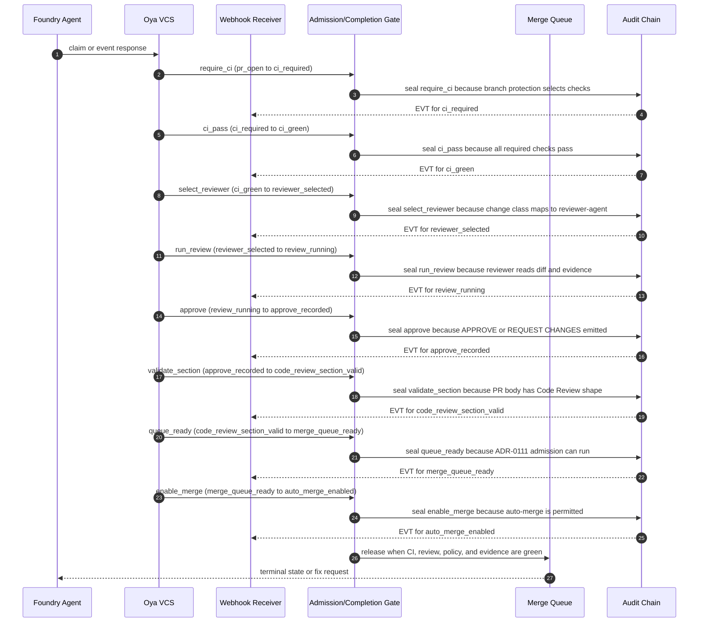

# Foundry Completion Gate Reviewer and CI

## Purpose

This spec defines the completion gate that requires reviewer-agent APPROVE, CI green, PR traceability, Code Review section integrity, and merge-queue readiness before auto-merge.

Completion is an internal repository merge control; it is unrelated to tenant-facing feature completion or consumer AI response quality.

Foundry was the internal agentic-development pipeline (RETIRED per ADR-0335 Wave 15I; absorbed into intelligence): it coordinates source changes, CI evidence, reviewer decisions, merge-queue state, and promotion state for the oyatie repository.
Foundry is not a consumer-facing AI product, not a tenant assistant, and not the place where B2B or B2C prompt history is stored.
This spec turns the ADR-level decision into an operator-readable and agent-executable substrate contract.
The contract is intentionally written with RFC 2119 and RFC 8174 keywords so policy, CI, and agent prompts can parse the same text.
The control plane treats tenant_id=oyatie as the internal tenant for internal agentic-development pipeline emissions, consistent with ADR-0263.
Every state-changing step emits an audit event and a correlated observability record before a downstream state may rely on it.
The implementation boundary is the single Foundry microservice with internal bounded contexts from ADR-0136.
The repository boundary is microservices/foundry plus repo-level governance registries and docs referenced in cross-references.
The user-facing Intelligence substrate remains separate and MUST NOT be conflated with this pipeline.
The stop condition for this spec is a changeset whose evidence, policy, CI, review, queue, and promotion state can be replayed deterministically.

## Normative Requirements

The key words MUST, MUST NOT, REQUIRED, SHALL, SHALL NOT, SHOULD, SHOULD NOT, RECOMMENDED, MAY, and OPTIONAL in this section are to be interpreted as described in RFC 2119 and RFC 8174.

1. Foundry Completion Gate Reviewer and CI MUST ensure the state transition be written before downstream consumers act.
2. Foundry Completion Gate Reviewer and CI MUST ensure the state transition carry a deterministic identifier.
3. Foundry Completion Gate Reviewer and CI MUST ensure the state transition declare its actor, action, resource, and reason.
4. Foundry Completion Gate Reviewer and CI MUST ensure the state transition fail closed when required evidence is absent.
5. Foundry Completion Gate Reviewer and CI MUST ensure the Cedar decision be written before downstream consumers act.
6. Foundry Completion Gate Reviewer and CI MUST ensure the Cedar decision carry a deterministic identifier.
7. Foundry Completion Gate Reviewer and CI MUST ensure the Cedar decision declare its actor, action, resource, and reason.
8. Foundry Completion Gate Reviewer and CI MUST ensure the Cedar decision fail closed when required evidence is absent.
9. Foundry Completion Gate Reviewer and CI MUST ensure the audit event be written before downstream consumers act.
10. Foundry Completion Gate Reviewer and CI MUST ensure the audit event carry a deterministic identifier.
11. Foundry Completion Gate Reviewer and CI MUST ensure the audit event declare its actor, action, resource, and reason.
12. Foundry Completion Gate Reviewer and CI MUST ensure the audit event fail closed when required evidence is absent.
13. Foundry Completion Gate Reviewer and CI MUST ensure the observability emission be written before downstream consumers act.
14. Foundry Completion Gate Reviewer and CI MUST ensure the observability emission carry a deterministic identifier.
15. Foundry Completion Gate Reviewer and CI MUST ensure the observability emission declare its actor, action, resource, and reason.
16. Foundry Completion Gate Reviewer and CI MUST ensure the observability emission fail closed when required evidence is absent.
17. Foundry Completion Gate Reviewer and CI MUST ensure the evidence bundle be written before downstream consumers act.
18. Foundry Completion Gate Reviewer and CI MUST ensure the evidence bundle carry a deterministic identifier.
19. Foundry Completion Gate Reviewer and CI MUST ensure the evidence bundle declare its actor, action, resource, and reason.
20. Foundry Completion Gate Reviewer and CI MUST ensure the evidence bundle fail closed when required evidence is absent.
21. Foundry Completion Gate Reviewer and CI MUST ensure the cost budget be written before downstream consumers act.
22. Foundry Completion Gate Reviewer and CI MUST ensure the cost budget carry a deterministic identifier.
23. Foundry Completion Gate Reviewer and CI MUST ensure the cost budget declare its actor, action, resource, and reason.
24. Foundry Completion Gate Reviewer and CI MUST ensure the cost budget fail closed when required evidence is absent.
25. Foundry Completion Gate Reviewer and CI MUST ensure the idempotency key be written before downstream consumers act.
26. Foundry Completion Gate Reviewer and CI MUST ensure the idempotency key carry a deterministic identifier.
27. Foundry Completion Gate Reviewer and CI MUST ensure the idempotency key declare its actor, action, resource, and reason.
28. Foundry Completion Gate Reviewer and CI MUST ensure the idempotency key fail closed when required evidence is absent.
29. Foundry Completion Gate Reviewer and CI MUST ensure the retry branch be written before downstream consumers act.
30. Foundry Completion Gate Reviewer and CI MUST ensure the retry branch carry a deterministic identifier.
31. Foundry Completion Gate Reviewer and CI MUST ensure the retry branch declare its actor, action, resource, and reason.
32. Foundry Completion Gate Reviewer and CI MUST ensure the retry branch fail closed when required evidence is absent.
33. Foundry Completion Gate Reviewer and CI MUST ensure the reviewer verdict be written before downstream consumers act.
34. Foundry Completion Gate Reviewer and CI MUST ensure the reviewer verdict carry a deterministic identifier.
35. Foundry Completion Gate Reviewer and CI MUST ensure the reviewer verdict declare its actor, action, resource, and reason.
36. Foundry Completion Gate Reviewer and CI MUST ensure the reviewer verdict fail closed when required evidence is absent.
37. Foundry Completion Gate Reviewer and CI MUST ensure the CI status be written before downstream consumers act.
38. Foundry Completion Gate Reviewer and CI MUST ensure the CI status carry a deterministic identifier.
39. Foundry Completion Gate Reviewer and CI MUST ensure the CI status declare its actor, action, resource, and reason.
40. Foundry Completion Gate Reviewer and CI MUST ensure the CI status fail closed when required evidence is absent.
41. Foundry Completion Gate Reviewer and CI MUST ensure the worktree lane be written before downstream consumers act.
42. Foundry Completion Gate Reviewer and CI MUST ensure the worktree lane carry a deterministic identifier.
43. Foundry Completion Gate Reviewer and CI MUST ensure the worktree lane declare its actor, action, resource, and reason.
44. Foundry Completion Gate Reviewer and CI MUST ensure the worktree lane fail closed when required evidence is absent.
45. Foundry Completion Gate Reviewer and CI MUST ensure the branch reference be written before downstream consumers act.
46. Foundry Completion Gate Reviewer and CI MUST ensure the branch reference carry a deterministic identifier.
47. Foundry Completion Gate Reviewer and CI MUST ensure the branch reference declare its actor, action, resource, and reason.
48. Foundry Completion Gate Reviewer and CI MUST ensure the branch reference fail closed when required evidence is absent.
49. Foundry Completion Gate Reviewer and CI MUST ensure the merge-queue position be written before downstream consumers act.
50. Foundry Completion Gate Reviewer and CI MUST ensure the merge-queue position carry a deterministic identifier.
51. Foundry Completion Gate Reviewer and CI MUST ensure the merge-queue position declare its actor, action, resource, and reason.
52. Foundry Completion Gate Reviewer and CI MUST ensure the merge-queue position fail closed when required evidence is absent.
53. Foundry Completion Gate Reviewer and CI MUST ensure the promotion target be written before downstream consumers act.
54. Foundry Completion Gate Reviewer and CI MUST ensure the promotion target carry a deterministic identifier.
55. Foundry Completion Gate Reviewer and CI MUST ensure the promotion target declare its actor, action, resource, and reason.
56. Foundry Completion Gate Reviewer and CI MUST ensure the promotion target fail closed when required evidence is absent.
57. Foundry Completion Gate Reviewer and CI MUST ensure the human override be written before downstream consumers act.
58. Foundry Completion Gate Reviewer and CI MUST ensure the human override carry a deterministic identifier.
59. Foundry Completion Gate Reviewer and CI MUST ensure the human override declare its actor, action, resource, and reason.
60. Foundry Completion Gate Reviewer and CI MUST ensure the human override fail closed when required evidence is absent.
61. Foundry Completion Gate Reviewer and CI MUST ensure the safe-path predicate be written before downstream consumers act.
62. Foundry Completion Gate Reviewer and CI MUST ensure the safe-path predicate carry a deterministic identifier.
63. Foundry Completion Gate Reviewer and CI MUST ensure the safe-path predicate declare its actor, action, resource, and reason.
64. Foundry Completion Gate Reviewer and CI MUST ensure the safe-path predicate fail closed when required evidence is absent.
65. Foundry Completion Gate Reviewer and CI MUST ensure the OpenBao secret reference be written before downstream consumers act.
66. Foundry Completion Gate Reviewer and CI MUST ensure the OpenBao secret reference carry a deterministic identifier.
67. Foundry Completion Gate Reviewer and CI MUST ensure the OpenBao secret reference declare its actor, action, resource, and reason.
68. Foundry Completion Gate Reviewer and CI MUST ensure the OpenBao secret reference fail closed when required evidence is absent.
69. Foundry Completion Gate Reviewer and CI MUST ensure the GitHub post-back be written before downstream consumers act.
70. Foundry Completion Gate Reviewer and CI MUST ensure the GitHub post-back carry a deterministic identifier.
71. Foundry Completion Gate Reviewer and CI MUST ensure the GitHub post-back declare its actor, action, resource, and reason.
72. Foundry Completion Gate Reviewer and CI MUST ensure the GitHub post-back fail closed when required evidence is absent.
73. Foundry Completion Gate Reviewer and CI MUST ensure the multispectrum evidence be written before downstream consumers act.
74. Foundry Completion Gate Reviewer and CI MUST ensure the multispectrum evidence carry a deterministic identifier.
75. Foundry Completion Gate Reviewer and CI MUST ensure the multispectrum evidence declare its actor, action, resource, and reason.
76. Foundry Completion Gate Reviewer and CI MUST ensure the multispectrum evidence fail closed when required evidence is absent.
77. Foundry Completion Gate Reviewer and CI MUST ensure the trace context be written before downstream consumers act.
78. Foundry Completion Gate Reviewer and CI MUST ensure the trace context carry a deterministic identifier.
79. Foundry Completion Gate Reviewer and CI MUST ensure the trace context declare its actor, action, resource, and reason.
80. Foundry Completion Gate Reviewer and CI MUST ensure the trace context fail closed when required evidence is absent.
81. The `ci_required` phase SHOULD expose a machine-readable status row with actor, at, evidence_uri, trace_id, and audit_id.
82. The `ci_green` phase SHOULD expose a machine-readable status row with actor, at, evidence_uri, trace_id, and audit_id.
83. The `reviewer_selected` phase SHOULD expose a machine-readable status row with actor, at, evidence_uri, trace_id, and audit_id.
84. The `review_running` phase SHOULD expose a machine-readable status row with actor, at, evidence_uri, trace_id, and audit_id.
85. The `approve_recorded` phase SHOULD expose a machine-readable status row with actor, at, evidence_uri, trace_id, and audit_id.
86. The `code_review_section_valid` phase SHOULD expose a machine-readable status row with actor, at, evidence_uri, trace_id, and audit_id.
87. The `merge_queue_ready` phase SHOULD expose a machine-readable status row with actor, at, evidence_uri, trace_id, and audit_id.
88. The `auto_merge_enabled` phase SHOULD expose a machine-readable status row with actor, at, evidence_uri, trace_id, and audit_id.
89. The `completion_blocked` phase SHOULD expose a machine-readable status row with actor, at, evidence_uri, trace_id, and audit_id.
90. Action `foundry.completion.require_ci` MUST be denied unless a matching Cedar permit binds the principal, resource, and changeset intent.
91. Action `foundry.completion.select_reviewer` MUST be denied unless a matching Cedar permit binds the principal, resource, and changeset intent.
92. Action `foundry.completion.run_review` MUST be denied unless a matching Cedar permit binds the principal, resource, and changeset intent.
93. Action `foundry.completion.record_approve` MUST be denied unless a matching Cedar permit binds the principal, resource, and changeset intent.
94. Action `foundry.completion.validate_pr_body` MUST be denied unless a matching Cedar permit binds the principal, resource, and changeset intent.
95. Action `foundry.completion.enable_automerge` MUST be denied unless a matching Cedar permit binds the principal, resource, and changeset intent.
96. Action `foundry.completion.block` MUST be denied unless a matching Cedar permit binds the principal, resource, and changeset intent.
97. Implementations MAY add stricter product-local gates when they do not weaken any requirement in ADR-0221.

## State Machine / Sequence Diagram



### Named Transitions

| Transition | From | To | Guard summary | Audit event | Recovery if denied |
|---|---|---|---|---|---|
| require_ci | pr_open | ci_required | branch protection selects checks; Cedar permit required; evidence hash present | EVT-FOUNDRY-COMPLETION-CI-GREEN | Hold at pr_open; append refusal reason; request fix or human override |
| ci_pass | ci_required | ci_green | all required checks pass; Cedar permit required; evidence hash present | EVT-FOUNDRY-REVIEW-APPROVED | Hold at ci_required; append refusal reason; request fix or human override |
| select_reviewer | ci_green | reviewer_selected | change class maps to reviewer-agent; Cedar permit required; evidence hash present | EVT-FOUNDRY-REVIEWER-SELECTED | Hold at ci_green; append refusal reason; request fix or human override |
| run_review | reviewer_selected | review_running | reviewer reads diff and evidence; Cedar permit required; evidence hash present | EVT-FOUNDRY-COMPLETION-BLOCKED | Hold at reviewer_selected; append refusal reason; request fix or human override |
| approve | review_running | approve_recorded | APPROVE or REQUEST CHANGES emitted; Cedar permit required; evidence hash present | EVT-FOUNDRY-REVIEWER-SELECTED | Hold at review_running; append refusal reason; request fix or human override |
| validate_section | approve_recorded | code_review_section_valid | PR body has Code Review shape; Cedar permit required; evidence hash present | EVT-FOUNDRY-COMPLETION-CI-GREEN | Hold at approve_recorded; append refusal reason; request fix or human override |
| queue_ready | code_review_section_valid | merge_queue_ready | ADR-0111 admission can run; Cedar permit required; evidence hash present | EVT-FOUNDRY-COMPLETION-CI-GREEN | Hold at code_review_section_valid; append refusal reason; request fix or human override |
| enable_merge | merge_queue_ready | auto_merge_enabled | auto-merge is permitted; Cedar permit required; evidence hash present | EVT-FOUNDRY-CODE-REVIEW-SECTION-VALIDATED | Hold at merge_queue_ready; append refusal reason; request fix or human override |
| block_completion | review_running | completion_blocked | review or CI failure blocks; Cedar permit required; evidence hash present | EVT-FOUNDRY-REVIEWER-SELECTED | Hold at review_running; append refusal reason; request fix or human override |
| replay-check-01 | pr_open | ci_required | Replay validates ci_required ordering, signature, budget, and trace context | EVT-FOUNDRY-COMPLETION-CI-GREEN | Recompute from append-only log and refuse non-monotonic row |
| replay-check-02 | ci_required | ci_green | Replay validates ci_green ordering, signature, budget, and trace context | EVT-FOUNDRY-REVIEWER-SELECTED | Recompute from append-only log and refuse non-monotonic row |
| replay-check-03 | ci_green | reviewer_selected | Replay validates reviewer_selected ordering, signature, budget, and trace context | EVT-FOUNDRY-REVIEW-APPROVED | Recompute from append-only log and refuse non-monotonic row |
| replay-check-04 | reviewer_selected | review_running | Replay validates review_running ordering, signature, budget, and trace context | EVT-FOUNDRY-CODE-REVIEW-SECTION-VALIDATED | Recompute from append-only log and refuse non-monotonic row |
| replay-check-05 | review_running | approve_recorded | Replay validates approve_recorded ordering, signature, budget, and trace context | EVT-FOUNDRY-COMPLETION-BLOCKED | Recompute from append-only log and refuse non-monotonic row |
| replay-check-06 | approve_recorded | code_review_section_valid | Replay validates code_review_section_valid ordering, signature, budget, and trace context | EVT-FOUNDRY-COMPLETION-CI-GREEN | Recompute from append-only log and refuse non-monotonic row |
| replay-check-07 | code_review_section_valid | merge_queue_ready | Replay validates merge_queue_ready ordering, signature, budget, and trace context | EVT-FOUNDRY-REVIEWER-SELECTED | Recompute from append-only log and refuse non-monotonic row |
| replay-check-08 | merge_queue_ready | auto_merge_enabled | Replay validates auto_merge_enabled ordering, signature, budget, and trace context | EVT-FOUNDRY-REVIEW-APPROVED | Recompute from append-only log and refuse non-monotonic row |
| replay-check-09 | review_running | completion_blocked | Replay validates completion_blocked ordering, signature, budget, and trace context | EVT-FOUNDRY-CODE-REVIEW-SECTION-VALIDATED | Recompute from append-only log and refuse non-monotonic row |
| replay-check-10 | pr_open | ci_required | Replay validates ci_required ordering, signature, budget, and trace context | EVT-FOUNDRY-COMPLETION-BLOCKED | Recompute from append-only log and refuse non-monotonic row |
| replay-check-11 | ci_required | ci_green | Replay validates ci_green ordering, signature, budget, and trace context | EVT-FOUNDRY-COMPLETION-CI-GREEN | Recompute from append-only log and refuse non-monotonic row |
| replay-check-12 | ci_green | reviewer_selected | Replay validates reviewer_selected ordering, signature, budget, and trace context | EVT-FOUNDRY-REVIEWER-SELECTED | Recompute from append-only log and refuse non-monotonic row |
| replay-check-13 | reviewer_selected | review_running | Replay validates review_running ordering, signature, budget, and trace context | EVT-FOUNDRY-REVIEW-APPROVED | Recompute from append-only log and refuse non-monotonic row |
| replay-check-14 | review_running | approve_recorded | Replay validates approve_recorded ordering, signature, budget, and trace context | EVT-FOUNDRY-CODE-REVIEW-SECTION-VALIDATED | Recompute from append-only log and refuse non-monotonic row |
| replay-check-15 | approve_recorded | code_review_section_valid | Replay validates code_review_section_valid ordering, signature, budget, and trace context | EVT-FOUNDRY-COMPLETION-BLOCKED | Recompute from append-only log and refuse non-monotonic row |
| replay-check-16 | code_review_section_valid | merge_queue_ready | Replay validates merge_queue_ready ordering, signature, budget, and trace context | EVT-FOUNDRY-COMPLETION-CI-GREEN | Recompute from append-only log and refuse non-monotonic row |
| replay-check-17 | merge_queue_ready | auto_merge_enabled | Replay validates auto_merge_enabled ordering, signature, budget, and trace context | EVT-FOUNDRY-REVIEWER-SELECTED | Recompute from append-only log and refuse non-monotonic row |
| replay-check-18 | review_running | completion_blocked | Replay validates completion_blocked ordering, signature, budget, and trace context | EVT-FOUNDRY-REVIEW-APPROVED | Recompute from append-only log and refuse non-monotonic row |
| replay-check-19 | pr_open | ci_required | Replay validates ci_required ordering, signature, budget, and trace context | EVT-FOUNDRY-CODE-REVIEW-SECTION-VALIDATED | Recompute from append-only log and refuse non-monotonic row |
| replay-check-20 | ci_required | ci_green | Replay validates ci_green ordering, signature, budget, and trace context | EVT-FOUNDRY-COMPLETION-BLOCKED | Recompute from append-only log and refuse non-monotonic row |
| replay-check-21 | ci_green | reviewer_selected | Replay validates reviewer_selected ordering, signature, budget, and trace context | EVT-FOUNDRY-COMPLETION-CI-GREEN | Recompute from append-only log and refuse non-monotonic row |
| replay-check-22 | reviewer_selected | review_running | Replay validates review_running ordering, signature, budget, and trace context | EVT-FOUNDRY-REVIEWER-SELECTED | Recompute from append-only log and refuse non-monotonic row |
| replay-check-23 | review_running | approve_recorded | Replay validates approve_recorded ordering, signature, budget, and trace context | EVT-FOUNDRY-REVIEW-APPROVED | Recompute from append-only log and refuse non-monotonic row |
| replay-check-24 | approve_recorded | code_review_section_valid | Replay validates code_review_section_valid ordering, signature, budget, and trace context | EVT-FOUNDRY-CODE-REVIEW-SECTION-VALIDATED | Recompute from append-only log and refuse non-monotonic row |
| replay-check-25 | code_review_section_valid | merge_queue_ready | Replay validates merge_queue_ready ordering, signature, budget, and trace context | EVT-FOUNDRY-COMPLETION-BLOCKED | Recompute from append-only log and refuse non-monotonic row |
| replay-check-26 | merge_queue_ready | auto_merge_enabled | Replay validates auto_merge_enabled ordering, signature, budget, and trace context | EVT-FOUNDRY-COMPLETION-CI-GREEN | Recompute from append-only log and refuse non-monotonic row |
| replay-check-27 | review_running | completion_blocked | Replay validates completion_blocked ordering, signature, budget, and trace context | EVT-FOUNDRY-REVIEWER-SELECTED | Recompute from append-only log and refuse non-monotonic row |
| replay-check-28 | pr_open | ci_required | Replay validates ci_required ordering, signature, budget, and trace context | EVT-FOUNDRY-REVIEW-APPROVED | Recompute from append-only log and refuse non-monotonic row |
| replay-check-29 | ci_required | ci_green | Replay validates ci_green ordering, signature, budget, and trace context | EVT-FOUNDRY-CODE-REVIEW-SECTION-VALIDATED | Recompute from append-only log and refuse non-monotonic row |
| replay-check-30 | ci_green | reviewer_selected | Replay validates reviewer_selected ordering, signature, budget, and trace context | EVT-FOUNDRY-COMPLETION-BLOCKED | Recompute from append-only log and refuse non-monotonic row |
| replay-check-31 | reviewer_selected | review_running | Replay validates review_running ordering, signature, budget, and trace context | EVT-FOUNDRY-COMPLETION-CI-GREEN | Recompute from append-only log and refuse non-monotonic row |
| replay-check-32 | review_running | approve_recorded | Replay validates approve_recorded ordering, signature, budget, and trace context | EVT-FOUNDRY-REVIEWER-SELECTED | Recompute from append-only log and refuse non-monotonic row |
| replay-check-33 | approve_recorded | code_review_section_valid | Replay validates code_review_section_valid ordering, signature, budget, and trace context | EVT-FOUNDRY-REVIEW-APPROVED | Recompute from append-only log and refuse non-monotonic row |
| replay-check-34 | code_review_section_valid | merge_queue_ready | Replay validates merge_queue_ready ordering, signature, budget, and trace context | EVT-FOUNDRY-CODE-REVIEW-SECTION-VALIDATED | Recompute from append-only log and refuse non-monotonic row |
| replay-check-35 | merge_queue_ready | auto_merge_enabled | Replay validates auto_merge_enabled ordering, signature, budget, and trace context | EVT-FOUNDRY-COMPLETION-BLOCKED | Recompute from append-only log and refuse non-monotonic row |
| replay-check-36 | review_running | completion_blocked | Replay validates completion_blocked ordering, signature, budget, and trace context | EVT-FOUNDRY-COMPLETION-CI-GREEN | Recompute from append-only log and refuse non-monotonic row |
| replay-check-37 | pr_open | ci_required | Replay validates ci_required ordering, signature, budget, and trace context | EVT-FOUNDRY-REVIEWER-SELECTED | Recompute from append-only log and refuse non-monotonic row |
| replay-check-38 | ci_required | ci_green | Replay validates ci_green ordering, signature, budget, and trace context | EVT-FOUNDRY-REVIEW-APPROVED | Recompute from append-only log and refuse non-monotonic row |
| replay-check-39 | ci_green | reviewer_selected | Replay validates reviewer_selected ordering, signature, budget, and trace context | EVT-FOUNDRY-CODE-REVIEW-SECTION-VALIDATED | Recompute from append-only log and refuse non-monotonic row |
| replay-check-40 | reviewer_selected | review_running | Replay validates review_running ordering, signature, budget, and trace context | EVT-FOUNDRY-COMPLETION-BLOCKED | Recompute from append-only log and refuse non-monotonic row |
| replay-check-41 | review_running | approve_recorded | Replay validates approve_recorded ordering, signature, budget, and trace context | EVT-FOUNDRY-COMPLETION-CI-GREEN | Recompute from append-only log and refuse non-monotonic row |
| replay-check-42 | approve_recorded | code_review_section_valid | Replay validates code_review_section_valid ordering, signature, budget, and trace context | EVT-FOUNDRY-REVIEWER-SELECTED | Recompute from append-only log and refuse non-monotonic row |
| replay-check-43 | code_review_section_valid | merge_queue_ready | Replay validates merge_queue_ready ordering, signature, budget, and trace context | EVT-FOUNDRY-REVIEW-APPROVED | Recompute from append-only log and refuse non-monotonic row |
| replay-check-44 | merge_queue_ready | auto_merge_enabled | Replay validates auto_merge_enabled ordering, signature, budget, and trace context | EVT-FOUNDRY-CODE-REVIEW-SECTION-VALIDATED | Recompute from append-only log and refuse non-monotonic row |
| replay-check-45 | review_running | completion_blocked | Replay validates completion_blocked ordering, signature, budget, and trace context | EVT-FOUNDRY-COMPLETION-BLOCKED | Recompute from append-only log and refuse non-monotonic row |
| replay-check-46 | pr_open | ci_required | Replay validates ci_required ordering, signature, budget, and trace context | EVT-FOUNDRY-COMPLETION-CI-GREEN | Recompute from append-only log and refuse non-monotonic row |
| replay-check-47 | ci_required | ci_green | Replay validates ci_green ordering, signature, budget, and trace context | EVT-FOUNDRY-REVIEWER-SELECTED | Recompute from append-only log and refuse non-monotonic row |
| replay-check-48 | ci_green | reviewer_selected | Replay validates reviewer_selected ordering, signature, budget, and trace context | EVT-FOUNDRY-REVIEW-APPROVED | Recompute from append-only log and refuse non-monotonic row |
| replay-check-49 | reviewer_selected | review_running | Replay validates review_running ordering, signature, budget, and trace context | EVT-FOUNDRY-CODE-REVIEW-SECTION-VALIDATED | Recompute from append-only log and refuse non-monotonic row |
| replay-check-50 | review_running | approve_recorded | Replay validates approve_recorded ordering, signature, budget, and trace context | EVT-FOUNDRY-COMPLETION-BLOCKED | Recompute from append-only log and refuse non-monotonic row |
| replay-check-51 | approve_recorded | code_review_section_valid | Replay validates code_review_section_valid ordering, signature, budget, and trace context | EVT-FOUNDRY-COMPLETION-CI-GREEN | Recompute from append-only log and refuse non-monotonic row |
| replay-check-52 | code_review_section_valid | merge_queue_ready | Replay validates merge_queue_ready ordering, signature, budget, and trace context | EVT-FOUNDRY-REVIEWER-SELECTED | Recompute from append-only log and refuse non-monotonic row |
| replay-check-53 | merge_queue_ready | auto_merge_enabled | Replay validates auto_merge_enabled ordering, signature, budget, and trace context | EVT-FOUNDRY-REVIEW-APPROVED | Recompute from append-only log and refuse non-monotonic row |
| replay-check-54 | review_running | completion_blocked | Replay validates completion_blocked ordering, signature, budget, and trace context | EVT-FOUNDRY-CODE-REVIEW-SECTION-VALIDATED | Recompute from append-only log and refuse non-monotonic row |

## Cedar Policy Bindings

The bindings below use specific internal principals, actions, and resources. A deny from any narrower policy wins over these permits.

| Binding | Principal | Action | Resource | Required context | Decision |
|---|---|---|---|---|---|
| B-001 | Principal::"oyatie.agent.codex" | Action::"foundry.completion.require_ci" | Resource::"pr-body:templates/pull-request-template.md" | workflow=foundry_pipeline; tenant_id=oyatie; intent=completion-gate-reviewer-and-ci | permit when evidence_hash and changeset_id are present |
| B-002 | Principal::"oyatie.agent.codex" | Action::"foundry.completion.select_reviewer" | Resource::"review:## Code Review" | workflow=foundry_pipeline; tenant_id=oyatie; intent=completion-gate-reviewer-and-ci | permit when evidence_hash and changeset_id are present |
| B-003 | Principal::"oyatie.agent.codex" | Action::"foundry.completion.run_review" | Resource::"status-check:required/*" | workflow=foundry_pipeline; tenant_id=oyatie; intent=completion-gate-reviewer-and-ci | permit when evidence_hash and changeset_id are present |
| B-004 | Principal::"oyatie.agent.codex" | Action::"foundry.completion.record_approve" | Resource::"repo:oyatie/microservices/foundry" | workflow=foundry_pipeline; tenant_id=oyatie; intent=completion-gate-reviewer-and-ci | permit when evidence_hash and changeset_id are present |
| B-005 | Principal::"oyatie.agent.codex" | Action::"foundry.completion.validate_pr_body" | Resource::"branch:dev" | workflow=foundry_pipeline; tenant_id=oyatie; intent=completion-gate-reviewer-and-ci | permit when evidence_hash and changeset_id are present |
| B-006 | Principal::"oyatie.agent.claude-opus" | Action::"foundry.completion.require_ci" | Resource::"queue:foundry-dev" | workflow=foundry_pipeline; tenant_id=oyatie; intent=completion-gate-reviewer-and-ci | permit when evidence_hash and changeset_id are present |
| B-007 | Principal::"oyatie.agent.claude-opus" | Action::"foundry.completion.select_reviewer" | Resource::"event-log:registry/vcs/changeset-event-log.json" | workflow=foundry_pipeline; tenant_id=oyatie; intent=completion-gate-reviewer-and-ci | permit when evidence_hash and changeset_id are present |
| B-008 | Principal::"oyatie.agent.claude-opus" | Action::"foundry.completion.run_review" | Resource::"event-router:registry/vcs/event-router.yaml" | workflow=foundry_pipeline; tenant_id=oyatie; intent=completion-gate-reviewer-and-ci | permit when evidence_hash and changeset_id are present |
| B-009 | Principal::"oyatie.agent.claude-opus" | Action::"foundry.completion.record_approve" | Resource::"safe-paths:registry/vcs/concurrent-safe-paths.yaml" | workflow=foundry_pipeline; tenant_id=oyatie; intent=completion-gate-reviewer-and-ci | permit when evidence_hash and changeset_id are present |
| B-010 | Principal::"oyatie.agent.claude-opus" | Action::"foundry.completion.validate_pr_body" | Resource::"evidence:evidence/multispectrum" | workflow=foundry_pipeline; tenant_id=oyatie; intent=completion-gate-reviewer-and-ci | permit when evidence_hash and changeset_id are present |
| B-011 | Principal::"oyatie.agent.planner" | Action::"foundry.completion.require_ci" | Resource::"audit:event-class/foundry" | workflow=foundry_pipeline; tenant_id=oyatie; intent=completion-gate-reviewer-and-ci | permit when evidence_hash and changeset_id are present |
| B-012 | Principal::"oyatie.agent.planner" | Action::"foundry.completion.select_reviewer" | Resource::"completion-gate:foundry-dev" | workflow=foundry_pipeline; tenant_id=oyatie; intent=completion-gate-reviewer-and-ci | permit when evidence_hash and changeset_id are present |
| B-013 | Principal::"oyatie.agent.planner" | Action::"foundry.completion.run_review" | Resource::"pr-body:templates/pull-request-template.md" | workflow=foundry_pipeline; tenant_id=oyatie; intent=completion-gate-reviewer-and-ci | permit when evidence_hash and changeset_id are present |
| B-014 | Principal::"oyatie.agent.planner" | Action::"foundry.completion.record_approve" | Resource::"review:## Code Review" | workflow=foundry_pipeline; tenant_id=oyatie; intent=completion-gate-reviewer-and-ci | permit when evidence_hash and changeset_id are present |
| B-015 | Principal::"oyatie.agent.planner" | Action::"foundry.completion.validate_pr_body" | Resource::"status-check:required/*" | workflow=foundry_pipeline; tenant_id=oyatie; intent=completion-gate-reviewer-and-ci | permit when evidence_hash and changeset_id are present |
| B-016 | Principal::"oyatie.agent.executor" | Action::"foundry.completion.require_ci" | Resource::"repo:oyatie/microservices/foundry" | workflow=foundry_pipeline; tenant_id=oyatie; intent=completion-gate-reviewer-and-ci | permit when evidence_hash and changeset_id are present |
| B-017 | Principal::"oyatie.agent.executor" | Action::"foundry.completion.select_reviewer" | Resource::"branch:dev" | workflow=foundry_pipeline; tenant_id=oyatie; intent=completion-gate-reviewer-and-ci | permit when evidence_hash and changeset_id are present |
| B-018 | Principal::"oyatie.agent.executor" | Action::"foundry.completion.run_review" | Resource::"queue:foundry-dev" | workflow=foundry_pipeline; tenant_id=oyatie; intent=completion-gate-reviewer-and-ci | permit when evidence_hash and changeset_id are present |
| B-019 | Principal::"oyatie.agent.executor" | Action::"foundry.completion.record_approve" | Resource::"event-log:registry/vcs/changeset-event-log.json" | workflow=foundry_pipeline; tenant_id=oyatie; intent=completion-gate-reviewer-and-ci | permit when evidence_hash and changeset_id are present |
| B-020 | Principal::"oyatie.agent.executor" | Action::"foundry.completion.validate_pr_body" | Resource::"event-router:registry/vcs/event-router.yaml" | workflow=foundry_pipeline; tenant_id=oyatie; intent=completion-gate-reviewer-and-ci | permit when evidence_hash and changeset_id are present |
| B-021 | Principal::"oyatie.service.vcs-orchestrator" | Action::"foundry.completion.require_ci" | Resource::"safe-paths:registry/vcs/concurrent-safe-paths.yaml" | workflow=foundry_pipeline; tenant_id=oyatie; intent=completion-gate-reviewer-and-ci | permit when evidence_hash and changeset_id are present |
| B-022 | Principal::"oyatie.service.vcs-orchestrator" | Action::"foundry.completion.select_reviewer" | Resource::"evidence:evidence/multispectrum" | workflow=foundry_pipeline; tenant_id=oyatie; intent=completion-gate-reviewer-and-ci | permit when evidence_hash and changeset_id are present |
| B-023 | Principal::"oyatie.service.vcs-orchestrator" | Action::"foundry.completion.run_review" | Resource::"audit:event-class/foundry" | workflow=foundry_pipeline; tenant_id=oyatie; intent=completion-gate-reviewer-and-ci | permit when evidence_hash and changeset_id are present |
| B-024 | Principal::"oyatie.service.vcs-orchestrator" | Action::"foundry.completion.record_approve" | Resource::"completion-gate:foundry-dev" | workflow=foundry_pipeline; tenant_id=oyatie; intent=completion-gate-reviewer-and-ci | permit when evidence_hash and changeset_id are present |
| B-025 | Principal::"oyatie.service.vcs-orchestrator" | Action::"foundry.completion.validate_pr_body" | Resource::"pr-body:templates/pull-request-template.md" | workflow=foundry_pipeline; tenant_id=oyatie; intent=completion-gate-reviewer-and-ci | permit when evidence_hash and changeset_id are present |
| B-026 | Principal::"oyatie.service.webhook-receiver" | Action::"foundry.completion.require_ci" | Resource::"review:## Code Review" | workflow=foundry_pipeline; tenant_id=oyatie; intent=completion-gate-reviewer-and-ci | permit when evidence_hash and changeset_id are present |
| B-027 | Principal::"oyatie.service.webhook-receiver" | Action::"foundry.completion.select_reviewer" | Resource::"status-check:required/*" | workflow=foundry_pipeline; tenant_id=oyatie; intent=completion-gate-reviewer-and-ci | permit when evidence_hash and changeset_id are present |
| B-028 | Principal::"oyatie.service.webhook-receiver" | Action::"foundry.completion.run_review" | Resource::"repo:oyatie/microservices/foundry" | workflow=foundry_pipeline; tenant_id=oyatie; intent=completion-gate-reviewer-and-ci | permit when evidence_hash and changeset_id are present |
| B-029 | Principal::"oyatie.service.webhook-receiver" | Action::"foundry.completion.record_approve" | Resource::"branch:dev" | workflow=foundry_pipeline; tenant_id=oyatie; intent=completion-gate-reviewer-and-ci | permit when evidence_hash and changeset_id are present |
| B-030 | Principal::"oyatie.service.webhook-receiver" | Action::"foundry.completion.validate_pr_body" | Resource::"queue:foundry-dev" | workflow=foundry_pipeline; tenant_id=oyatie; intent=completion-gate-reviewer-and-ci | permit when evidence_hash and changeset_id are present |
| B-031 | Principal::"oyatie.service.merge-queue" | Action::"foundry.completion.require_ci" | Resource::"event-log:registry/vcs/changeset-event-log.json" | workflow=foundry_pipeline; tenant_id=oyatie; intent=completion-gate-reviewer-and-ci | permit when evidence_hash and changeset_id are present |
| B-032 | Principal::"oyatie.service.merge-queue" | Action::"foundry.completion.select_reviewer" | Resource::"event-router:registry/vcs/event-router.yaml" | workflow=foundry_pipeline; tenant_id=oyatie; intent=completion-gate-reviewer-and-ci | permit when evidence_hash and changeset_id are present |
| B-033 | Principal::"oyatie.service.merge-queue" | Action::"foundry.completion.run_review" | Resource::"safe-paths:registry/vcs/concurrent-safe-paths.yaml" | workflow=foundry_pipeline; tenant_id=oyatie; intent=completion-gate-reviewer-and-ci | permit when evidence_hash and changeset_id are present |
| B-034 | Principal::"oyatie.service.merge-queue" | Action::"foundry.completion.record_approve" | Resource::"evidence:evidence/multispectrum" | workflow=foundry_pipeline; tenant_id=oyatie; intent=completion-gate-reviewer-and-ci | permit when evidence_hash and changeset_id are present |
| B-035 | Principal::"oyatie.service.merge-queue" | Action::"foundry.completion.validate_pr_body" | Resource::"audit:event-class/foundry" | workflow=foundry_pipeline; tenant_id=oyatie; intent=completion-gate-reviewer-and-ci | permit when evidence_hash and changeset_id are present |
| B-036 | Principal::"oyatie.service.admission-gate" | Action::"foundry.completion.require_ci" | Resource::"completion-gate:foundry-dev" | workflow=foundry_pipeline; tenant_id=oyatie; intent=completion-gate-reviewer-and-ci | permit when evidence_hash and changeset_id are present |
| B-037 | Principal::"oyatie.service.admission-gate" | Action::"foundry.completion.select_reviewer" | Resource::"pr-body:templates/pull-request-template.md" | workflow=foundry_pipeline; tenant_id=oyatie; intent=completion-gate-reviewer-and-ci | permit when evidence_hash and changeset_id are present |
| B-038 | Principal::"oyatie.service.admission-gate" | Action::"foundry.completion.run_review" | Resource::"review:## Code Review" | workflow=foundry_pipeline; tenant_id=oyatie; intent=completion-gate-reviewer-and-ci | permit when evidence_hash and changeset_id are present |
| B-039 | Principal::"oyatie.service.admission-gate" | Action::"foundry.completion.record_approve" | Resource::"status-check:required/*" | workflow=foundry_pipeline; tenant_id=oyatie; intent=completion-gate-reviewer-and-ci | permit when evidence_hash and changeset_id are present |
| B-040 | Principal::"oyatie.service.admission-gate" | Action::"foundry.completion.validate_pr_body" | Resource::"repo:oyatie/microservices/foundry" | workflow=foundry_pipeline; tenant_id=oyatie; intent=completion-gate-reviewer-and-ci | permit when evidence_hash and changeset_id are present |
| B-041 | Principal::"oyatie.service.completion-gate" | Action::"foundry.completion.require_ci" | Resource::"branch:dev" | workflow=foundry_pipeline; tenant_id=oyatie; intent=completion-gate-reviewer-and-ci | permit when evidence_hash and changeset_id are present |
| B-042 | Principal::"oyatie.service.completion-gate" | Action::"foundry.completion.select_reviewer" | Resource::"queue:foundry-dev" | workflow=foundry_pipeline; tenant_id=oyatie; intent=completion-gate-reviewer-and-ci | permit when evidence_hash and changeset_id are present |
| B-043 | Principal::"oyatie.service.completion-gate" | Action::"foundry.completion.run_review" | Resource::"event-log:registry/vcs/changeset-event-log.json" | workflow=foundry_pipeline; tenant_id=oyatie; intent=completion-gate-reviewer-and-ci | permit when evidence_hash and changeset_id are present |
| B-044 | Principal::"oyatie.service.completion-gate" | Action::"foundry.completion.record_approve" | Resource::"event-router:registry/vcs/event-router.yaml" | workflow=foundry_pipeline; tenant_id=oyatie; intent=completion-gate-reviewer-and-ci | permit when evidence_hash and changeset_id are present |
| B-045 | Principal::"oyatie.service.completion-gate" | Action::"foundry.completion.validate_pr_body" | Resource::"safe-paths:registry/vcs/concurrent-safe-paths.yaml" | workflow=foundry_pipeline; tenant_id=oyatie; intent=completion-gate-reviewer-and-ci | permit when evidence_hash and changeset_id are present |
| B-046 | Principal::"oyatie.human.reviewer" | Action::"foundry.completion.require_ci" | Resource::"evidence:evidence/multispectrum" | workflow=foundry_pipeline; tenant_id=oyatie; intent=completion-gate-reviewer-and-ci | permit when evidence_hash and changeset_id are present |
| B-047 | Principal::"oyatie.human.reviewer" | Action::"foundry.completion.select_reviewer" | Resource::"audit:event-class/foundry" | workflow=foundry_pipeline; tenant_id=oyatie; intent=completion-gate-reviewer-and-ci | permit when evidence_hash and changeset_id are present |
| B-048 | Principal::"oyatie.human.reviewer" | Action::"foundry.completion.run_review" | Resource::"completion-gate:foundry-dev" | workflow=foundry_pipeline; tenant_id=oyatie; intent=completion-gate-reviewer-and-ci | permit when evidence_hash and changeset_id are present |
| B-049 | Principal::"oyatie.human.reviewer" | Action::"foundry.completion.record_approve" | Resource::"pr-body:templates/pull-request-template.md" | workflow=foundry_pipeline; tenant_id=oyatie; intent=completion-gate-reviewer-and-ci | permit when evidence_hash and changeset_id are present |
| B-050 | Principal::"oyatie.human.reviewer" | Action::"foundry.completion.validate_pr_body" | Resource::"review:## Code Review" | workflow=foundry_pipeline; tenant_id=oyatie; intent=completion-gate-reviewer-and-ci | permit when evidence_hash and changeset_id are present |

```cedar
permit(
  principal in Principal::"oyatie.agent.codex",
  action == Action::"foundry.completion.require_ci",
  resource in Resource::"repo:oyatie/microservices/foundry"
) when {
  context.tenant_id == "oyatie" &&
  context.workflow == "foundry_pipeline" &&
  context.related_adr == "ADR-0221" &&
  context.evidence_hash != "" &&
  context.trace_id != ""
};

permit(
  principal in Principal::"oyatie.agent.codex",
  action == Action::"foundry.completion.select_reviewer",
  resource in Resource::"repo:oyatie/microservices/foundry"
) when {
  context.tenant_id == "oyatie" &&
  context.workflow == "foundry_pipeline" &&
  context.related_adr == "ADR-0221" &&
  context.evidence_hash != "" &&
  context.trace_id != ""
};

permit(
  principal in Principal::"oyatie.agent.codex",
  action == Action::"foundry.completion.run_review",
  resource in Resource::"repo:oyatie/microservices/foundry"
) when {
  context.tenant_id == "oyatie" &&
  context.workflow == "foundry_pipeline" &&
  context.related_adr == "ADR-0221" &&
  context.evidence_hash != "" &&
  context.trace_id != ""
};

permit(
  principal in Principal::"oyatie.agent.codex",
  action == Action::"foundry.completion.record_approve",
  resource in Resource::"repo:oyatie/microservices/foundry"
) when {
  context.tenant_id == "oyatie" &&
  context.workflow == "foundry_pipeline" &&
  context.related_adr == "ADR-0221" &&
  context.evidence_hash != "" &&
  context.trace_id != ""
};

forbid(
  principal,
  action,
  resource in Resource::"repo:oyatie/microservices/foundry/decisions"
) when {
  context.intent == "completion-gate-reviewer-and-ci" &&
  context.owner != "per-msvc-adrs-batch-d"
};
```

### Cedar Guard Catalog

- Guard 01: Principal::"oyatie.agent.codex" may invoke foundry.completion.require_ci on Resource::"completion-gate:foundry-dev" only while `ci_required` is current, the changeset id is stable, the event is signed, and the ADR-0221 invariant is cited.
- Guard 02: Principal::"oyatie.agent.claude-opus" may invoke foundry.completion.select_reviewer on Resource::"pr-body:templates/pull-request-template.md" only while `ci_green` is current, the changeset id is stable, the event is signed, and the ADR-0221 invariant is cited.
- Guard 03: Principal::"oyatie.agent.planner" may invoke foundry.completion.run_review on Resource::"review:## Code Review" only while `reviewer_selected` is current, the changeset id is stable, the event is signed, and the ADR-0221 invariant is cited.
- Guard 04: Principal::"oyatie.agent.executor" may invoke foundry.completion.record_approve on Resource::"status-check:required/*" only while `review_running` is current, the changeset id is stable, the event is signed, and the ADR-0221 invariant is cited.
- Guard 05: Principal::"oyatie.service.vcs-orchestrator" may invoke foundry.completion.validate_pr_body on Resource::"repo:oyatie/microservices/foundry" only while `approve_recorded` is current, the changeset id is stable, the event is signed, and the ADR-0221 invariant is cited.
- Guard 06: Principal::"oyatie.service.webhook-receiver" may invoke foundry.completion.enable_automerge on Resource::"branch:dev" only while `code_review_section_valid` is current, the changeset id is stable, the event is signed, and the ADR-0221 invariant is cited.
- Guard 07: Principal::"oyatie.service.merge-queue" may invoke foundry.completion.block on Resource::"queue:foundry-dev" only while `merge_queue_ready` is current, the changeset id is stable, the event is signed, and the ADR-0221 invariant is cited.
- Guard 08: Principal::"oyatie.service.admission-gate" may invoke foundry.completion.require_ci on Resource::"event-log:registry/vcs/changeset-event-log.json" only while `auto_merge_enabled` is current, the changeset id is stable, the event is signed, and the ADR-0221 invariant is cited.
- Guard 09: Principal::"oyatie.service.completion-gate" may invoke foundry.completion.select_reviewer on Resource::"event-router:registry/vcs/event-router.yaml" only while `completion_blocked` is current, the changeset id is stable, the event is signed, and the ADR-0221 invariant is cited.
- Guard 10: Principal::"oyatie.human.reviewer" may invoke foundry.completion.run_review on Resource::"safe-paths:registry/vcs/concurrent-safe-paths.yaml" only while `ci_required` is current, the changeset id is stable, the event is signed, and the ADR-0221 invariant is cited.
- Guard 11: Principal::"oyatie.agent.codex" may invoke foundry.completion.record_approve on Resource::"evidence:evidence/multispectrum" only while `ci_green` is current, the changeset id is stable, the event is signed, and the ADR-0221 invariant is cited.
- Guard 12: Principal::"oyatie.agent.claude-opus" may invoke foundry.completion.validate_pr_body on Resource::"audit:event-class/foundry" only while `reviewer_selected` is current, the changeset id is stable, the event is signed, and the ADR-0221 invariant is cited.
- Guard 13: Principal::"oyatie.agent.planner" may invoke foundry.completion.enable_automerge on Resource::"completion-gate:foundry-dev" only while `review_running` is current, the changeset id is stable, the event is signed, and the ADR-0221 invariant is cited.
- Guard 14: Principal::"oyatie.agent.executor" may invoke foundry.completion.block on Resource::"pr-body:templates/pull-request-template.md" only while `approve_recorded` is current, the changeset id is stable, the event is signed, and the ADR-0221 invariant is cited.
- Guard 15: Principal::"oyatie.service.vcs-orchestrator" may invoke foundry.completion.require_ci on Resource::"review:## Code Review" only while `code_review_section_valid` is current, the changeset id is stable, the event is signed, and the ADR-0221 invariant is cited.
- Guard 16: Principal::"oyatie.service.webhook-receiver" may invoke foundry.completion.select_reviewer on Resource::"status-check:required/*" only while `merge_queue_ready` is current, the changeset id is stable, the event is signed, and the ADR-0221 invariant is cited.
- Guard 17: Principal::"oyatie.service.merge-queue" may invoke foundry.completion.run_review on Resource::"repo:oyatie/microservices/foundry" only while `auto_merge_enabled` is current, the changeset id is stable, the event is signed, and the ADR-0221 invariant is cited.
- Guard 18: Principal::"oyatie.service.admission-gate" may invoke foundry.completion.record_approve on Resource::"branch:dev" only while `completion_blocked` is current, the changeset id is stable, the event is signed, and the ADR-0221 invariant is cited.
- Guard 19: Principal::"oyatie.service.completion-gate" may invoke foundry.completion.validate_pr_body on Resource::"queue:foundry-dev" only while `ci_required` is current, the changeset id is stable, the event is signed, and the ADR-0221 invariant is cited.
- Guard 20: Principal::"oyatie.human.reviewer" may invoke foundry.completion.enable_automerge on Resource::"event-log:registry/vcs/changeset-event-log.json" only while `ci_green` is current, the changeset id is stable, the event is signed, and the ADR-0221 invariant is cited.
- Guard 21: Principal::"oyatie.agent.codex" may invoke foundry.completion.block on Resource::"event-router:registry/vcs/event-router.yaml" only while `reviewer_selected` is current, the changeset id is stable, the event is signed, and the ADR-0221 invariant is cited.
- Guard 22: Principal::"oyatie.agent.claude-opus" may invoke foundry.completion.require_ci on Resource::"safe-paths:registry/vcs/concurrent-safe-paths.yaml" only while `review_running` is current, the changeset id is stable, the event is signed, and the ADR-0221 invariant is cited.
- Guard 23: Principal::"oyatie.agent.planner" may invoke foundry.completion.select_reviewer on Resource::"evidence:evidence/multispectrum" only while `approve_recorded` is current, the changeset id is stable, the event is signed, and the ADR-0221 invariant is cited.
- Guard 24: Principal::"oyatie.agent.executor" may invoke foundry.completion.run_review on Resource::"audit:event-class/foundry" only while `code_review_section_valid` is current, the changeset id is stable, the event is signed, and the ADR-0221 invariant is cited.
- Guard 25: Principal::"oyatie.service.vcs-orchestrator" may invoke foundry.completion.record_approve on Resource::"completion-gate:foundry-dev" only while `merge_queue_ready` is current, the changeset id is stable, the event is signed, and the ADR-0221 invariant is cited.
- Guard 26: Principal::"oyatie.service.webhook-receiver" may invoke foundry.completion.validate_pr_body on Resource::"pr-body:templates/pull-request-template.md" only while `auto_merge_enabled` is current, the changeset id is stable, the event is signed, and the ADR-0221 invariant is cited.
- Guard 27: Principal::"oyatie.service.merge-queue" may invoke foundry.completion.enable_automerge on Resource::"review:## Code Review" only while `completion_blocked` is current, the changeset id is stable, the event is signed, and the ADR-0221 invariant is cited.
- Guard 28: Principal::"oyatie.service.admission-gate" may invoke foundry.completion.block on Resource::"status-check:required/*" only while `ci_required` is current, the changeset id is stable, the event is signed, and the ADR-0221 invariant is cited.
- Guard 29: Principal::"oyatie.service.completion-gate" may invoke foundry.completion.require_ci on Resource::"repo:oyatie/microservices/foundry" only while `ci_green` is current, the changeset id is stable, the event is signed, and the ADR-0221 invariant is cited.
- Guard 30: Principal::"oyatie.human.reviewer" may invoke foundry.completion.select_reviewer on Resource::"branch:dev" only while `reviewer_selected` is current, the changeset id is stable, the event is signed, and the ADR-0221 invariant is cited.
- Guard 31: Principal::"oyatie.agent.codex" may invoke foundry.completion.run_review on Resource::"queue:foundry-dev" only while `review_running` is current, the changeset id is stable, the event is signed, and the ADR-0221 invariant is cited.
- Guard 32: Principal::"oyatie.agent.claude-opus" may invoke foundry.completion.record_approve on Resource::"event-log:registry/vcs/changeset-event-log.json" only while `approve_recorded` is current, the changeset id is stable, the event is signed, and the ADR-0221 invariant is cited.
- Guard 33: Principal::"oyatie.agent.planner" may invoke foundry.completion.validate_pr_body on Resource::"event-router:registry/vcs/event-router.yaml" only while `code_review_section_valid` is current, the changeset id is stable, the event is signed, and the ADR-0221 invariant is cited.
- Guard 34: Principal::"oyatie.agent.executor" may invoke foundry.completion.enable_automerge on Resource::"safe-paths:registry/vcs/concurrent-safe-paths.yaml" only while `merge_queue_ready` is current, the changeset id is stable, the event is signed, and the ADR-0221 invariant is cited.
- Guard 35: Principal::"oyatie.service.vcs-orchestrator" may invoke foundry.completion.block on Resource::"evidence:evidence/multispectrum" only while `auto_merge_enabled` is current, the changeset id is stable, the event is signed, and the ADR-0221 invariant is cited.
- Guard 36: Principal::"oyatie.service.webhook-receiver" may invoke foundry.completion.require_ci on Resource::"audit:event-class/foundry" only while `completion_blocked` is current, the changeset id is stable, the event is signed, and the ADR-0221 invariant is cited.
- Guard 37: Principal::"oyatie.service.merge-queue" may invoke foundry.completion.select_reviewer on Resource::"completion-gate:foundry-dev" only while `ci_required` is current, the changeset id is stable, the event is signed, and the ADR-0221 invariant is cited.
- Guard 38: Principal::"oyatie.service.admission-gate" may invoke foundry.completion.run_review on Resource::"pr-body:templates/pull-request-template.md" only while `ci_green` is current, the changeset id is stable, the event is signed, and the ADR-0221 invariant is cited.
- Guard 39: Principal::"oyatie.service.completion-gate" may invoke foundry.completion.record_approve on Resource::"review:## Code Review" only while `reviewer_selected` is current, the changeset id is stable, the event is signed, and the ADR-0221 invariant is cited.
- Guard 40: Principal::"oyatie.human.reviewer" may invoke foundry.completion.validate_pr_body on Resource::"status-check:required/*" only while `review_running` is current, the changeset id is stable, the event is signed, and the ADR-0221 invariant is cited.
- Guard 41: Principal::"oyatie.agent.codex" may invoke foundry.completion.enable_automerge on Resource::"repo:oyatie/microservices/foundry" only while `approve_recorded` is current, the changeset id is stable, the event is signed, and the ADR-0221 invariant is cited.
- Guard 42: Principal::"oyatie.agent.claude-opus" may invoke foundry.completion.block on Resource::"branch:dev" only while `code_review_section_valid` is current, the changeset id is stable, the event is signed, and the ADR-0221 invariant is cited.
- Guard 43: Principal::"oyatie.agent.planner" may invoke foundry.completion.require_ci on Resource::"queue:foundry-dev" only while `merge_queue_ready` is current, the changeset id is stable, the event is signed, and the ADR-0221 invariant is cited.
- Guard 44: Principal::"oyatie.agent.executor" may invoke foundry.completion.select_reviewer on Resource::"event-log:registry/vcs/changeset-event-log.json" only while `auto_merge_enabled` is current, the changeset id is stable, the event is signed, and the ADR-0221 invariant is cited.
- Guard 45: Principal::"oyatie.service.vcs-orchestrator" may invoke foundry.completion.run_review on Resource::"event-router:registry/vcs/event-router.yaml" only while `completion_blocked` is current, the changeset id is stable, the event is signed, and the ADR-0221 invariant is cited.
- Guard 46: Principal::"oyatie.service.webhook-receiver" may invoke foundry.completion.record_approve on Resource::"safe-paths:registry/vcs/concurrent-safe-paths.yaml" only while `ci_required` is current, the changeset id is stable, the event is signed, and the ADR-0221 invariant is cited.
- Guard 47: Principal::"oyatie.service.merge-queue" may invoke foundry.completion.validate_pr_body on Resource::"evidence:evidence/multispectrum" only while `ci_green` is current, the changeset id is stable, the event is signed, and the ADR-0221 invariant is cited.
- Guard 48: Principal::"oyatie.service.admission-gate" may invoke foundry.completion.enable_automerge on Resource::"audit:event-class/foundry" only while `reviewer_selected` is current, the changeset id is stable, the event is signed, and the ADR-0221 invariant is cited.
- Guard 49: Principal::"oyatie.service.completion-gate" may invoke foundry.completion.block on Resource::"completion-gate:foundry-dev" only while `review_running` is current, the changeset id is stable, the event is signed, and the ADR-0221 invariant is cited.
- Guard 50: Principal::"oyatie.human.reviewer" may invoke foundry.completion.require_ci on Resource::"pr-body:templates/pull-request-template.md" only while `approve_recorded` is current, the changeset id is stable, the event is signed, and the ADR-0221 invariant is cited.
- Guard 51: Principal::"oyatie.agent.codex" may invoke foundry.completion.select_reviewer on Resource::"review:## Code Review" only while `code_review_section_valid` is current, the changeset id is stable, the event is signed, and the ADR-0221 invariant is cited.
- Guard 52: Principal::"oyatie.agent.claude-opus" may invoke foundry.completion.run_review on Resource::"status-check:required/*" only while `merge_queue_ready` is current, the changeset id is stable, the event is signed, and the ADR-0221 invariant is cited.
- Guard 53: Principal::"oyatie.agent.planner" may invoke foundry.completion.record_approve on Resource::"repo:oyatie/microservices/foundry" only while `auto_merge_enabled` is current, the changeset id is stable, the event is signed, and the ADR-0221 invariant is cited.
- Guard 54: Principal::"oyatie.agent.executor" may invoke foundry.completion.validate_pr_body on Resource::"branch:dev" only while `completion_blocked` is current, the changeset id is stable, the event is signed, and the ADR-0221 invariant is cited.
- Guard 55: Principal::"oyatie.service.vcs-orchestrator" may invoke foundry.completion.enable_automerge on Resource::"queue:foundry-dev" only while `ci_required` is current, the changeset id is stable, the event is signed, and the ADR-0221 invariant is cited.
- Guard 56: Principal::"oyatie.service.webhook-receiver" may invoke foundry.completion.block on Resource::"event-log:registry/vcs/changeset-event-log.json" only while `ci_green` is current, the changeset id is stable, the event is signed, and the ADR-0221 invariant is cited.
- Guard 57: Principal::"oyatie.service.merge-queue" may invoke foundry.completion.require_ci on Resource::"event-router:registry/vcs/event-router.yaml" only while `reviewer_selected` is current, the changeset id is stable, the event is signed, and the ADR-0221 invariant is cited.
- Guard 58: Principal::"oyatie.service.admission-gate" may invoke foundry.completion.select_reviewer on Resource::"safe-paths:registry/vcs/concurrent-safe-paths.yaml" only while `review_running` is current, the changeset id is stable, the event is signed, and the ADR-0221 invariant is cited.
- Guard 59: Principal::"oyatie.service.completion-gate" may invoke foundry.completion.run_review on Resource::"evidence:evidence/multispectrum" only while `approve_recorded` is current, the changeset id is stable, the event is signed, and the ADR-0221 invariant is cited.
- Guard 60: Principal::"oyatie.human.reviewer" may invoke foundry.completion.record_approve on Resource::"audit:event-class/foundry" only while `code_review_section_valid` is current, the changeset id is stable, the event is signed, and the ADR-0221 invariant is cited.
- Guard 61: Principal::"oyatie.agent.codex" may invoke foundry.completion.validate_pr_body on Resource::"completion-gate:foundry-dev" only while `merge_queue_ready` is current, the changeset id is stable, the event is signed, and the ADR-0221 invariant is cited.
- Guard 62: Principal::"oyatie.agent.claude-opus" may invoke foundry.completion.enable_automerge on Resource::"pr-body:templates/pull-request-template.md" only while `auto_merge_enabled` is current, the changeset id is stable, the event is signed, and the ADR-0221 invariant is cited.
- Guard 63: Principal::"oyatie.agent.planner" may invoke foundry.completion.block on Resource::"review:## Code Review" only while `completion_blocked` is current, the changeset id is stable, the event is signed, and the ADR-0221 invariant is cited.
- Guard 64: Principal::"oyatie.agent.executor" may invoke foundry.completion.require_ci on Resource::"status-check:required/*" only while `ci_required` is current, the changeset id is stable, the event is signed, and the ADR-0221 invariant is cited.
- Guard 65: Principal::"oyatie.service.vcs-orchestrator" may invoke foundry.completion.select_reviewer on Resource::"repo:oyatie/microservices/foundry" only while `ci_green` is current, the changeset id is stable, the event is signed, and the ADR-0221 invariant is cited.
- Guard 66: Principal::"oyatie.service.webhook-receiver" may invoke foundry.completion.run_review on Resource::"branch:dev" only while `reviewer_selected` is current, the changeset id is stable, the event is signed, and the ADR-0221 invariant is cited.
- Guard 67: Principal::"oyatie.service.merge-queue" may invoke foundry.completion.record_approve on Resource::"queue:foundry-dev" only while `review_running` is current, the changeset id is stable, the event is signed, and the ADR-0221 invariant is cited.
- Guard 68: Principal::"oyatie.service.admission-gate" may invoke foundry.completion.validate_pr_body on Resource::"event-log:registry/vcs/changeset-event-log.json" only while `approve_recorded` is current, the changeset id is stable, the event is signed, and the ADR-0221 invariant is cited.
- Guard 69: Principal::"oyatie.service.completion-gate" may invoke foundry.completion.enable_automerge on Resource::"event-router:registry/vcs/event-router.yaml" only while `code_review_section_valid` is current, the changeset id is stable, the event is signed, and the ADR-0221 invariant is cited.
- Guard 70: Principal::"oyatie.human.reviewer" may invoke foundry.completion.block on Resource::"safe-paths:registry/vcs/concurrent-safe-paths.yaml" only while `merge_queue_ready` is current, the changeset id is stable, the event is signed, and the ADR-0221 invariant is cited.

## Audit Event Classes Emitted (per ADR-0263)

Every event class below emits structured JSON logs with schema=oyatie/log/v1, tenant_id=oyatie, microservice=foundry, trace_id, span_id, and audit_id when the operation changes state.

| Event class | Emitted when | Required fields | Retention | Cardinality guard |
|---|---|---|---|---|
| EVT-FOUNDRY-COMPLETION-CI-GREEN | Foundry Completion Gate Reviewer and CI changes a durable pipeline fact | changeset_id, actor, action, resource, from_state, to_state, trace_id, span_id, audit_id, evidence_hash | 7 years for audit chain; 90 days hot observability | event_class + changeset_id only; no raw prompt or secret values |
| EVT-FOUNDRY-REVIEWER-SELECTED | Foundry Completion Gate Reviewer and CI changes a durable pipeline fact | changeset_id, actor, action, resource, from_state, to_state, trace_id, span_id, audit_id, evidence_hash | 7 years for audit chain; 90 days hot observability | event_class + changeset_id only; no raw prompt or secret values |
| EVT-FOUNDRY-REVIEW-APPROVED | Foundry Completion Gate Reviewer and CI changes a durable pipeline fact | changeset_id, actor, action, resource, from_state, to_state, trace_id, span_id, audit_id, evidence_hash | 7 years for audit chain; 90 days hot observability | event_class + changeset_id only; no raw prompt or secret values |
| EVT-FOUNDRY-CODE-REVIEW-SECTION-VALIDATED | Foundry Completion Gate Reviewer and CI changes a durable pipeline fact | changeset_id, actor, action, resource, from_state, to_state, trace_id, span_id, audit_id, evidence_hash | 7 years for audit chain; 90 days hot observability | event_class + changeset_id only; no raw prompt or secret values |
| EVT-FOUNDRY-COMPLETION-BLOCKED | Foundry Completion Gate Reviewer and CI changes a durable pipeline fact | changeset_id, actor, action, resource, from_state, to_state, trace_id, span_id, audit_id, evidence_hash | 7 years for audit chain; 90 days hot observability | event_class + changeset_id only; no raw prompt or secret values |
| EVT-FOUNDRY-COMPLETION-CI-GREEN-001 | claim path observes ci_required | tenant_id=oyatie, sub_scope=oyatie.foundry.claim, policy_id=ADR-0221.ci_required, correlation_id, audit_id | hot 90d + sealed audit chain | bounded by changeset_id and delivery_id; free text is scrubbed |
| EVT-FOUNDRY-REVIEWER-SELECTED-002 | verify path observes ci_green | tenant_id=oyatie, sub_scope=oyatie.foundry.verify, policy_id=ADR-0221.ci_green, correlation_id, audit_id | hot 90d + sealed audit chain | bounded by changeset_id and delivery_id; free text is scrubbed |
| EVT-FOUNDRY-REVIEW-APPROVED-003 | done path observes reviewer_selected | tenant_id=oyatie, sub_scope=oyatie.foundry.done, policy_id=ADR-0221.reviewer_selected, correlation_id, audit_id | hot 90d + sealed audit chain | bounded by changeset_id and delivery_id; free text is scrubbed |
| EVT-FOUNDRY-CODE-REVIEW-SECTION-VALIDATED-004 | admission path observes review_running | tenant_id=oyatie, sub_scope=oyatie.foundry.admission, policy_id=ADR-0221.review_running, correlation_id, audit_id | hot 90d + sealed audit chain | bounded by changeset_id and delivery_id; free text is scrubbed |
| EVT-FOUNDRY-COMPLETION-BLOCKED-005 | completion path observes approve_recorded | tenant_id=oyatie, sub_scope=oyatie.foundry.completion, policy_id=ADR-0221.approve_recorded, correlation_id, audit_id | hot 90d + sealed audit chain | bounded by changeset_id and delivery_id; free text is scrubbed |
| EVT-FOUNDRY-COMPLETION-CI-GREEN-006 | merge_queue path observes code_review_section_valid | tenant_id=oyatie, sub_scope=oyatie.foundry.merge_queue, policy_id=ADR-0221.code_review_section_valid, correlation_id, audit_id | hot 90d + sealed audit chain | bounded by changeset_id and delivery_id; free text is scrubbed |
| EVT-FOUNDRY-REVIEWER-SELECTED-007 | webhook path observes merge_queue_ready | tenant_id=oyatie, sub_scope=oyatie.foundry.webhook, policy_id=ADR-0221.merge_queue_ready, correlation_id, audit_id | hot 90d + sealed audit chain | bounded by changeset_id and delivery_id; free text is scrubbed |
| EVT-FOUNDRY-REVIEW-APPROVED-008 | review path observes auto_merge_enabled | tenant_id=oyatie, sub_scope=oyatie.foundry.review, policy_id=ADR-0221.auto_merge_enabled, correlation_id, audit_id | hot 90d + sealed audit chain | bounded by changeset_id and delivery_id; free text is scrubbed |
| EVT-FOUNDRY-CODE-REVIEW-SECTION-VALIDATED-009 | promotion path observes completion_blocked | tenant_id=oyatie, sub_scope=oyatie.foundry.promotion, policy_id=ADR-0221.completion_blocked, correlation_id, audit_id | hot 90d + sealed audit chain | bounded by changeset_id and delivery_id; free text is scrubbed |
| EVT-FOUNDRY-COMPLETION-BLOCKED-010 | override path observes ci_required | tenant_id=oyatie, sub_scope=oyatie.foundry.override, policy_id=ADR-0221.ci_required, correlation_id, audit_id | hot 90d + sealed audit chain | bounded by changeset_id and delivery_id; free text is scrubbed |
| EVT-FOUNDRY-COMPLETION-CI-GREEN-011 | claim path observes ci_green | tenant_id=oyatie, sub_scope=oyatie.foundry.claim, policy_id=ADR-0221.ci_green, correlation_id, audit_id | hot 90d + sealed audit chain | bounded by changeset_id and delivery_id; free text is scrubbed |
| EVT-FOUNDRY-REVIEWER-SELECTED-012 | verify path observes reviewer_selected | tenant_id=oyatie, sub_scope=oyatie.foundry.verify, policy_id=ADR-0221.reviewer_selected, correlation_id, audit_id | hot 90d + sealed audit chain | bounded by changeset_id and delivery_id; free text is scrubbed |
| EVT-FOUNDRY-REVIEW-APPROVED-013 | done path observes review_running | tenant_id=oyatie, sub_scope=oyatie.foundry.done, policy_id=ADR-0221.review_running, correlation_id, audit_id | hot 90d + sealed audit chain | bounded by changeset_id and delivery_id; free text is scrubbed |
| EVT-FOUNDRY-CODE-REVIEW-SECTION-VALIDATED-014 | admission path observes approve_recorded | tenant_id=oyatie, sub_scope=oyatie.foundry.admission, policy_id=ADR-0221.approve_recorded, correlation_id, audit_id | hot 90d + sealed audit chain | bounded by changeset_id and delivery_id; free text is scrubbed |
| EVT-FOUNDRY-COMPLETION-BLOCKED-015 | completion path observes code_review_section_valid | tenant_id=oyatie, sub_scope=oyatie.foundry.completion, policy_id=ADR-0221.code_review_section_valid, correlation_id, audit_id | hot 90d + sealed audit chain | bounded by changeset_id and delivery_id; free text is scrubbed |
| EVT-FOUNDRY-COMPLETION-CI-GREEN-016 | merge_queue path observes merge_queue_ready | tenant_id=oyatie, sub_scope=oyatie.foundry.merge_queue, policy_id=ADR-0221.merge_queue_ready, correlation_id, audit_id | hot 90d + sealed audit chain | bounded by changeset_id and delivery_id; free text is scrubbed |
| EVT-FOUNDRY-REVIEWER-SELECTED-017 | webhook path observes auto_merge_enabled | tenant_id=oyatie, sub_scope=oyatie.foundry.webhook, policy_id=ADR-0221.auto_merge_enabled, correlation_id, audit_id | hot 90d + sealed audit chain | bounded by changeset_id and delivery_id; free text is scrubbed |
| EVT-FOUNDRY-REVIEW-APPROVED-018 | review path observes completion_blocked | tenant_id=oyatie, sub_scope=oyatie.foundry.review, policy_id=ADR-0221.completion_blocked, correlation_id, audit_id | hot 90d + sealed audit chain | bounded by changeset_id and delivery_id; free text is scrubbed |
| EVT-FOUNDRY-CODE-REVIEW-SECTION-VALIDATED-019 | promotion path observes ci_required | tenant_id=oyatie, sub_scope=oyatie.foundry.promotion, policy_id=ADR-0221.ci_required, correlation_id, audit_id | hot 90d + sealed audit chain | bounded by changeset_id and delivery_id; free text is scrubbed |
| EVT-FOUNDRY-COMPLETION-BLOCKED-020 | override path observes ci_green | tenant_id=oyatie, sub_scope=oyatie.foundry.override, policy_id=ADR-0221.ci_green, correlation_id, audit_id | hot 90d + sealed audit chain | bounded by changeset_id and delivery_id; free text is scrubbed |
| EVT-FOUNDRY-COMPLETION-CI-GREEN-021 | claim path observes reviewer_selected | tenant_id=oyatie, sub_scope=oyatie.foundry.claim, policy_id=ADR-0221.reviewer_selected, correlation_id, audit_id | hot 90d + sealed audit chain | bounded by changeset_id and delivery_id; free text is scrubbed |
| EVT-FOUNDRY-REVIEWER-SELECTED-022 | verify path observes review_running | tenant_id=oyatie, sub_scope=oyatie.foundry.verify, policy_id=ADR-0221.review_running, correlation_id, audit_id | hot 90d + sealed audit chain | bounded by changeset_id and delivery_id; free text is scrubbed |
| EVT-FOUNDRY-REVIEW-APPROVED-023 | done path observes approve_recorded | tenant_id=oyatie, sub_scope=oyatie.foundry.done, policy_id=ADR-0221.approve_recorded, correlation_id, audit_id | hot 90d + sealed audit chain | bounded by changeset_id and delivery_id; free text is scrubbed |
| EVT-FOUNDRY-CODE-REVIEW-SECTION-VALIDATED-024 | admission path observes code_review_section_valid | tenant_id=oyatie, sub_scope=oyatie.foundry.admission, policy_id=ADR-0221.code_review_section_valid, correlation_id, audit_id | hot 90d + sealed audit chain | bounded by changeset_id and delivery_id; free text is scrubbed |
| EVT-FOUNDRY-COMPLETION-BLOCKED-025 | completion path observes merge_queue_ready | tenant_id=oyatie, sub_scope=oyatie.foundry.completion, policy_id=ADR-0221.merge_queue_ready, correlation_id, audit_id | hot 90d + sealed audit chain | bounded by changeset_id and delivery_id; free text is scrubbed |
| EVT-FOUNDRY-COMPLETION-CI-GREEN-026 | merge_queue path observes auto_merge_enabled | tenant_id=oyatie, sub_scope=oyatie.foundry.merge_queue, policy_id=ADR-0221.auto_merge_enabled, correlation_id, audit_id | hot 90d + sealed audit chain | bounded by changeset_id and delivery_id; free text is scrubbed |
| EVT-FOUNDRY-REVIEWER-SELECTED-027 | webhook path observes completion_blocked | tenant_id=oyatie, sub_scope=oyatie.foundry.webhook, policy_id=ADR-0221.completion_blocked, correlation_id, audit_id | hot 90d + sealed audit chain | bounded by changeset_id and delivery_id; free text is scrubbed |
| EVT-FOUNDRY-REVIEW-APPROVED-028 | review path observes ci_required | tenant_id=oyatie, sub_scope=oyatie.foundry.review, policy_id=ADR-0221.ci_required, correlation_id, audit_id | hot 90d + sealed audit chain | bounded by changeset_id and delivery_id; free text is scrubbed |
| EVT-FOUNDRY-CODE-REVIEW-SECTION-VALIDATED-029 | promotion path observes ci_green | tenant_id=oyatie, sub_scope=oyatie.foundry.promotion, policy_id=ADR-0221.ci_green, correlation_id, audit_id | hot 90d + sealed audit chain | bounded by changeset_id and delivery_id; free text is scrubbed |
| EVT-FOUNDRY-COMPLETION-BLOCKED-030 | override path observes reviewer_selected | tenant_id=oyatie, sub_scope=oyatie.foundry.override, policy_id=ADR-0221.reviewer_selected, correlation_id, audit_id | hot 90d + sealed audit chain | bounded by changeset_id and delivery_id; free text is scrubbed |
| EVT-FOUNDRY-COMPLETION-CI-GREEN-031 | claim path observes review_running | tenant_id=oyatie, sub_scope=oyatie.foundry.claim, policy_id=ADR-0221.review_running, correlation_id, audit_id | hot 90d + sealed audit chain | bounded by changeset_id and delivery_id; free text is scrubbed |
| EVT-FOUNDRY-REVIEWER-SELECTED-032 | verify path observes approve_recorded | tenant_id=oyatie, sub_scope=oyatie.foundry.verify, policy_id=ADR-0221.approve_recorded, correlation_id, audit_id | hot 90d + sealed audit chain | bounded by changeset_id and delivery_id; free text is scrubbed |
| EVT-FOUNDRY-REVIEW-APPROVED-033 | done path observes code_review_section_valid | tenant_id=oyatie, sub_scope=oyatie.foundry.done, policy_id=ADR-0221.code_review_section_valid, correlation_id, audit_id | hot 90d + sealed audit chain | bounded by changeset_id and delivery_id; free text is scrubbed |
| EVT-FOUNDRY-CODE-REVIEW-SECTION-VALIDATED-034 | admission path observes merge_queue_ready | tenant_id=oyatie, sub_scope=oyatie.foundry.admission, policy_id=ADR-0221.merge_queue_ready, correlation_id, audit_id | hot 90d + sealed audit chain | bounded by changeset_id and delivery_id; free text is scrubbed |
| EVT-FOUNDRY-COMPLETION-BLOCKED-035 | completion path observes auto_merge_enabled | tenant_id=oyatie, sub_scope=oyatie.foundry.completion, policy_id=ADR-0221.auto_merge_enabled, correlation_id, audit_id | hot 90d + sealed audit chain | bounded by changeset_id and delivery_id; free text is scrubbed |
| EVT-FOUNDRY-COMPLETION-CI-GREEN-036 | merge_queue path observes completion_blocked | tenant_id=oyatie, sub_scope=oyatie.foundry.merge_queue, policy_id=ADR-0221.completion_blocked, correlation_id, audit_id | hot 90d + sealed audit chain | bounded by changeset_id and delivery_id; free text is scrubbed |
| EVT-FOUNDRY-REVIEWER-SELECTED-037 | webhook path observes ci_required | tenant_id=oyatie, sub_scope=oyatie.foundry.webhook, policy_id=ADR-0221.ci_required, correlation_id, audit_id | hot 90d + sealed audit chain | bounded by changeset_id and delivery_id; free text is scrubbed |
| EVT-FOUNDRY-REVIEW-APPROVED-038 | review path observes ci_green | tenant_id=oyatie, sub_scope=oyatie.foundry.review, policy_id=ADR-0221.ci_green, correlation_id, audit_id | hot 90d + sealed audit chain | bounded by changeset_id and delivery_id; free text is scrubbed |
| EVT-FOUNDRY-CODE-REVIEW-SECTION-VALIDATED-039 | promotion path observes reviewer_selected | tenant_id=oyatie, sub_scope=oyatie.foundry.promotion, policy_id=ADR-0221.reviewer_selected, correlation_id, audit_id | hot 90d + sealed audit chain | bounded by changeset_id and delivery_id; free text is scrubbed |
| EVT-FOUNDRY-COMPLETION-BLOCKED-040 | override path observes review_running | tenant_id=oyatie, sub_scope=oyatie.foundry.override, policy_id=ADR-0221.review_running, correlation_id, audit_id | hot 90d + sealed audit chain | bounded by changeset_id and delivery_id; free text is scrubbed |
| EVT-FOUNDRY-COMPLETION-CI-GREEN-041 | claim path observes approve_recorded | tenant_id=oyatie, sub_scope=oyatie.foundry.claim, policy_id=ADR-0221.approve_recorded, correlation_id, audit_id | hot 90d + sealed audit chain | bounded by changeset_id and delivery_id; free text is scrubbed |
| EVT-FOUNDRY-REVIEWER-SELECTED-042 | verify path observes code_review_section_valid | tenant_id=oyatie, sub_scope=oyatie.foundry.verify, policy_id=ADR-0221.code_review_section_valid, correlation_id, audit_id | hot 90d + sealed audit chain | bounded by changeset_id and delivery_id; free text is scrubbed |
| EVT-FOUNDRY-REVIEW-APPROVED-043 | done path observes merge_queue_ready | tenant_id=oyatie, sub_scope=oyatie.foundry.done, policy_id=ADR-0221.merge_queue_ready, correlation_id, audit_id | hot 90d + sealed audit chain | bounded by changeset_id and delivery_id; free text is scrubbed |
| EVT-FOUNDRY-CODE-REVIEW-SECTION-VALIDATED-044 | admission path observes auto_merge_enabled | tenant_id=oyatie, sub_scope=oyatie.foundry.admission, policy_id=ADR-0221.auto_merge_enabled, correlation_id, audit_id | hot 90d + sealed audit chain | bounded by changeset_id and delivery_id; free text is scrubbed |
| EVT-FOUNDRY-COMPLETION-BLOCKED-045 | completion path observes completion_blocked | tenant_id=oyatie, sub_scope=oyatie.foundry.completion, policy_id=ADR-0221.completion_blocked, correlation_id, audit_id | hot 90d + sealed audit chain | bounded by changeset_id and delivery_id; free text is scrubbed |
| EVT-FOUNDRY-COMPLETION-CI-GREEN-046 | merge_queue path observes ci_required | tenant_id=oyatie, sub_scope=oyatie.foundry.merge_queue, policy_id=ADR-0221.ci_required, correlation_id, audit_id | hot 90d + sealed audit chain | bounded by changeset_id and delivery_id; free text is scrubbed |
| EVT-FOUNDRY-REVIEWER-SELECTED-047 | webhook path observes ci_green | tenant_id=oyatie, sub_scope=oyatie.foundry.webhook, policy_id=ADR-0221.ci_green, correlation_id, audit_id | hot 90d + sealed audit chain | bounded by changeset_id and delivery_id; free text is scrubbed |
| EVT-FOUNDRY-REVIEW-APPROVED-048 | review path observes reviewer_selected | tenant_id=oyatie, sub_scope=oyatie.foundry.review, policy_id=ADR-0221.reviewer_selected, correlation_id, audit_id | hot 90d + sealed audit chain | bounded by changeset_id and delivery_id; free text is scrubbed |
| EVT-FOUNDRY-CODE-REVIEW-SECTION-VALIDATED-049 | promotion path observes review_running | tenant_id=oyatie, sub_scope=oyatie.foundry.promotion, policy_id=ADR-0221.review_running, correlation_id, audit_id | hot 90d + sealed audit chain | bounded by changeset_id and delivery_id; free text is scrubbed |
| EVT-FOUNDRY-COMPLETION-BLOCKED-050 | override path observes approve_recorded | tenant_id=oyatie, sub_scope=oyatie.foundry.override, policy_id=ADR-0221.approve_recorded, correlation_id, audit_id | hot 90d + sealed audit chain | bounded by changeset_id and delivery_id; free text is scrubbed |
| EVT-FOUNDRY-COMPLETION-CI-GREEN-051 | claim path observes code_review_section_valid | tenant_id=oyatie, sub_scope=oyatie.foundry.claim, policy_id=ADR-0221.code_review_section_valid, correlation_id, audit_id | hot 90d + sealed audit chain | bounded by changeset_id and delivery_id; free text is scrubbed |
| EVT-FOUNDRY-REVIEWER-SELECTED-052 | verify path observes merge_queue_ready | tenant_id=oyatie, sub_scope=oyatie.foundry.verify, policy_id=ADR-0221.merge_queue_ready, correlation_id, audit_id | hot 90d + sealed audit chain | bounded by changeset_id and delivery_id; free text is scrubbed |
| EVT-FOUNDRY-REVIEW-APPROVED-053 | done path observes auto_merge_enabled | tenant_id=oyatie, sub_scope=oyatie.foundry.done, policy_id=ADR-0221.auto_merge_enabled, correlation_id, audit_id | hot 90d + sealed audit chain | bounded by changeset_id and delivery_id; free text is scrubbed |
| EVT-FOUNDRY-CODE-REVIEW-SECTION-VALIDATED-054 | admission path observes completion_blocked | tenant_id=oyatie, sub_scope=oyatie.foundry.admission, policy_id=ADR-0221.completion_blocked, correlation_id, audit_id | hot 90d + sealed audit chain | bounded by changeset_id and delivery_id; free text is scrubbed |
| EVT-FOUNDRY-COMPLETION-BLOCKED-055 | completion path observes ci_required | tenant_id=oyatie, sub_scope=oyatie.foundry.completion, policy_id=ADR-0221.ci_required, correlation_id, audit_id | hot 90d + sealed audit chain | bounded by changeset_id and delivery_id; free text is scrubbed |
| EVT-FOUNDRY-COMPLETION-CI-GREEN-056 | merge_queue path observes ci_green | tenant_id=oyatie, sub_scope=oyatie.foundry.merge_queue, policy_id=ADR-0221.ci_green, correlation_id, audit_id | hot 90d + sealed audit chain | bounded by changeset_id and delivery_id; free text is scrubbed |
| EVT-FOUNDRY-REVIEWER-SELECTED-057 | webhook path observes reviewer_selected | tenant_id=oyatie, sub_scope=oyatie.foundry.webhook, policy_id=ADR-0221.reviewer_selected, correlation_id, audit_id | hot 90d + sealed audit chain | bounded by changeset_id and delivery_id; free text is scrubbed |
| EVT-FOUNDRY-REVIEW-APPROVED-058 | review path observes review_running | tenant_id=oyatie, sub_scope=oyatie.foundry.review, policy_id=ADR-0221.review_running, correlation_id, audit_id | hot 90d + sealed audit chain | bounded by changeset_id and delivery_id; free text is scrubbed |
| EVT-FOUNDRY-CODE-REVIEW-SECTION-VALIDATED-059 | promotion path observes approve_recorded | tenant_id=oyatie, sub_scope=oyatie.foundry.promotion, policy_id=ADR-0221.approve_recorded, correlation_id, audit_id | hot 90d + sealed audit chain | bounded by changeset_id and delivery_id; free text is scrubbed |
| EVT-FOUNDRY-COMPLETION-BLOCKED-060 | override path observes code_review_section_valid | tenant_id=oyatie, sub_scope=oyatie.foundry.override, policy_id=ADR-0221.code_review_section_valid, correlation_id, audit_id | hot 90d + sealed audit chain | bounded by changeset_id and delivery_id; free text is scrubbed |
| EVT-FOUNDRY-COMPLETION-CI-GREEN-061 | claim path observes merge_queue_ready | tenant_id=oyatie, sub_scope=oyatie.foundry.claim, policy_id=ADR-0221.merge_queue_ready, correlation_id, audit_id | hot 90d + sealed audit chain | bounded by changeset_id and delivery_id; free text is scrubbed |
| EVT-FOUNDRY-REVIEWER-SELECTED-062 | verify path observes auto_merge_enabled | tenant_id=oyatie, sub_scope=oyatie.foundry.verify, policy_id=ADR-0221.auto_merge_enabled, correlation_id, audit_id | hot 90d + sealed audit chain | bounded by changeset_id and delivery_id; free text is scrubbed |
| EVT-FOUNDRY-REVIEW-APPROVED-063 | done path observes completion_blocked | tenant_id=oyatie, sub_scope=oyatie.foundry.done, policy_id=ADR-0221.completion_blocked, correlation_id, audit_id | hot 90d + sealed audit chain | bounded by changeset_id and delivery_id; free text is scrubbed |
| EVT-FOUNDRY-CODE-REVIEW-SECTION-VALIDATED-064 | admission path observes ci_required | tenant_id=oyatie, sub_scope=oyatie.foundry.admission, policy_id=ADR-0221.ci_required, correlation_id, audit_id | hot 90d + sealed audit chain | bounded by changeset_id and delivery_id; free text is scrubbed |
| EVT-FOUNDRY-COMPLETION-BLOCKED-065 | completion path observes ci_green | tenant_id=oyatie, sub_scope=oyatie.foundry.completion, policy_id=ADR-0221.ci_green, correlation_id, audit_id | hot 90d + sealed audit chain | bounded by changeset_id and delivery_id; free text is scrubbed |
| EVT-FOUNDRY-COMPLETION-CI-GREEN-066 | merge_queue path observes reviewer_selected | tenant_id=oyatie, sub_scope=oyatie.foundry.merge_queue, policy_id=ADR-0221.reviewer_selected, correlation_id, audit_id | hot 90d + sealed audit chain | bounded by changeset_id and delivery_id; free text is scrubbed |
| EVT-FOUNDRY-REVIEWER-SELECTED-067 | webhook path observes review_running | tenant_id=oyatie, sub_scope=oyatie.foundry.webhook, policy_id=ADR-0221.review_running, correlation_id, audit_id | hot 90d + sealed audit chain | bounded by changeset_id and delivery_id; free text is scrubbed |
| EVT-FOUNDRY-REVIEW-APPROVED-068 | review path observes approve_recorded | tenant_id=oyatie, sub_scope=oyatie.foundry.review, policy_id=ADR-0221.approve_recorded, correlation_id, audit_id | hot 90d + sealed audit chain | bounded by changeset_id and delivery_id; free text is scrubbed |
| EVT-FOUNDRY-CODE-REVIEW-SECTION-VALIDATED-069 | promotion path observes code_review_section_valid | tenant_id=oyatie, sub_scope=oyatie.foundry.promotion, policy_id=ADR-0221.code_review_section_valid, correlation_id, audit_id | hot 90d + sealed audit chain | bounded by changeset_id and delivery_id; free text is scrubbed |
| EVT-FOUNDRY-COMPLETION-BLOCKED-070 | override path observes merge_queue_ready | tenant_id=oyatie, sub_scope=oyatie.foundry.override, policy_id=ADR-0221.merge_queue_ready, correlation_id, audit_id | hot 90d + sealed audit chain | bounded by changeset_id and delivery_id; free text is scrubbed |
| EVT-FOUNDRY-COMPLETION-CI-GREEN-071 | claim path observes auto_merge_enabled | tenant_id=oyatie, sub_scope=oyatie.foundry.claim, policy_id=ADR-0221.auto_merge_enabled, correlation_id, audit_id | hot 90d + sealed audit chain | bounded by changeset_id and delivery_id; free text is scrubbed |
| EVT-FOUNDRY-REVIEWER-SELECTED-072 | verify path observes completion_blocked | tenant_id=oyatie, sub_scope=oyatie.foundry.verify, policy_id=ADR-0221.completion_blocked, correlation_id, audit_id | hot 90d + sealed audit chain | bounded by changeset_id and delivery_id; free text is scrubbed |
| EVT-FOUNDRY-REVIEW-APPROVED-073 | done path observes ci_required | tenant_id=oyatie, sub_scope=oyatie.foundry.done, policy_id=ADR-0221.ci_required, correlation_id, audit_id | hot 90d + sealed audit chain | bounded by changeset_id and delivery_id; free text is scrubbed |
| EVT-FOUNDRY-CODE-REVIEW-SECTION-VALIDATED-074 | admission path observes ci_green | tenant_id=oyatie, sub_scope=oyatie.foundry.admission, policy_id=ADR-0221.ci_green, correlation_id, audit_id | hot 90d + sealed audit chain | bounded by changeset_id and delivery_id; free text is scrubbed |
| EVT-FOUNDRY-COMPLETION-BLOCKED-075 | completion path observes reviewer_selected | tenant_id=oyatie, sub_scope=oyatie.foundry.completion, policy_id=ADR-0221.reviewer_selected, correlation_id, audit_id | hot 90d + sealed audit chain | bounded by changeset_id and delivery_id; free text is scrubbed |

## Failure Modes + Recovery

| Failure mode | Detection | Immediate recovery | Durable prevention | Audit event |
|---|---|---|---|---|
| missing_evidence-1 | evidence bundle or multispectrum file absent during ci_required | hold current state and request fix | admission refuses until evidence hash exists; oya-governance-changeset-state-monotonicity records the check | EVT-FOUNDRY-COMPLETION-CI-GREEN |
| cedar_deny-1 | policy evaluation denies actor/action/resource during ci_green | refuse transition and expose denial reason | add regression fixture for the denied scenario; oya-governance-changeset-state-enum-closed records the check | EVT-FOUNDRY-REVIEWER-SELECTED |
| signature_invalid-1 | Ed25519/HMAC signature mismatch during reviewer_selected | drop event before state mutation | rotate secret/key and run signature replay tests; oya-governance-merge-queue-ref-hygiene records the check | EVT-FOUNDRY-REVIEW-APPROVED |
| idempotency_collision-1 | same dedup key maps to different payload during review_running | quarantine event and require human review | dedup log monotonic lane fails; oya-governance-event-router-completeness records the check | EVT-FOUNDRY-CODE-REVIEW-SECTION-VALIDATED |
| budget_exhausted-1 | cost budget counter reaches zero during approve_recorded | transition to cost_exhausted | monthly budget lane alerts owning team; oya-governance-webhook-stuck records the check | EVT-FOUNDRY-COMPLETION-BLOCKED |
| trace_missing-1 | ADR-0263 trace_id/span_id missing during code_review_section_valid | reject observability emission and fail check | shared observability client fixture; oya-governance-webhook-delivery-log-monotonic records the check | EVT-FOUNDRY-COMPLETION-CI-GREEN |
| unsafe_path_overlap-1 | concurrent-safe-paths predicate denies during merge_queue_ready | park or refuse later changeset | safe path registry requires explicit annotation; oya-governance-changeset-cost-budget-monthly records the check | EVT-FOUNDRY-REVIEWER-SELECTED |
| ci_red-1 | required status check fails during auto_merge_enabled | route to fix-loop if budget remains | completion gate blocks auto-merge; oya-governance-override-justification records the check | EVT-FOUNDRY-REVIEW-APPROVED |
| review_reject-1 | reviewer-agent REQUEST CHANGES during completion_blocked | return to work state | review evidence must list resolved items; oya-governance-override-frequency-alarming records the check | EVT-FOUNDRY-CODE-REVIEW-SECTION-VALIDATED |
| stale_projection-1 | projected base differs from tested base during ci_required | rerun projected-state CI | merge queue invalidates positions >= i; oya-governance-audit-event-emission records the check | EVT-FOUNDRY-COMPLETION-BLOCKED |
| missing_evidence-2 | evidence bundle or multispectrum file absent during ci_green | hold current state and request fix | admission refuses until evidence hash exists; oya-governance-doc-catalog records the check | EVT-FOUNDRY-COMPLETION-CI-GREEN |
| cedar_deny-2 | policy evaluation denies actor/action/resource during reviewer_selected | refuse transition and expose denial reason | add regression fixture for the denied scenario; oya-governance-glossary records the check | EVT-FOUNDRY-REVIEWER-SELECTED |
| signature_invalid-2 | Ed25519/HMAC signature mismatch during review_running | drop event before state mutation | rotate secret/key and run signature replay tests; oya-governance-changeset-state-monotonicity records the check | EVT-FOUNDRY-REVIEW-APPROVED |
| idempotency_collision-2 | same dedup key maps to different payload during approve_recorded | quarantine event and require human review | dedup log monotonic lane fails; oya-governance-changeset-state-enum-closed records the check | EVT-FOUNDRY-CODE-REVIEW-SECTION-VALIDATED |
| budget_exhausted-2 | cost budget counter reaches zero during code_review_section_valid | transition to cost_exhausted | monthly budget lane alerts owning team; oya-governance-merge-queue-ref-hygiene records the check | EVT-FOUNDRY-COMPLETION-BLOCKED |
| trace_missing-2 | ADR-0263 trace_id/span_id missing during merge_queue_ready | reject observability emission and fail check | shared observability client fixture; oya-governance-event-router-completeness records the check | EVT-FOUNDRY-COMPLETION-CI-GREEN |
| unsafe_path_overlap-2 | concurrent-safe-paths predicate denies during auto_merge_enabled | park or refuse later changeset | safe path registry requires explicit annotation; oya-governance-webhook-stuck records the check | EVT-FOUNDRY-REVIEWER-SELECTED |
| ci_red-2 | required status check fails during completion_blocked | route to fix-loop if budget remains | completion gate blocks auto-merge; oya-governance-webhook-delivery-log-monotonic records the check | EVT-FOUNDRY-REVIEW-APPROVED |
| review_reject-2 | reviewer-agent REQUEST CHANGES during ci_required | return to work state | review evidence must list resolved items; oya-governance-changeset-cost-budget-monthly records the check | EVT-FOUNDRY-CODE-REVIEW-SECTION-VALIDATED |
| stale_projection-2 | projected base differs from tested base during ci_green | rerun projected-state CI | merge queue invalidates positions >= i; oya-governance-override-justification records the check | EVT-FOUNDRY-COMPLETION-BLOCKED |
| missing_evidence-3 | evidence bundle or multispectrum file absent during reviewer_selected | hold current state and request fix | admission refuses until evidence hash exists; oya-governance-override-frequency-alarming records the check | EVT-FOUNDRY-COMPLETION-CI-GREEN |
| cedar_deny-3 | policy evaluation denies actor/action/resource during review_running | refuse transition and expose denial reason | add regression fixture for the denied scenario; oya-governance-audit-event-emission records the check | EVT-FOUNDRY-REVIEWER-SELECTED |
| signature_invalid-3 | Ed25519/HMAC signature mismatch during approve_recorded | drop event before state mutation | rotate secret/key and run signature replay tests; oya-governance-doc-catalog records the check | EVT-FOUNDRY-REVIEW-APPROVED |
| idempotency_collision-3 | same dedup key maps to different payload during code_review_section_valid | quarantine event and require human review | dedup log monotonic lane fails; oya-governance-glossary records the check | EVT-FOUNDRY-CODE-REVIEW-SECTION-VALIDATED |
| budget_exhausted-3 | cost budget counter reaches zero during merge_queue_ready | transition to cost_exhausted | monthly budget lane alerts owning team; oya-governance-changeset-state-monotonicity records the check | EVT-FOUNDRY-COMPLETION-BLOCKED |
| trace_missing-3 | ADR-0263 trace_id/span_id missing during auto_merge_enabled | reject observability emission and fail check | shared observability client fixture; oya-governance-changeset-state-enum-closed records the check | EVT-FOUNDRY-COMPLETION-CI-GREEN |
| unsafe_path_overlap-3 | concurrent-safe-paths predicate denies during completion_blocked | park or refuse later changeset | safe path registry requires explicit annotation; oya-governance-merge-queue-ref-hygiene records the check | EVT-FOUNDRY-REVIEWER-SELECTED |
| ci_red-3 | required status check fails during ci_required | route to fix-loop if budget remains | completion gate blocks auto-merge; oya-governance-event-router-completeness records the check | EVT-FOUNDRY-REVIEW-APPROVED |
| review_reject-3 | reviewer-agent REQUEST CHANGES during ci_green | return to work state | review evidence must list resolved items; oya-governance-webhook-stuck records the check | EVT-FOUNDRY-CODE-REVIEW-SECTION-VALIDATED |
| stale_projection-3 | projected base differs from tested base during reviewer_selected | rerun projected-state CI | merge queue invalidates positions >= i; oya-governance-webhook-delivery-log-monotonic records the check | EVT-FOUNDRY-COMPLETION-BLOCKED |
| missing_evidence-4 | evidence bundle or multispectrum file absent during review_running | hold current state and request fix | admission refuses until evidence hash exists; oya-governance-changeset-cost-budget-monthly records the check | EVT-FOUNDRY-COMPLETION-CI-GREEN |
| cedar_deny-4 | policy evaluation denies actor/action/resource during approve_recorded | refuse transition and expose denial reason | add regression fixture for the denied scenario; oya-governance-override-justification records the check | EVT-FOUNDRY-REVIEWER-SELECTED |
| signature_invalid-4 | Ed25519/HMAC signature mismatch during code_review_section_valid | drop event before state mutation | rotate secret/key and run signature replay tests; oya-governance-override-frequency-alarming records the check | EVT-FOUNDRY-REVIEW-APPROVED |
| idempotency_collision-4 | same dedup key maps to different payload during merge_queue_ready | quarantine event and require human review | dedup log monotonic lane fails; oya-governance-audit-event-emission records the check | EVT-FOUNDRY-CODE-REVIEW-SECTION-VALIDATED |
| budget_exhausted-4 | cost budget counter reaches zero during auto_merge_enabled | transition to cost_exhausted | monthly budget lane alerts owning team; oya-governance-doc-catalog records the check | EVT-FOUNDRY-COMPLETION-BLOCKED |
| trace_missing-4 | ADR-0263 trace_id/span_id missing during completion_blocked | reject observability emission and fail check | shared observability client fixture; oya-governance-glossary records the check | EVT-FOUNDRY-COMPLETION-CI-GREEN |
| unsafe_path_overlap-4 | concurrent-safe-paths predicate denies during ci_required | park or refuse later changeset | safe path registry requires explicit annotation; oya-governance-changeset-state-monotonicity records the check | EVT-FOUNDRY-REVIEWER-SELECTED |
| ci_red-4 | required status check fails during ci_green | route to fix-loop if budget remains | completion gate blocks auto-merge; oya-governance-changeset-state-enum-closed records the check | EVT-FOUNDRY-REVIEW-APPROVED |
| review_reject-4 | reviewer-agent REQUEST CHANGES during reviewer_selected | return to work state | review evidence must list resolved items; oya-governance-merge-queue-ref-hygiene records the check | EVT-FOUNDRY-CODE-REVIEW-SECTION-VALIDATED |
| stale_projection-4 | projected base differs from tested base during review_running | rerun projected-state CI | merge queue invalidates positions >= i; oya-governance-event-router-completeness records the check | EVT-FOUNDRY-COMPLETION-BLOCKED |
| missing_evidence-5 | evidence bundle or multispectrum file absent during approve_recorded | hold current state and request fix | admission refuses until evidence hash exists; oya-governance-webhook-stuck records the check | EVT-FOUNDRY-COMPLETION-CI-GREEN |
| cedar_deny-5 | policy evaluation denies actor/action/resource during code_review_section_valid | refuse transition and expose denial reason | add regression fixture for the denied scenario; oya-governance-webhook-delivery-log-monotonic records the check | EVT-FOUNDRY-REVIEWER-SELECTED |
| signature_invalid-5 | Ed25519/HMAC signature mismatch during merge_queue_ready | drop event before state mutation | rotate secret/key and run signature replay tests; oya-governance-changeset-cost-budget-monthly records the check | EVT-FOUNDRY-REVIEW-APPROVED |
| idempotency_collision-5 | same dedup key maps to different payload during auto_merge_enabled | quarantine event and require human review | dedup log monotonic lane fails; oya-governance-override-justification records the check | EVT-FOUNDRY-CODE-REVIEW-SECTION-VALIDATED |
| budget_exhausted-5 | cost budget counter reaches zero during completion_blocked | transition to cost_exhausted | monthly budget lane alerts owning team; oya-governance-override-frequency-alarming records the check | EVT-FOUNDRY-COMPLETION-BLOCKED |
| trace_missing-5 | ADR-0263 trace_id/span_id missing during ci_required | reject observability emission and fail check | shared observability client fixture; oya-governance-audit-event-emission records the check | EVT-FOUNDRY-COMPLETION-CI-GREEN |
| unsafe_path_overlap-5 | concurrent-safe-paths predicate denies during ci_green | park or refuse later changeset | safe path registry requires explicit annotation; oya-governance-doc-catalog records the check | EVT-FOUNDRY-REVIEWER-SELECTED |
| ci_red-5 | required status check fails during reviewer_selected | route to fix-loop if budget remains | completion gate blocks auto-merge; oya-governance-glossary records the check | EVT-FOUNDRY-REVIEW-APPROVED |
| review_reject-5 | reviewer-agent REQUEST CHANGES during review_running | return to work state | review evidence must list resolved items; oya-governance-changeset-state-monotonicity records the check | EVT-FOUNDRY-CODE-REVIEW-SECTION-VALIDATED |
| stale_projection-5 | projected base differs from tested base during approve_recorded | rerun projected-state CI | merge queue invalidates positions >= i; oya-governance-changeset-state-enum-closed records the check | EVT-FOUNDRY-COMPLETION-BLOCKED |
| missing_evidence-6 | evidence bundle or multispectrum file absent during code_review_section_valid | hold current state and request fix | admission refuses until evidence hash exists; oya-governance-merge-queue-ref-hygiene records the check | EVT-FOUNDRY-COMPLETION-CI-GREEN |
| cedar_deny-6 | policy evaluation denies actor/action/resource during merge_queue_ready | refuse transition and expose denial reason | add regression fixture for the denied scenario; oya-governance-event-router-completeness records the check | EVT-FOUNDRY-REVIEWER-SELECTED |
| signature_invalid-6 | Ed25519/HMAC signature mismatch during auto_merge_enabled | drop event before state mutation | rotate secret/key and run signature replay tests; oya-governance-webhook-stuck records the check | EVT-FOUNDRY-REVIEW-APPROVED |
| idempotency_collision-6 | same dedup key maps to different payload during completion_blocked | quarantine event and require human review | dedup log monotonic lane fails; oya-governance-webhook-delivery-log-monotonic records the check | EVT-FOUNDRY-CODE-REVIEW-SECTION-VALIDATED |
| budget_exhausted-6 | cost budget counter reaches zero during ci_required | transition to cost_exhausted | monthly budget lane alerts owning team; oya-governance-changeset-cost-budget-monthly records the check | EVT-FOUNDRY-COMPLETION-BLOCKED |
| trace_missing-6 | ADR-0263 trace_id/span_id missing during ci_green | reject observability emission and fail check | shared observability client fixture; oya-governance-override-justification records the check | EVT-FOUNDRY-COMPLETION-CI-GREEN |
| unsafe_path_overlap-6 | concurrent-safe-paths predicate denies during reviewer_selected | park or refuse later changeset | safe path registry requires explicit annotation; oya-governance-override-frequency-alarming records the check | EVT-FOUNDRY-REVIEWER-SELECTED |
| ci_red-6 | required status check fails during review_running | route to fix-loop if budget remains | completion gate blocks auto-merge; oya-governance-audit-event-emission records the check | EVT-FOUNDRY-REVIEW-APPROVED |
| review_reject-6 | reviewer-agent REQUEST CHANGES during approve_recorded | return to work state | review evidence must list resolved items; oya-governance-doc-catalog records the check | EVT-FOUNDRY-CODE-REVIEW-SECTION-VALIDATED |
| stale_projection-6 | projected base differs from tested base during code_review_section_valid | rerun projected-state CI | merge queue invalidates positions >= i; oya-governance-glossary records the check | EVT-FOUNDRY-COMPLETION-BLOCKED |
| missing_evidence-7 | evidence bundle or multispectrum file absent during merge_queue_ready | hold current state and request fix | admission refuses until evidence hash exists; oya-governance-changeset-state-monotonicity records the check | EVT-FOUNDRY-COMPLETION-CI-GREEN |
| cedar_deny-7 | policy evaluation denies actor/action/resource during auto_merge_enabled | refuse transition and expose denial reason | add regression fixture for the denied scenario; oya-governance-changeset-state-enum-closed records the check | EVT-FOUNDRY-REVIEWER-SELECTED |
| signature_invalid-7 | Ed25519/HMAC signature mismatch during completion_blocked | drop event before state mutation | rotate secret/key and run signature replay tests; oya-governance-merge-queue-ref-hygiene records the check | EVT-FOUNDRY-REVIEW-APPROVED |
| idempotency_collision-7 | same dedup key maps to different payload during ci_required | quarantine event and require human review | dedup log monotonic lane fails; oya-governance-event-router-completeness records the check | EVT-FOUNDRY-CODE-REVIEW-SECTION-VALIDATED |
| budget_exhausted-7 | cost budget counter reaches zero during ci_green | transition to cost_exhausted | monthly budget lane alerts owning team; oya-governance-webhook-stuck records the check | EVT-FOUNDRY-COMPLETION-BLOCKED |
| trace_missing-7 | ADR-0263 trace_id/span_id missing during reviewer_selected | reject observability emission and fail check | shared observability client fixture; oya-governance-webhook-delivery-log-monotonic records the check | EVT-FOUNDRY-COMPLETION-CI-GREEN |
| unsafe_path_overlap-7 | concurrent-safe-paths predicate denies during review_running | park or refuse later changeset | safe path registry requires explicit annotation; oya-governance-changeset-cost-budget-monthly records the check | EVT-FOUNDRY-REVIEWER-SELECTED |
| ci_red-7 | required status check fails during approve_recorded | route to fix-loop if budget remains | completion gate blocks auto-merge; oya-governance-override-justification records the check | EVT-FOUNDRY-REVIEW-APPROVED |
| review_reject-7 | reviewer-agent REQUEST CHANGES during code_review_section_valid | return to work state | review evidence must list resolved items; oya-governance-override-frequency-alarming records the check | EVT-FOUNDRY-CODE-REVIEW-SECTION-VALIDATED |
| stale_projection-7 | projected base differs from tested base during merge_queue_ready | rerun projected-state CI | merge queue invalidates positions >= i; oya-governance-audit-event-emission records the check | EVT-FOUNDRY-COMPLETION-BLOCKED |
| missing_evidence-8 | evidence bundle or multispectrum file absent during auto_merge_enabled | hold current state and request fix | admission refuses until evidence hash exists; oya-governance-doc-catalog records the check | EVT-FOUNDRY-COMPLETION-CI-GREEN |
| cedar_deny-8 | policy evaluation denies actor/action/resource during completion_blocked | refuse transition and expose denial reason | add regression fixture for the denied scenario; oya-governance-glossary records the check | EVT-FOUNDRY-REVIEWER-SELECTED |
| signature_invalid-8 | Ed25519/HMAC signature mismatch during ci_required | drop event before state mutation | rotate secret/key and run signature replay tests; oya-governance-changeset-state-monotonicity records the check | EVT-FOUNDRY-REVIEW-APPROVED |
| idempotency_collision-8 | same dedup key maps to different payload during ci_green | quarantine event and require human review | dedup log monotonic lane fails; oya-governance-changeset-state-enum-closed records the check | EVT-FOUNDRY-CODE-REVIEW-SECTION-VALIDATED |
| budget_exhausted-8 | cost budget counter reaches zero during reviewer_selected | transition to cost_exhausted | monthly budget lane alerts owning team; oya-governance-merge-queue-ref-hygiene records the check | EVT-FOUNDRY-COMPLETION-BLOCKED |
| trace_missing-8 | ADR-0263 trace_id/span_id missing during review_running | reject observability emission and fail check | shared observability client fixture; oya-governance-event-router-completeness records the check | EVT-FOUNDRY-COMPLETION-CI-GREEN |
| unsafe_path_overlap-8 | concurrent-safe-paths predicate denies during approve_recorded | park or refuse later changeset | safe path registry requires explicit annotation; oya-governance-webhook-stuck records the check | EVT-FOUNDRY-REVIEWER-SELECTED |
| ci_red-8 | required status check fails during code_review_section_valid | route to fix-loop if budget remains | completion gate blocks auto-merge; oya-governance-webhook-delivery-log-monotonic records the check | EVT-FOUNDRY-REVIEW-APPROVED |
| review_reject-8 | reviewer-agent REQUEST CHANGES during merge_queue_ready | return to work state | review evidence must list resolved items; oya-governance-changeset-cost-budget-monthly records the check | EVT-FOUNDRY-CODE-REVIEW-SECTION-VALIDATED |
| stale_projection-8 | projected base differs from tested base during auto_merge_enabled | rerun projected-state CI | merge queue invalidates positions >= i; oya-governance-override-justification records the check | EVT-FOUNDRY-COMPLETION-BLOCKED |
| missing_evidence-9 | evidence bundle or multispectrum file absent during completion_blocked | hold current state and request fix | admission refuses until evidence hash exists; oya-governance-override-frequency-alarming records the check | EVT-FOUNDRY-COMPLETION-CI-GREEN |
| cedar_deny-9 | policy evaluation denies actor/action/resource during ci_required | refuse transition and expose denial reason | add regression fixture for the denied scenario; oya-governance-audit-event-emission records the check | EVT-FOUNDRY-REVIEWER-SELECTED |
| signature_invalid-9 | Ed25519/HMAC signature mismatch during ci_green | drop event before state mutation | rotate secret/key and run signature replay tests; oya-governance-doc-catalog records the check | EVT-FOUNDRY-REVIEW-APPROVED |
| idempotency_collision-9 | same dedup key maps to different payload during reviewer_selected | quarantine event and require human review | dedup log monotonic lane fails; oya-governance-glossary records the check | EVT-FOUNDRY-CODE-REVIEW-SECTION-VALIDATED |
| budget_exhausted-9 | cost budget counter reaches zero during review_running | transition to cost_exhausted | monthly budget lane alerts owning team; oya-governance-changeset-state-monotonicity records the check | EVT-FOUNDRY-COMPLETION-BLOCKED |
| trace_missing-9 | ADR-0263 trace_id/span_id missing during approve_recorded | reject observability emission and fail check | shared observability client fixture; oya-governance-changeset-state-enum-closed records the check | EVT-FOUNDRY-COMPLETION-CI-GREEN |
| unsafe_path_overlap-9 | concurrent-safe-paths predicate denies during code_review_section_valid | park or refuse later changeset | safe path registry requires explicit annotation; oya-governance-merge-queue-ref-hygiene records the check | EVT-FOUNDRY-REVIEWER-SELECTED |
| ci_red-9 | required status check fails during merge_queue_ready | route to fix-loop if budget remains | completion gate blocks auto-merge; oya-governance-event-router-completeness records the check | EVT-FOUNDRY-REVIEW-APPROVED |
| review_reject-9 | reviewer-agent REQUEST CHANGES during auto_merge_enabled | return to work state | review evidence must list resolved items; oya-governance-webhook-stuck records the check | EVT-FOUNDRY-CODE-REVIEW-SECTION-VALIDATED |
| stale_projection-9 | projected base differs from tested base during completion_blocked | rerun projected-state CI | merge queue invalidates positions >= i; oya-governance-webhook-delivery-log-monotonic records the check | EVT-FOUNDRY-COMPLETION-BLOCKED |

## Worked Examples

### Example 1: Doc-only change routes to doc-style-reviewer and passes.

1. Intake: Doc-only change routes to doc-style-reviewer and passes. starts with a bounded Foundry changeset and a stable changeset_id.
2. Actor: Principal::"oyatie.agent.codex" invokes foundry.completion.require_ci.
3. Resource: Resource::"completion-gate:foundry-dev" is the primary target.
4. Policy: Cedar evaluates tenant_id=oyatie, workflow=foundry_pipeline, related_adr=ADR-0221, and evidence_hash presence.
5. State: The active phase is ci_required; no downstream phase observes partial state.
6. Evidence: The evidence bundle stores the command, stdout summary, exit code, trace_id, and audit_id.
7. Audit: EVT-FOUNDRY-COMPLETION-CI-GREEN seals the state-changing fact before observability emission finalizes.
8. Recovery: If the action fails, the changeset remains at ci_required and the denial reason is appended.
9. Verification: oya-vcs-changeset-state-kernel and oya-governance-changeset-state-monotonicity cover this branch.
10. Stop condition: the example is complete only when replay from append-only logs reproduces the same decision.

- Example 1.01: require_ci moves pr_open to ci_required only after branch protection selects checks, with EVT-FOUNDRY-COMPLETION-CI-GREEN emitted and Cedar denial staying terminal for that attempt.
- Example 1.02: ci_pass moves ci_required to ci_green only after all required checks pass, with EVT-FOUNDRY-REVIEWER-SELECTED emitted and Cedar denial staying terminal for that attempt.
- Example 1.03: select_reviewer moves ci_green to reviewer_selected only after change class maps to reviewer-agent, with EVT-FOUNDRY-REVIEW-APPROVED emitted and Cedar denial staying terminal for that attempt.
- Example 1.04: run_review moves reviewer_selected to review_running only after reviewer reads diff and evidence, with EVT-FOUNDRY-CODE-REVIEW-SECTION-VALIDATED emitted and Cedar denial staying terminal for that attempt.
- Example 1.05: approve moves review_running to approve_recorded only after APPROVE or REQUEST CHANGES emitted, with EVT-FOUNDRY-COMPLETION-BLOCKED emitted and Cedar denial staying terminal for that attempt.
- Example 1.06: validate_section moves approve_recorded to code_review_section_valid only after PR body has Code Review shape, with EVT-FOUNDRY-COMPLETION-CI-GREEN emitted and Cedar denial staying terminal for that attempt.
- Example 1.07: queue_ready moves code_review_section_valid to merge_queue_ready only after ADR-0111 admission can run, with EVT-FOUNDRY-REVIEWER-SELECTED emitted and Cedar denial staying terminal for that attempt.
- Example 1.08: enable_merge moves merge_queue_ready to auto_merge_enabled only after auto-merge is permitted, with EVT-FOUNDRY-REVIEW-APPROVED emitted and Cedar denial staying terminal for that attempt.
- Example 1.09: block_completion moves review_running to completion_blocked only after review or CI failure blocks, with EVT-FOUNDRY-CODE-REVIEW-SECTION-VALIDATED emitted and Cedar denial staying terminal for that attempt.
- Example 1.10: require_ci moves pr_open to ci_required only after branch protection selects checks, with EVT-FOUNDRY-COMPLETION-BLOCKED emitted and Cedar denial staying terminal for that attempt.
- Example 1.11: ci_pass moves ci_required to ci_green only after all required checks pass, with EVT-FOUNDRY-COMPLETION-CI-GREEN emitted and Cedar denial staying terminal for that attempt.
- Example 1.12: select_reviewer moves ci_green to reviewer_selected only after change class maps to reviewer-agent, with EVT-FOUNDRY-REVIEWER-SELECTED emitted and Cedar denial staying terminal for that attempt.
- Example 1.13: run_review moves reviewer_selected to review_running only after reviewer reads diff and evidence, with EVT-FOUNDRY-REVIEW-APPROVED emitted and Cedar denial staying terminal for that attempt.
- Example 1.14: approve moves review_running to approve_recorded only after APPROVE or REQUEST CHANGES emitted, with EVT-FOUNDRY-CODE-REVIEW-SECTION-VALIDATED emitted and Cedar denial staying terminal for that attempt.
- Example 1.15: validate_section moves approve_recorded to code_review_section_valid only after PR body has Code Review shape, with EVT-FOUNDRY-COMPLETION-BLOCKED emitted and Cedar denial staying terminal for that attempt.
- Example 1.16: queue_ready moves code_review_section_valid to merge_queue_ready only after ADR-0111 admission can run, with EVT-FOUNDRY-COMPLETION-CI-GREEN emitted and Cedar denial staying terminal for that attempt.
- Example 1.17: enable_merge moves merge_queue_ready to auto_merge_enabled only after auto-merge is permitted, with EVT-FOUNDRY-REVIEWER-SELECTED emitted and Cedar denial staying terminal for that attempt.
- Example 1.18: block_completion moves review_running to completion_blocked only after review or CI failure blocks, with EVT-FOUNDRY-REVIEW-APPROVED emitted and Cedar denial staying terminal for that attempt.

### Example 2: Rust kernel change routes to rust-reviewer after CI green.

1. Intake: Rust kernel change routes to rust-reviewer after CI green. starts with a bounded Foundry changeset and a stable changeset_id.
2. Actor: Principal::"oyatie.agent.claude-opus" invokes foundry.completion.select_reviewer.
3. Resource: Resource::"pr-body:templates/pull-request-template.md" is the primary target.
4. Policy: Cedar evaluates tenant_id=oyatie, workflow=foundry_pipeline, related_adr=ADR-0221, and evidence_hash presence.
5. State: The active phase is ci_green; no downstream phase observes partial state.
6. Evidence: The evidence bundle stores the command, stdout summary, exit code, trace_id, and audit_id.
7. Audit: EVT-FOUNDRY-REVIEWER-SELECTED seals the state-changing fact before observability emission finalizes.
8. Recovery: If the action fails, the changeset remains at ci_green and the denial reason is appended.
9. Verification: oya-vcs-changeset-state-app and oya-governance-changeset-state-enum-closed cover this branch.
10. Stop condition: the example is complete only when replay from append-only logs reproduces the same decision.

- Example 2.01: ci_pass moves ci_required to ci_green only after all required checks pass, with EVT-FOUNDRY-REVIEWER-SELECTED emitted and Cedar denial staying terminal for that attempt.
- Example 2.02: select_reviewer moves ci_green to reviewer_selected only after change class maps to reviewer-agent, with EVT-FOUNDRY-REVIEW-APPROVED emitted and Cedar denial staying terminal for that attempt.
- Example 2.03: run_review moves reviewer_selected to review_running only after reviewer reads diff and evidence, with EVT-FOUNDRY-CODE-REVIEW-SECTION-VALIDATED emitted and Cedar denial staying terminal for that attempt.
- Example 2.04: approve moves review_running to approve_recorded only after APPROVE or REQUEST CHANGES emitted, with EVT-FOUNDRY-COMPLETION-BLOCKED emitted and Cedar denial staying terminal for that attempt.
- Example 2.05: validate_section moves approve_recorded to code_review_section_valid only after PR body has Code Review shape, with EVT-FOUNDRY-COMPLETION-CI-GREEN emitted and Cedar denial staying terminal for that attempt.
- Example 2.06: queue_ready moves code_review_section_valid to merge_queue_ready only after ADR-0111 admission can run, with EVT-FOUNDRY-REVIEWER-SELECTED emitted and Cedar denial staying terminal for that attempt.
- Example 2.07: enable_merge moves merge_queue_ready to auto_merge_enabled only after auto-merge is permitted, with EVT-FOUNDRY-REVIEW-APPROVED emitted and Cedar denial staying terminal for that attempt.
- Example 2.08: block_completion moves review_running to completion_blocked only after review or CI failure blocks, with EVT-FOUNDRY-CODE-REVIEW-SECTION-VALIDATED emitted and Cedar denial staying terminal for that attempt.
- Example 2.09: require_ci moves pr_open to ci_required only after branch protection selects checks, with EVT-FOUNDRY-COMPLETION-BLOCKED emitted and Cedar denial staying terminal for that attempt.
- Example 2.10: ci_pass moves ci_required to ci_green only after all required checks pass, with EVT-FOUNDRY-COMPLETION-CI-GREEN emitted and Cedar denial staying terminal for that attempt.
- Example 2.11: select_reviewer moves ci_green to reviewer_selected only after change class maps to reviewer-agent, with EVT-FOUNDRY-REVIEWER-SELECTED emitted and Cedar denial staying terminal for that attempt.
- Example 2.12: run_review moves reviewer_selected to review_running only after reviewer reads diff and evidence, with EVT-FOUNDRY-REVIEW-APPROVED emitted and Cedar denial staying terminal for that attempt.
- Example 2.13: approve moves review_running to approve_recorded only after APPROVE or REQUEST CHANGES emitted, with EVT-FOUNDRY-CODE-REVIEW-SECTION-VALIDATED emitted and Cedar denial staying terminal for that attempt.
- Example 2.14: validate_section moves approve_recorded to code_review_section_valid only after PR body has Code Review shape, with EVT-FOUNDRY-COMPLETION-BLOCKED emitted and Cedar denial staying terminal for that attempt.
- Example 2.15: queue_ready moves code_review_section_valid to merge_queue_ready only after ADR-0111 admission can run, with EVT-FOUNDRY-COMPLETION-CI-GREEN emitted and Cedar denial staying terminal for that attempt.
- Example 2.16: enable_merge moves merge_queue_ready to auto_merge_enabled only after auto-merge is permitted, with EVT-FOUNDRY-REVIEWER-SELECTED emitted and Cedar denial staying terminal for that attempt.
- Example 2.17: block_completion moves review_running to completion_blocked only after review or CI failure blocks, with EVT-FOUNDRY-REVIEW-APPROVED emitted and Cedar denial staying terminal for that attempt.
- Example 2.18: require_ci moves pr_open to ci_required only after branch protection selects checks, with EVT-FOUNDRY-CODE-REVIEW-SECTION-VALIDATED emitted and Cedar denial staying terminal for that attempt.

### Example 3: Missing Code Review section blocks merge even with approval.

1. Intake: Missing Code Review section blocks merge even with approval. starts with a bounded Foundry changeset and a stable changeset_id.
2. Actor: Principal::"oyatie.agent.planner" invokes foundry.completion.run_review.
3. Resource: Resource::"review:## Code Review" is the primary target.
4. Policy: Cedar evaluates tenant_id=oyatie, workflow=foundry_pipeline, related_adr=ADR-0221, and evidence_hash presence.
5. State: The active phase is reviewer_selected; no downstream phase observes partial state.
6. Evidence: The evidence bundle stores the command, stdout summary, exit code, trace_id, and audit_id.
7. Audit: EVT-FOUNDRY-REVIEW-APPROVED seals the state-changing fact before observability emission finalizes.
8. Recovery: If the action fails, the changeset remains at reviewer_selected and the denial reason is appended.
9. Verification: oya-vcs-merge-queue-conflict-kernel and oya-governance-merge-queue-ref-hygiene cover this branch.
10. Stop condition: the example is complete only when replay from append-only logs reproduces the same decision.

- Example 3.01: select_reviewer moves ci_green to reviewer_selected only after change class maps to reviewer-agent, with EVT-FOUNDRY-REVIEW-APPROVED emitted and Cedar denial staying terminal for that attempt.
- Example 3.02: run_review moves reviewer_selected to review_running only after reviewer reads diff and evidence, with EVT-FOUNDRY-CODE-REVIEW-SECTION-VALIDATED emitted and Cedar denial staying terminal for that attempt.
- Example 3.03: approve moves review_running to approve_recorded only after APPROVE or REQUEST CHANGES emitted, with EVT-FOUNDRY-COMPLETION-BLOCKED emitted and Cedar denial staying terminal for that attempt.
- Example 3.04: validate_section moves approve_recorded to code_review_section_valid only after PR body has Code Review shape, with EVT-FOUNDRY-COMPLETION-CI-GREEN emitted and Cedar denial staying terminal for that attempt.
- Example 3.05: queue_ready moves code_review_section_valid to merge_queue_ready only after ADR-0111 admission can run, with EVT-FOUNDRY-REVIEWER-SELECTED emitted and Cedar denial staying terminal for that attempt.
- Example 3.06: enable_merge moves merge_queue_ready to auto_merge_enabled only after auto-merge is permitted, with EVT-FOUNDRY-REVIEW-APPROVED emitted and Cedar denial staying terminal for that attempt.
- Example 3.07: block_completion moves review_running to completion_blocked only after review or CI failure blocks, with EVT-FOUNDRY-CODE-REVIEW-SECTION-VALIDATED emitted and Cedar denial staying terminal for that attempt.
- Example 3.08: require_ci moves pr_open to ci_required only after branch protection selects checks, with EVT-FOUNDRY-COMPLETION-BLOCKED emitted and Cedar denial staying terminal for that attempt.
- Example 3.09: ci_pass moves ci_required to ci_green only after all required checks pass, with EVT-FOUNDRY-COMPLETION-CI-GREEN emitted and Cedar denial staying terminal for that attempt.
- Example 3.10: select_reviewer moves ci_green to reviewer_selected only after change class maps to reviewer-agent, with EVT-FOUNDRY-REVIEWER-SELECTED emitted and Cedar denial staying terminal for that attempt.
- Example 3.11: run_review moves reviewer_selected to review_running only after reviewer reads diff and evidence, with EVT-FOUNDRY-REVIEW-APPROVED emitted and Cedar denial staying terminal for that attempt.
- Example 3.12: approve moves review_running to approve_recorded only after APPROVE or REQUEST CHANGES emitted, with EVT-FOUNDRY-CODE-REVIEW-SECTION-VALIDATED emitted and Cedar denial staying terminal for that attempt.
- Example 3.13: validate_section moves approve_recorded to code_review_section_valid only after PR body has Code Review shape, with EVT-FOUNDRY-COMPLETION-BLOCKED emitted and Cedar denial staying terminal for that attempt.
- Example 3.14: queue_ready moves code_review_section_valid to merge_queue_ready only after ADR-0111 admission can run, with EVT-FOUNDRY-COMPLETION-CI-GREEN emitted and Cedar denial staying terminal for that attempt.
- Example 3.15: enable_merge moves merge_queue_ready to auto_merge_enabled only after auto-merge is permitted, with EVT-FOUNDRY-REVIEWER-SELECTED emitted and Cedar denial staying terminal for that attempt.
- Example 3.16: block_completion moves review_running to completion_blocked only after review or CI failure blocks, with EVT-FOUNDRY-REVIEW-APPROVED emitted and Cedar denial staying terminal for that attempt.
- Example 3.17: require_ci moves pr_open to ci_required only after branch protection selects checks, with EVT-FOUNDRY-CODE-REVIEW-SECTION-VALIDATED emitted and Cedar denial staying terminal for that attempt.
- Example 3.18: ci_pass moves ci_required to ci_green only after all required checks pass, with EVT-FOUNDRY-COMPLETION-BLOCKED emitted and Cedar denial staying terminal for that attempt.

### Example 4: Flaky CI is not quarantined without bounded fix SLA.

1. Intake: Flaky CI is not quarantined without bounded fix SLA. starts with a bounded Foundry changeset and a stable changeset_id.
2. Actor: Principal::"oyatie.agent.executor" invokes foundry.completion.record_approve.
3. Resource: Resource::"status-check:required/*" is the primary target.
4. Policy: Cedar evaluates tenant_id=oyatie, workflow=foundry_pipeline, related_adr=ADR-0221, and evidence_hash presence.
5. State: The active phase is review_running; no downstream phase observes partial state.
6. Evidence: The evidence bundle stores the command, stdout summary, exit code, trace_id, and audit_id.
7. Audit: EVT-FOUNDRY-CODE-REVIEW-SECTION-VALIDATED seals the state-changing fact before observability emission finalizes.
8. Recovery: If the action fails, the changeset remains at review_running and the denial reason is appended.
9. Verification: oya-vcs-review-mergequeue-kernel and oya-governance-event-router-completeness cover this branch.
10. Stop condition: the example is complete only when replay from append-only logs reproduces the same decision.

- Example 4.01: run_review moves reviewer_selected to review_running only after reviewer reads diff and evidence, with EVT-FOUNDRY-CODE-REVIEW-SECTION-VALIDATED emitted and Cedar denial staying terminal for that attempt.
- Example 4.02: approve moves review_running to approve_recorded only after APPROVE or REQUEST CHANGES emitted, with EVT-FOUNDRY-COMPLETION-BLOCKED emitted and Cedar denial staying terminal for that attempt.
- Example 4.03: validate_section moves approve_recorded to code_review_section_valid only after PR body has Code Review shape, with EVT-FOUNDRY-COMPLETION-CI-GREEN emitted and Cedar denial staying terminal for that attempt.
- Example 4.04: queue_ready moves code_review_section_valid to merge_queue_ready only after ADR-0111 admission can run, with EVT-FOUNDRY-REVIEWER-SELECTED emitted and Cedar denial staying terminal for that attempt.
- Example 4.05: enable_merge moves merge_queue_ready to auto_merge_enabled only after auto-merge is permitted, with EVT-FOUNDRY-REVIEW-APPROVED emitted and Cedar denial staying terminal for that attempt.
- Example 4.06: block_completion moves review_running to completion_blocked only after review or CI failure blocks, with EVT-FOUNDRY-CODE-REVIEW-SECTION-VALIDATED emitted and Cedar denial staying terminal for that attempt.
- Example 4.07: require_ci moves pr_open to ci_required only after branch protection selects checks, with EVT-FOUNDRY-COMPLETION-BLOCKED emitted and Cedar denial staying terminal for that attempt.
- Example 4.08: ci_pass moves ci_required to ci_green only after all required checks pass, with EVT-FOUNDRY-COMPLETION-CI-GREEN emitted and Cedar denial staying terminal for that attempt.
- Example 4.09: select_reviewer moves ci_green to reviewer_selected only after change class maps to reviewer-agent, with EVT-FOUNDRY-REVIEWER-SELECTED emitted and Cedar denial staying terminal for that attempt.
- Example 4.10: run_review moves reviewer_selected to review_running only after reviewer reads diff and evidence, with EVT-FOUNDRY-REVIEW-APPROVED emitted and Cedar denial staying terminal for that attempt.
- Example 4.11: approve moves review_running to approve_recorded only after APPROVE or REQUEST CHANGES emitted, with EVT-FOUNDRY-CODE-REVIEW-SECTION-VALIDATED emitted and Cedar denial staying terminal for that attempt.
- Example 4.12: validate_section moves approve_recorded to code_review_section_valid only after PR body has Code Review shape, with EVT-FOUNDRY-COMPLETION-BLOCKED emitted and Cedar denial staying terminal for that attempt.
- Example 4.13: queue_ready moves code_review_section_valid to merge_queue_ready only after ADR-0111 admission can run, with EVT-FOUNDRY-COMPLETION-CI-GREEN emitted and Cedar denial staying terminal for that attempt.
- Example 4.14: enable_merge moves merge_queue_ready to auto_merge_enabled only after auto-merge is permitted, with EVT-FOUNDRY-REVIEWER-SELECTED emitted and Cedar denial staying terminal for that attempt.
- Example 4.15: block_completion moves review_running to completion_blocked only after review or CI failure blocks, with EVT-FOUNDRY-REVIEW-APPROVED emitted and Cedar denial staying terminal for that attempt.
- Example 4.16: require_ci moves pr_open to ci_required only after branch protection selects checks, with EVT-FOUNDRY-CODE-REVIEW-SECTION-VALIDATED emitted and Cedar denial staying terminal for that attempt.
- Example 4.17: ci_pass moves ci_required to ci_green only after all required checks pass, with EVT-FOUNDRY-COMPLETION-BLOCKED emitted and Cedar denial staying terminal for that attempt.
- Example 4.18: select_reviewer moves ci_green to reviewer_selected only after change class maps to reviewer-agent, with EVT-FOUNDRY-COMPLETION-CI-GREEN emitted and Cedar denial staying terminal for that attempt.

### Example 5: Reviewer requests changes and the fix-loop re-enters completion.

1. Intake: Reviewer requests changes and the fix-loop re-enters completion. starts with a bounded Foundry changeset and a stable changeset_id.
2. Actor: Principal::"oyatie.service.vcs-orchestrator" invokes foundry.completion.validate_pr_body.
3. Resource: Resource::"repo:oyatie/microservices/foundry" is the primary target.
4. Policy: Cedar evaluates tenant_id=oyatie, workflow=foundry_pipeline, related_adr=ADR-0221, and evidence_hash presence.
5. State: The active phase is approve_recorded; no downstream phase observes partial state.
6. Evidence: The evidence bundle stores the command, stdout summary, exit code, trace_id, and audit_id.
7. Audit: EVT-FOUNDRY-COMPLETION-BLOCKED seals the state-changing fact before observability emission finalizes.
8. Recovery: If the action fails, the changeset remains at approve_recorded and the denial reason is appended.
9. Verification: oya-vcs-webhook-receiver-kernel and oya-governance-webhook-stuck cover this branch.
10. Stop condition: the example is complete only when replay from append-only logs reproduces the same decision.

- Example 5.01: approve moves review_running to approve_recorded only after APPROVE or REQUEST CHANGES emitted, with EVT-FOUNDRY-COMPLETION-BLOCKED emitted and Cedar denial staying terminal for that attempt.
- Example 5.02: validate_section moves approve_recorded to code_review_section_valid only after PR body has Code Review shape, with EVT-FOUNDRY-COMPLETION-CI-GREEN emitted and Cedar denial staying terminal for that attempt.
- Example 5.03: queue_ready moves code_review_section_valid to merge_queue_ready only after ADR-0111 admission can run, with EVT-FOUNDRY-REVIEWER-SELECTED emitted and Cedar denial staying terminal for that attempt.
- Example 5.04: enable_merge moves merge_queue_ready to auto_merge_enabled only after auto-merge is permitted, with EVT-FOUNDRY-REVIEW-APPROVED emitted and Cedar denial staying terminal for that attempt.
- Example 5.05: block_completion moves review_running to completion_blocked only after review or CI failure blocks, with EVT-FOUNDRY-CODE-REVIEW-SECTION-VALIDATED emitted and Cedar denial staying terminal for that attempt.
- Example 5.06: require_ci moves pr_open to ci_required only after branch protection selects checks, with EVT-FOUNDRY-COMPLETION-BLOCKED emitted and Cedar denial staying terminal for that attempt.
- Example 5.07: ci_pass moves ci_required to ci_green only after all required checks pass, with EVT-FOUNDRY-COMPLETION-CI-GREEN emitted and Cedar denial staying terminal for that attempt.
- Example 5.08: select_reviewer moves ci_green to reviewer_selected only after change class maps to reviewer-agent, with EVT-FOUNDRY-REVIEWER-SELECTED emitted and Cedar denial staying terminal for that attempt.
- Example 5.09: run_review moves reviewer_selected to review_running only after reviewer reads diff and evidence, with EVT-FOUNDRY-REVIEW-APPROVED emitted and Cedar denial staying terminal for that attempt.
- Example 5.10: approve moves review_running to approve_recorded only after APPROVE or REQUEST CHANGES emitted, with EVT-FOUNDRY-CODE-REVIEW-SECTION-VALIDATED emitted and Cedar denial staying terminal for that attempt.
- Example 5.11: validate_section moves approve_recorded to code_review_section_valid only after PR body has Code Review shape, with EVT-FOUNDRY-COMPLETION-BLOCKED emitted and Cedar denial staying terminal for that attempt.
- Example 5.12: queue_ready moves code_review_section_valid to merge_queue_ready only after ADR-0111 admission can run, with EVT-FOUNDRY-COMPLETION-CI-GREEN emitted and Cedar denial staying terminal for that attempt.
- Example 5.13: enable_merge moves merge_queue_ready to auto_merge_enabled only after auto-merge is permitted, with EVT-FOUNDRY-REVIEWER-SELECTED emitted and Cedar denial staying terminal for that attempt.
- Example 5.14: block_completion moves review_running to completion_blocked only after review or CI failure blocks, with EVT-FOUNDRY-REVIEW-APPROVED emitted and Cedar denial staying terminal for that attempt.
- Example 5.15: require_ci moves pr_open to ci_required only after branch protection selects checks, with EVT-FOUNDRY-CODE-REVIEW-SECTION-VALIDATED emitted and Cedar denial staying terminal for that attempt.
- Example 5.16: ci_pass moves ci_required to ci_green only after all required checks pass, with EVT-FOUNDRY-COMPLETION-BLOCKED emitted and Cedar denial staying terminal for that attempt.
- Example 5.17: select_reviewer moves ci_green to reviewer_selected only after change class maps to reviewer-agent, with EVT-FOUNDRY-COMPLETION-CI-GREEN emitted and Cedar denial staying terminal for that attempt.
- Example 5.18: run_review moves reviewer_selected to review_running only after reviewer reads diff and evidence, with EVT-FOUNDRY-REVIEWER-SELECTED emitted and Cedar denial staying terminal for that attempt.

## Verification

Named checks below are the required evidence vocabulary for CI, local agent verification, and future Oya governance ports.

| Check | Command or lane | Required crate | Claim proved |
|---|---|---|---|
| state monotonicity | oya gate validate changeset-state-monotonicity | oya-governance-changeset-state-monotonicity | event log replay never regresses |
| closed enum | oya gate validate changeset-state-enum-closed | oya-governance-changeset-state-enum-closed | only accepted states appear |
| merge projection | cargo test -p oya-vcs-merge-queue-conflict-kernel | oya-vcs-merge-queue-conflict-kernel | projected merge state is deterministic |
| review merge queue | cargo test -p oya-vcs-review-mergequeue-kernel | oya-vcs-review-mergequeue-kernel | fairness and parked state work |
| webhook receiver | cargo test -p oya-vcs-webhook-receiver-kernel | oya-vcs-webhook-receiver-kernel | HMAC and dedup paths are valid |
| admission gate | cargo test -p oya-vcs-admission-gate-kernel | oya-vcs-admission-gate-kernel | policy and evidence gate refuses bad bundles |
| changebundle | cargo test -p oya-vcs-changebundle-kernel | oya-vcs-changebundle-kernel | bundle shape is stable |
| promotion controller | cargo test -p oya-vcs-promotion-controller-kernel | oya-vcs-promotion-controller-kernel | environment promotion respects state |
| cli ratchet | cargo test -p oya-vcs-cli-ratchet-kernel | oya-vcs-cli-ratchet-kernel | claim/verify/done/promote CLI grammar holds |
| audit emission | cargo test -p oya-governance-audit-event-emission | oya-governance-audit-event-emission | ADR-0263 audit linkage exists |
| doc catalog | oya gate validate doc-catalog | oya-governance-doc-catalog | spec is discoverable and owned |
| glossary | oya gate validate glossary | oya-governance-glossary | Foundry internal vs Intelligence consumer vocabulary is preserved |
| completion-gate-reviewer-and-ci-matrix-01 | oya gate validate changeset-state-monotonicity --scope ci_required --adr ADR-0221 | oya-governance-changeset-state-monotonicity | proves ci_required cannot advance without policy, evidence, trace, and audit correlation |
| completion-gate-reviewer-and-ci-matrix-02 | oya gate validate changeset-state-enum-closed --scope ci_green --adr ADR-0221 | oya-governance-changeset-state-enum-closed | proves ci_green cannot advance without policy, evidence, trace, and audit correlation |
| completion-gate-reviewer-and-ci-matrix-03 | cargo test -p oya-vcs-merge-queue-conflict-kernel --scope reviewer_selected --adr ADR-0221 | oya-vcs-merge-queue-conflict-kernel | proves reviewer_selected cannot advance without policy, evidence, trace, and audit correlation |
| completion-gate-reviewer-and-ci-matrix-04 | cargo test -p oya-vcs-review-mergequeue-kernel --scope review_running --adr ADR-0221 | oya-vcs-review-mergequeue-kernel | proves review_running cannot advance without policy, evidence, trace, and audit correlation |
| completion-gate-reviewer-and-ci-matrix-05 | cargo test -p oya-vcs-webhook-receiver-kernel --scope approve_recorded --adr ADR-0221 | oya-vcs-webhook-receiver-kernel | proves approve_recorded cannot advance without policy, evidence, trace, and audit correlation |
| completion-gate-reviewer-and-ci-matrix-06 | cargo test -p oya-vcs-admission-gate-kernel --scope code_review_section_valid --adr ADR-0221 | oya-vcs-admission-gate-kernel | proves code_review_section_valid cannot advance without policy, evidence, trace, and audit correlation |
| completion-gate-reviewer-and-ci-matrix-07 | cargo test -p oya-vcs-changebundle-kernel --scope merge_queue_ready --adr ADR-0221 | oya-vcs-changebundle-kernel | proves merge_queue_ready cannot advance without policy, evidence, trace, and audit correlation |
| completion-gate-reviewer-and-ci-matrix-08 | cargo test -p oya-vcs-promotion-controller-kernel --scope auto_merge_enabled --adr ADR-0221 | oya-vcs-promotion-controller-kernel | proves auto_merge_enabled cannot advance without policy, evidence, trace, and audit correlation |
| completion-gate-reviewer-and-ci-matrix-09 | cargo test -p oya-vcs-cli-ratchet-kernel --scope completion_blocked --adr ADR-0221 | oya-vcs-cli-ratchet-kernel | proves completion_blocked cannot advance without policy, evidence, trace, and audit correlation |
| completion-gate-reviewer-and-ci-matrix-10 | cargo test -p oya-governance-audit-event-emission --scope ci_required --adr ADR-0221 | oya-governance-audit-event-emission | proves ci_required cannot advance without policy, evidence, trace, and audit correlation |
| completion-gate-reviewer-and-ci-matrix-11 | oya gate validate doc-catalog --scope ci_green --adr ADR-0221 | oya-governance-doc-catalog | proves ci_green cannot advance without policy, evidence, trace, and audit correlation |
| completion-gate-reviewer-and-ci-matrix-12 | oya gate validate glossary --scope reviewer_selected --adr ADR-0221 | oya-governance-glossary | proves reviewer_selected cannot advance without policy, evidence, trace, and audit correlation |
| completion-gate-reviewer-and-ci-matrix-13 | oya gate validate changeset-state-monotonicity --scope review_running --adr ADR-0221 | oya-governance-changeset-state-monotonicity | proves review_running cannot advance without policy, evidence, trace, and audit correlation |
| completion-gate-reviewer-and-ci-matrix-14 | oya gate validate changeset-state-enum-closed --scope approve_recorded --adr ADR-0221 | oya-governance-changeset-state-enum-closed | proves approve_recorded cannot advance without policy, evidence, trace, and audit correlation |
| completion-gate-reviewer-and-ci-matrix-15 | cargo test -p oya-vcs-merge-queue-conflict-kernel --scope code_review_section_valid --adr ADR-0221 | oya-vcs-merge-queue-conflict-kernel | proves code_review_section_valid cannot advance without policy, evidence, trace, and audit correlation |
| completion-gate-reviewer-and-ci-matrix-16 | cargo test -p oya-vcs-review-mergequeue-kernel --scope merge_queue_ready --adr ADR-0221 | oya-vcs-review-mergequeue-kernel | proves merge_queue_ready cannot advance without policy, evidence, trace, and audit correlation |
| completion-gate-reviewer-and-ci-matrix-17 | cargo test -p oya-vcs-webhook-receiver-kernel --scope auto_merge_enabled --adr ADR-0221 | oya-vcs-webhook-receiver-kernel | proves auto_merge_enabled cannot advance without policy, evidence, trace, and audit correlation |
| completion-gate-reviewer-and-ci-matrix-18 | cargo test -p oya-vcs-admission-gate-kernel --scope completion_blocked --adr ADR-0221 | oya-vcs-admission-gate-kernel | proves completion_blocked cannot advance without policy, evidence, trace, and audit correlation |
| completion-gate-reviewer-and-ci-matrix-19 | cargo test -p oya-vcs-changebundle-kernel --scope ci_required --adr ADR-0221 | oya-vcs-changebundle-kernel | proves ci_required cannot advance without policy, evidence, trace, and audit correlation |
| completion-gate-reviewer-and-ci-matrix-20 | cargo test -p oya-vcs-promotion-controller-kernel --scope ci_green --adr ADR-0221 | oya-vcs-promotion-controller-kernel | proves ci_green cannot advance without policy, evidence, trace, and audit correlation |
| completion-gate-reviewer-and-ci-matrix-21 | cargo test -p oya-vcs-cli-ratchet-kernel --scope reviewer_selected --adr ADR-0221 | oya-vcs-cli-ratchet-kernel | proves reviewer_selected cannot advance without policy, evidence, trace, and audit correlation |
| completion-gate-reviewer-and-ci-matrix-22 | cargo test -p oya-governance-audit-event-emission --scope review_running --adr ADR-0221 | oya-governance-audit-event-emission | proves review_running cannot advance without policy, evidence, trace, and audit correlation |
| completion-gate-reviewer-and-ci-matrix-23 | oya gate validate doc-catalog --scope approve_recorded --adr ADR-0221 | oya-governance-doc-catalog | proves approve_recorded cannot advance without policy, evidence, trace, and audit correlation |
| completion-gate-reviewer-and-ci-matrix-24 | oya gate validate glossary --scope code_review_section_valid --adr ADR-0221 | oya-governance-glossary | proves code_review_section_valid cannot advance without policy, evidence, trace, and audit correlation |
| completion-gate-reviewer-and-ci-matrix-25 | oya gate validate changeset-state-monotonicity --scope merge_queue_ready --adr ADR-0221 | oya-governance-changeset-state-monotonicity | proves merge_queue_ready cannot advance without policy, evidence, trace, and audit correlation |
| completion-gate-reviewer-and-ci-matrix-26 | oya gate validate changeset-state-enum-closed --scope auto_merge_enabled --adr ADR-0221 | oya-governance-changeset-state-enum-closed | proves auto_merge_enabled cannot advance without policy, evidence, trace, and audit correlation |
| completion-gate-reviewer-and-ci-matrix-27 | cargo test -p oya-vcs-merge-queue-conflict-kernel --scope completion_blocked --adr ADR-0221 | oya-vcs-merge-queue-conflict-kernel | proves completion_blocked cannot advance without policy, evidence, trace, and audit correlation |
| completion-gate-reviewer-and-ci-matrix-28 | cargo test -p oya-vcs-review-mergequeue-kernel --scope ci_required --adr ADR-0221 | oya-vcs-review-mergequeue-kernel | proves ci_required cannot advance without policy, evidence, trace, and audit correlation |
| completion-gate-reviewer-and-ci-matrix-29 | cargo test -p oya-vcs-webhook-receiver-kernel --scope ci_green --adr ADR-0221 | oya-vcs-webhook-receiver-kernel | proves ci_green cannot advance without policy, evidence, trace, and audit correlation |
| completion-gate-reviewer-and-ci-matrix-30 | cargo test -p oya-vcs-admission-gate-kernel --scope reviewer_selected --adr ADR-0221 | oya-vcs-admission-gate-kernel | proves reviewer_selected cannot advance without policy, evidence, trace, and audit correlation |
| completion-gate-reviewer-and-ci-matrix-31 | cargo test -p oya-vcs-changebundle-kernel --scope review_running --adr ADR-0221 | oya-vcs-changebundle-kernel | proves review_running cannot advance without policy, evidence, trace, and audit correlation |
| completion-gate-reviewer-and-ci-matrix-32 | cargo test -p oya-vcs-promotion-controller-kernel --scope approve_recorded --adr ADR-0221 | oya-vcs-promotion-controller-kernel | proves approve_recorded cannot advance without policy, evidence, trace, and audit correlation |
| completion-gate-reviewer-and-ci-matrix-33 | cargo test -p oya-vcs-cli-ratchet-kernel --scope code_review_section_valid --adr ADR-0221 | oya-vcs-cli-ratchet-kernel | proves code_review_section_valid cannot advance without policy, evidence, trace, and audit correlation |
| completion-gate-reviewer-and-ci-matrix-34 | cargo test -p oya-governance-audit-event-emission --scope merge_queue_ready --adr ADR-0221 | oya-governance-audit-event-emission | proves merge_queue_ready cannot advance without policy, evidence, trace, and audit correlation |
| completion-gate-reviewer-and-ci-matrix-35 | oya gate validate doc-catalog --scope auto_merge_enabled --adr ADR-0221 | oya-governance-doc-catalog | proves auto_merge_enabled cannot advance without policy, evidence, trace, and audit correlation |
| completion-gate-reviewer-and-ci-matrix-36 | oya gate validate glossary --scope completion_blocked --adr ADR-0221 | oya-governance-glossary | proves completion_blocked cannot advance without policy, evidence, trace, and audit correlation |
| completion-gate-reviewer-and-ci-matrix-37 | oya gate validate changeset-state-monotonicity --scope ci_required --adr ADR-0221 | oya-governance-changeset-state-monotonicity | proves ci_required cannot advance without policy, evidence, trace, and audit correlation |
| completion-gate-reviewer-and-ci-matrix-38 | oya gate validate changeset-state-enum-closed --scope ci_green --adr ADR-0221 | oya-governance-changeset-state-enum-closed | proves ci_green cannot advance without policy, evidence, trace, and audit correlation |
| completion-gate-reviewer-and-ci-matrix-39 | cargo test -p oya-vcs-merge-queue-conflict-kernel --scope reviewer_selected --adr ADR-0221 | oya-vcs-merge-queue-conflict-kernel | proves reviewer_selected cannot advance without policy, evidence, trace, and audit correlation |
| completion-gate-reviewer-and-ci-matrix-40 | cargo test -p oya-vcs-review-mergequeue-kernel --scope review_running --adr ADR-0221 | oya-vcs-review-mergequeue-kernel | proves review_running cannot advance without policy, evidence, trace, and audit correlation |
| completion-gate-reviewer-and-ci-matrix-41 | cargo test -p oya-vcs-webhook-receiver-kernel --scope approve_recorded --adr ADR-0221 | oya-vcs-webhook-receiver-kernel | proves approve_recorded cannot advance without policy, evidence, trace, and audit correlation |
| completion-gate-reviewer-and-ci-matrix-42 | cargo test -p oya-vcs-admission-gate-kernel --scope code_review_section_valid --adr ADR-0221 | oya-vcs-admission-gate-kernel | proves code_review_section_valid cannot advance without policy, evidence, trace, and audit correlation |
| completion-gate-reviewer-and-ci-matrix-43 | cargo test -p oya-vcs-changebundle-kernel --scope merge_queue_ready --adr ADR-0221 | oya-vcs-changebundle-kernel | proves merge_queue_ready cannot advance without policy, evidence, trace, and audit correlation |
| completion-gate-reviewer-and-ci-matrix-44 | cargo test -p oya-vcs-promotion-controller-kernel --scope auto_merge_enabled --adr ADR-0221 | oya-vcs-promotion-controller-kernel | proves auto_merge_enabled cannot advance without policy, evidence, trace, and audit correlation |
| completion-gate-reviewer-and-ci-matrix-45 | cargo test -p oya-vcs-cli-ratchet-kernel --scope completion_blocked --adr ADR-0221 | oya-vcs-cli-ratchet-kernel | proves completion_blocked cannot advance without policy, evidence, trace, and audit correlation |
| completion-gate-reviewer-and-ci-matrix-46 | cargo test -p oya-governance-audit-event-emission --scope ci_required --adr ADR-0221 | oya-governance-audit-event-emission | proves ci_required cannot advance without policy, evidence, trace, and audit correlation |
| completion-gate-reviewer-and-ci-matrix-47 | oya gate validate doc-catalog --scope ci_green --adr ADR-0221 | oya-governance-doc-catalog | proves ci_green cannot advance without policy, evidence, trace, and audit correlation |
| completion-gate-reviewer-and-ci-matrix-48 | oya gate validate glossary --scope reviewer_selected --adr ADR-0221 | oya-governance-glossary | proves reviewer_selected cannot advance without policy, evidence, trace, and audit correlation |
| completion-gate-reviewer-and-ci-matrix-49 | oya gate validate changeset-state-monotonicity --scope review_running --adr ADR-0221 | oya-governance-changeset-state-monotonicity | proves review_running cannot advance without policy, evidence, trace, and audit correlation |
| completion-gate-reviewer-and-ci-matrix-50 | oya gate validate changeset-state-enum-closed --scope approve_recorded --adr ADR-0221 | oya-governance-changeset-state-enum-closed | proves approve_recorded cannot advance without policy, evidence, trace, and audit correlation |
| completion-gate-reviewer-and-ci-matrix-51 | cargo test -p oya-vcs-merge-queue-conflict-kernel --scope code_review_section_valid --adr ADR-0221 | oya-vcs-merge-queue-conflict-kernel | proves code_review_section_valid cannot advance without policy, evidence, trace, and audit correlation |
| completion-gate-reviewer-and-ci-matrix-52 | cargo test -p oya-vcs-review-mergequeue-kernel --scope merge_queue_ready --adr ADR-0221 | oya-vcs-review-mergequeue-kernel | proves merge_queue_ready cannot advance without policy, evidence, trace, and audit correlation |
| completion-gate-reviewer-and-ci-matrix-53 | cargo test -p oya-vcs-webhook-receiver-kernel --scope auto_merge_enabled --adr ADR-0221 | oya-vcs-webhook-receiver-kernel | proves auto_merge_enabled cannot advance without policy, evidence, trace, and audit correlation |
| completion-gate-reviewer-and-ci-matrix-54 | cargo test -p oya-vcs-admission-gate-kernel --scope completion_blocked --adr ADR-0221 | oya-vcs-admission-gate-kernel | proves completion_blocked cannot advance without policy, evidence, trace, and audit correlation |
| completion-gate-reviewer-and-ci-matrix-55 | cargo test -p oya-vcs-changebundle-kernel --scope ci_required --adr ADR-0221 | oya-vcs-changebundle-kernel | proves ci_required cannot advance without policy, evidence, trace, and audit correlation |
| completion-gate-reviewer-and-ci-matrix-56 | cargo test -p oya-vcs-promotion-controller-kernel --scope ci_green --adr ADR-0221 | oya-vcs-promotion-controller-kernel | proves ci_green cannot advance without policy, evidence, trace, and audit correlation |
| completion-gate-reviewer-and-ci-matrix-57 | cargo test -p oya-vcs-cli-ratchet-kernel --scope reviewer_selected --adr ADR-0221 | oya-vcs-cli-ratchet-kernel | proves reviewer_selected cannot advance without policy, evidence, trace, and audit correlation |
| completion-gate-reviewer-and-ci-matrix-58 | cargo test -p oya-governance-audit-event-emission --scope review_running --adr ADR-0221 | oya-governance-audit-event-emission | proves review_running cannot advance without policy, evidence, trace, and audit correlation |
| completion-gate-reviewer-and-ci-matrix-59 | oya gate validate doc-catalog --scope approve_recorded --adr ADR-0221 | oya-governance-doc-catalog | proves approve_recorded cannot advance without policy, evidence, trace, and audit correlation |
| completion-gate-reviewer-and-ci-matrix-60 | oya gate validate glossary --scope code_review_section_valid --adr ADR-0221 | oya-governance-glossary | proves code_review_section_valid cannot advance without policy, evidence, trace, and audit correlation |
| completion-gate-reviewer-and-ci-matrix-61 | oya gate validate changeset-state-monotonicity --scope merge_queue_ready --adr ADR-0221 | oya-governance-changeset-state-monotonicity | proves merge_queue_ready cannot advance without policy, evidence, trace, and audit correlation |
| completion-gate-reviewer-and-ci-matrix-62 | oya gate validate changeset-state-enum-closed --scope auto_merge_enabled --adr ADR-0221 | oya-governance-changeset-state-enum-closed | proves auto_merge_enabled cannot advance without policy, evidence, trace, and audit correlation |
| completion-gate-reviewer-and-ci-matrix-63 | cargo test -p oya-vcs-merge-queue-conflict-kernel --scope completion_blocked --adr ADR-0221 | oya-vcs-merge-queue-conflict-kernel | proves completion_blocked cannot advance without policy, evidence, trace, and audit correlation |
| completion-gate-reviewer-and-ci-matrix-64 | cargo test -p oya-vcs-review-mergequeue-kernel --scope ci_required --adr ADR-0221 | oya-vcs-review-mergequeue-kernel | proves ci_required cannot advance without policy, evidence, trace, and audit correlation |
| completion-gate-reviewer-and-ci-matrix-65 | cargo test -p oya-vcs-webhook-receiver-kernel --scope ci_green --adr ADR-0221 | oya-vcs-webhook-receiver-kernel | proves ci_green cannot advance without policy, evidence, trace, and audit correlation |
| completion-gate-reviewer-and-ci-matrix-66 | cargo test -p oya-vcs-admission-gate-kernel --scope reviewer_selected --adr ADR-0221 | oya-vcs-admission-gate-kernel | proves reviewer_selected cannot advance without policy, evidence, trace, and audit correlation |
| completion-gate-reviewer-and-ci-matrix-67 | cargo test -p oya-vcs-changebundle-kernel --scope review_running --adr ADR-0221 | oya-vcs-changebundle-kernel | proves review_running cannot advance without policy, evidence, trace, and audit correlation |
| completion-gate-reviewer-and-ci-matrix-68 | cargo test -p oya-vcs-promotion-controller-kernel --scope approve_recorded --adr ADR-0221 | oya-vcs-promotion-controller-kernel | proves approve_recorded cannot advance without policy, evidence, trace, and audit correlation |
| completion-gate-reviewer-and-ci-matrix-69 | cargo test -p oya-vcs-cli-ratchet-kernel --scope code_review_section_valid --adr ADR-0221 | oya-vcs-cli-ratchet-kernel | proves code_review_section_valid cannot advance without policy, evidence, trace, and audit correlation |
| completion-gate-reviewer-and-ci-matrix-70 | cargo test -p oya-governance-audit-event-emission --scope merge_queue_ready --adr ADR-0221 | oya-governance-audit-event-emission | proves merge_queue_ready cannot advance without policy, evidence, trace, and audit correlation |
| completion-gate-reviewer-and-ci-matrix-71 | oya gate validate doc-catalog --scope auto_merge_enabled --adr ADR-0221 | oya-governance-doc-catalog | proves auto_merge_enabled cannot advance without policy, evidence, trace, and audit correlation |
| completion-gate-reviewer-and-ci-matrix-72 | oya gate validate glossary --scope completion_blocked --adr ADR-0221 | oya-governance-glossary | proves completion_blocked cannot advance without policy, evidence, trace, and audit correlation |
| completion-gate-reviewer-and-ci-matrix-73 | oya gate validate changeset-state-monotonicity --scope ci_required --adr ADR-0221 | oya-governance-changeset-state-monotonicity | proves ci_required cannot advance without policy, evidence, trace, and audit correlation |
| completion-gate-reviewer-and-ci-matrix-74 | oya gate validate changeset-state-enum-closed --scope ci_green --adr ADR-0221 | oya-governance-changeset-state-enum-closed | proves ci_green cannot advance without policy, evidence, trace, and audit correlation |
| completion-gate-reviewer-and-ci-matrix-75 | cargo test -p oya-vcs-merge-queue-conflict-kernel --scope reviewer_selected --adr ADR-0221 | oya-vcs-merge-queue-conflict-kernel | proves reviewer_selected cannot advance without policy, evidence, trace, and audit correlation |
| completion-gate-reviewer-and-ci-matrix-76 | cargo test -p oya-vcs-review-mergequeue-kernel --scope review_running --adr ADR-0221 | oya-vcs-review-mergequeue-kernel | proves review_running cannot advance without policy, evidence, trace, and audit correlation |
| completion-gate-reviewer-and-ci-matrix-77 | cargo test -p oya-vcs-webhook-receiver-kernel --scope approve_recorded --adr ADR-0221 | oya-vcs-webhook-receiver-kernel | proves approve_recorded cannot advance without policy, evidence, trace, and audit correlation |
| completion-gate-reviewer-and-ci-matrix-78 | cargo test -p oya-vcs-admission-gate-kernel --scope code_review_section_valid --adr ADR-0221 | oya-vcs-admission-gate-kernel | proves code_review_section_valid cannot advance without policy, evidence, trace, and audit correlation |
| completion-gate-reviewer-and-ci-matrix-79 | cargo test -p oya-vcs-changebundle-kernel --scope merge_queue_ready --adr ADR-0221 | oya-vcs-changebundle-kernel | proves merge_queue_ready cannot advance without policy, evidence, trace, and audit correlation |
| completion-gate-reviewer-and-ci-matrix-80 | cargo test -p oya-vcs-promotion-controller-kernel --scope auto_merge_enabled --adr ADR-0221 | oya-vcs-promotion-controller-kernel | proves auto_merge_enabled cannot advance without policy, evidence, trace, and audit correlation |

## Cross-References

| Reference | Path | Use in this spec |
|---|---|---|
| Foundry single microservice | docs/decisions/ADR-0136-foundry-as-single-microservice.md | Foundry is one microservice with internal bounded contexts. |
| Consumer split | docs/decisions/ADR-0220-consumer-intelligence-substrate.md | Consumer AI belongs to Intelligence, not Foundry. |
| Pipeline hardening | docs/decisions/ADR-0221-agentic-development-pipeline-hardening.md | Pre-dispatch templates, scope locks, and CI gates harden agentic work. |
| Changeset state | docs/decisions/ADR-0110-changeset-state-machine.md | Closed state enum and event-sourced log. |
| Merge queue | docs/decisions/ADR-0111-merge-queue-projected-state-fix-at-any-stage.md | Projected merge state and fix-at-any-stage algorithm. |
| Webhook receiver | docs/decisions/ADR-0112-webhook-driven-foundry-agent-invocation.md | HMAC, dedup, event router, and agent invocation. |
| VCS orchestrator | docs/decisions/ADR-0113-vcs-orchestrator-end-to-end.md | claim to promote lifecycle. |
| Retired tooling | docs/decisions/ADR-0116-retire-external-agent-coordination-tooling.md | grit, rtk, icm, and vox are retired. |
| Observability contract | docs/decisions/ADR-0263-observability-emission-contract.md | trace, log, metric, audit_id, and tenant_id requirements. |
| Foundry PRD | microservices/foundry/PRD.md | Product-of-record Foundry surface. |
| Foundry architecture | microservices/foundry/ARCHITECTURE.md | Top-level architecture for the single Foundry microservice. |
| Foundry policy | microservices/foundry/policy/ | Cedar policy and markdown policy corpus. |
| Peer spec | microservices/foundry/spec/changeset-state-machine.md | Cross-checks Foundry Changeset State Machine against Foundry Completion Gate Reviewer and CI. |
| Peer spec | microservices/foundry/spec/merge-queue-projected-state.md | Cross-checks Foundry Merge Queue Projected State against Foundry Completion Gate Reviewer and CI. |
| Peer spec | microservices/foundry/spec/webhook-driven-agent-invocation.md | Cross-checks Foundry Webhook Driven Agent Invocation against Foundry Completion Gate Reviewer and CI. |
| Peer spec | microservices/foundry/spec/vcs-orchestrator-end-to-end.md | Cross-checks Foundry VCS Orchestrator End to End against Foundry Completion Gate Reviewer and CI. |
| Peer spec | microservices/foundry/spec/agent-pipeline-isolation-worktree.md | Cross-checks Foundry Agent Pipeline Isolation Worktree against Foundry Completion Gate Reviewer and CI. |
| Peer spec | microservices/foundry/spec/admission-gate-policy-and-evidence.md | Cross-checks Foundry Admission Gate Policy and Evidence against Foundry Completion Gate Reviewer and CI. |
| Peer spec | microservices/foundry/spec/completion-gate-reviewer-and-ci.md | Cross-checks Foundry Completion Gate Reviewer and CI against Foundry Completion Gate Reviewer and CI. |
| Peer spec | microservices/foundry/spec/agent-types-and-roles.md | Cross-checks Foundry Agent Types and Roles against Foundry Completion Gate Reviewer and CI. |

## Implementation Control Ledger

The rows below are intentionally concrete so agents can convert this spec into tests, gates, fixtures, and runbooks without inventing missing control names.

| Row | Phase | Control | Owner | Evidence | Stop condition |
|---|---|---|---|---|---|

