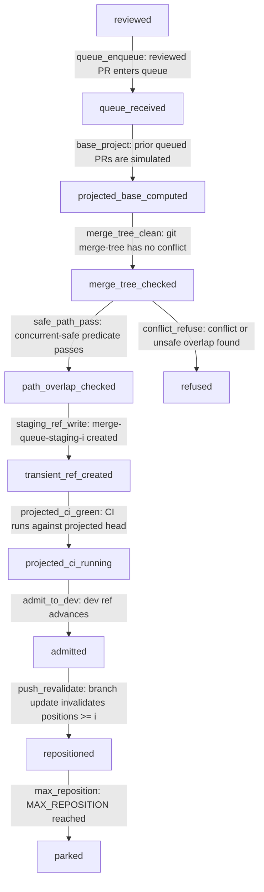

# Foundry Merge Queue Projected State

## Purpose

This spec defines the projected merge state algorithm, fix-at-any-stage revalidation, fairness rules, conflict avoidance, transient refs, and queue evidence required before a reviewed Foundry changeset may advance to dev.

It serializes internal agentic-development changesets only; consumer AI routing, tenant memory, and user-facing intelligence flows remain outside Foundry per ADR-0220.

Foundry was the internal agentic-development pipeline (RETIRED per ADR-0335 Wave 15I; absorbed into intelligence): it coordinates source changes, CI evidence, reviewer decisions, merge-queue state, and promotion state for the oyatie repository.
Foundry is not a consumer-facing AI product, not a tenant assistant, and not the place where B2B or B2C prompt history is stored.
This spec turns the ADR-level decision into an operator-readable and agent-executable substrate contract.
The contract is intentionally written with RFC 2119 and RFC 8174 keywords so policy, CI, and agent prompts can parse the same text.
The control plane treats tenant_id=oyatie as the internal tenant for internal agentic-development pipeline emissions, consistent with ADR-0263.
Every state-changing step emits an audit event and a correlated observability record before a downstream state may rely on it.
The implementation boundary is the single Foundry microservice with internal bounded contexts from ADR-0136.
The repository boundary is microservices/foundry plus repo-level governance registries and docs referenced in cross-references.
The user-facing Intelligence substrate remains separate and MUST NOT be conflated with this pipeline.
The stop condition for this spec is a changeset whose evidence, policy, CI, review, queue, and promotion state can be replayed deterministically.

## Normative Requirements

The key words MUST, MUST NOT, REQUIRED, SHALL, SHALL NOT, SHOULD, SHOULD NOT, RECOMMENDED, MAY, and OPTIONAL in this section are to be interpreted as described in RFC 2119 and RFC 8174.

1. Foundry Merge Queue Projected State MUST ensure the state transition be written before downstream consumers act.
2. Foundry Merge Queue Projected State MUST ensure the state transition carry a deterministic identifier.
3. Foundry Merge Queue Projected State MUST ensure the state transition declare its actor, action, resource, and reason.
4. Foundry Merge Queue Projected State MUST ensure the state transition fail closed when required evidence is absent.
5. Foundry Merge Queue Projected State MUST ensure the Cedar decision be written before downstream consumers act.
6. Foundry Merge Queue Projected State MUST ensure the Cedar decision carry a deterministic identifier.
7. Foundry Merge Queue Projected State MUST ensure the Cedar decision declare its actor, action, resource, and reason.
8. Foundry Merge Queue Projected State MUST ensure the Cedar decision fail closed when required evidence is absent.
9. Foundry Merge Queue Projected State MUST ensure the audit event be written before downstream consumers act.
10. Foundry Merge Queue Projected State MUST ensure the audit event carry a deterministic identifier.
11. Foundry Merge Queue Projected State MUST ensure the audit event declare its actor, action, resource, and reason.
12. Foundry Merge Queue Projected State MUST ensure the audit event fail closed when required evidence is absent.
13. Foundry Merge Queue Projected State MUST ensure the observability emission be written before downstream consumers act.
14. Foundry Merge Queue Projected State MUST ensure the observability emission carry a deterministic identifier.
15. Foundry Merge Queue Projected State MUST ensure the observability emission declare its actor, action, resource, and reason.
16. Foundry Merge Queue Projected State MUST ensure the observability emission fail closed when required evidence is absent.
17. Foundry Merge Queue Projected State MUST ensure the evidence bundle be written before downstream consumers act.
18. Foundry Merge Queue Projected State MUST ensure the evidence bundle carry a deterministic identifier.
19. Foundry Merge Queue Projected State MUST ensure the evidence bundle declare its actor, action, resource, and reason.
20. Foundry Merge Queue Projected State MUST ensure the evidence bundle fail closed when required evidence is absent.
21. Foundry Merge Queue Projected State MUST ensure the cost budget be written before downstream consumers act.
22. Foundry Merge Queue Projected State MUST ensure the cost budget carry a deterministic identifier.
23. Foundry Merge Queue Projected State MUST ensure the cost budget declare its actor, action, resource, and reason.
24. Foundry Merge Queue Projected State MUST ensure the cost budget fail closed when required evidence is absent.
25. Foundry Merge Queue Projected State MUST ensure the idempotency key be written before downstream consumers act.
26. Foundry Merge Queue Projected State MUST ensure the idempotency key carry a deterministic identifier.
27. Foundry Merge Queue Projected State MUST ensure the idempotency key declare its actor, action, resource, and reason.
28. Foundry Merge Queue Projected State MUST ensure the idempotency key fail closed when required evidence is absent.
29. Foundry Merge Queue Projected State MUST ensure the retry branch be written before downstream consumers act.
30. Foundry Merge Queue Projected State MUST ensure the retry branch carry a deterministic identifier.
31. Foundry Merge Queue Projected State MUST ensure the retry branch declare its actor, action, resource, and reason.
32. Foundry Merge Queue Projected State MUST ensure the retry branch fail closed when required evidence is absent.
33. Foundry Merge Queue Projected State MUST ensure the reviewer verdict be written before downstream consumers act.
34. Foundry Merge Queue Projected State MUST ensure the reviewer verdict carry a deterministic identifier.
35. Foundry Merge Queue Projected State MUST ensure the reviewer verdict declare its actor, action, resource, and reason.
36. Foundry Merge Queue Projected State MUST ensure the reviewer verdict fail closed when required evidence is absent.
37. Foundry Merge Queue Projected State MUST ensure the CI status be written before downstream consumers act.
38. Foundry Merge Queue Projected State MUST ensure the CI status carry a deterministic identifier.
39. Foundry Merge Queue Projected State MUST ensure the CI status declare its actor, action, resource, and reason.
40. Foundry Merge Queue Projected State MUST ensure the CI status fail closed when required evidence is absent.
41. Foundry Merge Queue Projected State MUST ensure the worktree lane be written before downstream consumers act.
42. Foundry Merge Queue Projected State MUST ensure the worktree lane carry a deterministic identifier.
43. Foundry Merge Queue Projected State MUST ensure the worktree lane declare its actor, action, resource, and reason.
44. Foundry Merge Queue Projected State MUST ensure the worktree lane fail closed when required evidence is absent.
45. Foundry Merge Queue Projected State MUST ensure the branch reference be written before downstream consumers act.
46. Foundry Merge Queue Projected State MUST ensure the branch reference carry a deterministic identifier.
47. Foundry Merge Queue Projected State MUST ensure the branch reference declare its actor, action, resource, and reason.
48. Foundry Merge Queue Projected State MUST ensure the branch reference fail closed when required evidence is absent.
49. Foundry Merge Queue Projected State MUST ensure the merge-queue position be written before downstream consumers act.
50. Foundry Merge Queue Projected State MUST ensure the merge-queue position carry a deterministic identifier.
51. Foundry Merge Queue Projected State MUST ensure the merge-queue position declare its actor, action, resource, and reason.
52. Foundry Merge Queue Projected State MUST ensure the merge-queue position fail closed when required evidence is absent.
53. Foundry Merge Queue Projected State MUST ensure the promotion target be written before downstream consumers act.
54. Foundry Merge Queue Projected State MUST ensure the promotion target carry a deterministic identifier.
55. Foundry Merge Queue Projected State MUST ensure the promotion target declare its actor, action, resource, and reason.
56. Foundry Merge Queue Projected State MUST ensure the promotion target fail closed when required evidence is absent.
57. Foundry Merge Queue Projected State MUST ensure the human override be written before downstream consumers act.
58. Foundry Merge Queue Projected State MUST ensure the human override carry a deterministic identifier.
59. Foundry Merge Queue Projected State MUST ensure the human override declare its actor, action, resource, and reason.
60. Foundry Merge Queue Projected State MUST ensure the human override fail closed when required evidence is absent.
61. Foundry Merge Queue Projected State MUST ensure the safe-path predicate be written before downstream consumers act.
62. Foundry Merge Queue Projected State MUST ensure the safe-path predicate carry a deterministic identifier.
63. Foundry Merge Queue Projected State MUST ensure the safe-path predicate declare its actor, action, resource, and reason.
64. Foundry Merge Queue Projected State MUST ensure the safe-path predicate fail closed when required evidence is absent.
65. Foundry Merge Queue Projected State MUST ensure the OpenBao secret reference be written before downstream consumers act.
66. Foundry Merge Queue Projected State MUST ensure the OpenBao secret reference carry a deterministic identifier.
67. Foundry Merge Queue Projected State MUST ensure the OpenBao secret reference declare its actor, action, resource, and reason.
68. Foundry Merge Queue Projected State MUST ensure the OpenBao secret reference fail closed when required evidence is absent.
69. Foundry Merge Queue Projected State MUST ensure the GitHub post-back be written before downstream consumers act.
70. Foundry Merge Queue Projected State MUST ensure the GitHub post-back carry a deterministic identifier.
71. Foundry Merge Queue Projected State MUST ensure the GitHub post-back declare its actor, action, resource, and reason.
72. Foundry Merge Queue Projected State MUST ensure the GitHub post-back fail closed when required evidence is absent.
73. Foundry Merge Queue Projected State MUST ensure the multispectrum evidence be written before downstream consumers act.
74. Foundry Merge Queue Projected State MUST ensure the multispectrum evidence carry a deterministic identifier.
75. Foundry Merge Queue Projected State MUST ensure the multispectrum evidence declare its actor, action, resource, and reason.
76. Foundry Merge Queue Projected State MUST ensure the multispectrum evidence fail closed when required evidence is absent.
77. Foundry Merge Queue Projected State MUST ensure the trace context be written before downstream consumers act.
78. Foundry Merge Queue Projected State MUST ensure the trace context carry a deterministic identifier.
79. Foundry Merge Queue Projected State MUST ensure the trace context declare its actor, action, resource, and reason.
80. Foundry Merge Queue Projected State MUST ensure the trace context fail closed when required evidence is absent.
81. The `queue_received` phase SHOULD expose a machine-readable status row with actor, at, evidence_uri, trace_id, and audit_id.
82. The `projected_base_computed` phase SHOULD expose a machine-readable status row with actor, at, evidence_uri, trace_id, and audit_id.
83. The `merge_tree_checked` phase SHOULD expose a machine-readable status row with actor, at, evidence_uri, trace_id, and audit_id.
84. The `path_overlap_checked` phase SHOULD expose a machine-readable status row with actor, at, evidence_uri, trace_id, and audit_id.
85. The `transient_ref_created` phase SHOULD expose a machine-readable status row with actor, at, evidence_uri, trace_id, and audit_id.
86. The `projected_ci_running` phase SHOULD expose a machine-readable status row with actor, at, evidence_uri, trace_id, and audit_id.
87. The `admitted` phase SHOULD expose a machine-readable status row with actor, at, evidence_uri, trace_id, and audit_id.
88. The `repositioned` phase SHOULD expose a machine-readable status row with actor, at, evidence_uri, trace_id, and audit_id.
89. The `parked` phase SHOULD expose a machine-readable status row with actor, at, evidence_uri, trace_id, and audit_id.
90. The `refused` phase SHOULD expose a machine-readable status row with actor, at, evidence_uri, trace_id, and audit_id.
91. Action `foundry.queue.enqueue` MUST be denied unless a matching Cedar permit binds the principal, resource, and changeset intent.
92. Action `foundry.queue.project` MUST be denied unless a matching Cedar permit binds the principal, resource, and changeset intent.
93. Action `foundry.queue.check_conflict` MUST be denied unless a matching Cedar permit binds the principal, resource, and changeset intent.
94. Action `foundry.queue.check_path_overlap` MUST be denied unless a matching Cedar permit binds the principal, resource, and changeset intent.
95. Action `foundry.queue.revalidate` MUST be denied unless a matching Cedar permit binds the principal, resource, and changeset intent.
96. Action `foundry.queue.reposition` MUST be denied unless a matching Cedar permit binds the principal, resource, and changeset intent.
97. Action `foundry.queue.park` MUST be denied unless a matching Cedar permit binds the principal, resource, and changeset intent.
98. Action `foundry.queue.admit` MUST be denied unless a matching Cedar permit binds the principal, resource, and changeset intent.
99. Implementations MAY add stricter product-local gates when they do not weaken any requirement in ADR-0111.

## State Machine / Sequence Diagram



### Named Transitions

| Transition | From | To | Guard summary | Audit event | Recovery if denied |
|---|---|---|---|---|---|
| queue_enqueue | reviewed | queue_received | reviewed PR enters queue; Cedar permit required; evidence hash present | EVT-FOUNDRY-PROJECTED-BASE-COMPUTED | Hold at reviewed; append refusal reason; request fix or human override |
| base_project | queue_received | projected_base_computed | prior queued PRs are simulated; Cedar permit required; evidence hash present | EVT-FOUNDRY-FIX-AT-ANY-STAGE-REVALIDATED | Hold at queue_received; append refusal reason; request fix or human override |
| merge_tree_clean | projected_base_computed | merge_tree_checked | git merge-tree has no conflict; Cedar permit required; evidence hash present | EVT-FOUNDRY-CONFLICT-CHECK-PASSED | Hold at projected_base_computed; append refusal reason; request fix or human override |
| safe_path_pass | merge_tree_checked | path_overlap_checked | concurrent-safe predicate passes; Cedar permit required; evidence hash present | EVT-FOUNDRY-MERGE-QUEUE-ENQUEUED | Hold at merge_tree_checked; append refusal reason; request fix or human override |
| staging_ref_write | path_overlap_checked | transient_ref_created | merge-queue-staging-i created; Cedar permit required; evidence hash present | EVT-FOUNDRY-QUEUE-PARKED | Hold at path_overlap_checked; append refusal reason; request fix or human override |
| projected_ci_green | transient_ref_created | projected_ci_running | CI runs against projected head; Cedar permit required; evidence hash present | EVT-FOUNDRY-PROJECTED-BASE-COMPUTED | Hold at transient_ref_created; append refusal reason; request fix or human override |
| admit_to_dev | projected_ci_running | admitted | dev ref advances; Cedar permit required; evidence hash present | EVT-FOUNDRY-MERGE-QUEUE-ENQUEUED | Hold at projected_ci_running; append refusal reason; request fix or human override |
| push_revalidate | admitted | repositioned | branch update invalidates positions >= i; Cedar permit required; evidence hash present | EVT-FOUNDRY-FIX-AT-ANY-STAGE-REVALIDATED | Hold at admitted; append refusal reason; request fix or human override |
| max_reposition | repositioned | parked | MAX_REPOSITION reached; Cedar permit required; evidence hash present | EVT-FOUNDRY-MERGE-QUEUE-ENQUEUED | Hold at repositioned; append refusal reason; request fix or human override |
| conflict_refuse | merge_tree_checked | refused | conflict or unsafe overlap found; Cedar permit required; evidence hash present | EVT-FOUNDRY-CONFLICT-CHECK-PASSED | Hold at merge_tree_checked; append refusal reason; request fix or human override |
| replay-check-01 | reviewed | queue_received | Replay validates queue_received ordering, signature, budget, and trace context | EVT-FOUNDRY-MERGE-QUEUE-ENQUEUED | Recompute from append-only log and refuse non-monotonic row |
| replay-check-02 | queue_received | projected_base_computed | Replay validates projected_base_computed ordering, signature, budget, and trace context | EVT-FOUNDRY-PROJECTED-BASE-COMPUTED | Recompute from append-only log and refuse non-monotonic row |
| replay-check-03 | projected_base_computed | merge_tree_checked | Replay validates merge_tree_checked ordering, signature, budget, and trace context | EVT-FOUNDRY-CONFLICT-CHECK-PASSED | Recompute from append-only log and refuse non-monotonic row |
| replay-check-04 | merge_tree_checked | path_overlap_checked | Replay validates path_overlap_checked ordering, signature, budget, and trace context | EVT-FOUNDRY-FIX-AT-ANY-STAGE-REVALIDATED | Recompute from append-only log and refuse non-monotonic row |
| replay-check-05 | path_overlap_checked | transient_ref_created | Replay validates transient_ref_created ordering, signature, budget, and trace context | EVT-FOUNDRY-QUEUE-PARKED | Recompute from append-only log and refuse non-monotonic row |
| replay-check-06 | transient_ref_created | projected_ci_running | Replay validates projected_ci_running ordering, signature, budget, and trace context | EVT-FOUNDRY-MERGE-QUEUE-ENQUEUED | Recompute from append-only log and refuse non-monotonic row |
| replay-check-07 | projected_ci_running | admitted | Replay validates admitted ordering, signature, budget, and trace context | EVT-FOUNDRY-PROJECTED-BASE-COMPUTED | Recompute from append-only log and refuse non-monotonic row |
| replay-check-08 | admitted | repositioned | Replay validates repositioned ordering, signature, budget, and trace context | EVT-FOUNDRY-CONFLICT-CHECK-PASSED | Recompute from append-only log and refuse non-monotonic row |
| replay-check-09 | repositioned | parked | Replay validates parked ordering, signature, budget, and trace context | EVT-FOUNDRY-FIX-AT-ANY-STAGE-REVALIDATED | Recompute from append-only log and refuse non-monotonic row |
| replay-check-10 | merge_tree_checked | refused | Replay validates refused ordering, signature, budget, and trace context | EVT-FOUNDRY-QUEUE-PARKED | Recompute from append-only log and refuse non-monotonic row |
| replay-check-11 | reviewed | queue_received | Replay validates queue_received ordering, signature, budget, and trace context | EVT-FOUNDRY-MERGE-QUEUE-ENQUEUED | Recompute from append-only log and refuse non-monotonic row |
| replay-check-12 | queue_received | projected_base_computed | Replay validates projected_base_computed ordering, signature, budget, and trace context | EVT-FOUNDRY-PROJECTED-BASE-COMPUTED | Recompute from append-only log and refuse non-monotonic row |
| replay-check-13 | projected_base_computed | merge_tree_checked | Replay validates merge_tree_checked ordering, signature, budget, and trace context | EVT-FOUNDRY-CONFLICT-CHECK-PASSED | Recompute from append-only log and refuse non-monotonic row |
| replay-check-14 | merge_tree_checked | path_overlap_checked | Replay validates path_overlap_checked ordering, signature, budget, and trace context | EVT-FOUNDRY-FIX-AT-ANY-STAGE-REVALIDATED | Recompute from append-only log and refuse non-monotonic row |
| replay-check-15 | path_overlap_checked | transient_ref_created | Replay validates transient_ref_created ordering, signature, budget, and trace context | EVT-FOUNDRY-QUEUE-PARKED | Recompute from append-only log and refuse non-monotonic row |
| replay-check-16 | transient_ref_created | projected_ci_running | Replay validates projected_ci_running ordering, signature, budget, and trace context | EVT-FOUNDRY-MERGE-QUEUE-ENQUEUED | Recompute from append-only log and refuse non-monotonic row |
| replay-check-17 | projected_ci_running | admitted | Replay validates admitted ordering, signature, budget, and trace context | EVT-FOUNDRY-PROJECTED-BASE-COMPUTED | Recompute from append-only log and refuse non-monotonic row |
| replay-check-18 | admitted | repositioned | Replay validates repositioned ordering, signature, budget, and trace context | EVT-FOUNDRY-CONFLICT-CHECK-PASSED | Recompute from append-only log and refuse non-monotonic row |
| replay-check-19 | repositioned | parked | Replay validates parked ordering, signature, budget, and trace context | EVT-FOUNDRY-FIX-AT-ANY-STAGE-REVALIDATED | Recompute from append-only log and refuse non-monotonic row |
| replay-check-20 | merge_tree_checked | refused | Replay validates refused ordering, signature, budget, and trace context | EVT-FOUNDRY-QUEUE-PARKED | Recompute from append-only log and refuse non-monotonic row |
| replay-check-21 | reviewed | queue_received | Replay validates queue_received ordering, signature, budget, and trace context | EVT-FOUNDRY-MERGE-QUEUE-ENQUEUED | Recompute from append-only log and refuse non-monotonic row |
| replay-check-22 | queue_received | projected_base_computed | Replay validates projected_base_computed ordering, signature, budget, and trace context | EVT-FOUNDRY-PROJECTED-BASE-COMPUTED | Recompute from append-only log and refuse non-monotonic row |
| replay-check-23 | projected_base_computed | merge_tree_checked | Replay validates merge_tree_checked ordering, signature, budget, and trace context | EVT-FOUNDRY-CONFLICT-CHECK-PASSED | Recompute from append-only log and refuse non-monotonic row |
| replay-check-24 | merge_tree_checked | path_overlap_checked | Replay validates path_overlap_checked ordering, signature, budget, and trace context | EVT-FOUNDRY-FIX-AT-ANY-STAGE-REVALIDATED | Recompute from append-only log and refuse non-monotonic row |
| replay-check-25 | path_overlap_checked | transient_ref_created | Replay validates transient_ref_created ordering, signature, budget, and trace context | EVT-FOUNDRY-QUEUE-PARKED | Recompute from append-only log and refuse non-monotonic row |
| replay-check-26 | transient_ref_created | projected_ci_running | Replay validates projected_ci_running ordering, signature, budget, and trace context | EVT-FOUNDRY-MERGE-QUEUE-ENQUEUED | Recompute from append-only log and refuse non-monotonic row |
| replay-check-27 | projected_ci_running | admitted | Replay validates admitted ordering, signature, budget, and trace context | EVT-FOUNDRY-PROJECTED-BASE-COMPUTED | Recompute from append-only log and refuse non-monotonic row |
| replay-check-28 | admitted | repositioned | Replay validates repositioned ordering, signature, budget, and trace context | EVT-FOUNDRY-CONFLICT-CHECK-PASSED | Recompute from append-only log and refuse non-monotonic row |
| replay-check-29 | repositioned | parked | Replay validates parked ordering, signature, budget, and trace context | EVT-FOUNDRY-FIX-AT-ANY-STAGE-REVALIDATED | Recompute from append-only log and refuse non-monotonic row |
| replay-check-30 | merge_tree_checked | refused | Replay validates refused ordering, signature, budget, and trace context | EVT-FOUNDRY-QUEUE-PARKED | Recompute from append-only log and refuse non-monotonic row |
| replay-check-31 | reviewed | queue_received | Replay validates queue_received ordering, signature, budget, and trace context | EVT-FOUNDRY-MERGE-QUEUE-ENQUEUED | Recompute from append-only log and refuse non-monotonic row |
| replay-check-32 | queue_received | projected_base_computed | Replay validates projected_base_computed ordering, signature, budget, and trace context | EVT-FOUNDRY-PROJECTED-BASE-COMPUTED | Recompute from append-only log and refuse non-monotonic row |
| replay-check-33 | projected_base_computed | merge_tree_checked | Replay validates merge_tree_checked ordering, signature, budget, and trace context | EVT-FOUNDRY-CONFLICT-CHECK-PASSED | Recompute from append-only log and refuse non-monotonic row |
| replay-check-34 | merge_tree_checked | path_overlap_checked | Replay validates path_overlap_checked ordering, signature, budget, and trace context | EVT-FOUNDRY-FIX-AT-ANY-STAGE-REVALIDATED | Recompute from append-only log and refuse non-monotonic row |
| replay-check-35 | path_overlap_checked | transient_ref_created | Replay validates transient_ref_created ordering, signature, budget, and trace context | EVT-FOUNDRY-QUEUE-PARKED | Recompute from append-only log and refuse non-monotonic row |
| replay-check-36 | transient_ref_created | projected_ci_running | Replay validates projected_ci_running ordering, signature, budget, and trace context | EVT-FOUNDRY-MERGE-QUEUE-ENQUEUED | Recompute from append-only log and refuse non-monotonic row |
| replay-check-37 | projected_ci_running | admitted | Replay validates admitted ordering, signature, budget, and trace context | EVT-FOUNDRY-PROJECTED-BASE-COMPUTED | Recompute from append-only log and refuse non-monotonic row |
| replay-check-38 | admitted | repositioned | Replay validates repositioned ordering, signature, budget, and trace context | EVT-FOUNDRY-CONFLICT-CHECK-PASSED | Recompute from append-only log and refuse non-monotonic row |
| replay-check-39 | repositioned | parked | Replay validates parked ordering, signature, budget, and trace context | EVT-FOUNDRY-FIX-AT-ANY-STAGE-REVALIDATED | Recompute from append-only log and refuse non-monotonic row |
| replay-check-40 | merge_tree_checked | refused | Replay validates refused ordering, signature, budget, and trace context | EVT-FOUNDRY-QUEUE-PARKED | Recompute from append-only log and refuse non-monotonic row |
| replay-check-41 | reviewed | queue_received | Replay validates queue_received ordering, signature, budget, and trace context | EVT-FOUNDRY-MERGE-QUEUE-ENQUEUED | Recompute from append-only log and refuse non-monotonic row |
| replay-check-42 | queue_received | projected_base_computed | Replay validates projected_base_computed ordering, signature, budget, and trace context | EVT-FOUNDRY-PROJECTED-BASE-COMPUTED | Recompute from append-only log and refuse non-monotonic row |
| replay-check-43 | projected_base_computed | merge_tree_checked | Replay validates merge_tree_checked ordering, signature, budget, and trace context | EVT-FOUNDRY-CONFLICT-CHECK-PASSED | Recompute from append-only log and refuse non-monotonic row |
| replay-check-44 | merge_tree_checked | path_overlap_checked | Replay validates path_overlap_checked ordering, signature, budget, and trace context | EVT-FOUNDRY-FIX-AT-ANY-STAGE-REVALIDATED | Recompute from append-only log and refuse non-monotonic row |
| replay-check-45 | path_overlap_checked | transient_ref_created | Replay validates transient_ref_created ordering, signature, budget, and trace context | EVT-FOUNDRY-QUEUE-PARKED | Recompute from append-only log and refuse non-monotonic row |
| replay-check-46 | transient_ref_created | projected_ci_running | Replay validates projected_ci_running ordering, signature, budget, and trace context | EVT-FOUNDRY-MERGE-QUEUE-ENQUEUED | Recompute from append-only log and refuse non-monotonic row |
| replay-check-47 | projected_ci_running | admitted | Replay validates admitted ordering, signature, budget, and trace context | EVT-FOUNDRY-PROJECTED-BASE-COMPUTED | Recompute from append-only log and refuse non-monotonic row |
| replay-check-48 | admitted | repositioned | Replay validates repositioned ordering, signature, budget, and trace context | EVT-FOUNDRY-CONFLICT-CHECK-PASSED | Recompute from append-only log and refuse non-monotonic row |
| replay-check-49 | repositioned | parked | Replay validates parked ordering, signature, budget, and trace context | EVT-FOUNDRY-FIX-AT-ANY-STAGE-REVALIDATED | Recompute from append-only log and refuse non-monotonic row |
| replay-check-50 | merge_tree_checked | refused | Replay validates refused ordering, signature, budget, and trace context | EVT-FOUNDRY-QUEUE-PARKED | Recompute from append-only log and refuse non-monotonic row |
| replay-check-51 | reviewed | queue_received | Replay validates queue_received ordering, signature, budget, and trace context | EVT-FOUNDRY-MERGE-QUEUE-ENQUEUED | Recompute from append-only log and refuse non-monotonic row |
| replay-check-52 | queue_received | projected_base_computed | Replay validates projected_base_computed ordering, signature, budget, and trace context | EVT-FOUNDRY-PROJECTED-BASE-COMPUTED | Recompute from append-only log and refuse non-monotonic row |
| replay-check-53 | projected_base_computed | merge_tree_checked | Replay validates merge_tree_checked ordering, signature, budget, and trace context | EVT-FOUNDRY-CONFLICT-CHECK-PASSED | Recompute from append-only log and refuse non-monotonic row |
| replay-check-54 | merge_tree_checked | path_overlap_checked | Replay validates path_overlap_checked ordering, signature, budget, and trace context | EVT-FOUNDRY-FIX-AT-ANY-STAGE-REVALIDATED | Recompute from append-only log and refuse non-monotonic row |

## Cedar Policy Bindings

The bindings below use specific internal principals, actions, and resources. A deny from any narrower policy wins over these permits.

| Binding | Principal | Action | Resource | Required context | Decision |
|---|---|---|---|---|---|
| B-001 | Principal::"oyatie.agent.codex" | Action::"foundry.queue.enqueue" | Resource::"ref:merge-queue-staging-*" | workflow=foundry_pipeline; tenant_id=oyatie; intent=merge-queue-projected-state | permit when evidence_hash and changeset_id are present |
| B-002 | Principal::"oyatie.agent.codex" | Action::"foundry.queue.project" | Resource::"safe-paths:registry/vcs/concurrent-safe-paths.yaml" | workflow=foundry_pipeline; tenant_id=oyatie; intent=merge-queue-projected-state | permit when evidence_hash and changeset_id are present |
| B-003 | Principal::"oyatie.agent.codex" | Action::"foundry.queue.check_conflict" | Resource::"tick-log:registry/vcs/merge-queue-tick-log.json" | workflow=foundry_pipeline; tenant_id=oyatie; intent=merge-queue-projected-state | permit when evidence_hash and changeset_id are present |
| B-004 | Principal::"oyatie.agent.codex" | Action::"foundry.queue.check_path_overlap" | Resource::"repo:oyatie/microservices/foundry" | workflow=foundry_pipeline; tenant_id=oyatie; intent=merge-queue-projected-state | permit when evidence_hash and changeset_id are present |
| B-005 | Principal::"oyatie.agent.codex" | Action::"foundry.queue.revalidate" | Resource::"branch:dev" | workflow=foundry_pipeline; tenant_id=oyatie; intent=merge-queue-projected-state | permit when evidence_hash and changeset_id are present |
| B-006 | Principal::"oyatie.agent.claude-opus" | Action::"foundry.queue.enqueue" | Resource::"queue:foundry-dev" | workflow=foundry_pipeline; tenant_id=oyatie; intent=merge-queue-projected-state | permit when evidence_hash and changeset_id are present |
| B-007 | Principal::"oyatie.agent.claude-opus" | Action::"foundry.queue.project" | Resource::"event-log:registry/vcs/changeset-event-log.json" | workflow=foundry_pipeline; tenant_id=oyatie; intent=merge-queue-projected-state | permit when evidence_hash and changeset_id are present |
| B-008 | Principal::"oyatie.agent.claude-opus" | Action::"foundry.queue.check_conflict" | Resource::"event-router:registry/vcs/event-router.yaml" | workflow=foundry_pipeline; tenant_id=oyatie; intent=merge-queue-projected-state | permit when evidence_hash and changeset_id are present |
| B-009 | Principal::"oyatie.agent.claude-opus" | Action::"foundry.queue.check_path_overlap" | Resource::"safe-paths:registry/vcs/concurrent-safe-paths.yaml" | workflow=foundry_pipeline; tenant_id=oyatie; intent=merge-queue-projected-state | permit when evidence_hash and changeset_id are present |
| B-010 | Principal::"oyatie.agent.claude-opus" | Action::"foundry.queue.revalidate" | Resource::"evidence:evidence/multispectrum" | workflow=foundry_pipeline; tenant_id=oyatie; intent=merge-queue-projected-state | permit when evidence_hash and changeset_id are present |
| B-011 | Principal::"oyatie.agent.planner" | Action::"foundry.queue.enqueue" | Resource::"audit:event-class/foundry" | workflow=foundry_pipeline; tenant_id=oyatie; intent=merge-queue-projected-state | permit when evidence_hash and changeset_id are present |
| B-012 | Principal::"oyatie.agent.planner" | Action::"foundry.queue.project" | Resource::"queue:foundry-dev" | workflow=foundry_pipeline; tenant_id=oyatie; intent=merge-queue-projected-state | permit when evidence_hash and changeset_id are present |
| B-013 | Principal::"oyatie.agent.planner" | Action::"foundry.queue.check_conflict" | Resource::"ref:merge-queue-staging-*" | workflow=foundry_pipeline; tenant_id=oyatie; intent=merge-queue-projected-state | permit when evidence_hash and changeset_id are present |
| B-014 | Principal::"oyatie.agent.planner" | Action::"foundry.queue.check_path_overlap" | Resource::"safe-paths:registry/vcs/concurrent-safe-paths.yaml" | workflow=foundry_pipeline; tenant_id=oyatie; intent=merge-queue-projected-state | permit when evidence_hash and changeset_id are present |
| B-015 | Principal::"oyatie.agent.planner" | Action::"foundry.queue.revalidate" | Resource::"tick-log:registry/vcs/merge-queue-tick-log.json" | workflow=foundry_pipeline; tenant_id=oyatie; intent=merge-queue-projected-state | permit when evidence_hash and changeset_id are present |
| B-016 | Principal::"oyatie.agent.executor" | Action::"foundry.queue.enqueue" | Resource::"repo:oyatie/microservices/foundry" | workflow=foundry_pipeline; tenant_id=oyatie; intent=merge-queue-projected-state | permit when evidence_hash and changeset_id are present |
| B-017 | Principal::"oyatie.agent.executor" | Action::"foundry.queue.project" | Resource::"branch:dev" | workflow=foundry_pipeline; tenant_id=oyatie; intent=merge-queue-projected-state | permit when evidence_hash and changeset_id are present |
| B-018 | Principal::"oyatie.agent.executor" | Action::"foundry.queue.check_conflict" | Resource::"queue:foundry-dev" | workflow=foundry_pipeline; tenant_id=oyatie; intent=merge-queue-projected-state | permit when evidence_hash and changeset_id are present |
| B-019 | Principal::"oyatie.agent.executor" | Action::"foundry.queue.check_path_overlap" | Resource::"event-log:registry/vcs/changeset-event-log.json" | workflow=foundry_pipeline; tenant_id=oyatie; intent=merge-queue-projected-state | permit when evidence_hash and changeset_id are present |
| B-020 | Principal::"oyatie.agent.executor" | Action::"foundry.queue.revalidate" | Resource::"event-router:registry/vcs/event-router.yaml" | workflow=foundry_pipeline; tenant_id=oyatie; intent=merge-queue-projected-state | permit when evidence_hash and changeset_id are present |
| B-021 | Principal::"oyatie.service.vcs-orchestrator" | Action::"foundry.queue.enqueue" | Resource::"safe-paths:registry/vcs/concurrent-safe-paths.yaml" | workflow=foundry_pipeline; tenant_id=oyatie; intent=merge-queue-projected-state | permit when evidence_hash and changeset_id are present |
| B-022 | Principal::"oyatie.service.vcs-orchestrator" | Action::"foundry.queue.project" | Resource::"evidence:evidence/multispectrum" | workflow=foundry_pipeline; tenant_id=oyatie; intent=merge-queue-projected-state | permit when evidence_hash and changeset_id are present |
| B-023 | Principal::"oyatie.service.vcs-orchestrator" | Action::"foundry.queue.check_conflict" | Resource::"audit:event-class/foundry" | workflow=foundry_pipeline; tenant_id=oyatie; intent=merge-queue-projected-state | permit when evidence_hash and changeset_id are present |
| B-024 | Principal::"oyatie.service.vcs-orchestrator" | Action::"foundry.queue.check_path_overlap" | Resource::"queue:foundry-dev" | workflow=foundry_pipeline; tenant_id=oyatie; intent=merge-queue-projected-state | permit when evidence_hash and changeset_id are present |
| B-025 | Principal::"oyatie.service.vcs-orchestrator" | Action::"foundry.queue.revalidate" | Resource::"ref:merge-queue-staging-*" | workflow=foundry_pipeline; tenant_id=oyatie; intent=merge-queue-projected-state | permit when evidence_hash and changeset_id are present |
| B-026 | Principal::"oyatie.service.webhook-receiver" | Action::"foundry.queue.enqueue" | Resource::"safe-paths:registry/vcs/concurrent-safe-paths.yaml" | workflow=foundry_pipeline; tenant_id=oyatie; intent=merge-queue-projected-state | permit when evidence_hash and changeset_id are present |
| B-027 | Principal::"oyatie.service.webhook-receiver" | Action::"foundry.queue.project" | Resource::"tick-log:registry/vcs/merge-queue-tick-log.json" | workflow=foundry_pipeline; tenant_id=oyatie; intent=merge-queue-projected-state | permit when evidence_hash and changeset_id are present |
| B-028 | Principal::"oyatie.service.webhook-receiver" | Action::"foundry.queue.check_conflict" | Resource::"repo:oyatie/microservices/foundry" | workflow=foundry_pipeline; tenant_id=oyatie; intent=merge-queue-projected-state | permit when evidence_hash and changeset_id are present |
| B-029 | Principal::"oyatie.service.webhook-receiver" | Action::"foundry.queue.check_path_overlap" | Resource::"branch:dev" | workflow=foundry_pipeline; tenant_id=oyatie; intent=merge-queue-projected-state | permit when evidence_hash and changeset_id are present |
| B-030 | Principal::"oyatie.service.webhook-receiver" | Action::"foundry.queue.revalidate" | Resource::"queue:foundry-dev" | workflow=foundry_pipeline; tenant_id=oyatie; intent=merge-queue-projected-state | permit when evidence_hash and changeset_id are present |
| B-031 | Principal::"oyatie.service.merge-queue" | Action::"foundry.queue.enqueue" | Resource::"event-log:registry/vcs/changeset-event-log.json" | workflow=foundry_pipeline; tenant_id=oyatie; intent=merge-queue-projected-state | permit when evidence_hash and changeset_id are present |
| B-032 | Principal::"oyatie.service.merge-queue" | Action::"foundry.queue.project" | Resource::"event-router:registry/vcs/event-router.yaml" | workflow=foundry_pipeline; tenant_id=oyatie; intent=merge-queue-projected-state | permit when evidence_hash and changeset_id are present |
| B-033 | Principal::"oyatie.service.merge-queue" | Action::"foundry.queue.check_conflict" | Resource::"safe-paths:registry/vcs/concurrent-safe-paths.yaml" | workflow=foundry_pipeline; tenant_id=oyatie; intent=merge-queue-projected-state | permit when evidence_hash and changeset_id are present |
| B-034 | Principal::"oyatie.service.merge-queue" | Action::"foundry.queue.check_path_overlap" | Resource::"evidence:evidence/multispectrum" | workflow=foundry_pipeline; tenant_id=oyatie; intent=merge-queue-projected-state | permit when evidence_hash and changeset_id are present |
| B-035 | Principal::"oyatie.service.merge-queue" | Action::"foundry.queue.revalidate" | Resource::"audit:event-class/foundry" | workflow=foundry_pipeline; tenant_id=oyatie; intent=merge-queue-projected-state | permit when evidence_hash and changeset_id are present |
| B-036 | Principal::"oyatie.service.admission-gate" | Action::"foundry.queue.enqueue" | Resource::"queue:foundry-dev" | workflow=foundry_pipeline; tenant_id=oyatie; intent=merge-queue-projected-state | permit when evidence_hash and changeset_id are present |
| B-037 | Principal::"oyatie.service.admission-gate" | Action::"foundry.queue.project" | Resource::"ref:merge-queue-staging-*" | workflow=foundry_pipeline; tenant_id=oyatie; intent=merge-queue-projected-state | permit when evidence_hash and changeset_id are present |
| B-038 | Principal::"oyatie.service.admission-gate" | Action::"foundry.queue.check_conflict" | Resource::"safe-paths:registry/vcs/concurrent-safe-paths.yaml" | workflow=foundry_pipeline; tenant_id=oyatie; intent=merge-queue-projected-state | permit when evidence_hash and changeset_id are present |
| B-039 | Principal::"oyatie.service.admission-gate" | Action::"foundry.queue.check_path_overlap" | Resource::"tick-log:registry/vcs/merge-queue-tick-log.json" | workflow=foundry_pipeline; tenant_id=oyatie; intent=merge-queue-projected-state | permit when evidence_hash and changeset_id are present |
| B-040 | Principal::"oyatie.service.admission-gate" | Action::"foundry.queue.revalidate" | Resource::"repo:oyatie/microservices/foundry" | workflow=foundry_pipeline; tenant_id=oyatie; intent=merge-queue-projected-state | permit when evidence_hash and changeset_id are present |
| B-041 | Principal::"oyatie.service.completion-gate" | Action::"foundry.queue.enqueue" | Resource::"branch:dev" | workflow=foundry_pipeline; tenant_id=oyatie; intent=merge-queue-projected-state | permit when evidence_hash and changeset_id are present |
| B-042 | Principal::"oyatie.service.completion-gate" | Action::"foundry.queue.project" | Resource::"queue:foundry-dev" | workflow=foundry_pipeline; tenant_id=oyatie; intent=merge-queue-projected-state | permit when evidence_hash and changeset_id are present |
| B-043 | Principal::"oyatie.service.completion-gate" | Action::"foundry.queue.check_conflict" | Resource::"event-log:registry/vcs/changeset-event-log.json" | workflow=foundry_pipeline; tenant_id=oyatie; intent=merge-queue-projected-state | permit when evidence_hash and changeset_id are present |
| B-044 | Principal::"oyatie.service.completion-gate" | Action::"foundry.queue.check_path_overlap" | Resource::"event-router:registry/vcs/event-router.yaml" | workflow=foundry_pipeline; tenant_id=oyatie; intent=merge-queue-projected-state | permit when evidence_hash and changeset_id are present |
| B-045 | Principal::"oyatie.service.completion-gate" | Action::"foundry.queue.revalidate" | Resource::"safe-paths:registry/vcs/concurrent-safe-paths.yaml" | workflow=foundry_pipeline; tenant_id=oyatie; intent=merge-queue-projected-state | permit when evidence_hash and changeset_id are present |
| B-046 | Principal::"oyatie.human.reviewer" | Action::"foundry.queue.enqueue" | Resource::"evidence:evidence/multispectrum" | workflow=foundry_pipeline; tenant_id=oyatie; intent=merge-queue-projected-state | permit when evidence_hash and changeset_id are present |
| B-047 | Principal::"oyatie.human.reviewer" | Action::"foundry.queue.project" | Resource::"audit:event-class/foundry" | workflow=foundry_pipeline; tenant_id=oyatie; intent=merge-queue-projected-state | permit when evidence_hash and changeset_id are present |
| B-048 | Principal::"oyatie.human.reviewer" | Action::"foundry.queue.check_conflict" | Resource::"queue:foundry-dev" | workflow=foundry_pipeline; tenant_id=oyatie; intent=merge-queue-projected-state | permit when evidence_hash and changeset_id are present |
| B-049 | Principal::"oyatie.human.reviewer" | Action::"foundry.queue.check_path_overlap" | Resource::"ref:merge-queue-staging-*" | workflow=foundry_pipeline; tenant_id=oyatie; intent=merge-queue-projected-state | permit when evidence_hash and changeset_id are present |
| B-050 | Principal::"oyatie.human.reviewer" | Action::"foundry.queue.revalidate" | Resource::"safe-paths:registry/vcs/concurrent-safe-paths.yaml" | workflow=foundry_pipeline; tenant_id=oyatie; intent=merge-queue-projected-state | permit when evidence_hash and changeset_id are present |

```cedar
permit(
  principal in Principal::"oyatie.agent.codex",
  action == Action::"foundry.queue.enqueue",
  resource in Resource::"repo:oyatie/microservices/foundry"
) when {
  context.tenant_id == "oyatie" &&
  context.workflow == "foundry_pipeline" &&
  context.related_adr == "ADR-0111" &&
  context.evidence_hash != "" &&
  context.trace_id != ""
};

permit(
  principal in Principal::"oyatie.agent.codex",
  action == Action::"foundry.queue.project",
  resource in Resource::"repo:oyatie/microservices/foundry"
) when {
  context.tenant_id == "oyatie" &&
  context.workflow == "foundry_pipeline" &&
  context.related_adr == "ADR-0111" &&
  context.evidence_hash != "" &&
  context.trace_id != ""
};

permit(
  principal in Principal::"oyatie.agent.codex",
  action == Action::"foundry.queue.check_conflict",
  resource in Resource::"repo:oyatie/microservices/foundry"
) when {
  context.tenant_id == "oyatie" &&
  context.workflow == "foundry_pipeline" &&
  context.related_adr == "ADR-0111" &&
  context.evidence_hash != "" &&
  context.trace_id != ""
};

permit(
  principal in Principal::"oyatie.agent.codex",
  action == Action::"foundry.queue.check_path_overlap",
  resource in Resource::"repo:oyatie/microservices/foundry"
) when {
  context.tenant_id == "oyatie" &&
  context.workflow == "foundry_pipeline" &&
  context.related_adr == "ADR-0111" &&
  context.evidence_hash != "" &&
  context.trace_id != ""
};

forbid(
  principal,
  action,
  resource in Resource::"repo:oyatie/microservices/foundry/decisions"
) when {
  context.intent == "merge-queue-projected-state" &&
  context.owner != "per-msvc-adrs-batch-d"
};
```

### Cedar Guard Catalog

- Guard 01: Principal::"oyatie.agent.codex" may invoke foundry.queue.enqueue on Resource::"queue:foundry-dev" only while `queue_received` is current, the changeset id is stable, the event is signed, and the ADR-0111 invariant is cited.
- Guard 02: Principal::"oyatie.agent.claude-opus" may invoke foundry.queue.project on Resource::"ref:merge-queue-staging-*" only while `projected_base_computed` is current, the changeset id is stable, the event is signed, and the ADR-0111 invariant is cited.
- Guard 03: Principal::"oyatie.agent.planner" may invoke foundry.queue.check_conflict on Resource::"safe-paths:registry/vcs/concurrent-safe-paths.yaml" only while `merge_tree_checked` is current, the changeset id is stable, the event is signed, and the ADR-0111 invariant is cited.
- Guard 04: Principal::"oyatie.agent.executor" may invoke foundry.queue.check_path_overlap on Resource::"tick-log:registry/vcs/merge-queue-tick-log.json" only while `path_overlap_checked` is current, the changeset id is stable, the event is signed, and the ADR-0111 invariant is cited.
- Guard 05: Principal::"oyatie.service.vcs-orchestrator" may invoke foundry.queue.revalidate on Resource::"repo:oyatie/microservices/foundry" only while `transient_ref_created` is current, the changeset id is stable, the event is signed, and the ADR-0111 invariant is cited.
- Guard 06: Principal::"oyatie.service.webhook-receiver" may invoke foundry.queue.reposition on Resource::"branch:dev" only while `projected_ci_running` is current, the changeset id is stable, the event is signed, and the ADR-0111 invariant is cited.
- Guard 07: Principal::"oyatie.service.merge-queue" may invoke foundry.queue.park on Resource::"queue:foundry-dev" only while `admitted` is current, the changeset id is stable, the event is signed, and the ADR-0111 invariant is cited.
- Guard 08: Principal::"oyatie.service.admission-gate" may invoke foundry.queue.admit on Resource::"event-log:registry/vcs/changeset-event-log.json" only while `repositioned` is current, the changeset id is stable, the event is signed, and the ADR-0111 invariant is cited.
- Guard 09: Principal::"oyatie.service.completion-gate" may invoke foundry.queue.enqueue on Resource::"event-router:registry/vcs/event-router.yaml" only while `parked` is current, the changeset id is stable, the event is signed, and the ADR-0111 invariant is cited.
- Guard 10: Principal::"oyatie.human.reviewer" may invoke foundry.queue.project on Resource::"safe-paths:registry/vcs/concurrent-safe-paths.yaml" only while `refused` is current, the changeset id is stable, the event is signed, and the ADR-0111 invariant is cited.
- Guard 11: Principal::"oyatie.agent.codex" may invoke foundry.queue.check_conflict on Resource::"evidence:evidence/multispectrum" only while `queue_received` is current, the changeset id is stable, the event is signed, and the ADR-0111 invariant is cited.
- Guard 12: Principal::"oyatie.agent.claude-opus" may invoke foundry.queue.check_path_overlap on Resource::"audit:event-class/foundry" only while `projected_base_computed` is current, the changeset id is stable, the event is signed, and the ADR-0111 invariant is cited.
- Guard 13: Principal::"oyatie.agent.planner" may invoke foundry.queue.revalidate on Resource::"queue:foundry-dev" only while `merge_tree_checked` is current, the changeset id is stable, the event is signed, and the ADR-0111 invariant is cited.
- Guard 14: Principal::"oyatie.agent.executor" may invoke foundry.queue.reposition on Resource::"ref:merge-queue-staging-*" only while `path_overlap_checked` is current, the changeset id is stable, the event is signed, and the ADR-0111 invariant is cited.
- Guard 15: Principal::"oyatie.service.vcs-orchestrator" may invoke foundry.queue.park on Resource::"safe-paths:registry/vcs/concurrent-safe-paths.yaml" only while `transient_ref_created` is current, the changeset id is stable, the event is signed, and the ADR-0111 invariant is cited.
- Guard 16: Principal::"oyatie.service.webhook-receiver" may invoke foundry.queue.admit on Resource::"tick-log:registry/vcs/merge-queue-tick-log.json" only while `projected_ci_running` is current, the changeset id is stable, the event is signed, and the ADR-0111 invariant is cited.
- Guard 17: Principal::"oyatie.service.merge-queue" may invoke foundry.queue.enqueue on Resource::"repo:oyatie/microservices/foundry" only while `admitted` is current, the changeset id is stable, the event is signed, and the ADR-0111 invariant is cited.
- Guard 18: Principal::"oyatie.service.admission-gate" may invoke foundry.queue.project on Resource::"branch:dev" only while `repositioned` is current, the changeset id is stable, the event is signed, and the ADR-0111 invariant is cited.
- Guard 19: Principal::"oyatie.service.completion-gate" may invoke foundry.queue.check_conflict on Resource::"queue:foundry-dev" only while `parked` is current, the changeset id is stable, the event is signed, and the ADR-0111 invariant is cited.
- Guard 20: Principal::"oyatie.human.reviewer" may invoke foundry.queue.check_path_overlap on Resource::"event-log:registry/vcs/changeset-event-log.json" only while `refused` is current, the changeset id is stable, the event is signed, and the ADR-0111 invariant is cited.
- Guard 21: Principal::"oyatie.agent.codex" may invoke foundry.queue.revalidate on Resource::"event-router:registry/vcs/event-router.yaml" only while `queue_received` is current, the changeset id is stable, the event is signed, and the ADR-0111 invariant is cited.
- Guard 22: Principal::"oyatie.agent.claude-opus" may invoke foundry.queue.reposition on Resource::"safe-paths:registry/vcs/concurrent-safe-paths.yaml" only while `projected_base_computed` is current, the changeset id is stable, the event is signed, and the ADR-0111 invariant is cited.
- Guard 23: Principal::"oyatie.agent.planner" may invoke foundry.queue.park on Resource::"evidence:evidence/multispectrum" only while `merge_tree_checked` is current, the changeset id is stable, the event is signed, and the ADR-0111 invariant is cited.
- Guard 24: Principal::"oyatie.agent.executor" may invoke foundry.queue.admit on Resource::"audit:event-class/foundry" only while `path_overlap_checked` is current, the changeset id is stable, the event is signed, and the ADR-0111 invariant is cited.
- Guard 25: Principal::"oyatie.service.vcs-orchestrator" may invoke foundry.queue.enqueue on Resource::"queue:foundry-dev" only while `transient_ref_created` is current, the changeset id is stable, the event is signed, and the ADR-0111 invariant is cited.
- Guard 26: Principal::"oyatie.service.webhook-receiver" may invoke foundry.queue.project on Resource::"ref:merge-queue-staging-*" only while `projected_ci_running` is current, the changeset id is stable, the event is signed, and the ADR-0111 invariant is cited.
- Guard 27: Principal::"oyatie.service.merge-queue" may invoke foundry.queue.check_conflict on Resource::"safe-paths:registry/vcs/concurrent-safe-paths.yaml" only while `admitted` is current, the changeset id is stable, the event is signed, and the ADR-0111 invariant is cited.
- Guard 28: Principal::"oyatie.service.admission-gate" may invoke foundry.queue.check_path_overlap on Resource::"tick-log:registry/vcs/merge-queue-tick-log.json" only while `repositioned` is current, the changeset id is stable, the event is signed, and the ADR-0111 invariant is cited.
- Guard 29: Principal::"oyatie.service.completion-gate" may invoke foundry.queue.revalidate on Resource::"repo:oyatie/microservices/foundry" only while `parked` is current, the changeset id is stable, the event is signed, and the ADR-0111 invariant is cited.
- Guard 30: Principal::"oyatie.human.reviewer" may invoke foundry.queue.reposition on Resource::"branch:dev" only while `refused` is current, the changeset id is stable, the event is signed, and the ADR-0111 invariant is cited.
- Guard 31: Principal::"oyatie.agent.codex" may invoke foundry.queue.park on Resource::"queue:foundry-dev" only while `queue_received` is current, the changeset id is stable, the event is signed, and the ADR-0111 invariant is cited.
- Guard 32: Principal::"oyatie.agent.claude-opus" may invoke foundry.queue.admit on Resource::"event-log:registry/vcs/changeset-event-log.json" only while `projected_base_computed` is current, the changeset id is stable, the event is signed, and the ADR-0111 invariant is cited.
- Guard 33: Principal::"oyatie.agent.planner" may invoke foundry.queue.enqueue on Resource::"event-router:registry/vcs/event-router.yaml" only while `merge_tree_checked` is current, the changeset id is stable, the event is signed, and the ADR-0111 invariant is cited.
- Guard 34: Principal::"oyatie.agent.executor" may invoke foundry.queue.project on Resource::"safe-paths:registry/vcs/concurrent-safe-paths.yaml" only while `path_overlap_checked` is current, the changeset id is stable, the event is signed, and the ADR-0111 invariant is cited.
- Guard 35: Principal::"oyatie.service.vcs-orchestrator" may invoke foundry.queue.check_conflict on Resource::"evidence:evidence/multispectrum" only while `transient_ref_created` is current, the changeset id is stable, the event is signed, and the ADR-0111 invariant is cited.
- Guard 36: Principal::"oyatie.service.webhook-receiver" may invoke foundry.queue.check_path_overlap on Resource::"audit:event-class/foundry" only while `projected_ci_running` is current, the changeset id is stable, the event is signed, and the ADR-0111 invariant is cited.
- Guard 37: Principal::"oyatie.service.merge-queue" may invoke foundry.queue.revalidate on Resource::"queue:foundry-dev" only while `admitted` is current, the changeset id is stable, the event is signed, and the ADR-0111 invariant is cited.
- Guard 38: Principal::"oyatie.service.admission-gate" may invoke foundry.queue.reposition on Resource::"ref:merge-queue-staging-*" only while `repositioned` is current, the changeset id is stable, the event is signed, and the ADR-0111 invariant is cited.
- Guard 39: Principal::"oyatie.service.completion-gate" may invoke foundry.queue.park on Resource::"safe-paths:registry/vcs/concurrent-safe-paths.yaml" only while `parked` is current, the changeset id is stable, the event is signed, and the ADR-0111 invariant is cited.
- Guard 40: Principal::"oyatie.human.reviewer" may invoke foundry.queue.admit on Resource::"tick-log:registry/vcs/merge-queue-tick-log.json" only while `refused` is current, the changeset id is stable, the event is signed, and the ADR-0111 invariant is cited.
- Guard 41: Principal::"oyatie.agent.codex" may invoke foundry.queue.enqueue on Resource::"repo:oyatie/microservices/foundry" only while `queue_received` is current, the changeset id is stable, the event is signed, and the ADR-0111 invariant is cited.
- Guard 42: Principal::"oyatie.agent.claude-opus" may invoke foundry.queue.project on Resource::"branch:dev" only while `projected_base_computed` is current, the changeset id is stable, the event is signed, and the ADR-0111 invariant is cited.
- Guard 43: Principal::"oyatie.agent.planner" may invoke foundry.queue.check_conflict on Resource::"queue:foundry-dev" only while `merge_tree_checked` is current, the changeset id is stable, the event is signed, and the ADR-0111 invariant is cited.
- Guard 44: Principal::"oyatie.agent.executor" may invoke foundry.queue.check_path_overlap on Resource::"event-log:registry/vcs/changeset-event-log.json" only while `path_overlap_checked` is current, the changeset id is stable, the event is signed, and the ADR-0111 invariant is cited.
- Guard 45: Principal::"oyatie.service.vcs-orchestrator" may invoke foundry.queue.revalidate on Resource::"event-router:registry/vcs/event-router.yaml" only while `transient_ref_created` is current, the changeset id is stable, the event is signed, and the ADR-0111 invariant is cited.
- Guard 46: Principal::"oyatie.service.webhook-receiver" may invoke foundry.queue.reposition on Resource::"safe-paths:registry/vcs/concurrent-safe-paths.yaml" only while `projected_ci_running` is current, the changeset id is stable, the event is signed, and the ADR-0111 invariant is cited.
- Guard 47: Principal::"oyatie.service.merge-queue" may invoke foundry.queue.park on Resource::"evidence:evidence/multispectrum" only while `admitted` is current, the changeset id is stable, the event is signed, and the ADR-0111 invariant is cited.
- Guard 48: Principal::"oyatie.service.admission-gate" may invoke foundry.queue.admit on Resource::"audit:event-class/foundry" only while `repositioned` is current, the changeset id is stable, the event is signed, and the ADR-0111 invariant is cited.
- Guard 49: Principal::"oyatie.service.completion-gate" may invoke foundry.queue.enqueue on Resource::"queue:foundry-dev" only while `parked` is current, the changeset id is stable, the event is signed, and the ADR-0111 invariant is cited.
- Guard 50: Principal::"oyatie.human.reviewer" may invoke foundry.queue.project on Resource::"ref:merge-queue-staging-*" only while `refused` is current, the changeset id is stable, the event is signed, and the ADR-0111 invariant is cited.
- Guard 51: Principal::"oyatie.agent.codex" may invoke foundry.queue.check_conflict on Resource::"safe-paths:registry/vcs/concurrent-safe-paths.yaml" only while `queue_received` is current, the changeset id is stable, the event is signed, and the ADR-0111 invariant is cited.
- Guard 52: Principal::"oyatie.agent.claude-opus" may invoke foundry.queue.check_path_overlap on Resource::"tick-log:registry/vcs/merge-queue-tick-log.json" only while `projected_base_computed` is current, the changeset id is stable, the event is signed, and the ADR-0111 invariant is cited.
- Guard 53: Principal::"oyatie.agent.planner" may invoke foundry.queue.revalidate on Resource::"repo:oyatie/microservices/foundry" only while `merge_tree_checked` is current, the changeset id is stable, the event is signed, and the ADR-0111 invariant is cited.
- Guard 54: Principal::"oyatie.agent.executor" may invoke foundry.queue.reposition on Resource::"branch:dev" only while `path_overlap_checked` is current, the changeset id is stable, the event is signed, and the ADR-0111 invariant is cited.
- Guard 55: Principal::"oyatie.service.vcs-orchestrator" may invoke foundry.queue.park on Resource::"queue:foundry-dev" only while `transient_ref_created` is current, the changeset id is stable, the event is signed, and the ADR-0111 invariant is cited.
- Guard 56: Principal::"oyatie.service.webhook-receiver" may invoke foundry.queue.admit on Resource::"event-log:registry/vcs/changeset-event-log.json" only while `projected_ci_running` is current, the changeset id is stable, the event is signed, and the ADR-0111 invariant is cited.
- Guard 57: Principal::"oyatie.service.merge-queue" may invoke foundry.queue.enqueue on Resource::"event-router:registry/vcs/event-router.yaml" only while `admitted` is current, the changeset id is stable, the event is signed, and the ADR-0111 invariant is cited.
- Guard 58: Principal::"oyatie.service.admission-gate" may invoke foundry.queue.project on Resource::"safe-paths:registry/vcs/concurrent-safe-paths.yaml" only while `repositioned` is current, the changeset id is stable, the event is signed, and the ADR-0111 invariant is cited.
- Guard 59: Principal::"oyatie.service.completion-gate" may invoke foundry.queue.check_conflict on Resource::"evidence:evidence/multispectrum" only while `parked` is current, the changeset id is stable, the event is signed, and the ADR-0111 invariant is cited.
- Guard 60: Principal::"oyatie.human.reviewer" may invoke foundry.queue.check_path_overlap on Resource::"audit:event-class/foundry" only while `refused` is current, the changeset id is stable, the event is signed, and the ADR-0111 invariant is cited.
- Guard 61: Principal::"oyatie.agent.codex" may invoke foundry.queue.revalidate on Resource::"queue:foundry-dev" only while `queue_received` is current, the changeset id is stable, the event is signed, and the ADR-0111 invariant is cited.
- Guard 62: Principal::"oyatie.agent.claude-opus" may invoke foundry.queue.reposition on Resource::"ref:merge-queue-staging-*" only while `projected_base_computed` is current, the changeset id is stable, the event is signed, and the ADR-0111 invariant is cited.
- Guard 63: Principal::"oyatie.agent.planner" may invoke foundry.queue.park on Resource::"safe-paths:registry/vcs/concurrent-safe-paths.yaml" only while `merge_tree_checked` is current, the changeset id is stable, the event is signed, and the ADR-0111 invariant is cited.
- Guard 64: Principal::"oyatie.agent.executor" may invoke foundry.queue.admit on Resource::"tick-log:registry/vcs/merge-queue-tick-log.json" only while `path_overlap_checked` is current, the changeset id is stable, the event is signed, and the ADR-0111 invariant is cited.
- Guard 65: Principal::"oyatie.service.vcs-orchestrator" may invoke foundry.queue.enqueue on Resource::"repo:oyatie/microservices/foundry" only while `transient_ref_created` is current, the changeset id is stable, the event is signed, and the ADR-0111 invariant is cited.
- Guard 66: Principal::"oyatie.service.webhook-receiver" may invoke foundry.queue.project on Resource::"branch:dev" only while `projected_ci_running` is current, the changeset id is stable, the event is signed, and the ADR-0111 invariant is cited.
- Guard 67: Principal::"oyatie.service.merge-queue" may invoke foundry.queue.check_conflict on Resource::"queue:foundry-dev" only while `admitted` is current, the changeset id is stable, the event is signed, and the ADR-0111 invariant is cited.
- Guard 68: Principal::"oyatie.service.admission-gate" may invoke foundry.queue.check_path_overlap on Resource::"event-log:registry/vcs/changeset-event-log.json" only while `repositioned` is current, the changeset id is stable, the event is signed, and the ADR-0111 invariant is cited.
- Guard 69: Principal::"oyatie.service.completion-gate" may invoke foundry.queue.revalidate on Resource::"event-router:registry/vcs/event-router.yaml" only while `parked` is current, the changeset id is stable, the event is signed, and the ADR-0111 invariant is cited.
- Guard 70: Principal::"oyatie.human.reviewer" may invoke foundry.queue.reposition on Resource::"safe-paths:registry/vcs/concurrent-safe-paths.yaml" only while `refused` is current, the changeset id is stable, the event is signed, and the ADR-0111 invariant is cited.

## Audit Event Classes Emitted (per ADR-0263)

Every event class below emits structured JSON logs with schema=oyatie/log/v1, tenant_id=oyatie, microservice=foundry, trace_id, span_id, and audit_id when the operation changes state.

| Event class | Emitted when | Required fields | Retention | Cardinality guard |
|---|---|---|---|---|
| EVT-FOUNDRY-MERGE-QUEUE-ENQUEUED | Foundry Merge Queue Projected State changes a durable pipeline fact | changeset_id, actor, action, resource, from_state, to_state, trace_id, span_id, audit_id, evidence_hash | 7 years for audit chain; 90 days hot observability | event_class + changeset_id only; no raw prompt or secret values |
| EVT-FOUNDRY-PROJECTED-BASE-COMPUTED | Foundry Merge Queue Projected State changes a durable pipeline fact | changeset_id, actor, action, resource, from_state, to_state, trace_id, span_id, audit_id, evidence_hash | 7 years for audit chain; 90 days hot observability | event_class + changeset_id only; no raw prompt or secret values |
| EVT-FOUNDRY-CONFLICT-CHECK-PASSED | Foundry Merge Queue Projected State changes a durable pipeline fact | changeset_id, actor, action, resource, from_state, to_state, trace_id, span_id, audit_id, evidence_hash | 7 years for audit chain; 90 days hot observability | event_class + changeset_id only; no raw prompt or secret values |
| EVT-FOUNDRY-FIX-AT-ANY-STAGE-REVALIDATED | Foundry Merge Queue Projected State changes a durable pipeline fact | changeset_id, actor, action, resource, from_state, to_state, trace_id, span_id, audit_id, evidence_hash | 7 years for audit chain; 90 days hot observability | event_class + changeset_id only; no raw prompt or secret values |
| EVT-FOUNDRY-QUEUE-PARKED | Foundry Merge Queue Projected State changes a durable pipeline fact | changeset_id, actor, action, resource, from_state, to_state, trace_id, span_id, audit_id, evidence_hash | 7 years for audit chain; 90 days hot observability | event_class + changeset_id only; no raw prompt or secret values |
| EVT-FOUNDRY-MERGE-QUEUE-ENQUEUED-001 | claim path observes queue_received | tenant_id=oyatie, sub_scope=oyatie.foundry.claim, policy_id=ADR-0111.queue_received, correlation_id, audit_id | hot 90d + sealed audit chain | bounded by changeset_id and delivery_id; free text is scrubbed |
| EVT-FOUNDRY-PROJECTED-BASE-COMPUTED-002 | verify path observes projected_base_computed | tenant_id=oyatie, sub_scope=oyatie.foundry.verify, policy_id=ADR-0111.projected_base_computed, correlation_id, audit_id | hot 90d + sealed audit chain | bounded by changeset_id and delivery_id; free text is scrubbed |
| EVT-FOUNDRY-CONFLICT-CHECK-PASSED-003 | done path observes merge_tree_checked | tenant_id=oyatie, sub_scope=oyatie.foundry.done, policy_id=ADR-0111.merge_tree_checked, correlation_id, audit_id | hot 90d + sealed audit chain | bounded by changeset_id and delivery_id; free text is scrubbed |
| EVT-FOUNDRY-FIX-AT-ANY-STAGE-REVALIDATED-004 | admission path observes path_overlap_checked | tenant_id=oyatie, sub_scope=oyatie.foundry.admission, policy_id=ADR-0111.path_overlap_checked, correlation_id, audit_id | hot 90d + sealed audit chain | bounded by changeset_id and delivery_id; free text is scrubbed |
| EVT-FOUNDRY-QUEUE-PARKED-005 | completion path observes transient_ref_created | tenant_id=oyatie, sub_scope=oyatie.foundry.completion, policy_id=ADR-0111.transient_ref_created, correlation_id, audit_id | hot 90d + sealed audit chain | bounded by changeset_id and delivery_id; free text is scrubbed |
| EVT-FOUNDRY-MERGE-QUEUE-ENQUEUED-006 | merge_queue path observes projected_ci_running | tenant_id=oyatie, sub_scope=oyatie.foundry.merge_queue, policy_id=ADR-0111.projected_ci_running, correlation_id, audit_id | hot 90d + sealed audit chain | bounded by changeset_id and delivery_id; free text is scrubbed |
| EVT-FOUNDRY-PROJECTED-BASE-COMPUTED-007 | webhook path observes admitted | tenant_id=oyatie, sub_scope=oyatie.foundry.webhook, policy_id=ADR-0111.admitted, correlation_id, audit_id | hot 90d + sealed audit chain | bounded by changeset_id and delivery_id; free text is scrubbed |
| EVT-FOUNDRY-CONFLICT-CHECK-PASSED-008 | review path observes repositioned | tenant_id=oyatie, sub_scope=oyatie.foundry.review, policy_id=ADR-0111.repositioned, correlation_id, audit_id | hot 90d + sealed audit chain | bounded by changeset_id and delivery_id; free text is scrubbed |
| EVT-FOUNDRY-FIX-AT-ANY-STAGE-REVALIDATED-009 | promotion path observes parked | tenant_id=oyatie, sub_scope=oyatie.foundry.promotion, policy_id=ADR-0111.parked, correlation_id, audit_id | hot 90d + sealed audit chain | bounded by changeset_id and delivery_id; free text is scrubbed |
| EVT-FOUNDRY-QUEUE-PARKED-010 | override path observes refused | tenant_id=oyatie, sub_scope=oyatie.foundry.override, policy_id=ADR-0111.refused, correlation_id, audit_id | hot 90d + sealed audit chain | bounded by changeset_id and delivery_id; free text is scrubbed |
| EVT-FOUNDRY-MERGE-QUEUE-ENQUEUED-011 | claim path observes queue_received | tenant_id=oyatie, sub_scope=oyatie.foundry.claim, policy_id=ADR-0111.queue_received, correlation_id, audit_id | hot 90d + sealed audit chain | bounded by changeset_id and delivery_id; free text is scrubbed |
| EVT-FOUNDRY-PROJECTED-BASE-COMPUTED-012 | verify path observes projected_base_computed | tenant_id=oyatie, sub_scope=oyatie.foundry.verify, policy_id=ADR-0111.projected_base_computed, correlation_id, audit_id | hot 90d + sealed audit chain | bounded by changeset_id and delivery_id; free text is scrubbed |
| EVT-FOUNDRY-CONFLICT-CHECK-PASSED-013 | done path observes merge_tree_checked | tenant_id=oyatie, sub_scope=oyatie.foundry.done, policy_id=ADR-0111.merge_tree_checked, correlation_id, audit_id | hot 90d + sealed audit chain | bounded by changeset_id and delivery_id; free text is scrubbed |
| EVT-FOUNDRY-FIX-AT-ANY-STAGE-REVALIDATED-014 | admission path observes path_overlap_checked | tenant_id=oyatie, sub_scope=oyatie.foundry.admission, policy_id=ADR-0111.path_overlap_checked, correlation_id, audit_id | hot 90d + sealed audit chain | bounded by changeset_id and delivery_id; free text is scrubbed |
| EVT-FOUNDRY-QUEUE-PARKED-015 | completion path observes transient_ref_created | tenant_id=oyatie, sub_scope=oyatie.foundry.completion, policy_id=ADR-0111.transient_ref_created, correlation_id, audit_id | hot 90d + sealed audit chain | bounded by changeset_id and delivery_id; free text is scrubbed |
| EVT-FOUNDRY-MERGE-QUEUE-ENQUEUED-016 | merge_queue path observes projected_ci_running | tenant_id=oyatie, sub_scope=oyatie.foundry.merge_queue, policy_id=ADR-0111.projected_ci_running, correlation_id, audit_id | hot 90d + sealed audit chain | bounded by changeset_id and delivery_id; free text is scrubbed |
| EVT-FOUNDRY-PROJECTED-BASE-COMPUTED-017 | webhook path observes admitted | tenant_id=oyatie, sub_scope=oyatie.foundry.webhook, policy_id=ADR-0111.admitted, correlation_id, audit_id | hot 90d + sealed audit chain | bounded by changeset_id and delivery_id; free text is scrubbed |
| EVT-FOUNDRY-CONFLICT-CHECK-PASSED-018 | review path observes repositioned | tenant_id=oyatie, sub_scope=oyatie.foundry.review, policy_id=ADR-0111.repositioned, correlation_id, audit_id | hot 90d + sealed audit chain | bounded by changeset_id and delivery_id; free text is scrubbed |
| EVT-FOUNDRY-FIX-AT-ANY-STAGE-REVALIDATED-019 | promotion path observes parked | tenant_id=oyatie, sub_scope=oyatie.foundry.promotion, policy_id=ADR-0111.parked, correlation_id, audit_id | hot 90d + sealed audit chain | bounded by changeset_id and delivery_id; free text is scrubbed |
| EVT-FOUNDRY-QUEUE-PARKED-020 | override path observes refused | tenant_id=oyatie, sub_scope=oyatie.foundry.override, policy_id=ADR-0111.refused, correlation_id, audit_id | hot 90d + sealed audit chain | bounded by changeset_id and delivery_id; free text is scrubbed |
| EVT-FOUNDRY-MERGE-QUEUE-ENQUEUED-021 | claim path observes queue_received | tenant_id=oyatie, sub_scope=oyatie.foundry.claim, policy_id=ADR-0111.queue_received, correlation_id, audit_id | hot 90d + sealed audit chain | bounded by changeset_id and delivery_id; free text is scrubbed |
| EVT-FOUNDRY-PROJECTED-BASE-COMPUTED-022 | verify path observes projected_base_computed | tenant_id=oyatie, sub_scope=oyatie.foundry.verify, policy_id=ADR-0111.projected_base_computed, correlation_id, audit_id | hot 90d + sealed audit chain | bounded by changeset_id and delivery_id; free text is scrubbed |
| EVT-FOUNDRY-CONFLICT-CHECK-PASSED-023 | done path observes merge_tree_checked | tenant_id=oyatie, sub_scope=oyatie.foundry.done, policy_id=ADR-0111.merge_tree_checked, correlation_id, audit_id | hot 90d + sealed audit chain | bounded by changeset_id and delivery_id; free text is scrubbed |
| EVT-FOUNDRY-FIX-AT-ANY-STAGE-REVALIDATED-024 | admission path observes path_overlap_checked | tenant_id=oyatie, sub_scope=oyatie.foundry.admission, policy_id=ADR-0111.path_overlap_checked, correlation_id, audit_id | hot 90d + sealed audit chain | bounded by changeset_id and delivery_id; free text is scrubbed |
| EVT-FOUNDRY-QUEUE-PARKED-025 | completion path observes transient_ref_created | tenant_id=oyatie, sub_scope=oyatie.foundry.completion, policy_id=ADR-0111.transient_ref_created, correlation_id, audit_id | hot 90d + sealed audit chain | bounded by changeset_id and delivery_id; free text is scrubbed |
| EVT-FOUNDRY-MERGE-QUEUE-ENQUEUED-026 | merge_queue path observes projected_ci_running | tenant_id=oyatie, sub_scope=oyatie.foundry.merge_queue, policy_id=ADR-0111.projected_ci_running, correlation_id, audit_id | hot 90d + sealed audit chain | bounded by changeset_id and delivery_id; free text is scrubbed |
| EVT-FOUNDRY-PROJECTED-BASE-COMPUTED-027 | webhook path observes admitted | tenant_id=oyatie, sub_scope=oyatie.foundry.webhook, policy_id=ADR-0111.admitted, correlation_id, audit_id | hot 90d + sealed audit chain | bounded by changeset_id and delivery_id; free text is scrubbed |
| EVT-FOUNDRY-CONFLICT-CHECK-PASSED-028 | review path observes repositioned | tenant_id=oyatie, sub_scope=oyatie.foundry.review, policy_id=ADR-0111.repositioned, correlation_id, audit_id | hot 90d + sealed audit chain | bounded by changeset_id and delivery_id; free text is scrubbed |
| EVT-FOUNDRY-FIX-AT-ANY-STAGE-REVALIDATED-029 | promotion path observes parked | tenant_id=oyatie, sub_scope=oyatie.foundry.promotion, policy_id=ADR-0111.parked, correlation_id, audit_id | hot 90d + sealed audit chain | bounded by changeset_id and delivery_id; free text is scrubbed |
| EVT-FOUNDRY-QUEUE-PARKED-030 | override path observes refused | tenant_id=oyatie, sub_scope=oyatie.foundry.override, policy_id=ADR-0111.refused, correlation_id, audit_id | hot 90d + sealed audit chain | bounded by changeset_id and delivery_id; free text is scrubbed |
| EVT-FOUNDRY-MERGE-QUEUE-ENQUEUED-031 | claim path observes queue_received | tenant_id=oyatie, sub_scope=oyatie.foundry.claim, policy_id=ADR-0111.queue_received, correlation_id, audit_id | hot 90d + sealed audit chain | bounded by changeset_id and delivery_id; free text is scrubbed |
| EVT-FOUNDRY-PROJECTED-BASE-COMPUTED-032 | verify path observes projected_base_computed | tenant_id=oyatie, sub_scope=oyatie.foundry.verify, policy_id=ADR-0111.projected_base_computed, correlation_id, audit_id | hot 90d + sealed audit chain | bounded by changeset_id and delivery_id; free text is scrubbed |
| EVT-FOUNDRY-CONFLICT-CHECK-PASSED-033 | done path observes merge_tree_checked | tenant_id=oyatie, sub_scope=oyatie.foundry.done, policy_id=ADR-0111.merge_tree_checked, correlation_id, audit_id | hot 90d + sealed audit chain | bounded by changeset_id and delivery_id; free text is scrubbed |
| EVT-FOUNDRY-FIX-AT-ANY-STAGE-REVALIDATED-034 | admission path observes path_overlap_checked | tenant_id=oyatie, sub_scope=oyatie.foundry.admission, policy_id=ADR-0111.path_overlap_checked, correlation_id, audit_id | hot 90d + sealed audit chain | bounded by changeset_id and delivery_id; free text is scrubbed |
| EVT-FOUNDRY-QUEUE-PARKED-035 | completion path observes transient_ref_created | tenant_id=oyatie, sub_scope=oyatie.foundry.completion, policy_id=ADR-0111.transient_ref_created, correlation_id, audit_id | hot 90d + sealed audit chain | bounded by changeset_id and delivery_id; free text is scrubbed |
| EVT-FOUNDRY-MERGE-QUEUE-ENQUEUED-036 | merge_queue path observes projected_ci_running | tenant_id=oyatie, sub_scope=oyatie.foundry.merge_queue, policy_id=ADR-0111.projected_ci_running, correlation_id, audit_id | hot 90d + sealed audit chain | bounded by changeset_id and delivery_id; free text is scrubbed |
| EVT-FOUNDRY-PROJECTED-BASE-COMPUTED-037 | webhook path observes admitted | tenant_id=oyatie, sub_scope=oyatie.foundry.webhook, policy_id=ADR-0111.admitted, correlation_id, audit_id | hot 90d + sealed audit chain | bounded by changeset_id and delivery_id; free text is scrubbed |
| EVT-FOUNDRY-CONFLICT-CHECK-PASSED-038 | review path observes repositioned | tenant_id=oyatie, sub_scope=oyatie.foundry.review, policy_id=ADR-0111.repositioned, correlation_id, audit_id | hot 90d + sealed audit chain | bounded by changeset_id and delivery_id; free text is scrubbed |
| EVT-FOUNDRY-FIX-AT-ANY-STAGE-REVALIDATED-039 | promotion path observes parked | tenant_id=oyatie, sub_scope=oyatie.foundry.promotion, policy_id=ADR-0111.parked, correlation_id, audit_id | hot 90d + sealed audit chain | bounded by changeset_id and delivery_id; free text is scrubbed |
| EVT-FOUNDRY-QUEUE-PARKED-040 | override path observes refused | tenant_id=oyatie, sub_scope=oyatie.foundry.override, policy_id=ADR-0111.refused, correlation_id, audit_id | hot 90d + sealed audit chain | bounded by changeset_id and delivery_id; free text is scrubbed |
| EVT-FOUNDRY-MERGE-QUEUE-ENQUEUED-041 | claim path observes queue_received | tenant_id=oyatie, sub_scope=oyatie.foundry.claim, policy_id=ADR-0111.queue_received, correlation_id, audit_id | hot 90d + sealed audit chain | bounded by changeset_id and delivery_id; free text is scrubbed |
| EVT-FOUNDRY-PROJECTED-BASE-COMPUTED-042 | verify path observes projected_base_computed | tenant_id=oyatie, sub_scope=oyatie.foundry.verify, policy_id=ADR-0111.projected_base_computed, correlation_id, audit_id | hot 90d + sealed audit chain | bounded by changeset_id and delivery_id; free text is scrubbed |
| EVT-FOUNDRY-CONFLICT-CHECK-PASSED-043 | done path observes merge_tree_checked | tenant_id=oyatie, sub_scope=oyatie.foundry.done, policy_id=ADR-0111.merge_tree_checked, correlation_id, audit_id | hot 90d + sealed audit chain | bounded by changeset_id and delivery_id; free text is scrubbed |
| EVT-FOUNDRY-FIX-AT-ANY-STAGE-REVALIDATED-044 | admission path observes path_overlap_checked | tenant_id=oyatie, sub_scope=oyatie.foundry.admission, policy_id=ADR-0111.path_overlap_checked, correlation_id, audit_id | hot 90d + sealed audit chain | bounded by changeset_id and delivery_id; free text is scrubbed |
| EVT-FOUNDRY-QUEUE-PARKED-045 | completion path observes transient_ref_created | tenant_id=oyatie, sub_scope=oyatie.foundry.completion, policy_id=ADR-0111.transient_ref_created, correlation_id, audit_id | hot 90d + sealed audit chain | bounded by changeset_id and delivery_id; free text is scrubbed |
| EVT-FOUNDRY-MERGE-QUEUE-ENQUEUED-046 | merge_queue path observes projected_ci_running | tenant_id=oyatie, sub_scope=oyatie.foundry.merge_queue, policy_id=ADR-0111.projected_ci_running, correlation_id, audit_id | hot 90d + sealed audit chain | bounded by changeset_id and delivery_id; free text is scrubbed |
| EVT-FOUNDRY-PROJECTED-BASE-COMPUTED-047 | webhook path observes admitted | tenant_id=oyatie, sub_scope=oyatie.foundry.webhook, policy_id=ADR-0111.admitted, correlation_id, audit_id | hot 90d + sealed audit chain | bounded by changeset_id and delivery_id; free text is scrubbed |
| EVT-FOUNDRY-CONFLICT-CHECK-PASSED-048 | review path observes repositioned | tenant_id=oyatie, sub_scope=oyatie.foundry.review, policy_id=ADR-0111.repositioned, correlation_id, audit_id | hot 90d + sealed audit chain | bounded by changeset_id and delivery_id; free text is scrubbed |
| EVT-FOUNDRY-FIX-AT-ANY-STAGE-REVALIDATED-049 | promotion path observes parked | tenant_id=oyatie, sub_scope=oyatie.foundry.promotion, policy_id=ADR-0111.parked, correlation_id, audit_id | hot 90d + sealed audit chain | bounded by changeset_id and delivery_id; free text is scrubbed |
| EVT-FOUNDRY-QUEUE-PARKED-050 | override path observes refused | tenant_id=oyatie, sub_scope=oyatie.foundry.override, policy_id=ADR-0111.refused, correlation_id, audit_id | hot 90d + sealed audit chain | bounded by changeset_id and delivery_id; free text is scrubbed |
| EVT-FOUNDRY-MERGE-QUEUE-ENQUEUED-051 | claim path observes queue_received | tenant_id=oyatie, sub_scope=oyatie.foundry.claim, policy_id=ADR-0111.queue_received, correlation_id, audit_id | hot 90d + sealed audit chain | bounded by changeset_id and delivery_id; free text is scrubbed |
| EVT-FOUNDRY-PROJECTED-BASE-COMPUTED-052 | verify path observes projected_base_computed | tenant_id=oyatie, sub_scope=oyatie.foundry.verify, policy_id=ADR-0111.projected_base_computed, correlation_id, audit_id | hot 90d + sealed audit chain | bounded by changeset_id and delivery_id; free text is scrubbed |
| EVT-FOUNDRY-CONFLICT-CHECK-PASSED-053 | done path observes merge_tree_checked | tenant_id=oyatie, sub_scope=oyatie.foundry.done, policy_id=ADR-0111.merge_tree_checked, correlation_id, audit_id | hot 90d + sealed audit chain | bounded by changeset_id and delivery_id; free text is scrubbed |
| EVT-FOUNDRY-FIX-AT-ANY-STAGE-REVALIDATED-054 | admission path observes path_overlap_checked | tenant_id=oyatie, sub_scope=oyatie.foundry.admission, policy_id=ADR-0111.path_overlap_checked, correlation_id, audit_id | hot 90d + sealed audit chain | bounded by changeset_id and delivery_id; free text is scrubbed |
| EVT-FOUNDRY-QUEUE-PARKED-055 | completion path observes transient_ref_created | tenant_id=oyatie, sub_scope=oyatie.foundry.completion, policy_id=ADR-0111.transient_ref_created, correlation_id, audit_id | hot 90d + sealed audit chain | bounded by changeset_id and delivery_id; free text is scrubbed |
| EVT-FOUNDRY-MERGE-QUEUE-ENQUEUED-056 | merge_queue path observes projected_ci_running | tenant_id=oyatie, sub_scope=oyatie.foundry.merge_queue, policy_id=ADR-0111.projected_ci_running, correlation_id, audit_id | hot 90d + sealed audit chain | bounded by changeset_id and delivery_id; free text is scrubbed |
| EVT-FOUNDRY-PROJECTED-BASE-COMPUTED-057 | webhook path observes admitted | tenant_id=oyatie, sub_scope=oyatie.foundry.webhook, policy_id=ADR-0111.admitted, correlation_id, audit_id | hot 90d + sealed audit chain | bounded by changeset_id and delivery_id; free text is scrubbed |
| EVT-FOUNDRY-CONFLICT-CHECK-PASSED-058 | review path observes repositioned | tenant_id=oyatie, sub_scope=oyatie.foundry.review, policy_id=ADR-0111.repositioned, correlation_id, audit_id | hot 90d + sealed audit chain | bounded by changeset_id and delivery_id; free text is scrubbed |
| EVT-FOUNDRY-FIX-AT-ANY-STAGE-REVALIDATED-059 | promotion path observes parked | tenant_id=oyatie, sub_scope=oyatie.foundry.promotion, policy_id=ADR-0111.parked, correlation_id, audit_id | hot 90d + sealed audit chain | bounded by changeset_id and delivery_id; free text is scrubbed |
| EVT-FOUNDRY-QUEUE-PARKED-060 | override path observes refused | tenant_id=oyatie, sub_scope=oyatie.foundry.override, policy_id=ADR-0111.refused, correlation_id, audit_id | hot 90d + sealed audit chain | bounded by changeset_id and delivery_id; free text is scrubbed |
| EVT-FOUNDRY-MERGE-QUEUE-ENQUEUED-061 | claim path observes queue_received | tenant_id=oyatie, sub_scope=oyatie.foundry.claim, policy_id=ADR-0111.queue_received, correlation_id, audit_id | hot 90d + sealed audit chain | bounded by changeset_id and delivery_id; free text is scrubbed |
| EVT-FOUNDRY-PROJECTED-BASE-COMPUTED-062 | verify path observes projected_base_computed | tenant_id=oyatie, sub_scope=oyatie.foundry.verify, policy_id=ADR-0111.projected_base_computed, correlation_id, audit_id | hot 90d + sealed audit chain | bounded by changeset_id and delivery_id; free text is scrubbed |
| EVT-FOUNDRY-CONFLICT-CHECK-PASSED-063 | done path observes merge_tree_checked | tenant_id=oyatie, sub_scope=oyatie.foundry.done, policy_id=ADR-0111.merge_tree_checked, correlation_id, audit_id | hot 90d + sealed audit chain | bounded by changeset_id and delivery_id; free text is scrubbed |
| EVT-FOUNDRY-FIX-AT-ANY-STAGE-REVALIDATED-064 | admission path observes path_overlap_checked | tenant_id=oyatie, sub_scope=oyatie.foundry.admission, policy_id=ADR-0111.path_overlap_checked, correlation_id, audit_id | hot 90d + sealed audit chain | bounded by changeset_id and delivery_id; free text is scrubbed |
| EVT-FOUNDRY-QUEUE-PARKED-065 | completion path observes transient_ref_created | tenant_id=oyatie, sub_scope=oyatie.foundry.completion, policy_id=ADR-0111.transient_ref_created, correlation_id, audit_id | hot 90d + sealed audit chain | bounded by changeset_id and delivery_id; free text is scrubbed |
| EVT-FOUNDRY-MERGE-QUEUE-ENQUEUED-066 | merge_queue path observes projected_ci_running | tenant_id=oyatie, sub_scope=oyatie.foundry.merge_queue, policy_id=ADR-0111.projected_ci_running, correlation_id, audit_id | hot 90d + sealed audit chain | bounded by changeset_id and delivery_id; free text is scrubbed |
| EVT-FOUNDRY-PROJECTED-BASE-COMPUTED-067 | webhook path observes admitted | tenant_id=oyatie, sub_scope=oyatie.foundry.webhook, policy_id=ADR-0111.admitted, correlation_id, audit_id | hot 90d + sealed audit chain | bounded by changeset_id and delivery_id; free text is scrubbed |
| EVT-FOUNDRY-CONFLICT-CHECK-PASSED-068 | review path observes repositioned | tenant_id=oyatie, sub_scope=oyatie.foundry.review, policy_id=ADR-0111.repositioned, correlation_id, audit_id | hot 90d + sealed audit chain | bounded by changeset_id and delivery_id; free text is scrubbed |
| EVT-FOUNDRY-FIX-AT-ANY-STAGE-REVALIDATED-069 | promotion path observes parked | tenant_id=oyatie, sub_scope=oyatie.foundry.promotion, policy_id=ADR-0111.parked, correlation_id, audit_id | hot 90d + sealed audit chain | bounded by changeset_id and delivery_id; free text is scrubbed |
| EVT-FOUNDRY-QUEUE-PARKED-070 | override path observes refused | tenant_id=oyatie, sub_scope=oyatie.foundry.override, policy_id=ADR-0111.refused, correlation_id, audit_id | hot 90d + sealed audit chain | bounded by changeset_id and delivery_id; free text is scrubbed |
| EVT-FOUNDRY-MERGE-QUEUE-ENQUEUED-071 | claim path observes queue_received | tenant_id=oyatie, sub_scope=oyatie.foundry.claim, policy_id=ADR-0111.queue_received, correlation_id, audit_id | hot 90d + sealed audit chain | bounded by changeset_id and delivery_id; free text is scrubbed |
| EVT-FOUNDRY-PROJECTED-BASE-COMPUTED-072 | verify path observes projected_base_computed | tenant_id=oyatie, sub_scope=oyatie.foundry.verify, policy_id=ADR-0111.projected_base_computed, correlation_id, audit_id | hot 90d + sealed audit chain | bounded by changeset_id and delivery_id; free text is scrubbed |
| EVT-FOUNDRY-CONFLICT-CHECK-PASSED-073 | done path observes merge_tree_checked | tenant_id=oyatie, sub_scope=oyatie.foundry.done, policy_id=ADR-0111.merge_tree_checked, correlation_id, audit_id | hot 90d + sealed audit chain | bounded by changeset_id and delivery_id; free text is scrubbed |
| EVT-FOUNDRY-FIX-AT-ANY-STAGE-REVALIDATED-074 | admission path observes path_overlap_checked | tenant_id=oyatie, sub_scope=oyatie.foundry.admission, policy_id=ADR-0111.path_overlap_checked, correlation_id, audit_id | hot 90d + sealed audit chain | bounded by changeset_id and delivery_id; free text is scrubbed |
| EVT-FOUNDRY-QUEUE-PARKED-075 | completion path observes transient_ref_created | tenant_id=oyatie, sub_scope=oyatie.foundry.completion, policy_id=ADR-0111.transient_ref_created, correlation_id, audit_id | hot 90d + sealed audit chain | bounded by changeset_id and delivery_id; free text is scrubbed |

## Failure Modes + Recovery

| Failure mode | Detection | Immediate recovery | Durable prevention | Audit event |
|---|---|---|---|---|
| missing_evidence-1 | evidence bundle or multispectrum file absent during queue_received | hold current state and request fix | admission refuses until evidence hash exists; oya-governance-changeset-state-monotonicity records the check | EVT-FOUNDRY-MERGE-QUEUE-ENQUEUED |
| cedar_deny-1 | policy evaluation denies actor/action/resource during projected_base_computed | refuse transition and expose denial reason | add regression fixture for the denied scenario; oya-governance-changeset-state-enum-closed records the check | EVT-FOUNDRY-PROJECTED-BASE-COMPUTED |
| signature_invalid-1 | Ed25519/HMAC signature mismatch during merge_tree_checked | drop event before state mutation | rotate secret/key and run signature replay tests; oya-governance-merge-queue-ref-hygiene records the check | EVT-FOUNDRY-CONFLICT-CHECK-PASSED |
| idempotency_collision-1 | same dedup key maps to different payload during path_overlap_checked | quarantine event and require human review | dedup log monotonic lane fails; oya-governance-event-router-completeness records the check | EVT-FOUNDRY-FIX-AT-ANY-STAGE-REVALIDATED |
| budget_exhausted-1 | cost budget counter reaches zero during transient_ref_created | transition to cost_exhausted | monthly budget lane alerts owning team; oya-governance-webhook-stuck records the check | EVT-FOUNDRY-QUEUE-PARKED |
| trace_missing-1 | ADR-0263 trace_id/span_id missing during projected_ci_running | reject observability emission and fail check | shared observability client fixture; oya-governance-webhook-delivery-log-monotonic records the check | EVT-FOUNDRY-MERGE-QUEUE-ENQUEUED |
| unsafe_path_overlap-1 | concurrent-safe-paths predicate denies during admitted | park or refuse later changeset | safe path registry requires explicit annotation; oya-governance-changeset-cost-budget-monthly records the check | EVT-FOUNDRY-PROJECTED-BASE-COMPUTED |
| ci_red-1 | required status check fails during repositioned | route to fix-loop if budget remains | completion gate blocks auto-merge; oya-governance-override-justification records the check | EVT-FOUNDRY-CONFLICT-CHECK-PASSED |
| review_reject-1 | reviewer-agent REQUEST CHANGES during parked | return to work state | review evidence must list resolved items; oya-governance-override-frequency-alarming records the check | EVT-FOUNDRY-FIX-AT-ANY-STAGE-REVALIDATED |
| stale_projection-1 | projected base differs from tested base during refused | rerun projected-state CI | merge queue invalidates positions >= i; oya-governance-audit-event-emission records the check | EVT-FOUNDRY-QUEUE-PARKED |
| missing_evidence-2 | evidence bundle or multispectrum file absent during queue_received | hold current state and request fix | admission refuses until evidence hash exists; oya-governance-doc-catalog records the check | EVT-FOUNDRY-MERGE-QUEUE-ENQUEUED |
| cedar_deny-2 | policy evaluation denies actor/action/resource during projected_base_computed | refuse transition and expose denial reason | add regression fixture for the denied scenario; oya-governance-glossary records the check | EVT-FOUNDRY-PROJECTED-BASE-COMPUTED |
| signature_invalid-2 | Ed25519/HMAC signature mismatch during merge_tree_checked | drop event before state mutation | rotate secret/key and run signature replay tests; oya-governance-changeset-state-monotonicity records the check | EVT-FOUNDRY-CONFLICT-CHECK-PASSED |
| idempotency_collision-2 | same dedup key maps to different payload during path_overlap_checked | quarantine event and require human review | dedup log monotonic lane fails; oya-governance-changeset-state-enum-closed records the check | EVT-FOUNDRY-FIX-AT-ANY-STAGE-REVALIDATED |
| budget_exhausted-2 | cost budget counter reaches zero during transient_ref_created | transition to cost_exhausted | monthly budget lane alerts owning team; oya-governance-merge-queue-ref-hygiene records the check | EVT-FOUNDRY-QUEUE-PARKED |
| trace_missing-2 | ADR-0263 trace_id/span_id missing during projected_ci_running | reject observability emission and fail check | shared observability client fixture; oya-governance-event-router-completeness records the check | EVT-FOUNDRY-MERGE-QUEUE-ENQUEUED |
| unsafe_path_overlap-2 | concurrent-safe-paths predicate denies during admitted | park or refuse later changeset | safe path registry requires explicit annotation; oya-governance-webhook-stuck records the check | EVT-FOUNDRY-PROJECTED-BASE-COMPUTED |
| ci_red-2 | required status check fails during repositioned | route to fix-loop if budget remains | completion gate blocks auto-merge; oya-governance-webhook-delivery-log-monotonic records the check | EVT-FOUNDRY-CONFLICT-CHECK-PASSED |
| review_reject-2 | reviewer-agent REQUEST CHANGES during parked | return to work state | review evidence must list resolved items; oya-governance-changeset-cost-budget-monthly records the check | EVT-FOUNDRY-FIX-AT-ANY-STAGE-REVALIDATED |
| stale_projection-2 | projected base differs from tested base during refused | rerun projected-state CI | merge queue invalidates positions >= i; oya-governance-override-justification records the check | EVT-FOUNDRY-QUEUE-PARKED |
| missing_evidence-3 | evidence bundle or multispectrum file absent during queue_received | hold current state and request fix | admission refuses until evidence hash exists; oya-governance-override-frequency-alarming records the check | EVT-FOUNDRY-MERGE-QUEUE-ENQUEUED |
| cedar_deny-3 | policy evaluation denies actor/action/resource during projected_base_computed | refuse transition and expose denial reason | add regression fixture for the denied scenario; oya-governance-audit-event-emission records the check | EVT-FOUNDRY-PROJECTED-BASE-COMPUTED |
| signature_invalid-3 | Ed25519/HMAC signature mismatch during merge_tree_checked | drop event before state mutation | rotate secret/key and run signature replay tests; oya-governance-doc-catalog records the check | EVT-FOUNDRY-CONFLICT-CHECK-PASSED |
| idempotency_collision-3 | same dedup key maps to different payload during path_overlap_checked | quarantine event and require human review | dedup log monotonic lane fails; oya-governance-glossary records the check | EVT-FOUNDRY-FIX-AT-ANY-STAGE-REVALIDATED |
| budget_exhausted-3 | cost budget counter reaches zero during transient_ref_created | transition to cost_exhausted | monthly budget lane alerts owning team; oya-governance-changeset-state-monotonicity records the check | EVT-FOUNDRY-QUEUE-PARKED |
| trace_missing-3 | ADR-0263 trace_id/span_id missing during projected_ci_running | reject observability emission and fail check | shared observability client fixture; oya-governance-changeset-state-enum-closed records the check | EVT-FOUNDRY-MERGE-QUEUE-ENQUEUED |
| unsafe_path_overlap-3 | concurrent-safe-paths predicate denies during admitted | park or refuse later changeset | safe path registry requires explicit annotation; oya-governance-merge-queue-ref-hygiene records the check | EVT-FOUNDRY-PROJECTED-BASE-COMPUTED |
| ci_red-3 | required status check fails during repositioned | route to fix-loop if budget remains | completion gate blocks auto-merge; oya-governance-event-router-completeness records the check | EVT-FOUNDRY-CONFLICT-CHECK-PASSED |
| review_reject-3 | reviewer-agent REQUEST CHANGES during parked | return to work state | review evidence must list resolved items; oya-governance-webhook-stuck records the check | EVT-FOUNDRY-FIX-AT-ANY-STAGE-REVALIDATED |
| stale_projection-3 | projected base differs from tested base during refused | rerun projected-state CI | merge queue invalidates positions >= i; oya-governance-webhook-delivery-log-monotonic records the check | EVT-FOUNDRY-QUEUE-PARKED |
| missing_evidence-4 | evidence bundle or multispectrum file absent during queue_received | hold current state and request fix | admission refuses until evidence hash exists; oya-governance-changeset-cost-budget-monthly records the check | EVT-FOUNDRY-MERGE-QUEUE-ENQUEUED |
| cedar_deny-4 | policy evaluation denies actor/action/resource during projected_base_computed | refuse transition and expose denial reason | add regression fixture for the denied scenario; oya-governance-override-justification records the check | EVT-FOUNDRY-PROJECTED-BASE-COMPUTED |
| signature_invalid-4 | Ed25519/HMAC signature mismatch during merge_tree_checked | drop event before state mutation | rotate secret/key and run signature replay tests; oya-governance-override-frequency-alarming records the check | EVT-FOUNDRY-CONFLICT-CHECK-PASSED |
| idempotency_collision-4 | same dedup key maps to different payload during path_overlap_checked | quarantine event and require human review | dedup log monotonic lane fails; oya-governance-audit-event-emission records the check | EVT-FOUNDRY-FIX-AT-ANY-STAGE-REVALIDATED |
| budget_exhausted-4 | cost budget counter reaches zero during transient_ref_created | transition to cost_exhausted | monthly budget lane alerts owning team; oya-governance-doc-catalog records the check | EVT-FOUNDRY-QUEUE-PARKED |
| trace_missing-4 | ADR-0263 trace_id/span_id missing during projected_ci_running | reject observability emission and fail check | shared observability client fixture; oya-governance-glossary records the check | EVT-FOUNDRY-MERGE-QUEUE-ENQUEUED |
| unsafe_path_overlap-4 | concurrent-safe-paths predicate denies during admitted | park or refuse later changeset | safe path registry requires explicit annotation; oya-governance-changeset-state-monotonicity records the check | EVT-FOUNDRY-PROJECTED-BASE-COMPUTED |
| ci_red-4 | required status check fails during repositioned | route to fix-loop if budget remains | completion gate blocks auto-merge; oya-governance-changeset-state-enum-closed records the check | EVT-FOUNDRY-CONFLICT-CHECK-PASSED |
| review_reject-4 | reviewer-agent REQUEST CHANGES during parked | return to work state | review evidence must list resolved items; oya-governance-merge-queue-ref-hygiene records the check | EVT-FOUNDRY-FIX-AT-ANY-STAGE-REVALIDATED |
| stale_projection-4 | projected base differs from tested base during refused | rerun projected-state CI | merge queue invalidates positions >= i; oya-governance-event-router-completeness records the check | EVT-FOUNDRY-QUEUE-PARKED |
| missing_evidence-5 | evidence bundle or multispectrum file absent during queue_received | hold current state and request fix | admission refuses until evidence hash exists; oya-governance-webhook-stuck records the check | EVT-FOUNDRY-MERGE-QUEUE-ENQUEUED |
| cedar_deny-5 | policy evaluation denies actor/action/resource during projected_base_computed | refuse transition and expose denial reason | add regression fixture for the denied scenario; oya-governance-webhook-delivery-log-monotonic records the check | EVT-FOUNDRY-PROJECTED-BASE-COMPUTED |
| signature_invalid-5 | Ed25519/HMAC signature mismatch during merge_tree_checked | drop event before state mutation | rotate secret/key and run signature replay tests; oya-governance-changeset-cost-budget-monthly records the check | EVT-FOUNDRY-CONFLICT-CHECK-PASSED |
| idempotency_collision-5 | same dedup key maps to different payload during path_overlap_checked | quarantine event and require human review | dedup log monotonic lane fails; oya-governance-override-justification records the check | EVT-FOUNDRY-FIX-AT-ANY-STAGE-REVALIDATED |
| budget_exhausted-5 | cost budget counter reaches zero during transient_ref_created | transition to cost_exhausted | monthly budget lane alerts owning team; oya-governance-override-frequency-alarming records the check | EVT-FOUNDRY-QUEUE-PARKED |
| trace_missing-5 | ADR-0263 trace_id/span_id missing during projected_ci_running | reject observability emission and fail check | shared observability client fixture; oya-governance-audit-event-emission records the check | EVT-FOUNDRY-MERGE-QUEUE-ENQUEUED |
| unsafe_path_overlap-5 | concurrent-safe-paths predicate denies during admitted | park or refuse later changeset | safe path registry requires explicit annotation; oya-governance-doc-catalog records the check | EVT-FOUNDRY-PROJECTED-BASE-COMPUTED |
| ci_red-5 | required status check fails during repositioned | route to fix-loop if budget remains | completion gate blocks auto-merge; oya-governance-glossary records the check | EVT-FOUNDRY-CONFLICT-CHECK-PASSED |
| review_reject-5 | reviewer-agent REQUEST CHANGES during parked | return to work state | review evidence must list resolved items; oya-governance-changeset-state-monotonicity records the check | EVT-FOUNDRY-FIX-AT-ANY-STAGE-REVALIDATED |
| stale_projection-5 | projected base differs from tested base during refused | rerun projected-state CI | merge queue invalidates positions >= i; oya-governance-changeset-state-enum-closed records the check | EVT-FOUNDRY-QUEUE-PARKED |
| missing_evidence-6 | evidence bundle or multispectrum file absent during queue_received | hold current state and request fix | admission refuses until evidence hash exists; oya-governance-merge-queue-ref-hygiene records the check | EVT-FOUNDRY-MERGE-QUEUE-ENQUEUED |
| cedar_deny-6 | policy evaluation denies actor/action/resource during projected_base_computed | refuse transition and expose denial reason | add regression fixture for the denied scenario; oya-governance-event-router-completeness records the check | EVT-FOUNDRY-PROJECTED-BASE-COMPUTED |
| signature_invalid-6 | Ed25519/HMAC signature mismatch during merge_tree_checked | drop event before state mutation | rotate secret/key and run signature replay tests; oya-governance-webhook-stuck records the check | EVT-FOUNDRY-CONFLICT-CHECK-PASSED |
| idempotency_collision-6 | same dedup key maps to different payload during path_overlap_checked | quarantine event and require human review | dedup log monotonic lane fails; oya-governance-webhook-delivery-log-monotonic records the check | EVT-FOUNDRY-FIX-AT-ANY-STAGE-REVALIDATED |
| budget_exhausted-6 | cost budget counter reaches zero during transient_ref_created | transition to cost_exhausted | monthly budget lane alerts owning team; oya-governance-changeset-cost-budget-monthly records the check | EVT-FOUNDRY-QUEUE-PARKED |
| trace_missing-6 | ADR-0263 trace_id/span_id missing during projected_ci_running | reject observability emission and fail check | shared observability client fixture; oya-governance-override-justification records the check | EVT-FOUNDRY-MERGE-QUEUE-ENQUEUED |
| unsafe_path_overlap-6 | concurrent-safe-paths predicate denies during admitted | park or refuse later changeset | safe path registry requires explicit annotation; oya-governance-override-frequency-alarming records the check | EVT-FOUNDRY-PROJECTED-BASE-COMPUTED |
| ci_red-6 | required status check fails during repositioned | route to fix-loop if budget remains | completion gate blocks auto-merge; oya-governance-audit-event-emission records the check | EVT-FOUNDRY-CONFLICT-CHECK-PASSED |
| review_reject-6 | reviewer-agent REQUEST CHANGES during parked | return to work state | review evidence must list resolved items; oya-governance-doc-catalog records the check | EVT-FOUNDRY-FIX-AT-ANY-STAGE-REVALIDATED |
| stale_projection-6 | projected base differs from tested base during refused | rerun projected-state CI | merge queue invalidates positions >= i; oya-governance-glossary records the check | EVT-FOUNDRY-QUEUE-PARKED |
| missing_evidence-7 | evidence bundle or multispectrum file absent during queue_received | hold current state and request fix | admission refuses until evidence hash exists; oya-governance-changeset-state-monotonicity records the check | EVT-FOUNDRY-MERGE-QUEUE-ENQUEUED |
| cedar_deny-7 | policy evaluation denies actor/action/resource during projected_base_computed | refuse transition and expose denial reason | add regression fixture for the denied scenario; oya-governance-changeset-state-enum-closed records the check | EVT-FOUNDRY-PROJECTED-BASE-COMPUTED |
| signature_invalid-7 | Ed25519/HMAC signature mismatch during merge_tree_checked | drop event before state mutation | rotate secret/key and run signature replay tests; oya-governance-merge-queue-ref-hygiene records the check | EVT-FOUNDRY-CONFLICT-CHECK-PASSED |
| idempotency_collision-7 | same dedup key maps to different payload during path_overlap_checked | quarantine event and require human review | dedup log monotonic lane fails; oya-governance-event-router-completeness records the check | EVT-FOUNDRY-FIX-AT-ANY-STAGE-REVALIDATED |
| budget_exhausted-7 | cost budget counter reaches zero during transient_ref_created | transition to cost_exhausted | monthly budget lane alerts owning team; oya-governance-webhook-stuck records the check | EVT-FOUNDRY-QUEUE-PARKED |
| trace_missing-7 | ADR-0263 trace_id/span_id missing during projected_ci_running | reject observability emission and fail check | shared observability client fixture; oya-governance-webhook-delivery-log-monotonic records the check | EVT-FOUNDRY-MERGE-QUEUE-ENQUEUED |
| unsafe_path_overlap-7 | concurrent-safe-paths predicate denies during admitted | park or refuse later changeset | safe path registry requires explicit annotation; oya-governance-changeset-cost-budget-monthly records the check | EVT-FOUNDRY-PROJECTED-BASE-COMPUTED |
| ci_red-7 | required status check fails during repositioned | route to fix-loop if budget remains | completion gate blocks auto-merge; oya-governance-override-justification records the check | EVT-FOUNDRY-CONFLICT-CHECK-PASSED |
| review_reject-7 | reviewer-agent REQUEST CHANGES during parked | return to work state | review evidence must list resolved items; oya-governance-override-frequency-alarming records the check | EVT-FOUNDRY-FIX-AT-ANY-STAGE-REVALIDATED |
| stale_projection-7 | projected base differs from tested base during refused | rerun projected-state CI | merge queue invalidates positions >= i; oya-governance-audit-event-emission records the check | EVT-FOUNDRY-QUEUE-PARKED |
| missing_evidence-8 | evidence bundle or multispectrum file absent during queue_received | hold current state and request fix | admission refuses until evidence hash exists; oya-governance-doc-catalog records the check | EVT-FOUNDRY-MERGE-QUEUE-ENQUEUED |
| cedar_deny-8 | policy evaluation denies actor/action/resource during projected_base_computed | refuse transition and expose denial reason | add regression fixture for the denied scenario; oya-governance-glossary records the check | EVT-FOUNDRY-PROJECTED-BASE-COMPUTED |
| signature_invalid-8 | Ed25519/HMAC signature mismatch during merge_tree_checked | drop event before state mutation | rotate secret/key and run signature replay tests; oya-governance-changeset-state-monotonicity records the check | EVT-FOUNDRY-CONFLICT-CHECK-PASSED |
| idempotency_collision-8 | same dedup key maps to different payload during path_overlap_checked | quarantine event and require human review | dedup log monotonic lane fails; oya-governance-changeset-state-enum-closed records the check | EVT-FOUNDRY-FIX-AT-ANY-STAGE-REVALIDATED |
| budget_exhausted-8 | cost budget counter reaches zero during transient_ref_created | transition to cost_exhausted | monthly budget lane alerts owning team; oya-governance-merge-queue-ref-hygiene records the check | EVT-FOUNDRY-QUEUE-PARKED |
| trace_missing-8 | ADR-0263 trace_id/span_id missing during projected_ci_running | reject observability emission and fail check | shared observability client fixture; oya-governance-event-router-completeness records the check | EVT-FOUNDRY-MERGE-QUEUE-ENQUEUED |
| unsafe_path_overlap-8 | concurrent-safe-paths predicate denies during admitted | park or refuse later changeset | safe path registry requires explicit annotation; oya-governance-webhook-stuck records the check | EVT-FOUNDRY-PROJECTED-BASE-COMPUTED |
| ci_red-8 | required status check fails during repositioned | route to fix-loop if budget remains | completion gate blocks auto-merge; oya-governance-webhook-delivery-log-monotonic records the check | EVT-FOUNDRY-CONFLICT-CHECK-PASSED |
| review_reject-8 | reviewer-agent REQUEST CHANGES during parked | return to work state | review evidence must list resolved items; oya-governance-changeset-cost-budget-monthly records the check | EVT-FOUNDRY-FIX-AT-ANY-STAGE-REVALIDATED |
| stale_projection-8 | projected base differs from tested base during refused | rerun projected-state CI | merge queue invalidates positions >= i; oya-governance-override-justification records the check | EVT-FOUNDRY-QUEUE-PARKED |
| missing_evidence-9 | evidence bundle or multispectrum file absent during queue_received | hold current state and request fix | admission refuses until evidence hash exists; oya-governance-override-frequency-alarming records the check | EVT-FOUNDRY-MERGE-QUEUE-ENQUEUED |
| cedar_deny-9 | policy evaluation denies actor/action/resource during projected_base_computed | refuse transition and expose denial reason | add regression fixture for the denied scenario; oya-governance-audit-event-emission records the check | EVT-FOUNDRY-PROJECTED-BASE-COMPUTED |
| signature_invalid-9 | Ed25519/HMAC signature mismatch during merge_tree_checked | drop event before state mutation | rotate secret/key and run signature replay tests; oya-governance-doc-catalog records the check | EVT-FOUNDRY-CONFLICT-CHECK-PASSED |
| idempotency_collision-9 | same dedup key maps to different payload during path_overlap_checked | quarantine event and require human review | dedup log monotonic lane fails; oya-governance-glossary records the check | EVT-FOUNDRY-FIX-AT-ANY-STAGE-REVALIDATED |
| budget_exhausted-9 | cost budget counter reaches zero during transient_ref_created | transition to cost_exhausted | monthly budget lane alerts owning team; oya-governance-changeset-state-monotonicity records the check | EVT-FOUNDRY-QUEUE-PARKED |
| trace_missing-9 | ADR-0263 trace_id/span_id missing during projected_ci_running | reject observability emission and fail check | shared observability client fixture; oya-governance-changeset-state-enum-closed records the check | EVT-FOUNDRY-MERGE-QUEUE-ENQUEUED |
| unsafe_path_overlap-9 | concurrent-safe-paths predicate denies during admitted | park or refuse later changeset | safe path registry requires explicit annotation; oya-governance-merge-queue-ref-hygiene records the check | EVT-FOUNDRY-PROJECTED-BASE-COMPUTED |
| ci_red-9 | required status check fails during repositioned | route to fix-loop if budget remains | completion gate blocks auto-merge; oya-governance-event-router-completeness records the check | EVT-FOUNDRY-CONFLICT-CHECK-PASSED |
| review_reject-9 | reviewer-agent REQUEST CHANGES during parked | return to work state | review evidence must list resolved items; oya-governance-webhook-stuck records the check | EVT-FOUNDRY-FIX-AT-ANY-STAGE-REVALIDATED |
| stale_projection-9 | projected base differs from tested base during refused | rerun projected-state CI | merge queue invalidates positions >= i; oya-governance-webhook-delivery-log-monotonic records the check | EVT-FOUNDRY-QUEUE-PARKED |

## Worked Examples

### Example 1: Two docs changes touch independent paths and land FIFO.

1. Intake: Two docs changes touch independent paths and land FIFO. starts with a bounded Foundry changeset and a stable changeset_id.
2. Actor: Principal::"oyatie.agent.codex" invokes foundry.queue.enqueue.
3. Resource: Resource::"queue:foundry-dev" is the primary target.
4. Policy: Cedar evaluates tenant_id=oyatie, workflow=foundry_pipeline, related_adr=ADR-0111, and evidence_hash presence.
5. State: The active phase is queue_received; no downstream phase observes partial state.
6. Evidence: The evidence bundle stores the command, stdout summary, exit code, trace_id, and audit_id.
7. Audit: EVT-FOUNDRY-MERGE-QUEUE-ENQUEUED seals the state-changing fact before observability emission finalizes.
8. Recovery: If the action fails, the changeset remains at queue_received and the denial reason is appended.
9. Verification: oya-foundry-vcs-changeset-state-kernel and oya-governance-changeset-state-monotonicity cover this branch.
10. Stop condition: the example is complete only when replay from append-only logs reproduces the same decision.

- Example 1.01: queue_enqueue moves reviewed to queue_received only after reviewed PR enters queue, with EVT-FOUNDRY-MERGE-QUEUE-ENQUEUED emitted and Cedar denial staying terminal for that attempt.
- Example 1.02: base_project moves queue_received to projected_base_computed only after prior queued PRs are simulated, with EVT-FOUNDRY-PROJECTED-BASE-COMPUTED emitted and Cedar denial staying terminal for that attempt.
- Example 1.03: merge_tree_clean moves projected_base_computed to merge_tree_checked only after git merge-tree has no conflict, with EVT-FOUNDRY-CONFLICT-CHECK-PASSED emitted and Cedar denial staying terminal for that attempt.
- Example 1.04: safe_path_pass moves merge_tree_checked to path_overlap_checked only after concurrent-safe predicate passes, with EVT-FOUNDRY-FIX-AT-ANY-STAGE-REVALIDATED emitted and Cedar denial staying terminal for that attempt.
- Example 1.05: staging_ref_write moves path_overlap_checked to transient_ref_created only after merge-queue-staging-i created, with EVT-FOUNDRY-QUEUE-PARKED emitted and Cedar denial staying terminal for that attempt.
- Example 1.06: projected_ci_green moves transient_ref_created to projected_ci_running only after CI runs against projected head, with EVT-FOUNDRY-MERGE-QUEUE-ENQUEUED emitted and Cedar denial staying terminal for that attempt.
- Example 1.07: admit_to_dev moves projected_ci_running to admitted only after dev ref advances, with EVT-FOUNDRY-PROJECTED-BASE-COMPUTED emitted and Cedar denial staying terminal for that attempt.
- Example 1.08: push_revalidate moves admitted to repositioned only after branch update invalidates positions >= i, with EVT-FOUNDRY-CONFLICT-CHECK-PASSED emitted and Cedar denial staying terminal for that attempt.
- Example 1.09: max_reposition moves repositioned to parked only after MAX_REPOSITION reached, with EVT-FOUNDRY-FIX-AT-ANY-STAGE-REVALIDATED emitted and Cedar denial staying terminal for that attempt.
- Example 1.10: conflict_refuse moves merge_tree_checked to refused only after conflict or unsafe overlap found, with EVT-FOUNDRY-QUEUE-PARKED emitted and Cedar denial staying terminal for that attempt.
- Example 1.11: queue_enqueue moves reviewed to queue_received only after reviewed PR enters queue, with EVT-FOUNDRY-MERGE-QUEUE-ENQUEUED emitted and Cedar denial staying terminal for that attempt.
- Example 1.12: base_project moves queue_received to projected_base_computed only after prior queued PRs are simulated, with EVT-FOUNDRY-PROJECTED-BASE-COMPUTED emitted and Cedar denial staying terminal for that attempt.
- Example 1.13: merge_tree_clean moves projected_base_computed to merge_tree_checked only after git merge-tree has no conflict, with EVT-FOUNDRY-CONFLICT-CHECK-PASSED emitted and Cedar denial staying terminal for that attempt.
- Example 1.14: safe_path_pass moves merge_tree_checked to path_overlap_checked only after concurrent-safe predicate passes, with EVT-FOUNDRY-FIX-AT-ANY-STAGE-REVALIDATED emitted and Cedar denial staying terminal for that attempt.
- Example 1.15: staging_ref_write moves path_overlap_checked to transient_ref_created only after merge-queue-staging-i created, with EVT-FOUNDRY-QUEUE-PARKED emitted and Cedar denial staying terminal for that attempt.
- Example 1.16: projected_ci_green moves transient_ref_created to projected_ci_running only after CI runs against projected head, with EVT-FOUNDRY-MERGE-QUEUE-ENQUEUED emitted and Cedar denial staying terminal for that attempt.
- Example 1.17: admit_to_dev moves projected_ci_running to admitted only after dev ref advances, with EVT-FOUNDRY-PROJECTED-BASE-COMPUTED emitted and Cedar denial staying terminal for that attempt.
- Example 1.18: push_revalidate moves admitted to repositioned only after branch update invalidates positions >= i, with EVT-FOUNDRY-CONFLICT-CHECK-PASSED emitted and Cedar denial staying terminal for that attempt.

### Example 2: Two agents edit the same Cedar file and the second PR is refused.

1. Intake: Two agents edit the same Cedar file and the second PR is refused. starts with a bounded Foundry changeset and a stable changeset_id.
2. Actor: Principal::"oyatie.agent.claude-opus" invokes foundry.queue.project.
3. Resource: Resource::"ref:merge-queue-staging-*" is the primary target.
4. Policy: Cedar evaluates tenant_id=oyatie, workflow=foundry_pipeline, related_adr=ADR-0111, and evidence_hash presence.
5. State: The active phase is projected_base_computed; no downstream phase observes partial state.
6. Evidence: The evidence bundle stores the command, stdout summary, exit code, trace_id, and audit_id.
7. Audit: EVT-FOUNDRY-PROJECTED-BASE-COMPUTED seals the state-changing fact before observability emission finalizes.
8. Recovery: If the action fails, the changeset remains at projected_base_computed and the denial reason is appended.
9. Verification: oya-foundry-vcs-changeset-state-app and oya-governance-changeset-state-enum-closed cover this branch.
10. Stop condition: the example is complete only when replay from append-only logs reproduces the same decision.

- Example 2.01: base_project moves queue_received to projected_base_computed only after prior queued PRs are simulated, with EVT-FOUNDRY-PROJECTED-BASE-COMPUTED emitted and Cedar denial staying terminal for that attempt.
- Example 2.02: merge_tree_clean moves projected_base_computed to merge_tree_checked only after git merge-tree has no conflict, with EVT-FOUNDRY-CONFLICT-CHECK-PASSED emitted and Cedar denial staying terminal for that attempt.
- Example 2.03: safe_path_pass moves merge_tree_checked to path_overlap_checked only after concurrent-safe predicate passes, with EVT-FOUNDRY-FIX-AT-ANY-STAGE-REVALIDATED emitted and Cedar denial staying terminal for that attempt.
- Example 2.04: staging_ref_write moves path_overlap_checked to transient_ref_created only after merge-queue-staging-i created, with EVT-FOUNDRY-QUEUE-PARKED emitted and Cedar denial staying terminal for that attempt.
- Example 2.05: projected_ci_green moves transient_ref_created to projected_ci_running only after CI runs against projected head, with EVT-FOUNDRY-MERGE-QUEUE-ENQUEUED emitted and Cedar denial staying terminal for that attempt.
- Example 2.06: admit_to_dev moves projected_ci_running to admitted only after dev ref advances, with EVT-FOUNDRY-PROJECTED-BASE-COMPUTED emitted and Cedar denial staying terminal for that attempt.
- Example 2.07: push_revalidate moves admitted to repositioned only after branch update invalidates positions >= i, with EVT-FOUNDRY-CONFLICT-CHECK-PASSED emitted and Cedar denial staying terminal for that attempt.
- Example 2.08: max_reposition moves repositioned to parked only after MAX_REPOSITION reached, with EVT-FOUNDRY-FIX-AT-ANY-STAGE-REVALIDATED emitted and Cedar denial staying terminal for that attempt.
- Example 2.09: conflict_refuse moves merge_tree_checked to refused only after conflict or unsafe overlap found, with EVT-FOUNDRY-QUEUE-PARKED emitted and Cedar denial staying terminal for that attempt.
- Example 2.10: queue_enqueue moves reviewed to queue_received only after reviewed PR enters queue, with EVT-FOUNDRY-MERGE-QUEUE-ENQUEUED emitted and Cedar denial staying terminal for that attempt.
- Example 2.11: base_project moves queue_received to projected_base_computed only after prior queued PRs are simulated, with EVT-FOUNDRY-PROJECTED-BASE-COMPUTED emitted and Cedar denial staying terminal for that attempt.
- Example 2.12: merge_tree_clean moves projected_base_computed to merge_tree_checked only after git merge-tree has no conflict, with EVT-FOUNDRY-CONFLICT-CHECK-PASSED emitted and Cedar denial staying terminal for that attempt.
- Example 2.13: safe_path_pass moves merge_tree_checked to path_overlap_checked only after concurrent-safe predicate passes, with EVT-FOUNDRY-FIX-AT-ANY-STAGE-REVALIDATED emitted and Cedar denial staying terminal for that attempt.
- Example 2.14: staging_ref_write moves path_overlap_checked to transient_ref_created only after merge-queue-staging-i created, with EVT-FOUNDRY-QUEUE-PARKED emitted and Cedar denial staying terminal for that attempt.
- Example 2.15: projected_ci_green moves transient_ref_created to projected_ci_running only after CI runs against projected head, with EVT-FOUNDRY-MERGE-QUEUE-ENQUEUED emitted and Cedar denial staying terminal for that attempt.
- Example 2.16: admit_to_dev moves projected_ci_running to admitted only after dev ref advances, with EVT-FOUNDRY-PROJECTED-BASE-COMPUTED emitted and Cedar denial staying terminal for that attempt.
- Example 2.17: push_revalidate moves admitted to repositioned only after branch update invalidates positions >= i, with EVT-FOUNDRY-CONFLICT-CHECK-PASSED emitted and Cedar denial staying terminal for that attempt.
- Example 2.18: max_reposition moves repositioned to parked only after MAX_REPOSITION reached, with EVT-FOUNDRY-FIX-AT-ANY-STAGE-REVALIDATED emitted and Cedar denial staying terminal for that attempt.

### Example 3: A queued branch push invalidates positions i through n.

1. Intake: A queued branch push invalidates positions i through n. starts with a bounded Foundry changeset and a stable changeset_id.
2. Actor: Principal::"oyatie.agent.planner" invokes foundry.queue.check_conflict.
3. Resource: Resource::"safe-paths:registry/vcs/concurrent-safe-paths.yaml" is the primary target.
4. Policy: Cedar evaluates tenant_id=oyatie, workflow=foundry_pipeline, related_adr=ADR-0111, and evidence_hash presence.
5. State: The active phase is merge_tree_checked; no downstream phase observes partial state.
6. Evidence: The evidence bundle stores the command, stdout summary, exit code, trace_id, and audit_id.
7. Audit: EVT-FOUNDRY-CONFLICT-CHECK-PASSED seals the state-changing fact before observability emission finalizes.
8. Recovery: If the action fails, the changeset remains at merge_tree_checked and the denial reason is appended.
9. Verification: oya-foundry-vcs-merge-queue-conflict-kernel and oya-governance-merge-queue-ref-hygiene cover this branch.
10. Stop condition: the example is complete only when replay from append-only logs reproduces the same decision.

- Example 3.01: merge_tree_clean moves projected_base_computed to merge_tree_checked only after git merge-tree has no conflict, with EVT-FOUNDRY-CONFLICT-CHECK-PASSED emitted and Cedar denial staying terminal for that attempt.
- Example 3.02: safe_path_pass moves merge_tree_checked to path_overlap_checked only after concurrent-safe predicate passes, with EVT-FOUNDRY-FIX-AT-ANY-STAGE-REVALIDATED emitted and Cedar denial staying terminal for that attempt.
- Example 3.03: staging_ref_write moves path_overlap_checked to transient_ref_created only after merge-queue-staging-i created, with EVT-FOUNDRY-QUEUE-PARKED emitted and Cedar denial staying terminal for that attempt.
- Example 3.04: projected_ci_green moves transient_ref_created to projected_ci_running only after CI runs against projected head, with EVT-FOUNDRY-MERGE-QUEUE-ENQUEUED emitted and Cedar denial staying terminal for that attempt.
- Example 3.05: admit_to_dev moves projected_ci_running to admitted only after dev ref advances, with EVT-FOUNDRY-PROJECTED-BASE-COMPUTED emitted and Cedar denial staying terminal for that attempt.
- Example 3.06: push_revalidate moves admitted to repositioned only after branch update invalidates positions >= i, with EVT-FOUNDRY-CONFLICT-CHECK-PASSED emitted and Cedar denial staying terminal for that attempt.
- Example 3.07: max_reposition moves repositioned to parked only after MAX_REPOSITION reached, with EVT-FOUNDRY-FIX-AT-ANY-STAGE-REVALIDATED emitted and Cedar denial staying terminal for that attempt.
- Example 3.08: conflict_refuse moves merge_tree_checked to refused only after conflict or unsafe overlap found, with EVT-FOUNDRY-QUEUE-PARKED emitted and Cedar denial staying terminal for that attempt.
- Example 3.09: queue_enqueue moves reviewed to queue_received only after reviewed PR enters queue, with EVT-FOUNDRY-MERGE-QUEUE-ENQUEUED emitted and Cedar denial staying terminal for that attempt.
- Example 3.10: base_project moves queue_received to projected_base_computed only after prior queued PRs are simulated, with EVT-FOUNDRY-PROJECTED-BASE-COMPUTED emitted and Cedar denial staying terminal for that attempt.
- Example 3.11: merge_tree_clean moves projected_base_computed to merge_tree_checked only after git merge-tree has no conflict, with EVT-FOUNDRY-CONFLICT-CHECK-PASSED emitted and Cedar denial staying terminal for that attempt.
- Example 3.12: safe_path_pass moves merge_tree_checked to path_overlap_checked only after concurrent-safe predicate passes, with EVT-FOUNDRY-FIX-AT-ANY-STAGE-REVALIDATED emitted and Cedar denial staying terminal for that attempt.
- Example 3.13: staging_ref_write moves path_overlap_checked to transient_ref_created only after merge-queue-staging-i created, with EVT-FOUNDRY-QUEUE-PARKED emitted and Cedar denial staying terminal for that attempt.
- Example 3.14: projected_ci_green moves transient_ref_created to projected_ci_running only after CI runs against projected head, with EVT-FOUNDRY-MERGE-QUEUE-ENQUEUED emitted and Cedar denial staying terminal for that attempt.
- Example 3.15: admit_to_dev moves projected_ci_running to admitted only after dev ref advances, with EVT-FOUNDRY-PROJECTED-BASE-COMPUTED emitted and Cedar denial staying terminal for that attempt.
- Example 3.16: push_revalidate moves admitted to repositioned only after branch update invalidates positions >= i, with EVT-FOUNDRY-CONFLICT-CHECK-PASSED emitted and Cedar denial staying terminal for that attempt.
- Example 3.17: max_reposition moves repositioned to parked only after MAX_REPOSITION reached, with EVT-FOUNDRY-FIX-AT-ANY-STAGE-REVALIDATED emitted and Cedar denial staying terminal for that attempt.
- Example 3.18: conflict_refuse moves merge_tree_checked to refused only after conflict or unsafe overlap found, with EVT-FOUNDRY-QUEUE-PARKED emitted and Cedar denial staying terminal for that attempt.

### Example 4: A PR is repositioned three times then parked for human review.

1. Intake: A PR is repositioned three times then parked for human review. starts with a bounded Foundry changeset and a stable changeset_id.
2. Actor: Principal::"oyatie.agent.executor" invokes foundry.queue.check_path_overlap.
3. Resource: Resource::"tick-log:registry/vcs/merge-queue-tick-log.json" is the primary target.
4. Policy: Cedar evaluates tenant_id=oyatie, workflow=foundry_pipeline, related_adr=ADR-0111, and evidence_hash presence.
5. State: The active phase is path_overlap_checked; no downstream phase observes partial state.
6. Evidence: The evidence bundle stores the command, stdout summary, exit code, trace_id, and audit_id.
7. Audit: EVT-FOUNDRY-FIX-AT-ANY-STAGE-REVALIDATED seals the state-changing fact before observability emission finalizes.
8. Recovery: If the action fails, the changeset remains at path_overlap_checked and the denial reason is appended.
9. Verification: oya-foundry-vcs-review-mergequeue-kernel and oya-governance-event-router-completeness cover this branch.
10. Stop condition: the example is complete only when replay from append-only logs reproduces the same decision.

- Example 4.01: safe_path_pass moves merge_tree_checked to path_overlap_checked only after concurrent-safe predicate passes, with EVT-FOUNDRY-FIX-AT-ANY-STAGE-REVALIDATED emitted and Cedar denial staying terminal for that attempt.
- Example 4.02: staging_ref_write moves path_overlap_checked to transient_ref_created only after merge-queue-staging-i created, with EVT-FOUNDRY-QUEUE-PARKED emitted and Cedar denial staying terminal for that attempt.
- Example 4.03: projected_ci_green moves transient_ref_created to projected_ci_running only after CI runs against projected head, with EVT-FOUNDRY-MERGE-QUEUE-ENQUEUED emitted and Cedar denial staying terminal for that attempt.
- Example 4.04: admit_to_dev moves projected_ci_running to admitted only after dev ref advances, with EVT-FOUNDRY-PROJECTED-BASE-COMPUTED emitted and Cedar denial staying terminal for that attempt.
- Example 4.05: push_revalidate moves admitted to repositioned only after branch update invalidates positions >= i, with EVT-FOUNDRY-CONFLICT-CHECK-PASSED emitted and Cedar denial staying terminal for that attempt.
- Example 4.06: max_reposition moves repositioned to parked only after MAX_REPOSITION reached, with EVT-FOUNDRY-FIX-AT-ANY-STAGE-REVALIDATED emitted and Cedar denial staying terminal for that attempt.
- Example 4.07: conflict_refuse moves merge_tree_checked to refused only after conflict or unsafe overlap found, with EVT-FOUNDRY-QUEUE-PARKED emitted and Cedar denial staying terminal for that attempt.
- Example 4.08: queue_enqueue moves reviewed to queue_received only after reviewed PR enters queue, with EVT-FOUNDRY-MERGE-QUEUE-ENQUEUED emitted and Cedar denial staying terminal for that attempt.
- Example 4.09: base_project moves queue_received to projected_base_computed only after prior queued PRs are simulated, with EVT-FOUNDRY-PROJECTED-BASE-COMPUTED emitted and Cedar denial staying terminal for that attempt.
- Example 4.10: merge_tree_clean moves projected_base_computed to merge_tree_checked only after git merge-tree has no conflict, with EVT-FOUNDRY-CONFLICT-CHECK-PASSED emitted and Cedar denial staying terminal for that attempt.
- Example 4.11: safe_path_pass moves merge_tree_checked to path_overlap_checked only after concurrent-safe predicate passes, with EVT-FOUNDRY-FIX-AT-ANY-STAGE-REVALIDATED emitted and Cedar denial staying terminal for that attempt.
- Example 4.12: staging_ref_write moves path_overlap_checked to transient_ref_created only after merge-queue-staging-i created, with EVT-FOUNDRY-QUEUE-PARKED emitted and Cedar denial staying terminal for that attempt.
- Example 4.13: projected_ci_green moves transient_ref_created to projected_ci_running only after CI runs against projected head, with EVT-FOUNDRY-MERGE-QUEUE-ENQUEUED emitted and Cedar denial staying terminal for that attempt.
- Example 4.14: admit_to_dev moves projected_ci_running to admitted only after dev ref advances, with EVT-FOUNDRY-PROJECTED-BASE-COMPUTED emitted and Cedar denial staying terminal for that attempt.
- Example 4.15: push_revalidate moves admitted to repositioned only after branch update invalidates positions >= i, with EVT-FOUNDRY-CONFLICT-CHECK-PASSED emitted and Cedar denial staying terminal for that attempt.
- Example 4.16: max_reposition moves repositioned to parked only after MAX_REPOSITION reached, with EVT-FOUNDRY-FIX-AT-ANY-STAGE-REVALIDATED emitted and Cedar denial staying terminal for that attempt.
- Example 4.17: conflict_refuse moves merge_tree_checked to refused only after conflict or unsafe overlap found, with EVT-FOUNDRY-QUEUE-PARKED emitted and Cedar denial staying terminal for that attempt.
- Example 4.18: queue_enqueue moves reviewed to queue_received only after reviewed PR enters queue, with EVT-FOUNDRY-MERGE-QUEUE-ENQUEUED emitted and Cedar denial staying terminal for that attempt.

### Example 5: A stale transient ref is garbage-collected by ref hygiene.

1. Intake: A stale transient ref is garbage-collected by ref hygiene. starts with a bounded Foundry changeset and a stable changeset_id.
2. Actor: Principal::"oyatie.service.vcs-orchestrator" invokes foundry.queue.revalidate.
3. Resource: Resource::"repo:oyatie/microservices/foundry" is the primary target.
4. Policy: Cedar evaluates tenant_id=oyatie, workflow=foundry_pipeline, related_adr=ADR-0111, and evidence_hash presence.
5. State: The active phase is transient_ref_created; no downstream phase observes partial state.
6. Evidence: The evidence bundle stores the command, stdout summary, exit code, trace_id, and audit_id.
7. Audit: EVT-FOUNDRY-QUEUE-PARKED seals the state-changing fact before observability emission finalizes.
8. Recovery: If the action fails, the changeset remains at transient_ref_created and the denial reason is appended.
9. Verification: oya-foundry-webhook-receiver-kernel and oya-governance-webhook-stuck cover this branch.
10. Stop condition: the example is complete only when replay from append-only logs reproduces the same decision.

- Example 5.01: staging_ref_write moves path_overlap_checked to transient_ref_created only after merge-queue-staging-i created, with EVT-FOUNDRY-QUEUE-PARKED emitted and Cedar denial staying terminal for that attempt.
- Example 5.02: projected_ci_green moves transient_ref_created to projected_ci_running only after CI runs against projected head, with EVT-FOUNDRY-MERGE-QUEUE-ENQUEUED emitted and Cedar denial staying terminal for that attempt.
- Example 5.03: admit_to_dev moves projected_ci_running to admitted only after dev ref advances, with EVT-FOUNDRY-PROJECTED-BASE-COMPUTED emitted and Cedar denial staying terminal for that attempt.
- Example 5.04: push_revalidate moves admitted to repositioned only after branch update invalidates positions >= i, with EVT-FOUNDRY-CONFLICT-CHECK-PASSED emitted and Cedar denial staying terminal for that attempt.
- Example 5.05: max_reposition moves repositioned to parked only after MAX_REPOSITION reached, with EVT-FOUNDRY-FIX-AT-ANY-STAGE-REVALIDATED emitted and Cedar denial staying terminal for that attempt.
- Example 5.06: conflict_refuse moves merge_tree_checked to refused only after conflict or unsafe overlap found, with EVT-FOUNDRY-QUEUE-PARKED emitted and Cedar denial staying terminal for that attempt.
- Example 5.07: queue_enqueue moves reviewed to queue_received only after reviewed PR enters queue, with EVT-FOUNDRY-MERGE-QUEUE-ENQUEUED emitted and Cedar denial staying terminal for that attempt.
- Example 5.08: base_project moves queue_received to projected_base_computed only after prior queued PRs are simulated, with EVT-FOUNDRY-PROJECTED-BASE-COMPUTED emitted and Cedar denial staying terminal for that attempt.
- Example 5.09: merge_tree_clean moves projected_base_computed to merge_tree_checked only after git merge-tree has no conflict, with EVT-FOUNDRY-CONFLICT-CHECK-PASSED emitted and Cedar denial staying terminal for that attempt.
- Example 5.10: safe_path_pass moves merge_tree_checked to path_overlap_checked only after concurrent-safe predicate passes, with EVT-FOUNDRY-FIX-AT-ANY-STAGE-REVALIDATED emitted and Cedar denial staying terminal for that attempt.
- Example 5.11: staging_ref_write moves path_overlap_checked to transient_ref_created only after merge-queue-staging-i created, with EVT-FOUNDRY-QUEUE-PARKED emitted and Cedar denial staying terminal for that attempt.
- Example 5.12: projected_ci_green moves transient_ref_created to projected_ci_running only after CI runs against projected head, with EVT-FOUNDRY-MERGE-QUEUE-ENQUEUED emitted and Cedar denial staying terminal for that attempt.
- Example 5.13: admit_to_dev moves projected_ci_running to admitted only after dev ref advances, with EVT-FOUNDRY-PROJECTED-BASE-COMPUTED emitted and Cedar denial staying terminal for that attempt.
- Example 5.14: push_revalidate moves admitted to repositioned only after branch update invalidates positions >= i, with EVT-FOUNDRY-CONFLICT-CHECK-PASSED emitted and Cedar denial staying terminal for that attempt.
- Example 5.15: max_reposition moves repositioned to parked only after MAX_REPOSITION reached, with EVT-FOUNDRY-FIX-AT-ANY-STAGE-REVALIDATED emitted and Cedar denial staying terminal for that attempt.
- Example 5.16: conflict_refuse moves merge_tree_checked to refused only after conflict or unsafe overlap found, with EVT-FOUNDRY-QUEUE-PARKED emitted and Cedar denial staying terminal for that attempt.
- Example 5.17: queue_enqueue moves reviewed to queue_received only after reviewed PR enters queue, with EVT-FOUNDRY-MERGE-QUEUE-ENQUEUED emitted and Cedar denial staying terminal for that attempt.
- Example 5.18: base_project moves queue_received to projected_base_computed only after prior queued PRs are simulated, with EVT-FOUNDRY-PROJECTED-BASE-COMPUTED emitted and Cedar denial staying terminal for that attempt.

## Verification

Named checks below are the required evidence vocabulary for CI, local agent verification, and future Oya governance ports.

| Check | Command or lane | Required crate | Claim proved |
|---|---|---|---|
| state monotonicity | oya gate validate changeset-state-monotonicity | oya-governance-changeset-state-monotonicity | event log replay never regresses |
| closed enum | oya gate validate changeset-state-enum-closed | oya-governance-changeset-state-enum-closed | only accepted states appear |
| merge projection | cargo test -p oya-foundry-vcs-merge-queue-conflict-kernel | oya-foundry-vcs-merge-queue-conflict-kernel | projected merge state is deterministic |
| review merge queue | cargo test -p oya-foundry-vcs-review-mergequeue-kernel | oya-foundry-vcs-review-mergequeue-kernel | fairness and parked state work |
| webhook receiver | cargo test -p oya-foundry-webhook-receiver-kernel | oya-foundry-webhook-receiver-kernel | HMAC and dedup paths are valid |
| admission gate | cargo test -p oya-foundry-vcs-admission-gate-kernel | oya-foundry-vcs-admission-gate-kernel | policy and evidence gate refuses bad bundles |
| changebundle | cargo test -p oya-foundry-vcs-changebundle-kernel | oya-foundry-vcs-changebundle-kernel | bundle shape is stable |
| promotion controller | cargo test -p oya-foundry-vcs-promotion-controller-kernel | oya-foundry-vcs-promotion-controller-kernel | environment promotion respects state |
| cli ratchet | cargo test -p oya-foundry-vcs-cli-ratchet-kernel | oya-foundry-vcs-cli-ratchet-kernel | claim/verify/done/promote CLI grammar holds |
| audit emission | cargo test -p oya-governance-audit-event-emission | oya-governance-audit-event-emission | ADR-0263 audit linkage exists |
| doc catalog | oya gate validate doc-catalog | oya-governance-doc-catalog | spec is discoverable and owned |
| glossary | oya gate validate glossary | oya-governance-glossary | Foundry internal vs Intelligence consumer vocabulary is preserved |
| merge-queue-projected-state-matrix-01 | oya gate validate changeset-state-monotonicity --scope queue_received --adr ADR-0111 | oya-governance-changeset-state-monotonicity | proves queue_received cannot advance without policy, evidence, trace, and audit correlation |
| merge-queue-projected-state-matrix-02 | oya gate validate changeset-state-enum-closed --scope projected_base_computed --adr ADR-0111 | oya-governance-changeset-state-enum-closed | proves projected_base_computed cannot advance without policy, evidence, trace, and audit correlation |
| merge-queue-projected-state-matrix-03 | cargo test -p oya-foundry-vcs-merge-queue-conflict-kernel --scope merge_tree_checked --adr ADR-0111 | oya-foundry-vcs-merge-queue-conflict-kernel | proves merge_tree_checked cannot advance without policy, evidence, trace, and audit correlation |
| merge-queue-projected-state-matrix-04 | cargo test -p oya-foundry-vcs-review-mergequeue-kernel --scope path_overlap_checked --adr ADR-0111 | oya-foundry-vcs-review-mergequeue-kernel | proves path_overlap_checked cannot advance without policy, evidence, trace, and audit correlation |
| merge-queue-projected-state-matrix-05 | cargo test -p oya-foundry-webhook-receiver-kernel --scope transient_ref_created --adr ADR-0111 | oya-foundry-webhook-receiver-kernel | proves transient_ref_created cannot advance without policy, evidence, trace, and audit correlation |
| merge-queue-projected-state-matrix-06 | cargo test -p oya-foundry-vcs-admission-gate-kernel --scope projected_ci_running --adr ADR-0111 | oya-foundry-vcs-admission-gate-kernel | proves projected_ci_running cannot advance without policy, evidence, trace, and audit correlation |
| merge-queue-projected-state-matrix-07 | cargo test -p oya-foundry-vcs-changebundle-kernel --scope admitted --adr ADR-0111 | oya-foundry-vcs-changebundle-kernel | proves admitted cannot advance without policy, evidence, trace, and audit correlation |
| merge-queue-projected-state-matrix-08 | cargo test -p oya-foundry-vcs-promotion-controller-kernel --scope repositioned --adr ADR-0111 | oya-foundry-vcs-promotion-controller-kernel | proves repositioned cannot advance without policy, evidence, trace, and audit correlation |
| merge-queue-projected-state-matrix-09 | cargo test -p oya-foundry-vcs-cli-ratchet-kernel --scope parked --adr ADR-0111 | oya-foundry-vcs-cli-ratchet-kernel | proves parked cannot advance without policy, evidence, trace, and audit correlation |
| merge-queue-projected-state-matrix-10 | cargo test -p oya-governance-audit-event-emission --scope refused --adr ADR-0111 | oya-governance-audit-event-emission | proves refused cannot advance without policy, evidence, trace, and audit correlation |
| merge-queue-projected-state-matrix-11 | oya gate validate doc-catalog --scope queue_received --adr ADR-0111 | oya-governance-doc-catalog | proves queue_received cannot advance without policy, evidence, trace, and audit correlation |
| merge-queue-projected-state-matrix-12 | oya gate validate glossary --scope projected_base_computed --adr ADR-0111 | oya-governance-glossary | proves projected_base_computed cannot advance without policy, evidence, trace, and audit correlation |
| merge-queue-projected-state-matrix-13 | oya gate validate changeset-state-monotonicity --scope merge_tree_checked --adr ADR-0111 | oya-governance-changeset-state-monotonicity | proves merge_tree_checked cannot advance without policy, evidence, trace, and audit correlation |
| merge-queue-projected-state-matrix-14 | oya gate validate changeset-state-enum-closed --scope path_overlap_checked --adr ADR-0111 | oya-governance-changeset-state-enum-closed | proves path_overlap_checked cannot advance without policy, evidence, trace, and audit correlation |
| merge-queue-projected-state-matrix-15 | cargo test -p oya-foundry-vcs-merge-queue-conflict-kernel --scope transient_ref_created --adr ADR-0111 | oya-foundry-vcs-merge-queue-conflict-kernel | proves transient_ref_created cannot advance without policy, evidence, trace, and audit correlation |
| merge-queue-projected-state-matrix-16 | cargo test -p oya-foundry-vcs-review-mergequeue-kernel --scope projected_ci_running --adr ADR-0111 | oya-foundry-vcs-review-mergequeue-kernel | proves projected_ci_running cannot advance without policy, evidence, trace, and audit correlation |
| merge-queue-projected-state-matrix-17 | cargo test -p oya-foundry-webhook-receiver-kernel --scope admitted --adr ADR-0111 | oya-foundry-webhook-receiver-kernel | proves admitted cannot advance without policy, evidence, trace, and audit correlation |
| merge-queue-projected-state-matrix-18 | cargo test -p oya-foundry-vcs-admission-gate-kernel --scope repositioned --adr ADR-0111 | oya-foundry-vcs-admission-gate-kernel | proves repositioned cannot advance without policy, evidence, trace, and audit correlation |
| merge-queue-projected-state-matrix-19 | cargo test -p oya-foundry-vcs-changebundle-kernel --scope parked --adr ADR-0111 | oya-foundry-vcs-changebundle-kernel | proves parked cannot advance without policy, evidence, trace, and audit correlation |
| merge-queue-projected-state-matrix-20 | cargo test -p oya-foundry-vcs-promotion-controller-kernel --scope refused --adr ADR-0111 | oya-foundry-vcs-promotion-controller-kernel | proves refused cannot advance without policy, evidence, trace, and audit correlation |
| merge-queue-projected-state-matrix-21 | cargo test -p oya-foundry-vcs-cli-ratchet-kernel --scope queue_received --adr ADR-0111 | oya-foundry-vcs-cli-ratchet-kernel | proves queue_received cannot advance without policy, evidence, trace, and audit correlation |
| merge-queue-projected-state-matrix-22 | cargo test -p oya-governance-audit-event-emission --scope projected_base_computed --adr ADR-0111 | oya-governance-audit-event-emission | proves projected_base_computed cannot advance without policy, evidence, trace, and audit correlation |
| merge-queue-projected-state-matrix-23 | oya gate validate doc-catalog --scope merge_tree_checked --adr ADR-0111 | oya-governance-doc-catalog | proves merge_tree_checked cannot advance without policy, evidence, trace, and audit correlation |
| merge-queue-projected-state-matrix-24 | oya gate validate glossary --scope path_overlap_checked --adr ADR-0111 | oya-governance-glossary | proves path_overlap_checked cannot advance without policy, evidence, trace, and audit correlation |
| merge-queue-projected-state-matrix-25 | oya gate validate changeset-state-monotonicity --scope transient_ref_created --adr ADR-0111 | oya-governance-changeset-state-monotonicity | proves transient_ref_created cannot advance without policy, evidence, trace, and audit correlation |
| merge-queue-projected-state-matrix-26 | oya gate validate changeset-state-enum-closed --scope projected_ci_running --adr ADR-0111 | oya-governance-changeset-state-enum-closed | proves projected_ci_running cannot advance without policy, evidence, trace, and audit correlation |
| merge-queue-projected-state-matrix-27 | cargo test -p oya-foundry-vcs-merge-queue-conflict-kernel --scope admitted --adr ADR-0111 | oya-foundry-vcs-merge-queue-conflict-kernel | proves admitted cannot advance without policy, evidence, trace, and audit correlation |
| merge-queue-projected-state-matrix-28 | cargo test -p oya-foundry-vcs-review-mergequeue-kernel --scope repositioned --adr ADR-0111 | oya-foundry-vcs-review-mergequeue-kernel | proves repositioned cannot advance without policy, evidence, trace, and audit correlation |
| merge-queue-projected-state-matrix-29 | cargo test -p oya-foundry-webhook-receiver-kernel --scope parked --adr ADR-0111 | oya-foundry-webhook-receiver-kernel | proves parked cannot advance without policy, evidence, trace, and audit correlation |
| merge-queue-projected-state-matrix-30 | cargo test -p oya-foundry-vcs-admission-gate-kernel --scope refused --adr ADR-0111 | oya-foundry-vcs-admission-gate-kernel | proves refused cannot advance without policy, evidence, trace, and audit correlation |
| merge-queue-projected-state-matrix-31 | cargo test -p oya-foundry-vcs-changebundle-kernel --scope queue_received --adr ADR-0111 | oya-foundry-vcs-changebundle-kernel | proves queue_received cannot advance without policy, evidence, trace, and audit correlation |
| merge-queue-projected-state-matrix-32 | cargo test -p oya-foundry-vcs-promotion-controller-kernel --scope projected_base_computed --adr ADR-0111 | oya-foundry-vcs-promotion-controller-kernel | proves projected_base_computed cannot advance without policy, evidence, trace, and audit correlation |
| merge-queue-projected-state-matrix-33 | cargo test -p oya-foundry-vcs-cli-ratchet-kernel --scope merge_tree_checked --adr ADR-0111 | oya-foundry-vcs-cli-ratchet-kernel | proves merge_tree_checked cannot advance without policy, evidence, trace, and audit correlation |
| merge-queue-projected-state-matrix-34 | cargo test -p oya-governance-audit-event-emission --scope path_overlap_checked --adr ADR-0111 | oya-governance-audit-event-emission | proves path_overlap_checked cannot advance without policy, evidence, trace, and audit correlation |
| merge-queue-projected-state-matrix-35 | oya gate validate doc-catalog --scope transient_ref_created --adr ADR-0111 | oya-governance-doc-catalog | proves transient_ref_created cannot advance without policy, evidence, trace, and audit correlation |
| merge-queue-projected-state-matrix-36 | oya gate validate glossary --scope projected_ci_running --adr ADR-0111 | oya-governance-glossary | proves projected_ci_running cannot advance without policy, evidence, trace, and audit correlation |
| merge-queue-projected-state-matrix-37 | oya gate validate changeset-state-monotonicity --scope admitted --adr ADR-0111 | oya-governance-changeset-state-monotonicity | proves admitted cannot advance without policy, evidence, trace, and audit correlation |
| merge-queue-projected-state-matrix-38 | oya gate validate changeset-state-enum-closed --scope repositioned --adr ADR-0111 | oya-governance-changeset-state-enum-closed | proves repositioned cannot advance without policy, evidence, trace, and audit correlation |
| merge-queue-projected-state-matrix-39 | cargo test -p oya-foundry-vcs-merge-queue-conflict-kernel --scope parked --adr ADR-0111 | oya-foundry-vcs-merge-queue-conflict-kernel | proves parked cannot advance without policy, evidence, trace, and audit correlation |
| merge-queue-projected-state-matrix-40 | cargo test -p oya-foundry-vcs-review-mergequeue-kernel --scope refused --adr ADR-0111 | oya-foundry-vcs-review-mergequeue-kernel | proves refused cannot advance without policy, evidence, trace, and audit correlation |
| merge-queue-projected-state-matrix-41 | cargo test -p oya-foundry-webhook-receiver-kernel --scope queue_received --adr ADR-0111 | oya-foundry-webhook-receiver-kernel | proves queue_received cannot advance without policy, evidence, trace, and audit correlation |
| merge-queue-projected-state-matrix-42 | cargo test -p oya-foundry-vcs-admission-gate-kernel --scope projected_base_computed --adr ADR-0111 | oya-foundry-vcs-admission-gate-kernel | proves projected_base_computed cannot advance without policy, evidence, trace, and audit correlation |
| merge-queue-projected-state-matrix-43 | cargo test -p oya-foundry-vcs-changebundle-kernel --scope merge_tree_checked --adr ADR-0111 | oya-foundry-vcs-changebundle-kernel | proves merge_tree_checked cannot advance without policy, evidence, trace, and audit correlation |
| merge-queue-projected-state-matrix-44 | cargo test -p oya-foundry-vcs-promotion-controller-kernel --scope path_overlap_checked --adr ADR-0111 | oya-foundry-vcs-promotion-controller-kernel | proves path_overlap_checked cannot advance without policy, evidence, trace, and audit correlation |
| merge-queue-projected-state-matrix-45 | cargo test -p oya-foundry-vcs-cli-ratchet-kernel --scope transient_ref_created --adr ADR-0111 | oya-foundry-vcs-cli-ratchet-kernel | proves transient_ref_created cannot advance without policy, evidence, trace, and audit correlation |
| merge-queue-projected-state-matrix-46 | cargo test -p oya-governance-audit-event-emission --scope projected_ci_running --adr ADR-0111 | oya-governance-audit-event-emission | proves projected_ci_running cannot advance without policy, evidence, trace, and audit correlation |
| merge-queue-projected-state-matrix-47 | oya gate validate doc-catalog --scope admitted --adr ADR-0111 | oya-governance-doc-catalog | proves admitted cannot advance without policy, evidence, trace, and audit correlation |
| merge-queue-projected-state-matrix-48 | oya gate validate glossary --scope repositioned --adr ADR-0111 | oya-governance-glossary | proves repositioned cannot advance without policy, evidence, trace, and audit correlation |
| merge-queue-projected-state-matrix-49 | oya gate validate changeset-state-monotonicity --scope parked --adr ADR-0111 | oya-governance-changeset-state-monotonicity | proves parked cannot advance without policy, evidence, trace, and audit correlation |
| merge-queue-projected-state-matrix-50 | oya gate validate changeset-state-enum-closed --scope refused --adr ADR-0111 | oya-governance-changeset-state-enum-closed | proves refused cannot advance without policy, evidence, trace, and audit correlation |
| merge-queue-projected-state-matrix-51 | cargo test -p oya-foundry-vcs-merge-queue-conflict-kernel --scope queue_received --adr ADR-0111 | oya-foundry-vcs-merge-queue-conflict-kernel | proves queue_received cannot advance without policy, evidence, trace, and audit correlation |
| merge-queue-projected-state-matrix-52 | cargo test -p oya-foundry-vcs-review-mergequeue-kernel --scope projected_base_computed --adr ADR-0111 | oya-foundry-vcs-review-mergequeue-kernel | proves projected_base_computed cannot advance without policy, evidence, trace, and audit correlation |
| merge-queue-projected-state-matrix-53 | cargo test -p oya-foundry-webhook-receiver-kernel --scope merge_tree_checked --adr ADR-0111 | oya-foundry-webhook-receiver-kernel | proves merge_tree_checked cannot advance without policy, evidence, trace, and audit correlation |
| merge-queue-projected-state-matrix-54 | cargo test -p oya-foundry-vcs-admission-gate-kernel --scope path_overlap_checked --adr ADR-0111 | oya-foundry-vcs-admission-gate-kernel | proves path_overlap_checked cannot advance without policy, evidence, trace, and audit correlation |
| merge-queue-projected-state-matrix-55 | cargo test -p oya-foundry-vcs-changebundle-kernel --scope transient_ref_created --adr ADR-0111 | oya-foundry-vcs-changebundle-kernel | proves transient_ref_created cannot advance without policy, evidence, trace, and audit correlation |
| merge-queue-projected-state-matrix-56 | cargo test -p oya-foundry-vcs-promotion-controller-kernel --scope projected_ci_running --adr ADR-0111 | oya-foundry-vcs-promotion-controller-kernel | proves projected_ci_running cannot advance without policy, evidence, trace, and audit correlation |
| merge-queue-projected-state-matrix-57 | cargo test -p oya-foundry-vcs-cli-ratchet-kernel --scope admitted --adr ADR-0111 | oya-foundry-vcs-cli-ratchet-kernel | proves admitted cannot advance without policy, evidence, trace, and audit correlation |
| merge-queue-projected-state-matrix-58 | cargo test -p oya-governance-audit-event-emission --scope repositioned --adr ADR-0111 | oya-governance-audit-event-emission | proves repositioned cannot advance without policy, evidence, trace, and audit correlation |
| merge-queue-projected-state-matrix-59 | oya gate validate doc-catalog --scope parked --adr ADR-0111 | oya-governance-doc-catalog | proves parked cannot advance without policy, evidence, trace, and audit correlation |
| merge-queue-projected-state-matrix-60 | oya gate validate glossary --scope refused --adr ADR-0111 | oya-governance-glossary | proves refused cannot advance without policy, evidence, trace, and audit correlation |
| merge-queue-projected-state-matrix-61 | oya gate validate changeset-state-monotonicity --scope queue_received --adr ADR-0111 | oya-governance-changeset-state-monotonicity | proves queue_received cannot advance without policy, evidence, trace, and audit correlation |
| merge-queue-projected-state-matrix-62 | oya gate validate changeset-state-enum-closed --scope projected_base_computed --adr ADR-0111 | oya-governance-changeset-state-enum-closed | proves projected_base_computed cannot advance without policy, evidence, trace, and audit correlation |
| merge-queue-projected-state-matrix-63 | cargo test -p oya-foundry-vcs-merge-queue-conflict-kernel --scope merge_tree_checked --adr ADR-0111 | oya-foundry-vcs-merge-queue-conflict-kernel | proves merge_tree_checked cannot advance without policy, evidence, trace, and audit correlation |
| merge-queue-projected-state-matrix-64 | cargo test -p oya-foundry-vcs-review-mergequeue-kernel --scope path_overlap_checked --adr ADR-0111 | oya-foundry-vcs-review-mergequeue-kernel | proves path_overlap_checked cannot advance without policy, evidence, trace, and audit correlation |
| merge-queue-projected-state-matrix-65 | cargo test -p oya-foundry-webhook-receiver-kernel --scope transient_ref_created --adr ADR-0111 | oya-foundry-webhook-receiver-kernel | proves transient_ref_created cannot advance without policy, evidence, trace, and audit correlation |
| merge-queue-projected-state-matrix-66 | cargo test -p oya-foundry-vcs-admission-gate-kernel --scope projected_ci_running --adr ADR-0111 | oya-foundry-vcs-admission-gate-kernel | proves projected_ci_running cannot advance without policy, evidence, trace, and audit correlation |
| merge-queue-projected-state-matrix-67 | cargo test -p oya-foundry-vcs-changebundle-kernel --scope admitted --adr ADR-0111 | oya-foundry-vcs-changebundle-kernel | proves admitted cannot advance without policy, evidence, trace, and audit correlation |
| merge-queue-projected-state-matrix-68 | cargo test -p oya-foundry-vcs-promotion-controller-kernel --scope repositioned --adr ADR-0111 | oya-foundry-vcs-promotion-controller-kernel | proves repositioned cannot advance without policy, evidence, trace, and audit correlation |
| merge-queue-projected-state-matrix-69 | cargo test -p oya-foundry-vcs-cli-ratchet-kernel --scope parked --adr ADR-0111 | oya-foundry-vcs-cli-ratchet-kernel | proves parked cannot advance without policy, evidence, trace, and audit correlation |
| merge-queue-projected-state-matrix-70 | cargo test -p oya-governance-audit-event-emission --scope refused --adr ADR-0111 | oya-governance-audit-event-emission | proves refused cannot advance without policy, evidence, trace, and audit correlation |
| merge-queue-projected-state-matrix-71 | oya gate validate doc-catalog --scope queue_received --adr ADR-0111 | oya-governance-doc-catalog | proves queue_received cannot advance without policy, evidence, trace, and audit correlation |
| merge-queue-projected-state-matrix-72 | oya gate validate glossary --scope projected_base_computed --adr ADR-0111 | oya-governance-glossary | proves projected_base_computed cannot advance without policy, evidence, trace, and audit correlation |
| merge-queue-projected-state-matrix-73 | oya gate validate changeset-state-monotonicity --scope merge_tree_checked --adr ADR-0111 | oya-governance-changeset-state-monotonicity | proves merge_tree_checked cannot advance without policy, evidence, trace, and audit correlation |
| merge-queue-projected-state-matrix-74 | oya gate validate changeset-state-enum-closed --scope path_overlap_checked --adr ADR-0111 | oya-governance-changeset-state-enum-closed | proves path_overlap_checked cannot advance without policy, evidence, trace, and audit correlation |
| merge-queue-projected-state-matrix-75 | cargo test -p oya-foundry-vcs-merge-queue-conflict-kernel --scope transient_ref_created --adr ADR-0111 | oya-foundry-vcs-merge-queue-conflict-kernel | proves transient_ref_created cannot advance without policy, evidence, trace, and audit correlation |
| merge-queue-projected-state-matrix-76 | cargo test -p oya-foundry-vcs-review-mergequeue-kernel --scope projected_ci_running --adr ADR-0111 | oya-foundry-vcs-review-mergequeue-kernel | proves projected_ci_running cannot advance without policy, evidence, trace, and audit correlation |
| merge-queue-projected-state-matrix-77 | cargo test -p oya-foundry-webhook-receiver-kernel --scope admitted --adr ADR-0111 | oya-foundry-webhook-receiver-kernel | proves admitted cannot advance without policy, evidence, trace, and audit correlation |
| merge-queue-projected-state-matrix-78 | cargo test -p oya-foundry-vcs-admission-gate-kernel --scope repositioned --adr ADR-0111 | oya-foundry-vcs-admission-gate-kernel | proves repositioned cannot advance without policy, evidence, trace, and audit correlation |
| merge-queue-projected-state-matrix-79 | cargo test -p oya-foundry-vcs-changebundle-kernel --scope parked --adr ADR-0111 | oya-foundry-vcs-changebundle-kernel | proves parked cannot advance without policy, evidence, trace, and audit correlation |
| merge-queue-projected-state-matrix-80 | cargo test -p oya-foundry-vcs-promotion-controller-kernel --scope refused --adr ADR-0111 | oya-foundry-vcs-promotion-controller-kernel | proves refused cannot advance without policy, evidence, trace, and audit correlation |

## Cross-References

| Reference | Path | Use in this spec |
|---|---|---|
| Foundry single microservice | docs/decisions/ADR-0136-foundry-as-single-microservice.md | Foundry is one microservice with internal bounded contexts. |
| Consumer split | docs/decisions/ADR-0220-consumer-intelligence-substrate.md | Consumer AI belongs to Intelligence, not Foundry. |
| Pipeline hardening | docs/decisions/ADR-0221-agentic-development-pipeline-hardening.md | Pre-dispatch templates, scope locks, and CI gates harden agentic work. |
| Changeset state | docs/decisions/ADR-0110-changeset-state-machine.md | Closed state enum and event-sourced log. |
| Merge queue | docs/decisions/ADR-0111-merge-queue-projected-state-fix-at-any-stage.md | Projected merge state and fix-at-any-stage algorithm. |
| Webhook receiver | docs/decisions/ADR-0112-webhook-driven-foundry-agent-invocation.md | HMAC, dedup, event router, and agent invocation. |
| VCS orchestrator | docs/decisions/ADR-0113-vcs-orchestrator-end-to-end.md | claim to promote lifecycle. |
| Retired tooling | docs/decisions/ADR-0116-retire-external-agent-coordination-tooling.md | grit, rtk, icm, and vox are retired. |
| Observability contract | docs/decisions/ADR-0263-observability-emission-contract.md | trace, log, metric, audit_id, and tenant_id requirements. |
| Foundry PRD | microservices/foundry/PRD.md | Product-of-record Foundry surface. |
| Foundry architecture | microservices/foundry/ARCHITECTURE.md | Top-level architecture for the single Foundry microservice. |
| Foundry policy | microservices/foundry/policy/ | Cedar policy and markdown policy corpus. |
| Peer spec | microservices/foundry/spec/changeset-state-machine.md | Cross-checks Foundry Changeset State Machine against Foundry Merge Queue Projected State. |
| Peer spec | microservices/foundry/spec/merge-queue-projected-state.md | Cross-checks Foundry Merge Queue Projected State against Foundry Merge Queue Projected State. |
| Peer spec | microservices/foundry/spec/webhook-driven-agent-invocation.md | Cross-checks Foundry Webhook Driven Agent Invocation against Foundry Merge Queue Projected State. |
| Peer spec | microservices/foundry/spec/vcs-orchestrator-end-to-end.md | Cross-checks Foundry VCS Orchestrator End to End against Foundry Merge Queue Projected State. |
| Peer spec | microservices/foundry/spec/agent-pipeline-isolation-worktree.md | Cross-checks Foundry Agent Pipeline Isolation Worktree against Foundry Merge Queue Projected State. |
| Peer spec | microservices/foundry/spec/admission-gate-policy-and-evidence.md | Cross-checks Foundry Admission Gate Policy and Evidence against Foundry Merge Queue Projected State. |
| Peer spec | microservices/foundry/spec/completion-gate-reviewer-and-ci.md | Cross-checks Foundry Completion Gate Reviewer and CI against Foundry Merge Queue Projected State. |
| Peer spec | microservices/foundry/spec/agent-types-and-roles.md | Cross-checks Foundry Agent Types and Roles against Foundry Merge Queue Projected State. |

## Implementation Control Ledger

The rows below are intentionally concrete so agents can convert this spec into tests, gates, fixtures, and runbooks without inventing missing control names.

| Row | Phase | Control | Owner | Evidence | Stop condition |
|---|---|---|---|---|---|

