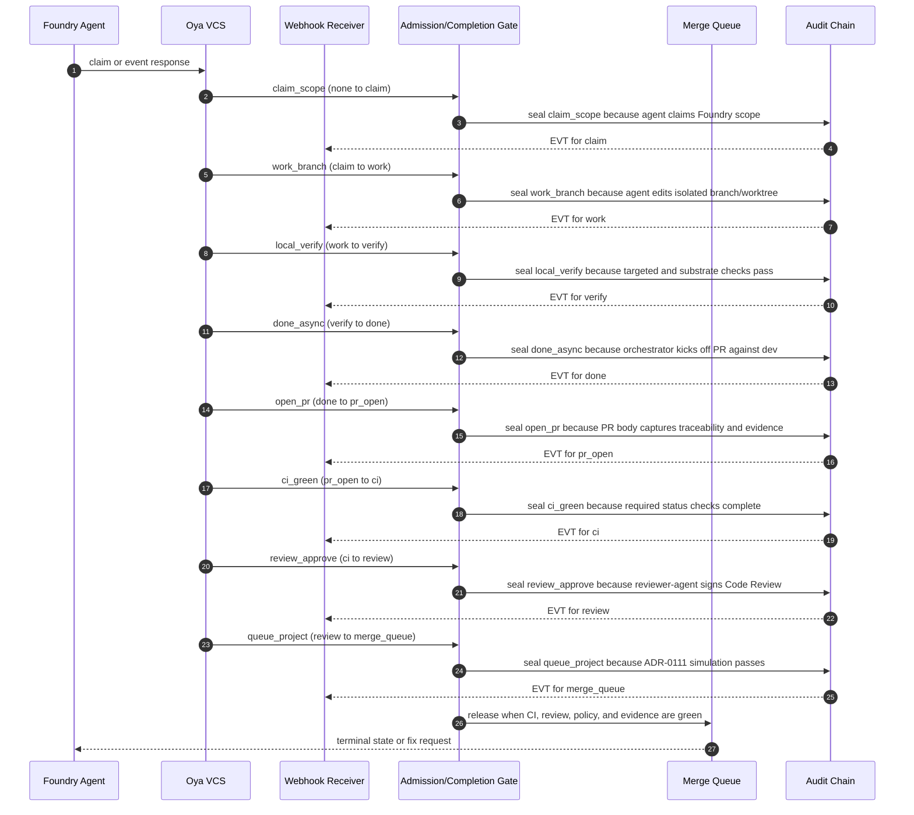

# Foundry VCS Orchestrator End to End

## Purpose

This spec defines the complete claim, work, verify, done, review, merge, and promote lifecycle that `oya vcs` drives for Foundry's internal agentic-development pipeline.

It is a contributor and agent pipeline contract, not a tenant workflow, product feature, or consumer AI surface.

Foundry was the internal agentic-development pipeline (RETIRED per ADR-0335 Wave 15I; absorbed into intelligence): it coordinates source changes, CI evidence, reviewer decisions, merge-queue state, and promotion state for the oyatie repository.
Foundry is not a consumer-facing AI product, not a tenant assistant, and not the place where B2B or B2C prompt history is stored.
This spec turns the ADR-level decision into an operator-readable and agent-executable substrate contract.
The contract is intentionally written with RFC 2119 and RFC 8174 keywords so policy, CI, and agent prompts can parse the same text.
The control plane treats tenant_id=oyatie as the internal tenant for internal agentic-development pipeline emissions, consistent with ADR-0263.
Every state-changing step emits an audit event and a correlated observability record before a downstream state may rely on it.
The implementation boundary is the single Foundry microservice with internal bounded contexts from ADR-0136.
The repository boundary is microservices/foundry plus repo-level governance registries and docs referenced in cross-references.
The user-facing Intelligence substrate remains separate and MUST NOT be conflated with this pipeline.
The stop condition for this spec is a changeset whose evidence, policy, CI, review, queue, and promotion state can be replayed deterministically.

## Normative Requirements

The key words MUST, MUST NOT, REQUIRED, SHALL, SHALL NOT, SHOULD, SHOULD NOT, RECOMMENDED, MAY, and OPTIONAL in this section are to be interpreted as described in RFC 2119 and RFC 8174.

1. Foundry VCS Orchestrator End to End MUST ensure the state transition be written before downstream consumers act.
2. Foundry VCS Orchestrator End to End MUST ensure the state transition carry a deterministic identifier.
3. Foundry VCS Orchestrator End to End MUST ensure the state transition declare its actor, action, resource, and reason.
4. Foundry VCS Orchestrator End to End MUST ensure the state transition fail closed when required evidence is absent.
5. Foundry VCS Orchestrator End to End MUST ensure the Cedar decision be written before downstream consumers act.
6. Foundry VCS Orchestrator End to End MUST ensure the Cedar decision carry a deterministic identifier.
7. Foundry VCS Orchestrator End to End MUST ensure the Cedar decision declare its actor, action, resource, and reason.
8. Foundry VCS Orchestrator End to End MUST ensure the Cedar decision fail closed when required evidence is absent.
9. Foundry VCS Orchestrator End to End MUST ensure the audit event be written before downstream consumers act.
10. Foundry VCS Orchestrator End to End MUST ensure the audit event carry a deterministic identifier.
11. Foundry VCS Orchestrator End to End MUST ensure the audit event declare its actor, action, resource, and reason.
12. Foundry VCS Orchestrator End to End MUST ensure the audit event fail closed when required evidence is absent.
13. Foundry VCS Orchestrator End to End MUST ensure the observability emission be written before downstream consumers act.
14. Foundry VCS Orchestrator End to End MUST ensure the observability emission carry a deterministic identifier.
15. Foundry VCS Orchestrator End to End MUST ensure the observability emission declare its actor, action, resource, and reason.
16. Foundry VCS Orchestrator End to End MUST ensure the observability emission fail closed when required evidence is absent.
17. Foundry VCS Orchestrator End to End MUST ensure the evidence bundle be written before downstream consumers act.
18. Foundry VCS Orchestrator End to End MUST ensure the evidence bundle carry a deterministic identifier.
19. Foundry VCS Orchestrator End to End MUST ensure the evidence bundle declare its actor, action, resource, and reason.
20. Foundry VCS Orchestrator End to End MUST ensure the evidence bundle fail closed when required evidence is absent.
21. Foundry VCS Orchestrator End to End MUST ensure the cost budget be written before downstream consumers act.
22. Foundry VCS Orchestrator End to End MUST ensure the cost budget carry a deterministic identifier.
23. Foundry VCS Orchestrator End to End MUST ensure the cost budget declare its actor, action, resource, and reason.
24. Foundry VCS Orchestrator End to End MUST ensure the cost budget fail closed when required evidence is absent.
25. Foundry VCS Orchestrator End to End MUST ensure the idempotency key be written before downstream consumers act.
26. Foundry VCS Orchestrator End to End MUST ensure the idempotency key carry a deterministic identifier.
27. Foundry VCS Orchestrator End to End MUST ensure the idempotency key declare its actor, action, resource, and reason.
28. Foundry VCS Orchestrator End to End MUST ensure the idempotency key fail closed when required evidence is absent.
29. Foundry VCS Orchestrator End to End MUST ensure the retry branch be written before downstream consumers act.
30. Foundry VCS Orchestrator End to End MUST ensure the retry branch carry a deterministic identifier.
31. Foundry VCS Orchestrator End to End MUST ensure the retry branch declare its actor, action, resource, and reason.
32. Foundry VCS Orchestrator End to End MUST ensure the retry branch fail closed when required evidence is absent.
33. Foundry VCS Orchestrator End to End MUST ensure the reviewer verdict be written before downstream consumers act.
34. Foundry VCS Orchestrator End to End MUST ensure the reviewer verdict carry a deterministic identifier.
35. Foundry VCS Orchestrator End to End MUST ensure the reviewer verdict declare its actor, action, resource, and reason.
36. Foundry VCS Orchestrator End to End MUST ensure the reviewer verdict fail closed when required evidence is absent.
37. Foundry VCS Orchestrator End to End MUST ensure the CI status be written before downstream consumers act.
38. Foundry VCS Orchestrator End to End MUST ensure the CI status carry a deterministic identifier.
39. Foundry VCS Orchestrator End to End MUST ensure the CI status declare its actor, action, resource, and reason.
40. Foundry VCS Orchestrator End to End MUST ensure the CI status fail closed when required evidence is absent.
41. Foundry VCS Orchestrator End to End MUST ensure the worktree lane be written before downstream consumers act.
42. Foundry VCS Orchestrator End to End MUST ensure the worktree lane carry a deterministic identifier.
43. Foundry VCS Orchestrator End to End MUST ensure the worktree lane declare its actor, action, resource, and reason.
44. Foundry VCS Orchestrator End to End MUST ensure the worktree lane fail closed when required evidence is absent.
45. Foundry VCS Orchestrator End to End MUST ensure the branch reference be written before downstream consumers act.
46. Foundry VCS Orchestrator End to End MUST ensure the branch reference carry a deterministic identifier.
47. Foundry VCS Orchestrator End to End MUST ensure the branch reference declare its actor, action, resource, and reason.
48. Foundry VCS Orchestrator End to End MUST ensure the branch reference fail closed when required evidence is absent.
49. Foundry VCS Orchestrator End to End MUST ensure the merge-queue position be written before downstream consumers act.
50. Foundry VCS Orchestrator End to End MUST ensure the merge-queue position carry a deterministic identifier.
51. Foundry VCS Orchestrator End to End MUST ensure the merge-queue position declare its actor, action, resource, and reason.
52. Foundry VCS Orchestrator End to End MUST ensure the merge-queue position fail closed when required evidence is absent.
53. Foundry VCS Orchestrator End to End MUST ensure the promotion target be written before downstream consumers act.
54. Foundry VCS Orchestrator End to End MUST ensure the promotion target carry a deterministic identifier.
55. Foundry VCS Orchestrator End to End MUST ensure the promotion target declare its actor, action, resource, and reason.
56. Foundry VCS Orchestrator End to End MUST ensure the promotion target fail closed when required evidence is absent.
57. Foundry VCS Orchestrator End to End MUST ensure the human override be written before downstream consumers act.
58. Foundry VCS Orchestrator End to End MUST ensure the human override carry a deterministic identifier.
59. Foundry VCS Orchestrator End to End MUST ensure the human override declare its actor, action, resource, and reason.
60. Foundry VCS Orchestrator End to End MUST ensure the human override fail closed when required evidence is absent.
61. Foundry VCS Orchestrator End to End MUST ensure the safe-path predicate be written before downstream consumers act.
62. Foundry VCS Orchestrator End to End MUST ensure the safe-path predicate carry a deterministic identifier.
63. Foundry VCS Orchestrator End to End MUST ensure the safe-path predicate declare its actor, action, resource, and reason.
64. Foundry VCS Orchestrator End to End MUST ensure the safe-path predicate fail closed when required evidence is absent.
65. Foundry VCS Orchestrator End to End MUST ensure the OpenBao secret reference be written before downstream consumers act.
66. Foundry VCS Orchestrator End to End MUST ensure the OpenBao secret reference carry a deterministic identifier.
67. Foundry VCS Orchestrator End to End MUST ensure the OpenBao secret reference declare its actor, action, resource, and reason.
68. Foundry VCS Orchestrator End to End MUST ensure the OpenBao secret reference fail closed when required evidence is absent.
69. Foundry VCS Orchestrator End to End MUST ensure the GitHub post-back be written before downstream consumers act.
70. Foundry VCS Orchestrator End to End MUST ensure the GitHub post-back carry a deterministic identifier.
71. Foundry VCS Orchestrator End to End MUST ensure the GitHub post-back declare its actor, action, resource, and reason.
72. Foundry VCS Orchestrator End to End MUST ensure the GitHub post-back fail closed when required evidence is absent.
73. Foundry VCS Orchestrator End to End MUST ensure the multispectrum evidence be written before downstream consumers act.
74. Foundry VCS Orchestrator End to End MUST ensure the multispectrum evidence carry a deterministic identifier.
75. Foundry VCS Orchestrator End to End MUST ensure the multispectrum evidence declare its actor, action, resource, and reason.
76. Foundry VCS Orchestrator End to End MUST ensure the multispectrum evidence fail closed when required evidence is absent.
77. Foundry VCS Orchestrator End to End MUST ensure the trace context be written before downstream consumers act.
78. Foundry VCS Orchestrator End to End MUST ensure the trace context carry a deterministic identifier.
79. Foundry VCS Orchestrator End to End MUST ensure the trace context declare its actor, action, resource, and reason.
80. Foundry VCS Orchestrator End to End MUST ensure the trace context fail closed when required evidence is absent.
81. The `claim` phase SHOULD expose a machine-readable status row with actor, at, evidence_uri, trace_id, and audit_id.
82. The `work` phase SHOULD expose a machine-readable status row with actor, at, evidence_uri, trace_id, and audit_id.
83. The `verify` phase SHOULD expose a machine-readable status row with actor, at, evidence_uri, trace_id, and audit_id.
84. The `done` phase SHOULD expose a machine-readable status row with actor, at, evidence_uri, trace_id, and audit_id.
85. The `pr_open` phase SHOULD expose a machine-readable status row with actor, at, evidence_uri, trace_id, and audit_id.
86. The `ci` phase SHOULD expose a machine-readable status row with actor, at, evidence_uri, trace_id, and audit_id.
87. The `review` phase SHOULD expose a machine-readable status row with actor, at, evidence_uri, trace_id, and audit_id.
88. The `merge_queue` phase SHOULD expose a machine-readable status row with actor, at, evidence_uri, trace_id, and audit_id.
89. The `merged_dev` phase SHOULD expose a machine-readable status row with actor, at, evidence_uri, trace_id, and audit_id.
90. The `promote` phase SHOULD expose a machine-readable status row with actor, at, evidence_uri, trace_id, and audit_id.
91. The `terminal` phase SHOULD expose a machine-readable status row with actor, at, evidence_uri, trace_id, and audit_id.
92. Action `foundry.vcs.claim` MUST be denied unless a matching Cedar permit binds the principal, resource, and changeset intent.
93. Action `foundry.vcs.verify` MUST be denied unless a matching Cedar permit binds the principal, resource, and changeset intent.
94. Action `foundry.vcs.done` MUST be denied unless a matching Cedar permit binds the principal, resource, and changeset intent.
95. Action `foundry.vcs.subscribe` MUST be denied unless a matching Cedar permit binds the principal, resource, and changeset intent.
96. Action `foundry.vcs.promote` MUST be denied unless a matching Cedar permit binds the principal, resource, and changeset intent.
97. Action `foundry.vcs.override` MUST be denied unless a matching Cedar permit binds the principal, resource, and changeset intent.
98. Action `foundry.pr.open` MUST be denied unless a matching Cedar permit binds the principal, resource, and changeset intent.
99. Action `foundry.pr.update` MUST be denied unless a matching Cedar permit binds the principal, resource, and changeset intent.
100. Implementations MAY add stricter product-local gates when they do not weaken any requirement in ADR-0113.

## State Machine / Sequence Diagram



### Named Transitions

| Transition | From | To | Guard summary | Audit event | Recovery if denied |
|---|---|---|---|---|---|
| claim_scope | none | claim | agent claims Foundry scope; Cedar permit required; evidence hash present | EVT-FOUNDRY-VCS-OVERRIDDEN | Hold at none; append refusal reason; request fix or human override |
| work_branch | claim | work | agent edits isolated branch/worktree; Cedar permit required; evidence hash present | EVT-FOUNDRY-VCS-DONE-KICKED-OFF | Hold at claim; append refusal reason; request fix or human override |
| local_verify | work | verify | targeted and substrate checks pass; Cedar permit required; evidence hash present | EVT-FOUNDRY-VCS-PROMOTED | Hold at work; append refusal reason; request fix or human override |
| done_async | verify | done | orchestrator kicks off PR against dev; Cedar permit required; evidence hash present | EVT-FOUNDRY-VCS-CLAIMED | Hold at verify; append refusal reason; request fix or human override |
| open_pr | done | pr_open | PR body captures traceability and evidence; Cedar permit required; evidence hash present | EVT-FOUNDRY-VCS-OVERRIDDEN | Hold at done; append refusal reason; request fix or human override |
| ci_green | pr_open | ci | required status checks complete; Cedar permit required; evidence hash present | EVT-FOUNDRY-VCS-OVERRIDDEN | Hold at pr_open; append refusal reason; request fix or human override |
| review_approve | ci | review | reviewer-agent signs Code Review; Cedar permit required; evidence hash present | EVT-FOUNDRY-VCS-VERIFIED | Hold at ci; append refusal reason; request fix or human override |
| queue_project | review | merge_queue | ADR-0111 simulation passes; Cedar permit required; evidence hash present | EVT-FOUNDRY-VCS-VERIFIED | Hold at review; append refusal reason; request fix or human override |
| merge_dev | merge_queue | merged_dev | dev fast-forward/squash applies; Cedar permit required; evidence hash present | EVT-FOUNDRY-VCS-VERIFIED | Hold at merge_queue; append refusal reason; request fix or human override |
| promote_env | merged_dev | promote | staging and production promotion runs; Cedar permit required; evidence hash present | EVT-FOUNDRY-VCS-DONE-KICKED-OFF | Hold at merged_dev; append refusal reason; request fix or human override |
| emit_terminal | promote | terminal | produced or terminal fail state emitted; Cedar permit required; evidence hash present | EVT-FOUNDRY-VCS-PROMOTED | Hold at promote; append refusal reason; request fix or human override |
| replay-check-01 | none | claim | Replay validates claim ordering, signature, budget, and trace context | EVT-FOUNDRY-VCS-CLAIMED | Recompute from append-only log and refuse non-monotonic row |
| replay-check-02 | claim | work | Replay validates work ordering, signature, budget, and trace context | EVT-FOUNDRY-VCS-VERIFIED | Recompute from append-only log and refuse non-monotonic row |
| replay-check-03 | work | verify | Replay validates verify ordering, signature, budget, and trace context | EVT-FOUNDRY-VCS-DONE-KICKED-OFF | Recompute from append-only log and refuse non-monotonic row |
| replay-check-04 | verify | done | Replay validates done ordering, signature, budget, and trace context | EVT-FOUNDRY-VCS-PROMOTED | Recompute from append-only log and refuse non-monotonic row |
| replay-check-05 | done | pr_open | Replay validates pr_open ordering, signature, budget, and trace context | EVT-FOUNDRY-VCS-OVERRIDDEN | Recompute from append-only log and refuse non-monotonic row |
| replay-check-06 | pr_open | ci | Replay validates ci ordering, signature, budget, and trace context | EVT-FOUNDRY-VCS-CLAIMED | Recompute from append-only log and refuse non-monotonic row |
| replay-check-07 | ci | review | Replay validates review ordering, signature, budget, and trace context | EVT-FOUNDRY-VCS-VERIFIED | Recompute from append-only log and refuse non-monotonic row |
| replay-check-08 | review | merge_queue | Replay validates merge_queue ordering, signature, budget, and trace context | EVT-FOUNDRY-VCS-DONE-KICKED-OFF | Recompute from append-only log and refuse non-monotonic row |
| replay-check-09 | merge_queue | merged_dev | Replay validates merged_dev ordering, signature, budget, and trace context | EVT-FOUNDRY-VCS-PROMOTED | Recompute from append-only log and refuse non-monotonic row |
| replay-check-10 | merged_dev | promote | Replay validates promote ordering, signature, budget, and trace context | EVT-FOUNDRY-VCS-OVERRIDDEN | Recompute from append-only log and refuse non-monotonic row |
| replay-check-11 | promote | terminal | Replay validates terminal ordering, signature, budget, and trace context | EVT-FOUNDRY-VCS-CLAIMED | Recompute from append-only log and refuse non-monotonic row |
| replay-check-12 | none | claim | Replay validates claim ordering, signature, budget, and trace context | EVT-FOUNDRY-VCS-VERIFIED | Recompute from append-only log and refuse non-monotonic row |
| replay-check-13 | claim | work | Replay validates work ordering, signature, budget, and trace context | EVT-FOUNDRY-VCS-DONE-KICKED-OFF | Recompute from append-only log and refuse non-monotonic row |
| replay-check-14 | work | verify | Replay validates verify ordering, signature, budget, and trace context | EVT-FOUNDRY-VCS-PROMOTED | Recompute from append-only log and refuse non-monotonic row |
| replay-check-15 | verify | done | Replay validates done ordering, signature, budget, and trace context | EVT-FOUNDRY-VCS-OVERRIDDEN | Recompute from append-only log and refuse non-monotonic row |
| replay-check-16 | done | pr_open | Replay validates pr_open ordering, signature, budget, and trace context | EVT-FOUNDRY-VCS-CLAIMED | Recompute from append-only log and refuse non-monotonic row |
| replay-check-17 | pr_open | ci | Replay validates ci ordering, signature, budget, and trace context | EVT-FOUNDRY-VCS-VERIFIED | Recompute from append-only log and refuse non-monotonic row |
| replay-check-18 | ci | review | Replay validates review ordering, signature, budget, and trace context | EVT-FOUNDRY-VCS-DONE-KICKED-OFF | Recompute from append-only log and refuse non-monotonic row |
| replay-check-19 | review | merge_queue | Replay validates merge_queue ordering, signature, budget, and trace context | EVT-FOUNDRY-VCS-PROMOTED | Recompute from append-only log and refuse non-monotonic row |
| replay-check-20 | merge_queue | merged_dev | Replay validates merged_dev ordering, signature, budget, and trace context | EVT-FOUNDRY-VCS-OVERRIDDEN | Recompute from append-only log and refuse non-monotonic row |
| replay-check-21 | merged_dev | promote | Replay validates promote ordering, signature, budget, and trace context | EVT-FOUNDRY-VCS-CLAIMED | Recompute from append-only log and refuse non-monotonic row |
| replay-check-22 | promote | terminal | Replay validates terminal ordering, signature, budget, and trace context | EVT-FOUNDRY-VCS-VERIFIED | Recompute from append-only log and refuse non-monotonic row |
| replay-check-23 | none | claim | Replay validates claim ordering, signature, budget, and trace context | EVT-FOUNDRY-VCS-DONE-KICKED-OFF | Recompute from append-only log and refuse non-monotonic row |
| replay-check-24 | claim | work | Replay validates work ordering, signature, budget, and trace context | EVT-FOUNDRY-VCS-PROMOTED | Recompute from append-only log and refuse non-monotonic row |
| replay-check-25 | work | verify | Replay validates verify ordering, signature, budget, and trace context | EVT-FOUNDRY-VCS-OVERRIDDEN | Recompute from append-only log and refuse non-monotonic row |
| replay-check-26 | verify | done | Replay validates done ordering, signature, budget, and trace context | EVT-FOUNDRY-VCS-CLAIMED | Recompute from append-only log and refuse non-monotonic row |
| replay-check-27 | done | pr_open | Replay validates pr_open ordering, signature, budget, and trace context | EVT-FOUNDRY-VCS-VERIFIED | Recompute from append-only log and refuse non-monotonic row |
| replay-check-28 | pr_open | ci | Replay validates ci ordering, signature, budget, and trace context | EVT-FOUNDRY-VCS-DONE-KICKED-OFF | Recompute from append-only log and refuse non-monotonic row |
| replay-check-29 | ci | review | Replay validates review ordering, signature, budget, and trace context | EVT-FOUNDRY-VCS-PROMOTED | Recompute from append-only log and refuse non-monotonic row |
| replay-check-30 | review | merge_queue | Replay validates merge_queue ordering, signature, budget, and trace context | EVT-FOUNDRY-VCS-OVERRIDDEN | Recompute from append-only log and refuse non-monotonic row |
| replay-check-31 | merge_queue | merged_dev | Replay validates merged_dev ordering, signature, budget, and trace context | EVT-FOUNDRY-VCS-CLAIMED | Recompute from append-only log and refuse non-monotonic row |
| replay-check-32 | merged_dev | promote | Replay validates promote ordering, signature, budget, and trace context | EVT-FOUNDRY-VCS-VERIFIED | Recompute from append-only log and refuse non-monotonic row |
| replay-check-33 | promote | terminal | Replay validates terminal ordering, signature, budget, and trace context | EVT-FOUNDRY-VCS-DONE-KICKED-OFF | Recompute from append-only log and refuse non-monotonic row |
| replay-check-34 | none | claim | Replay validates claim ordering, signature, budget, and trace context | EVT-FOUNDRY-VCS-PROMOTED | Recompute from append-only log and refuse non-monotonic row |
| replay-check-35 | claim | work | Replay validates work ordering, signature, budget, and trace context | EVT-FOUNDRY-VCS-OVERRIDDEN | Recompute from append-only log and refuse non-monotonic row |
| replay-check-36 | work | verify | Replay validates verify ordering, signature, budget, and trace context | EVT-FOUNDRY-VCS-CLAIMED | Recompute from append-only log and refuse non-monotonic row |
| replay-check-37 | verify | done | Replay validates done ordering, signature, budget, and trace context | EVT-FOUNDRY-VCS-VERIFIED | Recompute from append-only log and refuse non-monotonic row |
| replay-check-38 | done | pr_open | Replay validates pr_open ordering, signature, budget, and trace context | EVT-FOUNDRY-VCS-DONE-KICKED-OFF | Recompute from append-only log and refuse non-monotonic row |
| replay-check-39 | pr_open | ci | Replay validates ci ordering, signature, budget, and trace context | EVT-FOUNDRY-VCS-PROMOTED | Recompute from append-only log and refuse non-monotonic row |
| replay-check-40 | ci | review | Replay validates review ordering, signature, budget, and trace context | EVT-FOUNDRY-VCS-OVERRIDDEN | Recompute from append-only log and refuse non-monotonic row |
| replay-check-41 | review | merge_queue | Replay validates merge_queue ordering, signature, budget, and trace context | EVT-FOUNDRY-VCS-CLAIMED | Recompute from append-only log and refuse non-monotonic row |
| replay-check-42 | merge_queue | merged_dev | Replay validates merged_dev ordering, signature, budget, and trace context | EVT-FOUNDRY-VCS-VERIFIED | Recompute from append-only log and refuse non-monotonic row |
| replay-check-43 | merged_dev | promote | Replay validates promote ordering, signature, budget, and trace context | EVT-FOUNDRY-VCS-DONE-KICKED-OFF | Recompute from append-only log and refuse non-monotonic row |
| replay-check-44 | promote | terminal | Replay validates terminal ordering, signature, budget, and trace context | EVT-FOUNDRY-VCS-PROMOTED | Recompute from append-only log and refuse non-monotonic row |
| replay-check-45 | none | claim | Replay validates claim ordering, signature, budget, and trace context | EVT-FOUNDRY-VCS-OVERRIDDEN | Recompute from append-only log and refuse non-monotonic row |
| replay-check-46 | claim | work | Replay validates work ordering, signature, budget, and trace context | EVT-FOUNDRY-VCS-CLAIMED | Recompute from append-only log and refuse non-monotonic row |
| replay-check-47 | work | verify | Replay validates verify ordering, signature, budget, and trace context | EVT-FOUNDRY-VCS-VERIFIED | Recompute from append-only log and refuse non-monotonic row |
| replay-check-48 | verify | done | Replay validates done ordering, signature, budget, and trace context | EVT-FOUNDRY-VCS-DONE-KICKED-OFF | Recompute from append-only log and refuse non-monotonic row |
| replay-check-49 | done | pr_open | Replay validates pr_open ordering, signature, budget, and trace context | EVT-FOUNDRY-VCS-PROMOTED | Recompute from append-only log and refuse non-monotonic row |
| replay-check-50 | pr_open | ci | Replay validates ci ordering, signature, budget, and trace context | EVT-FOUNDRY-VCS-OVERRIDDEN | Recompute from append-only log and refuse non-monotonic row |
| replay-check-51 | ci | review | Replay validates review ordering, signature, budget, and trace context | EVT-FOUNDRY-VCS-CLAIMED | Recompute from append-only log and refuse non-monotonic row |
| replay-check-52 | review | merge_queue | Replay validates merge_queue ordering, signature, budget, and trace context | EVT-FOUNDRY-VCS-VERIFIED | Recompute from append-only log and refuse non-monotonic row |
| replay-check-53 | merge_queue | merged_dev | Replay validates merged_dev ordering, signature, budget, and trace context | EVT-FOUNDRY-VCS-DONE-KICKED-OFF | Recompute from append-only log and refuse non-monotonic row |
| replay-check-54 | merged_dev | promote | Replay validates promote ordering, signature, budget, and trace context | EVT-FOUNDRY-VCS-PROMOTED | Recompute from append-only log and refuse non-monotonic row |

## Cedar Policy Bindings

The bindings below use specific internal principals, actions, and resources. A deny from any narrower policy wins over these permits.

| Binding | Principal | Action | Resource | Required context | Decision |
|---|---|---|---|---|---|
| B-001 | Principal::"oyatie.agent.codex" | Action::"foundry.vcs.claim" | Resource::"branch:agent/*" | workflow=foundry_pipeline; tenant_id=oyatie; intent=vcs-orchestrator-end-to-end | permit when evidence_hash and changeset_id are present |
| B-002 | Principal::"oyatie.agent.codex" | Action::"foundry.vcs.verify" | Resource::"pr:base/dev" | workflow=foundry_pipeline; tenant_id=oyatie; intent=vcs-orchestrator-end-to-end | permit when evidence_hash and changeset_id are present |
| B-003 | Principal::"oyatie.agent.codex" | Action::"foundry.vcs.done" | Resource::"environment:dev" | workflow=foundry_pipeline; tenant_id=oyatie; intent=vcs-orchestrator-end-to-end | permit when evidence_hash and changeset_id are present |
| B-004 | Principal::"oyatie.agent.codex" | Action::"foundry.vcs.subscribe" | Resource::"environment:staging" | workflow=foundry_pipeline; tenant_id=oyatie; intent=vcs-orchestrator-end-to-end | permit when evidence_hash and changeset_id are present |
| B-005 | Principal::"oyatie.agent.codex" | Action::"foundry.vcs.promote" | Resource::"environment:production" | workflow=foundry_pipeline; tenant_id=oyatie; intent=vcs-orchestrator-end-to-end | permit when evidence_hash and changeset_id are present |
| B-006 | Principal::"oyatie.agent.claude-opus" | Action::"foundry.vcs.claim" | Resource::"repo:oyatie/microservices/foundry" | workflow=foundry_pipeline; tenant_id=oyatie; intent=vcs-orchestrator-end-to-end | permit when evidence_hash and changeset_id are present |
| B-007 | Principal::"oyatie.agent.claude-opus" | Action::"foundry.vcs.verify" | Resource::"branch:dev" | workflow=foundry_pipeline; tenant_id=oyatie; intent=vcs-orchestrator-end-to-end | permit when evidence_hash and changeset_id are present |
| B-008 | Principal::"oyatie.agent.claude-opus" | Action::"foundry.vcs.done" | Resource::"queue:foundry-dev" | workflow=foundry_pipeline; tenant_id=oyatie; intent=vcs-orchestrator-end-to-end | permit when evidence_hash and changeset_id are present |
| B-009 | Principal::"oyatie.agent.claude-opus" | Action::"foundry.vcs.subscribe" | Resource::"event-log:registry/vcs/changeset-event-log.json" | workflow=foundry_pipeline; tenant_id=oyatie; intent=vcs-orchestrator-end-to-end | permit when evidence_hash and changeset_id are present |
| B-010 | Principal::"oyatie.agent.claude-opus" | Action::"foundry.vcs.promote" | Resource::"event-router:registry/vcs/event-router.yaml" | workflow=foundry_pipeline; tenant_id=oyatie; intent=vcs-orchestrator-end-to-end | permit when evidence_hash and changeset_id are present |
| B-011 | Principal::"oyatie.agent.planner" | Action::"foundry.vcs.claim" | Resource::"safe-paths:registry/vcs/concurrent-safe-paths.yaml" | workflow=foundry_pipeline; tenant_id=oyatie; intent=vcs-orchestrator-end-to-end | permit when evidence_hash and changeset_id are present |
| B-012 | Principal::"oyatie.agent.planner" | Action::"foundry.vcs.verify" | Resource::"evidence:evidence/multispectrum" | workflow=foundry_pipeline; tenant_id=oyatie; intent=vcs-orchestrator-end-to-end | permit when evidence_hash and changeset_id are present |
| B-013 | Principal::"oyatie.agent.planner" | Action::"foundry.vcs.done" | Resource::"audit:event-class/foundry" | workflow=foundry_pipeline; tenant_id=oyatie; intent=vcs-orchestrator-end-to-end | permit when evidence_hash and changeset_id are present |
| B-014 | Principal::"oyatie.agent.planner" | Action::"foundry.vcs.subscribe" | Resource::"cli:./bin/oya vcs" | workflow=foundry_pipeline; tenant_id=oyatie; intent=vcs-orchestrator-end-to-end | permit when evidence_hash and changeset_id are present |
| B-015 | Principal::"oyatie.agent.planner" | Action::"foundry.vcs.promote" | Resource::"branch:agent/*" | workflow=foundry_pipeline; tenant_id=oyatie; intent=vcs-orchestrator-end-to-end | permit when evidence_hash and changeset_id are present |
| B-016 | Principal::"oyatie.agent.executor" | Action::"foundry.vcs.claim" | Resource::"pr:base/dev" | workflow=foundry_pipeline; tenant_id=oyatie; intent=vcs-orchestrator-end-to-end | permit when evidence_hash and changeset_id are present |
| B-017 | Principal::"oyatie.agent.executor" | Action::"foundry.vcs.verify" | Resource::"environment:dev" | workflow=foundry_pipeline; tenant_id=oyatie; intent=vcs-orchestrator-end-to-end | permit when evidence_hash and changeset_id are present |
| B-018 | Principal::"oyatie.agent.executor" | Action::"foundry.vcs.done" | Resource::"environment:staging" | workflow=foundry_pipeline; tenant_id=oyatie; intent=vcs-orchestrator-end-to-end | permit when evidence_hash and changeset_id are present |
| B-019 | Principal::"oyatie.agent.executor" | Action::"foundry.vcs.subscribe" | Resource::"environment:production" | workflow=foundry_pipeline; tenant_id=oyatie; intent=vcs-orchestrator-end-to-end | permit when evidence_hash and changeset_id are present |
| B-020 | Principal::"oyatie.agent.executor" | Action::"foundry.vcs.promote" | Resource::"repo:oyatie/microservices/foundry" | workflow=foundry_pipeline; tenant_id=oyatie; intent=vcs-orchestrator-end-to-end | permit when evidence_hash and changeset_id are present |
| B-021 | Principal::"oyatie.service.vcs-orchestrator" | Action::"foundry.vcs.claim" | Resource::"branch:dev" | workflow=foundry_pipeline; tenant_id=oyatie; intent=vcs-orchestrator-end-to-end | permit when evidence_hash and changeset_id are present |
| B-022 | Principal::"oyatie.service.vcs-orchestrator" | Action::"foundry.vcs.verify" | Resource::"queue:foundry-dev" | workflow=foundry_pipeline; tenant_id=oyatie; intent=vcs-orchestrator-end-to-end | permit when evidence_hash and changeset_id are present |
| B-023 | Principal::"oyatie.service.vcs-orchestrator" | Action::"foundry.vcs.done" | Resource::"event-log:registry/vcs/changeset-event-log.json" | workflow=foundry_pipeline; tenant_id=oyatie; intent=vcs-orchestrator-end-to-end | permit when evidence_hash and changeset_id are present |
| B-024 | Principal::"oyatie.service.vcs-orchestrator" | Action::"foundry.vcs.subscribe" | Resource::"event-router:registry/vcs/event-router.yaml" | workflow=foundry_pipeline; tenant_id=oyatie; intent=vcs-orchestrator-end-to-end | permit when evidence_hash and changeset_id are present |
| B-025 | Principal::"oyatie.service.vcs-orchestrator" | Action::"foundry.vcs.promote" | Resource::"safe-paths:registry/vcs/concurrent-safe-paths.yaml" | workflow=foundry_pipeline; tenant_id=oyatie; intent=vcs-orchestrator-end-to-end | permit when evidence_hash and changeset_id are present |
| B-026 | Principal::"oyatie.service.webhook-receiver" | Action::"foundry.vcs.claim" | Resource::"evidence:evidence/multispectrum" | workflow=foundry_pipeline; tenant_id=oyatie; intent=vcs-orchestrator-end-to-end | permit when evidence_hash and changeset_id are present |
| B-027 | Principal::"oyatie.service.webhook-receiver" | Action::"foundry.vcs.verify" | Resource::"audit:event-class/foundry" | workflow=foundry_pipeline; tenant_id=oyatie; intent=vcs-orchestrator-end-to-end | permit when evidence_hash and changeset_id are present |
| B-028 | Principal::"oyatie.service.webhook-receiver" | Action::"foundry.vcs.done" | Resource::"cli:./bin/oya vcs" | workflow=foundry_pipeline; tenant_id=oyatie; intent=vcs-orchestrator-end-to-end | permit when evidence_hash and changeset_id are present |
| B-029 | Principal::"oyatie.service.webhook-receiver" | Action::"foundry.vcs.subscribe" | Resource::"branch:agent/*" | workflow=foundry_pipeline; tenant_id=oyatie; intent=vcs-orchestrator-end-to-end | permit when evidence_hash and changeset_id are present |
| B-030 | Principal::"oyatie.service.webhook-receiver" | Action::"foundry.vcs.promote" | Resource::"pr:base/dev" | workflow=foundry_pipeline; tenant_id=oyatie; intent=vcs-orchestrator-end-to-end | permit when evidence_hash and changeset_id are present |
| B-031 | Principal::"oyatie.service.merge-queue" | Action::"foundry.vcs.claim" | Resource::"environment:dev" | workflow=foundry_pipeline; tenant_id=oyatie; intent=vcs-orchestrator-end-to-end | permit when evidence_hash and changeset_id are present |
| B-032 | Principal::"oyatie.service.merge-queue" | Action::"foundry.vcs.verify" | Resource::"environment:staging" | workflow=foundry_pipeline; tenant_id=oyatie; intent=vcs-orchestrator-end-to-end | permit when evidence_hash and changeset_id are present |
| B-033 | Principal::"oyatie.service.merge-queue" | Action::"foundry.vcs.done" | Resource::"environment:production" | workflow=foundry_pipeline; tenant_id=oyatie; intent=vcs-orchestrator-end-to-end | permit when evidence_hash and changeset_id are present |
| B-034 | Principal::"oyatie.service.merge-queue" | Action::"foundry.vcs.subscribe" | Resource::"repo:oyatie/microservices/foundry" | workflow=foundry_pipeline; tenant_id=oyatie; intent=vcs-orchestrator-end-to-end | permit when evidence_hash and changeset_id are present |
| B-035 | Principal::"oyatie.service.merge-queue" | Action::"foundry.vcs.promote" | Resource::"branch:dev" | workflow=foundry_pipeline; tenant_id=oyatie; intent=vcs-orchestrator-end-to-end | permit when evidence_hash and changeset_id are present |
| B-036 | Principal::"oyatie.service.admission-gate" | Action::"foundry.vcs.claim" | Resource::"queue:foundry-dev" | workflow=foundry_pipeline; tenant_id=oyatie; intent=vcs-orchestrator-end-to-end | permit when evidence_hash and changeset_id are present |
| B-037 | Principal::"oyatie.service.admission-gate" | Action::"foundry.vcs.verify" | Resource::"event-log:registry/vcs/changeset-event-log.json" | workflow=foundry_pipeline; tenant_id=oyatie; intent=vcs-orchestrator-end-to-end | permit when evidence_hash and changeset_id are present |
| B-038 | Principal::"oyatie.service.admission-gate" | Action::"foundry.vcs.done" | Resource::"event-router:registry/vcs/event-router.yaml" | workflow=foundry_pipeline; tenant_id=oyatie; intent=vcs-orchestrator-end-to-end | permit when evidence_hash and changeset_id are present |
| B-039 | Principal::"oyatie.service.admission-gate" | Action::"foundry.vcs.subscribe" | Resource::"safe-paths:registry/vcs/concurrent-safe-paths.yaml" | workflow=foundry_pipeline; tenant_id=oyatie; intent=vcs-orchestrator-end-to-end | permit when evidence_hash and changeset_id are present |
| B-040 | Principal::"oyatie.service.admission-gate" | Action::"foundry.vcs.promote" | Resource::"evidence:evidence/multispectrum" | workflow=foundry_pipeline; tenant_id=oyatie; intent=vcs-orchestrator-end-to-end | permit when evidence_hash and changeset_id are present |
| B-041 | Principal::"oyatie.service.completion-gate" | Action::"foundry.vcs.claim" | Resource::"audit:event-class/foundry" | workflow=foundry_pipeline; tenant_id=oyatie; intent=vcs-orchestrator-end-to-end | permit when evidence_hash and changeset_id are present |
| B-042 | Principal::"oyatie.service.completion-gate" | Action::"foundry.vcs.verify" | Resource::"cli:./bin/oya vcs" | workflow=foundry_pipeline; tenant_id=oyatie; intent=vcs-orchestrator-end-to-end | permit when evidence_hash and changeset_id are present |
| B-043 | Principal::"oyatie.service.completion-gate" | Action::"foundry.vcs.done" | Resource::"branch:agent/*" | workflow=foundry_pipeline; tenant_id=oyatie; intent=vcs-orchestrator-end-to-end | permit when evidence_hash and changeset_id are present |
| B-044 | Principal::"oyatie.service.completion-gate" | Action::"foundry.vcs.subscribe" | Resource::"pr:base/dev" | workflow=foundry_pipeline; tenant_id=oyatie; intent=vcs-orchestrator-end-to-end | permit when evidence_hash and changeset_id are present |
| B-045 | Principal::"oyatie.service.completion-gate" | Action::"foundry.vcs.promote" | Resource::"environment:dev" | workflow=foundry_pipeline; tenant_id=oyatie; intent=vcs-orchestrator-end-to-end | permit when evidence_hash and changeset_id are present |
| B-046 | Principal::"oyatie.human.reviewer" | Action::"foundry.vcs.claim" | Resource::"environment:staging" | workflow=foundry_pipeline; tenant_id=oyatie; intent=vcs-orchestrator-end-to-end | permit when evidence_hash and changeset_id are present |
| B-047 | Principal::"oyatie.human.reviewer" | Action::"foundry.vcs.verify" | Resource::"environment:production" | workflow=foundry_pipeline; tenant_id=oyatie; intent=vcs-orchestrator-end-to-end | permit when evidence_hash and changeset_id are present |
| B-048 | Principal::"oyatie.human.reviewer" | Action::"foundry.vcs.done" | Resource::"repo:oyatie/microservices/foundry" | workflow=foundry_pipeline; tenant_id=oyatie; intent=vcs-orchestrator-end-to-end | permit when evidence_hash and changeset_id are present |
| B-049 | Principal::"oyatie.human.reviewer" | Action::"foundry.vcs.subscribe" | Resource::"branch:dev" | workflow=foundry_pipeline; tenant_id=oyatie; intent=vcs-orchestrator-end-to-end | permit when evidence_hash and changeset_id are present |
| B-050 | Principal::"oyatie.human.reviewer" | Action::"foundry.vcs.promote" | Resource::"queue:foundry-dev" | workflow=foundry_pipeline; tenant_id=oyatie; intent=vcs-orchestrator-end-to-end | permit when evidence_hash and changeset_id are present |

```cedar
permit(
  principal in Principal::"oyatie.agent.codex",
  action == Action::"foundry.vcs.claim",
  resource in Resource::"repo:oyatie/microservices/foundry"
) when {
  context.tenant_id == "oyatie" &&
  context.workflow == "foundry_pipeline" &&
  context.related_adr == "ADR-0113" &&
  context.evidence_hash != "" &&
  context.trace_id != ""
};

permit(
  principal in Principal::"oyatie.agent.codex",
  action == Action::"foundry.vcs.verify",
  resource in Resource::"repo:oyatie/microservices/foundry"
) when {
  context.tenant_id == "oyatie" &&
  context.workflow == "foundry_pipeline" &&
  context.related_adr == "ADR-0113" &&
  context.evidence_hash != "" &&
  context.trace_id != ""
};

permit(
  principal in Principal::"oyatie.agent.codex",
  action == Action::"foundry.vcs.done",
  resource in Resource::"repo:oyatie/microservices/foundry"
) when {
  context.tenant_id == "oyatie" &&
  context.workflow == "foundry_pipeline" &&
  context.related_adr == "ADR-0113" &&
  context.evidence_hash != "" &&
  context.trace_id != ""
};

permit(
  principal in Principal::"oyatie.agent.codex",
  action == Action::"foundry.vcs.subscribe",
  resource in Resource::"repo:oyatie/microservices/foundry"
) when {
  context.tenant_id == "oyatie" &&
  context.workflow == "foundry_pipeline" &&
  context.related_adr == "ADR-0113" &&
  context.evidence_hash != "" &&
  context.trace_id != ""
};

forbid(
  principal,
  action,
  resource in Resource::"repo:oyatie/microservices/foundry/decisions"
) when {
  context.intent == "vcs-orchestrator-end-to-end" &&
  context.owner != "per-msvc-adrs-batch-d"
};
```

### Cedar Guard Catalog

- Guard 01: Principal::"oyatie.agent.codex" may invoke foundry.vcs.claim on Resource::"cli:./bin/oya vcs" only while `claim` is current, the changeset id is stable, the event is signed, and the ADR-0113 invariant is cited.
- Guard 02: Principal::"oyatie.agent.claude-opus" may invoke foundry.vcs.verify on Resource::"branch:agent/*" only while `work` is current, the changeset id is stable, the event is signed, and the ADR-0113 invariant is cited.
- Guard 03: Principal::"oyatie.agent.planner" may invoke foundry.vcs.done on Resource::"pr:base/dev" only while `verify` is current, the changeset id is stable, the event is signed, and the ADR-0113 invariant is cited.
- Guard 04: Principal::"oyatie.agent.executor" may invoke foundry.vcs.subscribe on Resource::"environment:dev" only while `done` is current, the changeset id is stable, the event is signed, and the ADR-0113 invariant is cited.
- Guard 05: Principal::"oyatie.service.vcs-orchestrator" may invoke foundry.vcs.promote on Resource::"environment:staging" only while `pr_open` is current, the changeset id is stable, the event is signed, and the ADR-0113 invariant is cited.
- Guard 06: Principal::"oyatie.service.webhook-receiver" may invoke foundry.vcs.override on Resource::"environment:production" only while `ci` is current, the changeset id is stable, the event is signed, and the ADR-0113 invariant is cited.
- Guard 07: Principal::"oyatie.service.merge-queue" may invoke foundry.pr.open on Resource::"repo:oyatie/microservices/foundry" only while `review` is current, the changeset id is stable, the event is signed, and the ADR-0113 invariant is cited.
- Guard 08: Principal::"oyatie.service.admission-gate" may invoke foundry.pr.update on Resource::"branch:dev" only while `merge_queue` is current, the changeset id is stable, the event is signed, and the ADR-0113 invariant is cited.
- Guard 09: Principal::"oyatie.service.completion-gate" may invoke foundry.vcs.claim on Resource::"queue:foundry-dev" only while `merged_dev` is current, the changeset id is stable, the event is signed, and the ADR-0113 invariant is cited.
- Guard 10: Principal::"oyatie.human.reviewer" may invoke foundry.vcs.verify on Resource::"event-log:registry/vcs/changeset-event-log.json" only while `promote` is current, the changeset id is stable, the event is signed, and the ADR-0113 invariant is cited.
- Guard 11: Principal::"oyatie.agent.codex" may invoke foundry.vcs.done on Resource::"event-router:registry/vcs/event-router.yaml" only while `terminal` is current, the changeset id is stable, the event is signed, and the ADR-0113 invariant is cited.
- Guard 12: Principal::"oyatie.agent.claude-opus" may invoke foundry.vcs.subscribe on Resource::"safe-paths:registry/vcs/concurrent-safe-paths.yaml" only while `claim` is current, the changeset id is stable, the event is signed, and the ADR-0113 invariant is cited.
- Guard 13: Principal::"oyatie.agent.planner" may invoke foundry.vcs.promote on Resource::"evidence:evidence/multispectrum" only while `work` is current, the changeset id is stable, the event is signed, and the ADR-0113 invariant is cited.
- Guard 14: Principal::"oyatie.agent.executor" may invoke foundry.vcs.override on Resource::"audit:event-class/foundry" only while `verify` is current, the changeset id is stable, the event is signed, and the ADR-0113 invariant is cited.
- Guard 15: Principal::"oyatie.service.vcs-orchestrator" may invoke foundry.pr.open on Resource::"cli:./bin/oya vcs" only while `done` is current, the changeset id is stable, the event is signed, and the ADR-0113 invariant is cited.
- Guard 16: Principal::"oyatie.service.webhook-receiver" may invoke foundry.pr.update on Resource::"branch:agent/*" only while `pr_open` is current, the changeset id is stable, the event is signed, and the ADR-0113 invariant is cited.
- Guard 17: Principal::"oyatie.service.merge-queue" may invoke foundry.vcs.claim on Resource::"pr:base/dev" only while `ci` is current, the changeset id is stable, the event is signed, and the ADR-0113 invariant is cited.
- Guard 18: Principal::"oyatie.service.admission-gate" may invoke foundry.vcs.verify on Resource::"environment:dev" only while `review` is current, the changeset id is stable, the event is signed, and the ADR-0113 invariant is cited.
- Guard 19: Principal::"oyatie.service.completion-gate" may invoke foundry.vcs.done on Resource::"environment:staging" only while `merge_queue` is current, the changeset id is stable, the event is signed, and the ADR-0113 invariant is cited.
- Guard 20: Principal::"oyatie.human.reviewer" may invoke foundry.vcs.subscribe on Resource::"environment:production" only while `merged_dev` is current, the changeset id is stable, the event is signed, and the ADR-0113 invariant is cited.
- Guard 21: Principal::"oyatie.agent.codex" may invoke foundry.vcs.promote on Resource::"repo:oyatie/microservices/foundry" only while `promote` is current, the changeset id is stable, the event is signed, and the ADR-0113 invariant is cited.
- Guard 22: Principal::"oyatie.agent.claude-opus" may invoke foundry.vcs.override on Resource::"branch:dev" only while `terminal` is current, the changeset id is stable, the event is signed, and the ADR-0113 invariant is cited.
- Guard 23: Principal::"oyatie.agent.planner" may invoke foundry.pr.open on Resource::"queue:foundry-dev" only while `claim` is current, the changeset id is stable, the event is signed, and the ADR-0113 invariant is cited.
- Guard 24: Principal::"oyatie.agent.executor" may invoke foundry.pr.update on Resource::"event-log:registry/vcs/changeset-event-log.json" only while `work` is current, the changeset id is stable, the event is signed, and the ADR-0113 invariant is cited.
- Guard 25: Principal::"oyatie.service.vcs-orchestrator" may invoke foundry.vcs.claim on Resource::"event-router:registry/vcs/event-router.yaml" only while `verify` is current, the changeset id is stable, the event is signed, and the ADR-0113 invariant is cited.
- Guard 26: Principal::"oyatie.service.webhook-receiver" may invoke foundry.vcs.verify on Resource::"safe-paths:registry/vcs/concurrent-safe-paths.yaml" only while `done` is current, the changeset id is stable, the event is signed, and the ADR-0113 invariant is cited.
- Guard 27: Principal::"oyatie.service.merge-queue" may invoke foundry.vcs.done on Resource::"evidence:evidence/multispectrum" only while `pr_open` is current, the changeset id is stable, the event is signed, and the ADR-0113 invariant is cited.
- Guard 28: Principal::"oyatie.service.admission-gate" may invoke foundry.vcs.subscribe on Resource::"audit:event-class/foundry" only while `ci` is current, the changeset id is stable, the event is signed, and the ADR-0113 invariant is cited.
- Guard 29: Principal::"oyatie.service.completion-gate" may invoke foundry.vcs.promote on Resource::"cli:./bin/oya vcs" only while `review` is current, the changeset id is stable, the event is signed, and the ADR-0113 invariant is cited.
- Guard 30: Principal::"oyatie.human.reviewer" may invoke foundry.vcs.override on Resource::"branch:agent/*" only while `merge_queue` is current, the changeset id is stable, the event is signed, and the ADR-0113 invariant is cited.
- Guard 31: Principal::"oyatie.agent.codex" may invoke foundry.pr.open on Resource::"pr:base/dev" only while `merged_dev` is current, the changeset id is stable, the event is signed, and the ADR-0113 invariant is cited.
- Guard 32: Principal::"oyatie.agent.claude-opus" may invoke foundry.pr.update on Resource::"environment:dev" only while `promote` is current, the changeset id is stable, the event is signed, and the ADR-0113 invariant is cited.
- Guard 33: Principal::"oyatie.agent.planner" may invoke foundry.vcs.claim on Resource::"environment:staging" only while `terminal` is current, the changeset id is stable, the event is signed, and the ADR-0113 invariant is cited.
- Guard 34: Principal::"oyatie.agent.executor" may invoke foundry.vcs.verify on Resource::"environment:production" only while `claim` is current, the changeset id is stable, the event is signed, and the ADR-0113 invariant is cited.
- Guard 35: Principal::"oyatie.service.vcs-orchestrator" may invoke foundry.vcs.done on Resource::"repo:oyatie/microservices/foundry" only while `work` is current, the changeset id is stable, the event is signed, and the ADR-0113 invariant is cited.
- Guard 36: Principal::"oyatie.service.webhook-receiver" may invoke foundry.vcs.subscribe on Resource::"branch:dev" only while `verify` is current, the changeset id is stable, the event is signed, and the ADR-0113 invariant is cited.
- Guard 37: Principal::"oyatie.service.merge-queue" may invoke foundry.vcs.promote on Resource::"queue:foundry-dev" only while `done` is current, the changeset id is stable, the event is signed, and the ADR-0113 invariant is cited.
- Guard 38: Principal::"oyatie.service.admission-gate" may invoke foundry.vcs.override on Resource::"event-log:registry/vcs/changeset-event-log.json" only while `pr_open` is current, the changeset id is stable, the event is signed, and the ADR-0113 invariant is cited.
- Guard 39: Principal::"oyatie.service.completion-gate" may invoke foundry.pr.open on Resource::"event-router:registry/vcs/event-router.yaml" only while `ci` is current, the changeset id is stable, the event is signed, and the ADR-0113 invariant is cited.
- Guard 40: Principal::"oyatie.human.reviewer" may invoke foundry.pr.update on Resource::"safe-paths:registry/vcs/concurrent-safe-paths.yaml" only while `review` is current, the changeset id is stable, the event is signed, and the ADR-0113 invariant is cited.
- Guard 41: Principal::"oyatie.agent.codex" may invoke foundry.vcs.claim on Resource::"evidence:evidence/multispectrum" only while `merge_queue` is current, the changeset id is stable, the event is signed, and the ADR-0113 invariant is cited.
- Guard 42: Principal::"oyatie.agent.claude-opus" may invoke foundry.vcs.verify on Resource::"audit:event-class/foundry" only while `merged_dev` is current, the changeset id is stable, the event is signed, and the ADR-0113 invariant is cited.
- Guard 43: Principal::"oyatie.agent.planner" may invoke foundry.vcs.done on Resource::"cli:./bin/oya vcs" only while `promote` is current, the changeset id is stable, the event is signed, and the ADR-0113 invariant is cited.
- Guard 44: Principal::"oyatie.agent.executor" may invoke foundry.vcs.subscribe on Resource::"branch:agent/*" only while `terminal` is current, the changeset id is stable, the event is signed, and the ADR-0113 invariant is cited.
- Guard 45: Principal::"oyatie.service.vcs-orchestrator" may invoke foundry.vcs.promote on Resource::"pr:base/dev" only while `claim` is current, the changeset id is stable, the event is signed, and the ADR-0113 invariant is cited.
- Guard 46: Principal::"oyatie.service.webhook-receiver" may invoke foundry.vcs.override on Resource::"environment:dev" only while `work` is current, the changeset id is stable, the event is signed, and the ADR-0113 invariant is cited.
- Guard 47: Principal::"oyatie.service.merge-queue" may invoke foundry.pr.open on Resource::"environment:staging" only while `verify` is current, the changeset id is stable, the event is signed, and the ADR-0113 invariant is cited.
- Guard 48: Principal::"oyatie.service.admission-gate" may invoke foundry.pr.update on Resource::"environment:production" only while `done` is current, the changeset id is stable, the event is signed, and the ADR-0113 invariant is cited.
- Guard 49: Principal::"oyatie.service.completion-gate" may invoke foundry.vcs.claim on Resource::"repo:oyatie/microservices/foundry" only while `pr_open` is current, the changeset id is stable, the event is signed, and the ADR-0113 invariant is cited.
- Guard 50: Principal::"oyatie.human.reviewer" may invoke foundry.vcs.verify on Resource::"branch:dev" only while `ci` is current, the changeset id is stable, the event is signed, and the ADR-0113 invariant is cited.
- Guard 51: Principal::"oyatie.agent.codex" may invoke foundry.vcs.done on Resource::"queue:foundry-dev" only while `review` is current, the changeset id is stable, the event is signed, and the ADR-0113 invariant is cited.
- Guard 52: Principal::"oyatie.agent.claude-opus" may invoke foundry.vcs.subscribe on Resource::"event-log:registry/vcs/changeset-event-log.json" only while `merge_queue` is current, the changeset id is stable, the event is signed, and the ADR-0113 invariant is cited.
- Guard 53: Principal::"oyatie.agent.planner" may invoke foundry.vcs.promote on Resource::"event-router:registry/vcs/event-router.yaml" only while `merged_dev` is current, the changeset id is stable, the event is signed, and the ADR-0113 invariant is cited.
- Guard 54: Principal::"oyatie.agent.executor" may invoke foundry.vcs.override on Resource::"safe-paths:registry/vcs/concurrent-safe-paths.yaml" only while `promote` is current, the changeset id is stable, the event is signed, and the ADR-0113 invariant is cited.
- Guard 55: Principal::"oyatie.service.vcs-orchestrator" may invoke foundry.pr.open on Resource::"evidence:evidence/multispectrum" only while `terminal` is current, the changeset id is stable, the event is signed, and the ADR-0113 invariant is cited.
- Guard 56: Principal::"oyatie.service.webhook-receiver" may invoke foundry.pr.update on Resource::"audit:event-class/foundry" only while `claim` is current, the changeset id is stable, the event is signed, and the ADR-0113 invariant is cited.
- Guard 57: Principal::"oyatie.service.merge-queue" may invoke foundry.vcs.claim on Resource::"cli:./bin/oya vcs" only while `work` is current, the changeset id is stable, the event is signed, and the ADR-0113 invariant is cited.
- Guard 58: Principal::"oyatie.service.admission-gate" may invoke foundry.vcs.verify on Resource::"branch:agent/*" only while `verify` is current, the changeset id is stable, the event is signed, and the ADR-0113 invariant is cited.
- Guard 59: Principal::"oyatie.service.completion-gate" may invoke foundry.vcs.done on Resource::"pr:base/dev" only while `done` is current, the changeset id is stable, the event is signed, and the ADR-0113 invariant is cited.
- Guard 60: Principal::"oyatie.human.reviewer" may invoke foundry.vcs.subscribe on Resource::"environment:dev" only while `pr_open` is current, the changeset id is stable, the event is signed, and the ADR-0113 invariant is cited.
- Guard 61: Principal::"oyatie.agent.codex" may invoke foundry.vcs.promote on Resource::"environment:staging" only while `ci` is current, the changeset id is stable, the event is signed, and the ADR-0113 invariant is cited.
- Guard 62: Principal::"oyatie.agent.claude-opus" may invoke foundry.vcs.override on Resource::"environment:production" only while `review` is current, the changeset id is stable, the event is signed, and the ADR-0113 invariant is cited.
- Guard 63: Principal::"oyatie.agent.planner" may invoke foundry.pr.open on Resource::"repo:oyatie/microservices/foundry" only while `merge_queue` is current, the changeset id is stable, the event is signed, and the ADR-0113 invariant is cited.
- Guard 64: Principal::"oyatie.agent.executor" may invoke foundry.pr.update on Resource::"branch:dev" only while `merged_dev` is current, the changeset id is stable, the event is signed, and the ADR-0113 invariant is cited.
- Guard 65: Principal::"oyatie.service.vcs-orchestrator" may invoke foundry.vcs.claim on Resource::"queue:foundry-dev" only while `promote` is current, the changeset id is stable, the event is signed, and the ADR-0113 invariant is cited.
- Guard 66: Principal::"oyatie.service.webhook-receiver" may invoke foundry.vcs.verify on Resource::"event-log:registry/vcs/changeset-event-log.json" only while `terminal` is current, the changeset id is stable, the event is signed, and the ADR-0113 invariant is cited.
- Guard 67: Principal::"oyatie.service.merge-queue" may invoke foundry.vcs.done on Resource::"event-router:registry/vcs/event-router.yaml" only while `claim` is current, the changeset id is stable, the event is signed, and the ADR-0113 invariant is cited.
- Guard 68: Principal::"oyatie.service.admission-gate" may invoke foundry.vcs.subscribe on Resource::"safe-paths:registry/vcs/concurrent-safe-paths.yaml" only while `work` is current, the changeset id is stable, the event is signed, and the ADR-0113 invariant is cited.
- Guard 69: Principal::"oyatie.service.completion-gate" may invoke foundry.vcs.promote on Resource::"evidence:evidence/multispectrum" only while `verify` is current, the changeset id is stable, the event is signed, and the ADR-0113 invariant is cited.
- Guard 70: Principal::"oyatie.human.reviewer" may invoke foundry.vcs.override on Resource::"audit:event-class/foundry" only while `done` is current, the changeset id is stable, the event is signed, and the ADR-0113 invariant is cited.

## Audit Event Classes Emitted (per ADR-0263)

Every event class below emits structured JSON logs with schema=oyatie/log/v1, tenant_id=oyatie, microservice=foundry, trace_id, span_id, and audit_id when the operation changes state.

| Event class | Emitted when | Required fields | Retention | Cardinality guard |
|---|---|---|---|---|
| EVT-FOUNDRY-VCS-CLAIMED | Foundry VCS Orchestrator End to End changes a durable pipeline fact | changeset_id, actor, action, resource, from_state, to_state, trace_id, span_id, audit_id, evidence_hash | 7 years for audit chain; 90 days hot observability | event_class + changeset_id only; no raw prompt or secret values |
| EVT-FOUNDRY-VCS-VERIFIED | Foundry VCS Orchestrator End to End changes a durable pipeline fact | changeset_id, actor, action, resource, from_state, to_state, trace_id, span_id, audit_id, evidence_hash | 7 years for audit chain; 90 days hot observability | event_class + changeset_id only; no raw prompt or secret values |
| EVT-FOUNDRY-VCS-DONE-KICKED-OFF | Foundry VCS Orchestrator End to End changes a durable pipeline fact | changeset_id, actor, action, resource, from_state, to_state, trace_id, span_id, audit_id, evidence_hash | 7 years for audit chain; 90 days hot observability | event_class + changeset_id only; no raw prompt or secret values |
| EVT-FOUNDRY-VCS-PROMOTED | Foundry VCS Orchestrator End to End changes a durable pipeline fact | changeset_id, actor, action, resource, from_state, to_state, trace_id, span_id, audit_id, evidence_hash | 7 years for audit chain; 90 days hot observability | event_class + changeset_id only; no raw prompt or secret values |
| EVT-FOUNDRY-VCS-OVERRIDDEN | Foundry VCS Orchestrator End to End changes a durable pipeline fact | changeset_id, actor, action, resource, from_state, to_state, trace_id, span_id, audit_id, evidence_hash | 7 years for audit chain; 90 days hot observability | event_class + changeset_id only; no raw prompt or secret values |
| EVT-FOUNDRY-VCS-CLAIMED-001 | claim path observes claim | tenant_id=oyatie, sub_scope=oyatie.foundry.claim, policy_id=ADR-0113.claim, correlation_id, audit_id | hot 90d + sealed audit chain | bounded by changeset_id and delivery_id; free text is scrubbed |
| EVT-FOUNDRY-VCS-VERIFIED-002 | verify path observes work | tenant_id=oyatie, sub_scope=oyatie.foundry.verify, policy_id=ADR-0113.work, correlation_id, audit_id | hot 90d + sealed audit chain | bounded by changeset_id and delivery_id; free text is scrubbed |
| EVT-FOUNDRY-VCS-DONE-KICKED-OFF-003 | done path observes verify | tenant_id=oyatie, sub_scope=oyatie.foundry.done, policy_id=ADR-0113.verify, correlation_id, audit_id | hot 90d + sealed audit chain | bounded by changeset_id and delivery_id; free text is scrubbed |
| EVT-FOUNDRY-VCS-PROMOTED-004 | admission path observes done | tenant_id=oyatie, sub_scope=oyatie.foundry.admission, policy_id=ADR-0113.done, correlation_id, audit_id | hot 90d + sealed audit chain | bounded by changeset_id and delivery_id; free text is scrubbed |
| EVT-FOUNDRY-VCS-OVERRIDDEN-005 | completion path observes pr_open | tenant_id=oyatie, sub_scope=oyatie.foundry.completion, policy_id=ADR-0113.pr_open, correlation_id, audit_id | hot 90d + sealed audit chain | bounded by changeset_id and delivery_id; free text is scrubbed |
| EVT-FOUNDRY-VCS-CLAIMED-006 | merge_queue path observes ci | tenant_id=oyatie, sub_scope=oyatie.foundry.merge_queue, policy_id=ADR-0113.ci, correlation_id, audit_id | hot 90d + sealed audit chain | bounded by changeset_id and delivery_id; free text is scrubbed |
| EVT-FOUNDRY-VCS-VERIFIED-007 | webhook path observes review | tenant_id=oyatie, sub_scope=oyatie.foundry.webhook, policy_id=ADR-0113.review, correlation_id, audit_id | hot 90d + sealed audit chain | bounded by changeset_id and delivery_id; free text is scrubbed |
| EVT-FOUNDRY-VCS-DONE-KICKED-OFF-008 | review path observes merge_queue | tenant_id=oyatie, sub_scope=oyatie.foundry.review, policy_id=ADR-0113.merge_queue, correlation_id, audit_id | hot 90d + sealed audit chain | bounded by changeset_id and delivery_id; free text is scrubbed |
| EVT-FOUNDRY-VCS-PROMOTED-009 | promotion path observes merged_dev | tenant_id=oyatie, sub_scope=oyatie.foundry.promotion, policy_id=ADR-0113.merged_dev, correlation_id, audit_id | hot 90d + sealed audit chain | bounded by changeset_id and delivery_id; free text is scrubbed |
| EVT-FOUNDRY-VCS-OVERRIDDEN-010 | override path observes promote | tenant_id=oyatie, sub_scope=oyatie.foundry.override, policy_id=ADR-0113.promote, correlation_id, audit_id | hot 90d + sealed audit chain | bounded by changeset_id and delivery_id; free text is scrubbed |
| EVT-FOUNDRY-VCS-CLAIMED-011 | claim path observes terminal | tenant_id=oyatie, sub_scope=oyatie.foundry.claim, policy_id=ADR-0113.terminal, correlation_id, audit_id | hot 90d + sealed audit chain | bounded by changeset_id and delivery_id; free text is scrubbed |
| EVT-FOUNDRY-VCS-VERIFIED-012 | verify path observes claim | tenant_id=oyatie, sub_scope=oyatie.foundry.verify, policy_id=ADR-0113.claim, correlation_id, audit_id | hot 90d + sealed audit chain | bounded by changeset_id and delivery_id; free text is scrubbed |
| EVT-FOUNDRY-VCS-DONE-KICKED-OFF-013 | done path observes work | tenant_id=oyatie, sub_scope=oyatie.foundry.done, policy_id=ADR-0113.work, correlation_id, audit_id | hot 90d + sealed audit chain | bounded by changeset_id and delivery_id; free text is scrubbed |
| EVT-FOUNDRY-VCS-PROMOTED-014 | admission path observes verify | tenant_id=oyatie, sub_scope=oyatie.foundry.admission, policy_id=ADR-0113.verify, correlation_id, audit_id | hot 90d + sealed audit chain | bounded by changeset_id and delivery_id; free text is scrubbed |
| EVT-FOUNDRY-VCS-OVERRIDDEN-015 | completion path observes done | tenant_id=oyatie, sub_scope=oyatie.foundry.completion, policy_id=ADR-0113.done, correlation_id, audit_id | hot 90d + sealed audit chain | bounded by changeset_id and delivery_id; free text is scrubbed |
| EVT-FOUNDRY-VCS-CLAIMED-016 | merge_queue path observes pr_open | tenant_id=oyatie, sub_scope=oyatie.foundry.merge_queue, policy_id=ADR-0113.pr_open, correlation_id, audit_id | hot 90d + sealed audit chain | bounded by changeset_id and delivery_id; free text is scrubbed |
| EVT-FOUNDRY-VCS-VERIFIED-017 | webhook path observes ci | tenant_id=oyatie, sub_scope=oyatie.foundry.webhook, policy_id=ADR-0113.ci, correlation_id, audit_id | hot 90d + sealed audit chain | bounded by changeset_id and delivery_id; free text is scrubbed |
| EVT-FOUNDRY-VCS-DONE-KICKED-OFF-018 | review path observes review | tenant_id=oyatie, sub_scope=oyatie.foundry.review, policy_id=ADR-0113.review, correlation_id, audit_id | hot 90d + sealed audit chain | bounded by changeset_id and delivery_id; free text is scrubbed |
| EVT-FOUNDRY-VCS-PROMOTED-019 | promotion path observes merge_queue | tenant_id=oyatie, sub_scope=oyatie.foundry.promotion, policy_id=ADR-0113.merge_queue, correlation_id, audit_id | hot 90d + sealed audit chain | bounded by changeset_id and delivery_id; free text is scrubbed |
| EVT-FOUNDRY-VCS-OVERRIDDEN-020 | override path observes merged_dev | tenant_id=oyatie, sub_scope=oyatie.foundry.override, policy_id=ADR-0113.merged_dev, correlation_id, audit_id | hot 90d + sealed audit chain | bounded by changeset_id and delivery_id; free text is scrubbed |
| EVT-FOUNDRY-VCS-CLAIMED-021 | claim path observes promote | tenant_id=oyatie, sub_scope=oyatie.foundry.claim, policy_id=ADR-0113.promote, correlation_id, audit_id | hot 90d + sealed audit chain | bounded by changeset_id and delivery_id; free text is scrubbed |
| EVT-FOUNDRY-VCS-VERIFIED-022 | verify path observes terminal | tenant_id=oyatie, sub_scope=oyatie.foundry.verify, policy_id=ADR-0113.terminal, correlation_id, audit_id | hot 90d + sealed audit chain | bounded by changeset_id and delivery_id; free text is scrubbed |
| EVT-FOUNDRY-VCS-DONE-KICKED-OFF-023 | done path observes claim | tenant_id=oyatie, sub_scope=oyatie.foundry.done, policy_id=ADR-0113.claim, correlation_id, audit_id | hot 90d + sealed audit chain | bounded by changeset_id and delivery_id; free text is scrubbed |
| EVT-FOUNDRY-VCS-PROMOTED-024 | admission path observes work | tenant_id=oyatie, sub_scope=oyatie.foundry.admission, policy_id=ADR-0113.work, correlation_id, audit_id | hot 90d + sealed audit chain | bounded by changeset_id and delivery_id; free text is scrubbed |
| EVT-FOUNDRY-VCS-OVERRIDDEN-025 | completion path observes verify | tenant_id=oyatie, sub_scope=oyatie.foundry.completion, policy_id=ADR-0113.verify, correlation_id, audit_id | hot 90d + sealed audit chain | bounded by changeset_id and delivery_id; free text is scrubbed |
| EVT-FOUNDRY-VCS-CLAIMED-026 | merge_queue path observes done | tenant_id=oyatie, sub_scope=oyatie.foundry.merge_queue, policy_id=ADR-0113.done, correlation_id, audit_id | hot 90d + sealed audit chain | bounded by changeset_id and delivery_id; free text is scrubbed |
| EVT-FOUNDRY-VCS-VERIFIED-027 | webhook path observes pr_open | tenant_id=oyatie, sub_scope=oyatie.foundry.webhook, policy_id=ADR-0113.pr_open, correlation_id, audit_id | hot 90d + sealed audit chain | bounded by changeset_id and delivery_id; free text is scrubbed |
| EVT-FOUNDRY-VCS-DONE-KICKED-OFF-028 | review path observes ci | tenant_id=oyatie, sub_scope=oyatie.foundry.review, policy_id=ADR-0113.ci, correlation_id, audit_id | hot 90d + sealed audit chain | bounded by changeset_id and delivery_id; free text is scrubbed |
| EVT-FOUNDRY-VCS-PROMOTED-029 | promotion path observes review | tenant_id=oyatie, sub_scope=oyatie.foundry.promotion, policy_id=ADR-0113.review, correlation_id, audit_id | hot 90d + sealed audit chain | bounded by changeset_id and delivery_id; free text is scrubbed |
| EVT-FOUNDRY-VCS-OVERRIDDEN-030 | override path observes merge_queue | tenant_id=oyatie, sub_scope=oyatie.foundry.override, policy_id=ADR-0113.merge_queue, correlation_id, audit_id | hot 90d + sealed audit chain | bounded by changeset_id and delivery_id; free text is scrubbed |
| EVT-FOUNDRY-VCS-CLAIMED-031 | claim path observes merged_dev | tenant_id=oyatie, sub_scope=oyatie.foundry.claim, policy_id=ADR-0113.merged_dev, correlation_id, audit_id | hot 90d + sealed audit chain | bounded by changeset_id and delivery_id; free text is scrubbed |
| EVT-FOUNDRY-VCS-VERIFIED-032 | verify path observes promote | tenant_id=oyatie, sub_scope=oyatie.foundry.verify, policy_id=ADR-0113.promote, correlation_id, audit_id | hot 90d + sealed audit chain | bounded by changeset_id and delivery_id; free text is scrubbed |
| EVT-FOUNDRY-VCS-DONE-KICKED-OFF-033 | done path observes terminal | tenant_id=oyatie, sub_scope=oyatie.foundry.done, policy_id=ADR-0113.terminal, correlation_id, audit_id | hot 90d + sealed audit chain | bounded by changeset_id and delivery_id; free text is scrubbed |
| EVT-FOUNDRY-VCS-PROMOTED-034 | admission path observes claim | tenant_id=oyatie, sub_scope=oyatie.foundry.admission, policy_id=ADR-0113.claim, correlation_id, audit_id | hot 90d + sealed audit chain | bounded by changeset_id and delivery_id; free text is scrubbed |
| EVT-FOUNDRY-VCS-OVERRIDDEN-035 | completion path observes work | tenant_id=oyatie, sub_scope=oyatie.foundry.completion, policy_id=ADR-0113.work, correlation_id, audit_id | hot 90d + sealed audit chain | bounded by changeset_id and delivery_id; free text is scrubbed |
| EVT-FOUNDRY-VCS-CLAIMED-036 | merge_queue path observes verify | tenant_id=oyatie, sub_scope=oyatie.foundry.merge_queue, policy_id=ADR-0113.verify, correlation_id, audit_id | hot 90d + sealed audit chain | bounded by changeset_id and delivery_id; free text is scrubbed |
| EVT-FOUNDRY-VCS-VERIFIED-037 | webhook path observes done | tenant_id=oyatie, sub_scope=oyatie.foundry.webhook, policy_id=ADR-0113.done, correlation_id, audit_id | hot 90d + sealed audit chain | bounded by changeset_id and delivery_id; free text is scrubbed |
| EVT-FOUNDRY-VCS-DONE-KICKED-OFF-038 | review path observes pr_open | tenant_id=oyatie, sub_scope=oyatie.foundry.review, policy_id=ADR-0113.pr_open, correlation_id, audit_id | hot 90d + sealed audit chain | bounded by changeset_id and delivery_id; free text is scrubbed |
| EVT-FOUNDRY-VCS-PROMOTED-039 | promotion path observes ci | tenant_id=oyatie, sub_scope=oyatie.foundry.promotion, policy_id=ADR-0113.ci, correlation_id, audit_id | hot 90d + sealed audit chain | bounded by changeset_id and delivery_id; free text is scrubbed |
| EVT-FOUNDRY-VCS-OVERRIDDEN-040 | override path observes review | tenant_id=oyatie, sub_scope=oyatie.foundry.override, policy_id=ADR-0113.review, correlation_id, audit_id | hot 90d + sealed audit chain | bounded by changeset_id and delivery_id; free text is scrubbed |
| EVT-FOUNDRY-VCS-CLAIMED-041 | claim path observes merge_queue | tenant_id=oyatie, sub_scope=oyatie.foundry.claim, policy_id=ADR-0113.merge_queue, correlation_id, audit_id | hot 90d + sealed audit chain | bounded by changeset_id and delivery_id; free text is scrubbed |
| EVT-FOUNDRY-VCS-VERIFIED-042 | verify path observes merged_dev | tenant_id=oyatie, sub_scope=oyatie.foundry.verify, policy_id=ADR-0113.merged_dev, correlation_id, audit_id | hot 90d + sealed audit chain | bounded by changeset_id and delivery_id; free text is scrubbed |
| EVT-FOUNDRY-VCS-DONE-KICKED-OFF-043 | done path observes promote | tenant_id=oyatie, sub_scope=oyatie.foundry.done, policy_id=ADR-0113.promote, correlation_id, audit_id | hot 90d + sealed audit chain | bounded by changeset_id and delivery_id; free text is scrubbed |
| EVT-FOUNDRY-VCS-PROMOTED-044 | admission path observes terminal | tenant_id=oyatie, sub_scope=oyatie.foundry.admission, policy_id=ADR-0113.terminal, correlation_id, audit_id | hot 90d + sealed audit chain | bounded by changeset_id and delivery_id; free text is scrubbed |
| EVT-FOUNDRY-VCS-OVERRIDDEN-045 | completion path observes claim | tenant_id=oyatie, sub_scope=oyatie.foundry.completion, policy_id=ADR-0113.claim, correlation_id, audit_id | hot 90d + sealed audit chain | bounded by changeset_id and delivery_id; free text is scrubbed |
| EVT-FOUNDRY-VCS-CLAIMED-046 | merge_queue path observes work | tenant_id=oyatie, sub_scope=oyatie.foundry.merge_queue, policy_id=ADR-0113.work, correlation_id, audit_id | hot 90d + sealed audit chain | bounded by changeset_id and delivery_id; free text is scrubbed |
| EVT-FOUNDRY-VCS-VERIFIED-047 | webhook path observes verify | tenant_id=oyatie, sub_scope=oyatie.foundry.webhook, policy_id=ADR-0113.verify, correlation_id, audit_id | hot 90d + sealed audit chain | bounded by changeset_id and delivery_id; free text is scrubbed |
| EVT-FOUNDRY-VCS-DONE-KICKED-OFF-048 | review path observes done | tenant_id=oyatie, sub_scope=oyatie.foundry.review, policy_id=ADR-0113.done, correlation_id, audit_id | hot 90d + sealed audit chain | bounded by changeset_id and delivery_id; free text is scrubbed |
| EVT-FOUNDRY-VCS-PROMOTED-049 | promotion path observes pr_open | tenant_id=oyatie, sub_scope=oyatie.foundry.promotion, policy_id=ADR-0113.pr_open, correlation_id, audit_id | hot 90d + sealed audit chain | bounded by changeset_id and delivery_id; free text is scrubbed |
| EVT-FOUNDRY-VCS-OVERRIDDEN-050 | override path observes ci | tenant_id=oyatie, sub_scope=oyatie.foundry.override, policy_id=ADR-0113.ci, correlation_id, audit_id | hot 90d + sealed audit chain | bounded by changeset_id and delivery_id; free text is scrubbed |
| EVT-FOUNDRY-VCS-CLAIMED-051 | claim path observes review | tenant_id=oyatie, sub_scope=oyatie.foundry.claim, policy_id=ADR-0113.review, correlation_id, audit_id | hot 90d + sealed audit chain | bounded by changeset_id and delivery_id; free text is scrubbed |
| EVT-FOUNDRY-VCS-VERIFIED-052 | verify path observes merge_queue | tenant_id=oyatie, sub_scope=oyatie.foundry.verify, policy_id=ADR-0113.merge_queue, correlation_id, audit_id | hot 90d + sealed audit chain | bounded by changeset_id and delivery_id; free text is scrubbed |
| EVT-FOUNDRY-VCS-DONE-KICKED-OFF-053 | done path observes merged_dev | tenant_id=oyatie, sub_scope=oyatie.foundry.done, policy_id=ADR-0113.merged_dev, correlation_id, audit_id | hot 90d + sealed audit chain | bounded by changeset_id and delivery_id; free text is scrubbed |
| EVT-FOUNDRY-VCS-PROMOTED-054 | admission path observes promote | tenant_id=oyatie, sub_scope=oyatie.foundry.admission, policy_id=ADR-0113.promote, correlation_id, audit_id | hot 90d + sealed audit chain | bounded by changeset_id and delivery_id; free text is scrubbed |
| EVT-FOUNDRY-VCS-OVERRIDDEN-055 | completion path observes terminal | tenant_id=oyatie, sub_scope=oyatie.foundry.completion, policy_id=ADR-0113.terminal, correlation_id, audit_id | hot 90d + sealed audit chain | bounded by changeset_id and delivery_id; free text is scrubbed |
| EVT-FOUNDRY-VCS-CLAIMED-056 | merge_queue path observes claim | tenant_id=oyatie, sub_scope=oyatie.foundry.merge_queue, policy_id=ADR-0113.claim, correlation_id, audit_id | hot 90d + sealed audit chain | bounded by changeset_id and delivery_id; free text is scrubbed |
| EVT-FOUNDRY-VCS-VERIFIED-057 | webhook path observes work | tenant_id=oyatie, sub_scope=oyatie.foundry.webhook, policy_id=ADR-0113.work, correlation_id, audit_id | hot 90d + sealed audit chain | bounded by changeset_id and delivery_id; free text is scrubbed |
| EVT-FOUNDRY-VCS-DONE-KICKED-OFF-058 | review path observes verify | tenant_id=oyatie, sub_scope=oyatie.foundry.review, policy_id=ADR-0113.verify, correlation_id, audit_id | hot 90d + sealed audit chain | bounded by changeset_id and delivery_id; free text is scrubbed |
| EVT-FOUNDRY-VCS-PROMOTED-059 | promotion path observes done | tenant_id=oyatie, sub_scope=oyatie.foundry.promotion, policy_id=ADR-0113.done, correlation_id, audit_id | hot 90d + sealed audit chain | bounded by changeset_id and delivery_id; free text is scrubbed |
| EVT-FOUNDRY-VCS-OVERRIDDEN-060 | override path observes pr_open | tenant_id=oyatie, sub_scope=oyatie.foundry.override, policy_id=ADR-0113.pr_open, correlation_id, audit_id | hot 90d + sealed audit chain | bounded by changeset_id and delivery_id; free text is scrubbed |
| EVT-FOUNDRY-VCS-CLAIMED-061 | claim path observes ci | tenant_id=oyatie, sub_scope=oyatie.foundry.claim, policy_id=ADR-0113.ci, correlation_id, audit_id | hot 90d + sealed audit chain | bounded by changeset_id and delivery_id; free text is scrubbed |
| EVT-FOUNDRY-VCS-VERIFIED-062 | verify path observes review | tenant_id=oyatie, sub_scope=oyatie.foundry.verify, policy_id=ADR-0113.review, correlation_id, audit_id | hot 90d + sealed audit chain | bounded by changeset_id and delivery_id; free text is scrubbed |
| EVT-FOUNDRY-VCS-DONE-KICKED-OFF-063 | done path observes merge_queue | tenant_id=oyatie, sub_scope=oyatie.foundry.done, policy_id=ADR-0113.merge_queue, correlation_id, audit_id | hot 90d + sealed audit chain | bounded by changeset_id and delivery_id; free text is scrubbed |
| EVT-FOUNDRY-VCS-PROMOTED-064 | admission path observes merged_dev | tenant_id=oyatie, sub_scope=oyatie.foundry.admission, policy_id=ADR-0113.merged_dev, correlation_id, audit_id | hot 90d + sealed audit chain | bounded by changeset_id and delivery_id; free text is scrubbed |
| EVT-FOUNDRY-VCS-OVERRIDDEN-065 | completion path observes promote | tenant_id=oyatie, sub_scope=oyatie.foundry.completion, policy_id=ADR-0113.promote, correlation_id, audit_id | hot 90d + sealed audit chain | bounded by changeset_id and delivery_id; free text is scrubbed |
| EVT-FOUNDRY-VCS-CLAIMED-066 | merge_queue path observes terminal | tenant_id=oyatie, sub_scope=oyatie.foundry.merge_queue, policy_id=ADR-0113.terminal, correlation_id, audit_id | hot 90d + sealed audit chain | bounded by changeset_id and delivery_id; free text is scrubbed |
| EVT-FOUNDRY-VCS-VERIFIED-067 | webhook path observes claim | tenant_id=oyatie, sub_scope=oyatie.foundry.webhook, policy_id=ADR-0113.claim, correlation_id, audit_id | hot 90d + sealed audit chain | bounded by changeset_id and delivery_id; free text is scrubbed |
| EVT-FOUNDRY-VCS-DONE-KICKED-OFF-068 | review path observes work | tenant_id=oyatie, sub_scope=oyatie.foundry.review, policy_id=ADR-0113.work, correlation_id, audit_id | hot 90d + sealed audit chain | bounded by changeset_id and delivery_id; free text is scrubbed |
| EVT-FOUNDRY-VCS-PROMOTED-069 | promotion path observes verify | tenant_id=oyatie, sub_scope=oyatie.foundry.promotion, policy_id=ADR-0113.verify, correlation_id, audit_id | hot 90d + sealed audit chain | bounded by changeset_id and delivery_id; free text is scrubbed |
| EVT-FOUNDRY-VCS-OVERRIDDEN-070 | override path observes done | tenant_id=oyatie, sub_scope=oyatie.foundry.override, policy_id=ADR-0113.done, correlation_id, audit_id | hot 90d + sealed audit chain | bounded by changeset_id and delivery_id; free text is scrubbed |
| EVT-FOUNDRY-VCS-CLAIMED-071 | claim path observes pr_open | tenant_id=oyatie, sub_scope=oyatie.foundry.claim, policy_id=ADR-0113.pr_open, correlation_id, audit_id | hot 90d + sealed audit chain | bounded by changeset_id and delivery_id; free text is scrubbed |
| EVT-FOUNDRY-VCS-VERIFIED-072 | verify path observes ci | tenant_id=oyatie, sub_scope=oyatie.foundry.verify, policy_id=ADR-0113.ci, correlation_id, audit_id | hot 90d + sealed audit chain | bounded by changeset_id and delivery_id; free text is scrubbed |
| EVT-FOUNDRY-VCS-DONE-KICKED-OFF-073 | done path observes review | tenant_id=oyatie, sub_scope=oyatie.foundry.done, policy_id=ADR-0113.review, correlation_id, audit_id | hot 90d + sealed audit chain | bounded by changeset_id and delivery_id; free text is scrubbed |
| EVT-FOUNDRY-VCS-PROMOTED-074 | admission path observes merge_queue | tenant_id=oyatie, sub_scope=oyatie.foundry.admission, policy_id=ADR-0113.merge_queue, correlation_id, audit_id | hot 90d + sealed audit chain | bounded by changeset_id and delivery_id; free text is scrubbed |
| EVT-FOUNDRY-VCS-OVERRIDDEN-075 | completion path observes merged_dev | tenant_id=oyatie, sub_scope=oyatie.foundry.completion, policy_id=ADR-0113.merged_dev, correlation_id, audit_id | hot 90d + sealed audit chain | bounded by changeset_id and delivery_id; free text is scrubbed |

## Failure Modes + Recovery

| Failure mode | Detection | Immediate recovery | Durable prevention | Audit event |
|---|---|---|---|---|
| missing_evidence-1 | evidence bundle or multispectrum file absent during claim | hold current state and request fix | admission refuses until evidence hash exists; oya-governance-changeset-state-monotonicity records the check | EVT-FOUNDRY-VCS-CLAIMED |
| cedar_deny-1 | policy evaluation denies actor/action/resource during work | refuse transition and expose denial reason | add regression fixture for the denied scenario; oya-governance-changeset-state-enum-closed records the check | EVT-FOUNDRY-VCS-VERIFIED |
| signature_invalid-1 | Ed25519/HMAC signature mismatch during verify | drop event before state mutation | rotate secret/key and run signature replay tests; oya-governance-merge-queue-ref-hygiene records the check | EVT-FOUNDRY-VCS-DONE-KICKED-OFF |
| idempotency_collision-1 | same dedup key maps to different payload during done | quarantine event and require human review | dedup log monotonic lane fails; oya-governance-event-router-completeness records the check | EVT-FOUNDRY-VCS-PROMOTED |
| budget_exhausted-1 | cost budget counter reaches zero during pr_open | transition to cost_exhausted | monthly budget lane alerts owning team; oya-governance-webhook-stuck records the check | EVT-FOUNDRY-VCS-OVERRIDDEN |
| trace_missing-1 | ADR-0263 trace_id/span_id missing during ci | reject observability emission and fail check | shared observability client fixture; oya-governance-webhook-delivery-log-monotonic records the check | EVT-FOUNDRY-VCS-CLAIMED |
| unsafe_path_overlap-1 | concurrent-safe-paths predicate denies during review | park or refuse later changeset | safe path registry requires explicit annotation; oya-governance-changeset-cost-budget-monthly records the check | EVT-FOUNDRY-VCS-VERIFIED |
| ci_red-1 | required status check fails during merge_queue | route to fix-loop if budget remains | completion gate blocks auto-merge; oya-governance-override-justification records the check | EVT-FOUNDRY-VCS-DONE-KICKED-OFF |
| review_reject-1 | reviewer-agent REQUEST CHANGES during merged_dev | return to work state | review evidence must list resolved items; oya-governance-override-frequency-alarming records the check | EVT-FOUNDRY-VCS-PROMOTED |
| stale_projection-1 | projected base differs from tested base during promote | rerun projected-state CI | merge queue invalidates positions >= i; oya-governance-audit-event-emission records the check | EVT-FOUNDRY-VCS-OVERRIDDEN |
| missing_evidence-2 | evidence bundle or multispectrum file absent during terminal | hold current state and request fix | admission refuses until evidence hash exists; oya-governance-doc-catalog records the check | EVT-FOUNDRY-VCS-CLAIMED |
| cedar_deny-2 | policy evaluation denies actor/action/resource during claim | refuse transition and expose denial reason | add regression fixture for the denied scenario; oya-governance-glossary records the check | EVT-FOUNDRY-VCS-VERIFIED |
| signature_invalid-2 | Ed25519/HMAC signature mismatch during work | drop event before state mutation | rotate secret/key and run signature replay tests; oya-governance-changeset-state-monotonicity records the check | EVT-FOUNDRY-VCS-DONE-KICKED-OFF |
| idempotency_collision-2 | same dedup key maps to different payload during verify | quarantine event and require human review | dedup log monotonic lane fails; oya-governance-changeset-state-enum-closed records the check | EVT-FOUNDRY-VCS-PROMOTED |
| budget_exhausted-2 | cost budget counter reaches zero during done | transition to cost_exhausted | monthly budget lane alerts owning team; oya-governance-merge-queue-ref-hygiene records the check | EVT-FOUNDRY-VCS-OVERRIDDEN |
| trace_missing-2 | ADR-0263 trace_id/span_id missing during pr_open | reject observability emission and fail check | shared observability client fixture; oya-governance-event-router-completeness records the check | EVT-FOUNDRY-VCS-CLAIMED |
| unsafe_path_overlap-2 | concurrent-safe-paths predicate denies during ci | park or refuse later changeset | safe path registry requires explicit annotation; oya-governance-webhook-stuck records the check | EVT-FOUNDRY-VCS-VERIFIED |
| ci_red-2 | required status check fails during review | route to fix-loop if budget remains | completion gate blocks auto-merge; oya-governance-webhook-delivery-log-monotonic records the check | EVT-FOUNDRY-VCS-DONE-KICKED-OFF |
| review_reject-2 | reviewer-agent REQUEST CHANGES during merge_queue | return to work state | review evidence must list resolved items; oya-governance-changeset-cost-budget-monthly records the check | EVT-FOUNDRY-VCS-PROMOTED |
| stale_projection-2 | projected base differs from tested base during merged_dev | rerun projected-state CI | merge queue invalidates positions >= i; oya-governance-override-justification records the check | EVT-FOUNDRY-VCS-OVERRIDDEN |
| missing_evidence-3 | evidence bundle or multispectrum file absent during promote | hold current state and request fix | admission refuses until evidence hash exists; oya-governance-override-frequency-alarming records the check | EVT-FOUNDRY-VCS-CLAIMED |
| cedar_deny-3 | policy evaluation denies actor/action/resource during terminal | refuse transition and expose denial reason | add regression fixture for the denied scenario; oya-governance-audit-event-emission records the check | EVT-FOUNDRY-VCS-VERIFIED |
| signature_invalid-3 | Ed25519/HMAC signature mismatch during claim | drop event before state mutation | rotate secret/key and run signature replay tests; oya-governance-doc-catalog records the check | EVT-FOUNDRY-VCS-DONE-KICKED-OFF |
| idempotency_collision-3 | same dedup key maps to different payload during work | quarantine event and require human review | dedup log monotonic lane fails; oya-governance-glossary records the check | EVT-FOUNDRY-VCS-PROMOTED |
| budget_exhausted-3 | cost budget counter reaches zero during verify | transition to cost_exhausted | monthly budget lane alerts owning team; oya-governance-changeset-state-monotonicity records the check | EVT-FOUNDRY-VCS-OVERRIDDEN |
| trace_missing-3 | ADR-0263 trace_id/span_id missing during done | reject observability emission and fail check | shared observability client fixture; oya-governance-changeset-state-enum-closed records the check | EVT-FOUNDRY-VCS-CLAIMED |
| unsafe_path_overlap-3 | concurrent-safe-paths predicate denies during pr_open | park or refuse later changeset | safe path registry requires explicit annotation; oya-governance-merge-queue-ref-hygiene records the check | EVT-FOUNDRY-VCS-VERIFIED |
| ci_red-3 | required status check fails during ci | route to fix-loop if budget remains | completion gate blocks auto-merge; oya-governance-event-router-completeness records the check | EVT-FOUNDRY-VCS-DONE-KICKED-OFF |
| review_reject-3 | reviewer-agent REQUEST CHANGES during review | return to work state | review evidence must list resolved items; oya-governance-webhook-stuck records the check | EVT-FOUNDRY-VCS-PROMOTED |
| stale_projection-3 | projected base differs from tested base during merge_queue | rerun projected-state CI | merge queue invalidates positions >= i; oya-governance-webhook-delivery-log-monotonic records the check | EVT-FOUNDRY-VCS-OVERRIDDEN |
| missing_evidence-4 | evidence bundle or multispectrum file absent during merged_dev | hold current state and request fix | admission refuses until evidence hash exists; oya-governance-changeset-cost-budget-monthly records the check | EVT-FOUNDRY-VCS-CLAIMED |
| cedar_deny-4 | policy evaluation denies actor/action/resource during promote | refuse transition and expose denial reason | add regression fixture for the denied scenario; oya-governance-override-justification records the check | EVT-FOUNDRY-VCS-VERIFIED |
| signature_invalid-4 | Ed25519/HMAC signature mismatch during terminal | drop event before state mutation | rotate secret/key and run signature replay tests; oya-governance-override-frequency-alarming records the check | EVT-FOUNDRY-VCS-DONE-KICKED-OFF |
| idempotency_collision-4 | same dedup key maps to different payload during claim | quarantine event and require human review | dedup log monotonic lane fails; oya-governance-audit-event-emission records the check | EVT-FOUNDRY-VCS-PROMOTED |
| budget_exhausted-4 | cost budget counter reaches zero during work | transition to cost_exhausted | monthly budget lane alerts owning team; oya-governance-doc-catalog records the check | EVT-FOUNDRY-VCS-OVERRIDDEN |
| trace_missing-4 | ADR-0263 trace_id/span_id missing during verify | reject observability emission and fail check | shared observability client fixture; oya-governance-glossary records the check | EVT-FOUNDRY-VCS-CLAIMED |
| unsafe_path_overlap-4 | concurrent-safe-paths predicate denies during done | park or refuse later changeset | safe path registry requires explicit annotation; oya-governance-changeset-state-monotonicity records the check | EVT-FOUNDRY-VCS-VERIFIED |
| ci_red-4 | required status check fails during pr_open | route to fix-loop if budget remains | completion gate blocks auto-merge; oya-governance-changeset-state-enum-closed records the check | EVT-FOUNDRY-VCS-DONE-KICKED-OFF |
| review_reject-4 | reviewer-agent REQUEST CHANGES during ci | return to work state | review evidence must list resolved items; oya-governance-merge-queue-ref-hygiene records the check | EVT-FOUNDRY-VCS-PROMOTED |
| stale_projection-4 | projected base differs from tested base during review | rerun projected-state CI | merge queue invalidates positions >= i; oya-governance-event-router-completeness records the check | EVT-FOUNDRY-VCS-OVERRIDDEN |
| missing_evidence-5 | evidence bundle or multispectrum file absent during merge_queue | hold current state and request fix | admission refuses until evidence hash exists; oya-governance-webhook-stuck records the check | EVT-FOUNDRY-VCS-CLAIMED |
| cedar_deny-5 | policy evaluation denies actor/action/resource during merged_dev | refuse transition and expose denial reason | add regression fixture for the denied scenario; oya-governance-webhook-delivery-log-monotonic records the check | EVT-FOUNDRY-VCS-VERIFIED |
| signature_invalid-5 | Ed25519/HMAC signature mismatch during promote | drop event before state mutation | rotate secret/key and run signature replay tests; oya-governance-changeset-cost-budget-monthly records the check | EVT-FOUNDRY-VCS-DONE-KICKED-OFF |
| idempotency_collision-5 | same dedup key maps to different payload during terminal | quarantine event and require human review | dedup log monotonic lane fails; oya-governance-override-justification records the check | EVT-FOUNDRY-VCS-PROMOTED |
| budget_exhausted-5 | cost budget counter reaches zero during claim | transition to cost_exhausted | monthly budget lane alerts owning team; oya-governance-override-frequency-alarming records the check | EVT-FOUNDRY-VCS-OVERRIDDEN |
| trace_missing-5 | ADR-0263 trace_id/span_id missing during work | reject observability emission and fail check | shared observability client fixture; oya-governance-audit-event-emission records the check | EVT-FOUNDRY-VCS-CLAIMED |
| unsafe_path_overlap-5 | concurrent-safe-paths predicate denies during verify | park or refuse later changeset | safe path registry requires explicit annotation; oya-governance-doc-catalog records the check | EVT-FOUNDRY-VCS-VERIFIED |
| ci_red-5 | required status check fails during done | route to fix-loop if budget remains | completion gate blocks auto-merge; oya-governance-glossary records the check | EVT-FOUNDRY-VCS-DONE-KICKED-OFF |
| review_reject-5 | reviewer-agent REQUEST CHANGES during pr_open | return to work state | review evidence must list resolved items; oya-governance-changeset-state-monotonicity records the check | EVT-FOUNDRY-VCS-PROMOTED |
| stale_projection-5 | projected base differs from tested base during ci | rerun projected-state CI | merge queue invalidates positions >= i; oya-governance-changeset-state-enum-closed records the check | EVT-FOUNDRY-VCS-OVERRIDDEN |
| missing_evidence-6 | evidence bundle or multispectrum file absent during review | hold current state and request fix | admission refuses until evidence hash exists; oya-governance-merge-queue-ref-hygiene records the check | EVT-FOUNDRY-VCS-CLAIMED |
| cedar_deny-6 | policy evaluation denies actor/action/resource during merge_queue | refuse transition and expose denial reason | add regression fixture for the denied scenario; oya-governance-event-router-completeness records the check | EVT-FOUNDRY-VCS-VERIFIED |
| signature_invalid-6 | Ed25519/HMAC signature mismatch during merged_dev | drop event before state mutation | rotate secret/key and run signature replay tests; oya-governance-webhook-stuck records the check | EVT-FOUNDRY-VCS-DONE-KICKED-OFF |
| idempotency_collision-6 | same dedup key maps to different payload during promote | quarantine event and require human review | dedup log monotonic lane fails; oya-governance-webhook-delivery-log-monotonic records the check | EVT-FOUNDRY-VCS-PROMOTED |
| budget_exhausted-6 | cost budget counter reaches zero during terminal | transition to cost_exhausted | monthly budget lane alerts owning team; oya-governance-changeset-cost-budget-monthly records the check | EVT-FOUNDRY-VCS-OVERRIDDEN |
| trace_missing-6 | ADR-0263 trace_id/span_id missing during claim | reject observability emission and fail check | shared observability client fixture; oya-governance-override-justification records the check | EVT-FOUNDRY-VCS-CLAIMED |
| unsafe_path_overlap-6 | concurrent-safe-paths predicate denies during work | park or refuse later changeset | safe path registry requires explicit annotation; oya-governance-override-frequency-alarming records the check | EVT-FOUNDRY-VCS-VERIFIED |
| ci_red-6 | required status check fails during verify | route to fix-loop if budget remains | completion gate blocks auto-merge; oya-governance-audit-event-emission records the check | EVT-FOUNDRY-VCS-DONE-KICKED-OFF |
| review_reject-6 | reviewer-agent REQUEST CHANGES during done | return to work state | review evidence must list resolved items; oya-governance-doc-catalog records the check | EVT-FOUNDRY-VCS-PROMOTED |
| stale_projection-6 | projected base differs from tested base during pr_open | rerun projected-state CI | merge queue invalidates positions >= i; oya-governance-glossary records the check | EVT-FOUNDRY-VCS-OVERRIDDEN |
| missing_evidence-7 | evidence bundle or multispectrum file absent during ci | hold current state and request fix | admission refuses until evidence hash exists; oya-governance-changeset-state-monotonicity records the check | EVT-FOUNDRY-VCS-CLAIMED |
| cedar_deny-7 | policy evaluation denies actor/action/resource during review | refuse transition and expose denial reason | add regression fixture for the denied scenario; oya-governance-changeset-state-enum-closed records the check | EVT-FOUNDRY-VCS-VERIFIED |
| signature_invalid-7 | Ed25519/HMAC signature mismatch during merge_queue | drop event before state mutation | rotate secret/key and run signature replay tests; oya-governance-merge-queue-ref-hygiene records the check | EVT-FOUNDRY-VCS-DONE-KICKED-OFF |
| idempotency_collision-7 | same dedup key maps to different payload during merged_dev | quarantine event and require human review | dedup log monotonic lane fails; oya-governance-event-router-completeness records the check | EVT-FOUNDRY-VCS-PROMOTED |
| budget_exhausted-7 | cost budget counter reaches zero during promote | transition to cost_exhausted | monthly budget lane alerts owning team; oya-governance-webhook-stuck records the check | EVT-FOUNDRY-VCS-OVERRIDDEN |
| trace_missing-7 | ADR-0263 trace_id/span_id missing during terminal | reject observability emission and fail check | shared observability client fixture; oya-governance-webhook-delivery-log-monotonic records the check | EVT-FOUNDRY-VCS-CLAIMED |
| unsafe_path_overlap-7 | concurrent-safe-paths predicate denies during claim | park or refuse later changeset | safe path registry requires explicit annotation; oya-governance-changeset-cost-budget-monthly records the check | EVT-FOUNDRY-VCS-VERIFIED |
| ci_red-7 | required status check fails during work | route to fix-loop if budget remains | completion gate blocks auto-merge; oya-governance-override-justification records the check | EVT-FOUNDRY-VCS-DONE-KICKED-OFF |
| review_reject-7 | reviewer-agent REQUEST CHANGES during verify | return to work state | review evidence must list resolved items; oya-governance-override-frequency-alarming records the check | EVT-FOUNDRY-VCS-PROMOTED |
| stale_projection-7 | projected base differs from tested base during done | rerun projected-state CI | merge queue invalidates positions >= i; oya-governance-audit-event-emission records the check | EVT-FOUNDRY-VCS-OVERRIDDEN |
| missing_evidence-8 | evidence bundle or multispectrum file absent during pr_open | hold current state and request fix | admission refuses until evidence hash exists; oya-governance-doc-catalog records the check | EVT-FOUNDRY-VCS-CLAIMED |
| cedar_deny-8 | policy evaluation denies actor/action/resource during ci | refuse transition and expose denial reason | add regression fixture for the denied scenario; oya-governance-glossary records the check | EVT-FOUNDRY-VCS-VERIFIED |
| signature_invalid-8 | Ed25519/HMAC signature mismatch during review | drop event before state mutation | rotate secret/key and run signature replay tests; oya-governance-changeset-state-monotonicity records the check | EVT-FOUNDRY-VCS-DONE-KICKED-OFF |
| idempotency_collision-8 | same dedup key maps to different payload during merge_queue | quarantine event and require human review | dedup log monotonic lane fails; oya-governance-changeset-state-enum-closed records the check | EVT-FOUNDRY-VCS-PROMOTED |
| budget_exhausted-8 | cost budget counter reaches zero during merged_dev | transition to cost_exhausted | monthly budget lane alerts owning team; oya-governance-merge-queue-ref-hygiene records the check | EVT-FOUNDRY-VCS-OVERRIDDEN |
| trace_missing-8 | ADR-0263 trace_id/span_id missing during promote | reject observability emission and fail check | shared observability client fixture; oya-governance-event-router-completeness records the check | EVT-FOUNDRY-VCS-CLAIMED |
| unsafe_path_overlap-8 | concurrent-safe-paths predicate denies during terminal | park or refuse later changeset | safe path registry requires explicit annotation; oya-governance-webhook-stuck records the check | EVT-FOUNDRY-VCS-VERIFIED |
| ci_red-8 | required status check fails during claim | route to fix-loop if budget remains | completion gate blocks auto-merge; oya-governance-webhook-delivery-log-monotonic records the check | EVT-FOUNDRY-VCS-DONE-KICKED-OFF |
| review_reject-8 | reviewer-agent REQUEST CHANGES during work | return to work state | review evidence must list resolved items; oya-governance-changeset-cost-budget-monthly records the check | EVT-FOUNDRY-VCS-PROMOTED |
| stale_projection-8 | projected base differs from tested base during verify | rerun projected-state CI | merge queue invalidates positions >= i; oya-governance-override-justification records the check | EVT-FOUNDRY-VCS-OVERRIDDEN |
| missing_evidence-9 | evidence bundle or multispectrum file absent during done | hold current state and request fix | admission refuses until evidence hash exists; oya-governance-override-frequency-alarming records the check | EVT-FOUNDRY-VCS-CLAIMED |
| cedar_deny-9 | policy evaluation denies actor/action/resource during pr_open | refuse transition and expose denial reason | add regression fixture for the denied scenario; oya-governance-audit-event-emission records the check | EVT-FOUNDRY-VCS-VERIFIED |
| signature_invalid-9 | Ed25519/HMAC signature mismatch during ci | drop event before state mutation | rotate secret/key and run signature replay tests; oya-governance-doc-catalog records the check | EVT-FOUNDRY-VCS-DONE-KICKED-OFF |
| idempotency_collision-9 | same dedup key maps to different payload during review | quarantine event and require human review | dedup log monotonic lane fails; oya-governance-glossary records the check | EVT-FOUNDRY-VCS-PROMOTED |
| budget_exhausted-9 | cost budget counter reaches zero during merge_queue | transition to cost_exhausted | monthly budget lane alerts owning team; oya-governance-changeset-state-monotonicity records the check | EVT-FOUNDRY-VCS-OVERRIDDEN |
| trace_missing-9 | ADR-0263 trace_id/span_id missing during merged_dev | reject observability emission and fail check | shared observability client fixture; oya-governance-changeset-state-enum-closed records the check | EVT-FOUNDRY-VCS-CLAIMED |
| unsafe_path_overlap-9 | concurrent-safe-paths predicate denies during promote | park or refuse later changeset | safe path registry requires explicit annotation; oya-governance-merge-queue-ref-hygiene records the check | EVT-FOUNDRY-VCS-VERIFIED |
| ci_red-9 | required status check fails during terminal | route to fix-loop if budget remains | completion gate blocks auto-merge; oya-governance-event-router-completeness records the check | EVT-FOUNDRY-VCS-DONE-KICKED-OFF |
| review_reject-9 | reviewer-agent REQUEST CHANGES during claim | return to work state | review evidence must list resolved items; oya-governance-webhook-stuck records the check | EVT-FOUNDRY-VCS-PROMOTED |
| stale_projection-9 | projected base differs from tested base during work | rerun projected-state CI | merge queue invalidates positions >= i; oya-governance-webhook-delivery-log-monotonic records the check | EVT-FOUNDRY-VCS-OVERRIDDEN |

## Worked Examples

### Example 1: A doc-only Foundry substrate change moves claim to promote.

1. Intake: A doc-only Foundry substrate change moves claim to promote. starts with a bounded Foundry changeset and a stable changeset_id.
2. Actor: Principal::"oyatie.agent.codex" invokes foundry.vcs.claim.
3. Resource: Resource::"cli:./bin/oya vcs" is the primary target.
4. Policy: Cedar evaluates tenant_id=oyatie, workflow=foundry_pipeline, related_adr=ADR-0113, and evidence_hash presence.
5. State: The active phase is claim; no downstream phase observes partial state.
6. Evidence: The evidence bundle stores the command, stdout summary, exit code, trace_id, and audit_id.
7. Audit: EVT-FOUNDRY-VCS-CLAIMED seals the state-changing fact before observability emission finalizes.
8. Recovery: If the action fails, the changeset remains at claim and the denial reason is appended.
9. Verification: oya-vcs-changeset-state-kernel and oya-governance-changeset-state-monotonicity cover this branch.
10. Stop condition: the example is complete only when replay from append-only logs reproduces the same decision.

- Example 1.01: claim_scope moves none to claim only after agent claims Foundry scope, with EVT-FOUNDRY-VCS-CLAIMED emitted and Cedar denial staying terminal for that attempt.
- Example 1.02: work_branch moves claim to work only after agent edits isolated branch/worktree, with EVT-FOUNDRY-VCS-VERIFIED emitted and Cedar denial staying terminal for that attempt.
- Example 1.03: local_verify moves work to verify only after targeted and substrate checks pass, with EVT-FOUNDRY-VCS-DONE-KICKED-OFF emitted and Cedar denial staying terminal for that attempt.
- Example 1.04: done_async moves verify to done only after orchestrator kicks off PR against dev, with EVT-FOUNDRY-VCS-PROMOTED emitted and Cedar denial staying terminal for that attempt.
- Example 1.05: open_pr moves done to pr_open only after PR body captures traceability and evidence, with EVT-FOUNDRY-VCS-OVERRIDDEN emitted and Cedar denial staying terminal for that attempt.
- Example 1.06: ci_green moves pr_open to ci only after required status checks complete, with EVT-FOUNDRY-VCS-CLAIMED emitted and Cedar denial staying terminal for that attempt.
- Example 1.07: review_approve moves ci to review only after reviewer-agent signs Code Review, with EVT-FOUNDRY-VCS-VERIFIED emitted and Cedar denial staying terminal for that attempt.
- Example 1.08: queue_project moves review to merge_queue only after ADR-0111 simulation passes, with EVT-FOUNDRY-VCS-DONE-KICKED-OFF emitted and Cedar denial staying terminal for that attempt.
- Example 1.09: merge_dev moves merge_queue to merged_dev only after dev fast-forward/squash applies, with EVT-FOUNDRY-VCS-PROMOTED emitted and Cedar denial staying terminal for that attempt.
- Example 1.10: promote_env moves merged_dev to promote only after staging and production promotion runs, with EVT-FOUNDRY-VCS-OVERRIDDEN emitted and Cedar denial staying terminal for that attempt.
- Example 1.11: emit_terminal moves promote to terminal only after produced or terminal fail state emitted, with EVT-FOUNDRY-VCS-CLAIMED emitted and Cedar denial staying terminal for that attempt.
- Example 1.12: claim_scope moves none to claim only after agent claims Foundry scope, with EVT-FOUNDRY-VCS-VERIFIED emitted and Cedar denial staying terminal for that attempt.
- Example 1.13: work_branch moves claim to work only after agent edits isolated branch/worktree, with EVT-FOUNDRY-VCS-DONE-KICKED-OFF emitted and Cedar denial staying terminal for that attempt.
- Example 1.14: local_verify moves work to verify only after targeted and substrate checks pass, with EVT-FOUNDRY-VCS-PROMOTED emitted and Cedar denial staying terminal for that attempt.
- Example 1.15: done_async moves verify to done only after orchestrator kicks off PR against dev, with EVT-FOUNDRY-VCS-OVERRIDDEN emitted and Cedar denial staying terminal for that attempt.
- Example 1.16: open_pr moves done to pr_open only after PR body captures traceability and evidence, with EVT-FOUNDRY-VCS-CLAIMED emitted and Cedar denial staying terminal for that attempt.
- Example 1.17: ci_green moves pr_open to ci only after required status checks complete, with EVT-FOUNDRY-VCS-VERIFIED emitted and Cedar denial staying terminal for that attempt.
- Example 1.18: review_approve moves ci to review only after reviewer-agent signs Code Review, with EVT-FOUNDRY-VCS-DONE-KICKED-OFF emitted and Cedar denial staying terminal for that attempt.

### Example 2: Local verify fails and the changeset never enters pr_open.

1. Intake: Local verify fails and the changeset never enters pr_open. starts with a bounded Foundry changeset and a stable changeset_id.
2. Actor: Principal::"oyatie.agent.claude-opus" invokes foundry.vcs.verify.
3. Resource: Resource::"branch:agent/*" is the primary target.
4. Policy: Cedar evaluates tenant_id=oyatie, workflow=foundry_pipeline, related_adr=ADR-0113, and evidence_hash presence.
5. State: The active phase is work; no downstream phase observes partial state.
6. Evidence: The evidence bundle stores the command, stdout summary, exit code, trace_id, and audit_id.
7. Audit: EVT-FOUNDRY-VCS-VERIFIED seals the state-changing fact before observability emission finalizes.
8. Recovery: If the action fails, the changeset remains at work and the denial reason is appended.
9. Verification: oya-vcs-changeset-state-app and oya-governance-changeset-state-enum-closed cover this branch.
10. Stop condition: the example is complete only when replay from append-only logs reproduces the same decision.

- Example 2.01: work_branch moves claim to work only after agent edits isolated branch/worktree, with EVT-FOUNDRY-VCS-VERIFIED emitted and Cedar denial staying terminal for that attempt.
- Example 2.02: local_verify moves work to verify only after targeted and substrate checks pass, with EVT-FOUNDRY-VCS-DONE-KICKED-OFF emitted and Cedar denial staying terminal for that attempt.
- Example 2.03: done_async moves verify to done only after orchestrator kicks off PR against dev, with EVT-FOUNDRY-VCS-PROMOTED emitted and Cedar denial staying terminal for that attempt.
- Example 2.04: open_pr moves done to pr_open only after PR body captures traceability and evidence, with EVT-FOUNDRY-VCS-OVERRIDDEN emitted and Cedar denial staying terminal for that attempt.
- Example 2.05: ci_green moves pr_open to ci only after required status checks complete, with EVT-FOUNDRY-VCS-CLAIMED emitted and Cedar denial staying terminal for that attempt.
- Example 2.06: review_approve moves ci to review only after reviewer-agent signs Code Review, with EVT-FOUNDRY-VCS-VERIFIED emitted and Cedar denial staying terminal for that attempt.
- Example 2.07: queue_project moves review to merge_queue only after ADR-0111 simulation passes, with EVT-FOUNDRY-VCS-DONE-KICKED-OFF emitted and Cedar denial staying terminal for that attempt.
- Example 2.08: merge_dev moves merge_queue to merged_dev only after dev fast-forward/squash applies, with EVT-FOUNDRY-VCS-PROMOTED emitted and Cedar denial staying terminal for that attempt.
- Example 2.09: promote_env moves merged_dev to promote only after staging and production promotion runs, with EVT-FOUNDRY-VCS-OVERRIDDEN emitted and Cedar denial staying terminal for that attempt.
- Example 2.10: emit_terminal moves promote to terminal only after produced or terminal fail state emitted, with EVT-FOUNDRY-VCS-CLAIMED emitted and Cedar denial staying terminal for that attempt.
- Example 2.11: claim_scope moves none to claim only after agent claims Foundry scope, with EVT-FOUNDRY-VCS-VERIFIED emitted and Cedar denial staying terminal for that attempt.
- Example 2.12: work_branch moves claim to work only after agent edits isolated branch/worktree, with EVT-FOUNDRY-VCS-DONE-KICKED-OFF emitted and Cedar denial staying terminal for that attempt.
- Example 2.13: local_verify moves work to verify only after targeted and substrate checks pass, with EVT-FOUNDRY-VCS-PROMOTED emitted and Cedar denial staying terminal for that attempt.
- Example 2.14: done_async moves verify to done only after orchestrator kicks off PR against dev, with EVT-FOUNDRY-VCS-OVERRIDDEN emitted and Cedar denial staying terminal for that attempt.
- Example 2.15: open_pr moves done to pr_open only after PR body captures traceability and evidence, with EVT-FOUNDRY-VCS-CLAIMED emitted and Cedar denial staying terminal for that attempt.
- Example 2.16: ci_green moves pr_open to ci only after required status checks complete, with EVT-FOUNDRY-VCS-VERIFIED emitted and Cedar denial staying terminal for that attempt.
- Example 2.17: review_approve moves ci to review only after reviewer-agent signs Code Review, with EVT-FOUNDRY-VCS-DONE-KICKED-OFF emitted and Cedar denial staying terminal for that attempt.
- Example 2.18: queue_project moves review to merge_queue only after ADR-0111 simulation passes, with EVT-FOUNDRY-VCS-PROMOTED emitted and Cedar denial staying terminal for that attempt.

### Example 3: Orchestrator crashes after PR creation and resumes idempotently.

1. Intake: Orchestrator crashes after PR creation and resumes idempotently. starts with a bounded Foundry changeset and a stable changeset_id.
2. Actor: Principal::"oyatie.agent.planner" invokes foundry.vcs.done.
3. Resource: Resource::"pr:base/dev" is the primary target.
4. Policy: Cedar evaluates tenant_id=oyatie, workflow=foundry_pipeline, related_adr=ADR-0113, and evidence_hash presence.
5. State: The active phase is verify; no downstream phase observes partial state.
6. Evidence: The evidence bundle stores the command, stdout summary, exit code, trace_id, and audit_id.
7. Audit: EVT-FOUNDRY-VCS-DONE-KICKED-OFF seals the state-changing fact before observability emission finalizes.
8. Recovery: If the action fails, the changeset remains at verify and the denial reason is appended.
9. Verification: oya-vcs-merge-queue-conflict-kernel and oya-governance-merge-queue-ref-hygiene cover this branch.
10. Stop condition: the example is complete only when replay from append-only logs reproduces the same decision.

- Example 3.01: local_verify moves work to verify only after targeted and substrate checks pass, with EVT-FOUNDRY-VCS-DONE-KICKED-OFF emitted and Cedar denial staying terminal for that attempt.
- Example 3.02: done_async moves verify to done only after orchestrator kicks off PR against dev, with EVT-FOUNDRY-VCS-PROMOTED emitted and Cedar denial staying terminal for that attempt.
- Example 3.03: open_pr moves done to pr_open only after PR body captures traceability and evidence, with EVT-FOUNDRY-VCS-OVERRIDDEN emitted and Cedar denial staying terminal for that attempt.
- Example 3.04: ci_green moves pr_open to ci only after required status checks complete, with EVT-FOUNDRY-VCS-CLAIMED emitted and Cedar denial staying terminal for that attempt.
- Example 3.05: review_approve moves ci to review only after reviewer-agent signs Code Review, with EVT-FOUNDRY-VCS-VERIFIED emitted and Cedar denial staying terminal for that attempt.
- Example 3.06: queue_project moves review to merge_queue only after ADR-0111 simulation passes, with EVT-FOUNDRY-VCS-DONE-KICKED-OFF emitted and Cedar denial staying terminal for that attempt.
- Example 3.07: merge_dev moves merge_queue to merged_dev only after dev fast-forward/squash applies, with EVT-FOUNDRY-VCS-PROMOTED emitted and Cedar denial staying terminal for that attempt.
- Example 3.08: promote_env moves merged_dev to promote only after staging and production promotion runs, with EVT-FOUNDRY-VCS-OVERRIDDEN emitted and Cedar denial staying terminal for that attempt.
- Example 3.09: emit_terminal moves promote to terminal only after produced or terminal fail state emitted, with EVT-FOUNDRY-VCS-CLAIMED emitted and Cedar denial staying terminal for that attempt.
- Example 3.10: claim_scope moves none to claim only after agent claims Foundry scope, with EVT-FOUNDRY-VCS-VERIFIED emitted and Cedar denial staying terminal for that attempt.
- Example 3.11: work_branch moves claim to work only after agent edits isolated branch/worktree, with EVT-FOUNDRY-VCS-DONE-KICKED-OFF emitted and Cedar denial staying terminal for that attempt.
- Example 3.12: local_verify moves work to verify only after targeted and substrate checks pass, with EVT-FOUNDRY-VCS-PROMOTED emitted and Cedar denial staying terminal for that attempt.
- Example 3.13: done_async moves verify to done only after orchestrator kicks off PR against dev, with EVT-FOUNDRY-VCS-OVERRIDDEN emitted and Cedar denial staying terminal for that attempt.
- Example 3.14: open_pr moves done to pr_open only after PR body captures traceability and evidence, with EVT-FOUNDRY-VCS-CLAIMED emitted and Cedar denial staying terminal for that attempt.
- Example 3.15: ci_green moves pr_open to ci only after required status checks complete, with EVT-FOUNDRY-VCS-VERIFIED emitted and Cedar denial staying terminal for that attempt.
- Example 3.16: review_approve moves ci to review only after reviewer-agent signs Code Review, with EVT-FOUNDRY-VCS-DONE-KICKED-OFF emitted and Cedar denial staying terminal for that attempt.
- Example 3.17: queue_project moves review to merge_queue only after ADR-0111 simulation passes, with EVT-FOUNDRY-VCS-PROMOTED emitted and Cedar denial staying terminal for that attempt.
- Example 3.18: merge_dev moves merge_queue to merged_dev only after dev fast-forward/squash applies, with EVT-FOUNDRY-VCS-OVERRIDDEN emitted and Cedar denial staying terminal for that attempt.

### Example 4: Human override changes reviewed to rejected with signature.

1. Intake: Human override changes reviewed to rejected with signature. starts with a bounded Foundry changeset and a stable changeset_id.
2. Actor: Principal::"oyatie.agent.executor" invokes foundry.vcs.subscribe.
3. Resource: Resource::"environment:dev" is the primary target.
4. Policy: Cedar evaluates tenant_id=oyatie, workflow=foundry_pipeline, related_adr=ADR-0113, and evidence_hash presence.
5. State: The active phase is done; no downstream phase observes partial state.
6. Evidence: The evidence bundle stores the command, stdout summary, exit code, trace_id, and audit_id.
7. Audit: EVT-FOUNDRY-VCS-PROMOTED seals the state-changing fact before observability emission finalizes.
8. Recovery: If the action fails, the changeset remains at done and the denial reason is appended.
9. Verification: oya-vcs-review-mergequeue-kernel and oya-governance-event-router-completeness cover this branch.
10. Stop condition: the example is complete only when replay from append-only logs reproduces the same decision.

- Example 4.01: done_async moves verify to done only after orchestrator kicks off PR against dev, with EVT-FOUNDRY-VCS-PROMOTED emitted and Cedar denial staying terminal for that attempt.
- Example 4.02: open_pr moves done to pr_open only after PR body captures traceability and evidence, with EVT-FOUNDRY-VCS-OVERRIDDEN emitted and Cedar denial staying terminal for that attempt.
- Example 4.03: ci_green moves pr_open to ci only after required status checks complete, with EVT-FOUNDRY-VCS-CLAIMED emitted and Cedar denial staying terminal for that attempt.
- Example 4.04: review_approve moves ci to review only after reviewer-agent signs Code Review, with EVT-FOUNDRY-VCS-VERIFIED emitted and Cedar denial staying terminal for that attempt.
- Example 4.05: queue_project moves review to merge_queue only after ADR-0111 simulation passes, with EVT-FOUNDRY-VCS-DONE-KICKED-OFF emitted and Cedar denial staying terminal for that attempt.
- Example 4.06: merge_dev moves merge_queue to merged_dev only after dev fast-forward/squash applies, with EVT-FOUNDRY-VCS-PROMOTED emitted and Cedar denial staying terminal for that attempt.
- Example 4.07: promote_env moves merged_dev to promote only after staging and production promotion runs, with EVT-FOUNDRY-VCS-OVERRIDDEN emitted and Cedar denial staying terminal for that attempt.
- Example 4.08: emit_terminal moves promote to terminal only after produced or terminal fail state emitted, with EVT-FOUNDRY-VCS-CLAIMED emitted and Cedar denial staying terminal for that attempt.
- Example 4.09: claim_scope moves none to claim only after agent claims Foundry scope, with EVT-FOUNDRY-VCS-VERIFIED emitted and Cedar denial staying terminal for that attempt.
- Example 4.10: work_branch moves claim to work only after agent edits isolated branch/worktree, with EVT-FOUNDRY-VCS-DONE-KICKED-OFF emitted and Cedar denial staying terminal for that attempt.
- Example 4.11: local_verify moves work to verify only after targeted and substrate checks pass, with EVT-FOUNDRY-VCS-PROMOTED emitted and Cedar denial staying terminal for that attempt.
- Example 4.12: done_async moves verify to done only after orchestrator kicks off PR against dev, with EVT-FOUNDRY-VCS-OVERRIDDEN emitted and Cedar denial staying terminal for that attempt.
- Example 4.13: open_pr moves done to pr_open only after PR body captures traceability and evidence, with EVT-FOUNDRY-VCS-CLAIMED emitted and Cedar denial staying terminal for that attempt.
- Example 4.14: ci_green moves pr_open to ci only after required status checks complete, with EVT-FOUNDRY-VCS-VERIFIED emitted and Cedar denial staying terminal for that attempt.
- Example 4.15: review_approve moves ci to review only after reviewer-agent signs Code Review, with EVT-FOUNDRY-VCS-DONE-KICKED-OFF emitted and Cedar denial staying terminal for that attempt.
- Example 4.16: queue_project moves review to merge_queue only after ADR-0111 simulation passes, with EVT-FOUNDRY-VCS-PROMOTED emitted and Cedar denial staying terminal for that attempt.
- Example 4.17: merge_dev moves merge_queue to merged_dev only after dev fast-forward/squash applies, with EVT-FOUNDRY-VCS-OVERRIDDEN emitted and Cedar denial staying terminal for that attempt.
- Example 4.18: promote_env moves merged_dev to promote only after staging and production promotion runs, with EVT-FOUNDRY-VCS-CLAIMED emitted and Cedar denial staying terminal for that attempt.

### Example 5: Promotion to dev succeeds while staging remains deferred.

1. Intake: Promotion to dev succeeds while staging remains deferred. starts with a bounded Foundry changeset and a stable changeset_id.
2. Actor: Principal::"oyatie.service.vcs-orchestrator" invokes foundry.vcs.promote.
3. Resource: Resource::"environment:staging" is the primary target.
4. Policy: Cedar evaluates tenant_id=oyatie, workflow=foundry_pipeline, related_adr=ADR-0113, and evidence_hash presence.
5. State: The active phase is pr_open; no downstream phase observes partial state.
6. Evidence: The evidence bundle stores the command, stdout summary, exit code, trace_id, and audit_id.
7. Audit: EVT-FOUNDRY-VCS-OVERRIDDEN seals the state-changing fact before observability emission finalizes.
8. Recovery: If the action fails, the changeset remains at pr_open and the denial reason is appended.
9. Verification: oya-vcs-webhook-receiver-kernel and oya-governance-webhook-stuck cover this branch.
10. Stop condition: the example is complete only when replay from append-only logs reproduces the same decision.

- Example 5.01: open_pr moves done to pr_open only after PR body captures traceability and evidence, with EVT-FOUNDRY-VCS-OVERRIDDEN emitted and Cedar denial staying terminal for that attempt.
- Example 5.02: ci_green moves pr_open to ci only after required status checks complete, with EVT-FOUNDRY-VCS-CLAIMED emitted and Cedar denial staying terminal for that attempt.
- Example 5.03: review_approve moves ci to review only after reviewer-agent signs Code Review, with EVT-FOUNDRY-VCS-VERIFIED emitted and Cedar denial staying terminal for that attempt.
- Example 5.04: queue_project moves review to merge_queue only after ADR-0111 simulation passes, with EVT-FOUNDRY-VCS-DONE-KICKED-OFF emitted and Cedar denial staying terminal for that attempt.
- Example 5.05: merge_dev moves merge_queue to merged_dev only after dev fast-forward/squash applies, with EVT-FOUNDRY-VCS-PROMOTED emitted and Cedar denial staying terminal for that attempt.
- Example 5.06: promote_env moves merged_dev to promote only after staging and production promotion runs, with EVT-FOUNDRY-VCS-OVERRIDDEN emitted and Cedar denial staying terminal for that attempt.
- Example 5.07: emit_terminal moves promote to terminal only after produced or terminal fail state emitted, with EVT-FOUNDRY-VCS-CLAIMED emitted and Cedar denial staying terminal for that attempt.
- Example 5.08: claim_scope moves none to claim only after agent claims Foundry scope, with EVT-FOUNDRY-VCS-VERIFIED emitted and Cedar denial staying terminal for that attempt.
- Example 5.09: work_branch moves claim to work only after agent edits isolated branch/worktree, with EVT-FOUNDRY-VCS-DONE-KICKED-OFF emitted and Cedar denial staying terminal for that attempt.
- Example 5.10: local_verify moves work to verify only after targeted and substrate checks pass, with EVT-FOUNDRY-VCS-PROMOTED emitted and Cedar denial staying terminal for that attempt.
- Example 5.11: done_async moves verify to done only after orchestrator kicks off PR against dev, with EVT-FOUNDRY-VCS-OVERRIDDEN emitted and Cedar denial staying terminal for that attempt.
- Example 5.12: open_pr moves done to pr_open only after PR body captures traceability and evidence, with EVT-FOUNDRY-VCS-CLAIMED emitted and Cedar denial staying terminal for that attempt.
- Example 5.13: ci_green moves pr_open to ci only after required status checks complete, with EVT-FOUNDRY-VCS-VERIFIED emitted and Cedar denial staying terminal for that attempt.
- Example 5.14: review_approve moves ci to review only after reviewer-agent signs Code Review, with EVT-FOUNDRY-VCS-DONE-KICKED-OFF emitted and Cedar denial staying terminal for that attempt.
- Example 5.15: queue_project moves review to merge_queue only after ADR-0111 simulation passes, with EVT-FOUNDRY-VCS-PROMOTED emitted and Cedar denial staying terminal for that attempt.
- Example 5.16: merge_dev moves merge_queue to merged_dev only after dev fast-forward/squash applies, with EVT-FOUNDRY-VCS-OVERRIDDEN emitted and Cedar denial staying terminal for that attempt.
- Example 5.17: promote_env moves merged_dev to promote only after staging and production promotion runs, with EVT-FOUNDRY-VCS-CLAIMED emitted and Cedar denial staying terminal for that attempt.
- Example 5.18: emit_terminal moves promote to terminal only after produced or terminal fail state emitted, with EVT-FOUNDRY-VCS-VERIFIED emitted and Cedar denial staying terminal for that attempt.

## Verification

Named checks below are the required evidence vocabulary for CI, local agent verification, and future Oya governance ports.

| Check | Command or lane | Required crate | Claim proved |
|---|---|---|---|
| state monotonicity | oya gate validate changeset-state-monotonicity | oya-governance-changeset-state-monotonicity | event log replay never regresses |
| closed enum | oya gate validate changeset-state-enum-closed | oya-governance-changeset-state-enum-closed | only accepted states appear |
| merge projection | cargo test -p oya-vcs-merge-queue-conflict-kernel | oya-vcs-merge-queue-conflict-kernel | projected merge state is deterministic |
| review merge queue | cargo test -p oya-vcs-review-mergequeue-kernel | oya-vcs-review-mergequeue-kernel | fairness and parked state work |
| webhook receiver | cargo test -p oya-vcs-webhook-receiver-kernel | oya-vcs-webhook-receiver-kernel | HMAC and dedup paths are valid |
| admission gate | cargo test -p oya-vcs-admission-gate-kernel | oya-vcs-admission-gate-kernel | policy and evidence gate refuses bad bundles |
| changebundle | cargo test -p oya-vcs-changebundle-kernel | oya-vcs-changebundle-kernel | bundle shape is stable |
| promotion controller | cargo test -p oya-vcs-promotion-controller-kernel | oya-vcs-promotion-controller-kernel | environment promotion respects state |
| cli ratchet | cargo test -p oya-vcs-cli-ratchet-kernel | oya-vcs-cli-ratchet-kernel | claim/verify/done/promote CLI grammar holds |
| audit emission | cargo test -p oya-governance-audit-event-emission | oya-governance-audit-event-emission | ADR-0263 audit linkage exists |
| doc catalog | oya gate validate doc-catalog | oya-governance-doc-catalog | spec is discoverable and owned |
| glossary | oya gate validate glossary | oya-governance-glossary | Foundry internal vs Intelligence consumer vocabulary is preserved |
| vcs-orchestrator-end-to-end-matrix-01 | oya gate validate changeset-state-monotonicity --scope claim --adr ADR-0113 | oya-governance-changeset-state-monotonicity | proves claim cannot advance without policy, evidence, trace, and audit correlation |
| vcs-orchestrator-end-to-end-matrix-02 | oya gate validate changeset-state-enum-closed --scope work --adr ADR-0113 | oya-governance-changeset-state-enum-closed | proves work cannot advance without policy, evidence, trace, and audit correlation |
| vcs-orchestrator-end-to-end-matrix-03 | cargo test -p oya-vcs-merge-queue-conflict-kernel --scope verify --adr ADR-0113 | oya-vcs-merge-queue-conflict-kernel | proves verify cannot advance without policy, evidence, trace, and audit correlation |
| vcs-orchestrator-end-to-end-matrix-04 | cargo test -p oya-vcs-review-mergequeue-kernel --scope done --adr ADR-0113 | oya-vcs-review-mergequeue-kernel | proves done cannot advance without policy, evidence, trace, and audit correlation |
| vcs-orchestrator-end-to-end-matrix-05 | cargo test -p oya-vcs-webhook-receiver-kernel --scope pr_open --adr ADR-0113 | oya-vcs-webhook-receiver-kernel | proves pr_open cannot advance without policy, evidence, trace, and audit correlation |
| vcs-orchestrator-end-to-end-matrix-06 | cargo test -p oya-vcs-admission-gate-kernel --scope ci --adr ADR-0113 | oya-vcs-admission-gate-kernel | proves ci cannot advance without policy, evidence, trace, and audit correlation |
| vcs-orchestrator-end-to-end-matrix-07 | cargo test -p oya-vcs-changebundle-kernel --scope review --adr ADR-0113 | oya-vcs-changebundle-kernel | proves review cannot advance without policy, evidence, trace, and audit correlation |
| vcs-orchestrator-end-to-end-matrix-08 | cargo test -p oya-vcs-promotion-controller-kernel --scope merge_queue --adr ADR-0113 | oya-vcs-promotion-controller-kernel | proves merge_queue cannot advance without policy, evidence, trace, and audit correlation |
| vcs-orchestrator-end-to-end-matrix-09 | cargo test -p oya-vcs-cli-ratchet-kernel --scope merged_dev --adr ADR-0113 | oya-vcs-cli-ratchet-kernel | proves merged_dev cannot advance without policy, evidence, trace, and audit correlation |
| vcs-orchestrator-end-to-end-matrix-10 | cargo test -p oya-governance-audit-event-emission --scope promote --adr ADR-0113 | oya-governance-audit-event-emission | proves promote cannot advance without policy, evidence, trace, and audit correlation |
| vcs-orchestrator-end-to-end-matrix-11 | oya gate validate doc-catalog --scope terminal --adr ADR-0113 | oya-governance-doc-catalog | proves terminal cannot advance without policy, evidence, trace, and audit correlation |
| vcs-orchestrator-end-to-end-matrix-12 | oya gate validate glossary --scope claim --adr ADR-0113 | oya-governance-glossary | proves claim cannot advance without policy, evidence, trace, and audit correlation |
| vcs-orchestrator-end-to-end-matrix-13 | oya gate validate changeset-state-monotonicity --scope work --adr ADR-0113 | oya-governance-changeset-state-monotonicity | proves work cannot advance without policy, evidence, trace, and audit correlation |
| vcs-orchestrator-end-to-end-matrix-14 | oya gate validate changeset-state-enum-closed --scope verify --adr ADR-0113 | oya-governance-changeset-state-enum-closed | proves verify cannot advance without policy, evidence, trace, and audit correlation |
| vcs-orchestrator-end-to-end-matrix-15 | cargo test -p oya-vcs-merge-queue-conflict-kernel --scope done --adr ADR-0113 | oya-vcs-merge-queue-conflict-kernel | proves done cannot advance without policy, evidence, trace, and audit correlation |
| vcs-orchestrator-end-to-end-matrix-16 | cargo test -p oya-vcs-review-mergequeue-kernel --scope pr_open --adr ADR-0113 | oya-vcs-review-mergequeue-kernel | proves pr_open cannot advance without policy, evidence, trace, and audit correlation |
| vcs-orchestrator-end-to-end-matrix-17 | cargo test -p oya-vcs-webhook-receiver-kernel --scope ci --adr ADR-0113 | oya-vcs-webhook-receiver-kernel | proves ci cannot advance without policy, evidence, trace, and audit correlation |
| vcs-orchestrator-end-to-end-matrix-18 | cargo test -p oya-vcs-admission-gate-kernel --scope review --adr ADR-0113 | oya-vcs-admission-gate-kernel | proves review cannot advance without policy, evidence, trace, and audit correlation |
| vcs-orchestrator-end-to-end-matrix-19 | cargo test -p oya-vcs-changebundle-kernel --scope merge_queue --adr ADR-0113 | oya-vcs-changebundle-kernel | proves merge_queue cannot advance without policy, evidence, trace, and audit correlation |
| vcs-orchestrator-end-to-end-matrix-20 | cargo test -p oya-vcs-promotion-controller-kernel --scope merged_dev --adr ADR-0113 | oya-vcs-promotion-controller-kernel | proves merged_dev cannot advance without policy, evidence, trace, and audit correlation |
| vcs-orchestrator-end-to-end-matrix-21 | cargo test -p oya-vcs-cli-ratchet-kernel --scope promote --adr ADR-0113 | oya-vcs-cli-ratchet-kernel | proves promote cannot advance without policy, evidence, trace, and audit correlation |
| vcs-orchestrator-end-to-end-matrix-22 | cargo test -p oya-governance-audit-event-emission --scope terminal --adr ADR-0113 | oya-governance-audit-event-emission | proves terminal cannot advance without policy, evidence, trace, and audit correlation |
| vcs-orchestrator-end-to-end-matrix-23 | oya gate validate doc-catalog --scope claim --adr ADR-0113 | oya-governance-doc-catalog | proves claim cannot advance without policy, evidence, trace, and audit correlation |
| vcs-orchestrator-end-to-end-matrix-24 | oya gate validate glossary --scope work --adr ADR-0113 | oya-governance-glossary | proves work cannot advance without policy, evidence, trace, and audit correlation |
| vcs-orchestrator-end-to-end-matrix-25 | oya gate validate changeset-state-monotonicity --scope verify --adr ADR-0113 | oya-governance-changeset-state-monotonicity | proves verify cannot advance without policy, evidence, trace, and audit correlation |
| vcs-orchestrator-end-to-end-matrix-26 | oya gate validate changeset-state-enum-closed --scope done --adr ADR-0113 | oya-governance-changeset-state-enum-closed | proves done cannot advance without policy, evidence, trace, and audit correlation |
| vcs-orchestrator-end-to-end-matrix-27 | cargo test -p oya-vcs-merge-queue-conflict-kernel --scope pr_open --adr ADR-0113 | oya-vcs-merge-queue-conflict-kernel | proves pr_open cannot advance without policy, evidence, trace, and audit correlation |
| vcs-orchestrator-end-to-end-matrix-28 | cargo test -p oya-vcs-review-mergequeue-kernel --scope ci --adr ADR-0113 | oya-vcs-review-mergequeue-kernel | proves ci cannot advance without policy, evidence, trace, and audit correlation |
| vcs-orchestrator-end-to-end-matrix-29 | cargo test -p oya-vcs-webhook-receiver-kernel --scope review --adr ADR-0113 | oya-vcs-webhook-receiver-kernel | proves review cannot advance without policy, evidence, trace, and audit correlation |
| vcs-orchestrator-end-to-end-matrix-30 | cargo test -p oya-vcs-admission-gate-kernel --scope merge_queue --adr ADR-0113 | oya-vcs-admission-gate-kernel | proves merge_queue cannot advance without policy, evidence, trace, and audit correlation |
| vcs-orchestrator-end-to-end-matrix-31 | cargo test -p oya-vcs-changebundle-kernel --scope merged_dev --adr ADR-0113 | oya-vcs-changebundle-kernel | proves merged_dev cannot advance without policy, evidence, trace, and audit correlation |
| vcs-orchestrator-end-to-end-matrix-32 | cargo test -p oya-vcs-promotion-controller-kernel --scope promote --adr ADR-0113 | oya-vcs-promotion-controller-kernel | proves promote cannot advance without policy, evidence, trace, and audit correlation |
| vcs-orchestrator-end-to-end-matrix-33 | cargo test -p oya-vcs-cli-ratchet-kernel --scope terminal --adr ADR-0113 | oya-vcs-cli-ratchet-kernel | proves terminal cannot advance without policy, evidence, trace, and audit correlation |
| vcs-orchestrator-end-to-end-matrix-34 | cargo test -p oya-governance-audit-event-emission --scope claim --adr ADR-0113 | oya-governance-audit-event-emission | proves claim cannot advance without policy, evidence, trace, and audit correlation |
| vcs-orchestrator-end-to-end-matrix-35 | oya gate validate doc-catalog --scope work --adr ADR-0113 | oya-governance-doc-catalog | proves work cannot advance without policy, evidence, trace, and audit correlation |
| vcs-orchestrator-end-to-end-matrix-36 | oya gate validate glossary --scope verify --adr ADR-0113 | oya-governance-glossary | proves verify cannot advance without policy, evidence, trace, and audit correlation |
| vcs-orchestrator-end-to-end-matrix-37 | oya gate validate changeset-state-monotonicity --scope done --adr ADR-0113 | oya-governance-changeset-state-monotonicity | proves done cannot advance without policy, evidence, trace, and audit correlation |
| vcs-orchestrator-end-to-end-matrix-38 | oya gate validate changeset-state-enum-closed --scope pr_open --adr ADR-0113 | oya-governance-changeset-state-enum-closed | proves pr_open cannot advance without policy, evidence, trace, and audit correlation |
| vcs-orchestrator-end-to-end-matrix-39 | cargo test -p oya-vcs-merge-queue-conflict-kernel --scope ci --adr ADR-0113 | oya-vcs-merge-queue-conflict-kernel | proves ci cannot advance without policy, evidence, trace, and audit correlation |
| vcs-orchestrator-end-to-end-matrix-40 | cargo test -p oya-vcs-review-mergequeue-kernel --scope review --adr ADR-0113 | oya-vcs-review-mergequeue-kernel | proves review cannot advance without policy, evidence, trace, and audit correlation |
| vcs-orchestrator-end-to-end-matrix-41 | cargo test -p oya-vcs-webhook-receiver-kernel --scope merge_queue --adr ADR-0113 | oya-vcs-webhook-receiver-kernel | proves merge_queue cannot advance without policy, evidence, trace, and audit correlation |
| vcs-orchestrator-end-to-end-matrix-42 | cargo test -p oya-vcs-admission-gate-kernel --scope merged_dev --adr ADR-0113 | oya-vcs-admission-gate-kernel | proves merged_dev cannot advance without policy, evidence, trace, and audit correlation |
| vcs-orchestrator-end-to-end-matrix-43 | cargo test -p oya-vcs-changebundle-kernel --scope promote --adr ADR-0113 | oya-vcs-changebundle-kernel | proves promote cannot advance without policy, evidence, trace, and audit correlation |
| vcs-orchestrator-end-to-end-matrix-44 | cargo test -p oya-vcs-promotion-controller-kernel --scope terminal --adr ADR-0113 | oya-vcs-promotion-controller-kernel | proves terminal cannot advance without policy, evidence, trace, and audit correlation |
| vcs-orchestrator-end-to-end-matrix-45 | cargo test -p oya-vcs-cli-ratchet-kernel --scope claim --adr ADR-0113 | oya-vcs-cli-ratchet-kernel | proves claim cannot advance without policy, evidence, trace, and audit correlation |
| vcs-orchestrator-end-to-end-matrix-46 | cargo test -p oya-governance-audit-event-emission --scope work --adr ADR-0113 | oya-governance-audit-event-emission | proves work cannot advance without policy, evidence, trace, and audit correlation |
| vcs-orchestrator-end-to-end-matrix-47 | oya gate validate doc-catalog --scope verify --adr ADR-0113 | oya-governance-doc-catalog | proves verify cannot advance without policy, evidence, trace, and audit correlation |
| vcs-orchestrator-end-to-end-matrix-48 | oya gate validate glossary --scope done --adr ADR-0113 | oya-governance-glossary | proves done cannot advance without policy, evidence, trace, and audit correlation |
| vcs-orchestrator-end-to-end-matrix-49 | oya gate validate changeset-state-monotonicity --scope pr_open --adr ADR-0113 | oya-governance-changeset-state-monotonicity | proves pr_open cannot advance without policy, evidence, trace, and audit correlation |
| vcs-orchestrator-end-to-end-matrix-50 | oya gate validate changeset-state-enum-closed --scope ci --adr ADR-0113 | oya-governance-changeset-state-enum-closed | proves ci cannot advance without policy, evidence, trace, and audit correlation |
| vcs-orchestrator-end-to-end-matrix-51 | cargo test -p oya-vcs-merge-queue-conflict-kernel --scope review --adr ADR-0113 | oya-vcs-merge-queue-conflict-kernel | proves review cannot advance without policy, evidence, trace, and audit correlation |
| vcs-orchestrator-end-to-end-matrix-52 | cargo test -p oya-vcs-review-mergequeue-kernel --scope merge_queue --adr ADR-0113 | oya-vcs-review-mergequeue-kernel | proves merge_queue cannot advance without policy, evidence, trace, and audit correlation |
| vcs-orchestrator-end-to-end-matrix-53 | cargo test -p oya-vcs-webhook-receiver-kernel --scope merged_dev --adr ADR-0113 | oya-vcs-webhook-receiver-kernel | proves merged_dev cannot advance without policy, evidence, trace, and audit correlation |
| vcs-orchestrator-end-to-end-matrix-54 | cargo test -p oya-vcs-admission-gate-kernel --scope promote --adr ADR-0113 | oya-vcs-admission-gate-kernel | proves promote cannot advance without policy, evidence, trace, and audit correlation |
| vcs-orchestrator-end-to-end-matrix-55 | cargo test -p oya-vcs-changebundle-kernel --scope terminal --adr ADR-0113 | oya-vcs-changebundle-kernel | proves terminal cannot advance without policy, evidence, trace, and audit correlation |
| vcs-orchestrator-end-to-end-matrix-56 | cargo test -p oya-vcs-promotion-controller-kernel --scope claim --adr ADR-0113 | oya-vcs-promotion-controller-kernel | proves claim cannot advance without policy, evidence, trace, and audit correlation |
| vcs-orchestrator-end-to-end-matrix-57 | cargo test -p oya-vcs-cli-ratchet-kernel --scope work --adr ADR-0113 | oya-vcs-cli-ratchet-kernel | proves work cannot advance without policy, evidence, trace, and audit correlation |
| vcs-orchestrator-end-to-end-matrix-58 | cargo test -p oya-governance-audit-event-emission --scope verify --adr ADR-0113 | oya-governance-audit-event-emission | proves verify cannot advance without policy, evidence, trace, and audit correlation |
| vcs-orchestrator-end-to-end-matrix-59 | oya gate validate doc-catalog --scope done --adr ADR-0113 | oya-governance-doc-catalog | proves done cannot advance without policy, evidence, trace, and audit correlation |
| vcs-orchestrator-end-to-end-matrix-60 | oya gate validate glossary --scope pr_open --adr ADR-0113 | oya-governance-glossary | proves pr_open cannot advance without policy, evidence, trace, and audit correlation |
| vcs-orchestrator-end-to-end-matrix-61 | oya gate validate changeset-state-monotonicity --scope ci --adr ADR-0113 | oya-governance-changeset-state-monotonicity | proves ci cannot advance without policy, evidence, trace, and audit correlation |
| vcs-orchestrator-end-to-end-matrix-62 | oya gate validate changeset-state-enum-closed --scope review --adr ADR-0113 | oya-governance-changeset-state-enum-closed | proves review cannot advance without policy, evidence, trace, and audit correlation |
| vcs-orchestrator-end-to-end-matrix-63 | cargo test -p oya-vcs-merge-queue-conflict-kernel --scope merge_queue --adr ADR-0113 | oya-vcs-merge-queue-conflict-kernel | proves merge_queue cannot advance without policy, evidence, trace, and audit correlation |
| vcs-orchestrator-end-to-end-matrix-64 | cargo test -p oya-vcs-review-mergequeue-kernel --scope merged_dev --adr ADR-0113 | oya-vcs-review-mergequeue-kernel | proves merged_dev cannot advance without policy, evidence, trace, and audit correlation |
| vcs-orchestrator-end-to-end-matrix-65 | cargo test -p oya-vcs-webhook-receiver-kernel --scope promote --adr ADR-0113 | oya-vcs-webhook-receiver-kernel | proves promote cannot advance without policy, evidence, trace, and audit correlation |
| vcs-orchestrator-end-to-end-matrix-66 | cargo test -p oya-vcs-admission-gate-kernel --scope terminal --adr ADR-0113 | oya-vcs-admission-gate-kernel | proves terminal cannot advance without policy, evidence, trace, and audit correlation |
| vcs-orchestrator-end-to-end-matrix-67 | cargo test -p oya-vcs-changebundle-kernel --scope claim --adr ADR-0113 | oya-vcs-changebundle-kernel | proves claim cannot advance without policy, evidence, trace, and audit correlation |
| vcs-orchestrator-end-to-end-matrix-68 | cargo test -p oya-vcs-promotion-controller-kernel --scope work --adr ADR-0113 | oya-vcs-promotion-controller-kernel | proves work cannot advance without policy, evidence, trace, and audit correlation |
| vcs-orchestrator-end-to-end-matrix-69 | cargo test -p oya-vcs-cli-ratchet-kernel --scope verify --adr ADR-0113 | oya-vcs-cli-ratchet-kernel | proves verify cannot advance without policy, evidence, trace, and audit correlation |
| vcs-orchestrator-end-to-end-matrix-70 | cargo test -p oya-governance-audit-event-emission --scope done --adr ADR-0113 | oya-governance-audit-event-emission | proves done cannot advance without policy, evidence, trace, and audit correlation |
| vcs-orchestrator-end-to-end-matrix-71 | oya gate validate doc-catalog --scope pr_open --adr ADR-0113 | oya-governance-doc-catalog | proves pr_open cannot advance without policy, evidence, trace, and audit correlation |
| vcs-orchestrator-end-to-end-matrix-72 | oya gate validate glossary --scope ci --adr ADR-0113 | oya-governance-glossary | proves ci cannot advance without policy, evidence, trace, and audit correlation |
| vcs-orchestrator-end-to-end-matrix-73 | oya gate validate changeset-state-monotonicity --scope review --adr ADR-0113 | oya-governance-changeset-state-monotonicity | proves review cannot advance without policy, evidence, trace, and audit correlation |
| vcs-orchestrator-end-to-end-matrix-74 | oya gate validate changeset-state-enum-closed --scope merge_queue --adr ADR-0113 | oya-governance-changeset-state-enum-closed | proves merge_queue cannot advance without policy, evidence, trace, and audit correlation |
| vcs-orchestrator-end-to-end-matrix-75 | cargo test -p oya-vcs-merge-queue-conflict-kernel --scope merged_dev --adr ADR-0113 | oya-vcs-merge-queue-conflict-kernel | proves merged_dev cannot advance without policy, evidence, trace, and audit correlation |
| vcs-orchestrator-end-to-end-matrix-76 | cargo test -p oya-vcs-review-mergequeue-kernel --scope promote --adr ADR-0113 | oya-vcs-review-mergequeue-kernel | proves promote cannot advance without policy, evidence, trace, and audit correlation |
| vcs-orchestrator-end-to-end-matrix-77 | cargo test -p oya-vcs-webhook-receiver-kernel --scope terminal --adr ADR-0113 | oya-vcs-webhook-receiver-kernel | proves terminal cannot advance without policy, evidence, trace, and audit correlation |
| vcs-orchestrator-end-to-end-matrix-78 | cargo test -p oya-vcs-admission-gate-kernel --scope claim --adr ADR-0113 | oya-vcs-admission-gate-kernel | proves claim cannot advance without policy, evidence, trace, and audit correlation |
| vcs-orchestrator-end-to-end-matrix-79 | cargo test -p oya-vcs-changebundle-kernel --scope work --adr ADR-0113 | oya-vcs-changebundle-kernel | proves work cannot advance without policy, evidence, trace, and audit correlation |
| vcs-orchestrator-end-to-end-matrix-80 | cargo test -p oya-vcs-promotion-controller-kernel --scope verify --adr ADR-0113 | oya-vcs-promotion-controller-kernel | proves verify cannot advance without policy, evidence, trace, and audit correlation |

## Cross-References

| Reference | Path | Use in this spec |
|---|---|---|
| Foundry single microservice | docs/decisions/ADR-0136-foundry-as-single-microservice.md | Foundry is one microservice with internal bounded contexts. |
| Consumer split | docs/decisions/ADR-0220-consumer-intelligence-substrate.md | Consumer AI belongs to Intelligence, not Foundry. |
| Pipeline hardening | docs/decisions/ADR-0221-agentic-development-pipeline-hardening.md | Pre-dispatch templates, scope locks, and CI gates harden agentic work. |
| Changeset state | docs/decisions/ADR-0110-changeset-state-machine.md | Closed state enum and event-sourced log. |
| Merge queue | docs/decisions/ADR-0111-merge-queue-projected-state-fix-at-any-stage.md | Projected merge state and fix-at-any-stage algorithm. |
| Webhook receiver | docs/decisions/ADR-0112-webhook-driven-foundry-agent-invocation.md | HMAC, dedup, event router, and agent invocation. |
| VCS orchestrator | docs/decisions/ADR-0113-vcs-orchestrator-end-to-end.md | claim to promote lifecycle. |
| Retired tooling | docs/decisions/ADR-0116-retire-external-agent-coordination-tooling.md | grit, rtk, icm, and vox are retired. |
| Observability contract | docs/decisions/ADR-0263-observability-emission-contract.md | trace, log, metric, audit_id, and tenant_id requirements. |
| Foundry PRD | microservices/foundry/PRD.md | Product-of-record Foundry surface. |
| Foundry architecture | microservices/foundry/ARCHITECTURE.md | Top-level architecture for the single Foundry microservice. |
| Foundry policy | microservices/foundry/policy/ | Cedar policy and markdown policy corpus. |
| Peer spec | microservices/foundry/spec/changeset-state-machine.md | Cross-checks Foundry Changeset State Machine against Foundry VCS Orchestrator End to End. |
| Peer spec | microservices/foundry/spec/merge-queue-projected-state.md | Cross-checks Foundry Merge Queue Projected State against Foundry VCS Orchestrator End to End. |
| Peer spec | microservices/foundry/spec/webhook-driven-agent-invocation.md | Cross-checks Foundry Webhook Driven Agent Invocation against Foundry VCS Orchestrator End to End. |
| Peer spec | microservices/foundry/spec/vcs-orchestrator-end-to-end.md | Cross-checks Foundry VCS Orchestrator End to End against Foundry VCS Orchestrator End to End. |
| Peer spec | microservices/foundry/spec/agent-pipeline-isolation-worktree.md | Cross-checks Foundry Agent Pipeline Isolation Worktree against Foundry VCS Orchestrator End to End. |
| Peer spec | microservices/foundry/spec/admission-gate-policy-and-evidence.md | Cross-checks Foundry Admission Gate Policy and Evidence against Foundry VCS Orchestrator End to End. |
| Peer spec | microservices/foundry/spec/completion-gate-reviewer-and-ci.md | Cross-checks Foundry Completion Gate Reviewer and CI against Foundry VCS Orchestrator End to End. |
| Peer spec | microservices/foundry/spec/agent-types-and-roles.md | Cross-checks Foundry Agent Types and Roles against Foundry VCS Orchestrator End to End. |

## Implementation Control Ledger

The rows below are intentionally concrete so agents can convert this spec into tests, gates, fixtures, and runbooks without inventing missing control names.

| Row | Phase | Control | Owner | Evidence | Stop condition |
|---|---|---|---|---|---|

