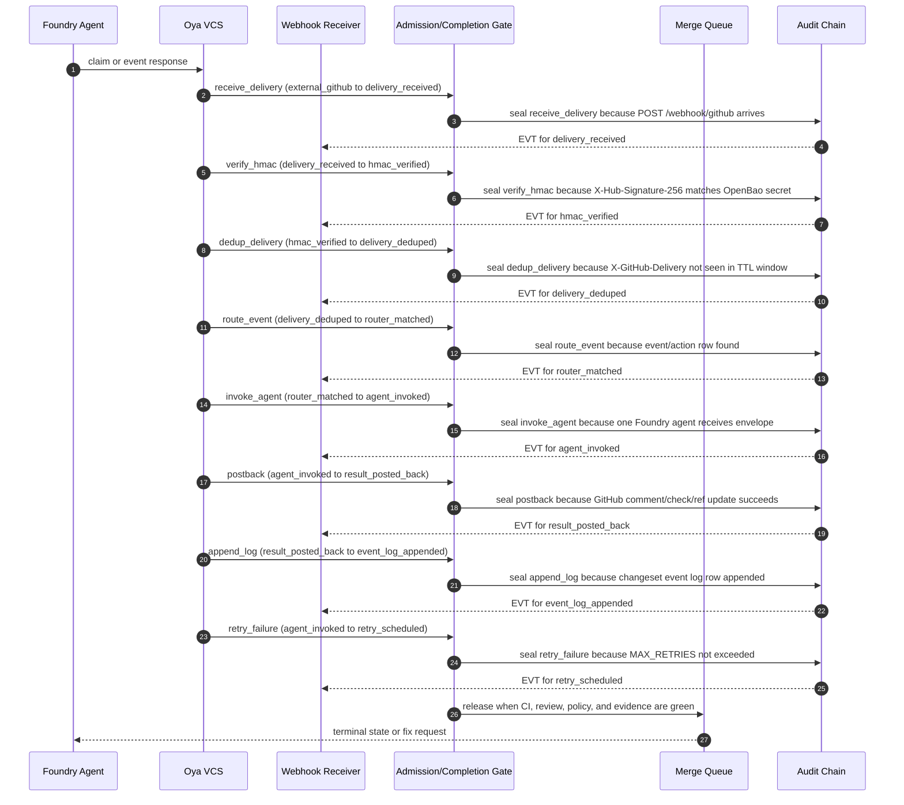

# Foundry Webhook Driven Agent Invocation

## Purpose

This spec defines the Foundry webhook receiver, GitHub delivery verification, idempotency table, event router, agent invocation envelope, retry budget, and post-back contract for internal agentic-development events.

The receiver accepts repository and CI webhooks for internal development automation only; tenant-facing AI callbacks belong to Intelligence or product microservices, not Foundry.

Foundry was the internal agentic-development pipeline (RETIRED per ADR-0335 Wave 15I; absorbed into intelligence): it coordinates source changes, CI evidence, reviewer decisions, merge-queue state, and promotion state for the oyatie repository.
Foundry is not a consumer-facing AI product, not a tenant assistant, and not the place where B2B or B2C prompt history is stored.
This spec turns the ADR-level decision into an operator-readable and agent-executable substrate contract.
The contract is intentionally written with RFC 2119 and RFC 8174 keywords so policy, CI, and agent prompts can parse the same text.
The control plane treats tenant_id=oyatie as the internal tenant for internal agentic-development pipeline emissions, consistent with ADR-0263.
Every state-changing step emits an audit event and a correlated observability record before a downstream state may rely on it.
The implementation boundary is the single Foundry microservice with internal bounded contexts from ADR-0136.
The repository boundary is microservices/foundry plus repo-level governance registries and docs referenced in cross-references.
The user-facing Intelligence substrate remains separate and MUST NOT be conflated with this pipeline.
The stop condition for this spec is a changeset whose evidence, policy, CI, review, queue, and promotion state can be replayed deterministically.

## Normative Requirements

The key words MUST, MUST NOT, REQUIRED, SHALL, SHALL NOT, SHOULD, SHOULD NOT, RECOMMENDED, MAY, and OPTIONAL in this section are to be interpreted as described in RFC 2119 and RFC 8174.

1. Foundry Webhook Driven Agent Invocation MUST ensure the state transition be written before downstream consumers act.
2. Foundry Webhook Driven Agent Invocation MUST ensure the state transition carry a deterministic identifier.
3. Foundry Webhook Driven Agent Invocation MUST ensure the state transition declare its actor, action, resource, and reason.
4. Foundry Webhook Driven Agent Invocation MUST ensure the state transition fail closed when required evidence is absent.
5. Foundry Webhook Driven Agent Invocation MUST ensure the Cedar decision be written before downstream consumers act.
6. Foundry Webhook Driven Agent Invocation MUST ensure the Cedar decision carry a deterministic identifier.
7. Foundry Webhook Driven Agent Invocation MUST ensure the Cedar decision declare its actor, action, resource, and reason.
8. Foundry Webhook Driven Agent Invocation MUST ensure the Cedar decision fail closed when required evidence is absent.
9. Foundry Webhook Driven Agent Invocation MUST ensure the audit event be written before downstream consumers act.
10. Foundry Webhook Driven Agent Invocation MUST ensure the audit event carry a deterministic identifier.
11. Foundry Webhook Driven Agent Invocation MUST ensure the audit event declare its actor, action, resource, and reason.
12. Foundry Webhook Driven Agent Invocation MUST ensure the audit event fail closed when required evidence is absent.
13. Foundry Webhook Driven Agent Invocation MUST ensure the observability emission be written before downstream consumers act.
14. Foundry Webhook Driven Agent Invocation MUST ensure the observability emission carry a deterministic identifier.
15. Foundry Webhook Driven Agent Invocation MUST ensure the observability emission declare its actor, action, resource, and reason.
16. Foundry Webhook Driven Agent Invocation MUST ensure the observability emission fail closed when required evidence is absent.
17. Foundry Webhook Driven Agent Invocation MUST ensure the evidence bundle be written before downstream consumers act.
18. Foundry Webhook Driven Agent Invocation MUST ensure the evidence bundle carry a deterministic identifier.
19. Foundry Webhook Driven Agent Invocation MUST ensure the evidence bundle declare its actor, action, resource, and reason.
20. Foundry Webhook Driven Agent Invocation MUST ensure the evidence bundle fail closed when required evidence is absent.
21. Foundry Webhook Driven Agent Invocation MUST ensure the cost budget be written before downstream consumers act.
22. Foundry Webhook Driven Agent Invocation MUST ensure the cost budget carry a deterministic identifier.
23. Foundry Webhook Driven Agent Invocation MUST ensure the cost budget declare its actor, action, resource, and reason.
24. Foundry Webhook Driven Agent Invocation MUST ensure the cost budget fail closed when required evidence is absent.
25. Foundry Webhook Driven Agent Invocation MUST ensure the idempotency key be written before downstream consumers act.
26. Foundry Webhook Driven Agent Invocation MUST ensure the idempotency key carry a deterministic identifier.
27. Foundry Webhook Driven Agent Invocation MUST ensure the idempotency key declare its actor, action, resource, and reason.
28. Foundry Webhook Driven Agent Invocation MUST ensure the idempotency key fail closed when required evidence is absent.
29. Foundry Webhook Driven Agent Invocation MUST ensure the retry branch be written before downstream consumers act.
30. Foundry Webhook Driven Agent Invocation MUST ensure the retry branch carry a deterministic identifier.
31. Foundry Webhook Driven Agent Invocation MUST ensure the retry branch declare its actor, action, resource, and reason.
32. Foundry Webhook Driven Agent Invocation MUST ensure the retry branch fail closed when required evidence is absent.
33. Foundry Webhook Driven Agent Invocation MUST ensure the reviewer verdict be written before downstream consumers act.
34. Foundry Webhook Driven Agent Invocation MUST ensure the reviewer verdict carry a deterministic identifier.
35. Foundry Webhook Driven Agent Invocation MUST ensure the reviewer verdict declare its actor, action, resource, and reason.
36. Foundry Webhook Driven Agent Invocation MUST ensure the reviewer verdict fail closed when required evidence is absent.
37. Foundry Webhook Driven Agent Invocation MUST ensure the CI status be written before downstream consumers act.
38. Foundry Webhook Driven Agent Invocation MUST ensure the CI status carry a deterministic identifier.
39. Foundry Webhook Driven Agent Invocation MUST ensure the CI status declare its actor, action, resource, and reason.
40. Foundry Webhook Driven Agent Invocation MUST ensure the CI status fail closed when required evidence is absent.
41. Foundry Webhook Driven Agent Invocation MUST ensure the worktree lane be written before downstream consumers act.
42. Foundry Webhook Driven Agent Invocation MUST ensure the worktree lane carry a deterministic identifier.
43. Foundry Webhook Driven Agent Invocation MUST ensure the worktree lane declare its actor, action, resource, and reason.
44. Foundry Webhook Driven Agent Invocation MUST ensure the worktree lane fail closed when required evidence is absent.
45. Foundry Webhook Driven Agent Invocation MUST ensure the branch reference be written before downstream consumers act.
46. Foundry Webhook Driven Agent Invocation MUST ensure the branch reference carry a deterministic identifier.
47. Foundry Webhook Driven Agent Invocation MUST ensure the branch reference declare its actor, action, resource, and reason.
48. Foundry Webhook Driven Agent Invocation MUST ensure the branch reference fail closed when required evidence is absent.
49. Foundry Webhook Driven Agent Invocation MUST ensure the merge-queue position be written before downstream consumers act.
50. Foundry Webhook Driven Agent Invocation MUST ensure the merge-queue position carry a deterministic identifier.
51. Foundry Webhook Driven Agent Invocation MUST ensure the merge-queue position declare its actor, action, resource, and reason.
52. Foundry Webhook Driven Agent Invocation MUST ensure the merge-queue position fail closed when required evidence is absent.
53. Foundry Webhook Driven Agent Invocation MUST ensure the promotion target be written before downstream consumers act.
54. Foundry Webhook Driven Agent Invocation MUST ensure the promotion target carry a deterministic identifier.
55. Foundry Webhook Driven Agent Invocation MUST ensure the promotion target declare its actor, action, resource, and reason.
56. Foundry Webhook Driven Agent Invocation MUST ensure the promotion target fail closed when required evidence is absent.
57. Foundry Webhook Driven Agent Invocation MUST ensure the human override be written before downstream consumers act.
58. Foundry Webhook Driven Agent Invocation MUST ensure the human override carry a deterministic identifier.
59. Foundry Webhook Driven Agent Invocation MUST ensure the human override declare its actor, action, resource, and reason.
60. Foundry Webhook Driven Agent Invocation MUST ensure the human override fail closed when required evidence is absent.
61. Foundry Webhook Driven Agent Invocation MUST ensure the safe-path predicate be written before downstream consumers act.
62. Foundry Webhook Driven Agent Invocation MUST ensure the safe-path predicate carry a deterministic identifier.
63. Foundry Webhook Driven Agent Invocation MUST ensure the safe-path predicate declare its actor, action, resource, and reason.
64. Foundry Webhook Driven Agent Invocation MUST ensure the safe-path predicate fail closed when required evidence is absent.
65. Foundry Webhook Driven Agent Invocation MUST ensure the OpenBao secret reference be written before downstream consumers act.
66. Foundry Webhook Driven Agent Invocation MUST ensure the OpenBao secret reference carry a deterministic identifier.
67. Foundry Webhook Driven Agent Invocation MUST ensure the OpenBao secret reference declare its actor, action, resource, and reason.
68. Foundry Webhook Driven Agent Invocation MUST ensure the OpenBao secret reference fail closed when required evidence is absent.
69. Foundry Webhook Driven Agent Invocation MUST ensure the GitHub post-back be written before downstream consumers act.
70. Foundry Webhook Driven Agent Invocation MUST ensure the GitHub post-back carry a deterministic identifier.
71. Foundry Webhook Driven Agent Invocation MUST ensure the GitHub post-back declare its actor, action, resource, and reason.
72. Foundry Webhook Driven Agent Invocation MUST ensure the GitHub post-back fail closed when required evidence is absent.
73. Foundry Webhook Driven Agent Invocation MUST ensure the multispectrum evidence be written before downstream consumers act.
74. Foundry Webhook Driven Agent Invocation MUST ensure the multispectrum evidence carry a deterministic identifier.
75. Foundry Webhook Driven Agent Invocation MUST ensure the multispectrum evidence declare its actor, action, resource, and reason.
76. Foundry Webhook Driven Agent Invocation MUST ensure the multispectrum evidence fail closed when required evidence is absent.
77. Foundry Webhook Driven Agent Invocation MUST ensure the trace context be written before downstream consumers act.
78. Foundry Webhook Driven Agent Invocation MUST ensure the trace context carry a deterministic identifier.
79. Foundry Webhook Driven Agent Invocation MUST ensure the trace context declare its actor, action, resource, and reason.
80. Foundry Webhook Driven Agent Invocation MUST ensure the trace context fail closed when required evidence is absent.
81. The `delivery_received` phase SHOULD expose a machine-readable status row with actor, at, evidence_uri, trace_id, and audit_id.
82. The `hmac_verified` phase SHOULD expose a machine-readable status row with actor, at, evidence_uri, trace_id, and audit_id.
83. The `delivery_deduped` phase SHOULD expose a machine-readable status row with actor, at, evidence_uri, trace_id, and audit_id.
84. The `router_matched` phase SHOULD expose a machine-readable status row with actor, at, evidence_uri, trace_id, and audit_id.
85. The `agent_invoked` phase SHOULD expose a machine-readable status row with actor, at, evidence_uri, trace_id, and audit_id.
86. The `result_posted_back` phase SHOULD expose a machine-readable status row with actor, at, evidence_uri, trace_id, and audit_id.
87. The `retry_scheduled` phase SHOULD expose a machine-readable status row with actor, at, evidence_uri, trace_id, and audit_id.
88. The `delivery_quarantined` phase SHOULD expose a machine-readable status row with actor, at, evidence_uri, trace_id, and audit_id.
89. The `event_log_appended` phase SHOULD expose a machine-readable status row with actor, at, evidence_uri, trace_id, and audit_id.
90. Action `foundry.webhook.receive` MUST be denied unless a matching Cedar permit binds the principal, resource, and changeset intent.
91. Action `foundry.webhook.verify_hmac` MUST be denied unless a matching Cedar permit binds the principal, resource, and changeset intent.
92. Action `foundry.webhook.dedup` MUST be denied unless a matching Cedar permit binds the principal, resource, and changeset intent.
93. Action `foundry.webhook.route` MUST be denied unless a matching Cedar permit binds the principal, resource, and changeset intent.
94. Action `foundry.agent.invoke` MUST be denied unless a matching Cedar permit binds the principal, resource, and changeset intent.
95. Action `foundry.github.postback` MUST be denied unless a matching Cedar permit binds the principal, resource, and changeset intent.
96. Action `foundry.webhook.retry` MUST be denied unless a matching Cedar permit binds the principal, resource, and changeset intent.
97. Action `foundry.webhook.quarantine` MUST be denied unless a matching Cedar permit binds the principal, resource, and changeset intent.
98. Implementations MAY add stricter product-local gates when they do not weaken any requirement in ADR-0112.

## State Machine / Sequence Diagram



### Named Transitions

| Transition | From | To | Guard summary | Audit event | Recovery if denied |
|---|---|---|---|---|---|
| receive_delivery | external_github | delivery_received | POST /webhook/github arrives; Cedar permit required; evidence hash present | EVT-FOUNDRY-WEBHOOK-RECEIVED | Hold at external_github; append refusal reason; request fix or human override |
| verify_hmac | delivery_received | hmac_verified | X-Hub-Signature-256 matches OpenBao secret; Cedar permit required; evidence hash present | EVT-FOUNDRY-WEBHOOK-RECEIVED | Hold at delivery_received; append refusal reason; request fix or human override |
| dedup_delivery | hmac_verified | delivery_deduped | X-GitHub-Delivery not seen in TTL window; Cedar permit required; evidence hash present | EVT-FOUNDRY-WEBHOOK-HMAC-VERIFIED | Hold at hmac_verified; append refusal reason; request fix or human override |
| route_event | delivery_deduped | router_matched | event/action row found; Cedar permit required; evidence hash present | EVT-FOUNDRY-WEBHOOK-DEDUPED | Hold at delivery_deduped; append refusal reason; request fix or human override |
| invoke_agent | router_matched | agent_invoked | one Foundry agent receives envelope; Cedar permit required; evidence hash present | EVT-FOUNDRY-WEBHOOK-RECEIVED | Hold at router_matched; append refusal reason; request fix or human override |
| postback | agent_invoked | result_posted_back | GitHub comment/check/ref update succeeds; Cedar permit required; evidence hash present | EVT-FOUNDRY-WEBHOOK-QUARANTINED | Hold at agent_invoked; append refusal reason; request fix or human override |
| append_log | result_posted_back | event_log_appended | changeset event log row appended; Cedar permit required; evidence hash present | EVT-FOUNDRY-WEBHOOK-QUARANTINED | Hold at result_posted_back; append refusal reason; request fix or human override |
| retry_failure | agent_invoked | retry_scheduled | MAX_RETRIES not exceeded; Cedar permit required; evidence hash present | EVT-FOUNDRY-AGENT-INVOKED | Hold at agent_invoked; append refusal reason; request fix or human override |
| quarantine_failure | retry_scheduled | delivery_quarantined | MAX_RETRIES exceeded; Cedar permit required; evidence hash present | EVT-FOUNDRY-WEBHOOK-RECEIVED | Hold at retry_scheduled; append refusal reason; request fix or human override |
| reject_unknown | delivery_deduped | delivery_quarantined | event/action not registered; Cedar permit required; evidence hash present | EVT-FOUNDRY-WEBHOOK-DEDUPED | Hold at delivery_deduped; append refusal reason; request fix or human override |
| replay-check-01 | external_github | delivery_received | Replay validates delivery_received ordering, signature, budget, and trace context | EVT-FOUNDRY-WEBHOOK-RECEIVED | Recompute from append-only log and refuse non-monotonic row |
| replay-check-02 | delivery_received | hmac_verified | Replay validates hmac_verified ordering, signature, budget, and trace context | EVT-FOUNDRY-WEBHOOK-HMAC-VERIFIED | Recompute from append-only log and refuse non-monotonic row |
| replay-check-03 | hmac_verified | delivery_deduped | Replay validates delivery_deduped ordering, signature, budget, and trace context | EVT-FOUNDRY-WEBHOOK-DEDUPED | Recompute from append-only log and refuse non-monotonic row |
| replay-check-04 | delivery_deduped | router_matched | Replay validates router_matched ordering, signature, budget, and trace context | EVT-FOUNDRY-AGENT-INVOKED | Recompute from append-only log and refuse non-monotonic row |
| replay-check-05 | router_matched | agent_invoked | Replay validates agent_invoked ordering, signature, budget, and trace context | EVT-FOUNDRY-WEBHOOK-QUARANTINED | Recompute from append-only log and refuse non-monotonic row |
| replay-check-06 | agent_invoked | result_posted_back | Replay validates result_posted_back ordering, signature, budget, and trace context | EVT-FOUNDRY-WEBHOOK-RECEIVED | Recompute from append-only log and refuse non-monotonic row |
| replay-check-07 | result_posted_back | event_log_appended | Replay validates retry_scheduled ordering, signature, budget, and trace context | EVT-FOUNDRY-WEBHOOK-HMAC-VERIFIED | Recompute from append-only log and refuse non-monotonic row |
| replay-check-08 | agent_invoked | retry_scheduled | Replay validates delivery_quarantined ordering, signature, budget, and trace context | EVT-FOUNDRY-WEBHOOK-DEDUPED | Recompute from append-only log and refuse non-monotonic row |
| replay-check-09 | retry_scheduled | delivery_quarantined | Replay validates event_log_appended ordering, signature, budget, and trace context | EVT-FOUNDRY-AGENT-INVOKED | Recompute from append-only log and refuse non-monotonic row |
| replay-check-10 | delivery_deduped | delivery_quarantined | Replay validates delivery_received ordering, signature, budget, and trace context | EVT-FOUNDRY-WEBHOOK-QUARANTINED | Recompute from append-only log and refuse non-monotonic row |
| replay-check-11 | external_github | delivery_received | Replay validates hmac_verified ordering, signature, budget, and trace context | EVT-FOUNDRY-WEBHOOK-RECEIVED | Recompute from append-only log and refuse non-monotonic row |
| replay-check-12 | delivery_received | hmac_verified | Replay validates delivery_deduped ordering, signature, budget, and trace context | EVT-FOUNDRY-WEBHOOK-HMAC-VERIFIED | Recompute from append-only log and refuse non-monotonic row |
| replay-check-13 | hmac_verified | delivery_deduped | Replay validates router_matched ordering, signature, budget, and trace context | EVT-FOUNDRY-WEBHOOK-DEDUPED | Recompute from append-only log and refuse non-monotonic row |
| replay-check-14 | delivery_deduped | router_matched | Replay validates agent_invoked ordering, signature, budget, and trace context | EVT-FOUNDRY-AGENT-INVOKED | Recompute from append-only log and refuse non-monotonic row |
| replay-check-15 | router_matched | agent_invoked | Replay validates result_posted_back ordering, signature, budget, and trace context | EVT-FOUNDRY-WEBHOOK-QUARANTINED | Recompute from append-only log and refuse non-monotonic row |
| replay-check-16 | agent_invoked | result_posted_back | Replay validates retry_scheduled ordering, signature, budget, and trace context | EVT-FOUNDRY-WEBHOOK-RECEIVED | Recompute from append-only log and refuse non-monotonic row |
| replay-check-17 | result_posted_back | event_log_appended | Replay validates delivery_quarantined ordering, signature, budget, and trace context | EVT-FOUNDRY-WEBHOOK-HMAC-VERIFIED | Recompute from append-only log and refuse non-monotonic row |
| replay-check-18 | agent_invoked | retry_scheduled | Replay validates event_log_appended ordering, signature, budget, and trace context | EVT-FOUNDRY-WEBHOOK-DEDUPED | Recompute from append-only log and refuse non-monotonic row |
| replay-check-19 | retry_scheduled | delivery_quarantined | Replay validates delivery_received ordering, signature, budget, and trace context | EVT-FOUNDRY-AGENT-INVOKED | Recompute from append-only log and refuse non-monotonic row |
| replay-check-20 | delivery_deduped | delivery_quarantined | Replay validates hmac_verified ordering, signature, budget, and trace context | EVT-FOUNDRY-WEBHOOK-QUARANTINED | Recompute from append-only log and refuse non-monotonic row |
| replay-check-21 | external_github | delivery_received | Replay validates delivery_deduped ordering, signature, budget, and trace context | EVT-FOUNDRY-WEBHOOK-RECEIVED | Recompute from append-only log and refuse non-monotonic row |
| replay-check-22 | delivery_received | hmac_verified | Replay validates router_matched ordering, signature, budget, and trace context | EVT-FOUNDRY-WEBHOOK-HMAC-VERIFIED | Recompute from append-only log and refuse non-monotonic row |
| replay-check-23 | hmac_verified | delivery_deduped | Replay validates agent_invoked ordering, signature, budget, and trace context | EVT-FOUNDRY-WEBHOOK-DEDUPED | Recompute from append-only log and refuse non-monotonic row |
| replay-check-24 | delivery_deduped | router_matched | Replay validates result_posted_back ordering, signature, budget, and trace context | EVT-FOUNDRY-AGENT-INVOKED | Recompute from append-only log and refuse non-monotonic row |
| replay-check-25 | router_matched | agent_invoked | Replay validates retry_scheduled ordering, signature, budget, and trace context | EVT-FOUNDRY-WEBHOOK-QUARANTINED | Recompute from append-only log and refuse non-monotonic row |
| replay-check-26 | agent_invoked | result_posted_back | Replay validates delivery_quarantined ordering, signature, budget, and trace context | EVT-FOUNDRY-WEBHOOK-RECEIVED | Recompute from append-only log and refuse non-monotonic row |
| replay-check-27 | result_posted_back | event_log_appended | Replay validates event_log_appended ordering, signature, budget, and trace context | EVT-FOUNDRY-WEBHOOK-HMAC-VERIFIED | Recompute from append-only log and refuse non-monotonic row |
| replay-check-28 | agent_invoked | retry_scheduled | Replay validates delivery_received ordering, signature, budget, and trace context | EVT-FOUNDRY-WEBHOOK-DEDUPED | Recompute from append-only log and refuse non-monotonic row |
| replay-check-29 | retry_scheduled | delivery_quarantined | Replay validates hmac_verified ordering, signature, budget, and trace context | EVT-FOUNDRY-AGENT-INVOKED | Recompute from append-only log and refuse non-monotonic row |
| replay-check-30 | delivery_deduped | delivery_quarantined | Replay validates delivery_deduped ordering, signature, budget, and trace context | EVT-FOUNDRY-WEBHOOK-QUARANTINED | Recompute from append-only log and refuse non-monotonic row |
| replay-check-31 | external_github | delivery_received | Replay validates router_matched ordering, signature, budget, and trace context | EVT-FOUNDRY-WEBHOOK-RECEIVED | Recompute from append-only log and refuse non-monotonic row |
| replay-check-32 | delivery_received | hmac_verified | Replay validates agent_invoked ordering, signature, budget, and trace context | EVT-FOUNDRY-WEBHOOK-HMAC-VERIFIED | Recompute from append-only log and refuse non-monotonic row |
| replay-check-33 | hmac_verified | delivery_deduped | Replay validates result_posted_back ordering, signature, budget, and trace context | EVT-FOUNDRY-WEBHOOK-DEDUPED | Recompute from append-only log and refuse non-monotonic row |
| replay-check-34 | delivery_deduped | router_matched | Replay validates retry_scheduled ordering, signature, budget, and trace context | EVT-FOUNDRY-AGENT-INVOKED | Recompute from append-only log and refuse non-monotonic row |
| replay-check-35 | router_matched | agent_invoked | Replay validates delivery_quarantined ordering, signature, budget, and trace context | EVT-FOUNDRY-WEBHOOK-QUARANTINED | Recompute from append-only log and refuse non-monotonic row |
| replay-check-36 | agent_invoked | result_posted_back | Replay validates event_log_appended ordering, signature, budget, and trace context | EVT-FOUNDRY-WEBHOOK-RECEIVED | Recompute from append-only log and refuse non-monotonic row |
| replay-check-37 | result_posted_back | event_log_appended | Replay validates delivery_received ordering, signature, budget, and trace context | EVT-FOUNDRY-WEBHOOK-HMAC-VERIFIED | Recompute from append-only log and refuse non-monotonic row |
| replay-check-38 | agent_invoked | retry_scheduled | Replay validates hmac_verified ordering, signature, budget, and trace context | EVT-FOUNDRY-WEBHOOK-DEDUPED | Recompute from append-only log and refuse non-monotonic row |
| replay-check-39 | retry_scheduled | delivery_quarantined | Replay validates delivery_deduped ordering, signature, budget, and trace context | EVT-FOUNDRY-AGENT-INVOKED | Recompute from append-only log and refuse non-monotonic row |
| replay-check-40 | delivery_deduped | delivery_quarantined | Replay validates router_matched ordering, signature, budget, and trace context | EVT-FOUNDRY-WEBHOOK-QUARANTINED | Recompute from append-only log and refuse non-monotonic row |
| replay-check-41 | external_github | delivery_received | Replay validates agent_invoked ordering, signature, budget, and trace context | EVT-FOUNDRY-WEBHOOK-RECEIVED | Recompute from append-only log and refuse non-monotonic row |
| replay-check-42 | delivery_received | hmac_verified | Replay validates result_posted_back ordering, signature, budget, and trace context | EVT-FOUNDRY-WEBHOOK-HMAC-VERIFIED | Recompute from append-only log and refuse non-monotonic row |
| replay-check-43 | hmac_verified | delivery_deduped | Replay validates retry_scheduled ordering, signature, budget, and trace context | EVT-FOUNDRY-WEBHOOK-DEDUPED | Recompute from append-only log and refuse non-monotonic row |
| replay-check-44 | delivery_deduped | router_matched | Replay validates delivery_quarantined ordering, signature, budget, and trace context | EVT-FOUNDRY-AGENT-INVOKED | Recompute from append-only log and refuse non-monotonic row |
| replay-check-45 | router_matched | agent_invoked | Replay validates event_log_appended ordering, signature, budget, and trace context | EVT-FOUNDRY-WEBHOOK-QUARANTINED | Recompute from append-only log and refuse non-monotonic row |
| replay-check-46 | agent_invoked | result_posted_back | Replay validates delivery_received ordering, signature, budget, and trace context | EVT-FOUNDRY-WEBHOOK-RECEIVED | Recompute from append-only log and refuse non-monotonic row |
| replay-check-47 | result_posted_back | event_log_appended | Replay validates hmac_verified ordering, signature, budget, and trace context | EVT-FOUNDRY-WEBHOOK-HMAC-VERIFIED | Recompute from append-only log and refuse non-monotonic row |
| replay-check-48 | agent_invoked | retry_scheduled | Replay validates delivery_deduped ordering, signature, budget, and trace context | EVT-FOUNDRY-WEBHOOK-DEDUPED | Recompute from append-only log and refuse non-monotonic row |
| replay-check-49 | retry_scheduled | delivery_quarantined | Replay validates router_matched ordering, signature, budget, and trace context | EVT-FOUNDRY-AGENT-INVOKED | Recompute from append-only log and refuse non-monotonic row |
| replay-check-50 | delivery_deduped | delivery_quarantined | Replay validates agent_invoked ordering, signature, budget, and trace context | EVT-FOUNDRY-WEBHOOK-QUARANTINED | Recompute from append-only log and refuse non-monotonic row |
| replay-check-51 | external_github | delivery_received | Replay validates result_posted_back ordering, signature, budget, and trace context | EVT-FOUNDRY-WEBHOOK-RECEIVED | Recompute from append-only log and refuse non-monotonic row |
| replay-check-52 | delivery_received | hmac_verified | Replay validates retry_scheduled ordering, signature, budget, and trace context | EVT-FOUNDRY-WEBHOOK-HMAC-VERIFIED | Recompute from append-only log and refuse non-monotonic row |
| replay-check-53 | hmac_verified | delivery_deduped | Replay validates delivery_quarantined ordering, signature, budget, and trace context | EVT-FOUNDRY-WEBHOOK-DEDUPED | Recompute from append-only log and refuse non-monotonic row |
| replay-check-54 | delivery_deduped | router_matched | Replay validates event_log_appended ordering, signature, budget, and trace context | EVT-FOUNDRY-AGENT-INVOKED | Recompute from append-only log and refuse non-monotonic row |

## Cedar Policy Bindings

The bindings below use specific internal principals, actions, and resources. A deny from any narrower policy wins over these permits.

| Binding | Principal | Action | Resource | Required context | Decision |
|---|---|---|---|---|---|
| B-001 | Principal::"oyatie.agent.codex" | Action::"foundry.webhook.receive" | Resource::"secret:sref://openbao/oya/foundry/github-webhook-secret" | workflow=foundry_pipeline; tenant_id=oyatie; intent=webhook-driven-agent-invocation | permit when evidence_hash and changeset_id are present |
| B-002 | Principal::"oyatie.agent.codex" | Action::"foundry.webhook.verify_hmac" | Resource::"delivery-log:registry/vcs/webhook-delivery-log.json" | workflow=foundry_pipeline; tenant_id=oyatie; intent=webhook-driven-agent-invocation | permit when evidence_hash and changeset_id are present |
| B-003 | Principal::"oyatie.agent.codex" | Action::"foundry.webhook.dedup" | Resource::"router:registry/vcs/event-router.yaml" | workflow=foundry_pipeline; tenant_id=oyatie; intent=webhook-driven-agent-invocation | permit when evidence_hash and changeset_id are present |
| B-004 | Principal::"oyatie.agent.codex" | Action::"foundry.webhook.route" | Resource::"repo:oyatie/microservices/foundry" | workflow=foundry_pipeline; tenant_id=oyatie; intent=webhook-driven-agent-invocation | permit when evidence_hash and changeset_id are present |
| B-005 | Principal::"oyatie.agent.codex" | Action::"foundry.agent.invoke" | Resource::"branch:dev" | workflow=foundry_pipeline; tenant_id=oyatie; intent=webhook-driven-agent-invocation | permit when evidence_hash and changeset_id are present |
| B-006 | Principal::"oyatie.agent.claude-opus" | Action::"foundry.webhook.receive" | Resource::"queue:foundry-dev" | workflow=foundry_pipeline; tenant_id=oyatie; intent=webhook-driven-agent-invocation | permit when evidence_hash and changeset_id are present |
| B-007 | Principal::"oyatie.agent.claude-opus" | Action::"foundry.webhook.verify_hmac" | Resource::"event-log:registry/vcs/changeset-event-log.json" | workflow=foundry_pipeline; tenant_id=oyatie; intent=webhook-driven-agent-invocation | permit when evidence_hash and changeset_id are present |
| B-008 | Principal::"oyatie.agent.claude-opus" | Action::"foundry.webhook.dedup" | Resource::"event-router:registry/vcs/event-router.yaml" | workflow=foundry_pipeline; tenant_id=oyatie; intent=webhook-driven-agent-invocation | permit when evidence_hash and changeset_id are present |
| B-009 | Principal::"oyatie.agent.claude-opus" | Action::"foundry.webhook.route" | Resource::"safe-paths:registry/vcs/concurrent-safe-paths.yaml" | workflow=foundry_pipeline; tenant_id=oyatie; intent=webhook-driven-agent-invocation | permit when evidence_hash and changeset_id are present |
| B-010 | Principal::"oyatie.agent.claude-opus" | Action::"foundry.agent.invoke" | Resource::"evidence:evidence/multispectrum" | workflow=foundry_pipeline; tenant_id=oyatie; intent=webhook-driven-agent-invocation | permit when evidence_hash and changeset_id are present |
| B-011 | Principal::"oyatie.agent.planner" | Action::"foundry.webhook.receive" | Resource::"audit:event-class/foundry" | workflow=foundry_pipeline; tenant_id=oyatie; intent=webhook-driven-agent-invocation | permit when evidence_hash and changeset_id are present |
| B-012 | Principal::"oyatie.agent.planner" | Action::"foundry.webhook.verify_hmac" | Resource::"endpoint:/webhook/github" | workflow=foundry_pipeline; tenant_id=oyatie; intent=webhook-driven-agent-invocation | permit when evidence_hash and changeset_id are present |
| B-013 | Principal::"oyatie.agent.planner" | Action::"foundry.webhook.dedup" | Resource::"secret:sref://openbao/oya/foundry/github-webhook-secret" | workflow=foundry_pipeline; tenant_id=oyatie; intent=webhook-driven-agent-invocation | permit when evidence_hash and changeset_id are present |
| B-014 | Principal::"oyatie.agent.planner" | Action::"foundry.webhook.route" | Resource::"delivery-log:registry/vcs/webhook-delivery-log.json" | workflow=foundry_pipeline; tenant_id=oyatie; intent=webhook-driven-agent-invocation | permit when evidence_hash and changeset_id are present |
| B-015 | Principal::"oyatie.agent.planner" | Action::"foundry.agent.invoke" | Resource::"router:registry/vcs/event-router.yaml" | workflow=foundry_pipeline; tenant_id=oyatie; intent=webhook-driven-agent-invocation | permit when evidence_hash and changeset_id are present |
| B-016 | Principal::"oyatie.agent.executor" | Action::"foundry.webhook.receive" | Resource::"repo:oyatie/microservices/foundry" | workflow=foundry_pipeline; tenant_id=oyatie; intent=webhook-driven-agent-invocation | permit when evidence_hash and changeset_id are present |
| B-017 | Principal::"oyatie.agent.executor" | Action::"foundry.webhook.verify_hmac" | Resource::"branch:dev" | workflow=foundry_pipeline; tenant_id=oyatie; intent=webhook-driven-agent-invocation | permit when evidence_hash and changeset_id are present |
| B-018 | Principal::"oyatie.agent.executor" | Action::"foundry.webhook.dedup" | Resource::"queue:foundry-dev" | workflow=foundry_pipeline; tenant_id=oyatie; intent=webhook-driven-agent-invocation | permit when evidence_hash and changeset_id are present |
| B-019 | Principal::"oyatie.agent.executor" | Action::"foundry.webhook.route" | Resource::"event-log:registry/vcs/changeset-event-log.json" | workflow=foundry_pipeline; tenant_id=oyatie; intent=webhook-driven-agent-invocation | permit when evidence_hash and changeset_id are present |
| B-020 | Principal::"oyatie.agent.executor" | Action::"foundry.agent.invoke" | Resource::"event-router:registry/vcs/event-router.yaml" | workflow=foundry_pipeline; tenant_id=oyatie; intent=webhook-driven-agent-invocation | permit when evidence_hash and changeset_id are present |
| B-021 | Principal::"oyatie.service.vcs-orchestrator" | Action::"foundry.webhook.receive" | Resource::"safe-paths:registry/vcs/concurrent-safe-paths.yaml" | workflow=foundry_pipeline; tenant_id=oyatie; intent=webhook-driven-agent-invocation | permit when evidence_hash and changeset_id are present |
| B-022 | Principal::"oyatie.service.vcs-orchestrator" | Action::"foundry.webhook.verify_hmac" | Resource::"evidence:evidence/multispectrum" | workflow=foundry_pipeline; tenant_id=oyatie; intent=webhook-driven-agent-invocation | permit when evidence_hash and changeset_id are present |
| B-023 | Principal::"oyatie.service.vcs-orchestrator" | Action::"foundry.webhook.dedup" | Resource::"audit:event-class/foundry" | workflow=foundry_pipeline; tenant_id=oyatie; intent=webhook-driven-agent-invocation | permit when evidence_hash and changeset_id are present |
| B-024 | Principal::"oyatie.service.vcs-orchestrator" | Action::"foundry.webhook.route" | Resource::"endpoint:/webhook/github" | workflow=foundry_pipeline; tenant_id=oyatie; intent=webhook-driven-agent-invocation | permit when evidence_hash and changeset_id are present |
| B-025 | Principal::"oyatie.service.vcs-orchestrator" | Action::"foundry.agent.invoke" | Resource::"secret:sref://openbao/oya/foundry/github-webhook-secret" | workflow=foundry_pipeline; tenant_id=oyatie; intent=webhook-driven-agent-invocation | permit when evidence_hash and changeset_id are present |
| B-026 | Principal::"oyatie.service.webhook-receiver" | Action::"foundry.webhook.receive" | Resource::"delivery-log:registry/vcs/webhook-delivery-log.json" | workflow=foundry_pipeline; tenant_id=oyatie; intent=webhook-driven-agent-invocation | permit when evidence_hash and changeset_id are present |
| B-027 | Principal::"oyatie.service.webhook-receiver" | Action::"foundry.webhook.verify_hmac" | Resource::"router:registry/vcs/event-router.yaml" | workflow=foundry_pipeline; tenant_id=oyatie; intent=webhook-driven-agent-invocation | permit when evidence_hash and changeset_id are present |
| B-028 | Principal::"oyatie.service.webhook-receiver" | Action::"foundry.webhook.dedup" | Resource::"repo:oyatie/microservices/foundry" | workflow=foundry_pipeline; tenant_id=oyatie; intent=webhook-driven-agent-invocation | permit when evidence_hash and changeset_id are present |
| B-029 | Principal::"oyatie.service.webhook-receiver" | Action::"foundry.webhook.route" | Resource::"branch:dev" | workflow=foundry_pipeline; tenant_id=oyatie; intent=webhook-driven-agent-invocation | permit when evidence_hash and changeset_id are present |
| B-030 | Principal::"oyatie.service.webhook-receiver" | Action::"foundry.agent.invoke" | Resource::"queue:foundry-dev" | workflow=foundry_pipeline; tenant_id=oyatie; intent=webhook-driven-agent-invocation | permit when evidence_hash and changeset_id are present |
| B-031 | Principal::"oyatie.service.merge-queue" | Action::"foundry.webhook.receive" | Resource::"event-log:registry/vcs/changeset-event-log.json" | workflow=foundry_pipeline; tenant_id=oyatie; intent=webhook-driven-agent-invocation | permit when evidence_hash and changeset_id are present |
| B-032 | Principal::"oyatie.service.merge-queue" | Action::"foundry.webhook.verify_hmac" | Resource::"event-router:registry/vcs/event-router.yaml" | workflow=foundry_pipeline; tenant_id=oyatie; intent=webhook-driven-agent-invocation | permit when evidence_hash and changeset_id are present |
| B-033 | Principal::"oyatie.service.merge-queue" | Action::"foundry.webhook.dedup" | Resource::"safe-paths:registry/vcs/concurrent-safe-paths.yaml" | workflow=foundry_pipeline; tenant_id=oyatie; intent=webhook-driven-agent-invocation | permit when evidence_hash and changeset_id are present |
| B-034 | Principal::"oyatie.service.merge-queue" | Action::"foundry.webhook.route" | Resource::"evidence:evidence/multispectrum" | workflow=foundry_pipeline; tenant_id=oyatie; intent=webhook-driven-agent-invocation | permit when evidence_hash and changeset_id are present |
| B-035 | Principal::"oyatie.service.merge-queue" | Action::"foundry.agent.invoke" | Resource::"audit:event-class/foundry" | workflow=foundry_pipeline; tenant_id=oyatie; intent=webhook-driven-agent-invocation | permit when evidence_hash and changeset_id are present |
| B-036 | Principal::"oyatie.service.admission-gate" | Action::"foundry.webhook.receive" | Resource::"endpoint:/webhook/github" | workflow=foundry_pipeline; tenant_id=oyatie; intent=webhook-driven-agent-invocation | permit when evidence_hash and changeset_id are present |
| B-037 | Principal::"oyatie.service.admission-gate" | Action::"foundry.webhook.verify_hmac" | Resource::"secret:sref://openbao/oya/foundry/github-webhook-secret" | workflow=foundry_pipeline; tenant_id=oyatie; intent=webhook-driven-agent-invocation | permit when evidence_hash and changeset_id are present |
| B-038 | Principal::"oyatie.service.admission-gate" | Action::"foundry.webhook.dedup" | Resource::"delivery-log:registry/vcs/webhook-delivery-log.json" | workflow=foundry_pipeline; tenant_id=oyatie; intent=webhook-driven-agent-invocation | permit when evidence_hash and changeset_id are present |
| B-039 | Principal::"oyatie.service.admission-gate" | Action::"foundry.webhook.route" | Resource::"router:registry/vcs/event-router.yaml" | workflow=foundry_pipeline; tenant_id=oyatie; intent=webhook-driven-agent-invocation | permit when evidence_hash and changeset_id are present |
| B-040 | Principal::"oyatie.service.admission-gate" | Action::"foundry.agent.invoke" | Resource::"repo:oyatie/microservices/foundry" | workflow=foundry_pipeline; tenant_id=oyatie; intent=webhook-driven-agent-invocation | permit when evidence_hash and changeset_id are present |
| B-041 | Principal::"oyatie.service.completion-gate" | Action::"foundry.webhook.receive" | Resource::"branch:dev" | workflow=foundry_pipeline; tenant_id=oyatie; intent=webhook-driven-agent-invocation | permit when evidence_hash and changeset_id are present |
| B-042 | Principal::"oyatie.service.completion-gate" | Action::"foundry.webhook.verify_hmac" | Resource::"queue:foundry-dev" | workflow=foundry_pipeline; tenant_id=oyatie; intent=webhook-driven-agent-invocation | permit when evidence_hash and changeset_id are present |
| B-043 | Principal::"oyatie.service.completion-gate" | Action::"foundry.webhook.dedup" | Resource::"event-log:registry/vcs/changeset-event-log.json" | workflow=foundry_pipeline; tenant_id=oyatie; intent=webhook-driven-agent-invocation | permit when evidence_hash and changeset_id are present |
| B-044 | Principal::"oyatie.service.completion-gate" | Action::"foundry.webhook.route" | Resource::"event-router:registry/vcs/event-router.yaml" | workflow=foundry_pipeline; tenant_id=oyatie; intent=webhook-driven-agent-invocation | permit when evidence_hash and changeset_id are present |
| B-045 | Principal::"oyatie.service.completion-gate" | Action::"foundry.agent.invoke" | Resource::"safe-paths:registry/vcs/concurrent-safe-paths.yaml" | workflow=foundry_pipeline; tenant_id=oyatie; intent=webhook-driven-agent-invocation | permit when evidence_hash and changeset_id are present |
| B-046 | Principal::"oyatie.human.reviewer" | Action::"foundry.webhook.receive" | Resource::"evidence:evidence/multispectrum" | workflow=foundry_pipeline; tenant_id=oyatie; intent=webhook-driven-agent-invocation | permit when evidence_hash and changeset_id are present |
| B-047 | Principal::"oyatie.human.reviewer" | Action::"foundry.webhook.verify_hmac" | Resource::"audit:event-class/foundry" | workflow=foundry_pipeline; tenant_id=oyatie; intent=webhook-driven-agent-invocation | permit when evidence_hash and changeset_id are present |
| B-048 | Principal::"oyatie.human.reviewer" | Action::"foundry.webhook.dedup" | Resource::"endpoint:/webhook/github" | workflow=foundry_pipeline; tenant_id=oyatie; intent=webhook-driven-agent-invocation | permit when evidence_hash and changeset_id are present |
| B-049 | Principal::"oyatie.human.reviewer" | Action::"foundry.webhook.route" | Resource::"secret:sref://openbao/oya/foundry/github-webhook-secret" | workflow=foundry_pipeline; tenant_id=oyatie; intent=webhook-driven-agent-invocation | permit when evidence_hash and changeset_id are present |
| B-050 | Principal::"oyatie.human.reviewer" | Action::"foundry.agent.invoke" | Resource::"delivery-log:registry/vcs/webhook-delivery-log.json" | workflow=foundry_pipeline; tenant_id=oyatie; intent=webhook-driven-agent-invocation | permit when evidence_hash and changeset_id are present |

```cedar
permit(
  principal in Principal::"oyatie.agent.codex",
  action == Action::"foundry.webhook.receive",
  resource in Resource::"repo:oyatie/microservices/foundry"
) when {
  context.tenant_id == "oyatie" &&
  context.workflow == "foundry_pipeline" &&
  context.related_adr == "ADR-0112" &&
  context.evidence_hash != "" &&
  context.trace_id != ""
};

permit(
  principal in Principal::"oyatie.agent.codex",
  action == Action::"foundry.webhook.verify_hmac",
  resource in Resource::"repo:oyatie/microservices/foundry"
) when {
  context.tenant_id == "oyatie" &&
  context.workflow == "foundry_pipeline" &&
  context.related_adr == "ADR-0112" &&
  context.evidence_hash != "" &&
  context.trace_id != ""
};

permit(
  principal in Principal::"oyatie.agent.codex",
  action == Action::"foundry.webhook.dedup",
  resource in Resource::"repo:oyatie/microservices/foundry"
) when {
  context.tenant_id == "oyatie" &&
  context.workflow == "foundry_pipeline" &&
  context.related_adr == "ADR-0112" &&
  context.evidence_hash != "" &&
  context.trace_id != ""
};

permit(
  principal in Principal::"oyatie.agent.codex",
  action == Action::"foundry.webhook.route",
  resource in Resource::"repo:oyatie/microservices/foundry"
) when {
  context.tenant_id == "oyatie" &&
  context.workflow == "foundry_pipeline" &&
  context.related_adr == "ADR-0112" &&
  context.evidence_hash != "" &&
  context.trace_id != ""
};

forbid(
  principal,
  action,
  resource in Resource::"repo:oyatie/microservices/foundry/decisions"
) when {
  context.intent == "webhook-driven-agent-invocation" &&
  context.owner != "per-msvc-adrs-batch-d"
};
```

### Cedar Guard Catalog

- Guard 01: Principal::"oyatie.agent.codex" may invoke foundry.webhook.receive on Resource::"endpoint:/webhook/github" only while `delivery_received` is current, the changeset id is stable, the event is signed, and the ADR-0112 invariant is cited.
- Guard 02: Principal::"oyatie.agent.claude-opus" may invoke foundry.webhook.verify_hmac on Resource::"secret:sref://openbao/oya/foundry/github-webhook-secret" only while `hmac_verified` is current, the changeset id is stable, the event is signed, and the ADR-0112 invariant is cited.
- Guard 03: Principal::"oyatie.agent.planner" may invoke foundry.webhook.dedup on Resource::"delivery-log:registry/vcs/webhook-delivery-log.json" only while `delivery_deduped` is current, the changeset id is stable, the event is signed, and the ADR-0112 invariant is cited.
- Guard 04: Principal::"oyatie.agent.executor" may invoke foundry.webhook.route on Resource::"router:registry/vcs/event-router.yaml" only while `router_matched` is current, the changeset id is stable, the event is signed, and the ADR-0112 invariant is cited.
- Guard 05: Principal::"oyatie.service.vcs-orchestrator" may invoke foundry.agent.invoke on Resource::"repo:oyatie/microservices/foundry" only while `agent_invoked` is current, the changeset id is stable, the event is signed, and the ADR-0112 invariant is cited.
- Guard 06: Principal::"oyatie.service.webhook-receiver" may invoke foundry.github.postback on Resource::"branch:dev" only while `result_posted_back` is current, the changeset id is stable, the event is signed, and the ADR-0112 invariant is cited.
- Guard 07: Principal::"oyatie.service.merge-queue" may invoke foundry.webhook.retry on Resource::"queue:foundry-dev" only while `retry_scheduled` is current, the changeset id is stable, the event is signed, and the ADR-0112 invariant is cited.
- Guard 08: Principal::"oyatie.service.admission-gate" may invoke foundry.webhook.quarantine on Resource::"event-log:registry/vcs/changeset-event-log.json" only while `delivery_quarantined` is current, the changeset id is stable, the event is signed, and the ADR-0112 invariant is cited.
- Guard 09: Principal::"oyatie.service.completion-gate" may invoke foundry.webhook.receive on Resource::"event-router:registry/vcs/event-router.yaml" only while `event_log_appended` is current, the changeset id is stable, the event is signed, and the ADR-0112 invariant is cited.
- Guard 10: Principal::"oyatie.human.reviewer" may invoke foundry.webhook.verify_hmac on Resource::"safe-paths:registry/vcs/concurrent-safe-paths.yaml" only while `delivery_received` is current, the changeset id is stable, the event is signed, and the ADR-0112 invariant is cited.
- Guard 11: Principal::"oyatie.agent.codex" may invoke foundry.webhook.dedup on Resource::"evidence:evidence/multispectrum" only while `hmac_verified` is current, the changeset id is stable, the event is signed, and the ADR-0112 invariant is cited.
- Guard 12: Principal::"oyatie.agent.claude-opus" may invoke foundry.webhook.route on Resource::"audit:event-class/foundry" only while `delivery_deduped` is current, the changeset id is stable, the event is signed, and the ADR-0112 invariant is cited.
- Guard 13: Principal::"oyatie.agent.planner" may invoke foundry.agent.invoke on Resource::"endpoint:/webhook/github" only while `router_matched` is current, the changeset id is stable, the event is signed, and the ADR-0112 invariant is cited.
- Guard 14: Principal::"oyatie.agent.executor" may invoke foundry.github.postback on Resource::"secret:sref://openbao/oya/foundry/github-webhook-secret" only while `agent_invoked` is current, the changeset id is stable, the event is signed, and the ADR-0112 invariant is cited.
- Guard 15: Principal::"oyatie.service.vcs-orchestrator" may invoke foundry.webhook.retry on Resource::"delivery-log:registry/vcs/webhook-delivery-log.json" only while `result_posted_back` is current, the changeset id is stable, the event is signed, and the ADR-0112 invariant is cited.
- Guard 16: Principal::"oyatie.service.webhook-receiver" may invoke foundry.webhook.quarantine on Resource::"router:registry/vcs/event-router.yaml" only while `retry_scheduled` is current, the changeset id is stable, the event is signed, and the ADR-0112 invariant is cited.
- Guard 17: Principal::"oyatie.service.merge-queue" may invoke foundry.webhook.receive on Resource::"repo:oyatie/microservices/foundry" only while `delivery_quarantined` is current, the changeset id is stable, the event is signed, and the ADR-0112 invariant is cited.
- Guard 18: Principal::"oyatie.service.admission-gate" may invoke foundry.webhook.verify_hmac on Resource::"branch:dev" only while `event_log_appended` is current, the changeset id is stable, the event is signed, and the ADR-0112 invariant is cited.
- Guard 19: Principal::"oyatie.service.completion-gate" may invoke foundry.webhook.dedup on Resource::"queue:foundry-dev" only while `delivery_received` is current, the changeset id is stable, the event is signed, and the ADR-0112 invariant is cited.
- Guard 20: Principal::"oyatie.human.reviewer" may invoke foundry.webhook.route on Resource::"event-log:registry/vcs/changeset-event-log.json" only while `hmac_verified` is current, the changeset id is stable, the event is signed, and the ADR-0112 invariant is cited.
- Guard 21: Principal::"oyatie.agent.codex" may invoke foundry.agent.invoke on Resource::"event-router:registry/vcs/event-router.yaml" only while `delivery_deduped` is current, the changeset id is stable, the event is signed, and the ADR-0112 invariant is cited.
- Guard 22: Principal::"oyatie.agent.claude-opus" may invoke foundry.github.postback on Resource::"safe-paths:registry/vcs/concurrent-safe-paths.yaml" only while `router_matched` is current, the changeset id is stable, the event is signed, and the ADR-0112 invariant is cited.
- Guard 23: Principal::"oyatie.agent.planner" may invoke foundry.webhook.retry on Resource::"evidence:evidence/multispectrum" only while `agent_invoked` is current, the changeset id is stable, the event is signed, and the ADR-0112 invariant is cited.
- Guard 24: Principal::"oyatie.agent.executor" may invoke foundry.webhook.quarantine on Resource::"audit:event-class/foundry" only while `result_posted_back` is current, the changeset id is stable, the event is signed, and the ADR-0112 invariant is cited.
- Guard 25: Principal::"oyatie.service.vcs-orchestrator" may invoke foundry.webhook.receive on Resource::"endpoint:/webhook/github" only while `retry_scheduled` is current, the changeset id is stable, the event is signed, and the ADR-0112 invariant is cited.
- Guard 26: Principal::"oyatie.service.webhook-receiver" may invoke foundry.webhook.verify_hmac on Resource::"secret:sref://openbao/oya/foundry/github-webhook-secret" only while `delivery_quarantined` is current, the changeset id is stable, the event is signed, and the ADR-0112 invariant is cited.
- Guard 27: Principal::"oyatie.service.merge-queue" may invoke foundry.webhook.dedup on Resource::"delivery-log:registry/vcs/webhook-delivery-log.json" only while `event_log_appended` is current, the changeset id is stable, the event is signed, and the ADR-0112 invariant is cited.
- Guard 28: Principal::"oyatie.service.admission-gate" may invoke foundry.webhook.route on Resource::"router:registry/vcs/event-router.yaml" only while `delivery_received` is current, the changeset id is stable, the event is signed, and the ADR-0112 invariant is cited.
- Guard 29: Principal::"oyatie.service.completion-gate" may invoke foundry.agent.invoke on Resource::"repo:oyatie/microservices/foundry" only while `hmac_verified` is current, the changeset id is stable, the event is signed, and the ADR-0112 invariant is cited.
- Guard 30: Principal::"oyatie.human.reviewer" may invoke foundry.github.postback on Resource::"branch:dev" only while `delivery_deduped` is current, the changeset id is stable, the event is signed, and the ADR-0112 invariant is cited.
- Guard 31: Principal::"oyatie.agent.codex" may invoke foundry.webhook.retry on Resource::"queue:foundry-dev" only while `router_matched` is current, the changeset id is stable, the event is signed, and the ADR-0112 invariant is cited.
- Guard 32: Principal::"oyatie.agent.claude-opus" may invoke foundry.webhook.quarantine on Resource::"event-log:registry/vcs/changeset-event-log.json" only while `agent_invoked` is current, the changeset id is stable, the event is signed, and the ADR-0112 invariant is cited.
- Guard 33: Principal::"oyatie.agent.planner" may invoke foundry.webhook.receive on Resource::"event-router:registry/vcs/event-router.yaml" only while `result_posted_back` is current, the changeset id is stable, the event is signed, and the ADR-0112 invariant is cited.
- Guard 34: Principal::"oyatie.agent.executor" may invoke foundry.webhook.verify_hmac on Resource::"safe-paths:registry/vcs/concurrent-safe-paths.yaml" only while `retry_scheduled` is current, the changeset id is stable, the event is signed, and the ADR-0112 invariant is cited.
- Guard 35: Principal::"oyatie.service.vcs-orchestrator" may invoke foundry.webhook.dedup on Resource::"evidence:evidence/multispectrum" only while `delivery_quarantined` is current, the changeset id is stable, the event is signed, and the ADR-0112 invariant is cited.
- Guard 36: Principal::"oyatie.service.webhook-receiver" may invoke foundry.webhook.route on Resource::"audit:event-class/foundry" only while `event_log_appended` is current, the changeset id is stable, the event is signed, and the ADR-0112 invariant is cited.
- Guard 37: Principal::"oyatie.service.merge-queue" may invoke foundry.agent.invoke on Resource::"endpoint:/webhook/github" only while `delivery_received` is current, the changeset id is stable, the event is signed, and the ADR-0112 invariant is cited.
- Guard 38: Principal::"oyatie.service.admission-gate" may invoke foundry.github.postback on Resource::"secret:sref://openbao/oya/foundry/github-webhook-secret" only while `hmac_verified` is current, the changeset id is stable, the event is signed, and the ADR-0112 invariant is cited.
- Guard 39: Principal::"oyatie.service.completion-gate" may invoke foundry.webhook.retry on Resource::"delivery-log:registry/vcs/webhook-delivery-log.json" only while `delivery_deduped` is current, the changeset id is stable, the event is signed, and the ADR-0112 invariant is cited.
- Guard 40: Principal::"oyatie.human.reviewer" may invoke foundry.webhook.quarantine on Resource::"router:registry/vcs/event-router.yaml" only while `router_matched` is current, the changeset id is stable, the event is signed, and the ADR-0112 invariant is cited.
- Guard 41: Principal::"oyatie.agent.codex" may invoke foundry.webhook.receive on Resource::"repo:oyatie/microservices/foundry" only while `agent_invoked` is current, the changeset id is stable, the event is signed, and the ADR-0112 invariant is cited.
- Guard 42: Principal::"oyatie.agent.claude-opus" may invoke foundry.webhook.verify_hmac on Resource::"branch:dev" only while `result_posted_back` is current, the changeset id is stable, the event is signed, and the ADR-0112 invariant is cited.
- Guard 43: Principal::"oyatie.agent.planner" may invoke foundry.webhook.dedup on Resource::"queue:foundry-dev" only while `retry_scheduled` is current, the changeset id is stable, the event is signed, and the ADR-0112 invariant is cited.
- Guard 44: Principal::"oyatie.agent.executor" may invoke foundry.webhook.route on Resource::"event-log:registry/vcs/changeset-event-log.json" only while `delivery_quarantined` is current, the changeset id is stable, the event is signed, and the ADR-0112 invariant is cited.
- Guard 45: Principal::"oyatie.service.vcs-orchestrator" may invoke foundry.agent.invoke on Resource::"event-router:registry/vcs/event-router.yaml" only while `event_log_appended` is current, the changeset id is stable, the event is signed, and the ADR-0112 invariant is cited.
- Guard 46: Principal::"oyatie.service.webhook-receiver" may invoke foundry.github.postback on Resource::"safe-paths:registry/vcs/concurrent-safe-paths.yaml" only while `delivery_received` is current, the changeset id is stable, the event is signed, and the ADR-0112 invariant is cited.
- Guard 47: Principal::"oyatie.service.merge-queue" may invoke foundry.webhook.retry on Resource::"evidence:evidence/multispectrum" only while `hmac_verified` is current, the changeset id is stable, the event is signed, and the ADR-0112 invariant is cited.
- Guard 48: Principal::"oyatie.service.admission-gate" may invoke foundry.webhook.quarantine on Resource::"audit:event-class/foundry" only while `delivery_deduped` is current, the changeset id is stable, the event is signed, and the ADR-0112 invariant is cited.
- Guard 49: Principal::"oyatie.service.completion-gate" may invoke foundry.webhook.receive on Resource::"endpoint:/webhook/github" only while `router_matched` is current, the changeset id is stable, the event is signed, and the ADR-0112 invariant is cited.
- Guard 50: Principal::"oyatie.human.reviewer" may invoke foundry.webhook.verify_hmac on Resource::"secret:sref://openbao/oya/foundry/github-webhook-secret" only while `agent_invoked` is current, the changeset id is stable, the event is signed, and the ADR-0112 invariant is cited.
- Guard 51: Principal::"oyatie.agent.codex" may invoke foundry.webhook.dedup on Resource::"delivery-log:registry/vcs/webhook-delivery-log.json" only while `result_posted_back` is current, the changeset id is stable, the event is signed, and the ADR-0112 invariant is cited.
- Guard 52: Principal::"oyatie.agent.claude-opus" may invoke foundry.webhook.route on Resource::"router:registry/vcs/event-router.yaml" only while `retry_scheduled` is current, the changeset id is stable, the event is signed, and the ADR-0112 invariant is cited.
- Guard 53: Principal::"oyatie.agent.planner" may invoke foundry.agent.invoke on Resource::"repo:oyatie/microservices/foundry" only while `delivery_quarantined` is current, the changeset id is stable, the event is signed, and the ADR-0112 invariant is cited.
- Guard 54: Principal::"oyatie.agent.executor" may invoke foundry.github.postback on Resource::"branch:dev" only while `event_log_appended` is current, the changeset id is stable, the event is signed, and the ADR-0112 invariant is cited.
- Guard 55: Principal::"oyatie.service.vcs-orchestrator" may invoke foundry.webhook.retry on Resource::"queue:foundry-dev" only while `delivery_received` is current, the changeset id is stable, the event is signed, and the ADR-0112 invariant is cited.
- Guard 56: Principal::"oyatie.service.webhook-receiver" may invoke foundry.webhook.quarantine on Resource::"event-log:registry/vcs/changeset-event-log.json" only while `hmac_verified` is current, the changeset id is stable, the event is signed, and the ADR-0112 invariant is cited.
- Guard 57: Principal::"oyatie.service.merge-queue" may invoke foundry.webhook.receive on Resource::"event-router:registry/vcs/event-router.yaml" only while `delivery_deduped` is current, the changeset id is stable, the event is signed, and the ADR-0112 invariant is cited.
- Guard 58: Principal::"oyatie.service.admission-gate" may invoke foundry.webhook.verify_hmac on Resource::"safe-paths:registry/vcs/concurrent-safe-paths.yaml" only while `router_matched` is current, the changeset id is stable, the event is signed, and the ADR-0112 invariant is cited.
- Guard 59: Principal::"oyatie.service.completion-gate" may invoke foundry.webhook.dedup on Resource::"evidence:evidence/multispectrum" only while `agent_invoked` is current, the changeset id is stable, the event is signed, and the ADR-0112 invariant is cited.
- Guard 60: Principal::"oyatie.human.reviewer" may invoke foundry.webhook.route on Resource::"audit:event-class/foundry" only while `result_posted_back` is current, the changeset id is stable, the event is signed, and the ADR-0112 invariant is cited.
- Guard 61: Principal::"oyatie.agent.codex" may invoke foundry.agent.invoke on Resource::"endpoint:/webhook/github" only while `retry_scheduled` is current, the changeset id is stable, the event is signed, and the ADR-0112 invariant is cited.
- Guard 62: Principal::"oyatie.agent.claude-opus" may invoke foundry.github.postback on Resource::"secret:sref://openbao/oya/foundry/github-webhook-secret" only while `delivery_quarantined` is current, the changeset id is stable, the event is signed, and the ADR-0112 invariant is cited.
- Guard 63: Principal::"oyatie.agent.planner" may invoke foundry.webhook.retry on Resource::"delivery-log:registry/vcs/webhook-delivery-log.json" only while `event_log_appended` is current, the changeset id is stable, the event is signed, and the ADR-0112 invariant is cited.
- Guard 64: Principal::"oyatie.agent.executor" may invoke foundry.webhook.quarantine on Resource::"router:registry/vcs/event-router.yaml" only while `delivery_received` is current, the changeset id is stable, the event is signed, and the ADR-0112 invariant is cited.
- Guard 65: Principal::"oyatie.service.vcs-orchestrator" may invoke foundry.webhook.receive on Resource::"repo:oyatie/microservices/foundry" only while `hmac_verified` is current, the changeset id is stable, the event is signed, and the ADR-0112 invariant is cited.
- Guard 66: Principal::"oyatie.service.webhook-receiver" may invoke foundry.webhook.verify_hmac on Resource::"branch:dev" only while `delivery_deduped` is current, the changeset id is stable, the event is signed, and the ADR-0112 invariant is cited.
- Guard 67: Principal::"oyatie.service.merge-queue" may invoke foundry.webhook.dedup on Resource::"queue:foundry-dev" only while `router_matched` is current, the changeset id is stable, the event is signed, and the ADR-0112 invariant is cited.
- Guard 68: Principal::"oyatie.service.admission-gate" may invoke foundry.webhook.route on Resource::"event-log:registry/vcs/changeset-event-log.json" only while `agent_invoked` is current, the changeset id is stable, the event is signed, and the ADR-0112 invariant is cited.
- Guard 69: Principal::"oyatie.service.completion-gate" may invoke foundry.agent.invoke on Resource::"event-router:registry/vcs/event-router.yaml" only while `result_posted_back` is current, the changeset id is stable, the event is signed, and the ADR-0112 invariant is cited.
- Guard 70: Principal::"oyatie.human.reviewer" may invoke foundry.github.postback on Resource::"safe-paths:registry/vcs/concurrent-safe-paths.yaml" only while `retry_scheduled` is current, the changeset id is stable, the event is signed, and the ADR-0112 invariant is cited.

## Audit Event Classes Emitted (per ADR-0263)

Every event class below emits structured JSON logs with schema=oyatie/log/v1, tenant_id=oyatie, microservice=foundry, trace_id, span_id, and audit_id when the operation changes state.

| Event class | Emitted when | Required fields | Retention | Cardinality guard |
|---|---|---|---|---|
| EVT-FOUNDRY-WEBHOOK-RECEIVED | Foundry Webhook Driven Agent Invocation changes a durable pipeline fact | changeset_id, actor, action, resource, from_state, to_state, trace_id, span_id, audit_id, evidence_hash | 7 years for audit chain; 90 days hot observability | event_class + changeset_id only; no raw prompt or secret values |
| EVT-FOUNDRY-WEBHOOK-HMAC-VERIFIED | Foundry Webhook Driven Agent Invocation changes a durable pipeline fact | changeset_id, actor, action, resource, from_state, to_state, trace_id, span_id, audit_id, evidence_hash | 7 years for audit chain; 90 days hot observability | event_class + changeset_id only; no raw prompt or secret values |
| EVT-FOUNDRY-WEBHOOK-DEDUPED | Foundry Webhook Driven Agent Invocation changes a durable pipeline fact | changeset_id, actor, action, resource, from_state, to_state, trace_id, span_id, audit_id, evidence_hash | 7 years for audit chain; 90 days hot observability | event_class + changeset_id only; no raw prompt or secret values |
| EVT-FOUNDRY-AGENT-INVOKED | Foundry Webhook Driven Agent Invocation changes a durable pipeline fact | changeset_id, actor, action, resource, from_state, to_state, trace_id, span_id, audit_id, evidence_hash | 7 years for audit chain; 90 days hot observability | event_class + changeset_id only; no raw prompt or secret values |
| EVT-FOUNDRY-WEBHOOK-QUARANTINED | Foundry Webhook Driven Agent Invocation changes a durable pipeline fact | changeset_id, actor, action, resource, from_state, to_state, trace_id, span_id, audit_id, evidence_hash | 7 years for audit chain; 90 days hot observability | event_class + changeset_id only; no raw prompt or secret values |
| EVT-FOUNDRY-WEBHOOK-RECEIVED-001 | claim path observes delivery_received | tenant_id=oyatie, sub_scope=oyatie.foundry.claim, policy_id=ADR-0112.delivery_received, correlation_id, audit_id | hot 90d + sealed audit chain | bounded by changeset_id and delivery_id; free text is scrubbed |
| EVT-FOUNDRY-WEBHOOK-HMAC-VERIFIED-002 | verify path observes hmac_verified | tenant_id=oyatie, sub_scope=oyatie.foundry.verify, policy_id=ADR-0112.hmac_verified, correlation_id, audit_id | hot 90d + sealed audit chain | bounded by changeset_id and delivery_id; free text is scrubbed |
| EVT-FOUNDRY-WEBHOOK-DEDUPED-003 | done path observes delivery_deduped | tenant_id=oyatie, sub_scope=oyatie.foundry.done, policy_id=ADR-0112.delivery_deduped, correlation_id, audit_id | hot 90d + sealed audit chain | bounded by changeset_id and delivery_id; free text is scrubbed |
| EVT-FOUNDRY-AGENT-INVOKED-004 | admission path observes router_matched | tenant_id=oyatie, sub_scope=oyatie.foundry.admission, policy_id=ADR-0112.router_matched, correlation_id, audit_id | hot 90d + sealed audit chain | bounded by changeset_id and delivery_id; free text is scrubbed |
| EVT-FOUNDRY-WEBHOOK-QUARANTINED-005 | completion path observes agent_invoked | tenant_id=oyatie, sub_scope=oyatie.foundry.completion, policy_id=ADR-0112.agent_invoked, correlation_id, audit_id | hot 90d + sealed audit chain | bounded by changeset_id and delivery_id; free text is scrubbed |
| EVT-FOUNDRY-WEBHOOK-RECEIVED-006 | merge_queue path observes result_posted_back | tenant_id=oyatie, sub_scope=oyatie.foundry.merge_queue, policy_id=ADR-0112.result_posted_back, correlation_id, audit_id | hot 90d + sealed audit chain | bounded by changeset_id and delivery_id; free text is scrubbed |
| EVT-FOUNDRY-WEBHOOK-HMAC-VERIFIED-007 | webhook path observes retry_scheduled | tenant_id=oyatie, sub_scope=oyatie.foundry.webhook, policy_id=ADR-0112.retry_scheduled, correlation_id, audit_id | hot 90d + sealed audit chain | bounded by changeset_id and delivery_id; free text is scrubbed |
| EVT-FOUNDRY-WEBHOOK-DEDUPED-008 | review path observes delivery_quarantined | tenant_id=oyatie, sub_scope=oyatie.foundry.review, policy_id=ADR-0112.delivery_quarantined, correlation_id, audit_id | hot 90d + sealed audit chain | bounded by changeset_id and delivery_id; free text is scrubbed |
| EVT-FOUNDRY-AGENT-INVOKED-009 | promotion path observes event_log_appended | tenant_id=oyatie, sub_scope=oyatie.foundry.promotion, policy_id=ADR-0112.event_log_appended, correlation_id, audit_id | hot 90d + sealed audit chain | bounded by changeset_id and delivery_id; free text is scrubbed |
| EVT-FOUNDRY-WEBHOOK-QUARANTINED-010 | override path observes delivery_received | tenant_id=oyatie, sub_scope=oyatie.foundry.override, policy_id=ADR-0112.delivery_received, correlation_id, audit_id | hot 90d + sealed audit chain | bounded by changeset_id and delivery_id; free text is scrubbed |
| EVT-FOUNDRY-WEBHOOK-RECEIVED-011 | claim path observes hmac_verified | tenant_id=oyatie, sub_scope=oyatie.foundry.claim, policy_id=ADR-0112.hmac_verified, correlation_id, audit_id | hot 90d + sealed audit chain | bounded by changeset_id and delivery_id; free text is scrubbed |
| EVT-FOUNDRY-WEBHOOK-HMAC-VERIFIED-012 | verify path observes delivery_deduped | tenant_id=oyatie, sub_scope=oyatie.foundry.verify, policy_id=ADR-0112.delivery_deduped, correlation_id, audit_id | hot 90d + sealed audit chain | bounded by changeset_id and delivery_id; free text is scrubbed |
| EVT-FOUNDRY-WEBHOOK-DEDUPED-013 | done path observes router_matched | tenant_id=oyatie, sub_scope=oyatie.foundry.done, policy_id=ADR-0112.router_matched, correlation_id, audit_id | hot 90d + sealed audit chain | bounded by changeset_id and delivery_id; free text is scrubbed |
| EVT-FOUNDRY-AGENT-INVOKED-014 | admission path observes agent_invoked | tenant_id=oyatie, sub_scope=oyatie.foundry.admission, policy_id=ADR-0112.agent_invoked, correlation_id, audit_id | hot 90d + sealed audit chain | bounded by changeset_id and delivery_id; free text is scrubbed |
| EVT-FOUNDRY-WEBHOOK-QUARANTINED-015 | completion path observes result_posted_back | tenant_id=oyatie, sub_scope=oyatie.foundry.completion, policy_id=ADR-0112.result_posted_back, correlation_id, audit_id | hot 90d + sealed audit chain | bounded by changeset_id and delivery_id; free text is scrubbed |
| EVT-FOUNDRY-WEBHOOK-RECEIVED-016 | merge_queue path observes retry_scheduled | tenant_id=oyatie, sub_scope=oyatie.foundry.merge_queue, policy_id=ADR-0112.retry_scheduled, correlation_id, audit_id | hot 90d + sealed audit chain | bounded by changeset_id and delivery_id; free text is scrubbed |
| EVT-FOUNDRY-WEBHOOK-HMAC-VERIFIED-017 | webhook path observes delivery_quarantined | tenant_id=oyatie, sub_scope=oyatie.foundry.webhook, policy_id=ADR-0112.delivery_quarantined, correlation_id, audit_id | hot 90d + sealed audit chain | bounded by changeset_id and delivery_id; free text is scrubbed |
| EVT-FOUNDRY-WEBHOOK-DEDUPED-018 | review path observes event_log_appended | tenant_id=oyatie, sub_scope=oyatie.foundry.review, policy_id=ADR-0112.event_log_appended, correlation_id, audit_id | hot 90d + sealed audit chain | bounded by changeset_id and delivery_id; free text is scrubbed |
| EVT-FOUNDRY-AGENT-INVOKED-019 | promotion path observes delivery_received | tenant_id=oyatie, sub_scope=oyatie.foundry.promotion, policy_id=ADR-0112.delivery_received, correlation_id, audit_id | hot 90d + sealed audit chain | bounded by changeset_id and delivery_id; free text is scrubbed |
| EVT-FOUNDRY-WEBHOOK-QUARANTINED-020 | override path observes hmac_verified | tenant_id=oyatie, sub_scope=oyatie.foundry.override, policy_id=ADR-0112.hmac_verified, correlation_id, audit_id | hot 90d + sealed audit chain | bounded by changeset_id and delivery_id; free text is scrubbed |
| EVT-FOUNDRY-WEBHOOK-RECEIVED-021 | claim path observes delivery_deduped | tenant_id=oyatie, sub_scope=oyatie.foundry.claim, policy_id=ADR-0112.delivery_deduped, correlation_id, audit_id | hot 90d + sealed audit chain | bounded by changeset_id and delivery_id; free text is scrubbed |
| EVT-FOUNDRY-WEBHOOK-HMAC-VERIFIED-022 | verify path observes router_matched | tenant_id=oyatie, sub_scope=oyatie.foundry.verify, policy_id=ADR-0112.router_matched, correlation_id, audit_id | hot 90d + sealed audit chain | bounded by changeset_id and delivery_id; free text is scrubbed |
| EVT-FOUNDRY-WEBHOOK-DEDUPED-023 | done path observes agent_invoked | tenant_id=oyatie, sub_scope=oyatie.foundry.done, policy_id=ADR-0112.agent_invoked, correlation_id, audit_id | hot 90d + sealed audit chain | bounded by changeset_id and delivery_id; free text is scrubbed |
| EVT-FOUNDRY-AGENT-INVOKED-024 | admission path observes result_posted_back | tenant_id=oyatie, sub_scope=oyatie.foundry.admission, policy_id=ADR-0112.result_posted_back, correlation_id, audit_id | hot 90d + sealed audit chain | bounded by changeset_id and delivery_id; free text is scrubbed |
| EVT-FOUNDRY-WEBHOOK-QUARANTINED-025 | completion path observes retry_scheduled | tenant_id=oyatie, sub_scope=oyatie.foundry.completion, policy_id=ADR-0112.retry_scheduled, correlation_id, audit_id | hot 90d + sealed audit chain | bounded by changeset_id and delivery_id; free text is scrubbed |
| EVT-FOUNDRY-WEBHOOK-RECEIVED-026 | merge_queue path observes delivery_quarantined | tenant_id=oyatie, sub_scope=oyatie.foundry.merge_queue, policy_id=ADR-0112.delivery_quarantined, correlation_id, audit_id | hot 90d + sealed audit chain | bounded by changeset_id and delivery_id; free text is scrubbed |
| EVT-FOUNDRY-WEBHOOK-HMAC-VERIFIED-027 | webhook path observes event_log_appended | tenant_id=oyatie, sub_scope=oyatie.foundry.webhook, policy_id=ADR-0112.event_log_appended, correlation_id, audit_id | hot 90d + sealed audit chain | bounded by changeset_id and delivery_id; free text is scrubbed |
| EVT-FOUNDRY-WEBHOOK-DEDUPED-028 | review path observes delivery_received | tenant_id=oyatie, sub_scope=oyatie.foundry.review, policy_id=ADR-0112.delivery_received, correlation_id, audit_id | hot 90d + sealed audit chain | bounded by changeset_id and delivery_id; free text is scrubbed |
| EVT-FOUNDRY-AGENT-INVOKED-029 | promotion path observes hmac_verified | tenant_id=oyatie, sub_scope=oyatie.foundry.promotion, policy_id=ADR-0112.hmac_verified, correlation_id, audit_id | hot 90d + sealed audit chain | bounded by changeset_id and delivery_id; free text is scrubbed |
| EVT-FOUNDRY-WEBHOOK-QUARANTINED-030 | override path observes delivery_deduped | tenant_id=oyatie, sub_scope=oyatie.foundry.override, policy_id=ADR-0112.delivery_deduped, correlation_id, audit_id | hot 90d + sealed audit chain | bounded by changeset_id and delivery_id; free text is scrubbed |
| EVT-FOUNDRY-WEBHOOK-RECEIVED-031 | claim path observes router_matched | tenant_id=oyatie, sub_scope=oyatie.foundry.claim, policy_id=ADR-0112.router_matched, correlation_id, audit_id | hot 90d + sealed audit chain | bounded by changeset_id and delivery_id; free text is scrubbed |
| EVT-FOUNDRY-WEBHOOK-HMAC-VERIFIED-032 | verify path observes agent_invoked | tenant_id=oyatie, sub_scope=oyatie.foundry.verify, policy_id=ADR-0112.agent_invoked, correlation_id, audit_id | hot 90d + sealed audit chain | bounded by changeset_id and delivery_id; free text is scrubbed |
| EVT-FOUNDRY-WEBHOOK-DEDUPED-033 | done path observes result_posted_back | tenant_id=oyatie, sub_scope=oyatie.foundry.done, policy_id=ADR-0112.result_posted_back, correlation_id, audit_id | hot 90d + sealed audit chain | bounded by changeset_id and delivery_id; free text is scrubbed |
| EVT-FOUNDRY-AGENT-INVOKED-034 | admission path observes retry_scheduled | tenant_id=oyatie, sub_scope=oyatie.foundry.admission, policy_id=ADR-0112.retry_scheduled, correlation_id, audit_id | hot 90d + sealed audit chain | bounded by changeset_id and delivery_id; free text is scrubbed |
| EVT-FOUNDRY-WEBHOOK-QUARANTINED-035 | completion path observes delivery_quarantined | tenant_id=oyatie, sub_scope=oyatie.foundry.completion, policy_id=ADR-0112.delivery_quarantined, correlation_id, audit_id | hot 90d + sealed audit chain | bounded by changeset_id and delivery_id; free text is scrubbed |
| EVT-FOUNDRY-WEBHOOK-RECEIVED-036 | merge_queue path observes event_log_appended | tenant_id=oyatie, sub_scope=oyatie.foundry.merge_queue, policy_id=ADR-0112.event_log_appended, correlation_id, audit_id | hot 90d + sealed audit chain | bounded by changeset_id and delivery_id; free text is scrubbed |
| EVT-FOUNDRY-WEBHOOK-HMAC-VERIFIED-037 | webhook path observes delivery_received | tenant_id=oyatie, sub_scope=oyatie.foundry.webhook, policy_id=ADR-0112.delivery_received, correlation_id, audit_id | hot 90d + sealed audit chain | bounded by changeset_id and delivery_id; free text is scrubbed |
| EVT-FOUNDRY-WEBHOOK-DEDUPED-038 | review path observes hmac_verified | tenant_id=oyatie, sub_scope=oyatie.foundry.review, policy_id=ADR-0112.hmac_verified, correlation_id, audit_id | hot 90d + sealed audit chain | bounded by changeset_id and delivery_id; free text is scrubbed |
| EVT-FOUNDRY-AGENT-INVOKED-039 | promotion path observes delivery_deduped | tenant_id=oyatie, sub_scope=oyatie.foundry.promotion, policy_id=ADR-0112.delivery_deduped, correlation_id, audit_id | hot 90d + sealed audit chain | bounded by changeset_id and delivery_id; free text is scrubbed |
| EVT-FOUNDRY-WEBHOOK-QUARANTINED-040 | override path observes router_matched | tenant_id=oyatie, sub_scope=oyatie.foundry.override, policy_id=ADR-0112.router_matched, correlation_id, audit_id | hot 90d + sealed audit chain | bounded by changeset_id and delivery_id; free text is scrubbed |
| EVT-FOUNDRY-WEBHOOK-RECEIVED-041 | claim path observes agent_invoked | tenant_id=oyatie, sub_scope=oyatie.foundry.claim, policy_id=ADR-0112.agent_invoked, correlation_id, audit_id | hot 90d + sealed audit chain | bounded by changeset_id and delivery_id; free text is scrubbed |
| EVT-FOUNDRY-WEBHOOK-HMAC-VERIFIED-042 | verify path observes result_posted_back | tenant_id=oyatie, sub_scope=oyatie.foundry.verify, policy_id=ADR-0112.result_posted_back, correlation_id, audit_id | hot 90d + sealed audit chain | bounded by changeset_id and delivery_id; free text is scrubbed |
| EVT-FOUNDRY-WEBHOOK-DEDUPED-043 | done path observes retry_scheduled | tenant_id=oyatie, sub_scope=oyatie.foundry.done, policy_id=ADR-0112.retry_scheduled, correlation_id, audit_id | hot 90d + sealed audit chain | bounded by changeset_id and delivery_id; free text is scrubbed |
| EVT-FOUNDRY-AGENT-INVOKED-044 | admission path observes delivery_quarantined | tenant_id=oyatie, sub_scope=oyatie.foundry.admission, policy_id=ADR-0112.delivery_quarantined, correlation_id, audit_id | hot 90d + sealed audit chain | bounded by changeset_id and delivery_id; free text is scrubbed |
| EVT-FOUNDRY-WEBHOOK-QUARANTINED-045 | completion path observes event_log_appended | tenant_id=oyatie, sub_scope=oyatie.foundry.completion, policy_id=ADR-0112.event_log_appended, correlation_id, audit_id | hot 90d + sealed audit chain | bounded by changeset_id and delivery_id; free text is scrubbed |
| EVT-FOUNDRY-WEBHOOK-RECEIVED-046 | merge_queue path observes delivery_received | tenant_id=oyatie, sub_scope=oyatie.foundry.merge_queue, policy_id=ADR-0112.delivery_received, correlation_id, audit_id | hot 90d + sealed audit chain | bounded by changeset_id and delivery_id; free text is scrubbed |
| EVT-FOUNDRY-WEBHOOK-HMAC-VERIFIED-047 | webhook path observes hmac_verified | tenant_id=oyatie, sub_scope=oyatie.foundry.webhook, policy_id=ADR-0112.hmac_verified, correlation_id, audit_id | hot 90d + sealed audit chain | bounded by changeset_id and delivery_id; free text is scrubbed |
| EVT-FOUNDRY-WEBHOOK-DEDUPED-048 | review path observes delivery_deduped | tenant_id=oyatie, sub_scope=oyatie.foundry.review, policy_id=ADR-0112.delivery_deduped, correlation_id, audit_id | hot 90d + sealed audit chain | bounded by changeset_id and delivery_id; free text is scrubbed |
| EVT-FOUNDRY-AGENT-INVOKED-049 | promotion path observes router_matched | tenant_id=oyatie, sub_scope=oyatie.foundry.promotion, policy_id=ADR-0112.router_matched, correlation_id, audit_id | hot 90d + sealed audit chain | bounded by changeset_id and delivery_id; free text is scrubbed |
| EVT-FOUNDRY-WEBHOOK-QUARANTINED-050 | override path observes agent_invoked | tenant_id=oyatie, sub_scope=oyatie.foundry.override, policy_id=ADR-0112.agent_invoked, correlation_id, audit_id | hot 90d + sealed audit chain | bounded by changeset_id and delivery_id; free text is scrubbed |
| EVT-FOUNDRY-WEBHOOK-RECEIVED-051 | claim path observes result_posted_back | tenant_id=oyatie, sub_scope=oyatie.foundry.claim, policy_id=ADR-0112.result_posted_back, correlation_id, audit_id | hot 90d + sealed audit chain | bounded by changeset_id and delivery_id; free text is scrubbed |
| EVT-FOUNDRY-WEBHOOK-HMAC-VERIFIED-052 | verify path observes retry_scheduled | tenant_id=oyatie, sub_scope=oyatie.foundry.verify, policy_id=ADR-0112.retry_scheduled, correlation_id, audit_id | hot 90d + sealed audit chain | bounded by changeset_id and delivery_id; free text is scrubbed |
| EVT-FOUNDRY-WEBHOOK-DEDUPED-053 | done path observes delivery_quarantined | tenant_id=oyatie, sub_scope=oyatie.foundry.done, policy_id=ADR-0112.delivery_quarantined, correlation_id, audit_id | hot 90d + sealed audit chain | bounded by changeset_id and delivery_id; free text is scrubbed |
| EVT-FOUNDRY-AGENT-INVOKED-054 | admission path observes event_log_appended | tenant_id=oyatie, sub_scope=oyatie.foundry.admission, policy_id=ADR-0112.event_log_appended, correlation_id, audit_id | hot 90d + sealed audit chain | bounded by changeset_id and delivery_id; free text is scrubbed |
| EVT-FOUNDRY-WEBHOOK-QUARANTINED-055 | completion path observes delivery_received | tenant_id=oyatie, sub_scope=oyatie.foundry.completion, policy_id=ADR-0112.delivery_received, correlation_id, audit_id | hot 90d + sealed audit chain | bounded by changeset_id and delivery_id; free text is scrubbed |
| EVT-FOUNDRY-WEBHOOK-RECEIVED-056 | merge_queue path observes hmac_verified | tenant_id=oyatie, sub_scope=oyatie.foundry.merge_queue, policy_id=ADR-0112.hmac_verified, correlation_id, audit_id | hot 90d + sealed audit chain | bounded by changeset_id and delivery_id; free text is scrubbed |
| EVT-FOUNDRY-WEBHOOK-HMAC-VERIFIED-057 | webhook path observes delivery_deduped | tenant_id=oyatie, sub_scope=oyatie.foundry.webhook, policy_id=ADR-0112.delivery_deduped, correlation_id, audit_id | hot 90d + sealed audit chain | bounded by changeset_id and delivery_id; free text is scrubbed |
| EVT-FOUNDRY-WEBHOOK-DEDUPED-058 | review path observes router_matched | tenant_id=oyatie, sub_scope=oyatie.foundry.review, policy_id=ADR-0112.router_matched, correlation_id, audit_id | hot 90d + sealed audit chain | bounded by changeset_id and delivery_id; free text is scrubbed |
| EVT-FOUNDRY-AGENT-INVOKED-059 | promotion path observes agent_invoked | tenant_id=oyatie, sub_scope=oyatie.foundry.promotion, policy_id=ADR-0112.agent_invoked, correlation_id, audit_id | hot 90d + sealed audit chain | bounded by changeset_id and delivery_id; free text is scrubbed |
| EVT-FOUNDRY-WEBHOOK-QUARANTINED-060 | override path observes result_posted_back | tenant_id=oyatie, sub_scope=oyatie.foundry.override, policy_id=ADR-0112.result_posted_back, correlation_id, audit_id | hot 90d + sealed audit chain | bounded by changeset_id and delivery_id; free text is scrubbed |
| EVT-FOUNDRY-WEBHOOK-RECEIVED-061 | claim path observes retry_scheduled | tenant_id=oyatie, sub_scope=oyatie.foundry.claim, policy_id=ADR-0112.retry_scheduled, correlation_id, audit_id | hot 90d + sealed audit chain | bounded by changeset_id and delivery_id; free text is scrubbed |
| EVT-FOUNDRY-WEBHOOK-HMAC-VERIFIED-062 | verify path observes delivery_quarantined | tenant_id=oyatie, sub_scope=oyatie.foundry.verify, policy_id=ADR-0112.delivery_quarantined, correlation_id, audit_id | hot 90d + sealed audit chain | bounded by changeset_id and delivery_id; free text is scrubbed |
| EVT-FOUNDRY-WEBHOOK-DEDUPED-063 | done path observes event_log_appended | tenant_id=oyatie, sub_scope=oyatie.foundry.done, policy_id=ADR-0112.event_log_appended, correlation_id, audit_id | hot 90d + sealed audit chain | bounded by changeset_id and delivery_id; free text is scrubbed |
| EVT-FOUNDRY-AGENT-INVOKED-064 | admission path observes delivery_received | tenant_id=oyatie, sub_scope=oyatie.foundry.admission, policy_id=ADR-0112.delivery_received, correlation_id, audit_id | hot 90d + sealed audit chain | bounded by changeset_id and delivery_id; free text is scrubbed |
| EVT-FOUNDRY-WEBHOOK-QUARANTINED-065 | completion path observes hmac_verified | tenant_id=oyatie, sub_scope=oyatie.foundry.completion, policy_id=ADR-0112.hmac_verified, correlation_id, audit_id | hot 90d + sealed audit chain | bounded by changeset_id and delivery_id; free text is scrubbed |
| EVT-FOUNDRY-WEBHOOK-RECEIVED-066 | merge_queue path observes delivery_deduped | tenant_id=oyatie, sub_scope=oyatie.foundry.merge_queue, policy_id=ADR-0112.delivery_deduped, correlation_id, audit_id | hot 90d + sealed audit chain | bounded by changeset_id and delivery_id; free text is scrubbed |
| EVT-FOUNDRY-WEBHOOK-HMAC-VERIFIED-067 | webhook path observes router_matched | tenant_id=oyatie, sub_scope=oyatie.foundry.webhook, policy_id=ADR-0112.router_matched, correlation_id, audit_id | hot 90d + sealed audit chain | bounded by changeset_id and delivery_id; free text is scrubbed |
| EVT-FOUNDRY-WEBHOOK-DEDUPED-068 | review path observes agent_invoked | tenant_id=oyatie, sub_scope=oyatie.foundry.review, policy_id=ADR-0112.agent_invoked, correlation_id, audit_id | hot 90d + sealed audit chain | bounded by changeset_id and delivery_id; free text is scrubbed |
| EVT-FOUNDRY-AGENT-INVOKED-069 | promotion path observes result_posted_back | tenant_id=oyatie, sub_scope=oyatie.foundry.promotion, policy_id=ADR-0112.result_posted_back, correlation_id, audit_id | hot 90d + sealed audit chain | bounded by changeset_id and delivery_id; free text is scrubbed |
| EVT-FOUNDRY-WEBHOOK-QUARANTINED-070 | override path observes retry_scheduled | tenant_id=oyatie, sub_scope=oyatie.foundry.override, policy_id=ADR-0112.retry_scheduled, correlation_id, audit_id | hot 90d + sealed audit chain | bounded by changeset_id and delivery_id; free text is scrubbed |
| EVT-FOUNDRY-WEBHOOK-RECEIVED-071 | claim path observes delivery_quarantined | tenant_id=oyatie, sub_scope=oyatie.foundry.claim, policy_id=ADR-0112.delivery_quarantined, correlation_id, audit_id | hot 90d + sealed audit chain | bounded by changeset_id and delivery_id; free text is scrubbed |
| EVT-FOUNDRY-WEBHOOK-HMAC-VERIFIED-072 | verify path observes event_log_appended | tenant_id=oyatie, sub_scope=oyatie.foundry.verify, policy_id=ADR-0112.event_log_appended, correlation_id, audit_id | hot 90d + sealed audit chain | bounded by changeset_id and delivery_id; free text is scrubbed |
| EVT-FOUNDRY-WEBHOOK-DEDUPED-073 | done path observes delivery_received | tenant_id=oyatie, sub_scope=oyatie.foundry.done, policy_id=ADR-0112.delivery_received, correlation_id, audit_id | hot 90d + sealed audit chain | bounded by changeset_id and delivery_id; free text is scrubbed |
| EVT-FOUNDRY-AGENT-INVOKED-074 | admission path observes hmac_verified | tenant_id=oyatie, sub_scope=oyatie.foundry.admission, policy_id=ADR-0112.hmac_verified, correlation_id, audit_id | hot 90d + sealed audit chain | bounded by changeset_id and delivery_id; free text is scrubbed |
| EVT-FOUNDRY-WEBHOOK-QUARANTINED-075 | completion path observes delivery_deduped | tenant_id=oyatie, sub_scope=oyatie.foundry.completion, policy_id=ADR-0112.delivery_deduped, correlation_id, audit_id | hot 90d + sealed audit chain | bounded by changeset_id and delivery_id; free text is scrubbed |

## Failure Modes + Recovery

| Failure mode | Detection | Immediate recovery | Durable prevention | Audit event |
|---|---|---|---|---|
| missing_evidence-1 | evidence bundle or multispectrum file absent during delivery_received | hold current state and request fix | admission refuses until evidence hash exists; oya-governance-changeset-state-monotonicity records the check | EVT-FOUNDRY-WEBHOOK-RECEIVED |
| cedar_deny-1 | policy evaluation denies actor/action/resource during hmac_verified | refuse transition and expose denial reason | add regression fixture for the denied scenario; oya-governance-changeset-state-enum-closed records the check | EVT-FOUNDRY-WEBHOOK-HMAC-VERIFIED |
| signature_invalid-1 | Ed25519/HMAC signature mismatch during delivery_deduped | drop event before state mutation | rotate secret/key and run signature replay tests; oya-governance-merge-queue-ref-hygiene records the check | EVT-FOUNDRY-WEBHOOK-DEDUPED |
| idempotency_collision-1 | same dedup key maps to different payload during router_matched | quarantine event and require human review | dedup log monotonic lane fails; oya-governance-event-router-completeness records the check | EVT-FOUNDRY-AGENT-INVOKED |
| budget_exhausted-1 | cost budget counter reaches zero during agent_invoked | transition to cost_exhausted | monthly budget lane alerts owning team; oya-governance-webhook-stuck records the check | EVT-FOUNDRY-WEBHOOK-QUARANTINED |
| trace_missing-1 | ADR-0263 trace_id/span_id missing during result_posted_back | reject observability emission and fail check | shared observability client fixture; oya-governance-webhook-delivery-log-monotonic records the check | EVT-FOUNDRY-WEBHOOK-RECEIVED |
| unsafe_path_overlap-1 | concurrent-safe-paths predicate denies during retry_scheduled | park or refuse later changeset | safe path registry requires explicit annotation; oya-governance-changeset-cost-budget-monthly records the check | EVT-FOUNDRY-WEBHOOK-HMAC-VERIFIED |
| ci_red-1 | required status check fails during delivery_quarantined | route to fix-loop if budget remains | completion gate blocks auto-merge; oya-governance-override-justification records the check | EVT-FOUNDRY-WEBHOOK-DEDUPED |
| review_reject-1 | reviewer-agent REQUEST CHANGES during event_log_appended | return to work state | review evidence must list resolved items; oya-governance-override-frequency-alarming records the check | EVT-FOUNDRY-AGENT-INVOKED |
| stale_projection-1 | projected base differs from tested base during delivery_received | rerun projected-state CI | merge queue invalidates positions >= i; oya-governance-audit-event-emission records the check | EVT-FOUNDRY-WEBHOOK-QUARANTINED |
| missing_evidence-2 | evidence bundle or multispectrum file absent during hmac_verified | hold current state and request fix | admission refuses until evidence hash exists; oya-governance-doc-catalog records the check | EVT-FOUNDRY-WEBHOOK-RECEIVED |
| cedar_deny-2 | policy evaluation denies actor/action/resource during delivery_deduped | refuse transition and expose denial reason | add regression fixture for the denied scenario; oya-governance-glossary records the check | EVT-FOUNDRY-WEBHOOK-HMAC-VERIFIED |
| signature_invalid-2 | Ed25519/HMAC signature mismatch during router_matched | drop event before state mutation | rotate secret/key and run signature replay tests; oya-governance-changeset-state-monotonicity records the check | EVT-FOUNDRY-WEBHOOK-DEDUPED |
| idempotency_collision-2 | same dedup key maps to different payload during agent_invoked | quarantine event and require human review | dedup log monotonic lane fails; oya-governance-changeset-state-enum-closed records the check | EVT-FOUNDRY-AGENT-INVOKED |
| budget_exhausted-2 | cost budget counter reaches zero during result_posted_back | transition to cost_exhausted | monthly budget lane alerts owning team; oya-governance-merge-queue-ref-hygiene records the check | EVT-FOUNDRY-WEBHOOK-QUARANTINED |
| trace_missing-2 | ADR-0263 trace_id/span_id missing during retry_scheduled | reject observability emission and fail check | shared observability client fixture; oya-governance-event-router-completeness records the check | EVT-FOUNDRY-WEBHOOK-RECEIVED |
| unsafe_path_overlap-2 | concurrent-safe-paths predicate denies during delivery_quarantined | park or refuse later changeset | safe path registry requires explicit annotation; oya-governance-webhook-stuck records the check | EVT-FOUNDRY-WEBHOOK-HMAC-VERIFIED |
| ci_red-2 | required status check fails during event_log_appended | route to fix-loop if budget remains | completion gate blocks auto-merge; oya-governance-webhook-delivery-log-monotonic records the check | EVT-FOUNDRY-WEBHOOK-DEDUPED |
| review_reject-2 | reviewer-agent REQUEST CHANGES during delivery_received | return to work state | review evidence must list resolved items; oya-governance-changeset-cost-budget-monthly records the check | EVT-FOUNDRY-AGENT-INVOKED |
| stale_projection-2 | projected base differs from tested base during hmac_verified | rerun projected-state CI | merge queue invalidates positions >= i; oya-governance-override-justification records the check | EVT-FOUNDRY-WEBHOOK-QUARANTINED |
| missing_evidence-3 | evidence bundle or multispectrum file absent during delivery_deduped | hold current state and request fix | admission refuses until evidence hash exists; oya-governance-override-frequency-alarming records the check | EVT-FOUNDRY-WEBHOOK-RECEIVED |
| cedar_deny-3 | policy evaluation denies actor/action/resource during router_matched | refuse transition and expose denial reason | add regression fixture for the denied scenario; oya-governance-audit-event-emission records the check | EVT-FOUNDRY-WEBHOOK-HMAC-VERIFIED |
| signature_invalid-3 | Ed25519/HMAC signature mismatch during agent_invoked | drop event before state mutation | rotate secret/key and run signature replay tests; oya-governance-doc-catalog records the check | EVT-FOUNDRY-WEBHOOK-DEDUPED |
| idempotency_collision-3 | same dedup key maps to different payload during result_posted_back | quarantine event and require human review | dedup log monotonic lane fails; oya-governance-glossary records the check | EVT-FOUNDRY-AGENT-INVOKED |
| budget_exhausted-3 | cost budget counter reaches zero during retry_scheduled | transition to cost_exhausted | monthly budget lane alerts owning team; oya-governance-changeset-state-monotonicity records the check | EVT-FOUNDRY-WEBHOOK-QUARANTINED |
| trace_missing-3 | ADR-0263 trace_id/span_id missing during delivery_quarantined | reject observability emission and fail check | shared observability client fixture; oya-governance-changeset-state-enum-closed records the check | EVT-FOUNDRY-WEBHOOK-RECEIVED |
| unsafe_path_overlap-3 | concurrent-safe-paths predicate denies during event_log_appended | park or refuse later changeset | safe path registry requires explicit annotation; oya-governance-merge-queue-ref-hygiene records the check | EVT-FOUNDRY-WEBHOOK-HMAC-VERIFIED |
| ci_red-3 | required status check fails during delivery_received | route to fix-loop if budget remains | completion gate blocks auto-merge; oya-governance-event-router-completeness records the check | EVT-FOUNDRY-WEBHOOK-DEDUPED |
| review_reject-3 | reviewer-agent REQUEST CHANGES during hmac_verified | return to work state | review evidence must list resolved items; oya-governance-webhook-stuck records the check | EVT-FOUNDRY-AGENT-INVOKED |
| stale_projection-3 | projected base differs from tested base during delivery_deduped | rerun projected-state CI | merge queue invalidates positions >= i; oya-governance-webhook-delivery-log-monotonic records the check | EVT-FOUNDRY-WEBHOOK-QUARANTINED |
| missing_evidence-4 | evidence bundle or multispectrum file absent during router_matched | hold current state and request fix | admission refuses until evidence hash exists; oya-governance-changeset-cost-budget-monthly records the check | EVT-FOUNDRY-WEBHOOK-RECEIVED |
| cedar_deny-4 | policy evaluation denies actor/action/resource during agent_invoked | refuse transition and expose denial reason | add regression fixture for the denied scenario; oya-governance-override-justification records the check | EVT-FOUNDRY-WEBHOOK-HMAC-VERIFIED |
| signature_invalid-4 | Ed25519/HMAC signature mismatch during result_posted_back | drop event before state mutation | rotate secret/key and run signature replay tests; oya-governance-override-frequency-alarming records the check | EVT-FOUNDRY-WEBHOOK-DEDUPED |
| idempotency_collision-4 | same dedup key maps to different payload during retry_scheduled | quarantine event and require human review | dedup log monotonic lane fails; oya-governance-audit-event-emission records the check | EVT-FOUNDRY-AGENT-INVOKED |
| budget_exhausted-4 | cost budget counter reaches zero during delivery_quarantined | transition to cost_exhausted | monthly budget lane alerts owning team; oya-governance-doc-catalog records the check | EVT-FOUNDRY-WEBHOOK-QUARANTINED |
| trace_missing-4 | ADR-0263 trace_id/span_id missing during event_log_appended | reject observability emission and fail check | shared observability client fixture; oya-governance-glossary records the check | EVT-FOUNDRY-WEBHOOK-RECEIVED |
| unsafe_path_overlap-4 | concurrent-safe-paths predicate denies during delivery_received | park or refuse later changeset | safe path registry requires explicit annotation; oya-governance-changeset-state-monotonicity records the check | EVT-FOUNDRY-WEBHOOK-HMAC-VERIFIED |
| ci_red-4 | required status check fails during hmac_verified | route to fix-loop if budget remains | completion gate blocks auto-merge; oya-governance-changeset-state-enum-closed records the check | EVT-FOUNDRY-WEBHOOK-DEDUPED |
| review_reject-4 | reviewer-agent REQUEST CHANGES during delivery_deduped | return to work state | review evidence must list resolved items; oya-governance-merge-queue-ref-hygiene records the check | EVT-FOUNDRY-AGENT-INVOKED |
| stale_projection-4 | projected base differs from tested base during router_matched | rerun projected-state CI | merge queue invalidates positions >= i; oya-governance-event-router-completeness records the check | EVT-FOUNDRY-WEBHOOK-QUARANTINED |
| missing_evidence-5 | evidence bundle or multispectrum file absent during agent_invoked | hold current state and request fix | admission refuses until evidence hash exists; oya-governance-webhook-stuck records the check | EVT-FOUNDRY-WEBHOOK-RECEIVED |
| cedar_deny-5 | policy evaluation denies actor/action/resource during result_posted_back | refuse transition and expose denial reason | add regression fixture for the denied scenario; oya-governance-webhook-delivery-log-monotonic records the check | EVT-FOUNDRY-WEBHOOK-HMAC-VERIFIED |
| signature_invalid-5 | Ed25519/HMAC signature mismatch during retry_scheduled | drop event before state mutation | rotate secret/key and run signature replay tests; oya-governance-changeset-cost-budget-monthly records the check | EVT-FOUNDRY-WEBHOOK-DEDUPED |
| idempotency_collision-5 | same dedup key maps to different payload during delivery_quarantined | quarantine event and require human review | dedup log monotonic lane fails; oya-governance-override-justification records the check | EVT-FOUNDRY-AGENT-INVOKED |
| budget_exhausted-5 | cost budget counter reaches zero during event_log_appended | transition to cost_exhausted | monthly budget lane alerts owning team; oya-governance-override-frequency-alarming records the check | EVT-FOUNDRY-WEBHOOK-QUARANTINED |
| trace_missing-5 | ADR-0263 trace_id/span_id missing during delivery_received | reject observability emission and fail check | shared observability client fixture; oya-governance-audit-event-emission records the check | EVT-FOUNDRY-WEBHOOK-RECEIVED |
| unsafe_path_overlap-5 | concurrent-safe-paths predicate denies during hmac_verified | park or refuse later changeset | safe path registry requires explicit annotation; oya-governance-doc-catalog records the check | EVT-FOUNDRY-WEBHOOK-HMAC-VERIFIED |
| ci_red-5 | required status check fails during delivery_deduped | route to fix-loop if budget remains | completion gate blocks auto-merge; oya-governance-glossary records the check | EVT-FOUNDRY-WEBHOOK-DEDUPED |
| review_reject-5 | reviewer-agent REQUEST CHANGES during router_matched | return to work state | review evidence must list resolved items; oya-governance-changeset-state-monotonicity records the check | EVT-FOUNDRY-AGENT-INVOKED |
| stale_projection-5 | projected base differs from tested base during agent_invoked | rerun projected-state CI | merge queue invalidates positions >= i; oya-governance-changeset-state-enum-closed records the check | EVT-FOUNDRY-WEBHOOK-QUARANTINED |
| missing_evidence-6 | evidence bundle or multispectrum file absent during result_posted_back | hold current state and request fix | admission refuses until evidence hash exists; oya-governance-merge-queue-ref-hygiene records the check | EVT-FOUNDRY-WEBHOOK-RECEIVED |
| cedar_deny-6 | policy evaluation denies actor/action/resource during retry_scheduled | refuse transition and expose denial reason | add regression fixture for the denied scenario; oya-governance-event-router-completeness records the check | EVT-FOUNDRY-WEBHOOK-HMAC-VERIFIED |
| signature_invalid-6 | Ed25519/HMAC signature mismatch during delivery_quarantined | drop event before state mutation | rotate secret/key and run signature replay tests; oya-governance-webhook-stuck records the check | EVT-FOUNDRY-WEBHOOK-DEDUPED |
| idempotency_collision-6 | same dedup key maps to different payload during event_log_appended | quarantine event and require human review | dedup log monotonic lane fails; oya-governance-webhook-delivery-log-monotonic records the check | EVT-FOUNDRY-AGENT-INVOKED |
| budget_exhausted-6 | cost budget counter reaches zero during delivery_received | transition to cost_exhausted | monthly budget lane alerts owning team; oya-governance-changeset-cost-budget-monthly records the check | EVT-FOUNDRY-WEBHOOK-QUARANTINED |
| trace_missing-6 | ADR-0263 trace_id/span_id missing during hmac_verified | reject observability emission and fail check | shared observability client fixture; oya-governance-override-justification records the check | EVT-FOUNDRY-WEBHOOK-RECEIVED |
| unsafe_path_overlap-6 | concurrent-safe-paths predicate denies during delivery_deduped | park or refuse later changeset | safe path registry requires explicit annotation; oya-governance-override-frequency-alarming records the check | EVT-FOUNDRY-WEBHOOK-HMAC-VERIFIED |
| ci_red-6 | required status check fails during router_matched | route to fix-loop if budget remains | completion gate blocks auto-merge; oya-governance-audit-event-emission records the check | EVT-FOUNDRY-WEBHOOK-DEDUPED |
| review_reject-6 | reviewer-agent REQUEST CHANGES during agent_invoked | return to work state | review evidence must list resolved items; oya-governance-doc-catalog records the check | EVT-FOUNDRY-AGENT-INVOKED |
| stale_projection-6 | projected base differs from tested base during result_posted_back | rerun projected-state CI | merge queue invalidates positions >= i; oya-governance-glossary records the check | EVT-FOUNDRY-WEBHOOK-QUARANTINED |
| missing_evidence-7 | evidence bundle or multispectrum file absent during retry_scheduled | hold current state and request fix | admission refuses until evidence hash exists; oya-governance-changeset-state-monotonicity records the check | EVT-FOUNDRY-WEBHOOK-RECEIVED |
| cedar_deny-7 | policy evaluation denies actor/action/resource during delivery_quarantined | refuse transition and expose denial reason | add regression fixture for the denied scenario; oya-governance-changeset-state-enum-closed records the check | EVT-FOUNDRY-WEBHOOK-HMAC-VERIFIED |
| signature_invalid-7 | Ed25519/HMAC signature mismatch during event_log_appended | drop event before state mutation | rotate secret/key and run signature replay tests; oya-governance-merge-queue-ref-hygiene records the check | EVT-FOUNDRY-WEBHOOK-DEDUPED |
| idempotency_collision-7 | same dedup key maps to different payload during delivery_received | quarantine event and require human review | dedup log monotonic lane fails; oya-governance-event-router-completeness records the check | EVT-FOUNDRY-AGENT-INVOKED |
| budget_exhausted-7 | cost budget counter reaches zero during hmac_verified | transition to cost_exhausted | monthly budget lane alerts owning team; oya-governance-webhook-stuck records the check | EVT-FOUNDRY-WEBHOOK-QUARANTINED |
| trace_missing-7 | ADR-0263 trace_id/span_id missing during delivery_deduped | reject observability emission and fail check | shared observability client fixture; oya-governance-webhook-delivery-log-monotonic records the check | EVT-FOUNDRY-WEBHOOK-RECEIVED |
| unsafe_path_overlap-7 | concurrent-safe-paths predicate denies during router_matched | park or refuse later changeset | safe path registry requires explicit annotation; oya-governance-changeset-cost-budget-monthly records the check | EVT-FOUNDRY-WEBHOOK-HMAC-VERIFIED |
| ci_red-7 | required status check fails during agent_invoked | route to fix-loop if budget remains | completion gate blocks auto-merge; oya-governance-override-justification records the check | EVT-FOUNDRY-WEBHOOK-DEDUPED |
| review_reject-7 | reviewer-agent REQUEST CHANGES during result_posted_back | return to work state | review evidence must list resolved items; oya-governance-override-frequency-alarming records the check | EVT-FOUNDRY-AGENT-INVOKED |
| stale_projection-7 | projected base differs from tested base during retry_scheduled | rerun projected-state CI | merge queue invalidates positions >= i; oya-governance-audit-event-emission records the check | EVT-FOUNDRY-WEBHOOK-QUARANTINED |
| missing_evidence-8 | evidence bundle or multispectrum file absent during delivery_quarantined | hold current state and request fix | admission refuses until evidence hash exists; oya-governance-doc-catalog records the check | EVT-FOUNDRY-WEBHOOK-RECEIVED |
| cedar_deny-8 | policy evaluation denies actor/action/resource during event_log_appended | refuse transition and expose denial reason | add regression fixture for the denied scenario; oya-governance-glossary records the check | EVT-FOUNDRY-WEBHOOK-HMAC-VERIFIED |
| signature_invalid-8 | Ed25519/HMAC signature mismatch during delivery_received | drop event before state mutation | rotate secret/key and run signature replay tests; oya-governance-changeset-state-monotonicity records the check | EVT-FOUNDRY-WEBHOOK-DEDUPED |
| idempotency_collision-8 | same dedup key maps to different payload during hmac_verified | quarantine event and require human review | dedup log monotonic lane fails; oya-governance-changeset-state-enum-closed records the check | EVT-FOUNDRY-AGENT-INVOKED |
| budget_exhausted-8 | cost budget counter reaches zero during delivery_deduped | transition to cost_exhausted | monthly budget lane alerts owning team; oya-governance-merge-queue-ref-hygiene records the check | EVT-FOUNDRY-WEBHOOK-QUARANTINED |
| trace_missing-8 | ADR-0263 trace_id/span_id missing during router_matched | reject observability emission and fail check | shared observability client fixture; oya-governance-event-router-completeness records the check | EVT-FOUNDRY-WEBHOOK-RECEIVED |
| unsafe_path_overlap-8 | concurrent-safe-paths predicate denies during agent_invoked | park or refuse later changeset | safe path registry requires explicit annotation; oya-governance-webhook-stuck records the check | EVT-FOUNDRY-WEBHOOK-HMAC-VERIFIED |
| ci_red-8 | required status check fails during result_posted_back | route to fix-loop if budget remains | completion gate blocks auto-merge; oya-governance-webhook-delivery-log-monotonic records the check | EVT-FOUNDRY-WEBHOOK-DEDUPED |
| review_reject-8 | reviewer-agent REQUEST CHANGES during retry_scheduled | return to work state | review evidence must list resolved items; oya-governance-changeset-cost-budget-monthly records the check | EVT-FOUNDRY-AGENT-INVOKED |
| stale_projection-8 | projected base differs from tested base during delivery_quarantined | rerun projected-state CI | merge queue invalidates positions >= i; oya-governance-override-justification records the check | EVT-FOUNDRY-WEBHOOK-QUARANTINED |
| missing_evidence-9 | evidence bundle or multispectrum file absent during event_log_appended | hold current state and request fix | admission refuses until evidence hash exists; oya-governance-override-frequency-alarming records the check | EVT-FOUNDRY-WEBHOOK-RECEIVED |
| cedar_deny-9 | policy evaluation denies actor/action/resource during delivery_received | refuse transition and expose denial reason | add regression fixture for the denied scenario; oya-governance-audit-event-emission records the check | EVT-FOUNDRY-WEBHOOK-HMAC-VERIFIED |
| signature_invalid-9 | Ed25519/HMAC signature mismatch during hmac_verified | drop event before state mutation | rotate secret/key and run signature replay tests; oya-governance-doc-catalog records the check | EVT-FOUNDRY-WEBHOOK-DEDUPED |
| idempotency_collision-9 | same dedup key maps to different payload during delivery_deduped | quarantine event and require human review | dedup log monotonic lane fails; oya-governance-glossary records the check | EVT-FOUNDRY-AGENT-INVOKED |
| budget_exhausted-9 | cost budget counter reaches zero during router_matched | transition to cost_exhausted | monthly budget lane alerts owning team; oya-governance-changeset-state-monotonicity records the check | EVT-FOUNDRY-WEBHOOK-QUARANTINED |
| trace_missing-9 | ADR-0263 trace_id/span_id missing during agent_invoked | reject observability emission and fail check | shared observability client fixture; oya-governance-changeset-state-enum-closed records the check | EVT-FOUNDRY-WEBHOOK-RECEIVED |
| unsafe_path_overlap-9 | concurrent-safe-paths predicate denies during result_posted_back | park or refuse later changeset | safe path registry requires explicit annotation; oya-governance-merge-queue-ref-hygiene records the check | EVT-FOUNDRY-WEBHOOK-HMAC-VERIFIED |
| ci_red-9 | required status check fails during retry_scheduled | route to fix-loop if budget remains | completion gate blocks auto-merge; oya-governance-event-router-completeness records the check | EVT-FOUNDRY-WEBHOOK-DEDUPED |
| review_reject-9 | reviewer-agent REQUEST CHANGES during delivery_quarantined | return to work state | review evidence must list resolved items; oya-governance-webhook-stuck records the check | EVT-FOUNDRY-AGENT-INVOKED |
| stale_projection-9 | projected base differs from tested base during event_log_appended | rerun projected-state CI | merge queue invalidates positions >= i; oya-governance-webhook-delivery-log-monotonic records the check | EVT-FOUNDRY-WEBHOOK-QUARANTINED |

## Worked Examples

### Example 1: pull_request.opened routes to the VCS orchestrator.

1. Intake: pull_request.opened routes to the VCS orchestrator. starts with a bounded Foundry changeset and a stable changeset_id.
2. Actor: Principal::"oyatie.agent.codex" invokes foundry.webhook.receive.
3. Resource: Resource::"endpoint:/webhook/github" is the primary target.
4. Policy: Cedar evaluates tenant_id=oyatie, workflow=foundry_pipeline, related_adr=ADR-0112, and evidence_hash presence.
5. State: The active phase is delivery_received; no downstream phase observes partial state.
6. Evidence: The evidence bundle stores the command, stdout summary, exit code, trace_id, and audit_id.
7. Audit: EVT-FOUNDRY-WEBHOOK-RECEIVED seals the state-changing fact before observability emission finalizes.
8. Recovery: If the action fails, the changeset remains at delivery_received and the denial reason is appended.
9. Verification: oya-foundry-vcs-changeset-state-kernel and oya-governance-changeset-state-monotonicity cover this branch.
10. Stop condition: the example is complete only when replay from append-only logs reproduces the same decision.

- Example 1.01: receive_delivery moves external_github to delivery_received only after POST /webhook/github arrives, with EVT-FOUNDRY-WEBHOOK-RECEIVED emitted and Cedar denial staying terminal for that attempt.
- Example 1.02: verify_hmac moves delivery_received to hmac_verified only after X-Hub-Signature-256 matches OpenBao secret, with EVT-FOUNDRY-WEBHOOK-HMAC-VERIFIED emitted and Cedar denial staying terminal for that attempt.
- Example 1.03: dedup_delivery moves hmac_verified to delivery_deduped only after X-GitHub-Delivery not seen in TTL window, with EVT-FOUNDRY-WEBHOOK-DEDUPED emitted and Cedar denial staying terminal for that attempt.
- Example 1.04: route_event moves delivery_deduped to router_matched only after event/action row found, with EVT-FOUNDRY-AGENT-INVOKED emitted and Cedar denial staying terminal for that attempt.
- Example 1.05: invoke_agent moves router_matched to agent_invoked only after one Foundry agent receives envelope, with EVT-FOUNDRY-WEBHOOK-QUARANTINED emitted and Cedar denial staying terminal for that attempt.
- Example 1.06: postback moves agent_invoked to result_posted_back only after GitHub comment/check/ref update succeeds, with EVT-FOUNDRY-WEBHOOK-RECEIVED emitted and Cedar denial staying terminal for that attempt.
- Example 1.07: append_log moves result_posted_back to event_log_appended only after changeset event log row appended, with EVT-FOUNDRY-WEBHOOK-HMAC-VERIFIED emitted and Cedar denial staying terminal for that attempt.
- Example 1.08: retry_failure moves agent_invoked to retry_scheduled only after MAX_RETRIES not exceeded, with EVT-FOUNDRY-WEBHOOK-DEDUPED emitted and Cedar denial staying terminal for that attempt.
- Example 1.09: quarantine_failure moves retry_scheduled to delivery_quarantined only after MAX_RETRIES exceeded, with EVT-FOUNDRY-AGENT-INVOKED emitted and Cedar denial staying terminal for that attempt.
- Example 1.10: reject_unknown moves delivery_deduped to delivery_quarantined only after event/action not registered, with EVT-FOUNDRY-WEBHOOK-QUARANTINED emitted and Cedar denial staying terminal for that attempt.
- Example 1.11: receive_delivery moves external_github to delivery_received only after POST /webhook/github arrives, with EVT-FOUNDRY-WEBHOOK-RECEIVED emitted and Cedar denial staying terminal for that attempt.
- Example 1.12: verify_hmac moves delivery_received to hmac_verified only after X-Hub-Signature-256 matches OpenBao secret, with EVT-FOUNDRY-WEBHOOK-HMAC-VERIFIED emitted and Cedar denial staying terminal for that attempt.
- Example 1.13: dedup_delivery moves hmac_verified to delivery_deduped only after X-GitHub-Delivery not seen in TTL window, with EVT-FOUNDRY-WEBHOOK-DEDUPED emitted and Cedar denial staying terminal for that attempt.
- Example 1.14: route_event moves delivery_deduped to router_matched only after event/action row found, with EVT-FOUNDRY-AGENT-INVOKED emitted and Cedar denial staying terminal for that attempt.
- Example 1.15: invoke_agent moves router_matched to agent_invoked only after one Foundry agent receives envelope, with EVT-FOUNDRY-WEBHOOK-QUARANTINED emitted and Cedar denial staying terminal for that attempt.
- Example 1.16: postback moves agent_invoked to result_posted_back only after GitHub comment/check/ref update succeeds, with EVT-FOUNDRY-WEBHOOK-RECEIVED emitted and Cedar denial staying terminal for that attempt.
- Example 1.17: append_log moves result_posted_back to event_log_appended only after changeset event log row appended, with EVT-FOUNDRY-WEBHOOK-HMAC-VERIFIED emitted and Cedar denial staying terminal for that attempt.
- Example 1.18: retry_failure moves agent_invoked to retry_scheduled only after MAX_RETRIES not exceeded, with EVT-FOUNDRY-WEBHOOK-DEDUPED emitted and Cedar denial staying terminal for that attempt.

### Example 2: workflow_run failure routes to the CI fix-loop dispatcher.

1. Intake: workflow_run failure routes to the CI fix-loop dispatcher. starts with a bounded Foundry changeset and a stable changeset_id.
2. Actor: Principal::"oyatie.agent.claude-opus" invokes foundry.webhook.verify_hmac.
3. Resource: Resource::"secret:sref://openbao/oya/foundry/github-webhook-secret" is the primary target.
4. Policy: Cedar evaluates tenant_id=oyatie, workflow=foundry_pipeline, related_adr=ADR-0112, and evidence_hash presence.
5. State: The active phase is hmac_verified; no downstream phase observes partial state.
6. Evidence: The evidence bundle stores the command, stdout summary, exit code, trace_id, and audit_id.
7. Audit: EVT-FOUNDRY-WEBHOOK-HMAC-VERIFIED seals the state-changing fact before observability emission finalizes.
8. Recovery: If the action fails, the changeset remains at hmac_verified and the denial reason is appended.
9. Verification: oya-foundry-vcs-changeset-state-app and oya-governance-changeset-state-enum-closed cover this branch.
10. Stop condition: the example is complete only when replay from append-only logs reproduces the same decision.

- Example 2.01: verify_hmac moves delivery_received to hmac_verified only after X-Hub-Signature-256 matches OpenBao secret, with EVT-FOUNDRY-WEBHOOK-HMAC-VERIFIED emitted and Cedar denial staying terminal for that attempt.
- Example 2.02: dedup_delivery moves hmac_verified to delivery_deduped only after X-GitHub-Delivery not seen in TTL window, with EVT-FOUNDRY-WEBHOOK-DEDUPED emitted and Cedar denial staying terminal for that attempt.
- Example 2.03: route_event moves delivery_deduped to router_matched only after event/action row found, with EVT-FOUNDRY-AGENT-INVOKED emitted and Cedar denial staying terminal for that attempt.
- Example 2.04: invoke_agent moves router_matched to agent_invoked only after one Foundry agent receives envelope, with EVT-FOUNDRY-WEBHOOK-QUARANTINED emitted and Cedar denial staying terminal for that attempt.
- Example 2.05: postback moves agent_invoked to result_posted_back only after GitHub comment/check/ref update succeeds, with EVT-FOUNDRY-WEBHOOK-RECEIVED emitted and Cedar denial staying terminal for that attempt.
- Example 2.06: append_log moves result_posted_back to event_log_appended only after changeset event log row appended, with EVT-FOUNDRY-WEBHOOK-HMAC-VERIFIED emitted and Cedar denial staying terminal for that attempt.
- Example 2.07: retry_failure moves agent_invoked to retry_scheduled only after MAX_RETRIES not exceeded, with EVT-FOUNDRY-WEBHOOK-DEDUPED emitted and Cedar denial staying terminal for that attempt.
- Example 2.08: quarantine_failure moves retry_scheduled to delivery_quarantined only after MAX_RETRIES exceeded, with EVT-FOUNDRY-AGENT-INVOKED emitted and Cedar denial staying terminal for that attempt.
- Example 2.09: reject_unknown moves delivery_deduped to delivery_quarantined only after event/action not registered, with EVT-FOUNDRY-WEBHOOK-QUARANTINED emitted and Cedar denial staying terminal for that attempt.
- Example 2.10: receive_delivery moves external_github to delivery_received only after POST /webhook/github arrives, with EVT-FOUNDRY-WEBHOOK-RECEIVED emitted and Cedar denial staying terminal for that attempt.
- Example 2.11: verify_hmac moves delivery_received to hmac_verified only after X-Hub-Signature-256 matches OpenBao secret, with EVT-FOUNDRY-WEBHOOK-HMAC-VERIFIED emitted and Cedar denial staying terminal for that attempt.
- Example 2.12: dedup_delivery moves hmac_verified to delivery_deduped only after X-GitHub-Delivery not seen in TTL window, with EVT-FOUNDRY-WEBHOOK-DEDUPED emitted and Cedar denial staying terminal for that attempt.
- Example 2.13: route_event moves delivery_deduped to router_matched only after event/action row found, with EVT-FOUNDRY-AGENT-INVOKED emitted and Cedar denial staying terminal for that attempt.
- Example 2.14: invoke_agent moves router_matched to agent_invoked only after one Foundry agent receives envelope, with EVT-FOUNDRY-WEBHOOK-QUARANTINED emitted and Cedar denial staying terminal for that attempt.
- Example 2.15: postback moves agent_invoked to result_posted_back only after GitHub comment/check/ref update succeeds, with EVT-FOUNDRY-WEBHOOK-RECEIVED emitted and Cedar denial staying terminal for that attempt.
- Example 2.16: append_log moves result_posted_back to event_log_appended only after changeset event log row appended, with EVT-FOUNDRY-WEBHOOK-HMAC-VERIFIED emitted and Cedar denial staying terminal for that attempt.
- Example 2.17: retry_failure moves agent_invoked to retry_scheduled only after MAX_RETRIES not exceeded, with EVT-FOUNDRY-WEBHOOK-DEDUPED emitted and Cedar denial staying terminal for that attempt.
- Example 2.18: quarantine_failure moves retry_scheduled to delivery_quarantined only after MAX_RETRIES exceeded, with EVT-FOUNDRY-AGENT-INVOKED emitted and Cedar denial staying terminal for that attempt.

### Example 3: Duplicate delivery is accepted once and no-ops on retry.

1. Intake: Duplicate delivery is accepted once and no-ops on retry. starts with a bounded Foundry changeset and a stable changeset_id.
2. Actor: Principal::"oyatie.agent.planner" invokes foundry.webhook.dedup.
3. Resource: Resource::"delivery-log:registry/vcs/webhook-delivery-log.json" is the primary target.
4. Policy: Cedar evaluates tenant_id=oyatie, workflow=foundry_pipeline, related_adr=ADR-0112, and evidence_hash presence.
5. State: The active phase is delivery_deduped; no downstream phase observes partial state.
6. Evidence: The evidence bundle stores the command, stdout summary, exit code, trace_id, and audit_id.
7. Audit: EVT-FOUNDRY-WEBHOOK-DEDUPED seals the state-changing fact before observability emission finalizes.
8. Recovery: If the action fails, the changeset remains at delivery_deduped and the denial reason is appended.
9. Verification: oya-foundry-vcs-merge-queue-conflict-kernel and oya-governance-merge-queue-ref-hygiene cover this branch.
10. Stop condition: the example is complete only when replay from append-only logs reproduces the same decision.

- Example 3.01: dedup_delivery moves hmac_verified to delivery_deduped only after X-GitHub-Delivery not seen in TTL window, with EVT-FOUNDRY-WEBHOOK-DEDUPED emitted and Cedar denial staying terminal for that attempt.
- Example 3.02: route_event moves delivery_deduped to router_matched only after event/action row found, with EVT-FOUNDRY-AGENT-INVOKED emitted and Cedar denial staying terminal for that attempt.
- Example 3.03: invoke_agent moves router_matched to agent_invoked only after one Foundry agent receives envelope, with EVT-FOUNDRY-WEBHOOK-QUARANTINED emitted and Cedar denial staying terminal for that attempt.
- Example 3.04: postback moves agent_invoked to result_posted_back only after GitHub comment/check/ref update succeeds, with EVT-FOUNDRY-WEBHOOK-RECEIVED emitted and Cedar denial staying terminal for that attempt.
- Example 3.05: append_log moves result_posted_back to event_log_appended only after changeset event log row appended, with EVT-FOUNDRY-WEBHOOK-HMAC-VERIFIED emitted and Cedar denial staying terminal for that attempt.
- Example 3.06: retry_failure moves agent_invoked to retry_scheduled only after MAX_RETRIES not exceeded, with EVT-FOUNDRY-WEBHOOK-DEDUPED emitted and Cedar denial staying terminal for that attempt.
- Example 3.07: quarantine_failure moves retry_scheduled to delivery_quarantined only after MAX_RETRIES exceeded, with EVT-FOUNDRY-AGENT-INVOKED emitted and Cedar denial staying terminal for that attempt.
- Example 3.08: reject_unknown moves delivery_deduped to delivery_quarantined only after event/action not registered, with EVT-FOUNDRY-WEBHOOK-QUARANTINED emitted and Cedar denial staying terminal for that attempt.
- Example 3.09: receive_delivery moves external_github to delivery_received only after POST /webhook/github arrives, with EVT-FOUNDRY-WEBHOOK-RECEIVED emitted and Cedar denial staying terminal for that attempt.
- Example 3.10: verify_hmac moves delivery_received to hmac_verified only after X-Hub-Signature-256 matches OpenBao secret, with EVT-FOUNDRY-WEBHOOK-HMAC-VERIFIED emitted and Cedar denial staying terminal for that attempt.
- Example 3.11: dedup_delivery moves hmac_verified to delivery_deduped only after X-GitHub-Delivery not seen in TTL window, with EVT-FOUNDRY-WEBHOOK-DEDUPED emitted and Cedar denial staying terminal for that attempt.
- Example 3.12: route_event moves delivery_deduped to router_matched only after event/action row found, with EVT-FOUNDRY-AGENT-INVOKED emitted and Cedar denial staying terminal for that attempt.
- Example 3.13: invoke_agent moves router_matched to agent_invoked only after one Foundry agent receives envelope, with EVT-FOUNDRY-WEBHOOK-QUARANTINED emitted and Cedar denial staying terminal for that attempt.
- Example 3.14: postback moves agent_invoked to result_posted_back only after GitHub comment/check/ref update succeeds, with EVT-FOUNDRY-WEBHOOK-RECEIVED emitted and Cedar denial staying terminal for that attempt.
- Example 3.15: append_log moves result_posted_back to event_log_appended only after changeset event log row appended, with EVT-FOUNDRY-WEBHOOK-HMAC-VERIFIED emitted and Cedar denial staying terminal for that attempt.
- Example 3.16: retry_failure moves agent_invoked to retry_scheduled only after MAX_RETRIES not exceeded, with EVT-FOUNDRY-WEBHOOK-DEDUPED emitted and Cedar denial staying terminal for that attempt.
- Example 3.17: quarantine_failure moves retry_scheduled to delivery_quarantined only after MAX_RETRIES exceeded, with EVT-FOUNDRY-AGENT-INVOKED emitted and Cedar denial staying terminal for that attempt.
- Example 3.18: reject_unknown moves delivery_deduped to delivery_quarantined only after event/action not registered, with EVT-FOUNDRY-WEBHOOK-QUARANTINED emitted and Cedar denial staying terminal for that attempt.

### Example 4: HMAC failure is rejected before dedup poisoning.

1. Intake: HMAC failure is rejected before dedup poisoning. starts with a bounded Foundry changeset and a stable changeset_id.
2. Actor: Principal::"oyatie.agent.executor" invokes foundry.webhook.route.
3. Resource: Resource::"router:registry/vcs/event-router.yaml" is the primary target.
4. Policy: Cedar evaluates tenant_id=oyatie, workflow=foundry_pipeline, related_adr=ADR-0112, and evidence_hash presence.
5. State: The active phase is router_matched; no downstream phase observes partial state.
6. Evidence: The evidence bundle stores the command, stdout summary, exit code, trace_id, and audit_id.
7. Audit: EVT-FOUNDRY-AGENT-INVOKED seals the state-changing fact before observability emission finalizes.
8. Recovery: If the action fails, the changeset remains at router_matched and the denial reason is appended.
9. Verification: oya-foundry-vcs-review-mergequeue-kernel and oya-governance-event-router-completeness cover this branch.
10. Stop condition: the example is complete only when replay from append-only logs reproduces the same decision.

- Example 4.01: route_event moves delivery_deduped to router_matched only after event/action row found, with EVT-FOUNDRY-AGENT-INVOKED emitted and Cedar denial staying terminal for that attempt.
- Example 4.02: invoke_agent moves router_matched to agent_invoked only after one Foundry agent receives envelope, with EVT-FOUNDRY-WEBHOOK-QUARANTINED emitted and Cedar denial staying terminal for that attempt.
- Example 4.03: postback moves agent_invoked to result_posted_back only after GitHub comment/check/ref update succeeds, with EVT-FOUNDRY-WEBHOOK-RECEIVED emitted and Cedar denial staying terminal for that attempt.
- Example 4.04: append_log moves result_posted_back to event_log_appended only after changeset event log row appended, with EVT-FOUNDRY-WEBHOOK-HMAC-VERIFIED emitted and Cedar denial staying terminal for that attempt.
- Example 4.05: retry_failure moves agent_invoked to retry_scheduled only after MAX_RETRIES not exceeded, with EVT-FOUNDRY-WEBHOOK-DEDUPED emitted and Cedar denial staying terminal for that attempt.
- Example 4.06: quarantine_failure moves retry_scheduled to delivery_quarantined only after MAX_RETRIES exceeded, with EVT-FOUNDRY-AGENT-INVOKED emitted and Cedar denial staying terminal for that attempt.
- Example 4.07: reject_unknown moves delivery_deduped to delivery_quarantined only after event/action not registered, with EVT-FOUNDRY-WEBHOOK-QUARANTINED emitted and Cedar denial staying terminal for that attempt.
- Example 4.08: receive_delivery moves external_github to delivery_received only after POST /webhook/github arrives, with EVT-FOUNDRY-WEBHOOK-RECEIVED emitted and Cedar denial staying terminal for that attempt.
- Example 4.09: verify_hmac moves delivery_received to hmac_verified only after X-Hub-Signature-256 matches OpenBao secret, with EVT-FOUNDRY-WEBHOOK-HMAC-VERIFIED emitted and Cedar denial staying terminal for that attempt.
- Example 4.10: dedup_delivery moves hmac_verified to delivery_deduped only after X-GitHub-Delivery not seen in TTL window, with EVT-FOUNDRY-WEBHOOK-DEDUPED emitted and Cedar denial staying terminal for that attempt.
- Example 4.11: route_event moves delivery_deduped to router_matched only after event/action row found, with EVT-FOUNDRY-AGENT-INVOKED emitted and Cedar denial staying terminal for that attempt.
- Example 4.12: invoke_agent moves router_matched to agent_invoked only after one Foundry agent receives envelope, with EVT-FOUNDRY-WEBHOOK-QUARANTINED emitted and Cedar denial staying terminal for that attempt.
- Example 4.13: postback moves agent_invoked to result_posted_back only after GitHub comment/check/ref update succeeds, with EVT-FOUNDRY-WEBHOOK-RECEIVED emitted and Cedar denial staying terminal for that attempt.
- Example 4.14: append_log moves result_posted_back to event_log_appended only after changeset event log row appended, with EVT-FOUNDRY-WEBHOOK-HMAC-VERIFIED emitted and Cedar denial staying terminal for that attempt.
- Example 4.15: retry_failure moves agent_invoked to retry_scheduled only after MAX_RETRIES not exceeded, with EVT-FOUNDRY-WEBHOOK-DEDUPED emitted and Cedar denial staying terminal for that attempt.
- Example 4.16: quarantine_failure moves retry_scheduled to delivery_quarantined only after MAX_RETRIES exceeded, with EVT-FOUNDRY-AGENT-INVOKED emitted and Cedar denial staying terminal for that attempt.
- Example 4.17: reject_unknown moves delivery_deduped to delivery_quarantined only after event/action not registered, with EVT-FOUNDRY-WEBHOOK-QUARANTINED emitted and Cedar denial staying terminal for that attempt.
- Example 4.18: receive_delivery moves external_github to delivery_received only after POST /webhook/github arrives, with EVT-FOUNDRY-WEBHOOK-RECEIVED emitted and Cedar denial staying terminal for that attempt.

### Example 5: Unknown event/action is logged as routing_failed.

1. Intake: Unknown event/action is logged as routing_failed. starts with a bounded Foundry changeset and a stable changeset_id.
2. Actor: Principal::"oyatie.service.vcs-orchestrator" invokes foundry.agent.invoke.
3. Resource: Resource::"repo:oyatie/microservices/foundry" is the primary target.
4. Policy: Cedar evaluates tenant_id=oyatie, workflow=foundry_pipeline, related_adr=ADR-0112, and evidence_hash presence.
5. State: The active phase is agent_invoked; no downstream phase observes partial state.
6. Evidence: The evidence bundle stores the command, stdout summary, exit code, trace_id, and audit_id.
7. Audit: EVT-FOUNDRY-WEBHOOK-QUARANTINED seals the state-changing fact before observability emission finalizes.
8. Recovery: If the action fails, the changeset remains at agent_invoked and the denial reason is appended.
9. Verification: oya-foundry-webhook-receiver-kernel and oya-governance-webhook-stuck cover this branch.
10. Stop condition: the example is complete only when replay from append-only logs reproduces the same decision.

- Example 5.01: invoke_agent moves router_matched to agent_invoked only after one Foundry agent receives envelope, with EVT-FOUNDRY-WEBHOOK-QUARANTINED emitted and Cedar denial staying terminal for that attempt.
- Example 5.02: postback moves agent_invoked to result_posted_back only after GitHub comment/check/ref update succeeds, with EVT-FOUNDRY-WEBHOOK-RECEIVED emitted and Cedar denial staying terminal for that attempt.
- Example 5.03: append_log moves result_posted_back to event_log_appended only after changeset event log row appended, with EVT-FOUNDRY-WEBHOOK-HMAC-VERIFIED emitted and Cedar denial staying terminal for that attempt.
- Example 5.04: retry_failure moves agent_invoked to retry_scheduled only after MAX_RETRIES not exceeded, with EVT-FOUNDRY-WEBHOOK-DEDUPED emitted and Cedar denial staying terminal for that attempt.
- Example 5.05: quarantine_failure moves retry_scheduled to delivery_quarantined only after MAX_RETRIES exceeded, with EVT-FOUNDRY-AGENT-INVOKED emitted and Cedar denial staying terminal for that attempt.
- Example 5.06: reject_unknown moves delivery_deduped to delivery_quarantined only after event/action not registered, with EVT-FOUNDRY-WEBHOOK-QUARANTINED emitted and Cedar denial staying terminal for that attempt.
- Example 5.07: receive_delivery moves external_github to delivery_received only after POST /webhook/github arrives, with EVT-FOUNDRY-WEBHOOK-RECEIVED emitted and Cedar denial staying terminal for that attempt.
- Example 5.08: verify_hmac moves delivery_received to hmac_verified only after X-Hub-Signature-256 matches OpenBao secret, with EVT-FOUNDRY-WEBHOOK-HMAC-VERIFIED emitted and Cedar denial staying terminal for that attempt.
- Example 5.09: dedup_delivery moves hmac_verified to delivery_deduped only after X-GitHub-Delivery not seen in TTL window, with EVT-FOUNDRY-WEBHOOK-DEDUPED emitted and Cedar denial staying terminal for that attempt.
- Example 5.10: route_event moves delivery_deduped to router_matched only after event/action row found, with EVT-FOUNDRY-AGENT-INVOKED emitted and Cedar denial staying terminal for that attempt.
- Example 5.11: invoke_agent moves router_matched to agent_invoked only after one Foundry agent receives envelope, with EVT-FOUNDRY-WEBHOOK-QUARANTINED emitted and Cedar denial staying terminal for that attempt.
- Example 5.12: postback moves agent_invoked to result_posted_back only after GitHub comment/check/ref update succeeds, with EVT-FOUNDRY-WEBHOOK-RECEIVED emitted and Cedar denial staying terminal for that attempt.
- Example 5.13: append_log moves result_posted_back to event_log_appended only after changeset event log row appended, with EVT-FOUNDRY-WEBHOOK-HMAC-VERIFIED emitted and Cedar denial staying terminal for that attempt.
- Example 5.14: retry_failure moves agent_invoked to retry_scheduled only after MAX_RETRIES not exceeded, with EVT-FOUNDRY-WEBHOOK-DEDUPED emitted and Cedar denial staying terminal for that attempt.
- Example 5.15: quarantine_failure moves retry_scheduled to delivery_quarantined only after MAX_RETRIES exceeded, with EVT-FOUNDRY-AGENT-INVOKED emitted and Cedar denial staying terminal for that attempt.
- Example 5.16: reject_unknown moves delivery_deduped to delivery_quarantined only after event/action not registered, with EVT-FOUNDRY-WEBHOOK-QUARANTINED emitted and Cedar denial staying terminal for that attempt.
- Example 5.17: receive_delivery moves external_github to delivery_received only after POST /webhook/github arrives, with EVT-FOUNDRY-WEBHOOK-RECEIVED emitted and Cedar denial staying terminal for that attempt.
- Example 5.18: verify_hmac moves delivery_received to hmac_verified only after X-Hub-Signature-256 matches OpenBao secret, with EVT-FOUNDRY-WEBHOOK-HMAC-VERIFIED emitted and Cedar denial staying terminal for that attempt.

## Verification

Named checks below are the required evidence vocabulary for CI, local agent verification, and future Oya governance ports.

| Check | Command or lane | Required crate | Claim proved |
|---|---|---|---|
| state monotonicity | oya gate validate changeset-state-monotonicity | oya-governance-changeset-state-monotonicity | event log replay never regresses |
| closed enum | oya gate validate changeset-state-enum-closed | oya-governance-changeset-state-enum-closed | only accepted states appear |
| merge projection | cargo test -p oya-foundry-vcs-merge-queue-conflict-kernel | oya-foundry-vcs-merge-queue-conflict-kernel | projected merge state is deterministic |
| review merge queue | cargo test -p oya-foundry-vcs-review-mergequeue-kernel | oya-foundry-vcs-review-mergequeue-kernel | fairness and parked state work |
| webhook receiver | cargo test -p oya-foundry-webhook-receiver-kernel | oya-foundry-webhook-receiver-kernel | HMAC and dedup paths are valid |
| admission gate | cargo test -p oya-foundry-vcs-admission-gate-kernel | oya-foundry-vcs-admission-gate-kernel | policy and evidence gate refuses bad bundles |
| changebundle | cargo test -p oya-foundry-vcs-changebundle-kernel | oya-foundry-vcs-changebundle-kernel | bundle shape is stable |
| promotion controller | cargo test -p oya-foundry-vcs-promotion-controller-kernel | oya-foundry-vcs-promotion-controller-kernel | environment promotion respects state |
| cli ratchet | cargo test -p oya-foundry-vcs-cli-ratchet-kernel | oya-foundry-vcs-cli-ratchet-kernel | claim/verify/done/promote CLI grammar holds |
| audit emission | cargo test -p oya-governance-audit-event-emission | oya-governance-audit-event-emission | ADR-0263 audit linkage exists |
| doc catalog | oya gate validate doc-catalog | oya-governance-doc-catalog | spec is discoverable and owned |
| glossary | oya gate validate glossary | oya-governance-glossary | Foundry internal vs Intelligence consumer vocabulary is preserved |
| webhook-driven-agent-invocation-matrix-01 | oya gate validate changeset-state-monotonicity --scope delivery_received --adr ADR-0112 | oya-governance-changeset-state-monotonicity | proves delivery_received cannot advance without policy, evidence, trace, and audit correlation |
| webhook-driven-agent-invocation-matrix-02 | oya gate validate changeset-state-enum-closed --scope hmac_verified --adr ADR-0112 | oya-governance-changeset-state-enum-closed | proves hmac_verified cannot advance without policy, evidence, trace, and audit correlation |
| webhook-driven-agent-invocation-matrix-03 | cargo test -p oya-foundry-vcs-merge-queue-conflict-kernel --scope delivery_deduped --adr ADR-0112 | oya-foundry-vcs-merge-queue-conflict-kernel | proves delivery_deduped cannot advance without policy, evidence, trace, and audit correlation |
| webhook-driven-agent-invocation-matrix-04 | cargo test -p oya-foundry-vcs-review-mergequeue-kernel --scope router_matched --adr ADR-0112 | oya-foundry-vcs-review-mergequeue-kernel | proves router_matched cannot advance without policy, evidence, trace, and audit correlation |
| webhook-driven-agent-invocation-matrix-05 | cargo test -p oya-foundry-webhook-receiver-kernel --scope agent_invoked --adr ADR-0112 | oya-foundry-webhook-receiver-kernel | proves agent_invoked cannot advance without policy, evidence, trace, and audit correlation |
| webhook-driven-agent-invocation-matrix-06 | cargo test -p oya-foundry-vcs-admission-gate-kernel --scope result_posted_back --adr ADR-0112 | oya-foundry-vcs-admission-gate-kernel | proves result_posted_back cannot advance without policy, evidence, trace, and audit correlation |
| webhook-driven-agent-invocation-matrix-07 | cargo test -p oya-foundry-vcs-changebundle-kernel --scope retry_scheduled --adr ADR-0112 | oya-foundry-vcs-changebundle-kernel | proves retry_scheduled cannot advance without policy, evidence, trace, and audit correlation |
| webhook-driven-agent-invocation-matrix-08 | cargo test -p oya-foundry-vcs-promotion-controller-kernel --scope delivery_quarantined --adr ADR-0112 | oya-foundry-vcs-promotion-controller-kernel | proves delivery_quarantined cannot advance without policy, evidence, trace, and audit correlation |
| webhook-driven-agent-invocation-matrix-09 | cargo test -p oya-foundry-vcs-cli-ratchet-kernel --scope event_log_appended --adr ADR-0112 | oya-foundry-vcs-cli-ratchet-kernel | proves event_log_appended cannot advance without policy, evidence, trace, and audit correlation |
| webhook-driven-agent-invocation-matrix-10 | cargo test -p oya-governance-audit-event-emission --scope delivery_received --adr ADR-0112 | oya-governance-audit-event-emission | proves delivery_received cannot advance without policy, evidence, trace, and audit correlation |
| webhook-driven-agent-invocation-matrix-11 | oya gate validate doc-catalog --scope hmac_verified --adr ADR-0112 | oya-governance-doc-catalog | proves hmac_verified cannot advance without policy, evidence, trace, and audit correlation |
| webhook-driven-agent-invocation-matrix-12 | oya gate validate glossary --scope delivery_deduped --adr ADR-0112 | oya-governance-glossary | proves delivery_deduped cannot advance without policy, evidence, trace, and audit correlation |
| webhook-driven-agent-invocation-matrix-13 | oya gate validate changeset-state-monotonicity --scope router_matched --adr ADR-0112 | oya-governance-changeset-state-monotonicity | proves router_matched cannot advance without policy, evidence, trace, and audit correlation |
| webhook-driven-agent-invocation-matrix-14 | oya gate validate changeset-state-enum-closed --scope agent_invoked --adr ADR-0112 | oya-governance-changeset-state-enum-closed | proves agent_invoked cannot advance without policy, evidence, trace, and audit correlation |
| webhook-driven-agent-invocation-matrix-15 | cargo test -p oya-foundry-vcs-merge-queue-conflict-kernel --scope result_posted_back --adr ADR-0112 | oya-foundry-vcs-merge-queue-conflict-kernel | proves result_posted_back cannot advance without policy, evidence, trace, and audit correlation |
| webhook-driven-agent-invocation-matrix-16 | cargo test -p oya-foundry-vcs-review-mergequeue-kernel --scope retry_scheduled --adr ADR-0112 | oya-foundry-vcs-review-mergequeue-kernel | proves retry_scheduled cannot advance without policy, evidence, trace, and audit correlation |
| webhook-driven-agent-invocation-matrix-17 | cargo test -p oya-foundry-webhook-receiver-kernel --scope delivery_quarantined --adr ADR-0112 | oya-foundry-webhook-receiver-kernel | proves delivery_quarantined cannot advance without policy, evidence, trace, and audit correlation |
| webhook-driven-agent-invocation-matrix-18 | cargo test -p oya-foundry-vcs-admission-gate-kernel --scope event_log_appended --adr ADR-0112 | oya-foundry-vcs-admission-gate-kernel | proves event_log_appended cannot advance without policy, evidence, trace, and audit correlation |
| webhook-driven-agent-invocation-matrix-19 | cargo test -p oya-foundry-vcs-changebundle-kernel --scope delivery_received --adr ADR-0112 | oya-foundry-vcs-changebundle-kernel | proves delivery_received cannot advance without policy, evidence, trace, and audit correlation |
| webhook-driven-agent-invocation-matrix-20 | cargo test -p oya-foundry-vcs-promotion-controller-kernel --scope hmac_verified --adr ADR-0112 | oya-foundry-vcs-promotion-controller-kernel | proves hmac_verified cannot advance without policy, evidence, trace, and audit correlation |
| webhook-driven-agent-invocation-matrix-21 | cargo test -p oya-foundry-vcs-cli-ratchet-kernel --scope delivery_deduped --adr ADR-0112 | oya-foundry-vcs-cli-ratchet-kernel | proves delivery_deduped cannot advance without policy, evidence, trace, and audit correlation |
| webhook-driven-agent-invocation-matrix-22 | cargo test -p oya-governance-audit-event-emission --scope router_matched --adr ADR-0112 | oya-governance-audit-event-emission | proves router_matched cannot advance without policy, evidence, trace, and audit correlation |
| webhook-driven-agent-invocation-matrix-23 | oya gate validate doc-catalog --scope agent_invoked --adr ADR-0112 | oya-governance-doc-catalog | proves agent_invoked cannot advance without policy, evidence, trace, and audit correlation |
| webhook-driven-agent-invocation-matrix-24 | oya gate validate glossary --scope result_posted_back --adr ADR-0112 | oya-governance-glossary | proves result_posted_back cannot advance without policy, evidence, trace, and audit correlation |
| webhook-driven-agent-invocation-matrix-25 | oya gate validate changeset-state-monotonicity --scope retry_scheduled --adr ADR-0112 | oya-governance-changeset-state-monotonicity | proves retry_scheduled cannot advance without policy, evidence, trace, and audit correlation |
| webhook-driven-agent-invocation-matrix-26 | oya gate validate changeset-state-enum-closed --scope delivery_quarantined --adr ADR-0112 | oya-governance-changeset-state-enum-closed | proves delivery_quarantined cannot advance without policy, evidence, trace, and audit correlation |
| webhook-driven-agent-invocation-matrix-27 | cargo test -p oya-foundry-vcs-merge-queue-conflict-kernel --scope event_log_appended --adr ADR-0112 | oya-foundry-vcs-merge-queue-conflict-kernel | proves event_log_appended cannot advance without policy, evidence, trace, and audit correlation |
| webhook-driven-agent-invocation-matrix-28 | cargo test -p oya-foundry-vcs-review-mergequeue-kernel --scope delivery_received --adr ADR-0112 | oya-foundry-vcs-review-mergequeue-kernel | proves delivery_received cannot advance without policy, evidence, trace, and audit correlation |
| webhook-driven-agent-invocation-matrix-29 | cargo test -p oya-foundry-webhook-receiver-kernel --scope hmac_verified --adr ADR-0112 | oya-foundry-webhook-receiver-kernel | proves hmac_verified cannot advance without policy, evidence, trace, and audit correlation |
| webhook-driven-agent-invocation-matrix-30 | cargo test -p oya-foundry-vcs-admission-gate-kernel --scope delivery_deduped --adr ADR-0112 | oya-foundry-vcs-admission-gate-kernel | proves delivery_deduped cannot advance without policy, evidence, trace, and audit correlation |
| webhook-driven-agent-invocation-matrix-31 | cargo test -p oya-foundry-vcs-changebundle-kernel --scope router_matched --adr ADR-0112 | oya-foundry-vcs-changebundle-kernel | proves router_matched cannot advance without policy, evidence, trace, and audit correlation |
| webhook-driven-agent-invocation-matrix-32 | cargo test -p oya-foundry-vcs-promotion-controller-kernel --scope agent_invoked --adr ADR-0112 | oya-foundry-vcs-promotion-controller-kernel | proves agent_invoked cannot advance without policy, evidence, trace, and audit correlation |
| webhook-driven-agent-invocation-matrix-33 | cargo test -p oya-foundry-vcs-cli-ratchet-kernel --scope result_posted_back --adr ADR-0112 | oya-foundry-vcs-cli-ratchet-kernel | proves result_posted_back cannot advance without policy, evidence, trace, and audit correlation |
| webhook-driven-agent-invocation-matrix-34 | cargo test -p oya-governance-audit-event-emission --scope retry_scheduled --adr ADR-0112 | oya-governance-audit-event-emission | proves retry_scheduled cannot advance without policy, evidence, trace, and audit correlation |
| webhook-driven-agent-invocation-matrix-35 | oya gate validate doc-catalog --scope delivery_quarantined --adr ADR-0112 | oya-governance-doc-catalog | proves delivery_quarantined cannot advance without policy, evidence, trace, and audit correlation |
| webhook-driven-agent-invocation-matrix-36 | oya gate validate glossary --scope event_log_appended --adr ADR-0112 | oya-governance-glossary | proves event_log_appended cannot advance without policy, evidence, trace, and audit correlation |
| webhook-driven-agent-invocation-matrix-37 | oya gate validate changeset-state-monotonicity --scope delivery_received --adr ADR-0112 | oya-governance-changeset-state-monotonicity | proves delivery_received cannot advance without policy, evidence, trace, and audit correlation |
| webhook-driven-agent-invocation-matrix-38 | oya gate validate changeset-state-enum-closed --scope hmac_verified --adr ADR-0112 | oya-governance-changeset-state-enum-closed | proves hmac_verified cannot advance without policy, evidence, trace, and audit correlation |
| webhook-driven-agent-invocation-matrix-39 | cargo test -p oya-foundry-vcs-merge-queue-conflict-kernel --scope delivery_deduped --adr ADR-0112 | oya-foundry-vcs-merge-queue-conflict-kernel | proves delivery_deduped cannot advance without policy, evidence, trace, and audit correlation |
| webhook-driven-agent-invocation-matrix-40 | cargo test -p oya-foundry-vcs-review-mergequeue-kernel --scope router_matched --adr ADR-0112 | oya-foundry-vcs-review-mergequeue-kernel | proves router_matched cannot advance without policy, evidence, trace, and audit correlation |
| webhook-driven-agent-invocation-matrix-41 | cargo test -p oya-foundry-webhook-receiver-kernel --scope agent_invoked --adr ADR-0112 | oya-foundry-webhook-receiver-kernel | proves agent_invoked cannot advance without policy, evidence, trace, and audit correlation |
| webhook-driven-agent-invocation-matrix-42 | cargo test -p oya-foundry-vcs-admission-gate-kernel --scope result_posted_back --adr ADR-0112 | oya-foundry-vcs-admission-gate-kernel | proves result_posted_back cannot advance without policy, evidence, trace, and audit correlation |
| webhook-driven-agent-invocation-matrix-43 | cargo test -p oya-foundry-vcs-changebundle-kernel --scope retry_scheduled --adr ADR-0112 | oya-foundry-vcs-changebundle-kernel | proves retry_scheduled cannot advance without policy, evidence, trace, and audit correlation |
| webhook-driven-agent-invocation-matrix-44 | cargo test -p oya-foundry-vcs-promotion-controller-kernel --scope delivery_quarantined --adr ADR-0112 | oya-foundry-vcs-promotion-controller-kernel | proves delivery_quarantined cannot advance without policy, evidence, trace, and audit correlation |
| webhook-driven-agent-invocation-matrix-45 | cargo test -p oya-foundry-vcs-cli-ratchet-kernel --scope event_log_appended --adr ADR-0112 | oya-foundry-vcs-cli-ratchet-kernel | proves event_log_appended cannot advance without policy, evidence, trace, and audit correlation |
| webhook-driven-agent-invocation-matrix-46 | cargo test -p oya-governance-audit-event-emission --scope delivery_received --adr ADR-0112 | oya-governance-audit-event-emission | proves delivery_received cannot advance without policy, evidence, trace, and audit correlation |
| webhook-driven-agent-invocation-matrix-47 | oya gate validate doc-catalog --scope hmac_verified --adr ADR-0112 | oya-governance-doc-catalog | proves hmac_verified cannot advance without policy, evidence, trace, and audit correlation |
| webhook-driven-agent-invocation-matrix-48 | oya gate validate glossary --scope delivery_deduped --adr ADR-0112 | oya-governance-glossary | proves delivery_deduped cannot advance without policy, evidence, trace, and audit correlation |
| webhook-driven-agent-invocation-matrix-49 | oya gate validate changeset-state-monotonicity --scope router_matched --adr ADR-0112 | oya-governance-changeset-state-monotonicity | proves router_matched cannot advance without policy, evidence, trace, and audit correlation |
| webhook-driven-agent-invocation-matrix-50 | oya gate validate changeset-state-enum-closed --scope agent_invoked --adr ADR-0112 | oya-governance-changeset-state-enum-closed | proves agent_invoked cannot advance without policy, evidence, trace, and audit correlation |
| webhook-driven-agent-invocation-matrix-51 | cargo test -p oya-foundry-vcs-merge-queue-conflict-kernel --scope result_posted_back --adr ADR-0112 | oya-foundry-vcs-merge-queue-conflict-kernel | proves result_posted_back cannot advance without policy, evidence, trace, and audit correlation |
| webhook-driven-agent-invocation-matrix-52 | cargo test -p oya-foundry-vcs-review-mergequeue-kernel --scope retry_scheduled --adr ADR-0112 | oya-foundry-vcs-review-mergequeue-kernel | proves retry_scheduled cannot advance without policy, evidence, trace, and audit correlation |
| webhook-driven-agent-invocation-matrix-53 | cargo test -p oya-foundry-webhook-receiver-kernel --scope delivery_quarantined --adr ADR-0112 | oya-foundry-webhook-receiver-kernel | proves delivery_quarantined cannot advance without policy, evidence, trace, and audit correlation |
| webhook-driven-agent-invocation-matrix-54 | cargo test -p oya-foundry-vcs-admission-gate-kernel --scope event_log_appended --adr ADR-0112 | oya-foundry-vcs-admission-gate-kernel | proves event_log_appended cannot advance without policy, evidence, trace, and audit correlation |
| webhook-driven-agent-invocation-matrix-55 | cargo test -p oya-foundry-vcs-changebundle-kernel --scope delivery_received --adr ADR-0112 | oya-foundry-vcs-changebundle-kernel | proves delivery_received cannot advance without policy, evidence, trace, and audit correlation |
| webhook-driven-agent-invocation-matrix-56 | cargo test -p oya-foundry-vcs-promotion-controller-kernel --scope hmac_verified --adr ADR-0112 | oya-foundry-vcs-promotion-controller-kernel | proves hmac_verified cannot advance without policy, evidence, trace, and audit correlation |
| webhook-driven-agent-invocation-matrix-57 | cargo test -p oya-foundry-vcs-cli-ratchet-kernel --scope delivery_deduped --adr ADR-0112 | oya-foundry-vcs-cli-ratchet-kernel | proves delivery_deduped cannot advance without policy, evidence, trace, and audit correlation |
| webhook-driven-agent-invocation-matrix-58 | cargo test -p oya-governance-audit-event-emission --scope router_matched --adr ADR-0112 | oya-governance-audit-event-emission | proves router_matched cannot advance without policy, evidence, trace, and audit correlation |
| webhook-driven-agent-invocation-matrix-59 | oya gate validate doc-catalog --scope agent_invoked --adr ADR-0112 | oya-governance-doc-catalog | proves agent_invoked cannot advance without policy, evidence, trace, and audit correlation |
| webhook-driven-agent-invocation-matrix-60 | oya gate validate glossary --scope result_posted_back --adr ADR-0112 | oya-governance-glossary | proves result_posted_back cannot advance without policy, evidence, trace, and audit correlation |
| webhook-driven-agent-invocation-matrix-61 | oya gate validate changeset-state-monotonicity --scope retry_scheduled --adr ADR-0112 | oya-governance-changeset-state-monotonicity | proves retry_scheduled cannot advance without policy, evidence, trace, and audit correlation |
| webhook-driven-agent-invocation-matrix-62 | oya gate validate changeset-state-enum-closed --scope delivery_quarantined --adr ADR-0112 | oya-governance-changeset-state-enum-closed | proves delivery_quarantined cannot advance without policy, evidence, trace, and audit correlation |
| webhook-driven-agent-invocation-matrix-63 | cargo test -p oya-foundry-vcs-merge-queue-conflict-kernel --scope event_log_appended --adr ADR-0112 | oya-foundry-vcs-merge-queue-conflict-kernel | proves event_log_appended cannot advance without policy, evidence, trace, and audit correlation |
| webhook-driven-agent-invocation-matrix-64 | cargo test -p oya-foundry-vcs-review-mergequeue-kernel --scope delivery_received --adr ADR-0112 | oya-foundry-vcs-review-mergequeue-kernel | proves delivery_received cannot advance without policy, evidence, trace, and audit correlation |
| webhook-driven-agent-invocation-matrix-65 | cargo test -p oya-foundry-webhook-receiver-kernel --scope hmac_verified --adr ADR-0112 | oya-foundry-webhook-receiver-kernel | proves hmac_verified cannot advance without policy, evidence, trace, and audit correlation |
| webhook-driven-agent-invocation-matrix-66 | cargo test -p oya-foundry-vcs-admission-gate-kernel --scope delivery_deduped --adr ADR-0112 | oya-foundry-vcs-admission-gate-kernel | proves delivery_deduped cannot advance without policy, evidence, trace, and audit correlation |
| webhook-driven-agent-invocation-matrix-67 | cargo test -p oya-foundry-vcs-changebundle-kernel --scope router_matched --adr ADR-0112 | oya-foundry-vcs-changebundle-kernel | proves router_matched cannot advance without policy, evidence, trace, and audit correlation |
| webhook-driven-agent-invocation-matrix-68 | cargo test -p oya-foundry-vcs-promotion-controller-kernel --scope agent_invoked --adr ADR-0112 | oya-foundry-vcs-promotion-controller-kernel | proves agent_invoked cannot advance without policy, evidence, trace, and audit correlation |
| webhook-driven-agent-invocation-matrix-69 | cargo test -p oya-foundry-vcs-cli-ratchet-kernel --scope result_posted_back --adr ADR-0112 | oya-foundry-vcs-cli-ratchet-kernel | proves result_posted_back cannot advance without policy, evidence, trace, and audit correlation |
| webhook-driven-agent-invocation-matrix-70 | cargo test -p oya-governance-audit-event-emission --scope retry_scheduled --adr ADR-0112 | oya-governance-audit-event-emission | proves retry_scheduled cannot advance without policy, evidence, trace, and audit correlation |
| webhook-driven-agent-invocation-matrix-71 | oya gate validate doc-catalog --scope delivery_quarantined --adr ADR-0112 | oya-governance-doc-catalog | proves delivery_quarantined cannot advance without policy, evidence, trace, and audit correlation |
| webhook-driven-agent-invocation-matrix-72 | oya gate validate glossary --scope event_log_appended --adr ADR-0112 | oya-governance-glossary | proves event_log_appended cannot advance without policy, evidence, trace, and audit correlation |
| webhook-driven-agent-invocation-matrix-73 | oya gate validate changeset-state-monotonicity --scope delivery_received --adr ADR-0112 | oya-governance-changeset-state-monotonicity | proves delivery_received cannot advance without policy, evidence, trace, and audit correlation |
| webhook-driven-agent-invocation-matrix-74 | oya gate validate changeset-state-enum-closed --scope hmac_verified --adr ADR-0112 | oya-governance-changeset-state-enum-closed | proves hmac_verified cannot advance without policy, evidence, trace, and audit correlation |
| webhook-driven-agent-invocation-matrix-75 | cargo test -p oya-foundry-vcs-merge-queue-conflict-kernel --scope delivery_deduped --adr ADR-0112 | oya-foundry-vcs-merge-queue-conflict-kernel | proves delivery_deduped cannot advance without policy, evidence, trace, and audit correlation |
| webhook-driven-agent-invocation-matrix-76 | cargo test -p oya-foundry-vcs-review-mergequeue-kernel --scope router_matched --adr ADR-0112 | oya-foundry-vcs-review-mergequeue-kernel | proves router_matched cannot advance without policy, evidence, trace, and audit correlation |
| webhook-driven-agent-invocation-matrix-77 | cargo test -p oya-foundry-webhook-receiver-kernel --scope agent_invoked --adr ADR-0112 | oya-foundry-webhook-receiver-kernel | proves agent_invoked cannot advance without policy, evidence, trace, and audit correlation |
| webhook-driven-agent-invocation-matrix-78 | cargo test -p oya-foundry-vcs-admission-gate-kernel --scope result_posted_back --adr ADR-0112 | oya-foundry-vcs-admission-gate-kernel | proves result_posted_back cannot advance without policy, evidence, trace, and audit correlation |
| webhook-driven-agent-invocation-matrix-79 | cargo test -p oya-foundry-vcs-changebundle-kernel --scope retry_scheduled --adr ADR-0112 | oya-foundry-vcs-changebundle-kernel | proves retry_scheduled cannot advance without policy, evidence, trace, and audit correlation |
| webhook-driven-agent-invocation-matrix-80 | cargo test -p oya-foundry-vcs-promotion-controller-kernel --scope delivery_quarantined --adr ADR-0112 | oya-foundry-vcs-promotion-controller-kernel | proves delivery_quarantined cannot advance without policy, evidence, trace, and audit correlation |

## Cross-References

| Reference | Path | Use in this spec |
|---|---|---|
| Foundry single microservice | docs/decisions/ADR-0136-foundry-as-single-microservice.md | Foundry is one microservice with internal bounded contexts. |
| Consumer split | docs/decisions/ADR-0220-consumer-intelligence-substrate.md | Consumer AI belongs to Intelligence, not Foundry. |
| Pipeline hardening | docs/decisions/ADR-0221-agentic-development-pipeline-hardening.md | Pre-dispatch templates, scope locks, and CI gates harden agentic work. |
| Changeset state | docs/decisions/ADR-0110-changeset-state-machine.md | Closed state enum and event-sourced log. |
| Merge queue | docs/decisions/ADR-0111-merge-queue-projected-state-fix-at-any-stage.md | Projected merge state and fix-at-any-stage algorithm. |
| Webhook receiver | docs/decisions/ADR-0112-webhook-driven-foundry-agent-invocation.md | HMAC, dedup, event router, and agent invocation. |
| VCS orchestrator | docs/decisions/ADR-0113-vcs-orchestrator-end-to-end.md | claim to promote lifecycle. |
| Retired tooling | docs/decisions/ADR-0116-retire-external-agent-coordination-tooling.md | grit, rtk, icm, and vox are retired. |
| Observability contract | docs/decisions/ADR-0263-observability-emission-contract.md | trace, log, metric, audit_id, and tenant_id requirements. |
| Foundry PRD | microservices/foundry/PRD.md | Product-of-record Foundry surface. |
| Foundry architecture | microservices/foundry/ARCHITECTURE.md | Top-level architecture for the single Foundry microservice. |
| Foundry policy | microservices/foundry/policy/ | Cedar policy and markdown policy corpus. |
| Peer spec | microservices/foundry/spec/changeset-state-machine.md | Cross-checks Foundry Changeset State Machine against Foundry Webhook Driven Agent Invocation. |
| Peer spec | microservices/foundry/spec/merge-queue-projected-state.md | Cross-checks Foundry Merge Queue Projected State against Foundry Webhook Driven Agent Invocation. |
| Peer spec | microservices/foundry/spec/webhook-driven-agent-invocation.md | Cross-checks Foundry Webhook Driven Agent Invocation against Foundry Webhook Driven Agent Invocation. |
| Peer spec | microservices/foundry/spec/vcs-orchestrator-end-to-end.md | Cross-checks Foundry VCS Orchestrator End to End against Foundry Webhook Driven Agent Invocation. |
| Peer spec | microservices/foundry/spec/agent-pipeline-isolation-worktree.md | Cross-checks Foundry Agent Pipeline Isolation Worktree against Foundry Webhook Driven Agent Invocation. |
| Peer spec | microservices/foundry/spec/admission-gate-policy-and-evidence.md | Cross-checks Foundry Admission Gate Policy and Evidence against Foundry Webhook Driven Agent Invocation. |
| Peer spec | microservices/foundry/spec/completion-gate-reviewer-and-ci.md | Cross-checks Foundry Completion Gate Reviewer and CI against Foundry Webhook Driven Agent Invocation. |
| Peer spec | microservices/foundry/spec/agent-types-and-roles.md | Cross-checks Foundry Agent Types and Roles against Foundry Webhook Driven Agent Invocation. |

## Implementation Control Ledger

The rows below are intentionally concrete so agents can convert this spec into tests, gates, fixtures, and runbooks without inventing missing control names.

| Row | Phase | Control | Owner | Evidence | Stop condition |
|---|---|---|---|---|---|

