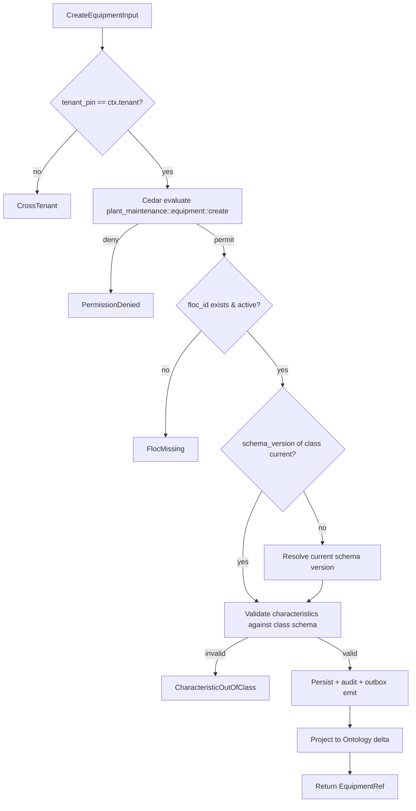

# IP-001: Domain layer for `equipment-master` — Equipment hierarchy with functional-location topology

## A. Intent

Implements the **Equipment Master** domain — the canonical record of every maintainable physical asset (rotating machinery, vessels, conveyors, instruments, vehicles, switchgear, racks, HVAC units, robotic cells) plus the **functional-location** topology that anchors each asset to a position in the plant hierarchy. Mirrors SAP S/4HANA's `EQUI` (equipment header) + `IFLOT` (functional location) + `IFLOTX` (functional-location text) tables under the `PM-EAM` submodule; transactions `IE01/IE02/IE03` (equipment) and `IL01/IL02/IL03` (functional location).

Industry-precedent equivalents: SAP S/4HANA Asset Management (EAM), **IBM Maximo Application Suite — Asset module**, **Infor EAM Enterprise**, **Oracle Fusion EAM**, **IFS Cloud — Asset Management**, **GE Digital APM — Asset Hierarchy**, **Hexagon EAM**. Hyperscaler analog: AWS IoT TwinMaker `Entity` + Azure Digital Twins `DigitalTwin` graph (functional-location ↔ digital-twin node).

### A.1 Why the equipment master is non-trivial

1. **Functional-location is a closed tree, not a tag.** SAP IFLOT carries a delimited-string key (`PLANT01-AREA02-LINE03-UNIT04-EQ05`) that encodes the parent path. We carry the path explicitly as a materialized parent-array (`ltree`) and DAG-validate on every write — an equipment's location MAY change (relocation) and the tree MUST stay consistent.
2. **Equipment vs serialized-item duality.** PM-EAM's `EQUI` row may map to an MM (Materials Management) serial number (`SER01`) when the asset is a stocked spare; the linkage is bidirectional and lifecycle-coupled. Our domain holds the equipment side; serial-number coupling lives in `inventory-management` (cross-µservice handoff D-15).
3. **Class + characteristic schema.** SAP PM uses the CLASSIFICATION (`CL*`) tables to attach typed characteristics (e.g., `MOTOR_KW: float`, `MAX_RPM: int`, `LUBRICANT_GRADE: enum`) per equipment class. We project this as the **Ontology equipment-characteristic schema** (per ADR-0257 ontology read-path).
4. **Cell-tier residency.** Some equipment data is regulated (safety-critical chemical reactor maintenance logs under OSHA PSM 29 CFR 1910.119); residency MUST honour the tenant's compliance pack (see D-1's `residency_pack`).
5. **Tenant-pin defence-in-depth.** Equipment IDs may collide across tenants by accident (sequence resets); cross-tenant lookups MUST be Cedar-gated AND code-pinned.
6. **Time-coordination.** Hierarchy mutations are causal (move-then-rename ordering matters); we carry HLC (per ADR-0252) on every row.

## B. Acceptance criteria

- **AC-1:** `CreateEquipmentUseCase::execute(input)` is Cedar-gated; default deny preserved; idempotent on `(tenant_id, equipment_id)`.
- **AC-2:** `MoveEquipmentToFunctionalLocationUseCase::execute` validates DAG (no cycle), updates `parent_path` ltree, emits `equipment.moved.v1`.
- **AC-3:** `AttachCharacteristicUseCase::execute(equip, class, char)` enforces class compatibility; rejects characteristic outside class schema.
- **AC-4:** `RetireEquipmentUseCase::execute` transitions to `historical` state; never deletes; emits audit + retains all maintenance-order back-references.
- **AC-5:** `LinkSerialNumberUseCase::execute` cross-references `inventory-management.serial_number` (gRPC); idempotent; bidirectional consistency check.
- **AC-6:** Cross-tenant equipment-id load returns `CrossTenant` error WITHOUT leaking the equipment's existence.
- **AC-7:** Functional-location creation enforces parent existence (foreign-key + Cedar `is_descendant_of` check).
- **AC-8:** Characteristic-schema versioning: every characteristic row stores `schema_version`; reads pick the version matching the equipment's class version at read time.
- **AC-9:** `OnTransferCellTierUseCase::execute` handles cell-tier promotion (Tier-1 → Tier-2 sovereign overlay): re-emits all equipment rows on the residency-overlay-changed event.
- **AC-10:** EVT-PLANT_MAINTENANCE-EQUIPMENT_MASTER-* audit events emitted per the §D-10 registry.

## C. Verification

```bash
cargo test -p oya-plant-maintenance-equipment-master-domain -- equipment_create_happy_path
cargo test -p oya-plant-maintenance-equipment-master-domain -- floc_dag_cycle_rejected
cargo test -p oya-plant-maintenance-equipment-master-domain -- floc_move_updates_ltree
cargo test -p oya-plant-maintenance-equipment-master-domain -- characteristic_outside_class_rejected
cargo test -p oya-plant-maintenance-equipment-master-domain -- retirement_preserves_history
cargo test -p oya-plant-maintenance-equipment-master-domain -- cross_tenant_load_does_not_leak_existence
cargo test -p oya-plant-maintenance-equipment-master-domain -- serial_number_link_bidirectional
cargo test -p oya-plant-maintenance-equipment-master-domain -- characteristic_schema_version_pinned
cargo test -p oya-plant-maintenance-equipment-master-domain -- cell_tier_promote_re_emits
cargo test -p oya-plant-maintenance-equipment-master-domain -- audit_registry_classes_match
cargo test -p oya-plant-maintenance-equipment-master-domain -- hlc_ordering_preserved
```

## D. Detailed mechanics

### D-1. Data model (PostgreSQL)

```sql
CREATE EXTENSION IF NOT EXISTS ltree;

CREATE TABLE plant_maintenance.functional_location (
    tenant_id         TEXT NOT NULL,
    floc_id           TEXT NOT NULL,
    floc_description  TEXT NOT NULL,
    parent_floc_id    TEXT,
    parent_path       LTREE NOT NULL,
    floc_category     TEXT NOT NULL CHECK (floc_category IN
        ('plant','area','process_unit','sub_unit','line','equipment_slot')),
    state             TEXT NOT NULL CHECK (state IN ('draft','active','historical')),
    residency_pack    TEXT NOT NULL,
    data_class        TEXT NOT NULL DEFAULT 'operational'
                          CHECK (data_class IN ('public','operational','confidential','restricted')),
    hlc               TEXT NOT NULL,
    schema_version    INTEGER NOT NULL,
    decision_id       UUID NOT NULL,
    created_at        TIMESTAMPTZ NOT NULL DEFAULT now(),
    PRIMARY KEY (tenant_id, floc_id),
    FOREIGN KEY (tenant_id, parent_floc_id) REFERENCES plant_maintenance.functional_location (tenant_id, floc_id)
) PARTITION BY HASH (tenant_id);

CREATE INDEX idx_floc_parent_path ON plant_maintenance.functional_location USING GIST (parent_path);

CREATE TABLE plant_maintenance.equipment (
    tenant_id        TEXT NOT NULL,
    equipment_id     TEXT NOT NULL,
    floc_id          TEXT NOT NULL,
    equipment_class  TEXT NOT NULL,
    serial_no        TEXT,                   -- bidirectional link to inventory-management.serial_number
    manufacturer     TEXT,
    model_no         TEXT,
    construction_year INT,
    installation_date DATE,
    abc_indicator    TEXT CHECK (abc_indicator IN ('A','B','C')),  -- criticality A=highest
    cost_center      TEXT,
    state            TEXT NOT NULL CHECK (state IN ('draft','active','idle','historical')),
    residency_pack   TEXT NOT NULL,
    data_class       TEXT NOT NULL DEFAULT 'operational',
    hlc              TEXT NOT NULL,
    schema_version   INTEGER NOT NULL,
    decision_id      UUID NOT NULL,
    created_at       TIMESTAMPTZ NOT NULL DEFAULT now(),
    PRIMARY KEY (tenant_id, equipment_id),
    FOREIGN KEY (tenant_id, floc_id) REFERENCES plant_maintenance.functional_location (tenant_id, floc_id)
) PARTITION BY HASH (tenant_id);

CREATE TABLE plant_maintenance.equipment_characteristic (
    tenant_id       TEXT NOT NULL,
    equipment_id    TEXT NOT NULL,
    char_name       TEXT NOT NULL,
    char_value      JSONB NOT NULL,         -- typed via schema_version
    schema_version  INT NOT NULL,
    hlc             TEXT NOT NULL,
    PRIMARY KEY (tenant_id, equipment_id, char_name, schema_version)
) PARTITION BY HASH (tenant_id);

CREATE TABLE plant_maintenance.equipment_state_audit (
    tenant_id       TEXT NOT NULL,
    equipment_id    TEXT NOT NULL,
    state_from      TEXT NOT NULL,
    state_to        TEXT NOT NULL,
    transition_hlc  TEXT NOT NULL,
    decision_id     UUID NOT NULL,
    PRIMARY KEY (tenant_id, equipment_id, transition_hlc)
) PARTITION BY HASH (tenant_id);
```

### D-2. Rust types

```rust
#[derive(Debug, Clone)]
pub struct FunctionalLocation {
    pub tenant_id:        TenantId,
    pub floc_id:          FlocId,
    pub floc_description: String,
    pub parent_floc_id:   Option<FlocId>,
    pub parent_path:      LTree,
    pub floc_category:    FlocCategory,
    pub state:            FlocState,
    pub residency_pack:   ResidencyPack,
    pub data_class:       DataClass,
    pub hlc:              Hlc,
    pub schema_version:   u32,
    pub decision_id:      DecisionId,
}

#[derive(Debug, Clone)]
pub struct Equipment {
    pub tenant_id:         TenantId,
    pub equipment_id:      EquipmentId,
    pub floc_id:           FlocId,
    pub equipment_class:   EquipmentClass,
    pub serial_no:         Option<SerialNo>,
    pub manufacturer:      Option<String>,
    pub model_no:          Option<String>,
    pub construction_year: Option<u16>,
    pub installation_date: Option<NaiveDate>,
    pub abc_indicator:     Option<AbcIndicator>,
    pub cost_center:       Option<CostCenter>,
    pub state:             EquipmentState,
    pub residency_pack:    ResidencyPack,
    pub data_class:        DataClass,
    pub hlc:               Hlc,
    pub schema_version:    u32,
    pub decision_id:       DecisionId,
}

#[derive(Debug, Clone)]
pub enum EquipmentState { Draft, Active, Idle, Historical }

#[derive(Debug, Clone)]
pub enum FlocCategory { Plant, Area, ProcessUnit, SubUnit, Line, EquipmentSlot }

#[derive(Debug, Clone, Copy)]
pub enum AbcIndicator { A, B, C }
```

### D-3. DAG validation (move + cycle check)

```rust
pub fn validate_move(repo: &impl FlocRepository, tenant: &TenantId,
                     mover_id: &FlocId, new_parent_id: &FlocId) -> Result<(), DomainError> {
    if mover_id == new_parent_id { return Err(DomainError::SelfParent); }
    let new_parent = repo.load(tenant, new_parent_id)?
        .ok_or(DomainError::ParentMissing)?;
    // cycle = new_parent's ancestry contains mover_id
    if new_parent.parent_path.iter().any(|node| node == mover_id.as_str()) {
        return Err(DomainError::CycleDetected);
    }
    Ok(())
}

pub fn recompute_parent_path(repo: &impl FlocRepository, tenant: &TenantId,
                             parent_id: &FlocId, self_id: &FlocId) -> Result<LTree, DomainError> {
    let parent = repo.load(tenant, parent_id)?.ok_or(DomainError::ParentMissing)?;
    let mut path = parent.parent_path.clone();
    path.push(parent_id.as_str());
    path.push(self_id.as_str());
    Ok(path)
}
```

### D-4. Cedar context (equipment create)

```jsonc
{
  "principal": "oyatie::tenant::acme::user::maintenance-tech-77",
  "action":    "plant_maintenance::equipment::create",
  "resource":  "plant_maintenance::equipment::EQ-PUMP-0042",
  "context": {
    "tenant_id": "acme",
    "floc_id": "PLT-HOUS-01-AREA-PROC-02-LINE-CRUDE-03",
    "equipment_class": "centrifugal_pump",
    "abc_indicator": "A",
    "residency_pack": "global+us-osha-psm",
    "data_class": "operational",
    "policy_bundle_version": "2026.05.20-r3",
    "byok_mode": "platform_default",
    "transport": "h3"
  }
}
```

### D-5. Port traits

```rust
#[async_trait]
pub trait FlocRepository: Send + Sync {
    async fn save(&self, tx: &RepoTx, floc: &FunctionalLocation) -> Result<(), RepoError>;
    async fn load(&self, tenant: &TenantId, id: &FlocId) -> Result<Option<FunctionalLocation>, RepoError>;
    async fn children(&self, tenant: &TenantId, parent: &FlocId) -> Result<Vec<FunctionalLocation>, RepoError>;
    async fn descendants(&self, tenant: &TenantId, root: &FlocId) -> Result<Vec<FunctionalLocation>, RepoError>;
}

#[async_trait]
pub trait EquipmentRepository: Send + Sync {
    async fn save(&self, tx: &RepoTx, eq: &Equipment) -> Result<(), RepoError>;
    async fn load(&self, tenant: &TenantId, id: &EquipmentId) -> Result<Option<Equipment>, RepoError>;
    async fn load_by_serial(&self, tenant: &TenantId, sn: &SerialNo) -> Result<Option<Equipment>, RepoError>;
    async fn list_under_floc(&self, tenant: &TenantId, floc: &FlocId) -> Result<Vec<Equipment>, RepoError>;
    async fn append_state_audit(&self, tx: &RepoTx, eq: &EquipmentId, from: EquipmentState, to: EquipmentState, hlc: &Hlc, decision: &DecisionId) -> Result<(), RepoError>;
}

#[async_trait]
pub trait CharacteristicSchemaProvider: Send + Sync {
    async fn schema_for_class(&self, class: &EquipmentClass, version: u32) -> Result<CharacteristicSchema, ProviderError>;
}
```

### D-6. Workflow with decision branches



### D-7. AsyncAPI envelopes

| Channel | Trigger | Consumers |
|---|---|---|
| `plant-maintenance.equipment.created.v1` | new equipment | ontology, audit-substrate, dashboards |
| `plant-maintenance.equipment.moved.v1` | move-to-floc | ontology, dashboards |
| `plant-maintenance.equipment.retired.v1` | retirement | ontology, audit-substrate, finops (depreciation close-out) |
| `plant-maintenance.equipment.characteristic-changed.v1` | char attach/update | ontology, predictive-maintenance (re-fit baselines) |
| `plant-maintenance.floc.created.v1` | new floc | ontology |
| `plant-maintenance.floc.moved.v1` | floc relocated | ontology (sub-tree re-anchor) |

### D-8. Ontology projection (SAP PM ↔ Oyatie Asset)

SAP PM `EQUI` and `IFLOT` map to Oyatie Ontology `Asset` and `FunctionalLocation` entities:

| SAP PM (source) | SAP table.field | Oyatie Ontology node/edge | Notes |
|---|---|---|---|
| Equipment number | EQUI.EQUNR | Asset.equipment_id | preserved verbatim per tenant migration |
| Equipment description | EQUI.EQKTX | Asset.description | i18n via packs |
| Functional location | IFLOT.TPLNR | FunctionalLocation.floc_id | parent_path materialized from delimited key |
| Manufacturer | EQUI.HERST | Asset.manufacturer | unstructured today; schema-pinned in v2 |
| Model | EQUI.TYPBZ | Asset.model_no | |
| ABC indicator | EQUI.ABCKZ | Asset.abc_indicator | A/B/C criticality |
| Cost center | EQUI.KOSTL | Asset.cost_center | cross-ref oya-cloud-finops |
| Serial number | EQUI.SERNR | Asset.serial_no | bidirectional to MM serial |
| Characteristic | AUSP+CABN | Asset.characteristic[name] | typed via CharacteristicSchema |
| Installation date | EQUI.INBDT | Asset.installation_date | |
| Construction year | EQUI.BAUJJ | Asset.construction_year | |
| Floc category | IFLOT.IEQUI | FunctionalLocation.floc_category | enum re-mapped |

```rust
pub fn project_equipment(eq: &Equipment) -> OntologyDelta {
    OntologyDelta::new()
        .upsert_node(NodeRef::asset(eq.tenant_id.clone(), eq.equipment_id.clone()))
        .upsert_edge(Edge::installed_at(eq.tenant_id.clone(),
                                        eq.equipment_id.clone(),
                                        eq.floc_id.clone()))
        .with_attrs([
            ("equipment_class",   eq.equipment_class.to_string()),
            ("abc_indicator",     eq.abc_indicator.map(|a| a.to_string()).unwrap_or_default()),
            ("manufacturer",      eq.manufacturer.clone().unwrap_or_default()),
            ("model_no",          eq.model_no.clone().unwrap_or_default()),
            ("state",             eq.state.to_string()),
        ])
        .with_hlc(eq.hlc.clone())
}
```

### D-9. SLO targets

| Operation | p50 | p95 | p99 | Throughput | Rationale |
|---|---|---|---|---|---|
| `CreateEquipment` | 14 ms | 32 ms | 65 ms | 1.2 k req/s/cell | Cedar + DB write + outbox; equipment master is read-heavy, so write tail can be 65ms. |
| `MoveEquipment` (single eq, no descendants) | 18 ms | 40 ms | 85 ms | 600 req/s/cell | DAG validate + ltree rewrite + outbox. |
| `MoveEquipment` (floc subtree of 1000 eq) | 350 ms | 650 ms | 1.2 s | 50 req/s/cell | Bulk subtree path rewrite — bottleneck pattern shows. |
| `LoadEquipment` (read-by-id) | 4 ms | 9 ms | 18 ms | 50 k req/s/cell | Hot path; PG covering index. |
| `ListUnderFloc` (depth 1, 100 children) | 11 ms | 25 ms | 50 ms | 8 k req/s/cell | GiST index on `parent_path`. |
| `AttachCharacteristic` | 12 ms | 28 ms | 55 ms | 1.5 k req/s/cell | Schema validate + JSONB write. |
| `RetireEquipment` | 22 ms | 50 ms | 100 ms | 300 req/s/cell | State change + outbox + audit; not a hot path. |

Availability target: **99.95%** per cell; 99.99% across multi-region cell pair. Capacity math: at 1.2 k creates/s sustained × 86,400 s/d = 103 M creates/day per cell — far above the 50 k equipment/tenant typical scale.

### D-10. Audit-event registry (from ADR-0263)

| Event class | Severity | Emitter |
|---|---|---|
| `EVT-PLANT_MAINTENANCE-EQUIPMENT_MASTER-EQUIPMENT_CREATED` | informational | usecase |
| `EVT-PLANT_MAINTENANCE-EQUIPMENT_MASTER-EQUIPMENT_MOVED` | informational | usecase |
| `EVT-PLANT_MAINTENANCE-EQUIPMENT_MASTER-EQUIPMENT_RETIRED` | informational | usecase |
| `EVT-PLANT_MAINTENANCE-EQUIPMENT_MASTER-CHARACTERISTIC_ATTACHED` | informational | usecase |
| `EVT-PLANT_MAINTENANCE-EQUIPMENT_MASTER-FLOC_CREATED` | informational | usecase |
| `EVT-PLANT_MAINTENANCE-EQUIPMENT_MASTER-FLOC_CYCLE_REJECTED` | warning | usecase |
| `EVT-PLANT_MAINTENANCE-EQUIPMENT_MASTER-CROSS_TENANT_REJECTED` | security | usecase |
| `EVT-PLANT_MAINTENANCE-EQUIPMENT_MASTER-SERIAL_LINK_BIDIRECTIONAL_DRIFT` | warning | usecase |

### D-11. Failure modes & recovery

1. **`FlocCycleDetected`** — proposed move would form a cycle (e.g., `LINE-01` cannot become a descendant of one of its children). Reject; emit warning. Runbook `runbooks/floc-cycle-rejected.md`.
2. **`CharacteristicOutOfClass`** — caller attaches `MOTOR_KW` to a non-motor equipment-class. Reject with class-schema URL pointer. Runbook `runbooks/characteristic-class-violation.md`.
3. **`SerialNumberDrift`** — inventory-management deletes/reassigns a serial that we hold a reference to. Drift detector (every 15min) flags; equipment row marked `serial_link_stale`; manual reconcile.
4. **`OntologyProjectionLag`** — outbox consumer behind on ontology delta application. Equipment present in PM but absent in Ontology for >60s triggers a P3 alert. Runbook `runbooks/ontology-projection-lag.md`.
5. **`SchemaVersionUnavailable`** — class schema version requested at read isn't loaded into cache. Fall back to JSON-blob read (best-effort typing); log degraded-mode counter.
6. **`CrossTenantEquipmentLookup`** — caller in tenant A asks for equipment in tenant B. Return `CrossTenant` error WITHOUT revealing whether the ID exists in tenant B (constant-time response). Security audit. Runbook `runbooks/cross-tenant-leak-suspected.md`.

### D-12. Migration notes

Source vendor surfaces and the migration adapter targets:

- **SAP S/4HANA**: `EQUI` + `IFLOT` + `IFLOTX` + `AUSP` + `CABN` via OData export or CDS view; characteristic schema rebuilt from `KLAH` (class header) + `KSML` (class-characteristic).
- **IBM Maximo**: `ASSET` + `LOCATIONS` + `LOCANCESTOR` tables; characteristics in `ASSETSPEC` (typed via `MEASUREUNIT`).
- **Infor EAM**: `R5OBJECTS` + `R5SYSTEMS` + `R5OBJECTSPARTS` + `R5USERFIELDS` (custom fields).
- **Oracle Fusion EAM**: `EAM_ASSET_NUMBERS_VL` + `EAM_ASSET_LOCATIONS_VL`.
- **IFS Cloud**: `OBJECT` + `OBJECT_DATA` + `STRUCTURE_OBJECT_PATH`.
- **GE Digital APM**: equipment via the `MI_EQUIPMENT` family + `MI_FUNCTIONAL_LOCATION`; characteristics via `MI_EQUIP_CHARACTERISTICS`.

Lift-shift via `crates/oya-plant-maintenance-equipment-master-app/src/migration/` with one adapter per source. Greenfield tenants seed a top-of-hierarchy "PLANT-DEFAULT" floc per ADR-0247.

### D-13. Cross-µservice handoffs

| Direction | Counterparty | Surface |
|---|---|---|
| outbound | `ontology` | AsyncAPI `equipment.created.v1` (projection delta) |
| outbound | `predictive-maintenance` | AsyncAPI `equipment.created.v1` (signal-baseline init) |
| outbound | `audit-chain` | per ADR-0263 |
| outbound | `oya-cloud-finops` | AsyncAPI `equipment.created.v1` (depreciation start) |
| inbound  | `inventory-management` | gRPC `inventory.v1.LinkSerialNumber` (bidirectional consistency) |
| inbound  | `identity` | gRPC `identity.v1.GetUserAttributes` (Cedar context enrich) |
| outbound | `incident-management` | AsyncAPI on equipment retirement (close any open incidents) |
| outbound | `tasks` | AsyncAPI on equipment retirement (close PM work orders) |

### D-14. Versioning + deprecation

- Domain types are SemVer pinned at the crate boundary (`oya-plant-maintenance-equipment-master-domain` v1.x).
- Schema-version bumps follow ADR-0258 (additive minor; breaking major with a 6-month sunset).
- `MoveEquipment` and `RetireEquipment` are NEVER deprecated silently — both fire AsyncAPI events that downstream consumers depend on.

## E. Failure-mode summary

See D-11.

## F. Migration / rollback

Feature flag `plant_maintenance_equipment_master_v1`. Disabling halts writes; reads continue from the last committed state. Rollback path: replay outbox events against the prior schema-version (`schema_version - 1`) only when the rollback ADR is filed (no silent rollbacks).

## G. References

- ADR-0105 (layer enum), ADR-0131 (per-µservice flat layout), ADR-0244 (tenant scoping), ADR-0252 (HLC + TrueTime), ADR-0257 (ontology read-path), ADR-0263 (audit emission contract), ADR-0294 (Cedar fragment soak), ADR-0297 (abuse-defence), ADR-0314/0315/0316 (ERP parity governance).
- SAP S/4HANA Asset Management documentation, EAM submodule `PM-EAM`.
- ANSI/ISA-95 / IEC 62264 (Enterprise-Control System Integration).
- Benchmarks: SAP S/4HANA EAM | IBM Maximo Application Suite | Infor EAM Enterprise | Oracle Fusion EAM | IFS Cloud Asset Management | GE Digital APM | Hexagon EAM.

## H. Out of scope

- Maintenance plan / strategy (IP-002), work order (IP-003), predictive baselines (IP-021), reliability decision logic (IP-023).

— end IP-001 —
