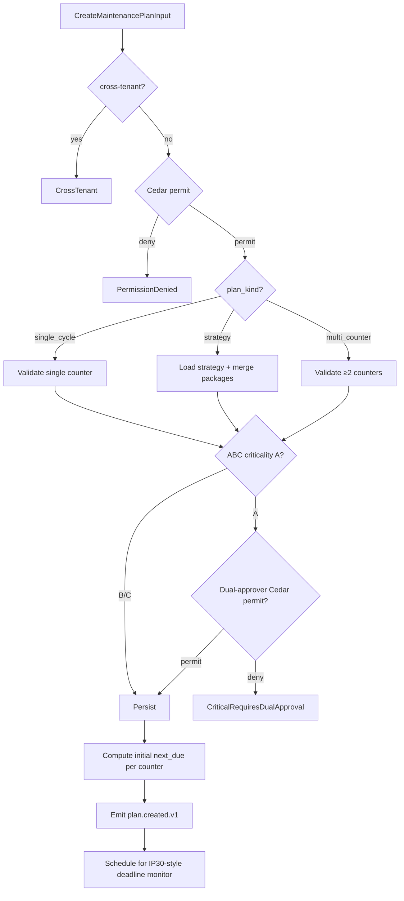

# IP-002: Domain layer for `maintenance-plan` — Time + performance + multi-counter strategy

## A. Intent

Implements the **Maintenance Plan** domain — the canonical scheduling primitive that fires preventive-maintenance (PM) work-orders on a cadence. Mirrors SAP S/4HANA `PM-PRM` submodule (transactions `IP01..IP43`), specifically the three plan archetypes:

1. **Single-cycle plan** (IP41) — one interval (e.g., "every 30 days").
2. **Strategy plan** (IP42) — strategy-based with multiple package offsets (e.g., 30d / 90d / 365d nested).
3. **Multiple-counter plan** (IP43) — fires on whichever counter trips first (calendar OR running hours OR cycles OR km).

Industry-precedent equivalents: SAP S/4HANA Maintenance Planning, **IBM Maximo PM module (`PM` + `JOBPLAN` + `FREQUENCY`)**, **Infor EAM PM Schedule + PM Compliance**, **Oracle Fusion Maintenance — Maintenance Programs**, **IFS Cloud Preventive Maintenance**, **GE Digital APM — Calibration Management + Inspection Management**. Hyperscaler analog: AWS Systems Manager Patch Baseline + State Manager Associations (the patch-cadence pattern transplanted to physical assets).

### A.1 Why maintenance plans are non-trivial

1. **Multi-counter forks.** A plan can fire on calendar OR meter (e.g., service truck every 90 days OR 10,000 km). The cycle-due engine must pick the trigger that fires *earliest* and reset all linked counters on completion.
2. **Strategy hierarchy nesting.** SAP strategy plans nest packages (e.g., A = 30d, B = 90d, C = 365d) where `B` is "A + extra steps". Work-order generation must merge package tasks; missing this drops critical inspections.
3. **Floating vs fixed scheduling.** *Floating* — next-due is computed from *actual completion* date. *Fixed* — next-due is computed from the *originally scheduled* date. Fixed prevents drift; floating tolerates field reality. Default per pack varies.
4. **Tolerance windows.** `IP-30` deadline monitoring applies tolerance (e.g., ±10%) before considering a plan "overdue". The tolerance is class- and criticality-driven.
5. **Sub-network of plans.** Plans can chain: completing plan-A may seed plan-B (e.g., overhaul triggers post-overhaul break-in inspection plan).
6. **Cedar gate for high-criticality.** Plans on `ABC=A` (criticality A) equipment require dual approval (planner + reliability engineer) per default Cedar policy.

## B. Acceptance criteria

- **AC-1:** `CreateMaintenancePlanUseCase::execute(input)` is Cedar-gated; default-deny preserved; idempotent on `(tenant_id, plan_id)`.
- **AC-2:** `AttachTaskListUseCase::execute` enforces task-list version pinning; rejects retired task lists.
- **AC-3:** `ScheduleNextDueUseCase::compute(plan, last_completion)` returns the trigger that fires earliest among all configured counters (calendar / running-hours / cycles / km).
- **AC-4:** Strategy plans recursively merge package tasks; duplicate task suppression by `(task_id, schedule_offset)` identity.
- **AC-5:** Floating-vs-fixed scheduling is per-plan; default per-tenant from `compliance_pack`; explicit override path audited.
- **AC-6:** Tolerance window respected (`tolerance_pct`) — `overdue` only set when actual_date > scheduled_date × (1 + tolerance_pct/100).
- **AC-7:** Plan completion may seed a follow-up plan via `succession_plan_id` linkage; cycle in succession-graph rejected.
- **AC-8:** Criticality-`A` equipment plans require Cedar `plant_maintenance::plan::publish_critical` permit (dual-approver).
- **AC-9:** `DeactivatePlanUseCase::execute` transitions to `historical`; open work-orders are NOT cancelled; future work-orders cease.
- **AC-10:** Audit events emitted per §D-10 registry.

## C. Verification

```bash
cargo test -p oya-plant-maintenance-maintenance-plan-domain -- create_single_cycle_plan
cargo test -p oya-plant-maintenance-maintenance-plan-domain -- create_strategy_plan_merges_packages
cargo test -p oya-plant-maintenance-maintenance-plan-domain -- create_multi_counter_plan_picks_earliest
cargo test -p oya-plant-maintenance-maintenance-plan-domain -- floating_schedule_drifts_with_actual
cargo test -p oya-plant-maintenance-maintenance-plan-domain -- fixed_schedule_resists_drift
cargo test -p oya-plant-maintenance-maintenance-plan-domain -- tolerance_window_suppresses_false_overdue
cargo test -p oya-plant-maintenance-maintenance-plan-domain -- succession_cycle_rejected
cargo test -p oya-plant-maintenance-maintenance-plan-domain -- criticality_a_requires_dual_approval
cargo test -p oya-plant-maintenance-maintenance-plan-domain -- deactivate_preserves_open_wos
cargo test -p oya-plant-maintenance-maintenance-plan-domain -- duplicate_task_in_packages_suppressed
cargo test -p oya-plant-maintenance-maintenance-plan-domain -- cross_tenant_plan_load_rejected
```

## D. Detailed mechanics

### D-1. Data model (PostgreSQL)

```sql
CREATE TABLE plant_maintenance.maintenance_plan (
    tenant_id            TEXT NOT NULL,
    plan_id              TEXT NOT NULL,
    plan_kind            TEXT NOT NULL CHECK (plan_kind IN ('single_cycle','strategy','multi_counter')),
    equipment_id         TEXT,
    floc_id              TEXT,
    task_list_id         TEXT NOT NULL,
    task_list_version    INTEGER NOT NULL,
    strategy_id          TEXT,                         -- strategy plans only
    scheduling_mode      TEXT NOT NULL CHECK (scheduling_mode IN ('floating','fixed')),
    tolerance_pct        NUMERIC(5,2) NOT NULL DEFAULT 10.00,
    succession_plan_id   TEXT,
    abc_criticality      TEXT CHECK (abc_criticality IN ('A','B','C')),
    state                TEXT NOT NULL CHECK (state IN ('draft','active','suspended','historical')),
    residency_pack       TEXT NOT NULL,
    data_class           TEXT NOT NULL DEFAULT 'operational',
    hlc                  TEXT NOT NULL,
    schema_version       INTEGER NOT NULL,
    decision_id          UUID NOT NULL,
    created_at           TIMESTAMPTZ NOT NULL DEFAULT now(),
    PRIMARY KEY (tenant_id, plan_id),
    CHECK ((equipment_id IS NOT NULL) OR (floc_id IS NOT NULL))
) PARTITION BY HASH (tenant_id);

CREATE TABLE plant_maintenance.maintenance_plan_counter (
    tenant_id      TEXT NOT NULL,
    plan_id        TEXT NOT NULL,
    counter_id     TEXT NOT NULL,
    counter_kind   TEXT NOT NULL CHECK (counter_kind IN ('calendar_days','running_hours','cycles','kilometers','signal')),
    interval_value NUMERIC(18,4) NOT NULL,            -- e.g., 90 for "90 days" or 10000 for "10,000 km"
    last_actual    NUMERIC(18,4),
    last_completed_at TIMESTAMPTZ,
    next_due_at    TIMESTAMPTZ,
    PRIMARY KEY (tenant_id, plan_id, counter_id)
) PARTITION BY HASH (tenant_id);

CREATE TABLE plant_maintenance.maintenance_strategy_package (
    tenant_id        TEXT NOT NULL,
    strategy_id      TEXT NOT NULL,
    package_id       TEXT NOT NULL,
    offset_days      INTEGER NOT NULL,
    package_tasks    JSONB NOT NULL,
    PRIMARY KEY (tenant_id, strategy_id, package_id)
) PARTITION BY HASH (tenant_id);

CREATE TABLE plant_maintenance.plan_completion_audit (
    tenant_id     TEXT NOT NULL,
    plan_id       TEXT NOT NULL,
    completion_at TIMESTAMPTZ NOT NULL,
    counter_readings JSONB NOT NULL,
    next_due_computed JSONB NOT NULL,
    decision_id   UUID NOT NULL,
    PRIMARY KEY (tenant_id, plan_id, completion_at)
) PARTITION BY RANGE (completion_at);
```

### D-2. Rust types

```rust
#[derive(Debug, Clone)]
pub struct MaintenancePlan {
    pub tenant_id:        TenantId,
    pub plan_id:          PlanId,
    pub plan_kind:        PlanKind,
    pub anchor:           PlanAnchor,
    pub task_list_id:     TaskListId,
    pub task_list_version: u32,
    pub strategy_id:      Option<StrategyId>,
    pub scheduling_mode:  SchedulingMode,
    pub tolerance_pct:    Decimal,
    pub succession_plan_id: Option<PlanId>,
    pub abc_criticality:  Option<AbcIndicator>,
    pub counters:         Vec<PlanCounter>,
    pub state:            PlanState,
    pub hlc:              Hlc,
    pub decision_id:      DecisionId,
}

#[derive(Debug, Clone)]
pub enum PlanKind { SingleCycle, Strategy, MultiCounter }

#[derive(Debug, Clone)]
pub enum SchedulingMode { Floating, Fixed }

#[derive(Debug, Clone)]
pub enum PlanAnchor {
    Equipment(EquipmentId),
    FunctionalLocation(FlocId),
}

#[derive(Debug, Clone)]
pub struct PlanCounter {
    pub counter_id:        CounterId,
    pub counter_kind:      CounterKind,
    pub interval_value:    Decimal,
    pub last_actual:       Option<Decimal>,
    pub last_completed_at: Option<DateTime<Utc>>,
    pub next_due_at:       Option<DateTime<Utc>>,
}

#[derive(Debug, Clone)]
pub enum CounterKind { CalendarDays, RunningHours, Cycles, Kilometers, Signal }
```

### D-3. Cycle-due engine — earliest-trigger picker

```rust
pub fn next_due(plan: &MaintenancePlan, now: DateTime<Utc>) -> Option<DateTime<Utc>> {
    let mut earliest: Option<DateTime<Utc>> = None;
    for c in &plan.counters {
        let candidate = match c.counter_kind {
            CounterKind::CalendarDays => {
                let base = match plan.scheduling_mode {
                    SchedulingMode::Floating => c.last_completed_at.unwrap_or(now),
                    SchedulingMode::Fixed    => c.next_due_at.unwrap_or(now),
                };
                Some(base + Duration::days(c.interval_value.to_i64().unwrap_or(0)))
            }
            CounterKind::RunningHours | CounterKind::Cycles | CounterKind::Kilometers => {
                c.next_due_at  // pre-computed at completion via rate estimate
            }
            CounterKind::Signal => c.next_due_at,
        };
        if let Some(t) = candidate {
            earliest = match earliest {
                None => Some(t),
                Some(prev) if t < prev => Some(t),
                p => p,
            };
        }
    }
    earliest
}
```

### D-4. Strategy-package merge (deduplicates by `(task_id, schedule_offset)`)

```rust
pub fn merge_strategy_packages(packages: &[StrategyPackage]) -> Vec<PackageTask> {
    use std::collections::HashMap;
    let mut seen: HashMap<(TaskId, i32), PackageTask> = HashMap::new();
    for pkg in packages {
        for t in &pkg.tasks {
            seen.entry((t.task_id.clone(), pkg.offset_days)).or_insert_with(|| t.clone());
        }
    }
    let mut out: Vec<_> = seen.into_values().collect();
    out.sort_by_key(|t| t.task_id.to_string());
    out
}
```

### D-5. Cedar context (critical-equipment plan publish)

```jsonc
{
  "principal": "oyatie::tenant::acme::user::reliability-engineer-12",
  "action":    "plant_maintenance::plan::publish_critical",
  "resource":  "plant_maintenance::plan::PM-PUMP-A-0042",
  "context": {
    "tenant_id": "acme",
    "equipment_id": "EQ-PUMP-0042",
    "abc_criticality": "A",
    "second_approver_principal": "oyatie::tenant::acme::user::maintenance-planner-3",
    "data_class": "operational",
    "policy_bundle_version": "2026.05.20-r3",
    "residency_pack": "global+us-osha-psm",
    "byok_mode": "platform_default"
  }
}
```

### D-6. Port traits

```rust
#[async_trait]
pub trait MaintenancePlanRepository: Send + Sync {
    async fn save(&self, tx: &RepoTx, p: &MaintenancePlan) -> Result<(), RepoError>;
    async fn load(&self, tenant: &TenantId, id: &PlanId) -> Result<Option<MaintenancePlan>, RepoError>;
    async fn list_for_equipment(&self, tenant: &TenantId, eq: &EquipmentId) -> Result<Vec<MaintenancePlan>, RepoError>;
    async fn update_counter_state(&self, tx: &RepoTx, plan: &PlanId, c: &PlanCounter) -> Result<(), RepoError>;
    async fn append_completion_audit(&self, tx: &RepoTx, plan: &PlanId, audit: &CompletionAudit) -> Result<(), RepoError>;
}

#[async_trait]
pub trait StrategyRepository: Send + Sync {
    async fn load_strategy(&self, tenant: &TenantId, sid: &StrategyId) -> Result<Option<Strategy>, RepoError>;
}
```

### D-7. Workflow with decision branches



### D-8. AsyncAPI envelopes

| Channel | Trigger | Consumers |
|---|---|---|
| `plant-maintenance.plan.created.v1` | new plan | ontology, audit-chain, dashboards |
| `plant-maintenance.plan.activated.v1` | draft → active | scheduler |
| `plant-maintenance.plan.due.v1` | next-due trip | work-order generator (IP-003) |
| `plant-maintenance.plan.overdue.v1` | actual > scheduled × (1+tol) | alerting, runbook fire |
| `plant-maintenance.plan.completed.v1` | completion event | analytics, predictive-maintenance |
| `plant-maintenance.plan.deactivated.v1` | active → historical | ontology |

### D-9. Ontology projection

| SAP PM | SAP table.field | Oyatie Ontology |
|---|---|---|
| Maintenance plan | MPLA.WARPL | MaintenancePlan.plan_id |
| Maintenance item | MPOS | MaintenancePlan.item[*] |
| Strategy | T351 | MaintenancePlan.strategy_id |
| Package | T351P | MaintenancePlan.package[*] |
| Task list | PLKO+PLPO+PLAS | MaintenancePlan.task_list_id |
| Cycle / counter | MMPT | MaintenancePlan.counter[*] |
| Tolerance | T399A | MaintenancePlan.tolerance_pct |

```rust
pub fn project_plan(p: &MaintenancePlan) -> OntologyDelta {
    OntologyDelta::new()
        .upsert_node(NodeRef::maintenance_plan(p.tenant_id.clone(), p.plan_id.clone()))
        .upsert_edge(match &p.anchor {
            PlanAnchor::Equipment(eq) => Edge::plan_for_equipment(p.tenant_id.clone(), p.plan_id.clone(), eq.clone()),
            PlanAnchor::FunctionalLocation(fl) => Edge::plan_for_floc(p.tenant_id.clone(), p.plan_id.clone(), fl.clone()),
        })
        .with_attrs([
            ("plan_kind",       p.plan_kind.to_string()),
            ("scheduling_mode", p.scheduling_mode.to_string()),
            ("tolerance_pct",   p.tolerance_pct.to_string()),
            ("state",           p.state.to_string()),
        ])
        .with_hlc(p.hlc.clone())
}
```

### D-10. SLO targets

| Operation | p50 | p95 | p99 | Throughput | Rationale |
|---|---|---|---|---|---|
| `CreateMaintenancePlan` (single-cycle) | 18 ms | 42 ms | 85 ms | 600 req/s/cell | Cedar + task-list pin + DB write + outbox. |
| `CreateMaintenancePlan` (strategy w/ 5 packages) | 32 ms | 75 ms | 150 ms | 200 req/s/cell | Strategy load + merge + persist. |
| `ScheduleNextDue` (per plan) | 1.2 ms | 3 ms | 8 ms | 80 k req/s/cell | In-memory compute. |
| `OnCompletion` (cycle close + emit) | 14 ms | 32 ms | 65 ms | 1.5 k req/s/cell | Counter update + audit + outbox. |
| `DeadlineMonitor sweep` (10 k plans) | 80 ms | 180 ms | 350 ms | every 60 s cron | Batch read + classify. |

### D-11. Audit-event registry

| Event class | Severity | Emitter |
|---|---|---|
| `EVT-PLANT_MAINTENANCE-MAINTENANCE_PLAN-CREATED` | informational | usecase |
| `EVT-PLANT_MAINTENANCE-MAINTENANCE_PLAN-ACTIVATED` | informational | usecase |
| `EVT-PLANT_MAINTENANCE-MAINTENANCE_PLAN-DUE_TRIGGERED` | informational | scheduler |
| `EVT-PLANT_MAINTENANCE-MAINTENANCE_PLAN-OVERDUE` | warning | scheduler |
| `EVT-PLANT_MAINTENANCE-MAINTENANCE_PLAN-DUAL_APPROVAL_REQUIRED` | informational | usecase |
| `EVT-PLANT_MAINTENANCE-MAINTENANCE_PLAN-DEACTIVATED` | informational | usecase |
| `EVT-PLANT_MAINTENANCE-MAINTENANCE_PLAN-SUCCESSION_CYCLE_REJECTED` | warning | usecase |
| `EVT-PLANT_MAINTENANCE-MAINTENANCE_PLAN-CROSS_TENANT_REJECTED` | security | usecase |

### D-12. Failure modes & recovery

1. **`StrategyMissing`** — referenced `strategy_id` doesn't exist or was retired. Reject create; suggest active strategy alternates. Runbook `runbooks/strategy-missing.md`.
2. **`TaskListVersionPinFailure`** — pinned task-list version was retired post-pin. Plan held in `draft` until planner re-pins. Runbook `runbooks/task-list-version-stale.md`.
3. **`CounterRateUnavailable`** — running-hours / km plan, but signal feed isn't online for ≥24h. Fall back to calendar-only next-due; flag the plan `degraded`. Runbook `runbooks/counter-feed-stale.md`.
4. **`SuccessionCycle`** — A → B → C → A. Reject; alert reliability engineer; full chain dumped in runbook. Runbook `runbooks/plan-succession-cycle.md`.
5. **`DualApproverSelf`** — same principal as both planner and reliability-engineer approver. Cedar denies; second approver MUST be different identity. Runbook `runbooks/dual-approval-self-rejected.md`.
6. **`OverdueStorm`** — clock skew or bulk import causes 10 k+ plans to look overdue simultaneously. Rate-limit `overdue.v1` emission via token bucket (200/s); preserve all in DB; UI shows backlog. Runbook `runbooks/overdue-storm.md`.

### D-13. Migration notes

Source vendor surfaces:

- **SAP S/4HANA**: `MPLA` (plan header) + `MPOS` (items) + `MMPT` (cycles) + `T351` (strategies) + `T351P` (packages) + `PLKO/PLPO` (task lists).
- **IBM Maximo**: `PM` table + `PMSEQUENCE` + `JOBPLAN` + `FREQUENCY` + `MEASUREMENT` for meters.
- **Infor EAM**: `R5MPS` (PM Schedule) + `R5MPRROUTES` (PM routes).
- **Oracle Fusion EAM**: `WIE_MAINT_PROGRAMS_VL` + `WIE_MAINT_FORECAST_*`.
- **IFS Cloud**: `PM_ACTION` + `PM_ACTION_SCHED`.
- **GE Digital APM**: `MI_PM_PROGRAM` family + Inspection plan + Calibration plan.

Default scheduling-mode migration rule: SAP `STRAT_TYPE = '01'` → `fixed`; `'02'` → `floating`. Document any tenant override in the migration ADR.

### D-14. Cross-µservice handoffs

| Direction | Counterparty | Surface |
|---|---|---|
| outbound | `tasks` (work-order generator IP-003) | AsyncAPI `plan.due.v1` |
| outbound | `predictive-maintenance` | AsyncAPI `plan.completed.v1` (model retrain trigger) |
| outbound | `audit-chain` | per ADR-0263 |
| outbound | `ontology` | projection delta |
| inbound  | `signal-ingest` (counter feed) | AsyncAPI `signal.counter-reading.v1` |
| inbound  | `identity` | Cedar context enrichment |

## E. Failure-mode summary

See D-12.

## F. Migration / rollback

Feature flag `plant_maintenance_maintenance_plan_v1`. Disabling stops new `plan.due.v1` emissions; in-flight WOs unaffected. Per-plan kill-switch (`plan.state = suspended`) for finer-grained rollback.

## G. References

- ADR-0105, ADR-0244, ADR-0252, ADR-0257, ADR-0263, ADR-0294, ADR-0314..0316.
- SAP S/4HANA Maintenance Planning documentation (`PM-PRM` submodule).
- Benchmarks: SAP S/4HANA Asset Management | IBM Maximo PM | Infor EAM PM Schedule | Oracle Fusion Maintenance Programs | IFS Cloud Preventive Maintenance | GE Digital APM Calibration & Inspection.
- ISO 55000 (Asset Management) — alignment for plan-cadence governance.

## H. Out of scope

- Equipment master (IP-001), work-order (IP-003), spare-parts reservation (IP-004), predictive baselines (IP-021).

— end IP-002 —
