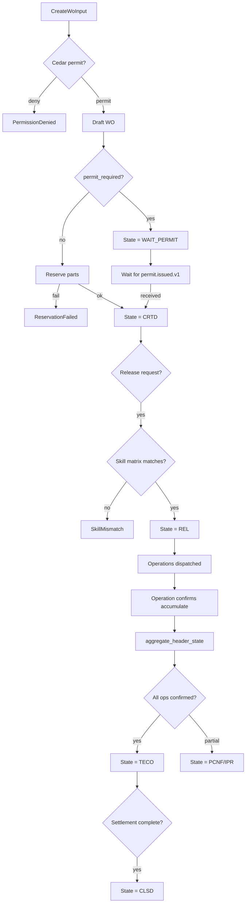

# IP-003: Domain layer for `work-order` — 11-state lifecycle with operation-level confirmation

## A. Intent

Implements the **Work Order** (German: *Instandhaltungsauftrag*, SAP `AUFK`/`AUFNR`-keyed) domain — the canonical atomic unit of maintenance work. Mirrors SAP S/4HANA `PM-WOC` submodule (transactions `IW31..IW38`, `IW41`, `IW8W`); accepts inputs from PM (preventive), CM (corrective/breakdown), CS (customer-service), and OM (operational measurements).

Industry-precedent equivalents: SAP S/4HANA `PM-WOC` (header in `AUFK`, operations in `AFVC`, components in `RESB`, settlement in `AUFK`+`COBK`), **IBM Maximo Work Order Tracking (`WORKORDER` + `WPLABOR` + `WPMATERIAL` + `WPTOOL`)**, **Infor EAM Work Order (`R5EVENTS` + `R5ACTIVITIES`)**, **Oracle Fusion Maintenance Work Orders (`WIE_WORK_ORDERS_VL`)**, **IFS Cloud Work Order (`ACTIVE_WORK_ORDER`)**, **GE Digital APM Work Management**. Hyperscaler analog: Amazon Mechanical Turk HIT (Human Intelligence Task) lifecycle — comparable state machine for "atomic work that humans perform with confirmations and acceptance".

### A.1 Why work-order is non-trivial

1. **11-state lifecycle.** SAP work-orders pass through `CRTD → REL → IPR → TECO → CLSD` plus `HOLD`, `LKD`, `DLT`. Oyatie's canonical state machine adds `WAIT_PERMIT` (waiting on PM-WCM permit-to-work) and `WAIT_PART` (spare-parts reservation pending) per ISO 55000 best-practice; total 11 states with strictly enumerated transitions.
2. **Header / operation / component split.** A work order has 1 header, N operations (routing steps), and M components (spare-parts demand). Each operation is independently confirmable (partial completion is normal); the header status derives from operation aggregate.
3. **Cost-collection on internal order.** PM work-orders are simultaneously CO (Controlling) internal orders that aggregate actual cost; settlement (IW8W) clears the WO to receivers (cost center, asset, customer).
4. **Reservation atomicity with inventory.** Component creation reserves spare-parts at *plan* time; reservation must commit-or-abort atomically with WO creation per saga (compensating release on failure).
5. **Permit dependency.** Safety-LOTO (PM-WCM) work-orders cannot move to `IPR` (in-progress) until a permit is issued; the state machine blocks `REL → IPR` if `permit_required AND permit_state != 'issued'`.
6. **Cedar gate on release.** WO release requires skill-matrix verification (technician possesses the qualifications the operations demand) per default policy; high-criticality WOs additionally require supervisor approval.

## B. Acceptance criteria

- **AC-1:** `CreateWorkOrderUseCase::execute(input)` Cedar-gated; idempotent on `(tenant_id, wo_id)`; default deny preserved.
- **AC-2:** Header carries: type (PM/CM/CS), priority (1-5), equipment_id or floc_id, planner_group, work_center; operations carry: op_no, control_key, work_minutes, work_center; components carry: material_id, gross_qty, reservation_id.
- **AC-3:** State machine: only enumerated transitions accepted; invalid transition returns `InvalidStateTransition` with allowed-from list.
- **AC-4:** Saga: WO create reserves parts atomically — if reservation fails (insufficient stock), WO rolls back to `draft` and no audit event leaks "WO created".
- **AC-5:** `ReleaseWorkOrderUseCase::execute` requires Cedar `plant_maintenance::wo::release` with skill-matrix subject context.
- **AC-6:** Permit gating: release of LOTO-flagged WO sets state `WAIT_PERMIT`; only `permit.issued.v1` event from PM-WCM (IP-016) advances to `REL`.
- **AC-7:** Operation confirm: `ConfirmOperationUseCase::execute(op_no, actual_minutes, actual_qty)` is per-operation idempotent on `(wo_id, op_no, confirm_seq)`.
- **AC-8:** Header status = `aggregate(operation_states)`: `IPR` if any op in progress; `TECO` if all op confirmed; otherwise `PCNF` partially.
- **AC-9:** Technical completion (`TECO`) freezes operations but allows cost postings; logical close (`CLSD`) requires final settlement.
- **AC-10:** Audit events emitted per §D-10.

## C. Verification

```bash
cargo test -p oya-plant-maintenance-work-order-domain -- create_pm_wo_happy_path
cargo test -p oya-plant-maintenance-work-order-domain -- create_cm_wo_breakdown_skips_planning
cargo test -p oya-plant-maintenance-work-order-domain -- invalid_state_transition_rejected
cargo test -p oya-plant-maintenance-work-order-domain -- reservation_fail_rolls_back_create
cargo test -p oya-plant-maintenance-work-order-domain -- release_requires_skill_matrix
cargo test -p oya-plant-maintenance-work-order-domain -- loto_wo_blocks_on_permit
cargo test -p oya-plant-maintenance-work-order-domain -- operation_confirm_idempotent
cargo test -p oya-plant-maintenance-work-order-domain -- header_status_aggregates_operations
cargo test -p oya-plant-maintenance-work-order-domain -- teco_freezes_operations
cargo test -p oya-plant-maintenance-work-order-domain -- close_requires_settlement
cargo test -p oya-plant-maintenance-work-order-domain -- cross_tenant_wo_load_rejected
cargo test -p oya-plant-maintenance-work-order-domain -- audit_event_classes_emitted
```

## D. Detailed mechanics

### D-1. Data model (PostgreSQL)

```sql
CREATE TABLE plant_maintenance.work_order (
    tenant_id        TEXT NOT NULL,
    wo_id            TEXT NOT NULL,
    wo_type          TEXT NOT NULL CHECK (wo_type IN ('PM','CM','CS','OM','BREAKDOWN','INSPECTION')),
    plan_id          TEXT,                    -- when generated from maintenance-plan IP-002
    equipment_id     TEXT,
    floc_id          TEXT,
    planner_group    TEXT NOT NULL,
    main_work_center TEXT NOT NULL,
    priority         INTEGER NOT NULL CHECK (priority BETWEEN 1 AND 5),
    state            TEXT NOT NULL CHECK (state IN
        ('draft','crtd','wait_part','wait_permit','rel','ipr','pcnf','teco','clsd','hold','lkd','dlt')),
    permit_required  BOOLEAN NOT NULL DEFAULT FALSE,
    abc_criticality  TEXT CHECK (abc_criticality IN ('A','B','C')),
    cost_center      TEXT,
    co_internal_order TEXT,                   -- settlement receiver
    planned_start    TIMESTAMPTZ,
    planned_finish   TIMESTAMPTZ,
    actual_start     TIMESTAMPTZ,
    actual_finish    TIMESTAMPTZ,
    residency_pack   TEXT NOT NULL,
    data_class       TEXT NOT NULL DEFAULT 'operational',
    hlc              TEXT NOT NULL,
    schema_version   INTEGER NOT NULL,
    decision_id      UUID NOT NULL,
    created_at       TIMESTAMPTZ NOT NULL DEFAULT now(),
    PRIMARY KEY (tenant_id, wo_id),
    CHECK ((equipment_id IS NOT NULL) OR (floc_id IS NOT NULL))
) PARTITION BY HASH (tenant_id);

CREATE TABLE plant_maintenance.work_order_operation (
    tenant_id      TEXT NOT NULL,
    wo_id          TEXT NOT NULL,
    op_no          INTEGER NOT NULL,
    control_key    TEXT NOT NULL,            -- e.g., PM01 (internal), PM02 (external)
    description    TEXT NOT NULL,
    work_center    TEXT NOT NULL,
    work_minutes_planned NUMERIC(10,2) NOT NULL,
    work_minutes_actual  NUMERIC(10,2) NOT NULL DEFAULT 0,
    quantity_planned NUMERIC(14,4),
    quantity_actual  NUMERIC(14,4) NOT NULL DEFAULT 0,
    state          TEXT NOT NULL CHECK (state IN ('plan','rel','ipr','pcnf','cnf','rej')),
    PRIMARY KEY (tenant_id, wo_id, op_no)
) PARTITION BY HASH (tenant_id);

CREATE TABLE plant_maintenance.work_order_component (
    tenant_id      TEXT NOT NULL,
    wo_id          TEXT NOT NULL,
    component_no   INTEGER NOT NULL,
    material_id    TEXT NOT NULL,
    gross_qty      NUMERIC(14,4) NOT NULL,
    unit           TEXT NOT NULL,
    reservation_id TEXT,
    issued_qty     NUMERIC(14,4) NOT NULL DEFAULT 0,
    PRIMARY KEY (tenant_id, wo_id, component_no)
) PARTITION BY HASH (tenant_id);

CREATE TABLE plant_maintenance.work_order_confirm (
    tenant_id     TEXT NOT NULL,
    wo_id         TEXT NOT NULL,
    op_no         INTEGER NOT NULL,
    confirm_seq   INTEGER NOT NULL,
    actual_minutes NUMERIC(10,2) NOT NULL,
    actual_qty     NUMERIC(14,4),
    technician_id TEXT NOT NULL,
    confirm_text  TEXT,
    final_confirm BOOLEAN NOT NULL DEFAULT FALSE,
    hlc           TEXT NOT NULL,
    confirmed_at  TIMESTAMPTZ NOT NULL,
    PRIMARY KEY (tenant_id, wo_id, op_no, confirm_seq)
) PARTITION BY HASH (tenant_id);

CREATE TABLE plant_maintenance.work_order_state_audit (
    tenant_id   TEXT NOT NULL,
    wo_id       TEXT NOT NULL,
    state_from  TEXT NOT NULL,
    state_to    TEXT NOT NULL,
    hlc         TEXT NOT NULL,
    actor       TEXT NOT NULL,
    decision_id UUID NOT NULL,
    PRIMARY KEY (tenant_id, wo_id, hlc)
) PARTITION BY HASH (tenant_id);
```

### D-2. Rust types

```rust
#[derive(Debug, Clone)]
pub struct WorkOrder {
    pub tenant_id:      TenantId,
    pub wo_id:          WoId,
    pub wo_type:        WoType,
    pub plan_id:        Option<PlanId>,
    pub anchor:         WoAnchor,             // Equipment or Floc
    pub planner_group:  PlannerGroup,
    pub main_work_center: WorkCenter,
    pub priority:       u8,                   // 1..=5
    pub state:          WoState,
    pub permit_required: bool,
    pub abc_criticality: Option<AbcIndicator>,
    pub cost_center:    Option<CostCenter>,
    pub co_internal_order: Option<CoOrderId>,
    pub planned_start:  Option<DateTime<Utc>>,
    pub planned_finish: Option<DateTime<Utc>>,
    pub actual_start:   Option<DateTime<Utc>>,
    pub actual_finish:  Option<DateTime<Utc>>,
    pub operations:     Vec<WorkOrderOperation>,
    pub components:     Vec<WorkOrderComponent>,
    pub hlc:            Hlc,
    pub decision_id:    DecisionId,
}

#[derive(Debug, Clone, PartialEq, Eq)]
pub enum WoState {
    Draft,       // not yet created
    Crtd,        // created
    WaitPart,    // reservation pending
    WaitPermit,  // LOTO permit pending
    Rel,         // released
    Ipr,         // in progress
    Pcnf,        // partially confirmed
    Teco,        // technically complete
    Clsd,        // closed
    Hold,
    Lkd,
    Dlt,         // marked for deletion
}

#[derive(Debug, Clone)]
pub enum WoType { PM, CM, CS, OM, BREAKDOWN, INSPECTION }
```

### D-3. State machine (transition table)

```rust
pub fn allowed_transition(from: WoState, to: WoState) -> bool {
    use WoState::*;
    matches!((from, to),
        (Draft, Crtd) |
        (Crtd, WaitPart) | (Crtd, WaitPermit) | (Crtd, Rel) | (Crtd, Hold) | (Crtd, Dlt) |
        (WaitPart, Crtd) | (WaitPart, Rel) | (WaitPart, Dlt) |
        (WaitPermit, Rel) | (WaitPermit, Dlt) |
        (Rel, Ipr) | (Rel, Hold) | (Rel, Lkd) |
        (Ipr, Pcnf) | (Ipr, Teco) | (Ipr, Hold) |
        (Pcnf, Ipr) | (Pcnf, Teco) |
        (Hold, Rel) | (Hold, Crtd) |
        (Lkd, Rel) |
        (Teco, Clsd) | (Teco, Rel) |   // re-open allowed pre-settlement
        (Clsd, Teco)                    // re-open only with finance approval
    )
}
```

### D-4. Header-state aggregation rule

```rust
pub fn aggregate_header_state(ops: &[WorkOrderOperation], permit_state: PermitState) -> WoState {
    use OpState::*;
    if permit_state == PermitState::Required && !permit_state.issued() { return WoState::WaitPermit; }
    if ops.is_empty() { return WoState::Crtd; }
    let counts = ops.iter().fold((0,0,0,0), |(p,i,c,f), o| match o.state {
        Plan => (p+1, i, c, f),
        Ipr  => (p, i+1, c, f),
        Pcnf => (p, i, c+1, f),
        Cnf | Rej => (p, i, c, f+1),
        Rel  => (p, i+1, c, f),
    });
    let (plan, in_progress, partial, final_) = counts;
    let total = ops.len();
    if final_ == total                       { WoState::Teco }
    else if in_progress > 0 || partial > 0   { if final_ > 0 { WoState::Pcnf } else { WoState::Ipr } }
    else if plan == total                    { WoState::Rel }
    else                                     { WoState::Pcnf }
}
```

### D-5. Cedar context (work-order release)

```jsonc
{
  "principal": "oyatie::tenant::acme::user::maintenance-planner-3",
  "action":    "plant_maintenance::wo::release",
  "resource":  "plant_maintenance::work_order::WO-2026-049182",
  "context": {
    "tenant_id": "acme",
    "wo_type": "PM",
    "abc_criticality": "B",
    "permit_required": false,
    "operation_skill_codes": ["MECH-L2","ELEC-L3","HOT-WORK"],
    "candidate_technicians": [
      {"id":"tech-77","skills":["MECH-L2","HOT-WORK"]},
      {"id":"tech-103","skills":["ELEC-L3","HOT-WORK"]}
    ],
    "data_class": "operational",
    "policy_bundle_version": "2026.05.20-r3",
    "residency_pack": "global+us-osha-psm",
    "byok_mode": "platform_default"
  }
}
```

### D-6. Reservation saga (atomic create-with-reservation)

```rust
pub async fn create_with_reservation_saga<R, INV, A, O>(
    repo: R, inv: INV, audit: A, outbox: O, input: CreateWoInput,
) -> Result<WoId, UseCaseError>
where R: WorkOrderRepository, INV: InventoryClient, A: AuditEmitter, O: OutboxDispatcher
{
    let tx = repo.begin_tx().await?;
    let wo = repo.draft(&tx, &input).await?;
    let reservation = match inv.reserve_for_wo(&wo).await {
        Ok(r) => r,
        Err(e) => {
            repo.discard(&tx, &wo.wo_id).await?;
            tx.rollback().await?;
            return Err(UseCaseError::ReservationFailed { cause: e.into() });
        }
    };
    repo.attach_reservation(&tx, &wo.wo_id, &reservation).await?;
    repo.transition(&tx, &wo.wo_id, WoState::Crtd).await?;
    audit.emit(&tx, AuditEntry::wo_created(&wo, &reservation)).await?;
    outbox.append(&tx, &wo_created_event(&wo, &reservation)).await?;
    tx.commit().await?;
    Ok(wo.wo_id)
}
```

### D-7. Workflow with decision branches



### D-8. AsyncAPI envelopes

| Channel | Trigger | Consumers |
|---|---|---|
| `plant-maintenance.wo.created.v1` | WO Crtd | ontology, audit, dashboards |
| `plant-maintenance.wo.released.v1` | Rel | tasks (dispatch), dashboards |
| `plant-maintenance.wo.operation-confirmed.v1` | confirm | analytics, predictive-maintenance |
| `plant-maintenance.wo.technical-completion.v1` | Teco | finops (settlement trigger), analytics |
| `plant-maintenance.wo.closed.v1` | Clsd | ontology, audit |
| `plant-maintenance.wo.state-changed.v1` | any transition | dashboards |
| `plant-maintenance.wo.permit-required.v1` | WO needs permit | permit-to-work (IP-017) |
| `plant-maintenance.wo.breakdown.v1` | CM-breakdown intake | incident-management |

### D-9. Ontology projection

| SAP PM | SAP table.field | Oyatie Ontology |
|---|---|---|
| Order header | AUFK.AUFNR | MaintenanceOrder.wo_id |
| Order type | AUFK.AUART | MaintenanceOrder.wo_type |
| Operation | AFVC.VORNR | MaintenanceOrder.operation[*].op_no |
| Component / reservation | RESB.MATNR | MaintenanceOrder.component[*] |
| Work-center | AFVC.ARBPL | MaintenanceOrder.operation[*].work_center |
| Control key | AFVC.STEUS | MaintenanceOrder.operation[*].control_key |
| Settlement rule | COBRA | MaintenanceOrder.co_internal_order |
| Status | JEST + TJ02 | MaintenanceOrder.state |

### D-10. SLO targets

| Operation | p50 | p95 | p99 | Throughput | Rationale |
|---|---|---|---|---|---|
| `CreateWorkOrder` (no reservation) | 22 ms | 50 ms | 100 ms | 500 req/s/cell | Cedar + DB write + outbox. |
| `CreateWorkOrder` (with reservation saga) | 60 ms | 140 ms | 300 ms | 200 req/s/cell | Inventory gRPC + DB + outbox; saga compensation budget included. |
| `ReleaseWorkOrder` | 35 ms | 80 ms | 160 ms | 400 req/s/cell | Skill-matrix Cedar context expensive. |
| `ConfirmOperation` | 18 ms | 40 ms | 85 ms | 1.2 k req/s/cell | Confirm row insert + aggregate recompute. |
| `LoadWorkOrder` (header + ops + components) | 8 ms | 18 ms | 38 ms | 30 k req/s/cell | Hot path; covering index. |
| `ListByWorkCenter` (1 day window, 200 WOs) | 25 ms | 60 ms | 120 ms | 8 k req/s/cell | Dispatch UI hot. |

### D-11. Audit-event registry

| Event class | Severity | Emitter |
|---|---|---|
| `EVT-PLANT_MAINTENANCE-WORK_ORDER-CREATED` | informational | usecase |
| `EVT-PLANT_MAINTENANCE-WORK_ORDER-RESERVATION_ATTACHED` | informational | usecase |
| `EVT-PLANT_MAINTENANCE-WORK_ORDER-RESERVATION_FAILED` | warning | usecase |
| `EVT-PLANT_MAINTENANCE-WORK_ORDER-RELEASED` | informational | usecase |
| `EVT-PLANT_MAINTENANCE-WORK_ORDER-SKILL_MISMATCH` | warning | usecase |
| `EVT-PLANT_MAINTENANCE-WORK_ORDER-PERMIT_GATE_HELD` | informational | usecase |
| `EVT-PLANT_MAINTENANCE-WORK_ORDER-OPERATION_CONFIRMED` | informational | usecase |
| `EVT-PLANT_MAINTENANCE-WORK_ORDER-TECO` | informational | usecase |
| `EVT-PLANT_MAINTENANCE-WORK_ORDER-CLOSED` | informational | usecase |
| `EVT-PLANT_MAINTENANCE-WORK_ORDER-INVALID_TRANSITION` | warning | usecase |
| `EVT-PLANT_MAINTENANCE-WORK_ORDER-CROSS_TENANT_REJECTED` | security | usecase |

### D-12. Failure modes & recovery

1. **`ReservationFailed`** — inventory insufficient or service degraded. Rollback to `draft` (no event leak); planner notified. Runbook `runbooks/wo-reservation-failed.md`.
2. **`SkillMismatch`** — no candidate technician satisfies operation skill requirements. Reject release; suggest substitute crews from skill-matrix; planner re-routes. Runbook `runbooks/skill-matrix-mismatch.md`.
3. **`PermitDenied`** — PM-WCM denies permit-to-work due to clash. WO held in `WAIT_PERMIT`; safety-authority resolves clash. Runbook `runbooks/permit-clash.md`.
4. **`StateMachineInvalid`** — caller proposes disallowed transition (e.g., `CLSD → IPR`). Reject with allowed-from list. Runbook `runbooks/wo-invalid-transition.md`.
5. **`ConfirmAfterTeco`** — late confirm arrives after technical completion. Accept into TECO-relaxed window (24h) with audit; reject thereafter. Runbook `runbooks/late-confirm.md`.
6. **`OutboxBackpressure`** — Kafka backlog. WO writes succeed; outbox drains async; downstream subsystems may lag. Runbook `runbooks/outbox-lag.md`.

### D-13. Migration notes

Source vendor surfaces:

- **SAP S/4HANA**: `AUFK` (order header) + `AFVC` (operations) + `RESB` (components) + `AFFL` (network relations) + `COBK/COEP` (CO cost docs) + `JEST/TJ02` (status); export via CDS view `I_MaintenanceOrder*`.
- **IBM Maximo**: `WORKORDER` + `WPLABOR` + `WPMATERIAL` + `WPTOOL` + `WOSTATUS`.
- **Infor EAM**: `R5EVENTS` (event = WO) + `R5ACTIVITIES` (operations) + `R5MATERIAL`.
- **Oracle Fusion EAM**: `WIE_WORK_ORDERS_VL` + `WIE_WO_OPERATIONS_VL` + `WIE_WO_OP_MATERIALS_VL`.
- **IFS Cloud**: `ACTIVE_WORK_ORDER` + `WORK_ORDER_HISTORY` + `WORK_ORDER_OPERATION`.
- **GE Digital APM**: `MI_WORK_ORDER_*` family.

### D-14. Cross-µservice handoffs

| Direction | Counterparty | Surface |
|---|---|---|
| outbound | `tasks` | AsyncAPI `wo.released.v1` (dispatch to technician) |
| outbound | `audit-chain` | per ADR-0263 (safety-LOTO immutable) |
| outbound | `oya-cloud-finops` | AsyncAPI `wo.teco.v1` (settlement trigger) |
| outbound | `incident-management` | AsyncAPI `wo.breakdown.v1` |
| inbound  | `inventory-management` | gRPC `inventory.v1.ReserveForWorkOrder` (saga) |
| inbound  | `identity` | gRPC `identity.v1.GetSkillMatrix` (technician qualification) |
| outbound | `workplace-integration` | shift binding for dispatch |
| outbound | `ontology` | projection delta |

## E. Failure-mode summary

See D-12.

## F. Migration / rollback

Feature flag `plant_maintenance_work_order_v1`. Disabling freezes new WO creation; in-flight WOs continue. Reservation saga rollback retains DB consistency on partial failure.

## G. References

- ADR-0105, ADR-0244, ADR-0252, ADR-0257, ADR-0263, ADR-0294, ADR-0297, ADR-0314..0316.
- SAP S/4HANA `PM-WOC` documentation; SAP Note 2933872 (work-order status integration).
- Benchmarks: SAP S/4HANA PM-WOC | IBM Maximo Work Order Tracking | Infor EAM Work Order | Oracle Fusion Work Orders | IFS Cloud Work Order | GE Digital APM Work Management.

## H. Out of scope

- Spare-parts reservation (IP-004), technician dispatch (IP-005), permit-to-work (IP-017), safety-LOTO state machine (IP-016).

— end IP-003 —
