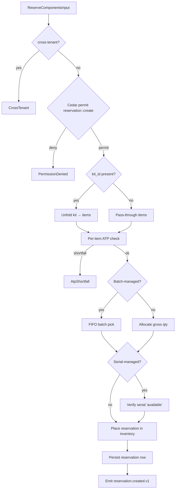

# IP-004: Domain layer for `spare-part-reservation` — Component reservation with kit-pick + ATP

## A. Intent

Implements the **Spare-part Reservation** domain — the bridge between a work-order's component plan (`RESB` rows in SAP) and the warehouse-management `inventory-management` µservice. Each reservation row holds a typed claim on stock at a (plant, storage-location, batch) coordinate, with **ATP (Available-To-Promise)** verification at plan-time and `goods-movement-261` (consumption against PM order) at issue-time. The reservation is the conservative cousin of "stock on hand" — it's an obligation that may be partially issued or fully cancelled if the WO retires.

Industry-precedent equivalents: SAP S/4HANA `RESB` table (reservation), transactions `MB21/MB22/MB25/CO11N`. **IBM Maximo Reserved Items (`MATRECTRANS` with reserve flag)**, **Infor EAM (`R5RESERVATIONS`)**, **Oracle Fusion Maintenance Material Issues**, **IFS Cloud (`INVENTORY_RESERVATION`)**, **GE Digital APM Spare Part Management**. Hyperscaler analog: AWS DynamoDB conditional-write "reserve-then-commit" pattern; Stripe PaymentIntent confirm/cancel atomicity.

### A.1 Why reservation is non-trivial

1. **ATP check must be tenant + plant + storage-location precise.** Stock at `acme:PLT-01:WH-MAIN` is not pickable for a WO at `acme:PLT-02:WH-EAST` without a stock-transfer order. Cross-storage-location ATP requires consulting a stock-transfer policy table.
2. **Batch / serial constraints.** Some parts (lubricants, calibrated instruments) require FIFO batch consumption; others (rotor cores) require a specific serial. The reservation must encode the constraint.
3. **Partial-issue reality.** Mechanics rarely consume exactly the planned quantity; the reservation must accept 80%-120% (`issue_tolerance_pct`) and audit deviations.
4. **Kit-pick semantics.** Some WOs reserve a *kit* (pre-assembled parts list); the reservation is one logical row but unfolds to N material rows at pick.
5. **Cancellation rebound.** If a WO is cancelled, the reservation must release stock back to free; the rebound must be transactional with no double-counting.
6. **Cross-µservice tx with inventory-management.** Reservation = saga-anchor between PM and inventory; either both commit (WO + reservation) or both abort (no partial state).

## B. Acceptance criteria

- **AC-1:** `ReserveComponentsUseCase::execute(wo, components)` Cedar-gated; default deny preserved; idempotent on `(tenant_id, reservation_id)`.
- **AC-2:** ATP check rejects reservation when `available_qty - reserved_qty < demanded_qty`; surfaces `AtpShortfall { material, plant, sloc, shortfall_qty }`.
- **AC-3:** Batch FIFO reservation picks oldest batch first; explicit batch override allowed only with Cedar `batch_override` permit.
- **AC-4:** Serial reservation pins a specific `serial_no`; rejects if serial isn't in `available` state.
- **AC-5:** Kit-pick: one `reservation_id` may unfold to ≥2 `reservation_item` rows.
- **AC-6:** Partial-issue tolerance: `actual_qty` accepted if `|actual_qty - planned_qty| / planned_qty ≤ issue_tolerance_pct`; outside tolerance requires Cedar `over_issue` permit.
- **AC-7:** Cancellation: releases reservation atomically; downstream `goods-movement-262` (cancel) emitted.
- **AC-8:** Cross-tenant reservation load returns `CrossTenant` error without leaking material/qty.
- **AC-9:** `ReleaseReservationUseCase::execute` (on WO retirement) sums issued and releases the remainder.
- **AC-10:** Audit events emitted per §D-10.

## C. Verification

```bash
cargo test -p oya-plant-maintenance-spare-part-reservation-domain -- reserve_with_atp_happy_path
cargo test -p oya-plant-maintenance-spare-part-reservation-domain -- atp_shortfall_rejected
cargo test -p oya-plant-maintenance-spare-part-reservation-domain -- fifo_batch_oldest_picked
cargo test -p oya-plant-maintenance-spare-part-reservation-domain -- explicit_batch_override_requires_cedar
cargo test -p oya-plant-maintenance-spare-part-reservation-domain -- serial_reservation_state_validated
cargo test -p oya-plant-maintenance-spare-part-reservation-domain -- kit_unfolds_to_components
cargo test -p oya-plant-maintenance-spare-part-reservation-domain -- partial_issue_within_tolerance_ok
cargo test -p oya-plant-maintenance-spare-part-reservation-domain -- over_issue_outside_tolerance_requires_cedar
cargo test -p oya-plant-maintenance-spare-part-reservation-domain -- cancellation_releases_atomically
cargo test -p oya-plant-maintenance-spare-part-reservation-domain -- release_on_wo_retirement
cargo test -p oya-plant-maintenance-spare-part-reservation-domain -- cross_tenant_reservation_blocked
```

## D. Detailed mechanics

### D-1. Data model (PostgreSQL)

```sql
CREATE TABLE plant_maintenance.reservation (
    tenant_id       TEXT NOT NULL,
    reservation_id  TEXT NOT NULL,
    wo_id           TEXT NOT NULL,
    plant_code      TEXT NOT NULL,
    movement_type   TEXT NOT NULL DEFAULT '261' CHECK (movement_type IN ('261','262','201','202')),
    kit_id          TEXT,
    state           TEXT NOT NULL CHECK (state IN ('draft','active','partially_issued','fully_issued','cancelled','released')),
    issue_tolerance_pct NUMERIC(5,2) NOT NULL DEFAULT 5.00,
    residency_pack  TEXT NOT NULL,
    data_class      TEXT NOT NULL DEFAULT 'operational',
    hlc             TEXT NOT NULL,
    schema_version  INTEGER NOT NULL,
    decision_id     UUID NOT NULL,
    created_at      TIMESTAMPTZ NOT NULL DEFAULT now(),
    PRIMARY KEY (tenant_id, reservation_id),
    FOREIGN KEY (tenant_id, wo_id) REFERENCES plant_maintenance.work_order (tenant_id, wo_id)
) PARTITION BY HASH (tenant_id);

CREATE TABLE plant_maintenance.reservation_item (
    tenant_id      TEXT NOT NULL,
    reservation_id TEXT NOT NULL,
    item_no        INTEGER NOT NULL,
    material_id    TEXT NOT NULL,
    plant_code     TEXT NOT NULL,
    storage_location TEXT NOT NULL,
    batch_no       TEXT,                  -- optional, when batch-managed
    serial_no      TEXT,                  -- optional, when serial-managed
    planned_qty    NUMERIC(14,4) NOT NULL,
    issued_qty     NUMERIC(14,4) NOT NULL DEFAULT 0,
    unit           TEXT NOT NULL,
    state          TEXT NOT NULL CHECK (state IN ('planned','reserved','partial','issued','cancelled')),
    PRIMARY KEY (tenant_id, reservation_id, item_no)
) PARTITION BY HASH (tenant_id);

CREATE TABLE plant_maintenance.reservation_audit (
    tenant_id      TEXT NOT NULL,
    reservation_id TEXT NOT NULL,
    event_kind     TEXT NOT NULL,
    item_no        INTEGER,
    qty_delta      NUMERIC(14,4),
    hlc            TEXT NOT NULL,
    actor          TEXT NOT NULL,
    decision_id    UUID NOT NULL,
    PRIMARY KEY (tenant_id, reservation_id, hlc, event_kind)
) PARTITION BY HASH (tenant_id);
```

### D-2. Rust types

```rust
#[derive(Debug, Clone)]
pub struct Reservation {
    pub tenant_id:        TenantId,
    pub reservation_id:   ReservationId,
    pub wo_id:            WoId,
    pub plant_code:       PlantCode,
    pub movement_type:    MovementType,        // 261 = consumption to order
    pub kit_id:           Option<KitId>,
    pub state:            ReservationState,
    pub issue_tolerance_pct: Decimal,
    pub items:            Vec<ReservationItem>,
    pub hlc:              Hlc,
    pub decision_id:      DecisionId,
}

#[derive(Debug, Clone)]
pub struct ReservationItem {
    pub item_no:          u16,
    pub material_id:      MaterialId,
    pub plant_code:       PlantCode,
    pub storage_location: StorageLocation,
    pub batch_no:         Option<BatchNo>,
    pub serial_no:        Option<SerialNo>,
    pub planned_qty:      Decimal,
    pub issued_qty:       Decimal,
    pub unit:             Unit,
    pub state:            ReservationItemState,
}

#[derive(Debug, Clone)]
pub enum MovementType { M261, M262, M201, M202 }
```

### D-3. ATP check + FIFO-batch picker

```rust
pub async fn check_atp_and_pick_batches<INV>(
    inv: &INV, tenant: &TenantId, mat: &MaterialId, plant: &PlantCode,
    sloc: &StorageLocation, demand: Decimal,
) -> Result<Vec<BatchAllocation>, AtpError>
where INV: InventoryClient
{
    let avail = inv.available_by_batch_fifo(tenant, mat, plant, sloc).await?;
    let total_free: Decimal = avail.iter().map(|b| b.free_qty).sum();
    if total_free < demand {
        return Err(AtpError::Shortfall { shortfall_qty: demand - total_free });
    }
    let mut remaining = demand;
    let mut allocations = Vec::new();
    for b in avail.into_iter() {
        if remaining == Decimal::ZERO { break; }
        let take = remaining.min(b.free_qty);
        allocations.push(BatchAllocation { batch_no: b.batch_no.clone(), qty: take });
        remaining -= take;
    }
    Ok(allocations)
}
```

### D-4. Cedar context (over-issue permit)

```jsonc
{
  "principal": "oyatie::tenant::acme::user::maintenance-tech-77",
  "action":    "plant_maintenance::reservation::over_issue",
  "resource":  "plant_maintenance::reservation::RES-2026-1098273:item:2",
  "context": {
    "tenant_id": "acme",
    "wo_id": "WO-2026-049182",
    "material_id": "MAT-LUBE-7F",
    "planned_qty": "10.00",
    "actual_qty": "12.50",
    "deviation_pct": "25.0",
    "tolerance_pct": "5.0",
    "data_class": "operational",
    "policy_bundle_version": "2026.05.20-r3",
    "residency_pack": "global",
    "byok_mode": "platform_default"
  }
}
```

### D-5. Port traits

```rust
#[async_trait]
pub trait ReservationRepository: Send + Sync {
    async fn save(&self, tx: &RepoTx, r: &Reservation) -> Result<(), RepoError>;
    async fn load(&self, tenant: &TenantId, id: &ReservationId) -> Result<Option<Reservation>, RepoError>;
    async fn list_for_wo(&self, tenant: &TenantId, wo: &WoId) -> Result<Vec<Reservation>, RepoError>;
    async fn append_audit(&self, tx: &RepoTx, audit: &ReservationAuditRow) -> Result<(), RepoError>;
    async fn update_item_issue(&self, tx: &RepoTx, id: &ReservationId, item_no: u16, issued: Decimal) -> Result<(), RepoError>;
}

#[async_trait]
pub trait InventoryClient: Send + Sync {
    async fn available_by_batch_fifo(&self, tenant: &TenantId, mat: &MaterialId, plant: &PlantCode, sloc: &StorageLocation) -> Result<Vec<BatchAvail>, InvError>;
    async fn place_reservation(&self, r: &Reservation) -> Result<(), InvError>;
    async fn commit_goods_movement(&self, mv: &GoodsMovement) -> Result<(), InvError>;
    async fn release_reservation(&self, id: &ReservationId) -> Result<(), InvError>;
}

#[async_trait]
pub trait KitResolver: Send + Sync {
    async fn unfold_kit(&self, tenant: &TenantId, kit: &KitId) -> Result<Vec<KitItem>, KitError>;
}
```

### D-6. Workflow with decision branches



### D-7. AsyncAPI envelopes

| Channel | Trigger | Consumers |
|---|---|---|
| `plant-maintenance.reservation.created.v1` | new reservation | inventory-management, dashboards, audit |
| `plant-maintenance.reservation.partial-issue.v1` | partial pick | analytics |
| `plant-maintenance.reservation.fully-issued.v1` | last pick | finops (cost posting), analytics |
| `plant-maintenance.reservation.cancelled.v1` | cancel | inventory-management (rebound) |
| `plant-maintenance.reservation.atp-shortfall.v1` | ATP fail | procurement-planning, alerting |
| `plant-maintenance.reservation.over-issue.v1` | tolerance breach | audit |

### D-8. Ontology projection

| SAP PM | SAP table.field | Oyatie Ontology |
|---|---|---|
| Reservation | RESB.RSNUM | Reservation.reservation_id |
| Reservation item | RESB.RSPOS | ReservationItem.item_no |
| Material | RESB.MATNR | ReservationItem.material_id |
| Plant | RESB.WERKS | ReservationItem.plant_code |
| Storage location | RESB.LGORT | ReservationItem.storage_location |
| Batch | RESB.CHARG | ReservationItem.batch_no |
| Movement type | RESB.BWART | Reservation.movement_type |
| Order id | RESB.AUFNR | Reservation.wo_id |

### D-9. SLO targets

| Operation | p50 | p95 | p99 | Throughput | Rationale |
|---|---|---|---|---|---|
| `ReserveComponents` (1 item) | 32 ms | 75 ms | 150 ms | 800 req/s/cell | ATP + Cedar + DB + inventory gRPC; multi-hop. |
| `ReserveComponents` (kit 8 items) | 110 ms | 250 ms | 500 ms | 200 req/s/cell | Per-item ATP; bottleneck = inventory roundtrips. |
| `IssueGoodsMovement` | 18 ms | 40 ms | 85 ms | 1.5 k req/s/cell | Single update + audit. |
| `ReleaseReservation` (cancel) | 25 ms | 60 ms | 120 ms | 600 req/s/cell | Rebound to inventory; multi-row update. |
| `ListByWo` | 6 ms | 14 ms | 28 ms | 30 k req/s/cell | Hot path; covering index. |

### D-10. Audit-event registry

| Event class | Severity | Emitter |
|---|---|---|
| `EVT-PLANT_MAINTENANCE-RESERVATION-CREATED` | informational | usecase |
| `EVT-PLANT_MAINTENANCE-RESERVATION-ATP_SHORTFALL` | warning | usecase |
| `EVT-PLANT_MAINTENANCE-RESERVATION-BATCH_OVERRIDE_USED` | warning | usecase |
| `EVT-PLANT_MAINTENANCE-RESERVATION-PARTIAL_ISSUED` | informational | usecase |
| `EVT-PLANT_MAINTENANCE-RESERVATION-FULLY_ISSUED` | informational | usecase |
| `EVT-PLANT_MAINTENANCE-RESERVATION-OVER_ISSUE` | warning | usecase |
| `EVT-PLANT_MAINTENANCE-RESERVATION-CANCELLED` | informational | usecase |
| `EVT-PLANT_MAINTENANCE-RESERVATION-RELEASED` | informational | usecase |
| `EVT-PLANT_MAINTENANCE-RESERVATION-CROSS_TENANT_REJECTED` | security | usecase |

### D-11. Failure modes & recovery

1. **`AtpShortfall`** — demand exceeds free stock. Emit shortfall event → procurement-planning may convert to purchase requisition. Runbook `runbooks/atp-shortfall.md`.
2. **`InventoryServiceUnavailable`** — gRPC to inventory fails after retries. Reservation held in `draft`; planner notified; retry budget every 60s for 1h before flag as `stuck`. Runbook `runbooks/inventory-unavailable.md`.
3. **`BatchFifoLockContention`** — two reservations target the same batch concurrently. Optimistic locking — second retries with next batch. Runbook `runbooks/batch-lock-contention.md`.
4. **`SerialAlreadyReserved`** — serial-managed part already pinned to another WO. Surface alternate available serials; planner re-selects. Runbook `runbooks/serial-conflict.md`.
5. **`KitDefinitionMissing`** — kit_id references a retired/missing kit. Reject; suggest unfolded line-items as fallback. Runbook `runbooks/kit-missing.md`.
6. **`OverIssueCedarDeny`** — technician issued >tolerance and no override permit. Goods-movement rejected; technician notified; supervisor approval needed. Runbook `runbooks/over-issue-deny.md`.

### D-12. Migration notes

Source vendor surfaces:

- **SAP S/4HANA**: `RESB` (reservation) + `RKPF` (header) + `MSEG` (goods movement docs) + `MCHB` (batch stock) + `MARD` (sloc stock).
- **IBM Maximo**: `MATRECTRANS` with `RESERVEDQTY` field + `INVBALANCES`.
- **Infor EAM**: `R5RESERVATIONS` + `R5PARTSTRANS`.
- **Oracle Fusion EAM**: `WIE_WO_MATERIAL_ISSUES_VL` + `INV_RESERVATIONS`.
- **IFS Cloud**: `INVENTORY_RESERVATION` + `MATERIAL_REQUISITION`.

### D-13. Cross-µservice handoffs

| Direction | Counterparty | Surface |
|---|---|---|
| outbound | `inventory-management` | gRPC `inventory.v1.PlaceReservation` |
| outbound | `inventory-management` | gRPC `inventory.v1.CommitGoodsMovement` (issue) |
| outbound | `inventory-management` | gRPC `inventory.v1.ReleaseReservation` (cancel) |
| outbound | `procurement-planning` | AsyncAPI `reservation.atp-shortfall.v1` |
| outbound | `oya-cloud-finops` | AsyncAPI `reservation.fully-issued.v1` (cost post) |
| outbound | `ontology` | projection delta |
| outbound | `audit-chain` | per ADR-0263 |
| inbound  | `work-order` (IP-003) | reservation lifecycle is anchored to WO lifecycle |

## E. Failure-mode summary

See D-11.

## F. Migration / rollback

Feature flag `plant_maintenance_reservation_v1`. Disabling halts new reservations; in-flight reservations continue to release. Per-reservation cancel is always available even if µservice degrades.

## G. References

- ADR-0105, ADR-0244, ADR-0252, ADR-0263, ADR-0294, ADR-0297, ADR-0314..0316.
- SAP S/4HANA Inventory Management + PM-MRP documentation.
- Benchmarks: SAP S/4HANA RESB | IBM Maximo Reserved Items | Infor EAM Reservations | Oracle Fusion Material Issues | IFS Cloud Inventory Reservation | GE Digital APM Spare Part Mgmt.

## H. Out of scope

- Work-order (IP-003), technician dispatch (IP-005), MRP linkage (IP-019), spare-parts master (lives in inventory-management).

— end IP-004 —
