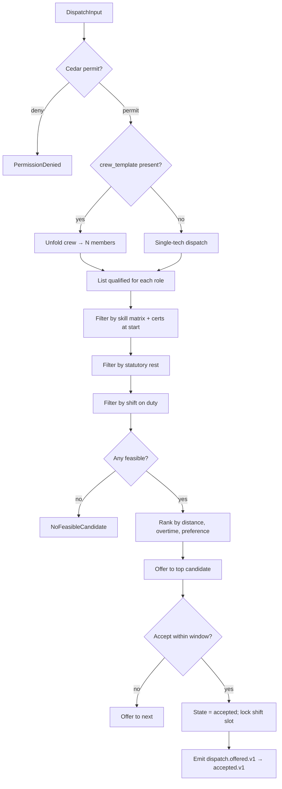

# IP-005: Domain layer for `technician-dispatch` — Skill-matrix matching + shift binding + travel constraints

## A. Intent

Implements the **Technician Dispatch** domain — the matching primitive that binds a work-order operation to an individual technician (or crew) for a specific shift, honoring **skill-matrix qualifications**, **certification expiry**, **travel-time** between successive jobs, and **statutory rest-time** rules. Mirrors SAP MRS (Multiresource Scheduling) dispatch board functionality combined with field-service-management (FSM) scheduling logic.

Industry-precedent equivalents: SAP MRS (Multiresource Scheduling), **IBM Maximo Mobile + Maximo Scheduler**, **Infor EAM Mobile + Workforce**, **Oracle Field Service (OFS, formerly TOA)**, **IFS Cloud Field Service Management**, **ServiceNow Field Service Management**, **Salesforce Field Service**, **Microsoft Dynamics 365 Field Service** (Resource Scheduling Optimization). Hyperscaler analog: AWS Resource Groups Tag-based scheduling + Uber's dispatch matching algorithm (the "best driver for trip request" pattern transplanted to skilled technicians).

### A.1 Why technician dispatch is non-trivial

1. **Skill matrix is multi-dimensional.** A technician has N skills, each with a level (L1-L5), and N certifications (welding-6G, electrical-Class-3, confined-space, hot-work). Operations declare required skills + min level + required certs.
2. **Certification expiry is temporal.** A welder's 6G cert expires every 2 years; a confined-space cert annually. Dispatch must reject expired certs at *job start time*, not just at write time.
3. **Shift binding + statutory rest.** EU Working Time Directive (Directive 2003/88/EC) requires 11 consecutive hours of rest in every 24-hour period; US OSHA-aligned (NIOSH-recommended) fatigue rules cap 12-hour shifts. Dispatch must respect both per-jurisdiction (residency-pack-driven).
4. **Travel-time constraints.** Sequential jobs must factor travel between FLOC coordinates (Haversine for plant-scale, road-network for field-service). The traveling-salesman shape isn't NP-hard for a single technician's day (≤20 stops), but planning a crew of 80 across 5 plants is.
5. **Crew vs individual.** Some WOs need a crew (e.g., 2-tech LOTO lockout); dispatch must lock all members of the crew simultaneously or none.
6. **Soft-constraint optimization.** Hard constraints (skill, cert, hours) are mandatory; soft constraints (technician preference, plant familiarity, overtime cost) drive ranking among feasible candidates.

## B. Acceptance criteria

- **AC-1:** `DispatchOperationUseCase::execute(op)` Cedar-gated; idempotent on `(tenant_id, dispatch_id)`.
- **AC-2:** Skill-matrix match: candidates filtered to those whose skill levels ≥ required levels AND who hold all required certs unexpired at scheduled start.
- **AC-3:** Statutory rest: planner rule enforces ≥11h rest before shift start per EU residency pack; ≥10h per US-OSHA-aligned residency pack.
- **AC-4:** Travel time: when sequential jobs cross FLOCs > 100m apart, computed travel time inserted into schedule; if it pushes start past planned, surface `TravelConflict`.
- **AC-5:** Crew dispatch: all members of crew template must be available simultaneously; partial-crew dispatch rejected.
- **AC-6:** Soft-constraint ranking: among feasible candidates, rank by `(distance, overtime_cost, preference)` lexicographically.
- **AC-7:** Reassignment: `ReassignDispatchUseCase::execute` releases prior technician + re-runs matching; emits `dispatch.reassigned.v1`.
- **AC-8:** Self-pickup: technician can claim an unassigned operation if they meet skill matrix (mobile workflow).
- **AC-9:** No-show: if technician doesn't confirm start within `no_show_window_min` of planned_start, auto-emit `dispatch.no-show.v1`; supervisor re-dispatches.
- **AC-10:** Audit events emitted per §D-10.

## C. Verification

```bash
cargo test -p oya-plant-maintenance-technician-dispatch-domain -- dispatch_with_skill_match
cargo test -p oya-plant-maintenance-technician-dispatch-domain -- expired_cert_rejected_at_start
cargo test -p oya-plant-maintenance-technician-dispatch-domain -- statutory_rest_eu_11h_enforced
cargo test -p oya-plant-maintenance-technician-dispatch-domain -- statutory_rest_us_10h_enforced
cargo test -p oya-plant-maintenance-technician-dispatch-domain -- travel_time_pushes_start
cargo test -p oya-plant-maintenance-technician-dispatch-domain -- crew_dispatch_atomic
cargo test -p oya-plant-maintenance-technician-dispatch-domain -- soft_constraint_ranking
cargo test -p oya-plant-maintenance-technician-dispatch-domain -- reassign_releases_prior
cargo test -p oya-plant-maintenance-technician-dispatch-domain -- self_pickup_requires_skill
cargo test -p oya-plant-maintenance-technician-dispatch-domain -- no_show_auto_emits
cargo test -p oya-plant-maintenance-technician-dispatch-domain -- cross_tenant_dispatch_rejected
```

## D. Detailed mechanics

### D-1. Data model

```sql
CREATE TABLE plant_maintenance.dispatch (
    tenant_id          TEXT NOT NULL,
    dispatch_id        TEXT NOT NULL,
    wo_id              TEXT NOT NULL,
    op_no              INTEGER NOT NULL,
    technician_id      TEXT,                   -- nullable until matched
    crew_template_id   TEXT,
    work_center        TEXT NOT NULL,
    shift_code         TEXT NOT NULL,          -- A | B | C | NIGHT | WEEKEND
    planned_start      TIMESTAMPTZ NOT NULL,
    planned_finish     TIMESTAMPTZ NOT NULL,
    actual_start       TIMESTAMPTZ,
    actual_finish      TIMESTAMPTZ,
    state              TEXT NOT NULL CHECK (state IN
        ('pending','offered','accepted','in_progress','completed','no_show','reassigned','cancelled')),
    no_show_window_min INTEGER NOT NULL DEFAULT 15,
    residency_pack     TEXT NOT NULL,
    hlc                TEXT NOT NULL,
    decision_id        UUID NOT NULL,
    PRIMARY KEY (tenant_id, dispatch_id),
    FOREIGN KEY (tenant_id, wo_id) REFERENCES plant_maintenance.work_order (tenant_id, wo_id)
) PARTITION BY HASH (tenant_id);

CREATE TABLE plant_maintenance.dispatch_required_skill (
    tenant_id    TEXT NOT NULL,
    dispatch_id  TEXT NOT NULL,
    skill_code   TEXT NOT NULL,
    min_level    SMALLINT NOT NULL CHECK (min_level BETWEEN 1 AND 5),
    PRIMARY KEY (tenant_id, dispatch_id, skill_code)
) PARTITION BY HASH (tenant_id);

CREATE TABLE plant_maintenance.dispatch_required_cert (
    tenant_id   TEXT NOT NULL,
    dispatch_id TEXT NOT NULL,
    cert_code   TEXT NOT NULL,
    PRIMARY KEY (tenant_id, dispatch_id, cert_code)
) PARTITION BY HASH (tenant_id);

CREATE TABLE plant_maintenance.dispatch_audit (
    tenant_id    TEXT NOT NULL,
    dispatch_id  TEXT NOT NULL,
    event_kind   TEXT NOT NULL,
    actor        TEXT NOT NULL,
    detail       JSONB,
    hlc          TEXT NOT NULL,
    decision_id  UUID NOT NULL,
    PRIMARY KEY (tenant_id, dispatch_id, hlc, event_kind)
) PARTITION BY HASH (tenant_id);
```

### D-2. Rust types

```rust
#[derive(Debug, Clone)]
pub struct Dispatch {
    pub tenant_id:        TenantId,
    pub dispatch_id:      DispatchId,
    pub wo_id:            WoId,
    pub op_no:            OperationNo,
    pub technician_id:    Option<TechnicianId>,
    pub crew_template_id: Option<CrewTemplateId>,
    pub work_center:      WorkCenter,
    pub shift_code:       ShiftCode,
    pub planned_start:    DateTime<Utc>,
    pub planned_finish:   DateTime<Utc>,
    pub actual_start:     Option<DateTime<Utc>>,
    pub actual_finish:    Option<DateTime<Utc>>,
    pub state:            DispatchState,
    pub required_skills:  Vec<RequiredSkill>,
    pub required_certs:   Vec<CertCode>,
    pub no_show_window_min: u16,
    pub residency_pack:   ResidencyPack,
    pub hlc:              Hlc,
    pub decision_id:      DecisionId,
}

#[derive(Debug, Clone)]
pub struct RequiredSkill { pub code: SkillCode, pub min_level: u8 }

#[derive(Debug, Clone)]
pub enum ShiftCode { A, B, C, Night, Weekend }

#[derive(Debug, Clone)]
pub enum DispatchState {
    Pending, Offered, Accepted, InProgress, Completed,
    NoShow, Reassigned, Cancelled,
}
```

### D-3. Match-rank algorithm

```rust
pub fn rank_candidates(
    candidates: Vec<TechnicianProfile>,
    required_skills: &[RequiredSkill],
    required_certs: &[CertCode],
    at: DateTime<Utc>,
    op_floc: &FlocId,
    residency_pack: &ResidencyPack,
) -> Vec<RankedCandidate> {
    let mut feasible: Vec<RankedCandidate> = candidates.into_iter()
        .filter(|t| satisfies_skills(t, required_skills))
        .filter(|t| holds_unexpired_certs(t, required_certs, at))
        .filter(|t| has_statutory_rest(t, at, residency_pack))
        .filter(|t| is_on_shift(t, at))
        .map(|t| RankedCandidate {
            distance_m: distance(&t.last_floc, op_floc),
            overtime_cost: t.overtime_cost_estimate(at),
            preference: t.preference_for_floc(op_floc),
            tech: t,
        })
        .collect();
    feasible.sort_by(|a, b| {
        a.distance_m.cmp(&b.distance_m)
            .then(a.overtime_cost.cmp(&b.overtime_cost))
            .then(b.preference.cmp(&a.preference))    // higher preference first
    });
    feasible
}

fn has_statutory_rest(t: &TechnicianProfile, at: DateTime<Utc>, pack: &ResidencyPack) -> bool {
    let min_rest_h = match pack.code() {
        "EU" | "EU-GDPR" => 11,
        "US" | "US-OSHA-PSM" => 10,
        _ => 11, // safe default
    };
    let prev_finish = t.last_shift_end.unwrap_or(at - Duration::days(7));
    (at - prev_finish).num_hours() >= min_rest_h
}
```

### D-4. Cedar context (dispatch release)

```jsonc
{
  "principal": "oyatie::tenant::acme::user::shift-supervisor-7",
  "action":    "plant_maintenance::dispatch::offer",
  "resource":  "plant_maintenance::dispatch::DISP-2026-188391",
  "context": {
    "tenant_id": "acme",
    "wo_id": "WO-2026-049182",
    "op_no": 30,
    "candidate_technician_id": "tech-77",
    "skill_match_score": "100",
    "shift_code": "A",
    "statutory_rest_h": 12,
    "residency_pack": "EU-GDPR",
    "policy_bundle_version": "2026.05.20-r3",
    "byok_mode": "platform_default"
  }
}
```

### D-5. Port traits

```rust
#[async_trait]
pub trait DispatchRepository: Send + Sync {
    async fn save(&self, tx: &RepoTx, d: &Dispatch) -> Result<(), RepoError>;
    async fn load(&self, tenant: &TenantId, id: &DispatchId) -> Result<Option<Dispatch>, RepoError>;
    async fn list_for_technician_day(&self, tenant: &TenantId, tech: &TechnicianId, day: NaiveDate) -> Result<Vec<Dispatch>, RepoError>;
    async fn append_audit(&self, tx: &RepoTx, audit: &DispatchAuditRow) -> Result<(), RepoError>;
}

#[async_trait]
pub trait IdentityClient: Send + Sync {
    async fn skill_matrix(&self, tenant: &TenantId, tech: &TechnicianId, at: DateTime<Utc>) -> Result<TechnicianProfile, IdentityError>;
    async fn list_qualified_technicians(&self, tenant: &TenantId, work_center: &WorkCenter, skills: &[RequiredSkill], certs: &[CertCode], at: DateTime<Utc>) -> Result<Vec<TechnicianProfile>, IdentityError>;
}

#[async_trait]
pub trait CrewResolver: Send + Sync {
    async fn unfold(&self, tenant: &TenantId, crew: &CrewTemplateId) -> Result<Vec<CrewMember>, CrewError>;
}
```

### D-6. Workflow with decision branches



### D-7. AsyncAPI envelopes

| Channel | Trigger | Consumers |
|---|---|---|
| `plant-maintenance.dispatch.offered.v1` | offer made | mobile-app, dashboards |
| `plant-maintenance.dispatch.accepted.v1` | tech accepts | analytics |
| `plant-maintenance.dispatch.declined.v1` | tech declines | dispatcher (re-match) |
| `plant-maintenance.dispatch.in-progress.v1` | tech starts | analytics, dashboards |
| `plant-maintenance.dispatch.completed.v1` | tech completes | work-order confirm path |
| `plant-maintenance.dispatch.no-show.v1` | no start by window | supervisor, alerting |
| `plant-maintenance.dispatch.reassigned.v1` | reassign | analytics |
| `plant-maintenance.dispatch.cancelled.v1` | cancel | analytics |

### D-8. Ontology projection

| SAP / FSM | Field | Oyatie Ontology |
|---|---|---|
| Resource assignment (MRS) | RES_ASGNMNT | Dispatch.technician_id |
| Work-center | AFVC.ARBPL | Dispatch.work_center |
| Skill code | SKILL_GRP / HRP1001 | Dispatch.required_skills[*] |
| Certification | PA0024/PA0028 | Dispatch.required_certs[*] |
| Shift | T552A (HR shift) | Dispatch.shift_code |
| Planned start | RES_PLANSTART | Dispatch.planned_start |

### D-9. SLO targets

| Operation | p50 | p95 | p99 | Throughput | Rationale |
|---|---|---|---|---|---|
| `DispatchOperation` (single tech) | 55 ms | 130 ms | 280 ms | 400 req/s/cell | Identity match + ranking + DB write. Identity gRPC is bottleneck. |
| `DispatchOperation` (crew of 4) | 180 ms | 420 ms | 900 ms | 100 req/s/cell | 4× identity calls; atomic crew lock. |
| `AcceptOffer` (tech action) | 15 ms | 35 ms | 70 ms | 1.2 k req/s/cell | Mobile hot path; single update. |
| `ReassignDispatch` | 70 ms | 160 ms | 350 ms | 200 req/s/cell | Release + re-match. |
| `NoShowSweep` (cron, 5 min) | 200 ms | 400 ms | 800 ms | every 5 min | Batch scan; cardinality of expected starts. |

### D-10. Audit-event registry

| Event class | Severity | Emitter |
|---|---|---|
| `EVT-PLANT_MAINTENANCE-DISPATCH-OFFERED` | informational | usecase |
| `EVT-PLANT_MAINTENANCE-DISPATCH-ACCEPTED` | informational | usecase |
| `EVT-PLANT_MAINTENANCE-DISPATCH-DECLINED` | informational | usecase |
| `EVT-PLANT_MAINTENANCE-DISPATCH-NO_FEASIBLE` | warning | usecase |
| `EVT-PLANT_MAINTENANCE-DISPATCH-EXPIRED_CERT_REJECTED` | warning | usecase |
| `EVT-PLANT_MAINTENANCE-DISPATCH-STATUTORY_REST_VIOLATED` | warning | usecase |
| `EVT-PLANT_MAINTENANCE-DISPATCH-NO_SHOW` | warning | scheduler |
| `EVT-PLANT_MAINTENANCE-DISPATCH-REASSIGNED` | informational | usecase |
| `EVT-PLANT_MAINTENANCE-DISPATCH-CROSS_TENANT_REJECTED` | security | usecase |

### D-11. Failure modes & recovery

1. **`NoFeasibleCandidate`** — no technician satisfies skill matrix + rest + shift constraints. Emit warning; planner widens skill criteria or relaxes shift. Runbook `runbooks/no-feasible-dispatch.md`.
2. **`ExpiredCertAtStart`** — candidate's cert expires between dispatch and start. Auto-decline; re-match. Runbook `runbooks/cert-expiry-dispatch.md`.
3. **`CrewMemberUnavailable`** — one of N crew members declines / no-shows. Whole crew dispatch reverts; supervisor re-builds crew. Runbook `runbooks/crew-incomplete.md`.
4. **`NoShow`** — technician doesn't start within window. Auto-emit; supervisor paged. Runbook `runbooks/no-show.md`.
5. **`StatutoryRestViolation`** — caller forces dispatch with <statutory rest; Cedar denies; supervisor override permit (audited heavily) only path. Runbook `runbooks/statutory-rest-override.md`.
6. **`MobileOffline`** — technician's mobile-app offline at offer time. Offer queued for 30 min; if still offline, re-offer to next candidate. Runbook `runbooks/mobile-offline.md`.

### D-12. Migration notes

Source vendor surfaces:

- **SAP MRS**: `/MRSS/D_DEM_H/D_DEM_I` (demand) + `/MRSS/D_BAS_ASGN` (assignment) + HCM PA0024/PA0028 for qualifications.
- **IBM Maximo Scheduler**: `WPLABOR` + `LABOR` + `LABORCRAFTRATE` + `CRAFT`.
- **Oracle Field Service**: API-driven; resources via REST.
- **IFS Cloud Field Service**: `PERSON` + `PERSON_COMPETENCE` + `PLANNED_WORK_TASK_ASSIGN`.
- **ServiceNow FSM**: `sn_wsd_core_dispatch_group` + `wm_task`.

### D-13. Cross-µservice handoffs

| Direction | Counterparty | Surface |
|---|---|---|
| outbound | mobile-app | AsyncAPI `dispatch.offered.v1` (push notification) |
| inbound  | `identity` | gRPC `identity.v1.SkillMatrix`, `ListQualifiedTechnicians` |
| inbound  | `workplace-integration` | gRPC `workplace.v1.GetShiftRoster` |
| outbound | `work-order` | gRPC `wo.v1.ReportOperationStart/Complete` |
| outbound | `audit-chain` | per ADR-0263 |
| outbound | `ontology` | projection delta |

## E. Failure-mode summary

See D-11.

## F. Migration / rollback

Feature flag `plant_maintenance_dispatch_v1`. Disabling halts new offers; accepted dispatches continue. Per-tenant kill-switch on `dispatch_eligibility` for tenants in jurisdictions awaiting residency-pack changes.

## G. References

- ADR-0105, ADR-0244, ADR-0252, ADR-0263, ADR-0294, ADR-0297, ADR-0314..0316.
- EU Working Time Directive 2003/88/EC.
- NIOSH (US) fatigue-management guidelines.
- SAP MRS documentation.
- Benchmarks: SAP MRS | IBM Maximo Scheduler | Oracle Field Service | IFS Cloud FSM | ServiceNow FSM | Salesforce Field Service | Dynamics 365 Field Service.

## H. Out of scope

- Work-order (IP-003), reservation (IP-004), downtime windows (IP-006), shift master (workplace-integration).

— end IP-005 —
