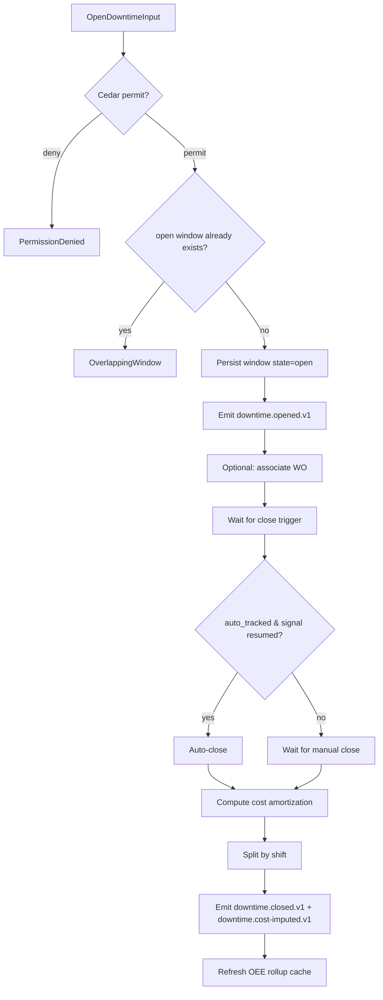

# IP-006: Domain layer for `downtime-window` — Planned + unplanned downtime with OEE driver

## A. Intent

Implements the **Downtime Window** domain — the record of every interval during which an equipment / functional-location is *not running* (or not running at design capacity). Downtime is the denominator side of **OEE (Overall Equipment Effectiveness)** per **VDMA 66412** + the Nakajima "Six Big Losses" framework: planned-downtime (PM windows), unplanned-downtime (breakdowns), setup/changeover, speed-loss, defects, startup-yield.

Mirrors SAP S/4HANA's downtime tracking via the `EQUI`-linked `PMSDO` table and the OM analytics views; SAP transactions `IH08` (downtime list), `IK17` (PM analytics), and the integration with Plant Connectivity / SAP DMC for auto-capture from SCADA. Industry-precedent equivalents: **IBM Maximo Downtime History (`DOWNTIMEHIST`)**, **Infor EAM Equipment Downtime**, **Oracle Fusion OEE module**, **IFS Cloud Equipment Downtime + OEE**, **GE Digital APM Reliability Centered Maintenance**, **PTC ThingWorx OEE app**, **Aveva Wonderware OEE**.

### A.1 Why downtime is non-trivial

1. **Planned vs unplanned classification.** Two windows on the same asset overlap differently: a planned-PM window that runs over becomes a "planned + unplanned-extension" hybrid. Classification must hold ground truth.
2. **OEE roll-up is hierarchical.** Plant-level OEE = weighted aggregate of process-unit OEE, which aggregates equipment OEE. Hierarchy joins via floc parent-path (IP-001 D-1).
3. **Six-big-losses taxonomy.** Each downtime row carries a reason-code mapped to: equipment-failure / setup-and-adjustment / idling-and-minor-stoppages / reduced-speed / defects-and-rework / startup-losses. Misclassification breaks OEE math.
4. **Cross-shift continuation.** A downtime that spans 23:00 → 06:00 crosses shifts; the row is one logical window but reports against both shifts.
5. **Cost amortization.** Production-loss cost = `downtime_minutes × throughput_rate × unit_margin`; finops cost is the operation-cost; both must be accounted separately.
6. **Auto-close vs manual-close.** Auto-detected downtime (SCADA signal drops to zero) auto-closes when signal returns; manual-tracked downtime requires technician close-out.

## B. Acceptance criteria

- **AC-1:** `OpenDowntimeWindowUseCase::execute(equip, start, kind, reason)` Cedar-gated; idempotent on `(tenant_id, dt_window_id)`.
- **AC-2:** `CloseDowntimeWindowUseCase::execute(dt_window_id, finish)` rejects close before `start`.
- **AC-3:** `ClassifyDowntimeUseCase::execute` validates reason-code against the six-big-losses taxonomy.
- **AC-4:** OEE roll-up: `OeeRollupUseCase::execute(floc, day)` aggregates equipment-level windows via floc parent-path; returns availability/performance/quality with derivation.
- **AC-5:** Overlap detection: opening a new downtime on an asset that already has an open one returns `OverlappingWindow`.
- **AC-6:** Cross-shift handling: window spanning shifts is reported against both shifts in proportion.
- **AC-7:** Auto-close: incoming `signal.equipment-running.v1` event from predictive-maintenance closes any auto-tracked open window for that equipment.
- **AC-8:** Cost amortization: emits `downtime.cost-imputed.v1` on close with computed production-loss + maintenance cost.
- **AC-9:** Cross-tenant load rejected.
- **AC-10:** Audit events emitted per §D-10.

## C. Verification

```bash
cargo test -p oya-plant-maintenance-downtime-window-domain -- open_window_happy_path
cargo test -p oya-plant-maintenance-downtime-window-domain -- close_before_start_rejected
cargo test -p oya-plant-maintenance-downtime-window-domain -- reason_outside_six_big_losses_rejected
cargo test -p oya-plant-maintenance-downtime-window-domain -- oee_rollup_hierarchical
cargo test -p oya-plant-maintenance-downtime-window-domain -- overlap_detection
cargo test -p oya-plant-maintenance-downtime-window-domain -- cross_shift_proportional
cargo test -p oya-plant-maintenance-downtime-window-domain -- auto_close_on_signal_resume
cargo test -p oya-plant-maintenance-downtime-window-domain -- cost_imputation_emitted
cargo test -p oya-plant-maintenance-downtime-window-domain -- cross_tenant_load_rejected
cargo test -p oya-plant-maintenance-downtime-window-domain -- planned_vs_unplanned_classification
```

## D. Detailed mechanics

### D-1. Data model

```sql
CREATE TABLE plant_maintenance.downtime_window (
    tenant_id       TEXT NOT NULL,
    dt_window_id    TEXT NOT NULL,
    equipment_id    TEXT,
    floc_id         TEXT,
    kind            TEXT NOT NULL CHECK (kind IN ('planned','unplanned','hybrid')),
    reason_category TEXT NOT NULL CHECK (reason_category IN
        ('equipment_failure','setup_changeover','idling_minor_stop','reduced_speed','defects_rework','startup_losses')),
    reason_subcode  TEXT,
    started_at      TIMESTAMPTZ NOT NULL,
    ended_at        TIMESTAMPTZ,
    auto_tracked    BOOLEAN NOT NULL DEFAULT FALSE,
    associated_wo_id TEXT,
    state           TEXT NOT NULL CHECK (state IN ('open','closed','adjusted')),
    production_loss_units NUMERIC(18,4),
    production_loss_cost  NUMERIC(18,4),
    maintenance_cost      NUMERIC(18,4),
    residency_pack  TEXT NOT NULL,
    hlc             TEXT NOT NULL,
    decision_id     UUID NOT NULL,
    PRIMARY KEY (tenant_id, dt_window_id),
    CHECK ((equipment_id IS NOT NULL) OR (floc_id IS NOT NULL)),
    CHECK (ended_at IS NULL OR ended_at >= started_at)
) PARTITION BY HASH (tenant_id);

CREATE TABLE plant_maintenance.downtime_shift_split (
    tenant_id     TEXT NOT NULL,
    dt_window_id  TEXT NOT NULL,
    shift_code    TEXT NOT NULL,
    shift_date    DATE NOT NULL,
    minutes       NUMERIC(8,2) NOT NULL,
    PRIMARY KEY (tenant_id, dt_window_id, shift_date, shift_code)
) PARTITION BY HASH (tenant_id);

CREATE TABLE plant_maintenance.oee_rollup_cache (
    tenant_id      TEXT NOT NULL,
    floc_id        TEXT NOT NULL,
    rollup_date    DATE NOT NULL,
    availability_pct NUMERIC(5,2) NOT NULL,
    performance_pct  NUMERIC(5,2) NOT NULL,
    quality_pct      NUMERIC(5,2) NOT NULL,
    oee_pct          NUMERIC(5,2) GENERATED ALWAYS AS
        ((availability_pct * performance_pct * quality_pct) / 10000.0) STORED,
    derivation_json JSONB NOT NULL,
    PRIMARY KEY (tenant_id, floc_id, rollup_date)
) PARTITION BY RANGE (rollup_date);
```

### D-2. Rust types

```rust
#[derive(Debug, Clone)]
pub struct DowntimeWindow {
    pub tenant_id:        TenantId,
    pub dt_window_id:     DtWindowId,
    pub anchor:           DtAnchor,                // Equipment | Floc
    pub kind:             DowntimeKind,
    pub reason_category:  SixBigLossesCategory,
    pub reason_subcode:   Option<String>,
    pub started_at:       DateTime<Utc>,
    pub ended_at:         Option<DateTime<Utc>>,
    pub auto_tracked:     bool,
    pub associated_wo_id: Option<WoId>,
    pub state:            DowntimeState,
    pub production_loss_units: Option<Decimal>,
    pub production_loss_cost:  Option<Decimal>,
    pub maintenance_cost:      Option<Decimal>,
    pub residency_pack:   ResidencyPack,
    pub hlc:              Hlc,
    pub decision_id:      DecisionId,
}

#[derive(Debug, Clone)]
pub enum DowntimeKind { Planned, Unplanned, Hybrid }

#[derive(Debug, Clone)]
pub enum SixBigLossesCategory {
    EquipmentFailure, SetupChangeover, IdlingMinorStop,
    ReducedSpeed, DefectsRework, StartupLosses,
}
```

### D-3. OEE roll-up math (VDMA 66412)

```rust
pub fn oee(planned_run_min: Decimal, downtime_min: Decimal,
           ideal_cycle_s: Decimal, actual_count: u64,
           good_count: u64, total_count: u64) -> OeeBreakdown {
    let availability = if planned_run_min.is_zero() { Decimal::ZERO }
                       else { (planned_run_min - downtime_min) / planned_run_min };
    let performance  = if planned_run_min.is_zero() || actual_count == 0 { Decimal::ZERO }
                       else {
                           let actual_min = Decimal::from(actual_count) * ideal_cycle_s / Decimal::from(60);
                           (actual_min / (planned_run_min - downtime_min)).min(Decimal::ONE)
                       };
    let quality = if total_count == 0 { Decimal::ZERO }
                  else { Decimal::from(good_count) / Decimal::from(total_count) };
    OeeBreakdown {
        availability_pct: availability * Decimal::from(100),
        performance_pct:  performance * Decimal::from(100),
        quality_pct:      quality * Decimal::from(100),
        oee_pct:          availability * performance * quality * Decimal::from(100),
    }
}
```

### D-4. Cedar context (open downtime)

```jsonc
{
  "principal": "oyatie::tenant::acme::user::shift-supervisor-7",
  "action":    "plant_maintenance::downtime::open",
  "resource":  "plant_maintenance::equipment::EQ-PUMP-0042",
  "context": {
    "tenant_id": "acme",
    "kind": "unplanned",
    "reason_category": "equipment_failure",
    "auto_tracked": false,
    "residency_pack": "global",
    "policy_bundle_version": "2026.05.20-r3",
    "byok_mode": "platform_default"
  }
}
```

### D-5. Workflow with decision branches



### D-6. AsyncAPI envelopes

| Channel | Trigger | Consumers |
|---|---|---|
| `plant-maintenance.downtime.opened.v1` | new window | dashboards, alerting, predictive-maintenance |
| `plant-maintenance.downtime.closed.v1` | window closed | analytics, oee-rollup, finops |
| `plant-maintenance.downtime.cost-imputed.v1` | post-close | oya-cloud-finops |
| `plant-maintenance.downtime.classified-changed.v1` | reclassify | audit |
| `plant-maintenance.oee.rollup-refreshed.v1` | rollup recompute | dashboards |

### D-7. Ontology projection

| SAP / Industry | Field | Oyatie Ontology |
|---|---|---|
| Equipment downtime | PMSDO.LOSS_MINS | DowntimeWindow.minutes |
| Reason code | PMRPO | DowntimeWindow.reason_category |
| Notification | QMEL | DowntimeWindow.associated_wo_id (via notification → WO) |
| OEE | derived | OeeRollup.oee_pct |
| Six losses | per Nakajima | DowntimeWindow.reason_category |

### D-8. SLO targets

| Operation | p50 | p95 | p99 | Throughput |
|---|---|---|---|---|
| `OpenDowntimeWindow` | 14 ms | 32 ms | 65 ms | 1.2 k req/s/cell |
| `CloseDowntimeWindow` | 25 ms | 60 ms | 120 ms | 800 req/s/cell |
| `OeeRollup` (per floc, 1 day) | 80 ms | 180 ms | 350 ms | 400 req/s/cell |
| `OeeRollup` (plant subtree, 1 month) | 1.2 s | 2.5 s | 4.5 s | 30 req/s/cell |
| `AutoCloseOnSignal` | 18 ms | 40 ms | 85 ms | 5 k req/s/cell |

### D-9. Audit-event registry

| Event class | Severity | Emitter |
|---|---|---|
| `EVT-PLANT_MAINTENANCE-DOWNTIME-OPENED` | informational | usecase |
| `EVT-PLANT_MAINTENANCE-DOWNTIME-CLOSED` | informational | usecase |
| `EVT-PLANT_MAINTENANCE-DOWNTIME-AUTO_CLOSED` | informational | usecase |
| `EVT-PLANT_MAINTENANCE-DOWNTIME-OVERLAPPING_REJECTED` | warning | usecase |
| `EVT-PLANT_MAINTENANCE-DOWNTIME-RECLASSIFIED` | informational | usecase |
| `EVT-PLANT_MAINTENANCE-DOWNTIME-CROSS_TENANT_REJECTED` | security | usecase |
| `EVT-PLANT_MAINTENANCE-OEE-ROLLUP_REFRESHED` | informational | scheduler |

### D-10. Failure modes & recovery

1. **`OverlappingWindow`** — concurrent supervisor + auto-tracker both open windows. Cedar denies second; merge UC available for legit hybrid case. Runbook `runbooks/downtime-overlap.md`.
2. **`SignalFlapping`** — equipment signal toggles rapidly. Debounce 30 s; only persistent transitions create window. Runbook `runbooks/signal-flap.md`.
3. **`OeeRollupStale`** — cache > 5 min stale. UI shows "as of" timestamp; on-demand refresh available; daily cron also refreshes. Runbook `runbooks/oee-cache-stale.md`.
4. **`ReasonCodeRetired`** — code referenced no longer in registry. Reject with active alternates listed. Runbook `runbooks/reason-code-stale.md`.
5. **`UnclosedAgedWindow`** — window open > 8 h without close. Auto-page supervisor; default-close at shift-end (configurable). Runbook `runbooks/aged-downtime.md`.
6. **`CrossShiftMath`** — split arithmetic produces negative minutes due to TZ glitch. Reject save; alert reliability engineer. Runbook `runbooks/cross-shift-tz.md`.

### D-11. Migration notes

Source vendor surfaces:

- **SAP S/4HANA**: `PMSDO` (PM downtime) + `EQUZ` (equipment time series) + `QMEL` (notifications) + OEE via SAP DMC analytics.
- **IBM Maximo**: `DOWNTIMEHIST` + `ASSETSTATUS` + KPI catalog.
- **Infor EAM**: `R5DOWNTIME` + `R5KPI`.
- **Oracle Fusion EAM**: `WIE_DOWNTIMES_VL` + OEE Cloud analytics.
- **GE Digital APM**: `MI_AVAILABILITY_*` family.

### D-12. Cross-µservice handoffs

| Direction | Counterparty | Surface |
|---|---|---|
| inbound | `predictive-maintenance` | AsyncAPI `signal.equipment-running.v1` (auto-close) |
| outbound | `oya-cloud-finops` | AsyncAPI `downtime.cost-imputed.v1` |
| outbound | `analytics` | AsyncAPI for OEE dashboard |
| outbound | `incident-management` | AsyncAPI on aged unplanned downtime |
| outbound | `ontology` | projection delta |
| inbound | `production-planning` | gRPC `prodplan.v1.GetThroughputRate` (for cost imputation) |

## E. Failure-mode summary

See D-10.

## F. Migration / rollback

Feature flag `plant_maintenance_downtime_v1`. Disable halts new opens; auto-close jobs continue.

## G. References

- ADR-0105, ADR-0244, ADR-0252, ADR-0263, ADR-0294, ADR-0297, ADR-0314..0316.
- VDMA 66412 (OEE definition).
- Nakajima — *Introduction to TPM* (1988).
- Benchmarks: SAP DMC OEE | IBM Maximo Downtime History | Infor EAM Equipment Downtime | Oracle Fusion OEE | IFS Cloud OEE | PTC ThingWorx OEE | Aveva Wonderware OEE.

## H. Out of scope

- KPI scorecard (IP-024), reliability decision logic (IP-023), MTBF/Weibull (IP-022), signal ingestion (IP-020).

— end IP-006 —
