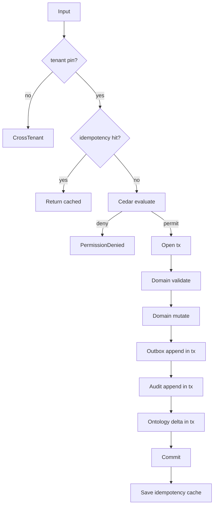

# IP-007: Use-case layer for `equipment-master` — Orchestration of domain + ports

## A. Intent

Implements the **use-case layer** (clean-architecture layer 4 per ADR-0105) on top of the IP-001 domain layer. Each use-case is the *single transactional unit* exposed by the equipment-master bounded context: it composes a single Cedar evaluation, ≥1 domain operation, ≥1 port (repository + outbox + audit), and a single transactional boundary. Use-cases are the only call surface the adapter / API layer is permitted to invoke (no domain-direct).

Mirrors the SAP transaction-shape: each SAP transaction (e.g., `IE01` "Create Equipment", `IE02` "Change Equipment", `IL02` "Change Functional Location") is one use-case-class with one input DTO + one output DTO.

Industry-precedent equivalents: Same hyperscaler analogs as IP-001 (AWS IoT TwinMaker entity-create, Azure Digital Twins create-twin) but at the application-service layer. Pattern lineage: Robert C. Martin clean-architecture "Use Case Interactor" + Hexagonal Architecture "primary port".

### A.1 Why the use-case layer is non-trivial

1. **Cedar evaluation is per use-case, not per write.** A `MoveEquipmentUseCase` evaluates *once* with the full context including pre-move and post-move floc; downstream domain ops execute under that single decision.
2. **Outbox semantics are tight.** Domain emits events to outbox; outbox flush is part of the same DB tx as the domain write (transactional-outbox pattern per Chris Richardson). No "best-effort" emit.
3. **Saga orchestration when cross-µservice.** `LinkSerialNumberUseCase` spans plant-maintenance + inventory-management; saga compensation must release the link if the second leg fails.
4. **Idempotency by `(tenant_id, business_key)`.** Each use-case takes an `idempotency_key`; retry within 24 h returns the same result without re-effect (Stripe-style).
5. **Defence-in-depth tenant pin.** Every use-case enforces `input.tenant_id == ctx.tenant_id == cedar.principal.tenant_id`. Three-way pin; any mismatch is `CrossTenant`.
6. **Observability hook is per use-case.** Every use-case opens one OTel span named `plant_maintenance.equipment.<use_case_name>`; emits a metric `pm_uc_duration_ms{usecase=...}`.

## B. Acceptance criteria

- **AC-1:** `CreateEquipmentUseCase`, `ChangeEquipmentUseCase`, `MoveEquipmentToFlocUseCase`, `RetireEquipmentUseCase`, `LinkSerialNumberUseCase`, `AttachCharacteristicUseCase`, `CreateFunctionalLocationUseCase`, `MoveFunctionalLocationUseCase` each implement the `UseCase<Input, Output>` trait.
- **AC-2:** Each use-case opens exactly one OTel span and emits exactly one metric.
- **AC-3:** Each use-case takes an `idempotency_key` and replays without re-effect within 24 h.
- **AC-4:** Cedar evaluation happens once per use-case before any side effect.
- **AC-5:** All outbox writes occur within the same DB tx as the domain write; tx rollback un-writes the outbox.
- **AC-6:** `LinkSerialNumberUseCase` implements the 2-step saga; compensation releases on failure.
- **AC-7:** Cross-tenant input is rejected before Cedar eval (defence-in-depth).
- **AC-8:** Per-use-case audit event is emitted; severity per §D-10 registry.
- **AC-9:** Soft-deletion ("retire") never deletes rows; all use-cases preserve audit trail.
- **AC-10:** Use-case errors are typed (`UseCaseError`); no `String` errors leak out.

## C. Verification

```bash
cargo test -p oya-plant-maintenance-equipment-master-usecase -- create_uc_happy_path
cargo test -p oya-plant-maintenance-equipment-master-usecase -- create_uc_idempotent_replay
cargo test -p oya-plant-maintenance-equipment-master-usecase -- create_uc_cross_tenant_rejected
cargo test -p oya-plant-maintenance-equipment-master-usecase -- move_uc_dag_validation
cargo test -p oya-plant-maintenance-equipment-master-usecase -- retire_uc_preserves_history
cargo test -p oya-plant-maintenance-equipment-master-usecase -- link_serial_saga_compensation
cargo test -p oya-plant-maintenance-equipment-master-usecase -- attach_char_class_schema_pinned
cargo test -p oya-plant-maintenance-equipment-master-usecase -- floc_create_parent_floc_required
cargo test -p oya-plant-maintenance-equipment-master-usecase -- floc_move_subtree_atomic
cargo test -p oya-plant-maintenance-equipment-master-usecase -- otel_span_emitted_per_uc
cargo test -p oya-plant-maintenance-equipment-master-usecase -- audit_event_emitted_per_uc
```

## D. Detailed mechanics

### D-1. Use-case trait

```rust
#[async_trait]
pub trait UseCase: Send + Sync {
    type Input;
    type Output;

    async fn execute(&self, input: Self::Input, ctx: RequestContext)
        -> Result<Self::Output, UseCaseError>;
}

pub struct RequestContext {
    pub tenant_id:      TenantId,
    pub principal_id:   PrincipalId,
    pub trace_id:       TraceId,
    pub idempotency_key: Option<IdempotencyKey>,
    pub residency_pack: ResidencyPack,
    pub policy_bundle_version: PolicyBundleVersion,
    pub byok_mode:      ByokMode,
}
```

### D-2. `CreateEquipmentUseCase` end-to-end

```rust
pub struct CreateEquipmentUseCase<E, F, C, O, A, S, ID, ON> {
    equipment_repo: E, floc_repo: F, cedar: C, outbox: O,
    audit: A, schema: S, idempo: ID, ontology: ON,
}

#[async_trait]
impl<E, F, C, O, A, S, ID, ON> UseCase for CreateEquipmentUseCase<E, F, C, O, A, S, ID, ON>
where
    E: EquipmentRepository, F: FlocRepository, C: CedarEvaluator,
    O: OutboxDispatcher, A: AuditEmitter, S: CharacteristicSchemaProvider,
    ID: IdempotencyStore, ON: OntologyDispatcher,
{
    type Input  = CreateEquipmentInput;
    type Output = EquipmentRef;

    #[tracing::instrument(skip(self), fields(uc = "create_equipment"))]
    async fn execute(&self, input: Self::Input, ctx: RequestContext)
        -> Result<Self::Output, UseCaseError>
    {
        // (1) Defence-in-depth tenant pin
        if input.tenant_id != ctx.tenant_id { return Err(UseCaseError::CrossTenant); }

        // (2) Idempotency replay
        if let Some(k) = &ctx.idempotency_key {
            if let Some(prior) = self.idempo.load::<EquipmentRef>(k).await? {
                return Ok(prior);
            }
        }

        // (3) Cedar evaluation (single call)
        let decision = self.cedar.evaluate(cedar_req_create_equipment(&input, &ctx)).await?;
        if !decision.is_permit() {
            return Err(UseCaseError::PermissionDenied { reason: decision.reasons() });
        }

        // (4) Tx + domain
        let tx = self.equipment_repo.begin_tx().await?;
        let floc = self.floc_repo.load(&input.tenant_id, &input.floc_id).await?
            .ok_or(UseCaseError::FlocMissing)?;
        if !matches!(floc.state, FlocState::Active) { return Err(UseCaseError::FlocInactive); }

        let schema = self.schema.schema_for_class(&input.equipment_class, /*latest*/ 0).await?;
        for ch in &input.characteristics {
            schema.validate(ch).map_err(UseCaseError::CharOutOfClass)?;
        }

        let eq = Equipment {
            tenant_id:        input.tenant_id.clone(),
            equipment_id:     input.equipment_id.clone(),
            floc_id:          input.floc_id.clone(),
            equipment_class:  input.equipment_class.clone(),
            serial_no:        input.serial_no.clone(),
            manufacturer:     input.manufacturer.clone(),
            model_no:         input.model_no.clone(),
            construction_year: input.construction_year,
            installation_date: input.installation_date,
            abc_indicator:    input.abc_indicator,
            cost_center:      input.cost_center.clone(),
            state:            EquipmentState::Active,
            residency_pack:   ctx.residency_pack.clone(),
            data_class:       input.data_class.unwrap_or(DataClass::Operational),
            hlc:              Hlc::now(),
            schema_version:   schema.version,
            decision_id:      decision.id(),
        };
        self.equipment_repo.save(&tx, &eq).await?;

        // (5) Outbox + audit + ontology (all inside tx)
        self.outbox.append(&tx, &equipment_created_event(&eq)).await?;
        self.audit.emit(&tx, AuditEntry::equipment_created(&eq, &decision)).await?;
        self.ontology.queue_delta(&tx, project_equipment(&eq)).await?;

        tx.commit().await?;

        let out = EquipmentRef { tenant_id: eq.tenant_id, equipment_id: eq.equipment_id, hlc: eq.hlc };
        if let Some(k) = &ctx.idempotency_key { self.idempo.save(k, &out, Duration::hours(24)).await?; }
        Ok(out)
    }
}
```

### D-3. `LinkSerialNumberUseCase` — 2-step saga

```rust
pub struct LinkSerialNumberUseCase<E, INV, C, A> { ... }

#[async_trait]
impl UseCase for LinkSerialNumberUseCase<...> {
    type Input  = LinkSerialInput;
    type Output = SerialLinkRef;

    async fn execute(&self, input: Self::Input, ctx: RequestContext) -> Result<SerialLinkRef, UseCaseError> {
        if input.tenant_id != ctx.tenant_id { return Err(UseCaseError::CrossTenant); }
        let decision = self.cedar.evaluate(cedar_req_link_serial(&input, &ctx)).await?;
        if !decision.is_permit() { return Err(UseCaseError::PermissionDenied { reason: decision.reasons() }); }

        // Step 1: inventory side
        let inv_link = self.inv.link_serial(&input).await
            .map_err(|e| UseCaseError::SagaStep1Failed(e.into()))?;

        // Step 2: plant-maintenance side
        let tx = self.equipment_repo.begin_tx().await?;
        match self.equipment_repo.set_serial(&tx, &input.tenant_id, &input.equipment_id, &input.serial_no).await {
            Ok(()) => {
                self.audit.emit(&tx, AuditEntry::serial_linked(&input)).await?;
                tx.commit().await?;
                Ok(SerialLinkRef { ..inv_link.into() })
            }
            Err(e) => {
                tx.rollback().await?;
                // compensation
                let _ = self.inv.release_serial_link(&input).await;
                Err(UseCaseError::SagaStep2FailedCompensated(e.into()))
            }
        }
    }
}
```

### D-4. Idempotency store

```rust
#[async_trait]
pub trait IdempotencyStore: Send + Sync {
    async fn load<T: DeserializeOwned + Send>(&self, key: &IdempotencyKey) -> Result<Option<T>, StoreError>;
    async fn save<T: Serialize + Send + Sync>(&self, key: &IdempotencyKey, value: &T, ttl: Duration) -> Result<(), StoreError>;
}
```

### D-5. Use-case catalog

| Use-case | SAP analog | Idempotency key | Cedar action |
|---|---|---|---|
| `CreateEquipmentUseCase` | IE01 | `(tenant, equipment_id)` | `plant_maintenance::equipment::create` |
| `ChangeEquipmentUseCase` | IE02 | `(tenant, equipment_id, change_seq)` | `plant_maintenance::equipment::change` |
| `MoveEquipmentToFlocUseCase` | IE02 | `(tenant, equipment_id, new_floc, hlc)` | `plant_maintenance::equipment::move` |
| `RetireEquipmentUseCase` | IE02 → status DCDR | `(tenant, equipment_id, retire_hlc)` | `plant_maintenance::equipment::retire` |
| `AttachCharacteristicUseCase` | IE02 char tab | `(tenant, equipment_id, char_name)` | `plant_maintenance::equipment::attach_char` |
| `LinkSerialNumberUseCase` | IQ08 | `(tenant, equipment_id, serial)` | `plant_maintenance::equipment::link_serial` |
| `CreateFunctionalLocationUseCase` | IL01 | `(tenant, floc_id)` | `plant_maintenance::floc::create` |
| `MoveFunctionalLocationUseCase` | IL02 | `(tenant, floc_id, new_parent, hlc)` | `plant_maintenance::floc::move` |

### D-6. Workflow



### D-7. AsyncAPI envelopes

The use-cases emit the same channel set as IP-001 (D-7). The use-case layer is the *only* writer to these channels; adapters MUST NOT emit directly.

### D-8. Ontology projection

The use-case calls `project_equipment(eq)` (IP-001 D-8) once per state-changing use-case; the delta is queued in `OntologyDispatcher` inside the same tx.

### D-9. SLO targets (use-case layer overhead)

The use-case layer adds Cedar + outbox + audit + ontology dispatch overhead on top of the domain layer (IP-001 D-9). Budget:

| Operation | Cedar | Outbox | Audit | Ontology | UC total budget |
|---|---|---|---|---|---|
| `CreateEquipmentUseCase` | 4 ms | 1 ms | 2 ms | 2 ms | +9 ms over domain |
| `MoveEquipmentToFlocUseCase` | 4 ms | 1 ms | 2 ms | 3 ms | +10 ms over domain |
| `LinkSerialNumberUseCase` (saga) | 4 ms | 1 ms | 2 ms | 1 ms | +8 ms + inventory gRPC RTT |
| `RetireEquipmentUseCase` | 4 ms | 1 ms | 2 ms | 2 ms | +9 ms over domain |

### D-10. Audit-event registry (use-case-emitted)

| Event class | Severity | Emitter |
|---|---|---|
| `EVT-PLANT_MAINTENANCE-EQUIPMENT_USECASE-CREATE_OK` | informational | usecase |
| `EVT-PLANT_MAINTENANCE-EQUIPMENT_USECASE-CHANGE_OK` | informational | usecase |
| `EVT-PLANT_MAINTENANCE-EQUIPMENT_USECASE-MOVE_OK` | informational | usecase |
| `EVT-PLANT_MAINTENANCE-EQUIPMENT_USECASE-RETIRE_OK` | informational | usecase |
| `EVT-PLANT_MAINTENANCE-EQUIPMENT_USECASE-LINK_SERIAL_OK` | informational | usecase |
| `EVT-PLANT_MAINTENANCE-EQUIPMENT_USECASE-SAGA_COMPENSATED` | warning | usecase |
| `EVT-PLANT_MAINTENANCE-EQUIPMENT_USECASE-IDEMPOTENT_REPLAY` | informational | usecase |
| `EVT-PLANT_MAINTENANCE-EQUIPMENT_USECASE-CROSS_TENANT_REJECTED` | security | usecase |

### D-11. Failure modes & recovery

1. **`OutboxAppendFailed`** — tx fails on outbox append. Whole tx rolls back; caller sees `Transient`. Retry with same idempotency key. Runbook `runbooks/outbox-failed.md`.
2. **`OntologyQueueFull`** — ontology dispatcher backpressure. Tx fails atomically; ontology + equipment stay consistent. Runbook `runbooks/ontology-backpressure.md`.
3. **`SagaStep2Failure`** — `LinkSerial` step 1 ok, step 2 fails. Step-1 compensation fires; caller sees `SagaStep2FailedCompensated`. Runbook `runbooks/saga-compensation.md`.
4. **`IdempotencyKeyReuse`** — same key, different input. Reject as `IdempotencyKeyConflict`. Runbook `runbooks/idempotency-conflict.md`.
5. **`CedarPolicyVersionMismatch`** — bundle version in ctx differs from active bundle at eval time. Reject; client refreshes context. Runbook `runbooks/cedar-bundle-mismatch.md`.
6. **`SchemaProviderUnavailable`** — characteristic schema service down. Best-effort: validate against last-known schema cached for ≤15 min; flag `schema_provider_degraded` audit. Runbook `runbooks/schema-provider-down.md`.

### D-12. Cross-µservice handoffs

Same as IP-001 D-13, with explicit ordering: identity (Cedar context enrich) → inventory (saga step 1) → equipment (saga step 2) → ontology + audit + outbox in tx → finops (deferred).

## E. Failure-mode summary

See D-11.

## F. Migration / rollback

Per-use-case feature flag (`plant_maintenance_<uc>_v1`). Use-cases switchable independently; domain layer (IP-001) remains live.

## G. References

- ADR-0105 (layer enum), ADR-0244, ADR-0252, ADR-0257, ADR-0263, ADR-0294, ADR-0297, ADR-0314..0316.
- Robert C. Martin, *Clean Architecture* (2017) — Use Case Interactor pattern.
- Chris Richardson, *Microservices Patterns* (2018) — Transactional Outbox, Saga.
- Stripe API idempotency-key documentation (canonical pattern).
- IP-001 (domain layer).

## H. Out of scope

- Adapter/REST surfaces (IP-013/014), integration tests (IP-015), maintenance-plan (IP-008).

— end IP-007 —
