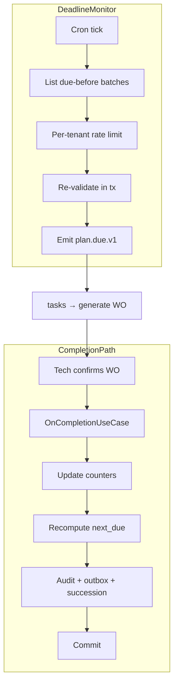

# IP-008: Use-case layer for `maintenance-plan` — Cycle-due, deadline monitor, completion

## A. Intent

Implements the **use-case layer** on the IP-002 domain. Each use-case is a single transactional unit composing Cedar evaluation + domain mutation + outbox + audit + ontology delta. The cron-driven deadline monitor and the cycle-due engine sit in this layer (the domain has the math; the use-case has the orchestration).

Industry-precedent equivalents: SAP PM `IP30` (deadline monitoring batch) is the canonical pattern; IBM Maximo `PMWOGEN` (PM Work Order Generator) cron job; Infor EAM `EAMPMGEN` job; Oracle Fusion Maintenance "Generate Forecast" ESS job.

### A.1 Why the use-case layer is non-trivial

1. **The deadline monitor is a sweep + emit, not per-record.** It scans all active plans on a 60s cadence and decides which have crossed their next-due tolerance. Per-tenant pacing required to avoid hotspots.
2. **Cycle-due math must be deterministic across replicas.** The `next_due` computation runs in many use-case workers; all must agree. Pure function over plan state; no clock-of-runner drift.
3. **Completion fan-out spans 4 systems.** Plan completion triggers: counter reset, successor-plan seeding, predictive-maintenance model retrain trigger, analytics emit. All inside one tx.
4. **Critical equipment dual-approve flow.** `PublishCriticalPlanUseCase` requires the second-approver path; a `pending_dual_approval` state holds the plan until the second principal signs off.
5. **Replay-after-clock-drift.** If a worker's clock skews +1h, deadline-monitor pre-fires plans. Guard: re-check `next_due` inside the tx against the DB clock, not the worker's clock.
6. **Idempotency of due-firing.** The `plan.due.v1` envelope MUST be idempotent on `(plan_id, due_epoch)` — multiple workers may see the same plan as due at the same epoch.

## B. Acceptance criteria

- **AC-1:** Use-case set: `CreateMaintenancePlanUseCase`, `ChangeMaintenancePlanUseCase`, `ActivateMaintenancePlanUseCase`, `ScheduleNextDueUseCase`, `OnCompletionUseCase`, `DeactivateMaintenancePlanUseCase`, `PublishCriticalPlanUseCase`, `RunDeadlineMonitorSweep`.
- **AC-2:** Each use-case opens one OTel span; emits one metric `pm_uc_duration_ms{usecase=...}`.
- **AC-3:** `ScheduleNextDueUseCase` is pure-function over plan state; deterministic across replicas.
- **AC-4:** `OnCompletionUseCase` fans out atomically: counter reset + audit + outbox + successor seed.
- **AC-5:** `RunDeadlineMonitorSweep` paces per-tenant (max 200/s emits) and re-validates `next_due` against DB inside tx.
- **AC-6:** `PublishCriticalPlanUseCase` enforces dual-approver; second-approver != first-approver; both Cedar-permits captured in `decision_id_chain`.
- **AC-7:** Idempotency on `plan.due.v1` keyed by `(plan_id, scheduled_due_epoch)`.
- **AC-8:** Cross-tenant inputs rejected before Cedar evaluation.
- **AC-9:** Use-case errors typed; per-use-case audit events per §D-10.
- **AC-10:** `OnCompletionUseCase` invokes `compose_dafs_on_day`-style next-due re-compute even when meter-based counters present.

## C. Verification

```bash
cargo test -p oya-plant-maintenance-maintenance-plan-usecase -- create_uc_happy_path
cargo test -p oya-plant-maintenance-maintenance-plan-usecase -- change_uc_audit_emitted
cargo test -p oya-plant-maintenance-maintenance-plan-usecase -- activate_uc_dual_check
cargo test -p oya-plant-maintenance-maintenance-plan-usecase -- schedule_next_due_deterministic
cargo test -p oya-plant-maintenance-maintenance-plan-usecase -- completion_uc_fan_out
cargo test -p oya-plant-maintenance-maintenance-plan-usecase -- deactivate_preserves_open_wos
cargo test -p oya-plant-maintenance-maintenance-plan-usecase -- publish_critical_dual_approver_required
cargo test -p oya-plant-maintenance-maintenance-plan-usecase -- deadline_monitor_paced_per_tenant
cargo test -p oya-plant-maintenance-maintenance-plan-usecase -- deadline_monitor_revalidates_inside_tx
cargo test -p oya-plant-maintenance-maintenance-plan-usecase -- due_envelope_idempotent
cargo test -p oya-plant-maintenance-maintenance-plan-usecase -- cross_tenant_rejected
```

## D. Detailed mechanics

### D-1. Use-case catalog

| Use-case | SAP analog | Idempotency key | Cedar action |
|---|---|---|---|
| `CreateMaintenancePlanUseCase` | IP01 | `(tenant, plan_id)` | `plant_maintenance::plan::create` |
| `ChangeMaintenancePlanUseCase` | IP02 | `(tenant, plan_id, change_seq)` | `plant_maintenance::plan::change` |
| `ActivateMaintenancePlanUseCase` | IP02 status | `(tenant, plan_id, activate_hlc)` | `plant_maintenance::plan::activate` |
| `PublishCriticalPlanUseCase` | IP02 + workflow approval | `(tenant, plan_id, version)` | `plant_maintenance::plan::publish_critical` |
| `ScheduleNextDueUseCase` | computed in IP10 | n/a (pure fn) | n/a |
| `OnCompletionUseCase` | IP04 completion confirm | `(tenant, plan_id, completion_at)` | `plant_maintenance::plan::on_completion` |
| `RunDeadlineMonitorSweep` | IP30 | n/a (cron) | `plant_maintenance::scheduler::sweep` |
| `DeactivateMaintenancePlanUseCase` | IP02 → status DCDR | `(tenant, plan_id, deactivate_hlc)` | `plant_maintenance::plan::deactivate` |

### D-2. `OnCompletionUseCase` end-to-end

```rust
#[async_trait]
impl UseCase for OnCompletionUseCase<...> {
    type Input  = OnCompletionInput;
    type Output = OnCompletionRef;

    #[tracing::instrument(skip(self), fields(uc = "plan_on_completion"))]
    async fn execute(&self, input: Self::Input, ctx: RequestContext) -> Result<Self::Output, UseCaseError> {
        if input.tenant_id != ctx.tenant_id { return Err(UseCaseError::CrossTenant); }
        let decision = self.cedar.evaluate(cedar_req_on_completion(&input, &ctx)).await?;
        if !decision.is_permit() { return Err(UseCaseError::PermissionDenied { reason: decision.reasons() }); }

        let tx = self.plan_repo.begin_tx().await?;
        let mut plan = self.plan_repo.load(&input.tenant_id, &input.plan_id).await?
            .ok_or(UseCaseError::PlanMissing)?;

        // Apply completion reading: update last_actual + last_completed_at for each counter
        for c in plan.counters.iter_mut() {
            if let Some(r) = input.counter_readings.get(&c.counter_id) {
                c.last_actual = Some(*r);
                c.last_completed_at = Some(input.completion_at);
            }
        }
        // Recompute next_due per counter (pure fn)
        for c in plan.counters.iter_mut() {
            c.next_due_at = next_due_for_counter(&plan, c, input.completion_at);
        }
        self.plan_repo.save(&tx, &plan).await?;

        // Audit + outbox in same tx
        let audit_row = CompletionAudit {
            counter_readings: input.counter_readings.clone(),
            next_due_computed: plan.counters.iter().map(|c| (c.counter_id.clone(), c.next_due_at)).collect(),
        };
        self.plan_repo.append_completion_audit(&tx, &plan.plan_id, &audit_row).await?;
        self.outbox.append(&tx, &plan_completed_event(&plan, &input)).await?;
        self.audit.emit(&tx, AuditEntry::plan_on_completion(&plan, &decision)).await?;

        // Successor seeding
        if let Some(successor) = &plan.succession_plan_id {
            self.outbox.append(&tx, &plan_succession_seeded_event(&plan.tenant_id, successor)).await?;
        }
        tx.commit().await?;

        Ok(OnCompletionRef { plan_id: plan.plan_id, completion_hlc: Hlc::now() })
    }
}
```

### D-3. `RunDeadlineMonitorSweep` — paced cron use-case

```rust
pub struct RunDeadlineMonitorSweep<R, O, A, RL> {
    plan_repo: R, outbox: O, audit: A, rate_limiter: RL,
}

impl<R, O, A, RL> RunDeadlineMonitorSweep<R, O, A, RL>
where R: MaintenancePlanRepository, O: OutboxDispatcher, A: AuditEmitter, RL: PerTenantRateLimiter
{
    pub async fn tick(&self, now: DateTime<Utc>) -> Result<SweepReport, UseCaseError> {
        let mut report = SweepReport::default();
        let mut cursor = None;
        loop {
            let batch = self.plan_repo.list_due_before(now, 500, cursor).await?;
            if batch.is_empty() { break; }
            for plan in &batch {
                self.rate_limiter.acquire(&plan.tenant_id, 1).await?;     // per-tenant pacing
                let tx = self.plan_repo.begin_tx().await?;
                // Re-validate inside tx against DB clock
                let live = self.plan_repo.load(&plan.tenant_id, &plan.plan_id).await?
                    .ok_or(UseCaseError::PlanMissing)?;
                let earliest = live.counters.iter().filter_map(|c| c.next_due_at).min();
                if earliest.map_or(false, |d| d <= now) {
                    let evt = plan_due_event(&live, earliest.unwrap());
                    self.outbox.append(&tx, &evt).await?;
                    self.audit.emit(&tx, AuditEntry::plan_due_emitted(&live, &evt)).await?;
                    report.fired += 1;
                } else {
                    report.skipped += 1;
                }
                tx.commit().await?;
            }
            cursor = batch.last().map(|p| p.plan_id.clone());
        }
        Ok(report)
    }
}
```

### D-4. Dual-approver `PublishCriticalPlanUseCase`

```rust
#[async_trait]
impl UseCase for PublishCriticalPlanUseCase<...> {
    type Input  = PublishCriticalInput;
    type Output = PublishRef;

    async fn execute(&self, input: Self::Input, ctx: RequestContext) -> Result<PublishRef, UseCaseError> {
        if input.tenant_id != ctx.tenant_id { return Err(UseCaseError::CrossTenant); }
        if input.first_approver == input.second_approver {
            return Err(UseCaseError::DualApproverSelf);
        }
        let d1 = self.cedar.evaluate(cedar_req_publish_critical(&input, &input.first_approver, &ctx)).await?;
        let d2 = self.cedar.evaluate(cedar_req_publish_critical(&input, &input.second_approver, &ctx)).await?;
        if !(d1.is_permit() && d2.is_permit()) {
            return Err(UseCaseError::PermissionDenied {
                reason: format!("first: {:?} second: {:?}", d1.reasons(), d2.reasons()),
            });
        }
        let tx = self.plan_repo.begin_tx().await?;
        let mut plan = self.plan_repo.load(&input.tenant_id, &input.plan_id).await?
            .ok_or(UseCaseError::PlanMissing)?;
        plan.state = PlanState::Active;
        plan.hlc = Hlc::now();
        plan.decision_id = decision_chain_id(&d1, &d2);
        self.plan_repo.save(&tx, &plan).await?;
        self.outbox.append(&tx, &plan_critical_published_event(&plan, &d1, &d2)).await?;
        self.audit.emit(&tx, AuditEntry::plan_critical_published(&plan, &d1, &d2)).await?;
        tx.commit().await?;
        Ok(PublishRef { plan_id: plan.plan_id, decision_chain: plan.decision_id })
    }
}
```

### D-5. Cedar context (on-completion)

```jsonc
{
  "principal": "oyatie::tenant::acme::user::maintenance-tech-77",
  "action":    "plant_maintenance::plan::on_completion",
  "resource":  "plant_maintenance::plan::PM-PUMP-A-0042",
  "context": {
    "tenant_id": "acme",
    "completion_at": "2026-05-20T14:32:00Z",
    "counter_readings_kinds": ["calendar_days","running_hours"],
    "residency_pack": "global+us-osha-psm",
    "policy_bundle_version": "2026.05.20-r3",
    "byok_mode": "platform_default"
  }
}
```

### D-6. Workflow



### D-7. AsyncAPI envelopes

Use-cases emit the IP-002 D-8 channel set. The deadline monitor is the *only* writer of `plan.due.v1`; the completion use-case is the *only* writer of `plan.completed.v1`.

### D-8. SLO targets

| Operation | p50 | p95 | p99 | Throughput |
|---|---|---|---|---|
| `CreateMaintenancePlanUseCase` (single-cycle) | 25 ms | 60 ms | 120 ms | 500 req/s/cell |
| `OnCompletionUseCase` (with successor seed) | 35 ms | 80 ms | 160 ms | 1.2 k req/s/cell |
| `PublishCriticalPlanUseCase` (dual approver) | 70 ms | 160 ms | 320 ms | 200 req/s/cell |
| `RunDeadlineMonitorSweep` (1000 plans/min) | 6 s/cycle | 12 s/cycle | 22 s/cycle | every 60 s cron |

### D-9. Audit-event registry

| Event class | Severity | Emitter |
|---|---|---|
| `EVT-PLANT_MAINTENANCE-PLAN_USECASE-CREATE_OK` | informational | usecase |
| `EVT-PLANT_MAINTENANCE-PLAN_USECASE-CRITICAL_PUBLISHED_DUAL` | informational | usecase |
| `EVT-PLANT_MAINTENANCE-PLAN_USECASE-ON_COMPLETION_OK` | informational | usecase |
| `EVT-PLANT_MAINTENANCE-PLAN_USECASE-SUCCESSION_SEEDED` | informational | usecase |
| `EVT-PLANT_MAINTENANCE-PLAN_USECASE-DEADLINE_SWEEP_RAN` | informational | scheduler |
| `EVT-PLANT_MAINTENANCE-PLAN_USECASE-DUAL_APPROVER_SELF` | warning | usecase |
| `EVT-PLANT_MAINTENANCE-PLAN_USECASE-IDEMPOTENT_REPLAY` | informational | usecase |
| `EVT-PLANT_MAINTENANCE-PLAN_USECASE-CROSS_TENANT_REJECTED` | security | usecase |

### D-10. Failure modes & recovery

1. **`ClockSkewPreFire`** — worker clock skew pre-fires plans. Defence: re-validate `next_due` inside tx using DB `now()`. Detected via `pre_fire_skipped_count` metric.
2. **`RateLimiterStarvation`** — one huge tenant starves others. Per-tenant fair-share queue (max 200/s/tenant); global cap. Runbook `runbooks/rate-limiter-starvation.md`.
3. **`SuccessorMissing`** — successor plan was retired between create and on-completion. Emit `plan_succession_seeded` with `successor_missing` flag; reliability engineer resolves. Runbook `runbooks/succession-missing.md`.
4. **`DualApproverConcurrent`** — both approvers click "approve" simultaneously. Optimistic write — first wins; second sees `AlreadyPublished`. Runbook `runbooks/dual-approver-race.md`.
5. **`OutboxDrainLag`** — outbox drains slower than emit; `plan.due.v1` accumulates. Backpressure to deadline monitor; pause new emits at 5× steady-state queue depth. Runbook `runbooks/outbox-drain-lag.md`.
6. **`CedarBundleDriftBetweenApprovers`** — first approver's eval used bundle vN; second's vN+1. Reject as `BundleDrift`; both re-eval against vN+1. Runbook `runbooks/cedar-bundle-drift.md`.

### D-11. Migration notes

Migration uses the SAP IP30 export path: `MPLA + MPOS + MMPT` joined into a per-plan JSON; the use-case `CreateMaintenancePlanUseCase` is invoked per row with `idempotency_key = (tenant, plan_id)`. Replay-safe.

### D-12. Cross-µservice handoffs

Same as IP-002 D-14, with the use-case layer as the only emitter side.

## E. Failure-mode summary

See D-10.

## F. Migration / rollback

Per-use-case feature flag. Deadline monitor kill-switch `plant_maintenance_deadline_monitor_v1` halts new emissions instantly; existing WOs in flight unaffected.

## G. References

- ADR-0105, ADR-0244, ADR-0252, ADR-0257, ADR-0263, ADR-0294, ADR-0297, ADR-0314..0316.
- SAP `IP30` deadline-monitoring transaction documentation.
- IBM Maximo `PMWOGEN` job.
- IP-002 (domain layer).
- Chris Richardson, *Microservices Patterns* — transactional outbox + saga.

## H. Out of scope

- Domain math (IP-002), work-order generation (lives in `tasks` µservice + IP-003 path), predictive baselines (IP-021), KPI scorecard (IP-024).

— end IP-008 —
