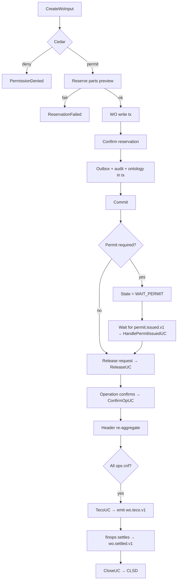

# IP-009: Use-case layer for `work-order` — 11-state orchestration + sagas

## A. Intent

Use-case orchestration on the IP-003 domain. Each WO lifecycle transition is a use-case that composes Cedar evaluation + state-machine transition + ports + cross-µservice saga (reservation, permit, dispatch, settlement). Mirrors SAP `PM-WOC` transactions one-to-one: `IW31` create / `IW32` change / `IW41` confirm / `CO11N` goods movement / `IW8W` settlement.

Industry-precedent equivalents: Same as IP-003 — SAP `PM-WOC`, IBM Maximo Work Order Tracking, Infor EAM, Oracle Fusion Maintenance. Use-case shape lineage: clean-architecture Interactor + Saga (Chris Richardson) + State-Machine-as-Use-Case (Vaughn Vernon DDD).

### A.1 Why the use-case layer is non-trivial

1. **The state machine has 11 states and 25 named transitions.** Each transition is its own use-case-class with its own Cedar permit; conflating them creates permission ambiguity.
2. **Reservation saga is multi-step + compensating.** `CreateWorkOrderUseCase` either commits both WO + reservation or both abort. `CancelWorkOrderUseCase` is the compensating side.
3. **Permit gating is asynchronous.** WO can be `WAIT_PERMIT` for hours/days waiting on PM-WCM (IP-017); the use-case layer handles the inbound `permit.issued.v1` event by transitioning to `REL`.
4. **Operation confirmation re-aggregates header status.** Every confirm fires `aggregate_header_state(ops)`; if header state changes, emit `wo.state-changed.v1`. Latch on idempotency.
5. **Settlement is finops-coordinated.** `TecoWorkOrderUseCase` emits `wo.teco.v1`; finops responds with `wo.settled.v1`; only then can `CloseWorkOrderUseCase` advance to CLSD.
6. **Breakdown WOs skip planning.** CM-BREAKDOWN WOs auto-release on create (no planning step), with audit indicating "emergency path".

## B. Acceptance criteria

- **AC-1:** Use-case set: `CreateWorkOrderUseCase`, `CreateBreakdownWorkOrderUseCase`, `ChangeWorkOrderUseCase`, `ReleaseWorkOrderUseCase`, `ConfirmOperationUseCase`, `PutOnHoldUseCase`, `TecoWorkOrderUseCase`, `CloseWorkOrderUseCase`, `CancelWorkOrderUseCase`, `ReopenWorkOrderUseCase` (per ADR-0263 audit), `HandlePermitIssuedUseCase`.
- **AC-2:** Each use-case opens 1 OTel span; emits 1 metric.
- **AC-3:** State machine: `allowed_transition(from, to)` checked inside tx before any side effect.
- **AC-4:** Reservation saga: WO + reservation atomic; either both commit or both roll back.
- **AC-5:** Permit-wait: WO sits in `WAIT_PERMIT` until `permit.issued.v1` arrives; `HandlePermitIssuedUseCase` advances to `REL`.
- **AC-6:** Operation confirm idempotent on `(wo_id, op_no, confirm_seq)`.
- **AC-7:** Settlement: `CloseWorkOrderUseCase` blocks until `wo.settled.v1` arrives from finops.
- **AC-8:** Breakdown WOs auto-release; planning step skipped with audit `breakdown_path_used`.
- **AC-9:** Cancel use-case compensates reservation (calls `inventory.v1.ReleaseReservation`) and dispatch (`dispatch.cancelled.v1`).
- **AC-10:** Audit events emitted per §D-10.

## C. Verification

```bash
cargo test -p oya-plant-maintenance-work-order-usecase -- create_uc_happy_path
cargo test -p oya-plant-maintenance-work-order-usecase -- create_breakdown_auto_release
cargo test -p oya-plant-maintenance-work-order-usecase -- create_with_reservation_saga
cargo test -p oya-plant-maintenance-work-order-usecase -- create_saga_compensates_on_failure
cargo test -p oya-plant-maintenance-work-order-usecase -- release_skill_matrix_check
cargo test -p oya-plant-maintenance-work-order-usecase -- permit_wait_until_issued
cargo test -p oya-plant-maintenance-work-order-usecase -- confirm_idempotent
cargo test -p oya-plant-maintenance-work-order-usecase -- confirm_aggregates_header_state
cargo test -p oya-plant-maintenance-work-order-usecase -- teco_emits_settlement_trigger
cargo test -p oya-plant-maintenance-work-order-usecase -- close_blocks_until_settled
cargo test -p oya-plant-maintenance-work-order-usecase -- cancel_compensates_reservation
cargo test -p oya-plant-maintenance-work-order-usecase -- invalid_transition_rejected
cargo test -p oya-plant-maintenance-work-order-usecase -- cross_tenant_rejected
```

## D. Detailed mechanics

### D-1. Use-case catalog

| Use-case | SAP analog | Idempotency key | Cedar action |
|---|---|---|---|
| `CreateWorkOrderUseCase` | IW31 | `(tenant, wo_id)` | `plant_maintenance::wo::create` |
| `CreateBreakdownWorkOrderUseCase` | IW21 (notification) → IW31 | `(tenant, breakdown_id)` | `plant_maintenance::wo::create_breakdown` |
| `ChangeWorkOrderUseCase` | IW32 | `(tenant, wo_id, change_seq)` | `plant_maintenance::wo::change` |
| `ReleaseWorkOrderUseCase` | IW32 status REL | `(tenant, wo_id, release_hlc)` | `plant_maintenance::wo::release` |
| `ConfirmOperationUseCase` | IW41 / IW42N | `(tenant, wo_id, op_no, confirm_seq)` | `plant_maintenance::wo::confirm_operation` |
| `PutOnHoldUseCase` | IW32 status HOLD | `(tenant, wo_id, hold_hlc)` | `plant_maintenance::wo::hold` |
| `TecoWorkOrderUseCase` | IW32 status TECO | `(tenant, wo_id, teco_hlc)` | `plant_maintenance::wo::teco` |
| `CloseWorkOrderUseCase` | IW32 status CLSD + IW8W | `(tenant, wo_id, close_hlc)` | `plant_maintenance::wo::close` |
| `CancelWorkOrderUseCase` | IW32 status DLT | `(tenant, wo_id, cancel_hlc)` | `plant_maintenance::wo::cancel` |
| `ReopenWorkOrderUseCase` | IW32 status CLSD→TECO | `(tenant, wo_id, reopen_hlc)` | `plant_maintenance::wo::reopen` |
| `HandlePermitIssuedUseCase` | event handler (no SAP analog) | `(tenant, wo_id, permit_id)` | `plant_maintenance::wo::on_permit_issued` |

### D-2. `CreateWorkOrderUseCase` with reservation saga

```rust
#[async_trait]
impl UseCase for CreateWorkOrderUseCase<W, INV, C, O, A, ID, ON> {
    type Input = CreateWoInput;
    type Output = WoRef;

    #[tracing::instrument(skip(self), fields(uc = "create_wo"))]
    async fn execute(&self, input: Self::Input, ctx: RequestContext) -> Result<WoRef, UseCaseError> {
        if input.tenant_id != ctx.tenant_id { return Err(UseCaseError::CrossTenant); }
        if let Some(k) = &ctx.idempotency_key {
            if let Some(prior) = self.idempo.load::<WoRef>(k).await? { return Ok(prior); }
        }
        let decision = self.cedar.evaluate(cedar_req_create_wo(&input, &ctx)).await?;
        if !decision.is_permit() { return Err(UseCaseError::PermissionDenied { reason: decision.reasons() }); }

        // Step 1: Reservation saga (if components present)
        let reservation = if !input.components.is_empty() {
            Some(self.inv.reserve_for_wo_preview(&input).await
                 .map_err(|e| UseCaseError::ReservationFailed { cause: e.into() })?)
        } else { None };

        // Step 2: WO write
        let tx = self.wo_repo.begin_tx().await?;
        let initial_state = if input.permit_required { WoState::WaitPermit }
                            else if reservation.is_some() { WoState::WaitPart }
                            else                          { WoState::Crtd };
        let wo = WorkOrder { state: initial_state, decision_id: decision.id(), hlc: Hlc::now(), ..input.into() };

        if let Err(e) = self.wo_repo.save(&tx, &wo).await {
            if let Some(r) = &reservation {
                let _ = self.inv.release_reservation(&r.reservation_id).await; // compensate
            }
            return Err(UseCaseError::DbError(e));
        }

        // Step 3: confirm reservation (move from preview to committed)
        if let Some(r) = &reservation {
            self.inv.confirm_reservation(r.reservation_id.clone()).await
                .map_err(|e| UseCaseError::ReservationFailed { cause: e.into() })?;
        }

        self.outbox.append(&tx, &wo_created_event(&wo, reservation.as_ref())).await?;
        self.audit.emit(&tx, AuditEntry::wo_created(&wo, &decision)).await?;
        self.ontology.queue_delta(&tx, project_wo(&wo)).await?;
        tx.commit().await?;

        let out = WoRef { tenant_id: wo.tenant_id, wo_id: wo.wo_id, hlc: wo.hlc };
        if let Some(k) = &ctx.idempotency_key { self.idempo.save(k, &out, Duration::hours(24)).await?; }
        Ok(out)
    }
}
```

### D-3. `ConfirmOperationUseCase` with header re-aggregation

```rust
#[async_trait]
impl UseCase for ConfirmOperationUseCase<W, C, O, A> {
    type Input = ConfirmOperationInput;
    type Output = ConfirmRef;

    async fn execute(&self, input: Self::Input, ctx: RequestContext) -> Result<ConfirmRef, UseCaseError> {
        if input.tenant_id != ctx.tenant_id { return Err(UseCaseError::CrossTenant); }
        let decision = self.cedar.evaluate(cedar_req_confirm_operation(&input, &ctx)).await?;
        if !decision.is_permit() { return Err(UseCaseError::PermissionDenied { reason: decision.reasons() }); }

        let tx = self.wo_repo.begin_tx().await?;
        // Idempotency: (wo_id, op_no, confirm_seq)
        if self.wo_repo.confirm_exists(&tx, &input.tenant_id, &input.wo_id, input.op_no, input.confirm_seq).await? {
            tx.commit().await?;
            return Ok(ConfirmRef::existing(&input));   // idempotent replay
        }

        let mut wo = self.wo_repo.load(&tx, &input.tenant_id, &input.wo_id).await?
            .ok_or(UseCaseError::WoMissing)?;
        let prev_state = wo.state.clone();

        self.wo_repo.append_confirm(&tx, &input).await?;
        let updated_ops = self.wo_repo.refresh_operations(&tx, &input.tenant_id, &input.wo_id).await?;
        wo.operations = updated_ops;
        let new_header = aggregate_header_state(&wo.operations, /*permit*/ PermitState::NotRequired);

        if new_header != prev_state {
            if !allowed_transition(prev_state.clone(), new_header.clone()) {
                return Err(UseCaseError::InvalidTransition { from: prev_state, to: new_header });
            }
            wo.state = new_header.clone();
            self.wo_repo.save(&tx, &wo).await?;
            self.outbox.append(&tx, &wo_state_changed_event(&wo, prev_state, new_header)).await?;
        }
        self.outbox.append(&tx, &wo_operation_confirmed_event(&wo, &input)).await?;
        self.audit.emit(&tx, AuditEntry::operation_confirmed(&wo, &input, &decision)).await?;
        tx.commit().await?;

        Ok(ConfirmRef::new(&input, &wo))
    }
}
```

### D-4. `HandlePermitIssuedUseCase` — async permit-gate completion

```rust
#[async_trait]
impl UseCase for HandlePermitIssuedUseCase<W, O, A> {
    type Input = PermitIssuedEvent;
    type Output = ();

    async fn execute(&self, ev: Self::Input, ctx: RequestContext) -> Result<(), UseCaseError> {
        if ev.tenant_id != ctx.tenant_id { return Err(UseCaseError::CrossTenant); }
        let tx = self.wo_repo.begin_tx().await?;
        let mut wo = self.wo_repo.load(&tx, &ev.tenant_id, &ev.wo_id).await?
            .ok_or(UseCaseError::WoMissing)?;
        if wo.state != WoState::WaitPermit { return Err(UseCaseError::InvalidTransition { from: wo.state, to: WoState::Rel }); }
        if !allowed_transition(wo.state.clone(), WoState::Rel) {
            return Err(UseCaseError::InvalidTransition { from: wo.state, to: WoState::Rel });
        }
        wo.state = WoState::Rel;
        wo.hlc = Hlc::now();
        self.wo_repo.save(&tx, &wo).await?;
        self.outbox.append(&tx, &wo_released_event(&wo)).await?;
        self.audit.emit(&tx, AuditEntry::permit_gate_cleared(&wo, &ev)).await?;
        tx.commit().await?;
        Ok(())
    }
}
```

### D-5. Cedar context (release with skill matrix)

```jsonc
{
  "principal": "oyatie::tenant::acme::user::maintenance-planner-3",
  "action":    "plant_maintenance::wo::release",
  "resource":  "plant_maintenance::work_order::WO-2026-049182",
  "context": {
    "tenant_id": "acme",
    "wo_type": "PM",
    "abc_criticality": "B",
    "operation_skill_codes": ["MECH-L2","HOT-WORK"],
    "candidate_technicians": ["tech-77","tech-103"],
    "permit_required": false,
    "data_class": "operational",
    "policy_bundle_version": "2026.05.20-r3",
    "residency_pack": "global+us-osha-psm",
    "byok_mode": "platform_default"
  }
}
```

### D-6. Workflow



### D-7. AsyncAPI envelopes

Use-cases emit the IP-003 D-8 channel set. The use-case layer is the only writer.

### D-8. SLO targets

| Operation | p50 | p95 | p99 | Throughput |
|---|---|---|---|---|
| `CreateWorkOrderUseCase` (no parts) | 28 ms | 65 ms | 130 ms | 400 req/s/cell |
| `CreateWorkOrderUseCase` (with reservation saga) | 80 ms | 180 ms | 380 ms | 150 req/s/cell |
| `ReleaseWorkOrderUseCase` | 42 ms | 95 ms | 190 ms | 350 req/s/cell |
| `ConfirmOperationUseCase` (with header transition) | 30 ms | 70 ms | 140 ms | 1.0 k req/s/cell |
| `TecoWorkOrderUseCase` | 25 ms | 58 ms | 120 ms | 600 req/s/cell |
| `CloseWorkOrderUseCase` | 20 ms | 45 ms | 95 ms | 600 req/s/cell |
| `HandlePermitIssuedUseCase` | 22 ms | 50 ms | 100 ms | 800 req/s/cell |

### D-9. Audit-event registry

| Event class | Severity | Emitter |
|---|---|---|
| `EVT-PLANT_MAINTENANCE-WO_USECASE-CREATE_OK` | informational | usecase |
| `EVT-PLANT_MAINTENANCE-WO_USECASE-BREAKDOWN_PATH_USED` | informational | usecase |
| `EVT-PLANT_MAINTENANCE-WO_USECASE-RESERVATION_COMPENSATED` | warning | usecase |
| `EVT-PLANT_MAINTENANCE-WO_USECASE-RELEASE_OK` | informational | usecase |
| `EVT-PLANT_MAINTENANCE-WO_USECASE-PERMIT_GATE_CLEARED` | informational | usecase |
| `EVT-PLANT_MAINTENANCE-WO_USECASE-OPERATION_CONFIRMED` | informational | usecase |
| `EVT-PLANT_MAINTENANCE-WO_USECASE-HEADER_STATE_CHANGED` | informational | usecase |
| `EVT-PLANT_MAINTENANCE-WO_USECASE-TECO_OK` | informational | usecase |
| `EVT-PLANT_MAINTENANCE-WO_USECASE-CLOSE_OK` | informational | usecase |
| `EVT-PLANT_MAINTENANCE-WO_USECASE-CANCEL_COMPENSATED` | informational | usecase |
| `EVT-PLANT_MAINTENANCE-WO_USECASE-INVALID_TRANSITION` | warning | usecase |
| `EVT-PLANT_MAINTENANCE-WO_USECASE-CROSS_TENANT_REJECTED` | security | usecase |

### D-10. Failure modes & recovery

1. **`ReservationCommitButWoWriteFailed`** — confirm reservation OK then DB write fails. Saga: release reservation, return error. Runbook `runbooks/wo-saga-rollback.md`.
2. **`PermitNeverArrives`** — WO stuck in `WAIT_PERMIT` > 7 days. Page reliability engineer; cancel UC available. Runbook `runbooks/permit-stale.md`.
3. **`LateConfirmAfterTeco`** — confirm arrives after TECO. Accept in 24h grace; reject thereafter. Runbook `runbooks/late-confirm.md`.
4. **`SettlementNeverArrives`** — `wo.settled.v1` never arrives from finops. Close UC blocks; ops team investigates finops drain. Runbook `runbooks/settlement-stale.md`.
5. **`OutboxBackpressure`** — high WO emit rate fills outbox. Use-case writes succeed; outbox drains slow. Throttle dispatch to relax. Runbook `runbooks/wo-outbox-backpressure.md`.
6. **`IdempotencyKeyConflict`** — same key, different payload. Reject `IdempotencyKeyConflict`. Runbook `runbooks/idempotency-conflict.md`.

### D-11. Migration notes

Per-tenant migration script invokes `CreateWorkOrderUseCase` per SAP `AUFK` row with idempotency_key = `(tenant, AUFNR)`. Operations from `AFVC` and components from `RESB` join into the input.

### D-12. Cross-µservice handoffs

Same as IP-003 D-14. Use-case layer is the only writer; saga calls are inventory + identity (skill matrix) + finops (settlement).

## E. Failure-mode summary

See D-10.

## F. Migration / rollback

Per-use-case feature flags. Reservation saga can be disabled (`plant_maintenance_wo_reservation_saga_v1`) to allow no-parts WO creation if inventory degrades.

## G. References

- ADR-0105, ADR-0244, ADR-0252, ADR-0257, ADR-0263, ADR-0294, ADR-0297, ADR-0314..0316.
- IP-003 (domain layer).
- SAP `PM-WOC` documentation.
- Chris Richardson, *Microservices Patterns* — Saga + Transactional Outbox.

## H. Out of scope

- Dispatch (IP-005/011), permit-to-work (IP-017), reservation domain (IP-004), settlement (lives in finops).

— end IP-009 —
