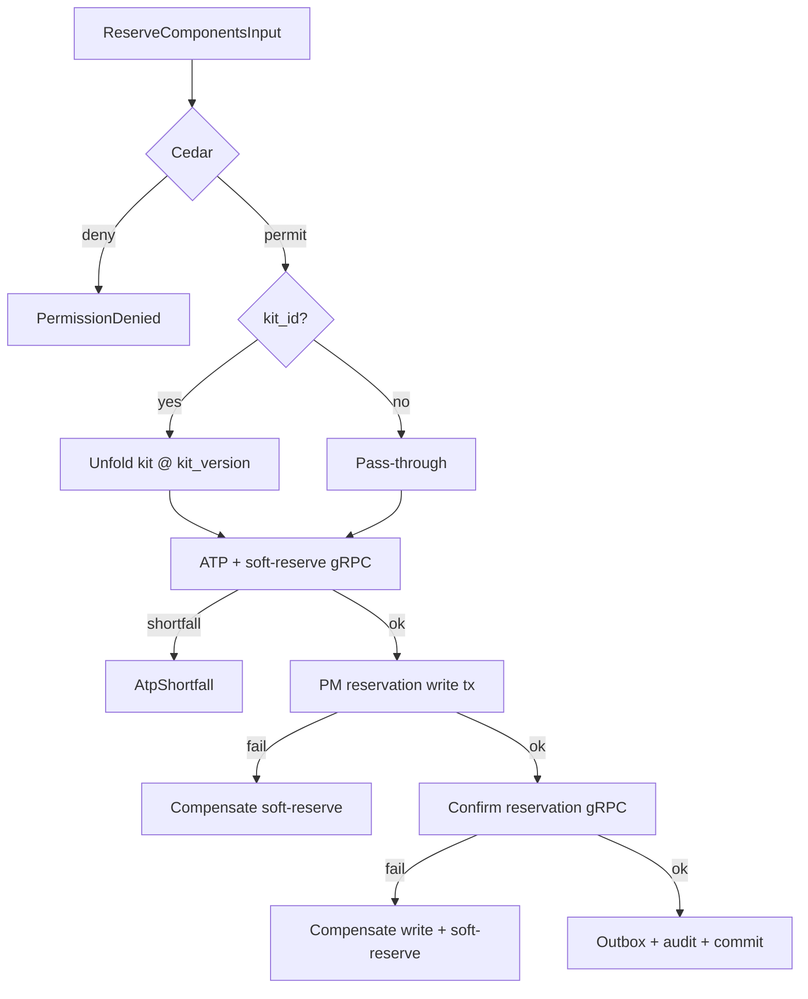

# IP-010: Use-case layer for `spare-part-reservation` — ATP saga + goods movement orchestration

## A. Intent

Use-case layer on the IP-004 domain. Each reservation lifecycle event (create, partial-issue, full-issue, cancel, release-on-wo-retire) is a use-case that composes Cedar evaluation + ATP check + inventory gRPC + DB write + outbox + audit. Mirrors SAP transactions `MB21` (create reservation), `MB22` (change), `CO11N` (goods movement to PM order), with idempotency guarantees absent in legacy ERP.

Industry-precedent equivalents: SAP `MB*` transaction series, IBM Maximo `MATRECTRANS` flows, Infor EAM reservation interactor, Oracle Fusion Inventory `INV_ATP_PUB`, IFS Cloud `INVENTORY_RESERVATION` API. Hyperscaler analog: Amazon DynamoDB conditional writes for "reserve-then-commit" semantics; Stripe PaymentIntent confirm/cancel as the bookkeeping shape.

### A.1 Why the use-case layer is non-trivial

1. **ATP saga is multi-leg.** Step 1: inventory ATP check + soft-reservation. Step 2: PM-side reservation write. Step 3: inventory commit. Failure at any leg compensates priors.
2. **Goods-movement posting must align with finops.** `CommitGoodsMovementUseCase` emits `goods-movement-261` to inventory; inventory emits `inventory.consumed.v1`; finops imputes cost. Three-party choreography.
3. **Partial-issue tolerance Cedar permit.** Within tolerance → permit by default; outside tolerance → requires `over_issue` Cedar permit (supervisor approver).
4. **Cancellation rebound.** WO cancel → ReleaseReservationUseCase → inventory rebound. The rebound MUST be atomic; partial rebound is forbidden.
5. **Kit unfold deterministic.** Same kit_id at same kit_version unfolds to the same item list across replicas; kit-revision changes are versioned.
6. **Cross-tenant defence-in-depth.** All 5 use-cases enforce three-way tenant pin (input + ctx + Cedar principal).

## B. Acceptance criteria

- **AC-1:** Use-case set: `ReserveComponentsUseCase`, `ChangeReservationUseCase`, `CommitGoodsMovementUseCase`, `OverIssueUseCase`, `CancelReservationUseCase`, `ReleaseReservationOnWoRetireUseCase`, `RebatchReservationUseCase`.
- **AC-2:** Each use-case opens 1 OTel span; emits 1 metric.
- **AC-3:** `ReserveComponentsUseCase` saga: 3-step with compensation on any step failure.
- **AC-4:** `CommitGoodsMovementUseCase` idempotent on `(reservation_id, item_no, movement_seq)`.
- **AC-5:** Partial-issue within `issue_tolerance_pct`: permit-by-default. Outside tolerance: `OverIssueUseCase` required with Cedar `over_issue`.
- **AC-6:** `CancelReservationUseCase` rebounds inventory atomically; never partial.
- **AC-7:** `ReleaseReservationOnWoRetireUseCase` sums issued and releases remainder; emits `reservation.released.v1`.
- **AC-8:** Cross-tenant input rejected before Cedar.
- **AC-9:** Kit-version pinned at create; revisions force re-reserve (not in-place mutate).
- **AC-10:** Audit events per §D-9.

## C. Verification

```bash
cargo test -p oya-plant-maintenance-spare-part-reservation-usecase -- reserve_uc_saga_happy_path
cargo test -p oya-plant-maintenance-spare-part-reservation-usecase -- reserve_uc_step1_failure_no_compensation_needed
cargo test -p oya-plant-maintenance-spare-part-reservation-usecase -- reserve_uc_step2_failure_compensates_step1
cargo test -p oya-plant-maintenance-spare-part-reservation-usecase -- reserve_uc_step3_failure_compensates_steps_1_and_2
cargo test -p oya-plant-maintenance-spare-part-reservation-usecase -- commit_goods_movement_idempotent
cargo test -p oya-plant-maintenance-spare-part-reservation-usecase -- partial_issue_within_tolerance_ok
cargo test -p oya-plant-maintenance-spare-part-reservation-usecase -- partial_issue_outside_tolerance_requires_over_issue_uc
cargo test -p oya-plant-maintenance-spare-part-reservation-usecase -- over_issue_with_cedar_permit_ok
cargo test -p oya-plant-maintenance-spare-part-reservation-usecase -- cancel_rebounds_atomically
cargo test -p oya-plant-maintenance-spare-part-reservation-usecase -- release_on_wo_retire_sums_issued
cargo test -p oya-plant-maintenance-spare-part-reservation-usecase -- kit_version_pinned
cargo test -p oya-plant-maintenance-spare-part-reservation-usecase -- cross_tenant_rejected
```

## D. Detailed mechanics

### D-1. Use-case catalog

| Use-case | SAP analog | Idempotency key | Cedar action |
|---|---|---|---|
| `ReserveComponentsUseCase` | MB21 | `(tenant, reservation_id)` | `plant_maintenance::reservation::create` |
| `ChangeReservationUseCase` | MB22 | `(tenant, reservation_id, change_seq)` | `plant_maintenance::reservation::change` |
| `CommitGoodsMovementUseCase` | CO11N / MIGO | `(tenant, reservation_id, item_no, movement_seq)` | `plant_maintenance::reservation::commit_movement` |
| `OverIssueUseCase` | MIGO with deviation | `(tenant, reservation_id, item_no, over_issue_seq)` | `plant_maintenance::reservation::over_issue` |
| `CancelReservationUseCase` | MB22 status cancel | `(tenant, reservation_id, cancel_hlc)` | `plant_maintenance::reservation::cancel` |
| `ReleaseReservationOnWoRetireUseCase` | event handler | `(tenant, wo_id, retire_hlc)` | `plant_maintenance::reservation::release` |
| `RebatchReservationUseCase` | MB22 batch change | `(tenant, reservation_id, item_no, rebatch_seq)` | `plant_maintenance::reservation::rebatch` |

### D-2. `ReserveComponentsUseCase` 3-step saga

```rust
#[async_trait]
impl UseCase for ReserveComponentsUseCase<R, INV, C, O, A, K> {
    type Input = ReserveComponentsInput;
    type Output = ReservationRef;

    #[tracing::instrument(skip(self), fields(uc = "reserve_components"))]
    async fn execute(&self, input: Self::Input, ctx: RequestContext) -> Result<ReservationRef, UseCaseError> {
        if input.tenant_id != ctx.tenant_id { return Err(UseCaseError::CrossTenant); }
        let decision = self.cedar.evaluate(cedar_req_reserve(&input, &ctx)).await?;
        if !decision.is_permit() { return Err(UseCaseError::PermissionDenied { reason: decision.reasons() }); }

        // Unfold kit if present
        let items = if let Some(kit_id) = &input.kit_id {
            let kit = self.kit_resolver.unfold(&input.tenant_id, kit_id).await?;
            merge_explicit_with_kit(input.items.clone(), kit, input.kit_version)?
        } else {
            input.items.clone()
        };

        // Step 1: ATP check + soft-reservation in inventory
        let inv_soft = self.inv.atp_and_soft_reserve(&input.tenant_id, &items).await
            .map_err(|e| UseCaseError::ReservationFailed { cause: e.into() })?;

        // Step 2: persist PM-side reservation row
        let tx = self.repo.begin_tx().await?;
        let mut reservation = Reservation::from_input(&input, &items, decision.id(), Hlc::now());
        reservation.state = ReservationState::Active;
        if let Err(e) = self.repo.save(&tx, &reservation).await {
            tx.rollback().await?;
            let _ = self.inv.release_soft_reservation(&inv_soft.soft_id).await;   // compensate step 1
            return Err(UseCaseError::DbError(e));
        }

        // Step 3: convert soft → hard reservation in inventory
        if let Err(e) = self.inv.confirm_reservation(inv_soft.soft_id.clone()).await {
            tx.rollback().await?;
            let _ = self.inv.release_soft_reservation(&inv_soft.soft_id).await;
            return Err(UseCaseError::ReservationFailed { cause: e.into() });
        }

        // Final commit
        self.outbox.append(&tx, &reservation_created_event(&reservation, &inv_soft)).await?;
        self.audit.emit(&tx, AuditEntry::reservation_created(&reservation, &decision)).await?;
        tx.commit().await?;

        Ok(ReservationRef { reservation_id: reservation.reservation_id, hlc: reservation.hlc })
    }
}
```

### D-3. `CommitGoodsMovementUseCase` with tolerance gate

```rust
#[async_trait]
impl UseCase for CommitGoodsMovementUseCase<R, INV, C, O, A> {
    type Input = CommitGoodsMovementInput;
    type Output = MovementRef;

    async fn execute(&self, input: Self::Input, ctx: RequestContext) -> Result<MovementRef, UseCaseError> {
        if input.tenant_id != ctx.tenant_id { return Err(UseCaseError::CrossTenant); }
        let tx = self.repo.begin_tx().await?;
        let reservation = self.repo.load(&tx, &input.tenant_id, &input.reservation_id).await?
            .ok_or(UseCaseError::ReservationMissing)?;
        let item = reservation.items.iter().find(|i| i.item_no == input.item_no)
            .ok_or(UseCaseError::ItemMissing)?;

        // Idempotency
        if self.repo.movement_exists(&tx, &input.reservation_id, input.item_no, input.movement_seq).await? {
            tx.commit().await?;
            return Ok(MovementRef::existing(&input));
        }

        // Tolerance gate
        let deviation = ((input.actual_qty - item.planned_qty).abs() / item.planned_qty) * Decimal::from(100);
        if deviation > reservation.issue_tolerance_pct {
            return Err(UseCaseError::OverIssueRequiresPermit { deviation });
        }
        let decision = self.cedar.evaluate(cedar_req_commit_movement(&input, &ctx)).await?;
        if !decision.is_permit() { return Err(UseCaseError::PermissionDenied { reason: decision.reasons() }); }

        // gRPC inventory: post goods-movement-261
        self.inv.post_goods_movement(&GoodsMovement {
            tenant_id: input.tenant_id.clone(),
            reservation_id: input.reservation_id.clone(),
            item_no: input.item_no,
            qty: input.actual_qty,
            movement_type: MovementType::M261,
            posted_at: input.posted_at,
            posted_by: input.technician_id.clone(),
        }).await.map_err(|e| UseCaseError::InventoryFailed(e.into()))?;

        self.repo.update_item_issue(&tx, &input.reservation_id, input.item_no, input.actual_qty).await?;
        self.outbox.append(&tx, &reservation_partial_issue_event(&reservation, &input)).await?;
        self.audit.emit(&tx, AuditEntry::goods_movement_committed(&reservation, &input, &decision)).await?;
        tx.commit().await?;

        Ok(MovementRef { reservation_id: input.reservation_id, item_no: input.item_no, movement_seq: input.movement_seq })
    }
}
```

### D-4. `CancelReservationUseCase` rebound

```rust
#[async_trait]
impl UseCase for CancelReservationUseCase<R, INV, C, O, A> {
    type Input = CancelReservationInput;
    type Output = ();

    async fn execute(&self, input: Self::Input, ctx: RequestContext) -> Result<(), UseCaseError> {
        if input.tenant_id != ctx.tenant_id { return Err(UseCaseError::CrossTenant); }
        let decision = self.cedar.evaluate(cedar_req_cancel_reservation(&input, &ctx)).await?;
        if !decision.is_permit() { return Err(UseCaseError::PermissionDenied { reason: decision.reasons() }); }

        let tx = self.repo.begin_tx().await?;
        let mut reservation = self.repo.load(&tx, &input.tenant_id, &input.reservation_id).await?
            .ok_or(UseCaseError::ReservationMissing)?;
        if matches!(reservation.state, ReservationState::Cancelled) {
            tx.commit().await?;
            return Ok(()); // already-cancelled, idempotent
        }
        reservation.state = ReservationState::Cancelled;
        reservation.hlc = Hlc::now();
        self.repo.save(&tx, &reservation).await?;
        self.inv.release_reservation(&reservation.reservation_id).await
            .map_err(|e| UseCaseError::InventoryFailed(e.into()))?;
        self.outbox.append(&tx, &reservation_cancelled_event(&reservation)).await?;
        self.audit.emit(&tx, AuditEntry::reservation_cancelled(&reservation, &decision)).await?;
        tx.commit().await?;
        Ok(())
    }
}
```

### D-5. Cedar context (over-issue)

```jsonc
{
  "principal": "oyatie::tenant::acme::user::shift-supervisor-7",
  "action":    "plant_maintenance::reservation::over_issue",
  "resource":  "plant_maintenance::reservation::RES-2026-1098273:item:2",
  "context": {
    "tenant_id": "acme",
    "wo_id": "WO-2026-049182",
    "material_id": "MAT-LUBE-7F",
    "planned_qty": "10.00",
    "actual_qty": "15.00",
    "deviation_pct": "50.0",
    "tolerance_pct": "5.0",
    "supervisor_approver": "supervisor-12",
    "data_class": "operational",
    "policy_bundle_version": "2026.05.20-r3",
    "residency_pack": "global",
    "byok_mode": "platform_default"
  }
}
```

### D-6. Workflow



### D-7. AsyncAPI envelopes

Use-cases emit the IP-004 D-7 channel set. The use-case layer is the only writer.

### D-8. SLO targets

| Operation | p50 | p95 | p99 | Throughput |
|---|---|---|---|---|
| `ReserveComponentsUseCase` (1 item) | 50 ms | 110 ms | 220 ms | 600 req/s/cell |
| `ReserveComponentsUseCase` (kit 8 items) | 130 ms | 280 ms | 580 ms | 200 req/s/cell |
| `CommitGoodsMovementUseCase` | 28 ms | 65 ms | 130 ms | 1.2 k req/s/cell |
| `OverIssueUseCase` | 35 ms | 80 ms | 160 ms | 200 req/s/cell |
| `CancelReservationUseCase` | 40 ms | 90 ms | 180 ms | 500 req/s/cell |
| `ReleaseReservationOnWoRetireUseCase` | 22 ms | 50 ms | 100 ms | 800 req/s/cell |

### D-9. Audit-event registry

| Event class | Severity | Emitter |
|---|---|---|
| `EVT-PLANT_MAINTENANCE-RESERVATION_USECASE-RESERVE_OK` | informational | usecase |
| `EVT-PLANT_MAINTENANCE-RESERVATION_USECASE-SAGA_COMPENSATED` | warning | usecase |
| `EVT-PLANT_MAINTENANCE-RESERVATION_USECASE-COMMIT_MOVEMENT_OK` | informational | usecase |
| `EVT-PLANT_MAINTENANCE-RESERVATION_USECASE-OVER_ISSUE_PERMITTED` | warning | usecase |
| `EVT-PLANT_MAINTENANCE-RESERVATION_USECASE-OVER_ISSUE_DENIED` | warning | usecase |
| `EVT-PLANT_MAINTENANCE-RESERVATION_USECASE-CANCEL_OK` | informational | usecase |
| `EVT-PLANT_MAINTENANCE-RESERVATION_USECASE-RELEASE_ON_RETIRE` | informational | usecase |
| `EVT-PLANT_MAINTENANCE-RESERVATION_USECASE-CROSS_TENANT_REJECTED` | security | usecase |

### D-10. Failure modes & recovery

1. **`SagaStep3FailedAfterDbCommit`** — DB write committed but inventory confirm fails. NOT possible: write happens after confirm in this design. Documented inverted ordering. Runbook `runbooks/saga-design-invariant.md`.
2. **`InventoryGrpcTimeout`** — inventory degraded. Reservation use-case fails fast; client retries with idempotency key. Runbook `runbooks/inventory-grpc-timeout.md`.
3. **`OverIssueRequiresPermitButNoSupervisor`** — outside-tolerance issue with no available supervisor in Cedar. Goods movement rejected; technician notified. Runbook `runbooks/over-issue-no-supervisor.md`.
4. **`KitVersionDrift`** — kit unfolded at v1 but reservation references v1; user later changes to v2. Reservation NOT mutated; new use-case `RebatchReservationUseCase` re-reserves at v2 with compensation of v1. Runbook `runbooks/kit-version-drift.md`.
5. **`PartialIssueAfterCancel`** — late goods movement arrives after cancel. Reject; technician must reverse. Runbook `runbooks/late-issue-after-cancel.md`.
6. **`InventoryEventualConsistency`** — inventory ATP shows stock that's already soft-reserved elsewhere. Confirm step fails; saga compensates; client retries. Runbook `runbooks/inventory-double-soft.md`.

### D-11. Migration notes

Migration script iterates SAP `RESB` rows and invokes `ReserveComponentsUseCase` with idempotency-key `(tenant, RSNUM-RSPOS)`. Replay-safe.

### D-12. Cross-µservice handoffs

Same as IP-004 D-13. Use-case is the only writer; inventory gRPC + procurement + finops are the consumers.

## E. Failure-mode summary

See D-10.

## F. Migration / rollback

Per-use-case feature flag. Saga compensation is always reachable even if downstream µservices degrade (kill-switch).

## G. References

- ADR-0105, ADR-0244, ADR-0252, ADR-0263, ADR-0294, ADR-0297, ADR-0314..0316.
- IP-004 (domain layer).
- SAP `MB`/`MIGO` documentation; SAP Note 117215 (reservation handling).
- Chris Richardson, *Microservices Patterns* — Saga + Compensating Transaction.

## H. Out of scope

- Inventory master (lives in inventory-management), MRP linkage (IP-019), serial-pinning (lives in inventory-management).

— end IP-010 —
