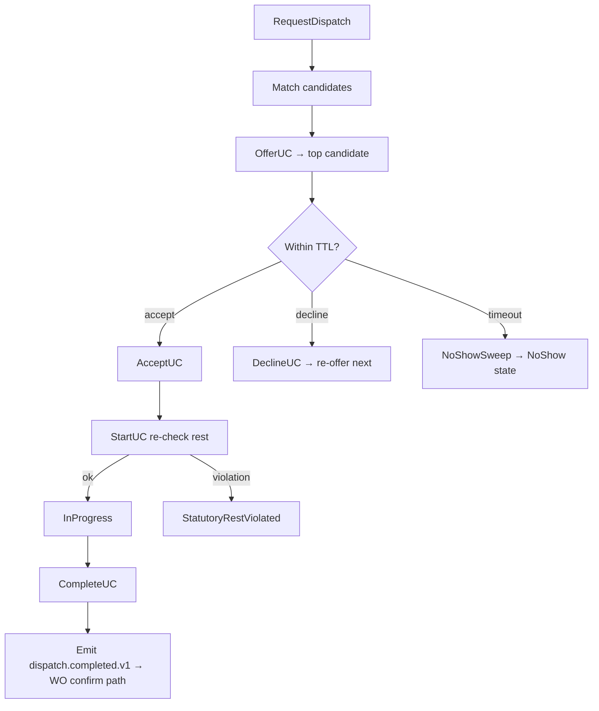

# IP-011: Use-case layer for `technician-dispatch` — Match, offer, accept, no-show sweep

## A. Intent

Use-case orchestration on IP-005 domain. Each dispatch event (request, offer, accept/decline, start, complete, no-show, reassign, cancel) is a use-case that composes Cedar evaluation + skill-matrix lookup (identity gRPC) + shift-roster lookup (workplace-integration gRPC) + DB write + outbox + audit. Mirrors SAP MRS `/MRSS/PLBOSRV` dispatch board + the per-action workflow nodes therein.

Industry-precedent equivalents: Same as IP-005 — SAP MRS, IBM Maximo Scheduler + Mobile, Oracle Field Service, IFS Cloud FSM, ServiceNow FSM, Salesforce Field Service, Dynamics 365 Field Service. Use-case shape lineage: same clean-architecture Interactor + saga (no rollback for "offer/accept" — instead, decline-and-re-offer chains are explicit use-cases).

### A.1 Why the use-case layer is non-trivial

1. **Offer-accept handshake is stateful.** Use-case must persist the offer with TTL; the accept use-case is a separate use-case that closes the offer. TTL expiry is a cron-driven `NoShowSweep` use-case.
2. **Skill-matrix lookups must be fresh at offer time.** Caching profiles risks expired-cert dispatch. Use-case calls identity gRPC at every offer.
3. **Crew dispatch atomic.** N members locked simultaneously or none. Saga shape: if one member declines, full release.
4. **Statutory rest re-checked at start.** Tech may have been offered yesterday for a job that starts today. Use-case re-checks rest hours at `dispatch.in-progress.v1` time.
5. **Reassignment chain auditable.** Every reassign records the prior assignee, reason, and decision-id-chain. Forensic trail.
6. **Cross-tenant defence-in-depth.** Same three-way pin pattern.

## B. Acceptance criteria

- **AC-1:** Use-case set: `RequestDispatchUseCase`, `OfferDispatchUseCase`, `AcceptOfferUseCase`, `DeclineOfferUseCase`, `StartDispatchUseCase`, `CompleteDispatchUseCase`, `NoShowSweepUseCase`, `ReassignDispatchUseCase`, `CancelDispatchUseCase`, `HandleSelfPickupUseCase`.
- **AC-2:** Each use-case opens 1 OTel span; emits 1 metric.
- **AC-3:** `OfferDispatchUseCase` calls identity at offer time (no caching > 60s).
- **AC-4:** `AcceptOfferUseCase` re-checks offer TTL inside tx; expired → reject.
- **AC-5:** `StartDispatchUseCase` re-checks statutory rest at start (residency pack drives floor).
- **AC-6:** `ReassignDispatchUseCase` chains decision_ids; audit captures prior assignee.
- **AC-7:** `NoShowSweepUseCase` per-tenant paced (max 100 sweeps/s/tenant); cron 5min.
- **AC-8:** Crew dispatch atomic: if any member can't be offered, release all.
- **AC-9:** Cross-tenant input rejected.
- **AC-10:** Audit events per §D-9.

## C. Verification

```bash
cargo test -p oya-plant-maintenance-technician-dispatch-usecase -- request_uc_filters_feasible
cargo test -p oya-plant-maintenance-technician-dispatch-usecase -- offer_uc_calls_identity_fresh
cargo test -p oya-plant-maintenance-technician-dispatch-usecase -- accept_uc_ttl_expiry
cargo test -p oya-plant-maintenance-technician-dispatch-usecase -- decline_uc_re_offers_next
cargo test -p oya-plant-maintenance-technician-dispatch-usecase -- start_uc_rest_recheck
cargo test -p oya-plant-maintenance-technician-dispatch-usecase -- complete_uc_emits_to_wo_confirm
cargo test -p oya-plant-maintenance-technician-dispatch-usecase -- no_show_sweep_paced
cargo test -p oya-plant-maintenance-technician-dispatch-usecase -- reassign_chains_decision_ids
cargo test -p oya-plant-maintenance-technician-dispatch-usecase -- crew_atomic_offer
cargo test -p oya-plant-maintenance-technician-dispatch-usecase -- self_pickup_skill_verified
cargo test -p oya-plant-maintenance-technician-dispatch-usecase -- cross_tenant_rejected
```

## D. Detailed mechanics

### D-1. Use-case catalog

| Use-case | SAP / FSM analog | Idempotency key | Cedar action |
|---|---|---|---|
| `RequestDispatchUseCase` | MRS demand create | `(tenant, dispatch_id)` | `plant_maintenance::dispatch::request` |
| `OfferDispatchUseCase` | MRS assignment offer | `(tenant, dispatch_id, offer_seq)` | `plant_maintenance::dispatch::offer` |
| `AcceptOfferUseCase` | mobile-app accept | `(tenant, dispatch_id, accept_hlc)` | `plant_maintenance::dispatch::accept` |
| `DeclineOfferUseCase` | mobile-app decline | `(tenant, dispatch_id, decline_hlc)` | `plant_maintenance::dispatch::decline` |
| `StartDispatchUseCase` | clock-on | `(tenant, dispatch_id, start_hlc)` | `plant_maintenance::dispatch::start` |
| `CompleteDispatchUseCase` | clock-off | `(tenant, dispatch_id, complete_hlc)` | `plant_maintenance::dispatch::complete` |
| `NoShowSweepUseCase` | cron only | n/a (cron) | `plant_maintenance::scheduler::no_show_sweep` |
| `ReassignDispatchUseCase` | MRS re-assign | `(tenant, dispatch_id, reassign_seq)` | `plant_maintenance::dispatch::reassign` |
| `CancelDispatchUseCase` | MRS cancel | `(tenant, dispatch_id, cancel_hlc)` | `plant_maintenance::dispatch::cancel` |
| `HandleSelfPickupUseCase` | mobile pull-claim | `(tenant, dispatch_id, pickup_hlc)` | `plant_maintenance::dispatch::self_pickup` |

### D-2. `OfferDispatchUseCase` with fresh identity lookup

```rust
#[async_trait]
impl UseCase for OfferDispatchUseCase<D, IDC, C, O, A> {
    type Input = OfferDispatchInput;
    type Output = OfferRef;

    #[tracing::instrument(skip(self), fields(uc = "offer_dispatch"))]
    async fn execute(&self, input: Self::Input, ctx: RequestContext) -> Result<OfferRef, UseCaseError> {
        if input.tenant_id != ctx.tenant_id { return Err(UseCaseError::CrossTenant); }
        let decision = self.cedar.evaluate(cedar_req_offer(&input, &ctx)).await?;
        if !decision.is_permit() { return Err(UseCaseError::PermissionDenied { reason: decision.reasons() }); }

        // Fresh identity lookup (no cache > 60s allowed)
        let candidates = self.identity.list_qualified_technicians(
            &input.tenant_id, &input.work_center, &input.required_skills,
            &input.required_certs, input.planned_start,
        ).await.map_err(|e| UseCaseError::IdentityFailed(e.into()))?;

        let ranked = rank_candidates(candidates, &input.required_skills, &input.required_certs,
                                     input.planned_start, &input.floc_id, &ctx.residency_pack);
        let top = ranked.into_iter().next().ok_or(UseCaseError::NoFeasibleCandidate)?;

        let tx = self.dispatch_repo.begin_tx().await?;
        let mut dispatch = self.dispatch_repo.load(&tx, &input.tenant_id, &input.dispatch_id).await?
            .ok_or(UseCaseError::DispatchMissing)?;
        dispatch.technician_id = Some(top.tech.id.clone());
        dispatch.state = DispatchState::Offered;
        dispatch.hlc = Hlc::now();
        self.dispatch_repo.save(&tx, &dispatch).await?;
        self.outbox.append(&tx, &dispatch_offered_event(&dispatch, &top.tech)).await?;
        self.audit.emit(&tx, AuditEntry::dispatch_offered(&dispatch, &top, &decision)).await?;
        tx.commit().await?;
        Ok(OfferRef { dispatch_id: dispatch.dispatch_id, offered_to: top.tech.id })
    }
}
```

### D-3. `StartDispatchUseCase` with statutory-rest recheck

```rust
#[async_trait]
impl UseCase for StartDispatchUseCase<D, IDC, C, O, A> {
    type Input = StartDispatchInput;
    type Output = ();

    async fn execute(&self, input: Self::Input, ctx: RequestContext) -> Result<(), UseCaseError> {
        if input.tenant_id != ctx.tenant_id { return Err(UseCaseError::CrossTenant); }
        let tx = self.dispatch_repo.begin_tx().await?;
        let mut dispatch = self.dispatch_repo.load(&tx, &input.tenant_id, &input.dispatch_id).await?
            .ok_or(UseCaseError::DispatchMissing)?;
        if dispatch.state != DispatchState::Accepted { return Err(UseCaseError::InvalidState); }
        let tech = dispatch.technician_id.as_ref().ok_or(UseCaseError::DispatchMissing)?;
        // Re-check statutory rest at start
        let profile = self.identity.skill_matrix(&input.tenant_id, tech, input.start_at).await?;
        if !has_statutory_rest(&profile, input.start_at, &ctx.residency_pack) {
            self.audit.emit(&tx, AuditEntry::statutory_rest_violation_at_start(&dispatch)).await?;
            return Err(UseCaseError::StatutoryRestViolated);
        }
        let decision = self.cedar.evaluate(cedar_req_start(&input, &ctx)).await?;
        if !decision.is_permit() { return Err(UseCaseError::PermissionDenied { reason: decision.reasons() }); }

        dispatch.state = DispatchState::InProgress;
        dispatch.actual_start = Some(input.start_at);
        dispatch.hlc = Hlc::now();
        self.dispatch_repo.save(&tx, &dispatch).await?;
        self.outbox.append(&tx, &dispatch_in_progress_event(&dispatch)).await?;
        self.audit.emit(&tx, AuditEntry::dispatch_started(&dispatch, &decision)).await?;
        tx.commit().await?;
        Ok(())
    }
}
```

### D-4. `NoShowSweepUseCase` — cron sweep

```rust
impl NoShowSweepUseCase<D, O, A, RL> {
    pub async fn tick(&self, now: DateTime<Utc>) -> Result<NoShowReport, UseCaseError> {
        let mut report = NoShowReport::default();
        let candidates = self.dispatch_repo.list_overdue_no_show(now, 500).await?;
        for d in candidates {
            self.rate_limiter.acquire(&d.tenant_id, 1).await?;
            let tx = self.dispatch_repo.begin_tx().await?;
            let live = self.dispatch_repo.load(&tx, &d.tenant_id, &d.dispatch_id).await?
                .ok_or(UseCaseError::DispatchMissing)?;
            if matches!(live.state, DispatchState::Offered | DispatchState::Accepted) {
                let overdue_min = (now - live.planned_start).num_minutes();
                if overdue_min >= live.no_show_window_min as i64 {
                    let mut updated = live.clone();
                    updated.state = DispatchState::NoShow;
                    updated.hlc = Hlc::now();
                    self.dispatch_repo.save(&tx, &updated).await?;
                    self.outbox.append(&tx, &dispatch_no_show_event(&updated)).await?;
                    self.audit.emit(&tx, AuditEntry::dispatch_no_show(&updated)).await?;
                    report.no_shows += 1;
                }
            }
            tx.commit().await?;
        }
        Ok(report)
    }
}
```

### D-5. Cedar context (offer)

```jsonc
{
  "principal": "oyatie::tenant::acme::user::shift-supervisor-7",
  "action":    "plant_maintenance::dispatch::offer",
  "resource":  "plant_maintenance::dispatch::DISP-2026-188391",
  "context": {
    "tenant_id": "acme",
    "wo_id": "WO-2026-049182",
    "candidate_technician_id": "tech-77",
    "skill_match_score": "100",
    "statutory_rest_h": 12,
    "shift_code": "A",
    "residency_pack": "EU-GDPR",
    "data_class": "operational",
    "policy_bundle_version": "2026.05.20-r3",
    "byok_mode": "platform_default"
  }
}
```

### D-6. Workflow



### D-7. AsyncAPI envelopes

IP-005 D-7 channel set. Use-case is sole writer.

### D-8. SLO targets

| Operation | p50 | p95 | p99 | Throughput |
|---|---|---|---|---|
| `RequestDispatchUseCase` | 60 ms | 140 ms | 280 ms | 400 req/s/cell |
| `OfferDispatchUseCase` (fresh identity) | 65 ms | 150 ms | 320 ms | 380 req/s/cell |
| `AcceptOfferUseCase` | 18 ms | 40 ms | 85 ms | 1.5 k req/s/cell |
| `StartDispatchUseCase` (rest recheck) | 35 ms | 80 ms | 160 ms | 800 req/s/cell |
| `CompleteDispatchUseCase` | 22 ms | 50 ms | 100 ms | 1.0 k req/s/cell |
| `NoShowSweepUseCase` (cron) | 2 s / 1000 candidates | 5 s | 10 s | every 5 min |

### D-9. Audit-event registry

| Event class | Severity | Emitter |
|---|---|---|
| `EVT-PLANT_MAINTENANCE-DISPATCH_USECASE-REQUEST_OK` | informational | usecase |
| `EVT-PLANT_MAINTENANCE-DISPATCH_USECASE-OFFER_OK` | informational | usecase |
| `EVT-PLANT_MAINTENANCE-DISPATCH_USECASE-ACCEPT_OK` | informational | usecase |
| `EVT-PLANT_MAINTENANCE-DISPATCH_USECASE-DECLINE_OK` | informational | usecase |
| `EVT-PLANT_MAINTENANCE-DISPATCH_USECASE-START_OK` | informational | usecase |
| `EVT-PLANT_MAINTENANCE-DISPATCH_USECASE-COMPLETE_OK` | informational | usecase |
| `EVT-PLANT_MAINTENANCE-DISPATCH_USECASE-NO_SHOW` | warning | scheduler |
| `EVT-PLANT_MAINTENANCE-DISPATCH_USECASE-REASSIGN_OK` | informational | usecase |
| `EVT-PLANT_MAINTENANCE-DISPATCH_USECASE-STATUTORY_REST_AT_START_VIOLATED` | warning | usecase |
| `EVT-PLANT_MAINTENANCE-DISPATCH_USECASE-CROSS_TENANT_REJECTED` | security | usecase |

### D-10. Failure modes & recovery

1. **`OfferTtlExpired`** — accept arrives after TTL. Reject; emit re-offer-needed event. Runbook `runbooks/offer-ttl-expired.md`.
2. **`IdentityServiceDegraded`** — identity gRPC slow. Offer use-case fails fast; supervisor re-tries; no stale-cache used. Runbook `runbooks/identity-degraded.md`.
3. **`CrewMemberDeclined`** — atomic crew offer falls because one member declined. All others released; supervisor re-builds. Runbook `runbooks/crew-incomplete.md`.
4. **`StatutoryRestViolatedAtStart`** — tech got called in early. Reject start; supervisor reassigns; rest-violation audit captured. Runbook `runbooks/statutory-rest-start.md`.
5. **`NoShowSweepStarvation`** — one tenant has 10k+ candidates; sweeps starve others. Per-tenant fair-share queue + global cap. Runbook `runbooks/sweep-starvation.md`.
6. **`SelfPickupConcurrent`** — two techs self-pickup same dispatch simultaneously. Optimistic write — first wins; second sees `AlreadyTaken`. Runbook `runbooks/self-pickup-race.md`.

### D-11. Migration notes

Migration script invokes `RequestDispatchUseCase` per SAP MRS demand row with idempotency_key `(tenant, demand_id)`. Existing assignments mapped to `Accepted` state.

### D-12. Cross-µservice handoffs

Same as IP-005 D-13. Identity (skill matrix), workplace-integration (shift), mobile-app (push), work-order (start/complete callbacks).

## E. Failure-mode summary

See D-10.

## F. Migration / rollback

Per-use-case feature flag. `NoShowSweepUseCase` can be paused per-tenant for jurisdictions where statutory-rest defaults change.

## G. References

- ADR-0105, ADR-0244, ADR-0252, ADR-0263, ADR-0294, ADR-0297, ADR-0314..0316.
- IP-005 (domain layer).
- SAP MRS documentation; Oracle Field Service Cloud API documentation.

## H. Out of scope

- Domain match algorithm (IP-005), permit gating (IP-017), shift master (workplace-integration).

— end IP-011 —
