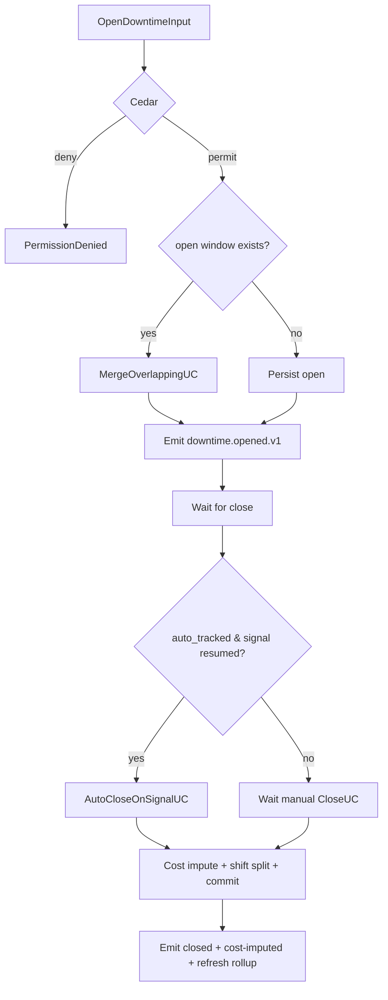

# IP-012: Use-case layer for `downtime-window` — Open, close, classify, OEE roll-up

## A. Intent

Use-case orchestration on the IP-006 domain. Each downtime lifecycle event (open, close, reclassify, auto-close-on-signal, rollup-refresh) is a use-case composing Cedar evaluation + domain mutation + cost imputation + outbox + audit. The OEE roll-up use-case is a cron-driven aggregator that pre-computes plant + line + equipment OEE for dashboards.

Industry-precedent equivalents: SAP DMC OEE dashboard backend, IBM Maximo Downtime + Asset Performance, Infor EAM OEE, Oracle Fusion OEE Cloud, IFS Cloud OEE, PTC ThingWorx OEE app, Aveva Wonderware OEE. Use-case shape lineage: same Clean-Architecture Interactor + scheduled-task pattern.

### A.1 Why the use-case layer is non-trivial

1. **Auto-close vs manual-close are different use-cases.** Auto-close is event-handler shape (consumes `signal.equipment-running.v1`); manual-close is API-shape. Different Cedar contexts, different audit semantics.
2. **Cost imputation needs throughput rate from production-planning.** `CloseDowntimeUseCase` calls `prodplan.v1.GetThroughputRate` to compute production-loss. gRPC roundtrip in the hot path.
3. **OEE roll-up is hierarchical.** Plant-level OEE = weighted equipment OEE. The roll-up use-case walks the floc tree (IP-001 D-3) and aggregates.
4. **Cross-shift splitting is per-jurisdiction.** Shift boundaries are workplace-integration data; use-case calls workplace-integration gRPC to resolve.
5. **Reclassification preserves history.** When a "planned" downtime is reclassified as "hybrid", the prior classification audit is preserved (no overwrite).
6. **Idempotency on open / close.** Concurrent SCADA + supervisor open is deduplicated.

## B. Acceptance criteria

- **AC-1:** Use-case set: `OpenDowntimeUseCase`, `CloseDowntimeUseCase`, `AutoCloseOnSignalUseCase`, `ReclassifyDowntimeUseCase`, `MergeOverlappingWindowsUseCase`, `RefreshOeeRollupUseCase`, `RunOeeRollupSweep`.
- **AC-2:** Each use-case opens 1 OTel span; emits 1 metric.
- **AC-3:** `CloseDowntimeUseCase` calls `prodplan.v1.GetThroughputRate` for cost imputation.
- **AC-4:** `AutoCloseOnSignalUseCase` handles `signal.equipment-running.v1` idempotently.
- **AC-5:** `MergeOverlappingWindowsUseCase` reconciles concurrent opens (SCADA + supervisor); preserves both decision_ids in chain.
- **AC-6:** `RefreshOeeRollupUseCase` walks floc subtree; produces availability/performance/quality with derivation JSON.
- **AC-7:** `RunOeeRollupSweep` cron runs every 5 min for top-100 most-active flocs; full sweep nightly.
- **AC-8:** Reclassification preserves audit trail (no overwrite).
- **AC-9:** Cross-tenant input rejected.
- **AC-10:** Audit events per §D-9.

## C. Verification

```bash
cargo test -p oya-plant-maintenance-downtime-window-usecase -- open_uc_happy_path
cargo test -p oya-plant-maintenance-downtime-window-usecase -- close_uc_calls_throughput_rate
cargo test -p oya-plant-maintenance-downtime-window-usecase -- close_uc_emits_cost_imputed
cargo test -p oya-plant-maintenance-downtime-window-usecase -- auto_close_idempotent
cargo test -p oya-plant-maintenance-downtime-window-usecase -- reclassify_preserves_history
cargo test -p oya-plant-maintenance-downtime-window-usecase -- merge_overlapping_chains_decisions
cargo test -p oya-plant-maintenance-downtime-window-usecase -- oee_rollup_hierarchical
cargo test -p oya-plant-maintenance-downtime-window-usecase -- rollup_sweep_paced
cargo test -p oya-plant-maintenance-downtime-window-usecase -- cross_tenant_rejected
cargo test -p oya-plant-maintenance-downtime-window-usecase -- cross_shift_proportional_split
```

## D. Detailed mechanics

### D-1. Use-case catalog

| Use-case | SAP analog | Idempotency key | Cedar action |
|---|---|---|---|
| `OpenDowntimeUseCase` | IH08 manual entry | `(tenant, equipment_id, started_at)` | `plant_maintenance::downtime::open` |
| `CloseDowntimeUseCase` | IH08 close | `(tenant, dt_window_id, ended_at)` | `plant_maintenance::downtime::close` |
| `AutoCloseOnSignalUseCase` | SAP PCo signal | `(tenant, equipment_id, signal_hlc)` | `plant_maintenance::downtime::auto_close` |
| `ReclassifyDowntimeUseCase` | IH08 reclassify | `(tenant, dt_window_id, reclassify_seq)` | `plant_maintenance::downtime::reclassify` |
| `MergeOverlappingWindowsUseCase` | n/a (Oyatie-specific) | `(tenant, dt_window_id_lhs, dt_window_id_rhs)` | `plant_maintenance::downtime::merge` |
| `RefreshOeeRollupUseCase` | SAP DMC OEE refresh | `(tenant, floc_id, rollup_date)` | `plant_maintenance::oee::refresh` |
| `RunOeeRollupSweep` | cron only | n/a | `plant_maintenance::scheduler::oee_sweep` |

### D-2. `CloseDowntimeUseCase` with cost imputation

```rust
#[async_trait]
impl UseCase for CloseDowntimeUseCase<DT, PP, C, O, A> {
    type Input = CloseDowntimeInput;
    type Output = DowntimeClosedRef;

    #[tracing::instrument(skip(self), fields(uc = "close_downtime"))]
    async fn execute(&self, input: Self::Input, ctx: RequestContext) -> Result<DowntimeClosedRef, UseCaseError> {
        if input.tenant_id != ctx.tenant_id { return Err(UseCaseError::CrossTenant); }
        let decision = self.cedar.evaluate(cedar_req_close(&input, &ctx)).await?;
        if !decision.is_permit() { return Err(UseCaseError::PermissionDenied { reason: decision.reasons() }); }

        let tx = self.dt_repo.begin_tx().await?;
        let mut window = self.dt_repo.load(&tx, &input.tenant_id, &input.dt_window_id).await?
            .ok_or(UseCaseError::WindowMissing)?;
        if input.ended_at < window.started_at { return Err(UseCaseError::CloseBeforeStart); }
        window.ended_at = Some(input.ended_at);
        window.state = DowntimeState::Closed;
        window.hlc = Hlc::now();

        // Cost imputation: production loss
        let downtime_min = Decimal::from((input.ended_at - window.started_at).num_minutes());
        let throughput = self.prodplan.get_throughput_rate(&input.tenant_id, &window.equipment_id_or_floc()).await
            .map_err(|e| UseCaseError::ProdPlanFailed(e.into()))?;
        let loss_units = downtime_min * throughput.units_per_min;
        let loss_cost  = loss_units * throughput.unit_margin;
        window.production_loss_units = Some(loss_units);
        window.production_loss_cost  = Some(loss_cost);
        window.maintenance_cost      = input.maintenance_cost_estimate;
        self.dt_repo.save(&tx, &window).await?;

        // Split across shifts
        let splits = self.shift_resolver.split_by_shift(&input.tenant_id, window.started_at, input.ended_at).await?;
        for split in &splits {
            self.dt_repo.save_shift_split(&tx, &window.dt_window_id, split).await?;
        }

        self.outbox.append(&tx, &downtime_closed_event(&window)).await?;
        self.outbox.append(&tx, &downtime_cost_imputed_event(&window)).await?;
        self.audit.emit(&tx, AuditEntry::downtime_closed(&window, &decision)).await?;
        tx.commit().await?;
        Ok(DowntimeClosedRef { dt_window_id: window.dt_window_id, loss_cost })
    }
}
```

### D-3. `RefreshOeeRollupUseCase` — hierarchical aggregate

```rust
#[async_trait]
impl UseCase for RefreshOeeRollupUseCase<DT, FL, O, A> {
    type Input = RefreshOeeInput;
    type Output = OeeBreakdown;

    async fn execute(&self, input: Self::Input, ctx: RequestContext) -> Result<OeeBreakdown, UseCaseError> {
        if input.tenant_id != ctx.tenant_id { return Err(UseCaseError::CrossTenant); }
        let decision = self.cedar.evaluate(cedar_req_oee_refresh(&input, &ctx)).await?;
        if !decision.is_permit() { return Err(UseCaseError::PermissionDenied { reason: decision.reasons() }); }

        // Walk floc subtree
        let floc = self.floc_repo.load(&input.tenant_id, &input.floc_id).await?
            .ok_or(UseCaseError::FlocMissing)?;
        let descendants = self.floc_repo.descendants(&input.tenant_id, &input.floc_id).await?;

        let mut breakdowns = Vec::new();
        for descendant in &descendants {
            let windows = self.dt_repo.list_for_floc_day(&input.tenant_id, &descendant.floc_id, input.rollup_date).await?;
            let prod_meta = self.prodplan.production_meta(&input.tenant_id, &descendant.floc_id, input.rollup_date).await?;
            let downtime_min = windows.iter()
                .map(|w| w.duration_min())
                .sum::<Decimal>();
            let bd = oee(prod_meta.planned_run_min, downtime_min,
                         prod_meta.ideal_cycle_s, prod_meta.actual_count,
                         prod_meta.good_count, prod_meta.total_count);
            breakdowns.push((descendant.floc_id.clone(), bd));
        }

        let weighted = weighted_aggregate(&breakdowns);
        let tx = self.dt_repo.begin_tx().await?;
        self.dt_repo.save_rollup(&tx, &input.tenant_id, &input.floc_id, input.rollup_date, &weighted, &breakdowns).await?;
        self.outbox.append(&tx, &oee_rollup_refreshed_event(&input.tenant_id, &input.floc_id, &weighted)).await?;
        self.audit.emit(&tx, AuditEntry::oee_refreshed(&input.tenant_id, &input.floc_id, &weighted, &decision)).await?;
        tx.commit().await?;
        Ok(weighted)
    }
}
```

### D-4. `RunOeeRollupSweep` cron use-case

```rust
impl RunOeeRollupSweep {
    pub async fn tick(&self, now: DateTime<Utc>) -> Result<SweepReport, UseCaseError> {
        let mut report = SweepReport::default();
        let top_flocs = self.activity_index.top_active(/*N*/ 100, now - Duration::hours(24)).await?;
        for (tenant, floc) in top_flocs {
            self.rate_limiter.acquire(&tenant, 1).await?;
            let _ = self.refresh_uc.execute(
                RefreshOeeInput { tenant_id: tenant.clone(), floc_id: floc, rollup_date: now.date_naive() },
                RequestContext::cron(&tenant)
            ).await;
            report.processed += 1;
        }
        Ok(report)
    }
}
```

### D-5. Cedar context (open downtime)

```jsonc
{
  "principal": "oyatie::tenant::acme::user::shift-supervisor-7",
  "action":    "plant_maintenance::downtime::open",
  "resource":  "plant_maintenance::equipment::EQ-PUMP-0042",
  "context": {
    "tenant_id": "acme",
    "kind": "unplanned",
    "reason_category": "equipment_failure",
    "auto_tracked": false,
    "residency_pack": "global+us-osha-psm",
    "policy_bundle_version": "2026.05.20-r3",
    "byok_mode": "platform_default"
  }
}
```

### D-6. Workflow



### D-7. AsyncAPI envelopes

IP-006 D-6 channel set. Use-case is sole writer.

### D-8. SLO targets

| Operation | p50 | p95 | p99 | Throughput |
|---|---|---|---|---|
| `OpenDowntimeUseCase` | 22 ms | 50 ms | 100 ms | 1.2 k req/s/cell |
| `CloseDowntimeUseCase` (with cost impute) | 65 ms | 150 ms | 320 ms | 600 req/s/cell |
| `AutoCloseOnSignalUseCase` | 25 ms | 58 ms | 120 ms | 5 k req/s/cell |
| `ReclassifyDowntimeUseCase` | 18 ms | 40 ms | 85 ms | 800 req/s/cell |
| `RefreshOeeRollupUseCase` (single floc) | 120 ms | 280 ms | 580 ms | 300 req/s/cell |
| `RefreshOeeRollupUseCase` (plant subtree 100 eq) | 1.5 s | 3.5 s | 7 s | 30 req/s/cell |
| `RunOeeRollupSweep` (top-100 flocs) | 30 s | 60 s | 120 s | every 5 min |

### D-9. Audit-event registry

| Event class | Severity | Emitter |
|---|---|---|
| `EVT-PLANT_MAINTENANCE-DOWNTIME_USECASE-OPEN_OK` | informational | usecase |
| `EVT-PLANT_MAINTENANCE-DOWNTIME_USECASE-CLOSE_OK` | informational | usecase |
| `EVT-PLANT_MAINTENANCE-DOWNTIME_USECASE-AUTO_CLOSED` | informational | usecase |
| `EVT-PLANT_MAINTENANCE-DOWNTIME_USECASE-RECLASSIFIED` | informational | usecase |
| `EVT-PLANT_MAINTENANCE-DOWNTIME_USECASE-MERGED` | informational | usecase |
| `EVT-PLANT_MAINTENANCE-OEE_USECASE-REFRESH_OK` | informational | usecase |
| `EVT-PLANT_MAINTENANCE-OEE_USECASE-SWEEP_RAN` | informational | scheduler |
| `EVT-PLANT_MAINTENANCE-DOWNTIME_USECASE-CROSS_TENANT_REJECTED` | security | usecase |

### D-10. Failure modes & recovery

1. **`ProductionPlanningGrpcDegraded`** — close use-case can't get throughput rate. Persist window with cost imputation `null`; mark `cost_imputation_pending`; cron retry. Runbook `runbooks/prodplan-grpc-degraded.md`.
2. **`OverlappingOpenRace`** — SCADA + supervisor open within 50ms. Merge use-case combines; both decision_ids preserved in chain. Runbook `runbooks/overlap-merge.md`.
3. **`SignalFlapping`** — auto-close use-case triggered then signal drops again within 30s. Debounce window suppresses spurious closures. Runbook `runbooks/signal-flap.md`.
4. **`RollupCacheStaleInBurst`** — burst of downtimes invalidates rollup cache. Sweep prioritizes affected flocs. Runbook `runbooks/rollup-cache-stale.md`.
5. **`ShiftResolverDegraded`** — workplace-integration gRPC slow. Shift-split deferred; cron job re-attempts. Runbook `runbooks/shift-resolver-degraded.md`.
6. **`ReclassifyAfterRollup`** — late reclassify changes a downtime's reason, but OEE was already rolled up. Roll-up cache invalidated for affected dates; sweep re-runs. Runbook `runbooks/reclassify-after-rollup.md`.

### D-11. Migration notes

Migration script invokes `OpenDowntimeUseCase` per SAP `PMSDO` row with idempotency_key `(tenant, equipment, started_at)`, then `CloseDowntimeUseCase` if a closing event exists.

### D-12. Cross-µservice handoffs

Same as IP-006 D-12. Use-case adds the production-planning gRPC + workplace-integration gRPC dependencies.

## E. Failure-mode summary

See D-10.

## F. Migration / rollback

Per-use-case feature flag. OEE roll-up sweep can be paused per tenant (e.g., during major SCADA migration).

## G. References

- ADR-0105, ADR-0244, ADR-0252, ADR-0263, ADR-0294, ADR-0297, ADR-0314..0316.
- IP-006 (domain layer).
- VDMA 66412 (OEE definition); Nakajima *Introduction to TPM* (1988).

## H. Out of scope

- Domain math (IP-006), KPI scorecard (IP-024), predictive baselines (IP-021), MTBF (IP-022).

— end IP-012 —
