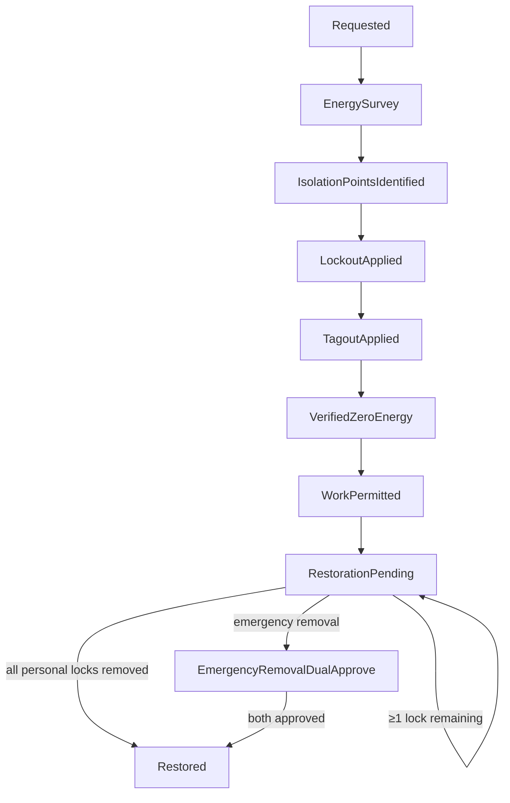

# IP-016: Safety-LOTO 9-state machine with audit-chain anchoring (OSHA 29 CFR 1910.147 + NFPA 70E)

## A. Intent

Implements the **Lockout / Tagout (LOTO)** safety lifecycle — the regulatory primitive that protects workers from hazardous-energy release during maintenance. Compliance authority: **OSHA 29 CFR 1910.147** (Control of Hazardous Energy) for the US, **NFPA 70E** for electrical work, **EN ISO 14118** for EU; each energy isolation event is immutably anchored in the audit-chain per ADR-0263.

Mirrors SAP `PM-WCM` (Work Clearance Management) submodule with transactions `CL51` (work clearance application), `CL52` (operating clearance), `CL53` (closing clearance), plus the SAP EHS Module's permit-to-work integration. Industry-precedent equivalents: **IBM Maximo Health, Safety & Environment (HSE) module**, **Infor EAM Permit-to-Work**, **Oracle Fusion Asset Lifecycle Permit**, **IFS Cloud Work Permit**, **Intelex EHS LOTO module**, **Cority EHS LOTO + permit-to-work**. Hyperscaler analog: AWS Systems Manager Maintenance Windows (the scheduled-exclusion shape) crossed with AWS IoT Core device-shadow desired-vs-reported (the isolation-state attestation shape).

### A.1 Why LOTO is non-trivial

1. **9 strictly enumerated states with regulatory mapping.** `requested → energy-survey → isolation-points-identified → lockout-applied → tagout-applied → verified-zero-energy → work-permitted → restoration-pending → restored`. Each transition has a regulatory citation.
2. **Group LOTO + multi-tech.** Multiple technicians may attach personal locks to one isolation; ALL personal locks must be removed before restoration. Hasps + master lock pattern.
3. **Tryout verification.** OSHA 29 CFR 1910.147(d)(6) requires positive tryout (attempt to start equipment after isolation) before work begins. State machine MUST gate `work-permitted` on `verified-zero-energy` attestation.
4. **Audit-chain anchoring.** Per ADR-0263, every LOTO transition is Merkle-sealed in `audit-chain` — tamper-evident; one log per tenant per equipment.
5. **Permit-clash detection.** Two LOTOs on overlapping isolation-points must be detected; safety-authority resolves.
6. **Emergency removal protocol.** When a technician leaves shift without removing their personal lock, OSHA-compliant escalation (supervisor + safety-authority dual-approve) is required.

## B. Acceptance criteria

- **AC-1:** 9-state machine with strictly enumerated transitions; invalid transition rejected.
- **AC-2:** Energy-survey use-case enumerates all isolation-points (electrical, mechanical, hydraulic, pneumatic, thermal, chemical, gravitational).
- **AC-3:** Personal-lock attach: each technician's lock recorded with timestamp + biometric attestation reference.
- **AC-4:** Group-LOTO master lock: state machine blocks restoration while ≥1 personal lock present.
- **AC-5:** Positive tryout step: state cannot advance to `work-permitted` without `verified-zero-energy` event.
- **AC-6:** Audit-chain anchoring: every transition emits Merkle-sealed entry in `audit-chain` µservice per ADR-0263.
- **AC-7:** Permit-clash detection: overlapping isolation-points across LOTOs flagged; safety-authority Cedar-gates resolution.
- **AC-8:** Emergency removal: dual-approver Cedar permit; full audit captured.
- **AC-9:** Cross-tenant LOTO load rejected without leaking equipment/state.
- **AC-10:** Per OSHA training-record reference: LOTO use-case verifies tech's training expiry < 1 year per `29 CFR 1910.147(c)(7)(iv)`.

## C. Verification

```bash
cargo test -p oya-plant-maintenance-loto-domain -- nine_state_machine_enumerated
cargo test -p oya-plant-maintenance-loto-domain -- invalid_transition_rejected
cargo test -p oya-plant-maintenance-loto-domain -- energy_survey_isolation_points
cargo test -p oya-plant-maintenance-loto-domain -- personal_lock_attach_records_attestation
cargo test -p oya-plant-maintenance-loto-domain -- group_loto_blocks_restoration
cargo test -p oya-plant-maintenance-loto-domain -- tryout_gates_work_permitted
cargo test -p oya-plant-maintenance-loto-domain -- audit_chain_merkle_seal
cargo test -p oya-plant-maintenance-loto-domain -- permit_clash_detected
cargo test -p oya-plant-maintenance-loto-domain -- emergency_removal_dual_approver
cargo test -p oya-plant-maintenance-loto-domain -- training_expiry_enforced
cargo test -p oya-plant-maintenance-loto-domain -- cross_tenant_blocked
```

## D. Detailed mechanics

### D-1. Data model

```sql
CREATE TABLE plant_maintenance.loto (
    tenant_id        TEXT NOT NULL,
    loto_id          TEXT NOT NULL,
    associated_wo_id TEXT NOT NULL,
    equipment_id     TEXT NOT NULL,
    state            TEXT NOT NULL CHECK (state IN
        ('requested','energy_survey','isolation_points_identified','lockout_applied','tagout_applied',
         'verified_zero_energy','work_permitted','restoration_pending','restored')),
    initiator_tech_id TEXT NOT NULL,
    safety_authority TEXT NOT NULL,
    regulatory_citation TEXT NOT NULL CHECK (regulatory_citation IN
        ('osha_29_cfr_1910_147','nfpa_70e','en_iso_14118','custom_residency_pack')),
    audit_chain_anchor TEXT NOT NULL,    -- Merkle root reference
    residency_pack   TEXT NOT NULL,
    hlc              TEXT NOT NULL,
    decision_id      UUID NOT NULL,
    PRIMARY KEY (tenant_id, loto_id),
    FOREIGN KEY (tenant_id, associated_wo_id) REFERENCES plant_maintenance.work_order (tenant_id, wo_id)
) PARTITION BY HASH (tenant_id);

CREATE TABLE plant_maintenance.loto_isolation_point (
    tenant_id     TEXT NOT NULL,
    loto_id       TEXT NOT NULL,
    point_no      INTEGER NOT NULL,
    energy_kind   TEXT NOT NULL CHECK (energy_kind IN
        ('electrical','mechanical','hydraulic','pneumatic','thermal','chemical','gravitational')),
    location_desc TEXT NOT NULL,
    isolation_device TEXT NOT NULL,
    state         TEXT NOT NULL CHECK (state IN ('identified','isolated','verified_zero','restored')),
    PRIMARY KEY (tenant_id, loto_id, point_no)
) PARTITION BY HASH (tenant_id);

CREATE TABLE plant_maintenance.loto_personal_lock (
    tenant_id     TEXT NOT NULL,
    loto_id       TEXT NOT NULL,
    lock_id       TEXT NOT NULL,
    technician_id TEXT NOT NULL,
    attached_at   TIMESTAMPTZ NOT NULL,
    removed_at    TIMESTAMPTZ,
    biometric_attestation_ref TEXT,
    PRIMARY KEY (tenant_id, loto_id, lock_id)
) PARTITION BY HASH (tenant_id);

CREATE TABLE plant_maintenance.loto_state_audit (
    tenant_id      TEXT NOT NULL,
    loto_id        TEXT NOT NULL,
    state_from     TEXT NOT NULL,
    state_to       TEXT NOT NULL,
    actor          TEXT NOT NULL,
    actor_role     TEXT NOT NULL,
    audit_chain_seq BIGINT NOT NULL,
    audit_chain_merkle_leaf TEXT NOT NULL,
    hlc            TEXT NOT NULL,
    decision_id    UUID NOT NULL,
    PRIMARY KEY (tenant_id, loto_id, hlc)
) PARTITION BY HASH (tenant_id);
```

### D-2. Rust types + state machine

```rust
#[derive(Debug, Clone, PartialEq, Eq)]
pub enum LotoState {
    Requested,
    EnergySurvey,
    IsolationPointsIdentified,
    LockoutApplied,
    TagoutApplied,
    VerifiedZeroEnergy,
    WorkPermitted,
    RestorationPending,
    Restored,
}

pub fn allowed_loto_transition(from: LotoState, to: LotoState) -> bool {
    use LotoState::*;
    matches!((from, to),
        (Requested, EnergySurvey) |
        (EnergySurvey, IsolationPointsIdentified) |
        (IsolationPointsIdentified, LockoutApplied) |
        (LockoutApplied, TagoutApplied) |
        (TagoutApplied, VerifiedZeroEnergy) |
        (VerifiedZeroEnergy, WorkPermitted) |
        (WorkPermitted, RestorationPending) |
        (RestorationPending, Restored)
    )
}

pub fn must_have_zero_personal_locks_before_restoration(locks: &[PersonalLock]) -> bool {
    locks.iter().all(|l| l.removed_at.is_some())
}
```

### D-3. Cedar context (lockout-apply step with training-expiry)

```jsonc
{
  "principal": "oyatie::tenant::acme::user::maintenance-tech-77",
  "action":    "plant_maintenance::loto::lockout_apply",
  "resource":  "plant_maintenance::loto::LOTO-2026-0982",
  "context": {
    "tenant_id": "acme",
    "associated_wo_id": "WO-2026-049182",
    "equipment_id": "EQ-PUMP-0042",
    "regulatory_citation": "osha_29_cfr_1910_147",
    "tech_loto_training_expiry": "2026-12-31",
    "tech_loto_training_class": "authorized_employee",
    "safety_authority_approver": "safety-authority-3",
    "biometric_attestation_ref": "bio-att-9382-fingerprint-passed",
    "residency_pack": "global+us-osha-psm",
    "policy_bundle_version": "2026.05.20-r3",
    "byok_mode": "platform_default"
  }
}
```

### D-4. Audit-chain anchoring

```rust
pub async fn anchor_transition(audit_chain: &AuditChainClient, transition: &LotoTransition)
    -> Result<MerkleLeaf, AuditChainError>
{
    let leaf = MerkleLeaf::from_canonicalized(transition);
    audit_chain.append(&AuditChainAppendRequest {
        tenant_id:      transition.tenant_id.clone(),
        partition:      format!("plant_maintenance/loto/{}", transition.equipment_id),
        leaf:           leaf.clone(),
        retention_class: RetentionClass::SafetyLifeOfAsset,
    }).await
}
```

### D-5. Workflow



### D-6. AsyncAPI envelopes

| Channel | Trigger | Consumers |
|---|---|---|
| `plant-maintenance.loto.state-changed.v1` | any transition | audit-chain (Merkle seal), dashboards, work-order (release gate) |
| `plant-maintenance.loto.verified-zero-energy.v1` | VZE step | work-order (advances permit gate) |
| `plant-maintenance.loto.permit-clash-detected.v1` | clash | safety-authority alert |
| `plant-maintenance.loto.emergency-removal.v1` | emergency | safety-authority alert (P0) |

### D-7. Ontology projection

| SAP / Industry | Field | Oyatie Ontology |
|---|---|---|
| SAP PM-WCM application | CLAPL | LotoApplication |
| Isolation point | CLINST | LotoIsolationPoint |
| Personal lock | CLLOCK | PersonalLock |
| Permit citation | CLREGS | RegulatoryCitation |

### D-8. SLO targets

| Operation | p50 | p95 | p99 |
|---|---|---|---|
| `RequestLoto` | 25 ms | 60 ms | 120 ms |
| `IdentifyIsolationPoints` (avg 4 pts) | 45 ms | 100 ms | 200 ms |
| `LockoutApply` (per lock) | 30 ms | 70 ms | 140 ms |
| `VerifyZeroEnergy` (positive tryout) | 35 ms | 80 ms | 160 ms |
| LOTO permit issuance p99 ≤ 30s with safety-authority quorum check | n/a | n/a | 30 s |
| `Restore` (all locks removed) | 28 ms | 65 ms | 130 ms |
| Audit-chain anchor (Merkle leaf append) | 18 ms | 42 ms | 90 ms |

### D-9. Audit-event registry

| Event class | Severity | Emitter |
|---|---|---|
| `EVT-PLANT_MAINTENANCE-LOTO-REQUESTED` | informational | usecase |
| `EVT-PLANT_MAINTENANCE-LOTO-ENERGY_SURVEY_COMPLETE` | informational | usecase |
| `EVT-PLANT_MAINTENANCE-LOTO-LOCKOUT_APPLIED` | informational | usecase |
| `EVT-PLANT_MAINTENANCE-LOTO-TAGOUT_APPLIED` | informational | usecase |
| `EVT-PLANT_MAINTENANCE-LOTO-VERIFIED_ZERO_ENERGY` | informational | usecase |
| `EVT-PLANT_MAINTENANCE-LOTO-WORK_PERMITTED` | informational | usecase |
| `EVT-PLANT_MAINTENANCE-LOTO-RESTORED` | informational | usecase |
| `EVT-PLANT_MAINTENANCE-LOTO-PERMIT_CLASH` | warning | usecase |
| `EVT-PLANT_MAINTENANCE-LOTO-EMERGENCY_REMOVAL` | warning | usecase |
| `EVT-PLANT_MAINTENANCE-LOTO-TRAINING_EXPIRED_REJECTED` | warning | usecase |
| `EVT-PLANT_MAINTENANCE-LOTO-AUDIT_CHAIN_ANCHORED` | informational | usecase |
| `EVT-PLANT_MAINTENANCE-LOTO-CROSS_TENANT_REJECTED` | security | usecase |

### D-10. Failure modes & recovery

1. **`TryoutVerificationFailed`** — equipment starts despite isolation (faulty isolation device). LOTO state reverts to `lockout_applied`; safety-authority paged P0. Runbook `runbooks/loto-tryout-failed.md`.
2. **`OrphanPersonalLock`** — technician offline, lock not removed. Emergency-removal use-case + audit. Runbook `runbooks/loto-orphan-lock.md`.
3. **`TrainingExpiredAtIsolation`** — tech's LOTO training expired between request and lockout. Reject; supervisor re-assigns. Runbook `runbooks/loto-training-expired.md`.
4. **`PermitClashUnresolved`** — two LOTOs overlapping > 1 h without resolution. Auto-page safety-authority. Runbook `runbooks/loto-clash.md`.
5. **`AuditChainServiceDegraded`** — audit-chain gRPC slow. LOTO use-case fails fast (safety-critical — never proceed without seal). Runbook `runbooks/audit-chain-degraded.md`.
6. **`IsolationDeviceFaulty`** — isolation device shows un-lockable. Halt LOTO; equipment-master flagged `isolation_device_faulty`; maintenance work order to repair device. Runbook `runbooks/isolation-device-faulty.md`.

### D-11. Migration notes

Source vendor surfaces:

- **SAP PM-WCM**: `CLAPL` (work clearance application) + `CLINST` (isolation instructions) + `CLREGS` (regulatory citations) + `CLLOCK` (lock attachments).
- **IBM Maximo HSE**: `WORKPERMIT` + `LOCKOUT` + `LOCKOUTTAG`.
- **Infor EAM**: `R5PERMITS` + `R5LOCKS`.
- **Intelex EHS**: REST API LOTO endpoints.

### D-12. Cross-µservice handoffs

| Direction | Counterparty | Surface |
|---|---|---|
| outbound | `audit-chain` | gRPC `audit-chain.v1.Append` (Merkle seal) — every state transition |
| outbound | `work-order` (IP-009) | AsyncAPI `loto.verified-zero-energy.v1` (advances WO permit gate) |
| inbound | `identity` | gRPC `identity.v1.LotoTrainingStatus` |
| inbound | `equipment-master` | floc / equipment lookup for isolation-point resolution |
| outbound | `incident-management` | AsyncAPI on tryout failure or emergency removal |

## E. Failure-mode summary

See D-10.

## F. Migration / rollback

LOTO use-cases are NEVER feature-flagged off entirely (regulatory). Per-residency-pack toggling allowed (e.g., EU-only pack rollout). Rollback to prior schema version requires regulatory ADR.

## G. References

- ADR-0105, ADR-0244, ADR-0252, ADR-0263, ADR-0294, ADR-0297, ADR-0314..0316.
- **OSHA 29 CFR 1910.147** Control of Hazardous Energy (Lockout/Tagout).
- **NFPA 70E** Standard for Electrical Safety in the Workplace.
- **EN ISO 14118** Safety of machinery — Prevention of unexpected start-up.
- SAP `PM-WCM` documentation; IBM Maximo HSE module documentation.
- Benchmarks: SAP PM-WCM | IBM Maximo HSE | Infor EAM Permit | Oracle Fusion Permit | IFS Cloud Work Permit | Intelex EHS LOTO | Cority EHS LOTO.

## H. Out of scope

- Permit-to-work issuance flow (IP-017), training/cert management (lives in `identity`), audit-chain primitives (separate µservice).

— end IP-016 —
