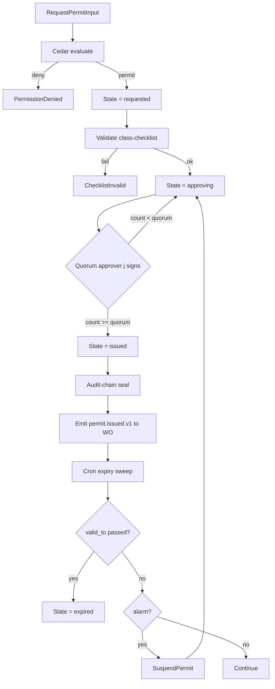

# IP-017: Permit-to-work issuance workflow with safety-authority quorum

## A. Intent

Implements the **Permit-to-Work (PtW)** issuance workflow — the regulatory primitive that authorizes high-hazard maintenance work (hot-work, confined-space, working-at-height, energized-electrical, line-break, excavation). PtW is the formal gate that closes the loop between IP-016 LOTO + IP-009 WO-release: a work-order with `permit_required=true` sits in `WAIT_PERMIT` until a PtW is **issued by safety-authority quorum**.

Industry-precedent equivalents: SAP `PM-WCM` permit-to-work + SAP EHS Industrial Hygiene & Safety; IBM Maximo HSE Permit Module; Infor EAM Permit-to-Work; Oracle Fusion Asset Lifecycle Permit; IFS Cloud Work Permit; Cority EHS Permit-to-Work; Intelex EHS Permit Module. Regulatory authority: **OSHA 1910.146** (confined space), **OSHA 1910.252** (welding/cutting/brazing - hot-work), **OSHA 1926.501** (fall protection), **OSHA 1910.333** (electrical safety-related work practices), **CDM 2015** (UK construction permit-to-work).

### A.1 Why permit-to-work is non-trivial

1. **6 named permit classes with class-specific checklists.** Hot-work (gas-test, fire-watch ≥30 min post-work), Confined-space (atmospheric monitoring, attendant required), Work-at-Height (fall-arrest, anchor-point ≥5000 lbf), Energized-electrical (arc-flash analysis, EPPE), Line-break (process-isolation, drain-and-flush), Excavation (utility-strike survey).
2. **Quorum gate.** Issuance requires N safety-authority approvers per permit class + residency pack. Default: hot-work 2, confined-space 2, electrical 1 (but L3+ approver), excavation 2, line-break 2, height 1.
3. **Time-bounded validity.** Permits expire after a maximum shift (typically 8h) and require renewal. Cron-driven expiry sweep.
4. **Permit suspension on alarm.** Atmospheric alarm (confined-space), fire detection (hot-work), or weather-trigger (height) auto-suspends the permit and requires re-issue.
5. **Concurrent permits + clash detection.** Hot-work + confined-space on same equipment requires combined permit with strictest controls.
6. **Audit-chain Merkle-sealed.** Per ADR-0263, every issuance + suspension + renewal + closure is sealed.

## B. Acceptance criteria

- **AC-1:** 6 permit-class types implemented: HotWork, ConfinedSpace, WorkAtHeight, EnergizedElectrical, LineBreak, Excavation.
- **AC-2:** `IssuePermitUseCase` requires safety-authority quorum (N approvers per class).
- **AC-3:** Permit validity time-bounded (`valid_to`); expiry sweep at 60s cadence.
- **AC-4:** Class-specific checklist enforced: hot-work fire-watch attestation, confined-space atmospheric test result, height fall-arrest verification, electrical arc-flash analysis ref, line-break isolation cert, excavation utility-strike survey.
- **AC-5:** `SuspendPermitUseCase` triggered by alarm event; auto-suspends; safety-authority must re-issue.
- **AC-6:** Combined permits (hot-work + confined-space) elevate to strictest controls; quorum sums.
- **AC-7:** Audit-chain Merkle-sealed per transition.
- **AC-8:** Cross-tenant permit load rejected.
- **AC-9:** OSHA-citation captured in every issuance.
- **AC-10:** Permit issued p99 ≤ 30 seconds with safety-authority quorum check.

## C. Verification

```bash
cargo test -p oya-plant-maintenance-permit-to-work-domain -- hot_work_quorum_2
cargo test -p oya-plant-maintenance-permit-to-work-domain -- confined_space_atmospheric_test_required
cargo test -p oya-plant-maintenance-permit-to-work-domain -- height_fall_arrest_required
cargo test -p oya-plant-maintenance-permit-to-work-domain -- electrical_arc_flash_required
cargo test -p oya-plant-maintenance-permit-to-work-domain -- line_break_isolation_required
cargo test -p oya-plant-maintenance-permit-to-work-domain -- excavation_utility_survey_required
cargo test -p oya-plant-maintenance-permit-to-work-domain -- expiry_sweep_at_valid_to
cargo test -p oya-plant-maintenance-permit-to-work-domain -- alarm_suspends_permit
cargo test -p oya-plant-maintenance-permit-to-work-domain -- combined_permits_elevate_controls
cargo test -p oya-plant-maintenance-permit-to-work-domain -- audit_chain_sealed_each_transition
cargo test -p oya-plant-maintenance-permit-to-work-domain -- cross_tenant_rejected
cargo test -p oya-plant-maintenance-permit-to-work-domain -- issuance_p99_under_30s
```

## D. Detailed mechanics

### D-1. Data model

```sql
CREATE TABLE plant_maintenance.permit_to_work (
    tenant_id        TEXT NOT NULL,
    permit_id        TEXT NOT NULL,
    associated_wo_id TEXT NOT NULL,
    associated_loto_id TEXT,
    permit_class     TEXT NOT NULL CHECK (permit_class IN
        ('hot_work','confined_space','work_at_height','energized_electrical','line_break','excavation','combined')),
    state            TEXT NOT NULL CHECK (state IN
        ('requested','approving','issued','suspended','expired','closed','rejected')),
    quorum_required  SMALLINT NOT NULL,
    quorum_attained  SMALLINT NOT NULL DEFAULT 0,
    valid_from       TIMESTAMPTZ NOT NULL,
    valid_to         TIMESTAMPTZ NOT NULL,
    regulatory_citation TEXT NOT NULL,        -- e.g., 'OSHA-1910-252' for hot-work
    checklist_json   JSONB NOT NULL,
    audit_chain_anchor TEXT NOT NULL,
    residency_pack   TEXT NOT NULL,
    hlc              TEXT NOT NULL,
    decision_id_chain UUID[] NOT NULL,
    PRIMARY KEY (tenant_id, permit_id),
    CHECK (valid_to > valid_from),
    FOREIGN KEY (tenant_id, associated_wo_id) REFERENCES plant_maintenance.work_order (tenant_id, wo_id)
) PARTITION BY HASH (tenant_id);

CREATE TABLE plant_maintenance.permit_approver (
    tenant_id     TEXT NOT NULL,
    permit_id     TEXT NOT NULL,
    approver_id   TEXT NOT NULL,
    approver_role TEXT NOT NULL CHECK (approver_role IN ('safety_authority','fire_authority','electrical_authority','process_engineer')),
    approved_at   TIMESTAMPTZ NOT NULL DEFAULT now(),
    decision_id   UUID NOT NULL,
    PRIMARY KEY (tenant_id, permit_id, approver_id)
) PARTITION BY HASH (tenant_id);
```

### D-2. Per-class quorum + checklist

```rust
pub fn quorum_required(class: &PermitClass, residency: &ResidencyPack) -> u8 {
    match (class, residency.code()) {
        (PermitClass::HotWork, _) => 2,
        (PermitClass::ConfinedSpace, _) => 2,
        (PermitClass::EnergizedElectrical, _) => 1,
        (PermitClass::WorkAtHeight, "EU") => 2,
        (PermitClass::WorkAtHeight, _) => 1,
        (PermitClass::LineBreak, _) => 2,
        (PermitClass::Excavation, _) => 2,
        (PermitClass::Combined, _) => 3,
    }
}

pub fn validate_checklist(class: &PermitClass, checklist: &Checklist) -> Result<(), ChecklistError> {
    use PermitClass::*;
    match class {
        HotWork => {
            checklist.require("gas_test_passed", BoolTrue)?;
            checklist.require("fire_watch_assigned", StringNonEmpty)?;
            checklist.require("fire_watch_post_work_min", IntAtLeast(30))?;
            checklist.require("extinguisher_on_site", BoolTrue)?;
        }
        ConfinedSpace => {
            checklist.require("atmospheric_test_o2_pct", FloatBetween(19.5, 23.5))?;
            checklist.require("atmospheric_test_lel_pct", FloatAtMost(10.0))?;
            checklist.require("attendant_assigned", StringNonEmpty)?;
            checklist.require("rescue_plan_id", StringNonEmpty)?;
        }
        WorkAtHeight => {
            checklist.require("fall_arrest_pn", StringNonEmpty)?;
            checklist.require("anchor_point_lbf", IntAtLeast(5000))?;
            checklist.require("weather_check", BoolTrue)?;
        }
        EnergizedElectrical => {
            checklist.require("arc_flash_analysis_ref", StringNonEmpty)?;
            checklist.require("eppe_class", StringMatches(&["L1","L2","L3","L4"]))?;
            checklist.require("approach_boundary_ft", FloatNonNegative)?;
        }
        LineBreak => {
            checklist.require("process_isolation_cert", StringNonEmpty)?;
            checklist.require("drain_flush_verified", BoolTrue)?;
            checklist.require("residual_pressure_psi", FloatAtMost(1.0))?;
        }
        Excavation => {
            checklist.require("utility_strike_survey_ref", StringNonEmpty)?;
            checklist.require("shoring_design_ref", StringNonEmpty)?;
        }
        Combined => Ok(()), // delegated to sub-class checklists
    }?;
    Ok(())
}
```

### D-3. Cedar context (issue permit)

```jsonc
{
  "principal": "oyatie::tenant::acme::user::safety-authority-3",
  "action":    "plant_maintenance::permit::approve",
  "resource":  "plant_maintenance::permit::PTW-2026-002981",
  "context": {
    "tenant_id": "acme",
    "associated_wo_id": "WO-2026-049182",
    "permit_class": "hot_work",
    "regulatory_citation": "OSHA-1910-252",
    "checklist_complete": true,
    "fire_watch_min": 30,
    "second_approver_present": true,
    "biometric_attestation_ref": "bio-att-9382",
    "residency_pack": "global+us-osha-psm",
    "policy_bundle_version": "2026.05.20-r3",
    "byok_mode": "platform_default"
  }
}
```

### D-4. Workflow



### D-5. AsyncAPI envelopes

| Channel | Trigger | Consumers |
|---|---|---|
| `pm-wcm.permit.requested.v1` | new request | safety-authority queue, audit |
| `pm-wcm.permit.issued.v1` | quorum reached | work-order (release gate), audit-chain |
| `pm-wcm.permit.suspended.v1` | alarm event | work-order (hold), alerting |
| `pm-wcm.permit.expired.v1` | TTL expiry | work-order (auto-hold), alerting |
| `pm-wcm.permit.closed.v1` | work complete | audit-chain |

### D-6. SLO targets

| Operation | p50 | p95 | p99 |
|---|---|---|---|
| `RequestPermitUseCase` | 35 ms | 80 ms | 160 ms |
| `ApprovePermitUseCase` (per approver) | 28 ms | 65 ms | 130 ms |
| `IssuePermitUseCase` (quorum complete) | 50 ms | 120 ms | 250 ms |
| End-to-end issuance (request → issued) p99 ≤ 30 s with safety-authority quorum check | n/a | n/a | 30 s |
| `SuspendPermitUseCase` (alarm-triggered) | 18 ms | 42 ms | 90 ms |
| Expiry sweep cron (1000 permits) | 2 s | 5 s | 10 s |
| Audit-chain anchor per transition | 18 ms | 42 ms | 90 ms |

### D-7. Audit-event registry

| Event class | Severity | Emitter |
|---|---|---|
| `EVT-PLANT_MAINTENANCE-PERMIT-REQUESTED` | informational | usecase |
| `EVT-PLANT_MAINTENANCE-PERMIT-APPROVER_SIGNED` | informational | usecase |
| `EVT-PLANT_MAINTENANCE-PERMIT-QUORUM_REACHED` | informational | usecase |
| `EVT-PLANT_MAINTENANCE-PERMIT-ISSUED` | informational | usecase |
| `EVT-PLANT_MAINTENANCE-PERMIT-SUSPENDED_ALARM` | warning | usecase |
| `EVT-PLANT_MAINTENANCE-PERMIT-EXPIRED` | informational | scheduler |
| `EVT-PLANT_MAINTENANCE-PERMIT-RE_ISSUED` | informational | usecase |
| `EVT-PLANT_MAINTENANCE-PERMIT-CHECKLIST_FAILED` | warning | usecase |
| `EVT-PLANT_MAINTENANCE-PERMIT-CLOSED` | informational | usecase |
| `EVT-PLANT_MAINTENANCE-PERMIT-AUDIT_CHAIN_ANCHORED` | informational | usecase |
| `EVT-PLANT_MAINTENANCE-PERMIT-CROSS_TENANT_REJECTED` | security | usecase |

### D-8. Failure modes & recovery

1. **`QuorumStalled`** — < quorum approvers in 30 min. Auto-escalate to dual safety-authority + plant manager. Runbook `runbooks/permit-quorum-stalled.md`.
2. **`ChecklistInvalid`** — checklist field outside bounds (e.g., O2 < 19.5%). Reject; safety-authority notified. Runbook `runbooks/permit-checklist-failed.md`.
3. **`AlarmSuspendStorm`** — atmospheric alarm flaps. Suspend permit; debounce 60s before re-issuance allowed. Runbook `runbooks/alarm-flap-suspend.md`.
4. **`PermitExpiredWithWorkInProgress`** — permit TTL passes while WO is `IPR`. WO auto-held; permit re-issuance required. Runbook `runbooks/permit-expired-mid-work.md`.
5. **`UtilityStrike`** — excavation hit utility (validated by sensor). Suspend permit; halt work; safety-authority paged P0. Runbook `runbooks/excavation-utility-strike.md`.
6. **`FireWatchAbandoned`** — fire-watch tech leaves before 30-min post-work watch. Auto-page supervisor; non-compliance audited. Runbook `runbooks/fire-watch-abandoned.md`.

### D-9. Migration notes

Source vendor surfaces:

- **SAP PM-WCM**: `CLAPL` + `CLINST` + `CLREGS` + permit-class table.
- **IBM Maximo HSE**: `WORKPERMIT` + `PERMITSIGNATURE` + `PERMITSTATUS`.
- **Infor EAM**: `R5PERMITS` + `R5PERMITSIGNATURE`.
- **Cority EHS**: REST API permit endpoints.

### D-10. Cross-µservice handoffs

| Direction | Counterparty | Surface |
|---|---|---|
| outbound | `work-order` (IP-009) | AsyncAPI `permit.issued.v1` (closes WO permit gate) |
| outbound | `audit-chain` | gRPC `audit-chain.v1.Append` (Merkle seal each transition) |
| outbound | `loto` (IP-016) | bidirectional — combined permit + LOTO flows |
| outbound | `incident-management` | AsyncAPI on utility-strike / atmospheric-alarm |
| inbound | `signal-ingest` | AsyncAPI alarm events that trigger suspend |
| inbound | `identity` | safety-authority + biometric attestation lookup |

## E. Failure-mode summary

See D-8.

## F. Migration / rollback

Permit-to-work is regulatory-critical; never globally disabled. Per-residency-pack onboarding allowed.

## G. References

- ADR-0105, ADR-0244, ADR-0252, ADR-0263, ADR-0294, ADR-0297, ADR-0314..0316.
- **OSHA 1910.146** (Confined Space), **OSHA 1910.252** (Hot Work), **OSHA 1910.333** (Electrical), **OSHA 1926.501** (Fall Protection).
- **CDM 2015** (UK Construction Permit-to-Work).
- SAP `PM-WCM` + EHS Module documentation.
- Benchmarks: SAP PM-WCM | IBM Maximo HSE | Infor EAM Permit | Oracle Fusion Permit | IFS Cloud Work Permit | Cority EHS | Intelex EHS.

## H. Out of scope

- LOTO state machine (IP-016), specific energy-isolation device validation (lives in equipment-master), training records (identity).

— end IP-017 —
