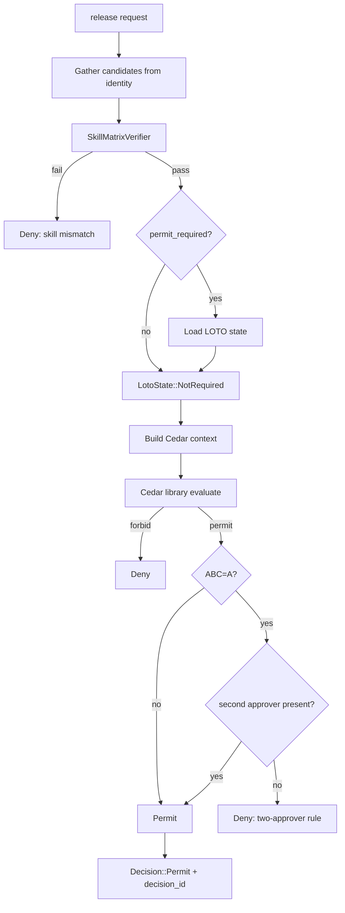

# IP-018: Work-order release Cedar gate with skill-matrix verification

## A. Intent

Implements the **Cedar policy fragment + skill-matrix evaluator** that gates work-order release. Per ADR-0243 every gate is a Cedar eval; this IP defines `plant_maintenance::wo::release` as the *canonical authoritative gate* combining: (1) identity skill-matrix sufficiency, (2) cert-expiry freshness at planned-start, (3) LOTO/permit prerequisite, (4) ABC-criticality two-person-rule, (5) jurisdictional residency override.

Mirrors SAP `PM-WOC` release-step with the HR `PA0024` qualifications join (transaction `IW32` cannot release until status `Released` is granted by user with qualification check). Industry-precedent equivalents: **IBM Maximo Application Designer + role-based-action approval**, **Infor EAM workflow approval step**, **Oracle Fusion BPM rule on WO release**, **IFS Cloud Workflow Activity**, **Cedar Policy Engine (open-source)** — the canonical OPA-equivalent for the AWS-aligned authorization model. The skill-matrix lookup pattern mirrors Stripe's "issuing card has all required programs" pre-authorization check.

### A.1 Why the release gate is non-trivial

1. **Cedar context must be deterministic and fully resolved.** No "ask later" — the Cedar evaluator must have all skills, certs, residency, ABC, LOTO/permit state at evaluation time.
2. **Library-first per ADR-0246.** Cedar evaluation uses the caller-side `oya-shared-policy-eval` library; no per-request network hop to a policy server.
3. **Skill matrix is multi-attribute.** Each technician has `(skill_code, level, cert_expiry)`; release evaluates `forall(op): exists(tech): tech.satisfies(op.required)`.
4. **Defence-in-depth.** Edge gate (REST middleware) + use-case gate (IP-009) + this gate (skill matrix) — three checks, all-or-nothing.
5. **ABC-A two-person rule.** Releasing a WO on `ABC=A` equipment requires supervisor + planner approval (decision-id chain), per default policy.
6. **Per-residency override.** Some jurisdictions require electrical-Class-3 cert for *every* electrical WO regardless of voltage; overlay packs activate this.

## B. Acceptance criteria

- **AC-1:** Cedar fragment `plant_maintenance::wo::release.cedar` published; default-deny baseline preserved.
- **AC-2:** `SkillMatrixVerifier::verify(wo, candidates, at)` returns `PASS | FAIL { reason }`.
- **AC-3:** Cert-expiry checked at *planned_start*, not at eval-time, to avoid race.
- **AC-4:** LOTO/permit prerequisite checked: if `permit_required=true`, current LOTO state MUST be `WORK_PERMITTED`.
- **AC-5:** ABC-A WOs require two-approver decision_id chain.
- **AC-6:** Per-residency overlay applied: pack-id appended to Cedar context.
- **AC-7:** Eval p99 ≤ 9 ms warm; bundle cache freshness ≤ 60 s.
- **AC-8:** No release proceeds without explicit `Decision::Permit { reasons: [...] }`.
- **AC-9:** Audit captures full context: tenant, WO, candidate tech IDs, decision_id, residency pack, bundle version.
- **AC-10:** Backward-compat: prior policy bundle versions remain queryable for 90 days.

## C. Verification

```bash
cargo test -p oya-plant-maintenance-policy-release-gate -- cedar_fragment_lints_clean
cargo test -p oya-plant-maintenance-policy-release-gate -- skill_matrix_pass
cargo test -p oya-plant-maintenance-policy-release-gate -- skill_matrix_fail_level_too_low
cargo test -p oya-plant-maintenance-policy-release-gate -- skill_matrix_fail_missing_cert
cargo test -p oya-plant-maintenance-policy-release-gate -- cert_expiry_at_planned_start
cargo test -p oya-plant-maintenance-policy-release-gate -- loto_prerequisite_enforced
cargo test -p oya-plant-maintenance-policy-release-gate -- abc_a_two_approver_required
cargo test -p oya-plant-maintenance-policy-release-gate -- residency_overlay_us_osha
cargo test -p oya-plant-maintenance-policy-release-gate -- residency_overlay_eu
cargo test -p oya-plant-maintenance-policy-release-gate -- eval_p99_under_9ms_warm
cargo test -p oya-plant-maintenance-policy-release-gate -- default_deny_baseline_preserved
cargo test -p oya-plant-maintenance-policy-release-gate -- backward_compat_90d
```

## D. Detailed mechanics

### D-1. Cedar fragment (default-deny baseline + permits)

```cedar
// microservices/plant-maintenance/policy/wo-release.cedar
// FORBID default-deny baseline (defence-in-depth)
forbid (
  principal,
  action == Action::"plant_maintenance::wo::release",
  resource
) when {
  context has "abc_criticality" &&
  context.abc_criticality == "A" &&
  !(context has "second_approver_principal")
};

// PERMIT: planner with full skill-matrix match
permit (
  principal in Group::"plant_maintenance::planner",
  action == Action::"plant_maintenance::wo::release",
  resource is plant_maintenance::WorkOrder
) when {
  context.skill_matrix_passed &&
  context.cert_expiry_ok_at_planned_start &&
  (!context.permit_required || context.loto_state == "work_permitted") &&
  context.bundle_version >= "2026.05.20-r3"
};

// PERMIT: ABC-A with two approvers (planner + supervisor)
permit (
  principal in Group::"plant_maintenance::planner",
  action == Action::"plant_maintenance::wo::release",
  resource is plant_maintenance::WorkOrder
) when {
  context.abc_criticality == "A" &&
  context has "second_approver_principal" &&
  context.second_approver_role == "supervisor" &&
  context.skill_matrix_passed &&
  context.cert_expiry_ok_at_planned_start &&
  (!context.permit_required || context.loto_state == "work_permitted")
};

// FORBID: jurisdictional override (EU pack — electrical WO needs Class-3)
forbid (
  principal,
  action == Action::"plant_maintenance::wo::release",
  resource is plant_maintenance::WorkOrder
) when {
  context.residency_pack contains "EU" &&
  context.has_electrical_operation &&
  !(context.candidate_certs contains "electrical_class_3")
};
```

### D-2. Skill-matrix verifier

```rust
pub struct SkillMatrixVerifier;

impl SkillMatrixVerifier {
    pub fn verify(wo: &WorkOrder, candidates: &[TechnicianProfile], at: DateTime<Utc>)
        -> Result<VerifyOutcome, VerifyError>
    {
        for op in &wo.operations {
            let required = op.required_skills();
            let required_certs = op.required_certs();
            let any_match = candidates.iter().any(|c| {
                required.iter().all(|r| c.skill_level(&r.code).map_or(false, |l| l >= r.min_level))
                && required_certs.iter().all(|cc| c.cert_unexpired_at(cc, at))
            });
            if !any_match {
                return Ok(VerifyOutcome::Fail {
                    op_no: op.op_no,
                    reason: format!("no candidate satisfies skills={:?} certs={:?}", required, required_certs),
                });
            }
        }
        Ok(VerifyOutcome::Pass)
    }
}

#[derive(Debug, Clone)]
pub enum VerifyOutcome {
    Pass,
    Fail { op_no: u32, reason: String },
}
```

### D-3. Library-first evaluation per ADR-0246

```rust
pub struct WoReleaseGate {
    cedar_lib: Arc<dyn CedarEvaluator>,       // shared `oya-shared-policy-eval`
    identity:  Arc<dyn IdentityClient>,
    loto_repo: Arc<dyn LotoRepository>,
}

impl WoReleaseGate {
    #[tracing::instrument(skip(self))]
    pub async fn permit(&self, wo: &WorkOrder, requester: &PrincipalId, ctx: &RequestContext)
        -> Result<Decision, GateError>
    {
        // (1) Resolve candidates
        let candidates = self.identity.list_qualified_technicians(
            &wo.tenant_id, &wo.main_work_center, &wo.aggregate_required_skills(),
            &wo.aggregate_required_certs(), wo.planned_start.unwrap_or_else(Utc::now)
        ).await?;
        let skill_outcome = SkillMatrixVerifier::verify(wo, &candidates, wo.planned_start.unwrap_or_else(Utc::now))?;

        // (2) Resolve LOTO prerequisite
        let loto_state = if wo.permit_required {
            self.loto_repo.current_state(&wo.tenant_id, &wo.wo_id).await?
        } else { LotoState::NotRequired };

        // (3) Build cedar context
        let cedar_req = CedarRequest::builder()
            .principal(principal_uri(requester))
            .action("plant_maintenance::wo::release")
            .resource(wo_uri(wo))
            .context(json!({
                "tenant_id": wo.tenant_id.as_str(),
                "abc_criticality": wo.abc_criticality.map(|a| a.to_string()),
                "skill_matrix_passed": matches!(skill_outcome, VerifyOutcome::Pass),
                "cert_expiry_ok_at_planned_start": certs_ok(&candidates, wo),
                "permit_required": wo.permit_required,
                "loto_state": loto_state.to_string(),
                "has_electrical_operation": wo.operations.iter().any(|o| o.is_electrical()),
                "candidate_certs": candidates.iter().flat_map(|c| c.cert_codes()).collect::<Vec<_>>(),
                "residency_pack": ctx.residency_pack.as_str(),
                "bundle_version": ctx.policy_bundle_version.as_str(),
                "second_approver_principal": ctx.second_approver.as_ref().map(|p| principal_uri(p)),
                "second_approver_role": ctx.second_approver_role.as_ref(),
            }))
            .build();

        Ok(self.cedar_lib.evaluate(cedar_req).await?)
    }
}
```

### D-4. Workflow



### D-5. AsyncAPI envelopes (audit-only)

| Channel | Trigger | Consumers |
|---|---|---|
| `plant-maintenance.policy.release-gate-evaluated.v1` | every eval (Permit / Forbid) | audit |
| `plant-maintenance.policy.release-gate-skill-mismatch.v1` | skill-matrix fail | planner UI |
| `plant-maintenance.policy.release-gate-cert-expiry.v1` | cert expiry block | training-management |

### D-6. SLO targets

| Operation | p50 | p95 | p99 |
|---|---|---|---|
| Cedar warm eval | 1.5 ms | 5 ms | 9 ms |
| Skill-matrix verify (50 candidates, 5 ops) | 6 ms | 14 ms | 30 ms |
| Full gate (cedar + skill + loto load) | 28 ms | 65 ms | 130 ms |
| Bundle cold-start | 80 ms | 180 ms | 350 ms |

### D-7. Audit-event registry

| Event class | Severity | Emitter |
|---|---|---|
| `EVT-PLANT_MAINTENANCE-POLICY-RELEASE_GATE_PERMIT` | informational | gate |
| `EVT-PLANT_MAINTENANCE-POLICY-RELEASE_GATE_FORBID` | warning | gate |
| `EVT-PLANT_MAINTENANCE-POLICY-SKILL_MISMATCH` | warning | gate |
| `EVT-PLANT_MAINTENANCE-POLICY-CERT_EXPIRED_AT_PLANNED_START` | warning | gate |
| `EVT-PLANT_MAINTENANCE-POLICY-LOTO_PREREQUISITE_NOT_MET` | warning | gate |
| `EVT-PLANT_MAINTENANCE-POLICY-ABC_A_TWO_APPROVER_REQUIRED` | informational | gate |
| `EVT-PLANT_MAINTENANCE-POLICY-RESIDENCY_OVERLAY_TRIGGERED` | informational | gate |
| `EVT-PLANT_MAINTENANCE-POLICY-BUNDLE_VERSION_DRIFT` | warning | gate |

### D-8. Failure modes & recovery

1. **`IdentityServiceDegraded`** — gate fails fast on identity timeout; no stale-cache used for skill matrix (safety). Runbook `runbooks/identity-degraded-gate.md`.
2. **`BundleCacheStale`** — > 60s old. Hot-reload; alert reliability-engineer; gate uses last-known-good with `degraded` flag in audit. Runbook `runbooks/bundle-stale-gate.md`.
3. **`SkillMatrixMismatchOnUpdate`** — late cert revocation after release. Out-of-band reconciliation; WO re-evaluated; if now denied, supervisor notified, dispatch reassigned. Runbook `runbooks/cert-revoked-after-release.md`.
4. **`LotoStateRaceCondition`** — LOTO transitions between gate eval and WO write. Optimistic-lock with HLC; conflict → re-eval. Runbook `runbooks/loto-state-race.md`.
5. **`PolicyBundleSoakActive`** — new bundle in 60s soak per ADR-0294. Gate continues with old bundle; new bundle applies after soak. Runbook `runbooks/cedar-soak.md`.
6. **`TwoApproverConcurrent`** — both approvers click "approve" simultaneously. First-wins; second sees `AlreadyReleased`. Runbook `runbooks/two-approver-race.md`.

### D-9. Migration notes

The policy fragment is published via the standard Cedar bundle publish pipeline (per ADR-0294 60s soak). Prior bundles remain queryable for 90 days; ABC-A two-approver rule is forward-compatible (relaxing only via explicit ADR).

### D-10. Cross-µservice handoffs

| Direction | Counterparty | Surface |
|---|---|---|
| inbound | `identity` | gRPC `identity.v1.ListQualifiedTechnicians` |
| inbound | `loto` (IP-016) | DB read of current LOTO state |
| outbound | `policy-engine` | bundle publish (per ADR-0294 soak) |
| outbound | `audit-chain` | every Permit/Forbid logged |
| outbound | `work-order` (IP-009) | gate result fed back to ReleaseWorkOrderUseCase |

## E. Failure-mode summary

See D-8.

## F. Migration / rollback

Policy fragment versioning per ADR-0294. Old bundles remain queryable; new bundle activation soaked 60s.

## G. References

- ADR-0105, ADR-0243 (Cedar universal gate), ADR-0246 (library-first policy eval), ADR-0252, ADR-0263, ADR-0294 (Cedar soak), ADR-0297, ADR-0314..0316.
- Cedar 4.2 LTS policy language.
- SAP HR `PA0024` qualifications integration documentation.
- IBM Maximo + Infor EAM + Oracle Fusion workflow-approval documentation.

## H. Out of scope

- Work-order use-case (IP-009), LOTO state machine (IP-016), permit issuance (IP-017), identity/skill master (lives in `identity`).

— end IP-018 —
