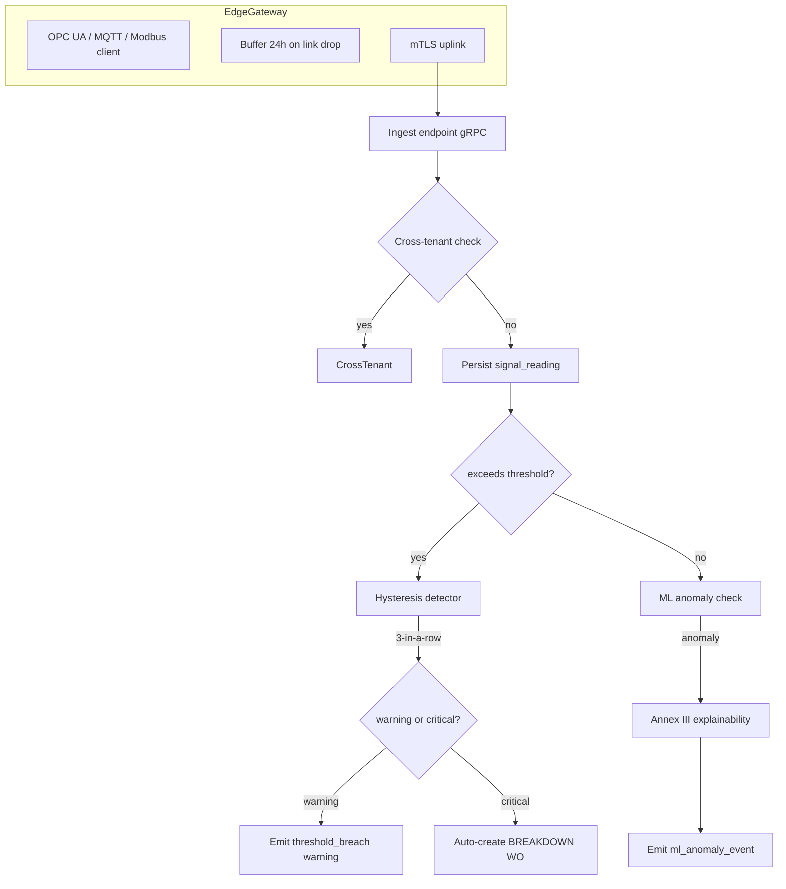

# IP-020: Condition-based maintenance with IoT signal ingestion (OPC UA, MQTT, Modbus)

## A. Intent

Implements **Condition-Based Maintenance (CBM)** — the predictive-maintenance trigger mechanism that fires work-orders when sensor readings cross thresholds, rather than on calendar / running-hours alone. The signal ingestion bridge consumes from industrial protocols: **OPC UA** (IEC 62541, the modern SCADA standard), **MQTT 5.0** (RFC-equivalent OASIS spec for IoT), **Modbus** (legacy PLC + RS-485/TCP), with optional **PROFIBUS/PROFINET** and **EtherNet/IP** bridges via edge gateways.

Mirrors SAP `PM-PRP` (Predictive Maintenance) submodule + SAP Plant Connectivity (PCo) which abstracts OPC UA / Modbus / proprietary PLC dialects; SAP transactions `IK11/IK12` for measuring point / measurement document; SAP Predictive Asset Insights (PAI) cloud for the ML-pipeline side. Industry-precedent equivalents: **IBM Maximo Application Suite — Monitor + Predict modules**, **Infor EAM Asset Performance Management**, **Oracle Fusion IoT Asset Monitoring**, **GE Digital APM Health Manager (Meridium)**, **PTC ThingWorx IoT Platform**, **Aveva PI System (formerly OSIsoft)**, **Honeywell Forge**, **Siemens MindSphere/Industrial IoT**. Hyperscaler analog: AWS IoT Core + IoT SiteWise + IoT Greengrass (edge); Azure IoT Hub + IoT Edge + Time Series Insights.

### A.1 Why CBM is non-trivial

1. **Protocol heterogeneity.** OPC UA is structured + namespaced; MQTT is topic-flat; Modbus is register-based numeric. Adapter layer normalizes to a canonical `SignalReading` shape.
2. **Sampling-rate variance.** OPC UA may push 100 Hz vibration data; MQTT smart-sensor may push 1/min. Aggregation per signal at the ingest layer (downsample to canonical 1Hz or per-event).
3. **Threshold-based triggering.** Each signal has thresholds (warning, critical) with hysteresis (3 consecutive readings) to avoid flap.
4. **ML-based anomaly detection.** Beyond static thresholds, an ML model (LSTM / autoencoder / Isolation Forest) flags anomalies. Per ADR-0257, AI substrate dispatch.
5. **Edge buffering.** Edge gateway buffers ≤ 24h locally during connectivity outage; replays on reconnect with `out_of_order=true` flag.
6. **Tenant isolation at edge.** Each edge gateway is tenant-scoped; cross-tenant sensor confusion is impossible by design.

## B. Acceptance criteria

- **AC-1:** Adapters for OPC UA, MQTT 5.0, Modbus TCP, Modbus RTU; all normalize to `SignalReading`.
- **AC-2:** `MeasuringPoint` per SAP IK11 mapping — `(tenant, equipment, measuring_point_id, characteristic)`.
- **AC-3:** Threshold-based trigger: 3-consecutive-readings hysteresis; warning + critical levels.
- **AC-4:** ML anomaly model dispatch per ADR-0257; explainability record per Annex III.
- **AC-5:** Edge buffer (≤24h) replayed with `out_of_order=true`; reordering on ingest.
- **AC-6:** WO auto-generation on critical threshold: `breakdown` type WO created via IP-009.
- **AC-7:** Tenant isolation at edge gateway: SPIFFE workload identity per ADR-0295.
- **AC-8:** Signal cardinality budget per ADR-0263 honored.
- **AC-9:** Cross-tenant signal rejected before persistence.
- **AC-10:** Audit events per §D-9.

## C. Verification

```bash
cargo test -p oya-plant-maintenance-cbm-domain -- opc_ua_adapter_normalizes_to_signal_reading
cargo test -p oya-plant-maintenance-cbm-domain -- mqtt5_adapter_normalizes
cargo test -p oya-plant-maintenance-cbm-domain -- modbus_tcp_adapter_normalizes
cargo test -p oya-plant-maintenance-cbm-domain -- threshold_hysteresis_3_consecutive
cargo test -p oya-plant-maintenance-cbm-domain -- ml_anomaly_explainability_emitted
cargo test -p oya-plant-maintenance-cbm-domain -- edge_buffer_24h_replay
cargo test -p oya-plant-maintenance-cbm-domain -- out_of_order_reordered_on_ingest
cargo test -p oya-plant-maintenance-cbm-domain -- critical_auto_creates_breakdown_wo
cargo test -p oya-plant-maintenance-cbm-domain -- edge_gateway_spiffe_tenant_isolated
cargo test -p oya-plant-maintenance-cbm-domain -- cardinality_budget_enforced
cargo test -p oya-plant-maintenance-cbm-domain -- cross_tenant_signal_rejected
```

## D. Detailed mechanics

### D-1. Data model

```sql
CREATE TABLE plant_maintenance.measuring_point (
    tenant_id       TEXT NOT NULL,
    point_id        TEXT NOT NULL,
    equipment_id    TEXT NOT NULL,
    characteristic  TEXT NOT NULL,        -- e.g., 'vibration_mm_s', 'temp_c', 'pressure_bar'
    protocol        TEXT NOT NULL CHECK (protocol IN ('opc_ua','mqtt5','modbus_tcp','modbus_rtu','profibus','profinet','ethernetip','synthetic')),
    sampling_rate_hz NUMERIC(8,3),
    warning_threshold NUMERIC(18,6),
    critical_threshold NUMERIC(18,6),
    direction       TEXT NOT NULL CHECK (direction IN ('high','low')),
    hysteresis_count INTEGER NOT NULL DEFAULT 3,
    ml_model_ref    TEXT,
    state           TEXT NOT NULL CHECK (state IN ('active','suspended','retired')),
    cardinality_budget_per_min INTEGER NOT NULL DEFAULT 60,
    residency_pack  TEXT NOT NULL,
    hlc             TEXT NOT NULL,
    PRIMARY KEY (tenant_id, point_id)
) PARTITION BY HASH (tenant_id);

CREATE TABLE plant_maintenance.signal_reading (
    tenant_id    TEXT NOT NULL,
    point_id     TEXT NOT NULL,
    sampled_at   TIMESTAMPTZ NOT NULL,
    value        NUMERIC(18,6) NOT NULL,
    unit         TEXT NOT NULL,
    quality      TEXT NOT NULL CHECK (quality IN ('good','uncertain','bad')),
    out_of_order BOOLEAN NOT NULL DEFAULT FALSE,
    edge_gateway TEXT,
    received_at  TIMESTAMPTZ NOT NULL DEFAULT now(),
    PRIMARY KEY (tenant_id, point_id, sampled_at)
) PARTITION BY RANGE (sampled_at);

CREATE TABLE plant_maintenance.threshold_breach (
    tenant_id    TEXT NOT NULL,
    point_id     TEXT NOT NULL,
    breach_kind  TEXT NOT NULL CHECK (breach_kind IN ('warning','critical')),
    breach_started_at TIMESTAMPTZ NOT NULL,
    breach_ended_at   TIMESTAMPTZ,
    triggering_wo_id  TEXT,           -- if auto-generated
    hlc          TEXT NOT NULL,
    decision_id  UUID NOT NULL,
    PRIMARY KEY (tenant_id, point_id, breach_started_at)
) PARTITION BY HASH (tenant_id);

CREATE TABLE plant_maintenance.ml_anomaly_event (
    tenant_id        TEXT NOT NULL,
    anomaly_id       TEXT NOT NULL,
    point_id         TEXT NOT NULL,
    detected_at      TIMESTAMPTZ NOT NULL,
    confidence       NUMERIC(5,4) NOT NULL,
    model_ref        TEXT NOT NULL,
    explainability_record_id UUID NOT NULL,
    triggered_wo_id  TEXT,
    PRIMARY KEY (tenant_id, anomaly_id)
) PARTITION BY HASH (tenant_id);
```

### D-2. Rust types

```rust
#[derive(Debug, Clone)]
pub struct SignalReading {
    pub tenant_id:    TenantId,
    pub point_id:     MeasuringPointId,
    pub sampled_at:   DateTime<Utc>,
    pub value:        Decimal,
    pub unit:         Unit,
    pub quality:      SignalQuality,
    pub out_of_order: bool,
    pub edge_gateway: Option<EdgeGatewayId>,
}

#[derive(Debug, Clone)]
pub enum SignalQuality { Good, Uncertain, Bad }

#[derive(Debug, Clone)]
pub struct MeasuringPoint {
    pub tenant_id:       TenantId,
    pub point_id:        MeasuringPointId,
    pub equipment_id:    EquipmentId,
    pub characteristic:  Characteristic,
    pub protocol:        SignalProtocol,
    pub sampling_rate_hz: Option<Decimal>,
    pub warning_threshold:  Option<Decimal>,
    pub critical_threshold: Option<Decimal>,
    pub direction:       ThresholdDirection,
    pub hysteresis_count: u8,
    pub ml_model_ref:    Option<MlModelRef>,
}

#[derive(Debug, Clone)]
pub enum SignalProtocol { OpcUa, Mqtt5, ModbusTcp, ModbusRtu, Profibus, Profinet, EtherNetIp, Synthetic }

#[derive(Debug, Clone)]
pub enum ThresholdDirection { High, Low }
```

### D-3. Threshold hysteresis

```rust
pub struct HysteresisDetector { window: VecDeque<bool>, n: u8 }

impl HysteresisDetector {
    pub fn new(n: u8) -> Self { Self { window: VecDeque::with_capacity(n as usize), n } }
    pub fn observe(&mut self, exceeds: bool) -> bool {
        if self.window.len() == self.n as usize { self.window.pop_front(); }
        self.window.push_back(exceeds);
        self.window.len() == self.n as usize && self.window.iter().all(|b| *b)
    }
}

pub fn exceeds(reading: &SignalReading, threshold: Decimal, dir: ThresholdDirection) -> bool {
    match dir {
        ThresholdDirection::High => reading.value > threshold,
        ThresholdDirection::Low  => reading.value < threshold,
    }
}
```

### D-4. OPC UA adapter

```rust
pub struct OpcUaAdapter { client: opcua::client::prelude::Client }

#[async_trait]
impl SignalAdapter for OpcUaAdapter {
    async fn subscribe(&self, point: &MeasuringPoint, tx: tokio::sync::mpsc::Sender<SignalReading>) -> Result<(), AdapterError> {
        let session = self.client.connect_to_endpoint(...)?;
        let subscription = session.create_subscription(/* publishing_interval_ms */ 100.0, ...)?;
        subscription.create_monitored_items(&[...], DataChangeFilter::None);
        loop {
            let dv = subscription.next_data_change().await?;
            let reading = SignalReading {
                tenant_id: point.tenant_id.clone(),
                point_id:  point.point_id.clone(),
                sampled_at: dv.source_timestamp.unwrap_or_else(Utc::now),
                value: Decimal::from_f64(dv.value.as_f64().unwrap_or(0.0)).unwrap_or_default(),
                unit:  point.characteristic.unit(),
                quality: SignalQuality::from_opc_ua(&dv.status),
                out_of_order: false,
                edge_gateway: Some(self.edge_gateway.clone()),
            };
            let _ = tx.send(reading).await;
        }
    }
}
```

### D-5. ML anomaly detection (per ADR-0257)

```rust
pub async fn ml_anomaly_check(ai: &AiSubstrateClient, reading: &SignalReading, point: &MeasuringPoint)
    -> Result<Option<MlAnomaly>, AiError>
{
    let Some(model_ref) = &point.ml_model_ref else { return Ok(None); };
    let resp = ai.infer_anomaly(InferRequest {
        tenant_id: reading.tenant_id.clone(),
        model_ref: model_ref.clone(),
        sample: AnomalySample::single(reading.value, reading.sampled_at),
        audience_tag: AudienceTag::SubstratePlantMaintenance,
    }).await?;
    if resp.is_anomaly && resp.confidence >= Decimal::from_str("0.85").unwrap() {
        // Emit Annex III explainability record
        ai.emit_explainability(ExplainabilityRecord {
            tenant_id: reading.tenant_id.clone(),
            classifier_decision: resp.into(),
            input_features: vec![reading.value.to_string()],
            model_ref: model_ref.clone(),
            audience_tag: AudienceTag::SubstratePlantMaintenance,
        }).await?;
        Ok(Some(MlAnomaly { confidence: resp.confidence, model_ref: model_ref.clone() }))
    } else { Ok(None) }
}
```

### D-6. Workflow



### D-7. AsyncAPI envelopes

| Channel | Trigger | Consumers |
|---|---|---|
| `plant-maintenance.signal.reading.v1` | every reading | analytics, time-series store |
| `plant-maintenance.signal.equipment-running.v1` | resume from off | downtime auto-close (IP-006) |
| `plant-maintenance.signal.threshold-breached-warning.v1` | warning | dashboards |
| `plant-maintenance.signal.threshold-breached-critical.v1` | critical | WO breakdown auto-creator |
| `plant-maintenance.signal.ml-anomaly.v1` | ML alert | reliability engineer, dashboards |
| `plant-maintenance.signal.edge-gateway-disconnected.v1` | gateway link drop | ops |
| `plant-maintenance.signal.edge-gateway-reconnected.v1` | gateway link restored | ops |

### D-8. SLO targets

| Operation | p50 | p95 | p99 |
|---|---|---|---|
| Signal ingest (per reading) | 5 ms | 12 ms | 25 ms |
| Threshold check (in-memory hysteresis) | 0.3 ms | 0.8 ms | 2 ms |
| ML anomaly check (cached model) | 28 ms | 65 ms | 130 ms |
| Auto-WO creation on critical | 60 ms | 140 ms | 280 ms |
| Edge buffer replay (24h, 100k readings) | 120 s | 300 s | 600 s |

### D-9. Audit-event registry

| Event class | Severity | Emitter |
|---|---|---|
| `EVT-PLANT_MAINTENANCE-CBM-SIGNAL_INGESTED` | informational | adapter |
| `EVT-PLANT_MAINTENANCE-CBM-THRESHOLD_BREACHED_WARNING` | warning | usecase |
| `EVT-PLANT_MAINTENANCE-CBM-THRESHOLD_BREACHED_CRITICAL` | critical | usecase |
| `EVT-PLANT_MAINTENANCE-CBM-AUTO_WO_CREATED` | informational | usecase |
| `EVT-PLANT_MAINTENANCE-CBM-ML_ANOMALY_DETECTED` | informational | usecase |
| `EVT-PLANT_MAINTENANCE-CBM-EXPLAINABILITY_EMITTED` | informational | usecase |
| `EVT-PLANT_MAINTENANCE-CBM-EDGE_BUFFER_REPLAY_STARTED` | informational | adapter |
| `EVT-PLANT_MAINTENANCE-CBM-CARDINALITY_BUDGET_EXCEEDED` | warning | adapter |
| `EVT-PLANT_MAINTENANCE-CBM-CROSS_TENANT_REJECTED` | security | adapter |

### D-10. Failure modes & recovery

1. **`EdgeGatewayOffline > 24h`** — local buffer overflows. Oldest readings dropped; integrity-log captures gap; replay on reconnect with `gap_detected` audit. Runbook `runbooks/edge-buffer-overflow.md`.
2. **`SignalFlapping`** — value oscillates around threshold. Hysteresis suppresses; counter `signal_flap_total` increments. Runbook `runbooks/signal-flap.md`.
3. **`MlModelDegraded`** — anomaly model returning low-confidence drift. Reliability engineer notified; re-train pipeline triggered. Runbook `runbooks/ml-model-drift.md`.
4. **`OutOfOrderBacklog`** — late readings push hysteresis state back. Window recomputed; explicit re-evaluation. Runbook `runbooks/out-of-order-replay.md`.
5. **`CardinalityBudgetExceeded`** — point flooding > budget. Adapter back-pressures; throttles; alarm. Runbook `runbooks/cardinality-exceeded.md`.
6. **`AutoWoStorm`** — many critical breaches simultaneously (plant trip). Rate-limit auto-WO creation per equipment-class (max 1/hour); aggregate into one master WO. Runbook `runbooks/auto-wo-storm.md`.

### D-11. Migration notes

Source vendor surfaces:

- **SAP PCo**: configurations for OPC UA + Modbus + per-PLC dialect.
- **SAP Predictive Asset Insights**: model artifacts via REST.
- **GE Digital APM Health Manager**: `MI_HEALTH_INDICATOR` family.
- **Aveva PI System**: PI Web API → time-series export.
- **PTC ThingWorx**: REST/MQTT export from Composer.

### D-12. Cross-µservice handoffs

| Direction | Counterparty | Surface |
|---|---|---|
| inbound | edge-gateway (per-tenant) | gRPC ingest with SPIFFE |
| outbound | `downtime-window` (IP-006) | AsyncAPI `signal.equipment-running.v1` (auto-close) |
| outbound | `work-order` (IP-009) | AsyncAPI `signal.threshold-breached-critical.v1` → BREAKDOWN WO creator |
| outbound | `intelligence` (AI substrate) | gRPC anomaly inference + explainability emit |
| outbound | `ontology` | measuring-point delta |
| outbound | `audit-chain` | per ADR-0263 |

## E. Failure-mode summary

See D-10.

## F. Migration / rollback

Per-protocol feature flag (`plant_maintenance_cbm_opcua_v1`, etc.). ML anomaly check disable-able (`plant_maintenance_cbm_ml_v1`).

## G. References

- ADR-0105, ADR-0244, ADR-0252, ADR-0257 (AI substrate + explainability), ADR-0263, ADR-0294, ADR-0295 (SPIFFE), ADR-0297, ADR-0314..0316.
- IEC 62541 (OPC UA), MQTT 5.0 OASIS spec, Modbus RTU/TCP spec.
- ISO 17359 (Condition monitoring and diagnostics).
- SAP PCo + SAP Predictive Asset Insights documentation.
- Benchmarks: SAP PCo + PAI | IBM Maximo Monitor+Predict | Infor EAM APM | Oracle Fusion IoT | GE Digital APM | PTC ThingWorx | Aveva PI | Honeywell Forge | Siemens MindSphere.

## H. Out of scope

- Predictive model training (lives in intelligence µservice), edge-gateway provisioning (lives in cloud-iac).

— end IP-020 —
